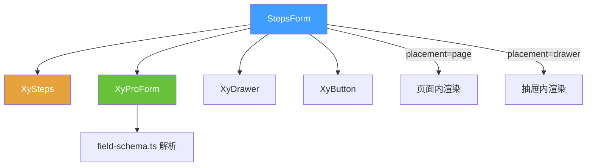

# 87 StepsForm 分步表单

> 导读：将"基础信息 -> 补充配置 -> 提交确认"这类多阶段录入流程拉成稳定骨架，支持页面内和抽屉内两种承载方式。

## 设计哲学

### Pro 组件与基础组件的区别

手动编排分步表单，开发者需要为每个步骤维护独立的表单实例、校验逻辑、步骤切换守卫和提交编排。StepsForm 将这些收口为 `steps` 数组 + `model` 对象的配置驱动范式：

- **步骤声明**：每个 `StepsFormStep` 包含 `key`、`title`、`description` 和 `schema`，StepsForm 自动为当前步骤渲染 ProForm。
- **步骤守卫**：`next()` 自动校验当前步骤表单，校验通过才允许前进。
- **提交守卫**：最后一步的提交按钮自动校验当前步骤，校验通过后派发 `submit` 事件。

StepsForm 不需要开发者手动管理"第几步该显示哪些字段"——这一切由 `active` 索引 + `steps[active].schema` 自动推导。

### ProFieldSchema 的核心理念

每个 `StepsFormStep` 的 `schema` 是标准的 `ProFieldSchema[]`。StepsForm 将 `steps[active].schema` 透传给内部 ProForm，字段解析逻辑完全复用 `field-schema.ts`。

关键设计：所有步骤共享同一个 `model` 对象。这意味着：
- 前一步填写的值在后一步的 `hidden` / `disabled` 函数中可直接访问。
- 最终提交时只需一次 `cloneProValue(model)` 即可获得全部步骤的数据快照。

### 与同类 Pro 组件库的差异化

- **双承载模式**：`placement="page"` 在页面内渲染步骤条 + 表单，`placement="drawer"` 在抽屉内运行同一套步骤流。切换只需改一个属性。
- **步骤粒度 schema**：每个步骤有独立的 `schema`，而非全量 schema + 步骤过滤。这避免了"步骤 A 的字段在步骤 B 也要声明 hidden"的冗余。
- **不内置请求**：StepsForm 只负责步骤流转和校验守卫，数据请求交由页面层处理。

## 源码架构

### 文件结构

```
steps-form/
├── index.ts                  # withInstall 导出
├── src/
│   ├── steps-form.ts          # StepsFormStep / StepsFormProps / StepsFormInstance 类型定义
│   └── steps-form.vue         # 组件实现
└── __tests__/
    └── steps-form.spec.ts
```

### 组件关系图



### 核心 type 定义

**StepsFormStep**——单步骤声明：

```ts
interface StepsFormStep {
  key: string;                    // 步骤唯一标识
  title: string;                  // 步骤标题
  description?: string;           // 步骤描述
  schema?: ProFieldSchema[];      // 该步骤的字段 schema
}
```

**StepsFormProps**：

```ts
interface StepsFormProps {
  model: Record<string, unknown>;      // 共享数据对象
  steps: StepsFormStep[];              // 步骤数组
  placement?: 'page' | 'drawer';       // 承载方式，默认 'page'
  open?: boolean;                      // 抽屉模式下的可见性
  title?: string;                      // 抽屉标题
  active?: number;                     // 受控当前步骤索引
  defaultActive?: number;              // 非受控初始步骤，默认 0
  loading?: boolean;
  readonly?: boolean;
  readonlyDescriptionsProps?: Omit<DescriptionsProps, 'items' | 'title' | 'extra'>;
  submitting?: boolean;
  nextText?: string;                   // 默认 '下一步'
  prevText?: string;                   // 默认 '上一步'
  submitText?: string;                 // 默认 '提交'
  drawerProps?: Omit<Partial<DrawerProps>, 'modelValue' | 'title'>;
}
```

**StepsFormInstance**：

```ts
interface StepsFormInstance {
  next: () => Promise<void>;
  prev: () => Promise<void>;
  submit: () => Promise<void>;
  close: () => void;
}
```

## 核心实现

### 步骤流转与校验守卫

StepsForm 的 `next()` 和 `prev()` 方法内置校验守卫：

```ts
async function next() {
  const valid = await formRef.value?.validate();
  if (!valid || activeBridge.value >= props.steps.length - 1) {
    return;  // 校验失败或已是最后一步，阻止前进
  }
  const nextIndex = activeBridge.value + 1;
  updateActive(nextIndex);
  emit('next', nextIndex);
}

async function prev() {
  if (activeBridge.value <= 0) {
    return;  // 已是第一步，阻止后退
  }
  const nextIndex = activeBridge.value - 1;
  updateActive(nextIndex);
  emit('prev', nextIndex);
}
```

关键设计：`next()` 校验失败时不前进，`prev()` 不校验（允许回退修改）。最终 `submit()` 会再次校验当前步骤。

### active 双轨受控协议

与 SearchForm 的 `collapsed` 类似，`active` 支持受控和非受控两种模式：

```mermaid
graph LR
  A[active prop] -->|受控| B[activeBridge]
  C[innerActive] -->|非受控| B
  B --> D[currentStep = steps[active]]
  D --> E[ProForm schema = currentStep.schema]
```

- 若 `props.active` 为 `number`，则完全受控，组件只派发 `update:active` 和 `step-change`。
- 若 `props.active` 为 `undefined`，则组件内部 `innerActive` 自管理。

### 双承载模式

StepsForm 通过 `placement` 属性切换渲染路径：

**页面模式**（`placement="page"`）：

```html
<div class="xy-steps-form">
  <xy-steps :active="activeBridge" :items="stepItems" />
  <xy-pro-form :schema="currentStep?.schema ?? []" ... />
  <div class="xy-steps-form__footer">
    <!-- 上一步 / 下一步 / 提交 -->
  </div>
</div>
```

**抽屉模式**（`placement="drawer"`）：

```html
<xy-drawer :model-value="open" :title="resolvedTitle" :size="680">
  <div class="xy-steps-form__body">
    <xy-steps :active="activeBridge" :items="stepItems" />
    <xy-pro-form :schema="currentStep?.schema ?? []" ... />
    <div class="xy-steps-form__footer">
      <!-- 上一步 / 下一步 / 提交 -->
    </div>
  </div>
  <template #footer>
    <xy-button @click="handleCancel">关闭</xy-button>
  </template>
</xy-drawer>
```

两种模式的步骤条、表单和动作区逻辑完全一致，只是外层容器不同。

### 只读模式

当 `readonly=true` 时，内部 ProForm 自动切换为 Descriptions 只读展示。这意味着分步查看流程（如审批详情）无需为每个步骤单独配置 `readonly`。

## API 参考

### Props

| 属性 | 说明 | 类型 | 默认值 |
| --- | --- | --- | --- |
| `model` | 共享表单数据对象 | `Record<string, unknown>` | — |
| `steps` | 步骤数组 | `StepsFormStep[]` | `[]` |
| `placement` | 承载方式 | `'page' \| 'drawer'` | `'page'` |
| `open` | 抽屉模式下是否打开 | `boolean` | `false` |
| `title` | 抽屉标题 | `string` | `''` |
| `active` | 当前步骤索引（受控） | `number` | `undefined` |
| `default-active` | 初始步骤索引（非受控） | `number` | `0` |
| `loading` | 加载态 | `boolean` | `false` |
| `readonly` | 只读模式 | `boolean` | `false` |
| `readonly-descriptions-props` | 只读模式 Descriptions 属性 | `Omit<DescriptionsProps, 'items' \| 'title' \| 'extra'>` | `{}` |
| `submitting` | 提交中态 | `boolean` | `false` |
| `next-text` | 下一步按钮文案 | `string` | `'下一步'` |
| `prev-text` | 上一步按钮文案 | `string` | `'上一步'` |
| `submit-text` | 提交按钮文案 | `string` | `'提交'` |
| `drawer-props` | 透传给 xy-drawer 的属性 | `Omit<Partial<DrawerProps>, 'modelValue' \| 'title'>` | `{}` |

### Emits

| 事件 | 说明 | 参数 |
| --- | --- | --- |
| `update:active` | 步骤索引变化（v-model） | `(value: number)` |
| `update:open` | 抽屉可见性变化 | `(value: boolean)` |
| `step-change` | 步骤切换 | `(value: number)` |
| `next` | 前进到下一步 | `(value: number)` |
| `prev` | 回退到上一步 | `(value: number)` |
| `submit` | 最终提交 | `(payload: Record<string, unknown>)` |
| `cancel` | 取消操作 | `()` |
| `closed` | 抽屉关闭后 | `()` |

### Slots

| 插槽 | 说明 | 作用域参数 |
| --- | --- | --- |
| `default` | 自定义表单内容 | `{ step, active }` |
| `footer` | 自定义抽屉底部 | — |

### Exposes

| 方法 | 说明 | 返回值 |
| --- | --- | --- |
| `next()` | 前进到下一步（含校验） | `Promise<void>` |
| `prev()` | 回退到上一步 | `Promise<void>` |
| `submit()` | 触发最终提交 | `Promise<void>` |
| `close()` | 关闭抽屉 | `void` |

## 样式系统

### BEM 类名

| 类名 | 说明 |
| --- | --- |
| `.xy-steps-form` | 根容器 |
| `.xy-steps-form--drawer` | 抽屉模式修饰符 |
| `.xy-steps-form__body` | 抽屉内主体区域 |
| `.xy-steps-form__footer` | 步骤动作区（上一步/下一步/提交） |
| `.xy-steps-form__drawer-footer` | 抽屉底部关闭区 |

### CSS 变量引用

StepsForm 使用极少的独立样式，主要继承 XySteps 和 ProForm 的变量。

## 小结

1. **步骤粒度 schema**：每个步骤有独立的 `schema`，而非全量 schema + 步骤过滤，避免跨步 hidden 冗余。
2. **双承载模式**：`placement="page" | "drawer"` 一行切换，步骤条、表单、动作区逻辑完全一致。
3. **校验守卫内置**：`next()` 自动校验当前步骤，`prev()` 允许无校验回退，最终 `submit()` 再次校验，覆盖分步录入的核心交互模式。