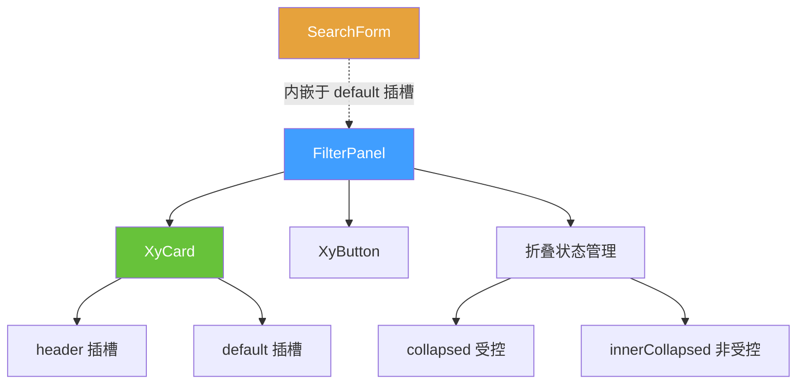
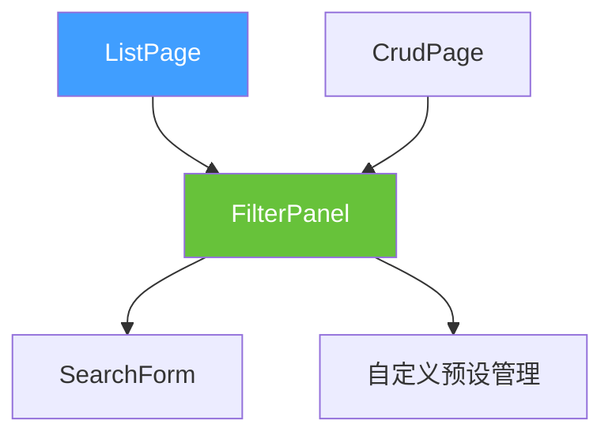

# 88 FilterPanel 筛选面板

> 导读：将筛选区域的头部、折叠行为和动作区收成统一卡片容器——与 SearchForm 互补，SearchForm 主管筛选字段编排，FilterPanel 主管筛选区域容器编排。

## 设计哲学

### Pro 组件与基础组件的区别

手动用 `xy-card` 包裹筛选项，开发者需要自行处理卡片头部标题、折叠/展开切换、筛选动作区排列等重复布局。FilterPanel 将这些收口为 `title`、`collapsed`、`collapsible` 三个声明式配置。

FilterPanel 与 SearchForm 的分工是：
- **SearchForm**：管筛选字段编排（schema、栅格、查询/重置按钮）。
- **FilterPanel**：管筛选区域容器编排（卡片头部、折叠/展开、动作区）。

二者可以组合使用：FilterPanel 作为外层容器，SearchForm 作为内层筛选项。

### ProFieldSchema 的核理工念

FilterPanel 不直接消费 `ProFieldSchema`。它是一个**纯容器组件**，只负责：
1. 卡片头部（标题 + 描述 + 折叠切换）。
2. 内容区的显隐（折叠/展开）。
3. 底部动作区承载。

这种定位意味着 FilterPanel 可以承载任何筛选内容——SearchForm、自定义筛选项、甚至纯文本说明。

### 与同类 Pro 组件库的差异化

- **纯容器定位**：FilterPanel 不内建字段 schema、查询派发和预设管理。真正的查询行为和筛选协议由外层 SearchForm 或页面层负责。
- **与 SearchForm 互补而非替代**：FilterPanel 主管"筛选区域应该长什么样"，SearchForm 主管"筛选字段怎么编排"。
- **轻量折叠协议**：只支持 `collapsed` 的受控/非受控双轨切换，不涉及 SearchForm 的 `collapsible` 字段级折叠。

## 源码架构

### 文件结构

```
filter-panel/
├── index.ts                  # withInstall 导出
├── src/
│   ├── filter-panel.ts        # FilterPanelProps 类型定义
│   └── filter-panel.vue       # 组件实现
└── __tests__/
    └── filter-panel.spec.ts
```

### 组件关系图



### 核心 type 定义

**FilterPanelProps**：

```ts
interface FilterPanelProps {
  title?: string;              // 面板标题
  description?: string;        // 面板描述
  collapsed?: boolean;         // 受控折叠状态
  defaultCollapsed?: boolean;  // 非受控初始折叠态，默认 false
  collapsible?: boolean;       // 是否可折叠，默认 true
}
```

与 SearchForm 的 `SearchFormProps` 相比，FilterPanelProps 极为精简——只有标题、描述和折叠三个配置项。这是因为 FilterPanel 的职责是容器编排，字段编排由内嵌的 SearchForm 或自定义内容承担。

## 核心实现

### 折叠机制

与 SearchForm 的 `collapsed` 双轨受控协议一致：

```ts
const innerCollapsed = ref(props.defaultCollapsed);
const collapsedBridge = computed(() => props.collapsed ?? innerCollapsed.value);

function toggleCollapse() {
  const nextValue = !collapsedBridge.value;
  if (props.collapsed === undefined) {
    innerCollapsed.value = nextValue;
  }
  emit('update:collapsed', nextValue);
  emit('toggle', nextValue);
}
```

- 若 `props.collapsed` 为 `boolean`，完全受控。
- 若 `props.collapsed` 为 `undefined`，组件内部 `innerCollapsed` 自管理。

内容区通过 `v-show` 控制显隐（而非 `v-if`），避免折叠时销毁内嵌组件状态：

```html
<div v-show="!collapsedBridge" class="xy-filter-panel__body">
  <slot />
</div>
```

### 卡片头部布局

FilterPanel 将 `xy-card` 的 `header` 插槽重构为三区域布局：

```html
<template #header>
  <div class="xy-filter-panel__header">
    <div class="xy-filter-panel__heading">
      <div class="xy-filter-panel__title">{{ title }}</div>
      <p class="xy-filter-panel__description">{{ description }}</p>
    </div>
    <div class="xy-filter-panel__meta">
      <slot name="meta" />
      <xy-button v-if="collapsible" text @click="toggleCollapse">
        {{ collapsedBridge ? '展开筛选' : '收起筛选' }}
      </xy-button>
    </div>
  </div>
</template>
```

头部左侧放标题和描述，右侧放自定义 meta 内容和折叠切换按钮。

### 与 SearchForm 组合使用

FilterPanel 的 `default` 插槽内嵌 SearchForm 是最常见的组合模式：

```vue
<xy-filter-panel title="高级筛选" :collapsed="isCollapsed">
  <xy-search-form :model="filterModel" :fields="filterFields" @search="handleSearch" />
  <template #actions>
    <xy-button @click="saveFilter">保存筛选条件</xy-button>
  </template>
</xy-filter-panel>
```

FilterPanel 负责卡片容器和折叠行为，SearchForm 负责字段编排和查询派发。

### 与 ListPage / CrudPage 的集成

FilterPanel 在 ListPage 和 CrudPage 中作为搜索区的容器：



ListPage/CrudPage 会自动将 FilterPanel 的 `collapsed` 状态与 SearchForm 的 `collapsed` 状态联动——折叠 FilterPanel 时同步折叠 SearchForm 的更多筛选项。

### 独立使用场景

FilterPanel 也可以独立于 SearchForm 使用，承载任意筛选内容：

```vue
<xy-filter-panel title="时间范围" collapsible>
  <xy-date-picker v-model="dateRange" type="daterange" />
  <xy-radio-group v-model="granularity">
    <xy-radio value="day">按天</xy-radio>
    <xy-radio value="week">按周</xy-radio>
    <xy-radio value="month">按月</xy-radio>
  </xy-radio-group>
</xy-filter-panel>
```

这种灵活性源于 FilterPanel 的纯容器定位——它不关心内容是什么，只提供头部、折叠和动作区。

## API 参考

### Props

| 属性 | 说明 | 类型 | 默认值 |
| --- | --- | --- | --- |
| `title` | 面板标题 | `string` | `''` |
| `description` | 面板描述 | `string` | `''` |
| `collapsed` | 是否折叠（受控） | `boolean` | `undefined` |
| `default-collapsed` | 默认是否折叠（非受控） | `boolean` | `false` |
| `collapsible` | 是否可折叠 | `boolean` | `true` |

### Emits

| 事件 | 说明 | 参数 |
| --- | --- | --- |
| `update:collapsed` | 折叠状态变化（v-model） | `(value: boolean)` |
| `toggle` | 折叠切换 | `(value: boolean)` |

### Slots

| 插槽 | 说明 |
| --- | --- |
| `default` | 面板内容区（通常内嵌 SearchForm） |
| `meta` | 头部右侧元信息区 |
| `actions` | 底部动作区 |

FilterPanel 不定义 Exposes——它是一个纯容器组件，没有需要命令式调用的方法。

## 样式系统

### BEM 类名

| 类名 | 说明 |
| --- | --- |
| `.xy-filter-panel__header` | 卡片头部（标题 + meta） |
| `.xy-filter-panel__heading` | 标题组（标题 + 描述） |
| `.xy-filter-panel__title` | 标题文本 |
| `.xy-filter-panel__description` | 描述文本 |
| `.xy-filter-panel__meta` | 头部右侧元信息区 |
| `.xy-filter-panel__body` | 内容区（折叠时 `v-show` 隐藏） |
| `.xy-filter-panel__footer` | 底部动作区 |

### CSS 变量引用

| 变量 | 用途 |
| --- | --- |
| `--xy-text-secondary` | 描述文字色 |

FilterPanel 的样式极简，大部分视觉效果由 `xy-card` 提供。

## 小结

1. **纯容器定位**：FilterPanel 不消费 schema、不派发查询事件，只负责筛选区域的容器编排（标题、折叠、动作区）。
2. **与 SearchForm 互补**：FilterPanel 管"筛选区域应该长什么样"，SearchForm 管"筛选字段怎么编排"，二者组合使用覆盖高级筛选场景。
3. **v-show 折叠**：使用 `v-show` 而非 `v-if` 控制内容区显隐，避免折叠时销毁内嵌组件状态。