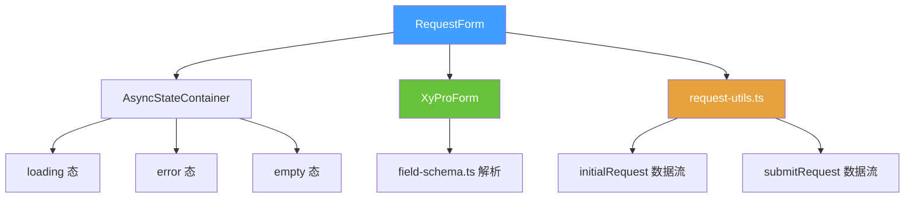
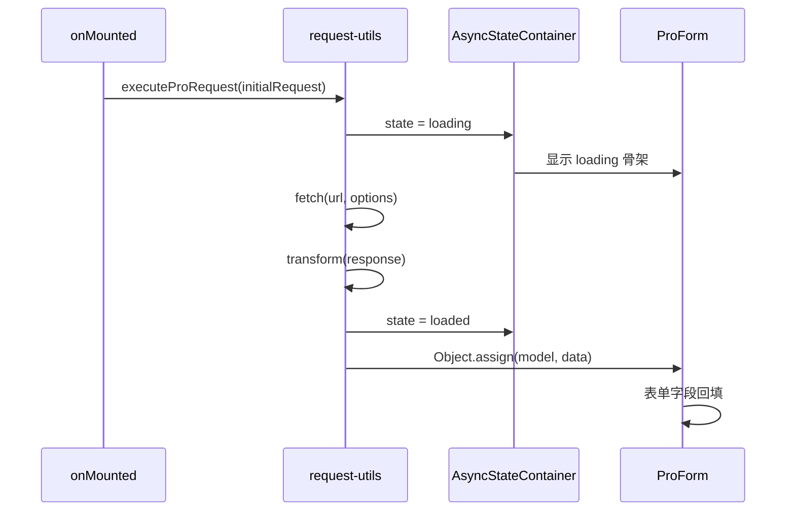
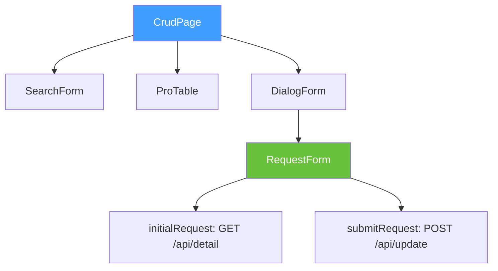

# 89 RequestForm 请求表单

> 导读：在 ProForm 外包裹请求生命周期——自动发起 initialRequest 回填表单、submitRequest 提交数据、AsyncStateContainer 管理加载态，一行配置即可完成"拉取 -> 编辑 -> 提交"数据流。

## 设计哲学

### Pro 组件与基础组件的区别

ProForm 只负责"把 schema 渲染成表单"，不关心数据从哪来、往哪去。开发者需要手动在 `onMounted` 里请求数据回填、在 `submit` 事件里发起提交请求、管理 `loading` / `submitting` 状态。RequestForm 将这些请求编排收口为两个声明式配置：

- **initialRequest**：打开时自动请求数据，响应值自动回填到 `model`。
- **submitRequest**：提交时自动发起请求，传入当前 `model` 快照。

RequestForm 是 Pro 表单组中**唯一内置请求能力**的组件，体现了"表单编排"和"数据流编排"的职责分离——ProForm 管前者，RequestForm 管后者。

### ProFieldSchema 的核心理念

RequestForm 不直接消费 schema，而是将 `schema`、`model`、`title` 等属性透传给内部 ProForm。RequestForm 的职责是**请求生命周期编排**，字段解析完全委托给 ProForm + field-schema.ts。

这种分层意味着：
- 没有请求需求的表单直接用 ProForm。
- 有"拉取 -> 编辑 -> 提交"数据流的表单用 RequestForm。
- 二者可以随时切换，无需调整 schema。

### 与同类 Pro 组件库的差异化

- **请求配置声明式**：`initialRequest` / `submitRequest` 是声明式配置，而非命令式回调。组件自动管理 `loading` / `submitting` 状态和错误处理。
- **AsyncStateContainer 集成**：initialRequest 的加载态由 `AsyncStateContainer` 统一管理，提供一致的 loading / error / empty 状态展示。
- **与 request-utils 协议一致**：`initialRequest` 和 `submitRequest` 的返回值协议与 `request-utils.ts` 的 `ProRequestConfig` 完全对齐。

## 源码架构

### 文件结构

```
request-form/
├── index.ts                  # withInstall 导出
├── src/
│   ├── request-form.ts        # RequestFormProps / RequestFormInstance 类型定义
│   └── request-form.vue       # 组件实现
└── __tests__/
    └── request-form.spec.ts
```

### 组件关系图



### 核心 type 定义

**ProRequestConfig**——请求配置（来自 `request-utils.ts`）：

```ts
interface ProRequestConfig<T = unknown> {
  url: string;                           // 请求地址
  method?: 'GET' | 'POST' | 'PUT' | 'DELETE' | 'PATCH';
  headers?: Record<string, string>;
  params?: Record<string, unknown>;       // URL 参数（GET 场景）
  data?: Record<string, unknown>;         // 请求体（POST/PUT 场景）
  transform?: (response: unknown) => T;   // 响应转换
  onSuccess?: (data: T) => void;
  onError?: (error: Error) => void;
}
```

**RequestFormProps**：

```ts
interface RequestFormProps {
  // ProForm 属性（全部透传）
  title?: string;
  description?: string;
  model: Record<string, unknown>;
  schema?: ProFieldSchema[];
  rules?: FormRules;
  labelWidth?: string | number;
  labelPosition?: 'left' | 'top';
  size?: ComponentSize;
  columns?: number;
  loading?: boolean;
  readonly?: boolean;
  submitting?: boolean;
  submitText?: string;
  resetText?: string;
  showSubmit?: boolean;
  showReset?: boolean;

  // RequestForm 独有属性
  initialRequest?: ProRequestConfig;      // 初始请求配置
  submitRequest?: ProRequestConfig;       // 提交请求配置
  autoRequest?: boolean;                  // 是否自动发起 initialRequest，默认 true
}
```

**RequestFormInstance**：

```ts
interface RequestFormInstance {
  validate: () => Promise<boolean>;
  submit: () => Promise<boolean>;
  reset: (prop?: FormProp | FormProp[]) => void;
  clearValidate: (prop?: FormProp | FormProp[]) => void;
  fetchInitialData: () => Promise<void>;  // 手动触发 initialRequest
}
```

## 核心实现

### initialRequest 数据流

当 `autoRequest=true`（默认）时，RequestForm 在 `onMounted` 自动发起 `initialRequest`：



响应数据通过 `transform` 函数转换为 `model` 格式，然后 `Object.assign` 回填：

```ts
async function fetchInitialData() {
  if (!props.initialRequest) return;
  try {
    const data = await executeProRequest(props.initialRequest);
    Object.assign(props.model, data);
  } catch (error) {
    emit('request-error', error);
  }
}
```

### submitRequest 数据流

ProForm 派发 `submit` 事件后，RequestForm 拦截并注入 `submitRequest`：

```ts
async function handleSubmit(payload: Record<string, unknown>) {
  if (!props.submitRequest) {
    emit('submit', payload);
    return;
  }

  innerSubmitting.value = true;
  try {
    const config = {
      ...props.submitRequest,
      data: { ...props.submitRequest.data, ...payload },
    };
    const result = await executeProRequest(config);
    emit('submit-success', result);
  } catch (error) {
    emit('submit-error', error);
  } finally {
    innerSubmitting.value = false;
  }
}
```

关键设计：`submitRequest.data` 与 `payload` 合并，允许在请求配置中预设固定参数。

### request-utils 的数据请求机制

`request-utils.ts` 提供了统一的请求执行器：

```ts
async function executeProRequest<T = unknown>(config: ProRequestConfig<T>): Promise<T> {
  const { url, method = 'GET', headers, params, data, transform } = config;

  const fetchOptions: RequestInit = {
    method,
    headers: { 'Content-Type': 'application/json', ...headers },
  };

  let requestUrl = url;
  if (method === 'GET' && params) {
    const searchParams = new URLSearchParams(
      Object.entries(params).reduce((acc, [k, v]) => ({ ...acc, [k]: String(v) }), {})
    );
    requestUrl += `?${searchParams.toString()}`;
  }

  if (method !== 'GET' && data) {
    fetchOptions.body = JSON.stringify(data);
  }

  const response = await fetch(requestUrl, fetchOptions);
  if (!response.ok) throw new Error(`Request failed: ${response.status}`);

  const json = await response.json();
  return transform ? transform(json) : json;
}
```

这个执行器是 Pro 表单组请求能力的底层实现，RequestForm 是其最直接的消费者。

### 组件间组合方式

RequestForm 在实际业务中的典型组合：



在 CrudPage 中，编辑弹窗内的表单用 RequestForm 包装，实现"打开弹窗 → 自动拉取详情 → 编辑 → 提交更新"的完整数据流。

## API 参考

### Props

继承 ProFormProps 的全部属性，增加请求相关配置：

| 属性 | 说明 | 类型 | 默认值 |
| --- | --- | --- | --- |
| `initial-request` | 初始请求配置 | `ProRequestConfig` | `undefined` |
| `submit-request` | 提交请求配置 | `ProRequestConfig` | `undefined` |
| `auto-request` | 是否自动发起 initialRequest | `boolean` | `true` |
| `title` | 表单标题 | `string` | `''` |
| `description` | 表单描述 | `string` | `''` |
| `model` | 表单数据对象 | `Record<string, unknown>` | — |
| `schema` | 字段 schema 数组 | `ProFieldSchema[]` | `[]` |
| `rules` | 表单校验规则 | `FormRules` | `{}` |
| `label-width` | 标签宽度 | `string \| number` | `'112px'` |
| `label-position` | 标签位置 | `'left' \| 'top'` | `'top'` |
| `columns` | 栅格列数 | `number` | `2` |
| `readonly` | 只读展示模式 | `boolean` | `false` |
| `submit-text` | 提交按钮文案 | `string` | `'保存'` |
| `show-submit` | 是否显示提交按钮 | `boolean` | `true` |

### Emits

继承 ProForm 的全部事件，增加请求相关事件：

| 事件 | 说明 | 参数 |
| --- | --- | --- |
| `submit` | 提交（无 submitRequest 时直接派发） | `(payload: Record<string, unknown>)` |
| `submit-success` | submitRequest 成功 | `(data: unknown)` |
| `submit-error` | submitRequest 失败 | `(error: Error)` |
| `request-error` | initialRequest 失败 | `(error: Error)` |
| `reset` | 重置后派发 | `(payload: Record<string, unknown>)` |

### Slots

继承 ProForm 的全部插槽。

### Exposes

| 方法 | 说明 | 返回值 |
| --- | --- | --- |
| `validate()` | 校验表单 | `Promise<boolean>` |
| `submit()` | 触发提交 | `Promise<boolean>` |
| `reset(prop?)` | 重置字段 | `void` |
| `clearValidate(prop?)` | 清除校验 | `void` |
| `fetchInitialData()` | 手动触发 initialRequest | `Promise<void>` |

## 样式系统

### BEM 类名

RequestForm 不定义独立的 BEM 类名，完全复用 ProForm 的样式。

### CSS 变量引用

继承 ProForm 的全部 CSS 变量，无独立变量。

## 小结

1. **请求生命周期编排**：`initialRequest` + `submitRequest` 两个声明式配置覆盖"拉取 -> 编辑 -> 提交"数据流，自动管理 loading / submitting 状态。
2. **请求与表单职责分离**：ProForm 管字段编排，RequestForm 管数据流编排，二者可以随时切换，无需调整 schema。
3. **request-utils 协议一致**：RequestForm 的请求配置与 `request-utils.ts` 的 `ProRequestConfig` 完全对齐，保证跨组件请求行为一致性。