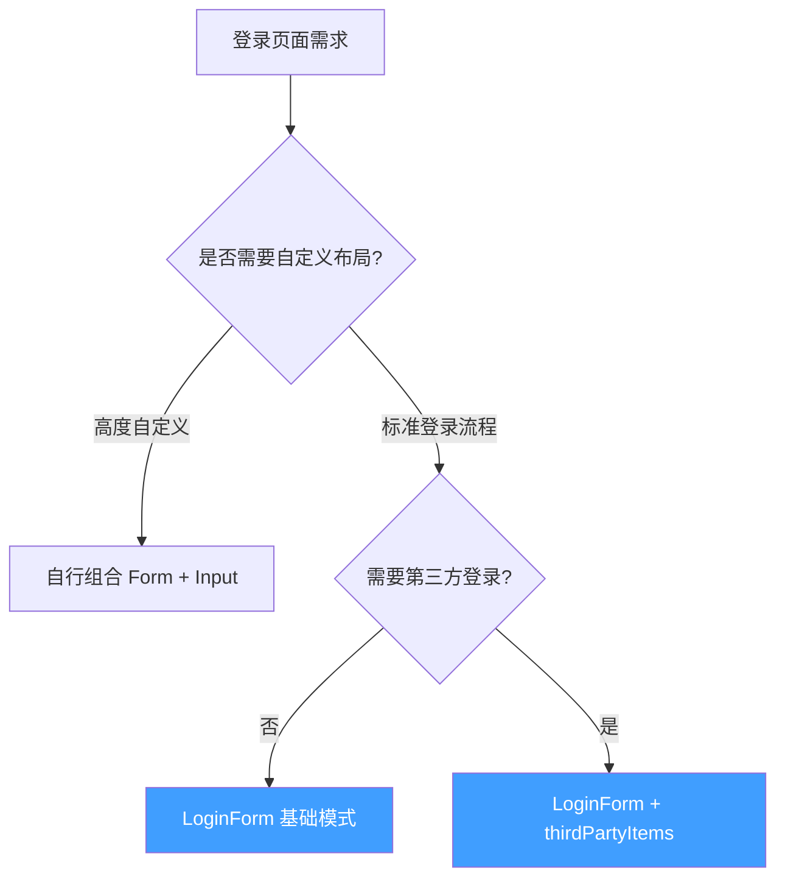
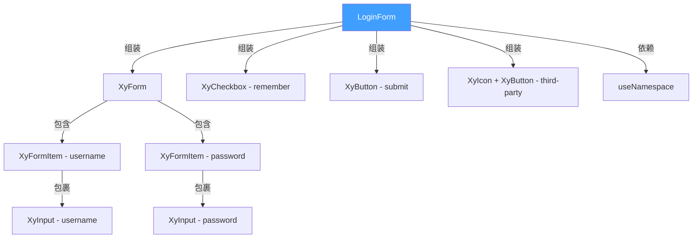
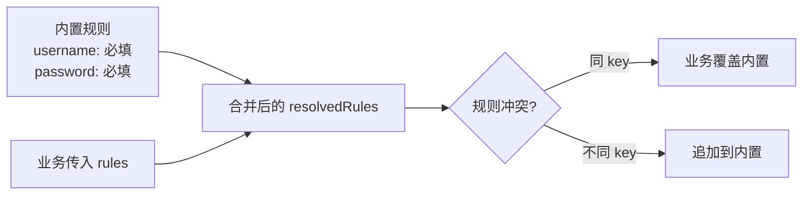
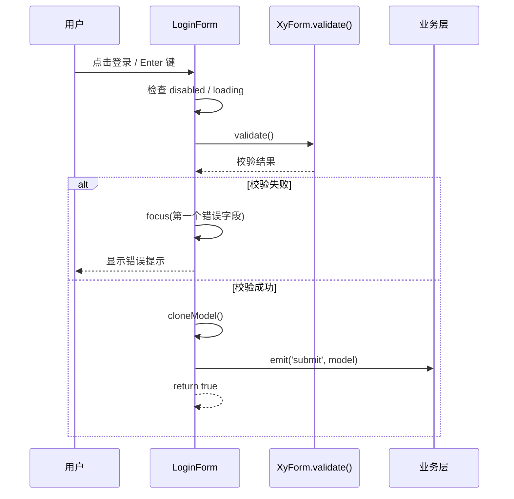
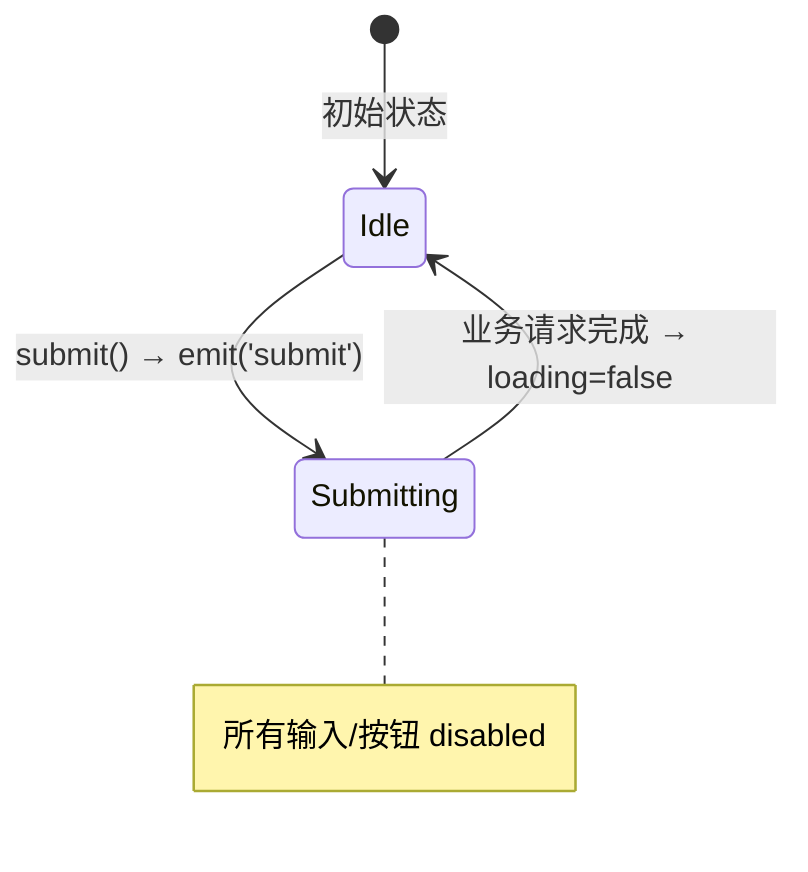

# 90 LoginForm 登录表单

> 导读：面向认证场景的登录主链路组件，统一用户名/密码输入、记住我、Enter 快捷提交和第三方登录入口展示，通过组装底层 Form/Input/Checkbox/Button 实现开箱即用的登录页面

## 设计哲学

### 为什么需要 LoginForm

登录页面是企业级应用的入口，看似简单，实则承载大量隐含需求：

1. **表单校验** — 用户名必填、密码必填、长度/格式约束
2. **交互细节** — Enter 键提交、校验失败自动聚焦、loading 状态下禁止操作
3. **扩展性** — 第三方登录（微信/钉钉/GitHub）、记住我、自定义校验规则
4. **一致性** — 不同项目的登录页面应保持统一的交互模式与视觉规范

LoginForm 的设计定位是 **"登录链路的最佳实践封装"** — 把 Form + Input + Checkbox + Button 的组合逻辑收敛到一个组件中，业务只需传 `model` 和监听 `submit` 事件。

### 设计决策



| 决策点 | 选择 | 理由 |
|--------|------|------|
| 底层组件 | Form + Input + Checkbox + Button | 复用已有基础组件的校验/交互能力，不重复造轮子 |
| 数据模式 | v-model 式 model prop | 与 Form 的 model 机制一致，业务直接绑定 reactive 对象 |
| 校验规则 | 内置 + 合并 | 内置 username/password 必填规则，业务可通过 rules 覆盖或追加 |
| 第三方登录 | 配置驱动 | 通过 thirdPartyItems 定义入口，避免硬编码 |
| 提交逻辑 | 组件内校验 → emit submit | 组件负责校验，业务负责请求，职责清晰 |

## 源码架构

### 文件结构

```
packages/pro-components/login-form/
├── index.ts                    # 模块导出入口
└── src/
    ├── login-form.ts           # 类型定义 & props 声明
    └── login-form.vue          # 组件实现
```

### 组件关系图



### 核心 Type 定义

```ts
/** 登录表单数据模型 */
export interface LoginFormModel {
  username: string
  password: string
  remember?: boolean
}

/** 第三方登录入口 */
export interface LoginFormThirdPartyItem {
  key: string       // 唯一标识，如 'wechat', 'github'
  label: string     // 显示文本
  icon?: string     // 图标名，如 'mdi:wechat'
}

/** 组件 Props */
export interface LoginFormProps {
  model: LoginFormModel
  title?: string
  description?: string
  loading?: boolean
  disabled?: boolean
  submitText?: string
  showRemember?: boolean
  rememberLabel?: string
  usernamePlaceholder?: string
  passwordPlaceholder?: string
  rules?: FormRules
  thirdPartyItems?: LoginFormThirdPartyItem[]
}

/** 组件 Expose 实例 */
export interface LoginFormInstance {
  validate: () => Promise<boolean>
  submit: () => Promise<boolean>
  focus: (field?: 'username' | 'password') => void
}
```

## 核心实现

### 1. 校验规则合并策略

**WHY** — 登录表单有最基础的校验需求（用户名/密码必填），但不同业务可能有额外规则（密码长度、格式等）。LoginForm 采用"内置 + 合并"策略：内置必填规则作为兜底，业务传入的 rules 覆盖或追加。

```ts
const resolvedRules = computed<FormRules>(() => ({
  username: [
    {
      required: true,
      message: '请输入用户名',
      trigger: ['blur', 'change']
    }
  ],
  password: [
    {
      required: true,
      message: '请输入密码',
      trigger: ['blur', 'change']
    }
  ],
  ...props.rules  // 业务自定义规则合并/覆盖
}))
```



### 2. 提交流程 — 校验 → 聚焦 → emit

**WHY** — 登录提交是高频率交互，必须在校验失败时自动聚焦到第一个错误字段，减少用户手动寻找错误的心智负担。

```ts
async function submit() {
  if (inputDisabled.value) return false

  const valid = await validate()

  if (!valid) {
    // 聚焦到第一个未填写的字段
    if (!model.username) {
      focus('username')
    } else if (!model.password) {
      focus('password')
    }
    return false
  }

  emit('submit', cloneModel())
  return true
}

function focus(field: 'username' | 'password' = 'username') {
  if (field === 'password') {
    passwordRef.value?.focus()
    return
  }
  usernameRef.value?.focus()
}
```



### 3. loading / disabled 双重保护

**WHY** — 登录请求期间（loading 状态），必须禁止所有输入和按钮操作，防止重复提交和误修改。

```ts
const inputDisabled = computed(() => props.disabled || props.loading)
```

所有子组件（Input、Checkbox、Button）的 `disabled` prop 均绑定 `inputDisabled`，确保在 loading 期间整表不可操作。



### 4. model 数据隔离

**WHY** — emit 的 payload 应是 model 的快照，而非引用。防止业务在异步请求过程中修改 model 导致数据不一致。

```ts
function cloneModel() {
  const rawModel = toRaw(model)
  return {
    username: rawModel.username,
    password: rawModel.password,
    remember: rawModel.remember
  }
}
```

### 5. 第三方登录区

**WHY** — 企业级应用的登录页面通常需要第三方登录入口（微信、钉钉等）。LoginForm 通过 `thirdPartyItems` 配置驱动渲染，业务只需定义数据，无需编写模板。

```vue
<div v-if="props.thirdPartyItems.length > 0"
     class="xy-login-form__third-party">
  <div class="xy-login-form__divider">
    <span>其他登录方式</span>
  </div>
  <div class="xy-login-form__third-party-actions">
    <xy-button
      v-for="item in props.thirdPartyItems"
      :key="item.key"
      plain
      :disabled="inputDisabled"
      @click="emit('third-party-click', item)"
    >
      <xy-icon v-if="item.icon" :icon="item.icon" :size="16" />
      {{ item.label }}
    </xy-button>
  </div>
</div>
```

## API 参考

### Props

| 属性 | 类型 | 默认值 | 说明 |
|------|------|--------|------|
| model | `LoginFormModel` | — | 表单数据模型（必传） |
| title | `string` | `'欢迎登录'` | 标题文本 |
| description | `string` | `'请输入账号信息后继续访问控制台。'` | 描述文本 |
| loading | `boolean` | `false` | 是否加载中（提交按钮显示 loading） |
| disabled | `boolean` | `false` | 是否禁用整表 |
| submitText | `string` | `'登录'` | 提交按钮文本 |
| showRemember | `boolean` | `true` | 是否显示"记住我" |
| rememberLabel | `string` | `'记住我'` | "记住我"标签文本 |
| usernamePlaceholder | `string` | `'请输入用户名'` | 用户名输入框占位文本 |
| passwordPlaceholder | `string` | `'请输入密码'` | 密码输入框占位文本 |
| rules | `FormRules` | `{}` | 自定义校验规则（与内置规则合并） |
| thirdPartyItems | `LoginFormThirdPartyItem[]` | `[]` | 第三方登录入口列表 |

### Emits

| 事件名 | 回调参数 | 说明 |
|--------|----------|------|
| submit | `(payload: LoginFormModel)` | 校验成功后触发，payload 为 model 快照 |
| third-party-click | `(item: LoginFormThirdPartyItem)` | 第三方登录按钮点击 |

### Slots

| 插槽名 | 作用域参数 | 说明 |
|--------|-----------|------|
| default | — | 整表内容自定义（一般不使用） |
| title | — | 标题区自定义 |
| description | — | 描述区自定义 |
| footer | — | 表单下方操作区自定义 |

### Exposes

| 方法 | 签名 | 说明 |
|------|------|------|
| validate | `() => Promise<boolean>` | 触发表单校验 |
| submit | `() => Promise<boolean>` | 校验 + 提交全流程 |
| focus | `(field?: 'username' \| 'password') => void` | 聚焦指定输入框 |

## 样式系统

### BEM 类名

| 类名 | 说明 |
|------|------|
| `xy-login-form` | 根容器 |
| `xy-login-form__header` | 标题区容器 |
| `xy-login-form__title` | 标题文本 |
| `xy-login-form__description` | 描述文本 |
| `xy-login-form__form` | 表单容器 |
| `xy-login-form__remember` | "记住我"区域 |
| `xy-login-form__divider` | 分割线（第三方登录上方） |
| `xy-login-form__third-party` | 第三方登录区容器 |
| `xy-login-form__third-party-actions` | 第三方登录按钮组 |
| `xy-login-form--disabled` | 禁用状态修饰 |
| `xy-login-form--loading` | 加载状态修饰 |

### CSS 变量

| 变量名 | 默认值 | 说明 |
|--------|--------|------|
| `--xy-login-form-bg` | `#fff` | 表单背景色 |
| `--xy-login-form-padding` | `32px` | 内边距 |
| `--xy-login-form-width` | `400px` | 表单宽度 |
| `--xy-login-form-radius` | `8px` | 圆角大小 |
| `--xy-login-form-title-size` | `20px` | 标题字号 |
| `--xy-login-form-desc-color` | `#909399` | 描述文字颜色 |

## 小结

1. **组装模式而非从头构建** — LoginForm 不自己实现校验/输入/按钮，而是组装底层 Form + Input + Checkbox + Button，复用全部基础能力
2. **校验-聚焦-提交通路** — 内置"校验失败自动聚焦第一个错误字段"的交互闭环，业务只需监听 `submit` 事件
3. **配置驱动的第三方登录** — thirdPartyItems 配置数组直接渲染入口，emit 回调事件，不耦合任何第三方 SDK