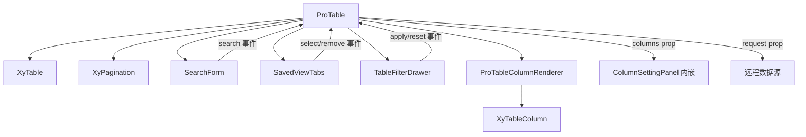

# 91 ProTable 增强表格

> 导读：ProTable 是面向中后台列表页场景的增强表格组件，通过 schema 配置驱动列渲染、搜索与操作，内置分页请求与视图管理，让一行配置替代一页样板代码。

## 设计哲学

### Pro 组件与基础组件的区别

基础组件（`XyTable`、`XyPagination` 等）提供原子级 UI 能力，关注"怎么渲染"；Pro 组件关注"怎么用"——把基础组件按业务场景编排成开箱即用的上层方案。ProTable 不是 Table 的超集，而是 Table + SearchForm + Pagination + ColumnSettingPanel + SavedViewTabs + TableFilterDrawer 的**业务组合体**。

### 核心设计理念

- **Schema 驱动**：列定义即搜索定义即展示定义，一份 `ProTableColumn` 驱动搜索、表格、筛选三个视图。
- **请求接管**：通过 `request` prop 把分页/排序/筛选逻辑从业务组件中剥离，ProTable 自行调度请求、管理 loading 与数据状态。
- **可组合**：工具栏区域的 ColumnSettingPanel、SavedViewTabs、TableFilterDrawer 均为独立组件，ProTable 通过 props 联动与之协同，不硬编码。

## 源码架构

### 文件结构

```
pro-table/
├── index.ts                # 模块导出 + withInstall
├── src/
│   ├── pro-table.ts        # 类型定义 & 列操作工具函数
│   └── pro-table.vue       # 模板 + 全部运行时逻辑
└── __tests__/
    ├── pro-table.spec.ts
    └── pro-table-drag.spec.ts
```

### 组件关系图



### 核心 type 定义

```ts
/** 列 schema —— 搜索、表格、筛选三合一 */
interface ProTableColumn<T = ProTableRow> extends TableColumnProps<T> {
  key?: string
  children?: ProTableColumn<T>[]
  slot?: string
  headerSlot?: string
  hidden?: boolean
  valueType?: 'text' | 'select' | 'tag' | 'progress'
    | 'link' | 'image' | 'avatar' | 'money'
    | 'date' | 'datetime' | 'code' | 'copy'
  formatter?: (row, column, value, rowIndex) => unknown
  render?: (value, { row, column, rowIndex }) => VNodeChild
  editable?: boolean | ((row, rowIndex) => boolean)
  editor?: ProFieldSchemaBuiltinComponent | Component
  options?: ProTableDisplayOption[] | ((row) => ProTableDisplayOption[])
}

/** 请求配置 */
interface ProTableRequestConfig<T = ProTableRow> {
  request: (params, ctx: ProRequestContext) => Promise<ProRequestResult<T>>
  requestParams?: Record<string, unknown>
  immediate?: boolean
  autoReloadOnParamsChange?: boolean
}

/** 工作台配置 */
interface ProTableWorkbenchConfig {
  refresh?: boolean
  density?: boolean
  columnSetting?: boolean
  fullscreen?: boolean
  filter?: boolean
  export?: boolean
  print?: boolean
  defaultDensity?: ProTableDensity
}
```

## 核心实现

### Schema 配置驱动机制

ProTableColumn 同时描述了三件事：

1. **搜索行为** —— 通过 `views.searchFields` 将搜索字段独立配置，ProTable 内部渲染 SearchForm
2. **表格展示** —— `label` + `prop` + `valueType` + `options` + `slot` 驱动 XyTable 列定义
3. **筛选能力** —— `views.filterFields` 决定哪些字段出现在 TableFilterDrawer

列可见性由 `hidden` 字段 + 内部 `visibleColumnKeys` computed 联动：

```ts
const visibleColumnKeys = computed(() =>
  leafColumns.value
    .filter((column) => column.hidden !== true)
    .map((column) => getProTableColumnKey(column))
)
```

列渲染由 `ProTableColumnRenderer` 函数式组件递归完成，它会根据 `slot` / `valueType` / `editable` 三个维度选择渲染策略：

```ts
// ProTableColumnRenderer 核心逻辑
if (shouldShowEditor(row, rowIndex, column)) {
  return resolveEditorVNode(row, rowIndex, column)
}
if (slotName && slots[slotName]) {
  return slots[slotName]?.(payload)
}
return renderDisplayValue({ value, row, rowIndex, column })
```

### Request 数据请求机制

`request` 是 ProTable 的核心 prop。组件接管了完整的请求生命周期：

```ts
async function requestReload(action = 'reload') {
  const requestId = ++latestRequestId
  requestLoading.value = true
  try {
    const params = buildRequestParams()
    const result = await props.request.request(
      params,
      createProRequestContext(action, params, currentPageState.value, pageSizeState.value)
    )
    if (requestId !== latestRequestId) return // 竞态保护
    const normalized = normalizeProRequestResult(result)
    internalData.value = normalized.data
    requestTotal.value = normalized.total
  } catch (error) {
    if (requestId !== latestRequestId) return
    requestError.value = error
  } finally {
    if (requestId === latestRequestId) requestLoading.value = false
  }
}
```

触发 `requestReload` 的时机：组件挂载、SearchForm 搜索/重置、分页切换、TableFilterDrawer 筛选确认、SavedViewTabs 视图切换、`requestParams` 变化（watch deep）。

`normalizeProRequestResult` 统一处理两种返回格式——数组或 `{ data, total }` 对象：

```ts
function normalizeProRequestResult<T>(result: ProRequestResult<T>) {
  if (Array.isArray(result)) {
    return { data: result, total: result.length, extra: {} }
  }
  return { data: result.data, total: result.total ?? result.data.length, extra: result.extra ?? {} }
}
```

### 组件间组合方式

ProTable 与子组件通过 props + events 双向联动，而非 provide/inject：

- **SavedViewTabs**：ProTable 将 `views.savedViews` 传入，监听 `select` / `remove` / `create` 事件
- **TableFilterDrawer**：ProTable 将 `views.filterFields` + `views.filterModel` 传入，监听 `apply` / `reset` 事件后触发 `requestReload`
- **SearchForm**：ProTable 将 `views.searchModel` + `views.searchFields` 传入，监听 `search` / `reset` 后重置页码并请求
- **ColumnSetting**：ProTable 内嵌了列设置面板逻辑（`settingsOpen` + `columnSettingEntries`），通过 `updateVisibleColumns` 更新列可见性

行拖拽与列拖拽均基于 Sortable.js，在 `onMounted` / `watch` 中同步创建实例：

```ts
async function syncSortables() {
  destroySortables()
  await nextTick()
  if (props.draggableRow) {
    const body = rootRef.value?.querySelector('.xy-table__body-wrapper tbody')
    if (body) rowSortable = Sortable.create(body, { animation: 150, onEnd: ... })
  }
  if (canColumnDrag.value) {
    const headerRow = rootRef.value?.querySelector('.xy-table__header-main thead tr:last-child')
    if (headerRow) columnSortable = Sortable.create(headerRow, { animation: 150, onEnd: ... })
  }
}
```

## API 参考

### Props

| 属性 | 说明 | 类型 | 默认值 |
|------|------|------|--------|
| title | 工具栏标题 | `string` | `''` |
| description | 工具栏说明 | `string` | `''` |
| data | 表格数据（静态模式） | `T[]` | `[]` |
| columns | 列 schema 数组 | `ProTableColumn<T>[]` | `[]` |
| loading | 外部加载态 | `boolean` | `false` |
| draggableRow | 行拖拽 | `boolean` | `false` |
| draggableColumn | 列拖拽 | `boolean` | `false` |
| toolbarActions | 工具栏按钮组 | `ProTableToolbarAction[]` | `[]` |
| tableProps | 透传给 XyTable 的 props | `Partial<TableProps<T>>` | `{}` |
| pagination | 是否显示分页 | `boolean` | `true` |
| workbench | 工作台配置 | `ProTableWorkbenchConfig` | `{}` |
| request | 远程请求配置 | `ProTableRequestConfig<T>` | — |
| views | 搜索/筛选/视图配置 | `ProTableViewsConfig` | — |
| batchActions | 批量操作按钮 | `ProTableBatchAction[]` | `[]` |
| editable | 编辑模式配置 | `ProTableEditableConfig<T>` | — |
| virtual | 虚拟滚动配置 | `ProTableVirtualConfig` | — |
| contextmenu | 右键菜单配置 | `ProTableContextmenuConfig<T>` | — |
| exportOptions | 导出配置 | `ProTableExportOptions<T>` | — |
| printOptions | 打印配置 | `ProTablePrintOptions<T>` | — |

### Emits

| 事件 | 说明 | 回调参数 |
|------|------|----------|
| toolbar-action | 工具栏按钮点击 | `(action)` |
| page-change | 分页变化 | `(page, pageSize)` |
| request-success | 请求成功 | `(rows)` |
| request-error | 请求失败 | `(error)` |
| batch-action | 批量操作 | `(action, selection)` |
| view-select | 视图切换 | `(item)` |
| filter-apply | 筛选应用 | `(model)` |
| filter-reset | 筛选重置 | `(model)` |
| edit-start | 编辑开始 | `({ row, columnKey })` |
| edit-submit | 编辑保存 | `({ rows })` |
| drag-row-change | 行拖拽完成 | `(rows)` |
| drag-column-change | 列拖拽完成 | `(columns)` |
| sort-change | 排序变化 | `({ column, prop, order })` |
| selection-change | 选择变化 | `(selection)` |
| export | 导出完成 | `(payload)` |
| contextmenu-select | 右键菜单选择 | `(item, payload)` |

### Slots

| 插槽 | 说明 |
|------|------|
| toolbar-main | 标题区自定义 |
| toolbar-left | 工具栏左侧 |
| toolbar-right | 工具栏右侧 |
| search | 搜索区自定义 |
| `[column.slot]` | 单元格自定义 |
| `[column.headerSlot]` | 表头自定义 |
| `[column.editorSlot]` | 编辑态自定义 |
| footer-meta | 分页左侧补充 |
| loading | 加载态自定义 |
| empty | 空态自定义 |

### Exposes

| 方法 | 说明 |
|------|------|
| reload | 重新请求数据 |
| refresh | 刷新当前页 |
| reset | 重置分页/搜索/筛选并请求 |
| toggleFullscreen | 切换全屏 |
| setDensity | 设置密度 |
| openFilterDrawer | 打开筛选抽屉 |
| getVisibleColumns | 获取可见列 |
| startEdit | 开始编辑 |
| cancelEdit | 取消编辑 |
| submitEdit | 提交编辑 |

## 小结

1. **Schema 三合一驱动**：一份 `ProTableColumn` 同时描述搜索、表格、筛选三种视图，消除重复定义，`valueType` + `options` 让常见展示场景零模板。
2. **Request 请求接管**：分页、搜索、筛选、排序全部汇入 `request` 函数，竞态保护确保快速操作只应用最后一次响应。
3. **Sortable.js 拖拽集成**：行拖拽与列拖拽通过 DOM 查询 + Sortable.create 实现，`flush: 'post'` 的 watch 保证数据变化后 DOM 就绪再初始化。
