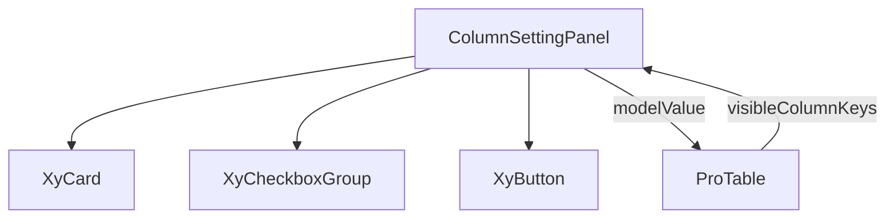

# 92 ColumnSettingPanel 列设置面板

> 导读：ColumnSettingPanel 是表格列显隐控制的轻量承载体，通过 CheckboxGroup 实现全选、重置、单列勾选，让用户按需裁剪表格列。

## 设计哲学

### Pro 组件与基础组件的区别

基础组件 `XyCheckboxGroup` 只提供多选交互，不关心"选的是什么"；ColumnSettingPanel 在其之上封装了列配置的语义——每个选项对应表格的一列，勾选即控制列可见性，disabled 列代表不可隐藏的系统列。

### 核心设计理念

- **语义收口**：将"列显隐"这个业务概念封装为独立组件，ProTable 工具栏只需挂载即可获得列配置能力。
- **受控模式**：通过 `modelValue` / `update:modelValue` 双向绑定可见列 key 数组，状态完全由外部控制，组件本身不持有状态。
- **最小承载体**：只负责勾选交互，不处理列顺序拖拽、持久化、权限裁剪等复杂逻辑，保持职责单一。

## 源码架构

### 文件结构

```
column-setting-panel/
├── index.ts                         # 模块导出 + withInstall
├── src/
│   ├── column-setting-panel.ts      # 类型定义
│   └── column-setting-panel.vue     # 模板 + 逻辑
└── __tests__/
    └── column-setting-panel.spec.ts
```

### 组件关系图



### 核心 type 定义

```ts
/** 单列配置项 */
interface ColumnSettingPanelColumn {
  /** 列唯一标识，对应 ProTableColumn 的 key/prop */
  key: string
  /** 列标题，展示在 Checkbox 旁 */
  label: string
  /** 列说明，展示在 Checkbox 下方 */
  description?: string
  /** 是否禁用勾选（系统列、必显列） */
  disabled?: boolean
}

/** 组件 Props */
interface ColumnSettingPanelProps {
  /** 面板标题 */
  title?: string
  /** 面板说明 */
  description?: string
  /** 可配置的列列表 */
  columns: ColumnSettingPanelColumn[]
  /** 当前可见列 key 数组（v-model） */
  modelValue: string[]
}
```

## 核心实现

### Schema 配置驱动机制

ColumnSettingPanel 的数据源是 `columns` prop，每个 `ColumnSettingPanelColumn` 映射到 ProTable 的一个叶子列。组件将 columns 转换为 CheckboxGroup 的 options：

```vue
<xy-checkbox-group
  :model-value="props.modelValue"
  direction="vertical"
  :options="
    props.columns.map((column) => ({
      label: column.label,
      value: column.key,
      disabled: column.disabled,
      description: column.description
    }))
  "
  @update:model-value="updateValue"
/>
```

`direction="vertical"` 让列选项纵向排列，符合侧边栏面板的视觉习惯。

### 全选与重置逻辑

全选不是"选全部列"，而是"选全部**可勾选**列"——disabled 列始终不参与全选：

```ts
const enabledColumnKeys = computed(() =>
  props.columns
    .filter((column) => !column.disabled)
    .map((column) => column.key)
)

function selectAll() {
  updateValue(enabledColumnKeys.value)
}

function reset() {
  const nextValue = enabledColumnKeys.value
  emit('update:modelValue', nextValue)
  emit('reset', nextValue)
}
```

`reset` 与 `selectAll` 的区别在于：`selectAll` 触发 `change` 事件，`reset` 触发 `reset` 事件，让外部可以区分用户意图。

### 组件间组合方式

在 ProTable 中的使用方式：

```vue
<!-- ProTable 内嵌列设置面板 -->
<div v-if="settingsOpen && resolvedWorkbench.columnSetting"
     class="xy-pro-table__settings-panel">
  <div v-for="entry in columnSettingEntries" :key="entry.key">
    <input type="checkbox"
      :checked="visibleColumnKeys.includes(entry.key)"
      @change="handleColumnVisibilityToggle(entry.key, $event)"
    />
  </div>
</div>
```

ProTable 将 `leafColumns` 映射为 `columnSettingEntries`，用户勾选后通过 `applyColumnVisibility` 更新 `internalColumns` 的 `hidden` 字段，再由 `visibleColumns` computed 自动过滤：

```ts
function updateVisibleColumns(nextVisibleKeys) {
  internalColumns.value = applyColumnVisibility(
    internalColumns.value,
    new Set(nextVisibleKeys.map((item) => String(item)))
  )
  nextTick(() => { tableRef.value?.doLayout() })
}
```

## API 参考

### Props

| 属性 | 说明 | 类型 | 默认值 |
|------|------|------|--------|
| title | 面板标题 | `string` | `'列设置'` |
| description | 面板说明 | `string` | `''` |
| columns | 列配置列表 | `ColumnSettingPanelColumn[]` | `[]` |
| modelValue | 可见列 key 数组 | `string[]` | `[]` |

### Emits

| 事件 | 说明 | 回调参数 |
|------|------|----------|
| update:modelValue | 可见列变化 | `(value: string[])` |
| change | 用户勾选变化 | `(value: string[])` |
| reset | 用户点击重置 | `(value: string[])` |

### Slots

| 插槽 | 说明 |
|------|------|
| — | 无具名插槽，内容完全由 props 驱动 |

### Exposes

| 方法 | 说明 |
|------|------|
| — | 无 expose，纯受控组件 |

## 小结

1. **语义收口**：将"列显隐"封装为 `ColumnSettingPanelColumn` + `modelValue` 的受控模型，外部只需维护一个 `string[]` 即可驱动列可见性。
2. **全选排除 disabled**：`selectAll` / `reset` 只操作 enabled 列，系统列（如选择列、序号列）不会被误操作隐藏。
3. **Card + CheckboxGroup 纵向布局**：`XyCard` 提供面板容器语义，`direction="vertical"` 让列选项纵向排列，符合侧边栏面板的视觉习惯。
