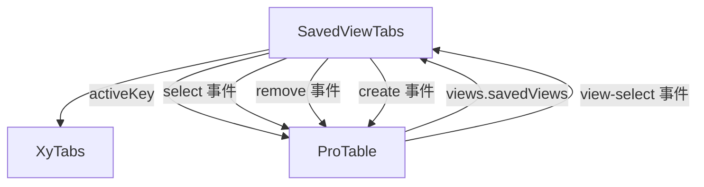

# 93 SavedViewTabs 视图页签

> 导读：SavedViewTabs 为列表页提供稳定的视图切换层，将"全部、待处理、异常单"这类业务视图收成页签结构，让用户一键切换查询口径。

## 设计哲学

### Pro 组件与基础组件的区别

基础组件 `XyTabs` 只提供页签切换的通用 UI，不关心页签背后的业务含义；SavedViewTabs 在其之上增加了视图语义——每个页签绑定了一组查询参数快照（搜索 + 筛选 + 排序），切换页签等同于切换查询条件。

### 核心设计理念

- **视图即参数快照**：页签不是单纯的分类标签，而是完整查询状态的载体。切换时 ProTable 根据新视图的参数重新请求数据。
- **可创建可关闭**：内置"新建视图"按钮和页签关闭按钮，通过 `addable` 和 `closable` 控制可见性，用户可自行扩展和清理视图。
- **计数气泡**：页签标题支持 `count` 字段，自动渲染为 `(N)` 后缀，展示当前视图下的数据条数。

## 源码架构

### 文件结构

```
saved-view-tabs/
├── index.ts                    # 模块导出 + withInstall
├── src/
│   ├── saved-view-tabs.ts      # 类型定义
│   └── saved-view-tabs.vue     # 模板 + 逻辑
└── __tests__/
    └── saved-view-tabs.spec.ts
```

### 组件关系图



### 核心 type 定义

```ts
/** 单个视图页签 */
interface SavedViewTabItem {
  /** 视图唯一标识 */
  key: string
  /** 视图标题 */
  label: string
  /** 数据计数，显示为标题后缀 (N) */
  count?: number
  /** 是否可关闭 */
  closable?: boolean
}

/** 组件 Props */
interface SavedViewTabsProps {
  /** 视图列表 */
  items: SavedViewTabItem[]
  /** 当前激活的视图 key（v-model） */
  activeKey?: string
  /** 是否显示新建按钮 */
  addable?: boolean
}
```

## 核心实现

### Schema 配置驱动机制

SavedViewTabs 不使用 schema，而是使用 `items` prop 描述视图列表。组件将 `items` 转换为 `XyTabs` 的 `items` 格式：

```vue
<xy-tabs
  :model-value="props.activeKey"
  :items="
    props.items.map((item) => ({
      key: item.key,
      label: item.count !== undefined
        ? `${item.label} (${item.count})`
        : item.label,
      closable: item.closable
    }))
  "
  editable
  @change="handleChange"
  @tab-remove="handleRemove"
  @tab-add="emit('create')"
/>
```

`count` 的渲染逻辑直接内联在 label 映射中：如果 `count` 有值，自动拼接 `(N)` 后缀。`editable` 属性让 XyTabs 显示"添加"按钮和"关闭"图标。

### 请求联动机制

SavedViewTabs 本身不直接发起请求。当用户切换视图时，触发 `select` 事件，ProTable 监听后执行以下流程：

```ts
function handleSavedViewSelect(item: ProTableSavedViewItem) {
  activeViewKey.value = item.key
  emit('view-select', item)
  void requestReload('view-change')
}
```

`requestReload` 会将 `activeViewKey` 纳入请求参数（通过 `buildRequestParams`），后端可据此返回不同视图的数据。

### 组件间组合方式

在 ProTable 中，SavedViewTabs 通过 `views` prop 配置：

```vue
<xy-saved-view-tabs
  v-if="props.views?.savedViews?.length"
  v-model:active-key="activeViewKey"
  :items="props.views.savedViews"
  addable
  @select="handleSavedViewSelect"
  @remove="emit('view-remove', $event)"
  @create="emit('view-create')"
/>
```

ProTable 维护 `activeViewKey` 响应式状态，并在 `buildRequestParams` 中将其传入：

```ts
function buildRequestParams() {
  return {
    ...(props.request?.requestParams ?? {}),
    ...(searchModel.value ?? {}),
    ...(filterModel.value ?? {}),
    ...(activeViewKey.value
      ? { activeViewKey: activeViewKey.value }
      : {})
  }
}
```

## API 参考

### Props

| 属性 | 说明 | 类型 | 默认值 |
|------|------|------|--------|
| items | 视图页签列表 | `SavedViewTabItem[]` | `[]` |
| activeKey | 当前激活视图 key（v-model） | `string` | `''` |
| addable | 是否显示新建视图按钮 | `boolean` | `false` |

### Emits

| 事件 | 说明 | 回调参数 |
|------|------|----------|
| update:activeKey | 激活视图变化 | `(value: string)` |
| select | 选中视图 | `(item: SavedViewTabItem)` |
| remove | 关闭视图 | `(item: SavedViewTabItem)` |
| create | 点击新建视图 | — |

### Slots

| 插槽 | 说明 |
|------|------|
| default | 页签下方内容区（通常由 ProTable 填充表格） |

### Exposes

| 方法 | 说明 |
|------|------|
| — | 无 expose，纯受控组件 |

## 小结

1. **视图即参数快照**：每个页签通过 `key` 与 ProTable 的查询参数绑定，切换视图等同于切换查询条件。
2. **count 自动拼接**：`item.count` 有值时自动在标题后显示 `(N)`，无需手动格式化。
3. **editable 双向能力**：`addable` 控制新建按钮，`closable` 控制单个页签的关闭按钮，两者独立配置互不干扰。