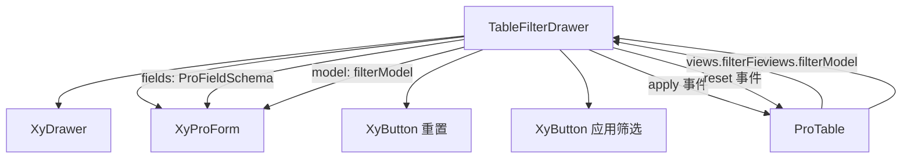

# 94 TableFilterDrawer 表格筛选抽屉

> 导读：TableFilterDrawer 用抽屉收纳列表页的高级筛选条件，让主搜索栏保持简洁，次级筛选条件收进侧边抽屉，通过 ProForm 承接字段渲染。

## 设计哲学

### Pro 组件与基础组件的区别

基础组件 `XyDrawer` 只提供侧边抽屉容器，`XyForm` 只提供表单渲染；TableFilterDrawer 将两者组合，并注入"筛选"语义——抽屉内的表单是筛选表单而非编辑表单，"应用筛选"和"重置"按钮是筛选专用操作，不是通用的提交/取消。

### 核心设计理念

- **主次分离**：高频筛选放在 SearchForm（主搜索栏），低频但复杂的筛选收进 TableFilterDrawer（次级抽屉），让列表页界面更清爽。
- **Schema 驱动筛选**：使用 `ProFieldSchema` 定义筛选字段，复用 ProForm 的 schema 驱动机制，无需为筛选场景单独写模板。
- **操作收口**：只有"应用筛选"和"重置"两个操作，没有复杂的表单提交逻辑，筛选场景天然是查询而非编辑。

## 源码架构

### 文件结构

```
table-filter-drawer/
├── index.ts                           # 模块导出 + withInstall
├── src/
│   ├── table-filter-drawer.ts         # 类型定义
│   └── table-filter-drawer.vue        # 模板 + 逻辑
└── __tests__/
    └── table-filter-drawer.spec.ts
```

### 组件关系图



### 核心 type 定义

```ts
interface TableFilterDrawerProps {
  /** 抽屉是否打开（v-model） */
  open?: boolean
  /** 抽屉标题 */
  title?: string
  /** 篮选表单数据模型 */
  model: Record<string, unknown>
  /** 篮选字段 schema，复用 ProFieldSchema */
  fields?: ProFieldSchema[]
  /** 透传给 XyDrawer 的额外 props */
  drawerProps?: Omit<Partial<DrawerProps>, 'modelValue' | 'title'>
}
```

## 核心实现

### Schema 配置驱动机制

TableFilterDrawer 的筛选字段使用 `ProFieldSchema` 定义，与 ProForm / DetailPanel 共用同一套 schema 协议：

```ts
interface ProFieldSchema {
  prop: string
  label: string
  component?: ProFieldSchemaBuiltinComponent  // 'input' | 'select' | 'date-picker' ...
  componentProps?: Record<string, unknown>
  options?: ProFieldSchemaOption[]
  placeholder?: string
  hidden?: boolean | ((model) => boolean)
  disabled?: boolean | ((model) => boolean)
}
```

组件将 schema 传入 ProForm，但隐藏 ProForm 自带的提交/重置按钮（`show-submit` / `show-reset` 设为 `false`），由抽屉 footer 自己提供筛选专用按钮：

```vue
<xy-pro-form
  :model="props.model"
  :schema="props.fields"
  :show-submit="false"
  :show-reset="false"
/>
```

### 筛选操作流程

筛选操作只有两个出口：

1. **应用筛选**：将当前 `model` 的值通过 `apply` 事件传出，同时关闭抽屉
2. **重置**：将当前 `model` 的值通过 `reset` 事件传出，同时关闭抽屉

```vue
<template #footer>
  <div class="xy-table-filter-drawer__footer">
    <xy-button @click="() => { emit('reset', { ...props.model }); close() }">
      重置
    </xy-button>
    <xy-button type="primary"
      @click="() => { emit('apply', { ...props.model }); close() }">
      应用筛选
    </xy-button>
  </div>
</template>
```

`{ ...props.model }` 的浅拷贝确保事件 payload 不受后续 model 变化影响。

### 组件间组合方式

在 ProTable 中，TableFilterDrawer 的挂载完全由 `views.filterFields` 决定：

```vue
<xy-table-filter-drawer
  v-if="filterFields.length > 0 && filterModel"
  v-model:open="filterDrawerOpen"
  :title="props.views?.filterTitle ?? '筛选条件'"
  :model="filterModel"
  :fields="filterFields"
  @apply="handleFilterApply"
  @reset="handleFilterReset"
/>
```

`filterModel` 是 ProTable 维护的响应式对象（来自 `views.filterModel`），ProForm 直接绑定它实现实时双向更新。`apply` / `reset` 后 ProTable 会调用 `requestReload` 触发数据刷新：

```ts
function handleFilterApply(payload) {
  emit('filter-apply', payload)
  requestReload('filter')
}
```

## API 参考

### Props

| 属性 | 说明 | 类型 | 默认值 |
|------|------|------|--------|
| open | 抽屉是否打开（v-model） | `boolean` | `false` |
| title | 抽屉标题 | `string` | `'筛选条件'` |
| model | 篮选表单数据模型 | `Record<string, unknown>` | `{}` |
| fields | 篮选字段 schema | `ProFieldSchema[]` | `[]` |
| drawerProps | 透传给 XyDrawer 的额外 props | `Partial<DrawerProps>` | `{}` |

### Emits

| 事件 | 说明 | 回调参数 |
|------|------|----------|
| update:open | 打开状态变化 | `(value: boolean)` |
| apply | 应用筛选 | `(payload: Record<string, unknown>)` |
| reset | 重置筛选 | `(payload: Record<string, unknown>)` |
| closed | 抽屉关闭动画完成 | — |

### Slots

| 插槽 | 说明 |
|------|------|
| — | 无自定义插槽，内容由 schema 驱动 |

### Exposes

| 方法 | 说明 |
|------|------|
| — | 无 expose，纯受控组件 |

## 小结

1. **主次分离**：SearchForm 承接高频筛选，TableFilterDrawer 收纳低频复杂筛选，两者共享 `ProFieldSchema` 协议但职责不同。
2. **ProForm 隐藏自带按钮**：`show-submit` / `show-reset` 设为 `false`，由抽屉 footer 提供筛选专用"应用"和"重置"按钮，操作语义更明确。
3. **model 浅拷贝传事件**：`{ ...props.model }` 确保事件 payload 是冻结快照，避免后续 model 变化污染已发出的筛选参数。