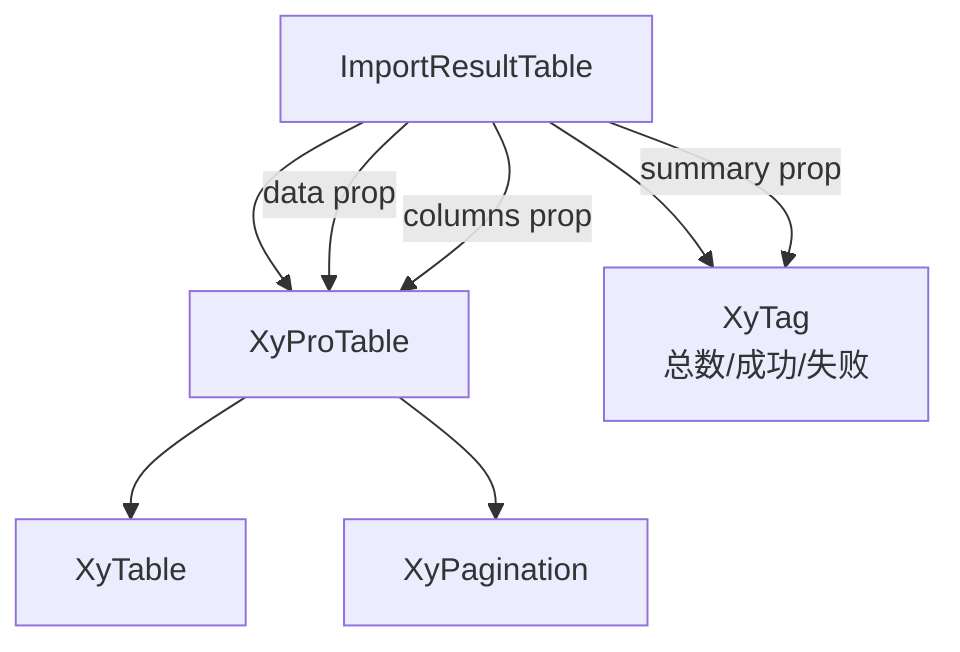

# 95 ImportResultTable 导入结果表格

> 导读：ImportResultTable 是批量导入场景的结果承载体，在 ProTable 之上叠加统计摘要和结果语义，让导入完成后的反馈一站式呈现。

## 设计哲学

### Pro 组件与基础组件的区别

基础组件 `XyTable` 只负责渲染行和列，不理解"导入结果"这个业务概念；ImportResultTable 在 `XyProTable` 之上叠加了导入结果语义——顶部摘要区显示总数/成功/失败三个 Tag，下方表格直接复用 ProTable 的全部能力（分页、排序、筛选、列设置等），让导入结果不再是简陋的列表。

### 核心设计理念

- **ProTable 复用**：不重新造表格，直接以 `XyProTable` 为内层渲染器，保留 ProTable 的全部能力。
- **摘要前置**：`summary` prop 描述总数/成功/失败三维度统计，组件在表格上方渲染三个状态 Tag，用户一眼掌握导入全貌。
- **列协议复用**：`columns` 直接使用 `ProTableColumn` 类型，与 ProTable 完全一致的列定义，无需学习新协议。

## 源码架构

### 文件结构

```
import-result-table/
├── index.ts                           # 模块导出 + withInstall
├── src/
│   ├── import-result-table.ts         # 类型定义
│   └── import-result-table.vue        # 模板 + 逻辑
└── __tests__/
    └── import-result-table.spec.ts
```

### 组件关系图



### 核心 type 定义

```ts
/** 导入结果统计 */
interface ImportResultSummary {
  /** 总导入条数 */
  total: number
  /** 成功条数 */
  success: number
  /** 失败条数 */
  failed: number
}

/** 组件 Props */
interface ImportResultTableProps<T = Record<string, unknown>> {
  /** 导入结果行数据 */
  data: T[]
  /** 列定义，复用 ProTableColumn */
  columns: ProTableColumn<T>[]
  /** 导入结果统计 */
  summary?: ImportResultSummary
  /** 加载态 */
  loading?: boolean
}
```

## 核心实现

### Schema 配置驱动机制

ImportResultTable 不发明新的列协议，直接复用 `ProTableColumn`。组件内部通过 `defineComponent` 创建 `ProTableRenderer` 函数式组件，将 props 透传给 `XyProTable`：

```ts
const ProTableRenderer = defineComponent({
  name: 'XyImportResultTableRenderer',
  setup() {
    return () =>
      h(
        XyProTable,
        {
          title: '导入结果',
          description: '导入结束后用统一表格承接成功、失败和原因信息。',
          data: props.data,
          columns: props.columns,
          loading: props.loading,
          pagination: false
        },
        slots
      )
  }
})
```

关键设计：`pagination: false` ——导入结果通常不需要分页，全部展示即可；同时将外层 slot 透传给 ProTable，保留列自定义能力。

### 统计摘要渲染

`summary` prop 是可选的，有值时在表格上方渲染三个 Tag：

```vue
<div v-if="props.summary" class="xy-import-result-table__summary">
  <xy-tag status="primary">总数 {{ props.summary.total }}</xy-tag>
  <xy-tag status="success">成功 {{ props.summary.success }}</xy-tag>
  <xy-tag status="danger">失败 {{ props.summary.failed }}</xy-tag>
</div>
```

三个 Tag 使用不同的 `status` 值（`primary` / `success` / `danger`），颜色语义与导入结果的三种状态一致。

### 组件间组合方式

典型使用场景——导入向导的最后一步：

```vue
<xy-import-result-table
  :data="importResult.rows"
  :columns="importResult.columns"
  :summary="importResult.summary"
  :loading="importLoading"
/>
```

其中 `importResult` 通常来自 ImportWizard 的 `complete` 事件 payload。ImportResultTable 与 ImportWizard 通过数据契约解耦，不依赖彼此的组件实例。

## API 参考

### Props

| 属性 | 说明 | 类型 | 默认值 |
|------|------|------|--------|
| data | 导入结果行数据 | `T[]` | `[]` |
| columns | 列定义，复用 ProTableColumn | `ProTableColumn<T>[]` | `[]` |
| summary | 导入结果统计 | `ImportResultSummary` | — |
| loading | 加载态 | `boolean` | `false` |

### Emits

| 事件 | 说明 | 回调参数 |
|------|------|----------|
| — | 无自定义事件，纯展示组件 |

### Slots

| 插槽 | 说明 |
|------|------|
| default | 透传给内层 ProTable 的 slot |
| `[column.slot]` | 列自定义渲染（透传给 ProTable） |

### Exposes

| 方法 | 说明 |
|------|------|
| — | 无 expose，纯展示组件 |

## 小结

1. **ProTable 复用而非重造**：通过 `defineComponent` + `h` 创建 ProTableRenderer，将 props 和 slots 透传给 `XyProTable`，一行 `pagination: false` 即可获得完整表格能力。
2. **摘要前置**：`summary` prop 可选，有值时渲染三个状态 Tag，颜色语义与导入结果状态一致，用户无需读表即可掌握导入全貌。
3. **列协议完全复用**：`columns` 直接使用 `ProTableColumn` 类型，与 ProTable 的列定义零学习成本。