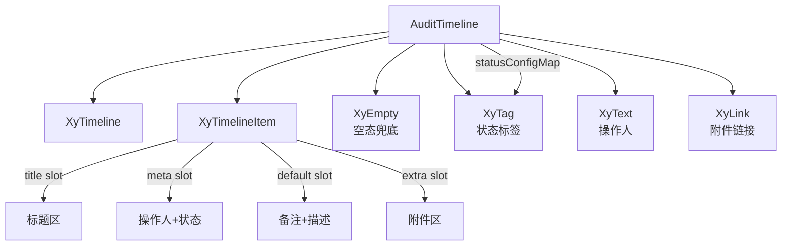

# 96 AuditTimeline 审计时间线

> 导读：AuditTimeline 是面向后台操作记录、审批流和变更历史的增强时间线组件，每条记录自动渲染操作人、状态标签、备注和附件，让历史追溯不再手拼模板。

## 设计哲学

### Pro 组件与基础组件的区别

基础组件 `XyTimeline` + `XyTimelineItem` 只提供时间线的纵向排列容器，节点内容需要逐条手写；AuditTimeline 在其之上封装了审计记录的语义——每条记录包含标题、操作人、时间戳、状态、备注和附件，组件自动渲染所有字段，只暴露需要自定义的区域。

### 核心设计理念

- **状态驱动渲染**：5 种内置状态（default / success / warning / danger / processing）各自映射到 Tag 标签、Timeline 节点颜色和节点状态，一行配置驱动三层视觉反馈。
- **多维度插槽**：title / meta / default / actions / extra / attachments 六个具名插槽覆盖节点内容的每个区域，需要自定义时只替换局部，不需要自定义时组件自动渲染。
- **空态兜底**：当 `items` 为空数组时自动渲染 `XyEmpty`，文案由 `emptyText` prop 控制。

## 源码架构

### 文件结构

```
audit-timeline/
├── index.ts                      # 模块导出 + withInstall
├── src/
│   ├── audit-timeline.ts         # 类型定义 + 状态常量
│   └── audit-timeline.vue        # 模板 + 逻辑
└── __tests__/
    └── audit-timeline.spec.ts
```

### 组件关系图



### 核心 type 定义

```ts
/** 状态枚举 */
type AuditTimelineStatus = 'default' | 'success' | 'warning' | 'danger' | 'processing'

/** 单条审计记录 */
interface AuditTimelineEntry {
  /** 记录唯一标识 */
  id: string | number
  /** 记录标题 */
  title: string
  /** 操作人 */
  operator?: string
  /** 时间戳 */
  timestamp?: string
  /** 状态 */
  status?: AuditTimelineStatus
  /** 描述内容 */
  description?: string
  /** 备注 */
  remark?: string
  /** 附件列表 */
  attachments?: AuditTimelineAttachment[]
}

/** 附件 */
interface AuditTimelineAttachment {
  /** 附件名称 */
  label: string
  /** 附件链接 */
  href?: string
}

/** 组件 Props */
interface AuditTimelineProps {
  /** 审计记录列表 */
  items: AuditTimelineEntry[]
  /** 空态文案 */
  emptyText?: string
  /** 紧凑模式 */
  compact?: boolean
}
```

## 核心实现

### 状态驱动渲染

5 种状态各自映射到三个维度：Tag 标签、Timeline 节点颜色、Timeline 节点状态：

```ts
const statusConfigMap: Record<AuditTimelineStatus, {
  label: string
  tagStatus: ComponentStatus
  timelineType: '' | ComponentStatus
  timelineState: 'default' | 'done' | 'current' | 'blocked' | 'pending'
}> = {
  default:    { label: '已记录',  tagStatus: 'neutral',  timelineType: 'neutral',  timelineState: 'default' },
  success:    { label: '成功',    tagStatus: 'success',  timelineType: 'success',  timelineState: 'done' },
  warning:    { label: '警告',    tagStatus: 'warning',  timelineType: 'warning',  timelineState: 'current' },
  danger:     { label: '拒绝',    tagStatus: 'danger',   timelineType: 'danger',   timelineState: 'blocked' },
  processing: { label: '处理中',  tagStatus: 'primary',  timelineType: 'primary',  timelineState: 'pending' },
}
```

在模板中，三个维度通过同一个 `resolveStatusConfig` 函数驱动：

```vue
<xy-timeline-item
  :timestamp="item.timestamp"
  :type="resolveStatusConfig(item.status).timelineType"
  :state="resolveStatusConfig(item.status).timelineState"
>
  <!-- meta 区域 -->
  <xy-tag size="sm" :status="resolveStatusConfig(item.status).tagStatus">
    {{ resolveStatusConfig(item.status).label }}
  </xy-tag>
</xy-timeline-item>
```

这意味着只需在 `AuditTimelineEntry` 中声明 `status: 'danger'`，节点颜色、Tag 颜色、Tag 文案和节点状态就全部自动渲染为"拒绝"语义，无需逐项配置。

### 多维度插槽

AuditTimeline 为每个节点内容区域提供独立插槽，默认自动渲染，需要自定义时只替换局部：

```vue
<!-- 标题区 -->
<template #title="{ item, index }">
  <slot name="title" :item="item" :index="index">
    <div class="xy-audit-timeline__title">{{ item.title }}</div>
  </slot>
</template>

<!-- meta 区：操作人 + 状态标签 -->
<template #meta="{ item, index, statusLabel }">
  <slot name="meta" :item="item" :index="index" :status-label="statusLabel">
    <xy-text v-if="item.operator" class="xy-audit-timeline__operator" type="default" size="sm">
      {{ item.operator }}
    </xy-text>
    <xy-tag size="sm" :status="resolveStatusConfig(item.status).tagStatus">
      {{ resolveStatusConfig(item.status).label }}
    </xy-tag>
  </slot>
</template>

<!-- 内容区：描述 + 备注 -->
<slot :item="item" :index="index">
  <p v-if="item.description">{{ item.description }}</p>
  <div v-if="item.remark">
    <span>备注</span><p>{{ item.remark }}</p>
  </div>
</slot>
```

插槽额外暴露 `statusLabel` 参数，让自定义 meta 区域时无需重复调用 `resolveStatusConfig`。

### 附件渲染

附件区的渲染逻辑：

- 有 `href` 的附件渲染为 `XyLink`（可点击下载）
- 无 `href` 的附件渲染为纯文本 `<span>`（仅展示名称）

```vue
<template v-for="(attachment, attachmentIndex) in item.attachments" :key="...">
  <xy-link v-if="attachment.href" type="primary" underline="hover"
    :href="attachment.href" target="_blank">
    {{ attachment.label }}
  </xy-link>
  <span v-else>{{ attachment.label }}</span>
</template>
```

### 空态兜底

```vue
<xy-empty
  v-if="props.items.length === 0"
  title="暂无记录"
  :description="props.emptyText"
/>
```

当 `items` 为空数组时，AuditTimeline 不渲染 Timeline 节点，而是直接渲染 `XyEmpty`，文案由 `emptyText` 控制（默认 `'暂时还没有审计记录'`）。

## API 参考

### Props

| 属性 | 说明 | 类型 | 默认值 |
|------|------|------|--------|
| items | 审计记录列表 | `AuditTimelineEntry[]` | `[]` |
| emptyText | 空态文案 | `string` | `'暂时还没有审计记录'` |
| compact | 紧凑模式 | `boolean` | `false` |

### Emits

| 事件 | 说明 | 回调参数 |
|------|------|----------|
| — | 无自定义事件，纯展示组件 |

### Slots

| 插槽 | 说明 | 作用域参数 |
|------|------|-----------|
| title | 自定义标题区 | `{ item, index }` |
| meta | 自定义操作人/状态区 | `{ item, index, statusLabel }` |
| default | 自定义正文区 | `{ item, index }` |
| actions | 自定义右侧动作 | `{ item, index }` |
| extra | 自定义扩展区 | `{ item, index }` |
| attachments | 自定义附件区 | `{ item, index }` |

### Exposes

| 方法 | 说明 |
|------|------|
| — | 无 expose，纯展示组件 |

## 小结

1. **状态驱动三层渲染**：`status` 一个字段同时驱动 Tag 标签、Timeline 节点颜色和节点状态，5 种内置状态覆盖"已记录 / 成功 / 警告 / 拒绝 / 处理中"全场景。
2. **多维度插槽局部替换**：title / meta / default / actions / extra / attachments 六个插槽覆盖节点内容的每个区域，默认自动渲染，需要自定义时只替换局部。
3. **附件 href 区分渲染**：有 `href` 渲染为可点击的 `XyLink`，无 `href` 渲染为纯文本 `<span>`，两种附件形态一步到位。