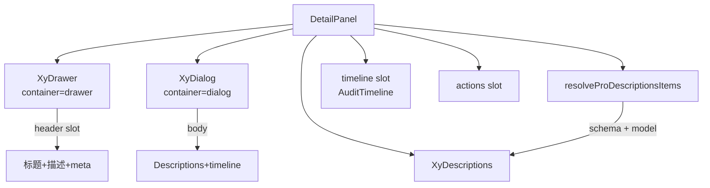

# 97 DetailPanel 详情承载面板

> 导读：DetailPanel 是统一表达"在覆盖层中查看详情"的能力，通过 `container` prop 收口侧边抽屉和弹窗两种查看容器，schema 驱动字段渲染，时间线区与操作区分离。

## 设计哲学

### Pro 组件与基础组件的区别

基础组件 `XyDrawer` 和 `XyDialog` 是两种不同的覆盖层容器，需要分别写模板；DetailPanel 通过 `container` prop 统一收口——选择 `drawer` 用侧边抽屉查看，选择 `dialog` 用居中弹窗查看，同一份 schema + 同一组 slot 在两种容器间无缝切换，使用方不再纠结选型。

### 核心设计理念

- **容器双模式**：`container` prop 一键切换 drawer / dialog，标题、内容、footer 完全复用，只切换外壳。
- **Schema 驱动字段渲染**：`schema` + `model` 驱动 `XyDescriptions` 的 items 生成，`resolveProDescriptionsItems` 自动将 ProFieldSchema 转换为 DescriptionsDataItem。
- **时间线区分离**：`timeline` slot 专门承载 AuditTimeline，与主内容区（Descriptions + default slot）视觉分离。

## 源码架构

### 文件结构

```
detail-panel/
├── index.ts                      # 模块导出 + withInstall
├── src/
│   ├── detail-panel.ts           # 类型定义
│   └── detail-panel.vue          # 模板 + 逻辑（双容器模式）
└── __tests__/
    └── detail-panel.spec.ts
```

### 组件关系图



### 核心 type 定义

```ts
/** 容器类型 */
type DetailPanelContainer = 'drawer' | 'dialog'

/** 组件 Props */
interface DetailPanelProps {
  /** 是否打开（v-model） */
  open?: boolean
  /** 面板标题 */
  title?: string
  /** 面板说明 */
  description?: string
  /** 加载态 */
  loading?: boolean
  /** 容器类型 */
  container?: DetailPanelContainer
  /** 详情数据模型 */
  model?: Record<string, unknown>
  /** 字段 schema */
  schema?: ProFieldSchema[]
  /** 透传给 XyDescriptions 的 props */
  descriptionsProps?: Omit<DescriptionsProps, 'items' | 'title' | 'extra'>
  /** 透传给 XyDrawer 的 props */
  drawerProps?: Omit<Partial<DrawerProps>, 'modelValue' | 'title'>
  /** 透传给 XyDialog 的 props */
  dialogProps?: Omit<Partial<DialogProps>, 'modelValue' | 'title'>
}

/** 组件实例 */
interface DetailPanelInstance {
  close: () => void
}
```

## 核心实现

### Schema 配置驱动机制

DetailPanel 的核心映射逻辑复用了 `resolveProDescriptionsItems`（来自 `field-schema.ts`），将 `ProFieldSchema[]` + `model` 转换为 `DescriptionsDataItem[]`：

```ts
const detailItems = computed(() =>
  resolveProDescriptionsItems(props.schema, props.model)
)
const hasDetailItems = computed(() => detailItems.value.length > 0)
```

`resolveProDescriptionsItems` 的核心逻辑：过滤 hidden 字段，为每个字段生成 DescriptionsDataItem：

```ts
function resolveProDescriptionsItems(schema, model, rowIndex = 0) {
  return schema
    .filter((field) => !resolveProFieldHidden(field, model))
    .map((field) => ({
      label: field.label,
      value: readProFieldValue(model, field.prop),
      valueType: resolveProFieldValueType(field),
      options: field.options,
      formatter: field.formatter ? ... : undefined,
      render: field.render ? ... : undefined,
      emptyValue: field.emptyValue,
      span: field.span,
    }))
}
```

在模板中，Descriptions 的 `items` 直接绑定 computed：

```vue
<xy-descriptions
  v-if="hasDetailItems"
  class="xy-detail-panel__descriptions"
  border
  :column="props.descriptionsProps?.column ?? 2"
  v-bind="props.descriptionsProps"
  :items="detailItems"
/>
```

### 容器双模式

模板层面通过 `v-if` / `v-else` 切换两个容器：

```vue
<!-- drawer 容器 -->
<xy-drawer
  v-if="props.container === 'drawer'"
  ref="drawerRef"
  v-bind="props.drawerProps"
  :model-value="props.open"
  :title="resolvedTitle"
  :size="props.drawerProps?.size ?? 520"
  @update:model-value="emit('update:open', $event)"
  @closed="emit('closed')"
>
  <!-- header: 标题 + description + meta slot -->
  <!-- body: loading态 / Descriptions + default slot / timeline slot -->
  <!-- footer: actions slot -->
</xy-drawer>

<!-- dialog 容器 -->
<xy-dialog
  v-else
  ref="dialogRef"
  v-bind="props.dialogProps"
  :model-value="props.open"
  :title="props.title"
  :width="props.dialogProps?.width ?? 760"
  @update:model-value="emit('update:open', $event)"
  @closed="emit('closed')"
>
  <!-- body: loading态 / Descriptions + default slot / timeline slot -->
  <!-- footer: actions slot -->
</xy-dialog>
```

两种容器的差异只在尺寸默认值（drawer `size=520`，dialog `width=760`）和 header 结构（drawer 有 `meta` slot，dialog 没有）。内容区完全复用同一份 Descriptions + slot 逻辑。

关闭行为通过 `requestClose` 函数统一：

```ts
function requestClose(reason) {
  if (props.container === 'drawer' && drawerRef.value) {
    drawerRef.value.handleClose(reason)
    return
  }
  if (props.container === 'dialog' && dialogRef.value) {
    dialogRef.value.handleClose(reason)
    return
  }
  emit('update:open', false)
}
```

`actions` slot 的作用域参数包含 `close` 方法，让操作按钮可以主动关闭面板：

```vue
<slot name="actions" :close="requestClose" />
```

### 加载态

当 `loading` 为 `true` 时，不渲染 Descriptions 和 timeline，而是显示加载提示：

```vue
<div v-if="props.loading" class="xy-detail-panel__loading">
  <strong>正在装载详情内容</strong>
  <span>数据返回后会展示信息卡片与历史记录。</span>
</div>
```

Drawer 容器的加载态文案更详细（两行），Dialog 容器更简洁（单行）。两者在非加载态下的内容结构一致：Descriptions + default slot + timeline slot。

### 组件间组合方式

DetailPanel 通常与 AuditTimeline 配合使用：

```vue
<xy-detail-panel
  v-model:open="panelOpen"
  container="drawer"
  title="订单详情"
  :schema="orderSchema"
  :model="orderData"
>
  <template #timeline>
    <xy-audit-timeline :items="orderLogs" compact />
  </template>
  <template #actions="{ close }">
    <xy-button @click="close">关闭</xy-button>
    <xy-button type="primary" @click="handleApprove">审批通过</xy-button>
  </template>
</xy-detail-panel>
```

`compact` 模式的 AuditTimeline 更适合嵌入面板场景，节点间距更紧凑。

## API 参考

### Props

| 属性 | 说明 | 类型 | 默认值 |
|------|------|------|--------|
| open | 是否打开（v-model） | `boolean` | `false` |
| title | 面板标题 | `string` | `'详情信息'` |
| description | 面板说明 | `string` | `''` |
| loading | 加载态 | `boolean` | `false` |
| container | 容器类型 | `'drawer' \| 'dialog'` | `'drawer'` |
| model | 详情数据模型 | `Record<string, unknown>` | `{}` |
| schema | 字段 schema | `ProFieldSchema[]` | `[]` |
| descriptionsProps | 透传给 XyDescriptions 的 props | `Omit<DescriptionsProps, 'items' \| 'title' \| 'extra'>` | `{}` |
| drawerProps | 透传给 XyDrawer 的 props | `Partial<DrawerProps>` | `{}` |
| dialogProps | 透传给 XyDialog 的 props | `Partial<DialogProps>` | `{}` |

### Emits

| 事件 | 说明 | 回调参数 |
|------|------|----------|
| update:open | 打开状态变化 | `(value: boolean)` |
| closed | 面板完全关闭后 | — |

### Slots

| 插槽 | 说明 | 作用域参数 |
|------|------|-----------|
| default | 主内容区 | — |
| description | 头部说明区 | — |
| meta | 头部右侧元信息（仅 drawer） | `{ close }` |
| timeline | 时间线区 | — |
| actions | 底部操作区 | `{ close }` |

### Exposes

| 方法 | 说明 |
|------|------|
| close | 主动关闭面板 |

## 小结

1. **容器双模式一键切换**：`container` prop 在 drawer / dialog 间切换，内容区的 Descriptions + timeline + actions 完全复用，只切换外壳。
2. **resolveProDescriptionsItems 自动映射**：schema + model 自动转换为 DescriptionsDataItem，valueType / formatter / render / options 全部继承 ProFieldSchema 协议。
3. **actions slot 暴露 close**：操作按钮通过 `{ close }` 作用域参数主动关闭面板，无需维护外部 open 状态。