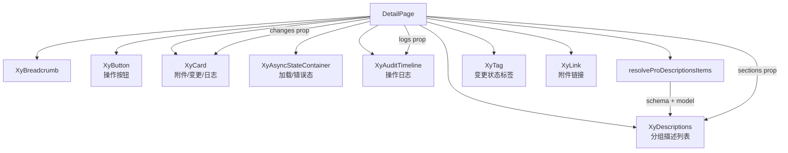

# 98 DetailPage 详情页面

> 导读：DetailPage 是详情页的一站式承载体，提供面包屑导航、标题栏、操作按钮、分组信息区、附件区、变更对比区与操作日志区，让详情页配置即生成。

## 设计哲学

### Pro 组件与基础组件的区别

基础组件只提供单点能力（`XyBreadcrumb` 管导航、`XyDescriptions` 管字段、`XyCard` 管卡片）；DetailPage 把这些组合成一个完整的详情页骨架——面包屑 + 标题 + 操作区 + 分组描述列表 + 附件 + 变更对比 + 审计日志，业务只需关注每组放什么数据。

### 核心设计理念

- **分组信息区**：`sections` prop 将详情字段按业务分组，每个 section 有独立标题、描述和 schema/model 配置。
- **变更对比**：`changes` prop 描述字段变更前后的值，自动过滤 `status === 'same'` 的无变化项，只展示有意义的 diff。
- **操作日志复用**：`logs` prop 直接使用 AuditTimeline 的 `AuditTimelineEntry` 类型，内部渲染 `<xy-audit-timeline compact />`，零额外代码。

## 源码架构

### 文件结构

```
detail-page/
├── index.ts                    # 模块导出 + withInstall
├── src/
│   ├── detail-page.ts          # 类型定义
│   └── detail-page.vue         # 模板 + 逻辑
└── __tests__/
    └── detail-page.spec.ts
```

### 组件关系图



### 核心 type 定义

```ts
/** 面包屑项 */
interface DetailPageBreadcrumbItem {
  label: string
  href?: string
}

/** 操作按钮，复用 ProPageAction */
type DetailPageAction = ProPageAction

/** 分组信息区 */
interface DetailSectionItem {
  key: string
  title: string
  description?: string
  model?: Record<string, unknown>
  schema?: ProFieldSchema[]
  items?: DescriptionsDataItem[]
  descriptionsProps?: Omit<DescriptionsProps, 'items' | 'title' | 'extra'>
}

/** 附件文件 */
interface DetailPageAttachmentFile {
  id: string | number
  name: string
  size?: string
  status?: 'primary' | 'success' | 'warning' | 'danger' | 'neutral'
  url?: string
}

/** 变更对比项 */
interface ChangeDiffItem {
  key: string
  label: string
  before?: string
  after?: string
  status?: 'added' | 'removed' | 'changed' | 'same'
}

/** 组件 Props */
interface DetailPageProps {
  title?: string
  description?: string
  breadcrumbs?: DetailPageBreadcrumbItem[]
  actions?: DetailPageAction[]
  loading?: boolean
  error?: string | null
  sections?: DetailSectionItem[]
  attachments?: DetailPageAttachmentFile[]
  changes?: ChangeDiffItem[]
  logs?: AuditTimelineEntry[]
}
```

## 核心实现

### Schema 配置驱动机制

每个 `DetailSectionItem` 支持两种数据源：

1. **schema + model**：通过 `resolveProDescriptionsItems` 自动生成 `DescriptionsDataItem`
2. **items**：直接传入预构造的 `DescriptionsDataItem`

组件内部的优先级逻辑：

```ts
function resolveSectionItems(section: DetailSectionItem) {
  if (section.schema?.length) {
    return resolveProDescriptionsItems(section.schema, section.model ?? {})
  }
  return section.items ?? []
}
```

schema 优先于 items——如果同时提供了 schema 和 items，schema 生成的结果会被使用。这意味着有 ProFieldSchema 的场景不需要手工构造 items 数组。

在模板中，每个 section 渲染为一个独立的区块，支持具名 slot 自定义：

```vue
<section v-for="section in props.sections" :key="section.key">
  <h3>{{ section.title }}</h3>
  <p v-if="section.description">{{ section.description }}</p>
  <slot :name="section.key" :section="section">
    <xy-descriptions
      v-if="resolveSectionItems(section).length"
      border
      :column="section.descriptionsProps?.column ?? 2"
      v-bind="section.descriptionsProps"
      :items="resolveSectionItems(section)"
    />
  </slot>
</section>
```

### 变更对比区

`changes` prop 描述字段变更前后的值。组件自动过滤 `status === 'same'` 的无变化项：

```ts
const visibleChanges = computed(() =>
  props.changes.filter((item) => item.status !== 'same')
)
```

变更状态的标签映射：

```ts
function resolveDiffStatus(status?: string) {
  if (status === 'added') return 'success'
  if (status === 'removed') return 'danger'
  if (status === 'changed') return 'warning'
  return 'primary'
}
```

渲染结果：每个变更项显示字段名 + 状态 Tag + 旧值 + 新值：

```vue
<div v-for="item in visibleChanges" :key="item.key">
  <div class="xy-detail-page__change-label">
    <span>{{ item.label }}</span>
    <xy-tag size="sm" :status="resolveDiffStatus(item.status)">
      {{ item.status }}
    </xy-tag>
  </div>
  <div class="xy-detail-page__change-value is-before">{{ item.before || '-' }}</div>
  <div class="xy-detail-page__change-value is-after">{{ item.after || '-' }}</div>
</div>
```

### 加载/错误态

DetailPage 使用 `XyAsyncStateContainer` 承接加载态和错误态：

```vue
<xy-async-state-container :loading="props.loading" :error="props.error">
  <!-- sections / attachments / changes / logs -->
</xy-async-state-container>
```

`AsyncStateContainer` 在 loading 为 true 时显示加载动画，在 error 有值时显示错误提示，两种状态都不会渲染内部内容。

### 附件区

附件区渲染为 `XyCard` + 文件列表：

```vue
<xy-card v-if="props.attachments.length > 0" header="附件信息">
  <div v-for="file in props.attachments" :key="file.id">
    <xy-link type="primary" underline="hover" :href="file.url" :target="file.url ? '_blank' : undefined">
      {{ file.name }}
    </xy-link>
    <span v-if="file.size">{{ file.size }}</span>
    <xy-tag v-if="file.status" size="sm" :status="file.status">{{ file.status }}</xy-tag>
  </div>
</xy-card>
```

有 `url` 的附件渲染为可点击的 `XyLink`（`target="_blank"`），无 `url` 的仅显示文件名。`size` 和 `status` 是可选的补充信息。

### 操作日志区

日志区直接复用 AuditTimeline：

```vue
<xy-card v-if="props.logs.length > 0" header="操作日志">
  <xy-audit-timeline :items="props.logs" compact />
</xy-card>
```

`compact` 模式适合嵌入详情页场景，节点间距更紧凑。`logs` 的类型是 `AuditTimelineEntry[]`，与 AuditTimeline 完全一致。

## API 参考

### Props

| 属性 | 说明 | 类型 | 默认值 |
|------|------|------|--------|
| title | 页面标题 | `string` | `''` |
| description | 页面描述 | `string` | `''` |
| breadcrumbs | 面包屑导航 | `DetailPageBreadcrumbItem[]` | `[]` |
| actions | 操作按钮列表 | `DetailPageAction[]` | `[]` |
| loading | 加载态 | `boolean` | `false` |
| error | 错误信息 | `string \| null` | `null` |
| sections | 分组信息区 | `DetailSectionItem[]` | `[]` |
| attachments | 附件列表 | `DetailPageAttachmentFile[]` | `[]` |
| changes | 变更对比项 | `ChangeDiffItem[]` | `[]` |
| logs | 操作日志 | `AuditTimelineEntry[]` | `[]` |

### Emits

| 事件 | 说明 | 回调参数 |
|------|------|----------|
| — | 无自定义事件，纯展示组件 |

### Slots

| 插槽 | 说明 | 作用域参数 |
|------|------|-----------|
| `[section.key]` | 分组信息区自定义 | `{ section }` |
| actions | 操作区自定义 | — |
| meta | 标题旁元信息 | — |

### Exposes

| 方法 | 说明 |
|------|------|
| — | 无 expose，纯展示组件 |

## 小结

1. **sections 的 schema/items 双入口**：每个 section 支持 `schema + model` 自动生成或直接传入 `items`，schema 优先，两种数据源无缝切换。
2. **变更对比自动过滤**：`visibleChanges` computed 过滤 `status === 'same'` 的无变化项，只展示有意义的 diff，降低视觉噪音。
3. **AuditTimeline 复用**：`logs` prop 直接使用 `AuditTimelineEntry` 类型，内部渲染 `<xy-audit-timeline compact />`，详情页的审计日志区零额外代码。