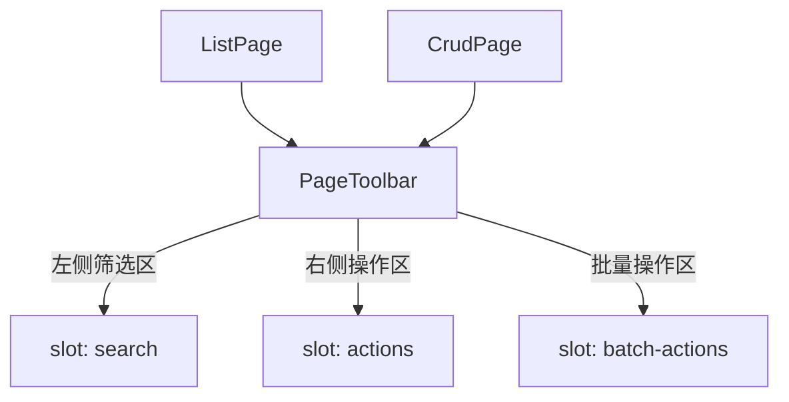

# 99 PageToolbar 页面工具栏

> 导读：PageToolbar 是中后台页面操作区的标准化容器，将「筛选 + 操作按钮 + 批量操作」三段式布局收敛为声明式配置，消除每个页面重复手写 flex 布局的样板代码。

## 设计哲学

中后台列表页的工具栏区域有着极其稳定的结构——左侧放搜索/筛选，右侧放主操作按钮，选中行后还要冒出批量操作区。这套布局在几乎每个页面都重复出现，但每次都要手写 `display: flex; justify-content: space-between`，再配合条件显隐的批量操作栏，代码冗余且不一致。

PageToolbar 的核心设计思路是**布局约定大于配置**：不需要告诉组件"左侧放哪、右侧放哪"，只需要把内容塞进对应的 slot，组件自动按三段式排布。同时通过 `active` 状态管理批量操作栏的显隐动画，让工具栏在不同交互阶段拥有一致的视觉表现。

作为 Pro 页面容器体系中最基础的原子组件，PageToolbar 被 ListPage、CrudPage 等高级组件直接消费，开发者通常不需要单独使用它——但理解它的布局模型是理解整个 Pro 体系的关键。

## 源码架构

### 文件结构

```
page-toolbar/
├── index.ts                  # 导出入口
└── src/
    ├── page-toolbar.vue      # 组件实现
    └── page-toolbar.ts       # 类型定义 & props
```

### 组件关系图



### 核心 type 定义

```ts
export interface PageToolbarProps {
  /** 是否展示批量操作栏（通常由表格选中状态驱动） */
  active?: boolean
}
```

## 核心实现

### 三段式布局

PageToolbar 的模板结构极简——一个根容器内嵌三个具名 slot，通过 flex 布局实现左-右-底的排列：

```vue
<template>
  <div class="xy-page-toolbar">
    <div class="xy-page-toolbar__main">
      <div class="xy-page-toolbar__search">
        <slot name="search" />
      </div>
      <div class="xy-page-toolbar__actions">
        <slot name="actions" />
      </div>
    </div>
    <Transition name="xy-slide-down">
      <div v-if="active" class="xy-page-toolbar__batch">
        <slot name="batch-actions" />
      </div>
    </Transition>
  </div>
</template>
```

关键设计点：

- **主区域** `__main` 采用 `display: flex; justify-content: space-between`，search 靠左、actions 靠右，无需额外配置。
- **批量操作区** `__batch` 使用 `Transition` 组件包裹，`active` 从 `false` 切换到 `true` 时触发下滑进入动画，退出时上滑收起。
- 批量操作区与主区域之间有分隔线，视觉上明确区分普通操作和批量操作。

### active 状态驱动

`active` prop 通常与表格的选中状态绑定：

```vue
<PageToolbar :active="selectedRows.length > 0">
  <template #search>
    <SearchForm ... />
  </template>
  <template #actions>
    <XyButton type="primary">新建</XyButton>
  </template>
  <template #batch-actions>
    已选 {{ selectedRows.length }} 项
    <XyButton>批量删除</XyButton>
  </template>
</PageToolbar>
```

当用户取消所有选中行时，`active` 变为 `false`，批量操作栏自动带动画收起。

### 在 ListPage / CrudPage 中的消费方式

PageToolbar 作为 ListPage 和 CrudPage 的内部子组件被自动渲染，开发者通过 ListPage 的 `toolbar` slot 或 CrudPage 的 `toolbar` slot 间接控制内容，无需手动引入 PageToolbar。

## API 参考

### Props

| 属性 | 类型 | 默认值 | 说明 |
|------|------|--------|------|
| active | `boolean` | `false` | 是否展示批量操作栏 |

### Slots

| 插槽名 | 说明 |
|--------|------|
| search | 左侧搜索/筛选区域 |
| actions | 右侧操作按钮区域 |
| batch-actions | 批量操作区域（仅在 `active` 为 `true` 时显示） |

### Emits

无

### Exposes

无

## 小结

1. **布局约定大于配置**：search/actions/batch-actions 三段式 slot 自动排布，无需手写 flex 样式。
2. **active 状态驱动批量操作栏**：与表格选中状态联动，配合 Transition 实现平滑的显隐动画。
3. **作为底层原子被高级组件消费**：ListPage 和 CrudPage 内部自动渲染 PageToolbar，开发者通常通过高级组件的 slot 间接使用。
