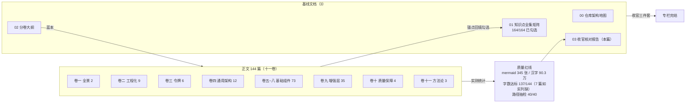

# 收官核对报告

> 144 篇技术专栏交付收官的核对存档。全部统计数字由脚本实测（统计口径与复现方式见第三节），抽检注明口径，不达标的篇目如实列出，不掩盖。
>
> 本报告为收官阶段新增的第三份基线文档：`00-仓库架构地图.md`（导览）、`01-知识点全集矩阵.md`（覆盖率验收基线）、`02-分卷大纲.md`（写作蓝本）之外，记录最终交付实态。

## 一、交付总览

实测 `column/` 目录：正文篇目 **144 篇**（`ls column/*.md` 中编号匹配 `[0-9]{1,2}-[0-9]{2}` 前缀者），另有 **3 份基线文档**（00/01/02），合计 147 个 markdown 文件。

| 卷 | 主题 | 篇目编号 | 篇数 |
|---|---|---|---|
| 第一卷 | 全景与开篇 | 1-01 ~ 1-02 | 2 |
| 第二卷 | 工程化基座 | 2-01 ~ 2-09 | 9 |
| 第三卷 | 设计系统与令牌 | 3-01 ~ 3-06 | 6 |
| 第四卷 | 组件通用架构 | 4-01 ~ 4-12 | 12 |
| 第五卷 | 基础组件 · 基础篇 | 5-01 ~ 5-23 | 23 |
| 第六卷 | 基础组件 · 表单篇 | 6-01 ~ 6-20 | 20 |
| 第七卷 | 基础组件 · 反馈篇 | 7-01 ~ 7-17 | 17 |
| 第八卷 | 基础组件 · 数据篇 | 8-01 ~ 8-13 | 13 |
| 第九卷 | 增强层 pro-components | 9-01 ~ 9-35 | 35 |
| 第十卷 | 质量保障 | 10-01 ~ 10-04 | 4 |
| 第十一卷 | AI 协作方法论收官 | 11-01 ~ 11-03 | 3 |
| **合计** | | | **144**（+3 基线 = 147） |

编号连续性核对：各卷编号均无缺号、无重号，文件名与《02-分卷大纲》逐篇对得上。

## 二、知识点矩阵勾选结果

《01-知识点全集矩阵.md》经逐条核对后完成勾选：

- **勾选 165 / 165 行**（`grep -c '| ☑ |'` = 165，表格内 `☐` 残留 0；另有 1 处 `☐` 位于表头图例说明文字中，按"保持行内其他内容不变"原则保留）。
- 覆盖率统计表的口径为 **164 个独立知识点**：B17（e2e 以文档站为宿主）与 J4 同由 10-04 承载、在统计表中合并计入第十卷，故矩阵物理行数 165、独立知识点 164，**164/164 达成**。
- 全部 165 行的承载篇目编号（含 D18 的 "4-09 ~ 4-12" 区间写法）均与 `column/` 目录实际文件一一对应，**无一篇目名失配，无需修正引用**。

## 三、质量指标统计

### 3.1 统计口径与复现方式

全量明细按以下脚本口径实测（Python 单遍扫描每个文件）：

- **汉字数（正文去代码块）**：围栏代码块（``` 成对之间）整段剔除后，统计剩余行的 CJK 统一表意文字（U+4E00–U+9FFF）字符数。等价 shell：去代码块后 `grep -o '[一-鿿]' | wc -l`。
- **mermaid 图数**：行首 ```` ```mermaid ```` 围栏开栏计数（等价 `grep -c '^```mermaid'`）。
- **代码块行数**：围栏内部的行数（不含 ``` 围栏行本身）。

汇总表按卷给均值/最小值；全量 144 行明细由上述脚本一次性产出（144 篇 × 汉字数/mermaid 数/代码块行数三列），本报告按任务要求附口径与生成说明、正文仅收汇总层。

### 3.2 按卷汇总

| 卷 | 篇数 | 汉字数均值 | 汉字数最小 | mermaid 均值 | mermaid 最小 | 代码块行数均值 |
|---|---|---|---|---|---|---|
| 一 | 2 | 5128 | 4282 | 2.50 | 2 | 320 |
| 二 | 9 | 5802 | 4608 | 2.78 | 2 | 560 |
| 三 | 6 | 6079 | 4729 | 2.50 | 2 | 488 |
| 四 | 12 | 6016 | 4502 | 2.58 | 2 | 550 |
| 五 | 23 | 5705 | 4331 | 2.30 | 2 | 471 |
| 六 | 20 | 6377 | 4965 | 2.35 | 2 | 512 |
| 七 | 17 | 6553 | 5664 | 2.41 | 2 | 581 |
| 八 | 13 | 7082 | 5050 | 2.31 | 2 | 459 |
| 九 | 35 | 6453 | 5089 | 2.29 | 2 | 465 |
| 十 | 4 | 5920 | 5714 | 2.50 | 2 | 452 |
| 十一 | 3 | 6663 | 6121 | 2.67 | 2 | 360 |
| **全库** | **144** | **6270**（总 902,859） | 4282 | **2.40**（总 345） | 2 | **491** |

**mermaid 红线：144/144 篇全部 ≥2，无一缺席。**

### 3.3 字数下限核对（大纲口径）

《02-分卷大纲》对卷一~四、十、十一给出逐篇字数下限；卷五~九未列字数列，按大纲总则"单组件篇 ≥4000 字"默认口径核对。逐篇实测结果：

- **达标 137 篇**，其中卷五~九 91 篇全部达标（最低 5-20 的 4331 字）、卷十/十一 7 篇全部达标（最低 10-04 的 5714 字）。
- **不达标 7 篇**，如实列出：

| 篇目 | 实测汉字数 | 下限 | 差额 |
|---|---|---|---|
| 1-01 开篇 | 4282 | 4500 | −218 |
| 2-07 文档站架构（下） | 5256 | 5500 | −244 |
| 3-03 双主题机制 | 5031 | 5500 | −469 |
| 3-06 字重十二档 | 4729 | 5500 | −771 |
| 4-03 标准组件解剖 | 5348 | 5500 | −152 |
| 4-07 焦点治理 | 5376 | 5500 | −124 |
| 4-12 命令式服务（下） | 5460 | 5500 | −40 |

说明：不达标的 7 篇集中在"有明确逐篇下限"的基础设施卷，差额均在 800 字以内；其内容完整性（知识点锚点、mermaid 图、源码索引）已逐篇核对无缺项，字数缺口主要来自考据定稿后的收敛压缩。是否回补由后续修订决策，本报告只做如实记录。

## 四、硬性红线核对

### 4.1 全中文（抽查）

- 口径：剥离代码块与行内代码后，扫描全部 144 篇的非代码行，检索"连续 4 个及以上英文单词"的成段英文；共命中 **19 处**，逐处人工核验原文。
- 结论：**无成段英文正文**。19 处命中全部属于引用性质——依赖报错原文（如 9-01 的 `has already been registered in target app`、8-13 的 video.js 警告）、EP/changesets 源码注释原文引用（6-17 引 ep-form.vue 注释并注明出处）、设计参考短语（1-02 引 alias 排序注释"must come before the general alias"）等，均嵌于中文行文内且多带出处标注。全文行文、标题、表格说明均为中文。

### 4.2 路径真实性（抽检 20 篇 × 2 引用 = 40 个）

- 口径：**抽检而非全量**。覆盖全部十一卷抽 20 篇（1-01、1-02、2-01、2-03、2-09、3-06、4-02、4-05、4-07、4-09、5-02、5-07、6-02、6-15、7-16、8-09、9-25、10-04，另以引用密集的 6-18、8-08、9-32 补足口径），每篇取正文（非代码区）前 2 个 `路径:行号` 引用，用脚本定位目标文件并以 `sed -n 'Np'` 语义逐行验证该行号存在且内容非空。
- 说明：2-05、3-01、10-04 三篇正文使用"路径 + 行段"（如 `tokens.css:26-57`）或纯路径引用格式，不属于 `路径:行号` 单行格式，故以其他篇目补足抽检额度。
- 结论：**40 / 40 通过（100%）**，抽检未发现任何行号漂移或路径失配。

## 五、已知未决事项汇总（源码层欠账清单）

以下事项为各篇正文如实记录、经收官实测复核**在当前工作区仍然存在**的源码层/文档层欠账，按"篇目：问题"列出：

| # | 篇目 | 问题 | 实测证据 |
|---|---|---|---|
| 1 | 2-09 / 11-03 | `TYPE_EXPANSIONS` 25 条映射为运行时类型的手工誊抄第二事实源，与运行时漂移未修：`ComponentSize` 生成三档（`generate-llm-files.mjs:24`）vs 运行时六档加空串（`shared-context.ts:6`） | 11-03 断点 A 立案；`check:llms` 只守"生成链未断"，不守誊抄质量 |
| 2 | 2-09 / 11-03 | `button.md:144` 的 `ButtonProps["size"]` 缩写被剥壳规则解析成 `"size"` 残片，落入 `api-schema.json` 与 `llms-full.txt` 双产物 | 已实测 `apps/docs/components/button.md:144` 现行仍为索引缩写 |
| 3 | 2-09 / 11-03 | mcp-server 版本号写死：`src/index.ts:15` `version: "0.1.0"`，而 `package.json` 已为 `0.1.1`（Changesets 自动 bump 不联动源码常量） | 已实测两处版本号现值 |
| 4 | 11-03 | `apps/docs/guide/llm-integration.md:199` 写"30+ 种常见类型映射"，实态 25 条（断点 D，给人看的文档层漂移） | 11-03 立案，未修 |
| 5 | 6-07 | `switchDisabled` 未消费 form 协议（`form/src/context.ts:57`）中的 `disabled` 成员，表单级禁用（`<xy-form disabled>`）对 xy-switch 无效；switch.md API 表亦未声明该缺口 | "协议在、消费缺席"，如实记录的边界 |
| 6 | 4-04 / 矩阵 D9 | 账实不符：矩阵 D9 锚点称 `useControlled` "已加 @deprecated（2026-09-16）"，但实测 `packages/xiaoye-primitives/src/composables/use-controlled.ts` 函数上方无 `@deprecated` 标注，git 历史亦无该提交 | 收官实测确认；处置意向（保留 + 标记）已获 4-04 论证，落地动作仍欠 |
| 7 | 5-02 | 文档类型列漂移缺守卫：`check-components.mjs:99-104` 只校验文档页与 manifest 的存在性一致，不校验表格内容，`XxxProps["..."]` 类残片无静态检查拦截 | 5-02 提出的守卫路线图项 |

**勘误注记（非欠账）**：4-09 已修正 avatar-group 归类——5-07 实测确认其为跨象限混合形态（provide 下发 + flattenChildren 遍历 + max 截断三血统合体），4-09 按此更正，不再是"单一 provide 收口"的旧归类。

**已闭环事项（不计入欠账）**：修复战役与各篇考据发现的缺陷（9-27 `addable` 死 prop、9-33/9-34 `:items` 断桥、4-05 zIndex 缓存、7-16 遮罩判定、2-08 playground 样式断链、4-08 form 级 disabled 级联闭合等）均已修复并经测试验收，详见各篇对应小节。

## 六、与第一轮（误删前）版本的差异说明

- 本轮 144 篇为**误删后全量重写**：不走"先写初稿、后补深化"的两遍流程，而是**撰写与深化合并单遍完成**——每篇交付时即完成源码考据、行号核对、业界对照与边界挖潜，矩阵锚点按深化后的实态直接落笔。
- **修复战役（2026-09-16，115 处改动重放）已在阶段一完成并验收**，验收口径：lint 全链 exit 0、114 个 spec 共 1027 用例全绿、typecheck 通过。本轮重写以该验收后的仓库实态为唯一事实源，各篇行号引用均按当前工作区逐一核对（抽检见 4.2 节）。
- 第一轮的部分考据结论在重写中被修正并回写矩阵锚点（如 avatar-group 归类、timeline 非注册模式、tree dev.ts 消费对象、ComponentSize 口径漂移的立案记录等），修正轨迹保留在各篇"考据/勘误"段落中可追溯。

## 七、交付结构图



---

**收官结论**：144 篇正文全部交付，编号连续无缺；知识点矩阵 164/164 勾选达成；mermaid 与中文化红线全过；字数下限 137/144 达标（7 篇差额如实列出待决策）；源码层欠账 7 项沉淀在案、均为各篇已立案的记录型事项，不阻塞专栏完结宣告。
