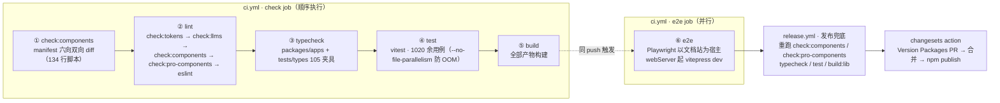
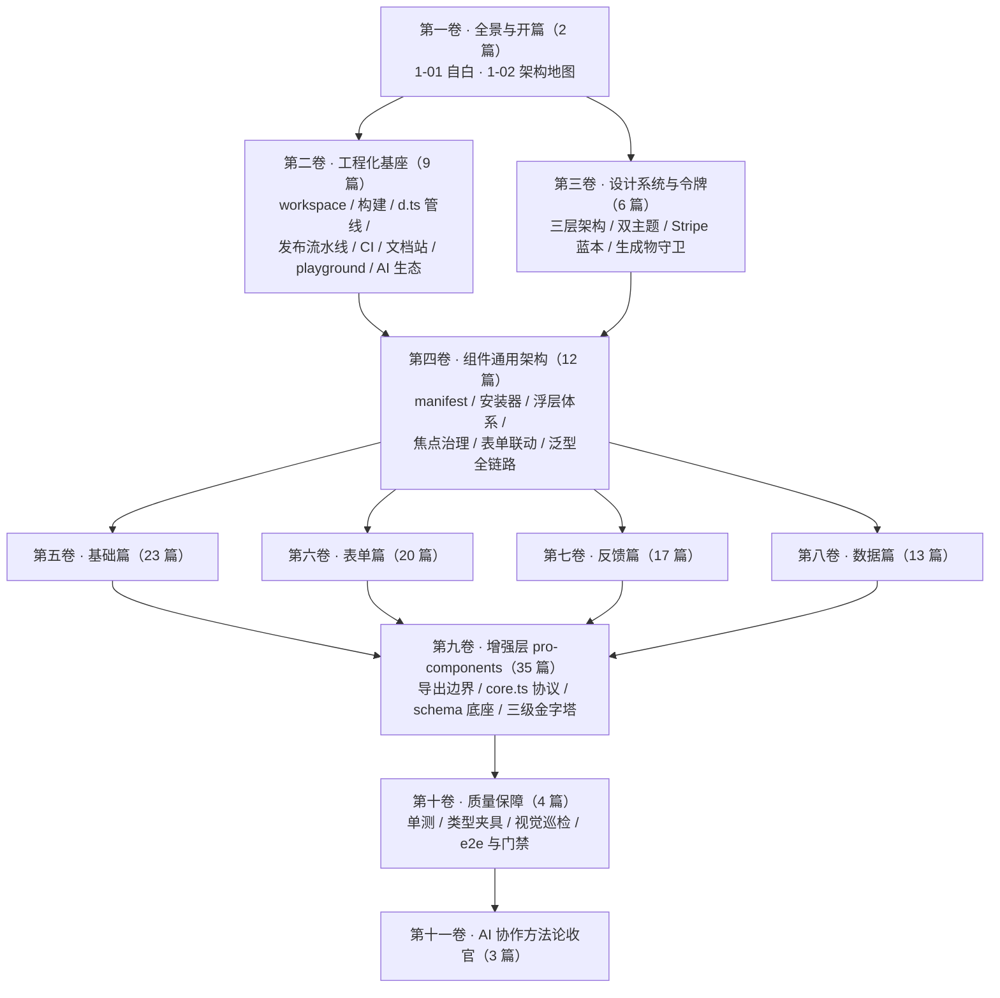

# 1-01 · 开篇：一个 AI 协作组件库的自白

> 本篇是《AI 协作研发组件库》系列第一卷第 1 篇。文中所有数据与路径均以 2026-09-23 的仓库实态为准，写作前逐条复核过；路径均相对仓库根目录。这个仓库的代码由 AI 协作编写——人类负责需求、审阅与决策——所以这不是一篇"如何用 AI 提效"的软文，而是一份关于"AI 写的代码凭什么敢发布到 npm"的取证报告。核心问题只有一个：**用 AI 写组件库，如何保证质量不是空中楼阁？**

## 一、先回答一个不太体面的问题：为什么让 AI 写组件库

先把动机摆上台面，因为它不是"AI 很火所以试试"。

组件库的工作量构成有一个反直觉的特点：真正需要"灵光一现"的算法实现，占比小得可怜。拿全库最小的组件 `divider`（分隔线）来说：源码一共 75 行——`packages/components/divider/src/divider.vue` 59 行加 `divider.ts` 16 行。这 75 行，任何熟手十分钟内写完。但围绕它的配套资产是：84 行单测（`packages/components/divider/__tests__/divider.spec.ts`）、7 个文档示例（`apps/docs/examples/divider/` 下的 basic、vertical、scene 等 7 个 `.vue`）、文档页 API 表格、类型导出、双主题样式。写 75 行逻辑是分钟级的事，把它补齐到"可发布"是小时级甚至天级的事。

放大到全库，这笔账更清楚。当前仓库发布四个包：`xiaoye-components@1.1.0`（72 个基础组件）、`xiaoye-pro-components@2.0.0`（31 个增强组件）、`xiaoye-primitives@1.1.0`（基础设施层）、`xiaoye-mcp-server@0.1.1`（AI 查询层），版本号取自各自 `packages/*/package.json`。支撑这些组件的是 `packages/theme` 下 103 个 CSS 文件、合计 18,374 行样式，114 个 vitest spec 文件（76 个基础组件 + 34 个增强组件 + 3 个 primitives + 1 个文档站画廊，合计 1020 余个 `it` 用例），105 个类型测试夹具。组件库的本质成本不在"写"，而在**一致性**：API 命名跨 103 个组件一致、类型声明完备且随实现演进、文档与代码不漂移、样式全部令牌化。这些工作机械、重复、低容错——恰恰是人的耐心最容易耗尽、而 AI 加机械校验最擅长的部分。

所以结论要倒过来说：不是"AI 能写代码，所以让它写组件库"，而是组件库的工作结构（大量强约定、可校验、低创造性余地的活）与"AI 生成 + 机械守卫"的组合恰好咬合。人应当把时间花在需求取舍、API 审美和守卫设计上，而不是逐行核对第 38 个组件的 `size` prop 是不是也叫 `size` 而不是 `sizeType`。

但这个组合有一个前提必须先成立：**AI 的高速生成不能变成高速制造垃圾**。这就引出本文真正的主旨——"失控"到底指什么，以及这个仓库用什么结构兜住它。

## 二、"失控"的三种含义

讨论"AI 写代码会不会失控"时，失控这个词太模糊，值得拆成三种具体的工程故障模式。这三种模式在本仓库都真实出现过，各自的对策也不同。

### 2.1 架构漂移

AI 的每次生成都是局部视角：你让它改 select，它看不见 dropdown 里的同构逻辑。放任下去，72 个组件里十几处需要浮层的地方会长出十几套大同小异的定位实现——每一套单看都能跑，合起来就是没人敢动的重复代码。

本仓库的对策是把纪律**编译进依赖图**，而不是写进口号。全库浮层（tooltip、popover、popconfirm、dropdown、dialog、drawer，加七个表单弹层）共享 `packages/xiaoye-primitives/src/composables` 里的同一组基础设施：`use-floating-visibility`（visible/rendered/isAnimating 三态状态机）、`use-overlay-stack`（全局浮层栈，zIndex 自 2000 动态发号）、`use-focus-trap`（焦点陷阱）等。依赖方向严格单向：`pro-components → components → primitives`。更关键的是 `packages/pro-components/package.json:44-48` 里，增强层对基础层声明的是 `peerDependencies: { "xiaoye-components": "workspace:^" }`——底座包对上游没有任何 dependencies，想让 primitives 反向 import 一个具体组件，TypeScript 编译期直接报错。**边界写在 README 里会被遗忘，写进依赖图里就是铁律。**这是对架构漂移的第一层回答：能用编译器执行的约束，就不要指望生成模型自觉。

### 2.2 API 膨胀

生成模型有个讨好型人格：你说"想要排序工具栏"，它给你加一个 prop；下次你说"想要自定义单元格渲染"，它再加一个。每个 prop 单看都合理，累积起来就是一个没人敢动 major 的泥球。

`xiaoye-pro-components` 发 2.0.0 独立大版本，干的就是这件事：API 面大收口。根入口 `packages/pro-components/index.ts` 只允许导出正式公开组件的值，以及每个组件的主 `Props / Instance` 类型；插槽入参、事件载荷、内部状态枚举、props 字面量联合，全部降级到组件子入口。这条边界同样不靠自觉——`tests/types/fixtures/pro-root-boundary.ts` 用 `@ts-expect-error` 负向断言把"这些类型不允许从根入口导入"逐条锁死，而且同一批断言用 `@xiaoye/pro-components`（内部 alias）和 `xiaoye-pro-components`（npm 包名）**两个包名各写一遍**。为什么要写两遍？因为两条路径解析到同一个根入口，只锁一个名字，换个 import 来源守卫就漏了。这个细节来自一次真实的踩坑：仓库内部用 alias 开发，npm 用户用包名安装，守卫如果不覆盖双名，等于只锁了一半的门。

### 2.3 质量塌陷

AI 生成的代码有个恼人的特征：**看起来都对**。类型齐全、命名规范、注释得体，但边界语义是错的。举两个这库真实遇到的问题：浮层正在播放关闭动画时再点一次触发器，会发生什么？（状态机如果缺少"离场动画中"守卫，visible 会被二次翻转，浮层闪灭。）多选 select 的 `modelValue` 默认值该是 `null` 还是 `[]`？（`null` 在这里是兼容性上的刻意设计，但如果不写测试锁定，下一轮 AI 生成就会"好心"把它改成 `[]`。）

这类问题 code review 很难肉眼看出——人类审阅者面对一千行生成代码时，注意力曲线是客观规律。能兜住的只有运行时行为验证：单测、类型负向断言、像素级视觉对比。于是话题自然过渡到本文的核心。

## 三、质量不靠人肉：守卫先于代码

这个仓库有一条元约定，先于所有具体约定：**任何一条规则如果不配一个机械校验，就默认它会被违反**。不是生成模型"不认同"这条规则，而是它的上下文窗口没有记忆——第 40 个组件生成时，第 1 个组件定下的惯例早已离开窗口。约定必须外化为守卫，才对 AI 持续可见。

### 3.1 三层防线

| 防线 | 资产规模 | 机制要点 |
|---|---|---|
| 单测 | 114 个 spec、1020 余个 `it`（vitest + jsdom） | 行为契约，每个 bug 修复强制补测试佐证 |
| 类型夹具 | `tests/types/fixtures/` 105 个夹具、215 条 `@ts-expect-error`、0 条 `ts-ignore` | 负向断言锁死"错误用法必须编译失败" |
| 视觉巡检 | `scripts/visual-audit.mjs`，1064 张双主题元素级截图基线 | pixelmatch 像素对比，差异超 0.5% 退出码 1 |

三道防线里最值得展开的是第二道。`@ts-expect-error` 和 `ts-ignore` 长得像，语义却天差地别：后者是"我知道这行有错，别管我"，前者是"**这行必须报错，如果不报了，请报我的错**"。这意味着负向断言是自证的守卫——某天有人把 API 改好了，对应夹具不再产生类型错误，`@ts-expect-error` 自身会变成编译错误提醒你更新断言。守卫会过期，但过期时会喊。215 条这样的断言、零条 `ts-ignore`，是这个仓库类型契约的实际含金量；整批夹具由 `pnpm typecheck:types`（`vue-tsc -p tests/types/tsconfig.json`）独立校验，不混在业务代码的类型检查里。

第三道防线解决的是单测的盲区：jsdom 不会渲染像素，暗色主题下的颜色回归单测天然看不见。`pnpm audit:visual` 用 Playwright 对文档站所有 demo 做元素级截图，浅色、暗色各一遍，与 `output/visual-baseline` 基线做 pixelmatch 对比（`scripts/visual-audit.mjs:267`）。1064 张基线图的规模记录在该脚本与 `docs/archive/审计报告-2026-05-23.md:115` 中——59 处 px 值替换 token 后"双主题像素对比 1064 张截图零差异"，就是这道防线交出的验收单。

### 3.2 六道门禁

防线是资产，门禁是流程。下面这张图是每次 push 到 main 与每个 PR 实际经过的闸门（`.github/workflows/ci.yml`），以及发布兜底（`.github/workflows/release.yml`）：

三个值得停留的细节。

**其一，eslint 不是第一道闸。**`package.json` 里 `lint` 脚本的前四段是四份事实源同步校验：`check:tokens`（tokens.css 改了没重新生成 TS 常量层？拦下）、`check:llms`（文档 md 改了没重新生成 llms-full.txt？拦下）、`check:components`（新组件没进 manifest？拦下）、`check:pro-components`（根入口白名单越界？拦下）。风格问题排在事实问题之后。

**其二，`check:components` 值得单独一说。**`scripts/check-components.mjs` 全文 134 行，做的事情是把 `packages/components/component-manifest.json`（72 条）当作宪法，向六个方向做双向 diff：目录存在性、`exports.ts` 导出、文档页、类型夹具、单测文件、样式聚合与 `packages/theme/index.css` 的 `@import` 对表。"新组件忘了注册"这类问题，从 code review 里的人眼事项变成了 lint 错误。增强层有对应的 `check-pro-components.mjs`（331 行，十一组校验）。

**其三，e2e 的宿主选择是个态度。**`playwright.config.ts:21` 里 webServer 命令是 `vitepress dev`——端到端测试直接跑在文档站上。文档站展示的 demo 就是测试的靶子，"运行的代码 = 展示的代码"，不存在"示例是手写的美化版、和生产代码无关"这回事。

门禁体系还有一个常被忽略的经济学特性：**校验成本不随生成速度增长**。AI 一天生成 20 个组件，门禁校验 20 个组件的边际成本几乎为零；换成逐行人肉 review，第 20 个组件的审阅质量一定低于第 3 个。这就是"守卫先于代码"真正的回报——它把 AI 的高产从风险项变成了可控变量。

## 四、一次完整的"AI 修复战役"

只讲守卫设计不讲失效案例，是另一种营销腔。2026 年 5 月，这个仓库经历了一轮全库审计（报告存档于 `docs/archive/审计报告-2026-05-23.md`），随后到 9 月完成收口。先看修复面上的数字：

- P1 逻辑问题原报 54 个，逐一代码复核后确认当前版本已全部修复或排除（审计报告"按严重程度统计"节）；
- P2 的 8 项逻辑问题：2 项真修——浮层 `isLeaveAnimating` 守卫（正是 2.3 节那个"关闭动画期间再点触发器"问题，基于计算样式探测动画时长实现）、table 列注册断言收窄为显式 `TableContext` 注入契约；6 项复核确认已在历史版本修复或描述不适用，每项都补了单测佐证；
- 51 个组件 CSS 文件中 366 处硬编码过渡时间替换为 6 个 transition 变量；
- 59 处标准刻度内的 px 值等值替换为 token，经 1064 张双主题截图像素对比零差异验证；
- 5 个浮层组件的硬编码 z-index 全部废除，改由 `use-overlay-stack` 动态发号。

但这场战役真正值得写进专栏的，是暴露出来的**三个守卫自身的问题**——它们比组件 bug 更扎心，因为守卫本该是质量的地基。

**守卫盲区。**105 个类型夹具早就写好了，但 `tests/types/tsconfig.json` 此前没有全量挂载，`typecheck:types` 实际处于空转状态——守卫在编，却没接线。修复方式朴素到尴尬：`include` 写成 `["../../env.d.ts", "./**/*.ts"]`，让全部夹具进编译范围。顺带修掉了 `TablePath` 可选属性深层路径的误报。教训：守卫本身也需要被审计，"有这个文件"和"这个文件在生效"是两件事。

**文档漂移。**写给 AI 看的 `llms.txt` 里，安装指引把仓库内部 alias `@xiaoye/components` 当成了 npm 包名（真实包名是 `xiaoye-components`），组件数也对不上；`AGENTS.md` 里残留着早已终止的 xiaoye-ui 方向的章节。这类漂移对人类读者是瑕疵，对 AI 是**毒药**——下一轮生成会理直气壮地引用错误事实，把漂移放大成代码。修复后，`llms-full.txt`（192,988 字符，从文档 md 反向解析生成）的同步性由 `check:llms` 进 lint 链把守：给 AI 的文档和给人的文档一样要过 CI。

**协议悬空。**1.0.0 时代发布的包里，产物类型断链约 200 处——d.ts 引用了消费者侧解析不到的模块路径。类型声明是组件库契约的一半，断链等于契约纸面存在、签名盖章处空白。收口方式是三层依赖 external 化 + `workspace:^` 协议 + `scripts/prepare-package.mjs`（808 行的 d.ts 后处理管线，负责别名重写等发布级处理），最终断链清零。

这场战役有一个容易被叙事掩盖的事实需要挑明：**发现这些问题的过程同样主要由 AI 完成**——审计、逐项复核、单测佐证、像素对比验收。AI 既会犯错，也会发现并修复自己的错误；但"发现"能闭环，前提是仓库里存在让发现可以机械进行的东西：问题有编号、复核结论必须挂测试、修复必须过 1064 张截图比对。错误修完，沉淀下来的不只是正确的代码，还有新的守卫——`audit:visual` 这道防线本身就是这一轮新增的工程能力。**每场战役的终局产物应当是守卫，否则同一种错误只是延期再犯。**

战役讲完了，把这套协作流程落到"一天"的颗粒度上，看看它日常运转起来是什么样子——下面这段实录里的每个命令与门槛都是仓库实态，叙事顺序则取自一次典型修复批次的真实节奏。上午是需求取舍：人类把这一批要动的问题排成清单，逐条写清"为什么修、修到什么程度算完"，这段文字是当天人类产出的第一份也是最重要的一份文档。然后进入生成与校验的循环：AI 子代理领任务、改代码，每完成一项就过同一条流水线——`pnpm lint` 的前四段事实源校验先于 eslint（tokens.css 与生成物不同步、文档 md 与 llms-full.txt 脱节、组件没进 manifest、根入口越界，任何一条都在第一秒被拦下）；`pnpm typecheck` 两段连跑（packages 与 105 个类型夹具）；`pnpm test`（vitest，1020 余用例）；涉及样式的改动追加 `pnpm audit:visual`，与 1064 张基线做像素对比。人类的介入点不在逐行读 diff，而在两个明确的时刻：diff 里凡涉及 API 形状的变化（prop 改名、类型收窄、事件语义），必过人眼，这是"API 审美"的裁决时刻；守卫报红而 AI 两轮内修不掉的，就地升级为设计问题而非执行问题，回到清单重新表述。收尾是 `pnpm changeset`——按改动性质选 patch 或 minor，把"这批改动值不值得发版"的判断写成一条变更记录，交给 push 后的 changesets action。一天下来，人真正写下的往往只有几百字：需求清单、几段审阅意见、一条 changeset 描述。其余的生成、校验、返工，全部发生在守卫围出来的跑道里——**人的注意力被结构性地省下来，花在守卫裁决不了的那两个地方。**

## 五、守卫的边界：这套体系兜不住什么

如果上文让你觉得这套体系无所不能，那是我写作失败。三条诚实的边界：

**视觉巡检锁不住交互时序。**`isLeaveAnimating` 那个 bug 的有趣之处恰恰在于：像素全对、时序全错。截图对比抓不到"关闭动画进行到一半再点击"这种时间维度的问题，只有把时序写成单测才行。反过来说，单测又抓不到颜色回归。三层防线是互补关系，不是冗余关系——每一层的盲区恰好是相邻层的靶区。

**类型锁不住"好不好用"。**215 条负向断言能保证错误用法编译失败，不能保证正确用法顺手。API 的审美——prop 该叫 `placement` 还是 `position`、插槽粒度切在哪里——没有任何脚本可以裁决，只能靠人定调、靠既有组件的先例约束后续生成。

**守卫的维护本身有成本，且守卫会失效。**这场战役自己就是证据：守卫盲区发生在类型夹具上，文档漂移发生在"给 AI 的文档"上——都是在"以为有守卫"的地方。基线会过期，夹具会腐化，脚本会有没想到的方向。守卫体系不是建成即终身的基建，而是一个需要定期审计的活系统。

所以人类的角色在这套流程里不可替代，但位置变了：不是逐行审代码，而是三件事——需求取舍（哪些功能值得存在）、API 审美（什么算"一致"）、守卫设计（哪些值值得锁死、哪些允许演化）。一个具体的例子：px 硬编码收口时，标准刻度内的值机械替换，非标刻度值（11/13/15/18/24px 字号）被刻意保留字面值，等待 spacing/font 刻度扩充的设计决策——**哪里收、哪里放，这是判断，不是生成**。

配套的最后一环是上下文工程。`AGENTS.md` 目前 10 个章节、107 条列表约定，覆盖组件命名、目录结构、令牌消费、发布流程；对外则是四层 AI 生态：`llms.txt`（手写的发现层）→ `llms-full.txt`（脚本生成的参考层）→ `scripts/.llm-cache/api-schema.json`（103 个组件的结构化 API 数据）→ `xiaoye-mcp-server`（list_components / get_component_api / search_components 三个查询工具）。生成质量的上游是约束系统的质量——这条因果链，是这个仓库全部工程实践的地基。

## 六、本专栏的读法

交代完自白部分，说说这个系列本身。这是一套**源码专栏**，不是入门教程：默认你懂 Vue 3 与 TypeScript，每篇围绕一个真问题展开，固定骨架为"定位与全量 API 面 → 源码结构剖析 → 核心机制图 → 数据流 → 业界对比 → 样式与令牌消费 → 边界与陷阱 → 测试解读 → 源码索引"。全部篇目规划为十一卷、144 篇（卷纲见 `column/02-分卷大纲.md`）。下面是十一卷的依赖关系图，看过 1-02 之后，任何一篇都可以按图索骥直达：

读法上有两条路线建议。想造组件库的，按卷序顺读，第二、三、四卷是承重墙——workspace 如何让四条工具链共享一份路径映射、令牌三层架构如何支撑双主题、浮层七件套如何被十几个组件复用，这些是架构决策最密集的地方。只想抄某个组件作业的，从第四卷拿到通用模式后直接跳对应组件篇，每篇自带源码索引，不依赖前后文。

最后交代写作纪律，它和本文第三节的精神一脉相承：**系列内所有数据与路径以仓库实态为准，逐篇核对，不引用记忆中的"大概是"**。一个由 AI 协作编写的组件库，它自己的专栏如果靠印象写数字，才是真正的空中楼阁。

## 七、下一篇

1-02《Monorepo 分层：六包两应用的架构地图》回答一个在代码评审里被问过很多次的问题：为什么拆成六个包，而不是一个大包？那里会看到"一个大包"撞上的三堵墙——消费组合无法裁剪、依赖方向只能靠自觉、增强层的破坏性升级被迫绑架全体用户——以及"六包两应用"的分层如何把每一堵墙变成编译期约束。我们在那里见。
