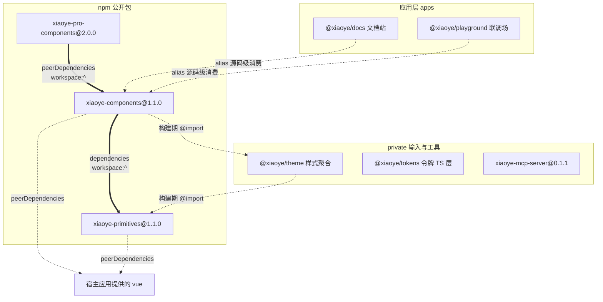
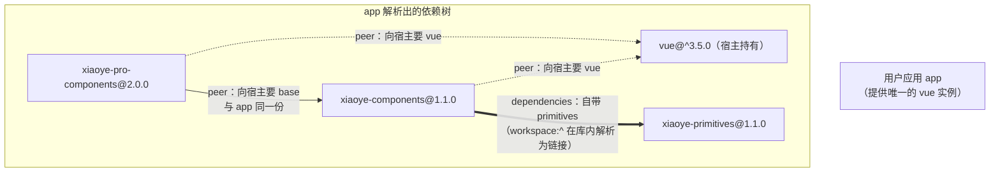
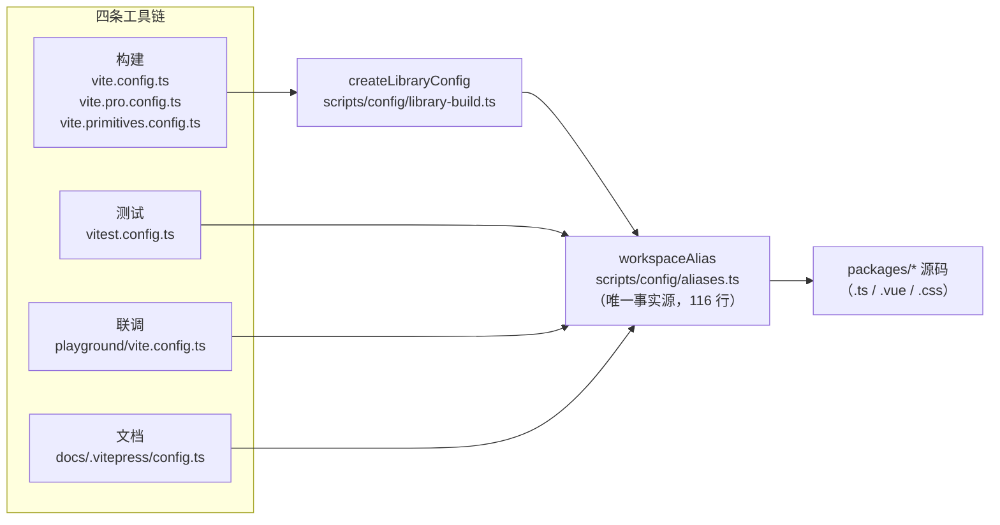

# 1-02 · Monorepo 分层：六包两应用的架构地图

> 本篇是《AI 协作研发组件库》系列第一卷第 2 篇（承接 1-01）。文中所有路径与行号均以 2026-09-23 工作区实态为准，逐条核对过；引用格式统一为 `路径:起始行-结束行`，路径均相对仓库根目录。

## 一、"一个大包"到底输在哪里

先立靶子。把全部基础组件、全部中后台增强组件、所有 composables 与工具函数、所有样式塞进一个 npm 包——就叫它 `xiaoye-ui`——是成本最低的方案：一个版本号、一个导出入口、一份类型声明。它确实能跑起来，但会接连撞上三堵墙，而这三堵墙恰好就是本仓库最终长成"六包两应用"的直接原因。

**第一堵墙：消费组合。**这个仓库同时服务两类用户：只需要 `xy-button`、`xy-input`、`xy-table` 的通用场景用户，和需要 `XyProTable`、`XyListPage`、`XyCrudPage` 的中后台用户。大包方案里，后者拖走整个库没有问题，前者却被强制捆绑了增强层及其运行时开销——哪怕他这辈子不会渲染一个 Pro 组件。反过来，增强层想发一次破坏性的 API 收口，也会因为"绑在同一个包里"而把基础组件的用户一起卷进 major 升级。安装面无法裁剪、破坏面无法隔离，这是物理层面的问题，不是文档写得再好能解决的。

**第二堵墙：依赖方向。**仓库里有一层被所有组件共享的基础设施：`useFocusTrap`、`useOverlayStack`、`useFloatingPanel` 这类组合式逻辑，`ComponentSize`、`ComponentStatus` 这类协议类型，以及令牌体系。它们只应该被上层消费，永远不应该反过来 import 某个具体组件。放在同一个包里，这条纪律只活在 code review 的记忆和 AGENTS.md 的文字里；拆成独立的底座包之后，它变成了 TypeScript 编译器直接执行的约束——底座包的 `package.json` 里没有任何上游依赖，想引用按钮的源码，编译期就报错。**边界写在 README 里会被遗忘，写进依赖图里就是铁律。**

**第三堵墙：版本节奏。**看一组真实的版本号：`xiaoye-pro-components@2.0.0`、`xiaoye-components@1.1.0`、`xiaoye-primitives@1.1.0`。增强层做过一次面向发布边界的 API 大收口，独立发了 2.0；同期底座和基础层没有任何破坏性变更，稳定停在 1.1.0。一个大包做不到这一点——要么永远不发 major（把技术债攒给未来），要么让全体用户为局部变更陪葬。

三堵墙分别指向"安装面""编译期边界""发布节奏"。所以问题从来不是"要不要拆"，而是**沿着什么边界拆、拆完之后用什么机制把边界焊死**。下面按仓库的真实代码，一层一层看。

## 二、六包两应用：工作区的最小事实

一切从这份文件开始（共 5 行，第 5 行为末尾空行）。

`pnpm-workspace.yaml:1-5`（全文）：

```yaml
packages:
  - "apps/docs"
  - "apps/playground"
  - "packages/*"
```

这是 pnpm 的 workspace 声明，也是"六包两应用"的全部法律依据：`apps/` 下两个应用（文档站 `docs`、联调场 `playground`），`packages/` 下六个包（`components`、`pro-components`、`xiaoye-primitives`、`theme`、`tokens`、`mcp-server`）。没有更复杂的目录约定，没有 `libs/`、`tools/` 之类的第三层分类——**三行声明就能表达的拓扑，不值得引入第三层目录**。

但"在同一个 workspace 里"不等于"同一种东西"。六个包实际上分三种形态，两种应用又是两种形态，全貌如下：

| 成员 | 包名 / 应用名 | 形态 | 版本 | 一句话职责 |
|---|---|---|---|---|
| `packages/xiaoye-primitives` | `xiaoye-primitives` | npm 公开库 | 1.1.0 | 基础设施：composables + utils + 主题运行时底座 |
| `packages/components` | `xiaoye-components` | npm 公开库 | 1.1.0 | 72 个基础组件（basic/form/feedback/data 四组） |
| `packages/pro-components` | `xiaoye-pro-components` | npm 公开库 | 2.0.0 | 中后台业务增强组件 |
| `packages/theme` | `@xiaoye/theme` | private 构建输入 | — | 全量样式聚合（BEM/CSS 实现） |
| `packages/tokens` | `@xiaoye/tokens` | private 构建输入 | — | 设计令牌的 TS 常量层（生成物） |
| `packages/mcp-server` | `xiaoye-mcp-server` | npm 公开 CLI | 0.1.1 | 把组件 API 喂给 AI 工具的 MCP Server |
| `apps/docs` | `@xiaoye/docs` | 应用（VitePress） | — | 文档站，消费源码级组件 |
| `apps/playground` | `@xiaoye/playground` | 应用（Vite） | — | 本地联调，消费源码级组件 |

这张表里最容易看漏的是**形态**一列。三个公开库包的 `package.json` 是完整的发布配置（`exports`、`files`、`peerDependencies` 一个不少）；theme 和 tokens 的 `package.json` 几乎是空的；mcp-server 是带 `bin` 的命令行工具。三种形态对应三种完全不同的"打包哲学"，这正是拆包的第一层收益：**形态不同的东西，本来就不该共享同一个发布生命周期。**

仓库根的 scripts 全景也能佐证这种分层不是纸面上的。看根 `package.json:7-38` 的 scripts 段（全景）：

```json
  "scripts": {
    "dev": "pnpm dev:docs",
    "dev:docs": "pnpm --filter @xiaoye/docs docs:dev",
    "dev:playground": "pnpm --filter @xiaoye/playground dev",
    "check:components": "node scripts/check-components.mjs",
    "check:tokens": "node scripts/check-generated.mjs --name tokens --generate \"node scripts/generate-tokens.mjs\" --path packages/tokens/src",
    "check:llms": "node scripts/check-generated.mjs --name llms --generate \"node scripts/generate-llm-files.mjs\" --path llms-full.txt --ignore \"^> 自动生成于\"",
    "generate:tokens": "node scripts/generate-tokens.mjs",
    "check:pro-components": "node scripts/check-pro-components.mjs",
    "lint": "pnpm check:tokens && pnpm check:llms && pnpm check:components && pnpm check:pro-components && eslint .",
    "typecheck": "pnpm run typecheck:packages && pnpm run typecheck:types",
    "typecheck:packages": "vue-tsc -p tsconfig/packages.json --noEmit && vue-tsc -p tsconfig/apps.json --noEmit",
    "typecheck:types": "vue-tsc -p tests/types/tsconfig.json --noEmit",
    "test": "vitest run",
    "test:watch": "vitest",
    "test:e2e:admin": "playwright test tests/e2e/admin-flow.spec.ts",
    "build": "pnpm run build:lib && pnpm run build:docs && pnpm run build:playground",
    "build:lib": "pnpm run build:primitives && pnpm run build:lib:base && pnpm run build:lib:pro",
    "build:primitives": "vite build -c vite.primitives.config.ts",
    "build:lib:base": "vite build -c vite.config.ts && node scripts/prepare-package.mjs base",
    "build:lib:pro": "vite build -c vite.pro.config.ts && node scripts/prepare-package.mjs pro",
    "build:docs": "pnpm --filter @xiaoye/docs docs:build",
    "build:playground": "pnpm --filter @xiaoye/playground build",
    "preview:docs": "pnpm --filter @xiaoye/docs docs:preview",
    "changeset": "changeset",
    "version-packages": "changeset version",
    "release": "changeset publish",
    "clean": "rimraf packages/xiaoye-primitives/dist packages/xiaoye-components/dist packages/xiaoye-pro-components/dist apps/docs/.vitepress/dist apps/playground/dist",
    "generate:llm": "node scripts/generate-llm-files.mjs",
    "test:e2e": "playwright test",
    "audit:visual": "node scripts/visual-audit.mjs"
  },
```

这段配置里藏着两个与分层直接相关的事实。其一，`package.json:24` 的 `build:lib` 是一条严格串行的链：`build:primitives → build:lib:base → build:lib:pro`——**构建顺序就是依赖方向**，底座先出产物，基础层再构建，增强层最后。这不是巧合，而是第六节要讲的 external 化策略的必然要求：pro 构建时要把 `xiaoye-components` 视为外部依赖，那 base 的产物类型就得先就位。其二，`package.json:34` 的 `clean` 脚本只清理三个公开库包的 `dist` 和两个应用的产物——theme 和 tokens 根本没有 `dist`，因为它们不参与发布，这件事下一节展开。

## 三、两个 private 包：为什么几乎"空"

theme 和 tokens 的 `package.json` 短到可以直接全文引用。

`packages/theme/package.json:1-5`（全文）：

```json
{
  "name": "@xiaoye/theme",
  "private": true,
  "type": "module"
}
```

`packages/tokens/package.json:1-5`（全文）：

```json
{
  "name": "@xiaoye/tokens",
  "private": true,
  "type": "module"
}
```

没有版本号，没有 `exports`，没有依赖——它们存在的意义只有一个：**在 workspace 内部充当"可被 import 的目录"**。`private: true` 保证它们永远不会被意外发布到 npm；`name` 字段让它们可以被 alias 和 CSS `@import` 以包名的形式引用。这是 monorepo 里一种常被忽视的包形态：它不发布，却真实地承担了"命名空间 + 边界"的职能。

以 theme 为例，看样式真实的聚合链路。`packages/xiaoye-primitives/style.css:1-4`（全文）是底座样式入口：

```css
@import "./src/theme/reset.css";
@import "./src/theme/tokens.css";
@import "./src/theme/base.css";
@import "./src/theme/shared/display-value.css";
```

第二行的 `tokens.css` 就是整个设计令牌体系的唯一事实源。然后 `packages/theme/index.css:1-4`（节选头部）在聚合全部组件样式之前，先把底座样式引入：

```css
@import "@xiaoye/primitives/style.css";
@import "./src/components/button.css";
@import "./src/components/link.css";
@import "./src/components/breadcrumb.css";
```

注意第 1 行用的是**包名** `@xiaoye/primitives/style.css` 而不是相对路径——这正是 theme 作为 private 包被纳入 workspace 的意义：它可以像引用 npm 包一样引用内部包，而这个引用在四条工具链里都会被 alias 精准地指回源码（第七节展开）。再往上，基础层包的样式入口 `packages/components/style.css:1`（全文）只有一行：

```css
@import "../theme/index.css";
```

这里又换回了**相对路径**，直接跨包指向 theme 的聚合入口。包名引用与相对路径引用混用的原因在 alias 表的顺序设计里（`scripts/config/aliases.ts:6-27` 对 CSS 有专门的前置规则），这里先记住结论：**三个公开包对外发布的 `style.css` 副入口，最终都汇聚到 theme 与 primitives 的同一份源码；theme/tokens 是构建期输入，不是发布物。**

tokens 同理：它的 TS 常量层（`packages/tokens/src/index.ts` 转出 `primitives.ts`、`semantic.ts`、`scales.ts` 三个模块）是从 tokens.css 生成的，根 `package.json:14` 的 `generate:tokens` 负责生成、`package.json:12` 的 `check:tokens` 负责校验"生成物没有漂移"。**private 包 + 生成物 + 校验脚本**，这构成了第四卷令牌体系的工程底座，此处按下不表。

## 四、mcp-server：第六个包，一种全新的形态

第六个包 `packages/mcp-server` 是另一种极端：它面向的不是浏览器里的 Vue 应用，而是 AI 工具链。它的关键配置在 `packages/mcp-server/package.json:14-23`：

```json
  "bin": {
    "xiaoye-mcp-server": "./dist/index.js"
  },
  "files": [
    "dist",
    "mcp-config.example.json"
  ],
  "publishConfig": {
    "access": "public"
  },
```

有 `bin`（命令行可执行入口）、有 `publishConfig.access`（公开发布）、有自己独立的版本号 `0.1.1`、依赖里只有 `@modelcontextprotocol/sdk` 和 `zod`——**它与组件库本体零运行时耦合**，甚至不参与 `build:lib` 构建链（回看根 `package.json:24`，链上只有三个库包），用的是自己的 `tsc` 构建。

把它单独拆成第六个包的理由，和把增强层拆出去的理由同构：形态不同（CLI vs 库）、节奏不同（AI 生态迭代速度远快于组件 API）、消费方不同（AI 工具 vs 前端应用）。如果它被塞进组件包里，每次调整 MCP 协议版本都要连带组件库发版——那是一种没有意义的版本号通胀。

## 五、依赖方向：pro → base → primitives，严格单向

形态讲完，进入本篇的骨架：依赖图。先上全景。



三个公开包之间的实线只有两条，方向严格向下：pro 依赖 base，base 依赖 primitives，**没有任何一条边向上，也没有任何一条边横向**。虚线是构建期/开发期的消费关系（alias、CSS import），它们不进入发布物的依赖声明。mcp-server 与所有内部包零依赖，所以孤悬在图右侧。

### 5.1 底座：primitives 不认识任何上层

`packages/xiaoye-primitives/index.ts:1-2`（全文）只有两行：

```ts
export * from "./src/composables";
export * from "./src/utils";
```

它的 `package.json` 关键段（`packages/xiaoye-primitives/package.json:30-48`）：

```json
  "exports": {
    ".": {
      "types": "./dist/types/index.d.ts",
      "import": "./dist/index.js"
    },
    "./style.css": "./style.css"
  },
  "files": [
    "dist",
    "style.css",
    "README.md",
    "LICENSE"
  ],
  "peerDependencies": {
    "vue": "^3.5.0"
  },
  "dependencies": {
    "@floating-ui/dom": "^1.7.4"
  }
```

三个值得驻足的细节。第一，`exports` 里除了主入口还有一个 `./style.css` 副入口，且指向的是**源码根的 style.css**（`files` 里显式带上了它）——底座的样式（reset、tokens.css、base.css）是随包发布的，第三节看到的聚合链最底端就在这里。第二，`peerDependencies` 只有 `vue`：底座把"宿主环境必须提供什么"压缩到最小面，Vue 是唯一的运行时契约。第三，唯一的 `dependencies` 是 `@floating-ui/dom`，纯粹是浮层定位的实现细节，与上层组件无关。

底座不认识 `XyButton`，不认识 `ProTable`，甚至不认识"组件"这个概念——它只提供焦点陷阱、浮层栈、命名空间、z-index 治理这些**与具体组件解耦的机制**。这就是"下层不感知上层"落到实处的样子：不是注释里的自律，是 `package.json` 里的物理事实。

### 5.2 base：把 primitives 放进 dependencies

基础层对底座的依赖，声明在 `packages/components/package.json:44-68`：

```json
  "peerDependencies": {
    "vue": "^3.5.0",
    "vue-router": "^4.6.0"
  },
  "peerDependenciesMeta": {
    "vue-router": {
      "optional": true
    }
  },
  "dependencies": {
    "@floating-ui/dom": "^1.6.13",
    "@fullcalendar/core": "^6.1.20",
    "@fullcalendar/daygrid": "^6.1.20",
    "@fullcalendar/interaction": "^6.1.20",
    "@fullcalendar/timegrid": "^6.1.20",
    "@fullcalendar/vue3": "^6.1.20",
    "@iconify/vue": "^5.0.0",
    "async-validator": "^4.2.5",
    "dayjs": "^1.11.20",
    "echarts": "^6.0.0",
    "howler": "^2.2.4",
    "vditor": "^3.11.2",
    "video.js": "^8.23.7",
    "xiaoye-primitives": "workspace:^"
  }
```

`package.json:67` 那行 `"xiaoye-primitives": "workspace:^"` 是全篇最重要的一行配置之一。注意它的位置：在 **dependencies** 里，不是 peerDependencies。这是一个刻意的不对称，语义非常精确：

- **vue / vue-router 是 peer**：它们是"宿主环境契约"。组件库不应该自带一份 Vue，必须与宿主应用共享同一个 Vue 实例，否则响应式系统、provide/inject 全部失效。`vue-router` 还被 `peerDependenciesMeta` 标记为 optional——不用路由能力的用户不必安装它。
- **xiaoye-primitives 是 dependency**：底座是这个包的**实现细节**。用户不需要知道、也不应该直接消费它；基础层对它负责，装不装、装哪个版本，由组件库自己声明。workspace 协议 `workspace:^` 在 monorepo 内安装时被 pnpm 解析为对 `packages/xiaoye-primitives` 的链接（第六节有符号链接实证），其发布期的协议改写属于 2-04 发布流水线的内容，此处不展开。

源码侧的证据比声明更直观。随便打开一个标准组件入口，`packages/components/button/index.ts:1-25`（全文）：

```ts
import Button from "./src/button.vue";
import ButtonGroup from "./src/button-group.vue";
import type {
  ButtonClickHandler,
  ButtonInstance,
  ButtonProps,
  ButtonNativeType,
  ButtonType
} from "./src/button";
import type { ButtonGroupDirection, ButtonGroupProps } from "./src/button-group";
import { withInstall } from "xiaoye-primitives";

export type {
  ButtonClickHandler,
  ButtonGroupDirection,
  ButtonGroupProps,
  ButtonInstance,
  ButtonNativeType,
  ButtonProps,
  ButtonType
};

export const XyButton = withInstall(Button, "xy-button");
export const XyButtonGroup = withInstall(ButtonGroup, "xy-button-group");
export default XyButton;
```

第 11 行：`withInstall` 直接从裸包名 `xiaoye-primitives` 导入。开发期这个裸导入被 alias 指回 `packages/xiaoye-primitives/index.ts`（见 `scripts/config/aliases.ts:89-92`），构建期被 external 化保持依赖关系成立（见 `scripts/config/library-build.ts:19`，`libraryExternal` 数组里赫然列着 `xiaoye-primitives`）。也就是说：**base 的构建产物不内联 primitives 的代码，发布物的依赖图与源码的依赖图同构**——这是 monorepo 开发体验与发布物质量能够同时成立的前提。

再看基础层的包根入口 `packages/components/index.ts:1-54`（全文），它同时是"类型转发边界"和"安装幂等锁"两个机制的现场：

```ts
import type { App, Plugin } from "vue";
import "./style.css";
import * as XiaoyeComponentExports from "./exports";
import { installableComponentExportNames } from "./component-manifest";

export type { ComponentSize, ComponentStatus, SelectOption } from "xiaoye-primitives";
export * from "./exports";

const INSTALL_KEY = Symbol.for("xiaoye-components:installed");

function isInstallableExport(value: unknown): value is Plugin {
  return (
    (typeof value === "function" || typeof value === "object") &&
    value !== null &&
    "install" in value &&
    typeof (value as { install?: unknown }).install === "function"
  );
}

const installableExports = Array.from(
  new Set(
    installableComponentExportNames
      .map((name) => XiaoyeComponentExports[name as keyof typeof XiaoyeComponentExports])
      .filter(isInstallableExport)
  )
) as Plugin[];

export function install(app: App) {
  const appWithInstallFlag = app as App & {
    [INSTALL_KEY]?: boolean;
  };

  if (appWithInstallFlag[INSTALL_KEY]) {
    return;
  }

  appWithInstallFlag[INSTALL_KEY] = true;

  installableExports.forEach((component) => {
    app.use(component);
  });
}

declare module "vue" {
  interface ComponentCustomProperties {
    $loading?: typeof import("./loading").XyLoadingService;
    $message?: typeof import("./message").XyMessage;
    $notify?: typeof import("./notification").XyNotificationService;
  }
}

export default {
  install
};
```

第 6 行值得单独说。基础层对底座的**类型转发是具名的、白名单式的**——只有 `ComponentSize`、`ComponentStatus`、`SelectOption` 三个协议类型被抬到 `xiaoye-components` 的包根，而不是 `export * from "xiaoye-primitives"` 一转了之。原因是 API 面的所有权：primitives 的全部导出（13 个 composables 模块加 utils）是组件库的内部资产，它的 API 可以随实现自由演进；一旦整包转发，底座的每个内部函数都会变成 `xiaoye-components` 的公开 API，底座从此失去演进自由。用户在业务里真正需要的只有"尺寸""状态""选项"这三个跨组件协议——那就只转发这三个。**转发行数是所有权边界的量化指标**：这三行是一个刻意的窄口，不是偷懒。

第 9 行的 `Symbol.for("xiaoye-components:installed")` 是安装幂等锁，它的跨包意义在第六节展开。而 `package.json:25-28` 的 `sideEffects: ["*.css", "**/*.css"]` 配合第 2 行的 `import "./style.css"`，则保证了打包器在 tree-shaking 掉未使用组件代码的同时，不会误删样式副作用——分层不光是 JS 的事，CSS 的边界同样被声明式地钉住了。

### 5.3 pro：把 base 放进 peerDependencies

增强层对基础层的依赖声明，`packages/pro-components/package.json:44-57`：

```json
  "peerDependencies": {
    "vue": "^3.5.0",
    "vue-router": "^4.6.0",
    "xiaoye-components": "workspace:^"
  },
  "peerDependenciesMeta": {
    "vue-router": {
      "optional": true
    }
  },
  "dependencies": {
    "@iconify/vue": "^5.0.0",
    "sortablejs": "^1.15.7"
  }
```

注意 `package.json:47`：`xiaoye-components` 出现在 **peerDependencies** 里，和 vue 并列。这跟 5.2 节 base 对 primitives 的处理（dependencies）形成了刻意对照，语义差异下一节细讲。先看构建侧怎么配合：`vite.pro.config.ts:1-18`（全文）：

```ts
import { fileURLToPath, URL } from "node:url";
import { createLibraryConfig } from "./scripts/config/library-build";

const resolvePath = (target: string) => fileURLToPath(new URL(target, import.meta.url));

export default createLibraryConfig({
  entry: resolvePath("./packages/pro-components/index.ts"),
  name: "XiaoyeProComponents",
  outDir: resolvePath("./packages/pro-components/dist"),
  extraExternal: [/^xiaoye-components(?:\/.+)?$/],
  dtsInclude: [
    "packages/components/**/*.ts",
    "packages/components/**/*.vue",
    "packages/pro-components/**/*.ts",
    "packages/pro-components/**/*.vue",
    "packages/xiaoye-primitives/src/utils/**/*.ts",
  ]
});
```

第 10 行的 `extraExternal: [/^xiaoye-components(?:\/.+)?$/]` 把基础层整体声明为构建外部依赖——pro 的产物里不含 base 的任何代码，运行时按包名向宿主要。类型侧（第 12-13 行）则把 `packages/components` 的源码纳入 d.ts 生成范围，让增强层导出的 Props 类型可以引用基础层的类型（比如 `DescriptionsProps`、`FormRules`）而不产生悬空引用。

源码侧，pro 引用 base 的密度相当高：以 `rg 'from "xiaoye-components"'` 统计，`packages/pro-components` 下有 **41 个源码文件**存在对基础层的导入，从 `XyButton`、`XyDialog` 这类组件值到 `DescriptionsProps`、`FormRules` 这类类型。一个代表性切片是 `packages/pro-components/overlay-form/src/overlay-form.ts:1`：

```ts
import type { DialogProps, DrawerProps, FormRules } from "xiaoye-components";
```

增强层大量通过 `Omit`/`Pick` 派生基础层 Props 来构建自己的配置面——这只有在"两包共享同一份类型实例"时才是类型安全的，又回到了单实例问题。

到这里，单向链完整了：**primitives 提供机制 → base 提供标准件 → pro 提供业务预设**，每层的依赖声明方式（无内部依赖 / dependencies / peerDependencies）精确对应它在链上的位置。整张图里不存在环——不是"碰巧没有"，而是三个 `package.json` 里没有任何一组互相引用，想造环都造不出来。

## 六、peer 化与单实例：跨包机制成立的前提

先做一次灾难推演。假设 pro 对 base 用的是 dependencies 而不是 peer：某个宿主应用装了 `xiaoye-components@1.1.0`，而 `xiaoye-pro-components@2.0.0` 自带（比方说）`xiaoye-components@1.0.0`。npm/pnpm 的依赖解析会在增强层下挂一份私有基础层，于是浏览器里同时存在**两份 `XyButton`、两份 `useZIndex` 计数器、两份 config-provider 的注入上下文**。ProTable 内部渲染的 `XyButton` 和用户全局注册的 `XyButton` 不是同一个构造函数，全局配置半途丢失，z-index 序列错乱——全部是"双实例"的经典症状。

peerDependencies 就是防这个的：peer 的语义是"**向宿主要，不要自带**"，强制 npm/pnpm 把 pro 对 base 的需求提升到与宿主同一份实例上。而 monorepo 内部的 `workspace:^` 把这件事在开发期就钉死为物理上的单份——符号链接为证，`packages/pro-components/node_modules/` 下的实态：

```text
xiaoye-components -> ../../components
vue               -> ../../../node_modules/.pnpm/vue@3.5.30_typescript@5.9.3/node_modules/vue
```

pro 的 `node_modules` 里，`xiaoye-components` 是指向 `packages/components` 的软链，`vue` 是指向根 `.pnpm` 存储里唯一一份 `vue@3.5.30` 的软链。**整个 workspace 里 base 只有一份、Vue 只有一份**，`workspace:^` 的"保单实例"就是这么落地的。

但单实例只是前提，这个仓库还有一个更进一步的防御：即便某个极端场景下代码真的出现了双份（例如用户 bundler 配置不当导致包被解析到两个路径），跨包机制也不能失效。看三处现场。第一处是 pro 包根的安装幂等锁，`packages/pro-components/index.ts:146-183`（全文）：

```ts
const INSTALL_KEY = Symbol.for("xiaoye-pro-components:installed");

function isInstallableExport(value: unknown): value is Plugin {
  return (
    (typeof value === "function" || typeof value === "object") &&
    value !== null &&
    "install" in value &&
    typeof (value as { install?: unknown }).install === "function"
  );
}

const installableExports = Array.from(
  new Set(
    proInstallableComponentExportNames
      .map((name) => ProComponentExports[name as keyof typeof ProComponentExports])
      .filter(isInstallableExport)
  )
) as Plugin[];

export function install(app: App) {
  const appWithInstallFlag = app as App & {
    [INSTALL_KEY]?: boolean;
  };

  if (appWithInstallFlag[INSTALL_KEY]) {
    return;
  }

  appWithInstallFlag[INSTALL_KEY] = true;

  installableExports.forEach((component) => {
    app.use(component);
  });
}

export default {
  install
};
```

第 146 行如果写成 `Symbol("xiaoye-pro-components:installed")`（不带 `.for`），每次求值都会产生一个**全新的 symbol**，模块级常量虽然只初始化一次，但双实例场景下两份模块各自持有两个不同的 key，互锁失效，`install` 就会执行两遍、全量组件重复注册。`Symbol.for` 则把 key 注册进**跨 Realm 的全局 symbol 注册表**：不管代码被复制成几份，只要字符串相同，拿到的就是同一个 symbol——第 165-179 行的 `install` 因此在双实例下依然幂等。base 包根的同款机制在 `packages/components/index.ts:9`（`Symbol.for("xiaoye-components:installed")`），两把锁字符串不同、互不误伤，却又各自全局唯一。

第三处最关键，因为它直接支撑组件间的数据流。`packages/xiaoye-primitives/src/composables/shared-context.ts:1-28`（全文）：

```ts
import type { ComputedRef, InjectionKey } from "vue";

export const configProviderKey: InjectionKey<SharedConfigContext> =
  Symbol.for("xiaoye-config-provider") as InjectionKey<SharedConfigContext>;

export type ComponentSize = "" | "xs" | "sm" | "md" | "lg" | "xl";

export interface Locale {
  emptyTitle?: string;
  emptyDescription?: string;
  popconfirmConfirmButtonText?: string;
  popconfirmCancelButtonText?: string;
}

export interface SharedConfigContext {
  namespace: ComputedRef<string>;
  locale: ComputedRef<Locale>;
  zIndex: ComputedRef<number>;
  size: ComputedRef<ComponentSize>;
  dialog: ComputedRef<unknown>;
  loading: ComputedRef<unknown>;
  message: ComputedRef<unknown>;
  notification: ComputedRef<unknown>;
}

export const DEFAULT_NAMESPACE = "xy";
export const DEFAULT_Z_INDEX = 2000;
export const DEFAULT_SIZE: ComponentSize = "md";
```

第 3-4 行是全仓库跨包数据流的咽喉：`configProviderKey` 是 config-provider 向全库下发命名空间、locale、z-index、size、四类浮层配置的注入键，被 base 与 pro 的几十个组件 `inject`。它同时用了两层保险——`InjectionKey` 提供 provide/inject 的**类型安全**（泛型参数把 `SharedConfigContext` 焊死在读写两端），`Symbol.for` 提供跨实例的**值收敛**（双份模块也命中全局注册表里同一个 symbol）。底层底座把键定义收口在这里，base 和 pro 因为都 peer 了同一个宿主 Vue、且都依赖这唯一一份 primitives，注入链路才全线贯通。

用一张发布物视角的图收束本节——**peer 与 dependencies 的语义差异**，就是"向宿主要"与"自己带"的差异：



实线的"自带"关系是包的实现细节，虚线的"索要"关系是包的环境契约。**一张 package.json 的依赖分区，读出来就是一张架构契约表**：宿主只需要承诺提供 Vue（可选提供 vue-router），其余的一切由包之间的声明自行解决。

## 七、消费侧零依赖：一份 aliases.ts 服务四条工具链

分层讲到这儿，还有一个反直觉的事实没有解释：workspace 里的两个应用，是怎么"装都不装"就用上全部组件的。

先看联调场的依赖声明，`apps/playground/package.json:1-10`（全文）：

```json
{
  "name": "@xiaoye/playground",
  "private": true,
  "type": "module",
  "scripts": {
    "dev": "vite",
    "build": "vite build",
    "preview": "vite preview"
  }
}
```

十行，**连 `dependencies` 字段都不存在**。没有任何形式的 `xiaoye-components` 依赖，也没有 vue——它照样能在浏览器里渲染任意一个库内组件，还能热更新组件源码。文档站 `apps/docs` 更接近零：唯一的 `devDependencies` 是 `markdown-it-container`（文档站自己的 markdown 插件用），组件运行时依赖同样是零。

支撑这一切的是一份 116 行的路径映射表。`scripts/config/aliases.ts:1-116`（全文）：

```ts
import { fileURLToPath, URL } from "node:url";

const resolveWorkspacePath = (target: string) => fileURLToPath(new URL(target, import.meta.url));

export const workspaceAlias = [
  // CSS files (must come before the general @xiaoye/primitives alias)
  {
    find: "@xiaoye/primitives/style.css",
    replacement: resolveWorkspacePath("../../packages/xiaoye-primitives/style.css")
  },
  {
    find: "xiaoye-primitives/style.css",
    replacement: resolveWorkspacePath("../../packages/xiaoye-primitives/style.css")
  },
  // @xiaoye/pro-components
  {
    find: "@xiaoye/pro-components/style.css",
    replacement: resolveWorkspacePath("../../packages/pro-components/style.css")
  },
  {
    find: "xiaoye-pro-components/style.css",
    replacement: resolveWorkspacePath("../../packages/pro-components/style.css")
  },
  {
    find: "xiaoye-components/style.css",
    replacement: resolveWorkspacePath("../../packages/components/style.css")
  },
  // @xiaoye/components (exact matches before regex)
  {
    find: "@xiaoye/components/icon",
    replacement: resolveWorkspacePath("../../packages/components/icon/index.ts")
  },
  {
    find: "@xiaoye/components/badge",
    replacement: resolveWorkspacePath("../../packages/components/badge/index.ts")
  },
  {
    find: "@xiaoye/components/image",
    replacement: resolveWorkspacePath("../../packages/components/image/index.ts")
  },
  {
    find: "@xiaoye/components/input",
    replacement: resolveWorkspacePath("../../packages/components/input/index.ts")
  },
  {
    find: "@xiaoye/components/image/src/image-viewer.vue",
    replacement: resolveWorkspacePath("../../packages/components/image/src/image-viewer.vue")
  },
  {
    find: "@xiaoye/components",
    replacement: resolveWorkspacePath("../../packages/components/index.ts")
  },
  {
    find: "@xiaoye/components/config-provider",
    replacement: resolveWorkspacePath("../../packages/components/config-provider/index.ts")
  },
  {
    find: "@xiaoye/components/src/composables",
    replacement: resolveWorkspacePath("../../packages/components/src/composables/index.ts")
  },
  {
    find: /^@xiaoye\/components\/(.*)$/,
    replacement: `${resolveWorkspacePath("../../packages/components/")}/$1`
  },
  // @xiaoye/pro-components
  {
    find: "@xiaoye/pro-components",
    replacement: resolveWorkspacePath("../../packages/pro-components/index.ts")
  },
  {
    find: /^@xiaoye\/pro-components\/(.*)$/,
    replacement: `${resolveWorkspacePath("../../packages/pro-components/")}/$1`
  },
  // @xiaoye/primitives (general, comes AFTER css-specific aliases)
  {
    find: "@xiaoye/primitives",
    replacement: resolveWorkspacePath("../../packages/xiaoye-primitives/index.ts")
  },
  {
    find: /^@xiaoye\/primitives\/(.*)$/,
    replacement: `${resolveWorkspacePath("../../packages/xiaoye-primitives/")}/$1`
  },
  // @xiaoye/theme
  {
    find: "@xiaoye/theme",
    replacement: resolveWorkspacePath("../../packages/theme/index.css")
  },
  // xiaoye-primitives (bare import)
  {
    find: "xiaoye-primitives",
    replacement: resolveWorkspacePath("../../packages/xiaoye-primitives/index.ts")
  },
  // @xiaoye/utils
  {
    find: "@xiaoye/utils",
    replacement: resolveWorkspacePath("../../packages/xiaoye-primitives/src/utils/index.ts")
  },
  // @xiaoye/tokens
  {
    find: "@xiaoye/tokens",
    replacement: resolveWorkspacePath("../../packages/tokens/src/index.ts")
  },
  // xiaoye-components (bare import)
  {
    find: "xiaoye-components",
    replacement: resolveWorkspacePath("../../packages/components/index.ts")
  },
  {
    find: /^xiaoye-components\/(.*)$/,
    replacement: `${resolveWorkspacePath("../../packages/components/")}/$1`
  },
  {
    find: "xiaoye-pro-components",
    replacement: resolveWorkspacePath("../../packages/pro-components/index.ts")
  }
] as const;
```

这张表值得逐类读。**第一，顺序即语义。**第 6-27 行把三个包的 `/style.css` 副入口放在最前，注释写明"must come before the general alias"——如果通用的 `@xiaoye/primitives` 精确匹配排在前面，`@xiaoye/primitives/style.css` 会被错误地解析成包根的 `index.ts`，样式直接丢失。同理第 30-56 行那批组件级精确匹配（`icon`、`badge`、`image`、`input`、`config-provider`）必须排在第 62 行的正则兜底 `/^@xiaoye\/components\/(.*)$/` 之前，Vite 的 alias 数组是**先到先得**的，正则一旦兜底，后面的规则全部作废。**alias 表不是集合，是有序列表**——这是用一次真实踩坑换来的纪律。

**第二，双命名空间并存。**表里同时映射了两套名字：`@xiaoye/components`（仓库内部互引的命名空间）与 `xiaoye-components`（npm 发布名，pro 源码引用 base 用的就是它，回看 5.3 节那 41 个文件），两者最终指向同一份 `packages/components` 源码。**包在 npm 上叫什么、在 workspace 里互相引用时叫什么，是两个正交问题**，alias 表把它们各自钉死，互不串味。

**第三，映射的终点全是源码**：`.ts`、`.vue`、`index.css`，没有一行指向 `dist`。这就是"零依赖消费"的本质——应用不装包、不引产物，而是被 alias 直接带进各包的源码模块图。组件源码改一行，playground 与文档站即时热更；代价则是两条工具链必须共享这张表，否则源码引用立刻断裂。

"必须共享"不是口号，四个消费方全部实证在案。第一条，测试链，`vitest.config.ts:1-21`（全文）：

```ts
import { defineConfig } from "vitest/config";
import vue from "@vitejs/plugin-vue";
import { workspaceAlias } from "./scripts/config/aliases";

export default defineConfig({
  plugins: [vue()],
  resolve: {
    alias: workspaceAlias
  },
  test: {
    environment: "jsdom",
    globals: true,
    setupFiles: ["./vitest.setup.ts"],
    exclude: [
      "tests/e2e/**",
      "node_modules/**",
      "**/node_modules/**",
      "dist/**"
    ]
  }
});
```

第 3 行与第 8 行：单测跑的也是源码，测出的失败直接对应源码行号，没有"产物与源码不一致"的中间层。第二条，联调链，`apps/playground/vite.config.ts:1-10`（全文）：

```ts
import { defineConfig } from "vite";
import vue from "@vitejs/plugin-vue";
import { workspaceAlias } from "../../scripts/config/aliases";

export default defineConfig({
  plugins: [vue()],
  resolve: {
    alias: workspaceAlias
  }
});
```

十行的配置文件，除了 `plugin-vue` 就只有这一份 alias。第三条，文档链，`apps/docs/.vitepress/config.ts:1-11`（节选）：

```ts
import { defineConfig } from "vitepress";
import { componentDocsSidebarGroups } from "../../../packages/components/component-manifest";
import {
  proComponentDocsSidebarGroups,
  proComponentExampleSidebarGroups
} from "../../../packages/pro-components/component-manifest";
import { workspaceAlias } from "../../../scripts/config/aliases";
import { demoMdPlugin } from "./plugins/demo";
import { demoSourcePlugin } from "./plugins/demo-source";
import { markdownTransform } from "./plugins/markdown-transform";
import { tableWrapperMdPlugin } from "./plugins/table-wrapper";
```

第 2-6 行顺带暴露了文档站的另一个事实：侧边栏也是从两个包的 manifest 生成的（这属于 4-01 的主题）；第 7 行引入同一份 alias，并在 `apps/docs/.vitepress/config.ts:149-153` 注入 VitePress 的内置 Vite：

```ts
  vite: {
    plugins: [markdownTransform(), demoSourcePlugin()],
    resolve: {
      alias: workspaceAlias
    },
```

于是文档页里"可运行的示例"消费的同样是源码。第四条，构建链——三个库包的构建入口全部长一个模子，`vite.config.ts:1-17`（base，全文）：

```ts
import { fileURLToPath, URL } from "node:url";
import { createLibraryConfig } from "./scripts/config/library-build";

const resolvePath = (target: string) => fileURLToPath(new URL(target, import.meta.url));

export default createLibraryConfig({
  entry: resolvePath("./packages/components/index.ts"),
  name: "XiaoyeComponents",
  outDir: resolvePath("./packages/components/dist"),
  dtsInclude: [
    "packages/components/**/*.ts",
    "packages/components/**/*.vue",
    "packages/xiaoye-primitives/src/composables/**/*.ts",
    "packages/xiaoye-primitives/src/utils/**/*.ts",
    "packages/tokens/**/*.ts"
  ]
});
```

`vite.primitives.config.ts:1-16`（全文）：

```ts
import { fileURLToPath } from "node:url";
import { createLibraryConfig } from "./scripts/config/library-build";

const resolvePath = (target: string) => fileURLToPath(new URL(target, import.meta.url));

export default createLibraryConfig({
  entry: resolvePath("./packages/xiaoye-primitives/index.ts"),
  name: "XiaoyePrimitives",
  outDir: resolvePath("./packages/xiaoye-primitives/dist"),
  entryRoot: resolvePath("./packages/xiaoye-primitives"),
  dtsInclude: [
    "packages/xiaoye-primitives/index.ts",
    "packages/xiaoye-primitives/src/**/*.ts",
    "packages/tokens/**/*.ts"
  ]
});
```

（pro 的那份在 5.3 节已全文引用过。）三个入口总共不到 60 行，且没有一行真正的构建逻辑——全部委托给 `scripts/config/library-build.ts` 的 `createLibraryConfig` 工厂。工厂内部同样消费这份 alias，`scripts/config/library-build.ts:62-84`：

```ts
    resolve: {
      alias: workspaceAlias
    },
    build: {
      lib: {
        entry: options.entry,
        name: options.name,
        fileName: "index",
        formats: ["es"]
      },
      outDir: options.outDir,
      emptyOutDir: true,
      rollupOptions: {
        external: [...libraryExternal, ...(options.extraExternal ?? [])],
        output: {
          globals: {
            vue: "Vue"
          }
        }
      }
    }
  });
}
```

以及 `library-build.ts:16-35` 的外部依赖白名单（`libraryExternal`），它回答了"开发期 alias 直连源码，发布期怎么办"：

```ts
export const libraryExternal = [
  "vue",
  "vue-router",
  "xiaoye-primitives",
  "@iconify/vue",
  "@floating-ui/dom",
  "async-validator",
  "dayjs",
  /^echarts(?:\/.+)?$/,
  "@fullcalendar/core",
  "@fullcalendar/core/locales/zh-cn",
  "@fullcalendar/daygrid",
  "@fullcalendar/interaction",
  "@fullcalendar/timegrid",
  "@fullcalendar/vue3",
  "howler",
  "sortablejs",
  "vditor",
  "video.js"
];
```

第 19 行：`xiaoye-primitives` 在构建 base 时被 external 化，产物里留下 `import … from "xiaoye-primitives"`，与发布物的 `dependencies` 声明严丝合缝；再叠加各入口的 `extraExternal`（pro 注入 `xiaoye-components`），内部依赖在开发期是源码链接、在发布期是外部引用，**两种形态共享同一张依赖图，永不漂移**。顺带一提，`vite.config.ts:13-15` 的 `dtsInclude` 里出现了 `packages/xiaoye-primitives/src/composables` 与 `packages/tokens`——base 构建类型产物时要把用到的底座类型与令牌常量一并生成进 `dist/types`，否则发布物的 d.ts 会有悬空 import。**JS 层 external、类型层内联**，是这套分层在构建侧最精细的一处权衡。

四条工具链（构建、测试、文档、联调）消费同一份映射的全景如下：



这张图的工程含义是：**任何一次包名、目录或入口文件的调整，只允许改 `aliases.ts` 一个文件**。四个消费方没有一个手写路径，漂移在结构上不可能发生——这件事的完整论证（包括 manifest 如何反向校验这张表）是下一篇的主题。

## 八、什么时候该拆包：四条判据

回到标题的问题。现在可以给出可操作的判据了——"拆成六个包"从来不是目标，拆包只在以下四种信号同时或分别成立时才是对的：

**判据一：存在真实的"子集安装"需求。**如果两类用户的安装面有本质差异——通用组件用户不需要中后台增强层——那么增强层值得独立。反例是"桌面端组件"与"移动端组件"这种伪分层：多数项目两类用户高度重叠，拆开只会制造两个都要维护的包。

**判据二：存在需要隔离的版本节奏。**本仓库的实证：pro 因 API 面收口独立发出 2.0.0，base/primitives 稳在 1.1.0。如果几个模块的版本永远同步变动，那它们本质是一个包，拆开只是给 changesets 添堵。

**判据三：存在编译器可执行的单向边界。**primitives → base → pro 这条链上，"下层不感知上层"是被 `package.json` 的依赖缺席物理保证的。如果你的分层只存在于架构图的箭头里，拆包反而能让箭头变成编译错误——这正是拆包最大的隐性收益：**把 code review 的道德约束升级为构建期的机器约束。**

**判据四：存在不同的发布形态或消费方。**mcp-server（CLI 工具，消费方是 AI 工具）、theme/tokens（private 构建输入，无发布）、三个公开库（消费方是前端应用）——形态不同就该分家，否则 `files`、`exports`、`bin` 这些发布字段会在一个 package.json 里打架。

同样重要的是反面：**什么时候不该拆**。拆包的成本清单很实在——peer 语义需要对齐（pro 对 base 用 peer、base 对 primitives 用 dependency，放错一个就引入双实例风险，第六节的灾难推演不是吓唬人）；跨包重构的成本上升（改名一个底座函数要同时碰三个包的边界类型）；发布矩阵变复杂（三个包 × 各自版本 × workspace 协议改写）。如果两个模块之间是"几乎双射的耦合"——改 A 必改 B、版本永远锁死、消费方永远同装——那它们就不该是两个包。

用这四条判据跑一遍本仓库，答案是自洽的：判据一（增强层可选装）、判据二（pro 独立 2.0）、判据三（底座机制与业务组件的单向边界）、判据四（CLI/private 输入/公开库三种形态）全部命中，于是 6 个包 + 2 个应用不是审美选择，而是判据跑出来的结果。同时也注意克制的一面：**基础层没有按"一组件一包"继续细拆**——72 个组件共享同一个版本节奏、同一个安装面、同一套 manifest 一致性校验，它们之间的耦合远大于差异，拆了就是纯粹的负资产。拆与不拆的边界感，比拆这个动作本身更能体现架构功力。

## 九、小结，与下一篇

复盘本篇的四个关键机制，每个都能在源码里指认：

1. **六包两应用各司其职**：三个公开库（`xiaoye-primitives@1.1.0` → `xiaoye-components@1.1.0` → `xiaoye-pro-components@2.0.0`）、两个 private 构建输入（`@xiaoye/theme`、`@xiaoye/tokens`）、一个公开 CLI（`xiaoye-mcp-server@0.1.1`），外加两个源码级消费的应用（`@xiaoye/docs`、`@xiaoye/playground`）——形态决定包的边界（`pnpm-workspace.yaml:1-5`）。
2. **依赖严格单向**：`pro →(peer) base →(dep) primitives`，无环、无横向、无逆向；类型转发收口为三行白名单（`packages/components/index.ts:6`），构建期靠 `extraExternal`（`vite.pro.config.ts:10`）与 `libraryExternal`（`scripts/config/library-build.ts:19`）保持产物依赖图与源码同构。
3. **内部依赖 peer 化保单实例**：`workspace:^` 在库内解析为符号链接（`packages/pro-components/node_modules/xiaoye-components -> ../../components`），`Symbol.for` 幂等锁（`packages/components/index.ts:9`、`packages/pro-components/index.ts:146`）与 `Symbol.for` 注入键（`packages/xiaoye-primitives/src/composables/shared-context.ts:3-4`）让跨包机制在极端双实例场景下依然收敛。
4. **消费侧零依赖靠 alias**：`apps/playground/package.json` 连 `dependencies` 字段都没有，靠 `scripts/config/aliases.ts`（116 行，含 CSS 前置与正则兜底的顺序纪律）让构建、测试、文档、联调四条工具链全部直连源码。

下一篇（2-01）《workspace 组织与一套 alias 服务四条工具链》，我们顺着本篇留下的钩子往深里走：这份 116 行的 alias 表为什么长成这个顺序、manifest 一致性校验如何反向锁住它、四条工具链各自挂载它时的差异与陷阱——也就是回答大纲里的那句话：**四条工具链如何共享同一份路径映射而不漂移。**
