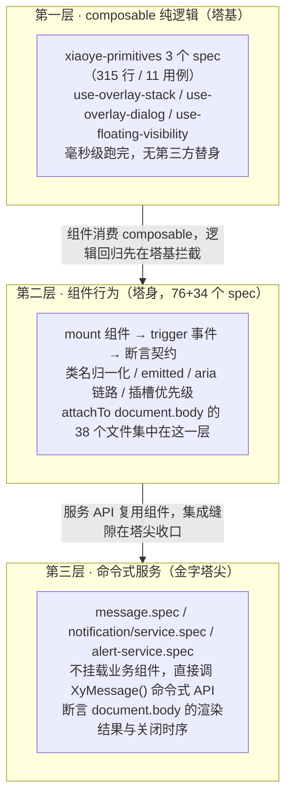
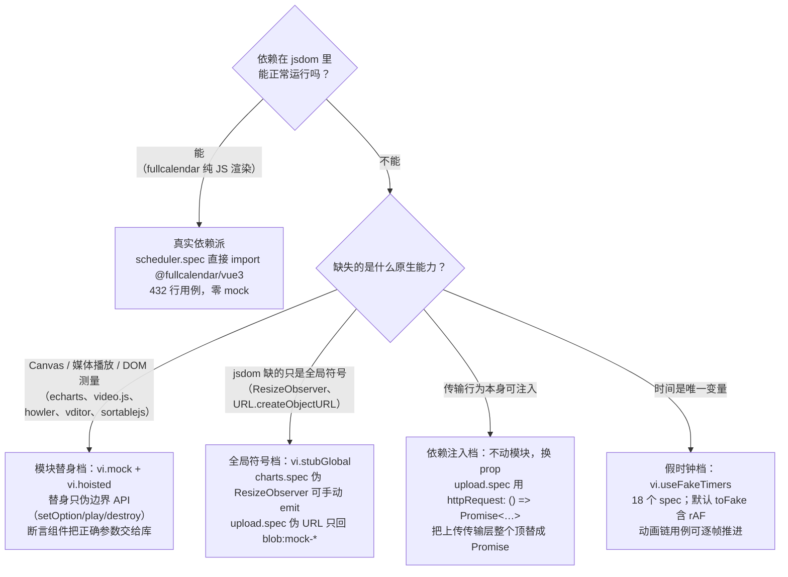

# 10-01 · 单测策略：114 个 spec 的分工

> 本篇是 10 卷"测试与质量基建"的第 1 篇。大纲给本篇的核心问题只有一行——**组件库单测到底在测什么？**——但它站在整个专栏前九卷的收束点上：2-08 引过根 `vitest.config.ts`，7-08/7-10 引过 setup 里 `@iconify/vue` mock 的 `data-icon` 契约，4-05 引过 `use-overlay-stack.spec`，4-11 引过 `message.spec` 的服务层用例，6-19 立案过 upload 的 Promise 顶替，6-17/8-10/7-14/9-27/9-31 各自立案过一处测试空白。本篇把这些散落各卷的测试事实收拢成一张完整的地图：114 个 spec 怎么分工、每一层在测什么、替身与真实的分界线画在哪里、哪些账还没还。本篇全部结论以当前工作区实码为准，行号逐一核对，全量测试于成稿当日（2026-09-23）实跑通过——114 个测试文件、1027 个用例、17.4 秒。

接到题目先复述一遍目标，防止写偏。组件库的单测容易写成两种失败形态：一种是"冒烟测试"——挂载一下、断言不抛异常，用例很多但什么都保证不了；另一种是"快照沼泽"——`toMatchSnapshot()` 一把梭，diff 出来没人看，改一行样式要更新一百个 obsole 快照。这个仓库的 114 个 spec 走的是第三条路：**每个用例都在测一条明确的契约**——类名归一化的契约、事件的契约、可达性属性的契约、挂载位置的契约、定时器与生命周期的契约。所谓"分工"，就是把这 1027 个用例按被测对象拆成三层（composable 逻辑、组件行为、命令式服务），把 mock 按依赖性质拆成四档（全局替身、模块替身、依赖注入顶替、真实依赖加假时钟），让每个用例都落在它成本最低、信噪比最高的那一格。核心问题"单测到底在测什么"，答案不是"测组件能不能渲染"，而是"测组件对外承诺的每一条行为契约有没有被后来者破坏"。

## 一、先对账：111、114、113、116 四个数字

写测试策略的文章，第一步是把规模口径钉死，不然后面所有密度计算都是浮沙。大纲第 195 行给本篇的原题是"单测策略：111 个 spec 如何组织"，但这个 111 是大纲定稿时的旧口径，与仓库实态已有三处出入，先把四个数字全部实测对齐：

| 口径 | 数值 | 来源与说明 |
| --- | --- | --- |
| 大纲旧口径 | 111 | `column/02-分卷大纲.md:195` 定稿时的估算值 |
| vitest 实跑 | **114 个文件 / 1027 个用例** | 2026-09-23 实跑 `pnpm test`，`Test Files 114 passed (114)`、`Tests 1027 passed (1027)`，Duration 17.38s |
| `find packages -name "*.spec.ts"` | 113 | 纯 packages 分包口径（components 76 + pro-components 34 + xiaoye-primitives 3） |
| 全仓 `find` | 116 | 113 + `apps/docs/.vitepress/theme/components/__tests__/icon-gallery.spec.ts` 1 个 + `tests/e2e/` 2 个 |

三处出入的机制如下。第一，vitest 实跑的 114 比 packages 的 113 多 1，多出的正是文档站主题里的 `icon-gallery.spec.ts`——它不在 `vitest.config.ts` 的 exclude 名单里（exclude 只挡了 `tests/e2e/**`、`node_modules`、`dist`），于是被 vitest 一并收编；而 `tests/e2e/` 下确实住着两个 spec（`docs-demos.spec.ts` 93 行、`admin-flow.spec.ts` 42 行），它们是 10-04 要讲的主角，此刻被 exclude 挡在单测门外。第二，1027 个用例的拆解：packages 内 `rg '\bit\('` 静态统计为 1014 处，其中 `it.each` 动态展开贡献 7 个运行时用例（`alert.spec.ts:27` 的类型-图标映射表展开 5 条、`countdown.spec.ts:55` 的格式串表展开 2 条），静态 `it(` 对应 1014 个用例，再加 icon-gallery 的 6 个（rg 默认跳过 `.vitepress` 隐藏目录，所以静态统计里没有它），1014 + 7 + 6 = 1027，与实跑严丝合缝。第三，标题里的 114 按任务规格保留，它是"修复战役完成时"的口径（114 passed / 1027 passed），今天复跑数字未变——所以本篇正文一律用实测口径说话：**分包 113 个 spec，vitest 收编 114 个文件，运行时 1027 个用例**。

规模落在哪个包，重心就落在哪个包：

| 分包 | spec 数 | `it(` 静态数 | 说明 |
| --- | --- | --- | --- |
| `packages/components` | 76 | 917 | 基础层，平均每组件约 1.1 个 spec（alert/notification/message 各有独立 service spec，table/skeleton 各多一份细分 spec） |
| `packages/pro-components` | 34 | 86 | 增强层 31 个组件 + `install.spec.ts` 安装断言 + search-form/pro-table 各多一份 |
| `packages/xiaoye-primitives` | 3 | 11 | 基础设施包，只测 composable 纯逻辑（315 行） |
| 合计 | **113** | **1014** | 运行时再加 it.each 展开 7 + icon-gallery 6 = 1027 |

单文件体量榜也很说明问题：`table.spec.ts` 3892 行一骑绝尘（8-09 讲过的列模型、固定列、单元格文本三座山），`tree.spec.ts` 1177 行、`dialog.spec.ts` 1107 行、`pro-table.spec.ts` 822 行、`carousel.spec.ts` 802 行紧随其后；增强层 34 个 spec 全部控制在 400 行以内，因为它们脚下踩着基础层的测试（9-21 讲过的"薄预设"在测试侧同样成立——预设组件只测自己新增的编排逻辑，基础行为由脚下组件的 spec 兜底）。测试文件的分布本身就是一次架构体检：**测试重心与逻辑复杂度同位**，哪层逻辑厚，哪层 spec 厚。

单测的宿主配置只有 21 行，2-08 全文引过一次，这里再摊开一次，因为本篇后面每一节都要落到它的某一行上：

```ts
// vitest.config.ts:1-21
import { defineConfig } from "vitest/config";
import vue from "@vitejs/plugin-vue";
import { workspaceAlias } from "./scripts/config/aliases";

export default defineConfig({
  plugins: [vue()],
  resolve: {
    alias: workspaceAlias
  },
  test: {
    environment: "jsdom",
    globals: true,
    setupFiles: ["./vitest.setup.ts"],
    exclude: [
      "tests/e2e/**",
      "node_modules/**",
      "**/node_modules/**",
      "dist/**"
    ]
  }
});
```

四行 test 配置，四条分工决定。`environment: "jsdom"`——所有组件用例跑在真 DOM 里，`document.body` 是一等公民（后面会看到 38 个 spec 显式 `attachTo: document.body`）；`globals: true`——describe/it/expect 不用逐文件 import，代价小、信噪比高；`setupFiles` 指向全仓唯一的全局 mock（下一节展开）；`exclude` 把 e2e 单独圈出去——单测和 e2e 是两套时钟（单测 17 秒、e2e 要起文档站），混跑会让反馈环失真。

## 二、setup：全仓唯一一处全局 mock

`vitest.setup.ts` 全文 21 行，7-08 讲 Loading 指令与服务双注册时引过它的 `data-icon` 契约，7-10 讲 Result 时引过它对预设图标的托底。本篇从测试策略角度再看它：为什么全仓只配这一处全局替身？

```ts
// vitest.setup.ts:1-21
import { defineComponent, h } from "vue";
import { vi } from "vitest";

// 全局 mock @iconify/vue，解决 mdi.ts 使用 addCollection 的问题
vi.mock("@iconify/vue", () => ({
  Icon: defineComponent({
    name: "MockIconifyIcon",
    inheritAttrs: false,
    props: {
      icon: {
        type: String,
        required: true
      }
    },
    setup(props, { attrs }) {
      return () => h("svg", { ...attrs, "data-icon": props.icon });
    }
  }),
  addCollection: vi.fn()
}));
```

答案在"消费面宽度"上。`xy-icon` 是全库图标基座（5-01），button、input、message、notification、alert、menu、select……几乎所有带图形的组件都渲染它，而 Icon 的数据源 `@iconify/vue` 会在模块加载期就要发网络请求拉图标集合。如果每个 spec 自行 mock，这行代码要复制进上百个文件；所以它进 setup，一次配置、全仓生效。但全局 mock 是有纪律的，这份替身只承诺**一条最小契约**：渲染一个 `svg`，把 `icon` prop 原样落到 `data-icon` 属性上。这条契约窄到什么程度？窄到它只暴露"用户传了哪个图标名"这一个信息位。所有图标类断言都写成 `expect(wrapper.find('[data-icon="mdi:magnify"]').exists()).toBe(true)` 这种形式——button.spec（下文引用）就是这么断言 icon 与 loadingIcon 的。替身不渲染真实路径数据、不模拟网络，测试断言的是"组件把正确的图标名交给了 Icon"这一职责边界内的契约，而不是"Icon 内部画出了什么"，后者是 @iconify/vue 自己的单测该管的事。

这条"全局 mock 只留给消费面最宽的依赖"的纪律，把 setup 保持在 21 行不膨胀，也让每个 spec 的替身需求在文件内部自足——这是后面 mock 分档的前提。

## 三、测试分层金字塔：三层三种测法

114 个 spec 按被测对象分成三层，金字塔如下：



三层的测法不同，成本也不同，逐层看实码。

### 3.1 塔基：composable 纯逻辑——4-05 引过的 overlay 栈

primitives 包 3 个 spec 共 315 行 11 个用例，是全仓跑得最快的一层（毫秒级）。它们测的是从组件里抽出来的纯逻辑——浮层栈的 zIndex 分配、isTopMost 语义、动画期守卫——这些逻辑被 dialog、drawer、message、notification、dropdown、tooltip、popover 七八个组件共同消费，一旦回归波及面是整片浮层体系，所以值得独立成层。4-05 引过 `use-overlay-stack.spec.ts` 的 8-26 与 35-82 两段，这里连注释一起完整摊开（6 行的 `mountedApps` 数组是 helper 的登记表， afterEach 统一卸载）：

```ts
// packages/xiaoye-primitives/__tests__/use-overlay-stack.spec.ts:8-26
// useOverlayStack 内部注册 onBeforeUnmount，需要挂在真实组件实例上
function mountWithOverlayStack() {
  const host = document.createElement("div");
  document.body.appendChild(host);

  let entry: ReturnType<typeof useOverlayStack> | undefined;
  const Host = defineComponent({
    setup() {
      entry = useOverlayStack();
      return () => h("div");
    }
  });

  const app = createApp(Host);
  app.mount(host);
  mountedApps.push(app);

  return { entry: entry! };
}

// packages/xiaoye-primitives/__tests__/use-overlay-stack.spec.ts:35-82
describe("useOverlayStack zIndex 响应式", () => {
  it("打开前预读 -1，openLayer 后 computed 立即更新", () => {
    const { entry } = mountWithOverlayStack();

    expect(entry.zIndex.value).toBe(-1);

    entry.openLayer();
    expect(entry.zIndex.value).toBeGreaterThan(0);

    entry.closeLayer();
    expect(entry.zIndex.value).toBe(-1);
  });

  it("close 后 reopen 拿到更大的新 zIndex（computed 不残留旧缓存）", () => {
    const { entry } = mountWithOverlayStack();

    entry.openLayer();
    const firstZIndex = entry.zIndex.value;

    entry.closeLayer();
    entry.openLayer();

    expect(entry.zIndex.value).toBeGreaterThan(firstZIndex);
  });

  it("isTopMost 语义保持：只有已打开且位于栈顶的 entry 为 true", () => {
    const first = mountWithOverlayStack();
    const second = mountWithOverlayStack();

    // 未打开的 entry 恒为 false
    expect(first.entry.isTopMost()).toBe(false);
    expect(second.entry.isTopMost()).toBe(false);

    first.entry.openLayer();
    expect(first.entry.isTopMost()).toBe(true);

    second.entry.openLayer();
    expect(first.entry.isTopMost()).toBe(false);
    expect(second.entry.isTopMost()).toBe(true);

    second.entry.closeLayer();
    expect(first.entry.isTopMost()).toBe(true);
    expect(second.entry.isTopMost()).toBe(false);

    first.entry.closeLayer();
    expect(first.entry.isTopMost()).toBe(false);
  });
});
```

三个用例对应三条契约：初始态预读 -1（浮层关闭时不占 zIndex）、复用不残留旧缓存（computed 不缓存过期的栈顶值）、isTopMost 的栈语义（只有已打开且位于栈顶的 entry 为 true——这是 4-05 讲的"全局浮层栈"里 Esc 关最顶层的判定地基）。注意 helper 上那条注释："内部注册 onBeforeUnmount，需要挂在真实组件实例上"——这 21 行 helper 是塔基测试绕不开的成本，3.2 节的权衡三会回到它。同层的 `use-floating-visibility.spec.ts`（全文 37 行）展示了这层测试的另一个范式：被测函数接受 `isLeaveAnimating: () => boolean` 注入，用例直接传闭包模拟"关闭动画进行中"，不碰任何定时器：

```ts
// packages/xiaoye-primitives/__tests__/use-floating-visibility.spec.ts:1-19
import { describe, expect, it } from "vitest";
import { useFloatingVisibility } from "../src/composables/use-floating-visibility";

describe("useFloatingVisibility isLeaveAnimating 守卫", () => {
  it("关闭动画期间（isLeaveAnimating 为 true）toggle 不应重新打开面板", () => {
    const floating = useFloatingVisibility({
      isLeaveAnimating: () => true
    });

    floating.open();
    expect(floating.visible.value).toBe(true);

    // 模拟真实浏览器：关闭后离开动画尚未结束
    floating.close();
    expect(floating.visible.value).toBe(false);

    floating.toggle();
    expect(floating.visible.value).toBe(false);
  });
```

### 3.2 塔身：组件行为——button 与 select 的键盘契约

76 个基础层 spec + 34 个增强层 spec 构成塔身，占全仓用例的九成。它们的统一形状是：`mount` 挂载 → `trigger`/`dispatchEvent` 模拟交互 → 断言契约。5-02 讲 Button 时把它当作"最标准的解剖样本"，它的测试同样是塔身的标准样本。先看 props 归一化与开发态告警这一段：

```ts
// packages/components/button/__tests__/button.spec.ts:59-100
  it("会归一化互斥的视觉 props，并只保留 link 语义", () => {
    const wrapper = mount(XyButton, {
      props: {
        plain: true,
        text: true,
        link: true,
        bg: true
      }
    });

    expect(wrapper.classes()).toContain("is-link");
    expect(wrapper.classes()).not.toContain("is-plain");
    expect(wrapper.classes()).not.toContain("is-text");
    expect(wrapper.classes()).not.toContain("is-has-bg");
  });

  it("会在开发态提示冲突 props 和缺失的 icon-only 可访问名称", () => {
    const warn = vi.spyOn(console, "warn").mockImplementation(() => {});

    mount(XyButton, {
      props: {
        plain: true,
        text: true,
        link: true,
        bg: true,
        circle: true,
        icon: "mdi:plus"
      }
    });

    expect(warn).toHaveBeenCalledWith(
      expect.stringContaining("`plain`、`text`、`link` 同时传入时会按 `link > text > plain` 归一化。")
    );
    expect(warn).toHaveBeenCalledWith(
      expect.stringContaining("`bg` 仅在 `text` 模式下生效。")
    );
    expect(warn).toHaveBeenCalledWith(
      expect.stringContaining("纯图标按钮需要提供 `aria-label` 或 `aria-labelledby`。")
    );

    warn.mockRestore();
  });
```

第一个用例测的是 5-02 立过的"互斥 props 按 `link > text > plain` 优先级归一化"契约——注意断言是双向的：既要 `is-link` 存在，也要其余三个类名**不存在**，防止实现改成"叠加而非归一化"时测试还绿着。第二个用例把 `console.warn` 当作公开契约来断言：开发态告警文案（含归一化规则说明）被 `stringContaining` 整句钉死。这里还有一个容易被忽略的细节——文件头 6-16 行对 `@xiaoye/primitives` 做了 `importActual` 展开替换，只把 `isDev` 固定为 `true`、把 `warnOnce` 换成直接 `console.warn`：替身保留真实模块的全部导出，只改写开发态开关这一个旋钮。这是"模块替身"档位里最克制的一种写法（第五节展开）。

再看键盘语义这段——非 button 标签的按钮，用 Enter 与空格键合成点击：

```ts
// packages/components/button/__tests__/button.spec.ts:184-204
  it("支持非 button 标签的键盘触发语义", async () => {
    const wrapper = mount(XyButton, {
      props: {
        tag: "div"
      },
      slots: {
        default: "自定义按钮"
      }
    });

    await wrapper.trigger("keydown", {
      key: "Enter"
    });
    await wrapper.trigger("keydown", {
      key: " "
    });

    expect(wrapper.attributes("role")).toBe("button");
    expect(wrapper.attributes("tabindex")).toBe("0");
    expect(wrapper.emitted("click")).toHaveLength(2);
  });
```

一段 21 行的用例同时钉了三条契约：`role="button"`（语义角色）、`tabindex="0"`（可聚焦）、两种按键各派发一次 `click`（WAI-ARIA button 模式的键盘等价物）。这就是塔身用例的密度标准——**一个用例不是测一个函数调用，而是测一条用户可感知的行为契约**。

select（6-15）的键盘契约更进一步：方向键移动高亮、Enter 选中：

```ts
// packages/components/select/__tests__/select.spec.ts:94-112
  it("支持键盘选择高亮项", async () => {
    const wrapper = mountSelect(XySelect, {
      attachTo: document.body,
      props: {
        options: [
          { label: "管理员", value: "admin" },
          { label: "成员", value: "member" }
        ]
      }
    });

    const trigger = wrapper.find(".xy-select__trigger");

    await trigger.trigger("keydown", { key: "ArrowDown" });
    await trigger.trigger("keydown", { key: "ArrowDown" });
    await trigger.trigger("keydown", { key: "Enter" });

    expect(wrapper.emitted("update:modelValue")?.[0]).toEqual(["member"]);
  });
```

以及浮层组件特有的"关闭契约"——Escape 关下拉时要顺带派发 blur：

```ts
// packages/components/select/__tests__/select.spec.ts:483-512
  it("在可搜索模式下支持键盘关闭下拉", async () => {
    const wrapper = mountSelect(XySelect, {
      attachTo: document.body,
      props: {
        searchable: true,
        options: [
          { label: "管理员", value: "admin" },
          { label: "成员", value: "member" },
          { label: "访客", value: "guest" }
        ]
      }
    });

    await wrapper.find(".xy-select__trigger").trigger("click");

    const searchInput = document.body.querySelector(
      ".xy-select__search input"
    ) as HTMLInputElement | null;

    if (!searchInput) {
      throw new Error("missing search input");
    }

    searchInput.dispatchEvent(new KeyboardEvent("keydown", { key: "Escape", bubbles: true }));
    await nextTick();
    await nextTick();

    expect(document.body.querySelector(".xy-select__dropdown")).toBeNull();
    expect(wrapper.emitted("blur")).toBeTruthy();
  });
```

注意它用 `document.body.querySelector` 而不是 `wrapper.find`——因为下拉面板 teleport 到了 body（4-06 讲过的浮层挂载协议），`attachTo: document.body` 让 wrapper 挂进真实文档树后，`document.body` 的查询才有效。全仓 38 个 spec 显式写了 `attachTo: document.body`，全部集中在浮层系、消息系与 teleport 组件上；它们的 afterEach 里都跟着 `document.body.innerHTML = ""` 一类的清扫（message.spec 的 33-38 行就是标准模板）。挂真实 body 是有清理成本的，但不挂就测不了 teleport——这是塔身层的一笔固定开销，也是一种取舍：宁可付清扫成本，也不把断言降级成"wrapper 内部节点存在"。

### 3.3 塔尖：命令式服务——message 的时序与上下文

message、notification、alert 三家各有独立 service spec，测试对象不是 `<xy-message>` 标签，而是 `XyMessage()` 这个函数。4-11 讲命令式消息治理时引过 message.spec 的 91-133 段，这里完整重读：

```ts
// packages/components/message/__tests__/message.spec.ts:91-133
  it("支持 beforeClose 拦截程序化关闭", async () => {
    const beforeClose = vi.fn((done: (cancel?: boolean) => void) => done(true));
    const handle = XyMessage({
      message: "待拦截消息",
      duration: 0,
      beforeClose
    });

    await flushMessage();

    handle.close();
    await flushMessage();

    expect(beforeClose).toHaveBeenCalledTimes(1);
    expect(getMessages()).toHaveLength(1);
  });

  it("支持 groupKey + render 合并富内容消息", async () => {
    const first = XyMessage({
      render: () => h("strong", { class: "render-node" }, "同步进行中"),
      groupKey: "sync-task",
      grouping: true,
      duration: 0
    });

    await flushMessage();

    const second = XyMessage({
      render: () => h("strong", { class: "render-node" }, "同步完成"),
      groupKey: "sync-task",
      grouping: true,
      type: "success",
      duration: 0
    });

    await flushMessage();

    expect(second).toBe(first);
    expect(getMessages()).toHaveLength(1);
    expect(document.body.querySelector(".render-node")?.textContent).toBe("同步完成");
    expect(document.body.querySelector(".xy-message__badge")?.textContent).toBe("2");
    expect(document.body.querySelector(".xy-message--success")).not.toBeNull();
  });
```

第一个用例钉的是关闭协议里最微妙的一条：`beforeClose` 被调用后消息**仍然存在**——因为 `done(true)` 只是回执"已确认"，真正的关闭由内部编排推进（7-02 讲过的双 setTimeout 样本）。如果测试只断言"close 后消息没了"，就发现不了"beforeClose 提前触发卸载、done 回调悬空"这类时序回归。第二个用例钉合并语义的三件事：句柄复用（`expect(second).toBe(first)`，同一实例而非新建）、徽标计数（`xy-message__badge` 文本为 "2"）、新内容与新类型生效（render 节点文本与 success 类名）。塔尖用例的共同特征是**断言时序与状态而非单点渲染**——命令式 API 的价值全在时间轴上，测试也就必须沿时间轴展开。这一层的文件头部还有一段值得注意的脚手架：`enableAutoUnmount(afterEach)`（message.spec 第 8 行）用 @vue/test-utils 的自动卸载代替逐用例手动 unmount，配合 `flushMessageClose` 里对 fake timers 与真实 timers 的双分支处理（19-31 行先 `vi.isFakeTimers()` 探测再决定 `runOnlyPendingTimers` 还是真实等待 320ms）——服务层测试把"时钟可能是假的"这件事显式编码进了脚手架。

## 四、行为断言的五种对象：单测到底在测什么

把 114 个 spec 的断言扫一遍，全部收敛到五种对象。这也是对核心问题的正面回答：

1. **渲染语义**——类名与结构类名。`xy-button--primary`、`is-plain`、`is-link` 这类 BEM 修饰符不是实现细节，是主题层（`packages/theme`）与文档示例共同依赖的公开契约，所以归一化用例对类名的存在与缺席做双向断言。
2. **可达性链**——`role`、`tabindex`、`aria-busy`、`aria-disabled`、`aria-label`。button.spec 的 149-160 断言 loading 时补 `aria-busy="true"`，162-182 断言 `tag="a"` 时用 `aria-disabled` 替代 `disabled` 属性（a 标签没有 disabled 语义）；dropdown.spec 断言菜单 `role="navigation"` 与条目 `tabIndex`，tabs.spec 里 role 类断言出现 10 处。可达性在这个仓库里不是文档口号，是被 1027 个用例看守的合同条款。
3. **事件契约**——`emitted()` 的载荷形状。`update:modelValue` 的第 0 个载荷必须是 `["member"]`、`onClose` 必须携带 `{ id, reason, type, placement }`（message.spec 58-65）、`visibleChange` 的最后载荷必须是 `[true]`。事件是组件对外承诺的 API 面，载荷形状一变就是破坏性变更，测试把它钉死。
4. **挂载位置与生命周期**——teleport 落点（`document.body.querySelector`）、挂载/卸载派发（video-player.spec 断言 `init` 事件在 mount 时恰好 1 次、`dispose` 在 unmount 时被调用——第五节引用）、zIndex 占用与释放（塔基三用例）。
5. **边界归一化**——互斥 props 的优先级归一（button）、`circle` 对 icon-only 的误判防御（button.spec 206-254 连续三个用例分别钉"有文本"、"只有 suffix"、"自定义 loading 插槽"三种场景下 `is-circle`/`is-icon-only` 都不出现）、非法输入的告警文案。

值得单独记账的是：**全仓 0 处快照断言**。`rg 'toMatchInlineSnapshot|toMatchSnapshot' --glob '*.spec.ts'` 在 packages 与 apps 下合计命中 0 次。这不是遗漏，是权衡一（第六节）。

## 五、mock 体系：替身与真实的分界线

mock 不是越多越好。这个仓库把替身策略收敛成一条分界线加四个档位，先用一张决策图总览：



### 5.1 模块替身档：替身只伪边界，不伪行为

标准写法是 `vi.hoisted` 声明替身对象 + `vi.mock` 工厂，8-11 讲 Charts 时引过它的 echarts 五路 mock，这里把 hoisted 部分与 mock 工厂一起重读：

```ts
// packages/components/charts/__tests__/charts.spec.ts:6-21
const echartsCoreMock = vi.hoisted(() => {
  const chart = {
    setOption: vi.fn(),
    showLoading: vi.fn(),
    hideLoading: vi.fn(),
    resize: vi.fn(),
    dispose: vi.fn(),
    on: vi.fn()
  };

  return {
    chart,
    init: vi.fn(() => chart),
    use: vi.fn()
  };
});

// packages/components/charts/__tests__/charts.spec.ts:88-131
vi.mock("echarts/core", () => ({
  init: echartsCoreMock.init,
  use: echartsCoreMock.use
}));

vi.mock("echarts/charts", () => ({
  LineChart: echartsModuleTokens.LineChart,
  BarChart: echartsModuleTokens.BarChart,
  PieChart: echartsModuleTokens.PieChart,
  ScatterChart: echartsModuleTokens.ScatterChart,
  RadarChart: echartsModuleTokens.RadarChart,
  GaugeChart: echartsModuleTokens.GaugeChart,
  FunnelChart: echartsModuleTokens.FunnelChart
}));

vi.mock("echarts/components", () => ({
  AriaComponent: echartsModuleTokens.AriaComponent,
  AxisPointerComponent: echartsModuleTokens.AxisPointerComponent,
  DataZoomComponent: echartsModuleTokens.DataZoomComponent,
  DataZoomInsideComponent: echartsModuleTokens.DataZoomInsideComponent,
  DataZoomSliderComponent: echartsModuleTokens.DataZoomSliderComponent,
  DatasetComponent: echartsModuleTokens.DatasetComponent,
  GridComponent: echartsModuleTokens.GridComponent,
  LegendComponent: echartsModuleTokens.LegendComponent,
  MarkAreaComponent: echartsModuleTokens.MarkAreaComponent,
  MarkLineComponent: echartsModuleTokens.MarkLineComponent,
  MarkPointComponent: echartsModuleTokens.MarkPointComponent,
  PolarComponent: echartsModuleTokens.PolarComponent,
  RadarComponent: echartsModuleTokens.RadarComponent,
  TitleComponent: echartsModuleTokens.TitleComponent,
  ToolboxComponent: echartsModuleTokens.ToolboxComponent,
  TransformComponent: echartsModuleTokens.TransformComponent
}));

vi.mock("echarts/features", () => ({
  LabelLayout: echartsModuleTokens.LabelLayout,
  UniversalTransition: echartsModuleTokens.UniversalTransition
}));

vi.mock("echarts/renderers", () => ({
  CanvasRenderer: echartsModuleTokens.CanvasRenderer,
  SVGRenderer: echartsModuleTokens.SVGRenderer
}));
```

echarts 依赖 canvas，而 jsdom 不实现 canvas 2d 上下文，替身是刚需。注意两个工程细节：其一，`vi.hoisted` 把替身对象提到 hoisting 之前声明，工厂闭包里引用的是同一个对象，用例里才能 `echartsCoreMock.init` 这样拿到调用记录；其二，charts/components/features/renderers 四路 mock 的值是 `Symbol("LineChart")` 这类**符号令牌**——组件 `use()` 时收到的只是"注册过哪些模块"的证据，替身根本不实现图表行为。断言因此完全落在组件职责内：`init` 被调用、`setOption` 收到的 option 形状、`dispose` 在卸载时触发。media 系三家（8-12 howler、8-13 video.js、6-20 vditor）与拖拽库 sortablejs（9-25 引过 pro-table-drag）是同一写法的四次复用，以 video.js 为例：

```ts
// packages/components/video-player/__tests__/video-player.spec.ts:5-37
const videoMock = vi.hoisted(() => ({
  on: vi.fn(),
  src: vi.fn(),
  load: vi.fn(),
  play: vi.fn(),
  pause: vi.fn(),
  dispose: vi.fn(),
  constructor: vi.fn(() => ({
    on: videoMock.on,
    src: videoMock.src,
    load: videoMock.load,
    play: videoMock.play,
    pause: videoMock.pause,
    dispose: videoMock.dispose
  }))
}));

vi.mock("video.js", () => ({
  default: videoMock.constructor
}));

describe("XyVideoPlayer", () => {
  it("挂载时初始化 player，并转发基本事件绑定", () => {
    const wrapper = mount(XyVideoPlayer, {
      props: {
        sources: [{ src: "/demo.mp4", type: "video/mp4" }]
      }
    });

    expect(videoMock.constructor).toHaveBeenCalledTimes(1);
    expect(videoMock.on).toHaveBeenCalled();
    expect(wrapper.emitted("init")).toHaveLength(1);
  });
```

替身面收敛到六个方法（on/src/load/play/pause/dispose），正好是 8-13 定下的"桥接层职责清单"——组件对 video.js 的全部调用面。两个用例断言的就是生命周期契约：构造恰好 1 次、事件绑定被转发、`init` 派发；以及 sources 变化重建实例（constructor 被调到 2 次）、卸载销毁（`dispose` 被调）。

### 5.2 全局符号档与依赖注入档：upload 的两笔账

upload（6-19）一个组件里同时出现了两档替身。全局符号档顶替 jsdom 缺失的 `URL.createObjectURL`（本地预览要用）：

```ts
// packages/components/upload/__tests__/upload.spec.ts:8-44
vi.stubGlobal(
  "URL",
  Object.assign(globalThis.URL, {
    createObjectURL: vi.fn(() => `blob:mock-${Math.random()}`),
    revokeObjectURL: vi.fn()
  })
);

describe("XyUpload", () => {
  it("支持 fileList 双向绑定和上传成功", async () => {
    const wrapper = mount(XyUpload, {
      props: {
        fileList: [],
        httpRequest: () => Promise.resolve({ ok: true })
      }
    });

    const input = wrapper.find('input[type="file"]');
    const file = new File(["hello"], "avatar.png", { type: "image/png" });

    Object.defineProperty(input.element, "files", {
      configurable: true,
      value: [file]
    });

    await input.trigger("change");
    await nextTick();
    await flushPromises();

    const latestFiles = wrapper.emitted("update:fileList")?.at(-1)?.[0] as
      | Array<{ status?: string }>
      | undefined;

    expect(latestFiles).toHaveLength(1);
    expect(latestFiles?.[0]?.status).toBe("success");
    expect(wrapper.text()).toContain("avatar.png");
  });
```

真正精彩的是依赖注入档：测试**没有**去伪 `XMLHttpRequest`，而是用组件自己设计的 `httpRequest` prop（自定义上传实现）把传输层整个换成一行 `Promise.resolve({ ok: true })`。6-19 立过这条架构结论——upload 的文件四态状态机（ready/uploading/success/fail）只认"一个返回 Promise 的传输函数"这个抽象，不认 XHR 本体。架构上的这个解耦点让测试获得了一个免费的注入缝：想测成功就 resolve、想测失败就 reject，第二个用例（46-80 行）正是靠一个可变的 `shouldFail` 布尔量完成"失败 → 手动重试 → 成功"的完整状态机巡检。**好的依赖注入设计让 mock 变得不需要技巧**——这是 mock 体系里最便宜的一档，也是最应该优先设计出来的一档。

### 5.3 真实依赖派与假时钟档

分界线的另一侧是"不伪"。scheduler.spec 432 行直接 import 真实的 `@fullcalendar/vue3`（第 8 行）跑用例——fullcalendar 是纯 JS 渲染（DOM + 内联样式），jsdom 给得起它需要的原生能力，真实依赖反而换来更高的集成置信度。8-06 的考据由此补全：fullcalendar 的困难在集成面（interaction 插件、DropArg 类型），不在测试替身。

时间维度上则是另一番景象：18 个 spec 使用 `vi.useFakeTimers`（popover、countdown、skeleton、time-picker、avatar、popconfirm、menu、loading、alert 两份、notification 两份、tooltip、tree、dialog、message、drawer、carousel），覆盖所有"时间参与行为"的组件。8-02 考据过 vitest 4 假时钟的默认 `toFake` 清单，实测源码钉在这两处：

```js
// node_modules/vitest/dist/chunks/test.CTcmp4Su.js:2393-2394（节选）
    if (isPresent.requestAnimationFrame) {
        timers.requestAnimationFrame = _global.requestAnimationFrame;
    }
// node_modules/vitest/dist/chunks/test.CTcmp4Su.js:3628（节选）
        const toFake = Object.keys(this._fakeTimers.timers).filter((timer) => timer !== "nextTick" && timer !== "queueMicrotask");
```

两行合起来读：只要环境里存在 rAF（jsdom 存在），它就进入 timers 集合；而默认 `toFake` 是 timers 集合全量、只排除 `nextTick` 与 `queueMicrotask` 两个微任务源。**这就是 8-02 的结论"rAF 链用例推得动"的机制底牌**——carousel 自动轮播、countdown 倒计时、collapse-transition 动画这些沿 rAF/setTimeout 链推进的行为，在 `advanceTimersByTime` 下可以确定性逐帧重放，而不必真的等 3 秒。代价也在 message.spec 的脚手架里看到了：用了假时钟的用例必须显式 `runOnlyPendingTimers` 冲刷，且 `afterEach` 要 `vi.useRealTimers()` 复位，否则泄漏到下个文件。

## 六、三处设计权衡

策略的价值在权衡里。这一节把全文浮现的三组取舍摆到桌面上，每组都给出这个仓库的选择与代价。

### 权衡一：行为断言 vs 快照断言——选了全仓 0 快照

Element Plus 的组件测试大量使用 `toMatchSnapshot`/`toMatchInlineSnapshot`（EP 仓库的 `__tests__/*.test.ts` 里快照是最常见的兜底断言形态）。这个仓库的实测是 0 处。选择的理由有三：其一，快照断言的"通过"是弱信息——它只证明"这次渲染和上次一样"，不证明"这次渲染是对的"，首次生成时的错误结构会被永久固化；其二，在 AI 协作研发的工作流里（本仓库的日常形态），快照 diff 是最容易被"顺手更新"的断言类型——`vitest -u` 一跑，回归被合法化，审查者面对的是几千行快照噪声而不是一条失败的契约；其三，显式断言是可读的规格书，本篇引用的每段用例都能当作组件行为文档来读。代价也明码标价：断言覆盖率依赖作者的自觉——没被显式断言的意外 DOM 变化（比如一个类名拼错）会静默通过，这只能靠 `pnpm audit:visual` 的像素 diff（10-03）在另一层兜底。**单测守行为契约，视觉巡检守像素回归，两层各管一段，不互相替代。**

### 权衡二：mock 深度——"伪库不伪 DOM"，替身只到边界 API 为止

第五节的分界线本质上是一条深度控制线：替身最深只到第三方 JS 库的模块边界（echarts/video.js/howler/vditor/sortablejs），再往下的一层——DOM 本身、事件系统、teleport、时钟——全部用真的。反例是全伪路线：伪掉 `Element.prototype.animate`、伪掉 `getBoundingClientRect`、伪掉整个事件循环，测试彻底脱离真实浏览器行为，断言对象变成了替身自身的行为。本仓库只在两个点上突破这条线：`ResizeObserver`（charts.spec 54-86 行的替身类把 callback 存进 `instances` 数组，用例可以手动 `emit` 触发 resize——jsdom 不实现 ResizeObserver，这个缺口绕不开）和 `URL.createObjectURL`（同上）。每个突破点都配了回报：ResizeObserver 替身的 `emit` 能力让"容器尺寸变化 → 图表 resize"这条链路可测。代价是替身代码量：charts.spec 头 131 行全是替身脚手架（import、hoisted 声明与五路 mock 工厂），正文用例反而短——**mock 深度每深一档，测试文件的可读性预算就被吃掉一块**，所以全仓的替身都压在文件头部、用注释标明"为什么必须伪"。

### 权衡三：composable 独立测 vs 组件级覆盖——塔基值得单独一层，但要付出 mount 真实实例的代价

塔基的 11 个用例理论上可以再压掉：浮层栈的行为在 dialog/drawer 的组件级 spec 里也会被间接覆盖。单独成层的收益是定位速度与语义纯度——`use-overlay-stack.spec` 失败时，问题必在 `packages/xiaoye-primitives/src/composables/` 里，不需要在七八个浮层组件的用例里找共性；而组件级用例只能告诉你"某个组件的 Esc 关闭行为坏了"。代价藏在那个 `mountWithOverlayStack` helper 里：`useOverlayStack` 内部注册了 `onBeforeUnmount`，不能脱离组件实例调用，所以测试要 `createApp` 挂真实实例、维护 `mountedApps` 数组、`afterEach` 逐个 `unmount` 加清空 body（spec 的 6-33 行）。这是把"纯逻辑测试"做成的隐含税：**composable 与 Vue 生命周期耦合越深，独立测试的脚手架越重**。仓库的应对是收敛塔基的规模——primitives 只留 3 个 spec，只测 zIndex 分配、栈语义、动画守卫这类跨组件共享的决策逻辑；单组件私有的 composable（如 tree 的 store、table 的列模型）不强行下探到塔基，直接在组件级 spec 里测，避免为分层而分层。

## 七、对照 Element Plus：同构与分歧

把测试组织和 EP 并排看，同构的部分说明这些是社区共识，分歧的部分才是本仓库的立场。

同构处：EP 也是 vitest + @vue/test-utils，测试文件也住组件包内的 `__tests__/` 目录（EP 用 `*.test.ts`，本仓库用 `*.spec.ts`—— vitest 对两者同权，这里纯粹是命名口味），也都在测试里处理 ResizeObserver 缺失问题（EP 的 test-utils 提供统一的 mock helper，本仓库在需要的 spec 里各配各的）。"测试跟着组件走、不做集中 tests 目录"是两家共同的架构判断。

分歧有三。第一，快照的使用密度：EP 大量用快照做渲染结果兜底，本仓库 0 快照、全显式断言（权衡一），换来的是失败信息即规格描述，付出的是断言编写量。第二，mock 的集中度：EP 把通用 mock（ResizeObserver、getBoundingClientRect、动画 API）收进共享 test-utils 包，测试文件 import 即用；本仓库反其道而行——setup 只留 iconify 一处，其余替身全部住在使用它的 spec 文件内。集中式的好处是不重复，分散式的好处是每个 spec 自足可读、且替身面被迫保持最小（因为没人愿意在一个文件里写 100 行 mock）。两种组织在规模上都成立，本仓库 113 个 spec 的体量还撑得起分散式；若 spec 数再翻倍，公用替身（尤其是 ResizeObserver 这类）值得考虑升入共享 helper——这是一个规模触发的重构点，不是现在的错误。第三，服务层测试的独立成层：EP 的 message/notification 测试大部分经由组件或 helper 间接触达，本仓库把 `XyMessage()` 的命令式 API 直接当被测对象（塔尖），message/notification/alert 三个 service spec 共 1800 余行（600 + 745 + 516）专门钉时序与上下文继承——因为 4-11 立过结论：命令式服务的复杂度全在时间轴与 App 上下文捕获上，绕开组件直接测服务是这类 API 唯一诚实的测法。

## 八、欠账清单：五个已知测试空白

分工地图上还有五块空地，都是前文各卷立案过、本篇汇总的欠账，实态复核如下：

| # | 位置 | 空白 | 复核证据 | 风险 |
| --- | --- | --- | --- | --- |
| 1 | `form.spec.ts`（120 行 / 3 用例） | 只有 `validateField("name")` 单字段收束（36-40 行），**全量 `validate()` 的聚合收束无用例**——多字段错误聚合、整体 Promise 拒绝路径未钉 | `rg 'validate' form.spec.ts` 仅命中 validateField 两处 | 6-17 的校验编排里最复杂的"多字段聚合"契约零看守 |
| 2 | `pagination.spec.ts` | **页码窗口边界无专测**——窗口在页数增多/减少时的收缩策略（8-10 的核心逻辑）没有直接断言 | `rg '窗口\|ellipsis'` 仅命中 123 行 pageCount 用例 | 窗口算法回归只能靠 UI 兜底 |
| 3 | `dropdown.spec.ts` | **键位触发有、键位行为断言无**：171 行 F2 只断言"菜单打开"，351 行 Tab 只断言"面板关闭"；方向键焦点移动、Home/End 等导航语义零断言 | `rg 'keydown\|ArrowDown\|Escape'` 命中两处且均为开合断言 | 7-14 的键盘导航契约实际只有一半被看守 |
| 4 | `saved-view-tabs.spec.ts` | **受控分支零断言**：`rg 'modelValue\|受控'` 零命中，受控模式下视图切换的同步语义未测 | 同左 | 9-27 立案的受控/非受控双模，测试只覆盖了非受控半边 |
| 5 | `detail-panel.spec.ts` | **close 委托无用例**：`rg 'close\|关闭'` 零命中，container 关闭按钮到 drawer/dialog 的委托链路未测 | 同左 | 9-31 的容器双分支中，关闭语义这段是空白 |

五笔账的共同形态是"**分支的后一半**"：受控的非受控反面、键盘的开合反面（焦点管理）、校验的单字段反面（全量聚合）。还账的成本都不高——每个都是 1-2 个用例、复用现成脚手架——难的是有人在变更经过时想起它们。这正是 10-02 要接的话题：类型夹具把"类型契约"变成 `@ts-expect-error` 负向断言那种**编译期自动看守**，而行为契约的欠账目前只有这张表在记账。

## 收束

回到核心问题：组件库单测到底在测什么？答完这一篇，答案可以压缩成三句话。**测的是契约**——114 个 spec、1027 个用例，每一处断言都对应一条用户可感知或下游可依赖的行为承诺：类名归一化规则、事件载荷形状、aria 链路、teleport 落点、关闭时序、zIndex 栈语义。**分工跟着复杂度走**——塔基 11 个用例守跨组件共享的纯逻辑（毫秒级、失败即定位），塔身 1000 余个静态用例守组件行为契约（17 秒的大头），塔尖三个 service spec 守命令式 API 的时间轴；mock 四档（全局替身、模块替身、依赖注入、假时钟）的分界线是"jsdom 给不给得起原生能力"，替身只伪边界不伪行为。**欠账要记账**——五个已知空白列在表上，等变更经过时顺手还上。

下一篇 10-02《类型夹具：@ts-expect-error 负向断言》把镜头从运行时契约转向编译期契约：`tests/types/fixtures/` 里那批夹具怎么用 `@ts-expect-error` 把"这个类型必须报错"变成可回归资产——`pnpm typecheck:types` 一跑，类型面破坏自动变红，和本篇的行为断言构成组件库测试的左右手。

---

**相关篇目**

```
column/2-08-Playground-源码级联调.md                        （首次引 vitest.config.ts 全文）
column/4-03-标准组件解剖-类型层-视图层-逻辑层三件套.md       （三件套结构，测试同构的对象分层）
column/4-05-浮层体系上-三态状态机与全局浮层栈.md            （引 use-overlay-stack.spec 8-26/35-82）
column/4-11-命令式服务上-message治理术.md                   （引 message.spec 91-133）
column/6-17-Form-校验编排.md                                （validate 聚合收束欠账的立案处）
column/6-19-Upload-文件队列.md                              （httpRequest 依赖注入与四态状态机）
column/7-02-Message-命令式消息治理.md                       （双 setTimeout 样本与 beforeClose 时序）
column/7-08-Loading-指令与服务双注册.md                     （引 setup 的 data-icon 契约）
column/7-14-Dropdown-键盘导航.md                            （键位断言欠账的立案处）
column/8-02-Countdown-定时器治理.md                         （toFake 含 rAF 的考据出处）
column/8-06-Scheduler-fullcalendar集成.md                   （真实依赖派的样本）
column/8-10-Pagination-页码窗口.md                          （窗口边界欠账的立案处）
column/9-27-SavedViewTabs-保存视图.md                       （受控分支欠账的立案处）
column/9-31-DetailPanel-详情浮层.md                         （close 委托欠账的立案处）
column/10-02-类型夹具-@ts-expect-error负向断言.md           （下一篇：编译期契约的看守）
```
