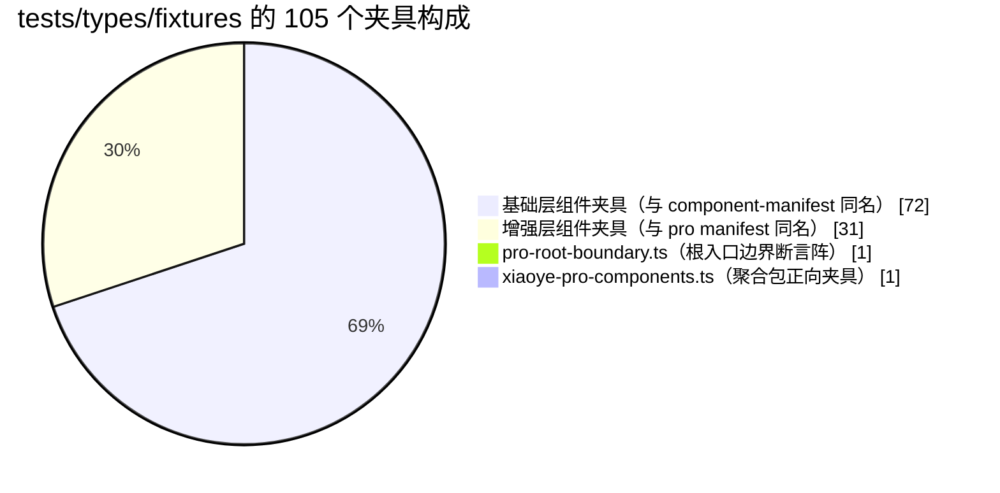
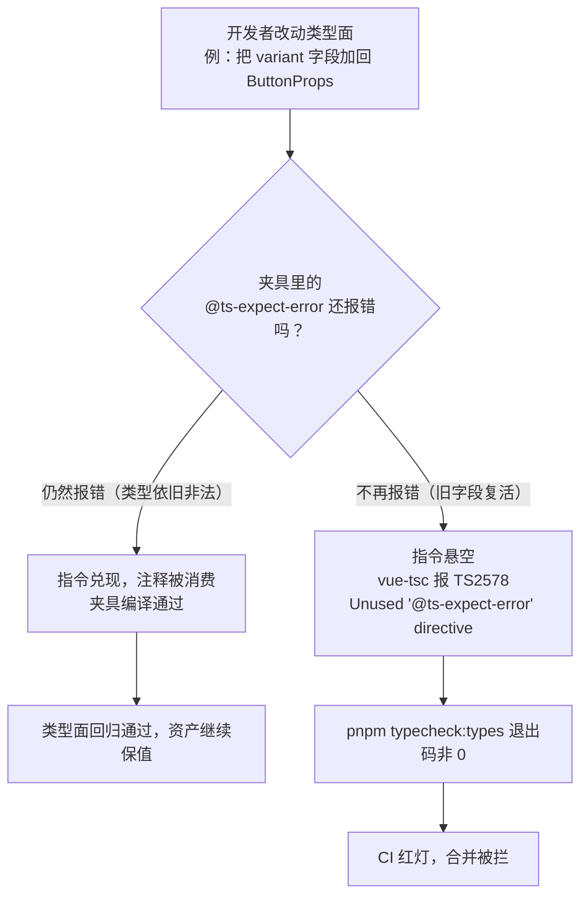
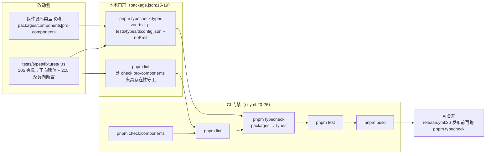

# 10-02 · 类型夹具：@ts-expect-error 负向断言

> 10-01 拆完了单测策略：111 个 spec 回答的是"组件在运行时行为对不对"。但一个组件库交付给消费端的不止运行时行为，还有一整层从不经过运行时的公共契约——`d.ts` 里的类型。类型写得对不对、兼容承诺有没有被悄悄破坏、废弃 API 有没有借尸还魂，vitest 一个断言都测不到。本篇回答第十卷的第二个问题：**类型怎么变成可回归的资产？** 答案浓缩在一个目录里：`tests/types/fixtures`——105 个夹具、215 条 `@ts-expect-error` 负向断言、0 条 `@ts-ignore`，全量挂载在 `pnpm typecheck:types` 的编译单元里，再由 CI 挡在合并之前。类型本身没有运行时，但这个仓库把 TypeScript 编译器本身变成了测试运行器：每一次类型报错都是一次断言执行，而 `@ts-expect-error` 的双向语义让"报错消失"这件事本身也变成失败。

## 一、类型没有运行时，报错就是测试

先想清楚一个反直觉的等式：单元测试里，"断言失败"是坏消息；类型夹具里，"编译报错"可以是好消息——只要这个报错是被 `@ts-expect-error` 预期过的。整个 `tests/types` 工程就建立在这个等式上，而它的全部配置只有七行：

```ts
// tests/types/tsconfig.json（L1-7：全文）
{
  "extends": "../../tsconfig/base.json",
  "compilerOptions": {
    "noEmit": true
  },
  "include": ["../../env.d.ts", "./**/*.ts"]
}
```

七行里有三个值得逐字读的设计决策。

**其一，`include` 是一个通配，没有 `exclude`。** `"./**/*.ts"` 把 `fixtures/` 下每一个文件全量挂进编译单元，没有任何"排除清单"或"灰名单"。这不是巧合而是纪律——`AGENTS.md` 明文约定："全部夹具通过 `pnpm typecheck:types` 参与检查，不要把新夹具排除在 tsconfig 之外"。为什么要用仓库须知钉死这句话？因为"把夹具挪出 include"是这套体系唯一的理论作弊通道：一条断言失效的夹具，最省事的"修复"方式不是改类型，而是把它排除出编译范围。后文会看到，这条通道被脚本守卫、仓库约定和 `@ts-expect-error` 自身的语义从三个方向夹住了。

**其二，`noEmit: true`。** 夹具工程只做类型检查，不产出任何 js。它不是被构建的代码，而是被执行的测试——执行方式就是 `vue-tsc -p tests/types/tsconfig.json --noEmit`（`package.json:19`），退出码就是测试报告。

**其三，`extends` 指向 `tsconfig/base.json`。** 夹具不私养编译选项，而是与 packages、apps 共享同一套基座。这份 36 行的基座是全仓库类型世界的"物理常数"，值得整段读一遍：

```json
// tsconfig/base.json（L1-36：全文）
{
  "compilerOptions": {
    "target": "ES2022",
    "useDefineForClassFields": true,
    "module": "ESNext",
    "moduleResolution": "Bundler",
    "strict": true,
    "jsx": "preserve",
    "sourceMap": true,
    "resolveJsonModule": true,
    "isolatedModules": true,
    "esModuleInterop": true,
    "allowSyntheticDefaultImports": true,
    "lib": ["ES2022", "DOM", "DOM.Iterable"],
    "skipLibCheck": true,
    "baseUrl": "..",
    "types": ["node"],
    "paths": {
      "@xiaoye/components": ["packages/components/index.ts"],
      "@xiaoye/components/*": ["packages/components/*"],
      "@xiaoye/pro-components/style.css": ["packages/pro-components/style.css"],
      "@xiaoye/pro-components": ["packages/pro-components/index.ts"],
      "@xiaoye/pro-components/*": ["packages/pro-components/*"],
      "@xiaoye/primitives": ["packages/xiaoye-primitives/index.ts"],
      "xiaoye-primitives": ["packages/xiaoye-primitives/index.ts"],
      "xiaoye-primitives/*": ["packages/xiaoye-primitives/*"],
      "@xiaoye/utils": ["packages/xiaoye-primitives/src/utils/index.ts"],
      "@xiaoye/theme": ["packages/theme/index.css"],
      "@xiaoye/tokens": ["packages/tokens/src/index.ts"],
      "xiaoye-components/style.css": ["packages/components/style.css"],
      "xiaoye-components": ["packages/components/index.ts"],
      "xiaoye-pro-components/style.css": ["packages/pro-components/style.css"],
      "xiaoye-pro-components": ["packages/pro-components/index.ts"]
    }
  }
}
```

基座里有三处直接决定夹具的运作方式。`"strict": true` 让所有夹具在最高严格度下编译——`strictNullChecks`、`noImplicitAny` 全开，夹具里的每个赋值都在最苛刻的规则下被审判，没有任何"测试专用宽松模式"。`"moduleResolution": "Bundler"` 决定包名解析走 `exports` 字段的现代解析链。最关键的是 `paths`（`tsconfig/base.json:18-34`）：同一个物理文件 `packages/components/index.ts` 被同时映射到 `@xiaoye/components` 与 `xiaoye-components` 两个包名，`packages/pro-components/index.ts` 同理。这份双重映射（2-01 讲过的"一套 alias 服务四条工具链"）是第四节 boundary 夹具能用两个包名各断言一遍的物理前提。

include 里还有一个容易被跳过的条目：`"../../env.d.ts"`。这 18 行环境声明提供了 `*.vue` 的模块 shim（`env.d.ts:11-16`），让夹具工程与 `typecheck:packages` 共享同一种"看到 .vue 文件"的方式。顺带回答一个读者可能会问的问题：夹具本身是纯 TS，为什么执行器用 `vue-tsc` 而不是更轻的 `tsc`？答案是工具链统一——全仓库的 tsconfig 工程共用同一个编译器前端，vue shim 的语义、报错格式、版本行为完全一致，不会出现"夹具用 tsc 通过、包工程用 vue-tsc 失败"的错位。夹具工程从头到尾只有一个编译器，这是"编译器即测试运行器"路线的前提。

## 二、105 个夹具的普查：71 个带刺，34 个只设防

夹具目录的全貌是一组普查数字。基础层 72 个组件（basic 23 / form 19 / feedback 17 / data 13）每个同名一个夹具；增强层 31 个组件同样同名一个；再加两个特殊居民——`pro-root-boundary.ts`（根入口边界）与 `xiaoye-pro-components.ts`（聚合包）——合计 105：



普查命令可以直接复现：

```bash
# 夹具总数
ls tests/types/fixtures | wc -l                       # 105

# 全目录 @ts-expect-error 计数并汇总
rg -c '@ts-expect-error' tests/types/fixtures | awk -F: '{s+=$2} END {print s}'
# 215

# 含负向断言的文件数
rg -l '@ts-expect-error' tests/types/fixtures | wc -l  # 71

# @ts-ignore 必须为零：rg 无匹配时退出码 1
rg '@ts-ignore' tests --count                          # 无输出，exit 1
```

215 条负向断言不是均匀撒上去的。按文件计数降序：`pro-root-boundary.ts` 20 条、`alert.ts` 18 条、`notification.ts` 与 `carousel.ts` 各 9 条、`loading.ts` 8 条、`menu.ts` 与 `drawer.ts` 各 7 条……最稀疏的一档是 31 个只有 1 条负向断言的夹具。71 个夹具带刺，另外 34 个是纯正向的——它们只证明"这些类型存在且能被正常消费"，不设任何负向防线。

基础层最大的夹具是 `alert.ts`：240 行、11 个类型导入，覆盖 Props、服务选项、服务句柄、关闭原因一条完整语义链。拿它的开头段看一个"重类型面"夹具的书写形态：

```ts
// tests/types/fixtures/alert.ts（L1-55：导入头、独立类型消费与 Props 主断言段）
import { h } from "vue";
import type {
  AlertBeforeCloseFn,
  AlertCloseReason,
  AlertEffect,
  AlertOverflowStrategy,
  AlertProps,
  AlertServiceClosedFn,
  AlertServiceHandle,
  AlertServiceOptions,
  AlertServiceSnapshot,
  AlertType,
  AlertVariant
} from "xiaoye-components";
import { XyAlert, XyAlertService } from "xiaoye-components";

const type: AlertType = "warning";
const effect: AlertEffect = "dark";
const variant: AlertVariant = "banner";
const closeReason: AlertCloseReason = "overflow";
const overflowStrategy: AlertOverflowStrategy = "drop-oldest";
const beforeClose: AlertBeforeCloseFn = (done) => done();
const onClosed: AlertServiceClosedFn = (reason) => {
  const currentReason: AlertCloseReason = reason;
  void currentReason;
};

void closeReason;
void overflowStrategy;

const alertProps: AlertProps = {
  modelValue: true,
  title: "高风险提醒",
  description: "请先校验配置后再继续发布",
  type,
  closable: true,
  closeText: "我知道了",
  showIcon: true,
  center: false,
  effect,
  duration: 3_000,
  size: "lg",
  variant,
  beforeClose,
  pauseOnHover: true,
  pauseOnFocus: true,
  pauseOnPageHidden: true,
  collapsible: true,
  defaultExpanded: false,
  lineClamp: 3,
  expandText: "查看更多",
  collapseText: "收起说明"
};

void alertProps;
```

这 55 行里藏着正向断言的三种形态。第一种是**导入即断言**：`import type` 列表里的 11 个名字（`alert.ts:2-14`）必须全部真实存在于 `xiaoye-components` 包根，任何一个被改名或降级，这一行立刻编译失败——一张 import 语句就是一组导出面契约的兑现记录。第二种是**字面量赋值**：`const type: AlertType = "warning"`（`alert.ts:17`）断言 `"warning"` 必须落在 `AlertType` 的联合范围内。第三种是**整对象赋值**：`alertProps` 把 Props 的每个字段按正确类型消费一遍，字段名拼错、类型不匹配、必填缺失都会在赋值处报错。

顺带解决一个细读源码时必然冒出的疑问：满篇的 `void x;` 是干什么用的？考据的结论有点反直觉——它既不是 TypeScript 的要求（`tsconfig/base.json` 没开 `noUnusedLocals`），也不是 ESLint 的要求（`eslint.config.js:56-62` 对 `tests/types/fixtures/**/*.ts` 显式关掉了 `no-unused-vars`）。它是一种**书写纪律**：每个声明紧跟一行消费，把"这个类型存在"与"这个类型被真实使用"拆成两行，让夹具逐行可审；同时防患于未然——将来任何人往基座里加 `noUnusedLocals`，105 个夹具不会一夜全红。`void` 还有一个更实际的技术价值：`void alertServiceHandle.close;` 这类写法可以在**不调用**的前提下消费一个方法属性，从而断言"这个成员存在"——第五节会看到它在 `LoginFormInstance` 上的应用。

## 三、@ts-expect-error 的双向语义：报错消失即失败

普查数字背后，真正的机制核心是 `@ts-expect-error` 这一行注释的**双向语义**。拿最标准的解剖样本 `button.ts` 全文来看（4-03 拆类型层时引过它的第一条负向断言，5-02 拆 Button 时逐条引过这五条，本篇第一次给全文）：

```ts
// tests/types/fixtures/button.ts（L1-58：全文，2 组正向 + 5 条负向）
import type {
  ButtonGroupProps,
  ButtonProps
} from "xiaoye-components";

const buttonProps: ButtonProps = {
  type: "primary",
  size: "md",
  plain: true,
  icon: "mdi:magnify",
  loadingIcon: "mdi:loading",
  tag: "a"
};

void buttonProps;

const invalidButton: ButtonProps = {
  // @ts-expect-error invalid type should be rejected
  type: "filled"
};

void invalidButton;

const invalidVariantButton: ButtonProps = {
  // @ts-expect-error legacy variant has been removed
  variant: "outline"
};

void invalidVariantButton;

const invalidStatusButton: ButtonProps = {
  // @ts-expect-error legacy status has been removed
  status: "primary"
};

void invalidStatusButton;

const invalidIconButton: ButtonProps = {
  // @ts-expect-error icon should be a string
  icon: 1
};

void invalidIconButton;

const groupProps: ButtonGroupProps = {
  type: "success",
  size: "lg",
  direction: "vertical"
};

void groupProps;

const invalidGroupProps: ButtonGroupProps = {
  // @ts-expect-error invalid direction should be rejected
  direction: "stacked"
};

void invalidGroupProps;
```

58 行的文档结构像极了一份微缩的测试文件：两组正向用例（`buttonProps` 消费 `ButtonProps` 全字段、`groupProps` 消费 `ButtonGroupProps`）夹着五条负向用例。五条负向又分两类：`type: "filled"`、`icon: 1`、`direction: "stacked"` 三条是**非法值防线**——字面量不在联合类型里，赋值必须报错；`variant: "outline"`、`status: "primary"` 两条是**废弃 API 的墓碑**——这两个字段曾经存在，2.0 收口时被删除，这两条断言钉死的是"它们不能再被赋值"。墓碑是负向断言最有价值的用法：谁把旧字段悄悄加回 `ButtonProps`，`pnpm typecheck:types` 当场翻脸，任何 code review 的人眼都不需要参与。

为什么墓碑能自动起作用？因为 `@ts-expect-error` 与它的近亲 `@ts-ignore` 语义方向完全相反。`@ts-ignore` 说的是"压制下一行的报错，无论报错是否存在"——如果下一行不再报错，`@ts-ignore` 沉默地悬空，没有任何人知道一条断言已经失效。`@ts-expect-error` 说的是"下一行**必须**报错"——报错在，指令兑现，编译通过；报错消失，指令悬空，TypeScript 抛出 TS2578（`Unused '@ts-expect-error' directive`），编译失败。也就是说，负向断言的失效不是"断言静默脱落"，而是"夹具自己变成一个编译错误"。这正是它能承担回归职责的全部原理：



这张图里没有画出来的半边同样重要：`@ts-expect-error` 悬空报错的位置就在夹具文件里，报错信息直接指向断言行，修哪个文件、修哪一行，机器已经替你指好了。传统的"类型回归靠下游项目 issue 反馈"路径，从发现问题到定位问题要横跨一个 npm 生态；这条路径把两步压缩成了同一次编译。

零 `@ts-ignore` 的纪律也在此处得到解释。本仓库实测 `rg '@ts-ignore' tests --count` 退出码 1（零匹配）——注意这不是工具链强制的，TypeScript 不禁止你写 `@ts-ignore`，ESLint 的 `ban-ts-comment` 规则也没有在配置里针对它布防。它是一条 AGENTS.md 级别的书写纪律，纪律的根据就是上面的语义对比：`@ts-ignore` 的压制是单向且健忘的，写在夹具里等于亲手把断言改成摆设；`@ts-expect-error` 是双向且记仇的。一个只允许"记令断言"存在的目录，才配叫回归资产。

同时要诚实地记下这套机制的一个盲区：**`@ts-expect-error` 不校验报错的原因**。`// @ts-expect-error invalid type should be rejected` 里的文字只是给人看的文档，编译器不比对报错码。假如某天 `ButtonProps.type` 的报错从"字面量不在联合里"（TS2322）变成"对象字面量只能指定已知属性"（TS2353，比如字段被整个改名），指令照样兑现、编译照样通过，而注释已经成了过时文档。报错码级断言在 TypeScript 语言服务里并不存在，这是负向断言的固有精度上限——第八节账单会再收回这笔账。

## 四、两种极端形态：纯负向的 boundary 与纯正向的聚合

如果说 `button.ts` 是正负混合的常规形态，105 个夹具里还有两个刻意走向极端的特殊居民。第一个极端是 `pro-root-boundary.ts`——全库唯一一个**从头到尾都是负向断言**的文件。9-01 从"API 收口立法"的角度引过它（引用时标注 L1-44，本篇按当前工作区实态 L1-43 逐行核对），现在从类型测试方法论的角度重读全文：

```ts
// tests/types/fixtures/pro-root-boundary.ts（L1-43：全文，20 条负向断言）
// @ts-expect-error 根入口不再暴露 ProTable 工具栏动作细节类型
import type { ProTableToolbarAction } from "@xiaoye/pro-components";
// @ts-expect-error 根入口不再暴露 ProTable 排序载荷细节类型
import type { ProTableSortChangePayload } from "@xiaoye/pro-components";
// @ts-expect-error 根入口不再暴露 ProTable 单元格插槽细节类型
import type { ProTableCellSlotProps } from "@xiaoye/pro-components";
// @ts-expect-error 根入口不再暴露审批动作别名
import type { ApprovalFlowAction } from "@xiaoye/pro-components";
// @ts-expect-error 根入口不再暴露时间线内部状态枚举
import type { AuditTimelineStatus } from "@xiaoye/pro-components";
// @ts-expect-error 根入口不再暴露浮层表单容器细节类型
import type { OverlayFormContainer } from "@xiaoye/pro-components";
// @ts-expect-error 根入口不再暴露浮层表单模式细节类型
import type { OverlayFormMode } from "@xiaoye/pro-components";
// @ts-expect-error 根入口不再暴露详情面板容器细节类型
import type { DetailPanelContainer } from "@xiaoye/pro-components";
// @ts-expect-error 根入口不再暴露分栏布局字面量类型
import type { SplitLayoutPageLayout } from "@xiaoye/pro-components";
// @ts-expect-error 根入口不再暴露 SearchForm 内建组件枚举
import type { SearchFormFieldBuiltinComponent } from "@xiaoye/pro-components";

// @ts-expect-error 经 xiaoye-pro-components 包名解析到同一根入口，同样不再暴露 ProTable 工具栏动作细节类型
import type { ProTableToolbarAction as XiaoyeProTableToolbarAction } from "xiaoye-pro-components";
// @ts-expect-error 经 xiaoye-pro-components 包名解析到同一根入口，同样不再暴露 ProTable 排序载荷细节类型
import type { ProTableSortChangePayload as XiaoyeProTableSortChangePayload } from "xiaoye-pro-components";
// @ts-expect-error 经 xiaoye-pro-components 包名解析到同一根入口，同样不再暴露 ProTable 单元格插槽细节类型
import type { ProTableCellSlotProps as XiaoyeProTableCellSlotProps } from "xiaoye-pro-components";
// @ts-expect-error 经 xiaoye-pro-components 包名解析到同一根入口，同样不再暴露审批动作别名
import type { ApprovalFlowAction as XiaoyeApprovalFlowAction } from "xiaoye-pro-components";
// @ts-expect-error 经 xiaoye-pro-components 包名解析到同一根入口，同样不再暴露时间线内部状态枚举
import type { AuditTimelineStatus as XiaoyeAuditTimelineStatus } from "xiaoye-pro-components";
// @ts-expect-error 经 xiaoye-pro-components 包名解析到同一根入口，同样不再暴露浮层表单容器细节类型
import type { OverlayFormContainer as XiaoyeOverlayFormContainer } from "xiaoye-pro-components";
// @ts-expect-error 经 xiaoye-pro-components 包名解析到同一根入口，同样不再暴露浮层表单模式细节类型
import type { OverlayFormMode as XiaoyeOverlayFormMode } from "xiaoye-pro-components";
// @ts-expect-error 经 xiaoye-pro-components 包名解析到同一根入口，同样不再暴露详情面板容器细节类型
import type { DetailPanelContainer as XiaoyeDetailPanelContainer } from "xiaoye-pro-components";
// @ts-expect-error 经 xiaoye-pro-components 包名解析到同一根入口，同样不再暴露分栏布局字面量类型
import type { SplitLayoutPageLayout as XiaoyeSplitLayoutPageLayout } from "xiaoye-pro-components";
// @ts-expect-error 经 xiaoye-pro-components 包名解析到同一根入口，同样不再暴露 SearchForm 内建组件枚举
import type { SearchFormFieldBuiltinComponent as XiaoyeSearchFormFieldBuiltinComponent } from "xiaoye-pro-components";

void 0;
```

43 行、20 条断言、零个正向用例——它的正向面是空的，因为它断言的对象是"不存在"。结构上是一个 2×10 的矩阵：10 组已被降级的细节类型（ProTable 的工具栏动作、排序载荷、单元格插槽，审批流别名，审计时间线枚举，浮层表单容器与模式，详情面板容器，分栏布局字面量，SearchForm 内建组件枚举），每个类型用 `@xiaoye/pro-components` 与 `xiaoye-pro-components` 两个包名各断言一遍。为什么每个都要断两遍？回到第一节的 `paths` 双重映射：两个包名是两条独立的模块解析路径，别名单侧的解析配置（`paths`、包 `exports` 字段、构建 dts 产物）如果只在一侧出错，单侧断言就能分别捕捉。消费端真实世界里用哪个包名的都有，边界承诺就必须对两个包名同等成立。

第二个极端是聚合夹具 `xiaoye-pro-components.ts`：495 行、**零条**负向断言，是全库最大的纯正向文件。它的骨架是一条 79 行的巨型 import——31 个增强组件值、46 个 type 导入、外加一个默认导出，77 个命名导入每一个都是一条"这个名字从根入口可得"的正向断言：

```ts
// tests/types/fixtures/xiaoye-pro-components.ts（L1-79：聚合导入头，31 组件值 + 46 类型）
import XiaoyeProComponents, {
  XyApprovalFlowPanel,
  XyAuditTimeline,
  XyAvatarMenu,
  XyAsyncStateContainer,
  XyColumnSettingPanel,
  XyCrudPage,
  XyDetailPage,
  XyDetailPanel,
  XyDialogForm,
  XyDrawerForm,
  XyExportTaskPanel,
  XyFilterPanel,
  XyHeaderTabs,
  XyImportResultTable,
  XyImportWizard,
  XyLoginForm,
  XyListPage,
  XyNoticeCenter,
  XyOverlayForm,
  XyPageContainer,
  XyPageHeader,
  XyPageToolbar,
  XyProForm,
  XyProTable,
  XyRequestForm,
  XySavedViewTabs,
  XySearchForm,
  XySplitLayoutPage,
  XyStatCard,
  XyStepsForm,
  XyTableFilterDrawer,
  type ApprovalFlowNode,
  type AvatarMenuItem,
  type AsyncStateContainerProps,
  type AuditTimelineEntry,
  type ColumnSettingPanelColumn,
  type CrudPageProps,
  type DetailPageAction,
  type DetailPageAttachmentFile,
  type DetailPageBreadcrumbItem,
  type DetailPageProps,
  type DetailPanelProps,
  type DialogFormProps,
  type DialogFormSubmitPayload,
  type DrawerFormProps,
  type DrawerFormSubmitPayload,
  type ExportTaskItem,
  type FilterPanelProps,
  type HeaderTabItem,
  type ImportResultSummary,
  type ImportWizardStep,
  type LoginFormInstance,
  type LoginFormModel,
  type LoginFormProps,
  type LoginFormThirdPartyItem,
  type ListPageProps,
  type ListPageBatchAction,
  type NoticeCenterTab,
  type OverlayFormProps,
  type OverlayFormSubmitPayload,
  type PageContainerProps,
  type PageHeaderProps,
  type PageIcon,
  type PageMetaItem,
  type PageToolbarProps,
  type ProDisplayOption,
  type ProDisplayRenderContext,
  type ProDisplayValueType,
  type ProFormProps,
  type ProFieldSchema,
  type ProTableProps,
  type RequestFormSubmitContext,
  type SavedViewTabItem,
  type SearchFormField,
  type SplitLayoutPageProps,
  type StatCardProps,
  type StatTrend
} from "xiaoye-pro-components";
```

导入之后是 300 多行的逐类型消费，其中最值得看的是泛型实例化与实例成员两处（第五节展开），先看文件结尾的实例断言：

```ts
// tests/types/fixtures/xiaoye-pro-components.ts（L491-495：实例类型成员消费断言）
declare const loginFormInstance: LoginFormInstance;

void loginFormInstance.validate;
void loginFormInstance.submit;
void loginFormInstance.focus;
```

`LoginFormInstance` 是 `9-11` 拆过的命令式实例句柄。这五行断言的不是"类型存在"，而是**这个实例类型的成员面**：`validate`、`submit`、`focus` 三个方法必须存在且可在不调用的前提下被引用（`void` 读属性不触发调用）。任何一个方法被改名或删除，`void` 行报 TS2339——一条纯正向夹具内部的成员级负向侦测。

boundary 与聚合这两个文件不是孤立存在的，它们被同一台脚本守卫盯着。`scripts/check-pro-components.mjs` 的 11 类 mismatch 检查里，有三类直接以类型夹具为执法对象：

```js
// scripts/check-pro-components.mjs（L267-327：mismatches 检查表与 fail 分发，类型夹具相关三类见下文）
const mismatches = [
  {
    message: "增强公开组件目录缺失：",
    values: diff(componentNames, componentDirs)
  },
  {
    message: "增强导出入口与 manifest 不一致：",
    values: [
      ...diff(componentNames, exportedComponentNames),
      ...diff(exportedComponentNames, componentNames).map((name) => `${name} (多余导出)`)
    ]
  },
  {
    message: "增强值导出白名单与 manifest 不一致：",
    values: diffNamedExportMap(
      Object.fromEntries(
        manifest.map((entry) => [entry.name, [...entry.installExports].sort()])
      ),
      exportedComponentValues
    )
  },
  {
    message: "增强组件文档缺失：",
    values: diff(componentNames, docComponentNames)
  },
  {
    message: "增强示例文档缺失：",
    values: diff(componentNames, exampleDocNames)
  },
  {
    message: "增强类型夹具缺失：",
    values: diff(componentNames, typeFixtureNames)
  },
  {
    message: "增强组件单测缺失：",
    values: diff(componentNames, unitTestNames)
  },
  {
    message: "增强样式入口缺失：",
    values: diff(styleNames, styleImportNames)
  },
  {
    message: "增强文档 demo 引用缺失：",
    values: [
      ...collectDocDemoMismatches(docFiles),
      ...collectDocDemoMismatches(exampleDocFiles)
    ]
  },
  {
    message: "增强聚合包类型夹具缺失：",
    values: proTypeFixtureExists ? [] : ["tests/types/fixtures/xiaoye-pro-components.ts"]
  },
  {
    message: "增强根入口类型白名单与约定不一致：",
    values: diffNamedExportMap(rootTypeWhitelist, rootTypeExports)
  }
];

mismatches
  .filter((entry) => entry.values.length > 0)
  .forEach((entry) => fail(entry.message, entry.values));
```

三个夹具相关检查的原料来自更上面的采集段（`check-pro-components.mjs:247-249` 按组件名预过滤夹具基名；`263-265` 用 `fs.existsSync` 单查聚合夹具存在性）。于是出现了一个值得点破的嵌套关系：**类型守卫（boundary 夹具）验证编译器眼里的世界，脚本守卫验证源码文本里写了什么，而脚本守卫反过来盯着类型守卫的存在性**。9-01 的结语把这对关系概括为"一层守卫防呆，两层守卫防的是绕过第一层的方式本身"（`9-01:683`），本篇补上方法论那一半：脚本守卫读 `.ts` 源文件、用正则抠导出语句，它查的是"文本合规"；类型夹具走完 paths 别名、包 exports、构建 dts 的完整解析链，它查的是"语义可得"。文本上没写与编译器拿不到之间隔着的每一层，都可能让单侧守卫失明——4-01:584 分析过夹具校验"单向化"的让渡（预过滤让"多余夹具"只能靠人眼），而 boundary 夹具的双向断言正是把人眼最难盯的"语义层回归"交还给编译器。守卫守守卫，闭环就是这么扣上的。

## 五、正向断言的不对称：expectTypeOf 缺席与零依赖替代

现在可以正面回答本篇最有意思的一个不对称了：**负向断言有 215 条，正向断言却没有一件"专业武器"**。考据实态：`rg 'expectTypeOf'` 在全仓库的 TS 源码里零命中（packages、tests、apps 三个源码树全部为零），唯一命中是 4-10 专栏文章自己的文字（`4-10:815`）；`satisfies` 关键字在 105 个夹具里同样零命中。4-10 已经如实记过一笔："本库完全不用 `expectTypeOf` 式断言，统一走 `@ts-expect-error` 正反对照。这个选择让夹具对工具链零依赖（不需要 vitest 的 typecheck 集成），但也意味着正例的断言力较弱（'能编译'不等于'推导出的类型精确相等'）。"本篇把这个选择的账算全。

**这是本篇的第一处设计权衡。** `expectTypeOf`（vitest 内置的流式类型断言）能做什么赋值型断言做不到的事？最典型的是**双向相等**：

```ts
// 示意代码：expectTypeOf 式断言（当前夹具未采用，仅作对照）
import { expectTypeOf } from "vitest";
import type { AlertType } from "xiaoye-components";

// 赋值型断言只能证明单向："warning" 可赋给 AlertType。
// 若 AlertType 某天被放宽成 string，下面这行依然通过——防线静默失效。
const type: AlertType = "warning";

// expectTypeOf 的 toEqualTypeOf 断言双向相等：
// AlertType 若被放宽成 string，或收窄成 "warning" 单值，都会失败。
expectTypeOf<AlertType>().toEqualTypeOf<"info" | "success" | "warning" | "error">();
```

它的代价也同样清楚：`expectTypeOf` 的断言在**运行 vitest 时**才被求值（类型层面失败由 `vitest --typecheck` 或 `tsc` 对测试文件的编译揭示），这要求类型测试与 vitest 的 typecheck 集成绑定——多一条命令、多一份配置、多一层版本耦合。本库的选择是把"编译器当测试运行器"贯彻到底：`vue-tsc --noEmit` 一步到位，任何能跑 TypeScript 编译器的环境（本地、CI、发布流水线）都天然能执行全部断言，夹具对测试框架零依赖。代价则是正向断言退化为"可赋值"级别——**能用，但精度有上限**。

精度上限不是没有缓解手段。105 个夹具的实态里，正向断言实际上发展出了三种零依赖的加强形态。第一种是上面 alert 一节见过的**字面量赋值**（`const type: AlertType = "warning"`），单点钉住联合成员。第二种是**泛型实例化**——把泛型组件放在真实的类型位置上，让类型参数的传递链被完整编译：

```ts
// tests/types/fixtures/xiaoye-pro-components.ts（L163-173：泛型实例化断言）
const tableProps: ProTableProps<Row> = {
  data: [{ id: 1, name: "控制台" }],
  columns: [
    {
      prop: "name",
      label: "名称"
    }
  ],
  draggableRow: true,
  draggableColumn: true
};
```

`ProTableProps<Row>` 实例化时，`data` 的元素必须是 `Row`、`columns` 的 `prop` 键必须落在 `keyof Row` 的约束内（`"id" | "name"`）——泛型参数与字段约束在一条赋值语句里被同时审判。同样的手法出现在 `ListPageProps<Row>`（`xiaoye-pro-components.ts:355-363`）与 `CrudPageProps<Row>`（`372-383`）上，加上 `displayContext = {} as ProDisplayRenderContext<{ status: string }, ProFieldSchema>`（`194-197`）的双参数实例化，泛型组件的每一个类型参数槽位都有真实消费点。第三种是聚合夹具结尾的**实例成员消费**（`491-495`，上一节已引）——用 `void` 成员读取断言命令式句柄的方法面。

如果哪天精度要求确实超出了这三件套，还有一条**零依赖的中间路线**可以不引入 vitest 而补齐双向相等——手写 `Equal` 工具类型 + 条件类型断言，同样活在"编译器即测试运行器"的世界里：

```ts
// 示意代码：零依赖的双向相等断言（当前夹具未采用，仅作演进预留）
type Expect<T extends true> = T;
type Equal<X, Y> =
  (<T>() => T extends X ? 1 : 2) extends (<T>() => T extends Y ? 1 : 2)
    ? true
    : false;
import type { AlertType } from "xiaoye-components";

// 编译期断言：AlertType 必须与目标联合双向相等，
// 放宽或收窄任一方向都会让 _assert 变成 false，触发 extends 约束报错。
type _assert = Expect<Equal<AlertType, "info" | "success" | "warning" | "error">>;

// 若断言失败：Type error: Type 'false' does not satisfy the constraint 'true'.
```

这套写法不需要任何运行时依赖，断言失败同样表现为 `typecheck:types` 的编译错误。它没有被采用不是能力问题，而是成本判断：105 个夹具的正向面以"可用性"为主要目标，双向相等的边际收益集中在少数核心类型上——真到需要时，这条路线是现成的。**权衡的结论**：负向断言交给 `@ts-expect-error`（机制自带回归能力），正向断言交给赋值与实例化（零依赖、够用），双向相等留作演进位（不预支复杂度）。

## 六、夹具粒度：一组件一文件的键位设计

**第二处权衡**藏在 105 这个数字本身：为什么是一组件一文件，而不是一份集中式的巨型类型测试文件？

一组件一文件的直接收益在键位上：夹具基名与 `component-manifest.json` 的 `name` 字段严格同名（`search-form.ts` 对 `search-form`），这让"公开组件必须配套类型夹具"变成一次按键 diff。4-01:485 分析过 `check-components.mjs` 的取夹具逻辑——取 `tests/types/fixtures` 基名后**先按 componentNames 过滤**，因为这个目录还住着 31 个 pro 夹具和 2 个特殊居民，不该被基础层脚本误伤；预过滤的代价是"多余夹具"方向永远查不出来（`4-01:584` 点破的单向化）。而增强层脚本把同一招用成了双向保护：`check-pro-components.mjs:296-299` 的"增强类型夹具缺失"检查 pro 侧组件，`315-318` 单查聚合夹具。同名键还让 AI 协作者受益：拿到一个组件名，夹具路径可以直接推导，不需要索引。

粒度的代价同样真实：公共样板（import 头、`void` 消费行）在 105 个文件里重复了 105 遍；`alert.ts` 240 行、`xiaoye-pro-components.ts` 495 行与那些只有十几行的最小夹具（如 `divider.ts`）之间，粒度并不均匀。但对这套体系而言，重复是可接受的税——机器按键校验要求的是**键的存在**，不是文件的短小；把所有断言合并进一个大文件反而会杀死按键 diff 的能力，还得给 2 个特殊居民开例外。

**第三组对比对象是 Element Plus。** 直接实测其 GitHub main 分支：`packages/components/button/__tests__/` 下只有 `button.test.tsx` 一个文件，`packages/components/select/__tests__/` 下只有 `options.test.tsx` 与 `select.test.ts` 两个文件——核心组件的测试目录里没有按组件配套的类型夹具文件。EP 的类型质量口碑建立在手写 `d.ts` 的整体水准上，类型回归主要依赖下游使用者的 issue 反馈，而非发布前的类型断言门禁（这里只陈述实测到的两个组件目录结构，不对 EP 全仓类型测试覆盖做全局断言）。与本库的差别不在"有没有类型测试"这个二元问题上，而在**类型契约有没有被纳入与单测同级的回归纪律**：本库把"公开组件 → 类型夹具"写进了 manifest 键位约定（4-01 列出的六处同步之一）、脚本守卫（夹具缺失即 fail）与 AGENTS.md（不得排除出 tsconfig），三处闭环后，类型面从"作者的自觉"变成了"仓库的执法"。这也是对核心问题的部分回答：资产与摆设的区别，不在写没写断言，而在断言失效时**有没有机器必须翻脸**。

## 七、回归链路：一条类型改动怎么变成 CI 红灯

所有部件就位后，把整条回归链路连起来看。脚本链的挂载点在根 `package.json`：

```json
// package.json（L15-19：check:pro-components、lint 与 typecheck 双链）
    "check:pro-components": "node scripts/check-pro-components.mjs",
    "lint": "pnpm check:tokens && pnpm check:llms && pnpm check:components && pnpm check:pro-components && eslint .",
    "typecheck": "pnpm run typecheck:packages && pnpm run typecheck:types",
    "typecheck:packages": "vue-tsc -p tsconfig/packages.json --noEmit && vue-tsc -p tsconfig/apps.json --noEmit",
    "typecheck:types": "vue-tsc -p tests/types/tsconfig.json --noEmit",
```

注意两条链的分工：`typecheck:types` 编译夹具（类型断言的执行器），`check:pro-components` 挂在 `lint` 链上（夹具存在性的守卫）——同一个资产被两条独立命令从两个方向检查。CI 的编排顺序（2-05 详述过门禁链）把两者都挡在合并之前：

```yaml
# .github/workflows/ci.yml（L20-26：check job 核心步骤）
      - run: pnpm install --frozen-lockfile
      - run: pnpm check:components
      - run: pnpm lint
      - run: pnpm typecheck
      # CI runner 内存有限，文件级并行曾致 OOM flaky（同一提交在 Release job 中全部通过）
      - run: pnpm test -- --no-file-parallelism
      - run: pnpm build
```

`pnpm typecheck` 先 packages 后 types，夹具工程排在单测之前——类型违约比行为违约更早暴露。发布流水线 `release.yml:36` 在构建发布物之前还会再跑一次 `pnpm typecheck`，类型资产的最后一道闸门直接焊在 npm publish 前面。整条链路如下：



拿两条真实场景走一遍闭环。**场景一（墓碑复活）**：有人把 `variant: "outline"` 字段加回 `ButtonProps`——`button.ts:24-27` 的赋值合法了，`@ts-expect-error` 悬空，vue-tsc 报 TS2578，`typecheck:types` 退出码非 0，CI 红灯，错误信息直接指向夹具第 25 行。**场景二（边界失守）**：有人往 pro 包根入口加回 `ProTableToolbarAction` 导出——白名单侧，`check-pro-components.mjs:319-322` 的"根入口类型白名单与约定不一致"先在 lint 链上翻脸；即使这行导出以某种形态绕过了正则（比如构建配置把子入口 dts 并进了根类型产物），`pro-root-boundary.ts:1-2` 的 import 不再报错、20 条断言悬空，typecheck 链照样红。两条链互为备份，且都无需任何人工介入。

最后诚实面对第一节埋下的那个缝隙：如果有人把 boundary 夹具整个挪出 tsconfig include，脚本守卫查的只是文件存在性（文件还在，exists 为真），编译守卫压根不会编译它——两条机器链同时失明。此时兜底的只剩 AGENTS.md 的成文约定与 code review。9-01 对这个缝隙的定性依然准确："把夹具排除出 include 这件事本身，也会被脚本守卫的'增强类型夹具缺失'与夹具全量挂载约定夹住"——但严格说，脚本守卫拦得住"删文件"，拦不住"留在原地、排除出编译"。这是三层防御里最薄的一层，承认它比假装它不存在更有价值：约定层防御的本质是**把违规成本从"改一行配置"抬高到"违反成文纪律 + 留下 review 痕迹"**，对于 AI 协作场景（AI 会读 AGENTS.md）这层防御的命中率相当高，但它终究是概率防御而非确定性防御。

## 八、账单与下一篇

照例记一份清醒的代价清单：

- **负向断言不校验报错原因**。`@ts-expect-error` 后面的注释只是文档，报错码从 TS2322 变成 TS2353 之类的原因漂移机器感知不到。缓解手段（报错码断言）在 TS 语言服务里不存在，只能靠注释写清楚预期原因、review 时人眼比对。
- **正向断言停留在"可赋值"精度**。赋值型断言挡不住联合类型被放宽（`AlertType` 退化成 `string` 依旧全绿），双向相等断言（`expectTypeOf` 或手写 `Equal`）是现成的演进位，当前刻意不预支。
- **全量挂载的时间税**。105 个夹具每次 `typecheck:types` 全量编译，`noEmit` 也省不掉解析与检查的成本；这是"全量 include"纪律的对价——增量排除带来的作弊通道比这几秒编译时间贵得多。
- **boundary 是判例集不是全集**。20 条断言覆盖 10 组代表性细节类型，新降级的类型要主动补进夹具，否则只受脚本白名单单向保护（9-01 同样提示过这一点）——"补墓碑"目前仍是人工义务，没有被脚本强制。
- **最薄的一层在 include 之外**。脚本拦得住删文件，拦不住"文件在、编译不编译"，兜底靠 AGENTS.md 与 review，是概率防御。

回到核心问题：**类型怎么变成可回归的资产？** 这篇给出的答案是四个词的组合：**事实源**（manifest 键位与 `paths` 双重映射决定"应该有什么"）、**执行器**（TypeScript 编译器本身，`@ts-expect-error` 的双向语义让报错与"报错消失"都成为可判定信号）、**触发器**（`typecheck:types` → `pnpm typecheck` → CI 与发布流水线的门禁链）、**纪律**（零 `@ts-ignore`、全量 include、一组件一夹具、废弃必立墓碑）。单测让运行时行为可回归（10-01），类型夹具让编译期契约可回归（本篇）——但组件库还有一类资产既不走运行时也不走类型系统：像素。72 个组件在亮暗两套主题下的实际渲染，任何一个令牌值、一条 CSS 规则的改动都可能让某处视觉悄悄漂移，而人眼巡检既慢又不可靠。

下一篇 **10-03《视觉巡检：双主题像素 diff》**（承接 3-03 的双主题机制）拆解最后一块回归拼图：`pnpm audit:visual` 如何用 Playwright 在两套 `data-theme` 下批量截图、用 pixelmatch 做像素级对比、以 0.5% 阈值和基线快照机制把"看起来不对劲"变成一条可判定的退出码——类型资产、运行时资产之后，视觉资产也进入同一个"可回归"的行列。三块拼图凑齐，这个 AI 协作仓库的质量体系才算闭环——下篇见。
