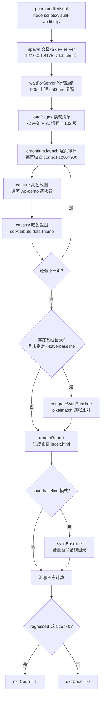
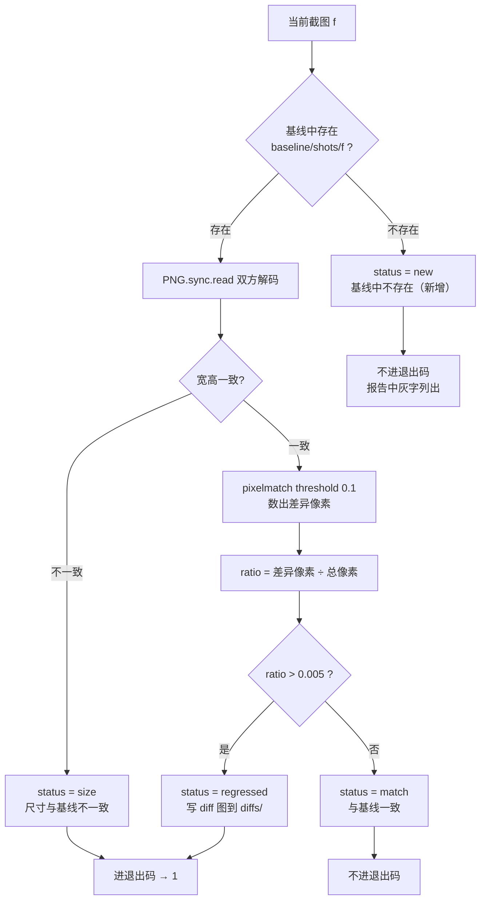
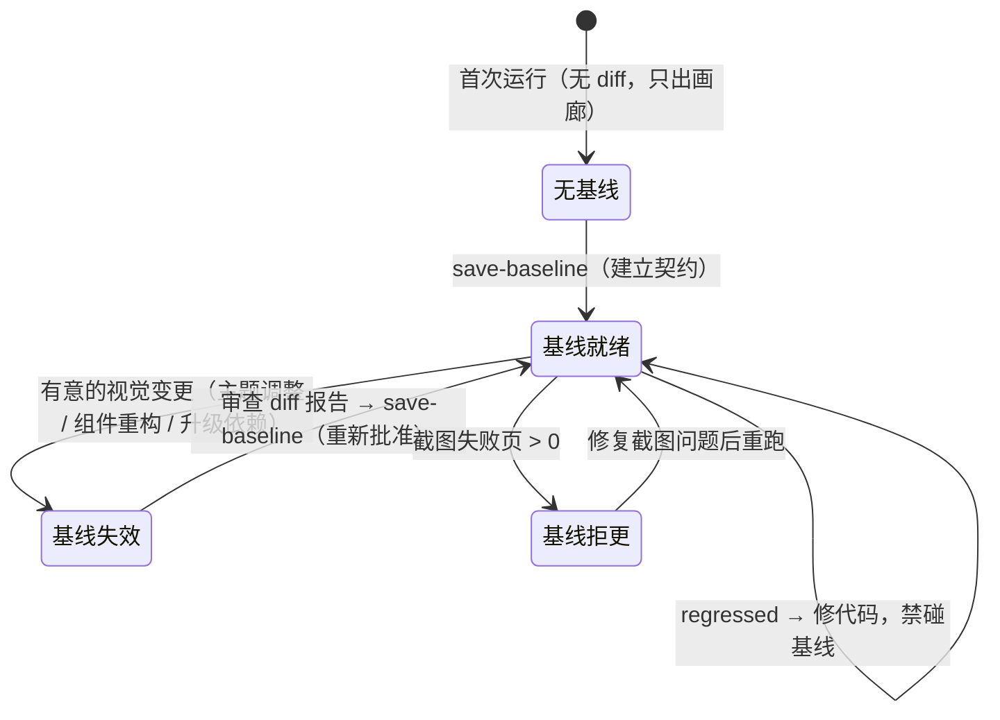

# 10-03 · 视觉巡检：双主题像素 diff

> 核心问题：0.5% 阈值与基线机制的设计

上一篇讲测试的文章刚拆完类型夹具，这一篇我们把镜头从"类型怎么变成可回归的资产"转向一个更刁钻的资产：**像素**。3-03 那篇讲双主题机制时留了一个尾巴——`data-theme` 协议设计得再优雅，"暗色下没有组件翻车"这件事，最终靠什么证明？那篇文章的答案是四个字：视觉巡检。本篇就负责把这个工具链整个拆开：`scripts/visual-audit.mjs`，一个 341 行的 Node 脚本，加上 `output/visual-baseline/` 里 1064 张基线截图，构成这套组件库唯一一道**视觉回归闸门**。

先交代与 3-03 的分工边界：3-03 讲的是双主题**机制**——`data-theme` 属性协议、语义层覆写边界、`--xy-mix-light` 反转技巧，说的是"皮肤怎么换"；本篇讲的是双主题**巡检工具链**——怎么起站、怎么采样、怎么比像素、基线怎么管理，说的是"皮肤坏了怎么知道"。两篇共享同一段源码（截图段 L91-L117，3-03 引过一次，本篇从巡检视角重读一遍），但问题域完全不同。

三个数字先立在门口：

- **341**：`scripts/visual-audit.mjs` 的总行数（`wc -l` 实测），从起文档站到出报告到管基线，一气呵成；
- **0.5%**：像素 diff 的判定阈值，一个截图里超过千分之五的像素与基线不同，即判回归；
- **1064**：基线目录里的截图张数——103 个组件文档页上 532 个 demo 块，乘以亮暗两个主题。

---

## 一、一条命令，341 行：脚本链与三种用法

入口在根 `package.json` 第 37 行，和它的邻居们放在一起看很有意思：

```jsonc
// package.json（scripts 节选，行号为实态）
// L22: "test:e2e:admin": "playwright test tests/e2e/admin-flow.spec.ts",
// L36: "test:e2e": "playwright test",
// L37: "audit:visual": "node scripts/visual-audit.mjs"
```

单测归 vitest，端到端归 Playwright 的 test runner，视觉巡检却是一个**裸 Node 脚本**——不挂在任何测试框架下，没有 describe、没有 expect，自己管自己的进程和退出码。为什么？看到后文你会明白：这道闸门的工作流（起站、截图、比对、更新基线）和断言驱动的工作流差异太大，硬塞进测试框架反而别扭。三个依赖也极轻：

```text
devDependencies（package.json 实态）：
  @playwright/test  ^1.58.2   ← 借它的 chromium 启动器与截图 API
  pixelmatch         ^7.2.0   ← 像素比对，零依赖的经典小库
  pngjs              ^7.0.0   ← PNG 解码/编码
```

脚本的自我介绍写在文件头注释里，三种用法一目了然——这也是本篇的目录：

```javascript
// scripts/visual-audit.mjs L1-L42
#!/usr/bin/env node
/**
 * 双主题视觉巡检脚本。
 *
 * 起文档站 dev server，遍历全部组件文档页，在浅色/暗色两种主题下截取
 * demo 区域，输出截图集与画廊页到 output/visual-audit/，用于人工快速
 * 巡检暗色模式下组件样式的正确性（缺少暗色变量、硬编码色值等问题会
 * 直接反映在截图对比中）。
 *
 * 用法：
 *   node scripts/visual-audit.mjs [--layer=all|base|pro] [--port=4175]
 *     常规巡检；若存在基线 output/visual-baseline/ 则自动做像素 diff。
 *   node scripts/visual-audit.mjs --save-baseline
 *     本次截图写入基线（无 diff）。
 *   node scripts/visual-audit.mjs --render-only
 *     仅用 output/visual-audit/shots 已有截图重新渲染画廊。
 */
import fs from "node:fs";
import path from "node:path";
import { spawn } from "node:child_process";
import { chromium } from "@playwright/test";
import pixelmatch from "pixelmatch";
import { PNG } from "pngjs";

const repoRoot = path.resolve(import.meta.dirname, "..");
const args = process.argv.slice(2);
const getArg = (name, fallback) => {
  const hit = args.find((a) => a.startsWith(`--${name}=`));
  return hit ? hit.split("=")[1] : fallback;
};
const layer = getArg("layer", "all");
const port = Number(getArg("port", "4175"));
const baseURL = `http://127.0.0.1:${port}`;

const outDir = path.join(repoRoot, "output", "visual-audit");
const baselineDir = path.join(repoRoot, "output", "visual-baseline");
const saveBaseline = args.includes("--save-baseline");
const renderOnly = args.includes("--render-only");
if (!renderOnly) {
  fs.rmSync(outDir, { recursive: true, force: true });
  fs.mkdirSync(path.join(outDir, "shots"), { recursive: true });
}
```

L35-L36 两个目录名值得先记下：`visual-audit` 是每次运行的工作区（开头就被 `rmSync` 整个删掉重建，L40——巡检永远从白纸开始，不信任上一轮的残留），`visual-baseline` 是基线目录，**唯一的长期资产**。注意它俩都在 `output/` 下，而根 `.gitignore` 第 16-17 行写着：

```text
# .gitignore L16-L17
output/
output-*.png
```

也就是说，1064 张基线**不进版本库**。这个决定是本篇后半段"基线机制"一节的主角，这里先按下不表。

整条管线的全景如下，后面每一节都对应图上一段：



---

## 二、清单驱动：页面枚举的零维护设计

巡检要遍历哪些页面？4-01 讲过，这个仓库有一份 `component-manifest.json` 管"六处一致性"——导出、安装、样式、文档侧边栏……视觉巡检把"第七处"也挂了上去。`loadPages` 的实现只有 13 行：

```javascript
// scripts/visual-audit.mjs L44-L56
function loadPages() {
  const pages = [];
  const addLayer = (manifestPath, urlPrefix, layerName) => {
    if (layer !== "all" && layer !== layerName) return;
    const manifest = JSON.parse(fs.readFileSync(path.join(repoRoot, manifestPath), "utf8"));
    for (const entry of manifest) {
      pages.push({ name: entry.name, docsText: entry.docsText, url: `${urlPrefix}/${entry.name}`, layer: layerName });
    }
  };
  addLayer("packages/components/component-manifest.json", "/components", "base");
  addLayer("packages/pro-components/component-manifest.json", "/pro-components", "pro");
  return pages;
}
```

清单条目长这样（以 button 为例，`packages/components/component-manifest.json` 实态节选）：

```json
{
  "name": "button",
  "docsGroup": "basic",
  "docsText": "Button 按钮",
  "installExports": ["XyButton", "XyButtonGroup"],
  "installChecks": [
    { "kind": "component", "name": "xy-button" },
    { "kind": "component", "name": "xy-button-group" }
  ],
  "styleImports": ["button"]
}
```

巡检只用两个清单字段：`name` 拼 URL（`/components/button`、`/pro-components/pro-table`），`docsText` 用在报告标题里；截图文件名的 `layer` 前缀（base/pro）则由 `addLayer` 的调用参数决定。URL 能直接拼通，是因为 VitePress 以 `apps/docs/components/` 和 `apps/docs/pro-components/` 为源目录，markdown 文件路径即路由路径。

这是一个典型的**清单驱动 vs 手写清单**权衡。手写一份"要巡检的页面列表"当然也能跑，但它会立刻腐化：新增组件忘了加巡检，暗色问题在第一次用户反馈时才暴露；删组件忘了删条目，巡检报 404 噪音。清单驱动让"新组件自动进入巡检范围"成为默认行为——维护成本为零，正确性由 4-01 那套 manifest 一致性校验间接兜底。代价是巡检粒度被绑死在"清单条目 = 文档页"这个等式上，有两个诚实的例外：

- `apps/docs/components/overview.md` 是总览页，不在清单里，**永远不会被巡检**——它没有组件 demo，巡检它没有意义；
- `scheduler.md` 在清单里，但那一页走"场景页"路线（demo 放在 `/examples/scheduler`），正文只有 API 表格，零个 `:::demo` 块——巡检会访问它，产出 0 张截图。

第二个例外顺带揭开了截图目标的定义：脚本截的不是"页面"，而是页面里所有 `.vp-demo` 容器。这个类名来自文档站的主题组件 `apps/docs/.vitepress/theme/components/Demo.vue`：

```vue
<!-- apps/docs/.vitepress/theme/components/Demo.vue（节选，L107-L110 实态） -->
  <div class="vp-demo-block" v-html="decodedDescription" />
  <div class="vp-demo" :class="{ 'vp-demo--table': isTableDemo }">
    <div class="vp-demo__showcase">
```

markdown 里每个 `:::demo` 容器渲染成一个 `.vp-demo` 元素，`.vp-demo__showcase` 是其中真正渲染组件的舞台。**巡检的最小采样单元是 demo 块，不是页面**——这个决定比看起来重要，后面讲 0.5% 阈值时会回来收这个伏笔。

---

## 三、起站与采样：1280×900 下的双主题截图

管线的起点是起一个真实的文档站。主流程 L303-L307：

```javascript
// scripts/visual-audit.mjs L303-L307
const server = spawn("pnpm", ["--filter", "@xiaoye/docs", "exec", "vitepress", "dev", ".", "--host", "127.0.0.1", "--port", String(port)], {
  cwd: repoRoot,
  stdio: "ignore",
  detached: true,
});
```

`detached: true` 让 dev server 独立成进程组，结尾 `finally` 里一个 `process.kill(-server.pid, "SIGTERM")`（L337）按进程组整组收割——不留孤儿进程，这是脚本对宿主机器的礼貌。端口默认 4175，刻意避开文档站 dev 的 5173、preview 的 4173，也避开 e2e 的 4174（`playwright.config.ts` L9：`baseURL: "http://127.0.0.1:4174"`）——**同一台机器上巡检和 e2e 可以并行跑，互抢端口的架已经提前吵完了**。这份同构不是巧合：文档站在这套仓库里同时是巡检的采样场和 e2e 的宿主环境，下一篇（10-04）会把这个宿主关系讲透。

就绪检测是最朴素的轮询：

```javascript
// scripts/visual-audit.mjs L58-L70
async function waitForServer() {
  const deadline = Date.now() + 120_000;
  while (Date.now() < deadline) {
    try {
      const res = await fetch(`${baseURL}/`);
      if (res.ok) return;
    } catch {
      // server 未就绪，继续等待
    }
    await new Promise((r) => setTimeout(r, 500));
  }
  throw new Error(`文档站未能在 120s 内就绪：${baseURL}`);
}
```

VitePress dev 冷启动在这个仓库的体量下（103 个组件页加全部示例）并不快，120 秒的上限给得宽裕，500ms 的间隔也不会给 CPU 压力。没有花哨的 readiness probe，一个 `fetch` 打到根路径返回 200 即算就绪——巡检脚本的哲学之一：**可靠的 primitive 优先于精致的机制**。

然后是逐页审计的主体。每个组件页独占一个浏览器上下文（viewport 1280×900），页面级 console 错误全程在侧录音：

```javascript
// scripts/visual-audit.mjs L74-L89
async function auditPage(browser, pageEntry) {
  const context = await browser.newContext({ viewport: { width: 1280, height: 900 } });
  const page = await context.newPage();
  const consoleErrors = [];
  page.on("console", (msg) => {
    if (msg.type() === "error") consoleErrors.push(msg.text().slice(0, 300));
  });
  page.on("pageerror", (err) => consoleErrors.push(`pageerror: ${String(err).slice(0, 300)}`));

  const shots = { light: [], dark: [] };
  try {
    await page.goto(`${baseURL}${pageEntry.url}`, { waitUntil: "networkidle", timeout: 90_000 });
  } catch {
    await page.goto(`${baseURL}${pageEntry.url}`, { waitUntil: "domcontentloaded", timeout: 90_000 });
  }
  await page.waitForTimeout(500);
```

L85-L88 是一个务实的降级：首选 `networkidle`（所有网络请求静默，图全加载完），90 秒等不到就退到 `domcontentloaded`（DOM 好了就走，别死磕）——某些页面有长连接或懒加载资源，`networkidle` 可能永远不满足。再补 500ms 静置让首帧渲染稳定。视觉巡检对"页面没打开成功"是宽容的（降级继续），对"console 报错"是零容忍的（L78-L81 全程录音，报告页单独列红块）——这个不对称是有意的：**截图失败最多是少一张图，console 报错意味着组件在真实环境里会炸**。

接着是本篇与 3-03 交汇的那一段——双主题采样，L91-L117：

```javascript
// scripts/visual-audit.mjs L91-L117（3-03 引过，本篇换巡检视角重读）
  const capture = async (theme) => {
    await page.evaluate((mode) => {
      const html = document.documentElement;
      if (mode === "dark") html.setAttribute("data-theme", "dark");
      else html.removeAttribute("data-theme");
    }, theme);
    await page.waitForTimeout(250);
    const demos = await page.locator(".vp-demo").all();
    const list = [];
    for (let i = 0; i < demos.length; i += 1) {
      const el = demos[i];
      try {
        await el.scrollIntoViewIfNeeded();
        await page.waitForTimeout(150);
        const file = `shots/${pageEntry.layer}-${pageEntry.name}-${theme}-${String(i + 1).padStart(2, "0")}.png`;
        await el.screenshot({ path: path.join(outDir, file), animations: "disabled" });
        list.push(file);
      } catch (err) {
        consoleErrors.push(`demo#${i + 1} 截图失败: ${String(err).slice(0, 150)}`);
      }
    }
    return list;
  };

  shots.light = await capture("light");
  shots.dark = await capture("dark");
  await page.evaluate(() => document.documentElement.removeAttribute("data-theme"));
```

3-03 从协议角度赞美过这段：脚本对主题的全部操作就是 `setAttribute` / `removeAttribute`，不注入任何样式——属性一设，剩下全是 CSS 的事，反证了 `data-theme` 协议的完备。本篇补上巡检视角的四个细节：

**其一，截图文件名即索引。** `base-button-light-01.png` 这样的名字把层级、组件、主题、序号全部编码进一个字符串，后文的比对、报告、基线管理全部靠这个约定寻址，不需要任何元数据文件。三段式命名里 `-` 是合法字符（`input-number`、`pro-table`），但解析它的正则（L222）把层级和主题锚死了（`^(base|pro)-(.+)-(light|dark)-(\d+)\.png$`），贪婪匹配不会吞错段。

**其二，逐块截图前的两次静置。** 切主题后 250ms（让 CSS 变量级联完成、`color-mix()` 派生稳定），每个 demo 截图前 `scrollIntoViewIfNeeded` 再等 150ms（滚动触发的懒加载和视口重排落定）。没有监听任何"渲染完成"事件——CSS 变量切换没有可靠的完成信号，固定静置是务实解。

**其三，`animations: "disabled"`。** Playwright 的截图选项，把 CSS 动画和过渡快进到终态。没有它，一次恰好截在过渡中段的截图就是一张永久的噪音基线。

**其四，单 demo 失败不中断页面。** `try/catch` 包住每一次截图，失败只记一条 console 错误（带 `截图失败` 前缀），继续截下一块。但记住这个前缀——第六节会看到，它会在基线更新时被点名清算。

收尾把结果压平进总账，`demoCount` 取亮暗两侧的较大值（单侧失败不吞计数），console 错误 `Set` 去重：

```javascript
// scripts/visual-audit.mjs L119-L127
  results.push({
    ...pageEntry,
    light: shots.light,
    dark: shots.dark,
    demoCount: Math.max(shots.light.length, shots.dark.length),
    consoleErrors: [...new Set(consoleErrors)],
  });
  await context.close();
```

---

## 四、0.5% 的两层语义：像素判定与区域占比

全部页面截完，进入本篇的核心：比对。`compareWithBaseline`（L239-L285）是整个脚本技术密度最高的 47 行，分两段读。

先看比对单元与前置分流：

```javascript
// scripts/visual-audit.mjs L239-L265
/** 与基线做像素对比，结果写入 result.diffStatus / result.diffRatio */
function compareWithBaseline() {
  if (saveBaseline || !fs.existsSync(baselineDir)) return;
  const pixelmatchFn = pixelmatch.default ?? pixelmatch;
  const diffDir = path.join(outDir, "diffs");
  fs.mkdirSync(diffDir, { recursive: true });

  for (const r of results) {
    for (let i = 0; i < r.demoCount; i += 1) {
      const idx = String(i + 1).padStart(2, "0");
      for (const theme of ["light", "dark"]) {
        const f = `shots/${r.layer}-${r.name}-${theme}-${idx}.png`;
        const currentPath = path.join(outDir, f);
        const baselinePath = path.join(baselineDir, f);
        if (!fs.existsSync(baselinePath)) {
          r.diffStatus ??= {};
          r.diffStatus[f] = "new";
          continue;
        }
        try {
          const a = PNG.sync.read(fs.readFileSync(baselinePath));
          const b = PNG.sync.read(fs.readFileSync(currentPath));
          if (a.width !== b.width || a.height !== b.height) {
            r.diffStatus ??= {};
            r.diffStatus[f] = "size";
            continue;
          }
```

注意 L241 的双重短路：`--save-baseline` 模式下**根本不比对**（本次截图就是未来的真相，无从对比），没有基线目录也不比对（首次运行只出画廊，不出 diff 结论）。L242 的 `pixelmatch.default ?? pixelmatch` 是 ESM/CJS 互操作防御——pixelmatch 7.x 的包在不同导入路径下默认导出的挂法不同，一行兜底。

然后是判定主体，0.5% 就住在这里：

```javascript
// scripts/visual-audit.mjs L266-L285
          const diffPng = new PNG({ width: a.width, height: a.height });
          const diffPixels = pixelmatchFn(a.data, b.data, diffPng.data, a.width, a.height, { threshold: 0.1 });
          const ratio = diffPixels / (a.width * a.height);
          r.diffStatus ??= {};
          r.diffStatus[f] = ratio > 0.005 ? "regressed" : "match";
          if (r.diffStatus[f] === "regressed") {
            fs.writeFileSync(path.join(diffDir, f.split("/")[1]), PNG.sync.write(diffPng));
          }
          r.diffRatio ??= {};
          r.diffRatio[f] = ratio;
        } catch (err) {
          console.error(`对比失败 ${f}: ${err}`);
        }
      }
    }
    // 注：countdown/charts 等 JS 驱动 demo 理论上是 diff 噪音源，但实测两次独立
    // 运行 1064 张截图全一致（文档 demo 未启自动播放/动画），暂不引入跳过名单；
    // 若未来文档 demo 增加自动播放内容，把对应组件加入本函数开头做排除即可。
  }
}
```

现在的关键问题是：0.5% 到底是几层阈值？**以实码定论：这个仓库的阈值体系是"两层、一个占比"，而不是"整页一层 + 单区域一层"。**

- **第一层是像素级的**：pixelmatch 的 `threshold: 0.1`（L267）。它工作在 YIQ 色彩空间，衡量"两个像素的颜色差多少才算不同"——0.1 意味着肉眼几乎无感的微小色差（抗锯齿边缘、亚像素渲染抖动）**不算**差异像素。这是 pixelmatch 的默认值，脚本显式写出来，是一种"把关键参数亮在明处"的自文档化。
- **第二层是区域级的**：`ratio > 0.005`（L270）。差异像素数除以总像素数，超过 0.5% 即判 `regressed`。比对单元**本身就是 demo 区域**（一张 `.vp-demo` 截图），不存在更上层的"整页占比"。

所以准确的表述是：**每个 demo 截图内部，先经 0.1 的感知阈值筛掉噪声像素，再看剩余差异像素占比是否超过 0.5%**。两个参数正交——前者决定"什么算一个差异像素"，后者决定"多少差异像素算回归"。

为什么定标在 0.5%？往两头推演就明白这是个夹逼出来的值：

- 如果压到 0.1%：一张 300×200 的 demo 图有 6 万像素，60 个差异像素就报警。字体渲染的亚像素抖动、图标抗锯齿的边缘毛刺、时间戳类文本的重排，都轻松制造这个量级的噪声。工具天天狼来了，人就不看了——**假阳性杀死的不只是这次报警，是这道闸门未来的所有报警**。
- 如果放到 2%：一个按钮边框色从 `rgba(255,255,255,0.1)` 退化到 0.18，在一块几百像素宽的 demo 块里可能只影响边框线附近的像素，占比不足 1%——**最典型的暗色回归恰恰是这种"细线条级"的**。阈值太宽，这道闸对它最该防的事视而不见。
- 0.5% 落在中间：小到一个像素级抖动不至于误报，大到任何成块的色块错乱（背景、填充、大面积文字变色）必然触发。而且因为比对单元是 demo 块而非整页，一个按钮的边框回归会在它自己的截图里占到远超 0.5% 的占比——**采样粒度越细，同样的绝对差异在分母里被放得越大，阈值就可以定得越保守**。这是"逐 demo 截图"这个设计在阈值层面的分红。

1 个 demo 块之外，比对还有两个旁路出口，构成完整的四态：



四态的退出码语义在主流程尾部（L327-L331）收口：`regressed > 0 || size > 0` 才 `process.exitCode = 1`。**`new` 不红灯**——新增 demo 是能力增长，不是回归；如果新增也报警，每加一个示例都要先跑一次 `--save-baseline` 才能绿灯，流程很快就会被绕过。但 `new` 也不是静默的：报告页里灰字标出"基线中不存在（新增）"，留给下一次基线更新时收编。`size` 单列且红灯，是因为宽高不等时 pixelmatch 根本无法逐像素比对（数组长度不匹配会直接抛错），L261-L264 的前置检查既是防御也是语义：**布局塌了、内容溢出了，这不是"差异大"，是"没法比"，必须人来看**。

---

## 五、1064 的账目：从 103 页到 532 组截图

报告页 `renderReport`（L129-L216）把 `results` 渲染成一个自包含的 HTML 画廊。它同时是 diff 结果的展示层——先看每页卡片的组装：

```javascript
// scripts/visual-audit.mjs L129-L151
function renderReport() {
  const escape = (s) => s.replaceAll("&", "&amp;").replaceAll("<", "&lt;");
  const groups = new Map();
  for (const r of results) {
    if (!groups.has(r.layer)) groups.set(r.layer, []);
    groups.get(r.layer).push(r);
  }
  const sections = [...groups.entries()]
    .map(([layerName, list]) => {
      const cards = list
        .map((r) => {
          const imgs = [];
          for (let i = 0; i < r.demoCount; i += 1) {
            const idx = String(i + 1).padStart(2, "0");
            for (const theme of ["light", "dark"]) {
              const f = `shots/${r.layer}-${r.name}-${theme}-${idx}.png`;
              if (r[theme].includes(f)) {
                imgs.push(
                  `<figure><a href="${f}" target="_blank"></a><figcaption>${r.docsText} · demo ${idx} · ${theme}</figcaption></figure>`
                );
              }
            }
          }
```

亮暗成对排布，人眼左右一扫就能对比同一 demo 的两个主题。diff 标记紧随其后：

```javascript
// scripts/visual-audit.mjs L153-L188
          const marks = [];
          for (let i = 0; i < r.demoCount; i += 1) {
            const idx = String(i + 1).padStart(2, "0");
            for (const theme of ["light", "dark"]) {
              const f = `shots/${r.layer}-${r.name}-${theme}-${idx}.png`;
              const status = r.diffStatus?.[f];
              if (status && status !== "match") {
                const ratio = r.diffRatio?.[f];
                marks.push(
                  `<li class="mark ${status}">${theme} demo ${idx}：${
                    status === "regressed"
                      ? `差异 ${(ratio * 100).toFixed(2)}% <a href="${f.replace("shots/", "diffs/")}" target="_blank">diff 图</a>`
                      : status === "new"
                        ? "基线中不存在（新增）"
                        : "尺寸与基线不一致"
                  }</li>`
                );
              }
            }
          }
          const diffBlock =
            marks.length > 0
              ? `<details class="diff"><summary>⚠ ${marks.length} 处与基线不同</summary><ul>${marks.join("")}</ul></details>`
              : r.diffStatus
                ? `<div class="ok">✓ 与基线一致</div>`
                : "";
          const errors = r.consoleErrors.length
            ? `<div class="err"><strong>${r.consoleErrors.length} 条 console 错误</strong><ul>${r.consoleErrors
                .map((e) => `<li>${escape(e)}</li>`)
                .join("")}</ul></div>`
            : "";
          return `<section><h3>${escape(r.docsText)} <code>${r.name}</code>（${r.demoCount} 个 demo）</h3><div class="grid">${imgs.join("")}</div>${diffBlock}${errors}</section>`;
        })
        .join("\n");
      return `<h2>${layerName === "base" ? "基础组件" : "增强组件"}（${list.length}）</h2>${cards}`;
    })
    .join("\n");
```

`regressed` 条目直接链到 `diffs/` 目录下的 diff 可视化图（pixelmatch 的第三张输出图，红块标出差异像素位置），并给出精确到两位小数的差异占比。头部汇总与收尾落盘：

```javascript
// scripts/visual-audit.mjs L190-L216
  const totalDemos = results.reduce((n, r) => n + r.demoCount, 0);
  const errorPages = results.filter((r) => r.consoleErrors.length > 0);
  const html = `<!doctype html><html lang="zh-CN"><head><meta charset="utf-8"><title>双主题视觉巡检报告</title>
<style>
body{font-family:system-ui,sans-serif;margin:24px;background:#f6f6f6;color:#222}
h2{margin-top:40px;border-bottom:2px solid #ddd;padding-bottom:8px}
section{background:#fff;border-radius:12px;padding:16px;margin:16px 0}
.grid{display:flex;flex-wrap:wrap;gap:12px}
figure{margin:0;max-width:300px}
img{width:100%;border:1px solid #e3e3e3;border-radius:8px}
figcaption{font-size:12px;color:#666;margin-top:4px}
.err{margin-top:8px;font-size:13px;color:#b3001b;background:#fff2f2;border-radius:8px;padding:8px}
.err ul{margin:4px 0 0 18px;padding:0}
.diff{margin-top:8px;font-size:13px}
.diff summary{color:#b45309}
.diff .mark.regressed{color:#b3001b}
.diff .mark.new,.diff .mark.size{color:#555}
.ok{margin-top:8px;font-size:12px;color:#0a7a3d}
summary{cursor:pointer;font-size:14px;color:#555}
</style></head><body>
<h1>双主题视觉巡检报告</h1>
<p>组件页 ${results.length} 个 · demo 截图 ${totalDemos} 组 · console 报错页面 ${errorPages.length} 个</p>
<details><summary>存在 console 错误的页面</summary><ul>${errorPages.map((r) => `<li>${r.layer}/${r.name}（${r.consoleErrors.length}）</li>`).join("") || "<li>无</li>"}</ul></details>
${sections}
</body></html>`;
  fs.writeFileSync(path.join(outDir, "index.html"), html);
}
```

一个自包含 HTML、相对路径引用截图、浏览器直接打开——报告不依赖任何服务，也不往 git 里塞一个字节。

现在是摊牌时刻：**1064 这本账到底怎么数？** 用两条命令当场对账：

```bash
# 基础层：72 个清单条目，其中 scheduler 无 :::demo → 71 页有 demo，共 488 块
rg -c "^:::demo" apps/docs/components/*.md | awk -F: '{s+=$2} END {print s}'
# → 488

# 增强层：31 个清单条目全部有 demo，共 44 块（overview.md 不在清单、0 块）
rg -c "^:::demo" apps/docs/pro-components/*.md | awk -F: '{s+=$2} END {print s}'
# → 44
```

账目链条：72 基础 + 31 增强 = **103 个巡检页**（manifest 驱动）；其中有 demo 的 71 + 31 = 102 页；488 + 44 = **532 个 demo 块**；每块亮暗各一张，532 × 2 = **1064 张截图**。这和脚本 L282 注释里"两次独立运行 1064 张截图全一致"完全对得上——那行注释本身就是这本账的旁证。顺带一提，单页 demo 冠军是 table 的 23 块（`rg -c "^:::demo" apps/docs/components/table.md`），alert 20 块、carousel 19 块紧随其后——组件能力面越宽，巡检采样越密。

还有一个为调试体验准备的旁门，`--render-only`：

```javascript
// scripts/visual-audit.mjs L218-L237
if (renderOnly) {
  const files = fs.readdirSync(path.join(outDir, "shots")).sort();
  const map = new Map();
  for (const f of files) {
    const m = f.match(/^(base|pro)-(.+)-(light|dark)-(\d+)\.png$/);
    if (!m) continue;
    const key = `${m[1]}/${m[2]}`;
    if (!map.has(key)) {
      map.set(key, { name: m[2], docsText: m[2], url: "", layer: m[1], light: [], dark: [], consoleErrors: [] });
    }
    map.get(key)[m[3]].push(`shots/${f}`);
  }
  for (const r of map.values()) {
    r.demoCount = Math.max(r.light.length, r.dark.length);
    results.push(r);
  }
  renderReport();
  console.log(`画廊已重新生成：${path.join(outDir, "index.html")}`);
  process.exit(0);
}
```

不起新一轮截图，直接从 `shots/` 目录的文件名反推出结果集重渲画廊——改了报告样式想看效果、或者上一轮跑完只想换个方式浏览，30 秒内出结果。文件名即索引的命名约定在这里又收了一次红利。

---

## 六、基线机制：一次 --save-baseline，一份被批准的契约

终于到了基线本身。`syncBaseline`（L287-L301）只有 15 行，但它定义的流程语义值得逐行抠：

```javascript
// scripts/visual-audit.mjs L287-L301
/** 巡检结束后维护基线目录 */
function syncBaseline() {
  if (!saveBaseline) return;
  const failedShots = results.reduce(
    (n, r) => n + (r.consoleErrors.filter((e) => e.includes("截图失败")).length ? 1 : 0),
    0
  );
  if (failedShots > 0) {
    console.log(`有 ${failedShots} 个页面存在截图失败，本次不更新基线（避免基线出现空洞）`);
    return;
  }
  fs.rmSync(baselineDir, { recursive: true, force: true });
  fs.cpSync(path.join(outDir, "shots"), path.join(baselineDir, "shots"), { recursive: true });
  console.log(`基线已更新：${baselineDir}`);
}
```

三个设计决定，一个比一个有意思。

**第一，全量替换，拒绝增量。** `rmSync` + `cpSync`，旧基线整个删掉、新截图整体拷入。为什么不做成"逐张覆盖"？因为增量合并会产生一种最危险的状态：基线里一部分是上周批准确认的、一部分是这次顺手写进去的，**没有人能说清这份契约的完整内容是什么**。全量替换保证基线永远是某一次巡检运行的原子快照——要么全是旧的，要么全是新的，没有中间态。代价也要诚实交代：旧基线被 `rmSync` 后不留档，脚本没有内置 rollback——但全量替换让"回滚"退化成一个便宜动作：把代码修回旧视觉，重新签一次字即可。基线的可重建性替代了基线的可追溯性，这笔交换对本地工具是划算的。

**第二，截图失败守门。** L290-L297 数一遍带"截图失败"前缀的 console 错误，有任何一页失败就拒绝更新基线。理由写在日志里："避免基线出现空洞"。如果 1064 张里有一张没截到，增量式更新会让基线永久缺这张图——之后每一轮巡检它都会被报成 `new`，一个永不愈合的假伤口。守门逻辑把"部分失败"拦截在基线之外：**基线宁可不更新，也不能是一份不完整的契约**。配合开头的 `rmSync`（工作目录整个重建），这实际上是双保险：全量替换从结构上杜绝空洞，守门从流程上拦截残缺。

**第三，基线是本地的，不是 CI 的。** `.github/workflows/` 里没有任何 job 调 `audit:visual`（rg 全仓零匹配），`output/` 又被 gitignore。也就是说，这道视觉回归闸门**不在发布门禁链上**，它是每个开发者本地的一张网。为什么不做进 CI？三个现实约束：其一，1064 张 PNG 按均张几十 KB 算是几十 MB 的二进制资产，进版本库会让每一次基线更新变成一次仓库膨胀，diff 审阅也无从谈起；其二，像素比对对渲染环境高度敏感——字体光栅化、GPU 合成、亚像素布局，跨机器跑同一页面就可能产生稳定存在的百分比级差异，云端 runner 的基线会永远红灯；其三，这道闸的主战场是"改了主题/样式之后本地自查"，它挡的是无心之失，不是恶意提交——真要卡破坏性视觉变更，靠的是 review 时跑一遍 `pnpm audit:visual` 并贴出报告页。

于是 `--save-baseline` 的使用纪律浮出水面，它本质上是一个**审批动作**：



什么时候允许 `--save-baseline`？只有一种情形：**你明知并接受当前的视觉状态，愿意为它签字**。日常开发中 diff 报了 `regressed`，正确动作是修代码，而不是重置基线——那是把考试卷子改成自己写的答案。允许签字的场景是有意变更：主题令牌调整（比如 3-03 讲的暗色 soft 家族 alpha 从 12%/20% 提到 16%/24%，1064 张里所有相关 demo 都会合法地红灯）、组件视觉重构、升级影响渲染的依赖、或换了一台字体渲染不同的新机器。以 soft 家族为例，`tokens.css` 暗色块 L299-L319 的这一组值若再调整，就是一次标准的"知情签字"场景：

```css
/* packages/xiaoye-primitives/src/theme/tokens.css L299-L319（暗色块内的状态色家族） */
  /* 状态：基色取亮阶，soft 用品牌色 alpha（官方暗色模式） */
  --xy-success: #2fd772;
  --xy-success-hover: #4cdf80;
  --xy-success-active: var(--xy-green-500);
  --xy-success-soft: rgba(21, 190, 83, 0.16);
  --xy-success-soft-hover: rgba(21, 190, 83, 0.24);
  --xy-success-text: #4cdf80;

  --xy-warning: var(--xy-amber-400);
  --xy-warning-hover: #e0b264;
  --xy-warning-active: var(--xy-amber-500);
  --xy-warning-soft: rgba(212, 160, 74, 0.16);
  --xy-warning-soft-hover: rgba(212, 160, 74, 0.24);
  --xy-warning-text: #e8bc72;

  --xy-danger: var(--xy-red-400);
  --xy-danger-hover: #f6769f;
  --xy-danger-active: var(--xy-red-500);
  --xy-danger-soft: rgba(234, 34, 97, 0.16);
  --xy-danger-soft-hover: rgba(234, 34, 97, 0.24);
  --xy-danger-text: #f78bb0;
```

签字前看什么？看报告页的 diff 图——每一处红块都有可视证据，确认每一条 `regressed` 都对应你认知内的那次变更，才执行重置。**基线更新的审批语义不靠流程系统强制，靠这条命令本身的心理重量：它一键抹掉所有红灯，所以它必须只在你读完红灯之后按下去。**

签字之后主流程怎么收尾？把 L308 往后的编排看全，三件大事的调用顺序本身就是设计：

```javascript
// scripts/visual-audit.mjs L309-L341
try {
  await waitForServer();
  const pages = loadPages();
  const browser = await chromium.launch();
  for (const pageEntry of pages) {
    process.stdout.write(`审计 ${pageEntry.layer}/${pageEntry.name} ...\n`);
    await auditPage(browser, pageEntry);
  }
  await browser.close();
  compareWithBaseline();
  renderReport();
  syncBaseline();
  const errorPages = results.filter((r) => r.consoleErrors.length > 0);
  const statusCount = { match: 0, regressed: 0, new: 0, size: 0 };
  for (const r of results) {
    for (const s of Object.values(r.diffStatus ?? {})) statusCount[s] += 1;
  }
  console.log(`\n完成：${results.length} 个组件页，${results.reduce((n, r) => n + r.demoCount, 0)} 组 demo 截图`);
  if (saveBaseline) {
    console.log("模式：保存基线（未做对比）");
  } else if (Object.keys(statusCount).some((k) => statusCount[k] > 0)) {
    console.log(`像素对比：一致 ${statusCount.match} · 差异 ${statusCount.regressed} · 新增 ${statusCount.new} · 尺寸变化 ${statusCount.size}`);
    if (statusCount.regressed > 0 || statusCount.size > 0) process.exitCode = 1;
  }
  console.log(`console 报错页面：${errorPages.length === 0 ? "无" : errorPages.map((r) => `${r.layer}/${r.name}`).join(", ")}`);
  console.log(`报告：${path.join(outDir, "index.html")}`);
} finally {
  try {
    if (server.pid) process.kill(-server.pid, "SIGTERM");
  } catch {
    // server 进程组可能已退出
  }
}
```

L318-L320 的顺序是一条硬依赖链：`compareWithBaseline()` 必须在 `renderReport()` 之前，报告页才有 diff 状态可渲染；`syncBaseline()` 排在报告之后，基线更新出问题也不影响报告产出。而 `finally` 里的进程组收割（L337）保证了无论中途抛什么错——起站失败、页面超时、比对崩溃——dev server 都不会变成孤儿。退出码逻辑在 L329-L331：四态计数里只有 `regressed` 和 `size` 能把退出码置 1，`match` 与 `new` 永远绿灯。

---

## 七、噪音治理：一条不写跳过名单的注释

L281-L283 那段注释值得单独一节，它是整个脚本里最像"工程决策记录"的文字：

```javascript
    // 注：countdown/charts 等 JS 驱动 demo 理论上是 diff 噪音源，但实测两次独立
    // 运行 1064 张截图全一致（文档 demo 未启自动播放/动画），暂不引入跳过名单；
    // 若未来文档 demo 增加自动播放内容，把对应组件加入本函数开头做排除即可。
```

视觉回归工具的经典死法是被动态内容淹死：倒计时每秒跳字、图表入场动画逐帧绘制、轮播自动播放——每次截图内容都不同，diff 永远红灯，工具沦为摆设。这个仓库的应对分三层：

**源头治理**：文档 demo 不启自动播放、不加实时数据（countdown 的文档示例用固定目标时间，charts 静态出图），让 1064 张截图在两次独立运行间逐位一致——注意这不是"碰巧稳定"，而是文档站的 demo 纪律在巡检侧的回报，两套约定互为因果。

**截图端止损**：`animations: "disabled"` 快进所有 CSS 动画到终态，配合逐块静置，把渲染时序抖动压到最低。

**比对端宽容**：0.1 的感知阈值吸收亚像素噪声，0.5% 的占比阈值吸收个位数字符的宽度差。

在此之上，**刻意不建跳过名单**。业界同类工具（BackstopJS、Jest Image Snapshot）常见做法是维护一份"已知不稳定组件"列表，比对时跳过——但名单是会腐化的：组件改名后名单失效，修复后的组件忘记摘除名单，真实的回归从此在盲区里滋长。这个脚本选择用实测数据（两次独立运行全一致）支撑"不建名单"的决定，把复测成本压到零，再把逃生通道写在注释里：真出现自动播放 demo，加排除即可。**为尚未发生的问题预留一行代码的接口，不为它预先支付一份需要维护的配置**——YAGNI 原则在一行注释里的落地。

---

## 八、Element Plus 没有的那道闸

把镜头拉远看生态位。Element Plus 是 Vue 3 生态最主流的组件库，组件数量与这个仓库同量级，也有完整的暗色主题（CSS 变量方案）——但翻遍它的 monorepo，**没有等价的视觉回归设施**：没有像素 diff 脚本，没有基线目录，CI 里跑的是单测和类型检查。EP 的暗色主题正确性靠什么兜底？单元测试断言类名与变量绑定、快照测试锁 DOM 结构，以及最大的一层——海量用户在真实项目里的反馈。换句话说，EP 把"暗色下某个组件颜色不对"这类问题的发现权交给了发布之后。

EP 不是个例而是常态——业界普遍如此，视觉回归靠外部服务补位：Chromatic（Storybook 官方血统，云端跑比对，按快照量收费）、Lost Pixel、BackstopJS……它们都是"把截图和比对托管出去"。这条路对 EP 那种社区项目是合理的：视觉资产多人共享、云端基线天然统一。但对一个 AI 协作研发的自研组件库，需求画像完全不同：没有跨机器共享基线的需求（就是一个人加一群 agent 在同一台机器上开发）、不想为视觉回归订阅云服务、更不想让 agent 的每次改动都上传截图。于是 341 行自研 + pixelmatch 本地比对成了甜点位：零外部依赖（三个 devDependencies 全是纯本地库）、零云服务、零账号体系，`pnpm audit:visual` 一条命令从起到报告完全闭环。

代价也要说清楚：本地基线意味着**没有跨人统一的视觉真相**——两位开发者各自维护各自的基线，A 批准的视觉变更 B 的基线并不知情，B 拉到代码后跑巡检会看到一片"合法的红灯"，需要自己重签一次。这在单人 + AI 协作的工作流里不是问题（AI 的"上一轮状态"就是本地基线，反而天然对齐），在多人团队里则需要把"跑巡检、贴报告、重签基线"写进 review 约定。工具的边界设计与团队形态匹配，比工具本身的先进性更重要。

还有一层呼应留给下一篇：前面说过，这道闸和 e2e 共用文档站这个宿主，只是分住 4175 和 4174 两个房间。文档站在这套仓库里早已不只是"文档"——它是视觉巡检的采样场、是 e2e 的宿主环境、是 MCP Server 数据层 `api-schema.json` 的原料来源（2-09 讲过的"文档即事实源"）。一份文档站，多条工具链，这是 2-06 埋下的架构决定在第 10 卷的复利。

---

## 九、收束

回看这 341 行，它把"视觉回归"这个听起来很重的词拆成了三个轻决策的乘积：

1. **清单驱动**：页面枚举挂在 `component-manifest.json` 上，新组件自动入巡检名单，零维护成本；采样单元定在 demo 块（`.vp-demo`），粒度细到阈值可以定得保守。
2. **双层阈值**：pixelmatch 的 0.1 感知阈值在像素级滤噪声，0.5% 的占比阈值在 demo 区域级定回归——前者决定"什么算不同"，后者决定"多少不同算坏"，两个旋钮正交，各自可调。四态账目（match/regressed/new/size）里只有 regressed 和 size 点红灯，`new` 放行给增长。
3. **本地基线**：1064 张基线不进 git、不进 CI，是开发者本地的契约；`--save-baseline` 是一次全量替换式的"签字"，被截图失败守门拦住残缺，被审批语义约束滥用；跳过名单被一条实测注释挡在门外。

0.5% 这个数字也因此有了完整的身份：它不是从哪个标杆抄来的 magic number，而是"逐 demo 采样 × 感知阈值滤噪 × 本地渲染环境"这三个前提共同夹逼出的定标——换了任何一个前提（比如整页截图、跨机器基线），这个值都需要重新校准。工具的参数要跟着工具的架构走，这是比数字本身更值得带走的结论。

下一篇（10-04《e2e 与六道发布门禁全景》）我们把视角从"一道闸"拉回"整条防线"：以文档站为宿主的 e2e 到底测了什么（`tests/e2e/docs-demos.spec.ts` 与 `admin-flow.spec.ts`），单测、类型夹具、一致性校验、视觉巡检、e2e、构建六道门禁如何在 `pnpm` 脚本链与 CI 里排兵布阵——以及那个在 2-05 留过悬念的问题：发布前的最后一道闸，为什么交给 Changesets 而不是测试？我们到时候见。
