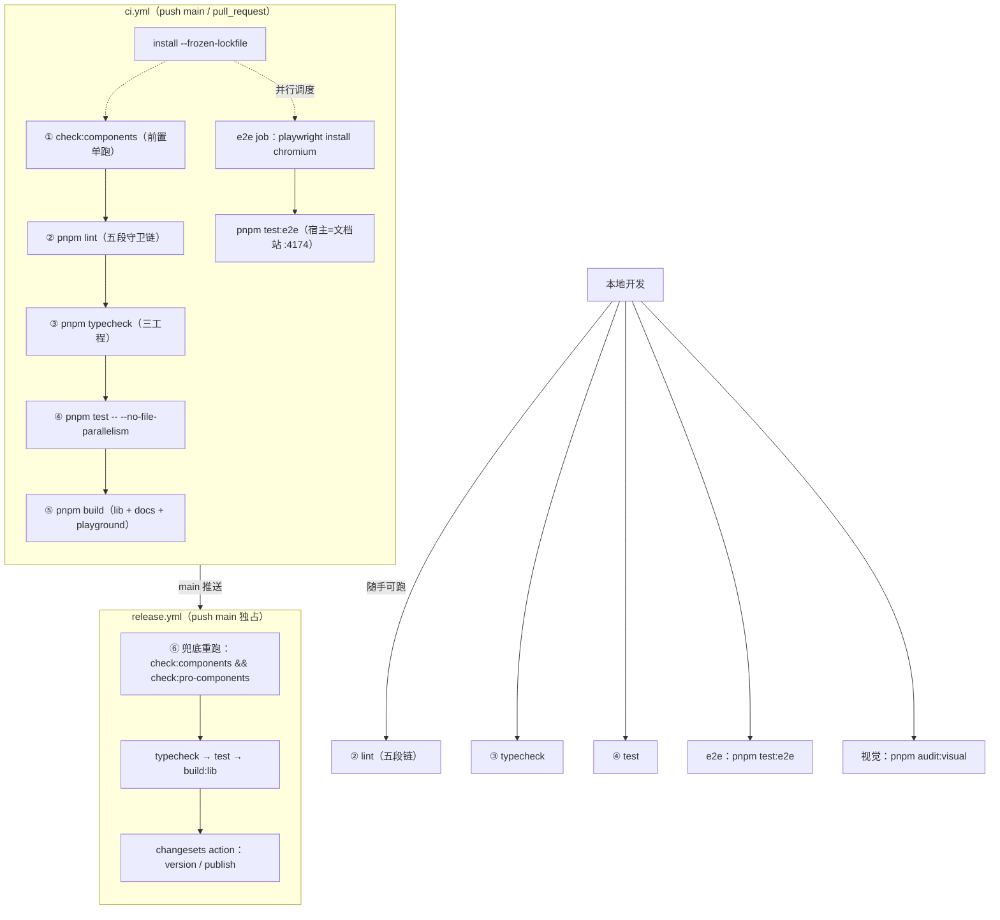
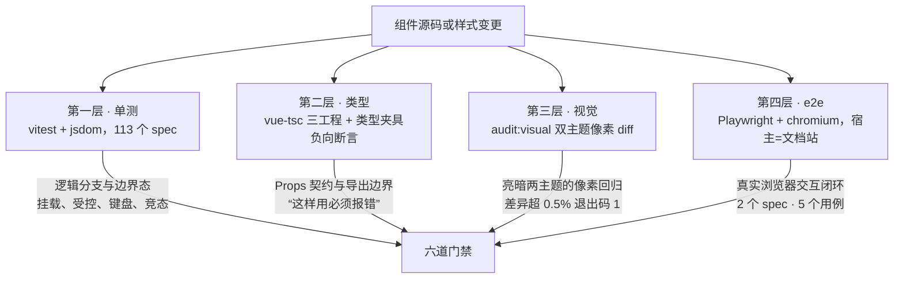

# 10-04 · e2e 与六道发布门禁全景

> 第十卷前三篇把测试体系的三层分别拆开：10-01 的单测（vitest + jsdom）、10-02 的类型（vue-tsc 三工程与类型夹具）、10-03 的视觉（双主题像素巡检）。还剩最后一块拼图——e2e。这一篇把它补上，并顺手回答两个更大的问题：其一，这套仓库的六道发布门禁（check → lint → typecheck → test → build → release）在全景上如何咬合；其二，也是本篇的核心问题——**以文档站为宿主的 e2e，究竟是聪明还是妥协？**
>
> 先给结论：是聪明的妥协，而且是算过账的聪明。聪明在于"示例即用例"——e2e 的宿主、页面、数据全部复用文档站现成资产，边际成本接近零；妥协在于它天然只覆盖"示例层"，边界态要靠下面三层托底。真正值钱的是那笔账：**用 2 个 spec 文件、5 个用例的极小预算，换来一条每条 PR 都有真实浏览器把文档站跑一遍的门禁**。下面先收全景，再钻进 e2e 的局部，最后把四层测试合到一张图上。

## 一、六道门禁全景：从 check 到 release 的一条流水线

把仓库的发布质量体系拉成一条流水线，一共六道门禁：

1. **check**——组件清单一致性守卫（`pnpm check:components`）；
2. **lint**——五段守卫链（`check:tokens && check:llms && check:components && check:pro-components && eslint`）；
3. **typecheck**——三工程类型检查（`packages` / `apps` / `types` 夹具）；
4. **test**——vitest 单测（CI 上带 `--no-file-parallelism`）；
5. **build**——三个库包 + 文档站 + playground 的全量构建；
6. **release**——release.yml 的发布前兜底重跑加 changesets 发布。

这六道不是散落的命令，它们全挂在根 `package.json` 的 scripts 段上——这段就是六道门禁的命令面板。全文如下（行号以当前工作区实态为准，2-05 曾从 lint 链生长的角度引过同一片段，本篇换全景视角重新读它）：

```jsonc
// package.json（L7-38：scripts 全景段）
  "scripts": {
    "dev": "pnpm dev:docs",
    "dev:docs": "pnpm --filter @xiaoye/docs docs:dev",
    "dev:playground": "pnpm --filter @xiaoye/playground dev",
    "check:components": "node scripts/check-components.mjs",
    "check:tokens": "node scripts/check-generated.mjs --name tokens --generate \"node scripts/generate-tokens.mjs\" --path packages/tokens/src",
    "check:llms": "node scripts/check-generated.mjs --name llms --generate \"node scripts/generate-llm-files.mjs\" --path llms-full.txt --ignore \"^> 自动生成于\"",
    "generate:tokens": "node scripts/generate-tokens.mjs",
    "check:pro-components": "node scripts/check-pro-components.mjs",
    "lint": "pnpm check:tokens && pnpm check:llms && pnpm check:components && pnpm check:pro-components && eslint .",
    "typecheck": "pnpm run typecheck:packages && pnpm run typecheck:types",
    "typecheck:packages": "vue-tsc -p tsconfig/packages.json --noEmit && vue-tsc -p tsconfig/apps.json --noEmit",
    "typecheck:types": "vue-tsc -p tests/types/tsconfig.json --noEmit",
    "test": "vitest run",
    "test:watch": "vitest",
    "test:e2e:admin": "playwright test tests/e2e/admin-flow.spec.ts",
    "build": "pnpm run build:lib && pnpm run build:docs && pnpm run build:playground",
    "build:lib": "pnpm run build:primitives && pnpm run build:lib:base && pnpm run build:lib:pro",
    "build:primitives": "vite build -c vite.primitives.config.ts",
    "build:lib:base": "vite build -c vite.config.ts && node scripts/prepare-package.mjs base",
    "build:lib:pro": "vite build -c vite.pro.config.ts && node scripts/prepare-package.mjs pro",
    "build:docs": "pnpm --filter @xiaoye/docs docs:build",
    "build:playground": "pnpm --filter @xiaoye/playground build",
    "preview:docs": "pnpm --filter @xiaoye/docs docs:preview",
    "changeset": "changeset",
    "version-packages": "changeset version",
    "release": "changeset publish",
    "clean": "rimraf packages/xiaoye-primitives/dist packages/xiaoye-components/dist packages/xiaoye-pro-components/dist apps/docs/.vitepress/dist apps/playground/dist",
    "generate:llm": "node scripts/generate-llm-files.mjs",
    "test:e2e": "playwright test",
    "audit:visual": "node scripts/visual-audit.mjs"
  },
```

六个门禁命令在这段里都能找到本体：`check:components`（L11）、`lint`（L16）、`typecheck`（L17）、`test`（L20）、`build`（L23）、`release`（L33）。值得注意的是这张命令面板还藏着两个"编外人员"：`test:e2e`（L36）和 `audit:visual`（L37）——它们分别是 e2e 门禁和视觉巡检的入口，本篇第二节和 10-03 已经各占一段。

六道门禁与 CI 的挂载关系，2-04、2-05 都拆过局部（前者引过 release.yml 全文，后者引过 ci.yml 全文），这里给一张全景收口图——**重点看六道门禁在三条触发路径上的分布，以及第⑥道的"兜底重跑"**：



这张图上有三个值得停一停的位置。

**第一，①和②里 check:components 跑了两遍。** ci.yml 把它单独提到 `pnpm lint` 前面（`.github/workflows/ci.yml` L21），而 lint 五段链的第三段又是它。这不是笔误，是历史地层：check:components 先于 lint 链成型，CI 把它提出来当第一步，图的是"最便宜、最确定性的守卫单独前置"——它是纯 fs 加正则的毫秒级脚本，失败了日志第一行就告诉你是清单漂移，不用等五段链跑完。lint 链里再含一遍，保证本地一条 `pnpm lint` 就是全量。重复成本毫秒级，换来的日志优先级很划算。

**第二，②③④⑤严格串行、一个失败整链停。** 这是 2-05 讲过的编排选择：门禁要的不是并行速度，而是"第一个失败原因"清晰可见。便宜的、确定性的靠前（毫秒级的清单守卫、秒级的 eslint），贵的、依赖重的靠后（要起 jsdom 的单测、要跑三个 vite 构建的 build），失败越早暴露，浪费的 runner 分钟越少。**门禁顺序本身就是一张成本排序表**。串行链之外唯一的并行分支是 e2e job（2-05 引过 check job 段，这里把 e2e job 全段贴在场内，因为它与 `playwright.config.ts` 的握手关系是本篇主角）：

```yaml
# .github/workflows/ci.yml（L28-41：e2e job 全段）

  e2e:
    runs-on: ubuntu-latest
    steps:
      - uses: actions/checkout@v4
      - uses: pnpm/action-setup@v4
        with:
          version: 10.30.3
      - uses: actions/setup-node@v4
        with:
          node-version: 22
          cache: pnpm
      - run: pnpm install --frozen-lockfile
      - run: pnpm exec playwright install --with-deps chromium
      - run: pnpm test:e2e
```

它和 check job 的分工在 L40-41：装一个带系统依赖的 chromium，然后跑 `pnpm test:e2e`——五道串行门禁之外的第六类检查，以独立 job 的形态与 check 并行。

**第三，第⑥道是"重跑"而不是"新检查"。** release.yml 在发布前把 check、typecheck、test、build:lib 又跑了一遍（`.github/workflows/release.yml` L33-39），2-04 引过这段的注释原话："发布前门禁兜底：常规质量由 ci.yml 在 main 推送时保障，此处兜底防跳过 CI 的直推"。但注意兜底只挑了两道 check 守卫——`check:components && check:pro-components`（L35），没挑 check:tokens 和 check:llms。这个取舍很精确：兜底段的目的是"别让坏包发出去"，所以它按**发布风险**重选科目——导出边界和根入口白名单直接决定 npm 包的对外形态，挂；生成物同步（令牌常量层、llms 文档）影响的是仓库文档正确性，不直接影响包产物，不挂。**兜底不是复刻 CI，是按风险重排的子集**。这也是本篇要收的第一个设计权衡之外再送的半句：六道门禁里每道"跑什么、跑几遍、在哪跑"，都是被成本和风险筛过的。

## 二、e2e 的宿主：把文档站当测试台

### 2.1 宿主选型：三个候选与一个清醒的选择

给 e2e 找宿主，候选至少有三个：

**候选 A：独立的 e2e 应用。** 新建一个 `apps/e2e-app`，专门写"为测试而生"的页面，每个组件铺一个 playground 路由。好处是断言场景完全自由，边界态想铺多少铺多少；代价是一整份要长期维护的代码库——每个新组件都要在它里面再"复刻"一遍用法页面，而这份复刻没有文档价值，纯粹是测试的燃料。对一个人维护的 AI 协作仓库，这是养一个"只进不出"的目录，否决。

**候选 B：playground。** `apps/playground` 本来就是源码级联调的宿主（2-08 的主角），页面现成。但它的定位是"开发者的实验台"，页面组织以调试便利为先，路由和内容随开发节奏漂移——今天加个调试开关，明天下个 e2e 用例就红了。**拿高频变动的东西当低频门禁的锚，方向就反了**。否决。

**候选 C（采纳）：文档站。** `apps/docs` 的 80 余个示例页（`apps/docs/examples/` 下按组件组织的目录）就是一座现成的"用例仓库"：每个示例都是一段可运行的真实代码，挂在稳定的 `/components/<name>` 路由下，由 demo 三件套机制（2-07）渲染。e2e 直接把文档站当宿主，用例写的就是"打开菜单文档页、点这个示例的按钮、断言浮层出现"。

选 C 的账是这么算的：示例本身**必须**随组件 API 演进同步维护（不然文档就错了，还有 check:components 的姊妹机制盯着一两层），所以"为 e2e 维护页面"的边际成本接近零；反过来，示例一旦腐烂，e2e 会红——**文档的保鲜被测试顺手接管了**。这是"聪明"的部分。妥协的部分 2.5 节末尾算，先看它是怎么落地的。

### 2.2 playwright.config.ts：26 行里的全部环境策略

e2e 的全部环境配置在仓库根的 `playwright.config.ts`，全文 26 行，逐段都值得读：

```typescript
// playwright.config.ts（全文，L1-26）
import { defineConfig, devices } from "@playwright/test";

export default defineConfig({
  testDir: "./tests/e2e",
  timeout: 60_000,
  fullyParallel: false,
  retries: process.env.CI ? 1 : 0,
  use: {
    baseURL: "http://127.0.0.1:4174",
    trace: "on-first-retry"
  },
  projects: [
    {
      name: "chromium",
      use: {
        ...devices["Desktop Chrome"]
      }
    }
  ],
  webServer: {
    command: "pnpm --filter @xiaoye/docs exec vitepress dev . --host 127.0.0.1 --port 4174",
    url: "http://127.0.0.1:4174/examples/admin",
    reuseExistingServer: !process.env.CI,
    timeout: 120_000
  }
});
```

六组配置，六层意思：

- **L4-5**：`testDir` 指向 `tests/e2e`，用例超时 60 秒。对"打开文档页、滚到示例、点击、断言"这种粒度的用例，60 秒是宽裕但不放纵的上限。
- **L6**：`fullyParallel: false`——用例串行。这里和 vitest 的 OOM 治理（2-05）不同：e2e 串行不是内存问题，是**状态问题**。全局浮层栈、焦点治理这些组件行为有全局副作用（4-05/4-07 的主角），并行 worker 各开各的浏览器实例虽然隔离，但同一个 worker 里多个 test 共享页面状态的时序坑不值得趟，5 个用例的体量也吃不到并行的红利。
- **L7**：`retries: process.env.CI ? 1 : 0`——CI 上失败重试一次，本地不重试。这半行是 2026-09-14 的提交 `0956f1e` 补上的，提交信息里写着动机："playwright CI 下 retries 提升为 1 缓解 dev 按需编译抖动"。**宿主选文档站 dev server 的代价在这里现形**：vitepress dev 是按需编译的，runner 冷启动后第一次访问某页面要现编译，偶发的慢会顶到超时；本地不重试，因为本地磁盘缓存热，重试只会掩盖真问题。
- **L10**：`trace: "on-first-retry"`——只在重试时留 trace。和 retries 是一对：重试是为了消化环境抖动，trace 是为了抖动第二次还红时能看清现场。不重试的本地不产 trace，省磁盘也不省心。
- **L12-19**：只跑 chromium 单项目。没有 Firefox/WebKit 矩阵——又一个体量匹配的取舍：单浏览器把"环境方差"压到最小，跨浏览器兼容交给 jsdom 单测层和真实用户的 issue。
- **L20-25**：webServer 三件套，下一小节单讲。

### 2.3 端口治理：4174 与 4173 的一墙之隔

webServer 段是"以文档站为宿主"这件事的物理落地：e2e 启动前，Playwright 自己先执行 `pnpm --filter @xiaoye/docs exec vitepress dev . --host 127.0.0.1 --port 4174` 起一个文档站，然后轮询探活 URL `http://127.0.0.1:4174/examples/admin`，就绪后才开跑用例。

`--port 4174` 这个数字不是随手挑的。vite 的默认端口家谱里有两个常客：dev server 默认 5173（`node_modules/vite/dist/node/chunks/logger.js` L216 的 `DEFAULT_DEV_PORT = 5173`），preview server 默认 4173（同文件 L217 的 `DEFAULT_PREVIEW_PORT = 4173`）。本仓库的端口约定是：`pnpm dev:docs`（dev server）占 5173，`pnpm preview:docs`（`build:docs` 产物预览，L30）落在 vite preview 的默认 4173。**e2e 的 dev server 若不固定端口，就会轮流撞这两个**：撞 5173 是撞一个开发者几乎永远开着的进程，撞 4173 是撞"刚构建完在预览"的场景——`build:docs` 后跑 `preview:docs` 验产物、再顺手跑 e2e，是发布前很自然的动作序列，两个端口如果重叠，探活会打到别人的服务上。

固定 4174 是躲开两位邻居，但"4174 自己被占"仍然是真实风险，这正是端口治理的第二课。设想本地上一次 e2e 没退干净、4174 上残留着一个旧的文档站 dev server：此时 `reuseExistingServer: !process.env.CI`（L23）在本地是 true，Playwright 探活发现 URL 有响应，**直接复用这个旧站开跑**——测试可能全绿，但测的不是你工作区里的代码，而是上一次的陈旧宿主。这是"4174 被占"的真正教训所在：**reuseExistingServer 换来的启动加速，代价是本地可能出现"复用了陈旧宿主"的幽灵绿**。CI 上 `!process.env.CI` 翻转为 false，Playwright 必须自己起站，端口被占会以 EADDRINUSE 或 120 秒探活超时（L24）明确失败——探活 URL 还特意选了 `/examples/admin` 这个 e2e 主用例的真实路径，就算 4174 被一个不相干的服务占着，该路径大概率 404，而 Playwright 的探活只认 2xx/3xx/401/402/403 响应，起错站会以超时暴露而不是静默通过。**同一个配置项，本地买速度、CI 买确定性，用 `!process.env.CI` 一行完成分流**——这个写法和 2-05 里"环境策略放调用点"是同一个思想在 e2e 侧的回声。

### 2.4 两条 spec 的解剖：业务闭环与文档页交互

`tests/e2e/` 下只有两个 spec 文件加一个 helpers，共 5 个用例。先看 `admin-flow.spec.ts`——它测的是文档站 `examples/admin.md` 挂的那个管理后台闭环示例，一整个用例走完"切视图 → 搜索 → 看详情 → 编辑 → 批量操作 → 回查审计"六步：

```typescript
// tests/e2e/admin-flow.spec.ts（全文，L1-42）
import { expect, test } from "@playwright/test";
import { clickInViewCenter } from "./helpers";

test("管理后台闭环示例覆盖筛选、详情、编辑、批量和历史记录", async ({ page }) => {
  await page.goto("/examples/admin");

  await expect(page.getByText("增强层闭环已接通")).toBeVisible();

  await clickInViewCenter(page.getByRole("tab", { name: /账单链路/ }));
  await expect(page.getByText("当前视图：账单链路")).toBeVisible();
  await page.getByPlaceholder("按任务名称、负责人搜索").fill("供应商");
  await clickInViewCenter(page.getByRole("button", { name: "查询" }));

  await expect(page.getByText("供应商账单核对")).toBeVisible();

  // 操作列固定在右侧，可点击的按钮是固定列镜像层里的那份
  const viewButton = page
    .locator(".xy-table__fixed-panel--body.is-right")
    .getByRole("button", { name: "查看" })
    .first();
  await clickInViewCenter(viewButton);
  await expect(page.getByText("事项概览")).toBeVisible();
  await expect(page.getByText("操作记录")).toBeVisible();

  await page.getByRole("button", { name: "编辑当前项" }).click({ force: true });
  await page.getByPlaceholder("请输入事项名称").fill("供应商账单核对-已更新");
  await clickInViewCenter(page.getByRole("button", { name: "保存" }));

  await expect(page.locator(".xy-table").getByText("供应商账单核对-已更新").first()).toBeVisible();

  await page
    .getByRole("checkbox", { name: "选择当前行" })
    .first()
    .evaluate((element) => {
      (element as HTMLInputElement).click();
    });
  await expect(page.getByText("批量完成")).toBeVisible();
  await clickInViewCenter(page.getByRole("button", { name: "批量完成" }));

  await clickInViewCenter(viewButton);
  await expect(page.getByText("批量完成")).toBeVisible();
});
```

这个用例锚定的宿主页面是 `apps/docs/examples/admin.md`——一个把 SearchForm、ProTable、OverlayForm、DetailPanel、AuditTimeline 串在一条真实链路里的组合示例，页面头部只负责引入 demo 组件：

```markdown
<!-- apps/docs/examples/admin.md（L1-13：头部与脚本引入） -->
---
title: 管理后台闭环示例
description: 用一个页面片段串起 SearchForm、ProTable、OverlayForm、DetailPanel 和 AuditTimeline。
outline: deep
---

<script setup lang="ts">
import AdminFlowDemo from "../.vitepress/theme/components/AdminFlowDemo.vue";
</script>

# 管理后台闭环示例

这页用一个单页后台片段，把筛选、列表、覆盖层编辑、详情查看和历史记录放回同一条真实链路里。
```

用例里的断言文本全部在 `AdminFlowDemo.vue`（1131 行）里能找到实锚：L779 的 `<xy-tag status="primary">增强层闭环已接通</xy-tag>`、L294-298 的 tabItems 定义：

```typescript
// apps/docs/.vitepress/theme/components/AdminFlowDemo.vue（L294-298）
const tabItems = [
  { key: "members", label: "成员台账" },
  { key: "billing", label: "账单链路" },
  { key: "risk", label: "风控排查" }
] as const;
```

**e2e 断言的每个字符串，都是文档站真实渲染的内容**——这就是"示例即用例"的字面意思：没有为测试另造数据，测试读的页面就是读者看的页面。

再看 `docs-demos.spec.ts`，它的 4 个用例分别打在 Menu、Table、Watermark、Dialog 四个组件文档页上，选的都是**单测测不了或测不像**的场景：浮层在真实布局里的遮挡与溢出、真实滚动容器的 scroll 事件、`position: fixed` 的计算样式、遮罩的真实 hit-testing。定位示例的公共逻辑只有 5 行：

```typescript
// tests/e2e/docs-demos.spec.ts（L4-8：demoByHeading）
function demoByHeading(heading: Locator) {
  return heading.locator(
    'xpath=following-sibling::*[contains(@class,"vp-demo-block")][1]/following-sibling::*[contains(@class,"vp-demo")][1]'
  );
}
```

这行 xpath 是全文件最"耦合"的一处：它从文档页的标题出发，先找下一个兄弟节点里的 `.vp-demo-block`（示例描述容器），再找它的下一个兄弟 `.vp-demo`（示例本体）。这两个类名来自文档站的 Demo 组件：

```vue
<!-- apps/docs/.vitepress/theme/components/Demo.vue（L106-115：模板锚点） -->
<template>
  <div class="vp-demo-block" v-html="decodedDescription" />

  <div class="vp-demo" :class="{ 'vp-demo--table': isTableDemo }">
    <div class="vp-demo__showcase">
      <div v-if="needsSandbox" class="xy-doc-sandbox">
        <slot name="source" />
      </div>
      <slot v-else name="source" />
    </div>
```

也就是说 e2e 与文档站的契约只有一条：**demo 三件套的 DOM 结构别变**。标题加两个类名，5 行 xpath 就能在 72 个组件文档页上定位任意一个示例——这是宿主复用的另一面：契约小，但只要一变就全线红。

四个用例里最先写的是 Menu 的横向溢出场景，它选中的示例是 `apps/docs/examples/menu/overflow-offset.vue`，一个用 `ellipsis` 属性演示"菜单项超宽自动收进更多下拉"的示例。用例全文：

```typescript
// tests/e2e/docs-demos.spec.ts（L10-25：Menu 用例）
test("Menu 文档页的横向溢出示例可以打开更多菜单", async ({ page }) => {
  await page.goto("/components/menu");

  const heading = page.getByRole("heading", { name: "横向溢出与 Popper Offset" });
  await expect(heading).toBeVisible();

  const demo = demoByHeading(heading);
  const moreButton = demo.getByRole("button", { name: "更多菜单" });

  await expect(moreButton).toBeVisible();
  await clickInViewCenter(moreButton);

  const popup = page.locator(".demo-menu-overflow__popup").last();
  await expect(popup).toBeVisible();
  await expect(popup.getByRole("menuitem", { name: "系统设置" }).first()).toBeVisible();
});
```

它断言的那个弹出层选择器 `.demo-menu-overflow__popup`，正是示例源码里 `xy-menu` 的 `popper-class`：

```vue
<!-- apps/docs/examples/menu/overflow-offset.vue（L26-43：ellipsis 菜单与弹层类名） -->
        <xy-menu
          mode="horizontal"
          ellipsis
          default-active="home"
          popper-class="demo-menu-overflow__popup"
          @select="handleSelect"
        >
          <xy-menu-item index="home">首页</xy-menu-item>
          <xy-sub-menu index="product">
            <template #title>产品中心</template>
            <xy-menu-item index="product-list">产品列表</xy-menu-item>
            <xy-menu-item index="product-add">添加产品</xy-menu-item>
          </xy-sub-menu>
          <xy-menu-item index="order">订单管理</xy-menu-item>
          <xy-menu-item index="finance">财务管理</xy-menu-item>
          <xy-menu-item index="marketing">营销活动</xy-menu-item>
          <xy-menu-item index="settings">系统设置</xy-menu-item>
        </xy-menu>
```

横向菜单溢出收进下拉，是"容器宽度 + 浮层定位 + DOM 折叠"三方在真实布局里协商的结果，jsdom 里没有宽度，这个场景在单测层根本没有立足点——而 e2e 只是打开文档页点了那个"更多菜单"按钮。

Menu 用例之外，最有代表性的是 Table 和 Dialog。前者验证固定列与汇总在真实滚动容器里的联动：

```typescript
// tests/e2e/docs-demos.spec.ts（L27-47：Table 用例）
test("Table 文档页的 auto fixed summary 组合示例可以稳定渲染并保留汇总", async ({ page }) => {
  await page.goto("/components/table");

  const heading = page.getByRole("heading", { name: "Auto、固定列与汇总组合" });
  await expect(heading).toBeVisible();

  const demo = demoByHeading(heading);
  await expect(demo.getByText("总览", { exact: true }).first()).toBeVisible();
  await expect(demo.getByText("482,000", { exact: true })).toBeVisible();
  await expect(demo.getByText("36,400", { exact: true })).toBeVisible();
  await expect(demo.getByText("242 万", { exact: true }).last()).toBeVisible();

  const bodyWrapper = demo.locator(".xy-table__body-wrapper").first();
  await bodyWrapper.evaluate((element) => {
    element.scrollLeft = element.scrollWidth;
    element.dispatchEvent(new Event("scroll"));
  });

  await expect(demo.getByText("会员增长季 Campaign A").first()).toBeVisible();
  await expect(demo.getByText("86 万", { exact: true }).last()).toBeVisible();
});
```

jsdom 单测里可以调用表格的滚动 API，但 jsdom 没有真实的布局引擎——`scrollLeft` 推着镜像层同步、固定列遮罩盖着横向内容这些"浏览器算出来的事"，只有真实 chromium 能验。Watermark 用例同理，断言直接下探到计算样式：

```typescript
// tests/e2e/docs-demos.spec.ts（L49-68：Watermark 用例）
test("Watermark 文档页的全屏与目标容器示例同时覆盖 target 和 fullscreen", async ({ page }) => {
  await page.goto("/components/watermark");

  const heading = page.getByRole("heading", { name: "全屏与目标容器" });
  await expect(heading).toBeVisible();

  const demo = demoByHeading(heading);
  const targetHost = demo.locator(".xy-doc-watermark-target-host");

  await expect(targetHost.locator(".xy-watermark__layer")).toBeVisible();

  await clickInViewCenter(demo.getByText("开启全屏水印"));

  await page.waitForFunction(() => {
    const layers = Array.from(document.body.querySelectorAll<HTMLElement>(".xy-watermark__layer"));
    return layers.some((layer) => getComputedStyle(layer).position === "fixed");
  });

  await expect(demo.getByText("已覆盖 body")).toBeVisible();
});
```

`getComputedStyle(layer).position === "fixed"`——canvas 水印层的定位形态，单测层验不了，e2e 一行验完。而且它打到的示例本身就值得一读：`apps/docs/examples/watermark/fullscreen-target.vue` 用一个页面同时演示 target 挂载与全屏两种形态，用例的三个断言选择器全部锚在示例源码里——target 宿主的类名、开关文案、状态标签：

```vue
<!-- apps/docs/examples/watermark/fullscreen-target.vue（L8-45：target 与全屏双形态） -->
  <div class="xy-doc-watermark-host-grid">
    <div class="xy-doc-watermark-host-grid__cell">
      <xy-watermark
        target=".xy-doc-watermark-target-host"
        content="TARGET HOST"
        :opacity="0.12"
        :repeat="'repeat-y'"
      >
        <section class="xy-doc-watermark-helper">
          <h4 class="xy-doc-watermark-helper__title">Target 模式</h4>
          <p class="xy-doc-watermark-helper__description">
            组件声明在左侧，但水印实际会挂到右侧目标容器。slot 只负责说明，不决定宿主。
          </p>
        </section>
      </xy-watermark>
    </div>

    <section class="xy-doc-watermark-target-host xy-doc-watermark-host-grid__cell">
      <span class="xy-doc-watermark-host-grid__badge">External Host</span>
      <h4 class="xy-doc-watermark-target-host__title">右侧是实际水印宿主</h4>
      <p class="xy-doc-watermark-target-host__description">
        适合对接外部面板、预览区或业务容器，而不必改动组件声明所在的位置。
      </p>
    </section>
  </div>

  <div class="xy-doc-watermark-fullscreen-demo">
    <xy-watermark
      :fullscreen="fullscreen"
      content="FULLSCREEN WATERMARK"
      :opacity="0.1"
      :repeat="'repeat'"
    >
      <section class="xy-doc-watermark-fullscreen-demo__surface">
        <xy-space wrap>
          <xy-switch v-model="fullscreen" active-text="关闭全屏水印" inactive-text="开启全屏水印" />
          <xy-tag status="primary">{{ fullscreen ? "已覆盖 body" : "仅示例区域" }}</xy-tag>
        </xy-space>
```

用例 L58 先断言 target 宿主里已有水印层（target 模式在工作），L60 点"开启全屏水印"，L62-65 等到全屏层以 `position: fixed` 出现，L67 的"已覆盖 body"正是 L44 那个三元标签翻面后的文案——**示例的 UI 状态机本身就是断言的坐标纸**。

Dialog 用例则是全文件里最"较真"的一段，它拒绝任何取巧：

```typescript
// tests/e2e/docs-demos.spec.ts（L70-93：Dialog 用例）
test("Dialog 文档页的基础用法示例点击遮罩可以关闭对话框", async ({ page }) => {
  await page.goto("/components/dialog");

  const heading = page.getByRole("heading", { name: "基础用法" });
  await expect(heading).toBeVisible();

  const demo = demoByHeading(heading);
  const trigger = demo.getByRole("button", { name: "新建成员" });
  await expect(trigger).toBeVisible();
  await clickInViewCenter(trigger);

  const dialog = page.locator(".xy-dialog").last();
  const panel = dialog.locator(".xy-dialog__panel");
  await expect(panel).toBeVisible();
  await expect(panel.getByRole("heading", { name: "新建成员" })).toBeVisible();

  // 遮罩 absolute inset:0 覆盖全视口，面板从 15vh 顶部居中展开，
  // (8, 8) 必落在遮罩上且在面板外；不加 force，验证真实 hit-testing。
  const overlay = dialog.locator(".xy-dialog__overlay");
  await expect(overlay).toBeVisible();
  await overlay.click({ position: { x: 8, y: 8 } });

  await expect(dialog).toBeHidden();
});
```

注意 L90 的 `overlay.click({ position: { x: 8, y: 8 } })` 没有加 `force`——注释把算术写明白了：视口左上角 (8, 8) 必落在遮罩上、面板外，Playwright 会做真实的 hit-testing，如果有什么元素意外挡在遮罩前面，这一下就点不下去。**helper 里大量使用 force 点击，唯独这里不 force**，因为遮罩关闭语义（7-16 的主角）的价值就在"点的是遮罩本身"，force 会把验证对象偷换成事件处理器。

说到 helper，`clickInViewCenter` 的 13 行值得整段读，注释就是两类遮挡的病历：

```typescript
// tests/e2e/helpers.ts（全文，L1-13）
import type { Locator } from "@playwright/test";

/**
 * 文档站 demo 区点击存在两类遮挡：吸顶导航（.VPNav）会拦截视口顶部元素；
 * 表格右侧固定列是 DOM 镜像，会拦截主区按钮的 hit-target。
 * 先把目标滚动到视口中央，再 force 点击（与镜像按钮语义等价）。
 */
export async function clickInViewCenter(locator: Locator) {
  await locator.evaluate((element) => {
    element.scrollIntoView({ block: "center", inline: "nearest" });
  });
  await locator.click({ force: true });
}
```

这两类遮挡都不是测试的 bug，而是文档站宿主的真实形态：吸顶导航（VitePress 的 `.VPNav`）和 Table 固定列的 DOM 镜像层（8-09 讲过的固定列实现，DOM 里有两份按钮，可点的是镜像层那份——admin-flow L16-20 的注释也在说这件事）。**以文档站为宿主，就要接受宿主的 DOM 形态作为测试的地面真相**，helper 的职责是把"怎么在宿主上可靠地点一下"收敛成一个函数，让 spec 文件只写业务动作。

### 2.5 聪明还是妥协：两本账对着算

现在可以正面回答核心问题了。**聪明的账**记了四笔：其一，示例即用例，页面与数据的维护成本被文档义务摊掉，e2e 增量成本只剩十几行断言；其二，文档站是最真实的宿主——真实路由、真实布局、真实浮层栈、真实吸顶导航，测出来的绿就是读者将看到的页面；其三，示例的保鲜被测试顺手接管，示例一烂 e2e 就红，文档的防腐多了一层机器闸门；其四，文档站自身也被测了——demo 容器、示例注册、页面渲染都在 e2e 的必经之路上，宿主不是免检的。

**妥协的账**也有三笔：其一，**示例层不覆盖边界态**——示例优先展示"正确而好看"的用法，受控边界的极端数据、键盘导航的长链路、连点竞态这些最需要 e2e 的场景，恰恰不会出现在示例里，它们被推给了单测层（113 个 spec：基础组件 76、增强层 34、primitives 3）；其二，测试与文档布局耦合，demoByHeading 的 xpath 绑定了 Demo.vue 的兄弟结构，文档站改一版示例排版，4 个用例可能一起红；其三，存在反向诱惑——"这个场景 e2e 好断言"可能反过来影响示例怎么写，让示例悄悄偏向"可测试"而不是"可学习"。

两本账对完，判断是：这套 e2e 的正确读法不是"聪明 vs 妥协"的二选一，而是**用妥协换预算的清醒交易**——它承认 e2e 层只做"真实浏览器里的交互闭环冒烟"这一件事，5 个用例压着规模，换 CI 上每条 PR 必跑的稳定性（retries=1、单浏览器、串行，都是给稳定性让路的配置）。对照一下 Element Plus：写作时点（2026-09-23）EP dev 分支的 `.github/workflows/` 目录里有 lint-typecheck、test-unit、test-ssr、pr-docs-build 等二十余个 workflow，**唯独没有任何 e2e 门禁 job**，仓库根目录连 `playwright.config.ts` 都不存在——EP 的门禁清单是 lint + typecheck（`lint-typecheck.yml`，单 job 串行跑两条命令）+ 单测（`test-unit.yml`）+ SSR（`test-ssr.yml`），真实浏览器的验证没有进入 PR 必过的位置。两种路线各有前提：EP 的体量和 PR 流量撑得起"e2e 非门禁"（人肉按需跑），而这个仓库反其道行之，正因为规模小，才养得起"少而稳、每 PR 必跑"的 e2e 门禁。**e2e 挂不挂门禁，不取决于技术先进性，取决于用例数与稳定性预算的比值**——这个仓库的答案是 5 个用例、2 个 spec、1 次 CI 重试，一笔小到不可能失控的账。

## 三、check 系守卫汇总：四守卫的分工表

六道门禁的第②道"lint 五段链"里住着四道 check 守卫，加上 2-09 引过执行引擎的 check:tokens/check:llms，值得在这里给一张全家福。四守卫共用电路上的一套协议——**可执行脚本、确定性退出码、给人看的失败诊断**——但分工各不相同。

先看资历最老的 check:components（4-01 的主角）。它读 `packages/components/component-manifest.json`，然后逐一对六个入口收集实态、做双向 diff：

```javascript
// scripts/check-components.mjs（L57-81：六个入口的实态收集）
const componentDirs = fs
  .readdirSync(path.join(repoRoot, "packages/components"), { withFileTypes: true })
  .filter((entry) => entry.isDirectory() && entry.name !== "node_modules")
  .map((entry) => entry.name)
  .filter((name) => !["dist", "shared", "src"].includes(name))
  .sort();

const exportedComponentNames = collectByRegex(
  readFile("packages/components/exports.ts"),
  /export \* from "\.\/([^"]+)";/g
).filter((name) => name !== "shared");

const docComponentNames = listBasenames("apps/docs/components", ".md").filter(
  (name) => name !== "overview"
);

const typeFixtureNames = listBasenames("tests/types/fixtures", ".ts").filter((name) =>
  componentNames.includes(name)
);
const unitTestNames = listComponentTestGroups();

const themeImportNames = collectByRegex(
  readFile("packages/theme/index.css"),
  /@import "\.\/src\/components\/([^.]+)\.css";/g
);
```

实态收集齐了，校验本体就是一张六行错位表：

```javascript
// scripts/check-components.mjs（L83-126：六组 mismatch 的双向 diff）
const mismatches = [
  {
    message: "组件目录与 manifest 不一致：",
    values: [
      ...diff(componentNames, componentDirs),
      ...diff(componentDirs, componentNames).map((name) => `${name} (多余目录)`)
    ]
  },
  {
    message: "导出入口与 manifest 不一致：",
    values: [
      ...diff(componentNames, exportedComponentNames),
      ...diff(exportedComponentNames, componentNames).map((name) => `${name} (多余导出)`)
    ]
  },
  {
    message: "组件文档与 manifest 不一致：",
    values: [
      ...diff(componentNames, docComponentNames),
      ...diff(docComponentNames, componentNames).map((name) => `${name} (多余文档)`)
    ]
  },
  {
    message: "类型夹具与 manifest 不一致：",
    values: [
      ...diff(componentNames, typeFixtureNames),
      ...diff(typeFixtureNames, componentNames).map((name) => `${name} (多余夹具)`)
    ]
  },
  {
    message: "组件单测与 manifest 不一致：",
    values: [
      ...diff(componentNames, unitTestNames),
      ...diff(unitTestNames, componentNames).map((name) => `${name} (多余单测目录)`)
    ]
  },
  {
    message: "样式入口与 manifest 不一致：",
    values: [
      ...diff(styleNames, themeImportNames),
      ...diff(themeImportNames, styleNames).map((name) => `${name} (多余样式导入)`)
    ]
  }
];
```

目录、导出、文档、夹具、单测、样式——六个方向全部以 manifest 为基准双向比对，任何一侧漂移都会被点名。check:pro-components（9-01 的主角）结构同源，但多一层独有的东西：根入口类型白名单。它的校验核心是逐组件比对"白名单声明的导出块"与 `index.ts` 实态：

```javascript
// scripts/check-pro-components.mjs（L114-139：白名单与实态的逐块比对）
function diffNamedExportMap(expected, actual) {
  const messages = [];
  const expectedKeys = Object.keys(expected).sort();
  const actualKeys = Object.keys(actual).sort();

  diff(expectedKeys, actualKeys).forEach((key) => {
    messages.push(`${key} (缺少导出块)`);
  });

  diff(actualKeys, expectedKeys).forEach((key) => {
    messages.push(`${key} (多余导出块)`);
  });

  expectedKeys.forEach((key) => {
    if (!actual[key]) {
      return;
    }

    const missing = diff(expected[key], actual[key]).map((name) => `${key} -> ${name} (缺少导出)`);
    const extra = diff(actual[key], expected[key]).map((name) => `${key} -> ${name} (多余导出)`);

    messages.push(...missing, ...extra);
  });

  return messages.sort();
}
```

白名单本体是脚本头部的 `rootTypeWhitelist` 对象（L8-75）：31 个增强组件各自允许从根入口抬出哪些 `Props / Instance / 主数据类型`，逐名登记。check:tokens 与 check:llms 则共用 `check-generated.mjs` 这台"快照 → 重生成 → 对比 → 还原"的引擎（2-05 拆过它的运行时序、2-09 引过它的自我说明，这里不再重复贴），校验的是"生成物与事实源是否同步"。

四守卫的分工表：

| 守卫 | 事实源 | 校验对象 | 失败处方 | 挂载点 |
| --- | --- | --- | --- | --- |
| check:components | `component-manifest.json` | 目录/导出/文档/夹具/单测/样式六向一致 | 以 manifest 为准补齐或回退 | lint 链第三段；ci.yml 前置；release 兜底 |
| check:pro-components | `pro-components/component-manifest.json` | 增强层导出与根入口类型白名单 | 改白名单或改导出，二选一并同步夹具 | lint 链第四段；release 兜底 |
| check:tokens | `packages/xiaoye-primitives/src/theme/tokens.css` | `packages/tokens` TS 常量层生成物 | 跑 `generate:tokens` 后随事实源一并提交 | lint 链第一段 |
| check:llms | 组件清单与文档元数据 | `llms-full.txt` 等生成物 | 跑 `generate:llm` 后提交（时间戳行豁免） | lint 链第二段 |

**守卫挂 lint 还是挂 CI？** 这是本篇的第三个设计权衡。这套体系的答案是：全部挂 lint 链，CI 只调 `pnpm lint` 一个入口（ci.yml L22）。lint 链因此成为仓库的"内部事务"——链上增删守卫、调整顺序，对 CI 编排完全透明，CI 只依赖一个承诺：`pnpm lint` 退出码为零，等价于全部机器可判定的仓库约定成立。反面方案是每个守卫在 ci.yml 里占一行：改起来直观，但每加一道守卫都要动 CI 文件，本地与 CI 的守卫集合还会各自漂移。唯一的例外在 release.yml 兜底段——`check:components && check:pro-components` 绕过 lint 链被点名直跑，因为兜底要按发布风险重选科目，而不是全量重跑。**挂载层级的判据由此成形：常规守卫进 lint 链吃"本地随手可跑"的红利；发布特需的子集，在发布流水线里显式点名**。

## 四、四层合体：一张图看测试体系的完整分工

e2e 补位之后，测试体系四层齐了。它们的分工不是按"重要性"排的，而是按**各自能看见什么**切的：



四层的覆盖矩阵，最后一列是它们互相替不了的部分：

| 层 | 宿主 | 规模 | 擅长 | 替不了的部分 |
| --- | --- | --- | --- | --- |
| 单测 | jsdom | 113 个 spec | 逻辑分支、边界态、事件语义 | 真实布局、真实滚动、hit-testing |
| 类型 | vue-tsc 三工程 | packages/apps + 夹具 | Props 契约、泛型推导、负向断言 | 运行时行为 |
| 视觉 | 无头浏览器截图 | 双主题全组件巡检 | 像素级样式回归 | 交互逻辑 |
| e2e | 文档站（chromium） | 2 spec · 5 用例 | 真实布局里的交互闭环、计算样式 | 边界态（示例层不覆盖） |

这张表的读法是纵向的：**一个变更从上往下穿过四层，每层拦住自己看得见的故障**。逻辑写错，单测红；类型契约破，typecheck 红；样式漂移，视觉巡检红；"组件在真实页面里不工作"，e2e 红。反过来，越往下层越接近用户真实所见，但也越贵、越脆、越难定位——所以四层的规模梯度（113 → 全量类型 → 全量视觉 → 5 用例）就是成本曲线本身。

把镜头放回六道门禁的全景，最后拼一次图：门禁第④道的 `pnpm test` 背后是单测层，第③道 typecheck 背后是类型层，第⑤道 build 保证产物能成形，第②道 lint 链的四守卫保证数据不漂移，e2e 在 ci.yml 的并行 job 里独立成岗，视觉巡检则留在了门禁之外（`audit:visual` 不在 ci.yml 里，它是有基线后本地或按需跑的巡检，10-03 讲过它的阈值策略）。**六道门禁加两个编外巡检，没有一道是装饰**——每一道的退出码都对应一类"机器可判定"的故障，而机器判定不了的（文档措辞、示例的教学质量），诚实地留给了 review。

这套体系的根本约束其实只有一条：这是一个 AI 深度参与研发的仓库，人和模型都要能"跑一条命令就知道仓库是否健康"。六道门禁是把这句话工程化的形态：check → lint → typecheck → test → build → release，从毫秒级到分钟级、从数据一致性到产物成形，逐道加码，每道都有明确的失败处方。e2e 是这条流水线上最年轻的一道，它的选型——文档站宿主、5 个用例、单浏览器——处处透着"预算内做事"的克制，而这种克制本身，就是这篇专栏想留下的方法论样本。

## 结语与下一篇

第十卷至此收卷：单测、类型、视觉、e2e 四层，加上贯穿全卷的六道门禁，构成这套组件库的完整质量面。回头看会发现，质量体系的设计哲学和组件体系是同一条——**边界清晰、成本分层、机器可判定的交给脚本，判定不了的诚实留给 review**。

下一篇进入第十一卷，是整个专栏的收官：《11-01 · AI 协作研发组件库方法论复盘》。它将跳出具体的技术细节，回到最初的问题：当 AI 成为一等研发协作者，组件库的开发流程、门禁设计、文档体系需要怎样重构？十卷一百余篇踩过的坑，会被收敛成一套可复用的方法论——下篇见。
