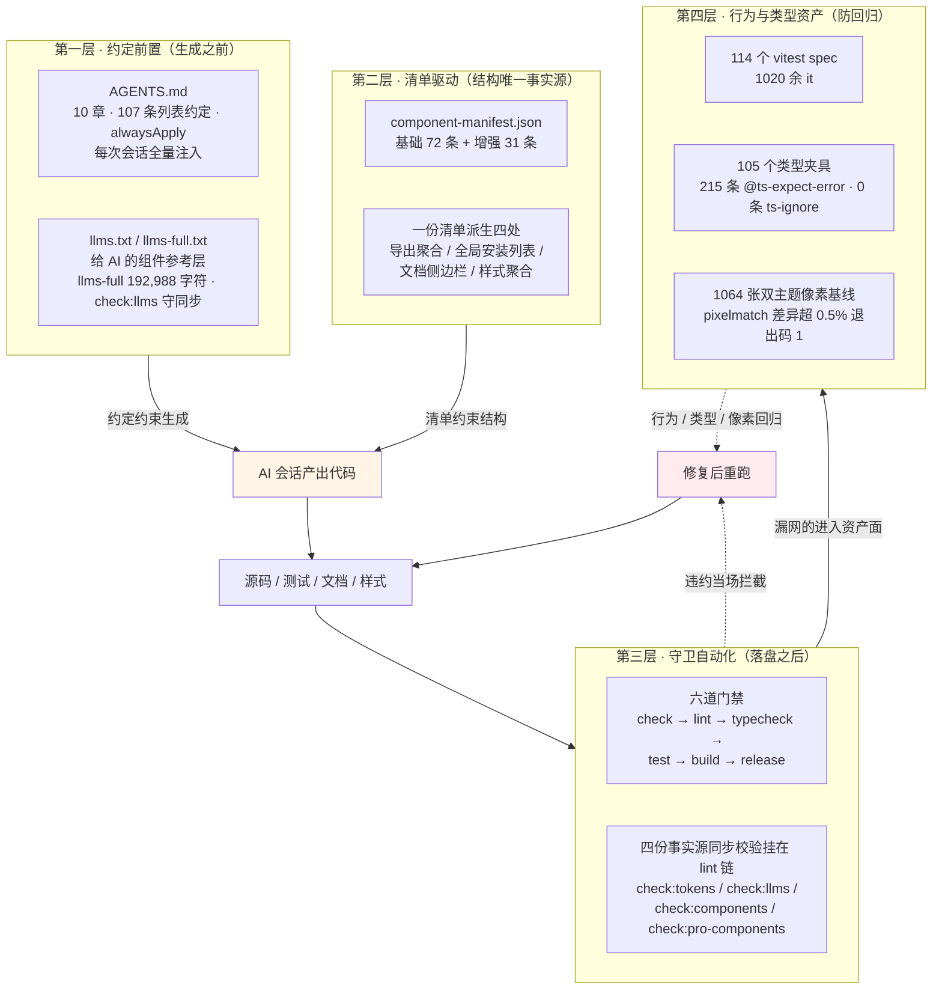
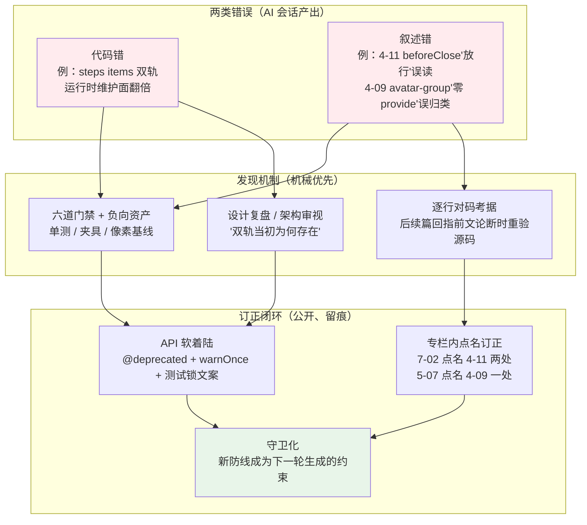

# 11-01 · AI 协作研发组件库方法论复盘

> 本篇是《AI 协作研发组件库》系列第十一卷的开篇，也是全系列的收官复盘。按 `column/02-分卷大纲.md` 的规划，全系列十一卷 144 篇；截至本篇落笔，`column/` 目录共有 141 个文件——第一卷至第九卷已全部落地的 137 篇正文，加上本篇（全系列第 138 篇），再加 3 份索引（`00-仓库架构地图.md`、`01-知识点全集矩阵.md`、`02-分卷大纲.md`）；第十卷 4 篇与本卷其余 2 篇仍在兑现规划的路上。文中所有数据与路径均以 2026-09-23 的仓库实态为准，写作前逐条复核；路径相对仓库根目录。全系列的核心问题在本篇被压缩成一句话：**全 AI 编写，为什么没有失控？**

## 一、先立证据：把"全 AI 编写"从口号变成账本

复盘之前，先把"全 AI 编写"这个说法本身审一遍——因为它最容易滑向营销腔。

第一个要澄清的是 git 历史的口径。跑一遍真实的统计：

```console
$ git log --oneline | wc -l
      78

$ git log --format='%an' | sort | uniq -c | sort -rn
  77 zhangzhengyang
   1 github-actions[bot]

$ git log --format='%ad' --date=format:'%Y-%m' | sort | uniq -c
  18 2026-03
  14 2026-04
  20 2026-05
  26 2026-09

$ git log --reverse --format='%ad %s' --date=short | head -1
2026-03-21 feat: 初始化组件库基础设施与MVP交互组件

$ git log --format='%an|%s' | grep -i 'bot\|changeset'
github-actions[bot]|Merge pull request #1 from zhangzhengyang27/changeset-release/main
zhangzhengyang|chore: version packages
```

78 个提交、单一人类作者账号、唯一的机器人提交是 changesets action 开"Version Packages" PR 时留下的 merge 记录——bot 占比 1.3%。**如果拿"bot 提交占比"去论证"AI 写了多少"，答案是几乎为零**。这个仓库的分工从来不是"机器人提交、人类旁观"：代码在 AI 会话里生成，人类审阅、取舍、拍板后以自己的账号提交。所以"全 AI 编写"的准确含义是：**全部代码由 AI 会话产出，人类不手写实现，但拥有每一次落盘的否决权**。

第二笔账是产出的规模。这些数字在前面各卷反复出现过，本篇作为收官，逐条按当前工作区实态再核一遍：

```console
$ # 组件清单规模（两份 manifest 的 JSON 条目数）
$ node -e "console.log(require('./packages/components/component-manifest.json').length)"
72
$ node -e "console.log(require('./packages/pro-components/component-manifest.json').length)"
31

$ # 质量资产规模
$ find packages apps/docs -name '*.spec.ts' -not -path '*/node_modules/*' -not -path '*/dist/*' | wc -l
114
$ ls tests/types/fixtures/ | wc -l
105
$ grep -rh '@ts-expect-error' tests/types/fixtures/ | wc -l
215
$ grep -rh '@ts-ignore' tests/types/fixtures/ | wc -l
0

$ # 源码规模（ts/vue，不含 spec、d.ts、dist）
$ find packages/components \( -name '*.ts' -o -name '*.vue' \) -not -path '*/dist/*' \
    -not -name '*.spec.ts' -not -name '*.d.ts' | xargs wc -l | tail -1
51423 total
$ find packages/theme -name '*.css' | xargs wc -l | tail -1
18374 total
```

汇总成一张表：

| 资产 | 规模（实态核验） | 出处 |
|---|---|---|
| 基础组件 | 72 个（manifest 条目） | `packages/components/component-manifest.json` |
| 增强组件 | 31 个（manifest 条目） | `packages/pro-components/component-manifest.json` |
| 单测 | 114 个 vitest spec（76 基础 + 34 增强 + 3 primitives + 1 文档站画廊），1020 余个 `it` | 各包 `__tests__/` |
| 类型夹具 | 105 个、215 条 `@ts-expect-error`、0 条 `ts-ignore` | `tests/types/fixtures/` |
| 视觉基线 | 1064 张双主题元素级截图 | `docs/archive/审计报告-2026-05-23.md`（基线本体是被 `.gitignore` 忽略的本地产物 `output/`，当前工作区未保存） |
| 源码 | 基础组件包 51,423 行、增强层 7,592 行、primitives 1,631 行、theme 18,374 行 CSS | `packages/` |
| 专栏自身 | 137 篇正文、约 10 万行 markdown | `column/` |

这批数字的出处纪律要交代一句：1-01 开篇时就立过规矩——"系列内所有数据与路径以仓库实态为准，逐篇核对，不引用记忆中的大概是"（1-01:156）。本篇是收官，恰恰是这条纪律被检验得最严的一次：上面每个数字都来自此刻的命令输出，而不是前文的转述。顺便披露三处核对中发现的旧叙述偏差，作为诚实的 footnote：第九卷收官篇 9-35:526 曾说"44 个增强组件"，那是分卷大纲制定期的规划口径，当前 manifest 实态是 31 个；`02-分卷大纲.md:195` 的 10-01 标题写作"111 个 spec"，实态已涨到 114；`00-仓库架构地图.md:90` 记 tokens.css 为 410 行，当前实态 409 行。差异都不大，但收官复盘的价值恰恰在把"曾经的说法"与"此刻的实态"分开。

现在回到主问题。78 个提交要承载 72 + 31 个组件从零到一的完整交付——源码、单测、类型、文档、示例、样式六件套——平均下来每个提交交付超过一个组件的全套资产。人类协作的仓库里，这个节奏 unheard of；AI 协作的仓库里，它成立的前提只有一个：**失控被结构性地兜住了**。下面拆解"失控"到底指什么、四层防线如何组合、以及它在真实战役里被击穿过几次。

## 二、"失控"不是一个词，是三种故障模式

1-01 第 17 行起把"失控"拆成三种具体的工程故障模式，这个拆解是全系列方法论的坐标系，本篇直接沿用并做收官注解。

**架构漂移**：每次生成都是局部视角，放任下去，十几个需要浮层的组件会长出十几套大同小异的定位实现。第二卷到第四卷给出的是系统性解法——浮层七件套共享 `packages/xiaoye-primitives/src/composables` 的同一组基础设施（三态状态机、全局浮层栈、焦点陷阱），依赖方向严格单向 `pro-components → components → primitives`，且底层依赖 peer 化：想让 primitives 反向 import 一个具体组件，TypeScript 编译期直接报错（1-02、4-05/4-06 展开）。第一卷的结论值得原文重提："**边界写在 README 里会被遗忘，写进依赖图里就是铁律**"。

**API 膨胀**：生成模型的讨好型人格——你要什么它加什么 prop，累积成没人敢动 major 的泥球。第九卷的答案是 2.0.0 独立大版本收口：根入口只导出正式公开组件值与主 `Props / Instance` 类型，插槽入参、事件载荷、内部状态枚举全部降级到组件子入口，且由 9-01 讲过的双重守卫锁死。

**质量塌陷**：AI 生成的代码"看起来都对"——类型齐全、命名规范，但边界语义是错的。第四节的三个真实案例全部属于这一类，它是三种模式里最隐蔽、也最考验防线纵深的一种。

三种模式对应三种解法，拼起来就是本篇的机制论核心——四层防线。先上全景图：



读这张图的顺序是纵贯的：第一、二层发生在**生成之前**，决定 AI 写出什么；第三、四层发生在**落盘之后**，决定不合格的产出能不能存活。四层不是并列的四种技术，而是一条流水线上游到下游的四级水位——越靠上游，问题被消灭的成本越低；越靠下游，兜底越机械、越不需要判断力。下面逐层展开，重点是每层的角色定位与它"兜不住什么"。

## 三、四层防线逐层拆解：每一层解决上一层剩下的什么问题

### 3.1 第一层：约定前置——AGENTS.md 的角色是"编译进会话的规范"

第一卷说过这个仓库的元约定："**任何一条规则如果不配一个机械校验，就默认它会被违反**"（1-01:41）。但这句话的前半程——规则从哪来、怎么进到 AI 的脑子里——靠的是仓库根目录那份 143 行的 `AGENTS.md`。它的当前形态：10 个章节、107 条列表约定，frontmatter 写着 `alwaysApply: true`，即每次 AI 会话全量注入，不给"忘了读"留任何余地。本篇先给它角色定位，逐段深读留给 11-02，这里只引三段最能说明"约定如何塑造生成"的：

```markdown
## 通用要求                                    # AGENTS.md:8-15（节选）

- 接到新任务时，先用自己的理解复述目标；如果问题有歧义或关键信息缺失，先向用户确认，不要盲目修改。
- 优先通过读取仓库上下文后再动手修改，不要先入为主。
- 不要覆盖或回退用户未明确要求处理的改动。

## 代码约定                                    # AGENTS.md:23-28（节选）

- 新增或修改组件时，除源码外，优先同步检查这些入口是否需要更新：
  - packages/components/component-manifest.ts
  - packages/components/index.ts
  - packages/theme/index.css
- 组件清单、文档侧边栏、聚合安装断言和一致性校验以 packages/components/component-manifest.ts 为主源，避免多处手工同步。
- 修改组件相关逻辑后，优先补齐或更新对应单测；如果组件有类型导出或安装入口变化，也要检查 tests/types/fixtures 中对应夹具。

## 增强层导出规则                              # AGENTS.md:48-54（节选）

- 增强层根入口边界由两层守卫共同维护：
  - scripts/check-pro-components.mjs 会校验组件值导出白名单和根入口类型白名单。
  - tests/types/fixtures/pro-root-boundary.ts 会校验一批已降级的细节类型无法再从根入口导入。
- 修改增强层公开导出后，至少补跑：
  - pnpm check:pro-components
  - pnpm typecheck:types
```

再引两段覆盖"AI 需要知道的事实面"的章节——组件范围与令牌约定，它们是每次生成组件与样式时的直接输入：

```markdown
## 当前组件范围                                # AGENTS.md:58-63（节选）

- 当前 packages/components/component-manifest.json（同步驱动 packages/components/index.ts 导出）共 72 个组件：
  - 基础（basic，23 个）：icon、button、link、breadcrumb、text、badge、avatar、image、
    watermark、card、check-card、carousel、affix、anchor、menu、row、col、scrollbar、
    splitter、divider、tag、space、tabs
  - 表单（form，19 个）：config-provider、input、auto-complete、cascader、radio、checkbox、
    switch、input-tag、input-number、rate、slider、date-picker、time-picker、time-select、
    select、tree-select、form、upload、editor
  - 反馈与浮层（feedback，17 个）：alert、message、notification、backtop、collapse、
    collapse-transition、empty、loading、skeleton、result、tooltip、popover、popconfirm、
    dropdown、transfer、dialog、drawer
  - 数据展示（data，13 个）：statistic、countdown、progress、steps、timeline、scheduler、
    descriptions、tree、table、pagination、charts、audio-player、video-player
- 更新 AGENTS.md、文档导航或任务说明时，组件清单应以 component-manifest.json 为准，不要沿用旧列表。

## 设计令牌约定                                # AGENTS.md:67-70（节选）

- 令牌唯一事实源是 packages/xiaoye-primitives/src/theme/tokens.css，采用基元（--xy-{色板}-{阶}）/
  语义（--xy-{角色}[-{状态}]）/ 刻度（--xy-{刻度}-{档}）三层架构，蓝本为 Stripe 设计语言。
- packages/tokens 的 TS 常量层由 pnpm generate:tokens 从 tokens.css 生成，不要手工编辑生成物。
- 组件样式只消费语义层与刻度层；新代码禁止使用 tokens.css 末尾 @deprecated 兼容层里的旧命名。
```

"更新组件清单时以 manifest 为准，不要沿用旧列表"这条尤其值得停留——它防的正是第一节披露的那类数字漂移（44/31、111/114）：**旧清单一旦留在 AI 可见的上下文里，就会被下一轮生成当成事实引用**。

回看前面引用的第三段（增强层导出规则），它的写法值得停留：不是"保持导出边界干净"这种口号，而是**指名道姓地给出守卫文件与补跑命令**。约定的每一条都指向一个可执行的验证动作——这正是第一层与第三层的接头方式：`AGENTS.md` 告诉 AI 守卫在哪、跑什么；守卫在 CI 里等它违约。约定前置的价值不在"AI 更听话"，而在**把纪律写进上下文窗口**——第 40 个组件生成时，第 1 个组件定下的惯例早已离开窗口，只有常驻注入的规范文本能对抗遗忘曲线。

第一层兜不住的东西也要说清：约定是提示词级别的约束，生成模型对它的遵守是概率性的。107 条约定能大幅降低违约率，不能把它降到零——零违约这件事由第三、四层用机械手段保证。**第一层降低失守频率，后两层消灭失守后果**，这是四层防线的分工本质。

### 3.2 第二层：清单驱动——manifest 即宪法

`packages/components/component-manifest.json`（72 条）与 `packages/pro-components/component-manifest.json`（31 条）是各自层唯一的数据事实源。00-仓库架构地图第 63 行起总结过它同时驱动什么：导出聚合、全局安装列表、文档站侧边栏、样式聚合、一致性校验、MCP Server 数据骨架——六个消费点读同一份 JSON。

这一层对"防失控"的贡献常被低估。清单驱动的本质是把"组件库有哪些成员"从一个需要人脑记忆的隐性事实，变成一个机器可 diff 的显性事实。没有 manifest 的仓库里，"新组件忘了注册进导出"是 review 里的人眼事项；有了 manifest，它变成一次 JSON 对表的机械错误。第二层与第一层的关系：约定说"改组件要同步检查这些入口"，清单则把这些入口收敛成**一处修改、多处派生**——需要人记住的东西越少，AI 会话之间的事实漂移面越小。

### 3.3 第三层：守卫自动化——六道门禁与四份事实源校验

约定会被概率性违反，所以每条重要约定下游都站着机械守卫。先看门禁的完整编排（`.github/workflows/ci.yml` 全文，与 1-01:59-76 给出的六道门禁图一致）：

```yaml
# .github/workflows/ci.yml 全文（41 行）
name: CI

on:
  push:
    branches: ["main"]
  pull_request:

jobs:
  check:
    runs-on: ubuntu-latest
    steps:
      - uses: actions/checkout@v4
      - uses: pnpm/action-setup@v4
        with:
          version: 10.30.3
      - uses: actions/setup-node@v4
        with:
          node-version: 22
          cache: pnpm
      - run: pnpm install --frozen-lockfile
      - run: pnpm check:components
      - run: pnpm lint
      - run: pnpm typecheck
      # CI runner 内存有限，文件级并行曾致 OOM flaky（同一提交在 Release job 中全部通过）
      - run: pnpm test -- --no-file-parallelism
      - run: pnpm build

  e2e:
    runs-on: ubuntu-latest
    steps:
      - uses: actions/checkout@v4
      - uses: pnpm/action-setup@v4
        with:
          version: 10.30.3
      - uses: actions/setup-node@v4
        with:
          node-version: 22
          cache: pnpm
      - run: pnpm install --frozen-lockfile
      - run: pnpm exec playwright install --with-deps chromium
      - run: pnpm test:e2e

# 六道门禁的最后一道在 .github/workflows/release.yml：Version Packages PR 合并后
# 重跑 check/typecheck/test/build 做发布兜底（防直推 main 绕过 CI），再 changeset publish
```

两个注释里的历史痕迹（`--no-file-parallelism` 防 OOM、注释记录踩坑）是 2-05 讲过的 CI 真实踩坑沉淀——连 CI 文件自己都是复盘文化的产物。e2e job 的宿主选择也值得一笔：`playwright.config.ts` 里 webServer 命令是 `vitepress dev`，端到端测试直接跑在文档站上，"运行的代码 = 展示的代码"（1-01:84）。

`pnpm lint` 不是风格检查，而是四份事实源同步校验的集合（`package.json:10-17`，lint 定义在 16 行）：

```jsonc
// package.json:10-17（节选，lint 在 16 行、typecheck 链在 17-19 行）
"lint": "pnpm check:tokens && pnpm check:llms && pnpm check:components && pnpm check:pro-components && eslint .",
"typecheck": "pnpm run typecheck:packages && pnpm run typecheck:types",
"typecheck:packages": "vue-tsc -p tsconfig/packages.json --noEmit && vue-tsc -p tsconfig/apps.json --noEmit",
"typecheck:types": "vue-tsc -p tests/types/tsconfig.json --noEmit"
```

四份校验里最能体现"清单驱动 × 守卫自动化"组合的是 `scripts/check-components.mjs`（134 行）——它把 manifest 当宪法，向六个方向做双向 diff：

```js
// scripts/check-components.mjs:83-131（节选，六向对表）
const mismatches = [
  {
    message: "组件目录与 manifest 不一致：",
    values: [
      ...diff(componentNames, componentDirs),
      ...diff(componentDirs, componentNames).map((name) => `${name} (多余目录)`)
    ]
  },
  // 同构的五组，方向均为"manifest ↔ 实体"双向：
  { message: "导出入口与 manifest 不一致：", values: [/* exports.ts */] },
  { message: "组件文档与 manifest 不一致：", values: [/* apps/docs/components/*.md */] },
  { message: "类型夹具与 manifest 不一致：", values: [/* tests/types/fixtures/*.ts */] },
  { message: "组件单测与 manifest 不一致：", values: [/* packages/components/*/\_\_tests\_\_ */] },
  {
    message: "样式入口与 manifest 不一致：",
    values: [
      ...diff(styleNames, themeImportNames),
      ...diff(themeImportNames, styleNames).map((name) => `${name} (多余样式导入)`)
    ]
  }
];

mismatches
  .filter((entry) => entry.values.length > 0)
  .forEach((entry) => fail(entry.message, entry.values));
```

双向是关键：不仅"manifest 里有但目录没有"会挂，"目录里有但 manifest 没登记"同样会挂——AI 无论往哪个方向漏登记，都逃不过。增强层对应的 `scripts/check-pro-components.mjs`（331 行、十一组校验）管住了根入口白名单，它的数据结构与六向对表同构——白名单本身就是一份"类型级 manifest"：

```js
// scripts/check-pro-components.mjs:10-14, 29, 51-52, 57-60（节选）
const rootTypeWhitelist = {
  "search-form": ["SearchFormField", "SearchFormInstance", "SearchFormProps"],
  "pro-form": ["ProFormInstance", "ProFormProps"],
  "overlay-form": ["OverlayFormInstance", "OverlayFormProps", "OverlayFormSubmitPayload"],
  "dialog-form": ["DialogFormInstance", "DialogFormProps", "DialogFormSubmitPayload"],
  "steps-form": ["StepsFormInstance", "StepsFormProps", "StepsFormStep"],
  "pro-table": ["ProTableColumn", "ProTableInstance", "ProTableProps"],
  "list-page": ["ListPageActionRef", "ListPageBatchAction", "ListPageProps"],
  "crud-page": ["CrudPageProps"],
  // ……共 31 个组件 + core 协议类型，逐一列名
  core: [
    "ProDisplayFormatter",
    "ProDisplayHtmlRenderer",
    "ProDisplayOption",
    // ……
  ]
};
```

每个公开增强组件只允许从根入口抛出这几个主类型——插槽入参、事件载荷、内部状态枚举想"顺手"导出，lint 直接挂红。`check:tokens` 与 `check:llms` 则管住两个生成物（TS 常量层与 `llms-full.txt`）"改了源没重新生成"的漂移。**风格问题排在事实问题之后**——eslint 在这条链的最末位，因为风格错了不致命，事实源漂移才是 AI 协作场景的出血点。

### 3.4 第四层：负向资产——让"错误用法必须失败"成为可回归的断言

前三层拦住结构与事实源问题，第四层管**行为与类型语义**。105 个类型夹具、215 条 `@ts-expect-error`、零条 `ts-ignore` 的机制第一卷讲过：`@ts-expect-error` 的语义是"这行必须报错，如果不报了，请报我的错"——负向断言是自证守卫，API 改好了，夹具自己会报错提醒你更新断言。其中最锋利的一段是增强层根入口的边界夹具：

```ts
// tests/types/fixtures/pro-root-boundary.ts:1-10, 23-28（节选）
// @ts-expect-error 根入口不再暴露 ProTable 工具栏动作细节类型
import type { ProTableToolbarAction } from "@xiaoye/pro-components";
// @ts-expect-error 根入口不再暴露时间线内部状态枚举
import type { AuditTimelineStatus } from "@xiaoye/pro-components";
// @ts-expect-error 根入口不再暴露浮层表单模式细节类型
import type { OverlayFormMode } from "@xiaoye/pro-components";

// 同一批断言用 npm 包名再写一遍——两条路径解析到同一个根入口，
// 只锁内部 alias 一个名字，换个 import 来源守卫就漏了：
// @ts-expect-error 经 xiaoye-pro-components 包名解析到同一根入口，同样不再暴露 ProTable 工具栏动作细节类型
import type { ProTableToolbarAction as XiaoyeProTableToolbarAction } from "xiaoye-pro-components";
// @ts-expect-error 经 xiaoye-pro-components 包名解析到同一根入口，同样不再暴露时间线内部状态枚举
import type { AuditTimelineStatus as XiaoyeAuditTimelineStatus } from "xiaoye-pro-components";
```

"双包名各写一遍"是这层防线的方法论缩影：**守卫必须覆盖攻击面，而不是覆盖攻击样例**。只锁 `@xiaoye/pro-components` 一个名字的守卫写起来省一半行数，但仓库内部走 alias、npm 用户走包名，漏掉的那一半恰好是真实用户走的路。

第四层的另一半是行为资产：114 个 spec、1020 余个 `it` 的分工体系（哪些组件零 mock 纯渲染、哪些必须桩掉浏览器 API、哪些纯函数不挂载组件就能测尽），以及解决"jsdom 看不见像素"盲区的 1064 张双主题基线。"0.5% 退出码 1"不是一句口号，而是 `scripts/visual-audit.mjs`（341 行）里一段具体的判定代码：

```js
// scripts/visual-audit.mjs:240-271（节选）· 与基线做像素对比
function compareWithBaseline() {
  if (saveBaseline || !fs.existsSync(baselineDir)) return;
  const pixelmatchFn = pixelmatch.default ?? pixelmatch;
  const diffDir = path.join(outDir, "diffs");
  fs.mkdirSync(diffDir, { recursive: true });

  for (const r of results) {
    for (let i = 0; i < r.demoCount; i += 1) {
      const idx = String(i + 1).padStart(2, "0");
      for (const theme of ["light", "dark"]) {
        const f = `shots/${r.layer}-${r.name}-${theme}-${idx}.png`;
        const currentPath = path.join(outDir, f);
        const baselinePath = path.join(baselineDir, f);
        if (!fs.existsSync(baselinePath)) {
          r.diffStatus ??= {};
          r.diffStatus[f] = "new";
          continue;
        }
        try {
          const a = PNG.sync.read(fs.readFileSync(baselinePath));
          const b = PNG.sync.read(fs.readFileSync(currentPath));
          if (a.width !== b.width || a.height !== b.height) {
            r.diffStatus ??= {};
            r.diffStatus[f] = "size";
            continue;
          }
          const diffPng = new PNG({ width: a.width, height: a.height });
          const diffPixels = pixelmatchFn(a.data, b.data, diffPng.data, a.width, a.height, { threshold: 0.1 });
          const ratio = diffPixels / (a.width * a.height);
          r.diffStatus ??= {};
          r.diffStatus[f] = ratio > 0.005 ? "regressed" : "match";
          if (r.diffStatus[f] === "regressed") {
            fs.writeFileSync(path.join(diffDir, f.split("/")[1]), PNG.sync.write(diffPng));
          }
          r.diffRatio ??= {};
          r.diffRatio[f] = ratio;
        }
        // ……
      }
    }
  }
}
```

三层互补关系第一卷的表述仍然准确："每一层的盲区恰好是相邻层的靶区"——像素全对、时序全错的 `isLeaveAnimating` 类 bug 只能靠单测抓，单测抓不住的颜色回归只能靠这段 `ratio > 0.005` 的机械判定抓。

### 3.5 权衡一：自动化守卫 vs 人工审查

写到这里必须停下来回答一个最常被追问的问题：这么多机械守卫，是不是意味着不再需要人看代码？

不是，但人的看与传统的看不同。传统人类协作仓库里，code review 承担三件事：事实核对（这个分支覆盖了吗）、风格把关（命名一致吗）、审美裁决（API 设计好吗）。前两件被本库的机械守卫吸收了——而且吸收得比人好，因为**校验成本不随生成速度增长**（1-01:86）：AI 一天生成 20 个组件，门禁校验 20 个组件的边际成本几乎为零；换成逐行人肉 review，第 20 个组件的审阅质量一定低于第 3 个，这是注意力曲线的客观规律。但第三件——API 审美——没有任何脚本可以裁决。placement 还是 position、插槽粒度切在哪里、双轨 API 要不要收回单轨（第四节案例一的正是这类裁决），这些只能靠人定调、靠既有组件的先例约束后续生成。

所以权衡的真实形态不是"守卫替代审查"，而是**审查被重新分工**：机械可判的事实交给守卫（人只看守卫的结论），判断不可替代的审美留给人。代价同样真实：守卫的维护本身有成本，守卫会失效，"以为有守卫"的地方恰恰是盲区高发区——1-01 第 100 行记的守卫盲区（105 个夹具早已写好，但 tsconfig 没全量挂载，`typecheck:types` 空转）就是铁证。守卫体系不是建成即终身的基建，而是需要定期审计的活系统。

## 四、失控实录：三案复盘与两类错误

只讲防线不讲击穿，是另一种营销腔。全系列沉淀下来的真实失控案例至少三起，本篇把它们放在同一张手术台上，因为放在一起才能看出规律。

**案例一：steps 的 items 双轨（第八卷 8-04 复盘的废弃战役）。**此前的 steps 同时支持 `items` 数组配置（数据驱动）与 `XyStep` 插槽模式（注册表），听上去是"多给一种选择"，实际把同一个组件的两个根本问题劈成两套答案——子项来源一套与另一套、注册时序一套与另一套、重排兜底一套与另一套。8-04:266 的复盘原话："items 修复的本质，是承认当初引入双轨时没有算这笔账。"修复的裁决是统一插槽模式，items 传入时开发期告警，落地成一段教科书级的软着陆代码：

```ts
// packages/components/steps/src/steps.ts:8-21
export interface StepsProps {
  space?: number | string;
  active?: number;
  direction?: StepsDirection;
  alignCenter?: boolean;
  simple?: boolean;
  finishStatus?: StepsStatus;
  processStatus?: StepsStatus;
  /**
   * 仅用于开发期捕获误用：XySteps 不支持 items prop。
   * @deprecated 请使用默认插槽渲染 XyStep。
   */
  items?: unknown;
}
```

三个设计选择各对应"直接删掉"的一种代价：保留字段而非删除（否则 `<xy-steps :items="list">` 会把 items 当未声明 attr 透传成 DOM 里的 `items="[object Object]"`，静默失败）；类型 `unknown` 而非 `StepsItem[]`（故意不给可用类型，掐死"还能用"的错觉）；运行时 `warnOnce` 而非报错（开发期告警一次，存量调用方不炸）。运行时那一半只有三行，但每一行都是决策：

```ts
// packages/components/steps/src/steps.vue:26-28 · setup 顶层同步执行
if (props.items !== undefined) {
  warnOnce("XySteps", "不支持 items prop，请使用默认插槽渲染 XyStep。");
}
```

8-04 连它的时序边界都记了案：这个判断写在 setup 顶层而非 watch——只覆盖初始传入，运行时动态后补 `:items` 不会告警，因为误用高发形态是存量迁移的初始传参，为低频场景加 watch 成本收益不成立（8-04:75）。配套测试用 `vi.spyOn(console, "warn")` 锁死告警字符串全文——改文案就改测试（8-04:602）。8-04:612 顺手记下与 Element Plus 的对照：**EP 从未提供 items 数组配置——`el-steps` 至今只有组件声明一种子项来源。终局两家站在同一边，但 EP 是没走过弯路，本库是走了弯路折返**。对读者更有价值的是后者：弯路留下的 `items?: unknown` + `warnOnce` + 配套测试，是一份"如何体面地收回一个 API"的完整标本。

**案例二：message 的 beforeClose 语义误读（4-11 原误，7-02 订正）。**4-11:587 原话把自动关闭与业务否决划成两个世界："自动关闭（duration 到期）时，'何时死'是组件的预算，业务只该旁观……两套钩子、两种归属，互不越界。"第七卷逐行核对实码后发现这句叙述错了两处：其一，`close(reason)` 是唯一入口，`invokeMessageBeforeClose` 无条件执行——**beforeClose 对全部六种 close reason（含 auto）都有否决权**，"未保存提醒不该自动消失"恰恰是设计支持的用法（7-02:552）；其二，4-11 说"同步抛异常也按'拦截失效即放行关闭'处理"，实码 `catch { finished = true; }` 根本不调用 `onProceed`——异常与 reject 的共同语义是**未结算的冻结**，不是放行（7-02:654）。这是"叙述与源码相反"级别的错误，且 4-11 成文时作者自认为做过核对。

**案例三：avatar-group 的归类错误（4-09 原误，5-07 定案）。**4-09:51-52 的三分法图把 avatar-group 与 space 一起归入"纯样式 group"并标注"零 provide、零遍历"。5-07:12 逐行核对后定论："**这个归类错了**"——`avatar-group.vue:115-118` 明确写着 `provide(avatarGroupContextKey, ...)`，`avatar.vue:25` 对应 `inject`，`flattenChildren` 是对 slot vnode 的完整 BFS 遍历。avatar-group 的真实身份是"父渲染子"叠加"provide 外观下发"的合体，再加一层纯数学截断；4-09 的三分法因此扩成四象限。

三案并列，规律浮现。**AI 的错误分两类：代码错与叙述错。**代码错（items 双轨）的危害在运行时——双轨维护面翻倍、语义劈叉，它的发现机制是架构审视与设计复盘（"这个双轨当初为什么存在"）；叙述错（beforeClose 误读、avatar-group 归类）的危害在知识传播——下一轮 AI 生成或下一篇写作若引用了错误叙述，会把漂移放大成代码或新的错误结论。它的发现机制是**逐行对码的考据复核**——第 X 卷讲过论断 Y，后续拆到实体时必须回到源码重新验一遍，验不过就公开订正。

三类错误的处置终点是同一个：**转化为守卫**。items 双轨的终点是 `@deprecated` 字段 + `warnOnce` + 告警字符串锁死的测试用例；审计战役发现的守卫盲区，终点是 tsconfig 全量挂载 + `check:llms` 进 lint 链；px 硬编码收口的终点是 `audit:visual` 这道全新防线本身。错误修完，沉淀的不只是正确的代码，还有新的守卫——否则同一种错误只是延期再犯（1-01:106）。把这条"发现—订正—守卫化"的闭环画出来：



### 4.1 权衡二：约定 vs 自由度

三案复盘后回看第一层防线，会看到一个微妙的问题：items 双轨出现时，`AGENTS.md` 里的约定体系已经存在，为什么没拦住？

因为约定本身是权衡的产物，不是越细越好。`AGENTS.md` 管的是跨组件的一致性底线（命名、目录、入口同步、令牌消费），它刻意**不管每个组件内部的实现自由度**——items 双轨在当时的视角里是"给用户多一种选择"的合理设计决策，约定没有也不该有一句"禁止任何双轨 API"，因为这句话会把 checkbox 的 options 数组、select 的 options 驱动这些**正确的**数据驱动形态一并禁掉。8-04:77 把这笔账算得很清楚：数据驱动的真正主场是"子项是值"的 options 型表单组件，steps 的子项要参与注册表、要被分配 index、要上报状态机，天生是"实例"而非"值"——**该不该双轨是组件语义层面的判断，不是规则层面的约束**。

约定的粒度选择因此是一条线：写进 `AGENTS.md` 的必须是"违反即错误"的机械判据（kebab-case、入口同步清单、禁用 deprecated 令牌），留给判断的必须交给复盘机制（第 40 个组件的双轨冲动，靠 8-04 这样的复盘篇与人的审美裁决来纠偏）。约定写太细，AI 会把规则当免责声明机械套用，牺牲每个组件的正确形态；写太粗，漂移提前发生。107 条这个数字不是一次写就的，是每次失控案例复盘后增量的——**约定体系本身也是"发现—订正—守卫化"闭环的产物，只不过它的守卫形态是文本而非脚本**。

## 五、复盘的诚实度：订正机制本身就是方法论

第四节的三个案例里，有两个的修正动作发生在专栏内部：7-02 成文时开头就预告"4-11 有两句叙述与源码实态有出入，第七、八节会点名"，结尾还把两处订正"重申一遍以便引用"（7-02:915）；5-07 用"先还 4-09 的考据欠账"开场。加上第一节披露的三处数字偏差（44/31、111/114、410/409），全系列的订正痕迹有八处以上，全部公开保留、不做无痕修改。

这不是文风偏好，是 AI 协作场景下的工程必需。1-01:102 讲过一个比组件 bug 更扎心的教训：写给 AI 看的 `llms.txt` 曾把仓库内部 alias 当成 npm 包名，`AGENTS.md` 里残留着早已终止方向的章节——这类漂移对人类读者是瑕疵，对 AI 是**毒药**："下一轮生成会理直气壮地引用错误事实，把漂移放大成代码。"专栏作为沉淀了 137 篇的知识资产，同样处在这个暴露面上：如果错误叙述被无痕修改掩盖，下一轮 AI 写作引用旧文时无从知晓哪句已被推翻；公开订正（旧文不动、新文点名）让每条结论都带着版本号。修复之后，`llms-full.txt`（192,988 字符）的同步性由 `check:llms` 进 lint 链把守——**给 AI 的文档和给人的文档一样要过 CI**；专栏的订正机制是同一原则在知识层的投影。

### 5.1 EP 对比：人类协作模式与 AI 协作模式的镜像

Element Plus 是这套对照里最合适的参照系：同样是 Vue 3 组件库、同样是开源、协作模式却处在光谱另一端。EP 的质量体系建在**人类协作带宽**上：数百名贡献者的 PR 流程、maintainer 的逐个人工 review、RFC 讨论区的审美共识、CHANGELOG 里一条条署名的修复。它的强项是审美与语义判断——每个 API 的取舍背后有真实用户的博弈；它的瓶颈也是人类带宽：review 精力有限，风格一致性靠 lint 与约定逐年磨合，跨组件的语义复查（比如某个 prop 在 103 个组件里的形态是否一致）只能靠长年累月的人肉对表与社区 issue 的持续纠偏。

本库把 EP 的这张分工表**镜像翻转**了：机械可判的部分（清单一致、事实源同步、类型契约、像素回归）交给守卫与负向资产，判断性的部分（需求取舍、API 审美、守卫设计）高度集中于人类决策者一人。翻转的结果各有一处此消彼长：EP 的贡献者花大量时间替机器做事（风格检查、清单核对、回归验证），本库的机器花大量时间替审阅者做事（第 20 个组件的校验质量与第 3 个完全一致），人类带宽全部押在守卫设计与审美上。代价也镜像：EP 有数百双眼睛的语义直觉冗余，本库的语义正确性高度依赖复盘机制的自觉——第四节那两处叙述错在 EP 式的多眼协作里大概率会被 reviewer 当场拦下，在本库里则要等后续篇章的考据复核才暴露。

两种模式没有优劣，只有适配。值得带走的是一条可迁移的判断：**协作模式决定质量体系的投资方向**——人多投资流程与共识，机器多投资守卫与资产；错配（用人类流程管理 AI 产出，或用机械守卫替代审美决策）两头都会失效。

### 5.2 权衡三：复盘的诚实度

把"公开订正"本身当作一个权衡来审视。诚实的成本是真实的：订正暴露前文的不可靠，削弱系列的整体可信度；逐篇重验实态让写作速度慢于凭印象写作；第八节的数字偏差披露甚至会让读者怀疑其他没被核对过的数字。收益同样真实：知识资产获得了可信的版本追踪，AI 的下游生成不再引用已被推翻的结论，且"诚实复盘"本身构成对下一轮生成的约束——当 AI 知道自己的叙述会被后续篇章逐行对码，编造"大概是"的动机被系统性压低。

反面方案是维持叙事完美：旧文静默改掉、错误不点名、数字只报好看的。短期看系列更"权威"，长期看它恰恰失去了 AI 协作场景最需要的东西——**可机械复核的事实链**。全系列最终选择诚实，不是道德姿态，而是算过账：在这个"AI 写代码、AI 写文档、AI 写专栏"的自举结构里，任何一层的事实链断裂都会沿因果链向下放大，诚实是成本最低的防波堤。

## 六、人在哪里：三件不可替代的事

收官复读一遍全系列给出的人类角色定位（1-01:118）：不是逐行审代码，而是三件事——**需求取舍**（哪些功能值得存在：31 个增强组件按 docsGroup 分 form 9 / page 11 / data 5 / detail 3 / workflow 3，做哪些不做哪些是判断不是生成）、**API 审美**（什么算"一致"：placement 与 position 之争没有脚本可以裁决）、**守卫设计**（哪些值值得锁死、哪些允许演化：px 收口时标准刻度内的 59 处机械替换，非标刻度值被刻意保留字面值等待刻度扩充的设计决策——"哪里收、哪里放，这是判断，不是生成"）。

四层防线与三件人事的关系可以这样收束：约定前置与清单驱动把"人类共识"编译成 AI 可持续消费的文本与数据；守卫自动化与负向资产把"人类信任"从逐行审阅降维成对守卫结论的抽查；于是人类带宽被释放到只有判断力能到达的地方。**AI 的高速生成没有变成高速制造垃圾，不是因为 AI 自律，而是因为每一层都有比 AI 更不懂变通的东西在等它。**

## 七、收官与下一篇

全系列 137 篇沉淀到本篇，可以压成一个回答：全 AI 编写没有失控，靠的不是某个单点技术，而是**约定前置 + 清单驱动 + 守卫自动化 + 负向资产**四层防线的组合——每一层解决上一层剩下的什么问题，每一层都清楚自己兜不住什么，每一次击穿都以"新守卫"的形式沉淀回体系。方法论的一句话版本：**在 AI 协作研发里，纪律的价值不在于被遵守，而在于被违反时能发出声响；把声响设计出来，才是人类真正的作品。**

下一篇 11-02《约定驱动开发：AGENTS.md 即规范》将下沉到第一层防线的内部：那份 10 章 107 条的 `AGENTS.md` 如何逐段精读——`alwaysApply` 的全量注入策略、约定写成"指向守卫的指针"而非口号的写法、107 条的增量史与失控案例的对应关系、以及"给 AI 的规范"与"给人的 CONTRIBUTING"在写作目标上的本质差异。约定驱动开发（Convention-Driven Development）这个词，到那一篇才真正展开。我们在那里见。
