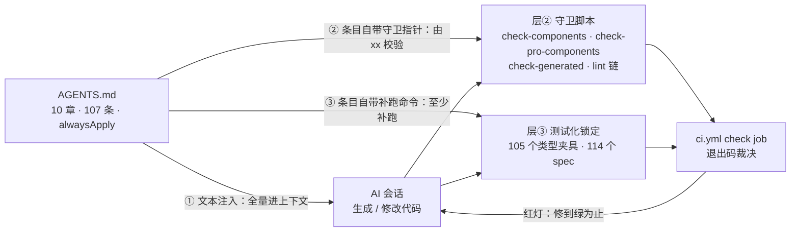
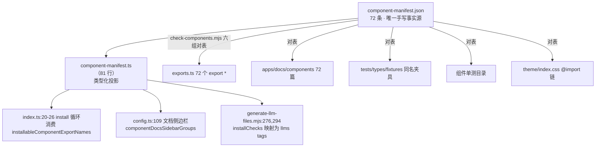
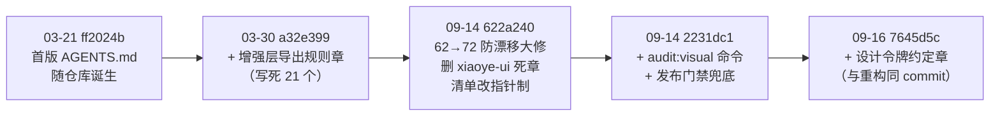

# 11-02 · 约定驱动开发：AGENTS.md 即规范

> 本篇是《AI 协作研发组件库》系列第十一卷的第二篇。11-01 把"全 AI 编写为什么没有失控"拆成四层防线，其中第一层——约定前置——只给了角色定位（11-01:126-187），逐段深读留给了本篇。文中所引路径与行号均以 2026-09-23 的仓库实态为准，写作前逐条复核（`wc -l AGENTS.md` = 143 行，10 章、107 条列表约定；行号标注以编辑器行号为准，末行无换行符故 `wc -l` 口径为 143）。本篇要回答的核心问题只有一句：**如何把工程约定写成机器可执行？**

## 一、先立标尺：什么才算"机器可执行"

"约定"这个词在软件工程里总是可疑的。一个只写在 wiki 或 README 里的约定，其执行力等于团队成员的记忆力与自觉性之和——而这两样东西恰恰是 AI 协作研发里最不可靠的资源：AI 会话之间不共享记忆，上下文窗口每轮清零。所以这个仓库从第一周起就有一句元约定（1-01:41）：**任何一条规则如果不配一个机械校验，就默认它会被违反**。

但"机械校验"不是一个开关，而是一条光谱。按约定的违反能否被**非人类的裁判**裁决，本仓的约定落在三层上：

- **层① · 纯文本约定**：给 AI 读的自然语言约束。它被机器"执行"的方式只有一种——`alwaysApply: true` 让它每次会话全量注入上下文（AGENTS.md:1-4 的 frontmatter）。遵守是概率性的：它能大幅降低违约率，但裁判仍然是"运气"。
- **层② · 脚本化约定**：约定条目直接变成守卫脚本的断言。裁判是进程退出码——`check-components.mjs` 校验的就是 AGENTS.md「代码约定」章声明的清单一致性，违约即红灯，概率归零。
- **层③ · 测试化约定**：约定行为被类型夹具或单测锁定。裁判是类型系统和断言——比如"根入口不得导出细节类型"这条约定，由 `pro-root-boundary.ts` 里 20 条 `@ts-expect-error` 负向导入断言把守：谁把类型抬回根入口，`pnpm typecheck:types` 直接报错。

三层不是三种约定，而是**同一条约定的三种执行形态**。一条成熟的约定往往同时在多层留有执行痕迹：文本层告诉 AI"要做什么"，脚本层告诉 CI"怎么验"，测试层把"不许复活"钉死。三层之间的关系如下图：



注意图中的三条出边都从 AGENTS.md 出发——这正是 11-01:185 点过的写法：约定的条目**自己携带守卫指针**。`AGENTS.md` 不是一份孤立的行为准则，它是一张把层①②③缝在一起的索引表。工具层还有一份补充约定：`.cursor/rules/codegraph.mdc`（31 行）约束 AI 工具自身的探索行为——主会话禁止直接调用返回大量源码的 `codegraph_explore` / `codegraph_context`，必须派 Explore 子代理，只留轻量查表工具给主会话（`codegraph.mdc:7-25`）。它是纯层①条款，裁判是上下文预算的物理极限。

把十章约定逐条放进这个坐标系，得到本篇的总账：

| AGENTS.md 章节 | 行号 | 条数 | 层① 文本 | 层② 脚本 | 层③ 测试 |
|---|---|---|---|---|---|
| 通用要求 | 8-15 | 6 | 全部 | 无（不可脚本化） | 无 |
| 代码约定 | 17-28 | 10 | 全部 | `check-components.mjs` | 组件 spec |
| 增强层导出规则 | 30-54 | 23 | 全部 | `check-pro-components.mjs` | `pro-root-boundary.ts` |
| 当前组件范围 | 56-63 | 6 | 指针条款 | `check-components.mjs` | 105 个夹具 |
| 设计令牌约定 | 65-70 | 4 | 全部 | `check:tokens`（生成物半章） | 无专项 |
| 发布流程 | 72-76 | 3 | 全部 | `release.yml:35-37` 门禁 | 无 |
| 文档与测试约定 | 78-89 | 10 | 全部 | `check:llms` | `typecheck:types` |
| 仓库命令 | 91-114 | 22 | 命令清单 | 即脚本本身 | 即测试本身 |
| 目录提示 | 116-128 | 11 | 全部 | 无（纯事实） | 无 |
| 本地产物与忽略项 | 130-143 | 12 | 全部 | `.gitignore` 主源 | 无 |

这张表暴露了一个诚实的分布：**107 条里真正被层②③机械裁决的只有约三成**，其余七成活在上下文注入里。这不是缺陷而是分层——后文第四节会专门讨论"哪些条款不许下沉"。接下来逐章精读，每章回答同一个问题：这条约定如何被机器执行？

## 二、逐章精读：十章约定与它们的执行坐标

### 2.1 frontmatter 与「通用要求」：最软的一章，为什么必须软

```md
# AGENTS.md:1-4

---
description: 
alwaysApply: true
---
```

```md
# AGENTS.md:8-15

## 通用要求

- 每次回答使用中文。
- 接到新任务时，先用自己的理解复述目标；如果问题有歧义或关键信息缺失，先向用户确认，不要盲目修改。
- 优先通过读取仓库上下文后再动手修改，不要先入为主。
- 任务适合并行探索、验证或定点修改时，优先使用子代理；不适合的任务不要强行拆分。
- 搜索文件或文本优先使用 `rg`。
- 不要覆盖或回退用户未明确要求处理的改动。
```

`alwaysApply: true` 是全文件第一个"机器可执行"的设计：它把"AI 应该读规范"从一句希望变成一次注入——执行主体是工具链本身，AI 连"忘了读"的机会都没有。这是层①内部唯一的硬保证，其余五条全是软约束。

有意思的是这六条**没有一条能下沉**。"先复述目标再动手"是对齐成本的止损；"不要覆盖用户未要求的改动"是权限边界；"优先使用子代理 / 不适合不要强行拆分"是并行度的判断——它们裁判的都是**意图与场景**，不存在能写 `if` 的机械判据。第一章总表里「通用要求」的层②③两列全部为空，是这个文件里最诚实的空白：把不可脚本化的条款强行脚本化，只会得到一堆误报的守卫。

### 2.2 「代码约定」：从命名到主源，脚本守卫的第一主场

```md
# AGENTS.md:17-28（全文）

## 代码约定

- 组件目录统一放在 `packages/components/<name>`，通常包含 `index.ts`、`src/`、`__tests__/`。
- 组件命名统一以 kebab-case 主名为准，例如 `button`、`form-item`、`time-picker`、`input-number`。
- TypeScript 中使用对应的 PascalCase 标识符，例如 `XyButton`、`XyFormItem`、`XyTimePicker`。
- Vue 模板、文档示例、测试模板中的组件标签统一使用 `xy-button`、`xy-form-item`、`xy-time-picker` 这类 kebab-case。
- 新增或修改组件时，除源码外，优先同步检查这些入口是否需要更新：
  - `packages/components/component-manifest.ts`
  - `packages/components/index.ts`
  - `packages/theme/index.css`
- 组件清单、文档侧边栏、聚合安装断言和一致性校验以 `packages/components/component-manifest.ts` 为主源，避免多处手工同步。
- 修改组件相关逻辑后，优先补齐或更新对应单测；如果组件有类型导出或安装入口变化，也要检查 `tests/types/fixtures` 中对应夹具。
```

这一章是"约定如何指向机器"的范本。第 27 行那句是全文件最重的一条：它把清单一致性的事实源指定为 manifest，并顺手列出该事实源的四个下游消费方——清单本身（"组件清单"）、文档侧边栏、聚合安装断言、一致性校验。这句话在仓库里各有一个对应物：

- **清单本身**：`component-manifest.json` 72 条，分组计数 23（basic）/ 19（form）/ 17（feedback）/ 13（data），2026-09-23 实测与文案逐一对上；
- **文档侧边栏**：`apps/docs/.vitepress/config.ts:2,6` 从两份 manifest 导入 `componentDocsSidebarGroups`，在 `config.ts:109` 展开进侧边栏；
- **聚合安装断言**：`packages/components/index.ts:4` 导入 `installableComponentExportNames`，`index.ts:20-26` 用它从聚合导出里筛出全部可安装组件，`index.ts:39-41` 的 install 循环逐个 `app.use`；
- **一致性校验**：`scripts/check-components.mjs` 对表六组事实。

前三向是"事实源派生物"，第四向是守卫。守卫的核心是六组 diff（`check-components.mjs:83-126`）：

```js
// scripts/check-components.mjs:83-126（节选自六组 mismatch 定义）
const mismatches = [
  {
    message: "组件目录与 manifest 不一致：",
    values: [
      ...diff(componentNames, componentDirs),
      ...diff(componentDirs, componentNames).map((name) => `${name} (多余目录)`)
    ]
  },
  {
    message: "导出入口与 manifest 不一致：",
    values: [
      ...diff(componentNames, exportedComponentNames),
      ...diff(exportedComponentNames, componentNames).map((name) => `${name} (多余导出)`)
    ]
  },
  {
    message: "组件文档与 manifest 不一致：",
    values: [
      ...diff(componentNames, docComponentNames),
      ...diff(docComponentNames, componentNames).map((name) => `${name} (多余文档)`)
    ]
  },
  {
    message: "类型夹具与 manifest 不一致：",
    values: [
      ...diff(componentNames, typeFixtureNames),
      ...diff(typeFixtureNames, componentNames).map((name) => `${name} (多余夹具)`)
    ]
  },
  {
    message: "组件单测与 manifest 不一致：",
    values: [
      ...diff(componentNames, unitTestNames),
      ...diff(unitTestNames, componentNames).map((name) => `${name} (多余单测目录)`)
    ]
  },
  {
    message: "样式入口与 manifest 不一致：",
    values: [
      ...diff(styleNames, themeImportNames),
      ...diff(themeImportNames, styleNames).map((name) => `${name} (多余样式导入)`)
    ]
  }
];
```

每一组都是双向 diff：manifest 里有而实态没有的算缺失，实态里有而 manifest 没有的算多余。脚本的裁决出口只有三行（`check-components.mjs:132-134`）：全部对上时打印"组件一致性校验通过，共校验 72 个公开组件"，任何一组失配则 `process.exitCode = 1`。这个退出码被两条链消费——本地 `pnpm lint`（`package.json:16` 把四个守卫与 eslint 串成一条命令），以及 CI 的 check job（`.github/workflows/ci.yml:21`）：

```yaml
# .github/workflows/ci.yml:21-26
      - run: pnpm check:components
      - run: pnpm lint
      - run: pnpm typecheck
      # CI runner 内存有限，文件级并行曾致 OOM flaky（同一提交在 Release job 中全部通过）
      - run: pnpm test -- --no-file-parallelism
      - run: pnpm build
```

于是第 19-22 行那三条命名约定（kebab-case 目录、PascalCase 标识符、xy- 前缀标签）也间接获得了机械性：AI 即便偶尔写漂，只要它按第 27 行的指示更新 manifest 并通过守卫，漂移的命名根本进不了 manifest——**入口被事实源卡住，命名约定就有了下游兜底**。

### 2.3 「增强层导出规则」：全文件最长章，条款与守卫逐句咬合

```md
# AGENTS.md:30-54（全文，23 条）

## 增强层导出规则

- 增强组件源码统一位于 `packages/pro-components/<name>`，并通过 `packages/pro-components/component-manifest.json` 维护正式公开增强组件清单。
- 新增或修改增强组件时，优先同步检查这些入口是否需要更新：
  - `packages/pro-components/component-manifest.json`
  - `packages/pro-components/exports.ts`
  - `packages/pro-components/index.ts`
  - `packages/pro-components/style.css`
  - `tests/types/fixtures/xiaoye-pro-components.ts`
  - `tests/types/fixtures/pro-root-boundary.ts`
  - `scripts/check-pro-components.mjs`
- `packages/pro-components/exports.ts` 只允许显式导出正式公开增强组件值，例如 `XyProTable`、`XyListPage`；不要在这里使用 `export *`，也不要把组件类型从这里抛到包根。
- `packages/pro-components/index.ts` 是增强层根入口白名单：
  - 只允许导出正式公开增强组件值。
  - 类型只允许导出每个公开增强组件的主 `Props / Instance / 主数据类型`，以及 `core.ts` 里的稳定共享协议类型。
  - 插槽入参、事件载荷、组件内部状态枚举、props 字面量联合、对共享类型的业务别名，默认不应出现在根入口。
- 如果某个类型只适合组件子入口使用，应保留在 `packages/pro-components/<name>/index.ts` 或源码内部，不要再把它抬到 `xiaoye-pro-components`（`packages/pro-components/index.ts`）根入口。
- 旧兼容类型如果必须保留，应只保留在源码层，并显式标注 `@deprecated`；默认不要继续从组件 `index.ts` 或包根对外导出。
- 增强层根入口边界由两层守卫共同维护：
  - `scripts/check-pro-components.mjs` 会校验组件值导出白名单和根入口类型白名单。
  - `tests/types/fixtures/pro-root-boundary.ts` 会校验一批已降级的细节类型无法再从根入口导入。
- 修改增强层公开导出后，至少补跑：
  - `pnpm check:pro-components`
  - `pnpm typecheck:types`
  - 视影响范围再补 `pnpm typecheck:packages`、`pnpm build:docs`、`pnpm build:lib`
```

这 23 条是全文件里"层②③密度"最高的一章，而且它把守卫的坐标**写进了约定正文**（第 48-50 行）——AI 读到"边界由两层守卫共同维护"的同时，也知道了守卫文件名。第一层守卫是 `check-pro-components.mjs`（331 行），其中的根入口类型白名单是一张硬编码的表（`check-pro-components.mjs:10-75`）：

```js
// scripts/check-pro-components.mjs:10-75（rootTypeWhitelist 全文）
const rootTypeWhitelist = {
  "search-form": ["SearchFormField", "SearchFormInstance", "SearchFormProps"],
  "pro-form": ["ProFormInstance", "ProFormProps"],
  "overlay-form": ["OverlayFormInstance", "OverlayFormProps", "OverlayFormSubmitPayload"],
  "dialog-form": ["DialogFormInstance", "DialogFormProps", "DialogFormSubmitPayload"],
  "drawer-form": ["DrawerFormInstance", "DrawerFormProps", "DrawerFormSubmitPayload"],
  "steps-form": ["StepsFormInstance", "StepsFormProps", "StepsFormStep"],
  "filter-panel": ["FilterPanelProps"],
  "request-form": ["RequestFormProps", "RequestFormSubmitContext"],
  "login-form": [
    "LoginFormInstance",
    "LoginFormModel",
    "LoginFormProps",
    "LoginFormThirdPartyItem"
  ],
  "page-toolbar": ["PageToolbarProps"],
  "page-header": ["PageHeaderProps", "PageIcon", "PageMetaItem"],
  "page-container": ["PageContainerProps"],
  "avatar-menu": ["AvatarMenuCommand", "AvatarMenuItem", "AvatarMenuProps"],
  "pro-table": ["ProTableColumn", "ProTableInstance", "ProTableProps"],
  "header-tabs": ["HeaderTabItem", "HeaderTabsMenuAction", "HeaderTabsProps"],
  "notice-center": [
    "NoticeCenterAction",
    "NoticeCenterItem",
    "NoticeCenterProps",
    "NoticeCenterTab"
  ],
  "stat-card": ["StatCardProps", "StatTrend"],
  "column-setting-panel": ["ColumnSettingPanelColumn", "ColumnSettingPanelProps"],
  "saved-view-tabs": ["SavedViewTabItem", "SavedViewTabsProps"],
  "table-filter-drawer": ["TableFilterDrawerProps"],
  "import-result-table": ["ImportResultSummary", "ImportResultTableProps"],
  "audit-timeline": ["AuditTimelineAttachment", "AuditTimelineEntry", "AuditTimelineProps"],
  "detail-panel": ["DetailPanelInstance", "DetailPanelProps"],
  "detail-page": [
    "DetailPageAction",
    "DetailPageAttachmentFile",
    "DetailPageBreadcrumbItem",
    "DetailPageProps"
  ],
  "async-state-container": ["AsyncStateContainerProps"],
  "list-page": ["ListPageActionRef", "ListPageBatchAction", "ListPageProps"],
  "crud-page": ["CrudPageProps"],
  "split-layout-page": ["SplitLayoutPageProps"],
  "approval-flow-panel": ["ApprovalFlowNode", "ApprovalFlowPanelProps"],
  "import-wizard": ["ImportWizardProps", "ImportWizardStep"],
  "export-task-panel": ["ExportTaskItem", "ExportTaskPanelProps"],
  core: [
    "ProDisplayFormatter",
    "ProDisplayHtmlRenderer",
    "ProDisplayOption",
    "ProDisplayOptionGroup",
    "ProDisplayRenderContext",
    "ProDisplayRenderer",
    "ProDisplayValueType",
    "ProActionRef",
    "ProFieldSchema",
    "ProFieldSchemaBuiltinComponent",
    "ProFieldSchemaOption",
    "ProPageAction",
    "ProRequestActionRef",
    "ProRequestContext",
    "ProRequestData",
    "ProRequestResult"
  ]
};
```

注意这张表的形状与 AGENTS.md 第 44 行的对应关系：白名单里每个组件只放主 `Props / Instance / 主数据类型`，`core` 段只放协议类型——**约定的措辞和守卫的数据结构是同一句话的两种写法**。这张表最后通过一条专门的 mismatch 兜底（`check-pro-components.mjs:319-331`）：

```js
// scripts/check-pro-components.mjs:319-331
  {
    message: "增强根入口类型白名单与约定不一致：",
    values: diffNamedExportMap(rootTypeWhitelist, rootTypeExports)
  }
];

mismatches
  .filter((entry) => entry.values.length > 0)
  .forEach((entry) => fail(entry.message, entry.values));

if (process.exitCode !== 1) {
  console.log(`增强组件一致性校验通过，共校验 ${componentNames.length} 个增强组件。`);
}
```

第二层守卫是层③的负向资产——`tests/types/fixtures/pro-root-boundary.ts` 全文 43 行，20 条 `@ts-expect-error` 把 10 个已降级的细节类型钉死（每个类型沿 `@xiaoye/pro-components` 与 `xiaoye-pro-components` 两个包名各断言一次）：

```ts
// tests/types/fixtures/pro-root-boundary.ts:1-20（前半，@xiaoye/pro-components 侧）
// @ts-expect-error 根入口不再暴露 ProTable 工具栏动作细节类型
import type { ProTableToolbarAction } from "@xiaoye/pro-components";
// @ts-expect-error 根入口不再暴露 ProTable 排序载荷细节类型
import type { ProTableSortChangePayload } from "@xiaoye/pro-components";
// @ts-expect-error 根入口不再暴露 ProTable 单元格插槽细节类型
import type { ProTableCellSlotProps } from "@xiaoye/pro-components";
// @ts-expect-error 根入口不再暴露审批动作别名
import type { ApprovalFlowAction } from "@xiaoye/pro-components";
// @ts-expect-error 根入口不再暴露时间线内部状态枚举
import type { AuditTimelineStatus } from "@xiaoye/pro-components";
// @ts-expect-error 根入口不再暴露浮层表单容器细节类型
import type { OverlayFormContainer } from "@xiaoye/pro-components";
// @ts-expect-error 根入口不再暴露浮层表单模式细节类型
import type { OverlayFormMode } from "@xiaoye/pro-components";
// @ts-expect-error 根入口不再暴露详情面板容器细节类型
import type { DetailPanelContainer } from "@xiaoye/pro-components";
// @ts-expect-error 根入口不再暴露分栏布局字面量类型
import type { SplitLayoutPageLayout } from "@xiaoye/pro-components";
// @ts-expect-error 根入口不再暴露 SearchForm 内建组件枚举
import type { SearchFormFieldBuiltinComponent } from "@xiaoye/pro-components";
```

第 42 行的 `xiaoye-pro-components` 包名侧还有对称的 10 条（`pro-root-boundary.ts:22-41`），末尾一行 `void 0;`（`pro-root-boundary.ts:43`）把未使用变量告警清零。`@ts-expect-error` 的语义在这里被反向使用——它是"**必须报错**"的断言：如果有人把 `AuditTimelineStatus` 抬回根入口，这条 import 不再报错，`@ts-expect-error` 自己反而变成"未使用的 expect-error"报错。也就是说，**违约和守规都会红灯**，类型系统被调教成了一个只认白名单的闸机。

9-01 已详细拆过这套双重守卫的引擎部分，本篇只补一句坐标结论：这一章 23 条约定里，约半数条款能一一指认到白名单表的一行或夹具的一条 import——**约定的可执行性，是用"每条都有坐标"来兑现的**。

### 2.4 「当前组件范围」：一段被修订史反复校准的清单

```md
# AGENTS.md:56-63（全文）

## 当前组件范围

- 当前 `packages/components/component-manifest.json`（同步驱动 `packages/components/index.ts` 导出）共 72 个组件：
  - 基础（basic，23 个）：`icon`、`button`、`link`、`breadcrumb`、`text`、`badge`、`avatar`、`image`、`watermark`、`card`、`check-card`、`carousel`、`affix`、`anchor`、`menu`、`row`、`col`、`scrollbar`、`splitter`、`divider`、`tag`、`space`、`tabs`
  - 表单（form，19 个）：`config-provider`、`input`、`auto-complete`、`cascader`、`radio`、`checkbox`、`switch`、`input-tag`、`input-number`、`rate`、`slider`、`date-picker`、`time-picker`、`time-select`、`select`、`tree-select`、`form`、`upload`、`editor`
  - 反馈与浮层（feedback，17 个）：`alert`、`message`、`notification`、`backtop`、`collapse`、`collapse-transition`、`empty`、`loading`、`skeleton`、`result`、`tooltip`、`popover`、`popconfirm`、`dropdown`、`transfer`、`dialog`、`drawer`
  - 数据展示（data，13 个）：`statistic`、`countdown`、`progress`、`steps`、`timeline`、`scheduler`、`descriptions`、`tree`、`table`、`pagination`、`charts`、`audio-player`、`video-player`
- 更新 `AGENTS.md`、文档导航或任务说明时，组件清单应以 `component-manifest.json` 为准，不要沿用旧列表。
```

这一章表面上是给 AI 的"库存清单"，实质是一份**带指针的快照**。72 个组件名全文手抄在规范文本里，但第 63 行紧跟着声明：这份抄本不是事实源，`component-manifest.json` 才是。抄写清单的价值在于让 AI 会话**零检索**获得事实面（每次生成组件时不必先读 JSON）；指针的存在价值在于**承认抄本会腐烂**——当两者冲突时，裁判是 JSON，再由 `check-components.mjs` 的六组对表兜住 JSON 与实态的一致。

"共 72 个组件"这五个字也不是拍脑袋：`node -e "require('./packages/components/component-manifest.json').length"` 实测 72，四个分组 23/19/17/13 与 manifest 的 `docsGroup` 计数逐组一致。数字写进规范文本的那一刻就开始倒计时，而指针保证倒计时结束时有仲裁者。这个"抄本 + 指针"的双层结构是怎么演化出来的，第三节修订史里有一场真实的漂移事故。

### 2.5 「设计令牌约定」：生成物条款与一条尚无守卫的禁令

```md
# AGENTS.md:65-70（全文）

## 设计令牌约定

- 令牌唯一事实源是 `packages/xiaoye-primitives/src/theme/tokens.css`，采用基元（`--xy-{色板}-{阶}`）/ 语义（`--xy-{角色}[-{状态}]`）/ 刻度（`--xy-{刻度}-{档}`）三层架构，蓝本为 Stripe 设计语言（亮暗双主题锚点值取自 design.hagicode.com 收录的 Stripe 官方 token 目录）。
- `packages/tokens` 的 TS 常量层由 `pnpm generate:tokens` 从 tokens.css 生成，不要手工编辑生成物；调整令牌后先改 tokens.css 再重新生成。
- 组件样式只消费语义层与刻度层；新代码禁止使用 tokens.css 末尾 `@deprecated` 兼容层里的旧命名（`--xy-color-primary`、`--xy-text-color-*`、`--xy-bg-color-*`、`--xy-shadow-xs/sm/md/lg` 等）。
- 改动令牌值或新增令牌后，同步更新 `apps/docs/design-tokens.md` 与 `apps/docs/guide/theming.md` 的变量表，并重新生成 llms 文档。
```

这一章是 7645d5c（2026-09-16，Stripe 令牌重构）新增的，四条里两条半是生成物条款。"不要手工编辑生成物"这类约定的执行器是通用的生成物漂移守卫 `check-generated.mjs`（175 行），它的头注释把机制说尽了（`check-generated.mjs:1-10`）：

```js
// scripts/check-generated.mjs:2-9（头注释节选）
/**
 * 生成物漂移守卫：校验"由事实源生成"的产物是否与事实源保持同步。
 *
 * 流程：快照当前生成物到临时目录 → 重新执行生成命令 → 逐文件对比
 * （--ignore 可按行正则过滤时间戳等易变行）→ 无论通过与否都还原快照，
 * 保证对工作区零副作用（不能用 git diff 判断，本地未提交改动会误报）。
 * 失败时把重新生成的产物保留在临时目录作为证据，并输出修复处方。
 */
```

`check:tokens` 与 `check:llms`（`package.json:12-13`）各挂一个生成命令，`pnpm lint` 时"重新生成一遍再逐文件比对"——AI 若绕过事实源直接改了生成物，lint 立刻红。**"不要手工编辑生成物"不是劝告，是一句可以被重放验证的断言**。

但第 69 行的"新代码禁止使用旧命名"值得单独解剖，因为它是全文件**分层最不彻底**的一条。它的存量部分已经清零（对 `packages/theme/src` 全量 rg 旧命名，命中为零），可"新代码禁止"这个增量约束没有任何 lint 规则把关——`eslint.config.js`（83 行）里没有针对 CSS 变量名的 `no-restricted` 类规则，也没有 stylelint。它今天的执行者只有层①：AI 读到这条，大概率遵守；读不到，就没人拦。诚实地说，这条约定停在层①，理由勉强成立（存量已迁移、tokens.css:11 的头注释和 :350 起的 `@deprecated` 兼容层使旧名"可见但标记死亡"），但按本仓自己的元约定衡量，它欠一条守卫。把它点出来不是挑刺，而是想说明：**分层审计本身应该是约定体系的一部分**——每条约定落在哪层，应当是一个可回答、可追责的问题，而不是写到哪算哪。

### 2.6 「发布流程」：约定把门禁写进 CI 的 yaml

```md
# AGENTS.md:72-76（全文）

## 发布流程

- 版本与变更日志统一走 Changesets：完成一批需要发版的改动后，用 `pnpm changeset` 写一条变更记录（选对 bump 级别：破坏性 major、新增能力 minor、修复 patch）。
- push 到 main 后 `.github/workflows/release.yml` 中的 changesets action 会自动创建/更新 "Version Packages" PR；该 PR 合并后自动构建 `build:lib` 并执行 `changeset publish` 发布到 npm。
- 不要手工改 `packages/*/package.json` 的版本号，也不要手工编辑 changesets 生成的 `packages/*/CHANGELOG.md`。
```

三条约定，两条有 CI 坐标。"不要手工改版本号 / CHANGELOG"的执行者是 changesets action 本身——版本号只由 `changeset version` 改写，手改的内容会在下一次 Version Packages 流程中被覆盖。第 75 行描述的流水线在 2231dc1（2026-09-14）补上了兜底：`release.yml:35-37` 在 changesets action 之前串联了 `pnpm check:components && pnpm check:pro-components`、`pnpm typecheck`、`pnpm test`——**直推 main 绕过 CI 的 PR 门禁也躲不开发布前的最后一道对表**（2-05 讲过这条踩坑，此处不展开）。约定文本、工作流 yaml、脚本退出码，在这章里是同一件事的三种存在形态。

### 2.7 「文档与测试约定」：全部夹具不许掉队

```md
# AGENTS.md:78-89（全文）

## 文档与测试约定

- 组件文档页位于 `apps/docs/components/<name>.md`。
- 组件示例位于 `apps/docs/examples/<name>/`；组合型示例目前还包含 `apps/docs/examples/basic-form`、`apps/docs/examples/feedback-data`、`apps/docs/examples/admin.md`。
- 文档站配置与主题扩展主要位于：
  - `apps/docs/.vitepress/config.ts`
  - `apps/docs/.vitepress/theme`
  - `apps/docs/.vitepress/plugins`
  - `apps/docs/.vitepress/utils`
- 组件单元测试通常放在 `packages/components/<name>/__tests__/*.spec.ts`。
- 类型测试夹具位于 `tests/types/fixtures/*.ts`；新增组件或调整导出类型时，优先补齐对应夹具。全部夹具通过 `pnpm typecheck:types` 参与检查，不要把新夹具排除在 tsconfig 之外。
- 文档示例和测试中的组件使用方式，应该与 `packages/components/index.ts` 的对外导出保持一致。
```

第 88 行有一处容易被忽略的机器可执行设计："**不要把新夹具排除在 tsconfig 之外**"。这句禁令针对的是一种真实会发生的作弊：AI 加了夹具但夹具报类型错，最省事的解法是把夹具从 `tests/types/tsconfig.json` 的 include 里挪出去——错误消失，约定同步失效。TS 的配置体系恰好提供了这条作弊通道，于是规范文本先把通道堵死。夹具数量的机械面在这里：`ls tests/types/fixtures | wc -l` = 105，而 `check-components.mjs:106-111` 保证每个 manifest 组件都有同名夹具——**夹具的"量"由守卫管，夹具的"质"由 typecheck 管**，两层各管一半。组件文档与夹具的目录清单（第 80、81 行）同样是 `check-components.mjs` 对表的对象：文档缺失或多余都算失配。

### 2.8 「仓库命令」「目录提示」「本地产物与忽略项」：写给 AI 的操作面

```md
# AGENTS.md:91-114（全文，22 条）

## 仓库命令

- 安装依赖：`pnpm install`
- 启动文档：`pnpm dev` 或 `pnpm dev:docs`
- 启动联调：`pnpm dev:playground`
- 测试：`pnpm test`
- 测试监听：`pnpm test:watch`
- 类型检查：`pnpm typecheck`
- 包与应用类型检查拆分命令：
  - `pnpm typecheck:packages`
  - `pnpm typecheck:types`
- Lint：`pnpm lint`
- 构建全部产物：`pnpm build`
- 分别构建：
  - `pnpm build:lib`
  - `pnpm build:docs`
  - `pnpm build:playground`
- 文档预览：`pnpm preview:docs`
- 双主题视觉巡检：`pnpm audit:visual`（--save-baseline 保存基线；存在基线时自动做像素 diff，差异超 0.5% 退出码 1）
- Changesets 相关：
  - `pnpm changeset`
  - `pnpm version-packages`
  - `pnpm release`
- 清理构建产物：`pnpm clean`
```

```md
# AGENTS.md:116-128（全文）

## 目录提示

- `apps/docs`：VitePress 文档站，组件文档、示例和首页内容都在这里。
- `apps/playground`：本地联调 playground。
- `packages/components`：基础组件源码（包名 `xiaoye-components`）、安装入口和单测。
- `packages/pro-components`：增强组件源码（包名 `xiaoye-pro-components`）。
- `packages/xiaoye-primitives`：基础设施包（包名 `xiaoye-primitives`），`src/composables` 是跨组件复用的组合式逻辑，`src/utils` 是类型、DOM、Vue 工具函数。
- `packages/theme`：组件样式入口与 CSS 实现（private）。
- `packages/tokens`：设计令牌相关源码（private）。
- `packages/mcp-server`：面向 AI 工具的 MCP Server（包名 `xiaoye-mcp-server`）。
- `tests/types`：类型测试夹具与独立 tsconfig。
- `scripts`：仓库脚本。
- `.changeset`：版本变更记录。
```

```md
# AGENTS.md:130-143（全文）

## 本地产物与忽略项

- 以下目录通常属于本地生成内容，不应在未明确要求时提交：
  - `.playwright-cli/`
  - `apps/docs/.vitepress/cache`
  - `apps/docs/.vitepress/dist`
  - `apps/docs/.vitepress/.temp`
  - `apps/playground/dist`
  - `packages/components/dist`
  - `packages/pro-components/dist`
  - `packages/xiaoye-primitives/dist`
  - `coverage`
  - `output/`
- 修改忽略规则时，先以根目录 `.gitignore` 为准，避免把调试日志、页面快照或构建产物带入提交。
```

这三章是 AI 的操作手册、地图和卫生守则，看似全是层①，其实各有机械锚点。「仓库命令」的 22 条不是文档——**每条命令本身就是机器**：`pnpm test` 背后是 vitest 的 114 个 spec，`pnpm audit:visual` 背后是 `visual-audit.mjs:270` 的 `ratio > 0.005` 阈值判定与 `:331` 的 `exitCode = 1`（与第 109 行文案"差异超 0.5% 退出码 1"逐字对上）。命令章写的不是"应该跑什么"，而是"裁判都在哪、怎么传唤"。顺带一提，`audit:visual` 这条正是 2231dc1（2026-09-14）补进命令章的——守卫上线三个月后才写进规范，这个时差本身就是修订史的一部分。「目录提示」的 11 条与 `ls packages/` 实测的六个包目录、两个应用逐条对上；「本地产物与忽略项」最后一句再次使用"以 `.gitignore` 为准"的指针句式——**凡是存在机器事实源的地方，规范只指路，不抄家底**。

### 2.9 汇总：一张 manifest 的派生与对表网络

逐章读完会发现，十章约定里最高频的事实源指向只有几个，其中 manifest 的地位最特殊——它同时是 AGENTS.md 的下游（被声明为事实源）、文档站的下游（派生侧边栏）和守卫脚本的对表基准。把这条网络画出来：



2-06 讲过 manifest 如何驱动文档站，4-01 讲过"一份 JSON 管六处一致性"，本篇补的是第三视角：**AGENTS.md 与这张网络的关系不是"包含"而是"引用"**。规范文本不携带事实，它把自己写成了事实源的使用说明书——这就是"AGENTS.md 即规范"的准确含义：AI 读它知道怎么写；守卫脚本检查声明是否被遵守；文档站导航与 AI 读到的清单共享同一个 JSON，三者天然不会各说各话。

## 三、修订史：约定是跟着事故长出来的

107 条不是一次写就的。`git log --follow AGENTS.md` 一共 9 次修订，挑三个关键切片：

```console
$ git log --follow --oneline --date=short --pretty='%h %ad %s' -- AGENTS.md
7645d5c 2026-09-16 feat: 设计令牌体系重构为 Stripe 设计语言
2231dc1 2026-09-14 docs: 落实审查建议——发布门禁兜底与工程上下文更新
622a240 2026-09-14 docs: 修正 AI 协作上下文与安装指引，归档过期规划
323e9a7 2026-04-21 feat(xiaoye-ui): 完成前台基础组件库 Phase 1 + Phase 2 核心组件
a32e399 2026-03-30 feat: 新增 pro 组件并增强表单与表格能力
6b6b247 2026-03-28 refactor: 收敛组件清单与导出流程并整理工程配置
4eb1885 2026-03-27 feat: 新增反馈导航组件并以 dialog 替换 modal
9200bba 2026-03-25 feat: 新增展示组件并增强浮层与分页交互
ff2024b 2026-03-21 feat: 初始化组件库基础设施与MVP交互组件
```

**切片一：a32e399（2026-03-30），「增强层导出规则」章诞生。**pro 组件上线当天，AGENTS.md +29/−2 行，主体就是这一章。值得注意的是它当时怎么写的：

```diff
# a32e399 对 AGENTS.md 的增量（节选）
+- 增强组件源码统一位于 `packages/pro-components/<name>`，并通过 `packages/pro-components/component-manifest.json` 维护 21 个正式公开增强组件清单。
```

"21 个"——数字直接写死在约定里。此后 pro 组件从 21 长到今天的 31 个（`pro-components/component-manifest.json` 实测 31 条），这个写死的数字靠人肉追平了若干次。它没出过事故，但它是一种**每加一个组件就要记得改规范的模式**，而"记得"恰恰是 AI 协作里最不该依赖的资源。

**切片二：622a240（2026-09-14），防漂移大修。**这是 AGENTS.md 史上最重要的一次修订，diff 里三处改动指向同一个教训：

```diff
# 622a240 对 AGENTS.md 的关键增量（节选）
-- 当前 `packages/components/index.ts` 已导出 62 个组件：
-  - 配置入口：`config-provider`
-  （……62 组件手抄清单，6 组分组……）
-- 更新 `AGENTS.md`、文档导航或任务说明时，组件清单应以上述导出入口为准，不要沿用旧列表。
+- 当前 `packages/components/component-manifest.json`（同步驱动 `packages/components/index.ts` 导出）共 72 个组件：
+  （……72 组件清单，按 manifest 四分组重抄……）
+- 更新 `AGENTS.md`、文档导航或任务说明时，组件清单应以 `component-manifest.json` 为准，不要沿用旧列表。
```

第一处：清单从 62 对齐到 72——旧文本已经**漂移了 10 个组件**，期间新增的 transfer、editor、descriptions、tree-select、check-card 等都没进规范抄本。AI 若信了旧清单，会认为这些组件"不存在"而另起炉灶。第二处：整个「前台层（xiaoye-ui）导出规则」章被删除——一个已废弃前台包的 28 行导出规则（numstat 合计该次修订 −54 行，此章占近半），作为死章节在规范里多活了近半年，每一轮会话都在为它支付上下文预算。第三处：裁决指针从"应以上述导出入口为准"（**以本文件抄本为准**）改为"应以 `component-manifest.json` 为准"（**以事实源为准**）。三个改动合起来是一句话：**规范文本里凡是会变的事实，要么删掉，要么降级为指向事实源的指针**。

**切片三：7645d5c（2026-09-16），令牌章新增。**Stripe 令牌重构当晚，AGENTS.md 增 7 行、新增「设计令牌约定」整章——重构提交与规范修订在同一个 commit 里，规范和事实同生共死。加上 2231dc1 在同周补的 `audit:visual` 命令行与发布门禁兜底，四层防线的守卫上线节奏与规范文本的更新节奏完全同步。

把这条修订时间线画出来，能看到规范的"生长点"全部踩在事故或大变更上：



11-01:476 说"约定体系本身也是'发现—订正—守卫化'闭环的产物，只不过它的守卫形态是文本而非脚本"。修订史给这句话补了一个更精确的版本：**文本守卫也会腐烂，所以成熟方向的修订总是把文本守卫降级为指针、把指针背后的事实源交给脚本守卫**。62→72 的漂移之所以能被一次修订根治，正是因为根因不在"忘了更新抄本"，而在"抄本居然被当成了裁判"。

## 四、三个设计权衡

### 4.1 权衡一：自然语言与机器可执行的下沉度

三层标尺最容易读出的误义是"层②③优于层①，所以应该尽量下沉"。修订史给出的答案恰恰相反——**下沉是有门槛的，门槛是条款能否被无歧义地判真伪**。「通用要求」六章永远留在层①，因为"先复述目标""不要强行拆分子代理"是判断力条款，强写成脚本只会产出误报。反过来，「代码约定」的清单一致性必须下沉，因为它有完美的机械判据：两个集合的 diff。

真正的设计难点在中间地带。以 2.5 节那条"新代码禁止旧令牌命名"为例：它可以下沉（eslint `no-restricted-syntax` 匹配 CSS 变量声明，或一个 grep 型守卫扫描新增 diff），但仓库选择了让它留在层①，赌的是"存量已清零 + 旧名已标 `@deprecated` + AI 每次都会读到规范"三重保险。这笔账的合理区间取决于违约代价：令牌旧名的违约后果是样式层残留一套平行命名，可被 code review 和视觉巡检兜住，不值得为它新养一条守卫；增强层导出边界的违约后果是公开 API 面被污染、下游类型泄漏，直接损害包的契约，必须零容忍——所以后者享受了层②③双保险，前者只有层①。**下沉度跟着违约代价走，不跟条款的新旧或作者偏好走**。

### 4.2 权衡二：粒度——107 条为什么不多不少

AGENTS.md 的粒度选择有一条隐含的对称轴：**写进规范的每一条"事实"，要么有守卫盯着，要么降级为指针**。用它审计三个时点的文本：a32e399 写死"21 个"——事实无守卫盯（当时 `check-pro-components.mjs` 刚上线，只查一致性不查数字），属于欠账；622a240 之后的"共 72 个组件"——数字背后站着 `check-components.mjs` 的 72 条对表和 manifest 事实源，数字腐烂会被守卫与指针双重纠正，属于安全写法；「目录提示」的 11 条——纯静态事实，腐烂概率极低，直接写死，属于合理写法。

粒度另一侧的风险在 11-01:476 已经点过：写太细，AI 会把规则当免责声明机械套用，牺牲每个组件的正确形态。本篇补上粒度的第三个维度——**上下文预算**。`alwaysApply` 意味着这 143 行每次会话全量注入，每一条冗余条款都是永久的 token 开销；622a240 删掉 30 行 xiaoye-ui 死章，省下的不只是"误读风险"，还有每一轮会话的上下文空间。107 条这个数字因此不是内容决策，而是**内容 × 注入频率的乘积决策**：一条只在改令牌时才用的细节，不配常驻 143 行——它应该住在 `apps/docs/guide/theming.md` 或 tokens.css 的头注释里，等 AI 触到那个场景再被检索到。

### 4.3 权衡三：约定自身的变更流程

一个更根本的问题：AGENTS.md 自己归谁管？它没有 CODEOWNERS，没有专门的评审门，修改它不需要跑任何守卫（`check-components.mjs` 不管这个文件）。防文本腐烂靠的是三条结构性纪律，全部可从修订史验证：**其一，规范尽量不含易变事实**——含事实处必有指针（manifest、`.gitignore`、tokens.css），事实变了指针不用动。**其二，规范修订与事故修复同 commit**——622a240 修漂移的同时修规范，7645d5c 改令牌的同时加章，规范永远不在事实之后单独补票。**其三，每条守卫型条款都自带补跑命令**（第 51-54 行"至少补跑"清单），规范被改坏时最先发现的是跑守卫的人或 AI，而不是下游用户。这套流程的弱点也很清楚：那些落在层①、无守卫、无指针的条款（比如第 69 行禁令）的失效只能靠人眼——所以第四节之外的隐含结论是，约定体系的守护者其实是"分层审计表"这张本篇第一章画的表，它应该随每次规范修订重算一遍。

顺带交代 `alwaysApply` 的替代方案：Cursor 类工具支持按 glob 触发的分文件 rules，把令牌章只挂在 `packages/theme/**/*.css` 上可以省预算。本仓没有这么做——143 行的全量注入成本可控，而"忘了挂载"的风险是全有全无型的。这是用预算换确定性的一笔交易，与 2-02 用 ES-only 换工具链统一是同一种决策风格。

## 五、换一个参照系：EP 的 CONTRIBUTING.md 是另一种文体

Element Plus 的贡献指南（CONTRIBUTING.md 及其 contributing 文档）与本仓 AGENTS.md 面对的是同一件事——"如何让几十个协作者产出一套风格一致的组件库"——但文体几乎是镜象的。EP 的指南是写给**人类贡献者**的过程叙事：先去 issue 区搜索与讨论、用模板报告并附最小复现、fork 后从 dev 拉分支、用 `pnpm cz` 走 Conventional Commits 写 `fix(table): ...`、首次贡献会先做小改动熟悉流程、新特性先过讨论再动手。它的句子大多是祈使句加解释——"请先开启 issue 讨论，避免无效投入"这类**流程劝导**，判断与取舍留给人，维护者的 review 就是约定的执行现场。

AGENTS.md 则是写给**机器消费者**的事实与不变量清单：没有"如何参与"，没有 fork 与分支——AI 不需要；它的祈使句全是**可判真伪的断言**——"只允许显式导出""不要把新夹具排除在 tsconfig 之外""以 manifest 为准"，并且每条断言旁边站着守卫脚本或补跑命令，执行现场是退出码。两者唯一的交集是 commitlint 式的机械校验：EP 用 commitlint 卡提交信息，本仓用四个 check 脚本卡清单一致性——**在"机器能判的地方用机器"这一点上，成熟的人类工程与 AI 工程早已殊途同归**。

差异的本质在违规反馈通道。EP 的约定被违反时，反馈是异步的、社会性的：一个 review 意见、一次被要求返工的 PR、一条 issue 里的讨论——反馈给的是"人"，成本由人类带宽承担。AGENTS.md 的约定被违反时，反馈是同步的、机械的：退出码 1、红灯、AI 当场修到绿——反馈给的是"产生违规的那个进程"本身，成本接近零。这也解释了为什么两份文档的信息密度分布完全不同：EP 必须花大量篇幅解释"为什么"（人不理解原因就不会配合），AGENTS.md 几乎不解释为什么、只精确到"是什么与在哪验"（AI 不需要被说服，只需要被告知与被校验）。写规范之前先问一句"读者违规时谁付费"，文体的选择其实只有一个答案。

## 六、收束

回到标题。"AGENTS.md 即规范"不是"AGENTS.md 写了很多规范"，而是三件事的合成：**它用 `alwaysApply` 把规范变成上下文的常量；它把每条可机械化的约定写成守卫脚本与类型夹具的指针，让退出码做裁判；它对一切会变的事实保持谦逊，把自己降级为事实源的使用说明书**。三层各司其职：层①降低违约频率，层②③消灭违约后果；而修订史证明这个体系是活的——62→72 的漂移教会它指针制，令牌重构教会它同 commit 修订，每次失控都以"规范多一条坐标"的形式沉淀回来。

约定驱动开发的完整闭环至此成型：**约定先行 → 守卫断后 → 事故回流成新约定**。规范的终极形态不是一份文件，而是文件、脚本、测试与修订史共同构成的一个会自我修正的系统。

下一篇 11-03《组件库的 AI 生态闭环》将走出仓库内部视角：`packages/mcp-server` 如何把这套约定与清单做成 MCP 工具供外部 AI 调用，llms 文档的生成链路如何与 manifest 同源，以及当 AI 既是这套组件库的作者、又是它的用户时，生态如何闭上最后一个环。我们在那里见。
