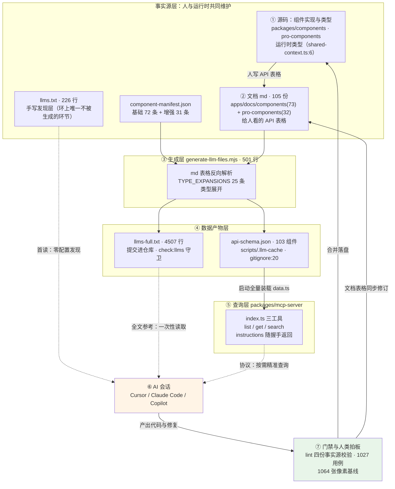
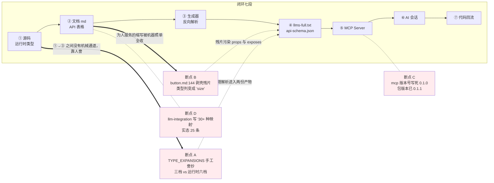
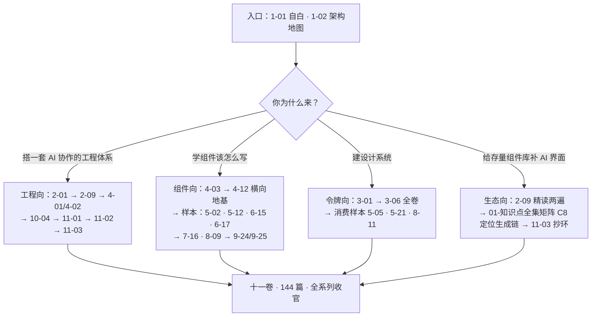

# 11-03 · 组件库的 AI 生态闭环

> 核心问题：**组件库服务 AI 消费的完整数据流，最后能不能闭成一个环？**
> 2-09 已把 llms 文档与 MCP Server 的机制层拆到底——四层设施（发现层、参考层、数据层、查询层）各自是什么、怎么生成、谁在守卫。那一篇画的是数据流的**上半环**：事实源 → 生成 → 消费。本篇补上**下半环**：AI 会话消费这些数据后产出的代码与修复，如何回到仓库、刷新事实源、再服务下一轮会话。环闭合之后，2-09 留下的三处断点要放到环上重新定位，本篇还会新增一处自己发现的断点；结尾按惯例做全系列总收束。文中所有路径与行号均为 2026-09-23 当前工作区实态，写作前逐条复核；全系列规划 144 篇，本篇落笔时 `column/` 目录实测 142 篇正文加 3 份索引（`00-仓库架构地图.md`、`01-知识点全集矩阵.md`、`02-分卷大纲.md`），本篇交付后为 143 篇正文，规划中唯一未落号的是 11-02。

---

## 一、闭环：把 2-09 画到一半的那张图画完

先把整篇的骨架立起来。2-09 的四层设施，用一句话复述：`llms.txt`（手写 226 行）回答"这是什么库、该选哪个"，`llms-full.txt`（生成 4,507 行）回答"每个组件的完整 API"，`scripts/.llm-cache/api-schema.json`（生成、gitignore、103 个组件）是前者的结构化形态，`packages/mcp-server`（`src/index.ts` 268 行 + `src/data.ts` 84 行）把数据层装进内存、以三个工具按需供给 AI。这套设施在 2-09 里是四层**静态**的堆叠；本篇要论证的是，它们只有放进一个**动态的环**里才物尽其用——环的起点不是文档，是源码；环的终点不是 AI 的回答，是回到仓库的代码。

完整的数据流拆成七段：

1. **源码**：组件实现与类型定义是整条链的第一事实（比如全局尺寸的运行时定义就住在 `packages/xiaoye-primitives/src/composables/shared-context.ts:6`）；
2. **文档 md**：人把 API 表格写进 `apps/docs/components/*.md` 与 `apps/docs/pro-components/*.md`（当前实态 73 + 32 = 105 份）；
3. **api-schema.json**：生成器反向解析文档表格，产出结构化数据（`package.json:35` 的 `generate:llm` 一条命令同时产出两份产物）；
4. **llms-full.txt**：同一份解析结果渲染成纯文本参考层，提交进仓库；
5. **MCP Server**：启动时全量装载 schema，以 `list_components` / `get_component_api` / `search_components` 三工具按需供给；
6. **AI 会话**：静态文件通道与协议通道共同喂出一个"不再靠猜"的选型与编码过程；
7. **代码回流**：AI 产出的代码与修复经门禁与人类拍板落盘，改写源码与文档——回到第 1 段。

第 7 段是 2-09 没有画的那一段，也是"生态"区别于"文档"的分水岭。先上全景图，本篇按图索骥：



这张图和 2-09 的全景图相比，多的是底部那两条回流边。读懂闭环只需要记住两句话：**AI 界面的每一次刷新都必须经过生成链**（没有"顺手手改一下 llms-full.txt"这种操作——`check:llms` 会让它在 lint 里现形），以及**AI 的每一次产出都必须经过门禁**（没有"AI 写的直接合"这种捷径——六道门禁在 CI 里等它）。上半环保证 AI 读到的是真的，下半环保证仓库接住的是对的，两半合起来才叫生态。

## 二、上半环逐段核对：七段数据流的产品实态

闭环不是隐喻，每一段都有可核对的产物。逐段过一遍，重点是给每一段钉上"当前实态"的证据。

### 2.1 第 1→2 段：源码如何变成文档表格，以及这条路上最窄的地方

运行时的类型定义是一切的上游。全局尺寸的"真相"全文只有一行：

```ts
// packages/xiaoye-primitives/src/composables/shared-context.ts:6
export type ComponentSize = "" | "xs" | "sm" | "md" | "lg" | "xl";
```

六档加一个空串。它不是一个孤立声明，而是整个全局配置协议的一个字段——这个尺寸如何流进每一个组件，看同文件的协议接口（`shared-context.ts:15-28`）：

```ts
export interface SharedConfigContext {
  namespace: ComputedRef<string>;
  locale: ComputedRef<Locale>;
  zIndex: ComputedRef<number>;
  size: ComputedRef<ComponentSize>;
  dialog: ComputedRef<unknown>;
  loading: ComputedRef<unknown>;
  message: ComputedRef<unknown>;
  notification: ComputedRef<unknown>;
}

export const DEFAULT_NAMESPACE = "xy";
export const DEFAULT_Z_INDEX = 2000;
export const DEFAULT_SIZE: ComponentSize = "md";
```

`size` 与 `dialog`、`message`、`notification` 并排坐在同一份注入协议里，默认档位 `md`——这意味着闭环第 1 段的"源码事实"其实是一张协议网，任何一处誊写失真都会顺着 ConfigProvider 的注入链放大到全部组件。人把这份真相誊写进文档表格时，链条出现了第一处收窄——`apps/docs/components/button.md` 的 API 表格（`:141-146` 节选）：

```md
| 属性           | 说明                       | 类型                                                           | 默认值          |
| -------------- | -------------------------- | -------------------------------------------------------------- | --------------- |
| `type`         | 按钮类型                   | `ButtonType` | `'default'`     |
| `size`         | 按钮尺寸                   | `ButtonProps["size"]`                                           | 跟随全局配置    |
| `disabled`     | 是否禁用交互               | `boolean`                                                      | `false`         |
| `icon`         | 前置 Iconify 图标          | `string`                                                       | —               |
```

表格里写的是 `ButtonType`、`ButtonProps["size"]` 这类**给人看的缩写**——人类读者点一下编辑器的跳转就懂。这是文档路线的天性：文档首先是写给人的，AI 是第二读者。但正是这个"第二"，让每一处为人服务的简写都变成了机器面前的一堵墙。`size` 这一行（`button.md:144`）会在第三节作为断点 B 正式立案；先看它往下走会发生什么。

### 2.2 第 3→4 段：一次解析，两种形态

`generate-llm-files.mjs`（501 行）读两份 manifest 与 105 份文档，把表格拆回数据。它的 `TYPE_EXPANSIONS` 映射表（`scripts/generate-llm-files.mjs:21-47`）负责把类型别名就地展开，25 条全文如下——逐行读下去会发现，这 25 行其实就是 25 份"手工誊抄契约"，每一行都许诺"运行时的类型长这样"：

```js
const TYPE_EXPANSIONS = {
  ButtonType: "'default' | 'primary' | 'success' | 'warning' | 'danger'",
  ButtonNativeType: "'button' | 'submit' | 'reset'",
  ComponentSize: "'sm' | 'md' | 'lg'",
  InputType: "'text' | 'textarea' | 'number' | 'password' | 'email' | 'search' | 'tel' | 'url'",
  InputAutoSize: "{ minRows?: number; maxRows?: number } | boolean",
  InputModelModifiers: "{ lazy?: true; number?: true; trim?: true }",
  TableAlign: "'left' | 'center' | 'right'",
  TableSortOrder: "'ascending' | 'descending' | null",
  TableSortable: "boolean | 'custom'",
  TableColumnType: "'default' | 'selection' | 'index' | 'expand'",
  TableColumnFixed: "boolean | 'left' | 'right'",
  TableLayout: "'fixed' | 'auto'",
  DialogCloseReason: "'close' | 'backdrop' | 'escape' | 'programmatic'",
  DialogTransition: "string | TransitionProps",
  Placement: "'top' | 'top-start' | 'top-end' | 'bottom' | 'bottom-start' | 'bottom-end' | 'right' | 'right-start' | 'right-end' | 'left' | 'left-start' | 'left-end'",
  TooltipEffect: "'dark' | 'light'",
  FormTrigger: "'blur' | 'change'",
  ValidateState: "'idle' | 'validating' | 'success' | 'error'",
  SearchFormFieldBuiltinComponent: "'input' | 'select' | 'checkbox' | 'checkbox-group' | 'radio' | 'radio-button' | 'radio-group' | 'cascader' | 'date-picker' | 'time-picker' | 'time-select' | 'input-number' | 'switch' | 'transfer' | 'avatar' | 'image' | 'progress' | 'tag' | 'timeline' | 'tree' | 'steps'",
  ProTableDensity: "'sm' | 'md' | 'lg'",
  ProTableEditableMode: "'table' | 'row' | 'cell'",
  ProTableEditableTrigger: "'click' | 'dblclick' | 'manual'",
  ProTableSelectionMode: "'single' | 'multiple'",
  ProTableExportType: "'csv' | 'excel'",
  ProTableContextmenuScope: "'row' | 'cell' | 'header'",
};
```

第三行请多看一眼：`ComponentSize` 展开成三档，而运行时是六档——先立案，第三节断点 A 的主角就是它。这份表里同样值得注意的是第 20 行 `SearchFormFieldBuiltinComponent`，一条 21 个字面量的巨型联合，它枚举的是增强层字段 schema 可内建的组件集合——哪天基础层新增一个表单控件，这行就得人工跟进，誊抄契约的维护面由此可见。解析结果按两种形态写出：结构化的进 `api-schema.json`，纯文本的进 `llms-full.txt`。产物头部（`llms-full.txt:1-4`）：

```txt
# xiaoye-components 完整 API 参考

> 自动生成于 2026-09-22T22:47:21.402Z
> 包含 103 个组件的完整 Props / Events / Slots / Exposes 定义
```

按钮段的两行并排放着（`llms-full.txt:20-21`），正好是这条生成链的光谱两端：

```txt
| `type` | `('default' | 'primary' | 'success' | 'warning' | 'danger')` | 'default' | 按钮类型 |
| `size` | `size` | 跟随全局配置 | 按钮尺寸 |
```

type 行是类型展开的成功案例——AI 不需要任何跳转就看到完整取值域；size 行是断点 B 的现行作案现场。作案工具是 `expandType`（`generate-llm-files.mjs:49-106`）中段的剥壳规则，`scripts/generate-llm-files.mjs:63-71` 节选：

```js
result = result.replace(/\bXxxProps\["([^"]+)"\]/g, "$1");
result = result.replace(/\bButtonProps\["([^"]+)"\]/g, "$1");
result = result.replace(/\bInputProps\["([^"]+)"\]/g, "$1");
result = result.replace(/\bSelectProps\["([^"]+)"\]/g, "$1");
result = result.replace(/\bTableProps\["([^"]+)"\]/g, "$1");
result = result.replace(/\bFormProps\["([^"]+)"\]/g, "$1");
result = result.replace(/\bDialogProps\["([^"]+)"\]/g, "$1");
result = result.replace(/\bButtonGroupProps\["([^"]+)"\]/g, "$1");
result = result.replace(/\bButtonGroupDirection\b/g, "'horizontal' | 'vertical'");
```

`ButtonProps["size"]` 被这一串 replace 剥掉接口名，只留捕获组里的字段名自己，类型列剩下的 `"size"` 是语法合法但语义为零的残片。同一份结构化数据落在 `api-schema.json` 里，按钮段实物（`node` 直读当前产物）：

```json
{
  "name": "button",
  "title": "Button 按钮",
  "description": "页面主操作、次要操作和轻量文本动作入口。",
  "tags": ["xy-button", "xy-button-group"],
  "exports": ["XyButton", "XyButtonGroup"],
  "layer": "base",
  "props": [
    {
      "name": "type",
      "description": "按钮类型",
      "type": "('default' | 'primary' | 'success' | 'warning' | 'danger')",
      "default": "'default'"
    },
    {
      "name": "size",
      "description": "按钮尺寸",
      "type": "size",
      "default": "跟随全局配置"
    }
  ],
  "exposes": [
    { "name": "ref", "description": "按钮根节点引用", "type": "ref" },
    { "name": "size", "description": "解析后的尺寸", "type": "size" },
    { "name": "type", "description": "解析后的按钮类型", "type": "type" },
    { "name": "disabled", "description": "解析后的禁用状态", "type": "disabled" }
  ]
}
```

103 个组件、`version: "1.0.0"`、`generatedAt` 精确到毫秒——它在 `scripts/.llm-cache/`（`.gitignore:20`），是本地产物而非仓库承诺。数据层和参考层共享同一条解析管线，所以残片也在两边各出现一次：**环上的失真是成对传播的**，这是后文断点定位的方法论基础。

### 2.3 第 5→6 段：MCP Server 把数据变成会话

数据层物尽其用的方式有两种。轻量的 AI 工具直接读静态文件（`llms.txt:224-226` 结尾就一句"详见 [llms-full.txt](./llms-full.txt)"）；重度的走 MCP 协议。`packages/mcp-server/src/index.ts:12-35` 的构造段，2-09 引过全文，本篇从闭环视角只看两件事：

```ts
const server = new McpServer(
  {
    name: "xiaoye-components",
    version: "0.1.0",                    // ← 断点 C：包版本已是 0.1.1（package.json:3）
  },
  {
    instructions: `You are working with xiaoye-components, a Vue 3 component library for mid-office and back-office scenarios.

Key conventions:
- Component tags use kebab-case with "xy-" prefix: xy-button, xy-dialog, xy-pro-table
- TypeScript identifiers use PascalCase with "Xy" prefix: XyButton, XyDialog, XyProTable
- v-model convention: v-model="value" maps to modelValue / update:model-value
- Global sizes: "sm" | "md" | "lg"
- Icons use Iconify format: icon="mdi:loading"

When suggesting components, prefer:
- Dialog for blocking interactions, Drawer for side panels
- ProTable over Table for data-heavy pages
- SearchForm for filter bars, ProForm for complex forms
- ListPage/CrudPage for standard CRUD pages

Always call list_components first to see what's available, then get_component_api for specific API details.`,
  }
);
```

第一件事：`instructions` 是 initialize 握手就返回的字段，AI 工具一连接就看到——**不用调用任何工具就能拿到选型指导**。它的内容是 `llms.txt:26-57` 那棵场景决策树的英文浓缩版（"Dialog for blocking interactions, Drawer for side panels" 对应"阻断式录入……不阻断主内容"），这是刻意为之的双通道冗余：同一份判断层知识，静态通道覆盖不配 MCP 的 AI，协议通道覆盖配置了的。第二件事：注意 `Global sizes: "sm" | "md" | "lg"` 这一行——它和 TYPE_EXPANSIONS 同源同错，而手写的 `llms.txt:220` 写的是五档（`xs / sm / md / lg / xl`，默认 `md`）。三个载体三种口径，最接近运行时真相的反而是没有任何机械设施托底的手写层。这个反直觉的观察是第三节断点盘点的引子。

数据怎么进到 Server？`packages/mcp-server/src/data.ts:51-68` 的装载段（2-09 引过全文，这里回指）：

```ts
function loadSchema(): ApiSchema {
  const schemaPaths = [
    path.resolve(__dirname, "../../scripts/.llm-cache/api-schema.json"),
    path.resolve(process.cwd(), "scripts/.llm-cache/api-schema.json"),
  ];

  for (const schemaPath of schemaPaths) {
    if (fs.existsSync(schemaPath)) {
      const content = fs.readFileSync(schemaPath, "utf8");
      return JSON.parse(content);
    }
  }

  console.error(
    "Error: api-schema.json not found. Run `pnpm generate:llm` first."
  );
  process.exit(1);
}
```

双路径探测（monorepo 内从 dist 跑、全局安装后从任意目录跑），两条路都断就 `exit(1)` 并把修复命令直接写在报错里——**环上的每一处失败都要自带处方**，这个风格贯穿全链。

三工具的完整实现 2-09 已逐行拆过（`list_components:37-72`、`get_component_api:74-121`、`search_components:123-187`），本篇从闭环角度重读其中一段：`search_components` 的匹配与结果渲染（`packages/mcp-server/src/index.ts:135-186`）：

```ts
    const lowerQuery = query.toLowerCase();
    const matches = components.filter((comp) => {
      const searchable = [
        comp.name,
        comp.title,
        comp.description,
        ...comp.tags,
        ...comp.exports,
      ]
        .join(" ")
        .toLowerCase();
      return searchable.includes(lowerQuery);
    });

    if (matches.length === 0) {
      return {
        content: [
          {
            type: "text",
            text: `No components found matching "${query}". Call list_components to see all available components.`,
          },
        ],
      };
    }

    const lines = [
      `# Search results for "${query}" (${matches.length} found)`,
      "",
    ];

    for (const comp of matches) {
      const tag = comp.tags[0] || comp.name;
      lines.push(`## ${comp.title}`);
      lines.push(`- Name: ${comp.name}`);
      lines.push(`- Tag: \`${tag}\``);
      lines.push(`- Layer: ${comp.layer}`);
      if (comp.description) {
        lines.push(`- Description: ${comp.description}`);
      }
      lines.push(
        `- API: ${comp.props.length} props, ${comp.events.length} events, ${comp.slots.length} slots, ${comp.exposes.length} exposes`
      );
      lines.push("");
    }

    lines.push(
      "Use get_component_api with a component name to see full API details."
    );
```

五个字段拼一个大字符串做子串匹配，没有分词与打分——103 个组件的规模下够用，而真正服务于闭环的是末尾那行 API 计数（`:174`）：AI 在点开 `get_component_api` 详情**之前**就能估出候选组件的复杂度（"31 个 props 的 ProTable"和"4 个 props 的 StatCard"显然不是同一档决策），环上的往返次数被这一行压掉了。零命中与命中的两种返回都带"下一步该调什么"的指引，与 `get_component_api` 的四路名称匹配（`:85-93`）和 "Did you mean" 纠错（`:95-114`）一起，把"AI 怎么称呼一个组件、下一步该怎么走"的不确定性全部吸收在服务端。AI 侧的真实消费场景，仓库自己的文档给过剧本（`apps/docs/guide/llm-integration.md:171-177`）：

```txt
配置完成后，你可以在 AI 对话中直接提问：

- "帮我用 xiaoye-components 写一个用户列表页" → AI 会调用 search_components("list") 找到 ListPage
- "xy-dialog 有哪些 props？" → AI 会调用 get_component_api("dialog") 返回完整 API
- "表单组件有哪些？" → AI 会调用 list_components({ layer: "base" }) 过滤基础组件
```

到这一步，上半环的全部环节都有了实态证据：源码在 `shared-context.ts:6`，表格在 `button.md:141`，数据在 `api-schema.json`（103 组件），参考在 `llms-full.txt:1-4`（4,507 行），查询在 `index.ts:37-187`（三工具），会话剧本在 `llm-integration.md:171-177`。**但闭环还不成立**——AI 拿着这些数据写出的代码，此刻还飘在仓库外面。把飘着的这段接回来，是本篇真正的主题。

## 三、断点盘点：环上已知的四个漏点

2-09 考据过三处断点，本篇把它们放到闭环上重新定位，并新增本篇自查发现的一处。四个漏点有一个共同的结构：**它们都不在守卫的辖区里**。



**断点 A：誊抄层漂移（①→③ 之间）。**`TYPE_EXPANSIONS` 的 25 条映射是从运行时类型**手工誊抄的第二事实源**。`generate-llm-files.mjs:24` 写 `ComponentSize: "'sm' | 'md' | 'lg'"`，运行时（`shared-context.ts:6`）是六档加空串。今天任何一个读 `llms-full.txt` 或问 MCP 的 AI，都会被告知尺寸只有三档，写出 `size="xs"` 就报错——而且 `instructions` 里的 `Global sizes: "sm" | "md" | "lg"` 还会再强化一遍这个错误。断点的根源是 ① 与 ③ 之间**没有机械通道**：类型从源码到映射表靠人眼誊写，誊写完成后没有任何东西校验誊写质量。

**断点 B：文档缩写的有损解析（② 内部）。**`button.md:144` 的 `ButtonProps["size"]`、`:181` 的 `ButtonInstance["size"]`、`:191` 的 `ButtonGroupProps["size"]`，三处为人服务的索引缩写，被 `generate-llm-files.mjs:63-79` 的剥壳规则统一处理成裸字段名。语法合法、语义为零，落进两份产物。断点的根源是 ② 的双重身份：文档表格同时是"人的读物"和"机器的事实源"，两种读者的最优格式不同，而表格作者只为第一种读者负责。

**断点 C：静态标识漂移（⑤ 内部）。**`index.ts:15` 的 `version: "0.1.0"` 写死于源码，而 `packages/mcp-server/package.json:3` 的包版本已是 `"0.1.1"`（发版走 Changesets 自动 bump，Server 构造参数不会跟着变）。危害最轻的一处——版本号不参与选型判断——但它是四个断点里唯一"两个数字就躺在同一个包里"的，修起来最便宜。

**断点 D：给人看的文档层也在漂（② 内部，本篇新发现）。**`apps/docs/guide/llm-integration.md:199` 写"脚本内置了 30+ 种常见类型映射"，而 `TYPE_EXPANSIONS` 的实态是 25 条。同一份文档的 `:209-216` 数据覆盖表（72 + 31、103 全覆盖）倒是与实态吻合。这类漂移不出现在 2-09 的账上，因为它发生在**给人看的文档层**——但按 1-01 的判词，"写给 AI 看的文档和给人的文档一样要过 CI"，而 `llm-integration.md` 恰恰两边的读者都有。它提醒我们：闭环的失真不只在 AI 界面上，**任何一份"介绍这套 AI 设施"的文字自己也会过时**。

四个断点为什么守卫抓不住？答案在 `scripts/check-generated.mjs`（175 行）的辖区定义里。2-09 精读过它的快照—重算—还原机制，本篇只引它头注释里那句自我划界（`check-generated.mjs:2-16` 节选）：

```js
/**
 * 生成物漂移守卫：校验"由事实源生成"的产物是否与事实源保持同步。
 *
 * 流程：快照当前生成物到临时目录 → 重新执行生成命令 → 逐文件对比
 * （--ignore 可按行正则过滤时间戳等易变行）→ 无论通过与否都还原快照，
 * 保证对工作区零副作用（不能用 git diff 判断，本地未提交改动会误报）。
 */
```

`check:llms` 回答的是"工作区的 `llms-full.txt` 是否等于当前事实源经**当前生成器**的输出"——这句话落到代码上，是主流程里那组对比循环（`scripts/check-generated.mjs:105-146`）：

```js
const { name, generate, path: targets, ignore: ignoreArgs } = parseArgs(process.argv.slice(2));
const ignorePatterns = ignoreArgs.map((pattern) => new RegExp(pattern));

const tempRoot = fs.mkdtempSync(path.join(os.tmpdir(), `xy-check-${name}-`));
const snapshot = new Map();
const knownDirs = new Set();
for (const target of targets) {
  const abs = path.join(repoRoot, target);
  if (fs.existsSync(abs)) knownDirs.add(fs.statSync(abs).isDirectory() ? abs : path.dirname(abs));
  for (const rel of collectFiles(target)) {
    snapshot.set(rel, fs.readFileSync(path.join(repoRoot, rel), "utf8"));
  }
}

let failed = false;
try {
  execSync(generate, { stdio: "inherit", cwd: repoRoot });
} catch {
  console.error(`[check:${name}] 生成命令执行失败：${generate}`);
  failed = true;
}

const entries = [];
if (!failed) {
  const afterFiles = new Map();
  for (const target of targets) {
    for (const rel of collectFiles(target)) {
      afterFiles.set(rel, fs.readFileSync(path.join(repoRoot, rel), "utf8"));
    }
  }
  for (const rel of new Set([...snapshot.keys(), ...afterFiles.keys()])) {
    if (!snapshot.has(rel)) {
      entries.push({ rel, reason: "生成新增、工作区缺失" });
    } else if (!afterFiles.has(rel)) {
      entries.push({ rel, reason: "生成后缺失" });
    } else {
      const diff = diffEntries(rel, snapshot.get(rel), afterFiles.get(rel), ignorePatterns);
      if (diff.diffs.length > 0 || diff.before.length !== diff.after.length) entries.push(diff);
    }
  }
  failed = entries.length > 0;
}
```

注意对比的两端：一端是快照（工作区此刻的生成物），另一端是 `execSync(generate)` 重跑生成器之后的产物。生成器自己誊错了（断点 A），重算一遍仍然自洽，守卫全绿；版本号写死（断点 C）和文档叙述失实（断点 D）压根不是任何生成器的输入，对比根本覆盖不到。**守卫保证"生成链没有断"，不保证"生成链源头没有错"**——这就是四个断点能一直活到收官的机制原因：每一道闸门都只对自己上游的一段负责，而闭环恰好长过任何一段的辖区。

### 3.1 权衡一：断点容忍 vs 零断点

写到这里必须正面回答：为什么不把四个断点全修掉再收官？

修掉它们的价格是可估的。断点 A 的根治方案是把映射表本身变成生成物——从 `.d.ts` 或运行时源码解析出类型展开，让 `TYPE_EXPANSIONS` 降级为兜底：

```js
// 修复方向示意（非现有源码）：把 TYPE_EXPANSIONS 从"手工誊抄"变成"解析生成"
// 思路：从 prepare-package 管线已产出的 d.ts 里抽取类型别名的字面量联合，
// 生成器启动时先装载生成映射，TYPE_EXPANSIONS 仅兜底解析失败项。
import { parseTypeAliases } from "./lib/dts-type-reader.mjs";

const RUNTIME_ALIASES = parseTypeAliases([
  "packages/components/dist/components.d.ts",
  "packages/pro-components/dist/pro-components.d.ts",
]);                                        // ComponentSize → 六档，随构建自动更新

const TYPE_EXPANSIONS = { ...RUNTIME_ALIASES, ...MANUAL_FALLBACKS };
// 顺手可加一道自检：RUNTIME_ALIASES 与 MANUAL_FALLBACKS 的交集非空即报错，
// 让"誊抄漂移"从静默失真变成 lint 红灯。
```

断点 B 的根治是让类型列从源码生成（EP 的路线，第五节展开），或者最低成本先给文档表格加一条 lint：禁止 `\w+Props\["\w+"\]` 索引写法进类型列。断点 C 一行修复——版本号不该有第二事实源，读包声明即可：

```ts
// 修复方向示意（非现有源码）：index.ts:15 的 version 改为从包声明读取
import pkg from "../package.json" with { type: "json" };

const server = new McpServer(
  {
    name: "xiaoye-components",
    version: pkg.version,   // Changesets bump 时握手帧里的版本自动跟进
  },
  { /* instructions 不变 */ }
);
```

断点 D 一句文案。**四个断点全部根治的成本量级是"一个类型解析器 + 两条 lint"，不是不可承受**。真正的权衡在另一处：零断点的收益到底是什么？

闭环的现状已经把 AI 犯错的概率从 2-09 说的"必然猜错"压到了"偶发失真"，而且每个断点都有**显性的记账**（2-09 三处、本篇新增一处，全部公开到行号）。断点清单的显性化本身就是一种工程资产：下一个维护者不需要重新审计整条链，只需要拿着这张四行的账单逐条销账。反过来，如果为了零断点仓促上马一个类型解析器，解析器自己的边角（泛型、条件类型、`infer`）会引入**新的、未记账的**失真面——2-09 第七节评 EP 路线时说过"没有免费的方向，只有把税交给哪一层"。收官时点上的理性选择是：**带着记账的断点收官，把销账方案写成路线图**，而不是为了叙事完美赌一把新复杂度。这是本篇第一个正面摊开的权衡。

## 四、下半环：AI 产出的修复如何反哺数据产物

环的最后一段，用一个真实战役来验证它真的转得动。

2026-09-16，这个仓库经历了一场横跨组件、样式、CI、文档四层的修复战役（1-01:88 起记过它的前史——2026 年 5 月全库审计、9 月收口；6-09:158、9-27 各记了它在组件层留下的具体修复）。当天的提交清单：

```console
$ git log --since='2026-09-16 00:00' --until='2026-09-17 00:00' --format='%h %s'
8f6b5ea Merge pull request #1 from zhangzhengyang27/changeset-release/main
4423210 chore: version packages
f0b37a2 fix(primitives): focus-trap 延迟回调增加环境防护
2a0bded ci: 修复 Release 权限缺失与 CI 测试 OOM flaky
075b46b fix(docs): 移除 cssCodeSplit:true 覆盖，修复构建产物样式全丢
a6a998f docs: 文档站接入 Umami 访问统计
09775c6 docs: 彻底下线专栏与 CodeGraph 指南
5135def docs: 顶部导航移除 CodeGraph 与专栏入口
7645d5c feat: 设计令牌体系重构为 Stripe 设计语言
```

主角是 `7645d5c`。它以 Stripe DESIGN.md 为蓝本重写了整个令牌体系，提交信息本身就是一份"修复如何反哺数据"的清单（`git log` 原文节选）：

```text
feat: 设计令牌体系重构为 Stripe 设计语言

以 design.hagicode.com 收录的 Stripe DESIGN.md（含官方亮/暗 token 目录）为蓝本，
建立基元/语义/刻度三层令牌架构：

- tokens.css 全面重写：六族数字标度色板、语义角色统一命名、五级蓝调海拔、
  单调 z-index 阶梯（修复 dropdown>modal 倒挂）、九档无坍缩字号、Stripe 圆角刻度
- 暗色主题采用官方暗色值（靛黑页面底/提亮品牌色/白色透明度边框/黑色主导阴影）
- 全仓 3444 处旧变量名迁移到新命名；旧名经 @deprecated 兼容层继续生效
- packages/tokens TS 层改为由 scripts/generate-tokens.mjs 从 tokens.css 生成
- 删除未接线的前台主题死代码（theme/src/front，--xyu-* 体系）
- 重写 theming/design-tokens/专栏令牌文档，AGENTS.md 新增令牌约定
- 视觉巡检 103 页/532 组亮暗截图零控制台报错，已重存基线
```

对本文主题最重要的是这条：**同一个提交里，`llms-full.txt` 也变了 2 行**。`git show --stat` 实测：

```console
$ git show 7645d5c --stat -- llms-full.txt packages/xiaoye-primitives/src/theme/tokens.css packages/tokens
 llms-full.txt                                      | 4 ++--
 packages/tokens/src/index.ts                       |   2 +-
 packages/tokens/src/primitives.ts                  | 204 +++------
 packages/tokens/src/scales.ts                      |  42 ++
 packages/tokens/src/semantic.ts                    | 182 +++++---
 packages/xiaoye-primitives/src/theme/tokens.css    | 525 +++++++++++++++++-------
 6 files changed, 618 insertions(+), 341 deletions(-)
```

这就是下半环转动一次的完整标本。把它拆开看：令牌重构的修复（AI 会话产出）落盘到 `tokens.css`；`pnpm generate:tokens` 把 CSS 事实源再生成出 TS 常量层（`generate-tokens.mjs`，115 行——`column/01-知识点全集矩阵.md:46` 记账的口径）；`generate:llm` 重跑后，令牌相关的文档叙述变化同步刷进 `llms-full.txt`；`check:tokens` 与 `check:llms` 确认生成物无漂移；1064 张像素基线确认视觉零回归。整个刷新动作在工程上就是几条命令的事：

```console
$ pnpm generate:tokens        # tokens.css → packages/tokens/src/*.ts（TS 常量层）
$ pnpm generate:llm           # 105 份文档 md → llms-full.txt + api-schema.json
$ pnpm lint                   # 头部四连：check:tokens → check:llms → check:components → check:pro-components
[check:tokens] 生成物与事实源一致（4 个文件）
[check:llms] 生成物与事实源一致（1 个文件）
```

一次源码级改动，喂饱 TS 消费方、给人看的文档站、给 AI 看的参考层三个下游——`7645d5c` 的 4 行 `llms-full.txt` 变更，就是"AI 界面随源码刷新"的直接物证。**修复经由生成链传播到 AI 界面的时滞，就是一次 `generate:llm` 的耗时，几秒钟**。对比没有这条链的仓库：修复只改源码，AI 读到的永远是最后一次人工整理文档时的快照，时滞以月计。

战役的另一面同样值得记：组件层的修复也在反哺。6-09:5 记录的 input-number 精度修复（`toPrecision` 缺省精度从 0 换成按 step 推导，6-09:158 起有全程复盘）落盘后，`apps/docs/components/input-number.md` 的 API 表格同步修订，`generate:llm` 之后 MCP 里 input-number 的 props 默认值就是修好的事实；9-27 记录的 saved-view-tabs `:editable="props.addable"` 权限修复同理。下一轮 AI 会话读到的是修复后的 API 面，而不是带病的旧账。

支撑这条链自洁的是那台通用的守卫机器。`package.json:12-16` 的接线：

```jsonc
// package.json:12-16（lint 链头部是四份事实源校验，eslint 排最末）
"check:tokens": "node scripts/check-generated.mjs --name tokens --generate \"node scripts/generate-tokens.mjs\" --path packages/tokens/src",
"check:llms":   "node scripts/check-generated.mjs --name llms   --generate \"node scripts/generate-llm-files.mjs\" --path llms-full.txt --ignore \"^> 自动生成于\"",
"check:pro-components": "node scripts/check-pro-components.mjs",
"lint": "pnpm check:tokens && pnpm check:llms && pnpm check:components && pnpm check:pro-components && eslint .",
```

时间戳行被 `--ignore "^> 自动生成于"` 豁免（那是 `generate-llm-files.mjs:341` 写入的、产物里唯一合法的"每次都不同"）；对比差异报告封顶 5 处（`check-generated.mjs:97`），失败时保留重新生成的产物作证据、还原工作区快照、输出处方（`:162-171`："运行 <生成命令> 后随事实源一并提交"）。守卫不做自动修复——它把"环该怎么转"写成一句处方交还给人。诚实记录一笔当前实态：这台守卫机器连同整个 `column/` 目录，此刻仍是工作区未跟踪状态（`git status` 里 `?? scripts/check-generated.mjs`、`?? column/`），"2026-09-16 补上"是专栏叙事的时间口径，文件落库的最后一公里还在路上——**下半环自身的工程化，也遵循同一个规律：先转起来，再固化**。

### 4.1 权衡二：手写层在环上的位置

2-09 权衡一回答过"为什么发现层手写、其余生成"；放到闭环上，这个问题的答案多了一层时间维度。环上其他所有环节都有"下一次刷新"：文档表格随修复修订、产物随生成链刷新、Server 随构建重装载。唯独 `llms.txt` 的 226 行——选型决策树、组件一句话边界、关键约定——**没有任何生成器喂它，也没有任何守卫守它**。它是环上唯一一块纯人肉飞地。

这块飞地的存在是刻意的选择还是疏漏？本篇的判断是前者。先看飞地里的灵魂段——场景决策树（`llms.txt:26-57`，全文形态）：

```txt
## 组件选择指南

### 弹层与浮层：该用哪个？

- **Dialog**：阻断式录入、二次确认、强提示。需要用户显式处理才能继续。
- **Drawer**：侧边滑出，适合详情展示、筛选面板、辅助录入，不阻断主内容。
- **Popover**：轻量气泡卡片，补充说明或简单操作，点击外部关闭。
- **Tooltip**：纯文字提示，不承载交互。
- **Popconfirm**：气泡确认框，适合轻量级删除/停用确认。
- **Message**：全局轻提示，自动消失，不阻断操作。
- **Notification**：全局通知，可手动关闭，适合系统级消息。

### 表单：该用哪个？

- **Form + FormItem**：基础表单，手动组织字段和校验。
- **SearchForm**：搜索筛选栏，声明式字段配置，自动折叠/展开。
- **ProForm**：增强表单，JSON Schema 驱动，支持联动和动态字段。
- **DialogForm / DrawerForm**：弹窗/抽屉内的表单，自带打开/关闭和提交逻辑。
- **StepsForm**：分步表单，向导式多步录入。
- **OverlayForm**：浮层表单，适合行内编辑或轻量弹层录入。

### 表格：该用哪个？

- **Table + TableColumn**：基础表格，模板声明式列定义。
- **ProTable**：增强表格，JSON 列配置 + 工具栏 + 分页 + 筛选 + 导出 + 可编辑 + 虚拟滚动。

### 页面：该用哪个？

- **ListPage**：标准列表页，搜索 + 表格 + 分页一体化。
- **CrudPage**：增删改查页面，内置新增/编辑/删除流程。
- **DetailPage**：详情页面容器。
- **SplitLayoutPage**：左右分栏页面，适合主从结构。
```

理由有三。其一，飞地承载的是**判断**而非事实："阻断式录入"与"不阻断主内容"的产品边界推不出来，只有设计者能写，而设计者写一次的生命周期远长于 API 事实（`llms.txt:26-57` 的决策树自落地以来基本未动，而参考层已刷新过几十次）。其二，飞地的失真率被结构压低了——226 行里的事实性内容只剩组件数（`llms.txt:3` 的"72 个基础组件和 31 个增强业务组件"）和尺寸口径（`:220`）两处，数量级远小于生成层，人肉维护的成本可控。其三，也是闭环视角下最有趣的一点：**飞地恰好是三个尺寸口径载体里最准的那个**。生成层与协议层共享同源同错的三档，手写层反而是五档。守卫密度与准确率在这里出现了倒挂——因为手写层虽然无守卫，但它离运行时最近的是"人的记忆"，而誊抄层离运行时最近的只是"一次誊写"。这给任何想抄这套架构的人一个反直觉的提醒：**给 AI 的数据设施里，人工环节不是待消灭的残渣，它是唯一自带语义校验（人会想"这真的是六档吗"）的环节**。当然，反方向的风险同样真实——飞地没有兜底，哪天组件数变了它不会自己变，这是本系列反复记账过的"手写层无守卫"欠条，收官时原样入账。

## 五、EP 对照：生态外挂与自建闭环

收官对照 Element Plus（以 EP 公开仓库的文档工程为参照，不引具体行号）。2-09 已从"事实源路线"与"AI 消费面是不是一等公民"两个角度对过表；闭环视角补上第三刀。

**EP 没有"下半环"这个概念。**它的 AI 生态设施可以概括为：无官方 `llms.txt`、无官方 MCP Server、API 数据由构建期插件从组件源码解析生成（事实源是 TypeScript 源码本身）、AI 对 EP 的认知主要来自训练数据快照与社区第三方包装。这四条里最要害的是最后一条——**EP 的 AI 界面是别人脑中的记忆，刷新周期由模型厂商的训练日程决定**。组件库自己改一个 prop，没有任何机制保证下一个版本的模型知道；AI 用错 EP API 的例子在社区里俯拾皆是，EP 的应对是靠庞大的存量语料稀释错误率，而不是靠一条数据链保证正确率。

本库的反向选择在闭环视角下显出完整形状：`llms.txt` 与 `llms-full.txt` 提交进仓库、`check:llms` 挂在 lint 链头部、`api-schema.json` 由 `generate:llm` 秒级刷新、MCP Server 作为独立 npm 包（`packages/mcp-server/package.json:14-16` 的 `bin` 入口）被 AI 工具直接拉起——**AI 界面的刷新周期与仓库的提交周期重合**。断点 A 的三档对六档固然是失真，但它的失真有一个上限：下一次 `generate:llm` 就能修正的部分，永远比训练数据快照的修正周期短四个数量级。

还要公平地指出 EP 路线在环上的一个天然优势：事实源即源码，意味着断点 A 那种"誊抄漂移"在 EP 的架构里**结构性不存在**——类型解析器直接读源码，源码改了表格跟着变，中间没有人的手。但 EP 为此付出的是一个 TS 类型解析器的全部工程复杂度（泛型、条件类型、索引访问的解析边角），且它同样没有解决刷新与分发问题——解析出的表格仍然只存在于文档站里，不进 AI 的视野。**事实源的纯度决定失真的下限，分发链的存在决定刷新的上限；EP 有前者无后者，本库有后者、前者打折**。两家的短板恰好互补，这也是 3.1 节销账路线图的依据：把 EP 式的"事实源即源码"借过来修断点 A/B，同时保留本库的分发链。弱者自建设施的姿势论（2-09 第七节"把自己的 AI 消费面做成产品的一部分，是弱者才需要、也因此更先进的姿势"）收官时再读一遍，依然成立——生态等不起，就把生态内化。

## 六、专栏自身：它也是闭环的一段

全系列最后一个需要回答的自指问题：这 144 篇专栏，在它描述的生态闭环里处于什么位置？

答案藏在双读者结构里。`llms-full.txt` 服务的是"AI 下一次调用 API"的场景——它是**操作层**的知识，形态是表格与签名；专栏服务的是"AI（和人）下一次做设计决策"的场景——它是**决策层**的知识，形态是叙事与权衡。11-01:500 收束过的"人在哪里"三件事（需求取舍、API 审美、守卫设计）没有一件能从 API 表格里学出来；同样，一个新加入的 AI 会话若要理解"为什么 steps 收回 items 双轨"，它需要的不是 `StepsProps` 的类型签名，而是 8-04 那篇复盘里的账本。专栏把这些"为什么"固化成可引用、可行号核对、可公开订正的文本，**在知识层复刻了代码层的闭环结构**：事实源（源码与复盘）→ 数据产物（144 篇正文）→ 消费（下一轮 AI 会话全量或检索注入）→ 回流（发现叙述与源码不符时公开订正，11-01 第五节记了八处以上订正痕迹）。

而且这层闭环有自己的守卫，形态是纪律而非脚本：每一篇引用前文论断时必须回到源码重验（5-07:12"先还 4-09 的考据欠账"的工作方式）、每一条数据以命令输出为准（本篇开头那句"142 篇正文加 3 份索引"是实测口径，11-01:3 的"141 个文件"是它的上一帧快照）、每一处订正点名而不无痕修改。11-01:506 那句"**纪律的价值不在于被遵守，而在于被违反时能发出声响**"，在知识层的对应物是：**专栏的价值不在于永远正确，而在于错误能被下一帧快照发现**。本篇核对过程中捕获了一帧、撤回一帧误报：一度怀疑 2-09 引用的 `llm-integration.md:39-42` 四层表已漂移至 `:37-41`（"该文件正在工作区修订中，行号已移位"），复核后确认该引用至今精确——四层数据行实测仍在 39-42 行，该文件也没有未提交改动，此处公开撤回这条误报；第三节断点 D 的"30+ 种"则是直接的新发现——知识层闭环在收官时刻仍然在工作。

### 6.1 权衡三：写给谁——专栏进入生态的方式

最后一个权衡：专栏要不要直接喂给机器？技术上可行——144 篇 markdown 就躺在仓库里，AI 会话可以检索它们。但本系列的选择是把两层知识**分形态**而非合并：操作层进 `llms.txt`/`llms-full.txt`（紧凑、全量、随生成链刷新），决策层进专栏（冗长、叙事、随复盘刷新）。分形态的理由是消费频率与刷新成本的不对称：API 事实每次会话都可能被读，必须便宜、新鲜、机械可守；设计判断低频被读，但一旦读就需要上下文与反例，压缩成条目反而毁掉它。代价是专栏不享受 `check:llms` 式的机械守卫，靠的是 11-01 说的"复盘自觉"；收益是 10 万行级的思想得以按叙事的原样存活。收官时的判断不变：**该生成的不手写，该手写的不硬生成——两层知识各自选择形态，边界依然画在"事实与判断"这条线上**。

## 七、全 144 篇总收束

按惯例先报口径：全系列规划十一卷 144 篇（`column/02-分卷大纲.md:3`），本篇交付后 `column/` 实测 143 篇正文加 3 份索引，144 篇规划中唯一未落号的是 11-02《约定驱动开发：AGENTS.md 即规范》（11-01:508 已预告，大纲第 205 行在册）。以下收束按规划口径展开，卷名以实际交付篇目为准。

十一卷各一句话：

| 卷 | 篇数 | 一句话 |
|---|---|---|
| 第一卷 · 全景与开篇 | 2 | 用一次自白与一张架构地图，立起"AI 协作 + 六包两应用"的全系列坐标系。 |
| 第二卷 · 工程化基座 | 9 | 从 workspace alias 到 MCP Server，把"组件库出厂"的每条流水线各拆一遍——AI 生态的下半环正是从这卷的 2-09 开始成形的。 |
| 第三卷 · 设计系统与令牌 | 6 | 三层令牌架构以 Stripe 为锚，双主题、间距、圆角、字重的每次扩档都是一场有账本的边界战争。 |
| 第四卷 · 组件通用架构 | 12 | manifest 即宪法，安装器、浮层、焦点、表单联动、泛型与命令式服务，是 72 个组件共享的横向地基。 |
| 第五卷 · 基础组件·基础篇 | 23 | 从 Icon 到 Tabs，23 个 basic 组件逐一解剖，证明"简单"组件也能做到教科书级规范。 |
| 第六卷 · 基础组件·表单篇 | 20 | ConfigProvider 到 Editor，受控输入的工程化与校验编排，是全库密度最高的协议层。 |
| 第七卷 · 基础组件·反馈篇 | 17 | Alert 到 Drawer，反馈与浮层收口，命令式与组件式双形态的共存史。 |
| 第八卷 · 基础组件·数据篇 | 13 | Statistic 到 VideoPlayer，数据展示与第三方库（echarts/howler/video.js/fullcalendar）的封装边界。 |
| 第九卷 · 增强层 | 35 | 从 core.ts 协议层到 31 个中后台组件，schema 驱动如何把"页面"压缩成"配置"。 |
| 第十卷 · 质量保障 | 4 | 114 个 spec、105 个类型夹具、1064 张像素基线与六道门禁——四层防线各自的辖区与盲区。 |
| 第十一卷 · AI 协作方法论收官 | 3 | 11-01 四层防线复盘、11-02 约定驱动开发、11-03 本篇生态闭环——方法论从机制到约定的最后两公里。 |

不是每个读者都需要走完 144 篇。四条按需路线，供对号入座：



最后收束全系列。这套专栏从 1-01 的问题出发——"全 AI 编写，为什么没有失控？"——走了一百四十几篇之后，答案有了三个层次。机制层（第二、四、十卷）：约定前置、清单驱动、守卫自动化、负向资产，四层防线各管一段，每一次击穿都以新守卫的形式沉淀回体系。生态层（2-09 与本篇）：在防线之外，组件库还把"让 AI 用对"本身做成了产品——一条从源码流向 AI、再从 AI 流回源码的闭环，带着四个记账在册的断点和一台会输出处方的守卫机器。方法论层（第十一卷）：所有这些机制的终极形态不是脚本而是约定——**写下来的边界、算得清的权衡、敢公开的订正**。AI 提供的是生成速度，这套体系提供的是让速度可以承载的确定性；人类提供的不是每一行代码，而是那些"违反时会发出声响"的设计。收官至此，全部答案都在仓库里，可核对，可复现，可接管——这大概也是对一个 AI 协作项目最好的告别方式：它留下的不是作品，而是一台继续运转的机器，和一本随时欢迎任何人（或任何模型）来对账的账本。
