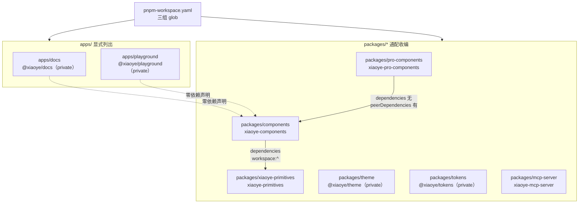
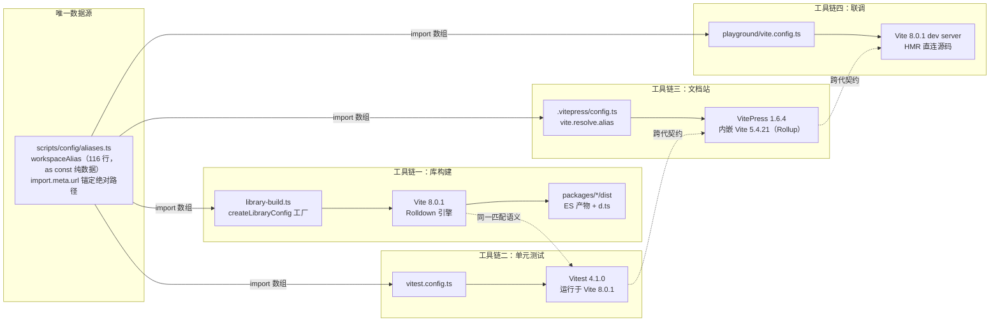
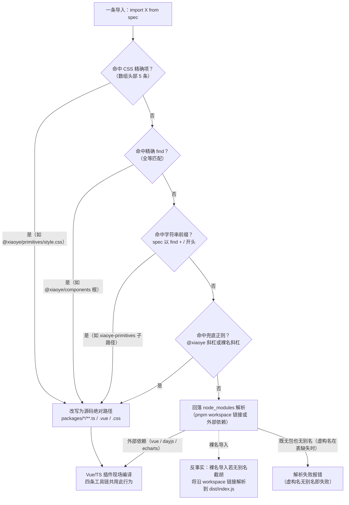

# 2-01 · workspace 组织与一套 alias 服务四条工具链

> 上一篇（1-02）我们回答了"为什么拆成六个包"。这一篇回答一个更工程化的问题：**四条工具链——库构建、单元测试、文档站、本地联调——各自带着一套独立的模块解析器，凭什么共享同一份路径映射还能不漂移？**
>
> 先给结论：靠的不是"大家都写了一遍一样的配置"，而是三个更硬的东西——一份**纯数据**的别名数组（`scripts/config/aliases.ts`，全文 116 行）、一个**跨两代引擎保持稳定**的解析契约（`{ find, replacement }`）、以及一道**让双写必然暴露**的类型检查闸门（`pnpm typecheck`）。下面逐层拆开。

## 一、三组 glob 与两个"零依赖"应用

workspace 的入口只有五行：

```yaml
# pnpm-workspace.yaml（全文，1-4 行）
packages:
  - "apps/docs"
  - "apps/playground"
  - "packages/*"
```

三组 glob：两个应用（`apps/docs`、`apps/playground`）显式列出，包层用 `packages/*` 兜底。注意 `packages/*` 把 `mcp-server`、`tokens`、`theme` 这些非组件包也一并收进了 workspace——它们要么是 private 包，要么是独立发布的工具包（`xiaoye-mcp-server`），但都共享同一套 pnpm 工作区协议（`workspace:^`）。根 `package.json` 里 `"packageManager": "pnpm@10.30.3"` 把工作区语义锁死在 pnpm 10，`workspace:^` 协议、按需链接、`--filter` 都依赖它。

这个拓扑值得画出来：



图里有一条虚线关系是本篇的关键伏笔：**`apps/docs` 和 `apps/playground` 的 `package.json` 里没有任何一条对库包的依赖声明**。`apps/docs/package.json` 的 devDependencies 只有 `markdown-it-container` 一项；`apps/playground/package.json` 甚至连依赖段都没有。它们对 `xiaoye-components` 的每一次 import，都只能靠别名表活着——alias 对这两个应用不是"优化"，是**唯一的解析来源**。这一点我们第四节展开。

## 二、aliases.ts（上）：排序是这套映射的生命线

先上文件的前半部分，第 1 到 82 行：

```ts
// scripts/config/aliases.ts（第 1-82 行）
import { fileURLToPath, URL } from "node:url";

const resolveWorkspacePath = (target: string) => fileURLToPath(new URL(target, import.meta.url));

export const workspaceAlias = [
  // CSS files (must come before the general @xiaoye/primitives alias)
  {
    find: "@xiaoye/primitives/style.css",
    replacement: resolveWorkspacePath("../../packages/xiaoye-primitives/style.css")
  },
  {
    find: "xiaoye-primitives/style.css",
    replacement: resolveWorkspacePath("../../packages/xiaoye-primitives/style.css")
  },
  // @xiaoye/pro-components
  {
    find: "@xiaoye/pro-components/style.css",
    replacement: resolveWorkspacePath("../../packages/pro-components/style.css")
  },
  {
    find: "xiaoye-pro-components/style.css",
    replacement: resolveWorkspacePath("../../packages/pro-components/style.css")
  },
  {
    find: "xiaoye-components/style.css",
    replacement: resolveWorkspacePath("../../packages/components/style.css")
  },
  // @xiaoye/components (exact matches before regex)
  {
    find: "@xiaoye/components/icon",
    replacement: resolveWorkspacePath("../../packages/components/icon/index.ts")
  },
  {
    find: "@xiaoye/components/badge",
    replacement: resolveWorkspacePath("../../packages/components/badge/index.ts")
  },
  {
    find: "@xiaoye/components/image",
    replacement: resolveWorkspacePath("../../packages/components/image/index.ts")
  },
  {
    find: "@xiaoye/components/input",
    replacement: resolveWorkspacePath("../../packages/components/input/index.ts")
  },
  {
    find: "@xiaoye/components/image/src/image-viewer.vue",
    replacement: resolveWorkspacePath("../../packages/components/image/src/image-viewer.vue")
  },
  {
    find: "@xiaoye/components",
    replacement: resolveWorkspacePath("../../packages/components/index.ts")
  },
  {
    find: "@xiaoye/components/config-provider",
    replacement: resolveWorkspacePath("../../packages/components/config-provider/index.ts")
  },
  {
    find: "@xiaoye/components/src/composables",
    replacement: resolveWorkspacePath("../../packages/components/src/composables/index.ts")
  },
  {
    find: /^@xiaoye\/components\/(.*)$/,
    replacement: `${resolveWorkspacePath("../../packages/components/")}/$1`
  },
  // @xiaoye/pro-components
  {
    find: "@xiaoye/pro-components",
    replacement: resolveWorkspacePath("../../packages/pro-components/index.ts")
  },
  {
    find: /^@xiaoye\/pro-components\/(.*)$/,
    replacement: `${resolveWorkspacePath("../../packages/pro-components/")}/$1`
  },
  // @xiaoye/primitives (general, comes AFTER css-specific aliases)
  {
    find: "@xiaoye/primitives",
    replacement: resolveWorkspacePath("../../packages/xiaoye-primitives/index.ts")
  },
  {
    find: /^@xiaoye\/primitives\/(.*)$/,
    replacement: `${resolveWorkspacePath("../../packages/xiaoye-primitives/")}/$1`
  },
  // ……第 83 行起接下文（@xiaoye/theme、裸名导入、utils、tokens）
];
```

（末行 `];` 为节选收拢标记，非原文内容。）

### 2.1 第 3 行：一切共享的前提是"绝对路径自锚定"

`resolveWorkspacePath` 用 `new URL(target, import.meta.url)` 把相对路径锚定在 **aliases.ts 自己的文件位置**上，再经 `fileURLToPath` 转成绝对路径。这一行看似平淡，实则是"一份映射服务四个消费方"能成立的第一根支柱：四个消费方的配置文件分散在三个不同目录——`vitest.config.ts` 在仓库根、`apps/docs/.vitepress/config.ts` 在两层深的文档目录、`apps/playground/vite.config.ts` 在应用目录、三个 `vite.*.config.ts` 在仓库根。如果别名表里写相对路径，每个消费方就得按自己的 cwd 重新解释一遍，"共享"立刻变成"各抄一份"。绝对路径在模块加载时就凝固成唯一值，与谁 import 它、从哪里启动进程都无关。

### 2.2 第 6 行注释：CSS 为什么必须排在 JS 前面

第 6 行的注释写着 `// CSS files (must come before the general @xiaoye/primitives alias)`。要理解这句话的分量，得先看 Vite 家族对字符串 `find` 的匹配语义。我把当前安装的两代 Vite 产物里这段实现原样捞了出来（Vite 8.0.1 的 `dist/node/chunks/node.js` 与 Vite 5.4.21 的 `dist/node/chunks/dep-BK3b2jBa.js`）：

```js
// 两代 Vite（8.0.1 与 5.4.21）中 alias 匹配函数的核心逻辑（自 dist 产物还原）
const matches = (pattern, importee) => {
  if (pattern instanceof RegExp) {
    return pattern.test(importee);
  }
  if (importee.length < pattern.length) {
    return false;
  }
  if (importee === pattern) return true;
  // 字符串 find 是"全等或前缀匹配"：
  return importee.startsWith(pattern + "/");
};
```

**字符串 `find` 不只是全等匹配，还会前缀匹配 `find + "/"` 开头的导入。** 也就是说，排在后面的 `find: "@xiaoye/primitives"` 这一项，本来会吃掉 `@xiaoye/primitives/style.css` 的导入，把它错误地改写成 `…/xiaoye-primitives/index.ts/style.css`——一个必然解析失败的路径。所以第 7-14 行把 `@xiaoye/primitives/style.css` 与裸名 `xiaoye-primitives/style.css` 两条 CSS 精确项放在整个数组的**最前面**，抢在通用项之前完成改写。

这不是死防御。活例子就在仓库里：`packages/theme/index.css` 的第 1 行是：

```css
/* packages/theme/index.css 第 1 行 */
@import "@xiaoye/primitives/style.css";
```

Vite 的 CSS 插件解析 `@import` 时走的正是同一套 alias 管线。没有第 7-10 行这条 CSS 精确项，`packages/theme/index.css` 在四条工具链里任何一条上都会当场炸掉。

### 2.3 第 28 行注释：精确先于正则

第 28 行注释 `// @xiaoye/components (exact matches before regex)` 点出第二条排序规则。正则项 `find: /^@xiaoye\/components\/(.*)$/` 会匹配**一切** `@xiaoye/components/xxx` 子路径导入。如果它排在精确项前面，`@xiaoye/components/icon` 就会被泛化成 `packages/components/icon` 目录路径——运气好时 Vite 会靠目录解析补全 `index.ts`，运气差时（比如第 45-48 行的 `@xiaoye/components/image/src/image-viewer.vue` 这种深层 `.vue` 文件）就完全对不上。精确项在前，正则兜底在后，保证特殊路径获得确定性改写。

顺着这条规则细读，还能发现一个**当前无害的排序暗雷**：根精确项 `@xiaoye/components`（第 50-52 行）排在了 `@xiaoye/components/config-provider`（第 54-56 行）与 `@xiaoye/components/src/composables`（第 58-60 行）**之前**。按上面核实过的前缀匹配语义，根项会把 `@xiaoye/components/config-provider` 抢先改写成 `…/packages/components/index.ts/config-provider`，让后面两个精确项永远轮不到。那为什么没出事？因为我全仓检索过：`@xiaoye/components/` 子路径导入在源码、测试、文档示例中**零使用**（`tsconfig/base.json` 的 paths 里有映射，但没有任何 `.ts`/`.vue` 文件真的这么 import）。这是一颗被"无人踩踏"掩护着的死雷——若将来有人开始用这个子路径，得先把精确项挪到根项之前。专栏把它记录在案，也算 alias 表审计的一个实证样本。

## 三、aliases.ts（下）：双形式覆盖，虚构名与真实名的和解

文件后半部分，第 83 行到 116 行：

```ts
// scripts/config/aliases.ts（第 83-116 行，紧接上文）
  // @xiaoye/theme
  {
    find: "@xiaoye/theme",
    replacement: resolveWorkspacePath("../../packages/theme/index.css")
  },
  // xiaoye-primitives (bare import)
  {
    find: "xiaoye-primitives",
    replacement: resolveWorkspacePath("../../packages/xiaoye-primitives/index.ts")
  },
  // @xiaoye/utils
  {
    find: "@xiaoye/utils",
    replacement: resolveWorkspacePath("../../packages/xiaoye-primitives/src/utils/index.ts")
  },
  // @xiaoye/tokens
  {
    find: "@xiaoye/tokens",
    replacement: resolveWorkspacePath("../../packages/tokens/src/index.ts")
  },
  // xiaoye-components (bare import)
  {
    find: "xiaoye-components",
    replacement: resolveWorkspacePath("../../packages/components/index.ts")
  },
  {
    find: /^xiaoye-components\/(.*)$/,
    replacement: `${resolveWorkspacePath("../../packages/components/")}/$1`
  },
  {
    find: "xiaoye-pro-components",
    replacement: resolveWorkspacePath("../../packages/pro-components/index.ts")
  }
] as const;
```

### 3.1 两套命名，两种命运

这张表里藏着本仓库最容易误解的一个事实：**`@xiaoye/components` 和 `@xiaoye/pro-components` 在 npm 与 node_modules 里都不存在**。我核实过：全部工作区包名是 `xiaoye-components`、`xiaoye-pro-components`、`xiaoye-primitives`、`@xiaoye/theme`、`@xiaoye/tokens`、`@xiaoye/docs`、`@xiaoye/playground`、`xiaoye-mcp-server`——没有 `@xiaoye/components` 这个包，根 `node_modules` 下连 `@xiaoye` 目录都不存在。测试和文档示例里写的 `import { XyButton } from "@xiaoye/components"`（例如 `packages/components/button/__tests__/button.spec.ts:4`），若没有别名表，是**必然解析失败**的导入。

而裸名形式完全不同。`xiaoye-primitives`、`xiaoye-components` 是真实包名，pnpm 已经按 `workspace:^` 建好了符号链接（`packages/pro-components/node_modules/xiaoye-components -> ../../components`、`packages/components/node_modules/xiaoye-primitives -> ../../xiaoye-primitives`，均在安装目录核实）。但链接指向的包目录，其 `package.json` 的 `main`/`module` 都写着 `./dist/index.js`——**没有别名表时，裸名导入会解析到构建产物 dist，而 dist 需要先跑一次 `pnpm build:lib` 才存在**。

别名表对两种形式做了同一件事：把解析点从 dist 劫持回源码。`find: "xiaoye-primitives"` 指向 `packages/xiaoye-primitives/index.ts`，`find: "xiaoye-components"` 指向 `packages/components/index.ts`。这就是"改一行组件源码、四条工具链全部即时生效"的机制根源：dev 服务器、测试进程、文档站、playground 拿到的都是 `.ts`/`.vue` 源文件，由各自的 Vue 插件现场编译，**开发与测试从此不需要"先构建"这个前置步骤**。

双形式并存也就此有了解释：源码层（组件互相引用）统一用裸名——全仓 `from "xiaoye-primitives"` 的引用遍布每个组件的 `index.ts` 与 `src/*.vue`；测试与文档示例用 `@xiaoye/*` 限定名。两种书写习惯各有场景，别名表把它们**都**映射到同一份源码，任何一种形式都不可能解析到过期的 dist。

### 3.2 裸名子路径：防御性兜底

`^xiaoye-components\/(.*)$` 这条正则（第 109-111 行）要单独说明。我检索了全仓：`from "xiaoye-components/xxx"` 形式的子路径导入在非文档 `.ts`/`.vue` 源码中**零出现**——文档与测试一律走包根导入。这条正则是纯防御：万一有用户侧写法（或未来仓库内部重构）使用了裸名子路径，解析仍会落到源码目录而不是报错。同理，第 94-97 行的 `@xiaoye/utils` 与第 99-102 行的 `@xiaoye/tokens` 在当前源码里也没有活跃调用方，但 `scripts/prepare-package.mjs` 第 361 行在产物改写阶段专门处理了 `@xiaoye/utils` 说明符——别名名空间会泄漏进构建产物，后处理管线必须认识它。防御性配置的价值要等出事那天才能验证，而审计它的正确姿势是像上面这样定期盘点"哪些别名还有活人用"。

### 3.3 CSS 链条实证：一条 `@import` 的完整旅程

把 CSS 别名的消费链完整串一遍，四个文件、四条工具链各就各位：

```css
/* packages/xiaoye-primitives/style.css（1-4 行，reset + tokens + base 聚合） */
@import "./src/theme/reset.css";
@import "./src/theme/tokens.css";
@import "./src/theme/base.css";
@import "./src/theme/shared/display-value.css";

/* packages/components/style.css（第 1 行，聚合并转发 theme） */
@import "../theme/index.css";
```

```ts
// apps/playground/src/main.ts（全文 5 行）
import { createApp } from "vue";
import XiaoyeComponents from "xiaoye-components";
import "xiaoye-components/style.css";
import App from "./App.vue";

createApp(App).use(XiaoyeComponents).mount("#app");
```

```ts
// apps/docs/.vitepress/theme/index.ts（第 14-15 行）
import "xiaoye-components/style.css";
import "xiaoye-pro-components/style.css";
```

playground 的 `main.ts:3` 走的是第 25-27 行的 `xiaoye-components/style.css` 裸名 CSS 精确项；文档主题的第 14-15 行同时命中裸名 CSS 项与第 21-23 行的 `xiaoye-pro-components/style.css`；而 `components/style.css` 内部转发 `../theme/index.css` 时，theme 又在第 1 行 `@import "@xiaoye/primitives/style.css"`——正是 2.2 节那条必须排在最前面的 CSS 别名。一条样式导入链，把数组头部三条 CSS 精确项全部用满，且全部指向源码 CSS 而非 dist 产物。

## 四、根 scripts 全景：四条工具链在命令层的分野

alias 表是数据，工具链是行为。行为入口全部集中在根 `package.json` 的 scripts 段：

```jsonc
// package.json（第 7-38 行，scripts 全景）
"scripts": {
  "dev": "pnpm dev:docs",
  "dev:docs": "pnpm --filter @xiaoye/docs docs:dev",
  "dev:playground": "pnpm --filter @xiaoye/playground dev",
  "check:components": "node scripts/check-components.mjs",
  "check:tokens": "node scripts/check-generated.mjs --name tokens --generate \"node scripts/generate-tokens.mjs\" --path packages/tokens/src",
  "check:llms": "node scripts/check-generated.mjs --name llms --generate \"node scripts/generate-llm-files.mjs\" --path llms-full.txt --ignore \"^> 自动生成于\"",
  "generate:tokens": "node scripts/generate-tokens.mjs",
  "check:pro-components": "node scripts/check-pro-components.mjs",
  "lint": "pnpm check:tokens && pnpm check:llms && pnpm check:components && pnpm check:pro-components && eslint .",
  "typecheck": "pnpm run typecheck:packages && pnpm run typecheck:types",
  "typecheck:packages": "vue-tsc -p tsconfig/packages.json --noEmit && vue-tsc -p tsconfig/apps.json --noEmit",
  "typecheck:types": "vue-tsc -p tests/types/tsconfig.json --noEmit",
  "test": "vitest run",
  "test:watch": "vitest",
  "test:e2e:admin": "playwright test tests/e2e/admin-flow.spec.ts",
  "build": "pnpm run build:lib && pnpm run build:docs && pnpm run build:playground",
  "build:lib": "pnpm run build:primitives && pnpm run build:lib:base && pnpm run build:lib:pro",
  "build:primitives": "vite build -c vite.primitives.config.ts",
  "build:lib:base": "vite build -c vite.config.ts && node scripts/prepare-package.mjs base",
  "build:lib:pro": "vite build -c vite.pro.config.ts && node scripts/prepare-package.mjs pro",
  "build:docs": "pnpm --filter @xiaoye/docs docs:build",
  "build:playground": "pnpm --filter @xiaoye/playground build",
  "preview:docs": "pnpm --filter @xiaoye/docs docs:preview",
  "changeset": "changeset",
  "version-packages": "changeset version",
  "release": "changeset publish",
  "clean": "rimraf packages/xiaoye-primitives/dist packages/xiaoye-components/dist packages/xiaoye-pro-components/dist apps/docs/.vitepress/dist apps/playground/dist",
  "generate:llm": "node scripts/generate-llm-files.mjs",
  "test:e2e": "playwright test",
  "audit:visual": "node scripts/visual-audit.mjs"
},
```

四条工具链对应的命令一目了然：构建走 `build:lib`（三个 vite 配置 + `prepare-package.mjs` 后处理），测试走 `test`（vitest），文档走 `dev:docs`/`build:docs`（VitePress），联调走 `dev:playground`（vite dev）。注意 `build:lib` 是三段串行——`build:primitives`、`build:lib:base`、`build:lib:pro`——依赖方向（primitives → components → pro-components）决定了构建顺序不可打乱，这个话题留给 2-02。

这里先看 `lint` 那一行：**四道一致性守卫前置在 `eslint .` 之前**——`check:tokens`、`check:llms`、`check:components`、`check:pro-components`。这套"生成物守卫"与 alias 表解决的是同一类问题的两个侧面：守卫保证"生成物与事实源一致"（令牌、llms 文档、组件清单），alias 保证"四条工具链的解析结果一致"。一个是内容不漂移，一个是路径不漂移，合起来才是 monorepo 的一致性地基。这也是为什么 alias 表自己不需要专门守卫——它的漂移会被第五节的 typecheck 闸门拦住，后文详述。

## 五、四个消费方：同一份数据，四种注入姿势

### 5.1 构建：createLibraryConfig 把 alias 藏进工厂

三个库构建配置自身薄得惊人，以基础组件库为例：

```ts
// vite.config.ts（全文 17 行）
import { fileURLToPath, URL } from "node:url";
import { createLibraryConfig } from "./scripts/config/library-build";

const resolvePath = (target: string) => fileURLToPath(new URL(target, import.meta.url));

export default createLibraryConfig({
  entry: resolvePath("./packages/components/index.ts"),
  name: "XiaoyeComponents",
  outDir: resolvePath("./packages/components/dist"),
  dtsInclude: [
    "packages/components/**/*.ts",
    "packages/components/**/*.vue",
    "packages/xiaoye-primitives/src/composables/**/*.ts",
    "packages/xiaoye-primitives/src/utils/**/*.ts",
    "packages/tokens/**/*.ts"
  ]
});
```

零自有 resolve 配置——解析全部来自工厂。工厂在 `scripts/config/library-build.ts`，头部五行就是依赖清单：

```ts
// scripts/config/library-build.ts（第 1-5 行）
import path from "node:path";
import vue from "@vitejs/plugin-vue";
import dts from "vite-plugin-dts";
import { defineConfig } from "vite";
import { workspaceAlias } from "./aliases";
```

工厂函数本体把 alias 注入 `resolve.alias`：

```ts
// scripts/config/library-build.ts（第 37-84 行）
export function createLibraryConfig(options: {
  entry: string;
  name: string;
  outDir: string;
  dtsInclude: string[];
  entryRoot?: string;
  extraExternal?: (string | RegExp)[];
}) {
  return defineConfig({
    plugins: [
      vue(),
      dts({
        root: path.resolve("."),
        entryRoot: path.resolve(options.entryRoot ?? "packages"),
        tsconfigPath: path.resolve("tsconfig.build.json"),
        include: options.dtsInclude,
        exclude: dtsExclude,
        outDir: path.resolve(options.outDir, "types"),
        insertTypesEntry: true,
        staticImport: true,
        copyDtsFiles: false,
        strictOutput: true,
        pathsToAliases: false
      })
    ],
    resolve: {
      alias: workspaceAlias
    },
    build: {
      lib: {
        entry: options.entry,
        name: options.name,
        fileName: "index",
        formats: ["es"]
      },
      outDir: options.outDir,
      emptyOutDir: true,
      rollupOptions: {
        external: [...libraryExternal, ...(options.extraExternal ?? [])],
        output: {
          globals: {
            vue: "Vue"
          }
        }
      }
    }
  });
}
```

第 62-64 行的 `resolve: { alias: workspaceAlias }` 就是全部秘密。顺带留意第 59 行 `pathsToAliases: false`——vite-plugin-dts 不会把 tsconfig 的 paths 转成别名，类型产物的说明符改写由 `prepare-package.mjs` 在构建后处理（2-03 的主角）。构建期跑在 Vite 8.0.1 上，其内部引擎是 Rolldown（`node_modules/vite/package.json` 的依赖表里赫然写着 `"rolldown": "1.0.0-rc.10"`）——**库构建的解析器已经是 Rolldown，不再是传统 Rollup**。一个 2015 年代语感的"路径映射数组"，如今喂的是新一代打包器。

### 5.2 测试：vitest 全文只有一处需要解释

```ts
// vitest.config.ts（全文 21 行）
import { defineConfig } from "vitest/config";
import vue from "@vitejs/plugin-vue";
import { workspaceAlias } from "./scripts/config/aliases";

export default defineConfig({
  plugins: [vue()],
  resolve: {
    alias: workspaceAlias
  },
  test: {
    environment: "jsdom",
    globals: true,
    setupFiles: ["./vitest.setup.ts"],
    exclude: [
      "tests/e2e/**",
      "node_modules/**",
      "**/node_modules/**",
      "dist/**"
    ]
  }
});
```

Vitest 不是独立的测试运行器——它是构建在 Vite 之上的测试框架，**模块解析、转换、图遍历全部复用 Vite 的管线**。所以 `resolve.alias` 注入后，测试进程里 `@xiaoye/components` 与 `xiaoye-primitives` 的解析行为和库构建一模一样。版本关系我也核实过：vitest 4.1.0 声明的 peer 是 `vite: "^6.0.0 || ^7.0.0 || ^8.0.0-0"`，本仓库实际解析到工作区的 Vite 8.0.1（vitest 无嵌套 vite 安装）——测试与构建共用同一个 Vite 实例版本。

### 5.3 文档：VitePress 的 vite 通道

```ts
// apps/docs/.vitepress/config.ts（第 1-11 行，头部导入段）
import { defineConfig } from "vitepress";
import { componentDocsSidebarGroups } from "../../../packages/components/component-manifest";
import {
  proComponentDocsSidebarGroups,
  proComponentExampleSidebarGroups
} from "../../../packages/pro-components/component-manifest";
import { workspaceAlias } from "../../../scripts/config/aliases";
import { demoMdPlugin } from "./plugins/demo";
import { demoSourcePlugin } from "./plugins/demo-source";
import { markdownTransform } from "./plugins/markdown-transform";
import { tableWrapperMdPlugin } from "./plugins/table-wrapper";
```

```ts
// apps/docs/.vitepress/config.ts（第 149-157 行，vite 注入段）
  vite: {
    plugins: [markdownTransform(), demoSourcePlugin()],
    resolve: {
      alias: workspaceAlias
    },
    build: {
      // VitePress 1.6 依赖 cssCodeSplit:false 合并 CSS 并注入每个页面的 head；
      // 覆盖为 true 会导致构建产物全部样式丢失（dev 不受影响，故此前未暴露）。
      chunkSizeWarningLimit: 700,
```

VitePress 把用户配置的 `vite` 字段合并进自己的 Vite 配置，`resolve.alias` 就此生效——文档站里的每个 `.vue` 示例、每一条 `import "xiaoye-components/style.css"`（`apps/docs/.vitepress/theme/index.ts:14-15`）都由这张表解析。这里有个本篇最有意思的版本事实：**VitePress 1.6.4 锁定 `vite: "^5.4.14"`，实际安装的是 Vite 5.4.21——文档站的解析器还活在 Rollup 引擎时代，而构建、测试、联调已经上了 Rolldown**。同一份数组横跨两代引擎，这正是下一节的主题。

### 5.4 联调：十行配置的 playground

```ts
// apps/playground/vite.config.ts（全文 10 行）
import { defineConfig } from "vite";
import vue from "@vitejs/plugin-vue";
import { workspaceAlias } from "../../scripts/config/aliases";

export default defineConfig({
  plugins: [vue()],
  resolve: {
    alias: workspaceAlias
  }
});
```

一个标准的 Vite 应用配置，没有任何 build 选项——playground 是"源码级联调"试验田：`import XiaoyeComponents from "xiaoye-components"` 命中别名表指向 `packages/components/index.ts` 源文件，改一行组件源码，Vite 的模块图失效、HMR 即时推送。2-08 将专门拆这条热更链路，这里只强调解析层的事实：playground 对 `xiaoye-components` **没有 workspace 依赖声明**（`apps/playground/package.json` 无依赖段），别名表是它唯一的解析来源——前面第一节埋的伏笔在此兑现。

### 5.5 四消费方架构总览



四个消费方，三种注入形态（工厂函数内注入 / 根配置直注 / VitePress 的 `vite` 通道 / 应用配置直注），两代引擎——但数组只有一份。

## 六、深度：为什么一套映射能同时喂饱四个解析器

把前面的证据收拢成五个论点，这是本篇核心问题的正面回答。

**论点一：契约比实现长寿。** 四个消费方注入的都是 `resolve.alias` 字段，它的类型是 `AliasOptions = readonly Alias[] | { [find: string]: string }`——这条类型签名我在 Vite 8.0.1 与 Vite 5.4.21 的 `index.d.ts` 里分别核实过，逐字相同（`readonly Alias[]` 意味着 aliases.ts 末尾的 `as const` 在两代引擎下都类型合法）。`Alias` 契约源自 `@rollup/plugin-alias` 的 `{ find, replacement }` 二元组，Vite 从早期版本一路继承，Rolldown 化的 Vite 8 为兼容存量生态也原样保留。**monorepo 里"共享配置"最怕的是消费方各自的配置格式演进不同步，而这里四个消费方共享的不是某个版本的配置文件格式，而是一个八年未变的数据契约。** aliases.ts 选择做"纯数据"而不是"返回配置的函数"，正是把自己钉在契约的最稳定一侧。

**论点二：匹配语义在引擎换代时被刻意保留。** 引擎从 Rollup 换成 Rolldown 是 Vite 历史上最激进的重构，但第 2.2 节贴出的那段 `matches` 函数——字符串全等或 `find + "/"` 前缀匹配、正则 `test`——在两代引擎的 dist 产物里逐字符一致。CSS 先于 JS、精确先于正则这两条排序规则因此**不需要为任何一条工具链单独校准**：排序在数组里写一次，四处解析同时正确。假如四个消费方有各自的匹配实现（比如 vitest 用自己的、vitepress 用另一份），排序规则就得按最弱的那个语义校准，别名表会迅速膨胀成一堆带注释的特例。

**论点三：解析时机保证了"指向源码"不破坏"声明依赖"。** alias 改写发生在 Vite 解析管线的最前端（resolve 插件的 import 分析阶段），**先于** node_modules 查找。所以裸名导入 `xiaoye-primitives` 根本轮不到 pnpm 符号链接及其 `main: ./dist/index.js`——别名先行改写为源码绝对路径。反过来，这也解释了为什么别名表**不需要**覆盖所有包：`vue`、`dayjs`、`echarts` 这些真外部依赖不在表里，正常走 node_modules；别名表只收编"需要从 dist 劫持回 src 的 workspace 包"与"node_modules 里根本不存在的虚构名"。映射范围的大小是由解析时机决定的，不是拍脑袋。

**论点四：绝对路径让共享与进程环境彻底解耦。** 四条工具链的启动方式差异极大：`vitest run` 从仓库根启动、`vitepress dev .` 在 `apps/docs` 下以 `.` 为根启动、playground 的 vite 在 `apps/playground` 下启动、CI 里还可能是不同的 cwd。aliases.ts 用 `import.meta.url` 把全部 replacement 凝固为**模块加载时的绝对路径**，与进程 cwd、启动目录、配置文件位置三者全部无关。这不是风格偏好，是共享成立的技术前提——任何一条改成相对路径，四条工具链中至少一条会在某个目录下解析错位。

**论点五：共享的是引用，不是拷贝。** 四个消费方都是 `import { workspaceAlias }` 拿到同一个数组引用，且没有任何一方原地修改它——构建侧经 `defineConfig` 包装，VitePress 侧经 `mergeConfig` 深合并出自己的配置副本，vitest 与 playground 直接透传。`as const`（第 116 行）在类型层把数组钉成只读元组，而 Vite 两代引擎的 `AliasOptions` 都接受 `readonly Alias[]`（两个版本的 `index.d.ts` 均核实）。配置共享最常见的翻车方式，是某一方注入前顺手改了一项，让其余三方的行为随启动顺序漂移；纯数据加只读类型从根上封死了这条路。

把 116 行用五个论点重读一遍，第二次引用文件的一头一尾——头部（第 5-14 行）与尾部（第 103-111 行）：

```ts
// scripts/config/aliases.ts（第 5-14 行，第二次引用）
export const workspaceAlias = [
  // CSS files (must come before the general @xiaoye/primitives alias)
  {
    find: "@xiaoye/primitives/style.css",
    replacement: resolveWorkspacePath("../../packages/xiaoye-primitives/style.css")
  },
  {
    find: "xiaoye-primitives/style.css",
    replacement: resolveWorkspacePath("../../packages/xiaoye-primitives/style.css")
  },
```

```ts
// scripts/config/aliases.ts（第 103-111 行，第二次引用）
  // xiaoye-components (bare import)
  {
    find: "xiaoye-components",
    replacement: resolveWorkspacePath("../../packages/components/index.ts")
  },
  {
    find: /^xiaoye-components\/(.*)$/,
    replacement: `${resolveWorkspacePath("../../packages/components/")}/$1`
  },
```

数组的第一个成员是 CSS 精确项（排序规则的起点），倒数第二个成员是裸名根项加子路径正则（双形式覆盖的终点）——一头一尾，恰好把 2.2 节的"CSS 先于 JS"与 3.1 节的"虚构名与裸名并存"同时钉在了这张表的结构上。一张表的物理形状，就是它全部设计决策的化石。

把五个论点画成一次导入的解析决策流，就是别名表在单个 import 上的完整行为：



## 七、第五个消费方：tsconfig paths 与"不漂移"的真正闸门

必须诚实：**"一套映射"只统一了打包/开发侧的四条工具链；类型解析侧存在第五个消费方，而且它是手工维护的平行映射。** `tsconfig/base.json` 里有一整段 paths：

```jsonc
// tsconfig/base.json（第 1-36 行，paths 段与 aliases.ts 一一对应）
{
  "compilerOptions": {
    "target": "ES2022",
    "useDefineForClassFields": true,
    "module": "ESNext",
    "moduleResolution": "Bundler",
    "strict": true,
    "jsx": "preserve",
    "sourceMap": true,
    "resolveJsonModule": true,
    "isolatedModules": true,
    "esModuleInterop": true,
    "allowSyntheticDefaultImports": true,
    "lib": ["ES2022", "DOM", "DOM.Iterable"],
    "skipLibCheck": true,
    "baseUrl": "..",
    "types": ["node"],
    "paths": {
      "@xiaoye/components": ["packages/components/index.ts"],
      "@xiaoye/components/*": ["packages/components/*"],
      "@xiaoye/pro-components/style.css": ["packages/pro-components/style.css"],
      "@xiaoye/pro-components": ["packages/pro-components/index.ts"],
      "@xiaoye/pro-components/*": ["packages/pro-components/*"],
      "@xiaoye/primitives": ["packages/xiaoye-primitives/index.ts"],
      "xiaoye-primitives": ["packages/xiaoye-primitives/index.ts"],
      "xiaoye-primitives/*": ["packages/xiaoye-primitives/*"],
      "@xiaoye/utils": ["packages/xiaoye-primitives/src/utils/index.ts"],
      "@xiaoye/theme": ["packages/theme/index.css"],
      "@xiaoye/tokens": ["packages/tokens/src/index.ts"],
      "xiaoye-components/style.css": ["packages/components/style.css"],
      "xiaoye-components": ["packages/components/index.ts"],
      "xiaoye-pro-components/style.css": ["packages/pro-components/style.css"],
      "xiaoye-pro-components": ["packages/pro-components/index.ts"]
    }
  }
}
```

为什么 TS 不直接吃 aliases.ts？因为 `vue-tsc` 的类型解析读的是 tsconfig 的 paths，不认 Vite 的 alias 数组——两套体系各有各的"方言"，这是 TypeScript 生态的现实，不是本仓库的偷懒。于是"双写漂移"成为真实的架构风险：在 aliases.ts 加一条新映射而忘了同步 paths，运行时解析正常、类型检查立刻满屏"找不到模块"——反过来亦然。

这正是"不漂移"的第三根支柱：**`pnpm typecheck` 是强制闸门**。根 scripts 里 `typecheck:packages` 跑 `tsconfig/packages.json`（覆盖 `packages/**`、`scripts/**` 与根 `vite.config.ts`）与 `tsconfig/apps.json`（覆盖 `apps/**` 文档与联调两侧源码）两个项目，`typecheck:types` 跑 `tests/types` 夹具。任何一侧的映射表落后于另一侧，下一步 import 就会类型报错——**漂移不是被"约定"避免的，是被"编译错误"避免的**。`tsconfig.build.json`（`dts` 插件读取的构建侧 tsconfig，`pathsToAliases: false` 明确关闭了自动转换）也继承这份 paths，类型产物的说明符因此与源码书写习惯一致，再由 `prepare-package.mjs` 做发布形态改写。

这套"生成物必须可验证"的思路同样体现在 lint 链上。回看第五节引用的 `package.json:16`：`lint` 在 `eslint .` 之前串了 `check:tokens`、`check:llms`、`check:components`、`check:pro-components` 四道守卫，全部是"重新生成一遍、和仓库现状比对"的幂等校验。alias 表 + paths 双写虽是全仓唯一需要手工同步的映射，但它两侧都有自动化兜底：类型侧有 typecheck 闸门，解析侧有四条工具链的日常运行兜底（任何一侧解析失败会在 dev/test 当场爆炸，而不是潜伏到发布）。

## 八、依赖声明对照：peer 的归 peer，alias 的归 alias

还有一个常见误解要拆：有人会以为"monorepo 里互相引用靠 alias 就够了，依赖声明随便写写"。本仓库的声明方式给出了标准答案。增强层对基础层是 peer：

```jsonc
// packages/pro-components/package.json（第 44-53 行）
"peerDependencies": {
  "vue": "^3.5.0",
  "vue-router": "^4.6.0",
  "xiaoye-components": "workspace:^"
},
"peerDependenciesMeta": {
  "vue-router": {
    "optional": true
  }
},
```

而基础层对基础设施层是 dependencies：

```jsonc
// packages/components/package.json（第 53-68 行的 dependencies 段）
"dependencies": {
  "@floating-ui/dom": "^1.6.13",
  "@fullcalendar/core": "^6.1.20",
  "@fullcalendar/daygrid": "^6.1.20",
  "@fullcalendar/interaction": "^6.1.20",
  "@fullcalendar/timegrid": "^6.1.20",
  "@fullcalendar/vue3": "^6.1.20",
  "@iconify/vue": "^5.0.0",
  "async-validator": "^4.2.5",
  "dayjs": "^1.11.20",
  "echarts": "^6.0.0",
  "howler": "^2.2.4",
  "vditor": "^3.11.2",
  "video.js": "^8.23.7",
  "xiaoye-primitives": "workspace:^"
}
```

语义差别是教科书级的：用户安装 `xiaoye-pro-components` 时必须自行提供 `xiaoye-components`（peer，避免双实例、允许版本对齐），而 `xiaoye-primitives` 作为实现细节随包自动安装（dependencies）。**这套声明管的是"安装与链接"，别名表管的是"开发期解析"，两者正交**：pnpm 按 peer/dependencies 建好 node_modules 链接后，别名表在解析管线更前端把 workspace 裸名劫持回源码——链接保证发布形态正确，劫持保证开发形态高效。`vue-router` 的 optional（`peerDependenciesMeta`）则与 alias 表毫无关系：文档站里路由相关组件降级可用的逻辑在运行时判断，不靠解析器。三层机制（声明、链接、劫持）各管一段，才是这套 workspace 组织的完整图景。

顺带补一笔构建侧的呼应：`vite.pro.config.ts` 第 10 行给工厂追加了 `extraExternal: [/^xiaoye-components(?:\/.+)?$/]`——增强层构建时把基础层整体外置（peer 语义在构建产物的投影），此时 alias 表里的 `xiaoye-components` 各项在打包层面只服务于"仓库内源码互相找到"而非"打进产物"。外置与劫持不冲突：external 决定"不打包谁"，alias 决定"从哪读"。

## 九、边界、陷阱与审计清单

收尾前把本篇核实的边界事实列成清单，供维护者与读者对照实态：

1. **排序规则两条半。** "CSS 精确项先于通用 JS 项"（第 6 行注释）、"精确先于正则"（第 28 行注释）是活的；"子路径精确项必须在根精确项之前"没有注释背书，且 `@xiaoye/components/config-provider`（第 54-56 行）与 `@xiaoye/components/src/composables`（第 58-60 行）目前被根项（第 50-52 行）前缀遮蔽——因全仓零使用而无害，一旦启用子路径导入须先调序。
2. **虚构名靠表活着。** `@xiaoye/components`、`@xiaoye/pro-components` 无 npm 包、无 node_modules 链接，别名表是它们唯一的存在方式；删除任何一条对应映射，测试与文档示例立即解析失败。
3. **防御性兜底三处零使用。** `@xiaoye/components/*` 子路径精确项（icon/badge/image/input/image-viewer）、`^xiaoye-components\/(.*)$` 裸名子路径正则、`@xiaoye/utils`/`@xiaoye/tokens` 精确项，在当前源码中均无活跃调用方；其中 `@xiaoye/utils` 另有 `prepare-package.mjs:361` 的产物层处理兜底。
4. **`from "@xiaoye/components"` 的活跃用户是测试与文档示例。** 前者如 `packages/components/button/__tests__/button.spec.ts:4`，后者如 `apps/docs/examples/editor/methods.vue:3` 等 10 个示例文件；源码层则统一用裸名。
5. **两代引擎的版本锚点。** Vite 8.0.1（Rolldown 1.0.0-rc.10）服务构建/测试/联调，VitePress 1.6.4 内嵌 Vite 5.4.21（Rollup）服务文档；`{ find, replacement }` 契约与前缀匹配语义在两代间逐字一致——这是本文全部论证的物理基础。

这张清单也是一份"alias 表改动评审单"：改排序前先查 2.2 节的匹配语义；删兜底前先跑一遍全仓检索；加新映射时同步 `tsconfig/base.json` 的 paths 并跑 `pnpm typecheck`。

## 十、小结

回到标题的问题：四条工具链如何共享同一份路径映射而不漂移？答案是四层机制叠加——**数据层**，116 行 `as const` 纯数组，被四份配置以 `import` 而非复制的方式消费；**契约层**，`{ find, replacement }` 与其前缀匹配语义跨 Rollup/Rolldown 两代引擎逐字稳定，排序规则一次书写四处生效；**路径层**，`import.meta.url` 自锚定的绝对路径让共享与启动目录彻底解耦；**闸门层**，tsconfig paths 的双写由 `pnpm typecheck` 强制对齐，漂移以编译错误的形式当场暴露。工作区组织（三组 glob、零依赖应用、peer/dependencies 分层）则决定了这张表"必须存在"与"只需要这么小"。

下一篇（2-02）《构建体系：ES-only 与 createLibraryConfig 工厂》将沿着本篇 5.1 节留下的钩子往下钻：`createLibraryConfig` 里那句 `formats: ["es"]` 为什么敢只出 ES、放弃 CJS 的代价与收益如何计算；`libraryExternal` 列表与 `extraExternal` 如何把 peer 语义投影成构建产物边界；以及三个库配置文件为什么能做到"零自有构建逻辑"——工厂函数复用与本篇别名共享是同一个设计哲学的两处落点：**把会漂移的东西收敛成一份，把会变化的东西参数化成选项。**
