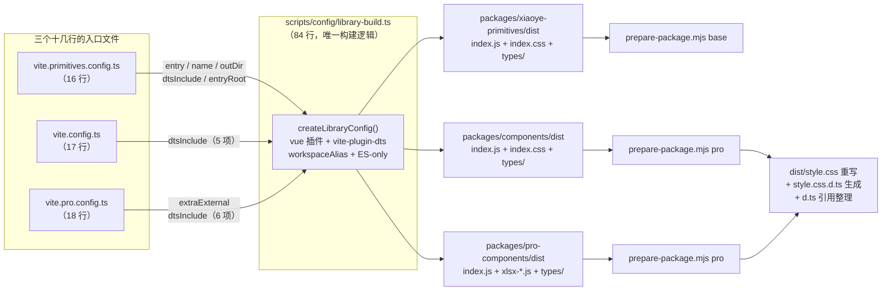
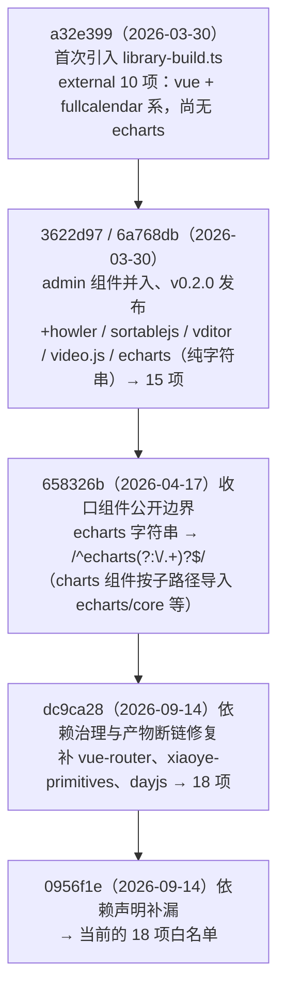
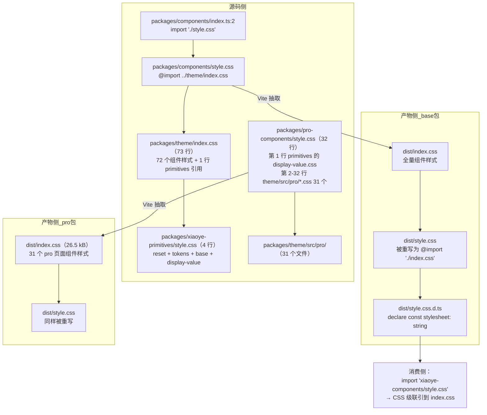

# 2-02 · 构建体系：ES-only 与 createLibraryConfig 工厂

上一篇我们把仓库的地基（xiaoye-primitives）翻了个底朝天。这一篇往上走一层，回答两个在评审和面试里被问得最多的问题：

1. **为什么这套组件库放弃了 CJS，只发 ES Module？**
2. **三个发包的包（xiaoye-primitives、xiaoye-components、xiaoye-pro-components），为什么仓库里几乎找不到"构建配置"？**

第二个问题的答案藏在一个 84 行的文件里：`scripts/config/library-build.ts`。三个包各自的 `vite.config.ts` 都是十几行的"参数表"，真正的构建逻辑全部收拢在这个工厂函数里。第一个问题的答案则散落在 `formats: ["es"]`、`package.json` 的 `exports` 字段和一段构建历史里。这篇我们逐行拆开看。

先看全景。三个包的构建流水线是同一条模板复制三遍：



注意一个容易忽略的事实：整条链上，构建逻辑只有 library-build.ts 一份，产物后处理只有 `scripts/prepare-package.mjs`（808 行，下一篇的主角）一份。三个包加起来的"自有构建配置"不到 60 行，而且全是参数，不是逻辑。这就是"零自有构建配置"的字面含义——不是没有配置，而是配置里没有逻辑。

## 一、三个入口文件：零自有构建配置的证据

空口无凭，先把三个入口全文贴出来。第一个，基础组件包：

```ts
// vite.config.ts（全文，17 行）
import { fileURLToPath, URL } from "node:url";
import { createLibraryConfig } from "./scripts/config/library-build";

const resolvePath = (target: string) => fileURLToPath(new URL(target, import.meta.url));

export default createLibraryConfig({
  entry: resolvePath("./packages/components/index.ts"),
  name: "XiaoyeComponents",
  outDir: resolvePath("./packages/components/dist"),
  dtsInclude: [
    "packages/components/**/*.ts",
    "packages/components/**/*.vue",
    "packages/xiaoye-primitives/src/composables/**/*.ts",
    "packages/xiaoye-primitives/src/utils/**/*.ts",
    "packages/tokens/**/*.ts"
  ]
});
```

第二个，基础设施包：

```ts
// vite.primitives.config.ts（全文，16 行）
import { fileURLToPath } from "node:url";
import { createLibraryConfig } from "./scripts/config/library-build";

const resolvePath = (target: string) => fileURLToPath(new URL(target, import.meta.url));

export default createLibraryConfig({
  entry: resolvePath("./packages/xiaoye-primitives/index.ts"),
  name: "XiaoyePrimitives",
  outDir: resolvePath("./packages/xiaoye-primitives/dist"),
  entryRoot: resolvePath("./packages/xiaoye-primitives"),
  dtsInclude: [
    "packages/xiaoye-primitives/index.ts",
    "packages/xiaoye-primitives/src/**/*.ts",
    "packages/tokens/**/*.ts"
  ]
});
```

第三个，增强组件包：

```ts
// vite.pro.config.ts（全文，18 行）
import { fileURLToPath, URL } from "node:url";
import { createLibraryConfig } from "./scripts/config/library-build";

const resolvePath = (target: string) => fileURLToPath(new URL(target, import.meta.url));

export default createLibraryConfig({
  entry: resolvePath("./packages/pro-components/index.ts"),
  name: "XiaoyeProComponents",
  outDir: resolvePath("./packages/pro-components/dist"),
  extraExternal: [/^xiaoye-components(?:\/.+)?$/],
  dtsInclude: [
    "packages/components/**/*.ts",
    "packages/components/**/*.vue",
    "packages/pro-components/**/*.ts",
    "packages/pro-components/**/*.vue",
    "packages/xiaoye-primitives/src/utils/**/*.ts",
  ]
});
```

三个文件的结构完全同构：把 `entry / name / outDir` 三个定位参数，加上 `dtsInclude` 这个类型收集范围，交给工厂。差异只有三处，且每一处都值得展开：

| 参数 | primitives | base | pro |
| --- | --- | --- | --- |
| `entryRoot` | 显式指定为自己 | 默认 `packages` | 默认 `packages` |
| `extraExternal` | 无 | 无 | `/^xiaoye-components(?:\/.+)?$/` |
| `dtsInclude` | 自身 + tokens | components + primitives 的 composables/utils + tokens | components + pro + primitives 的 utils（无 tokens） |

`entryRoot` 决定 d.ts 产物路径的裁剪基准：base 包不传，默认从 `packages/` 算起，所以 `packages/components/dist/types` 里出现的是 `types/components/alert/index.d.ts` 这种以 `components/` 开头的路径；primitives 把 `entryRoot` 指到自己包根，类型产物路径就从包内相对路径开始，层级更浅、更干净。

pro 的 `dtsInclude` 最反直觉——一个"增强组件包"的类型产物里为什么要收录 `packages/components/**/*.ts` 的源码类型？这个问题的答案在 `tsconfig/base.json` 的路径映射里：`xiaoye-components` 被映射到 `packages/components/index.ts` 源码。pro 源码 import `xiaoye-components` 时，dts 插件顺着映射解析到的是 TS 源文件而不是某个 dist 产物，于是这些类型必须一并编译输出，否则 pro 的 d.ts 里会出现指向不存在模块的悬空引用。这不是"顺手多包一点"，而是被 tsconfig paths 的解析策略倒逼的必要动作，本篇第五节细说。

## 二、createLibraryConfig：84 行工厂的七段解剖

现在打开工厂本身。`scripts/config/library-build.ts` 全文 84 行，我们按七段拆：

```ts
// scripts/config/library-build.ts（全文，84 行）
import path from "node:path";
import vue from "@vitejs/plugin-vue";
import dts from "vite-plugin-dts";
import { defineConfig } from "vite";
import { workspaceAlias } from "./aliases";

const dtsExclude = [
  "packages/**/__tests__/**",
  "packages/**/dist/**",
  "packages/**/*.spec.ts",
  "packages/**/*.test.ts",
  "tests/**",
  "apps/**"
];

export const libraryExternal = [
  "vue",
  "vue-router",
  "xiaoye-primitives",
  "@iconify/vue",
  "@floating-ui/dom",
  "async-validator",
  "dayjs",
  /^echarts(?:\/.+)?$/,
  "@fullcalendar/core",
  "@fullcalendar/core/locales/zh-cn",
  "@fullcalendar/daygrid",
  "@fullcalendar/interaction",
  "@fullcalendar/timegrid",
  "@fullcalendar/vue3",
  "howler",
  "sortablejs",
  "vditor",
  "video.js"
];

export function createLibraryConfig(options: {
  entry: string;
  name: string;
  outDir: string;
  dtsInclude: string[];
  entryRoot?: string;
  extraExternal?: (string | RegExp)[];
}) {
  return defineConfig({
    plugins: [
      vue(),
      dts({
        root: path.resolve("."),
        entryRoot: path.resolve(options.entryRoot ?? "packages"),
        tsconfigPath: path.resolve("tsconfig.build.json"),
        include: options.dtsInclude,
        exclude: dtsExclude,
        outDir: path.resolve(options.outDir, "types"),
        insertTypesEntry: true,
        staticImport: true,
        copyDtsFiles: false,
        strictOutput: true,
        pathsToAliases: false
      })
    ],
    resolve: {
      alias: workspaceAlias
    },
    build: {
      lib: {
        entry: options.entry,
        name: options.name,
        fileName: "index",
        formats: ["es"]
      },
      outDir: options.outDir,
      emptyOutDir: true,
      rollupOptions: {
        external: [...libraryExternal, ...(options.extraExternal ?? [])],
        output: {
          globals: {
            vue: "Vue"
          }
        }
      }
    }
  });
}
```

**第一段（第 1-5 行），依赖注入面。** 整个文件只依赖四样东西：Vue 官方 SFC 插件、vite-plugin-dts、Vite 本体的 `defineConfig`、以及 `./aliases` 里的 `workspaceAlias`。没有 postcss 配置、没有 terser、没有按环境分支——构建策略的"味道"从这里就能闻出来：极简、单格式、单出口。

**第二段（第 7-14 行），dtsExclude。** 类型编译的排除面是全仓库统一的：测试文件、spec、dist、`tests/` 与 `apps/` 一律不进类型产物。注意它和 `tsconfig.build.json` 的 exclude 高度重合——dts 插件通过 `tsconfigPath` 挂载的正是这份文件：

```jsonc
// tsconfig.build.json（全文，10 行）
{
  "extends": "./tsconfig/base.json",
  "compilerOptions": {
    "baseUrl": ".",
    "rootDir": "."
  },
  "include": ["env.d.ts", "packages/**/*.ts", "packages/**/*.d.ts", "packages/**/*.vue"],
  "exclude": ["packages/**/__tests__/**", "packages/**/dist/**", "apps/**", "tests/**"]
}
```

tsconfig 决定"编译哪些文件"，dts 插件的 exclude 再过滤一次"哪些文件允许出现在输出里"，后者用 `strictOutput: true` 兜底（见第四段）。两份配置的 exclude 列表有意保持同构，改其中一份时另一份必须跟着对齐，否则会出现"编译了但不许输出"或"没编译却被期望输出"的裂缝。

**第三段（第 16-35 行），libraryExternal——18 项外部化白名单。** 这份清单是整个构建体系里最有"治理感"的部分，第四节专门讲它的演化史。先记住两个数字：它现在恰好是 18 项（含一条 echarts 正则），以及它和三个包 `package.json` 的 `dependencies` + `peerDependencies` 高度对应——外部化的本质是"这些包我不打包，运行时由宿主提供"。

**第四段（第 37-44 行），工厂签名。** 六个参数，四个必填两个可选。必填的 `entry / name / outDir / dtsInclude` 覆盖了"打什么、叫什么、打到哪、类型收哪些"；可选的 `entryRoot / extraExternal` 是后来为多包现实打的两个补丁——`entryRoot` 服务 primitives 的类型路径裁剪，`extraExternal` 服务 pro 对 base 包的外部化。可选参数的加入时机（见 git 历史）恰好对应"单包 → 双包 → 三包"的架构演进，工厂签名本身就是一部浓缩的架构史。

**第五段（第 45-61 行），plugins——dts 的十个开关。** 这是全文件最密集的一段，逐个说：

- `root: path.resolve(".")`：以仓库根为基准解析 include/exclude，所以 `dtsInclude` 里才能写 `packages/components/**/*.ts` 这种跨包路径；
- `entryRoot`：产物路径裁剪基准，默认 `packages`，base 和 pro 共用默认值，primitives 显式指定；
- `tsconfigPath: tsconfig.build.json`：类型编译继承仓库的 paths 映射（`xiaoye-components` → 源码等），这是 pro 的 dtsInclude 必须收录 components 源码的根因；
- `insertTypesEntry: true`：自动生成 `types/index.d.ts` 入口，配合 package.json 的 `types` 字段；
- `staticImport: true`：输出里的类型引用统一用静态 `import` 语句，避免 `import()` 动态类型导入在一些旧解析器下不稳定；
- `copyDtsFiles: false`：不把源码树里已有的 `.d.ts` 原样复制进产物，输出完全由编译生成；
- `strictOutput: true`：输出目录只保留与 include 匹配的结果，防止解析副产物污染 dist；
- `pathsToAliases: false`：不让插件把 tsconfig paths 转成模块别名——因为这件事已经由 `resolve.alias` 统一做了，见下一段。

**第六段（第 62-64 行），resolve.alias。** 一行 `workspaceAlias`，指向 `scripts/config/aliases.ts`（116 行）的别名表。这张表把 `@xiaoye/components`、`xiaoye-primitives`、`@xiaoye/tokens`、甚至 `@xiaoye/components/icon` 这样的子路径全部映射到仓库内的 TS/CSS 源文件。它的关键设计是**顺序敏感**：CSS 入口的别名排在本体别名之前，精确子路径排在正则之前。摘录几段感受一下：

```ts
// scripts/config/aliases.ts（节选，完整 116 行）
export const workspaceAlias = [
  // CSS files (must come before the general @xiaoye/primitives alias)
  {
    find: "@xiaoye/primitives/style.css",
    replacement: resolveWorkspacePath("../../packages/xiaoye-primitives/style.css")
  },
  // @xiaoye/components (exact matches before regex)
  {
    find: "@xiaoye/components/icon",
    replacement: resolveWorkspacePath("../../packages/components/icon/index.ts")
  },
  {
    find: "@xiaoye/components",
    replacement: resolveWorkspacePath("../../packages/components/index.ts")
  },
  {
    find: /^@xiaoye\/components\/(.*)$/,
    replacement: `${resolveWorkspacePath("../../packages/components/")}/$1`
  },
  // xiaoye-components (bare import)
  {
    find: "xiaoye-components",
    replacement: resolveWorkspacePath("../../packages/components/index.ts")
  }
] as const;
```

构建时所有跨包 import 都被这张表拉回源码层解析，等价于"monorepo 内永远从源码构建"；同时它和 `tsconfig/base.json` 的 `paths` 保持语义一致，保证编辑器跳转、类型检查、Vite 构建三方看到同一个世界。

**第七段（第 65-83 行），build 段——ES-only 的落点。** `lib.formats` 只有 `["es"]`，`fileName` 固定为 `index`，`emptyOutDir: true` 保证产物目录可重现。`rollupOptions.external` 用展开运算符把全局白名单和各包的 `extraExternal` 合并——pro 的 `xiaoye-components` 正则就是从这里注入的。

顺带一个坦诚的观察：`output.globals` 里的 `{ vue: "Vue" }` 在当前配置下是**无效配置**。`globals` 只对 UMD/IIFE 格式生效，而 `formats` 只有 `es`。它是"曾考虑过 UMD"或"从模板复制而来"的残留，留着无害，但它存在的意义目前为零——读源码时要能识别这类"化石"，避免误以为它承担了什么职责。同理，工厂签名里必填的 `name` 参数（`XiaoyeComponents` / `XiaoyePrimitives` / `XiaoyeProComponents`）也只被 `lib.name` 消费，而后者同样只服务 UMD/IIFE 的全局变量名——三个入口认真填写的 `name`，在纯 ES 产物里没有留下任何痕迹。这类参数留着可以理解为"保留升级到 UMD 的可能性"，但更诚实的做法是删掉，等真需要时再加回来。

## 三、为什么是 ES-only：放弃 CJS 的代价与收益

`formats: ["es"]` 不是一行普通的配置，而是一次公开发布层面的取舍。我们把它摆到桌面上算账。

先确认这不是"还没来得及做"。用 git 全历史搜索构建脚本里的 `cjs`/`umd` 字样，从仓库第一个提交到今天，`formats` 字段从未出现过除 `es` 以外的值；三个包的 `package.json` 也从未有过 `require` 导出条件。以 `packages/components/package.json` 为例（`packages/pro-components/package.json` 与之同构）：

```jsonc
// packages/components/package.json（节选 22-38 行）
"main": "./dist/index.js",
"module": "./dist/index.js",
"types": "./dist/types/index.d.ts",
"sideEffects": [
  "*.css",
  "**/*.css"
],
"exports": {
  ".": {
    "types": "./dist/types/index.d.ts",
    "import": "./dist/index.js"
  },
  "./style.css": {
    "types": "./dist/style.css.d.ts",
    "default": "./dist/style.css"
  }
}
```

三个证据链咬合在一起：`"type": "module"`（同文件第 4 行）声明整个包是 ESM；`exports["."]` 只提供 `import` 条件、没有 `require`；`main` 与 `module` 指向同一个 `dist/index.js`——对不支持 `exports` 的老工具，`main` 兜底指向的仍然是 ES 文件。一个 `require("xiaoye-components")` 在 Node 里会直接报 `ERR_REQUIRE_ESM`（Node 22 起的 require(esm) 特性另说，但那本质上还是在跑 ESM）。

作为对照，看 Element Plus（以 element-plus@2.13.2 的 package.json 为准）是怎么做的：`main` 指向 `lib/index.js`（CJS），`module` 指向 `es/index.mjs`（ESM），发包目录里同时维护 `es/`、`lib/`、`dist/` 三套产物，`exports` 字段是一张双条件矩阵：

```jsonc
// element-plus@2.13.2 的 exports 字段（节选主干条目）
"exports": {
  ".": {
    "types": "./es/index.d.ts",
    "import": "./es/index.mjs",
    "require": "./lib/index.js"
  },
  "./es": {
    "types": "./es/index.d.ts",
    "import": "./es/index.mjs"
  },
  "./lib": {
    "types": "./lib/index.d.ts",
    "require": "./lib/index.js"
  },
  "./es/*": {
    "types": ["./es/*.d.ts", "./es/*/index.d.ts"],
    "import": "./es/*.mjs"
  },
  "./lib/*": {
    "types": ["./lib/*.d.ts", "./lib/*/index.d.ts"],
    "require": "./lib/*.js"
  }
}
```

每个主条目都要同时写 `import` 和 `require` 两个分支，每个按组件子路径还要配一套通配映射，连 `sideEffects` 都要为 `es/components/*/style/*` 和 `lib/components/*/style/*` 各声明一遍按组件样式入口。这是 2018-2022 年 Vue 生态的"标准答案"：webpack 4 时代的生态大量依赖 CJS 消费路径，SSR 与 SSR-less 的 Node 渲染、Jest 的旧默认配置、各种构建工具链都假设"库里得有个 require 能吃的东西"。

xiaoye-components 诞生于 2026 年，它面对的世界已经不同：Vite 8（底层 Rolldown）在构建侧、ESM-first 的 Node 在运行侧、浏览器原生 `import` 在分发侧，CJS 的存量消费者只剩"老项目里 webpack 4 + babel 的那批"。放弃 CJS 的账目是这样的：

**代价：**

1. 老 CJS 工具链开箱即用性归零。`require("xiaoye-components")` 直接失败，存量 webpack 4 项目必须升级或走 ESM interop；
2. 少了一条"降级路径"。EP 靠 `lib/` 目录兜住了一批不敢升级的用户，xiaoye 没有这个缓冲垫，遇到消费端工具链问题只能推动对方升级；
3. 部分 SSR/测试场景的兼容成本转嫁给用户（好在现代 vitest/Next/Nuxt 全部原生吃 ESM，实际摩擦比理论小得多）。

**收益：**

1. 产物体积与构建时长直接减半——不用编译两份 JS。base 包的 `dist/index.js` 是单个 ES 文件（实测其中外部化 import 与动态导入行为完全可预期），pro 包 3.27 MB 的 index.js 加 367 KB 的 xlsx chunk，如果再编一份 CJS 版本，磁盘、CDN、发布时长全部翻倍；
2. d.ts 只需要一份。CJS/ESM 双产物在类型层面会带来 `export =` 与 `export default` 的兼容性杂音，vite-plugin-dts 的 `staticImport: true` 选项正是为这类兼容性服务的——单 ES 产物让类型输出形态唯一；
3. 心智模型简单。`exports` 只有两个入口（`"."` 和 `"./style.css"`），没有条件分支矩阵，排查"用户导入失败"这类问题时路径唯一；
4. 与"运行时外部化 + 宿主打包器"的分发哲学自洽：这个库假设消费者手里有一个现代打包器（Vite/webpack 5/Rolldown/esbuild），既然假设已经成立，CJS 就是纯粹的冗余。

这是一笔"用存量兼容性换长期维护成本"的交易，和 EP 那种"宁可背三套产物也要照顾所有历史包袱"是相反的路线。没有对错，只有目标用户画像：xiaoye 的目标用户从第一天起就是 Vite + Vue 3.5+ 的项目，那就没必要为不存在的人群付税。

落到三类真实消费场景上验证一下这个判断是否站得住：**应用构建**（Vite/webpack 5/Rolldown）全部原生吃 ESM，`exports` 的 `import` 条件精确命中，零摩擦；**SSR**（Nuxt、vite-ssr 一类）跑在 Node 的 ESM 加载器上，`"type": "module"` 让 `import` 直接可用；**单测**（vitest）与文档站（VitePress）本身就是 Vite 进程，同一份产物语义。唯一受限的是"Node 里 `require()` 这个包"的老式脚本——而这类用法对一个 UI 组件库本来就几乎不存在：组件库的消费者是打包器，不是 Node 脚本。ES-only 的"代价"在这个用户画像下，大多停留在理论上。

## 四、libraryExternal：18 项白名单的治理史

`libraryExternal` 现在是 18 项，不是 19——数一遍：`vue`、`vue-router`、`xiaoye-primitives`、`@iconify/vue`、`@floating-ui/dom`、`async-validator`、`dayjs`，然后是 echarts 正则，接着五个 `@fullcalendar/*`、再加 `howler`、`sortablejs`、`vditor`、`video.js`，合计 18。它值得单独一节，因为 git 历史里能看到清晰的治理痕迹。



最值得展开的是 echarts 那次变更。仓库初次引入这份清单时（a32e399）它只有 10 项——`vue`、`@iconify/vue`、`@floating-ui/dom`、`async-validator` 加六个 `@fullcalendar/*`，彼时 charts 组件尚未进包；admin 组件并入后（3622d97）清单一口气涨到 15 项，其中 echarts 写的是普通字符串 `"echarts"`，而 Rollup 对字符串形式的 external 是**精确匹配**——只有 import 说明符恰好等于 `"echarts"` 才会被外部化。但 `charts` 组件按 echarts 官方推荐的按需引入方式写的是：

```ts
import * as echarts from "echarts/core";
import { BarChart } from "echarts/charts";
import { GridComponent } from "echarts/components";
```

这些子路径说明符（`echarts/core`、`echarts/charts`……）在字符串精确匹配下全部**不命中**，于是 echarts 整个被打进了产物——一个 1MB 级的依赖被静默内联，用户侧再装一份 echarts 就会出现双实例。658326b 把字符串换成 `/^echarts(?:\/.+)?$/`，正则对外部化的匹配语义是"对说明符整体做 test"，子路径全部命中。这个案例是"外部化白名单必须跟着 import 书写方式走"的最好教材：**external 清单不是依赖清单的复印，而是 import 说明符形状的复印**。今天清单里 `"@fullcalendar/core/locales/zh-cn"` 这种精确到子路径的条目，同样是这条原则的产物——源码里确实有一处 `import "@fullcalendar/core/locales/zh-cn"`，不写它就会被打进去。

另一个问题是：为什么用白名单枚举，而不是"凡 dependencies 里的包一律 external"这种规则式写法？规则式看似省心，但会把"外部化策略"这个关键决策从显式配置降级到对 package.json 的隐式推断——哪天某个依赖想改成打包内置（比如下一节的 xlsx），就得去改依赖分类，而依赖分类同时决定着用户的安装行为，两件事被耦合了。白名单笨一点，但每一项都是一次显式决策，配合 `check-components.mjs` 一致性校验，回归风险可控。

当前 18 项与依赖声明的对应关系也值得一提：`vue` / `vue-router` 是三个包共同的 peerDependencies（vue-router 还是 optional）；`xiaoye-primitives` 是 base 的 workspace 依赖；其余全是 `packages/components/package.json` 的 dependencies。也就是说，**运行时外部化的每一项，都能在某个包的依赖声明里找到落点**——用户装了 `xiaoye-components`，npm 会替他装齐这 18 项里除 peer 之外的全部，external 才不会在运行时断链。dc9ca28 那次"产物断链修复"补的正是这种对应关系的缺口。

## 五、pro 的两处差异：extraExternal 与 dtsInclude 的组成逻辑

三个入口里 pro 的参数最特殊，逐项拆。

**第一处：`extraExternal: [/^xiaoye-components(?:\/.+)?$/]`。** base 包是 pro 包的运行时底座，pro 源码里到处是 `import { XyButton } from "xiaoye-components"`。如果不外部化，pro 的产物里会内联一整份 base 包——用户同时装两个包时磁盘上和内存里各有两份组件实现，样式与 provide/inject 的上下文都会错乱。所以 pro 必须把 base 外部化，让它在运行时解析到用户安装的那份 `xiaoye-components`。

这里有一个工程权衡值得咀嚼：**为什么是 `extraExternal` 追加，而不是把 base 放进全局 `libraryExternal`？** 全局清单是三个包共享的，如果把 `xiaoye-components` 放进去，base 包构建时会把"自己"外部化——base 源码内部没有自引用所以侥幸不出错，但语义已经错了（一个包不能外部化它自己正在构建的内容），而且未来任何 base 内部的自引用 import 都会静默变成外部依赖，产出一个空壳。追加式设计把"对外部世界的假设"精确限定在使用者的配置里：只有 pro 知道"我依赖 base，且 base 在我这里属于外部世界"。这也是**本篇的第二个核心权衡**——共享默认值 + 局部覆盖，比全局大清单更符合"谁依赖谁声明"的原则。注意正则形状 `/^xiaoye-components(?:\/.+)?$/` 和 echarts 的是同一个模式：精确名 + 可选子路径，因为 pro 源码同样存在 `xiaoye-components/xxx` 形状的深导入。

顺带一提，pro 的依赖声明与外部化是闭环的——`peerDependencies` 把 base 声明为 peer，`dependencies` 只留两个真依赖：

```jsonc
// packages/pro-components/package.json（节选 44-57 行）
"peerDependencies": {
  "vue": "^3.5.0",
  "vue-router": "^4.6.0",
  "xiaoye-components": "workspace:^"
},
"peerDependenciesMeta": {
  "vue-router": {
    "optional": true
  }
},
"dependencies": {
  "@iconify/vue": "^5.0.0",
  "sortablejs": "^1.15.7"
}
```

实测构建 pro 时，dist/index.js 里的外部 import 恰好是 `vue`、`xiaoye-primitives`、`xiaoye-components`、`@iconify/vue`、`sortablejs` 五个——与"libraryExternal 中 pro 用得到的 + extraExternal"完全吻合，也和上面这份依赖声明各就各位：peer 声明的 `vue`；可选 peer 的 `vue-router`（pro 源码并未直接 import 它，这条声明是给宿主环境的一致性保险）；显式 peer 的 base（`xiaoye-components`）；`xiaoye-primitives` 值得单独一提——pro 源码直接 import 了它的 utils，但 pro 自己**没有**声明这个依赖，它靠 `xiaoye-components → xiaoye-primitives` 的 workspace 依赖传递保证存在，这是白名单里唯一一处"借道"的条目；最后是 `dependencies` 的 `@iconify/vue` 与 `sortablejs`。五个外部 import，每一项都能讲清楚它凭什么留在运行时。

**第二处：dtsInclude 的组成。** 对比一下三个包：

- base：`components/**` + primitives 的 `composables/**` + `utils/**` + `tokens/**`；
- primitives：自身 `index.ts` + `src/**/*.ts` + `tokens/**`；
- pro：`components/**` + `pro-components/**` + primitives 的 `utils/**`（**没有** composables，**没有** tokens）。

pro 为什么要把 `packages/components/**` 整个捞进类型编译？前面说过，`tsconfig.build.json` 继承的 `tsconfig/base.json` 把 `xiaoye-components` 映射到了源码路径，dts 插件解析 pro 的 `import "xiaoye-components"` 时拿到的就是 TS 源文件，这些文件必须参与编译并输出 d.ts，否则 pro 的类型产物引用悬空。这解释了"为什么有 components"；那"为什么没有 tokens 和 composables"？因为 pro 的公开类型面（`ProTableProps`、`ListPageInstance` 之类）经 base 类型间接消费 primitives 的 composables，而 base 构建时已经把这些类型折叠进了 base 自己的 d.ts；pro 对 tokens 则完全没有类型面上的直接引用——`packages/tokens` 的 TS 常量层在三个包的运行时类型链路里只被 base 的构建覆盖。类型收集范围跟着"公开类型面实际触达的源码"走，而不是跟着"仓库里有什么"走。

顺带一个实测发现：base 的 dtsInclude 里那行 `packages/tokens/**/*.ts` 目前其实是**超集包含**——全仓库没有任何 TS 源码 import `@xiaoye/tokens`（tokens 的 TS 常量层只被脚本生成器消费），但因为它被显式 include，`packages/components/dist/types/tokens/src/*.d.ts` 还是会被输出。看一眼 base 包类型产物的实际形态（按文件数排序的前几名）：

```text
packages/components/dist/types/
├── components/              # 每个组件一个类型目录，dtsInclude 第一项的产出
│   ├── table/               # 最重的组件：25 个类型文件
│   ├── menu/                # 19 个
│   └── …                    # 另有 index.d.ts、exports.d.ts、src/（composables）等
├── xiaoye-primitives/src/   # composables 与 utils 的类型被折叠进 base 产物
│   ├── composables/
│   └── utils/
└── tokens/src/              # 超集包含的实证：无源码 import 它，仍被输出
    ├── index.d.ts
    ├── primitives.d.ts
    └── semantic.d.ts
```

这就是"entryRoot 默认 `packages`"的另一面：primitives 与 tokens 的类型路径原样保留在 base 的 types 树里，与 `components/` 平级。它无害（严格来说是多余），但如果你某天想给 dtsInclude 做减法，这里是第一个候选。类似的还有 `libraryExternal` 里的 `vue-router`：全仓库直接 import 它的只有 menu 一族的四个文件（`menu/src/` 下的 `menu.vue`、`menu-item.ts`、`menu.ts`、`types.ts`），而它在三个包里都是 optional peer——这行白名单加上这份可选声明，合起来是一份"用到了就归宿主管，没用到就当不存在"的声明式保险。

## 六、样式分发：一个包两个 CSS 入口

JS 的分发是 ES-only 的单文件故事，CSS 则是"聚合-抽取-重写"的三步戏。先把源码侧的聚合链接出来：

```css
/* packages/components/index.ts 第 2 行：import "./style.css"; 触发整条链 */

/* packages/components/style.css（全文，1 行） */
@import "../theme/index.css";

/* packages/theme/index.css（共 73 行，节选前 12 行） */
@import "@xiaoye/primitives/style.css";
@import "./src/components/button.css";
@import "./src/components/link.css";
@import "./src/components/breadcrumb.css";
@import "./src/components/text.css";
@import "./src/components/badge.css";
@import "./src/components/icon.css";
@import "./src/components/avatar.css";
@import "./src/components/avatar-group.css";
@import "./src/components/image.css";
@import "./src/components/watermark.css";
/* ……共 72 个组件样式文件，按清单顺序排列，收尾于 src/components/video-player.css */

/* packages/xiaoye-primitives/style.css（全文，4 行）——链的终点 */
@import "./src/theme/reset.css";
@import "./src/theme/tokens.css";
@import "./src/theme/base.css";
@import "./src/theme/shared/display-value.css";
```

Vite 构建时从 `index.ts` 的 `import "./style.css"` 顺着 @import 递归展开，把全部样式抽取成单个产物文件 `dist/index.css`。而包的 `sideEffects` 字段——`["*.css", "**/*.css"]`——在这里承担双重职责：一是告诉消费侧打包器"CSS 导入有副作用，不许 tree-shake 掉"，二是（配合源码里那条 import）让 `dist/index.css` 的存在成为必然——它就是样式聚合链在构建期的投影。



这里藏着本篇最容易误解的点：**产物里的 `dist/style.css` 不是源文件 `packages/components/style.css` 的复制**。前者在构建后被 `scripts/prepare-package.mjs` 的 `writeCssArtifacts()`（第 337-349 行）整个重写过：

```js
// scripts/prepare-package.mjs（节选 337-349 行）
function writeCssArtifacts() {
  const styleEntryPath = path.join(target.distDir, "style.css");
  const styleEntrySource = ['@import "./index.css";', ""].join("\n");
  const styleTypesPath = path.join(target.distDir, "style.css.d.ts");
  const styleTypesSource = [
    "declare const stylesheet: string;",
    "export default stylesheet;",
    ""
  ].join("\n");

  fs.writeFileSync(styleEntryPath, styleEntrySource, "utf8");
  fs.writeFileSync(styleTypesPath, styleTypesSource, "utf8");
}
```

两个文件都是**运行时合成**的，不来自源码复制。

为什么要绕这一道？因为消费侧约定是 `import "xiaoye-components/style.css"`（package.json `exports` 里的 `"./style.css"` 条目），而这个入口需要拿到**全量样式**。Vite lib 模式抽取出的全量样式落在 `dist/index.css`，于是发布形态被设计成两层：`style.css` 只含一行 `@import "./index.css"`，借助 CSS 原生的 @import 级联把真正的样式引进来；`style.css.d.ts` 则是给 TS 工程里 `import styles from "xiaoye-components/style.css"` 这类写法提供的类型兜底。将来如果想支持"按组件引样式"，改动面也被压缩在这个重写函数里。

pro 包的样式入口结构另有一层含义，看全文：

```css
/* packages/pro-components/style.css（全文，32 行） */
@import "../xiaoye-primitives/src/theme/shared/display-value.css";
@import "../theme/src/pro/search-form.css";
@import "../theme/src/pro/pro-form.css";
@import "../theme/src/pro/overlay-form.css";
@import "../theme/src/pro/dialog-form.css";
@import "../theme/src/pro/drawer-form.css";
@import "../theme/src/pro/steps-form.css";
@import "../theme/src/pro/filter-panel.css";
@import "../theme/src/pro/request-form.css";
@import "../theme/src/pro/login-form.css";
@import "../theme/src/pro/page-toolbar.css";
@import "../theme/src/pro/page-header.css";
@import "../theme/src/pro/page-container.css";
@import "../theme/src/pro/avatar-menu.css";
@import "../theme/src/pro/pro-table.css";
@import "../theme/src/pro/header-tabs.css";
@import "../theme/src/pro/notice-center.css";
@import "../theme/src/pro/stat-card.css";
@import "../theme/src/pro/column-setting-panel.css";
@import "../theme/src/pro/saved-view-tabs.css";
@import "../theme/src/pro/table-filter-drawer.css";
@import "../theme/src/pro/import-result-table.css";
@import "../theme/src/pro/audit-timeline.css";
@import "../theme/src/pro/detail-panel.css";
@import "../theme/src/pro/detail-page.css";
@import "../theme/src/pro/async-state-container.css";
@import "../theme/src/pro/list-page.css";
@import "../theme/src/pro/crud-page.css";
@import "../theme/src/pro/split-layout-page.css";
@import "../theme/src/pro/approval-flow-panel.css";
@import "../theme/src/pro/import-wizard.css";
@import "../theme/src/pro/export-task-panel.css";
```

两个细节。第一，pro 的样式**刻意不引** `packages/theme/index.css`（即 base 的全量样式）——那是 base 包的 `style.css` 的职责；pro 只引了 primitives 的 `shared/display-value.css` 这一个共享文件，其余 31 行全部指向 `theme/src/pro/` 下自己的样式（该目录恰好 31 个文件，一一对应）。这延续了上一节"pro 不内联 base"的原则：**JS 外部化 base，CSS 也不重复 base**，两个包的样式在同一页面共存时零冲突。用户要同时用两个包，就分别 import 两个 `style.css`；只用 base，就完全不背 pro 的 26.5 KB 样式。对比 EP 的按组件样式入口（`es/components/button/style/css`），xiaoye 选的是"包级单一入口"，粒度更粗，但 `exports` 矩阵和维护成本也小一个量级——又是一次粒度与成本的权衡。

## 七、xlsx：一次动态 import 换来的独立 chunk

最后一个案例把前六节的机制串成一个闭环：`pro-table` 的 Excel 导出。

先看消费端写法（`packages/pro-components/pro-table/src/pro-table.vue`，`handleExport` 函数，第 1087-1132 行）：

```ts
// packages/pro-components/pro-table/src/pro-table.vue（节选 1112-1129 行）
  if (exportType === "excel") {
    const XLSX = await import("xlsx");
    const worksheet = XLSX.utils.aoa_to_sheet([headers, ...records]);
    const workbook = XLSX.utils.book_new();
    XLSX.utils.book_append_sheet(workbook, worksheet, "Sheet1");
    XLSX.writeFile(workbook, `${filename}.xlsx`);
  } else {
    const csv = [headers.map((value) => escapeCsvValue(value)).join(","), ...records.map((row) => row.map((value) => escapeCsvValue(value)).join(","))].join("\n");
    const blob = new Blob([csv], {
      type: "text/csv;charset=utf-8;"
    });
    const url = URL.createObjectURL(blob);
    const anchor = document.createElement("a");
    anchor.href = url;
    anchor.download = `${filename}.csv`;
    anchor.click();
    URL.revokeObjectURL(url);
  }
```

注意 CSV 分支是纯浏览器 API 手写的（Blob + anchor 下载），只有 Excel 分支才需要 xlsx 这个 367 KB 的庞然大物。围绕它有三个决策在同时发生，缺一不可：

**决策一：不进 `libraryExternal`。** 外部化意味着"运行时由宿主提供"，那就要求用户手动 `pnpm add xlsx`，且 `pro-components` 的 dependencies 得声明它。但导出 Excel 是 pro-table 的边缘功能，为 5% 的功能让 100% 的用户多装一个依赖，不划算。所以 xlsx 有意缺席白名单——构建时被 Rollup 打进产物，用户零安装成本。

**决策二：动态 `await import` 而非顶层 import。** xlsx 不外部化，如果写成顶层 `import * as XLSX from "xlsx"`，它会被编译进 `dist/index.js` 主文件——3.27 MB 变 3.6 MB+，所有 import 这个包的页面（哪怕只用 ListPage 不用表格导出）都要下载解析它。动态 import 触发 Rollup 的代码分割：**未被外部化的模块 + 动态导入说明符 = 独立 chunk**。实测构建（vite v8.0.1，Rolldown 内核）产物：

```text
packages/pro-components/dist/index.js          3,268.98 kB │ gzip: 787.40 kB
packages/pro-components/dist/xlsx-CgWyHIvZ.js    367.64 kB │ gzip: 103.87 kB
packages/pro-components/dist/index.css            26.50 kB │ gzip:   3.82 kB
```

主文件里保留的正是 `import("./xlsx-CgWyHIvZ.js")` 这个异步引用——xlsx 代码只在用户第一次点"导出 Excel"时才走网络加载。gzip 后 104 KB 的下载被精确延迟到那个点击发生的瞬间。

**决策三：xlsx 进根 package.json 的 devDependencies。** 既然要打包，构建机就必须能解析到它。它不在任何 packages 的 dependencies 里（避免被算进用户的安装树），而是以 devDependencies 的身份躺在仓库根：

```jsonc
// 根 package.json devDependencies（节选，与库构建直接相关的条目）
"devDependencies": {
  "@vitejs/plugin-vue": "^6.0.5",
  "typescript": "^5.8.2",
  "vite": "^8.0.1",
  "vite-plugin-dts": "^4.5.4",
  "vue-tsc": "^2.2.8",
  "xlsx": "^0.18.5"
  // ……以及 vitest、eslint、playwright 等工程工具链
}
```

`"xlsx": "^0.18.5"`（package.json 第 83 行）和 vite、vue-tsc 并排躺在同一张清单里——"构建期可用、运行期不声明"，这是"内置依赖"的标准安放位置。

三个决策合起来就是本篇的第三个核心权衡：**外部化策略不是"依赖进不进包"的二元选择，而是"谁装（用户 vs 构建机）× 何时加载（首屏 vs 按需）"的二维矩阵**。18 项白名单是"用户装、常驻加载"；xlsx 是"构建机装、按需加载"；而 base 包的 `echarts` 系列虽然也是重依赖，但它是组件核心能力（图表渲染没有"偶尔才用"的形态），所以老老实实走外部化。每个依赖都能在矩阵里找到自己的格子，这个库的依赖策略才算自洽。

## 八、构建命令链与一处陈旧路径

最后把命令链收拢。根 package.json 的脚本（第 24-27 行）：

```jsonc
// 根 package.json（节选 24-27 行）
"build:lib": "pnpm run build:primitives && pnpm run build:lib:base && pnpm run build:lib:pro",
"build:primitives": "vite build -c vite.primitives.config.ts",
"build:lib:base": "vite build -c vite.config.ts && node scripts/prepare-package.mjs base",
"build:lib:pro": "vite build -c vite.pro.config.ts && node scripts/prepare-package.mjs pro"
```

顺序是硬约束：primitives → base → pro，严格按依赖方向排列——虽然构建本身靠 alias 从源码解析、并不读上游的 dist，但 pro 的 dts 阶段解析 `xiaoye-components` 类型时，让 base 先完成类型产物准备可以避免潜在的解析时序问题，同时这个顺序也和 Changesets 发布顺序一致。每个 JS 构建之后紧跟一次 `prepare-package.mjs` 后处理——那就是 2-03 的舞台。

临收尾前，记录一个本次核对中发现的真实问题：根 package.json 第 34 行的 `clean` 脚本写的是 `rimraf packages/xiaoye-primitives/dist packages/xiaoye-components/dist packages/xiaoye-pro-components/dist ...`，但仓库里实际的包目录名是 `packages/components` 和 `packages/pro-components`（`packages/xiaoye-components`、`packages/xiaoye-pro-components` 这两个路径是早期目录结构的残留，现已不存在）。也就是说 `pnpm clean` 目前清不掉 base 和 pro 两个包的构建产物，需要手动 `rimraf packages/components/dist packages/pro-components/dist`。修复只需改一行脚本路径，顺手记在这里。

## 小结

回头看开头的两个问题。**为什么放弃 CJS**：因为目标用户画像是 ESM-first 的现代工具链，双格式产物的维护成本、类型兼容成本和发布成本，换不来对不存在人群的兼容性——这笔账在 `formats: ["es"]`、无 `require` 条件的 `exports` 和 84 行的构建文件里记得清清楚楚。**三个包如何零自有构建配置**：因为"策略"（ES-only、外部化白名单、dts 十开关、源码级 alias 解析）全部收拢在 `createLibraryConfig` 一处，三个入口只剩"参数"，而参数之间的每一处差异（`entryRoot`、`extraExternal`、`dtsInclude` 组成）都对应一条明确的架构理由。策略集中、参数分布、差异可解释——这是小型 monorepo 构建体系值得抄的作业。

下一篇我们顺着 `build:lib:base` 的后半句走进 `node scripts/prepare-package.mjs`：这个 808 行的脚本如何在 Vite 产出之后接管一切——把 `dist/style.css` 重写为级联入口、合成 `style.css.d.ts`、把 d.ts 里的 `.vue` 与跨包引用整理成合法说明符、再把类型产物折叠成 npm 可发布的形态。**2-03《prepare-package：808 行 d.ts 后处理管线》**，我们拆的就是那条"Vite 不管、但 npm 要求"的最后一公里。
