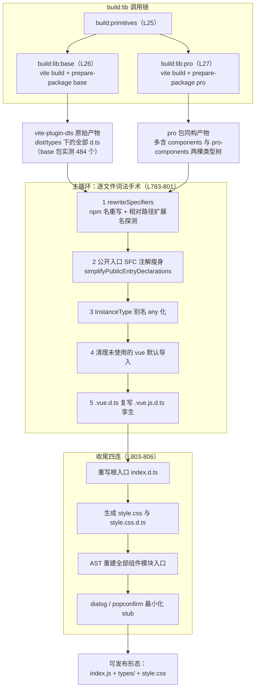
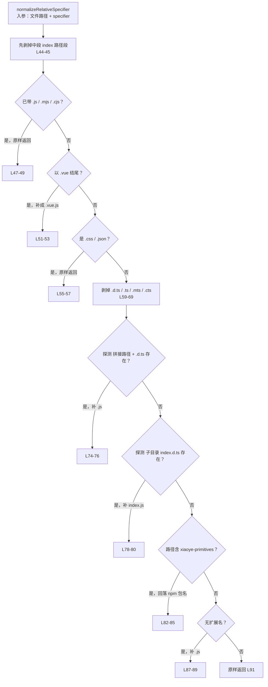
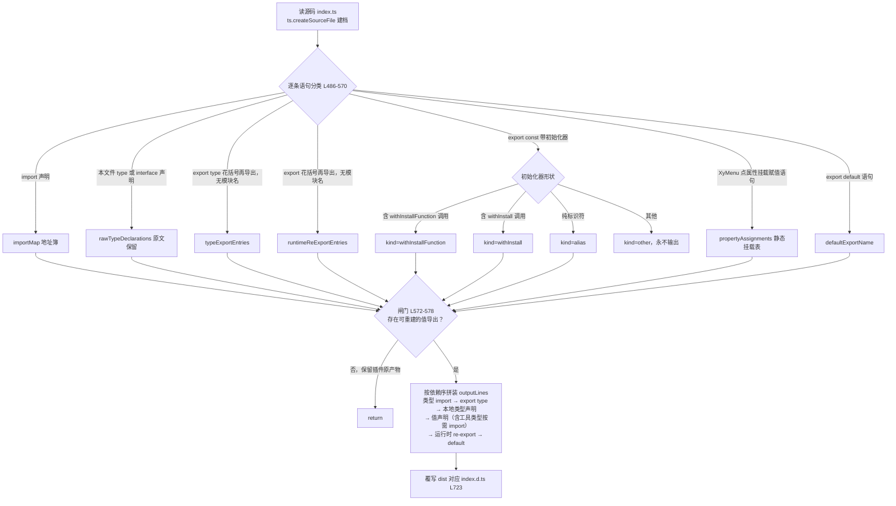

# 2-03 · prepare-package：808 行 d.ts 后处理管线

> 核心问题：**vite-plugin-dts 的产物，离"可发布"还差多远？**
> 答案藏在一个 808 行的构建后置脚本里：`scripts/prepare-package.mjs`。它不做转译，只做"外科手术"——但正是这台手术，决定了用户 `import { XyMenu } from "xiaoye-components"` 时，类型提示是精准的组件、还是一坨 `__VLS_` 开头的内部噪声，甚至直接飘红。

---

## 一、先看调用链：它排在构建的最后一环

先复述一下这个脚本在整条发布链路里的位置。根目录 `package.json` 的构建脚本段（当前实态，`package.json:23-27`）长这样：

```json
    "build": "pnpm run build:lib && pnpm run build:docs && pnpm run build:playground",
    "build:lib": "pnpm run build:primitives && pnpm run build:lib:base && pnpm run build:lib:pro",
    "build:primitives": "vite build -c vite.primitives.config.ts",
    "build:lib:base": "vite build -c vite.config.ts && node scripts/prepare-package.mjs base",
    "build:lib:pro": "vite build -c vite.pro.config.ts && node scripts/prepare-package.mjs pro",
```

注意这个顺序约定：`build:primitives` 先行（L25），然后 `build:lib:base`（L26）与 `build:lib:pro`（L27）。base 和 pro 两条线的模式完全一致——**先 `vite build`，紧接着 `node scripts/prepare-package.mjs <base|pro>`**。用 `&&` 串联意味着：vite 构建一旦失败，后处理不会执行；反过来，后处理失败也会让整条 `build:lib` 挂掉。这是有意为之的"门禁式"串联，而不是"尽力而为"的收尾脚本。

vite 这一步做了两件事：Rollup 打出 ES 格式的运行时产物（`dist/index.js`），同时由 `vite-plugin-dts` 把 TS 源码转成 `dist/types/**/*.d.ts`。dts 插件的配置集中在 `scripts/config/library-build.ts` 的 `createLibraryConfig` 工厂里，两个包共用（`scripts/config/library-build.ts:46-61`）：

```ts
export function createLibraryConfig(options: {
  entry: string;
  name: string;
  outDir: string;
  dtsInclude: string[];
  entryRoot?: string;
  extraExternal?: (string | RegExp)[];
}) {
  return defineConfig({
    plugins: [
      vue(),
      dts({
        root: path.resolve("."),
        entryRoot: path.resolve(options.entryRoot ?? "packages"),
        tsconfigPath: path.resolve("tsconfig.build.json"),
        include: options.dtsInclude,
        exclude: dtsExclude,
        outDir: path.resolve(options.outDir, "types"),
        insertTypesEntry: true,
        staticImport: true,
        copyDtsFiles: false,
        strictOutput: true,
        pathsToAliases: false
      })
    ],
```

逐项拆解这份配置，能看出作者对 dts 插件的能力边界做过认真评估：

- `insertTypesEntry: true`——让插件在 `dist/types/index.d.ts` 自动生成一个入口声明；
- `staticImport: true`——把 `export type` 的动态 `import()` 形态改写成静态 import，避免 d.ts 里出现运行时语义的 `import()`；
- `strictOutput: true`——产物里若出现无法回溯到 `entryRoot` 的文件路径就直接报错，而不是静默放行；
- `pathsToAliases: false`——**不要**把 tsconfig paths 映射回别名。这一项和后处理脚本关系最大：它意味着源码里 `@xiaoye/components`、`@xiaoye/utils` 这类工作区别名会以原样渗进 d.ts 产物，交给后续脚本收拾；
- `copyDtsFiles: false`——不盲目拷贝手写 `.d.ts`，产物完全从源码转译而来；
- `include` 里显式纳入了 `packages/xiaoye-primitives/src/composables/**`、`src/utils/**` 和 `packages/tokens/**`——也就是说，基础包的类型产物里会**内嵌一份 primitives 组合式函数与工具函数的类型拷贝**，供相对路径引用。

那 `strictOutput`、`staticImport`、`insertTypesEntry` 三件套都开上了，还差什么？把本地构建出来的 `dist/types` 翻一遍，可以归纳出六类"最后一公里"问题，每一类都对应 `prepare-package.mjs` 里的一段手术：

| # | vite-plugin-dts 产物的问题 | 后处理对策（行号） |
|---|---|---|
| 1 | 工作区别名 `@xiaoye/components` / `@xiaoye/pro-components` 渗入 specifier | 改写为 npm 名（`prepare-package.mjs:94-101`） |
| 2 | 相对 specifier 缺扩展名，或带着 `.ts` / `.d.ts` 尾巴，Node16 解析下断链 | 文件系统探测补 `.js` / `/index.js`（`prepare-package.mjs:43-92`） |
| 3 | 跟随 symlink 生成的 primitives 相对引用可能指向不存在的路径 | 统一回落 npm 包名（`prepare-package.mjs:82-85`） |
| 4 | 公开入口的 `export declare const XyMenu: SFCWithInstall<typeof Menu> & {...}` 注解巨长，且把 `.vue` 内部类型拖进公开面 | 词法扫描瘦身 + AST 重建（`prepare-package.mjs:247-313`、`439-724`） |
| 5 | `XyMenu.Item = XyMenuItem` 这类运行时属性挂载语句无法用 d.ts 语法表达 | 从源码 AST 重建为交叉类型（`prepare-package.mjs:547-565`） |
| 6 | SFC 声明的 `.vue.d.ts` 与部分解析器期望的 `.vue.js.d.ts` 命名不一致 | 生成同内容孪生文件（`prepare-package.mjs:798-800`） |

这六类问题没有一类是 vite-plugin-dts 的 bug——它只是个"转译器"，职责边界是把 TS/Vue 源码**忠实**地翻译成声明文件。而"忠实"与"可发布"之间，隔着的正是对**发布面**的理解：哪些内部形态不该暴露、哪些 specifier 在消费者侧无法解析、哪些运行时模式需要换一种声明语法表达。这份理解，插件不可能替你做。

下面是全链路的全景图：



---

## 二、总览：一个脚本，两种武器

通读 808 行，会发现它其实是**两套方法论**的缝合体，而且缝合得很有章法：

- **词法手术**（字符串层面的正则与扫描器）：处理 specifier 改写、公开入口注解瘦身、`InstanceType` 别名 any 化、死导入清理。前提是"产物形态可控"——这些文件是生成物，语法形状稳定，不值得动用完整 AST。
- **TS Compiler API 重建**（`import ts from "typescript"`，`prepare-package.mjs:3`）：只用在刀刃上——组件模块入口 `index.d.ts`。因为这里的源码模式（`withInstall` 包装 + 运行时属性挂载 + 类型批量再导出）已经超出了"文本替换"能安全表达的范畴。

脚本的骨架只有四段：目标解析（L5-31）、工具函数与两套手术（L33-781）、主循环（L783-801）、收尾四连（L803-808）。先看头部与文件收集：

```js
import fs from "node:fs";
import path from "node:path";
import ts from "typescript";

const packageTargets = {
  base: {
    distDir: path.resolve("packages/components/dist"),
    entryPath: "components/index.js",
    packageName: "xiaoye-components"
  },
  pro: {
    distDir: path.resolve("packages/pro-components/dist"),
    entryPath: "pro-components/index.js",
    packageName: "xiaoye-pro-components"
  }
};

const targetName = process.argv[2];
const target = packageTargets[targetName];

if (!target) {
  console.error("用法：node scripts/prepare-package.mjs <base|pro>");
  process.exit(1);
}

const typesDir = path.join(target.distDir, "types");

if (!fs.existsSync(typesDir)) {
  console.error(`未找到类型产物目录：${typesDir}`);
  process.exit(1);
}

function walkDir(dirPath) {
  return fs.readdirSync(dirPath, { withFileTypes: true }).flatMap((entry) => {
    const entryPath = path.join(dirPath, entry.name);
    if (entry.isDirectory()) {
      return walkDir(entryPath);
    }
    return entryPath.endsWith(".d.ts") ? [entryPath] : [];
  });
}
```

（`scripts/prepare-package.mjs:1-41`）

`packageTargets` 用命令行第二个参数在 base / pro 两个目标间切换，两个目标共享全部手术逻辑，只有 `distDir`、入口相对路径和 npm 包名不同。`walkDir` 递归收集 `typesDir` 下所有 `.d.ts`——注意它刻意**不收** `.js` 文件，因为运行时产物的 specifier 规范化是 Rollup 的职责，这里只管类型树。本地构建实测，base 包这一步会收集到 **484 个 `.d.ts`**，其中 115 个是 `.vue.d.ts`（后面会看到它们各自还会长出一份 `.vue.js.d.ts` 孪生）。

另一个容易忽略的细节：`entryPath` 字段（`"components/index.js"` / `"pro-components/index.js"`）会在收尾阶段用于拼接根入口的再导出目标，也就是说根入口指向的是 dist 内**运行时产物树**里的模块，而不是类型树——这与 `packages/components/package.json` 的 exports 映射（`"types": "./dist/types/index.d.ts"`、`"import": "./dist/index.js"`）互为呼应。

---

## 三、第一层手术：specifier 规范化（L43-119）

### 3.1 `@xiaoye/*` → npm 名

最外层入口是 `normalizeSpecifier`：只认两个工作区别名，其余非相对 specifier 一律放行。这是刻意的白名单——别名映射表每多一行，就多一分"静默改错"的风险：

```js
function normalizeRelativeSpecifier(filePath, specifier) {
  let normalized = specifier.replace(/\/index\.d?\.ts\//g, "/");
  normalized = normalized.replace(/\/index\.ts\//g, "/");

  if (normalized.endsWith(".js") || normalized.endsWith(".mjs") || normalized.endsWith(".cjs")) {
    return normalized;
  }

  if (normalized.endsWith(".vue")) {
    return `${normalized}.js`;
  }

  if (normalized.endsWith(".css") || normalized.endsWith(".json")) {
    return normalized;
  }

  let bareSpecifier = normalized;

  if (bareSpecifier.endsWith(".d.ts")) {
    bareSpecifier = bareSpecifier.slice(0, -5);
  } else if (
    bareSpecifier.endsWith(".ts") ||
    bareSpecifier.endsWith(".mts") ||
    bareSpecifier.endsWith(".cts")
  ) {
    bareSpecifier = bareSpecifier.replace(/\.[cm]?ts$/, "");
  }

  const currentDir = path.dirname(filePath);
  const bareTargetPath = path.resolve(currentDir, bareSpecifier);

  if (fs.existsSync(`${bareTargetPath}.d.ts`)) {
    return `${bareSpecifier}.js`;
  }

  if (fs.existsSync(path.join(bareTargetPath, "index.d.ts"))) {
    return `${bareSpecifier}/index.js`;
  }

  // dts 插件跟随 symlink 生成的 primitives 相对引用可能断链，统一回落到 npm 包名
  if (bareSpecifier.includes("xiaoye-primitives")) {
    return "xiaoye-primitives";
  }

  if (!path.extname(bareSpecifier)) {
    return `${bareSpecifier}.js`;
  }

  return bareSpecifier;
}

function normalizeSpecifier(filePath, specifier) {
  if (specifier === "@xiaoye/components") {
    return "xiaoye-components";
  }

  if (specifier === "@xiaoye/pro-components") {
    return "xiaoye-pro-components";
  }

  if (!specifier.startsWith(".")) {
    return specifier;
  }

  return normalizeRelativeSpecifier(filePath, specifier);
}

function rewriteSpecifiers(filePath, source) {
  const withSpecifiers = source.replace(
    /(from\s*["']|import\s*\(\s*["'])([^"']+)(["'])/g,
    (_match, prefix, specifier, suffix) => {
      return `${prefix}${normalizeSpecifier(filePath, specifier)}${suffix}`;
    }
  );

  return withSpecifiers.replace(/\(\(event: "([^"]+)", event: /g, '((event: "$1", payload: ');
}
```

（`scripts/prepare-package.mjs:43-119`，其中 L43-92 是 `normalizeRelativeSpecifier` 全文）

### 3.2 文件系统探测：问文件系统，而不是猜规则

这段代码最值得展开的是 L74-80 那两次 `fs.existsSync`。补扩展名这件事，直觉做法是写规则："无扩展名就补 `.js`，指向目录就补 `/index.js`"。但 dts 插件吐出来的相对 specifier 形态远比规则复杂：有的带着 `/index.d.ts/` 中段（L44 的第一刀就是把它削掉）、有的以 `.d.ts` 结尾、有的压根没扩展名。**规则枚举永远追不完生成器的形态，而文件系统可以一锤定音**——把当前 d.ts 文件所在目录与剥掉扩展名的目标拼起来，直接问"`${target}.d.ts` 存在吗？"存在就补 `.js`；再问"`target/index.d.ts` 存在吗？"存在就补 `/index.js`。两次探测覆盖了"单文件模块"与"目录模块"两种真实形态，剩下所有规则推导都只是探测失败后的兜底（L87-89 的无扩展名补 `.js`）。

这是一处典型的设计权衡：**用 O(1) 的文件系统查询换取规则集的收敛**。代价是脚本与产物的目录结构产生了耦合——探测的是"磁盘上有什么"，而不是"逻辑上应该是什么"。但对一个只在 CI / 本地构建里、面对刚刚生成的固定目录树运行的脚本来说，这个耦合是可控的，甚至比维护一张不断膨胀的规则表更稳。

### 3.3 symlink 断链回落：L82 那行注释的分量

L82-85 是整个函数里唯一一处"放弃解析、直接换域名"的分支：

> dts 插件跟随 symlink 生成的 primitives 相对引用可能断链，统一回落到 npm 包名

背景是这样的：`xiaoye-primitives` 在工作区里通过 pnpm 的 symlink 机制被 alias 到 `packages/xiaoye-primitives`。dts 插件做类型转译时会**跟随这个符号链接**，于是它眼中的"相对路径"可能指向 monorepo 源码树里的某个真实位置——这个位置在 `dist/types` 里未必有对应物（或对应物不完整）。前面的两次 `existsSync` 探测一旦落空，而路径里又带着 `xiaoye-primitives` 字样，脚本就不再尝试修复相对路径，而是干脆回落到 npm 包名。这之所以可行，是因为 `packages/components/package.json` 的 `dependencies` 里明确声明了 `"xiaoye-primitives": "workspace:^"`——发布后它是真实的 npm 依赖，裸包名引用在消费者侧必然可解析。**相对路径是脆弱的物理事实，包名是稳定的逻辑契约**；断链时把物理事实降级为逻辑契约，是这个函数最聪明的一步。

### 3.4 判定全景与那条"顺手"的正则

把 L43-92 的判定顺序画成图，就是一台六段流水筛：



`rewriteSpecifiers` 的主正则（L112）只认 `from "..."` 与动态 `import("...")` 两种形态——对 d.ts 而言足够了，因为声明文件里的模块引用只有这两处出口。而 L118 那条 `((event: "...", event: ` → `((event: "$1", payload: ` 的替换值得单独一说：它是针对 Vue 语言工具在某些 emits 声明形状下生成的**重名参数**产物做的定点清洗（把第二个 `event:` 改名为 `payload:`，否则类型检查会报参数重名）。有意思的是，在当前这次本地构建的产物里 grep 不到任何匹配样本——emit 声明的形态演化让这个缺陷暂时不再出现，但脚本仍然保留着这条"疫苗"。这是典型的**防御性修复**：删除它的收益是减少一行正则，风险是下一次 Vue 上游变化时产物静默损坏，而没人记得这里曾经拦过一次。

---

## 四、第二层手术：公开入口的词法瘦身（L121-349）

### 4.1 先划定手术范围

收尾阶段会用 `isPublicEntryDeclaration`（L132-135）识别"公开入口"：路径形如 `/types/(components|pro-components)/<组件名>/index.d.ts` 的文件。这个正则同时约束了后面的词法手术只发生在**消费者一定会看到的入口文件**上——深层实现文件保持原貌，手术范围最小化：

```js
function rewriteRootTypesEntry(entryPath, entryTarget) {
  const source = [
    `export * from "./${entryTarget}";`,
    `import XiaoyePackage from "./${entryTarget}";`,
    "export default XiaoyePackage;",
    ""
  ].join("\n");

  fs.writeFileSync(entryPath, source, "utf8");
}

function isPublicEntryDeclaration(filePath) {
  const normalizedPath = filePath.split(path.sep).join("/");
  return /\/types\/(components|pro-components)\/[^/]+\/index\.d\.ts$/.test(normalizedPath);
}
```

（`scripts/prepare-package.mjs:121-135`）

`rewriteRootTypesEntry` 虽然定义在词法手术区，实际是收尾阶段才调用的（L803）：无论 `insertTypesEntry` 生成的根入口长什么样，都用固定四行覆写——`export *` 之外，多出一个**默认导出**。这四行保证了 `import XiaoyePackage from "xiaoye-components"` 的安装式用法在类型层面成立，与运行时产物 `dist/index.js` 的默认导出严格对应。本地构建产物里，`packages/components/dist/types/index.d.ts` 的全文恰好就是这三行代码——生成物的"确定性"本身就是一种发布质量：文件内容不依赖上游工具的版本细节，任何时候构建都是同一份字节。

### 4.2 `findStatementEnd`：85 行的手写括号状态机

接下来是全文最长的单个函数，也是"词法扫描 vs TS AST"这场选型最直接的证据。先上全文（`scripts/prepare-package.mjs:137-221`，共 85 行）：

```js
function findStatementEnd(source, startIndex) {
  let braceDepth = 0;
  let bracketDepth = 0;
  let parenDepth = 0;
  let inSingleQuote = false;
  let inDoubleQuote = false;
  let inTemplate = false;

  for (let index = startIndex; index < source.length; index += 1) {
    const char = source[index];
    const previousChar = source[index - 1];

    if (inSingleQuote) {
      if (char === "'" && previousChar !== "\\") {
        inSingleQuote = false;
      }
      continue;
    }

    if (inDoubleQuote) {
      if (char === '"' && previousChar !== "\\") {
        inDoubleQuote = false;
      }
      continue;
    }

    if (inTemplate) {
      if (char === "`" && previousChar !== "\\") {
        inTemplate = false;
      }
      continue;
    }

    if (char === "'") {
      inSingleQuote = true;
      continue;
    }

    if (char === '"') {
      inDoubleQuote = true;
      continue;
    }

    if (char === "`") {
      inTemplate = true;
      continue;
    }

    if (char === "{") {
      braceDepth += 1;
      continue;
    }

    if (char === "}") {
      braceDepth -= 1;
      continue;
    }

    if (char === "[") {
      bracketDepth += 1;
      continue;
    }

    if (char === "]") {
      bracketDepth -= 1;
      continue;
    }

    if (char === "(") {
      parenDepth += 1;
      continue;
    }

    if (char === ")") {
      parenDepth -= 1;
      continue;
    }

    if (char === ";" && braceDepth === 0 && bracketDepth === 0 && parenDepth === 0) {
      return index;
    }
  }

  return source.length - 1;
}
```

它做的事一句话能说清：**从某个起点向后扫，找到"处于所有括号深度之外的第一条语句级分号"**。实现上是一个手写的六状态字符级状态机：三种字符串态（单引号、双引号、模板串）优先吞字符，转义符 `\` 用"看前一个字符"的方式处理；非字符串态下维护 `{}`、`[]`、`()` 三套深度计数；三者同时归零时遇到 `;` 即为语句终点。兜底返回 `source.length - 1`，意味着哪怕语法意外（比如生成器吐出了不闭合的括号），也不会死循环或抛异常，最多把整段尾部当一个语句处理——**对生成物做手术，容错优先于精确**。

为什么不直接用 TS 的 AST？这里是全篇第一处关键选型，值得摆开来讲：

1. **手术对象是"注解文本"而非"语法结构"。** 公开入口里要处理的是 `export declare const XyMenu: <这段巨长的类型注解>;`——需要保留语句头（`export declare const XyMenu:`）原样，只替换冒号之后、分号之前的注解体。AST 方案要做 parse → transform → print 三步，而 TS 的 printer 打印出来的代码格式与原文件必然有出入（缩进、换行、引号偏好），一次 print 就是对全部 484 个文件的"重新排版"，diff 噪声巨大。
2. **生成物的语法形态高度可控。** 这些 d.ts 是 vite-plugin-dts 刚刚生成的，注解体里不会有正则字面量这类让词法扫描翻车的构形；三种字符串态 + 三套括号计数，已经覆盖了类型注解里可能出现的一切嵌套。
3. **失败模式更温和。** AST 解析遇到意外语法会抛错或产生带诊断的失败态，而词法扫描最坏情况只是"少剪一刀"。对一个发布链路上的后处理脚本，"永远产出字节"比"偶尔完美"重要。

### 4.3 泛型配对与 `SFCWithInstall` 瘦身

`findStatementEnd` 的第一个客户是 `simplifySfcAnnotation`，它依赖一个更小的扫描器 `findGenericEnd`（L223-245）：从泛型的 `<` 之后开始计数尖括号深度，遇到**前一个字符不是 `=` 的 `>`** 才算闭合（L235 的 `previousChar !== "="` 挡住了 `=>` 箭头类型——比如 `() => void` 出现在泛型参数里时，那个 `>` 不能计入配对）。两个函数配合，完成"找到 `SFCWithInstall<`，配对到它的闭合 `>`，整段替换为 `SFCWithInstall<any>`"的操作：

```js
function findGenericEnd(source, startIndex) {
  let angleDepth = 1;

  for (let index = startIndex; index < source.length; index += 1) {
    const char = source[index];
    const previousChar = source[index - 1];

    if (char === "<") {
      angleDepth += 1;
      continue;
    }

    if (char === ">" && previousChar !== "=") {
      angleDepth -= 1;

      if (angleDepth === 0) {
        return index;
      }
    }
  }

  return -1;
}

function simplifySfcAnnotation(annotation) {
  const token = "SFCWithInstall<";
  let cursor = 0;
  let rewritten = "";

  while (cursor < annotation.length) {
    const start = annotation.indexOf(token, cursor);

    if (start === -1) {
      rewritten += annotation.slice(cursor);
      break;
    }

    rewritten += annotation.slice(cursor, start);
    const genericStart = start + token.length;
    const genericEnd = findGenericEnd(annotation, genericStart);

    if (genericEnd === -1) {
      rewritten += annotation.slice(start);
      break;
    }

    rewritten += "SFCWithInstall<any>";
    cursor = genericEnd + 1;
  }

  return rewritten;
}
```

（`scripts/prepare-package.mjs:223-274`）

这两段合起来是全篇第二处关键权衡，而且是**激进的那一档**：`SFCWithInstall<typeof Menu> & { Item: ... }` 被替换成 `SFCWithInstall<any>`，泛型参数里的完整组件类型被**主动丢弃**了。为什么敢这么做？看语义——`SFCWithInstall<T>` 定义在 `packages/xiaoye-primitives/src/utils/vue/with-install.ts:3-10`（`FunctionWithInstall` 同处），`withInstall` 包装函数在 L21-40：

```ts
import type { App, AppContext } from "vue";

export type SFCWithInstall<T> = T & {
  install(app: App): void;
};

export type FunctionWithInstall<T> = T & {
  install(app: App): void;
  _context?: AppContext | null;
};

type AnyFunction = (...args: any[]) => any;

function toKebabCase(name: string) {
  return name
    .replace(/([a-z0-9])([A-Z])/g, "$1-$2")
    .replace(/([A-Z])([A-Z][a-z])/g, "$1-$2")
    .toLowerCase();
}

export function withInstall<T>(component: T, name: string) {
  const installable = component as SFCWithInstall<T>;

  installable.install = (app: App) => {
    console.debug(`[withInstall] called for: "${name}"`);
    if (!name) {
      console.error("[withInstall] missing name, component:", component);
      return;
    }
    const aliases = Array.from(new Set([name, toKebabCase(name)]));

    aliases.forEach((alias) => {
      if (!app.component(alias)) {
        app.component(alias, installable as never);
      }
    });
  };

  return installable;
}
```

（`packages/xiaoye-primitives/src/utils/vue/with-install.ts:1-40`）

`T & { install }` 意味着 `SFCWithInstall<typeof Menu>` 携带的全部组件能力都在 `typeof Menu` 里，而 `typeof Menu` 又指向 `./src/menu.vue` 的声明——那是几千行 `__VLS_` 开头的 Vue 模板编译内部类型。把它们拖进公开入口，代价是三重的：公开 d.ts 体积膨胀、消费者 IDE 悬浮提示变成内部噪声、以及最深的问题——**`.vue` 的声明文件在消费者侧的解析路径未必与构建侧一致**，一旦断链，整个入口的类型就塌了。替换成 `any` 是用"入口处的组件实例类型精度"换"入口的稳定性与可读性"，而这个精度损失随后会被第五节的重建逻辑部分补回（重建后的 `export declare const XyMenu: SFCWithInstall<any> & { Item: ... }` 保留了静态成员挂载信息，`MenuProps`、`MenuExposes` 等数据类型仍然从 `./src/menu.js` 完整再导出）。组件"怎么用"的类型信息被保留了，"组件内部长什么样"的类型信息被裁掉了——这正是发布面该有的形状。

`findStatementEnd` 的主客户 `simplifyPublicEntryDeclarations`（L276-304）把上面的零件串起来：正则 `/export declare const [A-Za-z0-9_$]+\s*:/g` 找到所有"导出常量声明"的语句头，冒号之后交给 `findStatementEnd` 截出注解体；注解体里含 `SFCWithInstall<` 的才做替换，其余语句原样保留。注意 L299 的 `declarationPattern.lastIndex = cursor`——手写游标与正则的 `lastIndex` 状态必须显式同步，否则替换让文本变短后，正则会从旧位置继续匹配而出乱子。这是字符串手术的典型陷阱，也是很多人说"词法手术不可靠"的真实来源——但陷阱是**可枚举**的，一处同步代码就堵住了。

同区间还有两个小手术。`simplifyVueInstanceAliases`（L306-313）用一条正则把 `export type MenuInstance = InstanceType<typeof Menu>`（可带 `& { ... }` 后缀）统一压成 `export type MenuInstance = any`。本地构建的对照非常直观——源码 `packages/components/menu/src/instance.ts` 是两行：

```ts
import type Menu from "./menu.vue";

export type MenuInstance = InstanceType<typeof Menu>;
```

而本地构建产物 `packages/components/dist/types/components/menu/src/instance.d.ts` 只剩一行：

```ts
export type MenuInstance = any;
```

`InstanceType<typeof Menu>` 在发布产物里是双重的不可靠：它要求 `.vue` 声明在消费者侧可解析（不可控），解析出来又是模板内部类型（不可读）。any 化与 `SFCWithInstall<any>` 是同一条原则的两处落地。`removeUnusedVueDefaultImports`（L315-335）则更细：找出所有从 `.vue.js` 导入默认导出的语句，统计标识符在全文的出现次数，只出现一次（即仅导入、未使用）就整行删除——这是重建逻辑的前置减脂，避免重建后的入口文件里留着悬空的导入。

---

## 五、第三层手术：TS Compiler API 重建模块入口（L439-724）

### 5.1 为什么词法手术在这里止步

组件模块入口（如 `packages/components/menu/index.ts`）的源码模式是这样的（全文见第七节对照）：`withInstall(...)` 包装导出、`XyMenu.Item = XyMenuItem` 运行时属性挂载、大块 `export type { ... }` 再导出、`export default XyMenu`。这个模式有两个词法手术处理不了的死结：

1. **d.ts 语法表达不了运行时挂载。** `XyMenu.Item = XyMenuItem;` 是赋值表达式语句，声明文件里根本不允许出现（TS 会直接报"表达式语句不允许出现在声明文件中"）。vite-plugin-dts 无论怎么忠实转译，都无法把这条语句变成合法 d.ts——必须换一种**等价的声明语法**：交叉类型 `& { Item: typeof XyMenuItem }`。
2. **需要"理解"而非"匹配"。** 哪些导出是组件、哪些是函数服务、哪些是别名、静态属性挂到谁身上——这些是语义判断，正则做不到，AST 可以。

于是脚本在这里切换武器：`import ts from "typescript"`（L3）终于登场。重建函数 `rewriteModuleIndexDeclaration` 占了 L439-724 整整 286 行，是全脚本的心脏。先看它的输入建档段（L439-484）：

```js
function rewriteModuleIndexDeclaration(sourceIndexPath, distIndexPath) {
  const sourceText = fs.readFileSync(sourceIndexPath, "utf8");
  const sourceFile = ts.createSourceFile(sourceIndexPath, sourceText, ts.ScriptTarget.Latest, true);

  const importMap = new Map();
  const typeExportEntries = [];
  const runtimeReExportEntries = [];
  const rawTypeDeclarations = [];
  const valueEntries = [];
  const propertyAssignments = new Map();
  let defaultExportName = null;

  function addImportEntry(localName, entry) {
    importMap.set(localName, entry);
  }

  function collectImportSpecifiers(statement) {
    const clause = statement.importClause;
    if (!clause) {
      return;
    }

    const source = statement.moduleSpecifier.text;

    if (clause.name) {
      addImportEntry(clause.name.text, {
        source,
        importedName: "default",
        localName: clause.name.text,
        defaultImport: true,
        typeOnly: clause.isTypeOnly
      });
    }

    if (clause.namedBindings && ts.isNamedImports(clause.namedBindings)) {
      clause.namedBindings.elements.forEach((element) => {
        addImportEntry(element.name.text, {
          source,
          importedName: element.propertyName?.text ?? element.name.text,
          localName: element.name.text,
          defaultImport: false,
          typeOnly: clause.isTypeOnly || element.isTypeOnly
        });
      });
    }
  }
```

（`scripts/prepare-package.mjs:439-484`）

注意一个容易误读的细节：`sourceIndexPath` 是**源码** `packages/components/menu/index.ts`，不是 dist 里的 d.ts。`ts.createSourceFile` 的第四个参数 `true` 表示 `setParentNodes`，为后续 `getText(sourceFile)` 精确取回原文片段铺路。脚本在这里做了一个根本性的决定——**不以 dts 插件的转译产物为事实源，而以源码 AST 为事实源**。产物里它写成了什么形状并不重要，重要的是源码的语义结构。

接下来是对源码全部语句的分类遍历（L486-570），这是整个重建的"侦察阶段"：

```js
  sourceFile.statements.forEach((statement) => {
    if (ts.isImportDeclaration(statement)) {
      collectImportSpecifiers(statement);
      return;
    }

    if (
      (ts.isTypeAliasDeclaration(statement) || ts.isInterfaceDeclaration(statement)) &&
      statement.modifiers?.some((modifier) => modifier.kind === ts.SyntaxKind.ExportKeyword)
    ) {
      rawTypeDeclarations.push(statement.getText(sourceFile));
      return;
    }

    if (
      ts.isExportDeclaration(statement) &&
      statement.exportClause &&
      ts.isNamedExports(statement.exportClause) &&
      !statement.moduleSpecifier
    ) {
      const target = statement.isTypeOnly ? typeExportEntries : runtimeReExportEntries;

      statement.exportClause.elements.forEach((element) => {
        const localName = element.propertyName?.text ?? element.name.text;
        target.push(localName);
      });
      return;
    }

    if (
      ts.isVariableStatement(statement) &&
      statement.modifiers?.some((modifier) => modifier.kind === ts.SyntaxKind.ExportKeyword)
    ) {
      statement.declarationList.declarations.forEach((declaration) => {
        if (!ts.isIdentifier(declaration.name) || !declaration.initializer) {
          return;
        }

        const initializerText = declaration.initializer.getText(sourceFile);
        const aliasMatch = initializerText.match(/^\s*([A-Za-z_]\w*)\s*$/);
        let kind = "other";
        let aliasTarget = null;

        if (initializerText.includes("withInstallFunction(")) {
          kind = "withInstallFunction";
        } else if (initializerText.includes("withInstall(")) {
          kind = "withInstall";
        } else if (aliasMatch) {
          kind = "alias";
          aliasTarget = aliasMatch[1];
        }

        valueEntries.push({
          name: declaration.name.text,
          kind,
          aliasTarget
        });
      });
      return;
    }

    if (
      ts.isExpressionStatement(statement) &&
      ts.isBinaryExpression(statement.expression) &&
      statement.expression.operatorToken.kind === ts.SyntaxKind.EqualsToken &&
      ts.isPropertyAccessExpression(statement.expression.left) &&
      ts.isIdentifier(statement.expression.left.expression) &&
      ts.isIdentifier(statement.expression.right)
    ) {
      const owner = statement.expression.left.expression.text;
      const assignments = propertyAssignments.get(owner) ?? [];

      assignments.push({
        propertyName: statement.expression.left.name.text,
        targetName: statement.expression.right.text
      });

      propertyAssignments.set(owner, assignments);
      return;
    }

    if (ts.isExportAssignment(statement) && ts.isIdentifier(statement.expression)) {
      defaultExportName = statement.expression.text;
    }
  });
```

（`scripts/prepare-package.mjs:486-570`）

六类语句、六个去处：import 声明进 `importMap`（本地名到来源的映射，是后续所有再导出的"地址簿"）；本文件内声明的类型别名 / 接口原文进 `rawTypeDeclarations`；无模块名的 `export type { ... }` 与 `export { ... }` 分别进类型与运行时两个再导出清单；导出的变量声明按**初始化器形状**分类——含 `withInstallFunction(` 的是函数服务（如 message / notification 这类命令式 API）、含 `withInstall(` 的是组件、整个初始化器只是一个标识符的是别名（`kind: "alias"`），其余标记 `other`；形如 `XyMenu.Item = XyMenuItem` 的属性访问赋值语句按归属者聚合进 `propertyAssignments`；`export default` 记下名字。识别 `withInstall` 用的是**初始化器文本的 `includes` 匹配**而非 AST 结构比对——在"生成源码由仓库约定保证形状"的前提下，这比写一整套调用表达式结构匹配要务实得多，属于 AST 侦察里的"文本主义"折中。

### 5.2 闸门：不是所有入口都值得重建

侦察结束，先过一道闸门（L572-578）：

```js
  const shouldRewrite = valueEntries.some((entry) =>
    ["withInstall", "withInstallFunction", "alias"].includes(entry.kind)
  );

  if (!shouldRewrite) {
    return;
  }
```

（`scripts/prepare-package.mjs:572-578`）

只有存在组件 / 函数服务 / 别名三类"值导出"的入口才会被重建；纯类型桶（比如某些只做类型再导出的模块入口）直接保留 dts 插件的产物原样。这道闸门是"手术最小化"原则在 AST 层的延伸：重建是有损的（它只理解六类语句模式，源码里任何超出模式的写法都会在重建中被丢弃），所以只在必要处重建，并且——注意——**重建逻辑对未知模式的处理是"不重建"，而不是"重建一个残缺的"**。闸门判断与重建范围的一致性，是这个脚本敢于全自动运行的前提。

### 5.3 输出拼装：四类内容按依赖序落纸

过了闸门，进入输出拼装。第一段先处理"本文件内声明的类型"（L580-663）：

```js
  const outputLines = [];
  const uses = {
    sfc: false,
    functionInstall: false
  };

  const rewrittenRawTypeDeclarations = rawTypeDeclarations.map((declarationText) =>
    rewriteLocalTypeDeclaration(declarationText)
  );
  const rawTypeImportEntries = [];

  rewrittenRawTypeDeclarations.forEach((declarationText) => {
    for (const [localName, entry] of importMap.entries()) {
      const identifierPattern = new RegExp(`\\b${localName}\\b`);

      if (identifierPattern.test(declarationText)) {
        rawTypeImportEntries.push(entry);
      }
    }
  });

  const rawTypeImportGroups = groupEntriesBySource(
    Array.from(
      new Map(
        rawTypeImportEntries.map((entry) => [
          `${entry.source}:${entry.importedName}:${entry.localName}:${entry.defaultImport}:${entry.typeOnly}`,
          entry
        ])
      ).values()
    )
  );

  for (const [source, entries] of rawTypeImportGroups.entries()) {
    const rewrittenSource = rewriteSourceSpecifier(sourceIndexPath, distIndexPath, source);
    const defaultImports = entries.filter((entry) => entry.defaultImport);
    const namedImports = entries.filter((entry) => !entry.defaultImport);

    if (defaultImports.length > 0) {
      defaultImports.forEach((entry) => {
        outputLines.push(`import ${entry.localName} from "${rewrittenSource}";`);
      });
    }

    if (namedImports.length > 0) {
      outputLines.push(
        `import type { ${renderNamedEntries(namedImports)} } from "${rewrittenSource}";`
      );
    }
  }

  const typeReExportEntries = typeExportEntries
    .map((localName) => {
      const entry = importMap.get(localName);

      if (!entry) {
        return null;
      }

      return entry;
    })
    .filter(Boolean);

  const typeReExportGroups = groupEntriesBySource(typeReExportEntries);

  if (typeReExportGroups.size > 0) {
    if (outputLines.length > 0) {
      outputLines.push("");
    }

    for (const [source, entries] of typeReExportGroups.entries()) {
      const rewrittenSource = rewriteSourceSpecifier(sourceIndexPath, distIndexPath, source);
      outputLines.push(`export type { ${renderNamedEntries(entries)} } from "${rewrittenSource}";`);
    }
  }

  if (rewrittenRawTypeDeclarations.length > 0) {
    if (outputLines.length > 0) {
      outputLines.push("");
    }

    rewrittenRawTypeDeclarations.forEach((declarationText) => {
      outputLines.push(declarationText);
    });
  }
```

（`scripts/prepare-package.mjs:580-663`）

这一段有三个细节值得咀嚼。其一，`rewriteLocalTypeDeclaration`（L409-411）只有一行正则：`InstanceType<typeof\s+\w+>` → `any`——第四节在散文件层做过的 any 化，在重建输出里再做一遍，双保险。其二，本文件类型声明引用了哪些导入，是用 `\b${localName}\b` 的单词边界正则**反查**出来的（L591-599）——重建后的文件只需要"被用到的导入"，这本质上是一轮极简的"按需 import 修剪"。其三，反查结果用五元组字符串做 Map 去重（L603-609），再按来源模块分组（`groupEntriesBySource`，L387-397），最终每个来源只发一条 `import type { ... }`——同一模块的类型被合并进一条语句，而不是源码里散落的多条。`renderNamedEntries`（L399-407）处理 `imported as local` 的别名还原。

### 5.4 值声明重建：运行时挂载的静态化

第二段是全脚本的点睛之笔——把侦察阶段记下的值导出翻译成声明语法（L665-724）：

```js
  const valueDeclarationLines = valueEntries
    .map((entry) => buildValueDeclaration(entry, propertyAssignments, uses))
    .filter(Boolean);

  if (valueDeclarationLines.length > 0) {
    if (outputLines.length > 0) {
      outputLines.push("");
    }

    const utilityTypes = [
      uses.sfc ? "SFCWithInstall" : null,
      uses.functionInstall ? "FunctionWithInstall" : null
    ].filter(Boolean);

    if (utilityTypes.length > 0) {
      outputLines.push(`import type { ${utilityTypes.join(", ")} } from "xiaoye-primitives";`);
      outputLines.push("");
    }

    outputLines.push(...valueDeclarationLines);
  }

  const runtimeReExportEntriesResolved = runtimeReExportEntries
    .map((localName) => {
      const entry = importMap.get(localName);

      if (!entry) {
        return null;
      }

      return entry;
    })
    .filter(Boolean);

  const runtimeReExportGroups = groupEntriesBySource(runtimeReExportEntriesResolved);

  if (runtimeReExportGroups.size > 0) {
    if (outputLines.length > 0) {
      outputLines.push("");
    }

    for (const [source, entries] of runtimeReExportGroups.entries()) {
      const rewrittenSource = rewriteSourceSpecifier(sourceIndexPath, distIndexPath, source);
      outputLines.push(`export { ${renderNamedEntries(entries)} } from "${rewrittenSource}";`);
    }
  }

  if (defaultExportName) {
    if (outputLines.length > 0) {
      outputLines.push("");
    }

    outputLines.push(`declare const _default: typeof ${defaultExportName};`);
    outputLines.push("export default _default;");
  }

  outputLines.push("");

  fs.writeFileSync(distIndexPath, outputLines.join("\n"), "utf8");
}
```

（`scripts/prepare-package.mjs:665-724`）

翻译工作由 `buildValueDeclaration`（L413-437）完成，三种 `kind` 三种声明形态：

```js
function rewriteLocalTypeDeclaration(sourceText) {
  return sourceText.replace(/InstanceType<typeof\s+\w+>/g, "any");
}

function buildValueDeclaration(valueEntry, propertyAssignments, uses) {
  if (valueEntry.kind === "withInstall") {
    uses.sfc = true;
    const properties = propertyAssignments.get(valueEntry.name) ?? [];
    const extension =
      properties.length > 0
        ? ` & {\n${properties
            .map((property) => `  ${property.propertyName}: typeof ${property.targetName};`)
            .join("\n")}\n}`
        : "";

    return `export declare const ${valueEntry.name}: SFCWithInstall<any>${extension};`;
  }

  if (valueEntry.kind === "withInstallFunction") {
    uses.functionInstall = true;
    return `export declare const ${valueEntry.name}: FunctionWithInstall<any>;`;
  }

  if (valueEntry.kind === "alias" && valueEntry.aliasTarget) {
    return `export declare const ${valueEntry.name}: typeof ${valueEntry.aliasTarget};`;
  }

  return null;
}
```

（`scripts/prepare-package.mjs:409-437`）

`withInstall` 分支把源码里的两段事实——`withInstall(Menu, "xy-menu")` 的包装、以及 `XyMenu.Item = XyMenuItem` 的三条挂载语句——**合成为一条交叉类型声明**：`SFCWithInstall<any> & { Item: typeof XyMenuItem; ... }`。这就是对第四节"精度损失"的偿还：组件实例内部是 `any`，但 `XyMenu.Item`、`XyMenu.ItemGroup`、`XyMenu.SubMenu` 这些子组件挂载的类型是精确的 `typeof` 引用。运行时用赋值语句表达的事情，声明文件里用交叉类型表达——这正是"d.ts 表达不了赋值语句"死结的解法。`withInstallFunction` 分支同理产出 `FunctionWithInstall<any>`；`alias` 分支产出 `typeof 别名目标`。L665-667 的 `.map(...).filter(Boolean)` 链式调用里，`kind: "other"` 的值导出会返回 `null` 被过滤——**不认识的导出不硬造声明**，宁可让它在重建后的入口里缺席（闸门已保证这种情况罕见）。

`uses` 对象在翻译过程中被回写，L674-682 据此生成按需的工具类型导入：只有真的用到了 `SFCWithInstall` / `FunctionWithInstall`，才会向 `"xiaoye-primitives"` 发一条 `import type`。这里硬编码了 npm 包名而非相对路径——因为 `xiaoye-primitives` 是 `packages/components/package.json` 里显式声明的运行时依赖，类型依赖与运行时依赖应当指向同一个逻辑契约。

最后是 `export default` 的重建（L712-719）：`declare const _default: typeof XyMenu; export default _default;`——先声明再导出，而不是 `export default XyMenu` 直接写，因为声明文件里 `export default <标识符>` 要求该标识符已有声明，两段式写法是稳妥的惯用法。

重建输出里还有一个方向性问题要辨析：`rewriteSourceSpecifier`（L351-385）与第三节的 `normalizeRelativeSpecifier` 方向**相反**。散文件层把断链的 primitives 相对引用回落为 npm 包名；而重建层把 `@xiaoye/primitives` 别名解析为**指向 dist 内 vendored 拷贝的相对路径**——因为 base 包的 dts 配置（`vite.config.ts` 的 `dtsInclude`）把 primitives 的 composables / utils 类型复制进了 `dist/types/xiaoye-primitives/`（本地构建实测 21 个文件），重建产物可以指认这份"随包携带"的类型。一进一出、一收一放，看似矛盾，实则对应两个不同的引用场景：入口重建关心"声明引用要落在产物树内、不依赖 symlink"，散文件修补关心"已经断链的引用要降到最稳的形态"。顺带说明：`@xiaoye/primitives`（L352-359）与 `@xiaoye/utils`（L361-368）两个别名分支在当前基础包源码里实际处于休眠状态——全仓只有测试文件还在用 `@xiaoye/primitives` 写法，而测试早被 dtsExclude 排除。它们是为历史源码形态与未来回迁保留的兼容路径，属于同 L118 那条正则一样的"疫苗"。

把重建的判定与拼装流程画成图：



---

## 六、收尾四连与主循环（L726-808）

主循环跑完 484 个文件后，还有四件收尾事（L803-806 依次调用）：重写根入口、生成样式产物、重建组件模块入口、处理问题 SFC。先看后两者的实现（L726-781）：

```js
function writeMinimalVueDeclaration(filePath) {
  const source = [
    'import { DefineComponent } from "vue";',
    "declare const _default: DefineComponent<any, any, any, any, any>;",
    "export default _default;",
    ""
  ].join("\n");

  fs.writeFileSync(filePath, source, "utf8");
}

function rewriteProblematicVueDeclarations() {
  const relativePaths = [
    "components/dialog/src/dialog.vue.d.ts",
    "components/dialog/src/dialog.vue.js.d.ts",
    "components/popconfirm/src/popconfirm.vue.d.ts",
    "components/popconfirm/src/popconfirm.vue.js.d.ts"
  ];

  relativePaths.forEach((relativePath) => {
    const filePath = path.join(typesDir, relativePath);

    if (fs.existsSync(filePath)) {
      writeMinimalVueDeclaration(filePath);
    }
  });
}

function rewritePublicModuleIndexes() {
  const moduleRoots = [path.resolve("packages/components")];

  if (targetName === "pro") {
    moduleRoots.push(path.resolve("packages/pro-components"));
  }

  moduleRoots.forEach((moduleRoot) => {
    const typeRoot = path.join(typesDir, path.basename(moduleRoot));

    if (!fs.existsSync(typeRoot)) {
      return;
    }

    fs.readdirSync(moduleRoot, { withFileTypes: true })
      .filter((entry) => entry.isDirectory() && entry.name !== "__tests__")
      .forEach((entry) => {
        const sourceIndexPath = path.join(moduleRoot, entry.name, "index.ts");
        const distIndexPath = path.join(typeRoot, entry.name, "index.d.ts");

        if (!fs.existsSync(sourceIndexPath) || !fs.existsSync(distIndexPath)) {
          return;
        }

        rewriteModuleIndexDeclaration(sourceIndexPath, distIndexPath);
      });
  });
}
```

（`scripts/prepare-package.mjs:726-781`）

`rewritePublicModuleIndexes` 是重建逻辑的调度器：base 目标只扫 `packages/components`，pro 目标额外扫 `packages/pro-components`（pro 的 dts 配置把基础组件源码也纳入了转译范围，所以 pro 的 `dist/types` 里同时有 `components/` 与 `pro-components/` 两棵类型树，本地构建可验证）。每个子目录必须**同时**存在源码 `index.ts` 与产物 `index.d.ts` 才进入重建，目录级防御与函数级闸门（L572-578）构成两道串联的保险。

`rewriteProblematicVueDeclarations` 则是全脚本最"不体面"也最诚实的部分：dialog 与 popconfirm 两个 SFC 的转译产物存在无法通用的缺陷（模板复杂度导致 vue 语言工具生成的声明无法通过类型检查），脚本用硬编码路径列表把它们替换成四行的最小声明：

```ts
import { DefineComponent } from "vue";
declare const _default: DefineComponent<any, any, any, any, any>;
export default _default;
```

（本地构建产物 `packages/components/dist/types/components/dialog/src/dialog.vue.d.ts` 全文）

这是全篇第三处值得单独记录的权衡：**白名单 stub vs 通用修复**。通用方案需要定位"哪一类 SFC 形状会生成坏声明"，然后针对性修补——成本高且跟着 Vue 上游版本漂移；白名单 stub 只需要一个前提：这两个组件的 props / slots 类型精度可以牺牲（它们的 Props 类型仍从同级 `dialog.js` / `popconfirm.js` 完整导出，损失的只是模板层推导）。代价是这份列表需要随组件演化人工维护——`fs.existsSync` 的存在让"组件改名后列表失效"不会报错，只会静默跳过，这是这个设计里最值得在未来补一条告警的地方。

最后是主循环与总收尾（L783-808）：

```js
for (const filePath of walkDir(typesDir)) {
  const source = fs.readFileSync(filePath, "utf8");
  let rewritten = rewriteSpecifiers(filePath, source);

  if (isPublicEntryDeclaration(filePath)) {
    rewritten = simplifyPublicEntryDeclarations(rewritten);
  }

  rewritten = simplifyVueInstanceAliases(rewritten);
  rewritten = removeUnusedVueDefaultImports(rewritten);

  if (rewritten !== source) {
    fs.writeFileSync(filePath, rewritten, "utf8");
  }

  if (filePath.endsWith(".vue.d.ts")) {
    fs.writeFileSync(filePath.replace(/\.vue\.d\.ts$/, ".vue.js.d.ts"), rewritten, "utf8");
  }
}

rewriteRootTypesEntry(path.join(typesDir, "index.d.ts"), target.entryPath);
writeCssArtifacts();
rewritePublicModuleIndexes();
rewriteProblematicVueDeclarations();

console.log(`已整理 ${target.packageName} 的类型产物。`);
```

（`scripts/prepare-package.mjs:783-808`）

主循环的四个手术按"先改引用、再瘦注解、再清死码"的顺序执行，公开入口的注解瘦身被 `isPublicEntryDeclaration` 条件包裹。L794-796 的 `if (rewritten !== source)` 让未变更的文件不落盘——对构建缓存与增量工具友好。L798-800 是 `.vue.d.ts` → `.vue.js.d.ts` 孪生复写，本地构建产出了 115 对这样的孪生文件。为什么要孪生？因为生态里各解析器对 `.vue.js` 这种**双扩展名**的声明回退规则并不一致：有的解析路径会 strip 掉 `.js` 去找 `.vue.d.ts`，有的则按字面量找 `.vue.js.d.ts`。与其赌某一个解析器的行为，不如两个名字都放上同一份内容——零逻辑成本，物理兜底。`writeCssArtifacts`（L337-349）生成的 `dist/style.css` 与 `dist/style.css.d.ts` 则是对 `packages/components/package.json` exports 里 `"./style.css"` 子路径的直接供给——那个子路径声明了 `"types": "./dist/style.css.d.ts"`，如果后处理不生成这个文件，`import "xiaoye-components/style.css"` 在开启了类型检查的工程里就是一次模块找不到声明的报错。**package.json 的每一个 exports 子路径，都要在产物里有对应实体**——这是收尾四连真正的验收标准。

---

## 七、产物对照：手术前后的真实样子

以下产物均来自本地构建（`pnpm build:lib:base` 产物，`packages/components/dist`）。先看手术对象——源码 `packages/components/menu/index.ts` 全文：

```ts
import Menu from "./src/menu.vue";
import MenuItem from "./src/menu-item.vue";
import MenuItemGroup from "./src/menu-item-group.vue";
import SubMenu from "./src/sub-menu.vue";
import type { SFCWithInstall } from "xiaoye-primitives";
import { withInstall } from "xiaoye-primitives";
import type {
  MenuActiveIndexChangeHandler,
  MenuCloseEvent,
  MenuDataItem,
  MenuDataItemType,
  MenuExposes,
  MenuIcon,
  MenuItemClickHandler,
  MenuMode,
  MenuOpenEvent,
  MenuOpenedMenusChangeHandler,
  MenuPopperEffect,
  MenuPermissionChecker,
  MenuProps,
  MenuSelectEvent,
  MenuTrigger
} from "./src/menu";
import type { MenuInstance } from "./src/instance";
import type { MenuItemProps } from "./src/menu-item";
import type { MenuItemGroupProps } from "./src/menu-item-group";
import type { MenuItemClicked, MenuItemRegistered } from "./src/types";
import type { SubMenuProps } from "./src/sub-menu";

export type {
  MenuActiveIndexChangeHandler,
  MenuCloseEvent,
  MenuDataItem,
  MenuDataItemType,
  MenuExposes,
  MenuIcon,
  MenuInstance,
  MenuItemClicked,
  MenuItemClickHandler,
  MenuItemGroupProps,
  MenuItemProps,
  MenuItemRegistered,
  MenuMode,
  MenuOpenEvent,
  MenuOpenedMenusChangeHandler,
  MenuPopperEffect,
  MenuPermissionChecker,
  MenuProps,
  MenuSelectEvent,
  MenuTrigger,
  SubMenuProps
};

export const XyMenuItem = withInstall(MenuItem, "xy-menu-item");
export const XyMenuItemGroup = withInstall(MenuItemGroup, "xy-menu-item-group");
export const XySubMenu = withInstall(SubMenu, "xy-sub-menu");

export const XyMenu = withInstall(Menu, "xy-menu") as SFCWithInstall<typeof Menu> & {
  Item: typeof XyMenuItem;
  ItemGroup: typeof XyMenuItemGroup;
  SubMenu: typeof XySubMenu;
};

XyMenu.Item = XyMenuItem;
XyMenu.ItemGroup = XyMenuItemGroup;
XyMenu.SubMenu = XySubMenu;

export default XyMenu;
```

（`packages/components/menu/index.ts` 全文）

再看本地构建产物 `packages/components/dist/types/components/menu/index.d.ts` 全文：

```ts
export type { MenuActiveIndexChangeHandler, MenuCloseEvent, MenuDataItem, MenuDataItemType, MenuExposes, MenuIcon, MenuItemClickHandler, MenuMode, MenuOpenEvent, MenuOpenedMenusChangeHandler, MenuPopperEffect, MenuPermissionChecker, MenuProps, MenuSelectEvent, MenuTrigger } from "./src/menu.js";
export type { MenuInstance } from "./src/instance.js";
export type { MenuItemClicked, MenuItemRegistered } from "./src/types.js";
export type { MenuItemGroupProps } from "./src/menu-item-group.js";
export type { MenuItemProps } from "./src/menu-item.js";
export type { SubMenuProps } from "./src/sub-menu.js";

import type { SFCWithInstall } from "xiaoye-primitives";

export declare const XyMenuItem: SFCWithInstall<any>;
export declare const XyMenuItemGroup: SFCWithInstall<any>;
export declare const XySubMenu: SFCWithInstall<any>;
export declare const XyMenu: SFCWithInstall<any> & {
  Item: typeof XyMenuItem;
  ItemGroup: typeof XyMenuItemGroup;
  SubMenu: typeof XySubMenu;
};

declare const _default: typeof XyMenu;
export default _default;
```

逐条对照，能看到重建的每个决定落在了哪里：六个类型来源模块被分组合并成六条 `export type`（`.ts` 后缀变成了 `.js`，且 `MenuInstance` 指向的 `instance.js` 内容已在散文件层 any 化）；`as SFCWithInstall<typeof Menu> & {...}` 断言被规范化为声明形态；三条赋值语句消失，化为交叉类型里的三个 `typeof` 成员；默认导出两段式落纸。**消费者看到的这个文件，没有一个字符依赖 `.vue` 内部类型**——却保留了全部使用所需的语义：数据类型、静态挂载、默认导出。

作为反衬，看一个**没有**被重建逻辑覆盖、只经过 specifier 手术的 SFC 声明文件节选（本地构建产物 `packages/components/dist/types/components/button/src/button.vue.d.ts` 前 22 行）：

```ts
import { ButtonProps, ButtonNativeType } from './button.js';
import { DefineComponent, Ref, ComputedRef, ComponentOptionsMixin, PublicProps, Component, ComponentProvideOptions } from 'vue';
import { ComponentSize } from 'xiaoye-primitives';
declare function __VLS_template(): {
    attrs: Partial<{}>;
    slots: Readonly<{
        default?: () => unknown;
        icon?: () => unknown;
        loading?: () => unknown;
        prefix?: () => unknown;
        suffix?: () => unknown;
    }> & {
        default?: () => unknown;
        icon?: () => unknown;
        loading?: () => unknown;
        prefix?: () => unknown;
        suffix?: () => unknown;
    };
    refs: {
        buttonRef: unknown;
    };
    rootEl: any;
};
type __VLS_TemplateResult = ReturnType<typeof __VLS_template>;
```

`__VLS_` 前缀的模板编译内部类型一目了然。这类文件在深层实现路径里保留完整形态是有意的：真正被消费者消费的是各组件入口 `index.d.ts`（已重建、已瘦身）与包根 `index.d.ts`（三行固定形态），深层文件只在消费者**深挖实现路径**时才会被读到。这也解释了为什么瘦身手术只对公开入口生效——**发布面的可读性靠入口保证，实现面的完整性靠原样保留**。

---

## 八、横向看一眼：Element Plus 是怎么处理同一类问题的

把镜头拉远，Element Plus 这类成熟组件库面对的是同一张问题清单。它的源码里同样维护着 `withInstall` 与 `SFCWithInstall` 这类工具类型（在 `@element-plus/utils` 中），给每个组件挂 `install` 以支持 `app.use()`——与本仓库 `packages/xiaoye-primitives/src/utils/vue/with-install.ts` 的形态几乎同构，这基本是 Vue 3 组件库的事实标准做法。模板层面的类型补全，EP 生态走的是 `GlobalComponents` 声明扩充（配合 `unplugin-vue-components` 自动生成的 `components.d.ts`），解决的是"模板里写 `<el-button>` 能不能获得类型提示"——与本文关心的"npm 包类型产物是否可解析、可读"是互补的两层。

差异在姿态上。EP 面向"按需引入 + 全量安装"两种使用姿势，类型产物必须同时伺候两种 tree-shaking 路径，所以它的发布形态是 es / lib 双目录、每个源文件一份 d.ts，体积问题（`DefineComponent` 泛型链展开导致的全量类型树膨胀、补全变慢）是社区长期议题。本仓库则把宝押在"入口即发布面"上：组件的静态挂载（`XyMenu.Item`）在源码里用运行时赋值表达，在发布产物里静态化成交叉类型；`InstanceType<typeof SFC>` 这类实现期类型在发布面一律降级。**EP 的解法偏向"让内部类型全量可得"，本仓库的解法偏向"让公开面最小可靠"**——前者给了深度用户更强的类型穿透力，后者给发布产物的稳定性上了保险。两条路线没有对错，但"808 行后处理"这种东西的存在本身说明：无论哪条路线，声明文件的生产链路都不可能只靠一个插件参数配到位。

---

## 九、复盘：三个权衡与一份清醒的代价清单

回头看这 808 行，真正值得带走的是三个选型判断：

**其一，词法扫描与 AST 重建的双轨制。** 散文件层（specifier、注解瘦身、别名 any 化）用字符串手术，理由是生成物形态可控、手术对象是"文本片段"、失败模式温和；模块入口层用 TS Compiler API，理由是语义判断（withInstall 识别、挂载归并）超出了文本替换的表达力。**判断的分界线不是"复杂度"，而是"手术是否需要理解语义"**——需要理解的一律上 AST，只需要替换的一律用正则。混用的边界划在 `isPublicEntryDeclaration` 与闸门 L572-578 上，两层互不越界。

**其二，文件系统探测优先于规则推导。** `normalizeRelativeSpecifier` 的两次 `existsSync` 把"目标长什么样"这个问题从规则域搬到了事实域。规则会随着上游生成器的演化不断过期，而文件系统永远反映当前真相。配合 L82-85 的 symlink 断链回落（物理路径失效时降级为 npm 逻辑契约），这条链路对 monorepo 的符号链接魔法保持了足够的钝感。

**其三，主动的精度让渡。** `SFCWithInstall<any>`、`MenuInstance = any`、`DefineComponent<any, any, any, any, any>`——三处 any 不是偷懒，而是同一决策的三个切面：实现期类型在发布面不可信（跨包解析 `.vue` 声明的路径脆弱），宁可让渡精度换取"公开入口永不断链"。偿还手段是把真正重要的语义（Props / Exposes / 静态挂载 / 默认导出）以显式声明形式完整保留。

代价也要清醒地记着：`any` 意味着消费者拿到组件实例后的模板层推导为零，纯 JSX / render function 用户感受最明显；dialog / popconfirm 的白名单 stub 是人工维护点；`((event:` 清洗与 `@xiaoye/utils` 分支处于休眠，属于"没有样本的疫苗"，删除有风险、保留有困惑，最好的归宿是有朝一日配上能复现的最小样例。若未来 Vue 语言工具的声明生成质量稳定下来，第四节的大半词法手术与第六节的 stub 都可以退役——但那要等产物实证，而不是提前乐观。

这也是为什么下一篇的位置恰好接得上：这套后处理管线的产出，最终要靠发布流水线送到 npm——**2-04《Changesets 发布流水线与门禁兜底》**会接着讲：一条 changeset 从 `pnpm changeset` 写入，到 Version Packages PR，再到 `changesets/action` 自动构建 `build:lib` 并 `changeset publish`，中间的每一道闸门如何保证"808 行手术的成果"不被一次手滑的发布毁掉。类型产物整理得再干净，没有门禁的发布也只是运气好——下篇见。
