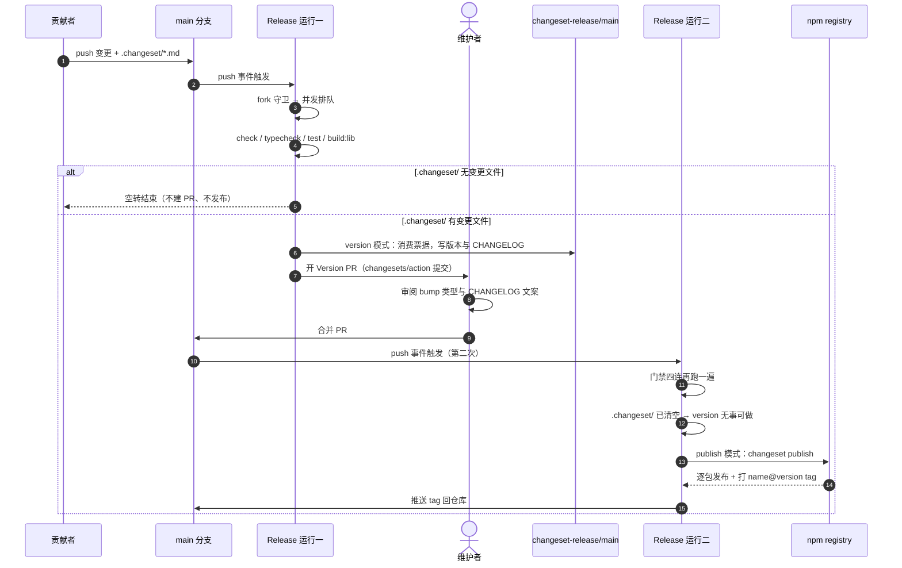
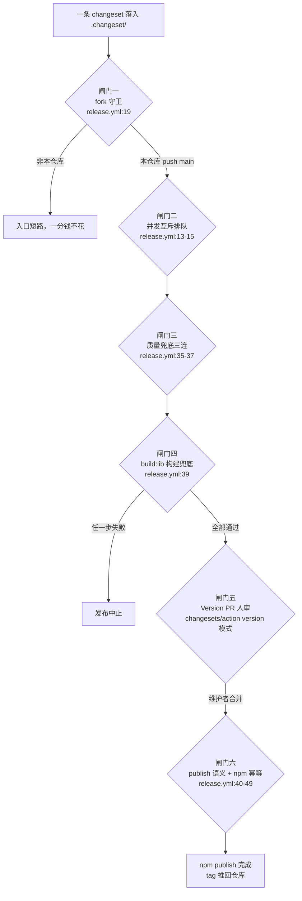

# 2-04 · Changesets 发布流水线与门禁兜底

> 核心问题：**从一条 changeset 到 npm publish，中间有几道闸门？**
> 答案是六道：fork 守卫、并发互斥、质量兜底、构建兜底、Version PR 人审、npm 幂等。前四道写在一个 49 行的 `release.yml` 里，第五道卡在一个人工合并的 PR 上，第六道藏在 npm registry 的发布语义里。这篇我们把 49 行逐行拆开，用一次真实发布（commit `4423210`）做复盘，还会顺手解开一个"考据疑案"：一份变更文件最高只声明了 minor，为什么发出去的版本是 2.0.0？

---

## 一、流程的最小输入单元：一条 changeset 长什么样

整个发布流水线的入口不是某个按钮，而是一批躺在 `.changeset/` 目录下的 markdown 文件。先看这个目录的当前实态：

```bash
$ ls -la .changeset/
total 8
drwxr-xr-x@  3 xiaoye staff   96 Sep 23 06:10 .
-rw-r--r--@  1 xiaoye staff  345 Sep 23 06:10 config.json
```

只剩一个 `config.json`。这不是异常，而是"健康态"：changesets 的模型里，变更文件是**待消费的票据**，被 `changeset version` 消费后就会从目录里消失，化作 `package.json` 的版本号与各包 `CHANGELOG.md` 的新段落。目录空了，说明手头的变更都已被某次发布吸收。

操作入口在根 `package.json`（`package.json:31-33`）：

```json
    "changeset": "changeset",
    "version-packages": "changeset version",
    "release": "changeset publish",
```

三个脚本正好对应流水线的三个动词：`pnpm changeset` 写票据，`pnpm version-packages` 消费票据换版本号，`pnpm release` 把版本号推上 npm。日常开发只与第一个打交道，后两个都被 CI 托管（第三节会看到）。

变更文件长什么样？目录已空，我们用 git 从历史提交 `fd863e4`（chore(changesets): 记录本轮类型修复与依赖治理变更）里取回当时并存的三份。第一份 `.changeset/soft-owls-roll.md`，全文 9 行：

```markdown
---
"xiaoye-components": patch
---
构建产物依赖对齐：`dayjs` 不再内联进产物（与 `dependencies` 声明一致，`vue-router`/`rrule` 补充 external 防御），单文件产物体积下降，消费者不会再重复安装已被内联的依赖。

---
"xiaoye-pro-components": minor
---
修复 `xiaoye-components` 基础库被整体内联进增强库产物的问题：源码引用统一为 npm 包名 `xiaoye-components`，构建时将其 external，并在 `peerDependencies` 中声明 `xiaoye-components: ^1.0.0`。升级后安装本包需同时安装基础库，不再出现组件代码双份。
```

注意它的结构：**两组 frontmatter**。第一段声明 `xiaoye-components: patch`，第二段声明 `xiaoye-pro-components: minor`。这不是官方推荐写法——官方写法是一个 frontmatter 里列多个包——而是人在多次追加时自然长出来的形状。第二份 `.changeset/wild-moons-govern.md`，14 行，干脆是三组：

```markdown
---
"xiaoye-primitives": patch
---
修复类型产物根入口为空的问题（`dist/types/index.d.ts` 此前输出 `export {}`，消费端无法从包根获得类型）：构建 `entryRoot` 对齐包目录并纳入根入口文件。同时移除无引用方的 `utils/compat/rrule.js` 死代码。

---
"xiaoye-components": patch
---
依赖与类型产物治理：运行时改为外部依赖 `xiaoye-primitives`（`dependencies` 以 `workspace:^` 声明），产物内不再内联基础设施代码；类型产物中对 primitives 的断链相对引用统一改写为 npm 包名（1.0.0 产物存在约 200 处此类断链，被消费端 skipLibCheck 默认值掩盖）；移除未使用的 `rrule`、`sortablejs` 依赖声明。

---
"xiaoye-pro-components": patch
---
依赖与类型产物治理：运行时改为外部依赖 `xiaoye-components` 与 `xiaoye-primitives`（peer/dependencies 以 `workspace:^` 声明），产物内不再内联基础库与基础设施代码；类型产物断链引用同步修复；移除未使用的 `rrule` 依赖声明。
```

第三份 `.changeset/tidy-pandas-listen.md`，5 行，是标准的"单 frontmatter 多包"写法吗？也不是——它只声明了一个包：

```markdown
---
"xiaoye-components": minor
---

Table 类型增强：`rowKey` 的 `TablePath` 派生现在支持可选属性的深层路径（如 `meta.identity.id`）；从包根补齐导出 `TableRowClassNameContext`、`TableHeaderRowContext`、`TableHeaderCellContext` 三个回调上下文类型。同时 `tests/types` 类型夹具全量挂载进 `typecheck:types`（原 105 个夹具中约 78 个未参与检查）。
```

同一批提交 `7645d5c`（feat: 设计令牌体系重构为 Stripe 设计语言）还留下了第四份 `.changeset/stripe-tokens.md`，14 行，这份反而是最规范的——一个 frontmatter 里声明三个包同时 minor：

```markdown
---
"xiaoye-components": minor
"xiaoye-pro-components": minor
"xiaoye-primitives": minor
---

重构设计令牌体系：以 Stripe 设计语言为蓝本（design.hagicode.com 收录的 Stripe DESIGN.md 及官方亮/暗 token 目录），建立基元/语义/刻度三层架构。

- tokens.css 全面重写：六族数字标度色板（gray/purple/green/amber/red/blue，锚点取 Stripe 官方值）、语义角色统一命名（text-/bg-/border-/brand-、状态色六件套）、五级蓝调海拔、单调递增 z-index 阶梯（修复 dropdown 高于 modal 的倒挂）、九档无坍缩字号、Stripe 圆角刻度（2/4/5/6/8px）、字体族/字重/行高令牌
- 暗色主题采用官方暗色值：靛黑页面底 #0e0f2e、提亮品牌色 #665efd、白色透明度边框、黑色主导阴影
- 全仓 3444 处旧变量名迁移到新命名；旧名（--xy-color-primary、--xy-text-color-* 等）通过 tokens.css 末尾 @deprecated 兼容层继续生效，存量自定义主题不受影响，兼容层将在下个 major 移除
- packages/tokens TS 常量层改为由 scripts/generate-tokens.mjs 从 tokens.css 生成（新增 pnpm generate:tokens），消除双份手工维护的漂移
- 删除未被任何构建入口引用的前台主题死代码（packages/theme/src/front，--xyu-* 体系）
- 组件视觉随新令牌整体更新：主色 #5b76fe → #533afd、标题/正文切换为深海军蓝/石板灰层级、按钮圆角 2px → 4px、浮层海拔按 Stripe 五级重新分配
```

### 多 section 文件的静默陷阱

`soft-owls-roll.md` 的第二段声明了 `xiaoye-pro-components: minor`，这份声明最终生效了吗？没有。changesets 的解析器（`@changesets/parse`）只把**第一个 frontmatter 块**当作版本声明，`---` 之后的其余文本统统视为"正文"。对 `soft-owls-roll.md` 而言，真正的版本输入只有 `"xiaoye-components": patch` 一行；pro 的那条 minor 被静默吞掉（最终 pro 的 minor 由 `stripe-tokens.md` 提供，所以版本结局没差，但 changelog 语义丢了）。更麻烦的是第二个后果：**全文正文会原样混入 CHANGELOG**。看 `packages/components/CHANGELOG.md:17-26` 的 1.1.0 段：

```markdown
### Patch Changes

- fd863e4: 构建产物依赖对齐：`dayjs` 不再内联进产物（与 `dependencies` 声明一致，`vue-router`/`rrule` 补充 external 防御），单文件产物体积下降，消费者不会再重复安装已被内联的依赖。

  ***

  ## "xiaoye-pro-components": minor

  修复 `xiaoye-components` 基础库被整体内联进增强库产物的问题：源码引用统一为 npm 包名 `xiaoye-components`，构建时将其 external，并在 `peerDependencies` 中声明 `xiaoye-components: ^1.0.0`。升级后安装本包需同时安装基础库，不再出现组件代码双份。
```

在"components 的 Patch Changes"章节正中央，嵌着一行本该是独立声明的 `## "xiaoye-pro-components": minor`。这是多 section 写法留下的化石：正文被当作 components patch 条目的描述原样入库。`wild-moons-govern.md` 同理，只有第一段 `xiaoye-primitives: patch` 参与了计算。

值得停下来想一想：为什么 changesets 不在这里报错？一个"frontmatter 出现两次"的文件，完全可以校验失败、拒绝解析。但 changesets 选择了宽容——解析到什么算什么。宽容的收益是工具永不阻断使用者的工作流，代价是失真静默发生：版本照发、changelog 照写、没人收到任何信号。这提醒我们，**流水线闸门再密，也管不住入口格式**；入口质量只能靠 review 与约定。这也是本文反复出现的一个主题：changesets 负责把"声明"忠实转换为"版本"，而声明本身的正确性，是任何配置都兜不住的。

---

## 二、config.json：16 行的版本哲学

`.changeset/config.json` 全文 16 行（含 `$schema`），我们整篇引完再逐行拆：

```json
{
  "$schema": "https://unpkg.com/@changesets/config@3.0.3/schema.json",
  "changelog": [
    "@changesets/cli/changelog",
    {
      "repo": "zhangzhengyang27/xiaoye-components"
    }
  ],
  "commit": false,
  "fixed": [],
  "linked": [],
  "access": "public",
  "baseBranch": "main",
  "updateInternalDependencies": "patch",
  "ignore": []
}
```

**L2 `$schema`**：锚定到 `@changesets/config@3.0.3` 的 schema。收益是编辑器补全与校验；同时它默默记录了"写这份配置时 changesets 的年代"。

**L3-8 `changelog`**：这里用了双元素数组形式——生成器加参数。`@changesets/cli/changelog` 是默认生成器，`repo` 参数告诉它仓库地址，于是 CHANGELOG 里才有了 `7645d5c: 重构设计令牌体系……` 这样的 commit 前缀，以及"Updated dependencies [fd863e4]"这类可跳转的归属标注。回看第一节引的 pro CHANGELOG，每条变更前的短 hash 就是它的产物。没有这个参数，changelog 也能生成，只是断掉了"文档—提交"的回溯链。

**L9 `commit: false`**：`changeset version` 跑完后不自动提交。在 CI 托管的场景下这没问题——提交这件事由 changesets/action 统一做（它还负责开 PR）。如果改为 true，适合本地手动发版的流程。

**L10 `fixed: []` 与 L11 `linked: []`**：两个都为空。这是本篇第一处重量级设计权衡，值得展开。

`fixed` 是"锁步"机制：把若干包编入一组，组内任何成员要发版时，**全组同步发版，版本号保持一致，bump 类型取组内最高**。Babel 全家桶、lerna 的 fixed/lockstep 模式都是这个思路，适合"对外承诺整体版本"的套件。`linked` 更温和：只同步 bump 类型（你 minor 我也 minor），版本号可以各自走。

本仓三包——`xiaoye-primitives`（基础设施）、`xiaoye-components`（基础组件）、`xiaoye-pro-components`（业务增强）——刻意都不用。理由藏在三包的发布节奏差异里：primitives 的改动是低频的、横切的；components 跟随组件开发高频 patch；pro 最活跃。若锁步，一次 primitives 的 patch 会拉起三包同发，版本号通胀，消费端 changelog 充满"与我无关"的段落；若 linked，pro 的 patch 会被强行抬成 minor，违背 patch 的语义。**空配置不是疏于设计，而是拒绝了一种不适合本仓的一致性模型**。包间的版本同步需求，转由两件更精确的工具承接：`workspace:^` 依赖声明（pro 对 components 的 peer 依赖写的是 `workspace:^`，见 `packages/pro-components/package.json:44-48`）与 L14 的 `updateInternalDependencies`。

**L12 `access: public`**：npm 公开发布的必要声明，缺了它 scoped 包（`@xx/yy` 形态）默认私有，publish 直接被 registry 拒绝。本仓包名虽不带 scope，但显式声明是零成本的自文档。

**L13 `baseBranch: main`**：changesets 判断"相对哪个分支累积变更"的基准。

**L14 `updateInternalDependencies: "patch"`**：当包 A 发布新版本时，所有依赖 A 的内部包至少获得一个 patch bump（用于改写依赖引用与维护依赖关系）。它与 `workspace:^` 是一对搭档：`workspace:^` 在 monorepo 内始终指向本地源码，发布时才被替换成具体的 `^x.y.z`。

**L15 `ignore: []`**：没有包被排除在流程外。workspace 里的 `packages/tokens`、`packages/theme` 本身是 private 包，changesets 默认就会跳过 private 包（除非显式开启 `privatePackages`），所以这里无需登记。

顺带做一个参照系对比。**Element Plus 走的是另一个极端：所有组件打进一个 npm 包**，changesets 只需照看 `element-plus` 一个包，`fixed`/`linked` 对它几乎没有存在意义，也不存在"改基础包要联动改增强包"的依赖矩阵。本仓三包两两联动（pro 依赖 components，components 依赖 primitives），每一行配置都有明确的靶子——单包仓库的配置可以凭直觉，多包仓库的配置必须先回答"包间关系是什么"。

---

## 三、release.yml 精读：49 行的闸门矩阵

现在进入主角。`.github/workflows/release.yml` 全文 49 行，分三段精读。

### 段一：触发、权限与并发（L1-15）

```yaml
name: Release

on:
  push:
    branches: ["main"]
  workflow_dispatch:

# changesets action 需要：开/更新 Version Packages PR（version 模式）与 npm 发布（publish 模式）
permissions:
  contents: write
  pull-requests: write

concurrency:
  group: ${{ github.workflow }}-${{ github.ref }}
  cancel-in-progress: false
```

触发只有两种：push 到 `main`，以及 `workflow_dispatch` 手动触发。**没有 `pull_request` 触发**——发布与 PR 无缘，PR 的质量由另一条 workflow（ci.yml，见下文）负责，两条线各管一段。

L9-11 的 `permissions` 是 GitHub Actions 的最小授权实践：默认 token 权限全仓继承，这里显式收窄到两个能力——`contents: write`（version 模式要推 `changeset-release/main` 分支、publish 模式要推版本 tag）与 `pull-requests: write`（version 模式要开 PR）。L8 的注释把这层依赖写在了配置旁边，让半年后的读者不用去查 action 文档。

L13-15 的 `concurrency` 是第二处权衡：同组（`Release-main`）的运行**排队而不取消**（`cancel-in-progress: false`）。对比 ci.yml 那边，同提交连推时旧运行被取消是常态——CI 跑的是"验证最新代码"，旧结果作废无所谓；Release 跑的是"把当前状态发出去"，取消一个正在发布的运行，可能留下"版本号已 bump、npm 未发布"的悬空态。**发布的队列语义与 CI 的抢占语义天然相反**，一个 `false` 值把这件事说清楚了。

### 段二：守卫、环境与门禁兜底（L17-39）

```yaml
jobs:
  release:
    if: github.repository == 'zhangzhengyang27/xiaoye-components'
    runs-on: ubuntu-latest
    steps:
      - uses: actions/checkout@v4
        with:
          fetch-depth: 0
      - uses: pnpm/action-setup@v4
        with:
          version: 10.30.3
      - uses: actions/setup-node@v4
        with:
          node-version: 22
          registry-url: https://registry.npmjs.org
          cache: pnpm
      - run: pnpm install --frozen-lockfile
      # 发布前门禁兜底：常规质量由 ci.yml 在 main 推送时保障，此处兜底防跳过 CI 的直推
      - run: pnpm check:components && pnpm check:pro-components
      - run: pnpm typecheck
      - run: pnpm test
      # 构建产物供 publish 使用（files 仅含 dist）
      - run: pnpm build:lib
```

L19 的 `if` 是第三处权衡——**fork 守卫**。为什么一个个人仓库需要判断"是不是自己"？三个理由：其一，fork 副本里没有 `NPM_TOKEN`，若放行，流水线会安装全套依赖、跑完门禁与构建，最后才在 publish 一步爆出认证错误——在 job 入口短路是最便宜的失败；其二，fork 上随意 push 也会触发同名 workflow，失败邮件与红叉会持续污染原仓库的行动视图；其三，配合上一节的最小 permissions，构成"不是本仓库就一分钱算力不花、一个权限不要"的边界。

L24 的 `fetch-depth: 0` 拉全量历史，不是习惯，是 changesets 的硬需求：changelog 里每条变更的归属 hash（`7645d5c:`、`fd863e4:`）靠 `git log` 回溯变更文件由哪个提交引入，浅克隆会让归属错乱甚至查无此人。第一节看到的那些短 hash，就是这行配置买回来的。

L25-32 搭环境：pnpm 版本 `10.30.3` 与根 `package.json` 的 `packageManager` 字段同源；node 22 并带 `registry-url: https://registry.npmjs.org`——setup-node 会据此在工作目录生成 `.npmrc`，把 L48-49 注入的 `NODE_AUTH_TOKEN` 挂到对应 registry 上，这是 npm 认证的官方通路。L33 的 `--frozen-lockfile` 保证 CI 不容忍 lockfile 漂移。

L34-37 是全文的核心，注释原文值得一字一句读："**发布前门禁兜底：常规质量由 ci.yml 在 main 推送时保障，此处兜底防跳过 CI 的直推**"。这是第四处权衡，也是标题里"门禁兜底"四个字的出处。理解它的关键是 GitHub 的权限模型：push 到 main 与 PR 检查是两件独立的事，仓库设置允许直推时，任何人都（在权限内）可以绕过 PR 直接 push——ci.yml 那道闸形同虚设。而 release.yml 与 ci.yml 是两个独立 workflow，**无法用 `needs` 建立依赖**，Release 无从知晓"这次 push 的 CI 跑过了没有"。唯一的解法是把关键检查再跑一遍：一致性双查（`check:components && check:pro-components`，对应 `package.json:11` 与 `package.json:15`）、类型（`typecheck`，`package.json:17-19`）、单测（`test`）。用重复计算买"凡是发出去的代码必然过了这套检查"的确定性——这是一笔划算的交易，因为发布频率远低于 CI 频率。

作为对照，看被"兜底"的常规闸门长什么样。`.github/workflows/ci.yml` 全文 41 行：

```yaml
name: CI

on:
  push:
    branches: ["main"]
  pull_request:

jobs:
  check:
    runs-on: ubuntu-latest
    steps:
      - uses: actions/checkout@v4
      - uses: pnpm/action-setup@v4
        with:
          version: 10.30.3
      - uses: actions/setup-node@v4
        with:
          node-version: 22
          cache: pnpm
      - run: pnpm install --frozen-lockfile
      - run: pnpm check:components
      - run: pnpm lint
      - run: pnpm typecheck
      # CI runner 内存有限，文件级并行曾致 OOM flaky（同一提交在 Release job 中全部通过）
      - run: pnpm test -- --no-file-parallelism
      - run: pnpm build

  e2e:
    runs-on: ubuntu-latest
    steps:
      - uses: actions/checkout@v4
      - uses: pnpm/action-setup@v4
        with:
          version: 10.30.3
      - uses: actions/setup-node@v4
        with:
          node-version: 22
          cache: pnpm
      - run: pnpm install --frozen-lockfile
      - run: pnpm exec playwright install --with-deps chromium
      - run: pnpm test:e2e
```

对比可见兜底的"减法"：release.yml 只搬了 `check:components`、`typecheck`、`test` 三件，**没有搬** `lint`（其内的生成物一致性已由两个 check 覆盖大半）、没有 `pnpm build` 全量构建（只构建发布所需的 `build:lib`）、也没有 e2e job。每次发布都跑一遍 Playwright 浏览器套件，会把发布延迟拉长数分钟，而 e2e 挂掉的概率对"能否发布"的判断增益有限——哪些检查值得进发布路径，本身就是成本收益的取舍。另一个细节：ci.yml 在 PR 与 main push 时都跑，release.yml 只在 main push 时跑，两者的触发面也不重叠。

最后 L38-39：`pnpm build:lib`（`package.json:24`，串联 primitives、base、pro 三条构建线）。注释说明缘由："构建产物供 publish 使用（files 仅含 dist）"——三个包的 `package.json` 都用 `files` 把发布内容收窄到 `dist`，CI 的全新环境里没有 dist，必须现构建。把构建放在 publish 之前还有一层含义：**构建失败即发布中止**，残缺产物根本拿不到上台资格。这与 2-03 讲过的 `prepare-package.mjs` 门禁式串联一脉相承。

### 段三：changesets/action 与三个 secret（L40-49）

```yaml
      - uses: changesets/action@v1
        with:
          version: pnpm version-packages
          publish: pnpm release
          title: "chore: version packages"
          commit: "chore: version packages"
        env:
          GITHUB_TOKEN: ${{ secrets.GITHUB_TOKEN }}
          NPM_TOKEN: ${{ secrets.NPM_TOKEN }}
          NODE_AUTH_TOKEN: ${{ secrets.NPM_TOKEN }}
```

L46-49 的三个 env 是"环境三件套"：`GITHUB_TOKEN` 是 Actions 内置凭据，供 action 推分支开 PR；`NPM_TOKEN` 与 `NODE_AUTH_TOKEN` 同值双写——changesets/action 的约定是读 `NPM_TOKEN`，而 npm cli 本身认 `NODE_AUTH_TOKEN`，双写让两套消费方各取所需，不必在脚本里做变量搬运。

发布与文档站构建则是解耦的。第三条 workflow `.github/workflows/docs.yml` 全文 22 行：

```yaml
name: Docs

on:
  workflow_dispatch:
  push:
    branches: ["main"]

jobs:
  build-docs:
    runs-on: ubuntu-latest
    steps:
      - uses: actions/checkout@v4
      - uses: pnpm/action-setup@v4
        with:
          version: 10.30.3
      - uses: actions/setup-node@v4
        with:
          node-version: 22
          cache: pnpm
      - run: pnpm install --frozen-lockfile
      - run: pnpm build:docs
```

`.github/workflows/` 下就这三条：ci.yml（41 行，push main + 全部 PR）、release.yml（49 行，仅 push main + 手动）、docs.yml（22 行，push main + 手动）。版本发布与文档构建互不等待、互不阻塞——文档挂了不该拦发布，发布挂了不该重发文档。

---

## 四、两次运行一条 PR：version 模式与 publish 模式

`changesets/action` 是一个"单入口、双模式"的 action，同一个 job 在不同状态下走完全不同的分支：

```yaml
# changesets/action 的双模式判定（示意，逻辑与官方实现一致）
# 每次运行先检查 .changeset/ 下是否存在变更文件：
#
# 存在 → version 模式：
#   1. 跑 version 命令（本仓是 pnpm version-packages）
#   2. 消费掉所有 .changeset/*.md：写版本号进 package.json、追加 CHANGELOG.md
#   3. 把变更提交到 changeset-release/<baseBranch> 分支
#   4. 开（或更新）一个标题为 title 的 PR，然后结束——不发布
#
# 不存在 → publish 模式：
#   1. 跑 publish 命令（本仓是 pnpm release，即 changeset publish）
#   2. 对每个包：本地 package.json 版本高于 npm registry 上的最新版才发布
#   3. 发布成功的包打 name@version 格式的 git tag
#   4. 把 tag 推回仓库，结束
- uses: changesets/action@v1
  with:
    version: pnpm version-packages   # version 模式的入口命令
    publish: pnpm release            # publish 模式的入口命令
    title: "chore: version packages" # Version PR 的标题
    commit: "chore: version packages" # Version PR 里的提交信息
  env:
    GITHUB_TOKEN: ${{ secrets.GITHUB_TOKEN }} # 推分支、开 PR
    NPM_TOKEN: ${{ secrets.NPM_TOKEN }}       # action 侧的 npm 凭据
    NODE_AUTH_TOKEN: ${{ secrets.NPM_TOKEN }} # npm cli 侧的认证（同值双写）
```

于是"从一条 changeset 到 npm publish"完整地需要**两次 Release 运行、一次人工合并**：



把其中的闸门抽出来单看，就是核心问题的答案：



第五道闸门"人审"值得单独强调：version 模式**从不直接修改 main**。它把版本 bump 与 CHANGELOG 装进一个 PR，等维护者亲手合并。这个 PR 是整条流水线上唯一的强制人工环节——机器算出的 bump 类型、生成的 changelog 文案，都在这里接受人眼检验。合并后第二次触发 Release，此时 `.changeset/` 已被清空，version 模式无事可做，action 顺势走 publish 分支。

publish 的语义写在 changesets 的规则里：逐包比较"本地 `package.json` 版本"与"npm registry 上的最新版本"，**只发更高的**。发布成功的包会被打上 `name@version` 格式的 tag 推回仓库。本仓 `git tag` 里的 17 个标签全部符合这个格式（`xiaoye-components@0.2.0` 到 `xiaoye-pro-components@2.0.0`），其中 1.1.0/2.0.0 这批都指向 Version PR 的 merge commit——publish 运行时 HEAD 就停在那里。

```bash
$ git tag
xiaoye-components@0.2.0
xiaoye-components@0.3.0
xiaoye-components@0.4.0
xiaoye-components@0.5.0
xiaoye-components@0.5.1
xiaoye-components@1.0.0
xiaoye-components@1.1.0
xiaoye-mcp-server@0.1.1
xiaoye-primitives@0.1.1
xiaoye-primitives@1.0.0
xiaoye-primitives@1.1.0
xiaoye-pro-components@0.2.0
xiaoye-pro-components@0.3.0
xiaoye-pro-components@0.3.1
xiaoye-pro-components@0.3.2
xiaoye-pro-components@1.0.0
xiaoye-pro-components@2.0.0
```

不妨反向思考一下：如果没有 changesets/action，这些逻辑都得自己写。发布脚本至少要补上"哪些包需要发"的判断：

```yaml
# 假想：没有 changesets/action 时，publish 分支需要自己补齐的判断逻辑
- name: 判断哪些包需要发布
  id: should-publish
  run: |
    need=""
    for pkg in components pro-components xiaoye-primitives; do
      local_v=$(node -p "require('./packages/${pkg}/package.json').version")
      remote_v=$(npm view "${pkg}" version 2>/dev/null || echo "0.0.0")
      if [ "$local_v" != "$remote_v" ]; then
        echo "待发布: ${pkg} ${remote_v} -> ${local_v}"
        need="yes"
      fi
    done
    echo "need=${need}" >> "$GITHUB_OUTPUT"
- name: 发布并回推 tag
  if: steps.should-publish.outputs.need == 'yes'
  run: |
    pnpm release
    # tag 不推回仓库，消费端就失去"发布锚点"：
    # 既无法在源码里定位某个版本的内容，也让 changesets 归属标注断链
    git push origin "refs/tags/xiaoye-*"
```

比较版本号、处理"registry 上还不存在"的首发场景、处理 tag 推送……这些边角一旦自己维护，就是一堆没人爱看的 shell。action 把"状态机 + 双模式 + 判断语义"打包成 49 行里的 10 行，这就是复用成熟 action 的价值。而 npm registry 本身贡献了最后一道物理闸门：对同一版本号的重复 publish，registry 直接拒绝（HTTP 409 "cannot publish over the previously published version"），流水线无论怎么重跑都不会造成"重复发布"事故——幂等性由 registry 兜底。

---

## 五、实战复盘 4423210：一场发布的三个真实故事

理论讲完，看一次真实发布。`4423210`（完整 hash `442321062b72d42ed2ce5f3f5a21fb7537e67f61`）就是那条 Version PR 的提交，作者是 `github-actions[bot]`，时间 2026-09-15：

```bash
$ git show 4423210 --stat --oneline
4423210 chore: version packages
 .changeset/soft-owls-roll.md            |  9 ---------
 .changeset/stripe-tokens.md             | 14 --------------
 .changeset/tidy-pandas-listen.md        |  5 -----
 .changeset/wild-moons-govern.md         | 14 --------------
 packages/components/CHANGELOG.md        | 29 ++++++++++++++++++++++++++++-
 packages/components/package.json        |  2 +-
 packages/pro-components/CHANGELOG.md    | 20 +++++++++++++++++++-
 packages/pro-components/package.json    |  2 +-
 packages/xiaoye-primitives/CHANGELOG.md | 29 ++++++++++++++++++++++++++++-
 packages/xiaoye-primitives/package.json |  2 +-
 10 files changed, 78 insertions(+), 48 deletions(-)
```

四份票据被消费（删除），三个包的版本号与 CHANGELOG 被改写。一个提交，三个故事。

### 故事一：混入 CHANGELOG 的"幽灵声明"

第一节已经看过结局：`soft-owls-roll.md` 第二段对 pro 的 minor 声明被忽略，其正文以 `## "xiaoye-pro-components": minor` 的形态嵌进了 components 的 patch 条目（`packages/components/CHANGELOG.md:23`）。这场发布同批并入的 `wild-moons-govern.md` 同样只有第一段生效。幸运的是 `stripe-tokens.md` 用规范写法给三个包都声明了 minor，版本结局没有偏差——但 changelog 的语义已经受损：读者在 pro 的 2.0.0 段落里找不到"基础库不再被内联"这条重要变更的独立条目，它藏在 components 的 changelog 正文里。教训落在流程侧：变更文件写完多看一眼，单文件单 frontmatter，多包写在同一个 frontmatter 里。

### 故事二：一份 minor 声明，为何发出 2.0.0

这是本次复盘最有趣的部分。核对三个包的前后版本：

| 包 | 父提交版本 | 4423210 之后 | 变更文件直接声明 |
| --- | --- | --- | --- |
| xiaoye-components | 1.0.0 | 1.1.0 | minor ×2 + patch ×1 → 取 minor |
| xiaoye-primitives | 1.0.0 | 1.1.0 | minor ×1 + patch ×1 → 取 minor |
| xiaoye-pro-components | 1.0.0 | **2.0.0** | 仅 minor |

components 与 primitives 的 minor 都对得上账，唯独 pro 直跳了 major——而四份变更文件里对 pro 的最高声明只是 minor。更要命的是，生成的 `packages/pro-components/CHANGELOG.md:3-13` 里，段落标题写的还是"Minor Changes"：

```markdown
## 2.0.0

### Minor Changes

- 7645d5c: 重构设计令牌体系：以 Stripe 设计语言为蓝本（design.hagicode.com 收录的 Stripe DESIGN.md 及官方亮/暗 token 目录），建立基元/语义/刻度三层架构。
  - tokens.css 全面重写：六族数字标度色板（gray/purple/green/amber/red/blue，锚点取 Stripe 官方值）、语义角色统一命名（text-/bg-/border-/brand-、状态色六件套）、五级蓝调海拔、单调递增 z-index 阶梯（修复 dropdown 高于 modal 的倒挂）、九档无坍缩字号、Stripe 圆角刻度（2/4/5/6/8px）、字体族/字重/行高令牌
  - 暗色主题采用官方暗色值：靛黑页面底 #0e0f2e、提亮品牌色 #665efd、白色透明度边框、黑色主导阴影
  - 全仓 3444 处旧变量名迁移到新命名；旧名（--xy-color-primary、--xy-text-color-\* 等）通过 tokens.css 末尾 @deprecated 兼容层继续生效，存量自定义主题不受影响，兼容层将在下个 major 移除
  - packages/tokens TS 常量层改为由 scripts/generate-tokens.mjs 从 tokens.css 生成（新增 pnpm generate:tokens），消除双份手工维护的漂移
  - 删除未被任何构建入口引用的前台主题死代码（packages/theme/src/front，--xyu-\* 体系）
  - 组件视觉随新令牌整体更新：主色 #5b76fe → #533afd、标题/正文切换为深海军蓝/石板灰层级、按钮圆角 2px → 4px、浮层海拔按 Stripe 五级重新分配
```

版本号说 major，段头说 minor，同一份机器产物自相矛盾。仅看仓库证据，这个 major 似乎"无法定位"：PR 分支上只有 bot 的一个提交（`git log 4423210^..8f6b5ea` 只有 `4423210` 与 merge 两笔，排除人工在 PR 里改版本）；父提交里 pro 就是 1.0.0；当时的 config.json 与今天逐字相同。

但线索其实已经摆在台面上了：**pro 的段头之所以写 Minor，是因为段头只反映"直接声明给 pro 的 changeset"；而版本号反映的是 assemble-release-plan 的完整计算，其中包含依赖级联**。pro 以 `peerDependencies` 依赖 components（`packages/pro-components/package.json:44-48`），声明正是第一节 soft-owls-roll 正文里提到的 `workspace:^`：

```json
  "peerDependencies": {
    "vue": "^3.5.0",
    "vue-router": "^4.6.0",
    "xiaoye-components": "workspace:^"
  },
  "peerDependenciesMeta": {
    "vue-router": {
      "optional": true
    }
  },
```

当一个包以 peer 依赖另一个包、且被依赖包要发 minor 或 major 时，changesets 会把依赖方级联成 major——规则写在发布时实际安装的 `@changesets/assemble-release-plan@6.0.9` 源码里（`node_modules/.pnpm/@changesets+assemble-release-plan@6.0.9/.../dist/changesets-assemble-release-plan.esm.js:300-316`）：

```javascript
function shouldBumpMajor({
  dependent,
  depType,
  versionRange,
  releases,
  nextRelease,
  preInfo,
  onlyUpdatePeerDependentsWhenOutOfRange
}) {
  // we check if it is a peerDependency because if it is, our dependent bump type might need to be major.
  return depType === "peerDependencies" && nextRelease.type !== "none" && nextRelease.type !== "patch" && (
  // 1. If onlyUpdatePeerDependentsWhenOutOfRange set to true, bump major if the version is leaving the range.
  // 2. If onlyUpdatePeerDependentsWhenOutOfRange set to false, bump major regardless whether or not the version is leaving the range.
  !onlyUpdatePeerDependentsWhenOutOfRange || !semverSatisfies(incrementVersion(nextRelease, preInfo), versionRange)) && (
  // bump major only if the dependent doesn't already has a major release.
  !releases.has(dependent) || releases.has(dependent) && releases.get(dependent).type !== "major");
}
```

逐条件代入：`depType === "peerDependencies"` 成立；components 的 `nextRelease.type` 是 minor，既非 none 也非 patch，第二个条件成立；`onlyUpdatePeerDependentsWhenOutOfRange` 的默认值是 `false`（`@changesets/config@3.1.3` 的 `changesets-config.esm.js:327`：未配置该实验选项时取 `false`），于是"只在新版本脱离 range 时才级联"的保护不生效，第三个条件成立；pro 此前没有 major，第四个条件成立。四条全中，调用处（同文件 L207）执行 `type = "major"`——pro 被强制抬到 2.0.0。

顺带看清同一场发布里的对照组：components 依赖 primitives 走的是 `dependencies` 而非 peer，`shouldBumpMajor` 第一条件就不满足，所以 primitives 的 minor 没有把 components 级联成 major；而 `workspace:^` 这类非标准 range 在参与 semver 判断前会被剥壳（同文件 L279-292：`workspace:^` 展开为 `^旧版本`），保证 range 判断不至于在非标准字符串上失灵。

谜底揭晓：**major 的来源不是任何一份变更文件，而是 changesets 对 peer 依赖的默认级联策略**。这次它恰好"做对了"——令牌重构加 peer 契约变更，本就该以 major 告知消费者（soft-owls-roll 的正文也写了"升级后安装本包需同时安装基础库"）；但段头与版本号的矛盾说明：级联产生的影响不会写进 changelog，只能靠读者自己从"Updated dependencies"行里推断。pro 的 2.0.0 段落末尾正是这三行（`packages/pro-components/CHANGELOG.md:15-20`）：

```markdown
### Patch Changes

- Updated dependencies [fd863e4]
- Updated dependencies [7645d5c]
- Updated dependencies [fd863e4]
  - xiaoye-components@1.1.0
```

三行"Updated dependencies"是级联留下的全部痕迹——major 没有任何 changelog 条目。若想让"新版本脱离 range 才级联"，需在 config 里显式开启 `___experimentalUnsafeOptions_WILL_CHANGE_IN_PATCH.onlyUpdatePeerDependentsWhenOutOfRange: true`——注意这个选项名里带着 `WILL_CHANGE_IN_PATCH` 的警告，官方自己都标注它可能变。

这个案例也给"考据"立了个方法标杆：仓库证据找不到答案时，把依赖树再往下挖一层——`node_modules` 里安装的每一行源码，都是仓库证据的一部分。

### 故事三：1.0.0 们不是这条流水线发的

第三个故事关于流水线的"史前史"。三个包的 1.0.0 tag 指向同一个提交：

```bash
$ git log -1 --format='%h %an %s' "$(git rev-list -1 xiaoye-pro-components@1.0.0)"
3124113 zhangzhengyang fix(theme): 修复文档站暗黑模式切换不完整

$ git log -1 --format='%h %an %s' "$(git rev-list -1 xiaoye-pro-components@0.3.2)"
2272f8b zhangzhengyang feat(admin-template): 实现深色/浅色主题切换功能
```

不是 `chore: version packages`，作者不是 bot——三个 1.0.0 都是在人工提交 `3124113` 上手工打的 tag，属于**流程外发布**：本地改版本号、手动 `npm publish`、手工 `git tag`。佐证还有 `packages/pro-components/CHANGELOG.md:77-95` 的 1.0.0 段：它被手工补写在文件末尾（changesets 生成的段落永远 prepend 在文件顶部，而 2.0.0 在 L3、0.3.2 在 L58、1.0.0 反而吊在 L77），文体也是自由体的导语加手工拼装列表：

```markdown
## 1.0.0

首个开源稳定版本。自 0.5.1 以来的核心变化：

- **主题系统 token 化**：全量组件 CSS 收口到设计令牌，消除硬编码色值，暗色模式补齐 47 个变量
- **浮层视觉基线统一**：dialog / drawer / tooltip / popconfirm 的背景、边框、阴影、圆角按层级收敛到统一基线
- **Table 增强**：主题 token 收口，新增 dashboard 场景的 `overview` 轻量密度能力
- **契约收口**：修复组件源码契约兼容问题，文档与源码对表一致
- **工程配套**：补齐迁移指引、popper 示例与 28 个组件测试用例适配

### Minor Changes

- 全量组件 CSS token 化，消除硬编码色值

### Patch Changes

- 修复文档站暗黑模式切换不完整
- 修复组件源码契约问题和增强浮层能力
- 收口组件契约兼容、浮层视觉基线、table token/overview 和 docs 契约一致性
```

更早的 0.x 段落同样露出手工痕迹：版本段按 0.2.0 → 0.3.0 → 0.3.1 → 0.3.2 升序排列（changesets 的 prepend 语义下，机器产物必然降序），条目中英混排（"feat add watermark component"）。也就是说，**本仓的发布流程是"先跑通、后补票"：0.x 与 1.0.0 是手工时代，PR #1（`changeset-release/main` 分支，merge commit `8f6b5ea`）才是流水线的首次完整运转**。这也解释了为什么 tag 里的 `xiaoye-pro-components@2.0.0` 指向 merge commit 而非更早的任何人工提交——从 2.0.0 起，发布锚点才真正由流水线签发。

对照着看，流水线产品的指纹也很清晰：2.0.0 段落里每条变更带 commit 短 hash（config.json 的 repo 参数产物）、"Updated dependencies"三行机器生成（L17-19）、段落置顶。手工补写与机器生成在同一个 CHANGELOG 文件里泾渭分明。

---

## 六、回答核心问题：六道闸门清单

把第四节的流程图落成清单——从一条 changeset 到 npm publish，共六道闸门：

1. **闸门一：fork 守卫**（`release.yml:19`）。`if: github.repository == 'zhangzhengyang27/xiaoye-components'`，非本仓库的触发在 job 入口短路，不花算力、不碰密钥、不污染行动视图。
2. **闸门二：并发互斥**（`release.yml:13-15`）。`concurrency` 组排队且 `cancel-in-progress: false`，发布串行化，杜绝两个版本流程交叠。
3. **闸门三：质量兜底**（`release.yml:35-37`）。一致性双查、typecheck、test 在发布路径上重跑一遍，封死"绕过 PR 直推 main"的口子。
4. **闸门四：构建兜底**（`release.yml:39`）。`build:lib` 现场构建，`files` 仅含 dist——构建失败，无物可发。
5. **闸门五：Version PR 人审**（`release.yml:40-45` 的 version 模式）。版本 bump 与 CHANGELOG 以 PR 形式强制过人眼，且从不直改 main。
6. **闸门六：publish 语义与 npm 幂等**（`release.yml:40-49` 的 publish 模式）。只发"本地版本高于 registry"的包；同版本重复发布被 registry 拒绝，重跑流水线不会酿成事故。

在六道之前还有一道"第零道"：写 changeset 本身。它没有机器强制——仓库没有配置 changeset-bot，PR 里不带变更文件不会有任何东西报警，全靠团队约定与第一节那类"静默陷阱"的自我修养。这里正好可以做第二个参照对比：**Element Plus 这类多人协作的头部仓库，PR 工作流里驻着 changeset-bot，缺变更文件的 PR 会被机器人自动点名提醒**，把"第零道"从自觉升级成 PR 时点的机器检查。本仓是单人驱动的小团队仓库，维持 bot 是额外成本，于是选择把兜底全部后置到 release.yml——用发布路径上的硬闸门，补偿入口路径上的软约束。两种取舍没有高下，只有团队形态的匹配。

---

## 七、这条流水线还没做的事

诚实的架构文要以边界收尾。当前发布链路至少有四处可以继续加固的空间：其一，`NPM_TOKEN` 是长效凭据，尚未启用 npm provenance（基于 GitHub Actions OIDC 的短时凭据与来源证明），密钥泄露面与包来源可信度都还有优化余地；其二，门禁兜底是 ci.yml 的子集，e2e、lint、`audit:visual` 视觉巡检都不在发布路径上——发布前的最后状态与 CI 通过状态之间仍有窗口期；其三，Version PR 的审阅目前只有"人看"，缺少机器复核（例如校验 bump 类型与 semver 语义的一致性、校验 CHANGELOG 与 public API diff 的对表）——像 2.0.0 那样"版本号是 major、changelog 里却没有一条 major 条目"的状态，机器一查便知，却只能依赖审阅者恰好想到去数；其四，多 section 变更文件的静默陷阱，可以用一个十行的 pre-commit 校验（拒绝 `.changeset/*.md` 中出现第二个 frontmatter）根治，成本几乎为零。这些不完美恰好构成下一篇的天然入口——门禁的"编排"永远是在成本与覆盖面之间挪动边界。

---

## 下一篇

下一篇是 **2-05《CI 门禁编排与两条真实踩坑》**：release.yml 里反复引用的"常规质量"到底由 ci.yml 怎样编排？`ci.yml:24` 那条"CI runner 内存有限，文件级并行曾致 OOM flaky（同一提交在 Release job 中全部通过）"的注释背后，是一次怎样的排查过程？两条真实踩坑——测试并行化的 OOM flaky 与门禁时序的坑——会把"兜底"与"常规"两道闸门之间的缝隙照得透亮。我们下一篇见。
