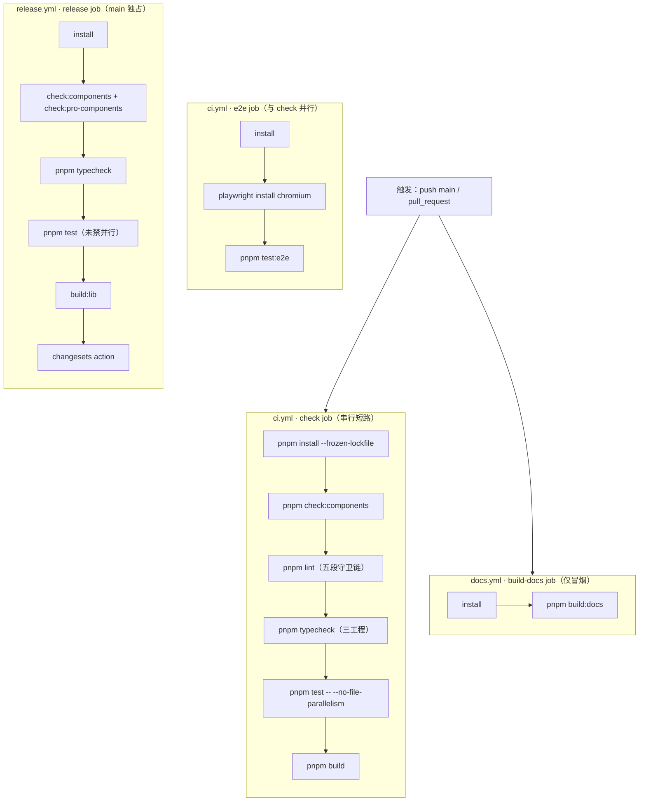
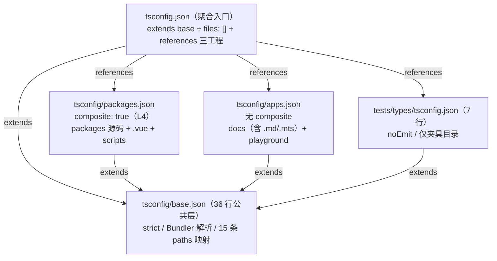
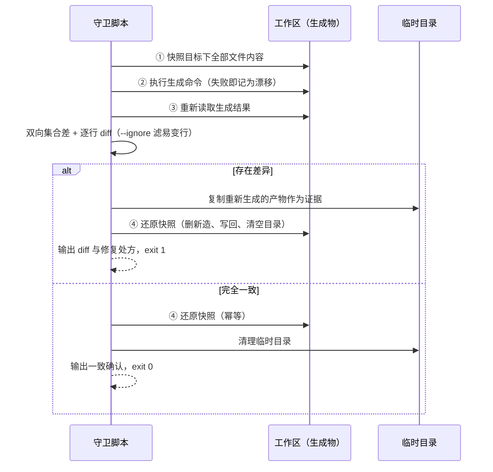

# 2-05 · CI 门禁编排与两条真实踩坑

> 上一篇（2-04）我们跟着一条 changeset 走完了从写入到 npm publish 的发布流水线。这一篇往上游退一步，回答一个更日常也更疼的问题：**CI OOM 与 typecheck 工程拆分，是如何被治理的？**
>
> 先给结论：靠的不是"给 runner 加内存"或者"把测试删掉几个"，而是三个东西——一份**把质量检查压成串行短路的 check job**（`.github/workflows/ci.yml`，全文 41 行）、一道**把环境策略留在调用点的测试旗标**（`pnpm test -- --no-file-parallelism`）、以及一套**自仓库第一天就定型的三工程 typecheck 拆分**（`tsconfig/` 三件套加类型夹具独立工程）。顺带还有一条正在生长的 lint 链：它如今是五段，其中两段生成物守卫截至本文写作时还躺在工作区里没提交。下面逐层拆开。

## 一、先看全景：一条串行的门禁链，一个并行的例外

打开 `.github/workflows/ci.yml`，全部 41 行里没有 matrix、没有缓存技巧、没有花哨的 action，前 26 行是唯一的质量门禁 job：

```yaml
# .github/workflows/ci.yml（L1-26：头部与 check job 全段）
name: CI

on:
  push:
    branches: ["main"]
  pull_request:

jobs:
  check:
    runs-on: ubuntu-latest
    steps:
      - uses: actions/checkout@v4
      - uses: pnpm/action-setup@v4
        with:
          version: 10.30.3
      - uses: actions/setup-node@v4
        with:
          node-version: 22
          cache: pnpm
      - run: pnpm install --frozen-lockfile
      - run: pnpm check:components
      - run: pnpm lint
      - run: pnpm typecheck
      # CI runner 内存有限，文件级并行曾致 OOM flaky（同一提交在 Release job 中全部通过）
      - run: pnpm test -- --no-file-parallelism
      - run: pnpm build
```

注意 L24 那行注释——它是本篇第一条踩坑的案发现场标记，我们第二节再回到这里。先看结构：**六个 run 串成一条链，前一步不过，后一步不跑**。`check:components`（组件清单一致性）、`lint`（五段守卫链，第四节展开）、`typecheck`（三工程检查，第三节展开）、`test`、`build`，任何一步失败，整个 job 立刻红掉。这不是巧合，而是刻意的编排选择：**门禁要的不是并行速度，而是"第一个失败原因"的清晰可见**。六个步骤串行跑，日志从上往下读就是失败原因的优先级排序；要是拆成六个并行 job，一次提交可能同时收到五封失败邮件，而其中四封只是第一封的连锁反应。

e2e 是唯一的例外，被单独放进了第二个 job：

```yaml
# .github/workflows/ci.yml（L28-41：e2e job 全段）

  e2e:
    runs-on: ubuntu-latest
    steps:
      - uses: actions/checkout@v4
      - uses: pnpm/action-setup@v4
        with:
          version: 10.30.3
      - uses: actions/setup-node@v4
        with:
          node-version: 22
          cache: pnpm
      - run: pnpm install --frozen-lockfile
      - run: pnpm exec playwright install --with-deps chromium
      - run: pnpm test:e2e
```

两个 job 在 GitHub Actions 层面是并行调度的。为什么 e2e 值得单独一个 job？三个理由：其一，`playwright install --with-deps chromium` 要往系统里装浏览器和一堆 apt 依赖，这步又慢又重，把它和单测塞在同一个 job 里会让每条 PR 的门禁时间被浏览器下载拖住；其二，e2e 的失败模式和单测完全不同——单测红通常是逻辑或类型问题，e2e 红经常是环境、时序、选择器问题，分开放让"该找谁修"一目了然；其三，它给了 e2e 独立的扩容空间，将来想把 e2e 挪到定时任务或拆分项目，改一个 job 就够。

值得注意的是 `test:e2e`（根 `package.json` L36）只在这条 e2e job 里出现，而 vitest 侧通过 `vitest.config.ts` 的 `exclude` 把 `tests/e2e/**` 排除在外——**单测与 e2e 的分流在配置层就已经完成，CI 编排只是把这条分界线复制了一遍**。

整个仓库的 CI 编排可以画成一张图：



图里有个刻意画出来的刺眼处：release job 的 `pnpm test` 没有带 `--no-file-parallelism`。这个不对称是真实的、也是有意留到本文讨论的，第二节末尾细说。

## 二、踩坑一：CI OOM flaky——同一提交，两个 job，一红一绿

### 2.1 案发现场

这条踩坑有完整的 git 存档。2026-09-16 凌晨的提交 `2a0bded`，提交信息原文如下：

```text
ci: 修复 Release 权限缺失与 CI 测试 OOM flaky

- release.yml 补 permissions 块：changesets action 开 Version Packages PR
  需要 contents/pull-requests 写权限（默认只读 token 被拒）
- ci.yml test 改为 --no-file-parallelism：2 核 runner 上文件级并行
  内存峰值致 flaky（同一提交在 Release job 中 990 测试全过）
```

复盘一下现象的时间线。起因是几条 main 推送触发了 changesets action 建不出 Version Packages PR——GitHub 默认给 workflow 的 GITHUB_TOKEN 是只读的，而 changesets 开 PR 需要 `contents: write` 和 `pull-requests: write`。这是第一条小坑，修复是 release.yml 顶部补上权限块（如今位于 `.github/workflows/release.yml` L8-11）：

```yaml
# .github/workflows/release.yml（L8-15）
# changesets action 需要：开/更新 Version Packages PR（version 模式）与 npm 发布（publish 模式）
permissions:
  contents: write
  pull-requests: write

concurrency:
  group: ${{ github.workflow }}-${{ github.ref }}
  cancel-in-progress: false
```

权限补上之后，Release 流水线通了，但 CI 开始间歇性变红——`pnpm test` 这一步被 OOM killer 干掉，而且不是每次都红。诊断过程里最关键的一条证据就是提交信息括号里那句话：**同一个提交，check job 的测试步骤内存爆掉，Release job 里同一份测试套件 990 个用例全过**。同一份代码、同样的测试、不同的 job，一红一绿——这不是测试有 bug，是资源峰值踩线。

### 2.2 根因链条

把内存去哪儿了拆开看，是一条四环相扣的链：

**第一环：vitest 的文件级并行是默认开启的。** vitest 4 在没有显式配置 pool 的情况下默认使用 `forks` 池，并且默认允许多个测试文件并行执行（worker 数按宿主机 CPU 推算）。在本地 8 核、16 核的开发机上，这是纯赚的加速；在 GitHub 托管的标准 runner 上——提交信息里写得很清楚，是 2 核规格——并行度虽然被压到很低，但每个 worker 都是一份独立的 Node 进程。

**第二环：每个测试文件都要起一份 jsdom。** `vitest.config.ts` 里 `environment: "jsdom"` 是全局配置，意味着 76 个 spec 文件里的每一个，在执行前都要完整构造一个 jsdom 环境：一份模拟的 DOM 树、一份 window/document/navigator 全家桶。jsdom 是出了名的内存大户，单个环境的常驻开销就不小，几份并存时内存曲线是台阶式跳涨的。

**第三环：每个测试文件还要加载完整的组件模块图。** 这是组件库单测的天然形态——测 `button` 要挂载组件，挂载要走 `@vitejs/plugin-vue` 编译后的渲染函数，要引 `xiaoye-primitives` 的组合式工具、要解析 `workspaceAlias` 指回源码的别名。fork 出的每个子进程都是"jsdom + Vue 运行时 + 组件模块图"的三层叠加，单文件峰值轻松上百 MB。

**第四环：2 核 runner 的内存天花板。** 标准规格的内存上限配合三条并存的 fork，峰值贴着上限走。贴着上限走的含义就是 flaky：跑得快的时候前面的进程已经退出、内存还给了系统，跑得慢的时候三层叠加撞在一起，OOM killer 直接收走进程，vitest 报一个莫名其妙的非零退出码。

这也解释了"Release job 全过"的悖论：Release job 同样跑 `pnpm test`（如今在 `.github/workflows/release.yml` L37），同样的并行策略，但它通过的时点不同——那次运行里 fork 的调度恰好错峰，峰值没有触顶。**flaky 的本质不是"必然失败"，而是"峰值方差跨过了门槛"**，这也是它比确定性失败更值得花力气治理的原因：你没法用一个红色的报错定位它，只能靠"多跑几次试试"来复现。

### 2.3 治理选型：为什么是 CLI 旗标，而不是别的

面对 OOM flaky，候选方案至少有四个，逐一过一遍权衡：

**方案 A：runner 升配。** 换大规格 runner，内存翻倍，峰值自然触不到顶。代价是真金白银——大规格 runner 按分钟计费，而这个仓库的测试套件在 CI 上一天要跑几十次；更重要的是它把问题往后掩了：组件还在以每周几个的速度增长（写作时点 72 个基础组件、76 个 spec 文件），今天升的配额明天又贴线。治标不治本，否决。

**方案 B：把并行度调低一点。** 比如 `--maxWorkers=1` 之外的软性限流，或者 pool 换成 `threads`（线程池共享内存，比 fork 省一些）。`threads` 池确实更省内存，但 jsdom 这种重度 DOM 模拟在线程池里有已知的稳定性坑，vitest 官方也把 `forks` 作为 jsdom 场景的推荐默认；`maxWorkers` 调参则是个玄学游戏，调到 2 还是 1.5 都是在赌峰值方差。否决。

**方案 C：在 `vitest.config.ts` 里写死 `fileParallelism: false`。** 一行配置，全局生效，CI 和本地一起串行。问题是它误伤了本地开发：本地动辄 8 核以上，文件级并行能把 76 个 spec 的总时长压到串行的几分之一，为了 CI 的内存天花板让本地的反馈速度陪葬，是拿高频场景给低频场景还债。否决。

**方案 D（采纳）：环境策略放调用点。** 配置文件保持默认，CI 命令行加 `--no-file-parallelism`——也就是 ci.yml L25 的 `pnpm test -- --no-file-parallelism`。本地的 `pnpm test`、`pnpm test:watch` 一切照旧全速并行，只有 CI 这一个调用点降级为串行。代价是这行知识写在了 CI 的 yml 里而不是 vitest 配置里，读到 `vitest.config.ts` 的人不会知道 CI 有这个特殊行为——所以仓库的做法是在 L24 留了一行注释，把"为什么"钉在"是什么"旁边。

这就是本篇第一个值得带走的选型判断：**"测试是什么"归配置文件，"测试怎么跑"归调用点。** `vitest.config.ts` 回答的是环境、别名、setup、排除规则这些测试的本质属性；并行度是资源策略，随运行环境（本地 16 核还是 CI 2 核）而变，写死在配置里等于把环境假设焊进了仓库。看一下这份配置的全貌，确认它确实没有夹带任何并行策略：

```ts
// vitest.config.ts（全文，L1-21）
import { defineConfig } from "vitest/config";
import vue from "@vitejs/plugin-vue";
import { workspaceAlias } from "./scripts/config/aliases";

export default defineConfig({
  plugins: [vue()],
  resolve: {
    alias: workspaceAlias
  },
  test: {
    environment: "jsdom",
    globals: true,
    setupFiles: ["./vitest.setup.ts"],
    exclude: [
      "tests/e2e/**",
      "node_modules/**",
      "**/node_modules/**",
      "dist/**"
    ]
  }
});
```

21 行，这就是 OOM 治理的另一半：它刻意保持极简，只声明四件事——jsdom 环境（2.2 节第二环的来源，也是单测语义的承载）、`workspaceAlias` 复用 `scripts/config/aliases.ts` 的那份纯数据别名（2-01 的主角，四条工具链共享同一份映射）、全局 mock 图标的 setup 文件、以及把 e2e 和构建产物挡在 vitest 门外。**并行策略不在这里，正是这份配置的成熟之处。**

顺带一提 `pnpm test -- --no-file-parallelism` 里那个 `--` 的细节：pnpm 需要 `--` 把后面的参数透传给 script 本体（`vitest run`），少了它 pnpm 会把旗标当成自己的参数解析。这类小坑不写进注释就会在某个深夜再坑一次人。

### 2.4 诚实记录：那条没同步的不对称

最后回到全景图里那个刺眼处——release.yml 的兜底段：

```yaml
# .github/workflows/release.yml（L33-39：发布前门禁兜底）
      - run: pnpm install --frozen-lockfile
      # 发布前门禁兜底：常规质量由 ci.yml 在 main 推送时保障，此处兜底防跳过 CI 的直推
      - run: pnpm check:components && pnpm check:pro-components
      - run: pnpm typecheck
      - run: pnpm test
      # 构建产物供 publish 使用（files 仅含 dist）
      - run: pnpm build:lib
```

L34 的注释说明了这段的存在意义：release job 在 main 上独立触发（配合 L19 的 `if: github.repository == ...` 守卫），万一有人绕过 CI 直推 main，发布前还有最后一道闸。但 L37 的 `pnpm test` 没有带 `--no-file-parallelism`——OOM 修复只落在了 ci.yml。这不是疏忽的美化：之所以容忍它，是因为 Release job 独占一个 runner、无其他 job 抢占，且触发频率远低于 CI（只在 main 推送时），踩线的概率显著更低；但它终究是同一枚硬币的另一半，属于"记录在案的债"。哪天 Release job 也红一次 OOM，处方是现成的——把 L25 那半行抄过来就行。

## 三、踩坑二：typecheck 工程拆分——一锅炖与分灶吃的取舍

第二条踩坑的开头要先坦白一个 git 考古结论：**这一条不是"出事故后拆"的故事**。`git log --diff-filter=A` 显示，`tsconfig/packages.json`、`tsconfig/apps.json`、`tests/types/tsconfig.json` 三个文件全部诞生于初始提交 `ff2024b`（2026-03-21），与它们配套的 `typecheck:packages` / `typecheck:types` 脚本从那天起就长在 `package.json` 里。拆分不是事故后的补丁，而是带着"单工程一定会踩什么坑"的预判做的初始选型。所以这一节真正的问题是：**为什么一个 monorepo 的 typecheck 必须拆？不拆会踩哪些坑？拆了之后又付出了什么代价？**

### 3.1 一锅炖会怎样：四类性质迥异的代码

这个仓库要过类型检查的代码，粗数有四类，性质完全不同：

- **组件与基础库源码**：`packages/` 下的 `.ts` 和 `.vue`，`.vue` 文件要靠 vue-tsc 做模板层类型推导，是整个体系里唯一"非纯 TS"的重量级选手；
- **文档站与 playground 应用代码**：`apps/docs`（VitePress 主题扩展、插件、`config.ts`）和 `apps/playground`，还包括 VitePress 的 `.md`（其中的 Vue 代码块）、`.mts` 配置——应用代码的宽松度诉求和库源码完全不同；
- **类型测试夹具**：`tests/types/fixtures/` 下的文件，专门用 `@ts-expect-error` 做负向断言（"这样用必须报错"），它们的健康标准是"故意错的代码真的错"；
- **构建脚本**：`scripts/` 下的 Node 侧 TS，跑在 `@types/node` 的语义里。

一锅炖进一个 tsconfig，第一块碎的骨头是夹具：负向断言依赖精确的错误码匹配，一旦夹具和业务代码同工程，业务代码里任何一次类型收紧（比如给某个工具函数加个重载）都可能波及夹具的错误行号或错误码，`@ts-expect-error` 立刻失效——**夹具需要的是与业务源码的类型隔离，这正是它必须独立成工程的原因**。第二块碎的是 `.md`：VitePress 的 markdown 要进 include（`apps.json` L9 显式列了 `../apps/docs/**/*.md`），而组件源码工程绝不该背上扫描 markdown 的负担。第三块是 `@types/node` 与 DOM 类型的微妙打架，靠各工程的 `lib` 与 `types` 组合各自调停。

### 3.2 实态五文件：references 聚合 + 三工程

实际拆分落地成五个文件。先看聚合入口：

```jsonc
// tsconfig.json（全文，L1-15）
{
  "extends": "./tsconfig/base.json",
  "files": [],
  "references": [
    {
      "path": "./tsconfig/packages.json"
    },
    {
      "path": "./tsconfig/apps.json"
    },
    {
      "path": "./tests/types/tsconfig.json"
    }
  ]
}
```

`files: []` 说明根配置自己不检查任何文件，它只干两件事：继承公共编译选项，以及用 `references` 把三个子工程登记在册。公共选项全部收在 base 里：

```jsonc
// tsconfig/base.json（全文，L1-36）
{
  "compilerOptions": {
    "target": "ES2022",
    "useDefineForClassFields": true,
    "module": "ESNext",
    "moduleResolution": "Bundler",
    "strict": true,
    "jsx": "preserve",
    "sourceMap": true,
    "resolveJsonModule": true,
    "isolatedModules": true,
    "esModuleInterop": true,
    "allowSyntheticDefaultImports": true,
    "lib": ["ES2022", "DOM", "DOM.Iterable"],
    "skipLibCheck": true,
    "baseUrl": "..",
    "types": ["node"],
    "paths": {
      "@xiaoye/components": ["packages/components/index.ts"],
      "@xiaoye/components/*": ["packages/components/*"],
      "@xiaoye/pro-components/style.css": ["packages/pro-components/style.css"],
      "@xiaoye/pro-components": ["packages/pro-components/index.ts"],
      "@xiaoye/pro-components/*": ["packages/pro-components/*"],
      "@xiaoye/primitives": ["packages/xiaoye-primitives/index.ts"],
      "xiaoye-primitives": ["packages/xiaoye-primitives/index.ts"],
      "xiaoye-primitives/*": ["packages/xiaoye-primitives/*"],
      "@xiaoye/utils": ["packages/xiaoye-primitives/src/utils/index.ts"],
      "@xiaoye/theme": ["packages/theme/index.css"],
      "@xiaoye/tokens": ["packages/tokens/src/index.ts"],
      "xiaoye-components/style.css": ["packages/components/style.css"],
      "xiaoye-components": ["packages/components/index.ts"],
      "xiaoye-pro-components/style.css": ["packages/pro-components/style.css"],
      "xiaoye-pro-components": ["packages/pro-components/index.ts"]
    }
  }
}
```

这份 36 行的 base 是 2-01 讲过的"一套 alias 服务四条工具链"在类型侧的锚点：15 条 `paths` 映射让四个包彼此以发布名互相解析到源码入口。值得单独点名的细节是 `@xiaoye/tokens` 这条映射（L29）——`git show ff2024b:tsconfig/base.json` 可以确认它从初始提交起就存在（当时在 L24，文件总共 29 行；后来令牌体系从单文件长成三层架构，行号才挪到 L29）。**类型层的包间契约和运行时层的别名数组同源同寿，这是"映射不漂移"的第二重保险。**

然后是三份子工程配置。packages 工程覆盖组件与基础库源码：

```jsonc
// tsconfig/packages.json（L1-15，全文）与 tsconfig/apps.json（L1-19，全文）
{
  "extends": "./base.json",
  "compilerOptions": {
    "composite": true
  },
  "include": [
    "../env.d.ts",
    "../packages/**/*.ts",
    "../packages/**/*.tsx",
    "../packages/**/*.d.ts",
    "../packages/**/*.vue",
    "../scripts/**/*.ts",
    "../vite.config.ts"
  ]
}

{
  "extends": "./base.json",
  "include": [
    "../env.d.ts",
    "../apps/docs/**/*.ts",
    "../apps/docs/**/*.tsx",
    "../apps/docs/**/*.d.ts",
    "../apps/docs/**/*.vue",
    "../apps/docs/**/*.md",
    "../apps/docs/**/*.mts",
    "../apps/playground/**/*.ts",
    "../apps/playground/**/*.tsx",
    "../apps/playground/**/*.d.ts",
    "../apps/playground/**/*.vue",
    "../apps/playground/**/*.md",
    "../apps/playground/**/*.mts",
    "../scripts/**/*.ts"
  ]
}
```

最后是类型夹具的独立工程，小到只需要 7 行：

```jsonc
// tests/types/tsconfig.json（全文，L1-7）
{
  "extends": "../../tsconfig/base.json",
  "compilerOptions": {
    "noEmit": true
  },
  "include": ["../../env.d.ts", "./**/*.ts"]
}
```

三者的拓扑关系如下：



### 3.3 代价清单：composite 的坑与三条显式命令

拆分的第一个代价藏在 `packages.json` L4 那个 `"composite": true` 里。TypeScript 的 project references 协议要求被引用工程开启 composite，而 composite 会连带强制 declaration 产出——它假设的是"构建图"场景：上游工程要消费下游工程的声明文件。对 packages 工程这勉强说得通（它是真正的"上游"）；但对 apps 和夹具工程，composite 意味着为了跑一次 noEmit 检查还要背声明产出的语义约束，纯属负担。所以实态里只有 packages 开了 composite，apps 与夹具都没开——**代价是这份 references 不能直接喂给 `tsc -b` 跑增量构建**（严格模式下非 composite 的被引用工程会被 `--build` 拒绝），references 在这里实际扮演的角色是"给编辑器与工具看的工程清单"，而不是构建图。

真正的检查驱动是 `package.json` 里的三条显式命令（L17-19）：

```bash
"typecheck": "pnpm run typecheck:packages && pnpm run typecheck:types",
"typecheck:packages": "vue-tsc -p tsconfig/packages.json --noEmit && vue-tsc -p tsconfig/apps.json --noEmit",
"typecheck:types": "vue-tsc -p tests/types/tsconfig.json --noEmit",
```

三个工程、四次 vue-tsc 调用、两段 `&&` 串行。不用 `tsc -b` 的增量换来的是完全显式的执行顺序与失败语义：`typecheck:packages` 把业务源码和应用代码串成一段，`typecheck:types` 独立成段——这个独立性有实际用途，仓库约定（AGENTS.md）明确要求"全部夹具通过 `pnpm typecheck:types` 参与检查，不要把新夹具排除在 tsconfig 之外"，一条能单独跑的命令让"夹具是否被纳入检查"变成一行命令可验证的事，而不是在巨大 include 列表里肉眼找。

第二个代价是四次 vue-tsc 的冷启动时间。vue-tsc 每次调用都要重新加载程序、重新解析 `.vue` 的模板类型，串行跑四遍没有共享任何中间产物。这是用时间换确定性：**增量构建模式省下的时间，要靠 composite 声明产出的复杂度和缓存目录管理来还，对一个 72 组件规模的仓库，显式串行的总时长还在可接受区间，选择简单可预测的一侧是划算的**。等仓库规模翻倍、typecheck 时长成为门禁瓶颈时，再迁移到 `tsc -b` 的增量图也不迟——迁移的路径已经被 composite 标注好了。

### 3.4 横向看一眼：Element Plus 的形态

把镜头拉远对照一下 Element Plus。EP 同样是 pnpm monorepo，但它的组件全部收编在单一发布包 `element-plus` 里（`packages/components` 下按组件分目录、同包发布），对外只有一个包要伺候。它的 CI 把 lint、typecheck、test 拆成相互独立的 job 并行跑，job 级并行换整体反馈速度；类型检查天然就是"一个大工程"的形态，不需要为包间边界拆分——**因为它的类型边界问题在包层就已经消失了**。

本仓库的约束正相反：六个包两个应用（见 2-01 的架构地图），类型检查必须同时回答"包与包之间如何互相解析"（base.json 的 paths）和"四类代码如何隔离"（三工程拆分）两个问题，而 GitHub 标准 runner 的内存规格又不允许把 job 拆得太碎去并行吃内存——于是编排收敛成一个串行 check job。两种形态没有优劣，**EP 的选择是"单包大体量 + job 级并行"，本仓库的选择是"多包强边界 + job 内串行"**，各自都是对自身拓扑的诚实响应。真正共通的经验只有一条：类型门禁的拆分粒度，应该跟着"类型错误的传播边界"走，而不是跟着仓库目录走。

### 3.5 拆分拦住了什么：一次真实的类型大修

"拆分自初始提交定型"不代表类型问题没有真实发生过。2026-05-18 的提交 `13dbad3`（"fix: 修复构建链路的 TypeScript 类型错误和 SSR 兼容性问题"）一口气修了 26 个文件：`use-overlay-dialog` 的类型声明、`ComponentSize` 扩展 xs/xl 后的 `sizeMap` 索引问题、ImageViewer 循环依赖导致的类型提取、slots 隐式 any……这些错误的共同点是**全部被 typecheck 或构建期 d.ts 生成拦下，而没有流到 npm 消费者手里**。三工程拆分的价值不在"消灭类型错误"——错误永远会有——而在把错误约束在正确的隔间里：夹具工程保证"API 契约坏了必然红"，packages 工程保证"源码类型自洽"，apps 工程保证"文档示例与 playground 用的 API 真的存在"。隔间不塌，错误就外溢不出去。

## 四、lint 链：五段门禁与机器可判定边界

typecheck 治理的是"类型契约"，lint 链治理的是另一类东西：**仓库里所有"由事实源生成"的数据，是否与事实源同步**。这条链在根 `package.json` 的 scripts 段里（L7-38 全段如下，行号以写作时点工作区实态为准）：

```jsonc
// package.json scripts 段（L7-38，写作时点实态；check:tokens/check:llms 为工作区未提交改动）
  "scripts": {
    "dev": "pnpm dev:docs",
    "dev:docs": "pnpm --filter @xiaoye/docs docs:dev",
    "dev:playground": "pnpm --filter @xiaoye/playground dev",
    "check:components": "node scripts/check-components.mjs",
    "check:tokens": "node scripts/check-generated.mjs --name tokens --generate \"node scripts/generate-tokens.mjs\" --path packages/tokens/src",
    "check:llms": "node scripts/check-generated.mjs --name llms --generate \"node scripts/generate-llm-files.mjs\" --path llms-full.txt --ignore \"^> 自动生成于\"",
    "generate:tokens": "node scripts/generate-tokens.mjs",
    "check:pro-components": "node scripts/check-pro-components.mjs",
    "lint": "pnpm check:tokens && pnpm check:llms && pnpm check:components && pnpm check:pro-components && eslint .",
    "typecheck": "pnpm run typecheck:packages && pnpm run typecheck:types",
    "typecheck:packages": "vue-tsc -p tsconfig/packages.json --noEmit && vue-tsc -p tsconfig/apps.json --noEmit",
    "typecheck:types": "vue-tsc -p tests/types/tsconfig.json --noEmit",
    "test": "vitest run",
    "test:watch": "vitest",
    "test:e2e:admin": "playwright test tests/e2e/admin-flow.spec.ts",
    "build": "pnpm run build:lib && pnpm run build:docs && pnpm run build:playground",
    "build:lib": "pnpm run build:primitives && pnpm run build:lib:base && pnpm run build:lib:pro",
    "build:primitives": "vite build -c vite.primitives.config.ts",
    "build:lib:base": "vite build -c vite.config.ts && node scripts/prepare-package.mjs base",
    "build:lib:pro": "vite build -c vite.pro.config.ts && node scripts/prepare-package.mjs pro",
    "build:docs": "pnpm --filter @xiaoye/docs docs:build",
    "build:playground": "pnpm --filter @xiaoye/playground build",
    "preview:docs": "pnpm --filter @xiaoye/docs docs:preview",
    "changeset": "changeset",
    "version-packages": "changeset version",
    "release": "changeset publish",
    "clean": "rimraf packages/xiaoye-primitives/dist packages/xiaoye-components/dist packages/xiaoye-pro-components/dist apps/docs/.vitepress/dist apps/playground/dist",
    "generate:llm": "node scripts/generate-llm-files.mjs",
    "test:e2e": "playwright test",
    "audit:visual": "node scripts/visual-audit.mjs"
  },
```

这条 lint 链值得 git 考古一遍，因为它就是仓库"门禁意识"的生长年轮：

| 时点 | 提交 | lint 形态 | 段数 |
| --- | --- | --- | --- |
| 2026-03-21 | `ff2024b` 初始化 | `eslint .` | 1 |
| 2026-03-28 | `6b6b247` 收敛组件清单 | `check:components && eslint .` | 2 |
| 2026-03-30 | `a32e399` 新增 pro 组件 | `check:components && check:pro-components && eslint .` | 3 |
| 写作时点（2026-09-23） | 工作区未提交改动 | `check:tokens && check:llms && check:components && check:pro-components && eslint .` | 5 |

四次生长对应四类"曾经靠人肉维护、后来变成机器判定"的数据：组件清单与导出一致性（check:components）、增强层根入口白名单（check:pro-components）、令牌 TS 常量层（check:tokens）、llms 文档（check:llms）。每次生长的动因都一样：**某个数据出现了"事实源 A、生成物 B"的双写，人肉同步必然漂移，于是把同步检查做成一道守卫**。需要如实标注的是时间线：check:tokens 与 check:llms 这两段（连同它们的执行引擎 `scripts/check-generated.mjs`）与 2026-09-16 前后的令牌体系重构、llms 文档工作同期产生，但截至本文写作时仍是工作区的未提交改动——git 历史里 lint 链的最新已提交形态还是三段。下文按工作区实态（五段）叙述，读者如果回看当时的提交记录，请不要被这半步之差迷惑。

### 4.1 check-generated.mjs：快照、重生成、对比、还原

五段里最新的两段共用同一台引擎：`scripts/check-generated.mjs`（写作时点 175 行，工作区新增文件）。它要回答的问题是："号称由事实源生成的产物，现在重新生成一遍，会和磁盘上的一致吗？"听起来像一句 `git diff` 能解决的事，脚本头部的注释解释了为什么不能：

```javascript
// scripts/check-generated.mjs（L1-16：文档头）
#!/usr/bin/env node
/**
 * 生成物漂移守卫：校验"由事实源生成"的产物是否与事实源保持同步。
 *
 * 流程：快照当前生成物到临时目录 → 重新执行生成命令 → 逐文件对比
 * （--ignore 可按行正则过滤时间戳等易变行）→ 无论通过与否都还原快照，
 * 保证对工作区零副作用（不能用 git diff 判断，本地未提交改动会误报）。
 * 失败时把重新生成的产物保留在临时目录作为证据，并输出修复处方。
 *
 * 用法示例：
 *   node scripts/check-generated.mjs --name tokens \
 *     --generate "node scripts/generate-tokens.mjs" --path packages/tokens/src
 *   node scripts/check-generated.mjs --name llms \
 *     --generate "node scripts/generate-llm-files.mjs" --path llms-full.txt \
 *     --ignore "^> 自动生成于"
 */
```

"本地未提交改动会误报"这半句是整个设计的题眼。想象一个开发者改了 `tokens.css`（事实源）但还没跑生成命令，此时如果守卫用 `git diff` 判断"生成物与提交是否一致"，工作区的脏状态会让 diff 天然非空——守卫会把"开发者正在进行的工作"误判成"生成物漂移"。所以这台引擎选择了更重但更干净的协议：**不问 git，只问生成函数**——把"当前磁盘状态"和"事实源当前能生成的状态"直接对比，与任何版本控制状态解耦。协议四步的执行体如下：

```javascript
// scripts/check-generated.mjs（L105-125：参数装配与"重生成"）
const { name, generate, path: targets, ignore: ignoreArgs } = parseArgs(process.argv.slice(2));
const ignorePatterns = ignoreArgs.map((pattern) => new RegExp(pattern));

const tempRoot = fs.mkdtempSync(path.join(os.tmpdir(), `xy-check-${name}-`));
const snapshot = new Map();
const knownDirs = new Set();
for (const target of targets) {
  const abs = path.join(repoRoot, target);
  if (fs.existsSync(abs)) knownDirs.add(fs.statSync(abs).isDirectory() ? abs : path.dirname(abs));
  for (const rel of collectFiles(target)) {
    snapshot.set(rel, fs.readFileSync(path.join(repoRoot, rel), "utf8"));
  }
}

let failed = false;
try {
  execSync(generate, { stdio: "inherit", cwd: repoRoot });
} catch {
  console.error(`[check:${name}] 生成命令执行失败：${generate}`);
  failed = true;
}
```

第一步（快照）把目标路径下所有文件读进一个 `Map<相对路径, 内容>`；第二步（重生成）执行生成命令——注意 L121 的 `stdio: "inherit"`，生成器的日志直接透传，失败也算"漂移"的一种（生成不出来的产物比不同步的产物更糟）。然后是对比：

```javascript
// scripts/check-generated.mjs（L127-146：逐文件对比）
const entries = [];
if (!failed) {
  const afterFiles = new Map();
  for (const target of targets) {
    for (const rel of collectFiles(target)) {
      afterFiles.set(rel, fs.readFileSync(path.join(repoRoot, rel), "utf8"));
    }
  }
  for (const rel of new Set([...snapshot.keys(), ...afterFiles.keys()])) {
    if (!snapshot.has(rel)) {
      entries.push({ rel, reason: "生成新增、工作区缺失" });
    } else if (!afterFiles.has(rel)) {
      entries.push({ rel, reason: "生成后缺失" });
    } else {
      const diff = diffEntries(rel, snapshot.get(rel), afterFiles.get(rel), ignorePatterns);
      if (diff.diffs.length > 0 || diff.before.length !== diff.after.length) entries.push(diff);
    }
  }
  failed = entries.length > 0;
}
```

对比是双向集合差：快照里没有的是"生成新增、工作区缺失"（事实源长出了新产物没提交），生成后没有的是"生成后缺失"（产物被手工删了），两边都有但内容不同走逐行 diff——`diffEntries`（L88-103）在对比前先按 `--ignore` 的正则滤掉易变行。这就是 check:llms 命令里 `--ignore "^> 自动生成于"` 的用途：llms 文档头部有一行自动生成的日期戳，每次生成都必然不同，不滤掉它守卫会永远红。**用一行正则豁免"合法的必然差异"，比说服生成器别写时间戳便宜得多**——虽然后者在语义上更纯粹，但那会侵入生成器的职责边界。第四步还原是协议里最有工程味的一段：

```javascript
// scripts/check-generated.mjs（L59-86：restore——删新造文件、写回快照、清空目录）
/** 还原快照：删掉生成新造的文件、写回快照内容、清理生成留下的空目录。 */
function restore(snapshot, targets, knownDirs) {
  for (const target of targets) {
    for (const rel of collectFiles(target)) {
      if (!snapshot.has(rel)) fs.rmSync(path.join(repoRoot, rel));
    }
  }
  for (const [rel, content] of snapshot) {
    const abs = path.join(repoRoot, rel);
    fs.mkdirSync(path.dirname(abs), { recursive: true });
    fs.writeFileSync(abs, content);
  }
  for (const target of targets) {
    const abs = path.join(repoRoot, target);
    if (!fs.existsSync(abs) || !fs.statSync(abs).isDirectory()) continue;
    const dirs = [];
    const walk = (dir) => {
      dirs.push(dir);
      for (const entry of fs.readdirSync(dir, { withFileTypes: true })) {
        if (entry.isDirectory()) walk(path.join(dir, entry.name));
      }
    };
    walk(abs);
    for (const dir of dirs.reverse()) {
      if (fs.readdirSync(dir).length === 0 && !knownDirs.has(dir)) fs.rmdirSync(dir);
    }
  }
}
```

三个动作严格排序：先删掉重生成新造的文件（快照里没有的），再把快照内容原样写回，最后自底向上清掉重生成留下的空目录（`dirs.reverse()` 保证子目录先于父目录清理，`knownDirs` 保护原本就存在的空目录不被误删）。**"无论通过与否都还原"是脚本注释里的原话**——守卫对工作区零副作用，是它有资格被塞进 lint 链、在任何人本地随手可跑的前提。而失败路径还有一段证据保全：

```javascript
// scripts/check-generated.mjs（L148-175：证据保留、处方输出与退出码）
if (failed) {
  const evidenceDir = path.join(tempRoot, "regenerated");
  for (const target of targets) {
    for (const rel of collectFiles(target)) {
      const dest = path.join(evidenceDir, rel);
      fs.mkdirSync(path.dirname(dest), { recursive: true });
      fs.copyFileSync(path.join(repoRoot, rel), dest);
    }
  }
  console.error(`[check:${name}] 重新生成产物已保留为证据：${evidenceDir}（工作区快照即将原样还原）`);
}

restore(snapshot, targets, knownDirs);

if (failed) {
  console.error(`[check:${name}] 生成物与事实源不同步（${entries.length} 处）：`);
  for (const entry of entries) {
    console.error(`  - ${entry.rel}${entry.reason ? `（${entry.reason}）` : ""}`);
    for (const diff of entry.diffs ?? []) {
      console.error(`    L${diff.line}: ${JSON.stringify(diff.before)} -> ${JSON.stringify(diff.after)}`);
    }
  }
  console.error(`[check:${name}] 处方：运行 ${generate} 后随事实源一并提交`);
  process.exit(1);
}

fs.rmSync(tempRoot, { recursive: true, force: true });
console.log(`[check:${name}] 生成物与事实源一致（${snapshot.size} 个文件）`);
```

注意顺序的讲究：先把重新生成的产物拷进临时目录留证，再还原工作区——否则还原动作会把证据一起抹掉。失败时开发者在 CI 日志里能看到最多五处逐行 diff（`diffEntries` 的 `diffs.length < 5` 截断）、证据目录路径，以及一行处方："运行 `{generate}` 后随事实源一并提交"。整个协议画成时序图如下：



### 4.2 门禁清单的机器可判定边界

回看五段 lint 链，每一道守卫都符合同一个模板：**一个可执行脚本，一个确定性退出码，一段给人看的失败诊断**。check:components 校验 manifest 与导出的一致性，check:pro-components 校验增强层根入口白名单，check:tokens 和 check:llms 校验生成物同步，最后 eslint 兜底代码风格。这里没有一道"人工检查项"——没有"请确认你已经更新了文档"这类只能靠 review 盯的步骤。**门禁清单的边界画在哪里，画的就是"机器可判定"这条线**：能写出判定脚本的事情进 lint 链，写不出的靠 review；而不是反过来让 lint 链里堆满"半自动"步骤稀释整条链的可信度。判断一项约定该不该门禁化，测试方法很朴素：问"这个约定的违反能否被一段确定性代码发现？"能，就写成脚本挂进链里；不能，就诚实承认它属于 review 的职责，不要伪装成守卫。

这也是为什么 lint 链被 ci.yml 的 `pnpm lint` 一步整体调用：CI 不关心链里有几段，它只依赖一个承诺——`pnpm lint` 退出码为零，等价于"全部机器可判定的仓库约定都成立"。链上增删守卫是仓库内部的事务，对 CI 编排透明。

## 五、收束：docs.yml 的留白与代价清单

四份工作流里还有一份没细讲。`.github/workflows/docs.yml` 全文 22 行：

```yaml
# .github/workflows/docs.yml（全文，L1-22）
name: Docs

on:
  workflow_dispatch:
  push:
    branches: ["main"]

jobs:
  build-docs:
    runs-on: ubuntu-latest
    steps:
      - uses: actions/checkout@v4
      - uses: pnpm/action-setup@v4
        with:
          version: 10.30.3
      - uses: actions/setup-node@v4
        with:
          node-version: 22
          cache: pnpm
      - run: pnpm install --frozen-lockfile
      - run: pnpm build:docs
```

它只做一件事：main 上每次推送，完整跑一遍 `build:docs`，构建成功即绿。**没有部署步骤**——文档站的实际发布不在这份工作流里。这是一个清晰的取舍：构建失败（死链、示例代码编译不过、VitePress 配置错误）是质量事故，要在门禁层拦住；部署只是把构建产物送到某个静态托管，是运维事务，可以走云平台的 git 集成或手动触发（`workflow_dispatch` 留了这个口子）。把两者分开，门禁的绿灯就只承诺"文档站能构建"，不承诺"文档站已上线"——**CI 的每一个绿灯都应该是单一语义的**，这和 check job 的串行短路是同一条原则的两面。

最后照例给这轮治理记一份清醒的代价清单：

- **串行 check job 慢**。六个步骤不并行，总时长是各步之和，一次完整 CI 要等完 install、四类检查、测试、三段构建。买回来的是线性日志与失败原因的唯一性——在 2 核 runner 的内存约束下，这笔交易没得选，但如果未来升配 runner，并行化是第一个该重开的优化项。
- **环境策略在调用点，知识藏在 yml 里**。`--no-file-parallelism` 写在 ci.yml L25 而非 vitest 配置，新成员读配置文件看不到它，只能靠 L24 那行注释和本文这样的记录。release.yml L37 那半步没同步的不对称是同一笔债的利息。
- **五段 lint 链还在生长中**。check:tokens 与 check:llms 截至 2026-09-23 仍是工作区未提交改动，随下次提交才进入正式历史；生成物守卫协议（快照→重生成→对比→还原）目前覆盖令牌与 llms 两类产物，catalog 类数据未来接入时，`--ignore` 的时间戳豁免清单会是最先需要维护的位置。
- **typecheck 的显式串行**没有共享增量缓存，四次 vue-tsc 冷启动的时间成本会随仓库规模线性上涨。composite 已经在 packages 工程就位，迁移到 `tsc -b` 增量图的路径是留好的，只是现在还不到触发点。

回头看这两个治理动作，它们共享同一种底层判断：**资源的约束（runner 内存）和契约的约束（类型边界、生成物同步）都不该靠"加钱"或"加人"来绕，而该被显式建模**——内存约束建模成调用点的并行策略，类型边界建模成工程拆分，数据同步建模成四步协议。约束被显式写下的那一刻，它就从"偶尔炸一次的玄学"变成了"可以讨论、可以演进的设计"。

这也是为什么下一篇的位置恰好接得上：lint 链里的 check:components 守卫以 `packages/components/component-manifest.ts`（及其同步的 manifest 数据）为事实源，而这份 manifest 最大的消费方是文档站——侧边栏、示例注册、组件路由全部由它驱动。**2-06《文档站架构（上）：manifest 驱动的 VitePress》**会接着讲：侧边栏为什么不能手写、manifest 如何一路驱动 VitePress 的导航与暗色令牌打通，以及"加一个组件要改几处配置"这个问题是如何被压缩到一处的。门禁保证了数据不漂移，下一篇讲这些数据如何被消费成一套会自己长大的文档站——下篇见。
