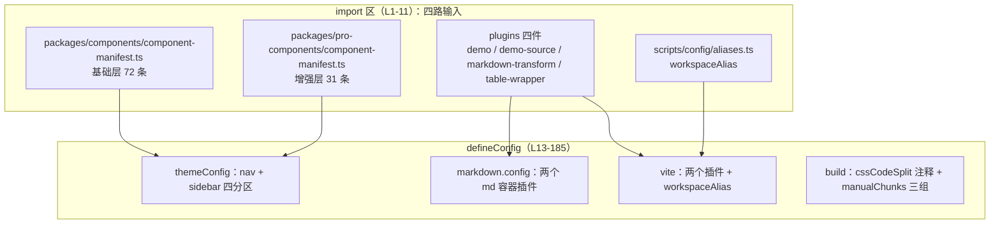
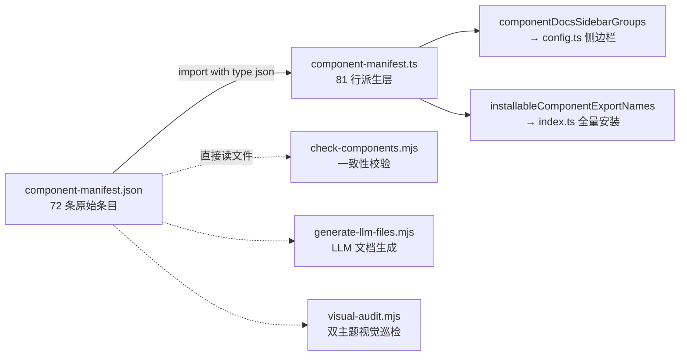
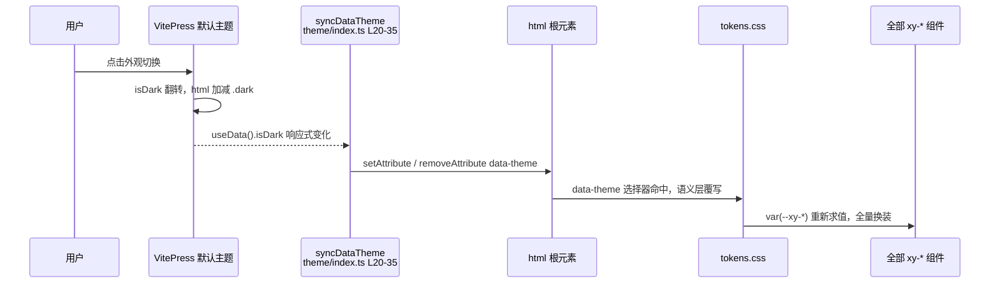

# 2-06 · 文档站架构（上）：manifest 驱动的 VitePress

构建与发布主线（2-02、2-03）告一段落，本篇进入文档站。一个 72 个组件的基础库加 31 个增强组件的中后台库，文档站最难的不是"写文档"，而是"同步"：组件清单变了，文档页、侧边栏、安装入口、类型夹具、样式聚合，五处地方必须一起动。靠人记住这五处，迟早漂移。

这一篇拆两个文件：`apps/docs/.vitepress/config.ts`（185 行）和 `apps/docs/.vitepress/theme/index.ts`（58 行），回答两个在评审里被反复问到的问题：

1. **侧边栏为什么不能手写？**——72 个组件的导航列表，为什么必须从 manifest 派生，而不是在配置里写一份？
2. **暗色开关如何打通组件库令牌？**——VitePress 主题自带的暗色切换，怎么让一套自己的 `--xy-*` 设计令牌跟着换装？

先看全景。一次 `pnpm dev:docs` 背后，config.ts 的 import 区就把四路输入汇进了 `defineConfig`：



数据、路径、逻辑各走各的入口，互不掺杂。先把 import 区原文贴出来，四路输入一目了然：

```ts
// apps/docs/.vitepress/config.ts L1-11
import { defineConfig } from "vitepress";
import { componentDocsSidebarGroups } from "../../../packages/components/component-manifest";
import {
  proComponentDocsSidebarGroups,
  proComponentExampleSidebarGroups
} from "../../../packages/pro-components/component-manifest";
import { workspaceAlias } from "../../../scripts/config/aliases";
import { demoMdPlugin } from "./plugins/demo";
import { demoSourcePlugin } from "./plugins/demo-source";
import { markdownTransform } from "./plugins/markdown-transform";
import { tableWrapperMdPlugin } from "./plugins/table-wrapper";
```

前三组 import 来自 packages 与 scripts，跨过了 `apps/docs` 的目录边界直取仓库源文件；后四组是 `.vitepress/plugins` 下的本地插件。再往下是站点元信息，这段通常没人细看，但它决定了浏览器标签页、分享卡片和统计埋点：

```ts
// apps/docs/.vitepress/config.ts L13-25
export default defineConfig({
  title: "xiaoye-components",
  description: "通用基础组件库 + 中后台业务增强组件库",
  head: [
    ["link", { rel: "icon", type: "image/svg+xml", href: "/favicon.svg" }],
    ["meta", { property: "og:title", content: "xiaoye-components" }],
    ["meta", { property: "og:description", content: "企业级 Vue 3 组件库 — 基础组件 + 中后台增强组件 + 完整 TypeScript 支持" }],
    ["meta", { property: "og:type", content: "website" }],
    ["meta", { name: "keywords", content: "vue3, component library, typescript, xiaoye-components, 企业级组件库" }],
    ["script", { defer: "", src: "https://analytics.zhangzhengyang.com/script.js", "data-website-id": "4bdd9d50-f117-42dc-87c1-d25c2f7fb6ed" }]
  ],
  cleanUrls: true,
  lastUpdated: true,
```

`cleanUrls: true` 去掉链接的 `.html` 后缀，`lastUpdated: true` 打开"最近更新"时间戳——两者的组合是文档站的常规操作，没有玄机。真正的重头戏从 `themeConfig.sidebar` 开始。下面逐段拆。

## 一、侧边栏为什么不能手写

先把账算清楚。基础层 72 个组件，每个组件牵动五个同步点：

1. 文档页本体：`apps/docs/components/<name>.md`；
2. 侧边栏条目：`config.ts` 的 `sidebar`；
3. 安装入口：`packages/components/index.ts` 的全量安装列表；
4. 一致性校验：`scripts/check-components.mjs` 的各路断言；
5. LLM 文档与视觉巡检：`scripts/generate-llm-files.mjs`、`scripts/visual-audit.mjs`。

手工维护意味着每加一个组件要改五处，每删一个组件要回滚五处，每调一次分组要动几十行。漂移的形态也很固定：组件加了、侧边栏没加（文档成了孤岛）；侧边栏加了、安装入口没加（全量安装漏组件）；分组调了、校验脚本的分组枚举没调（CI 红灯或者假绿）。三年维护下来，这三种形态每一种都会真实发生。

对照一下 Element Plus 的做法更有体感。EP 的文档侧边栏是在 `.vitepress` 配置里按语言手工维护的长列表——几百个组件的 `text/link` 对，每加组件都在配置文件里追加条目，多语言还要各改一遍。EP 是几十人维护、组件增速已经放缓的项目，手写的成本被摊薄了；而一个组件还在快速生长的自研库，侧边栏是变更频率最高的文件之一，恰恰最不该手写。

这套仓库的答案是把"组件清单"收进一份 JSON，其余全部派生。JSON 的 TS 包装层是 `packages/components/component-manifest.ts`，81 行，全文精读。先看类型与原始数据：

```ts
// packages/components/component-manifest.ts L1-33
import manifestJson from "./component-manifest.json" with { type: "json" };

export type ComponentDocsGroup = "basic" | "form" | "feedback" | "data";

interface RawComponentInstallCheck {
  kind: "component" | "directive" | "globalProperty";
  name: string;
}

interface RawComponentManifestEntry {
  name: string;
  docsGroup: ComponentDocsGroup;
  docsText: string;
  installExports: string[];
  installChecks: RawComponentInstallCheck[];
  styleImports: string[];
}

export interface ComponentManifestEntry {
  name: string;
  docsGroup: ComponentDocsGroup;
  docsText: string;
  installExports: string[];
  installChecks: RawComponentInstallCheck[];
  install: {
    components: string[];
    directives: string[];
    globals: string[];
  };
  styleImports: string[];
}

const rawManifest = manifestJson as RawComponentManifestEntry[];
```

第一行就值得停一下：`import ... with { type: "json" }` 是 JSON modules 的 import attributes 语法。这意味着 manifest.json 不经过任何 loader 魔法，Node 20+ 和 Vite 原生认识它——同一份文件，`config.ts` 在 Node 里导入它派生侧边栏，`check-components.mjs` 用 `JSON.parse(fs.readFileSync(...))` 读它做校验，两条工具链读的是字节级相同的源。中间但凡隔一层自定义 loader，"单一事实源"就要打折扣。

类型上做了两层拆分：`RawComponentManifestEntry` 是 JSON 的原始形态，`ComponentManifestEntry` 是派生后的公开形态，中间多出来的 `install` 字段由代码补齐：

```ts
// packages/components/component-manifest.ts L35-57
const docsGroupTextMap: Record<ComponentDocsGroup, string> = {
  basic: "基础组件",
  form: "表单与录入",
  feedback: "反馈与浮层",
  data: "数据展示"
};

const docsGroupOrder: ComponentDocsGroup[] = ["basic", "form", "feedback", "data"];

export const componentManifest = rawManifest.map((entry) => ({
  ...entry,
  install: {
    components: entry.installChecks
      .filter((check) => check.kind === "component")
      .map((check) => check.name),
    directives: entry.installChecks
      .filter((check) => check.kind === "directive")
      .map((check) => check.name),
    globals: entry.installChecks
      .filter((check) => check.kind === "globalProperty")
      .map((check) => check.name)
  }
})) satisfies ComponentManifestEntry[];
```

JSON 里每个组件只声明一份 `installChecks`（带 `kind` 判别），TS 层按 `kind` 过滤派生出 `components / directives / globals` 三个视图。这是典型的"单一数据、多视图派生"：数据写一遍，消费方各取所需，`satisfies` 保证派生结果与公开类型对齐——写错字段名在编译期就报错，而不是等文档站跑起来才炸。

最后一段是本文主角，侧边栏的派生：

```ts
// packages/components/component-manifest.ts L59-81
export const publicComponentNames = componentManifest.map((entry) => entry.name);

export const installableComponentExportNames = componentManifest.flatMap(
  (entry) => entry.installExports
);

export const installCheckEntries = componentManifest.flatMap((entry) => entry.installChecks);

export const themeStyleImportNames = Array.from(
  new Set(componentManifest.flatMap((entry) => entry.styleImports))
);

export const componentStyleImports = themeStyleImportNames;

export const componentDocsSidebarGroups = docsGroupOrder.map((group) => ({
  text: docsGroupTextMap[group],
  items: componentManifest
    .filter((entry) => entry.docsGroup === group)
    .map((entry) => ({
      text: entry.docsText,
      link: `/components/${entry.name}`
    }))
}));
```

`componentDocsSidebarGroups` 的类型恰好是 VitePress `sidebar.items` 要的形状：`{ text, link }[]`。它不是一个"专门给文档站的函数"，而是和其他四个导出（公开名单、可安装导出、安装检查、样式引入）并列的普通派生——文档站只是这份数据的第五个消费方而已。整条辐射关系画出来是这样的：



注意虚线：三个脚本没有走 TS 派生层，而是直接 `JSON.parse` 那份 json（`scripts/check-components.mjs` L5-9、`scripts/generate-llm-files.mjs` L18-19、`scripts/visual-audit.mjs` L53-54）。因为它们跑在纯 Node 脚本环境里，不值得为读数据引入 TS 编译步骤；JSON 本身就是事实源，TS 层只是给"能走类型系统的消费方"提供了带类型的视图。

"漂移即红灯"不是修辞，`check-components.mjs` 把它落成了五路实态核对：从 manifest 的 `componentNames` 出发，分别去比对从 `index.ts` 正则收集的导出名（L64）、`apps/docs/components` 下的 md 文件名（L69）、`tests/types/fixtures` 里的类型夹具名（L73）、每个组件 `__tests__` 目录下是否存在 spec（L76），以及 `packages/theme` 样式入口里的 import 行与 `styleImports` 清单（L78）。全部断言集中声明在 L83 的 `mismatches` 数组里，任何一路对不上就走 `fail()` 打印差异并把退出码置 1。清单漂移的五种形态，对应五条断言，CI 会在合并前替人记住这五处。

于是回到权衡本身。**侧边栏不能手写，本质上不是"懒"，而是把一致性从"人的纪律"变成"编译与校验的职责"**：新增组件只改 manifest.json 一处，侧边栏、安装入口、校验脚本同时生效，加漏了任何一处都是 `pnpm check:components` 直接红灯，而不是上线后用户发现文档导航里少一个组件。代价也要说清楚：侧边栏的分组结构被 `docsGroupOrder` 和 manifest 的 `docsGroup` 字段锁死，想在文档站里给某个组件单独提一个临时分组，就得先改数据模型——这是刻意的，临时分组正是漂移的开始。

还有一个耐人寻味的细节：`config.ts` 里 `/guide/` 分区（L74-103）至今仍是手写的长列表。这不是历史遗留，而是分界线本身——指南页面不随组件增删而变，派生没有收益，手写反而直观。themeConfig 里其余的手写区同理：本地搜索的中文文案（L27-51）、editLink 的反馈模板（L61-64）、顶部 nav（L65-72），都是稳定的手写内容。但其中藏着三个特例——`repo / docsBranch / docsDir`（L54-56）会被 Demo 组件读取去拼 GitHub 源码链接（第六节会看到），也就是说手写配置一旦被第二处消费，同样体现出集中管理的价值。**手写与派生的分界，不是"能不能自动化"，而是"这份数据会不会被第二处消费"。**

## 二、三个派生分区：一条数据喂三个侧边栏

`config.ts` 的 `sidebar` 有四个分区键，`/guide/` 之外三个全部来自派生。先看最短的 `/components/`：

```ts
// apps/docs/.vitepress/config.ts L104-110
      "/components/": [
        {
          text: "总览",
          items: [{ text: "组件总览", link: "/components/overview" }]
        },
        ...componentDocsSidebarGroups
      ],
```

手写部分只剩一个"总览"入口，72 个组件的分组导航全部来自展开运算符。这里有个容易漏看的账目：`apps/docs/components/` 目录下是 73 个 md 文件，manifest 却只有 72 条——多出来的那份是 `overview.md` 组件总览页，它不是任何一个组件的文档，所以不进 manifest、也不进派生侧边栏，作为手写条目挂在最上面。**清单之内派生，清单之外手写**，两者的边界与 `/guide/` 的取舍完全一致。

增强层 `packages/pro-components/component-manifest.ts` 的尾部是一对孪生派生（L72-90），同一个 `docsGroup` 字段，喂出两条侧边栏：

```ts
// packages/pro-components/component-manifest.ts L72-90
export const proComponentDocsSidebarGroups = docsGroupOrder.map((group) => ({
  text: docsGroupTextMap[group],
  items: proComponentManifest
    .filter((entry) => entry.docsGroup === group)
    .map((entry) => ({
      text: entry.docsText,
      link: `/pro-components/${entry.name}`
    }))
}));

export const proComponentExampleSidebarGroups = docsGroupOrder.map((group) => ({
  text: docsGroupTextMap[group],
  items: proComponentManifest
    .filter((entry) => entry.docsGroup === group)
    .map((entry) => ({
      text: entry.docsText,
      link: `/examples/pro/${entry.name}`
    }))
}));
```

两个函数只差一个 link 前缀：`/pro-components/${entry.name}` 指向组件文档页，`/examples/pro/${entry.name}` 指向示例页。同一个组件在文档站有两套入口，但清单只有一份——如果这两条侧边栏靠手写同步，"组件有文档没示例"或反之的不对称，几乎必然出现。增强层的分组也和基础层不同形：`form / data / detail / page / workflow` 五组（L43），映射为"增强表单 / 增强数据 / 增强详情 / 增强页面 / 增强流程"（L35-41）。当前 31 个增强组件的分布是 form 9、page 11、data 5、detail 3、workflow 3。

再看消费这对孪生数据的 config.ts 段落，也是全文里最长的一段派生消费：

```ts
// apps/docs/.vitepress/config.ts L111-139
      "/pro-components/": [
        {
          text: "总览",
          items: [{ text: "增强组件总览", link: "/pro-components/overview" }]
        },
        ...proComponentDocsSidebarGroups
      ],
      "/examples/": [
        {
          text: "页面示例",
          items: [
            { text: "管理后台闭环示例", link: "/examples/admin" },
            { text: "Skeleton 场景示例", link: "/examples/skeleton" },
            { text: "Timeline 场景示例", link: "/examples/timeline" },
            { text: "Scheduler 场景示例", link: "/examples/scheduler" },
            { text: "Scheduler 业务接入模板", link: "/examples/scheduler-template" }
          ]
        },
        {
          text: "增强组件示例",
          items: [{ text: "增强组件总览", link: "/examples/pro/overview" }]
        },
        ...proComponentExampleSidebarGroups
          .map((group) => ({
            text: group.text,
            items: group.items
          }))
          .filter((group) => group.items.length > 0)
      ]
```

`/examples/` 分区里，页面级示例（admin、skeleton 这些组合型场景）照旧手写——它们不随组件清单变。真正值得注意的是收尾那一串：`.map()` 先把派生组规整成朴素对象，`.filter()` 再把 `items` 为空的组整个剔除。以当前数据五个增强分组都非空，这个 filter 似乎永远不触发——但它是防御性派生的样板：某天某个分组下的组件全部下线，manifest 一改，侧边栏自动少一个空标题，而不是留下一个点开什么都没有的分组挂在那里。`.map().filter()` 各一行，换来"数据收缩时 UI 不留尸体"的保证。

## 三、markdown.config 与 vite 插件链

sidebar 之后，config.ts 从"静态配置"进入"构建期逻辑"：

```ts
// apps/docs/.vitepress/config.ts L143-153
  markdown: {
    config(md) {
      demoMdPlugin(md);
      tableWrapperMdPlugin(md);
    }
  },
  vite: {
    plugins: [markdownTransform(), demoSourcePlugin()],
    resolve: {
      alias: workspaceAlias
    },
```

VitePress 的扩展面恰好就这两类：`markdown.config` 挂 markdown-it 层插件，改"md 解析成什么"；`vite.plugins` 挂 Vite 插件，改"代码如何被编译"。`demoMdPlugin` 注册了一个 `:::demo` 容器语法，遇到它在编译期读示例源码、生成一段 `<Demo>` 标签：

```ts
// apps/docs/.vitepress/plugins/demo.ts L116-119
        setDemoSource(demoPath, sourceItems);

        return `<Demo :source-loader="${componentName}SourceLoader" path="${demoPath}" description="${encodedDescription}"${needsSandbox ? " sandbox" : ""}>
  <template #source><${componentName} /></template>`;
```

问题来了：这段 JSX 式的标签输出到 md 里，`<Demo>` 和 `<${componentName} />` 是谁注册的？`source-loader` 这个属性是谁解析的？答案是 `vite.plugins` 里的 `markdownTransform`——它在 md 被 Vue 编译前，扫描出页面引用的全部示例路径，直接往 md 源码里注入 import 声明：

```ts
// apps/docs/.vitepress/plugins/markdown-transform.ts L19-35
function injectImports(code: string, id: string, demoPaths: string[]) {
  const examplesRoot = resolveExamplesRoot(id);
  const declarations = demoPaths.map((demoPath) => {
    const componentName = getDemoComponentName(demoPath);
    const examplePath = path.resolve(examplesRoot, `${demoPath}.vue`);
    let relativePath = path.relative(path.dirname(id), examplePath).replaceAll(path.sep, "/");

    if (!relativePath.startsWith(".")) {
      relativePath = `./${relativePath}`;
    }

    return [
      `const ${componentName} = defineAsyncComponent(() => import("${relativePath}"));`,
      `const ${componentName}SourceLoader = () => import("virtual:xy-demo-source:${demoPath}");`
    ].join("\n");
  });
  const injectedBlock = `import { defineAsyncComponent } from "vue";\n${declarations.join("\n")}`;
```

两行注入是整个 demo 体系的缩影：第一行用 `defineAsyncComponent` 把示例组件变成异步分包；第二行的 `virtual:xy-demo-source:` 是 `demoSourcePlugin` 提供的虚拟模块，把 md 编译期读出的源码字符串从虚拟模块里按需取走。这条链路是下一篇 2-07 的主角，这里只立个路标：**markdown 层决定页面里有什么，vite 层决定它怎么被加载，两层各挂各的插件，靠命名约定（组件名 + SourceLoader 后缀）对上暗号。**

`resolve.alias` 指向的 `workspaceAlias` 在 2-01 里专门拆过（一套 alias 服务 dev/build/typecheck/playground 四条工具链），这里只看它在文档站里的两个关键条目：

```ts
// scripts/config/aliases.ts L103-115
  // xiaoye-components (bare import)
  {
    find: "xiaoye-components",
    replacement: resolveWorkspacePath("../../packages/components/index.ts")
  },
  {
    find: /^xiaoye-components\/(.*)$/,
    replacement: `${resolveWorkspacePath("../../packages/components/")}/$1`
  },
  {
    find: "xiaoye-pro-components",
    replacement: resolveWorkspacePath("../../packages/pro-components/index.ts")
  }
```

裸导入 `xiaoye-components` 被指到源码入口 `packages/components/index.ts` 而不是 npm 产物——文档站永远演示"工作区当前源码"，联调时改一行组件源码、文档页热更新即刻生效，不需要先 build 一遍库。但还有一类导入的别名顺序不能错：

```ts
// scripts/config/aliases.ts L1-14
import { fileURLToPath, URL } from "node:url";

const resolveWorkspacePath = (target: string) => fileURLToPath(new URL(target, import.meta.url));

export const workspaceAlias = [
  // CSS files (must come before the general @xiaoye/primitives alias)
  {
    find: "@xiaoye/primitives/style.css",
    replacement: resolveWorkspacePath("../../packages/xiaoye-primitives/style.css")
  },
  {
    find: "xiaoye-primitives/style.css",
    replacement: resolveWorkspacePath("../../packages/xiaoye-primitives/style.css")
  },
```

注释写得很直白：CSS 条目必须排在同前缀的泛化条目之前。alias 是顺序匹配的，如果 `"xiaoye-primitives"` 的泛化别名在前，`"xiaoye-primitives/style.css"` 就会被吞掉、指到 index.ts 上，样式导入直接 404。这条注释是踩过坑的人留下的，config.ts 里还有一条更贵的——下一节。

## 四、构建段：一条事故注释与三组 vendor

```ts
// apps/docs/.vitepress/config.ts L154-157
    build: {
      // VitePress 1.6 依赖 cssCodeSplit:false 合并 CSS 并注入每个页面的 head；
      // 覆盖为 true 会导致构建产物全部样式丢失（dev 不受影响，故此前未暴露）。
      chunkSizeWarningLimit: 700,
```

这条注释值得逐字读。VitePress 默认把 `build.cssCodeSplit` 设为 `false`，靠合并 CSS 并注入每个页面的 head 来保证 SSG 页面首屏样式完整；有人（很可能是一份从别的项目抄来的 vite 配置）把它覆盖成了 `true`，结果是 **dev 一切正常、build 产物全部样式丢失**。这正是配置类事故里最阴险的形态：开发模式路径和构建路径行为分叉，dev 永远测不出 build 的问题。注释里"故此前未暴露"六个字，就是这次事故的时间戳。把它钉死在配置文件原地而不是挪进 wiki，是因为下一个人大概率也是在这里手滑——药要写在伤口上。

`chunkSizeWarningLimit: 700` 把 Vite 默认 500 的告警阈值放宽到 700，为下面的 manualChunks 分包留出余量。三组分包逻辑如下：

```ts
// apps/docs/.vitepress/config.ts L158-183
      rollupOptions: {
        output: {
          manualChunks(id) {
            if (id.includes("node_modules/echarts")) {
              return "vendor-echarts";
            }

            if (
              id.includes("node_modules/video.js") ||
              id.includes("node_modules/vditor") ||
              id.includes("node_modules/howler")
            ) {
              return "vendor-media";
            }

            if (
              id.includes("node_modules/@fullcalendar") ||
              id.includes("node_modules/sortablejs") ||
              id.includes("node_modules/rrule")
            ) {
              return "vendor-scheduler";
            }
          }
        }
      }
```

三组的归口在组件层面完全对得上：`echarts` 是 `charts` 组件的可视化内核（`packages/components/charts/src/echarts.ts`）；`video.js / vditor / howler` 分别是 `video-player`、`editor`、`audio-player` 三个富媒体组件的依赖；`@fullcalendar / sortablejs / rrule` 是 `scheduler` 的三件套（日历渲染、拖拽、重复规则）。

权衡在于"按什么维度分"。按页面分（每个文档路由一个 chunk）会让 echarts 被 charts 页反复引用时重复打包或产生大量小请求；不分则所有第三方依赖混进公共 chunk，首页也被迫下载几百 KB 用不到的日历引擎。按"重依赖组件"分是折中：三个 vendor chunk 各自稳定（依赖版本不变则 hash 不变，长缓存友好），只有真正浏览 charts、富媒体、scheduler 文档的用户才会付出对应下载成本。注意组件库**自身**的代码不在这里分包——原因见下一节，全量注册让它根本没有按页摇树的机会，分了也白分。

## 五、theme/index.ts：58 行全文精读

config.ts 管"站怎么搭"，theme/index.ts 管"库怎么进站"。全文 58 行，分三段读完。第一段，imports：

```ts
// apps/docs/.vitepress/theme/index.ts L1-16
import { watch } from "vue";
import DefaultTheme from "vitepress/theme";
import type { Theme } from "vitepress";
import { useData, inBrowser } from "vitepress";
import XiaoyeComponents, {
  configProviderKey,
  createConfigProviderContext
} from "xiaoye-components";
import XiaoyeProComponents from "xiaoye-pro-components";
import Demo from "./components/Demo.vue";
import HomeProductLineDemo from "./components/HomeProductLineDemo.vue";
import ProjectIconGallery from "./components/ProjectIconGallery.vue";
import SchedulerPlaygroundFrame from "./components/SchedulerPlaygroundFrame.vue";
import "xiaoye-components/style.css";
import "xiaoye-pro-components/style.css";
import "./style.css";
```

两层库、四个文档专属组件、三份样式（两层库的 style.css 借上一节的 alias 直指工作区源码，最后一份是文档站自己的覆盖样式）。第二段，一个常量和暗色联动的全部实现：

```ts
// apps/docs/.vitepress/theme/index.ts L18-35
const DOCS_OVERLAY_Z_INDEX = 2100;

function syncDataTheme() {
  if (!inBrowser) return;
  const { isDark } = useData();
  const html = document.documentElement;

  const apply = (dark: boolean) => {
    if (dark) {
      html.setAttribute("data-theme", "dark");
    } else {
      html.removeAttribute("data-theme");
    }
  };

  apply(isDark.value);
  watch(isDark, apply);
}
```

第三段，主题对象本体：

```ts
// apps/docs/.vitepress/theme/index.ts L37-58
const theme: Theme = {
  ...DefaultTheme,
  enhanceApp({ app }) {
    app.provide(
      configProviderKey,
      createConfigProviderContext({
        zIndex: DOCS_OVERLAY_Z_INDEX
      })
    );
    app.use(XiaoyeComponents);
    app.use(XiaoyeProComponents);
    app.component("Demo", Demo);
    app.component("HomeProductLineDemo", HomeProductLineDemo);
    app.component("ProjectIconGallery", ProjectIconGallery);
    app.component("SchedulerPlaygroundFrame", SchedulerPlaygroundFrame);
  },
  setup() {
    syncDataTheme();
  }
};

export default theme;
```

`theme/components/` 目录的实态清单是：6 个 .vue——`AdminFlowDemo.vue`（1131 行，整页管理后台闭环示例）、`ProjectIconGallery.vue`（849 行，图标画廊）、`Demo.vue`（425 行，demo 容器）、`ComponentOverviewDoc.vue`（171 行，总览页装配）、`SchedulerPlaygroundFrame.vue`（95 行）、`HomeProductLineDemo.vue`（43 行），外加一个 `icon-gallery.ts` 数据文件和 `__tests__`。但真正全局注册的只有 enhanceApp 里这 4 个（`ComponentOverviewDoc` 不在列表里，它由总览页按需引入）。1131 行的 AdminFlowDemo 也没有被注册成全局组件——它只在 `/examples/admin` 一页用，全局注册它等于让每个访客都为不看的页面付解析成本。

先说 enhanceApp 里的全量安装。**`app.use(XiaoyeComponents)` 一次装 72 个组件，是权衡后的妥协，不是偷懒。** 根因在于文档页的内容形态：md 不是代码，是数据。哪一页用哪些组件，写在 `:::demo` 容器里、要等 markdown-it 和 markdownTransform 跑完才浮出水面，任何静态分析都无法在 enhanceApp 之前给出"每页依赖清单"。理论上可以逐页 `<script setup>` 手动 import，但那意味着 73 个文档页每个都要维护 import 列表——我们把侧边栏从手写里解放出来，又把安装列表写回去，等于白干。而且手动 import 的失败模式是运行时白屏：某个组件忘了引，SSG 阶段不报错，用户点开页面才炸。全量安装的代价同样明确：放弃按页 tree-shaking，两层库全部组件代码进 bundle。这就是为什么上一节的 manualChunks 只切第三方 vendor——组件库本体已经没有可摇的树了。文档站选择了"bundle 大一点、心智省一大截"，而真正在意首屏的业务应用不该抄这个答案，应该按需引入。

再看 `zIndex: 2100` 的注入位置，这是三处权衡里最"架构"的一处。先看注入的钥匙长什么样：

```ts
// packages/xiaoye-primitives/src/composables/shared-context.ts L1-28（全文）
import type { ComputedRef, InjectionKey } from "vue";

export const configProviderKey: InjectionKey<SharedConfigContext> =
  Symbol.for("xiaoye-config-provider") as InjectionKey<SharedConfigContext>;

export type ComponentSize = "" | "xs" | "sm" | "md" | "lg" | "xl";

export interface Locale {
  emptyTitle?: string;
  emptyDescription?: string;
  popconfirmConfirmButtonText?: string;
  popconfirmCancelButtonText?: string;
}

export interface SharedConfigContext {
  namespace: ComputedRef<string>;
  locale: ComputedRef<Locale>;
  zIndex: ComputedRef<number>;
  size: ComputedRef<ComponentSize>;
  dialog: ComputedRef<unknown>;
  loading: ComputedRef<unknown>;
  message: ComputedRef<unknown>;
  notification: ComputedRef<unknown>;
}

export const DEFAULT_NAMESPACE = "xy";
export const DEFAULT_Z_INDEX = 2000;
export const DEFAULT_SIZE: ComponentSize = "md";
```

两个决定值得放大。其一，`Symbol.for("xiaoye-config-provider")` 而不是 `Symbol()`：全局注册表符号，跨包、跨模块实例（哪怕依赖被重复打包出两份模块副本）拿到的是同一个 key。没有这一手，基础层组件和增强层组件若各自引用了一份 primitives 副本，`provide` 与 `inject` 的 key 就对不上，注入静默失效——Vue 的 inject 失效不报错，只返回 fallback，是最难查的一类 bug。其二，注入发生在 `enhanceApp`（app 级 provide），而不是在每篇文档外面包一层 `<xy-config-provider :z-index="2100">`。为什么？文档页是 md，没有统一的组件树包裹点；Demo 组件是插件在编译期注入的，散落在正文各处；逐页包裹等于回到"手写同步"的老路。环境级默认值归宿主应用，一次 `provide` 覆盖全部页面，这是注入位置的正确答案。

`2100` 这个数也有讲究：共享上下文的默认基线是 `DEFAULT_Z_INDEX = 2000`（组件库的浮层都从这个量级起步），文档站的 DOM 环境比普通业务页复杂——VitePress 默认主题自身的导航、侧边栏、搜索弹层，加上 Demo 工具条、sandbox 容器——抬高 100 给文档层 UI 留出插队余量，同时不改变库内浮层之间的相对次序。这个常量被命名为 `DOCS_OVERLAY_Z_INDEX` 并且只在一处定义，语义是"文档站环境对浮层基线的本地覆盖"，而不是散落在各处的魔法数字——环境差异收口进环境层，组件库对文档站的存在依然一无所知。不过这里要诚实补一个源码层面的观察：浮层**物理** z-index 的运行时基线，在 `use-z-index.ts` 里是硬编码的，并不读注入值：

```ts
// packages/xiaoye-primitives/src/composables/use-z-index.ts（全文，17 行）
import { computed, ref } from "vue";

const seed = ref(0);

export function useZIndex() {
  const zIndex = computed(() => 2000);

  const next = () => {
    seed.value += 1;
    return zIndex.value + seed.value;
  };

  return {
    current: computed(() => zIndex.value + seed.value),
    next
  };
}
```

`use-overlay-stack.ts` 的 `zIndexCounter = ref(2000)`（L17）同理。也就是说，2100 注入的是**共享配置上下文**里 zIndex 这一项（`useConfig()` 的消费方读到的是 2100 而不是 2000），浮层栈自己的计数器仍是 2000 起步。注入让文档站的 configProviderContext 完备——namespace、locale、size、zIndex、四类浮层全局配置全部有据可依——而不是只塞一个 zIndex 进去。上下文完备、默认值统一收口，这才是这行代码的完整语义；如果哪天有组件开始消费上下文里的 zIndex 基线，文档站不用改一行就自动跟进。

最后是本文第二个核心问题：暗色开关。整个联动机制的实现，就是上面 L20-35 那 16 行 `syncDataTheme`。为什么必须有它？因为**两边说的是两种方言**。VitePress 默认主题切换暗色，是在 `<html>` 上加减 `.dark` class，它自己的 CSS 变量全部认这个 class；而组件库的令牌体系认的是属性选择器。`packages/xiaoye-primitives/src/theme/tokens.css` 的暗色协议写在文件头部注释里，暗色覆写块从选择器 `[data-theme="dark"]` 开始：

```css
/* packages/xiaoye-primitives/src/theme/tokens.css L10（文件头注释） */
 * 主题切换协议：[data-theme="dark"] 只覆写语义层的值；基元层与刻度层全局共享。
```

```css
/* packages/xiaoye-primitives/src/theme/tokens.css L256-266 */
/* ====================================================================
 * 暗色主题 — 语义层整体覆写（暗面锚点取自 Stripe 官方暗色目录：
 * 页面底 #0e0f2e / 主色提亮 #665efd / 标题 #e8ecf0 / 正文 #8a95a8 /
 * 边框 rgba(255,255,255,0.1) / 成功文字 #4cdf80 / 柠檬 #d4a04a）
 * ==================================================================== */
[data-theme="dark"] {
  /* 文字 */
  --xy-text-heading: #f2f5fa;
  --xy-text-primary: #e8ecf0;
  --xy-text-secondary: #b6c0cf;
```

用户点开关，VitePress 改的是 class；组件库要的是属性。中间没有任何一方会主动迁就另一方，于是 theme/index.ts 里长出了一个 16 行的翻译层：`watch(isDark)` 盯着 VitePress 的响应式开关，同步把 `data-theme="dark"` 属性写到 `<html>` 上。属性挂在根元素上，整棵 DOM 树下所有 `var(--xy-*)` 的求值结果随之翻转——组件不需要"知道"暗色这回事，令牌体系自动完成换装。整条链路是：



三个细节让这 16 行经得起推敲。第一，`if (!inBrowser) return`：文档站要 SSG 预渲染，`enhanceApp` 在 Node 里也会执行，任何 `document` 触碰都必须挡在浏览器环境判断后面——没有这个守卫，构建直接在服务端崩掉。第二，`apply(isDark.value)` 在 `watch` 之前先同步执行一次：用户带着系统暗色偏好直接打开某个深层链接时，首帧就是暗的，不依赖状态变化触发。第三，覆写的只有语义层——基元层（色板）与刻度层（间距字号）全局共享，暗色只换"角色到色板"的映射，不换色板本身。这正是三层令牌架构在暗色主题上的直接红利：一次属性切换，语义层整体翻转，几百处组件样式零改动。

## 六、Demo.vue：文档组件的壳

theme 注册的四个全局组件里，`Demo` 是使用频率最高的一个——每篇组件文档的每个 `:::demo` 容器，最终渲染的都是它。上篇只看它的对外契约，源码加载的细节留给下一篇。props 四件套：

```ts
// apps/docs/.vitepress/theme/components/Demo.vue L1-11
<script setup lang="ts">
import { computed, onMounted, ref, watch } from "vue";
import { useData } from "vitepress";
import type { DemoSourceItem } from "../../utils/demo-source";

const props = defineProps<{
  path: string;
  description: string;
  sandbox?: boolean;
  sourceLoader?: () => Promise<{ default: DemoSourceItem[] }>();
}>();
```

`path` 指向示例文件（相对 `apps/docs/examples/`），`description` 是容器语法里的富文本描述，`sandbox` 控制 Prose 样式隔离（给表格类 demo 用），`sourceLoader` 是上一节那个虚拟模块的加载函数——注意它是个函数而不是数据，源码字符串从头到尾没有进入初始 bundle。

`codeLink` 的实现是"配置即数据"的一个小样本：

```ts
// apps/docs/.vitepress/theme/components/Demo.vue L30-40
const codeLink = computed(() => {
  const repo = theme.value.repo as string | undefined;
  const docsBranch = (theme.value.docsBranch as string | undefined) ?? "main";
  const docsDir = (theme.value.docsDir as string | undefined) ?? "apps/docs";

  if (!repo) {
    return "";
  }

  return `https://github.com/${repo}/blob/${docsBranch}/${docsDir}/examples/${props.path}.vue`;
});
```

demo 右上角那个"跳 GitHub 看源码"的图标，URL 不是写死的，而是从 `themeConfig` 的 `repo / docsBranch / docsDir`（config.ts L54-56）现拼的——仓库迁移、换分支名，改一处配置全站链接自动跟上。源码的加载严格懒触发，只有用户点开"查看代码"才拉取：

```ts
// apps/docs/.vitepress/theme/components/Demo.vue L42-56
async function ensureSourcesLoaded() {
  if (sourcesLoaded.value || sourcesLoading.value || !props.sourceLoader) {
    return;
  }

  sourcesLoading.value = true;

  try {
    const module = await props.sourceLoader();
    sourceItems.value = module.default.filter((item) => item.raw.trim().length > 0);
    sourcesLoaded.value = true;
  } finally {
    sourcesLoading.value = false;
  }
}
```

```ts
// apps/docs/.vitepress/theme/components/Demo.vue L89-95
watch(expanded, async (value) => {
  if (!value) {
    return;
  }

  await ensureSourcesLoaded();
});
```

`sourcesLoaded / sourcesLoading` 双标记防重入，`raw.trim().length > 0` 过滤空源（TS/JS 双份源码里可能有一侧为空），加载过的模块永不重复拉取。组件甚至用 `localStorage`（key 为 `xy-docs-demo-lang`，L13）记住用户的 TS/JS 偏好，下次打开任何 demo 直接落在熟悉的那一侧。

模板段是整个组件的骨架，60 行全贴：

```html
<!-- apps/docs/.vitepress/theme/components/Demo.vue L106-165 -->
<template>
  <div class="vp-demo-block" v-html="decodedDescription" />

  <div class="vp-demo" :class="{ 'vp-demo--table': isTableDemo }">
    <div class="vp-demo__showcase">
      <div v-if="needsSandbox" class="xy-doc-sandbox">
        <slot name="source" />
      </div>
      <slot v-else name="source" />
    </div>

    <div class="vp-demo__toolbar">
      <div v-if="sourceItems.length" class="vp-demo__tabs">
        <button
          v-for="item in sourceItems"
          :key="item.label"
          class="vp-demo__tab"
          :class="{ 'is-active': item.label === activeLang }"
          type="button"
          @click="activeLang = item.label"
        >
          {{ item.label }}
        </button>
      </div>

      <div class="vp-demo__actions">
        <a
          v-if="codeLink"
          class="vp-demo__icon-btn"
          :href="codeLink"
          target="_blank"
          rel="noreferrer"
          aria-label="查看源码"
        >
          <xy-icon icon="mdi:github" />
        </a>

        <button class="vp-demo__icon-btn" type="button" aria-label="复制代码" @click="copySource">
          <xy-icon :icon="copied ? 'mdi:check' : 'mdi:content-copy'" />
        </button>

        <button
          class="vp-demo__icon-btn"
          type="button"
          :aria-label="expanded ? '收起代码' : '查看代码'"
          @click="expanded = !expanded"
        >
          <xy-icon :icon="expanded ? 'mdi:chevron-up' : 'mdi:code-tags'" />
        </button>
      </div>
    </div>

    <div v-if="expanded && sourcesLoading" class="vp-demo__source">
      <div class="vp-demo__loading">代码加载中...</div>
    </div>

    <div v-else-if="expanded && currentSource" class="vp-demo__source">
      <div class="vp-demo__source-inner" v-html="currentSource.rendered" />
    </div>
  </div>
</template>
```

结构上三件事：showcase 区直接渲染示例本体（sandbox 开关决定是否包隔离容器，`isTableDemo` 对 `table/` 前缀的示例走特殊样式分支，见 L28）；工具栏是 TS/JS 双 tab 加三个图标按钮（GitHub、复制、展开）；源码区在加载中与已加载两个状态间切换，渲染的是编译期生成好的高亮 HTML。注意这些按钮里用的就是 `xy-icon`——文档组件自己也是组件库的用户，它的样式全部消费 `--xy-*` 语义令牌，所以暗色切换对 Demo 容器同样生效。这份模板里每个交互（懒加载、复制、tab 偏好、源码双份）背后的数据从哪来，是 2-07 的正题。

## 七、收束

把这一篇的三处权衡放回一张桌子上：

| 权衡 | 选择 | 收益 | 代价 |
| --- | --- | --- | --- |
| 侧边栏能不能手写 | manifest 派生 | 加删组件一处生效，一致性交给编译与 CI | 分组结构被数据模型锁死 |
| enhanceApp 怎么装库 | 两层库全量安装 | md 页面免依赖清单，漏装即白屏的风险归零 | 放弃按页摇树，bundle 变大 |
| 全局上下文在哪注入 | enhanceApp provide，zIndex 抬到 2100 | 一次声明全站生效，跨包 Symbol key 保注入可靠 | 浮层栈物理基线仍硬编码 2000，注入值暂无物理消费方 |

一以贯之的思路只有一条：**能从数据派生的，绝不让人记第二遍**。侧边栏从 manifest 派生，安装列表从 manifest 派生，暗色换装从令牌协议派生，GitHub 链接从 themeConfig 派生——config.ts 和 theme/index.ts 加起来 243 行，没有一行在"维护一份应该被派生的清单"。

下一篇 2-07《文档站架构（下）：demo 三件套》，我们沿着本文埋的路标往下钻：`:::demo` 容器插件如何在编译期读源码、做 TS 转 JS、判断 sandbox；`markdownTransform` 与 `demoSourcePlugin` 这对 vite 插件如何用命名约定接上暗号、用虚拟模块把源码字符串变成按需加载的模块；以及 1131 行的 `AdminFlowDemo.vue` 为什么能安心住在主题目录里。demo 体系是这套文档站里最像"产品"的部分，值得单独一篇。
