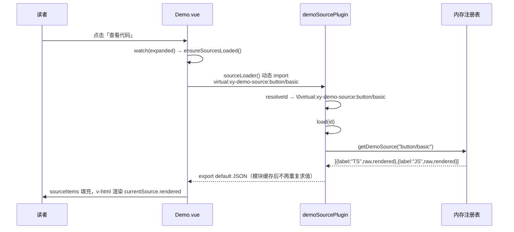
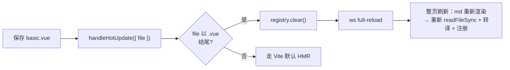

# 2-07 · 文档站架构（下）：demo 三件套

> 核心问题：**「运行的代码 = 展示的代码」是怎么实现的？**
> 组件库文档最致命的翻车方式，不是写得难看，而是页面上跑着一个组件、代码框里贴着另一段代码。这一篇我们拆 xiaoye-components 文档站的答案：三个加起来只有 263 行的 Vite/markdown-it 插件（`apps/docs/.vitepress/plugins/` 下的 `demo.ts`、`markdown-transform.ts`、`demo-source.ts`），加上三个 19～56 行的工具函数，共同撑起了「示例即源码、源码即展示、TS/JS 双视图、按需加载」这四件事。所有行号均为当前工作区实态（`wc -l` 口径：129 / 86 / 48 / 19 / 56 / 44）。

---

## 一、先把问题说清楚：文档示例的三种「失同步」死法

写 demo 三件套之前，先复述一下它到底在对抗什么。我见过的组件库文档示例，失效方式基本就三种：

**第一种，贴错代码。** 示例代码是手写进 markdown 的，页面上跑的是另一份写在 `.vue` 文件里的实现。两者靠人肉同步，某次重构改了组件 API，`.vue` 跟着改了，markdown 里的代码块忘了改——文档从此开始撒谎。

**第二种，代码能跑但不是展示的那份。** 更隐蔽：页面渲染和代码块都"看起来对"，但复制的代码跑不起来，因为贴出来的版本被"美化"过，省掉了关键的 import 或者上下文。

**第三种，TS 用户看到的是 JS 的世界（或者反过来）。** 示例是 `.vue` + `<script setup lang="ts">`，类型信息满满，但 JS 用户复制出去一堆类型注解跑不动；反过来给 JS 用户维护一份纯 JS 示例，又回到第一种死法。

xiaoye-components 的解法是把「展示的代码」和「运行的代码」收敛到**同一个物理文件**：`apps/docs/examples/button/basic.vue` 这样一个示例文件，同时被两条读取路径消费——一条走 `defineAsyncComponent` 动态导入去**渲染**，一条走 `fs.readFileSync` 读出原文去**展示**。因为源头是同一个文件，「相等」不靠纪律维护，而是结构保证。剩下的工程问题只有三个：

1. markdown 里怎么用最少的标记声明一个示例？（→ 第一件：`:::demo` 容器插件）
2. 示例组件和示例源码怎么进模块图、怎么按需加载？（→ 第二件：pre-transform 注入 + 第三件：虚拟模块）
3. TS 源码怎么给 JS 用户一份能跑的视图？（→ 支撑层：`transpileModule` 现场转译）

先看全景，再逐个拆。

## 二、总览：三件套怎么分工

三件套的分工可以用一张图说清楚。注意**时序**：Vite 的 `enforce: "pre"` 插件（第二件）实际上跑在 markdown-it 渲染（第一件）**之前**——它修改的是 markdown 原文文本，然后才轮到 VitePress 把 markdown 编译成 Vue 组件。

```mermaid
flowchart TD
    A["浏览器/构建器请求 button.md 模块"] --> B["markdownTransform()<br/>enforce: 'pre'<br/>plugins/markdown-transform.ts"]
    B --> C["extractDemoPaths 从原文提取 demo 路径<br/>在 md 文本层注入 script setup 导入块：<br/>defineAsyncComponent + 虚拟模块动态导入"]
    C --> D["VitePress markdown-it 渲染管线<br/>（demoMdPlugin 已在 config.ts 注册）"]
    D --> E[":::demo 容器 render：<br/>1. readFileSync 读 basic.vue<br/>2. sfcTs2js 生成 JS 视图<br/>3. setDemoSource 写入内存注册表<br/>4. 输出 &lt;Demo&gt; HTML"]
    E --> F["import('../examples/button/basic.vue')<br/>→ 独立异步 chunk"]
    E --> G['import("virtual:xy-demo-source:button/basic")']
    G --> H["demoSourcePlugin：<br/>resolveId 加 \\0 前缀 → load()<br/>从注册表取数 → export default JSON"]
    F --> I["浏览器按需加载：<br/>示例渲染 + 源码面板各自独立 chunk"]
    H --> I
```

三个插件、两条异步导入、一张内存注册表——这就是全部。下面按数据流顺序逐个精读。

## 三、第一件：`:::demo` 容器插件（demo.ts，129 行）

`demoMdPlugin` 在 `apps/docs/.vitepress/config.ts:144-147` 的 markdown 配置块里注册（和 `tableWrapperMdPlugin` 并排，该配置块闭合于 148 行）：

```ts
  markdown: {
    config(md) {
      demoMdPlugin(md);
      tableWrapperMdPlugin(md);
    }
  },
```

容器本体用的是经典的 `markdown-it-container`。先看它最"务实"的一段——沙箱判断（`demo.ts:18-59`）：

```ts
/**
 * Sandbox 判断逻辑（简化版）
 *
 * 参考 Element Plus 的处理方式：不做复杂的 AST 分析，依赖组件自包含样式。
 * 仅对原生 table 系列标签启用 sandbox，因为 VitePress prose 样式对 table 有全局定义。
 *
 * 显式控制：
 * - <!-- demo-sandbox:on --> 强制开启
 * - <!-- demo-sandbox:off --> 强制关闭
 */
const tableTags = new Set(["table", "thead", "tbody", "tfoot", "tr", "th", "td"]);
const sandboxOnPattern = /<!--\s*@demo-sandbox\s*-->|<!--\s*demo-sandbox:on\s*-->/i;
const sandboxOffPattern = /<!--\s*demo-sandbox:off\s*-->/i;

function shouldEnableSandbox(source: string): boolean {
  // 显式关闭
  if (sandboxOffPattern.test(source)) {
    return false;
  }

  // 显式开启
  if (sandboxOnPattern.test(source)) {
    return true;
  }

  // 检查是否包含原生 table 标签（通过简单正则，避免复杂 AST 分析）
  const templateMatch = source.match(/<template[^>]*>([\s\S]*?)<\/template>/i);
  if (!templateMatch) {
    return false;
  }

  const templateContent = templateMatch[1];
  for (const tag of tableTags) {
    // 匹配原生标签（不带命名空间前缀，不是 xy-table 等）
    const pattern = new RegExp(`<${tag}(?:\\s|>|\\/)`, "i");
    if (pattern.test(templateContent)) {
      return true;
    }
  }

  return false;
}
```

这段的注释开宗明义「参考 Element Plus 的处理方式」：EP 的文档 demo 同样不做全量 iframe 沙箱，押注在"组件样式自包含 + 文档站 prose 样式克制"上。这里唯一躲不开的是原生 `table` 系列——VitePress 默认主题对 prose 里的 table 有全局样式（边框、斑马纹、padding），会让文档页面里的表格示例直接走样，所以对这七个标签加 `sandbox` 属性，交给消费端 `Demo.vue` 套隔离容器。另外留了两个 HTML 注释开关（`@demo-sandbox` / `demo-sandbox:off`），优先级最高，供极端场景手动接管。

真正的主菜是 `createDemoContainer`（`demo.ts:61-125`），65 行干完了容器插件的全部职责：

```ts
function createDemoContainer(md: MarkdownRenderer): ContainerOpts {
  return {
    validate(params) {
      return /^demo\s*(.*)$/.test(params.trim());
    },

    render(tokens, idx) {
      const matched = tokens[idx].info.trim().match(/^demo\s*(.*)$/);

      if (tokens[idx].nesting === 1) {
        // 路径来源有两种语法：
        // 1. 单行: :::demo path/to/example  → 路径在 matched[1]，无描述
        // 2. 两行: :::demo description\npath/to/example\n:::  → 描述在 matched[1]，路径在后续 token 中
        // 通过路径模式（纯 ASCII 字母数字 + 连字符/斜杠/点）判断 matched[1] 是否为路径
        let sourceFile = "";
        let description = "";
        const matchedPath = matched?.[1] ?? "";
        const isPathLike = /^[a-zA-Z0-9_/.-]+$/.test(matchedPath);
        if (isPathLike) {
          sourceFile = matchedPath;
        } else {
          description = matchedPath;
          for (let i = idx + 2; i < tokens.length; i++) {
            const token = tokens[i];
            if (token.type === "container_demo_close") break;
            const content = token.children?.[0]?.content?.trim() ?? "";
            if (content && content !== ":::" && /^#[^]/.test(content) === false) {
              sourceFile = content;
              break;
            }
          }
        }

        // 解析示例文件路径
        const sourcePath = path.resolve(examplesRoot, `${sourceFile}.vue`);

        if (!sourceFile || !fs.existsSync(sourcePath)) {
          throw new Error(`Incorrect source file: ${sourceFile}`);
        }

        const demoPath = sourceFile;

        const source = fs.readFileSync(sourcePath, "utf-8");
        const jsSource = sfcTs2js(source);
        // 使用原始 sourceFile 生成组件名，与 markdown-transform.ts 保持一致
        const componentName = getDemoComponentName(sourceFile);
        const needsSandbox = shouldEnableSandbox(source);
        const renderCode = (code: string) =>
          md.render(`\`\`\`vue\n${code}${code.endsWith("\n") ? "" : "\n"}\`\`\``);
        const encodedDescription = encodeURIComponent(md.render(description));
        const sourceItems = [
          { label: "TS", raw: source, rendered: renderCode(source) },
          { label: "JS", raw: jsSource, rendered: renderCode(jsSource) }
        ];

        setDemoSource(demoPath, sourceItems);

        return `<Demo :source-loader="${componentName}SourceLoader" path="${demoPath}" description="${encodedDescription}"${needsSandbox ? " sandbox" : ""}>
  <template #source><${componentName} /></template>`;
      }

      return "</Demo>\n";
    }
  };
}

export function demoMdPlugin(md: MarkdownRenderer) {
  md.use(mdContainer, "demo", createDemoContainer(md));
}
```

（以上为 `demo.ts:61-129`。）逐段拆一下值得停留的地方。

**双语法识别（71-92 行）。** 容器支持两种写法：`:::demo path/to/example` 单行（路径即全部），以及 `:::demo 描述\npath\n:::` 两行（第一行是描述，第二行是路径）。判据是 `isPathLike` 正则：整段内容只含 ASCII 字母数字、`_ / . -` 才算路径。这个判据很关键——描述里出现英文单词完全合法，比如 `apps/docs/examples/pro/pro-table.md:23` 的：

```md
:::demo loading 和 empty 的优先级是固定的，错误态仍然建议由页面层自己承接。
pro/pro-table/states
:::
```

描述以 `loading` 开头，但因为带空格和中文，`isPathLike` 判否，顺利落入两行分支。顺带一提，我全量扫了当前文档站：**所有 `:::demo` 实际都在用两行形式，单行形式是代码支持但暂无使用的能力**（`rg '^:::demo [a-zA-Z0-9_/.-]+$'` 零命中）。

两行分支里还有一个可读性欠佳但确实能跑的细节（87 行）：`/^#[^]/` 里的 `[^]` 是"空否定字符类"，在 JS 正则里匹配任意字符，所以整个表达式实际含义是"以 `#` 开头且后面还有字符"，用来跳过容器内的标题行。

**路径解析与快速失败（94-99 行）。** `examplesRoot` 在模块顶部解析为 `apps/docs/examples`（16-17 行），`path.resolve` 拼上 `.vue` 后 `fs.existsSync` 校验，不存在直接 `throw`。这个 throw 不是脾气，是门禁：文档站构建时 markdown-it 渲染发生在 Node 侧，示例文件被误删或路径写错，`pnpm build:docs` 会当场红掉，而不是部署一个渲染出 `undefined` 的页面。

**注册表写入（103-116 行）。** `render` 阶段同步完成四件事：读源文件原文（`source`）、转译出 JS 视图（`jsSource`）、用同一个 `md` 实例把两份代码渲染成高亮 HTML（`renderCode`）、然后把 `{ label: "TS", raw, rendered }` 和 `{ label: "JS", raw, rendered }` 两项 `setDemoSource` 进内存注册表。注意 `rendered` 也在这一步完成——**高亮发生在构建期**，浏览器端拿到的是现成 HTML 字符串，不需要打包任何 markdown/highlighter 运行时。这是理解第三件（虚拟模块）为什么如此"薄"的前提。

**产出的 HTML（118-119 行）。** 容器打开标签被替换成：

```html
<Demo :source-loader="XyDemoButtonBasicSourceLoader" path="button/basic" description="..." sandbox?>
  <template #source><XyDemoButtonBasic /></template>
```

三个名字都对得上后面的故事：`XyDemoButtonBasic` 是示例组件（第二件注入的异步组件），`XyDemoButtonBasicSourceLoader` 是源码加载器（第三件的虚拟模块导入），`Demo` 本身是全局注册的主题组件（`apps/docs/.vitepress/theme/index.ts:48` 的 `app.component("Demo", Demo)`，导入在同文件 10 行）。描述经 `encodeURIComponent` 编码塞进属性（110 行），消费端解码后 `v-html`——这样描述里可以写行内代码等富文本，又不会破坏属性引号。

## 四、第二件：pre-transform 注入（markdown-transform.ts，86 行）

第一件产出的 HTML 里引用了两个标识符：`XyDemoButtonBasic` 和 `XyDemoButtonBasicSourceLoader`。它们从哪来？答案在 `plugins/markdown-transform.ts`——一个 Vite 插件，负责在 markdown 文本层"凭空"注入这些声明。

先看注入内容本身（`markdown-transform.ts:19-58`）：

```ts
function injectImports(code: string, id: string, demoPaths: string[]) {
  const examplesRoot = resolveExamplesRoot(id);
  const declarations = demoPaths.map((demoPath) => {
    const componentName = getDemoComponentName(demoPath);
    const examplePath = path.resolve(examplesRoot, `${demoPath}.vue`);
    let relativePath = path.relative(path.dirname(id), examplePath).replaceAll(path.sep, "/");

    if (!relativePath.startsWith(".")) {
      relativePath = `./${relativePath}`;
    }

    return [
      `const ${componentName} = defineAsyncComponent(() => import("${relativePath}"));`,
      `const ${componentName}SourceLoader = () => import("virtual:xy-demo-source:${demoPath}");`
    ].join("\n");
  });
  const injectedBlock = `import { defineAsyncComponent } from "vue";\n${declarations.join("\n")}`;

  const existingScriptSetup = code.match(/<script\s+setup\b[^>]*>/);

  if (existingScriptSetup?.index !== undefined) {
    const insertAt = existingScriptSetup.index + existingScriptSetup[0].length;

    return `${code.slice(0, insertAt)}\n${injectedBlock}${code.slice(insertAt)}`;
  }

  const script = `
<script setup lang="ts">
${injectedBlock}
</script>
`;

  const frontmatterEnds = code.indexOf("---\n", 3);

  if (frontmatterEnds >= 0) {
    return `${code.slice(0, frontmatterEnds + 4)}\n${script}${code.slice(frontmatterEnds + 4)}`;
  }

  return `${script}\n${code}`;
}
```

每个 demo 生成两行声明：`defineAsyncComponent(() => import(...))` 把示例 `.vue` 变成异步组件——**每个示例一个独立 chunk，文档页首屏不背任何示例代码**；`SourceLoader` 则是对虚拟模块的动态导入，源码面板的数据通道。相对路径计算还处理了"不以 `.` 开头补 `./`"的细节，避免被当成包名。

注入落点有三个分支，优先级递减：页面已有 `<script setup>` 就插到开标签之后；否则在 frontmatter 结束后插入一整个新 script 块；再否则插到文件头。`resolveExamplesRoot`（5-17 行）优先按 `apps/docs/` 路径标记定位 examples 根，找不到时退回 `../examples` 相对推断——前者覆盖标准布局，后者兜底非标准位置。

插件入口（`markdown-transform.ts:60-86`）：

```ts
export function markdownTransform(): Plugin {
  return {
    name: "xiaoye-docs-md-transform",
    enforce: "pre",
    transform(code, id) {
      if (!id.endsWith(".md")) {
        return;
      }

      const docsRoot = `${path.sep}apps${path.sep}docs${path.sep}`;
      const isComponentDoc = id.includes(`${docsRoot}components${path.sep}`);
      const isProComponentDoc = id.includes(`${docsRoot}pro-components${path.sep}`);
      const isExampleDoc = id.includes(`${docsRoot}examples${path.sep}`);
      if (!isComponentDoc && !isProComponentDoc && !isExampleDoc) {
        return;
      }

      const demoPaths = extractDemoPaths(code);

      if (!demoPaths.length) {
        return;
      }

      return injectImports(code, id, demoPaths);
    }
  };
}
```

三个白名单目录（`components/`、`pro-components/`、`examples/`）之外一概不碰。`extractDemoPaths` 用纯文本逐行正则提前收集 demo 路径（后面第六节精读），收集不到就不注入，保证普通 markdown 页零开销。

**为什么必须是 `enforce: "pre"`？** 这是最重要的时机问题。VitePress 处理 `.md` 的方式是：把 markdown 编译成一个 Vue SFC 再交给 Vite 的后续管线。我们的 `transform(code, id)` 在 `pre` 阶段拿到的 `code` 是**markdown 原文**——带 frontmatter、带 `:::demo`、带代码围栏的纯文本。在这个时机注入 `<script setup>` 块，VitePress 编译时会把它当成页面组件的脚本正常编译。如果换成默认的 post 时机，拿到的已经是编译后的 JS/Vue 代码，"注入一段 SFC 脚本"为时已晚，只能去改编译产物，脆弱得多。

但 pre 时机也有代价，而且这个代价在我们仓库里**真实兑现成了缺陷**。注入用的是 `code.match(/<script\s+setup\b[^>]*>/)`——对原文的正则，分不清「页面真实脚本」和「代码围栏里展示的示例脚本」。`apps/docs/components/switch.md:37-51` 的第一个代码块恰好是一个 ```vue 围栏，里面演示了带 `<script setup lang="ts">`（43 行）的用法，而该页 67 行起还有 6 个 `:::demo`。于是注入正则命中的是**围栏里的**那个开标签，导入块被插进了展示代码。我用构建产物验证过：`apps/docs/.vitepress/dist/components/switch.html` 里能找到 7 处带 Shiki 高亮的 `import { defineAsyncComponent }` 和 `const XyDemoSwitchBasic = ...`——它们就渲染在页面的代码块里，读者看得见。修法并不复杂（先剥离围栏再匹配、或优先匹配 frontmatter 之后的真实脚本），但这个案例把"文本层注入"这个选型的风险暴露得很典型，第九节的权衡里我们会再收回来看它。

## 五、第三件：虚拟模块注册表（demo-source.ts，48 行）

源码面板的数据从注册表来，注册表通过虚拟模块暴露给浏览器。`plugins/demo-source.ts` 全文 48 行：

```ts
import type { Plugin } from "vite";
import { getDemoSource } from "../utils/demo-source";

const VIRTUAL_PREFIX = "virtual:xy-demo-source:";
const RESOLVED_VIRTUAL_PREFIX = `\0${VIRTUAL_PREFIX}`;

// 缓存引用，用于热更新时清空
let registryRef: Map<string, unknown> | null = null;

export function demoSourcePlugin(): Plugin {
  return {
    name: "xiaoye-docs-demo-source",
    async configureServer(_server) {
      // 获取 registry 引用
      const { getDemoSourceRegistry } = (await import("../utils/demo-source")) as {
        getDemoSourceRegistry: () => Map<string, unknown>;
      };
      registryRef = getDemoSourceRegistry();
    },
    handleHotUpdate({ file, server }) {
      if (file.endsWith(".vue") && registryRef) {
        registryRef.clear();
        server.ws.send({ type: "full-reload" });
      }
    },
    resolveId(id) {
      if (!id.startsWith(VIRTUAL_PREFIX)) {
        return;
      }

      return `${RESOLVED_VIRTUAL_PREFIX}${id.slice(VIRTUAL_PREFIX.length)}`;
    },
    load(id) {
      if (!id.startsWith(RESOLVED_VIRTUAL_PREFIX)) {
        return;
      }

      const demoPath = id.slice(RESOLVED_VIRTUAL_PREFIX.length);
      const sources = getDemoSource(demoPath);

      if (!sources) {
        throw new Error(`Missing registered demo sources: ${demoPath}`);
      }

      return `export default ${JSON.stringify(sources)};`;
    }
  };
}
```

这是 Vite 虚拟模块的标准三段式：`resolveId` 把 `virtual:xy-demo-source:button/basic` 规范化成带 `\0` 前缀的内部 id（`\0` 是 Vite 惯用的"这不是磁盘文件"标记，防止其他插件误处理）；`load` 从注册表取出数据，`JSON.stringify` 后包成 `export default ...` 的 ES 模块返回。**JS 值直接变模块**——浏览器端 `sourceLoader()` 拿到的就是一个普通对象，序列化边界干净得没有故事。

注册表本体在 `utils/demo-source.ts`，19 行，也全文贴出来：

```ts
export interface DemoSourceItem {
  label: string;
  raw: string;
  rendered: string;
}

const demoSourceRegistry = new Map<string, DemoSourceItem[]>();

export function setDemoSource(path: string, sources: DemoSourceItem[]) {
  demoSourceRegistry.set(path, sources);
}

export function getDemoSource(path: string) {
  return demoSourceRegistry.get(path);
}

export function getDemoSourceRegistry() {
  return demoSourceRegistry;
}
```

一个模块级 `Map`，写方是第一件（markdown-it 渲染期），读方是这里的 `load`。两边之所以能共享同一个 Map 实例，是因为它们跑在**同一个 Node 进程**里：dev 是 Vite dev server，build 是同一次构建进程。这个"进程内单例"就是整个方案的存储层——没有磁盘、没有 IPC、没有外部状态。

`load` 里的 `throw`（42 行）值得单独一句：如果虚拟模块被请求时注册表里没有对应条目，说明 markdown-it 渲染管线根本没跑到（或者跑了但路径对不上），这是结构性故障，快速失败比返回空数组静默降级好得多。

HMR 的处理在 20-25 行，粗暴但正确：**任何 `.vue` 文件变化，清空整个注册表并触发整页刷新**。为什么不能细粒度？因为注册表里只有"路径 → 源码"，没有版本号、没有失效键；`.vue` 改动会让引用它的 markdown 页面重新渲染、重新注册，但哪些页面引用了它、哪些注册条目已过期，插件并不知道。与其维护一套失效协议，不如 `clear()` + `full-reload` 一了百了——markdown 重新渲染时第一件会把所有 demo 重新注册，数据自动回到一致状态。代价是改一行示例样式也会整页刷新，但这是文档站开发期的低频操作，换来的是零失效逻辑，这笔账是划算的。

## 六、支撑层：路径工具与 TS→JS 双视图

### 6.1 extractDemoPaths 与组件命名（utils/demo.ts，56 行）

`utils/demo.ts` 全文：

```ts
function toPascalCase(value: string) {
  return value
    .split(/[-/]/g)
    .filter(Boolean)
    .map((segment) => segment.charAt(0).toUpperCase() + segment.slice(1))
    .join("");
}

export function getDemoComponentName(demoPath: string) {
  return `XyDemo${toPascalCase(demoPath)}`;
}

export function extractDemoPaths(code: string) {
  const lines = code.split(/\r?\n/);
  const paths: string[] = [];

  for (let index = 0; index < lines.length; index += 1) {
    const trimmed = lines[index].trim();
    const matched = trimmed.match(/^:::\s*demo\s*(.*)$/);

    if (!matched) {
      continue;
    }

    // 单行形式: :::demo path/to/example — 路径在 matched[1]
    const afterDemo = matched[1]?.trim();
    if (afterDemo) {
      // 判断 matched[1] 是否像文件路径（纯 ASCII 字母数字+连字符/斜杠/点）
      if (/^[a-zA-Z0-9_/.-]+$/.test(afterDemo)) {
        paths.push(afterDemo);
        continue;
      }
    }

    // 两行形式: :::demo description\npath/to/example\n:::
    let cursor = index + 1;

    while (cursor < lines.length) {
      const line = lines[cursor].trim();

      if (!line) {
        cursor += 1;
        continue;
      }

      if (line === ":::") {
        break;
      }

      paths.push(line);
      break;
    }
  }

  return [...new Set(paths)];
}
```

两个函数撑起三件套之间的**命名契约**：`getDemoComponentName("button/basic")` 产出 `XyDemoButtonBasic`——`-` 和 `/` 都作为分段边界。这个函数在两个插件里各被调用一次（`demo.ts:106` 生成 HTML 里的组件名，`markdown-transform.ts:22` 生成注入声明），两处必须产出同一个标识符，HTML 里的 `:source-loader` 才绑得上注入的 const。`demo.ts:105` 那行注释「使用原始 sourceFile 生成组件名，与 markdown-transform.ts 保持一致」就是这个契约的护栏。

`extractDemoPaths` 是第一件的"文本版预扫描"：markdown-it 还没跑，pre-transform 就得知道这一页有几个 demo。它的双形式识别逻辑和容器 render 里的判据一致（同一个 `isPathLike` 正则复制了两份），结尾 `[...new Set(paths)]` 去重——同一页引用同一个示例两次时只注入一份声明，避免重复的 `const` 声明直接报语法错。

### 6.2 transpileModule 现场转译（utils/ts2js.ts，44 行）

TS→JS 双视图的实现在 `utils/ts2js.ts`，全文：

```ts
import { JsxEmit, ModuleKind, ScriptTarget, transpileModule } from "typescript";

export function sfcTs2js(content: string) {
  const scriptReg = /<script([\s\S]*?)lang="(ts|tsx)"([\s\S]*?)>([\s\S]*?)<\/script>/;
  const matched = content.match(scriptReg);

  if (!matched || matched.index === undefined) {
    return content;
  }

  const lang = matched[2];
  const attrsBefore = matched[1].replace(/\s+$/, "");
  const attrsAfter = matched[3].replace(/\s+$/, "");
  const script = matched[4];
  const header = content.slice(0, matched.index);
  const footer = content.slice(matched.index + matched[0].length);
  const jsLangAttr = lang === "tsx" ? ' lang="jsx"' : "";
  const attrs = `${attrsBefore}${attrsAfter}`.replace(/\s+/g, " ").trim();
  const normalizedAttrs = attrs
    .replace(/\blang="(ts|tsx)"/, "")
    .replace(/\s+/g, " ")
    .trim();
  const openTag = `<script${normalizedAttrs ? ` ${normalizedAttrs}` : ""}${jsLangAttr}>`;

  return `${header}${openTag}\n${ts2Js(script)}\n</script>${footer}`;
}

function ts2Js(content: string) {
  const beforeTransformContent = content.replace(/\n(\s)*\n/g, "\n// blankline\n");
  const result = transpileModule(beforeTransformContent, {
    compilerOptions: {
      module: ModuleKind.ESNext,
      target: ScriptTarget.ESNext,
      verbatimModuleSyntax: true,
      jsx: JsxEmit.Preserve
    }
  });

  return result.outputText
    .trim()
    .replace(/(\/\/ blankline(\n)?)+/g, "\n")
    .replace(/\nexport\s*\{\s*\};?\s*$/g, "")
    .trim();
}
```

`sfcTs2js` 的骨架是"外科手术"：正则定位带 `lang="ts"` 的 script 块，只对 script 内容动手，模板和样式原样保留；开标签上的 `lang="ts"` 被摘除（tsx 换成 jsx），其余属性归一化保留。没有 TS script 的示例直接原文返回——别小看这个分支，`apps/docs/examples/button/basic.vue` 就是个只有 template 和 style 的示例，它的 TS/JS 两个标签页内容**完全相同**，这正是预期行为。

`ts2Js` 里有三个值得逐个说的选项。`verbatimModuleSyntax: true` 是其中最关键的一个。我做了个对照实验：对一段 `import { XyCard } from "../../components"` 但 script 内容里从未引用 `XyCard`（它只在模板里用）的代码，**关闭**该选项时转译产物是：

```js
import { ref } from "vue";
const kw = ref("");
```

`XyCard` 的 import 被转译器当"未使用"擦掉了——而组件库文档恰恰遍地都是这种"只在模板里用"的 import。**开启**后产物是：

```js
import { XyCard } from "../../components";
import { ref } from "vue";
const kw = ref("");
```

import 语句原样保留。也就是说，这个开关保证了 JS 视图"复制出去就能跑"——没有它，JS 视图会系统性丢失组件导入。这也和第一节的承诺闭环：双视图不是"两种展示"，是两份都可信的代码。

`// blankline` 占位符是第二个细节：转译器重印语句时可能吞掉或挪动空行，先用注释把每个空行钉住，转译完再统一折叠回 `\n`，保住代码块的可读排版。第三个是结尾 `.replace(/\nexport\s*\{\s*\};?\s*$/g, "")`，清掉转译器可能追加的空导出。

我在仓库里实测了 `apps/docs/examples/input/form.vue` 的完整产物。源码（`form.vue:1-6`，2 空格缩进）：

```vue
<script setup lang="ts">
import { reactive } from "vue";

const model = reactive({
  name: ""
});
```

转译后（`<script setup>` 开标签、类型注解 `as const` 擦除、import 保留都在预期内），`reactive` 对象的缩进变成了 **4 空格**：

```js
import { reactive } from "vue";
// blankline
const model = reactive({
    name: ""
});
```

（`// blankline` 是我截取中间产物，实际输出中已被折叠回空行。）4 空格是 TypeScript emitter 打印块体时的固定缩进，和源码的 2 空格并存——JS 视图和原文在缩进细节上并不逐字节一致，但语义与结构完全对齐，对"参考代码"这个用途足够。顺带验证了任务考据里的四条产物特征：lang 摘除、类型擦除、verbatimModuleSyntax 保留 import、4 空格缩进，全部属实。

## 七、消费端闭环：从三行标记到一次点击

现在把镜头拉回写文档的人。在 `apps/docs/components/button.md` 里，一个 demo 只占三行（`button.md:21-23`）：

```md
:::demo 用 `type` 和 `plain` 快速区分主次操作，不需要先堆很多视觉变体。
button/basic
:::
```

而它引用的 `apps/docs/examples/button/basic.vue` 全文 33 行：

```vue
<template>
  <!-- 按钮类型：展示 Button 组件的 5 种语义类型 -->
  <div class="demo-button-basic">
    <xy-card shadow="never">
      <template #header>
        <div class="demo-button-basic__header">
          <strong>基础用法</strong>
          <xy-tag status="neutral" round>语义类型</xy-tag>
        </div>
      </template>
      <xy-space wrap>
        <xy-button>默认按钮</xy-button>
        <xy-button type="primary">主要按钮</xy-button>
        <xy-button type="success">成功按钮</xy-button>
        <xy-button type="warning">提醒按钮</xy-button>
        <xy-button type="danger">危险按钮</xy-button>
      </xy-space>
    </xy-card>
  </div>
</template>

<style scoped>
.demo-button-basic {
  max-width: 640px;
}

.demo-button-basic__header {
  display: flex;
  align-items: center;
  gap: 10px;
}
</style>
```

注意这个文件**没有 script 块**——纯模板示例，而它同时是页面上的渲染体和代码框里的展示体。「运行的代码 = 展示的代码」在这里退化成一句废话：因为它们就是同一个文件。

浏览器侧的收尾由主题组件 `Demo.vue` 完成。关键的 props 与状态（`theme/components/Demo.vue:6-27`）：

```ts
const props = defineProps<{
  path: string;
  description: string;
  sandbox?: boolean;
  sourceLoader?: () => Promise<{ default: DemoSourceItem[] }>;
}>();

const storageKey = "xy-docs-demo-lang";
const expanded = ref(false);
const copied = ref(false);
const activeLang = ref("TS");
const sourceItems = ref<DemoSourceItem[]>([]);
const sourcesLoading = ref(false);
const sourcesLoaded = ref(false);
let copiedTimer: ReturnType<typeof setTimeout> | null = null;

const { theme } = useData();

const decodedDescription = computed(() => decodeURIComponent(props.description));
const currentSource = computed(
  () => sourceItems.value.find((item) => item.label === activeLang.value) ?? sourceItems.value[0]
);
```

源码加载是**懒的**（`Demo.vue:42-56`）：

```ts
async function ensureSourcesLoaded() {
  if (sourcesLoaded.value || sourcesLoading.value || !props.sourceLoader) {
    return;
  }

  sourcesLoading.value = true;

  try {
    const module = await props.sourceLoader();
    sourceItems.value = module.default.filter((item) => item.raw.trim().length > 0);
    sourcesLoaded.value = true;
  } finally {
    sourcesLoading.value = false;
  }
}
```

触发点只有两个：点开「查看代码」（89-95 行的 `watch(expanded, ...)`）和点复制按钮（58 行的 `copySource`）。也就是说，一个有 15 个 demo 的组件文档页，首屏加载 0 字节源码，全部按需。顺带两个体贴的细节：加载后过滤掉空内容项（51 行）；用户上次选的 TS/JS 偏好存进 `localStorage`（13 行的 `storageKey`，97-103 行的 `watch(activeLang, ...)` 全站生效）。模板侧，展示区与源码区的接线（`Demo.vue:109-115`）：

```html
  <div class="vp-demo" :class="{ 'vp-demo--table': isTableDemo }">
    <div class="vp-demo__showcase">
      <div v-if="needsSandbox" class="xy-doc-sandbox">
        <slot name="source" />
      </div>
      <slot v-else name="source" />
    </div>
```

以及源码面板的最终渲染（`Demo.vue:162-164`）：

```html
    <div v-else-if="expanded && currentSource" class="vp-demo__source">
      <div class="vp-demo__source-inner" v-html="currentSource.rendered" />
    </div>
```

`rendered` 正是第一件在构建期用同一个 markdown-it 实例渲染好的高亮 HTML——浏览器拿到即用。把读者的一次点击画成时序图，整条链就通了：



热更新则是一条更短的路：



## 八、四个设计权衡

把散落在前文的选择集中过一遍，这些是这套方案真正的"设计"部分。

**权衡一：虚拟模块 vs 临时文件。** 社区插件做"构建期数据进模块图"有两条主流路线。临时文件路线（不少 demo 插件的做法）把源码写进 `node_modules/.vite/` 之类的临时 `.js`/`.vue` 再 import——好处是 Vite 把它当普通模块，缓存和 HMR 全部免费；坏处是写盘时序、多进程构建竞态、清理策略、gitignore 污染，全是长尾麻烦。xiaoye-components 选了虚拟模块：零写盘、纯内存、构建产物里没有任何临时文件痕迹，代价是注册表的生命周期要自己管（第五节的 `clear()` + `full-reload` 就是这个代价的账单）。在"数据在内存里本来就有"（markdown-it 渲染时已经读过文件）的前提下，虚拟模块是更短的回路。

**权衡二：pre-transform 时机。** 第四节讲过收益——只有 `enforce: "pre"` 才能拿到 markdown 原文、注入还没被编译的 `<script setup>`。代价也随之而来：文本层操作意味着正则分不清"真实脚本"和"围栏里的演示脚本"，switch.md 的注入落进展示代码块就是这个选型的已知伤疤（构建产物可复现）。它提醒我们：时机选型没有免费的，pre 换来的简洁，要用"对文本形态的假设"来还。

**权衡三：TS→JS 双视图的选型。** 三个候选：客户端转译（把 `typescript` 编译器打进浏览器，数 MB，直接否决）；Vite 子查询路线（如 `basic.vue?ts2js` 让 Vite 在请求期转译——要处理查询参数的 HMR 失效、转译结果与源文件版本对齐，复杂度全部堆积在插件侧）；以及本库的选型：**markdown-it 渲染期一次性转译**。转译发生在 Node 侧，`readFileSync` 和 `transpileModule` 在同一个同步代码块里完成（`demo.ts:103-104`），源码版本与产物天然对齐，浏览器只消费现成字符串。唯一的结构性弱点是产物没有独立的失效粒度——又回到了 full-reload。三个环节（读文件、转译、注册）在同一时刻原子完成，是这套方案里我最喜欢的性质。

**权衡四：HMR 粒度。** 细粒度方案（给注册表加版本键、按 path 精准清除、ws 定向推送）技术上可行，但要为"文档站开发期改个示例"这种低频场景引入一套失效协议。full-reload 的实现成本接近零，正确性显然。工程判断的分量在这里比技术难度更重。

## 九、cssCodeSplit 踩坑：三件套脚下的隐式契约

三件套的每一步都在 Vite/VitePress 的既有行为上行走，而走路最怕的就是地面悄悄换材质。`config.ts` 的 build 段（当前实态，`config.ts:154-157`）写着这样两行注释：

```ts
    build: {
      // VitePress 1.6 依赖 cssCodeSplit:false 合并 CSS 并注入每个页面的 head；
      // 覆盖为 true 会导致构建产物全部样式丢失（dev 不受影响，故此前未暴露）。
      chunkSizeWarningLimit: 700,
```

背后的故事在提交 `075b46b`（2026-09-16，fix(docs): 移除 cssCodeSplit:true 覆盖，修复构建产物样式全丢）：此前 config 里显式覆盖了 `cssCodeSplit: true`，而 VitePress 1.6 的静态生成内部依赖 `cssCodeSplit: false` 把 CSS 合并后注入每个页面的 head。覆盖之后，构建照样报成功，但**所有页面无样式**——dev 环境走 JS 注入不受影响，所以长期没暴露，直到部署上线后 preview 复现才定位。修复方式是"删除覆盖"：当前 build 段已经没有 `cssCodeSplit` 键，只留下两行注释解释为什么这里不能有。

这件事和 demo 三件套的关系比看起来紧密：所有示例都是带 `<style scoped>` 的 `.vue` 异步组件，它们的样式归宿完全由 Vite 的 CSS 分包策略决定。`cssCodeSplit: true` 时异步 chunk 的样式被拆散，VitePress 的注入链路失效，首当其冲"裸奔"的就是满页的 demo 卡片。修复的哲学也值得记一笔：**对宿主框架的隐式契约，宁可留注释也不要留配置**——配置会被人当冗余删掉，注释能拦住下一个想"优化"的人。

## 十、和 Element Plus 比一比

作为对照，EP 的文档 demo 方案可以归纳成两处可比的差异（以 EP 主仓 docs 的 demo 插件实现为参照，不引具体行号）：

**源码分发策略不同。** EP 的 demo 容器把 encodeURIComponent 后的源码作为属性内联进页面组件，客户端零额外请求，代价是源码体积摊进每个文档页的 bundle，无法独立缓存。本库的虚拟模块方案把每个 demo 的源码拆成独立异步 chunk：首屏更小、点开才加载、多 demo 页面收益更大，代价是多一跳请求，以及注册表时序耦合这个"心智税"。两者没有绝对优劣——EP 文档页 demo 密度高、追求打开即渲染；本库文档站更在意首屏与加载策略的干净。

**沙箱哲学同源。** 本库 `demo.ts:21` 的注释直接承认「参考 Element Plus 的处理方式：不做复杂的 AST 分析，依赖组件自包含样式」。EP 的文档 demo 也没有全量 iframe，本库在此基础上只对原生 table 七标签加 sandbox，再配两个 HTML 注释开关——把"参考"落成了一份明确写出边界的最小实现。

## 十一、小结

回到标题的问题：「运行的代码 = 展示的代码」怎么实现？答案不是某个单点技术，而是一条环环相扣的链——

1. **同一个物理文件**被两条路径消费：`defineAsyncComponent` 动态导入负责渲染，`readFileSync` 负责展示，结构性消灭"贴错代码"；
2. **`:::demo` 容器**在 markdown-it 渲染期读文件、转译、把 TS/JS 双视图写进内存注册表，高亮在构建期完成；
3. **pre-transform 注入**让 markdown 页面凭空获得异步组件声明与虚拟模块导入，示例代码与源码数据各自成为独立 chunk；
4. **虚拟模块**把进程内的 Map 变成标准 ES 模块，浏览器端拿到的就是普通 JSON 对象；
5. **transpileModule + verbatimModuleSyntax** 保证 JS 视图"复制出去就能跑"。

同时也要诚实地记录它的边界：switch.md 的注入缺陷说明文本层注入对 md 形态有隐含假设；full-reload 是用体验换简单性的取舍；三个插件与三个 utils 目前没有独立单测（`theme/components/__tests__/` 下只有 `icon-gallery.spec.ts`），质量由 `pnpm build:docs` 的"缺文件即 throw"门禁兜底。这套 263 行的机制未必是最优解，但它的每一步选型都能说出"为什么不选另一条路"——这比实现本身更值得抄走。

收尾前还值得补一条关系网：**三件套自己不被测，但它生产的 demo 处处被测**——这是仓库测试布局里一个容易被略过的分工。三件套的产物有两层测试消费者。第一层是 e2e：`playwright.config.ts:21` 的 webServer 用 `vitepress dev` 把文档站当测试宿主，`tests/e2e/docs-demos.spec.ts`（93 行、4 个用例）的定位方式最能说明问题——它用一个 `demoByHeading` 的 xpath 沿"标题 → 兄弟节点 `.vp-demo-block` → `.vp-demo`"的兄弟链找 demo 容器，找的正是第一件产出的 `<Demo>` 结构与第二件注入的异步组件渲染出来的 DOM。Menu 的横向溢出弹层、Table 的固定列汇总、Watermark 的全屏水印、Dialog 的遮罩 hit-testing，四个用例全部落在"读者眼前那个 demo"上做真实交互；连同 1-01 说过的话再补一半：文档站的 demo 是测试的靶子，这句承诺在 e2e 侧的兑现地就是这里。第二层是视觉巡检：`scripts/visual-audit.mjs:98` 用同一个 `.vp-demo` 选择器收集截图对象，1064 张双主题基线图全部来自三件套渲染的 demo 卡片——巡检对象不是专门造的测试页，就是文档站本身。联动是双向的：因为靶子就是示例，改一个 `.vue` 示例文件，e2e 断言与巡检基线同步感知，不需要任何"示例 → 测试"的映射维护。边界也要说清：源码面板（TS/JS 双视图）目前没有专门的 e2e 用例去点开验证，它的正确性由构建期转译的确定性（读文件、转译、注册在同一时刻原子完成）与 `load()` 的缺条目 throw 兜底——生产者不受测、产物全链受测，是这个布局的真实形态，也是它最诚实的自我描述。

下一篇是 **2-08《Playground：源码级联调》**：文档站的 demo 解决"展示"，但当我们想在真实页面里同时拉起组件库、增强层和业务代码做联调时，靠的是另一个入口——`apps/playground`。下一篇拆它的源码级联调机制：workspace alias 如何让 playground 直接消费包源码而非构建产物、热更链条怎么跨包贯通，以及它和文档站 demo 三件套在同一套 alias 体系上的分工。
