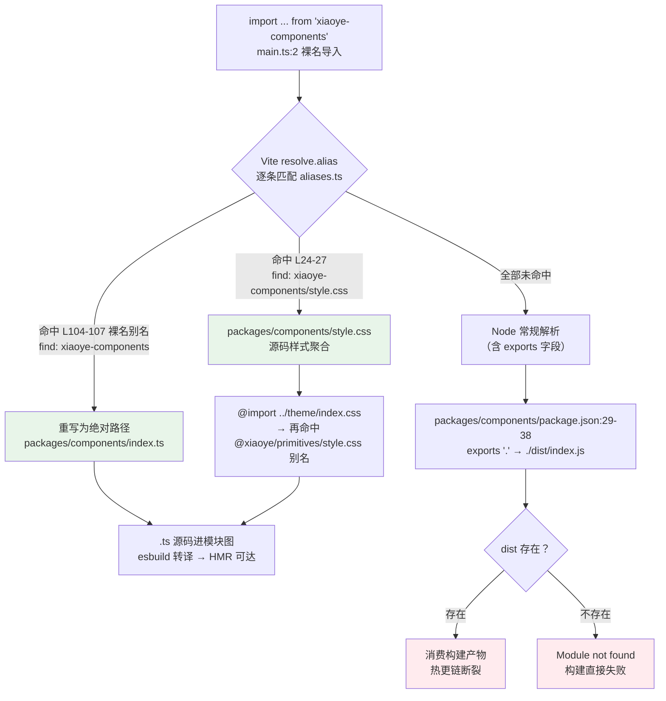
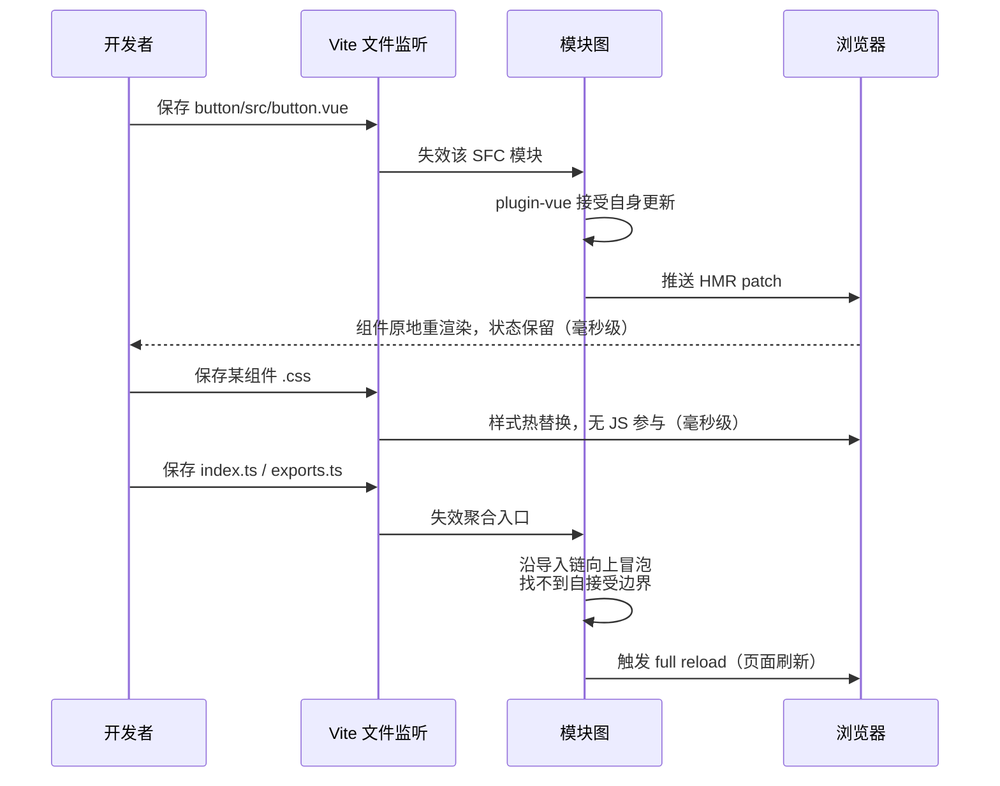

# 2-08 · Playground：源码级联调

> 核心问题：**改一行组件源码，为什么 playground 能即时热更？**
> 传统联调的流程是"改源码 → 构建库 → 联调应用重启"，以分钟计；而 xiaoye-components 的 playground（`apps/playground`）做到的是"改源码 → 保存 → 毫秒级热更"。这一篇我们拆开这条热更链路，会发现它没有一行黑魔法：playground 从第一行 import 开始就没有消费过"包"，它消费的是**源码本身**——依赖图里没有任何一环要求"先跑库构建"。本文所有路径与行号均为当前工作区实态（`apps/playground/src/main.ts` 的 L3 以工作区已修复版本为准，该修复目前尚未提交，正文考据段会如实展开）。

---

## 一、先把问题说清楚：联调的两种时间尺度

接到这个题目时，先复述一下它到底在对抗什么。组件库的联调，业界常见两种姿势：

**姿势 A：产物联调。** playground 把 `xiaoye-components` 当作普通的 npm 依赖声明进 `package.json`，解析到 `dist/index.js`。想验证一个组件改动，得先 `pnpm build:lib`——那可是 vite 构建 + 808 行 dts 后处理管线（见 2-03 篇）——然后指望 dev server 重新解析依赖。更糟的是 Vite 对 `node_modules` 里的依赖有预构建缓存（optimizeDeps），库产物更新后经常还得 `--force` 重启。一轮下来，分钟级起步。

**姿势 B：源码联调。** playground 的模块图直接扎根在 `packages/` 的 `.ts` / `.vue` / `.css` 文件上。改一行 `packages/components/button/src/button.vue`，保存，Vite 的文件监听立刻命中这个模块，SFC 热更，浏览器不刷新、组件状态不丢，毫秒级。

xiaoye-components 选了 B。而且这个选择不是靠"playground 里 import 路径全写成相对路径"这种人肉纪律实现的——那是目录改名就能弄断的脆弱链条（本文第五节有一场真实事故）。它靠的是一张**别名表**：裸名导入在 Node 常规解析之前就被劫持，重写到源码文件上。

先看证据的最小集：`apps/playground/package.json` 全文（10 行）——

```json
{
  "name": "@xiaoye/playground",
  "private": true,
  "type": "module",
  "scripts": {
    "dev": "vite",
    "build": "vite build",
    "preview": "vite preview"
  }
}
```

没有 `dependencies`，没有 `devDependencies`，自然也没有 `xiaoye-components: workspace:*`。也就是说，**从包管理器的视角，playground 根本不依赖组件库**。它却能在浏览器里渲染出全部 72 个基础组件和增强层组件——唯一的原因是：导入解析被别名表接管了。

## 二、总览：一次导入的完整旅程

以 `apps/playground/src/main.ts:2` 的 `import XiaoyeComponents from "xiaoye-components"` 为例，画一次它在 Vite 里的完整旅程。这张决策流是全篇的地基：



两条分支的分野就是本篇的核心问题答案：

- **绿色路径（实际发生）**：别名命中发生在 Node 常规解析（含 exports 字段）**之前**，裸名导入直接落到 `packages/components/index.ts` 源码。源码进模块图，Vite 的 HMR 体系天然覆盖它。
- **红色路径（如果没有这张别名表）**：`packages/components/package.json:22-24` 的 `"main": "./dist/index.js"`、`"module": "./dist/index.js"`、`"types": "./dist/types/index.d.ts"` 和 L29-38 的 `exports` 全都指向 dist。没构建过 dist？`Module not found`，playground 连启动都做不到；构建过？恭喜进入姿势 A 的分钟级循环。

看一眼这个"如果没有"的实态（`packages/components/package.json:22-38`）：

```json
  "main": "./dist/index.js",
  "module": "./dist/index.js",
  "types": "./dist/types/index.d.ts",
  "sideEffects": [
    "*.css",
    "**/*.css"
  ],
  "exports": {
    ".": {
      "types": "./dist/types/index.d.ts",
      "import": "./dist/index.js"
    },
    "./style.css": {
      "types": "./dist/style.css.d.ts",
      "default": "./dist/style.css"
    }
  },
```

注意这份 manifest 的定位：它是**发给 npm 用户的发布契约**（`files` 只带 `dist`），本来就该指向构建产物。playground 的源码联调并不修改它——不搞 `"development"` 条件导出，不搞 `publishConfig` 换指针——而是在**解析入口处**（Vite 的 `resolve.alias`，类型侧则是 tsconfig 的 `paths`，见第六节）把请求整体截走。发布契约与联调现实各走各的管道，互不污染。这是本库的第一个设计权衡：**与其让一份 manifest 同时伺候"发布"和"联调"两个主人，不如让联调在解析层短路掉**。

## 三、vite.config.ts 全文：十行配置的全部秘密

整个 playground 的构建配置，全文如下（`apps/playground/vite.config.ts:1-10`，一字不减）：

```ts
import { defineConfig } from "vite";
import vue from "@vitejs/plugin-vue";
import { workspaceAlias } from "../../scripts/config/aliases";

export default defineConfig({
  plugins: [vue()],
  resolve: {
    alias: workspaceAlias
  }
});
```

十行里没有 `optimizeDeps`、没有 `server` 配置、没有 `define`、没有环境变量开关。`@vitejs/plugin-vue` 是唯一插件——它负责 SFC 编译与组件级 HMR；`resolve.alias` 指向 `scripts/config/aliases.ts` 导出的 `workspaceAlias` 数组——它负责把整个 workspace 的包名空间重写到源码。

配置能做到这么薄，是因为所有复杂性都收敛进了那张别名表。而这张表值得单独一节。

## 四、aliases.ts：裸名导入能被解析的唯一原因

`scripts/config/aliases.ts` 全文 116 行，是仓库唯一一份包名 → 源码路径的映射（2-01 篇讲过它的抽取史：playground 曾内联自己的对象式 alias，`6b6b247` 收敛工程配置时统一抽到这里）。先看它的头部与 CSS 段（`scripts/config/aliases.ts:1-27`）：

```ts
import { fileURLToPath, URL } from "node:url";

const resolveWorkspacePath = (target: string) => fileURLToPath(new URL(target, import.meta.url));

export const workspaceAlias = [
  // CSS files (must come before the general @xiaoye/primitives alias)
  {
    find: "@xiaoye/primitives/style.css",
    replacement: resolveWorkspacePath("../../packages/xiaoye-primitives/style.css")
  },
  {
    find: "xiaoye-primitives/style.css",
    replacement: resolveWorkspacePath("../../packages/xiaoye-primitives/style.css")
  },
  // @xiaoye/pro-components
  {
    find: "@xiaoye/pro-components/style.css",
    replacement: resolveWorkspacePath("../../packages/pro-components/style.css")
  },
  {
    find: "xiaoye-pro-components/style.css",
    replacement: resolveWorkspacePath("../../packages/pro-components/style.css")
  },
  {
    find: "xiaoye-components/style.css",
    replacement: resolveWorkspacePath("../../packages/components/style.css")
  },
```

再看裸名映射与正则兜底（`scripts/config/aliases.ts:103-116`）：

```ts
  // xiaoye-components (bare import)
  {
    find: "xiaoye-components",
    replacement: resolveWorkspacePath("../../packages/components/index.ts")
  },
  {
    find: /^xiaoye-components\/(.*)$/,
    replacement: `${resolveWorkspacePath("../../packages/components/")}/$1`
  },
  {
    find: "xiaoye-pro-components",
    replacement: resolveWorkspacePath("../../packages/pro-components/index.ts")
  }
] as const;
```

这张表有三个值得驻足的细节，每个都是一处设计权衡。

**权衡一：数组而非对象——顺序即语义。** Vite 的 alias 支持对象和数组两种写法，对象写法键无序（JS 对象键遍历顺序不保证语义表达），数组写法**逐条按序匹配**。这张表把所有 CSS 子路径别名放在表首（L6 的注释原话："must come before the general @xiaoye/primitives alias"），因为 L75-78 的一般别名 `@xiaoye/primitives` 是字符串前缀匹配——若它排在前面，`@xiaoye/primitives/style.css` 会被先劫持到 `packages/xiaoye-primitives/index.ts`，样式导入变成一个 JS 模块，直接报错。同理 L28 注释写着 "@xiaoye/components (exact matches before regex)"：精确匹配必须排在 L62 的正则 `/^@xiaoye\/components\/(.*)$/` 之前，否则正则会把所有子路径吞掉。**用数组的物理顺序表达优先级，比在任何解析器里实现优先级机制都便宜**。

**权衡二：replacement 全部锚定包名空间，不锚定目录历史。** 每一条 `replacement` 都指向当前目录实态（`packages/components`、`packages/xiaoye-primitives`），而业务代码里出现的是稳定的包名（`xiaoye-components`）。目录哪天再改名，只改这一处；业务代码零感知。这不是理论推演——第五节的事故就是反例的代价。

**权衡三：一张表服务四条工具链。** 这份 `workspaceAlias` 目前有四个消费点：

| 消费点 | 接入方式 |
| --- | --- |
| `vitest.config.ts:3,8` | 单测跑真实源码 |
| `scripts/config/library-build.ts:63` | 库构建工厂（服务 base/pro/primitives 三份 vite 配置，2-02 篇） |
| `apps/playground/vite.config.ts:8` | 本篇主角，联调 |
| `apps/docs/.vitepress/config.ts:152` | 文档站（导入行在其 L7） |

单测配置可以作证这份复用有多"平"——`vitest.config.ts:1-21` 全文：

```ts
import { defineConfig } from "vitest/config";
import vue from "@vitejs/plugin-vue";
import { workspaceAlias } from "./scripts/config/aliases";

export default defineConfig({
  plugins: [vue()],
  resolve: {
    alias: workspaceAlias
  },
  test: {
    environment: "jsdom",
    globals: true,
    setupFiles: ["./vitest.setup.ts"],
    exclude: [
      "tests/e2e/**",
      "node_modules/**",
      "**/node_modules/**",
      "dist/**"
    ]
  }
});
```

和 playground 的 vite.config.ts 几乎逐行同构——同一插件、同一别名表，只是多了 `test` 块。这意味着**单测、playground、文档站看到的组件行为保证同源**：三处都解析到 `packages/` 下同一份 `.ts`/`.vue`。测试绿的，playground 里就是那个行为；playground 里调通的，文档示例就是那个表现。库构建工厂走同一张表则保证了产物与源码的一致性闭环。

### 样式热更链：三包一路 @import，零 dist

别名表对样式的接管值得单独演示一遍，因为它跨了三个包。从 `main.ts:3` 出发：

```css
/* packages/components/style.css:1 —— 源码聚合入口 */
@import "../theme/index.css";

/* packages/theme/index.css:1 —— 主题入口，又是一次裸名导入 */
@import "@xiaoye/primitives/style.css";
```

链条是：playground 的 `import "xiaoye-components/style.css"` → 命中别名表 L24-27 → `packages/components/style.css` → 其 L1 相对导入 `../theme/index.css` → `packages/theme/index.css` 的 L1 又裸名导入 `@xiaoye/primitives/style.css` → 再命中别名表 L7-10 → `packages/xiaoye-primitives/style.css`（令牌三层架构的物理源，3-01 篇）。三包样式链全程源码、全程 dist 零参与。所以改任何一个组件的 `.css`，保存即热替换；改 `tokens.css` 的令牌值，全站样式即时刷新。

顺带看一眼样式链的起点为什么长这样（`packages/components/index.ts:1-11`）：

```ts
import type { App, Plugin } from "vue";
import "./style.css";
import * as XiaoyeComponentExports from "./exports";
import { installableComponentExportNames } from "./component-manifest";

export type { ComponentSize, ComponentStatus, SelectOption } from "xiaoye-primitives";
export * from "./exports";

const INSTALL_KEY = Symbol.for("xiaoye-components:installed");

function isInstallableExport(value: unknown): value is Plugin {
```

L2 的 `import "./style.css"` 让 JS 入口也自带样式——这就是 `package.json` 里 `sideEffects: ["*.css", "**/*.css"]`（L25-28）要保护的东西：告诉打包器这些 CSS 导入有副作用，别 tree-shake 掉。而 L9 的 `Symbol.for` 安装防重入（跨实例的全局注册表键）守的是另一条边：同一 JS 运行时里多次 `app.use(XiaoyeComponents)`（单测里反复 `createApp().use()` 是常态）只有第一次真正注册组件。

## 五、main.ts：六行入口的断链考据与修复

playground 的入口只有六行。先看当前实态全文（`apps/playground/src/main.ts:1-6`）：

```ts
import { createApp } from "vue";
import XiaoyeComponents from "xiaoye-components";
import "xiaoye-components/style.css";
import App from "./App.vue";

createApp(App).use(XiaoyeComponents).mount("#app");
```

L3 的 `import "xiaoye-components/style.css"` 就是第四节那条三包样式链的起点。但这行代码不是生来如此——它背后有一次真实的断链事故，值得用"考据 + 修复"双段记录。

**考据段：曾经断链。** 初始化提交 `ff2024b`（feat: 初始化组件库基础设施与MVP交互组件）里的 main.ts，L3 写的是一条三层相对路径。git HEAD 上留存的旧版全文（`git show HEAD:apps/playground/src/main.ts`）：

```ts
import { createApp } from "vue";
import XiaoyeComponents from "xiaoye-components";
import "../../../packages/xiaoye-components/style.css";
import App from "./App.vue";

createApp(App).use(XiaoyeComponents).mount("#app");
```

同一份文件里，L2 用的是裸名别名，L3 却绕开别名写了相对路径——而当时 playground 内联的 alias 表里明明**已经有** `"xiaoye-components/style.css"` 这个键。埋雷只差一个契机：提交 `fc42f31`（2026-05-19，feat(admin-template)）把 `packages/xiaoye-components` 整体改名为 `packages/components`（`style.css` 以 R096 相似度 96% 的 rename 记录在案），这条相对路径从此指向一个不存在的目录，`pnpm build:playground` 直接报 `Module not found`，构建失败。**相对路径锚定的是目录布局——仓库里最容易漂移的东西；而它锚定的那一刻，就注定了下一次目录整理就是它的死期。**

**修复段：2026-09-16。** L3 改为 `import "xiaoye-components/style.css"`，回到别名表 L24-27 的映射上。修复的哲学和 2-07 篇 cssCodeSplit 事故一脉相承：**导入锚点选最稳定的契约**——包名是发布给全世界的承诺，目录布局是内部随时可整理的实现细节。需要如实说明：这次修复目前是工作区里的未提交改动（git HEAD 的 L3 仍是旧相对路径），本文按当前工作区实态书写。这行六字符级的修改恰好是全篇主题的注脚——**断链的从来不是"构建"，而是解析锚点选错了层**。别名表之所以把裸名映射放在 L103-116 的正则兜底之前、把所有映射收敛进单一事实源，就是为了让"main.ts 该怎么写"这类问题永远只有一个正确答案。

## 六、package.json：零依赖声明的证据与代价

回到第二节的悬念：playground 的 `package.json` 零依赖声明，可它明明 `import "vue"`、`import { Draggable } from "@fullcalendar/interaction"`（`SchedulerScene.vue:15`），vite 本身也从哪来？答案是**根 `package.json:39-84` 的 devDependencies**——`vue`、`vite`、`@vitejs/plugin-vue`、`@fullcalendar/*`、`echarts` 等全部依赖在 workspace 根声明一次，经 pnpm 的提升机制可被子包解析。工作区实态也印证了这一点：`apps/playground/node_modules` 目录**不存在**，而根 `node_modules` 下 `vite`、`vue` 一应俱全。

这是本篇第四处权衡，而且它有明确的两面：

- **收益**：版本事实源唯一。不存在"playground 里的 vue 和组件库构建用的 vue 差一个 minor"这类漂移问题；安装体积小；`pnpm install` 一次到位。对组件库这种"所有包必须共享同一个 Vue 实例"（否则 `app.use()` 的安装标志、provide/inject 全会错乱）的场景，根级单版本几乎是刚需——组件库对 vue 的正式依赖是 peerDependencies（`packages/components/package.json:44-47`），本来就不允许多版本。
- **代价**：这是一份**隐式契约**。playground 的 `package.json` 不读的话，没人知道它"其实需要"根里那些依赖；它也不能脱离 workspace 独立安装运行。类型检查同理依赖根配置——playground 没有自己的 `tsconfig.json`，由 `tsconfig/apps.json` 的 include 统一收编（覆盖 `../apps/playground/**/*.ts` 与 `**/*.vue`），而裸名导入的类型解析靠 `tsconfig/base.json` 的 `paths` 映射。

把那映射引出来看（`tsconfig/base.json`，`paths` 块节选）：

```json
"paths": {
  "@xiaoye/components": ["packages/components/index.ts"],
  "@xiaoye/components/*": ["packages/components/*"],
  "@xiaoye/pro-components/style.css": ["packages/pro-components/style.css"],
  "@xiaoye/pro-components": ["packages/pro-components/index.ts"],
  "@xiaoye/primitives": ["packages/xiaoye-primitives/index.ts"],
  "xiaoye-primitives": ["packages/xiaoye-primitives/index.ts"],
  "xiaoye-primitives/*": ["packages/xiaoye-primitives/*"],
  "@xiaoye/utils": ["packages/xiaoye-primitives/src/utils/index.ts"],
  "@xiaoye/theme": ["packages/theme/index.css"],
  "@xiaoye/tokens": ["packages/tokens/src/index.ts"],
  "xiaoye-components/style.css": ["packages/components/style.css"],
  "xiaoye-components": ["packages/components/index.ts"],
  "xiaoye-pro-components/style.css": ["packages/pro-components/style.css"],
  "xiaoye-pro-components": ["packages/pro-components/index.ts"]
}
```

和 aliases.ts 逐条对得上。于是整个 workspace 里存在**两套必须同步的映射**：运行时解析走 Vite alias（`moduleResolution: "Bundler"` 下的类型解析走 tsconfig paths）。它们都锚定同一批源码路径，单测和 `pnpm typecheck:packages` 会兜住漂移，但"两套映射"本身是这套架构的一笔持续税——好在 `paths` 与 `workspaceAlias` 都是纯声明式数据，同步成本可控。这是标准的工程取舍：用两份声明的冗余，换运行时与类型检查两条链路各自的最短路径。

## 七、App.vue：1.9 万字符的类型消费冒烟

`apps/playground/src/App.vue` 全文 640 行、18814 字符（约 1.9 万），结构是经典的 SFC 三段：script setup（L1-286）、template（L288-539）、style scoped（L541-640）。它把 `Tabs / Select / Table / Dialog / Drawer / Dropdown / Popover / Tooltip / Form / Upload / Date-Picker / Scheduler` 串成一个中后台回归页，是组件库的"冒烟测试主战场"。这里关心的是它的**类型消费**——开头一段（`apps/playground/src/App.vue:1-37`）：

```ts
<script setup lang="ts">
import { computed, reactive, ref } from "vue";
import SchedulerScene from "./components/SchedulerScene.vue";
import { XyDialogService } from "xiaoye-components";
import type {
  SchedulerDateClickPayload,
  SchedulerEvent,
  SchedulerEventChangePayload,
  SchedulerEventClickPayload,
  SchedulerView,
  UploadFileItem
} from "xiaoye-components";

interface MemberRow {
  id: number;
  name: string;
  owner: string;
  role: string;
  status: string;
  updatedAt: string;
}

interface FormInstance {
  validate: () => Promise<boolean>;
  resetFields: (props?: string | string[]) => void;
}

interface ActionItem {
  key: string;
  label: string;
}

const currentScene =
  typeof window !== "undefined"
    ? (new URLSearchParams(window.location.search).get("scene") ?? "")
    : "";
const isSchedulerScene = currentScene === "scheduler";
```

值得读三层。**其一，类型与值同源**：L4 值导入 `XyDialogService`，L5-12 类型导入六个类型（五个调度器相关 + `UploadFileItem`）——两者都写 `from "xiaoye-components"`。在 `moduleResolution: "Bundler"` + paths 的组合下，类型检查沿 `packages/components/index.ts` 源码走，IDE 里"转到定义"落在 `scheduler.ts` 的接口原文上，而不是 dist 的 `.d.ts`。**改组件的某个 payload 字段名，保存的瞬间，App.vue 里的红色波浪线同步出现**——这就是"类型消费冒烟"的含义：类型链和运行时链一样，是源码直连的。**其二，它消费的是真实 API 面**：`XyDialogService.confirm`（L161-174）以 Promise 风格调用命令式对话框，L262-285 的 `handleSave` 走 `formRef.value?.validate()` 表单校验协议——playground 不写"演示专用"的假 API，它就是组件库的第一个真实用户。**其三，模板层同样全程 kebab-case 的 `xy-*` 标签**（`xy-button`、`xy-form-item`……与仓库命名约定一致），安装侧一行 `createApp(App).use(XiaoyeComponents).mount("#app")`（main.ts:6）走全量 install。

模板里和本篇最相关的是 Scheduler 接线段（`apps/playground/src/App.vue:424-440`）：

```html
        <xy-scheduler
          v-model="schedulerDate"
          v-model:view="schedulerView"
          editable
          :events="schedulerEvents"
          height="680px"
          @date-click="handleSchedulerDateClick"
          @event-click="handleSchedulerEventClick"
          @event-change="handleSchedulerChange"
        >
          <template #event-content="{ event, timeText }">
            <div class="scheduler-event-card">
              <strong>{{ event.title }}</strong>
              <span v-if="timeText">{{ timeText }}</span>
            </div>
          </template>
        </xy-scheduler>
```

不过 App.vue 里这还只是简化版。真正的调度器深度联调在独立场景页里。

## 八、SchedulerScene.vue：1011 行联调场景的两个代表段

访问 `http://localhost:5173/?scene=scheduler` 时，App.vue:290 的分支切换到 `SchedulerScene`——1011 行的专项联调页，覆盖周/月/日视图切换、重复规则（rrrule）、框选建事件、外部拖入事件池、编辑与删除。它的头部有一处值得先点名的导入（`apps/playground/src/components/SchedulerScene.vue:13-14`）：

```ts
import { mapSchedulerEvents } from "../../../../packages/components/scheduler/src/scheduler";
import { Draggable } from "@fullcalendar/interaction";
```

L13 是**四层相对路径直连源码**——别名表的正则项 `/^xiaoye-components\/(.*)$/`（aliases.ts:109-111）其实也能命中这条深路径，作者选择了相对路径。这是另一种直连姿势：别名表没为每个内部工具函数开键，深路径直取未公开导出的 `mapSchedulerEvents`。它同样能热更（解析产物就是那个 `.ts` 文件），但也继承了相对路径的旧毛病——目录再整理时它是第一批断掉的。全库目前仅此一处，属于"受控的例外"而非推荐姿势。

### 接线段：六个事件 + 三个布尔开关

场景页的调度器接线是全库最完整的（`apps/playground/src/components/SchedulerScene.vue:650-666`）：

```html
    <section class="scheduler-scene__main">
      <xy-scheduler
        v-model="focusDate"
        v-model:view="view"
        :events="events"
        editable
        droppable
        selectable
        height="auto"
        @date-click="handleDateClick"
        @date-select="handleDateSelect"
        @drop="handleDrop"
        @event-click="handleEventClick"
        @event-change="handleEventChange"
        @event-receive="handleEventReceive"
      />
    </section>
```

双 v-model（焦点日期 + 视图）、三个能力开关（`editable` 拖拽改期、`droppable` 接收外部事件、`selectable` 框选）、六个事件回调——组件公共 API 的事件面在这里被一次拉满。每个回调的处理段（`SchedulerScene.vue:363-400`）：

```ts
function handleDateClick(payload: SchedulerDateClickPayload) {
  latestAction.value = `点击日期：${payload.date}（${payload.view} 视图）`;
}

function handleDateSelect(payload: SchedulerDateSelectPayload) {
  pendingSelection.value = payload;
  selection.value = formatSelectionSummary(payload);
  selectedEventId.value = null;
  selectedOccurrenceStart.value = null;
  latestAction.value = "已框选日期区间，请在右侧面板里完善标题后保存。";
  openCreator("create", {
    allDay: payload.allDay,
    start: payload.start,
    end: payload.end
  });
}

function handleEventClick(payload: SchedulerEventClickPayload) {
  selectedEventId.value = payload.event.sourceId ?? payload.event.id;
  selectedOccurrenceStart.value = String(payload.event.occurrenceStart ?? payload.event.start);
  latestAction.value = `点击事件：${payload.event.title}`;
  openCreator("edit", {
    title: payload.event.title,
    allDay: Boolean(payload.event.allDay),
    start: String(payload.event.occurrenceStart ?? payload.event.start),
    end: payload.event.end ? String(payload.event.end) : undefined,
    eventId: payload.event.sourceId ?? payload.event.id
  });
}

function handleEventChange(payload: SchedulerEventChangePayload) {
  events.value = events.value.map((event) =>
    event.id === payload.event.id ? payload.event : event
  );
  selectedEventId.value = payload.event.sourceId ?? payload.event.id;
  selectedOccurrenceStart.value = String(payload.event.occurrenceStart ?? payload.event.start);
  latestAction.value = `拖拽更新：${payload.event.title} -> ${payload.event.start}`;
}
```

每个 handler 都是同一骨架：读 payload → 回写本地状态 → 更新反馈条。所有 payload 类型（`SchedulerDateClickPayload` 等）正是第七节 App.vue 从 `xiaoye-components` 导入的那批——在源码联调架构下，这 1011 行业务代码与组件源码共享同一份类型定义文件。

### 权衡五：revert 回调在手而不用

这是本篇最想展开的一处设计权衡。组件侧的拖拽事件 payload 其实带着回滚武器（`packages/components/scheduler/src/scheduler.ts:63-90`）：

```ts
export interface SchedulerEventChangePayload {
  event: SchedulerEvent;
  oldEvent: SchedulerEvent;
  relatedEvents: SchedulerEvent[];
  revert: () => void;
  view: SchedulerView;
}

export interface SchedulerDropPayload {
  date: string;
  allDay: boolean;
  view: SchedulerView;
  nativeEvent: MouseEvent;
}

export interface SchedulerEventReceivePayload {
  event: SchedulerEvent;
  relatedEvents: SchedulerEvent[];
  revert: () => void;
  view: SchedulerView;
}
```

`revert: () => void` 是对 FullCalendar 底层 `arg.revert` 的透传（scheduler.ts:883、912），调用它就能把刚才那次拖拽在日历上原样弹回。但看场景页的实际策略：`handleEventChange`（L393-400）拿到 revert 不调用，直接把新事件 map 进 `events` 数组**先落库**；`handleEventReceive`（L455-475）同样先落库，再顺手把外部事件池里的模板移除：

```ts
function handleEventReceive(payload: SchedulerEventReceivePayload) {
  const normalized = payload.event;
  const duplicated = events.value.some((event) => event.id === normalized.id);

  if (!duplicated) {
    events.value = [...events.value, { ...normalized, editable: true }];
  }

  const templateId =
    typeof normalized.extendedProps?.externalTemplateId === "string"
      ? normalized.extendedProps.externalTemplateId
      : null;

  if (removeTemplateAfterDrop.value && templateId) {
    externalTemplates.value = externalTemplates.value.filter((item) => item.id !== templateId);
  }

  selectedEventId.value = normalized.sourceId ?? normalized.id;
  selectedOccurrenceStart.value = String(normalized.occurrenceStart ?? normalized.start);
  latestAction.value = `已接收外部事件：${normalized.title}`;
}
```

为什么 revert 在手而不用？因为两种回滚语义对应两种产品形态。`revert` 是**精确回滚**——适合"操作必须可撤销"的真实排期产品，用户拖错了要能原地弹回；它的成本是业务侧必须维护"日历视图状态"与"数据状态"的双向一致，任何一处不同步就会出现"看着弹回了、数据没回"的幽灵状态。而联调场景页的诉求恰恰相反：**状态永远可以整体恢复到已知初值**。所以它的策略是"先落库 + `resetScene` 整体重置"（`SchedulerScene.vue:305-316`）：

```ts
function resetScene() {
  resetCreator();
  focusDate.value = initialFocusDate;
  view.value = initialView;
  selection.value = initialSelection;
  latestAction.value = "已恢复演示场景。";
  selectedEventId.value = null;
  selectedOccurrenceStart.value = null;
  removeTemplateAfterDrop.value = true;
  externalTemplates.value = cloneExternalTemplatePool();
  events.value = cloneSchedulerEvents(initialEvents);
}
```

一个按钮（模板 L568 的"恢复初始状态"）把十个状态位全部拉回初始快照——`initialEvents` 经 `cloneSchedulerEvents` 深拷贝回填，连外部模板池都是克隆。**演示页要的是可重置，不是可撤销**：revert 语义保留在组件的公开类型里（谁接真产品谁去用），联调页用自己的粗粒度兜底。这个"回调在手而不用"不是偷懒，是把组件 API 的完备性与场景页的策略简单性解耦——组件保证"你可以精确回滚"，场景页选择"我整体重来"。

## 九、热更链路的诚实边界

HMR 不是银弹，把边界说清楚比吹嘘速度更有价值。Vite 的热更能力取决于改动落在模块图的哪个深度，playground 里分三种情况：



- **改组件 SFC**（`button.vue` 这类）：`@vitejs/plugin-vue` 让 SFC 模块自接受更新，走组件级 HMR，毫秒级、状态保留——这是最高频路径，体验最好；
- **改组件样式 `.css`**：样式热替换，不经过 JS；
- **改聚合层**（`index.ts`、`exports.ts`、`component-manifest.ts`）：这些普通 TS 模块没有 HMR 自接受能力，Vite 沿导入链向上冒泡找不到边界，回退 full reload——秒级，但**依然不需要先跑 `build:lib`**。

第三种情况是这个架构的诚实下限：别名体系保证的从来不是"永远不刷新"，而是**任何一行源码改动都直接进模块图**——无论热更还是整刷，消费的都是改完的源码本身。"改一行组件源码，playground 即时热更"的完整表述因此是：改在 SFC/CSS 深度是毫秒级热更，改在聚合层是秒级整刷，但没有任何一种情况需要构建库。

## 十、权衡复盘

把全篇的设计决策收拢成一张账：

1. **发布契约与联调现实分层**（第二节）：`package.json` 的 exports 坚守 dist 指向服务 npm 用户，联调在 Vite alias / tsconfig paths 的解析入口短路，不做 development 条件导出的两头讨好。
2. **数组别名、顺序即语义**（第四节）：CSS 子路径置顶、精确匹配先于正则，优先级写在数组的物理顺序里，配注释看守。
3. **导入锚点选包名不选目录**（第五节）：`fc42f31` 目录改名弄断了相对路径，2026-09-16 的修复把锚点挪到包名契约上；别名收敛进单一事实源后，目录整理只需改一处。
4. **零依赖声明换单一版本事实源**（第六节）：代价是"依赖根提升"的隐式契约与 vite alias / tsconfig paths 双映射的同步税。
5. **组件 API 完备性与场景策略解耦**（第八节）：`revert` 精确回滚留在公开类型里服务真实产品，联调页选"先落库 + resetScene 整体重置"。

## 十一、小结

回到标题的问题：改一行组件源码，为什么 playground 能即时热更？答案是四层环环相扣的机制——

1. **playground 零依赖声明**，从包管理器视角它与组件库毫无关系；
2. **`workspaceAlias` 在 Node 常规解析（含 exports）之前命中**，裸名导入直接重写到 `packages/` 下的 `.ts`/`.css` 源码，dist 全程不参与；
3. **同一张别名表服务单测、库构建、playground、文档站四条工具链**，四处看到的行为同源；
4. **SFC/CSS 改动走组件级 HMR，聚合层改动走 full reload**，但任何改动都不需要先跑库构建。

这套机制没有一行自己的代码——它全部由配置声明构成（10 行 vite 配置 + 116 行别名表 + tsconfig paths）。第一篇里我们说过这个仓库的品味：能用结构性方案解决的，绝不靠纪律维护。playground 的热更是这句话在联调维度的注脚。它也有自己的边界：双映射同步是持续税，`SchedulerScene.vue:14` 还留着一处相对路径直连的受控例外，零依赖声明是一份要靠文档兑现的隐式契约。这些不完美都记录在案，因为知道边界在哪，比相信"毫秒级"三个字更重要。

下一篇是 **2-09《llms 文档与 MCP Server：组件库的 AI 生态》**：alias 体系解决的是"人怎么联调组件"，而 `llms-full.txt` 生成管线和 `packages/mcp-server` 解决的是另一个消费者——AI 工具怎么"读懂"组件库。下一篇拆它的令牌与文档生成链、MCP Server 的工具面设计，以及为什么这套东西和 playground 一样，全部从源码直接生长出来。
