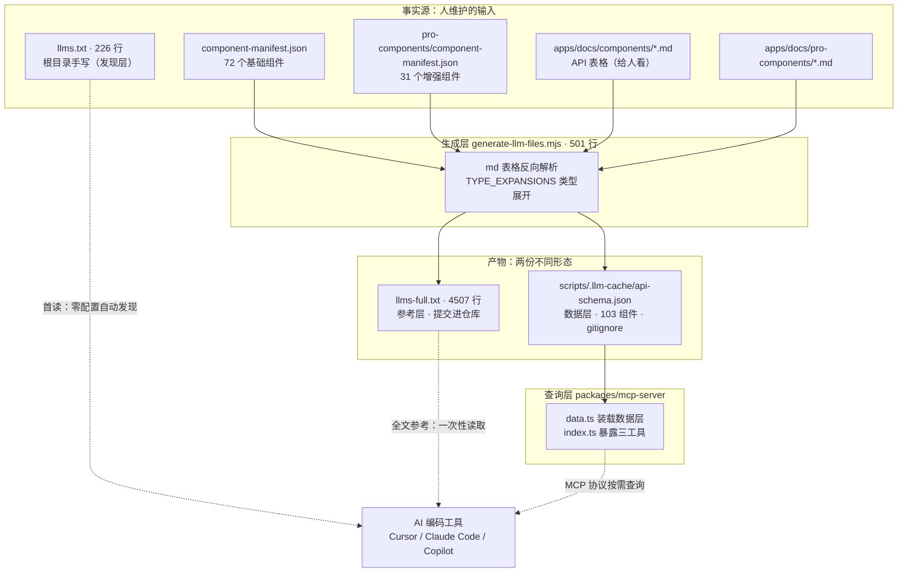
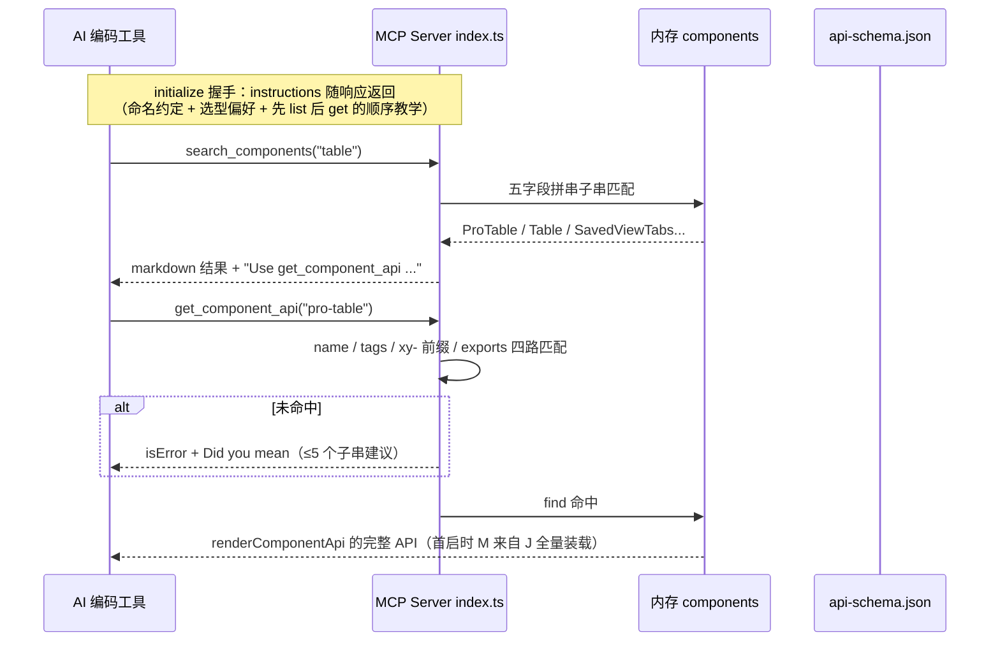
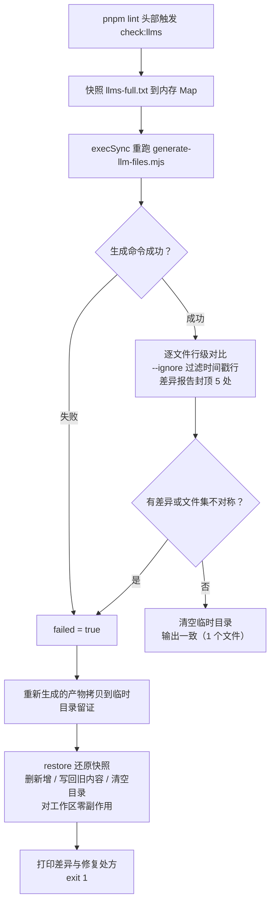

# 2-09 · llms 文档与 MCP Server：组件库的 AI 生态

> 核心问题：**让 AI 用对你的组件库，需要哪四层数据设施？**
> 组件库文档写了再多，如果消费方是 Claude、Cursor、Copilot 这样的 AI 编码工具，它们不会"翻文档"——它们要么读训练数据里那份早已过时的记忆，要么现场猜。这一篇我们拆 xiaoye-components 交给 AI 的四层数据设施：手写的发现层 `llms.txt`（226 行）、生成的参考层 `llms-full.txt`（4,507 行）与数据层 `api-schema.json`（103 个组件的结构化数据），以及作为查询层的 MCP Server（`packages/mcp-server`，268 行 + 84 行）。核心生成器是 `scripts/generate-llm-files.mjs`（501 行），它把"给人看的文档表格"反向解析成"给机器看的数据"，一次喂饱两层。所有行号均为当前工作区实态（`wc -l` 口径：501 / 268 / 84 / 175 / 226 / 4,507）。

---

## 一、先把问题说清楚：AI 是怎么把组件库用错的

先复述一下我们在对抗什么。一个 AI 编码工具拿到"用 xiaoye-components 写一个列表页"的指令时，它的组件库知识来自三个地方，每个地方都不可靠：

**第一，训练数据。** 私有组件库根本不在训练集里；就算某天进了，模型记住的也是快照那一刻的 API。组件库是活的东西，`size` 的取值从 `sm | md | lg` 扩成五档的那天起，模型记忆就开始撒谎。

**第二，现场猜。** 没有可靠输入时，模型会按它见过的所有组件库的"公约数"猜：标签大概叫 `<Button>`？尺寸大概是 `small | middle | large`（Ant Design 口径）还是 `small | default | large`（Element Plus 口径）？猜错的每一次都变成用户手里的报错。

**第三，选不动。** 就算模型知道你有哪些组件，"这个场景该用 Dialog 还是 Drawer、Table 还是 ProTable、Form 还是 SearchForm"是纯业务判断，类型签名里没有这个信息。选型错了，代码照样能跑，但产品形态从根上歪了。

对症下药，这四层设施各自回答一个问题：

| 层级 | 载体 | 回答的问题 | 谁来维护 |
|------|------|------------|----------|
| 发现层 | `llms.txt`（根目录，手写 226 行） | 这个库是什么、有哪些组件、**该选哪个** | 人 |
| 参考层 | `llms-full.txt`（4,507 行，生成） | 每个组件的完整 Props / Events / Slots / Exposes | 生成器 |
| 数据层 | `scripts/.llm-cache/api-schema.json`（生成，gitignore） | 同上的结构化形态，供程序消费 | 生成器 |
| 查询层 | MCP Server（`packages/mcp-server`） | 按需、精准地取上面两层的数据 | 人 + 数据层 |

这四层的命名与分工在仓库自己的文档里也有明确表述——`apps/docs/guide/llm-integration.md:39-42` 的表格原话是：发现层 `llms.txt`"组件库概览，AI 工具首次读取"；参考层 `llms-full.txt`"完整 API 参考"；数据层 `api-schema.json`"结构化 JSON，供脚本和 MCP Server 使用"；查询层 MCP Server"按需查询，AI 工具实时调用"。

关键的结构判断有两条。**其一，四层 = 三份数据 + 一个查询接口**：MCP Server 不是第四份数据，它启动时把数据层整个装载进内存（`data.ts`，84 行），自己一行组件知识都不维护。**其二，只有发现层是手写的**：参考层和数据层共享同一条生成链，`generate:llm` 一条命令（`package.json:35`）同时产出两个文件——"文档即事实源"是这条链的全部设计前提，也是它所有优缺点的来源。

先把全景画出来，后面按数据流逐层精读。



三条消费通道各有分工：静态文件通道（`llms.txt` 与 `llms-full.txt`）零配置、靠约定被 AI 工具自动发现；协议通道（MCP）需要配置但能按需精准取数。同一个事实源，喂两种口味的消费方。

## 二、第一层：手写的发现层 llms.txt（226 行）

`llms.txt` 是 Answer.AI 在 2024 年提出的 LLM 发现协议（`apps/docs/guide/llm-integration.md:46` 原话："llms.txt 是 Answer.AI 提出的 LLM 发现协议，放在项目根目录"），约定是极简的：AI 工具在读一个陌生仓库时，优先找根目录的这个文件。`xiaoye-components` 的版本全文 226 行，分段看。先是头部与选型指南（`llms.txt:1-57`）：

````txt
# xiaoye-components

> 一套面向中后台场景的 Vue 3 组件库，基于 TypeScript 开发，包含 72 个基础组件和 31 个增强业务组件。所有基础组件前缀为 `xy-`（如 `xy-button`），增强组件前缀为 `xy-`（如 `xy-pro-table`），TypeScript 标识符使用 PascalCase（如 `XyButton`、`XyProTable`）。

## 安装

```bash
# 基础组件库
npm install xiaoye-components

# 增强业务组件库
npm install xiaoye-pro-components
```

## 全局注册

```ts
import { createApp } from 'vue'
import XyComponents from 'xiaoye-components'
import 'xiaoye-components/style.css'

const app = createApp(App)
app.use(XyComponents)
```

## 组件选择指南

### 弹层与浮层：该用哪个？

- **Dialog**：阻断式录入、二次确认、强提示。需要用户显式处理才能继续。
- **Drawer**：侧边滑出，适合详情展示、筛选面板、辅助录入，不阻断主内容。
- **Popover**：轻量气泡卡片，补充说明或简单操作，点击外部关闭。
- **Tooltip**：纯文字提示，不承载交互。
- **Popconfirm**：气泡确认框，适合轻量级删除/停用确认。
- **Message**：全局轻提示，自动消失，不阻断操作。
- **Notification**：全局通知，可手动关闭，适合系统级消息。

### 表单：该用哪个？

- **Form + FormItem**：基础表单，手动组织字段和校验。
- **SearchForm**：搜索筛选栏，声明式字段配置，自动折叠/展开。
- **ProForm**：增强表单，JSON Schema 驱动，支持联动和动态字段。
- **DialogForm / DrawerForm**：弹窗/抽屉内的表单，自带打开/关闭和提交逻辑。
- **StepsForm**：分步表单，向导式多步录入。
- **OverlayForm**：浮层表单，适合行内编辑或轻量弹层录入。

### 表格：该用哪个？

- **Table + TableColumn**：基础表格，模板声明式列定义。
- **ProTable**：增强表格，JSON 列配置 + 工具栏 + 分页 + 筛选 + 导出 + 可编辑 + 虚拟滚动。

### 页面：该用哪个？

- **ListPage**：标准列表页，搜索 + 表格 + 分页一体化。
- **CrudPage**：增删改查页面，内置新增/编辑/删除流程。
- **DetailPage**：详情页面容器。
- **SplitLayoutPage**：左右分栏页面，适合主从结构。
````

这一段是整个文件的灵魂。注意它的组织方式：**不是按组件 alphabet 排，而是按"场景决策树"排**——"弹层与浮层：该用哪个？"下面每一条都是一个"组件名 + 一句话边界"。这正是 AI 最需要的知识形态：`Dialog` 与 `Drawer` 的 props 差异机器可以从类型里推，但"阻断式"与"不阻断主内容"这条产品边界只存在于人的脑子里。手写这一层的不可替代性就在这里（这是本篇第一个设计权衡，第三节展开）。

接着是两组清单（`llms.txt:59-155` 基础组件、`llms.txt:157-213` 增强组件）。清单太长，各截一段看形态：

```txt
## 基础组件清单（xiaoye-components）

### 基础与展示

| 组件 | 标签 | 说明 |
|------|------|------|
| Button | `xy-button` | 按钮，支持 type/size/loading/plain/text/link/round/circle/block |
| ButtonGroup | `xy-button-group` | 按钮组，透传 type/size/direction |
| Link | `xy-link` | 文字链接 |
| Icon | `xy-icon` | Iconify 图标组件 |

### 反馈与浮层

| 组件 | 标签 | 说明 |
|------|------|------|
| Message | `$message` | 全局轻提示（命令式调用） |
| Notification | `xy-notification` / `$notify` | 全局通知 |
| Dialog | `xy-dialog` | 对话框，支持拖拽/调整尺寸/全屏/最大化/编程式调用 |
| Loading | `v-loading` / `$loading` | 加载指令/服务 |

## 增强组件清单（xiaoye-pro-components）

### 页面容器

| 组件 | 标签 | 说明 |
|------|------|------|
| ListPage | `xy-list-page` | 列表页面容器 |
| CrudPage | `xy-crud-page` | 增删改查页面 |
| SplitLayoutPage | `xy-split-layout-page` | 分栏页面 |
```

清单的三个列（组件名 / 标签 / 一句话说明）是刻意选的：标签列直接教会 AI "模板里写 kebab-case"，说明列把最重要的能力关键词（虚拟滚动、编程式调用、命令式调用）塞进一行。文件收尾是关键约定和指向参考层的链接（`llms.txt:215-226`）：

```txt
## 关键约定

- 组件标签统一使用 kebab-case：`xy-button`、`xy-form-item`、`xy-pro-table`
- TypeScript 标识符使用 PascalCase：`XyButton`、`XyFormItem`、`XyProTable`
- v-model 约定：`v-model="value"` 对应 `modelValue` / `update:model-value`
- 全局尺寸：`xs` / `sm` / `md` / `lg` / `xl`（默认 `md`），通过 ConfigProvider 或组件 size 属性控制
- 图标使用 Iconify 格式：`icon="mdi:loading"`、`icon="mdi:close"`
- 编程式调用：Dialog 支持 `XyDialogService.open/confirm/alert/prompt`，Message 通过 `$message`，Notification 通过 `$notify`

## 完整 API 参考

详见 [llms-full.txt](./llms-full.txt)，包含每个组件的完整 Props / Events / Slots / Exposes 定义。
```

先记下一笔，第五节要回来对账：这里手写的"全局尺寸：`xs` / `sm` / `md` / `lg` / `xl`"与运行时真实定义基本一致（`packages/xiaoye-primitives/src/composables/shared-context.ts:6` 的 `ComponentSize = "" | "xs" | "sm" | "md" | "lg" | "xl"`，默认值 `"md"` 在同文件 28 行），却与后面生成链和 MCP instructions 里的口径**不一致**——同一份"AI 界面"上，尺寸这一个知识点就有三种说法。

## 三、手写层与生成层的分界（权衡一）

为什么四层里偏偏是"发现层手写、参考层与数据层生成"？这条分界线画在哪，是这个体系最重要的一个选型。

**生成层管"事实"：API 签名是机械可推导的。** 一个组件有哪些 props、每个 prop 的类型和默认值，答案唯一地写在文档表格里（这个库选择让文档表格充当事实源，下一节专门讨论这个选择的代价）。机械可推导的东西交给生成器，换来的是 103 个组件的 API 数据与文档**结构性地**保持同源——文档改了，跑一遍 `pnpm generate:llm` 就同步，不存在"人忘了更新"这个环节。

**手写层管"判断"：选型边界推不出来。** "什么时候用 DialogForm 而不是 DrawerForm""ProTable 的工具栏在数据量小的时候该不该藏"——这些判断无法从类型签名推导，也无法从文档表格聚合。它们必须由最理解组件设计意图的人写下来。而且写下来的形态必须是**比较级**的（"X 适合……，Y 适合……"），不是字典级的；AI 面对的选择从来不是"Dialog 是什么"，而是"这里该不该用 Dialog"。

这条分界线还有一个经济学的角度：手写内容的维护成本随组件数线性增长，所以只能承载"每个组件一行"的清单加"每类场景一段"的决策树；生成内容的边际成本是零，所以可以承载全量 API。226 行手写 + 4,507 行生成的比例，就是"判断密度"与"事实密度"的配比。

代价也要说清楚：**手写层没有任何守卫**。`llms.txt` 第三行"72 个基础组件和 31 个增强业务组件"这组数字是手敲的，组件数变了它不会自己变；第二节的尺寸口径就是手写层、生成层、运行时三方不一致的活例。后文第六节的守卫只覆盖生成层——手写层的事实准确性（组件数、尺寸口径），目前靠的是人肉和 code review。

## 四、生成器：generate-llm-files.mjs（501 行）一次喂饱两层

这是本篇技术密度最高的一节。生成器要做的事一句话说完：**读入 manifest 与文档 markdown，把给人看的 API 表格拆回结构化数据，再按两种形态写出去**。逐段精读。

### 4.1 输入端：manifest 驱动，文档缺了不炸

文件开头先定基调（`scripts/generate-llm-files.mjs:1-18`）：

```js
import fs from "node:fs";
import path from "node:path";

const repoRoot = process.cwd();

function readFile(relativePath) {
  const absolute = path.join(repoRoot, relativePath);
  if (!fs.existsSync(absolute)) return null;
  return fs.readFileSync(absolute, "utf8");
}

function readManifest(relativePath) {
  const content = readFile(relativePath);
  if (!content) return [];
  return JSON.parse(content);
}

const baseManifest = readManifest("packages/components/component-manifest.json");
const proManifest = readManifest("packages/pro-components/component-manifest.json");
```

组件清单从两份 manifest 读——和文档站（2-06 篇）、聚合导出（`packages/components/index.ts`）用的是**同一个事实源**。这是这个仓库一以贯之的架构纪律：清单只维护一份，文档站、导出、AI 生态全部从它派生。

### 4.2 TYPE_EXPANSIONS：25 条手工映射表

`scripts/generate-llm-files.mjs:21-47`，全文：

```js
const TYPE_EXPANSIONS = {
  ButtonType: "'default' | 'primary' | 'success' | 'warning' | 'danger'",
  ButtonNativeType: "'button' | 'submit' | 'reset'",
  ComponentSize: "'sm' | 'md' | 'lg'",
  InputType: "'text' | 'textarea' | 'number' | 'password' | 'email' | 'search' | 'tel' | 'url'",
  InputAutoSize: "{ minRows?: number; maxRows?: number } | boolean",
  InputModelModifiers: "{ lazy?: true; number?: true; trim?: true }",
  TableAlign: "'left' | 'center' | 'right'",
  TableSortOrder: "'ascending' | 'descending' | null",
  TableSortable: "boolean | 'custom'",
  TableColumnType: "'default' | 'selection' | 'index' | 'expand'",
  TableColumnFixed: "boolean | 'left' | 'right'",
  TableLayout: "'fixed' | 'auto'",
  DialogCloseReason: "'close' | 'backdrop' | 'escape' | 'programmatic'",
  DialogTransition: "string | TransitionProps",
  Placement: "'top' | 'top-start' | 'top-end' | 'bottom' | 'bottom-start' | 'bottom-end' | 'right' | 'right-start' | 'right-end' | 'left' | 'left-start' | 'left-end'",
  TooltipEffect: "'dark' | 'light'",
  FormTrigger: "'blur' | 'change'",
  ValidateState: "'idle' | 'validating' | 'success' | 'error'",
  SearchFormFieldBuiltinComponent: "'input' | 'select' | 'checkbox' | 'checkbox-group' | 'radio' | 'radio-button' | 'radio-group' | 'cascader' | 'date-picker' | 'time-picker' | 'time-select' | 'input-number' | 'switch' | 'transfer' | 'avatar' | 'image' | 'progress' | 'tag' | 'timeline' | 'tree' | 'steps'",
  ProTableDensity: "'sm' | 'md' | 'lg'",
  ProTableEditableMode: "'table' | 'row' | 'cell'",
  ProTableEditableTrigger: "'click' | 'dblclick' | 'manual'",
  ProTableSelectionMode: "'single' | 'multiple'",
  ProTableExportType: "'csv' | 'excel'",
  ProTableContextmenuScope: "'row' | 'cell' | 'header'",
};
```

这张表存在的理由：文档表格里写的是 `ButtonType` 这样的**类型别名**，人类读者点一下跳转就懂，但 AI 读纯文本时，一个悬空引用就是一次猜测。生成器把别名就地展开成字面量联合，让 AI 不需要任何跳转就能看到完整取值域。

但这张表暴露了整个体系最隐蔽的一个软肋：**它是从运行时类型手工誊抄的第二事实源**。第三行 `ComponentSize: "'sm' | 'md' | 'lg'"` 已经和运行时定义漂移了——真实定义在 `packages/xiaoye-primitives/src/composables/shared-context.ts:6`：

```ts
export type ComponentSize = "" | "xs" | "sm" | "md" | "lg" | "xl";
```

六档对三档。这意味着今天任何一个读 `llms-full.txt` 或问 MCP Server 的 AI，都会被告知尺寸只有 `sm | md | lg`，写出 `size="xs"` 就报错。第六节会解释为什么 check:llms 守卫抓不住这类漂移——守卫保证的是"生成物与生成器一致"，不是"生成器与运行时一致"。

### 4.3 expandType：展开、剥壳与兜底

映射表只是原料，应用它的 `expandType` 才是重头戏（`scripts/generate-llm-files.mjs:49-106`），全文：

```js
function expandType(typeStr) {
  if (!typeStr) return typeStr;
  let result = typeStr;
  for (const [ref, expansion] of Object.entries(TYPE_EXPANSIONS)) {
    const patterns = [
      new RegExp(`\\b${ref}\\b`, "g"),
      new RegExp(`\\b${ref}\\s*\\[\\s*["']`, "g"),
    ];
    for (const pattern of patterns) {
      if (pattern.test(result)) {
        result = result.replace(new RegExp(`\\b${ref}\\b`, "g"), `(${expansion})`);
      }
    }
  }
  result = result.replace(/\bXxxProps\["([^"]+)"\]/g, "$1");
  result = result.replace(/\bButtonProps\["([^"]+)"\]/g, "$1");
  result = result.replace(/\bInputProps\["([^"]+)"\]/g, "$1");
  result = result.replace(/\bSelectProps\["([^"]+)"\]/g, "$1");
  result = result.replace(/\bTableProps\["([^"]+)"\]/g, "$1");
  result = result.replace(/\bFormProps\["([^"]+)"\]/g, "$1");
  result = result.replace(/\bDialogProps\["([^"]+)"\]/g, "$1");
  result = result.replace(/\bButtonGroupProps\["([^"]+)"\]/g, "$1");
  result = result.replace(/\bButtonGroupDirection\b/g, "'horizontal' | 'vertical'");
  result = result.replace(/\bButtonInstance\["([^"]+)"\]/g, "$1");
  result = result.replace(/\bInputInstance\["([^"]+)"\]/g, "$1");
  result = result.replace(/\bSelectInstance\["([^"]+)"\]/g, "$1");
  result = result.replace(/\bTableInstance\["([^"]+)"\]/g, "$1");
  result = result.replace(/\bFormInstance\["([^"]+)"\]/g, "$1");
  result = result.replace(/\bDialogInstance\["([^"]+)"\]/g, "$1");
  result = result.replace(/\bDialogServiceHandle\["([^"]+)"\]/g, "$1");
  result = result.replace(/\bDialogServiceResult\["([^"]+)"\]/g, "$1");
  result = result.replace(/\bSelectValue<T>\b/g, "T | T[] | null");
  result = result.replace(/\bSelectValueChangeHandler<T>\b/g, "(value: T | T[] | null) => void");
  result = result.replace(/\bSelectVisibleChangeHandler\b/g, "(value: boolean) => void");
  result = result.replace(/\bSelectSearchChangeHandler\b/g, "(value: string) => void");
  result = result.replace(/\bButtonClickHandler\b/g, "(event: MouseEvent) => void");
  result = result.replace(/\bInputValueChangeHandler\b/g, "(value: string | number) => void");
  result = result.replace(/\bInputFocusHandler\b/g, "(event: FocusEvent) => void");
  result = result.replace(/\bDialogBeforeCloseFn\b/g, "(done: (cancel?: boolean) => void, reason?: 'close' | 'backdrop' | 'escape' | 'programmatic') => void | Promise<void>");
  result = result.replace(/\bDialogModelValueChangeHandler\b/g, "(value: boolean) => void");
  result = result.replace(/\bDialogFullscreenChangeHandler\b/g, "(value: boolean) => void");
  result = result.replace(/\bDialogResizeHandler\b/g, "(event: MouseEvent, width: number, height: number) => void");
  result = result.replace(/\bTableRowClickHandler<T>\b/g, "(row: T, column: TableResolvedColumn<T> | undefined, event: MouseEvent | KeyboardEvent) => void");
  result = result.replace(/\bTableSelectionChangeHandler<T>\b/g, "(selection: T[]) => void");
  result = result.replace(/\bTableSortChangePayload<T>\b/g, "{ column: TableResolvedColumn<T>; prop: string | undefined; order: 'ascending' | 'descending' | null }");
  result = result.replace(/\bTableFilterChangeHandler\b/g, "(value: Record<string, (string | number | boolean)[]>) => void");
  result = result.replace(/\bTableScrollPayload\b/g, "{ scrollLeft: number; scrollTop: number }");
  result = result.replace(/\bFormProp\b/g, "string | string[]");
  result = result.replace(/\bFormRules\b/g, "Record<string, XyFormRule[]>");
  result = result.replace(/\bXyFormRule\b/g, "RuleItem & { required?: boolean; trigger?: 'blur' | 'change' | ('blur' | 'change')[] }");
  result = result.replace(/\bTableTreeProps\b/g, "{ hasChildren?: string; children?: string; checkStrictly?: boolean }");
  result = result.replace(/\bTableSortState\b/g, "{ prop?: string; order?: 'ascending' | 'descending' | null }");
  result = result.replace(/\bTableOverflowTooltip\b/g, "boolean | TableOverflowTooltipOptions");
  result = result.replace(/\bTableOverflowTooltipOptions\b/g, "{ effect?: 'dark' | 'light'; enterable?: boolean; hideAfter?: number; offset?: number; placement?: Placement; popperClass?: string; showAfter?: number; showArrow?: boolean }");
  result = result.replace(/\bStyleValue\b/g, "string | CSSProperties | Array<string | CSSProperties>");
  result = result.replace(/\bTransitionProps\b/g, "TransitionProps");
  return result;
}
```

这个函数干三类活，值得分别点名：

**第一类，映射表展开（52-62 行）**：对 25 个别名做全词匹配替换。注意 53-56 行的 patterns 数组里，第二个 pattern（55 行）`\\b${ref}\\s*\\[\\s*["']` 只是"探测"有没有 `Ref["key"]` 形态的引用，真正替换仍然只用第一个全词 pattern——探测和替换分离，这是为了让 `ButtonType["x"]` 这类写法里的别名也能被展开成 `(联合类型)["x"]`。

**第二类，剥壳（63-79 行）**：文档表格里大量出现 `ButtonProps["size"]`、`FormInstance["validate"]` 这种"从接口取字段"的索引写法。对 AI 来说这也是悬空引用，所以生成器把它们剥成裸字段名 `$1`。剥壳是**有损的**：它丢掉了类型信息，只留字段名。

**第三类，事件签名与容器类型内联（80-104 行）**：把 `ButtonClickHandler` 这类函数类型别名和 `TableScrollPayload` 这类载荷结构直接内联成完整签名。

剥壳的有损性不是理论风险，它已经落进产物里了。`apps/docs/components/button.md:144` 这一行：

```txt
| `size`         | 按钮尺寸                   | `ButtonProps["size"]`                                           | 跟随全局配置    |
```

经过 `ButtonProps["…"] → $1` 的剥壳后，`size` 的类型变成字符串 `"size"`——字段名自己。这份残片同时落进两份产物：`api-schema.json` 里 button 的第二个 prop 是 `{"name": "size", "type": "size", ...}`，`llms-full.txt` 的按钮表格里也赫然是一列 `` `size` ``。AI 读到的语义是"size 属性的类型叫 size"，等于零信息。同一个文件 181 行的 `ButtonInstance["size"]`、191 行的 `ButtonGroupProps["size"]` 也会剥成同样的残片。这是"文档即事实源"路线最真实的一枚税单：**文档作者写了一个对人类完全够用的缩写，机器照单全收，产出的是语法合法但语义为空的类型**。

顺带说明为什么这些 `.replace` 能级联生效：`TableOverflowTooltip` 的展开值里引用了 `TableOverflowTooltipOptions`，而后者在下一行才被展开；`TableSortChangePayload` 展开值里的 `TableResolvedColumn<T>` 没有任何规则处理，最终原样留在产物里。**替换顺序即语义**，这是所有链式 replace 管线的共同宿命，也是这张手工表必须随组件库演进持续人肉维护的根因。

### 4.4 反向解析：把给人看的表格拆回数据（权衡二）

生成器的输入是 `apps/docs/components/*.md` 里的 API 表格。这些表格是写给人类读者的（2-06、2-07 两篇的文档站直接渲染它们），现在生成器要从 markdown 文本里把它们拆回结构化数据。这就是"md 表格反向解析"路线 vs "结构化源"路线的分岔口——第七节和 Element Plus 摊牌，这里先看实现。

定位表格的 `extractApiSection`（`scripts/generate-llm-files.mjs:139-162`）：

```js
function extractApiSection(docContent, sectionTitle) {
  const headingPattern = new RegExp(
    `^###\\s+${escapeRegExp(sectionTitle)}\\s*$`,
    "m"
  );
  const match = headingPattern.exec(docContent);
  if (!match) return null;

  const startIndex = match.index + match[0].length;
  const nextHeading = docContent.indexOf("\n### ", startIndex);
  const nextH2 = docContent.indexOf("\n## ", startIndex);
  let endIndex = docContent.length;
  if (nextHeading !== -1) endIndex = Math.min(endIndex, nextHeading);
  if (nextH2 !== -1) endIndex = Math.min(endIndex, nextH2);

  const sectionText = docContent.slice(startIndex, endIndex);
  const tableMatch = sectionText.match(/\|[\s\S]*?\|[\s\S]*?\|/);
  if (!tableMatch) return null;

  const tableLines = sectionText.split("\n").filter((line) => line.trim().startsWith("|"));
  if (tableLines.length < 2) return null;

  return parseMarkdownTable(tableLines.join("\n"));
}
```

边界策略是朴素的文本层扫描：从 `### 标题` 起切到下一个 `###` 或 `##`，收集以竖线开头的行。它对文档形态有隐含假设——标题层级、表格不被代码块干扰。这些假设在当前 105 份组件文档里都成立，但没有任何校验强制它们继续成立。

真正精彩的是两个小函数（`scripts/generate-llm-files.mjs:108-137`），全文：

```js
function parseMarkdownTable(tableText) {
  const lines = tableText.trim().split("\n").filter(Boolean);
  if (lines.length < 2) return [];

  const headerCells = splitMarkdownRow(lines[0]);
  const rows = [];

  for (let i = 2; i < lines.length; i++) {
    const cells = splitMarkdownRow(lines[i]);
    if (cells.length === 0) continue;
    const row = {};
    headerCells.forEach((header, idx) => {
      row[header.trim()] = (cells[idx] || "").trim();
    });
    rows.push(row);
  }
  return rows;
}

function splitMarkdownRow(line) {
  let trimmed = line.trim();
  if (trimmed.startsWith("|")) trimmed = trimmed.slice(1);
  if (trimmed.endsWith("|")) trimmed = trimmed.slice(0, -1);
  const placeholder = "\x00PIPE\x00";
  const withPlaceholders = trimmed.replace(/\\\|/g, placeholder);
  const cells = withPlaceholders.split("|").map((cell) =>
    cell.trim().replace(new RegExp(placeholder, "g"), "|")
  );
  return cells;
}
```

两个细节见功力。**其一，按表头名字取列，不按列序**。`row[header.trim()] = cells[idx]` 把每一行变成"表头名 → 单元格"的字典，下游取数全部按名字来。这不是防御式编程的洁癖，而是刚需：`button.md:141` 的表头是 `| 属性 | 说明 | 类型 | 默认值 |`，而其他多数组件文档是 `| 属性 | 类型 | 默认值 | 说明 |`——列序在文档之间根本不统一，按位置取列第一天就会错。**其二，`\x00PIPE\x00` 占位符保护转义竖线**。类型列里满是字面量 `|`（联合类型），文档作者用 `\|` 转义它们；splitMarkdownRow 先把 `\|` 换成含 NUL 字符的占位符，按裸 `|` 切完列再还原。NUL 字符出现在正常文档里的概率是零，所以这个占位符天然安全。

上游消费方 `extractComponentApi`（`scripts/generate-llm-files.mjs:168-252`）按四类小节归拢数据，全文：

```js
function extractComponentApi(docContent, _componentName) {
  const api = {
    props: [],
    events: [],
    slots: [],
    exposes: [],
  };

  const h3Headings = [...docContent.matchAll(/^###\s+(.+)$/gm)].map(
    (m) => m[1].trim()
  );

  const propsHeading = h3Headings.find((h) => /Attributes$|Options$/i.test(h));
  const eventsHeading = h3Headings.find((h) => /Events$/i.test(h));
  const slotsHeading = h3Headings.find((h) => /Slots$/i.test(h));
  const exposesHeading = h3Headings.find(
    (h) => /Exposes$/i.test(h) || /Methods$/i.test(h)
  );

  if (propsHeading) {
    const rows = extractApiSection(docContent, propsHeading);
    if (rows && rows.length > 0) {
      api.props = rows
        .map((row) => ({
          name: cleanMarkdown(row["属性"] || row["字段"] || row["名称"] || ""),
          description: cleanMarkdown(row["说明"] || ""),
          type: expandType(cleanMarkdown(row["类型"] || "")),
          default: cleanMarkdown(row["默认值"] || ""),
        }))
        .filter((p) => p.name);
    }
  }

  if (eventsHeading) {
    const rows = extractApiSection(docContent, eventsHeading);
    if (rows && rows.length > 0) {
      api.events = rows
        .map((row) => ({
          name: cleanMarkdown(row["事件"] || row["事件名"] || ""),
          description: cleanMarkdown(row["说明"] || ""),
          params: expandType(cleanMarkdown(row["参数"] || "")),
        }))
        .filter((e) => e.name);
    }
  }

  if (slotsHeading) {
    const rows = extractApiSection(docContent, slotsHeading);
    if (rows && rows.length > 0) {
      api.slots = rows
        .map((row) => ({
          name: cleanMarkdown(row["插槽"] || ""),
          description: cleanMarkdown(row["说明"] || ""),
          props: cleanMarkdown(row["参数"] || row["接收参数"] || ""),
        }))
        .filter((s) => s.name);
    }
  }

  if (exposesHeading) {
    const rows = extractApiSection(docContent, exposesHeading);
    if (rows && rows.length > 0) {
      api.exposes = rows
        .map((row) => ({
          name: cleanMarkdown(
            row["暴露项"] || row["名称"] || row["方法"] || ""
          ),
          description: cleanMarkdown(row["说明"] || ""),
          type: expandType(
            cleanMarkdown(row["类型"] || row["签名"] || "")
          ),
        }))
        .filter((e) => e.name);
    }
  }

  return api;
}

function cleanMarkdown(text) {
  return text
    .replace(/`([^`]+)`/g, "$1")
    .replace(/\[([^\]]+)\]\([^)]+\)/g, "$1")
    .trim();
}
```

小节标题用正则族匹配而不是写死字面量（`Attributes$|Options$`、`Exposes$|Methods$`），表头名也给了多个候选（`属性|字段|名称`、`暴露项|名称|方法`）——这是反向解析路线对"文档是 105 份独立手写的 markdown"这一现实的妥协与包容。`cleanMarkdown` 顺手剥掉行内反引号和链接语法，让 AI 拿到的是裸文本。

现在把代价摊开说，这是本篇第二个核心权衡：**文档表格做事实源 vs 结构化源做事实源**。

选文档表格的收益：事实源只有一份，人维护文档就是维护 AI 数据，没有"第二份结构化定义"的同步负担；中文描述、默认值说明这些人类智慧直接复用；新增组件只要照模板写文档，AI 数据自动跟进。代价：解析器要吞下文档形态的全部不规则（列序不一、表头别名、转义竖线、手写缩写）；类型展开要靠 25 条 + 约 40 条内联规则的手工映射表；于是有了 `"size"` 残片，有了 `ComponentSize` 的三档对六档。**每一条解析规则都是一个隐性契约，契约的违约不会报错，只会静默地产出降级数据。**

### 4.5 组装与双产物写入

单组件数据凑齐后按 manifest 顺序组装（`scripts/generate-llm-files.mjs:265-334`），全文：

```js
function processComponents(manifest, docsDir, layer) {
  const results = [];

  for (const entry of manifest) {
    const docPath = path.join(docsDir, `${entry.name}.md`);
    const docContent = readFile(docPath);
    if (!docContent) {
      results.push({
        name: entry.name,
        title: entry.docsText,
        description: "",
        tags: entry.installChecks.map((c) => c.name),
        exports: entry.installExports,
        layer,
        props: [],
        events: [],
        slots: [],
        exposes: [],
      });
      continue;
    }

    const api = extractComponentApi(docContent, entry.name);
    const description = extractDescription(docContent);

    results.push({
      name: entry.name,
      title: entry.docsText,
      description,
      tags: entry.installChecks.map((c) => c.name),
      exports: entry.installExports,
      layer,
      ...api,
    });
  }

  return results;
}

const baseComponents = processComponents(
  baseManifest,
  "apps/docs/components",
  "base"
);
const proComponents = processComponents(
  proManifest,
  "apps/docs/pro-components",
  "pro"
);

const allComponents = [...baseComponents, ...proComponents];

const schema = {
  version: "1.0.0",
  generatedAt: new Date().toISOString(),
  components: allComponents,
};

const schemaDir = path.join(repoRoot, "scripts/.llm-cache");
if (!fs.existsSync(schemaDir)) {
  fs.mkdirSync(schemaDir, { recursive: true });
}

fs.writeFileSync(
  path.join(schemaDir, "api-schema.json"),
  JSON.stringify(schema, null, 2),
  "utf8"
);

console.log(`API Schema 已生成：${allComponents.length} 个组件`);
```

值得注意 271-284 行的缺文档兜底：文档缺失不炸、产出空 API 骨架，让清单信息（tags、exports 来自 manifest 的安装断言与导出名）照常进入产物。`tags` 字段来自 `entry.installChecks`——manifest 里本来用于按需安装校验的标签列表，在这里被复用为组件的"别名表"，第五节 MCP 的模糊匹配会直接消费它。

然后是参考层的生成（`scripts/generate-llm-files.mjs:336-400`），全文：

```js
function generateLlmsFull(components) {
  const sections = [];

  sections.push(`# xiaoye-components 完整 API 参考`);
  sections.push(``);
  sections.push(`> 自动生成于 ${new Date().toISOString()}`);
  sections.push(`> 包含 ${components.length} 个组件的完整 Props / Events / Slots / Exposes 定义`);
  sections.push(``);

  const grouped = {
    base: { basic: [], form: [], feedback: [], data: [] },
    pro: { form: [], data: [], detail: [], page: [], workflow: [] },
  };

  for (const comp of components) {
    const manifest = comp.layer === "base" ? baseManifest : proManifest;
    const entry = manifest.find((e) => e.name === comp.name);
    const docsGroup = entry?.docsGroup || "basic";
    if (grouped[comp.layer] && grouped[comp.layer][docsGroup]) {
      grouped[comp.layer][docsGroup].push(comp);
    }
  }

  const groupLabels = {
    basic: "基础与展示",
    form: "表单输入",
    feedback: "反馈与浮层",
    data: "数据展示",
    detail: "详情",
    page: "页面容器",
    workflow: "工作流",
  };

  sections.push(`## 基础组件（@xiaoye/components）`);
  sections.push(``);

  for (const [groupKey, label] of Object.entries(groupLabels)) {
    const comps = grouped.base[groupKey];
    if (!comps || comps.length === 0) continue;

    sections.push(`### ${label}`);
    sections.push(``);

    for (const comp of comps) {
      sections.push(renderComponent(comp));
    }
  }

  sections.push(`## 增强组件（@xiaoye/pro-components）`);
  sections.push(``);

  for (const [groupKey, label] of Object.entries(groupLabels)) {
    const comps = grouped.pro[groupKey];
    if (!comps || comps.length === 0) continue;

    sections.push(`### ${label}`);
    sections.push(``);

    for (const comp of comps) {
      sections.push(renderComponent(comp));
    }
  }

  return sections.join("\n");
}
```

分组键 `docsGroup` 依然来自 manifest——文档站的侧边栏分组和 AI 参考层的分组是同一份数据。单组件渲染（`scripts/generate-llm-files.mjs:402-476`）：

```js
function escapeTableCell(text) {
  return String(text).replace(/\|/g, "\\|");
}

function renderComponent(comp) {
  const lines = [];
  const tag = comp.tags[0] || comp.name;

  lines.push(`#### ${comp.title}`);
  if (comp.description) {
    lines.push(``);
    lines.push(comp.description);
  }
  lines.push(``);
  lines.push(`标签：\`${tag}\` 导出：\`${comp.exports.join("`, `")}\``);
  lines.push(``);

  if (comp.props.length > 0) {
    lines.push(`**Props**`);
    lines.push(``);
    lines.push(`| 属性 | 类型 | 默认值 | 说明 |`);
    lines.push(`|------|------|--------|------|`);
    for (const prop of comp.props) {
      const type = prop.type || "-";
      const defaultVal = escapeTableCell(prop.default || "-");
      const desc = escapeTableCell(prop.description || "");
      lines.push(`| \`${prop.name}\` | \`${type}\` | ${defaultVal} | ${desc} |`);
    }
    lines.push(``);
  }

  if (comp.events.length > 0) {
    lines.push(`**Events**`);
    lines.push(``);
    lines.push(`| 事件 | 参数 | 说明 |`);
    lines.push(`|------|------|------|`);
    for (const event of comp.events) {
      const params = event.params || "-";
      const desc = escapeTableCell(event.description || "");
      lines.push(`| \`${event.name}\` | \`${params}\` | ${desc} |`);
    }
    lines.push(``);
  }

  if (comp.slots.length > 0) {
    lines.push(`**Slots**`);
    lines.push(``);
    lines.push(`| 插槽 | 说明 |`);
    lines.push(`|------|------|`);
    for (const slot of comp.slots) {
      const desc = escapeTableCell(slot.description || "");
      const propsInfo = slot.props ? `（接收 ${escapeTableCell(slot.props)}）` : "";
      lines.push(`| \`${slot.name}\` | ${desc}${propsInfo} |`);
    }
    lines.push(``);
  }

  if (comp.exposes.length > 0) {
    lines.push(`**Exposes**`);
    lines.push(``);
    lines.push(`| 名称 | 类型 | 说明 |`);
    lines.push(`|------|------|------|`);
    for (const expose of comp.exposes) {
      const type = expose.type || "-";
      const desc = escapeTableCell(expose.description || "");
      lines.push(`| \`${expose.name}\` | \`${type}\` | ${desc} |`);
    }
    lines.push(``);
  }

  lines.push(`---`);
  lines.push(``);

  return lines.join("\n");
}
```

这里藏着一个容易看漏的不对称：`escapeTableCell` 只被用在 default 和 description 列上，**type 列没有转义**。于是 `llms-full.txt` 里按钮的 type 行长这样（`llms-full.txt:20`，实物）：

```txt
| `type` | `('default' | 'primary' | 'success' | 'warning' | 'danger')` | 'default' | 按钮类型 |
```

要是拿渲染器渲染这个文件，表格从第一列联合类型起就全错位了。但这不是 bug——**参考层的消费方是按纯文本读的 LLM，不是 markdown 渲染器**。未转义的竖线对 LLM 反而更友好（少一层转义噪音）。生成物的"语法正确性"只需要服务于它的消费方，这个认知本身就值得抄走。同理，`llms-full.txt` 的表头（属性 | 类型 | 默认值 | 说明）与源文档表头（属性 | 说明 | 类型 | 默认值）列序不同也无所谓：生成器在解析时已经按表头名归一化了。

收尾写入与自检（`scripts/generate-llm-files.mjs:478-501`）：

```js
const llmsFullContent = generateLlmsFull(allComponents);
fs.writeFileSync(
  path.join(repoRoot, "llms-full.txt"),
  llmsFullContent,
  "utf8"
);

console.log(`llms-full.txt 已生成`);
console.log(`基础组件：${baseComponents.length} 个`);
console.log(`增强组件：${proComponents.length} 个`);

const withApi = allComponents.filter(
  (c) => c.props.length > 0 || c.events.length > 0 || c.slots.length > 0
);
const withoutApi = allComponents.filter(
  (c) => c.props.length === 0 && c.events.length === 0 && c.slots.length === 0
);
console.log(`有 API 数据：${withApi.length} 个`);
console.log(`无 API 数据：${withoutApi.length} 个`);
if (withoutApi.length > 0) {
  console.log(
    `缺少 API 的组件：${withoutApi.map((c) => c.name).join(", ")}`
  );
}
```

当前实态：103 个组件全部有 API 数据（72 基础 + 31 增强，`props/events/slots` 至少一项非空），`llms-full.txt` 4,507 行、192,988 字节。看一眼产物实物——`llms-full.txt:10` 起的按钮段（节选）：

```txt
#### Button 按钮

页面主操作、次要操作和轻量文本动作入口。

标签：`xy-button` 导出：`XyButton`, `XyButtonGroup`

**Props**

| 属性 | 类型 | 默认值 | 说明 |
|------|------|--------|------|
| `type` | `('default' | 'primary' | 'success' | 'warning' | 'danger')` | 'default' | 按钮类型 |
| `size` | `size` | 跟随全局配置 | 按钮尺寸 |
| `disabled` | `boolean` | false | 是否禁用交互 |
| `icon` | `string` | — | 前置 Iconify 图标 |
| `native-type` | `('button' | 'submit' | 'reset')` | 'button' | 原生按钮类型 |
```

type 行是类型展开的成功案例（`ButtonType` 已变成完整联合字面量），size 行就是 4.3 节那枚残片的现行作案现场，两行并排放着，正好是这条生成链的光谱两端。

数据层产物 `scripts/.llm-cache/api-schema.json` 的按钮段抽样（结构化形态，`version: "1.0.0"`，`generatedAt` 为生成时刻，103 个组件）：

```json
{
  "name": "button",
  "title": "Button 按钮",
  "description": "页面主操作、次要操作和轻量文本动作入口。",
  "tags": ["xy-button", "xy-button-group"],
  "exports": ["XyButton", "XyButtonGroup"],
  "layer": "base",
  "props": [
    {
      "name": "type",
      "description": "按钮类型",
      "type": "('default' | 'primary' | 'success' | 'warning' | 'danger')",
      "default": "'default'"
    },
    {
      "name": "size",
      "description": "按钮尺寸",
      "type": "size",
      "default": "跟随全局配置"
    }
  ],
  "events": [
    {
      "name": "click",
      "description": "点击按钮时触发；当 loading 或 disabled 时不会触发",
      "params": "(event: MouseEvent) => void"
    }
  ],
  "slots": [
    { "name": "default", "description": "按钮主内容", "props": "" }
  ],
  "exposes": [
    { "name": "ref", "description": "按钮根节点引用", "type": "ref" },
    { "name": "size", "description": "解析后的尺寸", "type": "size" }
  ]
}
```

同一个 `"size"` 残片在 props 和 exposes 里各出现一次——数据层和参考层共享同一个解析管线，残片也就共享。

## 五、第四层：MCP Server——数据层的查询接口

MCP（Model Context Protocol）是 Anthropic 提出的标准协议，让 AI 工具能以统一方式调用外部工具。`packages/mcp-server` 是这个 monorepo 里专门为此而生的包（npm 包名 `xiaoye-mcp-server`），全部业务代码两个文件：`src/index.ts`（268 行）与 `src/data.ts`（84 行）。

### 5.1 data.ts：装载链路，全文

先看数据怎么进来（`packages/mcp-server/src/data.ts:1-84`，第一段是类型定义，第二段是装载与导出）：

```ts
import fs from "node:fs";
import path from "node:path";
import { fileURLToPath } from "node:url";

const __dirname = path.dirname(fileURLToPath(import.meta.url));

interface ComponentProp {
  name: string;
  description: string;
  type: string;
  default: string;
}

interface ComponentEvent {
  name: string;
  description: string;
  params: string;
}

interface ComponentSlot {
  name: string;
  description: string;
  props: string;
}

interface ComponentExpose {
  name: string;
  description: string;
  type: string;
}

interface ComponentData {
  name: string;
  title: string;
  description: string;
  tags: string[];
  exports: string[];
  layer: "base" | "pro";
  props: ComponentProp[];
  events: ComponentEvent[];
  slots: ComponentSlot[];
  exposes: ComponentExpose[];
}

interface ApiSchema {
  version: string;
  generatedAt: string;
  components: ComponentData[];
}
```

```ts
function loadSchema(): ApiSchema {
  const schemaPaths = [
    path.resolve(__dirname, "../../scripts/.llm-cache/api-schema.json"),
    path.resolve(process.cwd(), "scripts/.llm-cache/api-schema.json"),
  ];

  for (const schemaPath of schemaPaths) {
    if (fs.existsSync(schemaPath)) {
      const content = fs.readFileSync(schemaPath, "utf8");
      return JSON.parse(content);
    }
  }

  console.error(
    "Error: api-schema.json not found. Run `pnpm generate:llm` first."
  );
  process.exit(1);
}

const schema = loadSchema();
const components = schema.components;

const baseComponents = components.filter((c) => c.layer === "base");
const proComponents = components.filter((c) => c.layer === "pro");

export { schema, components, baseComponents, proComponents };
export type {
  ComponentData,
  ComponentProp,
  ComponentEvent,
  ComponentSlot,
  ComponentExpose,
  ApiSchema,
};
```

装载链路有三个要点。**双路径探测**（53-55 行）：`__dirname` 相对路径服务"从 dist 里跑编译产物"的场景（monorepo 内 `dist/index.js` 上两级正好是仓库根），`process.cwd()` 相对路径服务"全局安装后在别的目录跑"的场景——两条路都找不到就 `process.exit(1)`，错误信息直接给出修复命令 `pnpm generate:llm`。**启动时全量装载**：数据在进程启动一次性读入内存，之后三个工具的每次调用都是纯内存过滤，没有 IO。**类型与 schema 严格对齐**：`ComponentData` 接口的十个字段与生成器的输出结构一字不差——毕竟数据层产物就是这个 Server 的私有 API。

### 5.2 instructions：把选型指导写进协议握手

`packages/mcp-server/src/index.ts:12-35`，Server 构造与 instructions 全文：

```ts
const server = new McpServer(
  {
    name: "xiaoye-components",
    version: "0.1.0",
  },
  {
    instructions: `You are working with xiaoye-components, a Vue 3 component library for mid-office and back-office scenarios.

Key conventions:
- Component tags use kebab-case with "xy-" prefix: xy-button, xy-dialog, xy-pro-table
- TypeScript identifiers use PascalCase with "Xy" prefix: XyButton, XyDialog, XyProTable
- v-model convention: v-model="value" maps to modelValue / update:model-value
- Global sizes: "sm" | "md" | "lg"
- Icons use Iconify format: icon="mdi:loading"

When suggesting components, prefer:
- Dialog for blocking interactions, Drawer for side panels
- ProTable over Table for data-heavy pages
- SearchForm for filter bars, ProForm for complex forms
- ListPage/CrudPage for standard CRUD pages

Always call list_components first to see what's available, then get_component_api for specific API details.`,
  }
);
```

`instructions` 是 MCP 协议里 initialize 握手就返回的字段——AI 工具一连接就能看到，**不需要先调用任何工具**。它的内容结构和 `llms.txt` 高度同构：命名约定、v-model 约定、图标格式，以及一段压缩版的选型偏好。这是刻意为之的双通道冗余：同一个"判断层"知识，静态通道（llms.txt）覆盖不配置 MCP 的 AI，协议通道（instructions）覆盖配置了的 AI。差别只在粒度——instructions 是 llms.txt 决策树的浓缩版，因为握手帧不宜太大。

两处细节要对账。其一，末行 "Always call list_components first..." 是给 AI 的**调用顺序教学**——先看清单再取详情，避免 AI 盲猜组件名直接打 `get_component_api` 吃一身 `isError`。其二，又是尺寸口径：`Global sizes: "sm" | "md" | "lg"`，与 4.3 节的 TYPE_EXPANSIONS 同源同错，而 llms.txt 手写的是五档。手写层反而是三个载体里最接近真相的那个。其三，顺带记录一个已知漂移：`version: "0.1.0"`（`index.ts:15`）写死于源码，而 `packages/mcp-server/package.json:3` 的包版本已是 `0.1.1`（发版走 Changesets 自动 bump，Server 标识不会跟着变）。

### 5.3 三工具：list / get / search

第一个工具 `list_components`（`packages/mcp-server/src/index.ts:37-72`），全文：

```ts
server.tool(
  "list_components",
  "List all available components with brief descriptions. Returns component name, title, tags, and layer (base/pro).",
  {
    layer: z
      .enum(["all", "base", "pro"])
      .default("all")
      .describe("Filter by component layer: base (@xiaoye/components) or pro (@xiaoye/pro-components)"),
  },
  async ({ layer }) => {
    const list =
      layer === "base"
        ? baseComponents
        : layer === "pro"
          ? proComponents
          : components;

    const lines = [
      `# xiaoye-components (${list.length} components)`,
      "",
      "| Component | Tag | Layer | Description |",
      "|-----------|-----|-------|-------------|",
    ];

    for (const comp of list) {
      const tag = comp.tags[0] || comp.name;
      lines.push(
        `| ${comp.name} | \`${tag}\` | ${comp.layer} | ${comp.description || comp.title} |`
      );
    }

    return {
      content: [{ type: "text", text: lines.join("\n") }],
    };
  }
);
```

注意工具返回值的形态：**markdown 表格字符串**。MCP 工具的 content 只有一种 `type: "text"`，没有结构化通道，所以这个 Server 的选择是把所有返回都渲染成 markdown——对 LLM 的阅读习惯来说，markdown 表格就是它的"原生 JSON"。

第二个工具 `get_component_api`（`packages/mcp-server/src/index.ts:74-121`），全文：

```ts
server.tool(
  "get_component_api",
  "Get the full API reference for a specific component, including Props, Events, Slots, and Exposes.",
  {
    name: z
      .string()
      .describe(
        "Component name in kebab-case (e.g. 'button', 'dialog', 'pro-table', 'search-form')"
      ),
  },
  async ({ name }) => {
    const comp = components.find(
      (c) =>
        c.name === name ||
        c.tags.includes(name) ||
        c.tags.includes(`xy-${name}`) ||
        c.exports.some(
          (e) => e.toLowerCase() === name.toLowerCase() || e === `Xy${name.charAt(0).toUpperCase()}${name.slice(1)}`
        )
    );

    if (!comp) {
      const suggestions = components
        .filter((c) => c.name.includes(name) || c.title.includes(name))
        .slice(0, 5)
        .map((c) => c.name);

      return {
        content: [
          {
            type: "text",
            text: `Component "${name}" not found.${
              suggestions.length > 0
                ? ` Did you mean: ${suggestions.join(", ")}?`
                : ` Call list_components to see all available components.`
            }`,
          },
        ],
        isError: true,
      };
    }

    const lines = renderComponentApi(comp);
    return {
      content: [{ type: "text", text: lines.join("\n") }],
    };
  }
);
```

匹配逻辑（85-93 行）四路兜底：精确名 → tags 包含 → `xy-` 前缀 tags → 导出名（大小写不敏感比较，外加把 `button` 构造成 `XyButton` 再比）。这意味着 AI 无论用 kebab-case、PascalCase 还是带不带前缀的标签来问，都能命中。这四个候选恰好对应 AI 会不会叫一个组件的四种习惯，等于把"AI 怎么称呼组件"的不确定性全部吸收在服务端。

**"Did you mean" 纠错（96-99 行）的实现值得单独评一句**：它不是编辑距离，而是子串匹配——`c.name.includes(name) || c.title.includes(name)`，取前 5 个。AI 拼错组件名的形态通常是"合理前缀 + 猜测后缀"（`pro-table` 记成 `protable`、`date-picker` 记成 `datepicker`），子串匹配能接住其中一部分；接不住的时候，兜底文案让它退回 `list_components`。用 5 行代码换取"错误信息自带下一步"，这个投入产出比是工程判断力的体现——纠错的目标不是数学上最优，而是让 AI 的下一次调用大概率成功。

第三个工具 `search_components`（`packages/mcp-server/src/index.ts:123-157`），核心段：

```ts
server.tool(
  "search_components",
  "Search components by keyword. Searches component names, titles, descriptions, and tag names.",
  {
    query: z
      .string()
      .describe(
        "Search keyword (e.g. 'form', 'table', 'dialog', 'upload', 'date')"
      ),
  },
  async ({ query }) => {
    const lowerQuery = query.toLowerCase();
    const matches = components.filter((comp) => {
      const searchable = [
        comp.name,
        comp.title,
        comp.description,
        ...comp.tags,
        ...comp.exports,
      ]
        .join(" ")
        .toLowerCase();
      return searchable.includes(lowerQuery);
    });

    if (matches.length === 0) {
      return {
        content: [
          {
            type: "text",
            text: `No components found matching "${query}". Call list_components to see all available components.`,
          },
        ],
      };
    }
```

搜索范围五个字段拼成一个大字符串做子串匹配——name、title、description、tags、exports。没有分词、没有相关性打分，103 个组件的规模下这完全够用；搜索的价值在于给 AI 一个"按意图探索"的入口（"表单组件有哪些？"→ `search_components("form")`），而不是做精准检索引擎。结果项里还带一行 API 计数（`index.ts:173-175`：`- API: ${comp.props.length} props, ...`），让 AI 在点开详情前就能估出组件的复杂度。

三个工具渲染详情的 `renderComponentApi`（`packages/mcp-server/src/index.ts:189-214`，Props 段）：

```ts
function renderComponentApi(comp: ComponentData): string[] {
  const lines: string[] = [];
  const tag = comp.tags[0] || comp.name;

  lines.push(`# ${comp.title}`);
  if (comp.description) {
    lines.push("");
    lines.push(comp.description);
  }
  lines.push("");
  lines.push(`- **Tag**: \`${tag}\``);
  lines.push(`- **Exports**: ${comp.exports.map((e) => `\`${e}\``).join(", ")}`);
  lines.push(`- **Layer**: ${comp.layer === "base" ? "@xiaoye/components" : "@xiaoye/pro-components"}`);

  if (comp.props.length > 0) {
    lines.push("");
    lines.push("## Props");
    lines.push("");
    lines.push("| Property | Type | Default | Description |");
    lines.push("|----------|------|---------|-------------|");
    for (const prop of comp.props) {
      lines.push(
        `| \`${prop.name}\` | \`${prop.type}\` | ${prop.default || "-"} | ${prop.description} |`
      );
    }
  }
```

它和生成器的 `renderComponent` 是一对镜像：同一个组件数据，一个渲染成 `llms-full.txt` 的中文表头段落，一个渲染成 MCP 返回的英文表头段落。数据一层、渲染两壳，消费方口味不同就换壳——这是"数据层独立于呈现层"在最小尺度上的实践。

启动与退出（`packages/mcp-server/src/index.ts:257-268`）：

```ts
async function main() {
  const transport = new StdioServerTransport();
  await server.connect(transport);
  console.error(
    `xiaoye-components MCP server running (${components.length} components loaded)`
  );
}

main().catch((err) => {
  console.error("Fatal error:", err);
  process.exit(1);
});
```

stdio 传输、启动横幅走 stderr（stdout 被协议占用，这是 stdio MCP Server 的标准礼仪），横幅里顺手报告装载的组件数——部署时一眼验证数据层是否就位。把一次典型调用串起来：



## 六、守卫：check-generated.mjs（175 行）与它的辖区边界

这条链长期缺一块：`llms-full.txt` 是提交进仓库的生成物，文档表格改了而忘了重跑生成命令，仓库里就躺着一份对 AI 撒谎的参考层——**没有任何检查会发现它**。2026-09-16 这个缺口补上了：新增 `scripts/check-generated.mjs`（175 行），并在 `package.json` 挂了两条命令（`package.json:12-13`）：

```json
"check:tokens": "node scripts/check-generated.mjs --name tokens --generate \"node scripts/generate-tokens.mjs\" --path packages/tokens/src",
"check:llms": "node scripts/check-generated.mjs --name llms --generate \"node scripts/generate-llm-files.mjs\" --path llms-full.txt --ignore \"^> 自动生成于\"",
```

并放进 lint 链头部（`package.json:16`）：

```json
"lint": "pnpm check:tokens && pnpm check:llms && pnpm check:components && pnpm check:pro-components && eslint .",
```

生成物一致性检查排在 eslint 前面——生成物漂移是"仓库在撒谎"，比代码风格问题优先级更高。同一个脚本服务两条守卫（tokens 的 TS 常量层是 3-05 篇的主角），说明它被设计成通用机制而非一次性补丁。先看它的自我说明（`scripts/check-generated.mjs:2-16`），全文：

```js
/**
 * 生成物漂移守卫：校验"由事实源生成"的产物是否与事实源保持同步。
 *
 * 流程：快照当前生成物到临时目录 → 重新执行生成命令 → 逐文件对比
 * （--ignore 可按行正则过滤时间戳等易变行）→ 无论通过与否都还原快照，
 * 保证对工作区零副作用（不能用 git diff 判断，本地未提交改动会误报）。
 * 失败时把重新生成的产物保留在临时目录作为证据，并输出修复处方。
 *
 * 用法示例：
 *   node scripts/check-generated.mjs --name tokens \
 *     --generate "node scripts/generate-tokens.mjs" --path packages/tokens/src
 *   node scripts/check-generated.mjs --name llms \
 *     --generate "node scripts/generate-llm-files.mjs" --path llms-full.txt \
 *     --ignore "^> 自动生成于"
 */
```

头注释里有一句极重要的踩坑记录："**不能用 git diff 判断，本地未提交改动会误报**"。直觉方案是拿 `git diff` 看生成物有没有变，但当事实源本身有未提交改动时，diff 非零是正常状态而非漂移。所以这个脚本选择"重算对比"而非"查版本库"：把"工作区此刻的事实源"重算一遍产物，与"工作区此刻的生成物"比——两个都是当下实态，判断才成立。对应的实现是快照与还原机制（`scripts/check-generated.mjs:42-57` 与 `:59-86`），全文：

```js
/** 列出目标下的全部文件（相对仓库根的路径）；目标是单文件时返回它自身。 */
function collectFiles(target) {
  const abs = path.join(repoRoot, target);
  if (!fs.existsSync(abs)) return [];
  if (fs.statSync(abs).isFile()) return [target];
  const files = [];
  const walk = (dir) => {
    for (const entry of fs.readdirSync(dir, { withFileTypes: true })) {
      const child = path.join(dir, entry.name);
      if (entry.isDirectory()) walk(child);
      else if (entry.isFile()) files.push(child);
    }
  };
  walk(abs);
  return files.map((file) => path.relative(repoRoot, file));
}

/** 还原快照：删掉生成新造的文件、写回快照内容、清理生成留下的空目录。 */
function restore(snapshot, targets, knownDirs) {
  for (const target of targets) {
    for (const rel of collectFiles(target)) {
      if (!snapshot.has(rel)) fs.rmSync(path.join(repoRoot, rel));
    }
  }
  for (const [rel, content] of snapshot) {
    const abs = path.join(repoRoot, rel);
    fs.mkdirSync(path.dirname(abs), { recursive: true });
    fs.writeFileSync(abs, content);
  }
  for (const target of targets) {
    const abs = path.join(repoRoot, target);
    if (!fs.existsSync(abs) || !fs.statSync(abs).isDirectory()) continue;
    const dirs = [];
    const walk = (dir) => {
      dirs.push(dir);
      for (const entry of fs.readdirSync(dir, { withFileTypes: true })) {
        if (entry.isDirectory()) walk(path.join(dir, entry.name));
      }
    };
    walk(abs);
    for (const dir of dirs.reverse()) {
      if (fs.readdirSync(dir).length === 0 && !knownDirs.has(dir)) fs.rmdirSync(dir);
    }
  }
}
```

对比的核心是行级过滤加限量报告（`scripts/check-generated.mjs:88-103`）：

```js
function filterLines(content, ignores) {
  return content.split("\n").filter((line) => !ignores.some((regex) => regex.test(line)));
}

function diffEntries(rel, beforeText, afterText, ignores) {
  const before = filterLines(beforeText, ignores);
  const after = filterLines(afterText, ignores);
  const diffs = [];
  const total = Math.max(before.length, after.length);
  for (let i = 0; i < total && diffs.length < 5; i += 1) {
    if (before[i] !== after[i]) {
      diffs.push({ line: i + 1, before: before[i], after: after[i] });
    }
  }
  return { rel, before, after, diffs };
}
```

`--ignore "^> 自动生成于"` 过滤掉的正是 `generateLlmsFull` 第 341 行写入的时间戳行——生成物里唯一合法的"每次都不同"。差异报告封顶 5 处，避免一个漏跑生成命令的提交刷出三千行 diff 把人淹没。主流程（`scripts/check-generated.mjs:105-146`）：

```js
const { name, generate, path: targets, ignore: ignoreArgs } = parseArgs(process.argv.slice(2));
const ignorePatterns = ignoreArgs.map((pattern) => new RegExp(pattern));

const tempRoot = fs.mkdtempSync(path.join(os.tmpdir(), `xy-check-${name}-`));
const snapshot = new Map();
const knownDirs = new Set();
for (const target of targets) {
  const abs = path.join(repoRoot, target);
  if (fs.existsSync(abs)) knownDirs.add(fs.statSync(abs).isDirectory() ? abs : path.dirname(abs));
  for (const rel of collectFiles(target)) {
    snapshot.set(rel, fs.readFileSync(path.join(repoRoot, rel), "utf8"));
  }
}

let failed = false;
try {
  execSync(generate, { stdio: "inherit", cwd: repoRoot });
} catch {
  console.error(`[check:${name}] 生成命令执行失败：${generate}`);
  failed = true;
}

const entries = [];
if (!failed) {
  const afterFiles = new Map();
  for (const target of targets) {
    for (const rel of collectFiles(target)) {
      afterFiles.set(rel, fs.readFileSync(path.join(repoRoot, rel), "utf8"));
    }
  }
  for (const rel of new Set([...snapshot.keys(), ...afterFiles.keys()])) {
    if (!snapshot.has(rel)) {
      entries.push({ rel, reason: "生成新增、工作区缺失" });
    } else if (!afterFiles.has(rel)) {
      entries.push({ rel, reason: "生成后缺失" });
    } else {
      const diff = diffEntries(rel, snapshot.get(rel), afterFiles.get(rel), ignorePatterns);
      if (diff.diffs.length > 0 || diff.before.length !== diff.after.length) entries.push(diff);
    }
  }
  failed = entries.length > 0;
}
```

对比不仅看内容差异，还看文件集合的差集（"生成新增、工作区缺失"与"生成后缺失"两个方向都覆盖）。失败时的证据保留与还原（`scripts/check-generated.mjs:148-175`）：

```js
if (failed) {
  const evidenceDir = path.join(tempRoot, "regenerated");
  for (const target of targets) {
    for (const rel of collectFiles(target)) {
      const dest = path.join(evidenceDir, rel);
      fs.mkdirSync(path.dirname(dest), { recursive: true });
      fs.copyFileSync(path.join(repoRoot, rel), dest);
    }
  }
  console.error(`[check:${name}] 重新生成产物已保留为证据：${evidenceDir}（工作区快照即将原样还原）`);
}

restore(snapshot, targets, knownDirs);

if (failed) {
  console.error(`[check:${name}] 生成物与事实源不同步（${entries.length} 处）：`);
  for (const entry of entries) {
    console.error(`  - ${entry.rel}${entry.reason ? `（${entry.reason}）` : ""}`);
    for (const diff of entry.diffs ?? []) {
      console.error(`    L${diff.line}: ${JSON.stringify(diff.before)} -> ${JSON.stringify(diff.after)}`);
    }
  }
  console.error(`[check:${name}] 处方：运行 ${generate} 后随事实源一并提交`);
  process.exit(1);
}

fs.rmSync(tempRoot, { recursive: true, force: true });
console.log(`[check:${name}] 生成物与事实源一致（${snapshot.size} 个文件）`);
```

失败输出的最后一行是**处方**而非指责："运行 <生成命令> 后随事实源一并提交"——守卫的职责边界画得很清楚：发现漂移、给出修法，不做自动修复（lint 场景里静默改工作区文件是大忌）。整个守卫流程一图流：



现在回答本篇第三个核心权衡：**为什么 check:llms 只守 `llms-full.txt`，不守 `api-schema.json`？** 三个原因叠加。第一，辖区即承诺：`.gitignore:20` 明确忽略 `scripts/.llm-cache/`，`api-schema.json` 根本不进版本库，仓库没有对它做任何承诺，自然无须守卫——守卫守的是"仓库交给 AI 的文件"，不是"本机缓存"。第二，技术上也守不了：schema 里 `generatedAt: new Date().toISOString()`（`generate-llm-files.mjs:319`）精确到毫秒，两次生成必然不同，除非为它也设计一套时间戳豁免（而它又不进仓库，不值得）。第三，数据层的正确性由消费方间接兜底：MCP Server 找不到 schema 就 `exit(1)` 并提示 `pnpm generate:llm`，本地产物新不新鲜由使用者自己重跑。一个文件守不守，看它是不是**仓库对外的承诺面**——这个判断标准比"它是不是生成物"重要。

最后是必须诚实记录的边界：**check:llms 保证的是确定性，不是语义保真**。它回答"工作区的 llms-full.txt 是否等于当前事实源经当前生成器的输出"，回答不了"生成器里的 TYPE_EXPANSIONS 是否还等于运行时类型"。4.3 节的 `ComponentSize` 三档对六档、`"size"` 残片、5.2 节的版本号写死，这三类漂移守卫全部放行——因为重新生成一遍，产物与生成器完全一致。守卫守住"生成链没有断"，生成链源头那些手工誊抄的映射，依然靠 code review 和像本篇这样的对账。分层设施里每一层都有自己的守卫盲区，这不是缺陷清单，是下一轮工程化的路线图。

## 七、和 Element Plus 比一比

把同类问题放到生态里最成熟的 Vue 组件库上对照（以 Element Plus 公开仓库的文档工程为参照，不引具体行号）。

**API 数据从哪来，两条路线。** EP 文档站的 API 表格走"结构化源"路线：构建期由文档侧插件解析组件源码本身——`props` 定义、`emit`、`slots`、`expose` 声明，配合源码注释，自动生成 API 表格，文档页里用 `:::api` 容器挂载。事实源是 TypeScript 源码，文档是派生物。本库走"文档即事实源"路线：API 表格手写在文档 markdown 里，生成器反向解析它喂 AI。前者的类型数据永远与代码一致（同一份源码编译出组件与表格），但注释质量决定描述质量，且解析 TS 类型系统的边角（泛型、条件类型、索引访问）工程量巨大；后者描述质量高（文档就是为人写的），但类型保真度依赖手工映射表——本库的 `"size"` 残片与 `ComponentSize` 漂移都是这条路线的典型税单。EP 的路线把复杂度花在建一个类型解析器上，本库的路线把复杂度花在维护一张映射表上，**没有免费的方向，只有把税交给哪一层**。

**AI 消费面是不是一等公民，一条分水岭。** EP 的体量决定了它走"生态外挂"路线：AI 对 EP 的认知主要来自训练数据与文档站抓取，社区另有第三方 MCP Server 包装其文档；组件库仓库本身长期不内置 llms.txt 协议文件与官方 MCP 数据设施。本库反向选择：`llms.txt` 作为仓库根的一等文件提交，参考层进版本库并由 lint 门禁守卫，数据层与查询层做成独立 npm 包（`xiaoye-mcp-server`，带 `bin` 入口可直接被 AI 工具拉起，配置样例在 `packages/mcp-server/mcp-config.example.json`）。这个差异本质是受众结构不同——EP 服务的是千万级存量用户，AI 工具商有动力为它做适配；一个新组件库等不起生态，**把自己的 AI 消费面做成产品的一部分，是弱者才需要、也因此更先进的姿势**。

还有一处同构值得点头致意：EP 的 props 表格与本库的文档表格，列序、表头、默认值写法都各自内部统一、相互不同。任何一个想做"Vue 组件库通用 AI 数据抽取"的人，最终都会撞上本库 `splitMarkdownRow` 与 `extractComponentApi` 处理过的同一批不规则——这也是为什么"每个库自带生成器"可能比"做一个通用爬虫"更现实。

## 八、小结：四层各答一个问题

回到标题的问题：让 AI 用对你的组件库，需要哪四层数据设施？这一篇的答案，加上每层的维护方式与守卫状态：

1. **发现层 `llms.txt`（226 行，手写，无守卫）**——回答"这是什么库、有哪些组件、该选哪个"。选型决策树是它的灵魂，是唯一必须由人写的部分，也是唯一没有任何机械校验的部分。
2. **参考层 `llms-full.txt`（4,507 行，生成，check:llms 守卫）**——回答"每个组件的完整 API"。文档表格反向解析 + 类型展开，与文档结构性同源，漂移由 lint 链头部的时间戳豁免式重算对比拦截。
3. **数据层 `api-schema.json`（103 个组件，生成，不守卫也不必守卫）**——同上事实的结构化形态，gitignore 的本地产物，仓库不对它做承诺，消费方 `exit(1)` + 修复提示兜底。
4. **查询层 MCP Server（268 + 84 行，手写，消费数据层）**——回答"按需、精准地取"。instructions 在握手帧里塞选型指导，三工具覆盖清单/详情/搜索，四路名称匹配与子串纠错把 AI 的"叫法不确定性"全部吸收在服务端。

三条消费通道（首读发现层、全文读参考层、协议查数据层）覆盖了从不配置 MCP 的轻量 AI 到重度的 MCP 工作流。同时也要诚实地记下这笔账：`"size"` 残片还在产物里，`ComponentSize` 的口径在三个载体上有两种说法，Server 版本号写死在源码，TYPE_EXPANSIONS 的 25 条映射仍是纯手工——守卫体系拦得住"忘了重新生成"，拦不住"源头誊抄错了"。四层设施把 AI 犯错的概率从"必然猜错"压到"偶发失真"，剩下的最后一步，是把映射表本身也变成生成物——那是把事实源再往前推一格的工程，值得单开一篇。

下一篇进入卷三《设计令牌》。**3-01《令牌三层架构总览》**要回答的问题是：基元（`--xy-{色板}-{阶}`）、语义（`--xy-{角色}[-{状态}]`）、刻度（`--xy-{刻度}-{档}`）三层各管什么，为什么不能合并成一层？本篇里 check:tokens 已经先露过一面——tokens 的 TS 常量层同样由 `scripts/check-generated.mjs` 守卫；下一篇从令牌的唯一事实源 `packages/xiaoye-primitives/src/theme/tokens.css` 讲起，看 Stripe 设计语言锚定的这套三层架构如何支撑整个组件库的皮肤。
