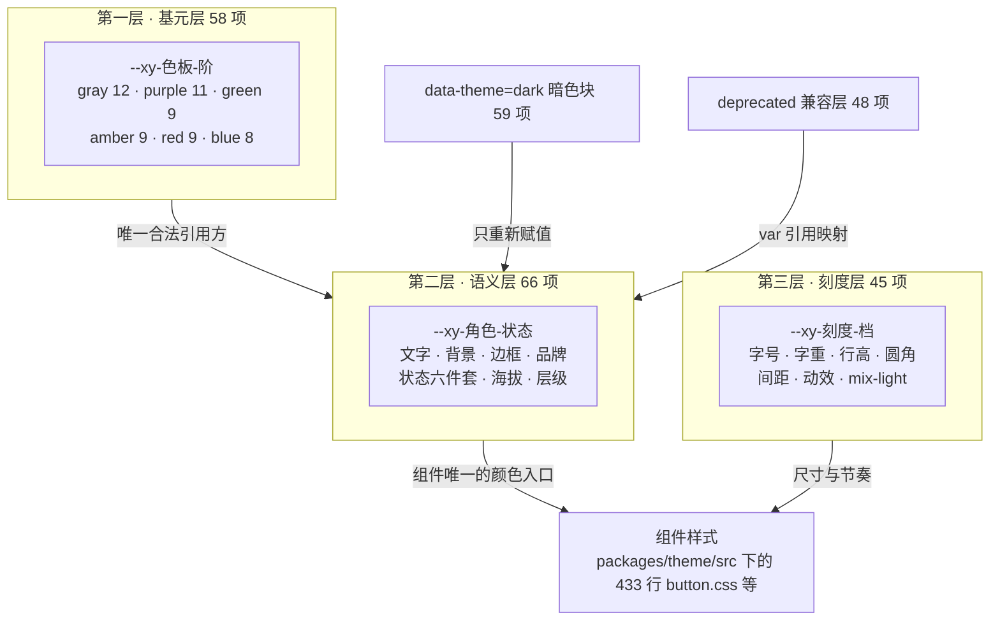
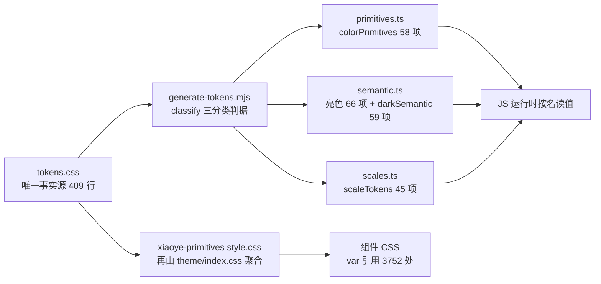

# 3-01 · 令牌三层架构总览

> 本篇是「令牌体系」章节的开篇。核心问题只有一个：**基元层、语义层、刻度层各自管什么，为什么不能合并成一层？** 我们不谈抽象的设计系统理论，直接把那份 409 行的 `tokens.css` 逐段拆开读完，再用生成脚本和组件样式做交叉验证——所有结论都有行号可查。

---

## 一、从一个按钮开始：皮肤是谁给的

打开 `packages/theme/src/components/button.css`，第一眼看上去有点奇怪：这个文件有 433 行，定义了 default、primary、success、warning、danger 五种语义变体，plain、text、link 三种形态，sm、md、lg 三种尺寸，外加圆角、块级、图标按钮、按钮组——但**从头到尾找不到一个硬编码的颜色值**。没有 `#533afd`，没有 `#15be53`，连 `white` 和 `black` 都没有。

更奇怪的是运行时的表现：给 `<html>` 挂上 `data-theme="dark"`，整个组件库——包括这个按钮——瞬间换上另一套皮肤：紫色主按钮从 `#533afd` 变成 `#665efd`，白色卡片变成靛黑 `#161839`，边框从实色变成白色半透明。组件的 CSS 一行都没变。

组件样式里一个色值都没有，却能同时渲染出亮暗两套主题——这个问题只有一个解释：**它引用的每一个变量名背后，都存在两份按主题切换的值**。而供给这些值的源头，就是 `packages/xiaoye-primitives/src/theme/tokens.css`。

但"有一个变量文件"不足以解释全部现象。真正的问题在命名上：按钮引用的是 `--xy-brand`、`--xy-text-primary`、`--xy-radius-md`、`--xy-font-weight-560`，而 tokens.css 里同时还躺着 `--xy-purple-600`、`--xy-gray-200` 这类名字。为什么组件从不引用后者？为什么暗色主题的覆写块里只出现了前一种名字？为什么字号字重间距圆角这些"非颜色"的东西和颜色住在同一份文件里，却从来不参与主题切换？

这三个问题的答案，就是本篇的主角：**三层架构**。基元、语义、刻度——三层各管一件事，彼此的边界不是风格偏好，而是被主题切换协议、生成脚本的正则、组件样式的消费纪律三方共同强制执行的。下面我们按文件顺序精读。

## 二、文件地图：一份 CSS 里的三个国家

`tokens.css` 全文 409 行（`wc -l` 口径），物理上分成三大块：

1. **亮色块**（L14-255）：`:root, [data-theme="light"]` 共同选择器，按基元层、语义层、刻度层三个注释分节，装着全部 169 个令牌的亮色值；
2. **暗色覆写块**（L262-347）：`[data-theme="dark"]`，只有 59 项，全部是语义层名字的重新赋值；
3. **@deprecated 兼容层**（L349-409）：48 个旧命名别名，映射到新语义层。

文件头有一段 12 行的宣言注释，把这套架构的契约写在了第一屏。值得逐字读：

```css
/**
 * Xy Design Tokens — 系统化设计令牌（Stripe 设计语言）
 *
 * 蓝本：design.hagicode.com 收录的 Stripe DESIGN.md（含官方亮/暗双目录）。
 * 三层架构，命名规则唯一：
 *   1. 基元层  --xy-{色板}-{阶}        灰 / 紫 / 绿 / 琥珀 / 红 / 蓝 六族色板，主题间共享
 *   2. 语义层  --xy-{角色}[-{状态}]    文字、背景、边框、品牌、状态、海拔、层级、遮罩
 *   3. 刻度层  --xy-{刻度}-{档}        字号、字重、行高、间距、圆角、动效时长
 *
 * 主题切换协议：[data-theme="dark"] 只覆写语义层的值；基元层与刻度层全局共享。
 * 文件末尾保留一层 @deprecated 旧命名兼容别名，供存量使用方平滑过渡，新代码禁止引用。
 */
```

注意两个措辞。一是"命名规则唯一"——每一层各有一个命名模板，三层之间靠名字的前缀形态就能区分，不需要任何额外标注。二是"只覆写语义层的值"——这不是描述现状，而是协议；后文我们会看到，生成脚本和组件样式都在各自的位置上强制了这个协议。

先量化一下三层各有多少个令牌（下表所有数字均在当前工作区用正则逐块统计核实）：

| 层 | 命名模板 | 亮色块数量 | 是否参与暗色覆写 | 职责一句话 |
|---|---|---|---|---|
| 基元层 | `--xy-{色板}-{阶}` | 58 | 否 | 回答"系统里有哪些颜色" |
| 语义层 | `--xy-{角色}[-{状态}]` | 66 | 是（59 项覆写） | 回答"这个位置该用什么" |
| 刻度层 | `--xy-{刻度}-{档}` | 45 | 否 | 回答"尺寸与节奏取多少" |
| 兼容层 | 旧命名（别名） | 48 | 随语义层自动切换 | 存量命名平滑迁移 |

三层加兼容层，tokens.css 里出现过的**唯一命名共 217 个**（58 + 66 + 45 + 48；暗色块复用语义层的名字，不新增命名）。整个 structure 如下图：



记住这张图的方向：**箭头只允许从左往右、从上往下**。基元层是所有颜色的出处，但它自己不被组件引用；语义层是组件唯一的颜色入口；刻度层绕过颜色体系直达组件；暗色块和兼容层都是"寄生"在语义层名字上的。任何一条反方向的箭头——比如组件直接引用 `--xy-purple-600`——都是架构违规。为什么这么设计，读到第十节总账时你会看到完整的论证。

## 三、基元层：色板的国家储备库（58 项）

亮色块从 L16 的分节注释开始，先铺开六族色板。这是全文最"密集"的一段，我们分两段读完，先看灰与紫：

```css
:root,
[data-theme="light"] {
  /* ==================================================================
   * 1. 基元层 — 色板
   * ================================================================== */

  /* 中性灰：全族冷调带海军蓝底色，锚点取自 Stripe 官方值
     (边框 #e5edf5 / 正文 #64748d / 标签 #273951 / 深海军 #0d253d / 标题 #061b31) */
  --xy-gray-25: #fbfdfe;
  --xy-gray-50: #f6f9fc;
  --xy-gray-100: #eef4f9;
  --xy-gray-200: #e5edf5;
  --xy-gray-300: #d4dee9;
  --xy-gray-400: #a3b1c2;
  --xy-gray-500: #64748d;
  --xy-gray-600: #45586e;
  --xy-gray-700: #273951;
  --xy-gray-800: #1d3248;
  --xy-gray-900: #0d253d;
  --xy-gray-950: #061b31;

  /* 品牌紫：Stripe purple scale */
  --xy-purple-50: #f5f3ff;
  --xy-purple-100: #ece8ff;
  --xy-purple-200: #d6d9fc; /* 官方 border-soft */
  --xy-purple-300: #b9b9f9; /* 官方 purple-light */
  --xy-purple-400: #918cff;
  --xy-purple-500: #665efd; /* 官方 purple-mid，暗色主色 */
  --xy-purple-600: #533afd; /* 官方 stripe purple */
  --xy-purple-700: #4434d4; /* 官方 hover */
  --xy-purple-800: #362baa; /* 官方 dashed-border */
  --xy-purple-900: #2e2b8c; /* 官方 purple-deep */
  --xy-purple-950: #1c1e54; /* 官方 brand-dark */
```

再看四个功能色族（L48-89）：

```css
  /* 成功绿：Stripe green（#15be53 实色 / #108c3d 文字） */
  --xy-green-50: #ecfaf1;
  --xy-green-100: #d3f5e0;
  --xy-green-200: #a9e9c3;
  --xy-green-300: #74da9f;
  --xy-green-400: #3fca77;
  --xy-green-500: #15be53;
  --xy-green-600: #108c3d;
  --xy-green-700: #0c6b2f;
  --xy-green-800: #094f23;

  /* 警告琥珀：Stripe lemon（#9b6829 官方 lemon-500 / #d4a04a 官方暗色值） */
  --xy-amber-50: #fdf6e9;
  --xy-amber-100: #f9e9c9;
  --xy-amber-200: #f2d49d;
  --xy-amber-300: #e8bb6c;
  --xy-amber-400: #d4a04a;
  --xy-amber-500: #b8862f;
  --xy-amber-600: #9b6829;
  --xy-amber-700: #7a5320;
  --xy-amber-800: #5b3e18;

  /* 危险红：Stripe ruby（#ea2261，官方语义为图标与警示） */
  --xy-red-50: #fdecf2;
  --xy-red-100: #fbd3e0;
  --xy-red-200: #f6a7c5;
  --xy-red-300: #f176a4;
  --xy-red-400: #f24b83;
  --xy-red-500: #ea2261;
  --xy-red-600: #c81a50;
  --xy-red-700: #a31340;
  --xy-red-800: #7d0e31;

  /* 信息蓝：源自官方 Transparent Info 按钮（文字 #2874ad / 基色 #2b91df / 暗色文字 #5ba8d9） */
  --xy-blue-100: #e3f1fb;
  --xy-blue-200: #c2e2f7;
  --xy-blue-300: #94cbf0;
  --xy-blue-400: #5ba8d9;
  --xy-blue-500: #2b91df;
  --xy-blue-600: #2874ad;
  --xy-blue-700: #1f5a88;
  --xy-blue-800: #164266;
```

### 3.1 六族不是均分的

数一下：灰 12 档、紫 11 档、绿/琥珀/红各 9 档、蓝 8 档，合计 58。档位分布明显不是"每族一刀切十档"的模板化产物：

- **灰族多出 `25` 档**（`#fbfdfe`）——比 50 还浅的"最浅染色面板"专用档。浅色面板是 Stripe 风格页面的底味，50 号灰往往还不够浅，这一档是给 `--xy-bg-subtle` 这类语义令牌备的料。
- **紫族拉满 11 档到 950**——品牌色的舞台最大，从 soft 背景到 deep 按压态全覆盖。
- **蓝族干脆没有 50 档**，从 100 起步——注释写明了来路：这一族源自官方 Transparent Info 按钮的三个锚点（文字 `#2874ad`、基色 `#2b91df`、暗色文字 `#5ba8d9`），锚点插值后只需要 8 档，没必要凑整。

### 3.2 阶数是序数，不是数值

第二个要点：`--xy-gray-500` 里的 `500` **不承诺任何物理量**。它不是"亮度 500"，而是"这一族里从浅到深排序后的一个序号"。证据就在注释里——每族的锚点直接取自 Stripe 官方目录的散点值（比如紫族的 `#533afd` 标注"官方 stripe purple"），族内其余档位是围绕锚点的插值，两族之间同号档位完全没有换算关系：`green-500` 是 `#15be53`，`amber-500` 是 `#b8862f`，一个饱和一个发闷，"500"只保证族内序。

这个约定换来了一个关键自由度：**换品牌时只需要重铺色板，不需要改任何语义层的名字**。今天紫族锚着 Stripe，明天换成别的品牌色，重新插值 11 档填进 `--xy-purple-*`，`--xy-brand` 的定义（下一节）一个字都不用动。

### 3.3 基元层的职责边界

所以基元层管什么？**它只回答"我有哪些颜色"，坚决不回答"用在哪"。** 文件里没有任何一条注释告诉你 gray-200 是"边框色"——尽管它事实上就是（下一节 `--xy-border` 的值正是它）。"边框"是一个使用决策，使用决策不属于色板。

这个克制在后面会反复兑现：主题切换不用管它、生成脚本用一条极简的正则就能识别它、组件样式被禁止引用它。储备库只管储备，调配是语义层的事。

## 四、语义层：组件的唯一颜色入口（66 项）

L91 起进入语义层。这一层 66 个令牌，是三层里最复杂的一层，我们分三段精读。第一段是文字、背景、边框、填充（L91-118）：

```css
  /* ==================================================================
   * 2. 语义层 — 文字（五级亮度 + 反色 + 实色反衬）
   * ================================================================== */
  --xy-text-heading: var(--xy-gray-950); /* 标题 */
  --xy-text-primary: var(--xy-gray-950); /* 默认正文 / 控件值 */
  --xy-text-secondary: var(--xy-gray-700); /* 表单标签、次级强调 */
  --xy-text-muted: var(--xy-gray-500); /* 描述、说明、占位 */
  --xy-text-faint: var(--xy-gray-400); /* 最弱元数据 */
  --xy-text-disabled: var(--xy-gray-300); /* 禁用态 */
  --xy-text-on-fill: #ffffff; /* 实色块上的文字（双主题恒白） */

  /* ---- 背景：亮度阶梯 page < subtle < muted < sunken < container ---- */
  --xy-bg-page: #f3f7fb; /* 页面画布 */
  --xy-bg-subtle: var(--xy-gray-25); /* 最浅染色面板 */
  --xy-bg-muted: var(--xy-gray-50); /* 次级面板 */
  --xy-bg-sunken: var(--xy-gray-100); /* 凹陷区：表头、代码块、井 */
  --xy-bg-container: #ffffff; /* 卡片、输入框、面板 */
  --xy-bg-raised: #ffffff; /* 抬升层（亮色靠阴影区分） */
  --xy-bg-elevated: #ffffff; /* 弹窗、抽屉 */
  --xy-bg-floating: #ffffff; /* 浮层 popper */

  /* ---- 边框 ---- */
  --xy-border: var(--xy-gray-200);
  --xy-border-strong: var(--xy-gray-300);
  --xy-border-subtle: var(--xy-gray-100);

  /* ---- 填充 ---- */
  --xy-fill-light: var(--xy-gray-50); /* 控件浅填充 */
```

第二段是品牌色、四族状态色、焦点遮罩、海拔、层级（L120-184）：

```css
  /* ---- 品牌色 ---- */
  --xy-brand: var(--xy-purple-600);
  --xy-brand-hover: var(--xy-purple-700);
  --xy-brand-active: var(--xy-purple-900);
  --xy-brand-soft: rgba(83, 58, 253, 0.07);
  --xy-brand-soft-hover: rgba(83, 58, 253, 0.12);
  --xy-brand-border: var(--xy-purple-300);
  --xy-brand-contrast: #ffffff;

  /* ---- 状态色：{base, hover, active, soft, soft-hover, text} 六件套 ---- */
  --xy-success: var(--xy-green-500);
  --xy-success-hover: var(--xy-green-600);
  --xy-success-active: var(--xy-green-700);
  --xy-success-soft: rgba(21, 190, 83, 0.12);
  --xy-success-soft-hover: rgba(21, 190, 83, 0.2);
  --xy-success-text: var(--xy-green-600);

  --xy-warning: var(--xy-amber-500);
  --xy-warning-hover: var(--xy-amber-600);
  --xy-warning-active: var(--xy-amber-700);
  --xy-warning-soft: rgba(155, 104, 41, 0.12);
  --xy-warning-soft-hover: rgba(155, 104, 41, 0.2);
  --xy-warning-text: var(--xy-amber-700);

  --xy-danger: var(--xy-red-500);
  --xy-danger-hover: var(--xy-red-600);
  --xy-danger-active: var(--xy-red-700);
  --xy-danger-soft: rgba(234, 34, 97, 0.12);
  --xy-danger-soft-hover: rgba(234, 34, 97, 0.2);
  --xy-danger-text: var(--xy-red-600);

  --xy-info: var(--xy-blue-500);
  --xy-info-hover: var(--xy-blue-600);
  --xy-info-active: var(--xy-blue-700);
  --xy-info-soft: rgba(43, 145, 223, 0.12);
  --xy-info-soft-hover: rgba(43, 145, 223, 0.2);
  --xy-info-text: var(--xy-blue-600);

  /* ---- 焦点与遮罩 ---- */
  --xy-focus-ring-color: rgba(83, 58, 253, 0.14);
  --xy-focus-border: var(--xy-brand);
  --xy-overlay-color: rgba(6, 27, 49, 0.5);

  /* ---- 海拔：Stripe 五级，0 最弱、4 最强 ----
     L0 发丝级 · L1 氛围（卡片静置）· L2 标准（面板/悬浮）
     L3 蓝调双层（下拉、弹出）· L4 深层（模态） */
  --xy-shadow-0: 0 1px 2px rgba(6, 27, 49, 0.06);
  --xy-shadow-1: 0 3px 6px rgba(23, 23, 23, 0.06);
  --xy-shadow-2: 0 15px 35px rgba(23, 23, 23, 0.08);
  --xy-shadow-3:
    0 30px 45px -30px rgba(50, 50, 93, 0.25),
    0 18px 36px -18px rgba(0, 0, 0, 0.1);
  --xy-shadow-4:
    0 14px 21px -14px rgba(3, 3, 39, 0.25),
    0 8px 17px -8px rgba(0, 0, 0, 0.1);

  /* ---- 层级：单调递增，运行时浮层从 2000 起配 ---- */
  --xy-z-normal: 1;
  --xy-z-raised: 10;
  --xy-z-sticky: 100;
  --xy-z-dropdown: 1000;
  --xy-z-modal: 1100;
  --xy-z-toast: 1200;
  --xy-z-tooltip: 1300;
  --xy-z-max: 1400;
```

### 4.1 语义层的本质：把"取档决策"从组件手里收走

对比基元层，语义层最显著的特征是：**每一项的值几乎都是一次"从色板上选哪一档"的决策**，而且这个决策只做一次。`--xy-text-muted` 选了 `gray-500`，从此全库所有"描述文字"都长一个样；某个新组件要画占位文字时，它不需要知道也不应该知道"占位该用几号灰"，它只需要说"我是 muted 文字"。

这就是语义层存在的第一重意义：**把决策集中化**。58 项基元色板理论上能组合出上万个"某档灰配某档紫"，如果让 70 多个组件各自去做这个选择，你会得到 70 多种微妙的"差不多灰"。语义层把选择权收归中央，组件侧只剩下一张 66 个词的受控词表。

### 4.2 两个值得停下来看的细节

**细节一：亮色下 raised、elevated、floating 三个背景都是 `#ffffff`。** 三条声明一字不差的同值，注释给了答案——"亮色靠阴影区分"。同一个白色表面，配 `--xy-shadow-1` 是卡片，配 `--xy-shadow-2` 是悬浮面板，配 `--xy-shadow-3` 是弹窗。到了暗色块（第六节）这三个名字会分道扬镳，各自提亮到不同的靛黑色阶。这个"亮色同值、暗色分值"的安排是语义层价值的绝佳注脚：组件说"我是浮层"（`--xy-bg-floating`），至于这个身份在亮色下靠阴影表达、暗色下靠底色表达，是主题层的事。**组件表达角色，主题决定画法。**

**细节二：状态色的六件套里，`soft` 不取色阶，用 alpha。** `--xy-success-soft` 是 `rgba(21, 190, 83, 0.12)`——green-500 的原色加 12% 透明度，而不是某个"浅绿阶"。这不是偷懒：色阶是"掺白的绿"，alpha 是"透底的绿"。掺白的浅绿盖在白色卡片上没问题，盖在灰色井、彩色标签上就会显脏；alpha 版本天然适应当前底色。同时注意 `text` 档与 `base` 档不重合：`--xy-danger-text` 用的是 red-600 比 base 的 red-500 深一档——文字版本的对比度要求和图形版本不同，这是又一个"决策进语义层"的例子。

### 4.3 海拔与层级：为什么它们住在语义层而不是刻度层

初看最反直觉的归档在这里：阴影（`--xy-shadow-0..4`）和 z-index（`--xy-z-*`）明明"不是颜色"，却和文字背景住在语义层，而不是和字号间距住在刻度层。判断依据是什么？

看暗色块就知道了一半：**阴影是要随主题翻值的**（暗色下五级阴影全部转成黑色主导，L334-342），凡是进暗色覆写名单的必然是语义层成员。再看注释就知道另一半：层级注释写着"运行时浮层从 2000 起配"——这 8 个 z 令牌虽然在 CSS 里双主题同值，但它们表达的是"浮层谁压住谁"的界面角色契约（sticky 100、dropdown 1000、modal 1100……单调递增的层级秩序），而不是"间距取 8 还是 16"那种与界面角色无关的纯度量。

所以语义层与刻度层的分界线，**不是"是不是颜色"，而是"是不是角色"**。海拔是"这张卡片浮得多高"的角色，层级是"这个元素排在第几层"的角色——都是角色，都归语义层。第八节会看到生成脚本用前缀白名单把这条分界线写成了代码。

### 4.4 层级的双轨协议：CSS 封顶 1400，运行时从 2000 起配

`--xy-z-max: 1400` 这个封顶值配着"运行时浮层从 2000 起配"的注释，指向一个跨语言协议。CSS 侧的静态层级（粘性表头、下拉、气泡）封顶 1400；而对话框、抽屉这类由 JS 管理的 overlay 栈，起点在 TypeScript 侧：`packages/xiaoye-primitives/src/composables/use-z-index.ts` 的 `useZIndex()` 以 `computed(() => 2000)` 为基值、由 `next()` 在其上递增；`shared-context.ts` 里的 `DEFAULT_Z_INDEX = 2000`（L27）与 `use-overlay-stack.ts` 的计数器 `zIndexCounter`（L17）同样从 2000 起步。两个世界以 1400/2000 之间 600 的空隙为缓冲带，互不侵入。令牌文件用一条注释把这个跨 CSS/TS 的契约钉在了源头。

## 五、刻度层：与主题无关的度量衡（45 项）

L186 起是刻度层。先读前半段——字体族、字号、字重、行高、圆角（L186-234）：

```css
  /* ==================================================================
   * 3. 刻度层
   * ================================================================== */

  /* 字体族 */
  --xy-font-family-base:
    -apple-system, BlinkMacSystemFont, "Segoe UI", "SF Pro Text",
    "Helvetica Neue", "PingFang SC", "Hiragino Sans GB", "Microsoft YaHei",
    "Source Han Sans SC", Arial, sans-serif;
  --xy-font-family-code:
    "SF Mono", "Source Code Pro", SFMono-Regular, Menlo, Consolas,
    "Liberation Mono", monospace;

  /* 字号：九档无坍缩（Stripe UI 刻度） */
  --xy-font-size-2xs: 11px;
  --xy-font-size-xs: 12px;
  --xy-font-size-sm: 13px;
  --xy-font-size-md: 14px;
  --xy-font-size-lg: 16px;
  --xy-font-size-xl: 20px;
  --xy-font-size-2xl: 26px;
  --xy-font-size-3xl: 32px;
  --xy-font-size-4xl: 48px;

  /* 字重：Stripe 双轨制 —— 展示 300 / 控件 400；数值档直读命名，与主题无关 */
  --xy-font-weight-light: 300;
  --xy-font-weight-regular: 400;
  --xy-font-weight-medium: 500;
  --xy-font-weight-semibold: 600;
  --xy-font-weight-bold: 700;
  --xy-font-weight-460: 460;
  --xy-font-weight-520: 520;
  --xy-font-weight-550: 550;
  --xy-font-weight-560: 560;
  --xy-font-weight-620: 620;
  --xy-font-weight-650: 650;
  --xy-font-weight-680: 680;

  /* 行高 */
  --xy-line-height-tight: 1.2;
  --xy-line-height: 1.5;

  /* 圆角：Stripe 刻度 2 / 3 / 4(标准主力) / 6(大交互) / 8(重点) */
  --xy-radius-xs: 2px;
  --xy-radius-sm: 3px;
  --xy-radius-md: 4px;
  --xy-radius-lg: 6px;
  --xy-radius-xl: 8px;
  --xy-radius-pill: 999px;
```

后半段是间距、动效和这一层最特殊的一员（L236-255）：

```css
  /* 间距：8px 基准网格 */
  --xy-space-1: 4px;
  --xy-space-2: 8px;
  --xy-space-3: 12px;
  --xy-space-4: 16px;
  --xy-space-5: 20px;
  --xy-space-6: 24px;
  --xy-space-7: 32px;

  /* 动效 */
  --xy-transition-duration-fast: 0.15s;
  --xy-transition-duration-normal: 0.25s;
  --xy-transition-duration-slow: 0.4s;
  --xy-transition-timing: cubic-bezier(0.4, 0, 0.2, 1);
  --xy-transition-timing-in: cubic-bezier(0.4, 0, 1, 1);
  --xy-transition-timing-out: cubic-bezier(0, 0, 0.2, 1);

  /* color-mix 提亮基色（暗色下切到暗底实现"减淡"） */
  --xy-mix-light: #ffffff;
}
```

### 5.1 字重 12 档：一套演进过的命名模板

字重是刻度层里最有故事的一段。12 档被劈成两组：5 个**语义档**沿用 CSS 标准命名（light/regular/medium/semibold/bold，对应 300/400/500/600/700），7 个**数值直读档**直接拿数值当名字（460/520/550/560/620/650/680）。

为什么会有这种"双轨"？因为这批中间微调档（460 到 680 之间挤了 7 档）是**组件实测沉淀**出来的，不是设计规范先画好的刻度。可变字体时代，字重是 1 到 1000 的连续轴；组件在真实渲染里反复调试后发现，560 比 500"更压得住"、680 比 700"更透气"——这些精确到个位数的值来自像素级的实测取舍，起不出（也不必起）语义名字。硬给 `--xy-font-weight-560` 起名叫 `--xy-font-weight-emphasized`，反而是把一次实测结论伪装成设计教条。于是命名模板演进成现在的形态：**语义档沿用 CSS 标准命名，中间微调档数值直读**。命名规则唯一，但允许"数值即名字"这一种直白形态。

### 5.2 --xy-mix-light：住在刻度层的"颜色"

刻度层有一个伪装成颜色的成员：`--xy-mix-light: #ffffff`。它是 `color-mix()` 提亮操作的基色参数——组件样式里大量出现 `color-mix(in srgb, var(--xy-brand) 58%, var(--xy-mix-light))` 这种写法，意思是"品牌色 58% 掺 mix-light 42%"。它的值确实是个颜色，但它的角色是**度量操作的参数**：亮色主题下掺白=提亮，暗色主题下它被覆写成 `var(--xy-bg-container)`（L344），掺暗底=减淡。同一个 `color-mix` 公式因此零改动地适配双主题。

等等——它不是出现在暗色覆写块里了吗？那不违反"暗色只覆写语义层"的协议吗？不违反，注意它被归在哪一层：生成脚本把它归入刻度层（第八节验证），而它出现在暗色块里是**对刻度层的一次例外放行**——文件头协议说的"刻度层全局共享"存在这一处已声明的破例，理由就写在注释里："暗色下切到暗底实现减淡"。这是全文件唯一一个参与主题覆写的非语义令牌，恰好用来标出"协议"与"教条"的边界。顺带一提，它在 theme 包里被引用了 109 处，是刻度层里的高频成员。

### 5.3 生成物镜像：scales.ts

刻度层的 45 项在 TS 侧有一个精确镜像。`packages/tokens/src/scales.ts` 全文 50 行（机器生成，头行注明"不要手工编辑"），12 档字重一项不缺：

```ts
// 此文件由 scripts/generate-tokens.mjs 从 tokens.css 自动生成，不要手工编辑。

/** 刻度层令牌（与主题无关） */
export const scaleTokens = {
  "fontFamilyBase": "-apple-system, BlinkMacSystemFont, \"Segoe UI\", \"SF Pro Text\", \"Helvetica Neue\", \"PingFang SC\", \"Hiragino Sans GB\", \"Microsoft YaHei\", \"Source Han Sans SC\", Arial, sans-serif",
  "fontFamilyCode": "\"SF Mono\", \"Source Code Pro\", SFMono-Regular, Menlo, Consolas, \"Liberation Mono\", monospace",
  "fontSize2xs": "11px",
  "fontSizeXs": "12px",
  "fontSizeSm": "13px",
  "fontSizeMd": "14px",
  "fontSizeLg": "16px",
  "fontSizeXl": "20px",
  "fontSize2xl": "26px",
  "fontSize3xl": "32px",
  "fontSize4xl": "48px",
  "fontWeightLight": "300",
  "fontWeightRegular": "400",
  "fontWeightMedium": "500",
  "fontWeightSemibold": "600",
  "fontWeightBold": "700",
  "fontWeight460": "460",
  "fontWeight520": "520",
  "fontWeight550": "550",
  "fontWeight560": "560",
  "fontWeight620": "620",
  "fontWeight650": "650",
  "fontWeight680": "680",
  "lineHeightTight": "1.2",
  "lineHeight": "1.5",
  "radiusXs": "2px",
  "radiusSm": "3px",
  "radiusMd": "4px",
  "radiusLg": "6px",
  "radiusXl": "8px",
  "radiusPill": "999px",
  "space1": "4px",
  "space2": "8px",
  "space3": "12px",
  "space4": "16px",
  "space5": "20px",
  "space6": "24px",
  "space7": "32px",
  "transitionDurationFast": "0.15s",
  "transitionDurationNormal": "0.25s",
  "transitionDurationSlow": "0.4s",
  "transitionTiming": "cubic-bezier(0.4, 0, 0.2, 1)",
  "transitionTimingIn": "cubic-bezier(0.4, 0, 1, 1)",
  "transitionTimingOut": "cubic-bezier(0, 0, 0.2, 1)",
  "mixLight": "#ffffff",
} as const;
```

键名是 `--xy-` 后缀的 camelCase 化（`--xy-font-weight-560` 变 `fontWeight560`），数值直读档在 TS 侧同样直读。同目录的 `primitives.ts`（63 行）镜像 58 项色板，`semantic.ts`（133 行）同时镜像亮色 66 项和暗色 `darkSemanticTokens` 59 项——注意最后一个细节：**亮暗两份语义值在 TS 里是两个导出对象，而基元和刻度只有一份**。TS 侧的数据形状再次复述了主题协议。

## 六、暗色覆写协议：59 项换一张皮

亮色块在 L255 收口，L257-261 是暗色块的导语注释，把暗面锚点的出处交代得一清二楚。暗色块整体在 L262-347，我们分两段读完。前半段（L257-305）：

```css
/* ====================================================================
 * 暗色主题 — 语义层整体覆写（暗面锚点取自 Stripe 官方暗色目录：
 * 页面底 #0e0f2e / 主色提亮 #665efd / 标题 #e8ecf0 / 正文 #8a95a8 /
 * 边框 rgba(255,255,255,0.1) / 成功文字 #4cdf80 / 柠檬 #d4a04a）
 * ==================================================================== */
[data-theme="dark"] {
  /* 文字 */
  --xy-text-heading: #f2f5fa;
  --xy-text-primary: #e8ecf0;
  --xy-text-secondary: #b6c0cf;
  --xy-text-muted: #8a95a8;
  --xy-text-faint: #66718c;
  --xy-text-disabled: rgba(232, 236, 240, 0.3);
  --xy-text-on-fill: #ffffff;

  /* 背景：靛黑亮度阶梯 */
  --xy-bg-page: #0e0f2e;
  --xy-bg-subtle: #131435;
  --xy-bg-muted: #171939;
  --xy-bg-sunken: #0a0b24;
  --xy-bg-container: #161839;
  --xy-bg-raised: #1e2049;
  --xy-bg-elevated: #1e2049;
  --xy-bg-floating: #1a1c40;

  /* 边框：白色透明度阶梯 */
  --xy-border: rgba(255, 255, 255, 0.1);
  --xy-border-strong: rgba(255, 255, 255, 0.18);
  --xy-border-subtle: rgba(255, 255, 255, 0.06);

  /* 填充 */
  --xy-fill-light: rgba(255, 255, 255, 0.06);

  /* 品牌：官方暗色值 */
  --xy-brand: var(--xy-purple-500);
  --xy-brand-hover: #7a73ff;
  --xy-brand-active: var(--xy-purple-600);
  --xy-brand-soft: rgba(102, 94, 253, 0.15);
  --xy-brand-soft-hover: rgba(102, 94, 253, 0.22);
  --xy-brand-border: rgba(185, 185, 249, 0.3);
  --xy-brand-contrast: #ffffff;

  /* 状态：基色取亮阶，soft 用品牌色 alpha（官方暗色模式） */
  --xy-success: #2fd772;
  --xy-success-hover: #4cdf80;
  --xy-success-active: var(--xy-green-500);
  --xy-success-soft: rgba(21, 190, 83, 0.16);
  --xy-success-soft-hover: rgba(21, 190, 83, 0.24);
  --xy-success-text: #4cdf80;
```

后半段（L307-347）：

```css
  --xy-warning: var(--xy-amber-400);
  --xy-warning-hover: #e0b264;
  --xy-warning-active: var(--xy-amber-500);
  --xy-warning-soft: rgba(212, 160, 74, 0.16);
  --xy-warning-soft-hover: rgba(212, 160, 74, 0.24);
  --xy-warning-text: #e8bc72;

  --xy-danger: var(--xy-red-400);
  --xy-danger-hover: #f6769f;
  --xy-danger-active: var(--xy-red-500);
  --xy-danger-soft: rgba(234, 34, 97, 0.16);
  --xy-danger-soft-hover: rgba(234, 34, 97, 0.24);
  --xy-danger-text: #f78bb0;

  --xy-info: var(--xy-blue-400);
  --xy-info-hover: #7fbde5;
  --xy-info-active: var(--xy-blue-500);
  --xy-info-soft: rgba(91, 168, 217, 0.16);
  --xy-info-soft-hover: rgba(91, 168, 217, 0.24);
  --xy-info-text: #8cc4ea;

  /* 焦点与遮罩 */
  --xy-focus-ring-color: rgba(102, 94, 253, 0.4);
  --xy-focus-border: var(--xy-brand);
  --xy-overlay-color: rgba(2, 3, 15, 0.65);

  /* 海拔：暗色下阴影转黑色主导（官方暗色 shadow 值） */
  --xy-shadow-0: 0 1px 2px rgba(0, 0, 0, 0.4);
  --xy-shadow-1: 0 3px 6px rgba(0, 0, 0, 0.3);
  --xy-shadow-2: 0 15px 35px rgba(0, 0, 0, 0.35);
  --xy-shadow-3:
    0 30px 45px -30px rgba(0, 0, 0, 0.5),
    0 18px 36px -18px rgba(0, 0, 0, 0.4);
  --xy-shadow-4:
    0 14px 21px -14px rgba(0, 0, 0, 0.55),
    0 8px 17px -8px rgba(0, 0, 0, 0.45);

  --xy-mix-light: var(--xy-bg-container);

  /* 圆角、间距、字号、行高、字重、z-index —— 与主题无关，继承 :root */
}
```

### 6.1 数字验协议

逐项清点暗色块：文字 7、背景 8、边框 3、填充 1、品牌 7、success 6、warning 6、danger 6、info 6、焦点遮罩 3、海拔 5、mix-light 1——**合计 59 项**。其中 58 项是语义层命名（语义层 66 项中 58 项需要覆写，其余 8 项是 z 层级——与主题无关），外加 1 项已声明的刻度层例外（mix-light）。**基元层的 58 项、刻度层的其余 44 项，在暗色块里零出现。** "只覆写语义层"不是文档口号，是这份文件里可以数出来的事实。

L346 那条注释是这个协议最直白的自述："圆角、间距、字号、行高、字重、z-index——与主题无关，继承 :root"。暗色块选择器只写了 `[data-theme="dark"]`，没有重复 `:root`，所以基元层和刻度层天然穿透暗色主题继续生效——CSS 级联替它们完成了"全局共享"。

### 6.2 基元层是暗色的调色盘，而不是暗色的覆写对象

最容易被误读的一点在这里：暗色块里出现了大量 `var(--xy-purple-500)`、`var(--xy-green-500)` 这样的基元引用——**暗色主题不但没有覆写基元层，反而把基元层当调色盘在用**。

看品牌色这条线：亮色下 `--xy-brand: var(--xy-purple-600)`（L121），暗色下 `--xy-brand: var(--xy-purple-500)`（L291）。同一个名字，暗色把取档决策从 600 号挪到 500 号——Stripe 官方暗色主色就是亮了一档的 `#665efd`。danger 家族同理：亮色取 red-500/600/700，暗色整体上移到 red-400/500/500。**"暗色要把主色提亮"这个设计知识，被表达为语义层对色板不同档位的重新指认，而不是对色板本身的涂改。**

设想相反的做法——暗色块直接覆写基元层（比如 `[data-theme="dark"] { --xy-purple-600: #665efd }`）——会发生什么？`--xy-purple-600` 这个名字在亮色语境里的含义（品牌主色）和暗色语境里的含义（不再是主色，主色换成了 500）发生分裂，同一个名字两副面孔；任何在暗色下引用 red-600 期望"深红"的地方会被悄悄改值。色板作为"全局客观事实"的地位就崩了。**覆写语义层的名字是安全的，因为语义名字的定义就是"随主题翻转的角色"；覆写基元的名字是危险的，因为基元名字的契约是"主题间共享的客观色"。** 这就是协议背后的自洽性。

### 6.3 对照：Element Plus 的做法差在哪

把视线移到社区最熟悉的 Element Plus，能更清楚地看到这套协议买到了什么。Element Plus 的默认主题（theme-chalk）公开的 CSS 变量是 `--el-color-primary` 加一组**构建期由 Sass `mix()` 派生的梯度档**：`--el-color-primary-light-3`、`light-5`、`light-7`、`light-8`、`light-9`、`dark-2`。也就是说，"角色"和"梯度档"合并在同一个公开命名里——组件样式直接引用 `--el-color-primary-light-8` 这样的名字，梯度上取哪一档的决策散落在各个组件里。暗色主题（`html.dark`）则要把这批派生档**整批重新赋值一遍**（light 系列从掺白改为掺黑），覆写面是"角色数 × 梯度档数"的乘积。

两相对照，本库把"梯度"整个关进基元层（58 项，组件不可见），把"梯度上取哪一档"的决策收进语义层（每角色一次），暗色覆写面从"乘积"压缩成"59 项"。这不是审美偏好，是可维护性的量级差异：给 EP 加一个需要新梯度档的组件，可能要动构建脚本和全局变量表；给本库加组件，只需要在 66 个语义名字里挑。

## 七、@deprecated 兼容层：48 个别名的存在意义

L349-409 是文件最后一层。先读前半段（L349-378）：

```css
/* ====================================================================
 * @deprecated 旧命名兼容层
 * 供存量使用方（自定义主题、文档示例）平滑迁移，映射到新语义层。
 * 计划在下个 major 版本移除；新代码一律使用上方规范命名。
 * ==================================================================== */
:root,
[data-theme="light"] {
  /* 品牌 / 状态 */
  --xy-color-primary: var(--xy-brand);
  --xy-color-primary-hover: var(--xy-brand-hover);
  --xy-color-primary-active: var(--xy-brand-active);
  --xy-color-primary-soft: var(--xy-brand-soft);
  --xy-color-primary-soft-hover: var(--xy-brand-soft-hover);
  --xy-color-info: var(--xy-info);
  --xy-color-info-hover: var(--xy-info-hover);
  --xy-color-success: var(--xy-success);
  --xy-color-success-hover: var(--xy-success-hover);
  --xy-color-success-active: var(--xy-success-active);
  --xy-color-success-soft: var(--xy-success-soft);
  --xy-color-success-soft-hover: var(--xy-success-soft-hover);
  --xy-color-warning: var(--xy-warning);
  --xy-color-warning-hover: var(--xy-warning-hover);
  --xy-color-warning-active: var(--xy-warning-active);
  --xy-color-warning-soft: var(--xy-warning-soft);
  --xy-color-warning-soft-hover: var(--xy-warning-soft-hover);
  --xy-color-danger: var(--xy-danger);
  --xy-color-danger-hover: var(--xy-danger-hover);
  --xy-color-danger-active: var(--xy-danger-active);
  --xy-color-danger-soft: var(--xy-danger-soft);
  --xy-color-danger-soft-hover: var(--xy-danger-soft-hover);
```

后半段（L380-409）：

```css
  /* 文字 / 边框 / 背景 / 表面 */
  --xy-text-color: var(--xy-text-primary);
  --xy-text-color-heading: var(--xy-text-heading);
  --xy-text-color-secondary: var(--xy-text-secondary);
  --xy-text-color-subtle: var(--xy-text-muted);
  --xy-text-color-muted: var(--xy-text-muted);
  --xy-text-color-muted-2: var(--xy-text-faint);
  --xy-border-color: var(--xy-border);
  --xy-border-color-strong: var(--xy-border-strong);
  --xy-border-color-subtle: var(--xy-border-subtle);
  --xy-color-on-fill: var(--xy-text-on-fill);
  --xy-fill-color-light: var(--xy-fill-light);
  --xy-bg-color: var(--xy-bg-container);
  --xy-bg-color-page: var(--xy-bg-page);
  --xy-bg-color-muted: var(--xy-bg-muted);
  --xy-bg-color-subtle: var(--xy-bg-subtle);
  --xy-bg-color-elevated: var(--xy-bg-elevated);
  --xy-bg-color-floating: var(--xy-bg-floating);
  --xy-surface-raised: var(--xy-bg-raised);
  --xy-surface-sunken: var(--xy-bg-sunken);

  /* 海拔别名（旧七档 → 新五级） */
  --xy-shadow-xs: var(--xy-shadow-0);
  --xy-shadow-sm: var(--xy-shadow-1);
  --xy-shadow-md: var(--xy-shadow-2);
  --xy-shadow-lg: var(--xy-shadow-3);
  --xy-shadow-card: var(--xy-shadow-1);
  --xy-shadow-popup: var(--xy-shadow-2);
  --xy-shadow-modal: var(--xy-shadow-3);
}
```

### 7.1 别名是引用，不是复制

48 个旧名字（品牌/状态 22、文字边框背景 19、海拔 7）全部以 `var()` **引用**新语义层，没有一个直接写死色值。这个实现细节价值极高：旧名字的值不是重命名那一刻的快照，而是对新语义层的活引用——语义层在暗色块里翻值，旧名字自动跟着翻。假如当初图省事把 `--xy-color-primary` 写成 `#533afd`，暗色主题下所有还在用旧命名的存量代码就会集体坏掉，兼容层反而成了 bug 制造机。

### 7.2 兼容层是一份隐性的迁移对照表

这张别名表同时是一份语义考古记录，藏着新旧两代命名体系的对照关系：旧 `--xy-text-color-subtle` 与 `--xy-text-color-muted` 在新体系里**合并**成了 `--xy-text-muted`（两条旧名同指一条新名）；旧的 `muted-2` 升格为 `--xy-text-faint`；旧七档阴影（xs/sm/md/lg 加 card/popup/modal 三个场景别名）坍缩进新五级海拔（card 并入 1 级、popup 并入 2 级、modal 并入 3 级）。"旧 subtle 和旧 muted 为什么合并"背后是一整轮语义精简的决策史——兼容层把这个决策以可执行的形式存了档。

### 7.3 权衡：为什么留着这层而不是一刀切

一个还在活跃开发的库，为什么要背着 48 个"新代码禁止引用"的旧名字？因为破坏性变更的成本不由库作者承担，由使用方承担。注释里写明了这层的两个存在理由：存量**自定义主题**（业务方按旧命名覆写过变量的样式表）和存量**文档示例**。砍掉这层，`--xy-color-primary: purple` 这种一行覆写会静默失效——CSS 变量赋值不报错，页面直接白屏级退化，这类故障排查成本远高于 48 行别名的心智负担。

所以这层的存在是一次典型的成本核算：**用 48 行已知偿还期的技术债（"计划在下个 major 版本移除"），换取一次不流血的命名体系升级**。同时它被关在笼子里——文件头宣言声明"新代码禁止引用"，theme 包 3752 处 `var(--xy-*)` 引用里没有一处指向旧命名（第九节实证）。债写得清清楚楚，到期就能还。

## 八、单一事实源：从 CSS 到 TS 的生成管道

三层架构能立住，靠的不只是 tokens.css 写得规矩，还有工具链的强制。`packages/tokens` 的 TS 常量层不是手写的，由 `scripts/generate-tokens.mjs` 从 tokens.css 解析生成。这个脚本的核心是 classify 函数——**三分类判据**，就在 L33-43：

```js
function classify(name) {
  if (/^--xy-(gray|purple|green|amber|red|blue)-\d+$/.test(name)) return "primitives";
  if (
    /^--xy-(text-|bg-|border|fill-|brand|success|warning|danger|info|focus-|overlay-|shadow-\d|z-)/.test(
      name
    )
  ) {
    return "semantic";
  }
  return "scales";
}
```

11 行代码，三条判据，恰好把三层的命名模板写成了正则：

1. **基元判据**：`色板名-纯数字` 结尾（`\d+$` 锚定行尾）。`--xy-gray-500` 命中，`--xy-gray-light` 就不会——基元层的"阶必须是数字"从约定升级成了硬校验。
2. **语义判据**：一张 13 个前缀的白名单（text-、bg-、border、fill-、brand、四个状态族、focus-、overlay-、shadow-数字、z-）。注意两个精细处：`border` 故意不带尾连字符，才能同时罩住 `border`、`border-strong`、`border-subtle` 三个名字；`shadow-\d` 只匹配数字档阴影，将来若出现名为 `shadow-color` 的刻度属性不会被误收。
3. **刻度判据**：没有正则——**兜底**。凡是不匹配前两条的都归刻度层。这不是偷懒，而是与语义判据的方向性配合：语义层是封闭词表（受控词表必须封闭），刻度层是开放集合（新增一种刻度不该要求改分类器）。

生成主循环（L55-69）还有一处协议执行：亮色块全部属性按 classify 分拣入三桶；**暗色块只收集 `classify === "semantic"` 的项**，其余一律不进 `darkSemanticTokens`。假如哪天有人往暗色块塞进一条刻度覆写，CSS 级联会让它实际生效，但 TS 镜像会静默缺失——生成物的形状立刻与源文件对不上，`pnpm` 相关校验就能暴露这处协议违规。工具链在这里扮演了"暗色只覆写语义层"的第二道守卫。

整条管道与消费链路如下图：



管道末端值得多说一句：`packages/xiaoye-primitives/style.css` 按 reset → tokens → base 的顺序聚合主题层，`packages/theme/index.css` 的第一行 `@import "@xiaoye/primitives/style.css"` 把令牌带进组件样式包——所以组件 CSS 里那 3752 处 `var(--xy-*)` 引用（当前工作区 theme/src 实测）全都能解析到这份 409 行的源头。**改令牌只改 tokens.css 一处，重跑生成脚本，CSS 侧即时生效、TS 侧重新生成**——单一事实源的"单一"二字，靠的就是这条不可逆的依赖方向。

## 九、消费纪律：433 行 button.css 的零基元实证

架构声明得再漂亮，也要看组件侧是不是真守规矩。我们回到开头那个按钮，读它的三个关键片段。第一段，基础态与尺寸（L1-59）：

```css
.xy-button {
  display: inline-flex;
  align-items: center;
  justify-content: center;
  gap: var(--xy-space-2);
  border: 1px solid transparent;
  border-radius: var(--xy-radius-md);
  background: color-mix(in srgb, var(--xy-bg-floating) 98%, var(--xy-bg-subtle));
  color: var(--xy-text-primary);
  cursor: pointer;
  transition:
    background-color var(--xy-transition-duration-fast) var(--xy-transition-timing),
    border-color var(--xy-transition-duration-fast) var(--xy-transition-timing),
    transform var(--xy-transition-duration-fast) var(--xy-transition-timing),
    box-shadow var(--xy-transition-duration-fast) var(--xy-transition-timing);
  white-space: nowrap;
  position: relative;
  font-weight: var(--xy-font-weight-560);
  user-select: none;
  text-decoration: none;
}

.xy-button:hover:not(:disabled):not(.is-disabled) {
  transform: translateY(-1px);
}

.xy-button:active:not(:disabled):not(.is-disabled) {
  transform: translateY(0);
}

.xy-button:focus-visible {
  outline: 2px solid color-mix(in srgb, var(--xy-brand) 58%, var(--xy-mix-light));
  outline-offset: 2px;
  box-shadow: 0 0 0 1px color-mix(in srgb, var(--xy-brand) 16%, transparent);
}

.xy-button:disabled,
.xy-button.is-disabled {
  cursor: not-allowed;
  opacity: 0.56;
}

.xy-button--sm {
  min-height: 32px;
  padding: 0 12px;
  font-size: var(--xy-font-size-sm);
}

.xy-button--md {
  min-height: 40px;
  padding: 0 16px;
  font-size: var(--xy-font-size-md);
}

.xy-button--lg {
  min-height: 46px;
  padding: 0 20px;
  font-size: var(--xy-font-size-lg);
}
```

短短 59 行，三层令牌全体到齐：间距（`--xy-space-2`）、圆角（`--xy-radius-md`）、字号（`--xy-font-size-sm/md/lg`）、动效时长与曲线（`--xy-transition-duration-fast` + `--xy-transition-timing`）来自刻度层；文字（`--xy-text-primary`）、背景（`--xy-bg-floating`、`--xy-bg-subtle`）、品牌（`--xy-brand`）来自语义层；`--xy-mix-light` 作为提亮基色参与焦点圈配色。而 L18 那个 `font-weight: var(--xy-font-weight-560)`，正是第五节那批"数值直读档"的实战现场——按钮文字的字重是实测调出来的 560，不是教条上的 600。

第二段，default 与 primary 的实色变体（L61-100）：

```css
.xy-button--default {
  border-color: color-mix(in srgb, var(--xy-border-subtle) 84%, var(--xy-border));
}

.xy-button--default:hover:not(:disabled):not(.is-disabled) {
  background: color-mix(in srgb, var(--xy-bg-subtle) 72%, var(--xy-bg-floating));
  border-color: var(--xy-border-strong);
  box-shadow: 0 1px 4px color-mix(in srgb, var(--xy-text-heading) 4%, transparent);
}

.xy-button--default:active:not(:disabled):not(.is-disabled) {
  background: color-mix(in srgb, var(--xy-bg-subtle) 72%, var(--xy-bg-muted));
}

.xy-button--primary,
.xy-button--success,
.xy-button--warning,
.xy-button--danger {
  color: var(--xy-text-on-fill);
}

.xy-button--primary {
  background: var(--xy-brand);
  border-color: var(--xy-brand);
}

.xy-button--primary:hover:not(:disabled):not(.is-disabled):not(.is-plain):not(.is-text):not(
    .is-link
  ) {
  background: var(--xy-brand-hover);
  border-color: var(--xy-brand-hover);
  box-shadow: var(--xy-shadow-0);
}

.xy-button--primary:active:not(:disabled):not(.is-disabled):not(.is-plain):not(.is-text):not(
    .is-link
  ) {
  background: var(--xy-brand-active);
  border-color: var(--xy-brand-active);
}
```

这里是"状态六件套"的教科书式消费：base/hover/active 三个交互态一一对应 `--xy-brand`、`--xy-brand-hover`、`--xy-brand-active`，hover 时还挂上一枚 `--xy-shadow-0` 海拔。按钮作者没有自己算 hover 该深多少，六件套早就替他决定了。同时注意 `color-mix` 的高频出场——连"混合"这种派生操作，原料也全部取自语义层（`--xy-border-subtle` 掺 `--xy-border`、`--xy-bg-subtle` 掺 `--xy-bg-floating`），没有一处从基元层进货。

第三段，plain 形态的 primary（L162-208，节选主干）：

```css
.xy-button.is-plain {
  background: var(--xy-bg-container);
}

.xy-button.is-plain.xy-button--primary {
  color: var(--xy-brand);
  background: var(--xy-brand-soft);
  border-color: color-mix(in srgb, var(--xy-brand) 16%, var(--xy-border-subtle));
}

.xy-button.is-plain.xy-button--primary:hover:not(:disabled):not(.is-disabled) {
  background: var(--xy-brand-soft-hover);
  border-color: color-mix(in srgb, var(--xy-brand) 22%, var(--xy-border));
}

.xy-button.is-plain.xy-button--primary:active:not(:disabled):not(.is-disabled) {
  color: var(--xy-brand-active);
  background: color-mix(in srgb, var(--xy-brand-soft-hover) 72%, var(--xy-mix-light));
  border-color: color-mix(in srgb, var(--xy-brand) 28%, var(--xy-border));
}
```

plain 形态把六件套的另一半也用满了：底色用 `--xy-brand-soft`、hover 用 `--xy-brand-soft-hover`、文字用 `--xy-brand` 系——浅色描边按钮的全套状态，没有一个自由发挥的色值。

对整个文件做一次对账：433 行、**零**基元引用；`var(--xy-*)` 引用的唯一命名全部落在语义层与刻度层的受控词表内。把这个检查放大到全 theme 包：3752 处 `var(--xy-*)` 引用，其中指向 tokens.css 所定义令牌的唯一命名 82 个，无一来自基元层。**"基元层不被组件直引"这条纪律，在当前代码库是零违例的实态，不是愿望。**

## 十、总账：三层为什么不能合并

现在可以正面回答本篇的核心问题了。所谓"合并"，有四种可能的合并法，逐一推演：

**合并法一：三层压成一层——所有名字平铺进一个池子。** 直接后果是取档决策大爆炸。58 项色板 × 任意组件位置，每个组件都得自己回答"边框用几号灰、主色 hover 深多少、soft 背景怎么调"；70 多个组件 × 平均几十处颜色引用，就是几千次独立的重复决策，最终得到几千个"差不多"。同时主题切换失去唯一覆写面：如果组件直接引用基元名字，暗色块就得追着每个组件实际用到的每一档颜色去覆写，覆写项从 59 项膨胀为不可维护的乘积。**语义层的本质是一次压榨：把几千次决策压榨成 66 次集中决策。**

**合并法二：保留颜色两层，把刻度并进语义层。** 表面上省一层命名，实际毁掉的是分类判据。刻度层成员与主题无关（暗色零覆写，mix-light 除外），语义层成员随主题翻转；两者一旦同池，"哪些名字参与暗色覆写"就无法从命名推断，只能靠人脑记忆或另一个清单。第八节的 classify 正则会退化成一张越来越长的例外表——`--xy-mix-light` 那一处已声明的破例之所以可控，恰恰因为它是 45 项刻度里的唯一例外，例外多到两位数时协议就名存实亡了。**分层的意义不在名字多少，在于每层内部规则的同质性。**

**合并法三：保留语义与刻度，砍掉基元层——语义令牌直接写字面值。** 短期看少一层间接，长期看两次塌方。其一，换品牌成本：Stripe 紫换成任何别的品牌色，意味着全库每个语义令牌的字面值重写一遍（66 项颜色值全部重算），而今天只需重铺 58 项色板、语义层零改动。其二，暗色塌方：第六节已经论证，暗色主题的设计知识（主色提亮一档、danger 整体上移、阴影转黑）全靠"语义层重新指认色板档位"来表达——没有色板，这套知识就失去了载体，暗色块只能退化成另一份全量手写的 66 项色值表，亮暗两套真值从此各自漂移。**基元层是语义层的"参数空间"：把"颜色能取哪些值"与"角色取哪个值"解耦，两层才能各自演化。**

**合并法四：砍掉语义层，组件直接用基元（Element Plus 路线的极简版）。** 这正是 6.3 节的对照实验：角色与梯度合并在公开命名里，取档决策散落组件，暗色覆写面变成乘积，可读性上组件代码里 `light-8` 这类名字也无法回答"这是什么位置用的颜色"。语义层用 66 个名字换来的受控词表，是组件代码可读性的下限保障。

四条路都堵死之后，三层结构的必然性就清楚了：**基元层提供客观的颜色空间，语义层提供角色的决策层，刻度层提供主题无关的度量衡——三者分别对应"事实、决策、度量"三种变化频率完全不同的东西。** 事实全局共享且极少变，决策随主题翻转，度量与主题彻底无关。变化频率不同的东西必须分层存放，否则每一次变化都会波及不该波及的层——这不是美学，是变更隔离工程。最后用一张表收束三层契约：

| 维度 | 基元层 | 语义层 | 刻度层 |
|---|---|---|---|
| 回答的问题 | 系统里有哪些颜色 | 这个位置该用什么 | 尺寸节奏取多少 |
| 命名模板 | `--xy-{色板}-{数字阶}` | `--xy-{角色}[-{状态}]` | `--xy-{刻度}-{档}` |
| 数量 | 58 | 66 | 45 |
| 暗色覆写 | 0 项 | 58 项（+mix-light 例外） | 0 项（+同上例外） |
| 组件可否直引 | 禁止 | 唯一颜色入口 | 直引 |
| 被誰引用 | 仅语义层（与暗色块） | 组件样式、兼容层 | 组件样式 |
| classify 判据 | 色板-数字正则 | 13 前缀白名单 | 兜底 |

## 十一、数字存档与下一篇

最后把本篇核实过的数字集中存档，方便后续篇章引用：tokens.css 全文 409 行；基元 58（gray 12 / purple 11 / green 9 / amber 9 / red 9 / blue 8）、语义 66、刻度 45（其中字重 12 档，2026-09-16 扩档、随提交 f7f69d2 于 2026-09-23 入库）、暗色覆写 59、@deprecated 48，唯一命名合计 217；theme 包组件样式中 `var(--xy-*)` 引用 3752 处，`--xy-mix-light` 一项就被引用 109 处；生成脚本 classify 判据位于 `scripts/generate-tokens.mjs` L33-43。

下一篇 **3-02《色板与角色：Stripe 锚定的取值体系》**，我们下潜到本篇刻意略过的"值"：六族色板的锚点是如何从 Stripe 官方目录（design.hagicode.com 收录的 DESIGN.md）逐一考据、插值成 58 档的；为什么暗面锚点要单独取值而不是程序化加深；以及 66 个语义角色背后的对比度与层级逻辑。三层架构解决了"结构"问题，下一篇解决"值从哪来"——那才是这套令牌体系真正的品味所在。
