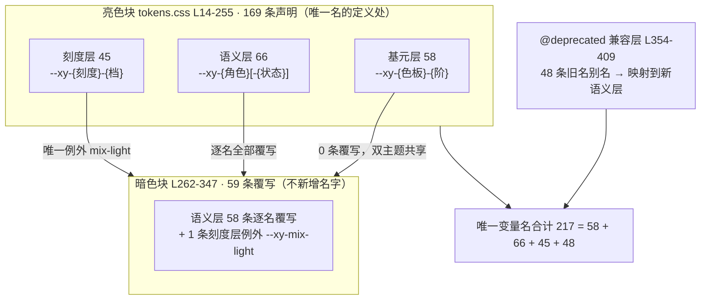
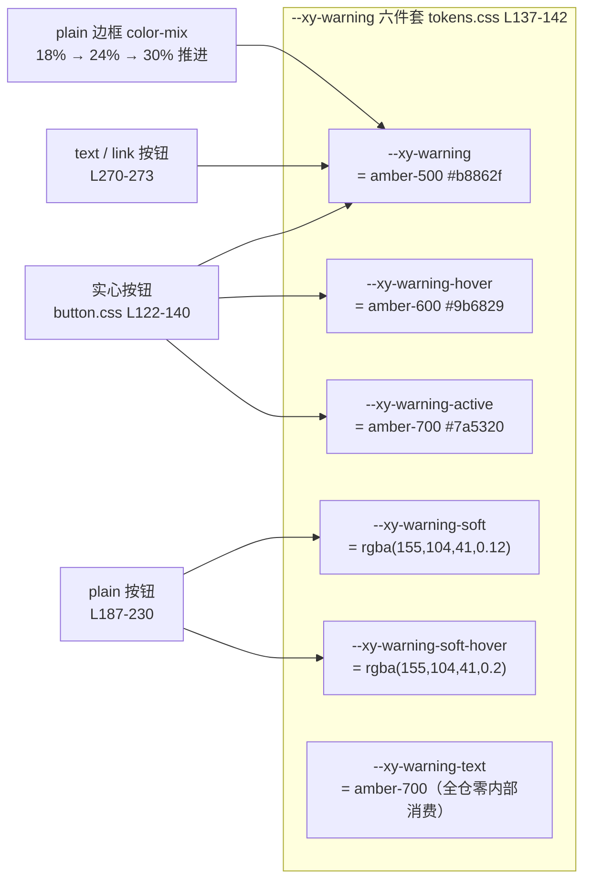
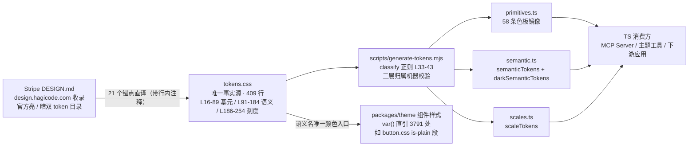

# 3-02 · 色板与角色：Stripe 锚定的取值体系

> 3-01 把 409 行 `tokens.css` 的**结构**读完了：三层架构、暗色覆写协议、生成脚本的分类判据。本篇回答的是下一个问题——**217 个变量如何做到每个值都可追溯？** 我们把这份文件逐段重新打开，这次盯着的不再是"名字怎么分层"，而是"值从哪来、为什么是这个数"。六族色板的每一阶、66 个语义角色的每一次指认、字重档位的一次"转正"、乃至一个 17px 的留守样本——所有结论都带行号，可当场复核。

---

## 一、"可追溯"的账本：217 这个数字是怎么封口的

先给"可追溯"下一个可操作的Definition：**体系里任何一个值，都能在四类出处中找到唯一归属，且每类出处都有书证。**

1. **官方锚点**：值是 Stripe 官方 token 目录（design.hagicode.com 收录的 DESIGN.md，含官方亮/暗双目录）里的原始值，`tokens.css` 里有行内注释背书——全文件共 21 处这样的锚点注释；
2. **锚点间插值**：官方只给了锚点，色阶中间的档位按等感原则插值补齐，归属由"色板-阶位"命名本身记录；
3. **衍生值**：某个已锚定值的 rgba alpha 形态、`color-mix` 派生态、或语义层对色板档位的 `var()` 指认——衍生关系写在声明里；
4. **机器镜像**：`scripts/generate-tokens.mjs` 把整份文件同步成 `packages/tokens` 的三个 TS 常量文件，逐字对应，人改了 CSS 忘了生成会直接在代码评审里露馅。

在这个定义下，"217 个变量"不是一个模糊的规模描述，而是一笔能对账的账。用 `grep` 数一遍 `packages/xiaoye-primitives/src/theme/tokens.css`（全文 409 行）里的唯一变量名，结果是 217；拆开看它的构成：

- **亮色块**（L14-255，`:root, [data-theme="light"]`）定义了全部 **169** 个规范名；
- **@deprecated 兼容层**（L354-409）追加 **48** 个旧命名别名；
- **暗色块**（L262-347）有 59 条声明，但**每一条都是对既有名字的重新赋值，不新增任何名字**。

169 + 48 = 217。而 169 内部又按三层分类：基元层 58（gray 12 / purple 11 / green 9 / amber 9 / red 9 / blue 8）、语义层 66、刻度层 45——58 + 66 + 45 + 48 = 217，账是平的。这个算术本身就是可追溯的第一道保障：**命名空间是封闭的，不存在第 218 个来路不明的名字**。任何新值想进体系，必须先落进某层的命名模板（`--xy-{色板}-{阶}` / `--xy-{角色}[-{状态}]` / `--xy-{刻度}-{档}`），而 `generate-tokens.mjs` L33-43 的 `classify` 正则会替机器复核每一次归属：

```javascript
function classify(name) {
  if (/^--xy-(gray|purple|green|amber|red|blue)-\d+$/.test(name)) return "primitives";
  if (
    /^--xy-(text-|bg-|border|fill-|brand|success|warning|danger|info|focus-|overlay-|shadow-\d|z-)/.test(
      name
    )
  ) {
    return "semantic";
  }
  return "scales";
}
```

这段代码是 `scripts/generate-tokens.mjs` L33-43 的原文。名字落不进前两层正则，就被兜底划进刻度层——三层归属不是文档里的口头约定，是构建管线里的断言。

下面这张图把 217 的组成与暗色覆写面的关系画全，后续所有讨论都在这张地图上进行：



本篇的路线：第二节下潜基元层，数清 21 个官方锚点；第三、四节过语义层的文字、背景与状态六件套；第五节去 `button.css` 看六件套被真实消费的样子；第六节读阴影与 z-index；第七节讲刻度层的"私人档转正"机制；第八节验生成物镜像；第九、十节收掉暗色锚点与兼容层。

## 二、六族色板：21 个官方锚点，37 档插值

基元层占 `tokens.css` L16-89。先看灰、紫两族的原文：

```css
:root,
[data-theme="light"] {
  /* ==================================================================
   * 1. 基元层 — 色板
   * ================================================================== */

  /* 中性灰：全族冷调带海军蓝底色，锚点取自 Stripe 官方值
     (边框 #e5edf5 / 正文 #64748d / 标签 #273951 / 深海军 #0d253d / 标题 #061b31) */
  --xy-gray-25: #fbfdfe;
  --xy-gray-50: #f6f9fc;
  --xy-gray-100: #eef4f9;
  --xy-gray-200: #e5edf5;
  --xy-gray-300: #d4dee9;
  --xy-gray-400: #a3b1c2;
  --xy-gray-500: #64748d;
  --xy-gray-600: #45586e;
  --xy-gray-700: #273951;
  --xy-gray-800: #1d3248;
  --xy-gray-900: #0d253d;
  --xy-gray-950: #061b31;

  /* 品牌紫：Stripe purple scale */
  --xy-purple-50: #f5f3ff;
  --xy-purple-100: #ece8ff;
  --xy-purple-200: #d6d9fc; /* 官方 border-soft */
  --xy-purple-300: #b9b9f9; /* 官方 purple-light */
  --xy-purple-400: #918cff;
  --xy-purple-500: #665efd; /* 官方 purple-mid，暗色主色 */
  --xy-purple-600: #533afd; /* 官方 stripe purple */
  --xy-purple-700: #4434d4; /* 官方 hover */
  --xy-purple-800: #362baa; /* 官方 dashed-border */
  --xy-purple-900: #2e2b8c; /* 官方 purple-deep */
  --xy-purple-950: #1c1e54; /* 官方 brand-dark */
```

（`tokens.css` L14-46）继续绿、琥珀、红、蓝四族：

```css
  /* 成功绿：Stripe green（#15be53 实色 / #108c3d 文字） */
  --xy-green-50: #ecfaf1;
  --xy-green-100: #d3f5e0;
  --xy-green-200: #a9e9c3;
  --xy-green-300: #74da9f;
  --xy-green-400: #3fca77;
  --xy-green-500: #15be53;
  --xy-green-600: #108c3d;
  --xy-green-700: #0c6b2f;
  --xy-green-800: #094f23;

  /* 警告琥珀：Stripe lemon（#9b6829 官方 lemon-500 / #d4a04a 官方暗色值） */
  --xy-amber-50: #fdf6e9;
  --xy-amber-100: #f9e9c9;
  --xy-amber-200: #f2d49d;
  --xy-amber-300: #e8bb6c;
  --xy-amber-400: #d4a04a;
  --xy-amber-500: #b8862f;
  --xy-amber-600: #9b6829;
  --xy-amber-700: #7a5320;
  --xy-amber-800: #5b3e18;

  /* 危险红：Stripe ruby（#ea2261，官方语义为图标与警示） */
  --xy-red-50: #fdecf2;
  --xy-red-100: #fbd3e0;
  --xy-red-200: #f6a7c5;
  --xy-red-300: #f176a4;
  --xy-red-400: #f24b83;
  --xy-red-500: #ea2261;
  --xy-red-600: #c81a50;
  --xy-red-700: #a31340;
  --xy-red-800: #7d0e31;

  /* 信息蓝：源自官方 Transparent Info 按钮（文字 #2874ad / 基色 #2b91df / 暗色文字 #5ba8d9） */
  --xy-blue-100: #e3f1fb;
  --xy-blue-200: #c2e2f7;
  --xy-blue-300: #94cbf0;
  --xy-blue-400: #5ba8d9;
  --xy-blue-500: #2b91df;
  --xy-blue-600: #2874ad;
  --xy-blue-700: #1f5a88;
  --xy-blue-800: #164266;
```

（`tokens.css` L48-89）

把行内注释里的官方锚点逐族数一遍，得到本篇第一张核心表格：

| 色族 | 阶数（范围） | 官方锚点 | 锚点档位与官方角色 |
|---|---|---|---|
| gray | 12（25-950） | 5 | 200 边框 · 500 正文 · 700 标签 · 900 深海军 · 950 标题（L20-21） |
| purple | 11（50-950） | 8 | 200 border-soft · 300 purple-light · 500 purple-mid（暗色主色）· 600 stripe purple · 700 hover · 800 dashed-border · 900 purple-deep · 950 brand-dark（L38-46） |
| green | 9（50-800） | 2 | 500 实色 `#15be53` · 600 文字 `#108c3d`（L48） |
| amber | 9（50-800） | 2 | 400 官方暗色值 `#d4a04a` · 600 官方 lemon-500 `#9b6829`（L59） |
| red | 9（50-800） | 1 | 500 `#ea2261`，官方语义为图标与警示（L70） |
| blue | 8（100-800） | 3 | 400 暗色文字 `#5ba8d9` · 500 基色 `#2b91df` · 600 官方文字 `#2874ad`（L81） |
| **合计** | **58** | **21** | 其余 **37** 档为锚点间插值 |

这张表暴露了这套色板的真实生成方式：**它不是一次调色作业的产物，而是"21 个钉子 + 37 段插值"**。官方 DESIGN.md 只在具体角色上给值——"边框是这个灰、正文是那个灰、hover 是这个紫"——从不给完整的 11 阶刻度。体系要做的是把散落的角色值钉进正确的档位（`#533afd` 是官方主色，就落在 purple-600；`#665efd` 是官方暗面主色，就落在 purple-500），再用插值把档与档之间的路铺平。每个值的出处因此可问可答：带注释的是直译，不带注释的是插值——**注释密度本身就是出处标注**。

**这里埋着本篇第一处设计权衡：锚定 Stripe，还是自创一套色板？** 自创的诱惑是明显的——完全可控、可以按自己的口味微调。但代价有三：其一，商业级色阶的每一步都在对比度上踩过坑（正文灰到底压到多深、禁用态留多少可读性），Stripe 的值等于一份免费的、被巨额流量验证过的可访问性背书；其二，锚点注释让每个值带着"官方原文"的书证，三年后接手的维护者可以顺着注释回到原始目录核对，自创体系的出处只能靠口口相传；其三，也是最容易被忽略的——**锚定外部目录约束了"随手改值"的冲动**。插值可以调，锚点不能动，这条纪律让色板在几十次迭代后仍然不漂移。当然代价也存在：蓝族没有 50 阶（官方没给，就不硬造）、灰族独有 25 阶（亮色页面画布需要比 50 更浅的一档）、amber 的档位重排（官方 lemon-500 `#9b6829` 被放在了本体系的 600 档，因为官方的 lemon-500 在白底上做实色按钮偏暗，本体系把 500 档让给了更亮的插值 `#b8862f`）——锚定不等于照抄，**档位映射本身就是一次设计决策，且每一次都留了注释存档**。

## 三、语义层（上）：文字 7 级与背景 8 级

语义层从 L91 开始。先看文字、背景、边框、填充与品牌五段：

```css
  /* ==================================================================
   * 2. 语义层 — 文字（五级亮度 + 反色 + 实色反衬）
   * ================================================================== */
  --xy-text-heading: var(--xy-gray-950); /* 标题 */
  --xy-text-primary: var(--xy-gray-950); /* 默认正文 / 控件值 */
  --xy-text-secondary: var(--xy-gray-700); /* 表单标签、次级强调 */
  --xy-text-muted: var(--xy-gray-500); /* 描述、说明、占位 */
  --xy-text-faint: var(--xy-gray-400); /* 最弱元数据 */
  --xy-text-disabled: var(--xy-gray-300); /* 禁用态 */
  --xy-text-on-fill: #ffffff; /* 实色块上的文字（双主题恒白） */

  /* ---- 背景：亮度阶梯 page < subtle < muted < sunken < container ---- */
  --xy-bg-page: #f3f7fb; /* 页面画布 */
  --xy-bg-subtle: var(--xy-gray-25); /* 最浅染色面板 */
  --xy-bg-muted: var(--xy-gray-50); /* 次级面板 */
  --xy-bg-sunken: var(--xy-gray-100); /* 凹陷区：表头、代码块、井 */
  --xy-bg-container: #ffffff; /* 卡片、输入框、面板 */
  --xy-bg-raised: #ffffff; /* 抬升层（亮色靠阴影区分） */
  --xy-bg-elevated: #ffffff; /* 弹窗、抽屉 */
  --xy-bg-floating: #ffffff; /* 浮层 popper */

  /* ---- 边框 ---- */
  --xy-border: var(--xy-gray-200);
  --xy-border-strong: var(--xy-gray-300);
  --xy-border-subtle: var(--xy-gray-100);

  /* ---- 填充 ---- */
  --xy-fill-light: var(--xy-gray-50); /* 控件浅填充 */

  /* ---- 品牌色 ---- */
  --xy-brand: var(--xy-purple-600);
  --xy-brand-hover: var(--xy-purple-700);
  --xy-brand-active: var(--xy-purple-900);
  --xy-brand-soft: rgba(83, 58, 253, 0.07);
  --xy-brand-soft-hover: rgba(83, 58, 253, 0.12);
  --xy-brand-border: var(--xy-purple-300);
  --xy-brand-contrast: #ffffff;
```

（`tokens.css` L91-127）

文字 7 级的构成是一条六级亮度弱化轴加一个反衬位：heading、primary、secondary、muted、faint、disabled 依次变浅，on-fill（`#ffffff`）是实色块上的字，源码注释概括为"五级亮度 + 反色 + 实色反衬"。注意 heading 和 primary **同指 gray-950**（L94-95）——这不是偷懒，而是 Stripe 式排版观的直接转译：**层级靠字重和字号区分，不靠把标题染成别的颜色**。对照很多组件库"标题灰、正文黑"的惯常做法，这里把标题压到和正文同一个最深值，视觉层级完全交给刻度层的字重档去承担（第七节会看到那 12 档字重）。七个语义名里有六个是 `var()` 指认，唯一一个字面值是 `--xy-text-on-fill: #ffffff`，且注释写明"双主题恒白"——因为它跟随的是**实色填充的明度决策**（实色按钮的底色在两个主题里都是中等明度以上），不跟随页面主题。

背景 8 级的阶梯注释（L102）写得很直白：`page < subtle < muted < sunken < container`，再加 raised、elevated、floating 三个"海拔"位。亮色下后四者**全部是 `#ffffff`**（L107-110）——四个名字四个值，值却相同。这恰恰是语义层存在的意义演示：名字记录的是"这里是什么角色"（容器、抬升层、弹层、浮层），值在亮色下恰好相等、在暗色下才分化（L277-280 分别是 `#161839` / `#1e2049` / `#1e2049` / `#1a1c40`）。组件代码写 `var(--xy-bg-floating)`，永远不需要知道"原来亮色下它和容器同色"；哪天亮色主题想给浮层加一丝冷灰，改一处声明即可。**同一个值不等于同一个角色，角色的价值在值变化的那天兑现。**

还有两个细节值得钉住。其一，`--xy-bg-page: #f3f7fb`（L103）是全文件少有的"非色板直引"的语义字面值——它比 gray-25（`#fbfdfe`）更深半档，是页面画布的专属微调，注释"页面画布"就是它的出处标注。其二，品牌七件套里 `--xy-brand-active: var(--xy-purple-900)`（L123）——active 不走邻近档 800 而直接跳到 900，因为按下态需要在 hover（700）的基础上出现**明显**的明度落差，这是"角色指认不必连续取档"的一个实例：语义层在 58 档参数空间里自由选点，唯一约束是注释说得通。

## 四、语义层（下）：状态色六件套的命名契约

接着是整套体系里纪律性最强的段落——四族状态色，每族固定六个名字：

```css
  /* ---- 状态色：{base, hover, active, soft, soft-hover, text} 六件套 ---- */
  --xy-success: var(--xy-green-500);
  --xy-success-hover: var(--xy-green-600);
  --xy-success-active: var(--xy-green-700);
  --xy-success-soft: rgba(21, 190, 83, 0.12);
  --xy-success-soft-hover: rgba(21, 190, 83, 0.2);
  --xy-success-text: var(--xy-green-600);

  --xy-warning: var(--xy-amber-500);
  --xy-warning-hover: var(--xy-amber-600);
  --xy-warning-active: var(--xy-amber-700);
  --xy-warning-soft: rgba(155, 104, 41, 0.12);
  --xy-warning-soft-hover: rgba(155, 104, 41, 0.2);
  --xy-warning-text: var(--xy-amber-700);

  --xy-danger: var(--xy-red-500);
  --xy-danger-hover: var(--xy-red-600);
  --xy-danger-active: var(--xy-red-700);
  --xy-danger-soft: rgba(234, 34, 97, 0.12);
  --xy-danger-soft-hover: rgba(234, 34, 97, 0.2);
  --xy-danger-text: var(--xy-red-600);

  --xy-info: var(--xy-blue-500);
  --xy-info-hover: var(--xy-blue-600);
  --xy-info-active: var(--xy-blue-700);
  --xy-info-soft: rgba(43, 145, 223, 0.12);
  --xy-info-soft-hover: rgba(43, 145, 223, 0.2);
  --xy-info-text: var(--xy-blue-600);
```

（`tokens.css` L129-156）

**六件套是本篇第二处设计权衡的主角：按角色命名，还是按配方命名？** 先看这套契约本身的规律，它对四族是严格同构的：

| 槽位 | 命名 | 取值规律 | 回答的问题 |
|---|---|---|---|
| base | `--xy-{族}` | 色板 500 档 | 实色填充的主值 |
| hover | `--xy-{族}-hover` | 色板 600 档 | 悬停加深一档 |
| active | `--xy-{族}-active` | 色板 700 档 | 按下再深一档 |
| soft | `--xy-{族}-soft` | base 的 12% alpha | 浅色衬底 |
| soft-hover | `--xy-{族}-soft-hover` | 同色 20% alpha | 衬底悬停加深 |
| text | `--xy-{族}-text` | 色板 600 档（warning 例外取 700） | 白底上的状态文字 |

Element Plus 的同位方案是 `--el-color-primary-light-3 / light-5 / light-7 / light-8 / light-9` 加一个 `dark-2`：名字记录的是**配方**（和白色混了多少比例），值由 SCSS 在构建期用 `mix()` 算出。两种方案各有适用场景，但对"可追溯"这个目标来说差异是结构性的。EP 的 `light-8` 无法回答"这个颜色用在哪"——它是"主色混 80% 白"，至于是做禁用底、浅色标签底还是占位底，要去翻每个组件的样式才知道；组件代码里出现 `var(--el-color-primary-light-8)`，读者必须脑内完成一次配色还原才能理解意图。六件套反过来了：`--xy-success-soft` 自带使用场景（浅色衬底），`--xy-success-text` 自带对比度承诺（白底文字），**每个名字同时是一份使用说明书**。代价是名字数量——EP 每色 11 个变体但规则单一，六件套每族 6 个且每个槽位有独立语义，新增一种交互态（比如 selected）就要讨论要不要扩成七件套；契约的刚性既是保护也是门槛。

再看值的层面，琥珀族的三个"例外"值得逐个点名——它们合起来就是任务清单里说的"warning 色微调"，但微调比想象中系统：

1. **`--xy-warning-text` 取 amber-700，其余三族取 600 档**（L142 对比 L135/L149/L156）。琥珀色相本身明度高，`#9b6829` 在白底上的文字对比度仍不够安全，于是文字槽下探一档取 `#7a5320`——同一份契约，按色相物理特性做了差异化兑现；
2. **soft 槽的底色不是 `--xy-warning` 本尊**。四族 soft 都是"base 色 + alpha"，但 warning 的 `rgba(155, 104, 41, …)` 换算回去是 `#9b6829`——amber-600、官方 lemon-500 原值，而不是 amber-500 的 `#b8862f`。浅色相的衬底如果用 500 档调 alpha，会泛出一层偏亮的土黄，衬底质感不对；这里的取舍是**衬底保真优先于"soft 必须从 base 派生"的形式一致性**；
3. 暗色块的 soft 同样以 400 档的 `rgba(212, 160, 74, …)` 为底（L310-311），且 alpha 从亮色的 12%/20% 抬到 16%/24%——暗底需要更高的色彩浓度才能读出"染色"，这是第九节暗色锚点话题的预告。

顺带交代一个本篇复核时发现的实态：**六件套里的 `-text` 槽，全仓内部消费数为零。** 在 `packages/theme`、`packages/components`、`packages/pro-components` 与文档站里搜索 `var(--xy-success-text)` 到 `var(--xy-info-text)`，除了 `tokens.css` 的定义与 `semantic.ts` 的镜像，没有任何引用——组件自己的 text 形态按钮直接用 base 槽（第五节可以看到原文）。四个 text 槽目前的身份是**契约预留位**：它们在命名契约里占位、在 TS 镜像里可被下游 TS 消费方读取，但组件库自身还没用上。这个实态值得如实写进文章：可追溯体系的账本里，既要记"值从哪来"，也要记"谁在用"——一个零消费的名字要么在未来兑现，要么在某次清理中被除名，账本让这两种结局都有据可依。

## 五、消费对照：六件套在 button.css 里的真实用法

契约写得再整齐，也要看组件怎么花。`packages/theme/src/components/button.css` 的 plain（描边淡化）形态是六件套最密集的消费现场，L162-241 全文如下：

```css
.xy-button.is-plain {
  background: var(--xy-bg-container);
}

.xy-button.is-plain.xy-button--default {
  background: color-mix(in srgb, var(--xy-bg-subtle) 78%, var(--xy-bg-floating));
  border-color: color-mix(in srgb, var(--xy-border-subtle) 84%, var(--xy-border));
}

.xy-button.is-plain:hover:not(:disabled):not(.is-disabled) {
  box-shadow: 0 1px 4px color-mix(in srgb, var(--xy-text-heading) 4%, transparent);
}

.xy-button.is-plain.xy-button--primary {
  color: var(--xy-brand);
  background: var(--xy-brand-soft);
  border-color: color-mix(in srgb, var(--xy-brand) 16%, var(--xy-border-subtle));
}

.xy-button.is-plain.xy-button--success {
  color: var(--xy-success);
  background: var(--xy-success-soft);
  border-color: color-mix(in srgb, var(--xy-success) 16%, var(--xy-border-subtle));
}

.xy-button.is-plain.xy-button--warning {
  color: var(--xy-warning);
  background: var(--xy-warning-soft);
  border-color: color-mix(in srgb, var(--xy-warning) 18%, var(--xy-border-subtle));
}

.xy-button.is-plain.xy-button--danger {
  color: var(--xy-danger);
  background: var(--xy-danger-soft);
  border-color: color-mix(in srgb, var(--xy-danger) 16%, var(--xy-border-subtle));
}

.xy-button.is-plain.xy-button--primary:hover:not(:disabled):not(.is-disabled) {
  background: var(--xy-brand-soft-hover);
  border-color: color-mix(in srgb, var(--xy-brand) 22%, var(--xy-border));
}

.xy-button.is-plain.xy-button--primary:active:not(:disabled):not(.is-disabled) {
  color: var(--xy-brand-active);
  background: color-mix(in srgb, var(--xy-brand-soft-hover) 72%, var(--xy-mix-light));
  border-color: color-mix(in srgb, var(--xy-brand) 28%, var(--xy-border));
}

.xy-button.is-plain.xy-button--success:hover:not(:disabled):not(.is-disabled) {
  background: var(--xy-success-soft-hover);
  border-color: color-mix(in srgb, var(--xy-success) 22%, var(--xy-border));
}

.xy-button.is-plain.xy-button--success:active:not(:disabled):not(.is-disabled) {
  color: var(--xy-success-active);
  background: color-mix(in srgb, var(--xy-success-soft-hover) 72%, var(--xy-mix-light));
  border-color: color-mix(in srgb, var(--xy-success) 28%, var(--xy-border));
}

.xy-button.is-plain.xy-button--warning:hover:not(:disabled):not(.is-disabled) {
  background: var(--xy-warning-soft-hover);
  border-color: color-mix(in srgb, var(--xy-warning) 24%, var(--xy-border));
}

.xy-button.is-plain.xy-button--warning:active:not(:disabled):not(.is-disabled) {
  color: var(--xy-warning-active);
  background: color-mix(in srgb, var(--xy-warning-soft-hover) 72%, var(--xy-mix-light));
  border-color: color-mix(in srgb, var(--xy-warning) 30%, var(--xy-border));
}

.xy-button.is-plain.xy-button--danger:hover:not(:disabled):not(.is-disabled) {
  background: var(--xy-danger-soft-hover);
  border-color: color-mix(in srgb, var(--xy-danger) 22%, var(--xy-border));
}

.xy-button.is-plain.xy-button--danger:active:not(:disabled):not(.is-disabled) {
  color: var(--xy-danger-active);
  background: color-mix(in srgb, var(--xy-danger-soft-hover) 72%, var(--xy-mix-light));
  border-color: color-mix(in srgb, var(--xy-danger) 28%, var(--xy-border));
}
```

（`packages/theme/src/components/button.css` L162-241）

六件套五个槽位在这里各就各位：color 用 base，hover/active 换 hover/active 槽（实心形态的同名规则见 L75-160），衬底走 soft / soft-hover。真正值得逐行读的是 color-mix 派生边框的三档推进——primary、success、danger 三族都是静止 16% → hover 22% → active 28%（L178 / L201 / L207 等），唯独 warning 是 **18% → 24% → 30%**（L190 / L223 / L229），整体加两个百分点。这和第四节的两处微调是同一只手笔的第三次出现：琥珀色相浅，同样的混合比例下描边比其他族淡，于是在**派生环节**而不是令牌环节补偿。三次微调分别落在文字档、soft 底色和派生比例上——如果它们被塞进同一个"warning 特殊"的魔法值里，可追溯性就断了；现在它们各自留在自己该在的层，注释与数值自解释。

`--xy-mix-light` 在 active 背景里的出现（`color-mix(in srgb, var(--xy-brand-soft-hover) 72%, var(--xy-mix-light))`，L206 等）是故意留到下一篇的钩子：亮色下它是白色，把衬底"提淡"；暗色下它切到 `var(--xy-bg-container)`，同一行代码自动变成"压暗"——3-03 的主角。

最后补一段前文承诺的证据——text/link 形态的状态色文字直接用 base 槽（这就是 `-text` 槽零消费的现场）：

```css
.xy-button.is-text.xy-button--primary,
.xy-button.is-link.xy-button--primary {
  color: var(--xy-brand);
}

.xy-button.is-text.xy-button--success,
.xy-button.is-link.xy-button--success {
  color: var(--xy-success);
}

.xy-button.is-text.xy-button--warning,
.xy-button.is-link.xy-button--warning {
  color: var(--xy-warning);
}

.xy-button.is-text.xy-button--danger,
.xy-button.is-link.xy-button--danger {
  color: var(--xy-danger);
}
```

（`button.css` L260-278）

六件套与按钮形态的完整映射关系如下图，可以把第五节和第四节的叙述对上：



还要诚实地记下这套设计的一条边界：soft 槽是**钉死的 rgba 字面值**，不是运行时从 base 算出来的。用户在运行时覆写 `--xy-success` 为自己的品牌绿，按钮的实心底、hover、plain 边框（color-mix 实时取当前值）都会跟随，唯独 soft 衬底还是那抹官方绿。EP 的 `light-*` 同样不会跟随运行时改主色（除非用户连派生值一起重算），所以这不是谁更差的问题，而是**静态派生与动态派生的分界**：color-mix 派生（边框、阴影）是活的，alpha 预调值（soft）是死的。3-03 会看到这个分界如何被 `--xy-mix-light` 系统性地处理。

## 六、海拔与层级：阴影五级和 z-index 八档

语义层的最后两段是"非颜色"的视觉语言——海拔与层级：

```css
  /* ---- 焦点与遮罩 ---- */
  --xy-focus-ring-color: rgba(83, 58, 253, 0.14);
  --xy-focus-border: var(--xy-brand);
  --xy-overlay-color: rgba(6, 27, 49, 0.5);

  /* ---- 海拔：Stripe 五级，0 最弱、4 最强 ----
     L0 发丝级 · L1 氛围（卡片静置）· L2 标准（面板/悬浮）
     L3 蓝调双层（下拉、弹出）· L4 深层（模态） */
  --xy-shadow-0: 0 1px 2px rgba(6, 27, 49, 0.06);
  --xy-shadow-1: 0 3px 6px rgba(23, 23, 23, 0.06);
  --xy-shadow-2: 0 15px 35px rgba(23, 23, 23, 0.08);
  --xy-shadow-3:
    0 30px 45px -30px rgba(50, 50, 93, 0.25),
    0 18px 36px -18px rgba(0, 0, 0, 0.1);
  --xy-shadow-4:
    0 14px 21px -14px rgba(3, 3, 39, 0.25),
    0 8px 17px -8px rgba(0, 0, 0, 0.1);

  /* ---- 层级：单调递增，运行时浮层从 2000 起配 ---- */
  --xy-z-normal: 1;
  --xy-z-raised: 10;
  --xy-z-sticky: 100;
  --xy-z-dropdown: 1000;
  --xy-z-modal: 1100;
  --xy-z-toast: 1200;
  --xy-z-tooltip: 1300;
  --xy-z-max: 1400;
```

（`tokens.css` L158-184）

阴影的颜色值有三个来路，恰好对应本篇开头的三类出处。L0 的 `rgba(6, 27, 49, 0.06)` 和遮罩的 `rgba(6, 27, 49, 0.5)`（L166、L161）换算回去就是 gray-950 的 `#061b31`——**色板锚点的 rgba 形态**，阴影的"冷"和文字的"深"同源；L1、L2 用中性色 `rgba(23, 23, 23, …)`（L167-168），是官方阴影目录里的中性档；L3 顶层的 `rgba(50, 50, 93, 0.25)`（L170）则是 Stripe 招牌的蓝调双层阴影原值——注释里"L3 蓝调双层"六个字就是它的书证。五级阴影没有一档是拍脑袋的黑色，每一档都能说出去处。

z-index 八档（L177-184）的刻度设计是数量级的：1 / 10 / 100 三个档管文档流内的相对抬升，1000 到 1400 五个百位档管浮层家族（dropdown 1000 → modal 1100 → toast 1200 → tooltip 1300 → max 1400），间距 100 留足了运行时插队的缝隙。注释"运行时浮层从 2000 起配"（L176）是这套阶梯的安全阀：JS 动态创建的 popper 一律从 2000 起跳，永远在静态阶梯之上，两条序列不会互相踩踏。**令牌管静态布局，运行时序列另起一段**——这比"大家尽量写大一点"的口头约定可靠得多。

## 七、刻度层的取值观：从 560 转正到 17px 留守

刻度层 L186-254。与颜色相关的哲学前面已见分晓，这一层真正的新故事是**字重档的"双轨制"与一次完整的"私人档转正"**。先看原文（节选字号与字重两段）：

```css
  /* 字号：九档无坍缩（Stripe UI 刻度） */
  --xy-font-size-2xs: 11px;
  --xy-font-size-xs: 12px;
  --xy-font-size-sm: 13px;
  --xy-font-size-md: 14px;
  --xy-font-size-lg: 16px;
  --xy-font-size-xl: 20px;
  --xy-font-size-2xl: 26px;
  --xy-font-size-3xl: 32px;
  --xy-font-size-4xl: 48px;

  /* 字重：Stripe 双轨制 —— 展示 300 / 控件 400；数值档直读命名，与主题无关 */
  --xy-font-weight-light: 300;
  --xy-font-weight-regular: 400;
  --xy-font-weight-medium: 500;
  --xy-font-weight-semibold: 600;
  --xy-font-weight-bold: 700;
  --xy-font-weight-460: 460;
  --xy-font-weight-520: 520;
  --xy-font-weight-550: 550;
  --xy-font-weight-560: 560;
  --xy-font-weight-620: 620;
  --xy-font-weight-650: 650;
  --xy-font-weight-680: 680;
```

（`tokens.css` L199-222）

字重 12 档分成两个世界：5 个语义命名档（light 到 bold）给文档与营销场景，7 个数值直读档（460/520/550/560/620/650/680）给组件实测。注释"数值档直读命名"点破了命名策略——既然这些档位来自组件的真实需求而非排版理论，就不假装它们有语义，`--xy-font-weight-560` 直读为"560 的字重"，零翻译成本。

`560` 这个档位有一个完整的身世，值得当作**本篇第三处设计权衡——"私人档转正机制"**的样本讲完。故事的原点在 `button.css` L18：

```css
  white-space: nowrap;
  position: relative;
  font-weight: var(--xy-font-weight-560);
  user-select: none;
  text-decoration: none;
```

按钮标签在 500 显得轻、在 600 显得闷，组件实测落在 560。如果到此为止——一个组件用一个字面值 `font-weight: 560`——它就是组件的私事。但复核一下今天的仓库：`font-weight-560` 在 `packages/theme/src` 里出现在 **9 个组件样式文件、共 11 处**（anchor、breadcrumb ×2、button、divider、link、scheduler、statistic ×2、tabs、text）。当同一个非标值跨组件反复出现，字面值就开始腐烂：下次想整体调到 550，得改 9 个文件。转正动作因此发生：`tokens.css` 刻度层正式收编 `--xy-font-weight-560: 560`（L219），9 个文件改引变量，值从此有了唯一修改点。这就是转正机制的全部判据：**非标值 + 跨组件复用 → 升格为刻度档**；反过来，只服务单一组件的非标值则留守组件内部。3-01 存档过这批数值档的扩档时间，那次扩档就是多起"560 事件"的批量收编。

转正机制的另一面是**克制的反例**，`alert.css` 里有现成的样本：

```css
.xy-alert--sm {
  --xy-alert-padding: 8px 12px;
  --xy-alert-gap: 10px;
  --xy-alert-content-gap: 3px;
  --xy-alert-actions-gap: 10px;
  --xy-alert-title-font-size: var(--xy-font-size-sm);
  --xy-alert-title-with-description-font-size: var(--xy-font-size-md);
  --xy-alert-description-font-size: var(--xy-font-size-sm);
  --xy-alert-icon-size: 14px;
  --xy-alert-icon-large-size: 22px;
  --xy-alert-close-font-size: var(--xy-font-size-sm);
  --xy-alert-close-customed-font-size: var(--xy-font-size-sm);
  --xy-alert-toggle-font-size: 11px;
}

.xy-alert--lg {
  --xy-alert-padding: 14px 20px;
  --xy-alert-gap: 14px;
  --xy-alert-content-gap: 6px;
  --xy-alert-actions-gap: 14px;
  --xy-alert-title-font-size: var(--xy-font-size-lg);
  --xy-alert-title-with-description-font-size: 17px;
  --xy-alert-description-font-size: var(--xy-font-size-md);
  --xy-alert-icon-size: 18px;
  --xy-alert-icon-large-size: 32px;
  --xy-alert-close-font-size: var(--xy-font-size-lg);
  --xy-alert-close-customed-font-size: var(--xy-font-size-md);
  --xy-alert-toggle-font-size: 13px;
}
```

（`packages/theme/src/components/alert.css` L198-226）

lg 变体"带描述时的标题字号"是 17px（L219，挂在组件私有变量 `--xy-alert-title-with-description-font-size` 上）。17 介于刻度层 lg（16px）与 xl（20px）之间，**刻度层根本没有这一档**——它是这个组件在这组排版约束下的实测值，且只有一个消费点。按照转正判据，它不配进全局刻度，于是 alert 组件用"组件作用域的自定义属性"把它钉在变体块里：既得了变量化的名（变体间可覆写、语义可读），又没污染 45 项全局刻度。同一块代码里还能看到两种取值风格并存：能对上刻度的一律 `var(--xy-font-size-sm/md/lg)`，对不上的（17px、L210 的 11px）才写字面值——**组件私有令牌层是刻度层的"缓冲带"**，缓冲带里字面值合法，但必须挂在有名有姓的私有变量上，不许裸写进属性。顺带记录默认变体的一个实态：描述字号直接写死 `13px`（L9，`--xy-alert-description-font-size: 13px`）而非引 `var(--xy-font-size-sm)`——数值等价但失去了跟随刻度调整的能力，这属于缓冲带里可以接受、但值得在清理时顺手改为直引的小瑕疵。

## 八、生成物镜像：把追溯做成机器可验证

前七节讲的都是"人可以追溯"——注释、命名、结构都指向出处。第八节讲"机器也能追溯"：`packages/tokens` 的三个 TS 文件是 `tokens.css` 的逐字镜像，由 `scripts/generate-tokens.mjs` 生成，文件头第一行就是免责声明。`primitives.ts` 全文如下：

```typescript
// 此文件由 scripts/generate-tokens.mjs 从 tokens.css 自动生成，不要手工编辑。

/** 基元层色板（Stripe 色板，双主题共享） */
export const colorPrimitives = {
  "gray25": "#fbfdfe",
  "gray50": "#f6f9fc",
  "gray100": "#eef4f9",
  "gray200": "#e5edf5",
  "gray300": "#d4dee9",
  "gray400": "#a3b1c2",
  "gray500": "#64748d",
  "gray600": "#45586e",
  "gray700": "#273951",
  "gray800": "#1d3248",
  "gray900": "#0d253d",
  "gray950": "#061b31",
  "purple50": "#f5f3ff",
  "purple100": "#ece8ff",
  "purple200": "#d6d9fc",
  "purple300": "#b9b9f9",
  "purple400": "#918cff",
  "purple500": "#665efd",
  "purple600": "#533afd",
  "purple700": "#4434d4",
  "purple800": "#362baa",
  "purple900": "#2e2b8c",
  "purple950": "#1c1e54",
  "green50": "#ecfaf1",
  "green100": "#d3f5e0",
  "green200": "#a9e9c3",
  "green300": "#74da9f",
  "green400": "#3fca77",
  "green500": "#15be53",
  "green600": "#108c3d",
  "green700": "#0c6b2f",
  "green800": "#094f23",
  "amber50": "#fdf6e9",
  "amber100": "#f9e9c9",
  "amber200": "#f2d49d",
  "amber300": "#e8bb6c",
  "amber400": "#d4a04a",
  "amber500": "#b8862f",
  "amber600": "#9b6829",
  "amber700": "#7a5320",
  "amber800": "#5b3e18",
  "red50": "#fdecf2",
  "red100": "#fbd3e0",
  "red200": "#f6a7c5",
  "red300": "#f176a4",
  "red400": "#f24b83",
  "red500": "#ea2261",
  "red600": "#c81a50",
  "red700": "#a31340",
  "red800": "#7d0e31",
  "blue100": "#e3f1fb",
  "blue200": "#c2e2f7",
  "blue300": "#94cbf0",
  "blue400": "#5ba8d9",
  "blue500": "#2b91df",
  "blue600": "#2874ad",
  "blue700": "#1f5a88",
  "blue800": "#164266",
} as const;
```

（`packages/tokens/src/primitives.ts` L1-63，58 个条目与基元层 L22-89 一一对应）

语义层与刻度层各有一个镜像文件。`semantic.ts` 里状态六件套的镜像长这样（节选）：

```typescript
  "success": "var(--xy-green-500)",
  "successHover": "var(--xy-green-600)",
  "successActive": "var(--xy-green-700)",
  "successSoft": "rgba(21, 190, 83, 0.12)",
  "successSoftHover": "rgba(21, 190, 83, 0.2)",
  "successText": "var(--xy-green-600)",
  "warning": "var(--xy-amber-500)",
  "warningHover": "var(--xy-amber-600)",
  "warningActive": "var(--xy-amber-700)",
  "warningSoft": "rgba(155, 104, 41, 0.12)",
  "warningSoftHover": "rgba(155, 104, 41, 0.2)",
  "warningText": "var(--xy-amber-700)",
```

（`packages/tokens/src/semantic.ts` L31-42；同文件 L74 起还有 `darkSemanticTokens` 承载暗色 59 条覆写的镜像）

注意镜像连"衍生关系"都原样保留：`success` 的 TS 值是字符串 `"var(--xy-green-500)"` 而不是解析后的 `#15be53`——语义层对色板档位的指认被当作一等公民带进 TS 世界，TS 消费方（比如 MCP Server 或主题工具）拿到的不是一滩色值，而是**保留了溯源链的数据**。生成方向的单一性（CSS → TS，禁止反向）加上第一节那段 classify 正则，意味着：手工在 TS 里加一个值、或在 CSS 里加一个正则外的名字，都会在下一次生成或评审时暴露。**可追溯的最后一级保障不是纪律，是管线。**

整条溯源链画出来是这样的：



3791 是本次成稿复核 `packages/theme/src` 里 `var(--xy-` 的引用总数（3-01 成稿时的存档是 3752，数字随组件演进，链路不变）：三千多处引用，每一处的取值都能沿"语义名 → 色板档 → 官方锚点/插值"的链问到底，这就是标题里"每个值都可追溯"的工程含义。

## 九、暗色七锚点：一面墙只要七个钉子

暗色块 L262-347 的头注释列了七个官方暗面锚点：页面底 `#0e0f2e` / 主色提亮 `#665efd` / 标题 `#e8ecf0` / 正文 `#8a95a8` / 边框 `rgba(255,255,255,0.1)` / 成功文字 `#4cdf80` / 柠檬 `#d4a04a`（L258-260）。七条原文照录（节选文字、品牌与状态三段）：

```css
[data-theme="dark"] {
  /* 文字 */
  --xy-text-heading: #f2f5fa;
  --xy-text-primary: #e8ecf0;
  --xy-text-secondary: #b6c0cf;
  --xy-text-muted: #8a95a8;
  --xy-text-faint: #66718c;
  --xy-text-disabled: rgba(232, 236, 240, 0.3);
  --xy-text-on-fill: #ffffff;

  /* 品牌：官方暗色值 */
  --xy-brand: var(--xy-purple-500);
  --xy-brand-hover: #7a73ff;
  --xy-brand-active: var(--xy-purple-600);
  --xy-brand-soft: rgba(102, 94, 253, 0.15);
  --xy-brand-soft-hover: rgba(102, 94, 253, 0.22);
  --xy-brand-border: rgba(185, 185, 249, 0.3);
  --xy-brand-contrast: #ffffff;

  /* 状态：基色取亮阶，soft 用品牌色 alpha（官方暗色模式） */
  --xy-success: #2fd772;
  --xy-success-hover: #4cdf80;
  --xy-success-active: var(--xy-green-500);
  --xy-success-soft: rgba(21, 190, 83, 0.16);
  --xy-success-soft-hover: rgba(21, 190, 83, 0.24);
  --xy-success-text: #4cdf80;

  --xy-warning: var(--xy-amber-400);
  --xy-warning-hover: #e0b264;
  --xy-warning-active: var(--xy-amber-500);
  --xy-warning-soft: rgba(212, 160, 74, 0.16);
  --xy-warning-soft-hover: rgba(212, 160, 74, 0.24);
  --xy-warning-text: #e8bc72;

  --xy-danger: var(--xy-red-400);
  --xy-danger-hover: #f6769f;
  --xy-danger-active: var(--xy-red-500);
  --xy-danger-soft: rgba(234, 34, 97, 0.16);
  --xy-danger-soft-hover: rgba(234, 34, 97, 0.24);
  --xy-danger-text: #f78bb0;

  --xy-info: var(--xy-blue-400);
  --xy-info-hover: #7fbde5;
  --xy-info-active: var(--xy-blue-500);
  --xy-info-soft: rgba(91, 168, 217, 0.16);
  --xy-info-soft-hover: rgba(91, 168, 217, 0.24);
  --xy-info-text: #8cc4ea;
```

（`tokens.css` L262-326）

七个官方钉子各自被钉进了正确的语义槽：`#0e0f2e` 落 bg-page（L273）、`#665efd` 落品牌主色——注意它不是新值，就是色板里的 purple-500，暗色主色通过 `var()` 指认复用了亮色色板的档位（L291）；`#e8ecf0` 落 text-primary、`#8a95a8` 落 text-muted（L265、L267）、白色 10% 透明度落 border（L283）、`#4cdf80` 落 success-hover 与 success-text（L301、L305）、`#d4a04a` 就是 amber-400，直接被 warning 主色指认（L307）。

对比度策略在这段代码里能读出一个清晰的对称结构：**亮色的状态阶梯是 500→600→700（越交互越深），暗色倒过来是 400→500（基色取亮阶、active 回落深档）**——warning 在暗色下用 amber-400（官方暗柠檬 `#d4a04a`）做 base、amber-500 做 active，success/danger/info 同构（L300-326）。这与 EP 的暗色方案形成最后一组对照：Element Plus 的暗色主题（`dark/css-vars.scss`）把每颗语义变量在暗色下**手写一遍完整值表**，主色的暗色值与亮色值是两套独立维护的数字；本库的暗色块只有 59 条覆写，且其中一大半是 `var()` 指认回共享色板（状态四族 base/active 共 8 条全是 `var()`）——**暗色不是另一套颜色，是同一参数空间里的另一组选点**。选点的锚点出自官方暗面目录（七钉子），插值与例外（success 暗色 base `#2fd772` 是色板外的新值、各 hover 亮化值同理）靠命名与注释背书。至于"为什么暗色块能这么薄、`--xy-mix-light` 如何在 color-mix 里完成亮暗反转"，是 3-03 的正题。

## 十、@deprecated 兼容层：旧名的账也记着

文件的最后一幕（L349-409）是 48 条旧命名别名。结构照录（篇幅所限，同构的中间段以注释占位压缩，压缩位置与剩余条数均可对照源文件核验）：

```css
/* ====================================================================
 * @deprecated 旧命名兼容层
 * 供存量使用方（自定义主题、文档示例）平滑迁移，映射到新语义层。
 * 计划在下个 major 版本移除；新代码一律使用上方规范命名。
 * ==================================================================== */
:root,
[data-theme="light"] {
  /* 品牌 / 状态 */
  --xy-color-primary: var(--xy-brand);
  --xy-color-primary-hover: var(--xy-brand-hover);
  --xy-color-primary-active: var(--xy-brand-active);
  --xy-color-primary-soft: var(--xy-brand-soft);
  --xy-color-primary-soft-hover: var(--xy-brand-soft-hover);
  --xy-color-info: var(--xy-info);
  --xy-color-info-hover: var(--xy-info-hover);
  /* …… success / warning / danger 各五条同构别名 …… */

  /* 文字 / 边框 / 背景 / 表面 */
  --xy-text-color: var(--xy-text-primary);
  --xy-text-color-heading: var(--xy-text-heading);
  --xy-text-color-secondary: var(--xy-text-secondary);
  --xy-text-color-subtle: var(--xy-text-muted);
  --xy-text-color-muted: var(--xy-text-muted);
  --xy-text-color-muted-2: var(--xy-text-faint);
  --xy-border-color: var(--xy-border);
  /* …… bg-color-* 六条、surface 两条、fill 一条、on-fill 一条 …… */

  /* 海拔别名（旧七档 → 新五级） */
  --xy-shadow-xs: var(--xy-shadow-0);
  --xy-shadow-sm: var(--xy-shadow-1);
  --xy-shadow-md: var(--xy-shadow-2);
  --xy-shadow-lg: var(--xy-shadow-3);
  --xy-shadow-card: var(--xy-shadow-1);
  --xy-shadow-popup: var(--xy-shadow-2);
  --xy-shadow-modal: var(--xy-shadow-3);
}
```

（`tokens.css` L349-409，48 条声明；上示为 L354-409 的结构化摘录）

这一层对"可追溯"的贡献在会计学意义上：**旧值的账没有销毁，而是并进了新账本**。旧七档阴影映射到新五级（xs→0、sm→1、md→2、lg→3，card/popup/modal 三个场景别名各自落位）的注释写在 L401；旧名全部 `var()` 指向新语义名，意味着哪怕存量用户还挂在 `--xy-color-danger` 上，改 `--xy-danger` 一处，新旧两个名字同时生效——兼容层的值永远不会有独立的漂移机会。AGENTS.md 里"新代码禁止引用 `@deprecated` 层旧命名"的纪律，配合"计划在下个 major 移除"的时间表（L352），让这 48 个名字成为一笔有明确清偿日期的债务，而不是永久性的第二真相源。

## 十一、收束：可追溯是一条从官方目录到组件属性的长链

回到标题的问题：217 个变量如何做到每个值都可追溯？本篇给出的答案是一条四环相扣的链：

1. **入口有账**——命名空间封闭在 217（58 基元 + 66 语义 + 45 刻度 + 48 别名），新值必须落进某层命名模板，classify 正则机器复核；
2. **源头有锚**——58 档色板由 21 个 Stripe 官方锚点钉住、37 档插值补齐，注释密度即出处标注；档位映射本身是设计决策且留有存档（amber 重排、blue 无 50、gray 独有 25）；
3. **衍生留痕**——alpha 形态、color-mix 派生、语义 `var()` 指认全部写在声明里，warning 的三处系统微调各自留在正确的层；
4. **镜像闭环**——生成脚本把整份文件同步为 TS 侧的三个常量文件，衍生关系（`var()` 字符串）原样保留，人改一半会在管线上暴露。

值得存档的实态数字：唯一变量名 217；亮色块声明 169（L14-255）；暗色覆写 59（L262-347）；兼容层 48（L354-409）；官方锚点 21 处（gray 5 / purple 8 / green 2 / amber 2 / red 1 / blue 3）；字重 12 档中数值档 7 个，其中 560 被 9 个组件文件消费 11 次；`packages/theme/src` 的 `var(--xy-` 引用 3791 处，`--xy-mix-light` 109 处。同时如实记下两处尚待兑现的实态：状态 `-text` 四槽全仓零内部消费；alert 默认变体描述字号写死 `13px` 而非直引刻度档。

下一篇 **3-03《双主题机制：data-theme 协议与 --xy-mix-light》**，我们把本篇三次按下不表的伏笔一次性兑现：`[data-theme="dark"]` 的 59 条覆写如何靠选择器协议零 JS 生效；`--xy-mix-light` 在亮色是白色、在暗色切到 `var(--xy-bg-container)` 之后，为什么能让同一行 `color-mix` 代码在两个主题里自动反转语义（button.css 里那 72% 混合的四个 active 背景只是它 109 处消费中的四处）；以及暗色块为什么能薄到 59 条——双主题的工程美学，恰恰在于让"暗色"不再是另一套需要维护的颜色。
