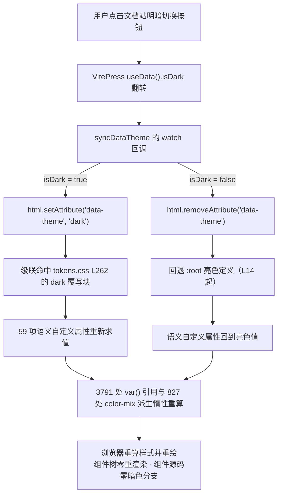
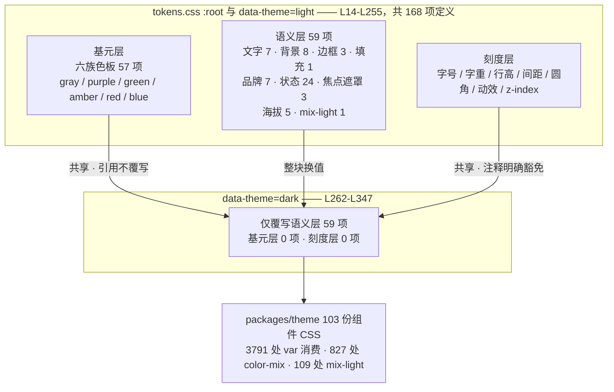

# 3-03 · 双主题机制：data-theme 协议与 --xy-mix-light 反转技巧

> 核心问题：85 行暗色覆写，如何换掉整个库的皮肤？

上一篇我们拆了设计令牌的三层架构，这一篇把镜头对准三层架构真正的"验收考试"：暗色主题。一套组件库的令牌系统设计得好不好，平时看不出来，一旦要出暗色模式，所有欠账都会一次性爆出来——颜色硬编码的组件要逐个返工，写死了 `hover` 变亮逻辑的组件要在暗色下集体翻车，文档示例和测试快照全部重拍。

所以这一篇我们回答一个很具体的问题：`xiaoye-components` 的整个主题包（103 份组件 CSS、3791 处 `var(--xy-*)` 引用、827 处 `color-mix()` 派生）里，**为暗色主题专门写的选择器是几处？**

答案是：**零处。**

```bash
# 在主题包源码里搜索暗色选择器：0 个匹配
rg '\[data-theme' packages/theme/src
# （无输出，退出码 1）
```

整个皮肤切换的智能，全部收敛在一个文件里：`packages/xiaoye-primitives/src/theme/tokens.css`。这个文件总共 409 行，其中暗色覆写块 `[data-theme="dark"]` 位于 L262-L347，86 个物理行（含选择器行、分组注释、空行与闭括号），真正干的活是 **59 项语义令牌的值替换**。所谓"85 行暗色覆写"，说的就是这一块——一个保守的约数，但量级准确：不到一百行 CSS，换掉 72 个基础组件加一整套 pro 增强组件的皮肤。

这篇文章就沿着三个关键词展开：**协议**（`data-theme` 属性为什么长这样）、**边界**（为什么暗色只覆写语义层）、**反转**（`--xy-mix-light` 如何用一行定义扭转 109 处颜色派生的方向）。

---

## 一、协议写在文件头：三层架构的切换契约

任何一套令牌系统最怕的不是没令牌，而是"切换规则"散落在无数人的记忆里。`tokens.css` 的做法是把契约直接写在文件头注释里，L1-L12：

```css
/**
 * Xy Design Tokens — 系统化设计令牌（Stripe 设计语言）
 *
 * 蓝本：design.hagicode.com 收录的 Stripe DESIGN.md（含官方亮/暗双目录）。
 * 三层架构，命名规则唯一：
 *   1. 基元层  --xy-{色板}-{阶}        灰 / 紫 / 绿 / 琥珀 / 红 / 蓝 六族色板，主题间共享
 *   2. 语义层  --xy-{角色}[-{状态}]    文字、背景、边框、品牌、状态、海拔、层级、遮罩
 *   3. 刻度层  --xy-{刻度}-{档}        字号、字重、行高、间距、圆角、动效时长
 *
 * 主题切换协议：[data-theme="dark"] 只覆写语义层的值；基元层与刻度层全局共享。
 * 文件末尾保留一层 @deprecated 旧命名兼容别名，供存量使用方平滑过渡，新代码禁止引用。
 */
```

注意 L10 这句话的信息密度："只覆写语义层的值；基元层与刻度层全局共享"。这不是描述现状的注释，而是**约束未来贡献者的协议**——后面我们会看到，暗色块严格遵守了这句话，59 项覆写没有一项越界到基元层或刻度层。

亮色主题的定义起点也有讲究，L14-L15：

```css
:root,
[data-theme="light"] {
```

`:root` 是默认态（什么都不设置就是亮色），而 `[data-theme="light"]` 是**显式亮色容器**——它让"在暗色页面里嵌一块亮色区域"成为可能。两个选择器指向同一份值，意味着亮色不需要任何"切换"动作，它是级联的兜底。这个双选择器是后面讨论局部暗色的伏笔。

语义层长什么样？节选 L94-L127（文字五级 + 背景亮度阶梯 + 边框 + 填充 + 品牌）：

```css
  --xy-text-heading: var(--xy-gray-950); /* 标题 */
  --xy-text-primary: var(--xy-gray-950); /* 默认正文 / 控件值 */
  --xy-text-secondary: var(--xy-gray-700); /* 表单标签、次级强调 */
  --xy-text-muted: var(--xy-gray-500); /* 描述、说明、占位 */
  --xy-text-faint: var(--xy-gray-400); /* 最弱元数据 */
  --xy-text-disabled: var(--xy-gray-300); /* 禁用态 */
  --xy-text-on-fill: #ffffff; /* 实色块上的文字（双主题恒白） */

  /* ---- 背景：亮度阶梯 page < subtle < muted < sunken < container ---- */
  --xy-bg-page: #f3f7fb; /* 页面画布 */
  --xy-bg-subtle: var(--xy-gray-25); /* 最浅染色面板 */
  --xy-bg-muted: var(--xy-gray-50); /* 次级面板 */
  --xy-bg-sunken: var(--xy-gray-100); /* 凹陷区：表头、代码块、井 */
  --xy-bg-container: #ffffff; /* 卡片、输入框、面板 */
  --xy-bg-raised: #ffffff; /* 抬升层（亮色靠阴影区分） */
  --xy-bg-elevated: #ffffff; /* 弹窗、抽屉 */
  --xy-bg-floating: #ffffff; /* 浮层 popper */

  /* ---- 边框 ---- */
  --xy-border: var(--xy-gray-200);
  --xy-border-strong: var(--xy-gray-300);
  --xy-border-subtle: var(--xy-gray-100);

  /* ---- 填充 ---- */
  --xy-fill-light: var(--xy-gray-50); /* 控件浅填充 */

  /* ---- 品牌色 ---- */
  --xy-brand: var(--xy-purple-600);
  --xy-brand-hover: var(--xy-purple-700);
  --xy-brand-active: var(--xy-purple-900);
```

这里藏着一套"值域纪律"：语义层亮色值**尽量引用基元层**（`var(--xy-gray-*)`、`var(--xy-purple-*)`），只有少数锚点用字面量（`--xy-bg-page: #f3f7fb` 这种带蓝调的页面画布，六族色板里没有对应的阶）。引用基元层的好处是单一事实源——调整紫色的 600 阶，亮色品牌主色自动跟随。

还有一个容易被忽略的细节：亮色下 `--xy-bg-raised / elevated / floating` 三个"抬升表面"全是 `#ffffff`，与 `--xy-bg-container` 同色。这不是偷懒，而是 Stripe 式的亮色海拔哲学——**亮色靠阴影分层，暗色靠亮度分层**。这个哲学在暗色覆写块里会有对应的镜像动作。

---

## 二、85 行覆写块全文精读

现在进入正题。暗色块的头注释先给出了取色出处，L257-L261：

```css
/* ====================================================================
 * 暗色主题 — 语义层整体覆写（暗面锚点取自 Stripe 官方暗色目录：
 * 页面底 #0e0f2e / 主色提亮 #665efd / 标题 #e8ecf0 / 正文 #8a95a8 /
 * 边框 rgba(255,255,255,0.1) / 成功文字 #4cdf80 / 柠檬 #d4a04a）
 * ==================================================================== */
```

"暗面锚点取自 Stripe 官方暗色目录"——这七个锚点值每个都有出处，这个话题下一篇（3-04《Stripe 蓝本对照》）会专门展开，这里先按下不表。块体全文如下，L262-L347：

```css
[data-theme="dark"] {
  /* 文字 */
  --xy-text-heading: #f2f5fa;
  --xy-text-primary: #e8ecf0;
  --xy-text-secondary: #b6c0cf;
  --xy-text-muted: #8a95a8;
  --xy-text-faint: #66718c;
  --xy-text-disabled: rgba(232, 236, 240, 0.3);
  --xy-text-on-fill: #ffffff;

  /* 背景：靛黑亮度阶梯 */
  --xy-bg-page: #0e0f2e;
  --xy-bg-subtle: #131435;
  --xy-bg-muted: #171939;
  --xy-bg-sunken: #0a0b24;
  --xy-bg-container: #161839;
  --xy-bg-raised: #1e2049;
  --xy-bg-elevated: #1e2049;
  --xy-bg-floating: #1a1c40;

  /* 边框：白色透明度阶梯 */
  --xy-border: rgba(255, 255, 255, 0.1);
  --xy-border-strong: rgba(255, 255, 255, 0.18);
  --xy-border-subtle: rgba(255, 255, 255, 0.06);

  /* 填充 */
  --xy-fill-light: rgba(255, 255, 255, 0.06);

  /* 品牌：官方暗色值 */
  --xy-brand: var(--xy-purple-500);
  --xy-brand-hover: #7a73ff;
  --xy-brand-active: var(--xy-purple-600);
  --xy-brand-soft: rgba(102, 94, 253, 0.15);
  --xy-brand-soft-hover: rgba(102, 94, 253, 0.22);
  --xy-brand-border: rgba(185, 185, 249, 0.3);
  --xy-brand-contrast: #ffffff;

  /* 状态：基色取亮阶，soft 用品牌色 alpha（官方暗色模式） */
  --xy-success: #2fd772;
  --xy-success-hover: #4cdf80;
  --xy-success-active: var(--xy-green-500);
  --xy-success-soft: rgba(21, 190, 83, 0.16);
  --xy-success-soft-hover: rgba(21, 190, 83, 0.24);
  --xy-success-text: #4cdf80;

  --xy-warning: var(--xy-amber-400);
  --xy-warning-hover: #e0b264;
  --xy-warning-active: var(--xy-amber-500);
  --xy-warning-soft: rgba(212, 160, 74, 0.16);
  --xy-warning-soft-hover: rgba(212, 160, 74, 0.24);
  --xy-warning-text: #e8bc72;

  --xy-danger: var(--xy-red-400);
  --xy-danger-hover: #f6769f;
  --xy-danger-active: var(--xy-red-500);
  --xy-danger-soft: rgba(234, 34, 97, 0.16);
  --xy-danger-soft-hover: rgba(234, 34, 97, 0.24);
  --xy-danger-text: #f78bb0;

  --xy-info: var(--xy-blue-400);
  --xy-info-hover: #7fbde5;
  --xy-info-active: var(--xy-blue-500);
  --xy-info-soft: rgba(91, 168, 217, 0.16);
  --xy-info-soft-hover: rgba(91, 168, 217, 0.24);
  --xy-info-text: #8cc4ea;

  /* 焦点与遮罩 */
  --xy-focus-ring-color: rgba(102, 94, 253, 0.4);
  --xy-focus-border: var(--xy-brand);
  --xy-overlay-color: rgba(2, 3, 15, 0.65);

  /* 海拔：暗色下阴影转黑色主导（官方暗色 shadow 值） */
  --xy-shadow-0: 0 1px 2px rgba(0, 0, 0, 0.4);
  --xy-shadow-1: 0 3px 6px rgba(0, 0, 0, 0.3);
  --xy-shadow-2: 0 15px 35px rgba(0, 0, 0, 0.35);
  --xy-shadow-3:
    0 30px 45px -30px rgba(0, 0, 0, 0.5),
    0 18px 36px -18px rgba(0, 0, 0, 0.4);
  --xy-shadow-4:
    0 14px 21px -14px rgba(0, 0, 0, 0.55),
    0 8px 17px -8px rgba(0, 0, 0, 0.45);

  --xy-mix-light: var(--xy-bg-container);

  /* 圆角、间距、字号、行高、字重、z-index —— 与主题无关，继承 :root */
}
```

59 项覆写的账本如下：

| 分组 | 项数 | 关键动作 |
| --- | --- | --- |
| 文字 | 7 | 五级亮度反转为冷白阶梯，禁用态转 alpha |
| 背景 | 8 | 深靛黑亮度阶梯，`sunken` 比 `page` 更暗 |
| 边框 | 3 | 灰色实色 → 白色透明度阶梯 |
| 填充 | 1 | `fill-light` 转 6% 白 |
| 品牌 | 7 | 主色从 purple-600 **提亮**为 purple-500 |
| 状态（4 组 × 6） | 24 | 基色取色板亮阶，soft 统一 16% / 24% alpha |
| 焦点与遮罩 | 3 | 焦点环 alpha 提到 0.4，遮罩加深 |
| 海拔阴影 | 5 | 蓝调阴影 → 纯黑主导 |
| mix-light | 1 | 白色 → `var(--xy-bg-container)`（本文主角） |
| **合计** | **59** | |

逐组看几个值得停下来想的设计动作。

**其一，背景不是"黑"，而是一条靛黑亮度阶梯。** `page` 是 `#0e0f2e`（带紫调的深海军），`container` 是 `#161839`，`raised / elevated` 抬到 `#1e2049`——亮色下"靠阴影区分的同色表面"，在暗色下全部改为**亮度本身分层**。这正是第一节末尾埋的那条亮色海拔哲学的镜像。更妙的是 `--xy-bg-sunken: #0a0b24`：凹陷区（表头、代码块）比页面底还暗，"凹进去"的视觉隐喻在暗色下依然成立。很多组件库的暗色模式做出来"所有东西都是平的"，根源就是只做了一个黑背景、没做凹陷方向。

**其二，边框从"实色"改成"透明度"。** 亮色边框是灰阶实色（`--xy-gray-200`），暗色边框是 `rgba(255,255,255,0.1)`。透明度边框会与底色混合——在 `container` 上和在 `page` 上，同一条边框呈现的亮度不同，天然带有"环境感"，这是暗色设计里比实色更高级的手法，Stripe、GitHub 的暗色目录都是这么做的。

**其三，品牌主色的"提亮"发生在语义层，而不是色板层。** 亮色 `--xy-brand: var(--xy-purple-600)`，暗色 `--xy-brand: var(--xy-purple-500)`——注意暗色覆写引用的仍然是**同一块基元色板**，只是取了更高一档。色板本身（`--xy-purple-600: #533afd`）一个字节都没动。这就是"基元层主题间共享"协议的具体兑现：色板是物理常数，语义是主题函数。

**其四，状态色 soft 家族统一成 alpha。** 亮色的 soft 是低透明度浅色底（12% / 20%），暗色统一提到 16% / 24%——暗底上浅色 alpha 需要更高不透明度才能维持同等的"色块存在感"。四组状态色的 alpha 值完全对齐，这种"成对成套"的纪律让视觉巡检的 diff 也变得好读。

**其五，文字组里藏着一条"账本完整性"声明。** 7 项文字覆写中，`--xy-text-on-fill: #ffffff`（L270）与亮色同值——实色块上的文字双主题恒白，这一项本来可以不写。但账本要的是完备：59 项对应语义层的全部槽位，缺一项，"哪些语义槽在暗色下被重新裁决过"就失去机械可答性——审计时对两个块做属性集合 diff，多一项少一项都该被追问。同组里信息量更大的是禁用态：亮色 `--xy-text-disabled` 是灰阶实色（`var(--xy-gray-300)`，L99），暗色换成 `rgba(232, 236, 240, 0.3)`（L269）——暗底上"把灰调灰"会陷入与背景对比度不足的泥潭，改用前景色降 alpha，表达的是"存在感衰减"而不是"换了个颜色"，同一个禁用语义在两个主题里由不同的物理手段实现。

**其六，状态组的 `-text` 变体与 hover 方向是一对镜像。** 亮色基色与文字色是"基色浅、文字深"（`--xy-success: var(--xy-green-500)`、`--xy-success-text: var(--xy-green-600)`，L130 与 L135），hover 也比基色深一档（L131）；暗色整体反转：基色 `#2fd772`，文字色 `#4cdf80` 与 hover 同值（L300-L305）——**文字变体永远比基色"更靠近可读方向"**：亮色主题里可读等于更深，暗色主题里可读等于更亮。hover 一样：亮色变深（green-500 → green-600），暗色变亮（`#2fd772` → `#4cdf80`）。交互反馈的物理方向相反，感知语义统一——"hover = 增加与背景的对比"。这个不变量不是写在组件里的判断，而是靠语义槽位在两个主题里各自取值守住的。

**其七，焦点、遮罩与阴影三组是"暗色加重税"，但加重的维度各不相同。** 焦点环从亮色 `rgba(83, 58, 253, 0.14)`（L159，purple-600 的 14% alpha）提到暗色 `rgba(102, 94, 253, 0.4)`（L329，purple-500 的 40%）——不只是 alpha 的量变，色相也随品牌主色一起换到暗色那一档：焦点指示在深底上需要强得多的信号。遮罩同理，`rgba(6, 27, 49, 0.5)`（L161）换成 `rgba(2, 3, 15, 0.65)`（L331）——色相从蓝调换回与页面底同族的靛黑，浓度加深，暗色下的遮罩要压得住比亮色亮得多的内容。阴影组则是全文最"克制"的一组：对比 L166-L174 与暗色块的 L334-L342，shadow-3 / shadow-4 的几何参数（偏移、扩散、双层结构）一个没动，动的只有颜色与不透明度——亮色"蓝调主导 + 黑色辅助"（`rgba(50, 50, 93, 0.25)`）换成纯黑主导（`rgba(0, 0, 0, 0.5)` 与 `0.4`）。**形状是物理事实，颜色才是主题语义**——这组覆写把这句话执行到了最细的粒度。

---

## 三、权衡一：为什么是 data-theme 属性，而不是 class 或媒体查询

暗色切换的实现载体，业界常见三种：`prefers-color-scheme` 媒体查询、`.dark` 类名（Element Plus / Tailwind 路线）、`data-theme` 属性（本库路线）。这个选择值得完整摆一遍利弊。

**方案 A：纯媒体查询。** `@media (prefers-color-scheme: dark) { :root { ... } }`。优点是零 JS、自动跟随系统。缺点是致命的：用户无法手动覆盖——"我就想在白天用暗色"这个最基本的产品诉求无法满足；而且媒体查询没有"作用域"，无法实现局部暗色。所以工程上媒体查询最多只能当初始值的默认源，不能当切换协议。

**方案 B：`.dark` 类名。** Element Plus 的路线：引入 `element-plus/theme-chalk/dark/css-vars.css`，在 `html` 上加 `dark` 类切换（通常配合 VueUse 的 `useDark`）：

```ts
// Element Plus 的典型暗色接入（对比用）
import { useDark, useToggle } from "@vueuse/core";
import "element-plus/theme-chalk/dark/css-vars.css";

const isDark = useDark(); // 默认操作 html.dark
const toggleDark = useToggle(isDark);
```

类名方案完全可行，EP 用它服务了海量项目。但有两个可以再拧紧的螺丝。其一，`class` 是无值的集合语义，"主题"这种**单选枚举**概念用属性表达更贴切，`data-theme="dark"` 天然预留了 `data-theme="high-contrast"`、`data-theme="compact"` 这类未来扩展位——加一个主题就是加一个值，而不是发明新的类名约定。其二，EP 的暗色文件需要**单独引入**（不在默认样式里），亮色变量定义在 `:root`、没有显式的亮色选择器；本库把 `:root` 与 `[data-theme="light"]` 绑定为同一块值（tokens.css L14-L15），亮色也成为可显式声明的状态，配合 CSS 自定义属性按 DOM 子树继承的特性，局部主题嵌套是免费的。

**方案 C：`data-theme` 属性（本库路线）。** `html` 上设 `data-theme="dark"`，级联命中覆写块；移除属性则回退 `:root`。文档站的《主题定制》指南（`apps/docs/guide/theming.md`）把这一协议写成了用户文档，L215-L234：

````markdown
### 接入方式

在根元素上切换 `data-theme` 属性即可，无需额外样式：

```ts
// Vue 3 示例
const isDark = useDark() // 任一暗色方案源
watchEffect(() => {
  document.documentElement.dataset.theme = isDark.value ? 'dark' : 'light'
})
```

### 局部暗色区域

`data-theme` 可以放在任意容器上，实现页面局部暗色区块：

```html
<div data-theme="dark">
  <!-- 这里的组件使用暗色令牌 -->
</div>
```
````

"局部暗色"能成立，依赖两个前提的合力：CSS 自定义属性**按子树继承**（`data-theme` 放在任意容器上，其子树内所有 `var()` 重新解析），以及库的组件样式**只消费语义令牌**（没有任何组件写死颜色）。这两个前提一个由 CSS 平台提供，一个由工程纪律保证——缺一个，局部暗色都会退化成"局部看起来不对劲"。

还有一层是**性能语义**的：切换 `data-theme` 只是改了一个 HTML 属性，浏览器对 CSS 自定义属性做的是**样式重算与重绘**，Vue 组件树全程零重渲染——没有任何组件的 props、状态、DOM 结构因为这个动作发生变化。主题切换的成本与页面组件数量无关，只与需要重绘的面积有关。

三案归一：媒体查询只配当"初始默认值源"，真正的切换协议需要一个**可编程、可作用域化、带枚举语义**的载体。属性方案是三者中约束表达力最强的，代价仅仅是属性名比类名长几个字符。

---

## 四、一行接入：文档站与巡检脚本的同一协议

协议定下来之后，所有消费方接入应该是"一行属性操作"。看两处实态。

第一处是文档站。VitePress 自带明暗切换按钮，它管理的是自己的 `isDark` 状态；组件库需要的是 `data-theme` 属性。两者要做一次翻译，`apps/docs/.vitepress/theme/index.ts` L20-L35：

```ts
function syncDataTheme() {
  if (!inBrowser) return;
  const { isDark } = useData();
  const html = document.documentElement;

  const apply = (dark: boolean) => {
    if (dark) {
      html.setAttribute("data-theme", "dark");
    } else {
      html.removeAttribute("data-theme");
    }
  };

  apply(isDark.value);
  watch(isDark, apply);
}
```

`setup()` 里一句 `syncDataTheme()`（L54）完成挂载。注意两个细节：`apply` 在 `watch` 之前**先同步执行一次**，保证首屏（以及 SSG 水合后）不闪亮色；亮色分支用的是 `removeAttribute` 而不是 `setAttribute("data-theme", "light")`——因为 `:root` 已经是亮色兜底，移除属性让 DOM 回到最简状态，也顺带验证了"亮色不需要协议参与"的设计。同一个文件里，`enhanceApp` 向 `configProviderKey` 注入的只有 `zIndex: 2100`（L40-L45）——文档站接入组件库主题的全部成本，就是这十来行翻译代码。

第二处是视觉巡检。`scripts/visual-audit.mjs` 的双主题截图段 L91-L117，用的正是同一个协议：

```js
  const capture = async (theme) => {
    await page.evaluate((mode) => {
      const html = document.documentElement;
      if (mode === "dark") html.setAttribute("data-theme", "dark");
      else html.removeAttribute("data-theme");
    }, theme);
    await page.waitForTimeout(250);
    const demos = await page.locator(".vp-demo").all();
    const list = [];
    for (let i = 0; i < demos.length; i += 1) {
      const el = demos[i];
      try {
        await el.scrollIntoViewIfNeeded();
        await page.waitForTimeout(150);
        const file = `shots/${pageEntry.layer}-${pageEntry.name}-${theme}-${String(i + 1).padStart(2, "0")}.png`;
        await el.screenshot({ path: path.join(outDir, file), animations: "disabled" });
        list.push(file);
      } catch (err) {
        consoleErrors.push(`demo#${i + 1} 截图失败: ${String(err).slice(0, 150)}`);
      }
    }
    return list;
  };

  shots.light = await capture("light");
  shots.dark = await capture("dark");
  await page.evaluate(() => document.documentElement.removeAttribute("data-theme"));
```

每个文档页面在同一浏览器上下文里先拍亮色、再切 `data-theme` 拍暗色，逐个 demo 截图存档；`pnpm audit:visual` 在有基线时做像素 diff，超过 0.5% 退出码置 1。也就是说，**双主题的一致性不是靠人眼抽查，而是被同一条协议驱动的自动化流水线把关的**——巡检脚本不注入任何样式、不打任何补丁，它对主题的全部操作就是 `setAttribute` / `removeAttribute`，反过来说明了协议的完备：属性一设，剩下全是 CSS 的事。

把整条链路画出来：



值得强调中间那步"惰性重算"：3791 处 `var()` 引用不需要任何登记表或遍历，浏览器自定义属性的求值机制天然把"改 59 个定义"传播到所有引用点。这就是为什么覆写块可以这么小——它不需要"知道"谁在消费。

---

## 五、权衡二：暗色为什么只覆写语义层

现在回到文件头协议的另一半："基元层与刻度层全局共享"。用数字说话：`:root` 块（L14-L255）定义了 **168 项**令牌；暗色块覆写 **59 项**；文件末尾的兼容层（后面讲）是 **48 项**别名。也就是说，暗色覆盖率为 59/168 ≈ 35%，剩下 109 项——全部基元色板、全部字号字重间距圆角动效、全部 z-index——在两个主题间是**物理上同一份值**。

这套边界的收益可以数出四条。

**第一条是体积与维护面。** 如果暗色覆写全量令牌，覆写块要膨胀三倍，而且每新增一档色板、一档间距都要记得在暗色里同步——遗漏就是 bug。只覆写语义层，新增令牌的默认行为是"双主题自动可用"，协议把"必须想清楚主题差异"的压力精确限制在 59 个语义槽位上。

**第二条是一致性锚点。** 两个主题共享同一块色板，意味着"品牌紫"在亮暗两界是同一个物理色族的相邻两档（600 ↔ 500），而不是两套独立的调色结果。状态色的处理更明显：暗色的 `--xy-success-active: var(--xy-green-500)` 直接引用亮色 active 在用的那档绿——跨主题的色值谱系是连续的。

**第三条是"与主题无关"的东西被明确豁免。** 暗色块最后一行注释（L346）专门点名：圆角、间距、字号、行高、字重、z-index 与主题无关，继承 `:root`。这句注释看似多余，实则是给未来贡献者的"负面清单"——如果哪天有人在暗色块里写了一个 `--xy-space-3`，review 时可以直接指着这句话打回。

**第四条在生成物里看得最清楚。** `packages/tokens` 的 TS 常量层由 `pnpm generate:tokens` 从 tokens.css 自动生成，其中语义层的暗色镜像是 `packages/tokens/src/semantic.ts` L73-L133：

```ts
/** 语义层令牌（暗色主题 [data-theme=dark] 的覆写值） */
export const darkSemanticTokens = {
  "textHeading": "#f2f5fa",
  "textPrimary": "#e8ecf0",
  "textSecondary": "#b6c0cf",
  "textMuted": "#8a95a8",
  "textFaint": "#66718c",
  "textDisabled": "rgba(232, 236, 240, 0.3)",
  "textOnFill": "#ffffff",
  "bgPage": "#0e0f2e",
  "bgSubtle": "#131435",
  "bgMuted": "#171939",
  "bgSunken": "#0a0b24",
  "bgContainer": "#161839",
  "bgRaised": "#1e2049",
  "bgElevated": "#1e2049",
  "bgFloating": "#1a1c40",
  "border": "rgba(255, 255, 255, 0.1)",
  "borderStrong": "rgba(255, 255, 255, 0.18)",
  "borderSubtle": "rgba(255, 255, 255, 0.06)",
  "fillLight": "rgba(255, 255, 255, 0.06)",
  "brand": "var(--xy-purple-500)",
  "brandHover": "#7a73ff",
  "brandActive": "var(--xy-purple-600)",
  "brandSoft": "rgba(102, 94, 253, 0.15)",
  "brandSoftHover": "rgba(102, 94, 253, 0.22)",
  "brandBorder": "rgba(185, 185, 249, 0.3)",
  "brandContrast": "#ffffff",
  "success": "#2fd772",
  "successHover": "#4cdf80",
  "successActive": "var(--xy-green-500)",
  "successSoft": "rgba(21, 190, 83, 0.16)",
  "successSoftHover": "rgba(21, 190, 83, 0.24)",
  "successText": "#4cdf80",
  "warning": "var(--xy-amber-400)",
  "warningHover": "#e0b264",
  "warningActive": "var(--xy-amber-500)",
  "warningSoft": "rgba(212, 160, 74, 0.16)",
  "warningSoftHover": "rgba(212, 160, 74, 0.24)",
  "warningText": "#e8bc72",
  "danger": "var(--xy-red-400)",
  "dangerHover": "#f6769f",
  "dangerActive": "var(--xy-red-500)",
  "dangerSoft": "rgba(234, 34, 97, 0.16)",
  "dangerSoftHover": "rgba(234, 34, 97, 0.24)",
  "dangerText": "#f78bb0",
  "info": "var(--xy-blue-400)",
  "infoHover": "#7fbde5",
  "infoActive": "var(--xy-blue-500)",
  "infoSoft": "rgba(91, 168, 217, 0.16)",
  "infoSoftHover": "rgba(91, 168, 217, 0.24)",
  "infoText": "#8cc4ea",
  "focusRingColor": "rgba(102, 94, 253, 0.4)",
  "focusBorder": "var(--xy-brand)",
  "overlayColor": "rgba(2, 3, 15, 0.65)",
  "shadow0": "0 1px 2px rgba(0, 0, 0, 0.4)",
  "shadow1": "0 3px 6px rgba(0, 0, 0, 0.3)",
  "shadow2": "0 15px 35px rgba(0, 0, 0, 0.35)",
  "shadow3": "0 30px 45px -30px rgba(0, 0, 0, 0.5), 0 18px 36px -18px rgba(0, 0, 0, 0.4)",
  "shadow4": "0 14px 21px -14px rgba(0, 0, 0, 0.55), 0 8px 17px -8px rgba(0, 0, 0, 0.45)",
} as const;
```

这份镜像逐项对应 CSS 的 59 项覆写（脚本自动生成、文件头声明禁止手编，不存在两处手工同步漂移的问题），它存在的意义是服务 **JS 侧消费**——比如 charts 组件往 canvas 里画图时，canvas 没有 CSS 级联，解析不了 `var()`，只能从 TS 常量里读色值。而这份 TS 镜像同样只有语义层、没有基元与刻度，也没有 z 层（z 层在亮色 `semanticTokens` 里有、暗色镜像里没有——因为 z 层双主题同值，覆写集里本来就没有它）。CSS 协议和 TS 镜像的边界完全同构，这是"只覆写语义层"在构建期被固化下来的证据。

把三层架构与覆写边界画成图：



（基元层的 57 项由 168 总数减去语义、刻度、z 层推算，写这个数字是为了给读者一个量级感；精确分层数以 tokens.css 实态为准。）

---

## 六、权衡三：--xy-mix-light，一行定义反转 109 处派生

终于到了标题里的第二位主角。先看它在两个主题里的定义。

亮色侧，定义在 `:root` 块的**最末尾**——排在动效刻度之后、不属于三层架构任何一层，L253-L255：

```css
  /* color-mix 提亮基色（暗色下切到暗底实现"减淡"） */
  --xy-mix-light: #ffffff;
}
```

暗色侧，覆写在块的**海拔阴影组之后**——同样游离在分组账本之外，紧跟着一行说明"其他层不覆写"的注释，L344：

```css
  --xy-mix-light: var(--xy-bg-container);
```

（顺带校一个流行误传：这行在当前实态是 L344，不是某些旧文写到的 L345；它在文件中的位置也确实"紧跟海拔阴影组之后"而非背景组，因为它本来就不被当作背景语义管理。）

它是什么？一句话：**所有"往彩色里掺浅色"的派生公式的第二个操作数**。亮色下它是白色，`color-mix(in srgb, 彩色 X%, white)` 就是常规的"掺白提亮"；暗色下它切换为容器底色 `#161839`，同一个公式变成"往彩色里掺暗底"——视觉方向从"提亮"反转成"向底色收敛、降低刺激"，但**表达式的语义不变**：都是"把这个颜色变得更柔和、更贴近环境"。

为什么这是一个技巧而不是废话？对比一下没有它时我们会怎么写。每个需要"浅一档的强调色"的地方，都得为暗色写一条覆写分支，或者引入一组预生成的浅色档位变量——Element Plus 正是后者：`--el-color-primary-light-3 / 5 / 7 / 8 / 9` 加 `dark-2` 共六档派生色，亮暗各维护一套手工值。而本库用 `var(--xy-mix-light)` 把"掺什么"参数化了，全 theme 包 **109 处** `var(--xy-mix-light)` 消费（分布在 44 个组件样式文件里），暗色下一行定义全部自动反转方向。零档位变量、零分支、零生成物。

看两个实态消费。`packages/theme/src/components/button.css`，焦点环 L31-L35：

```css
.xy-button:focus-visible {
  outline: 2px solid color-mix(in srgb, var(--xy-brand) 58%, var(--xy-mix-light));
  outline-offset: 2px;
  box-shadow: 0 0 0 1px color-mix(in srgb, var(--xy-brand) 16%, transparent);
}
```

外圈 outline 是品牌色掺 42% 的 mix-light。亮色下：紫色掺白，焦点环比实色品牌"轻一档"，不抢内容的视觉权重；暗色下：紫色掺容器底 `#161839`，焦点环沉入背景、只在边缘留出紫色偏移——两种主题下焦点可见性都达标（对比 WCAG 对焦点指示的要求），而这条 CSS 里没有任何主题判断。

再看按压态，同文件 L199-L208（plain 型主按钮的 hover 与 active 相邻两态）：

```css
.xy-button.is-plain.xy-button--primary:hover:not(:disabled):not(.is-disabled) {
  background: var(--xy-brand-soft-hover);
  border-color: color-mix(in srgb, var(--xy-brand) 22%, var(--xy-border));
}

.xy-button.is-plain.xy-button--primary:active:not(:disabled):not(.is-disabled) {
  color: var(--xy-brand-active);
  background: color-mix(in srgb, var(--xy-brand-soft-hover) 72%, var(--xy-mix-light));
  border-color: color-mix(in srgb, var(--xy-brand) 28%, var(--xy-border));
}
```

hover 态的背景是 `--xy-brand-soft-hover`（alpha 软底），active 按压时在 hover 底上再掺 28% 的 mix-light。亮色下按压"变浅变轻"（软底掺白），暗色下按压"向底色收敛"（软底掺暗底）——方向相反，体感一致：**按压 = 视觉退让半步**。注意第二、三个操作数也是语义令牌（`--xy-border` 暗色下是白色透明度），整条公式三个颜色源全部随主题翻转，组件侧依然零分支。这里能看出 `color-mix()` + CSS 变量的组合拳打法：**编译期不折叠、运行时按当前主题求值**，派生链天然是"活的"。

还有一个位置安排的细节值得咀嚼：`--xy-mix-light` 的暗色值是 `var(--xy-bg-container)`（卡片、输入框、面板的底色），而不是 `--xy-bg-page`。因为消费 mix-light 的元素大多长在容器表面上（按钮在卡片里、菜单项在浮层里），掺"它所贴附的那个平面"的底色，收敛方向才符合视觉所在的海拔层。一个变量名的选择，把"派生色向哪个平面收敛"这个设计决策编码进了令牌系统。

**同一思路的另一种形态：语义对偶反转。** `packages/theme/src/components/message.css` 的徽标 L82-L102 是近期修过的一个实底反转案例：

```css
.xy-message__badge {
  position: absolute;
  top: -8px;
  right: -8px;
  display: inline-flex;
  align-items: center;
  justify-content: center;
  min-width: 20px;
  height: 20px;
  padding: 0 6px;
  border-radius: var(--xy-radius-pill);
  /* 徽标底色取主文字色：currentColor 会解析为自身 color 导致"白底白字"，
     而 --xy-text-heading 亮色主题近黑、暗色主题近白，可自动反转 */
  background: var(--xy-text-heading);
  /* 文字用浮层背景色，双主题下与徽标底色的对比度均大于 13:1 */
  color: var(--xy-bg-floating);
  font-size: 11px;
  font-weight: var(--xy-font-weight-semibold);
  line-height: 1;
  box-shadow: 0 8px 18px color-mix(in srgb, var(--xy-text-heading) 24%, transparent);
}
```

徽标要做一个"与主文字同色"的中性实底圆点。最初的写法用 `currentColor`，结果 `currentColor` 解析到的是徽标自身的 `color`，暗色下出现"白底白字"事故。修复方案没有加任何暗色分支，而是做了一次**语义对偶**：底色取 `--xy-text-heading`（亮色近黑 / 暗色近白 `#f2f5fa`），文字取 `--xy-bg-floating`（亮色纯白 / 暗色 `#1a1c40`）。两个语义令牌在两个主题里恰好互为反色，对比度双双大于 13:1——注释里把这笔对比度账都算好了。这是 mix-light 之外的第二种零分支反转：**让"前景/背景"这对语义角色自己完成交换**。

两种反转合起来看，会发现它们共享同一个世界观：**不要在组件里问"现在是暗色吗"，而要让"亮与暗的对应物"在令牌层预先配好对。** mix-light 配的是"掺浅色的对象"，text-heading/bg-floating 配的是"反色对"。组件永远只表达意图，主题负责解释。

---

## 七、零分支的边界与兜底：兼容层

协议讲到这，还剩文件末尾一块拼图——`@deprecated` 旧命名兼容层，L349-L409：

```css
/* ====================================================================
 * @deprecated 旧命名兼容层
 * 供存量使用方（自定义主题、文档示例）平滑迁移，映射到新语义层。
 * 计划在下个 major 版本移除；新代码一律使用上方规范命名。
 * ==================================================================== */
:root,
[data-theme="light"] {
  /* 品牌 / 状态 */
  --xy-color-primary: var(--xy-brand);
  --xy-color-primary-hover: var(--xy-brand-hover);
  --xy-color-primary-active: var(--xy-brand-active);
  --xy-color-primary-soft: var(--xy-brand-soft);
  --xy-color-primary-soft-hover: var(--xy-brand-soft-hover);
  --xy-color-info: var(--xy-info);
  --xy-color-info-hover: var(--xy-info-hover);
  --xy-color-success: var(--xy-success);
  --xy-color-success-hover: var(--xy-success-hover);
  --xy-color-success-active: var(--xy-success-active);
  --xy-color-success-soft: var(--xy-success-soft);
  --xy-color-success-soft-hover: var(--xy-success-soft-hover);
  --xy-color-warning: var(--xy-warning);
  --xy-color-warning-hover: var(--xy-warning-hover);
  --xy-color-warning-active: var(--xy-warning-active);
  --xy-color-warning-soft: var(--xy-warning-soft);
  --xy-color-warning-soft-hover: var(--xy-warning-soft-hover);
  --xy-color-danger: var(--xy-danger);
  --xy-color-danger-hover: var(--xy-danger-hover);
  --xy-color-danger-active: var(--xy-danger-active);
  --xy-color-danger-soft: var(--xy-danger-soft);
  --xy-color-danger-soft-hover: var(--xy-danger-soft-hover);

  /* 文字 / 边框 / 背景 / 表面 */
  --xy-text-color: var(--xy-text-primary);
  --xy-text-color-heading: var(--xy-text-heading);
  --xy-text-color-secondary: var(--xy-text-secondary);
  --xy-text-color-subtle: var(--xy-text-muted);
  --xy-text-color-muted: var(--xy-text-muted);
  --xy-text-color-muted-2: var(--xy-text-faint);
  --xy-border-color: var(--xy-border);
  --xy-border-color-strong: var(--xy-border-strong);
  --xy-border-color-subtle: var(--xy-border-subtle);
  --xy-color-on-fill: var(--xy-text-on-fill);
  --xy-fill-color-light: var(--xy-fill-light);
  --xy-bg-color: var(--xy-bg-container);
  --xy-bg-color-page: var(--xy-bg-page);
  --xy-bg-color-muted: var(--xy-bg-muted);
  --xy-bg-color-subtle: var(--xy-bg-subtle);
  --xy-bg-color-elevated: var(--xy-bg-elevated);
  --xy-bg-color-floating: var(--xy-bg-floating);
  --xy-surface-raised: var(--xy-bg-raised);
  --xy-surface-sunken: var(--xy-bg-sunken);

  /* 海拔别名（旧七档 → 新五级） */
  --xy-shadow-xs: var(--xy-shadow-0);
  --xy-shadow-sm: var(--xy-shadow-1);
  --xy-shadow-md: var(--xy-shadow-2);
  --xy-shadow-lg: var(--xy-shadow-3);
  --xy-shadow-card: var(--xy-shadow-1);
  --xy-shadow-popup: var(--xy-shadow-2);
  --xy-shadow-modal: var(--xy-shadow-3);
}
```

这 48 项别名是重构期的渡桥，但它们身上有个漂亮的性质：**别名映射到的是新语义令牌，而不是旧色值**。`--xy-color-primary` 指向 `var(--xy-brand)`，而 `--xy-brand` 在暗色块里有覆写——于是所有还在用旧命名的存量代码（自定义主题、老文档示例），**一个字不改就自动获得了双主题能力**。如果兼容层映射的是旧色板快照，这 48 个旧名字就会成为暗色模式里的 48 个"死色"。别名层"免费继承"新协议，这是 CSS 变量链式引用送的礼物，也是迁移期兼容层最值得学的写法。

最后把边界说全。零暗色分支不等于"JS 侧不需要知道主题"：canvas 渲染的 charts 要靠 `darkSemanticTokens` 这份 TS 镜像手动取值；`prefers-color-scheme` 只配当初始默认源的候选；SSG 场景下属性要在水合前就位否则会闪亮。协议解决的是"样式层怎么换皮"，不解决"JS 侧如何感知"——后者靠 `darkSemanticTokens`、`useDark()` 这类镜像与桥接，这也是 tokens 包拆出 TS 常量层的根本理由。

---

## 八、收束

回看这 85 行（实态 L262-L347，59 项声明）能换掉整个库的皮肤，靠的其实不是这 85 行本身，而是它背后三层契约的环环相扣：

1. **协议层**：`data-theme` 属性作为单选枚举载体，`:root` 兜底 + `[data-theme="light"]` 显式亮色，属性可放在任意容器实现局部主题；
2. **边界层**：基元与刻度双主题共享，暗色只动语义层 59 项，新增令牌默认双主题可用；
3. **派生层**：组件样式只消费语义令牌并用 `color-mix()` 派生，`--xy-mix-light` 一行定义反转 109 处派生方向，语义对偶（text-heading × bg-floating）处理实底反色。

于是"换肤"这个动作被压缩到了物理极限：一个 DOM 属性的写与删。组件不关心、JS 不参与、构建物不膨胀，连旧命名兼容层都免费搭上了车。而每一处取值——靛黑 `#0e0f2e`、提亮的 `#665efd`、`#4cdf80` 的成功文字——都能顺着注释追溯回 Stripe 官方亮暗双目录的锚点。

下一篇（3-04《Stripe 蓝本对照：设计决策的可追溯性》）我们就顺着这些锚点往下挖：为什么页面底选 `#0e0f2e` 而不是纯黑、边框透明度阶梯怎么定的 0.06/0.1/0.18、shadow 五级和 Stripe 的对应关系是什么——把"设计决策可追溯"从一个好听的口号，变成一条可以逐值核验的对照表。
