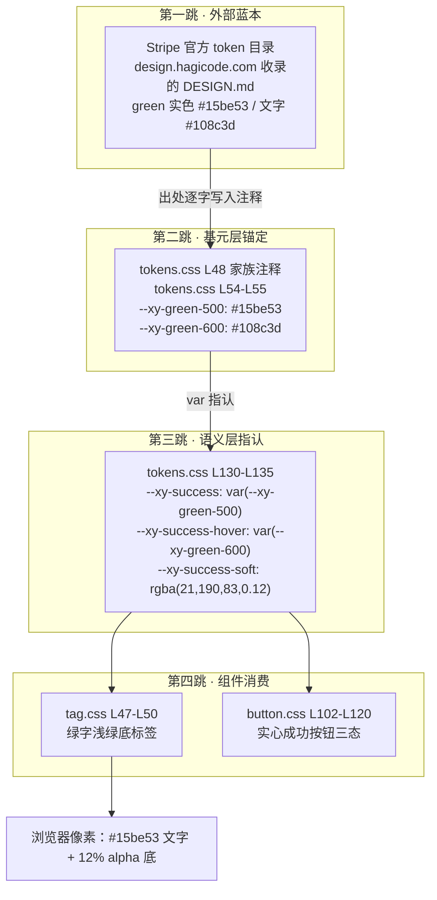
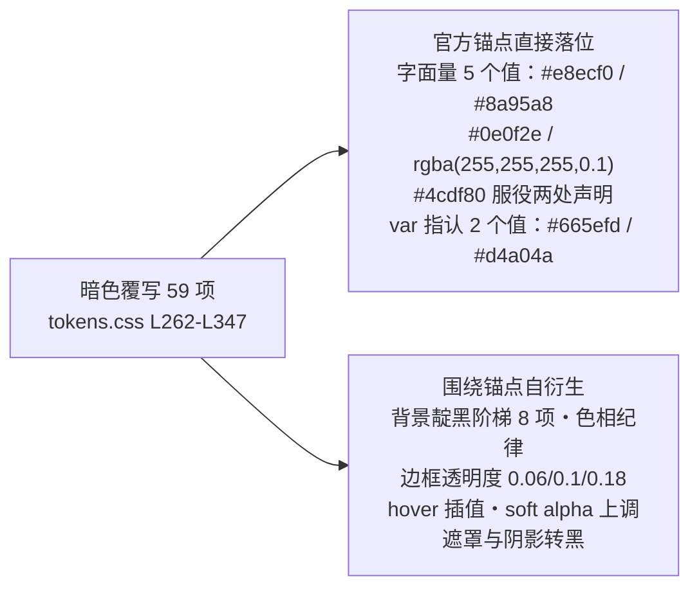
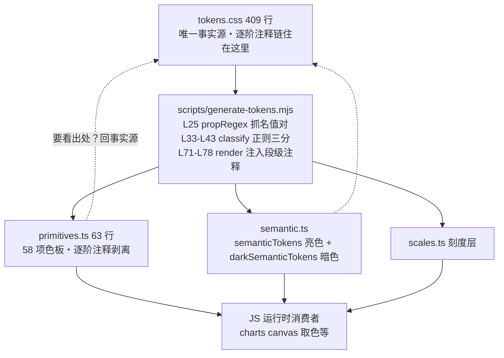

# 3-04 · Stripe 蓝本对照：设计决策的可追溯性

> 核心问题：为什么每个色值都能说出"来自 Stripe 哪一档"？

3-03 的结尾留了个尾巴：靛黑 `#0e0f2e`、提亮的 `#665efd`、`#4cdf80` 的成功文字，"都能顺着注释追溯回 Stripe 官方亮暗双目录的锚点"。这句话听起来像宣传语，本篇的任务是把它变成一张可以逐值核验的对照表。

先说大多数组件库的常态。你打开一个组件的样式，看到 `color: #409eff`，问一句"为什么是这个值"，得到的答案通常是三种之一："设计师给的"、"上一版就是这样"、"别动，动了 UI 会来找你"。色值的出处是口口相传的部落记忆，设计规范文档里印着的色板，和代码里真实跑着的色值，是两套需要人肉对账的账本。时间一长，没人说得清哪个值还能改、哪个值动一下会塌方——因为没有人知道当初"为什么是这个值"。

xiaoye-components 把这件事做成了另一种形状：**每一个被标榜为"官方值"的色值，都在它落地的那个文件里、离值最近的注释里，写着它的出处**。这条链不是文档层的装饰，而是源码层的事实。本篇会把 `packages/xiaoye-primitives/src/theme/tokens.css`（409 行，`wc -l` 口径）里全部出处注释逐一抄录核对，跟着生成脚本看注释链在 TS 侧的取舍，再从组件像素反查回目录，验证这条链在消费端没有断。

先给结论性的数字，全部在当前工作区重新核实：六族色板 58 项，注释直接锚定 Stripe 官方值的出处标注共 14 处；暗色覆写 59 项，其中注释点名的官方暗色锚点 7 个值；生成物 `primitives.ts` 63 行，逐阶注释被剥离、段级注释保留；主题包 103 份组件 CSS、3791 处 `var(--xy-*)` 引用、827 处 `color-mix()` 派生，直接引用基元色板的次数为 **0**。这四组数字拼在一起，就是"可追溯"三个字的全部物理载体。

---

## 一、问题的形状：从像素到目录的四跳

抽象讨论"可追溯性"没有意义，我们先真的追一次。`xy-tag` 组件的成功态标签，绿字浅绿底，样式在 `packages/theme/src/components/tag.css` L47-50：

```css
.xy-tag--success {
  color: var(--xy-success);
  background: var(--xy-success-soft);
}
```

组件里没有色值，只有变量名。`--xy-success` 在亮色主题下指向哪里？`tokens.css` L130：

```css
--xy-success: var(--xy-green-500);
```

还是变量名。`--xy-green-500` 是什么？`tokens.css` L54：

```css
--xy-green-500: #15be53;
```

到这一步拿到了字面值，但追溯还没完——真正回答"为什么"的是它上方 L48 的家族注释：

```css
/* 成功绿：Stripe green（#15be53 实色 / #108c3d 文字） */
```

于是完整链条是四跳：**Stripe 官方 token 目录 → 基元层注释锚定 → 语义层 var 指认 → 组件样式消费**。`#15be53` 不是"设计师拍的"，它是 Stripe 目录里 green 语义的官方实色；`#108c3d` 是同族的官方文字色，落在 green-600 阶上；标签的浅绿底 `--xy-success-soft`（L133）是 green-500 的 12% alpha——`design-tokens.md` L54 说这个 0.12/0.2 区间是"官方 sanctioned 区间"。每一跳都有文件与行号，每一跳都不需要问人。



这张图值得盯十秒的地方在于**箭头的方向**：出处信息只从目录流向注释、再由注释给色值"背书"；反向的任何箭头——比如某天有人直接在 tag.css 里写 `color: #15be53`——都会让第四跳脱离前三跳，链条就地断裂。可追溯性不是多写几行注释，而是保证任何一次渲染出的像素，都存在一条通往外部设计事实的、无断链的引用路径。

顺带说清一个边界：这套注释标注体系不止覆盖颜色。`tokens.css` 里"海拔：Stripe 五级"（L163）、"字号：九档无坍缩（Stripe UI 刻度）"（L199）、"字重：Stripe 双轨制"（L210）、"圆角：Stripe 刻度 2 / 3 / 4 / 6 / 8"（L228）都是同一体制的成员。但色彩的可追溯性最复杂、锚点最密集、也最能说明设计哲学，所以本篇聚焦色彩；间距与圆角的刻度考证留给下一篇 3-05。

---

## 二、蓝本宣言：出处写进代码的第一行

追溯链的第一环不在色板注释里，而在文件头。`tokens.css` L1-12，全文 12 行，一字不改：

```css
/**
 * Xy Design Tokens — 系统化设计令牌（Stripe 设计语言）
 *
 * 蓝本：design.hagicode.com 收录的 Stripe DESIGN.md（含官方亮/暗双目录）。
 * 三层架构，命名规则唯一：
 *   1. 基元层  --xy-{色板}-{阶}        灰 / 紫 / 绿 / 琥珀 / 红 / 蓝 六族色板，主题间共享
 *   2. 语义层  --xy-{角色}[-{状态}]    文字、背景、边框、品牌、状态、海拔、层级、遮罩
 *   3. 刻度层  --xy-{刻度}-{档}        字号、字重、行高、间距、圆角、动效时长
 *
 * 主题切换协议：[data-theme="dark"] 只覆写语义层的值；基元层与刻度层全局共享。
 * 文件末尾保留一层 @deprecated 旧命名兼容别名，供存量使用方平滑过渡，新代码禁止引用。
 */
```

第二行就是宣告："Stripe 设计语言"。第四行精确到**蓝本的存放地**——design.hagicode.com 收录的 DESIGN.md，并且强调"含官方亮/暗双目录"，因为这套令牌的暗色不是程序化加深的，而是有另一份官方值清单（第五节展开）。

把蓝本写进代码文件头，而不是写在 wiki、README 或者设计团队的内网文档里，这个位置选择本身是个决策。设计蓝本这种东西的默认归宿是"某份文档"，而文档和代码的宿命是各自漂移：文档改版了、链接失效了、设计团队换了一茬，代码里的色值就成了无主之物。写进 `tokens.css` 文件头意味着蓝本声明跟着**事实源**走——这个文件被复制到哪里、被哪个版本引用，蓝本声明就在哪里。配合"单一事实源"原则（令牌只在这一份 CSS 里定义），出处声明与值本身获得了同一个生命周期。

3-01 和 3-03 都引用过这段头注释，各自强调的分别是三层结构与切换协议。本篇强调的是第四行：它是全文件 14 处出处注释的"总纲"，后面每一处家族注释都是它的分号句。总纲用一句"锚点取自 Stripe 官方值"建立信用，分句负责逐值对账——一种总分结构的注释审计学。

还有一个容易忽略的细节：头注释说"含官方亮/暗双目录"，这暗示了一个非对称事实——Stripe 的暗色值**不是**亮色值的数学变换。如果暗色可以由亮色推导（比如统一乘个亮度系数），那只需要锚定亮色目录就够了；单独收录暗色目录，等于承认暗面有一套独立的、需要独立对账的设计事实。这个判断直接决定了第五节你会看到的东西：暗色块里躺着七个亮色目录里查不到的官方锚点。

---

## 三、六族色板：官方锚点钉进自创阶梯

现在下潜到注释最密集的 70 行。`tokens.css` L20-89，六族色板全文——这段值得整块读，因为"每个色值都能说出出处"的秘密全在这里：

```css
  /* 中性灰：全族冷调带海军蓝底色，锚点取自 Stripe 官方值
     (边框 #e5edf5 / 正文 #64748d / 标签 #273951 / 深海军 #0d253d / 标题 #061b31) */
  --xy-gray-25: #fbfdfe;
  --xy-gray-50: #f6f9fc;
  --xy-gray-100: #eef4f9;
  --xy-gray-200: #e5edf5;
  --xy-gray-300: #d4dee9;
  --xy-gray-400: #a3b1c2;
  --xy-gray-500: #64748d;
  --xy-gray-600: #45586e;
  --xy-gray-700: #273951;
  --xy-gray-800: #1d3248;
  --xy-gray-900: #0d253d;
  --xy-gray-950: #061b31;

  /* 品牌紫：Stripe purple scale */
  --xy-purple-50: #f5f3ff;
  --xy-purple-100: #ece8ff;
  --xy-purple-200: #d6d9fc; /* 官方 border-soft */
  --xy-purple-300: #b9b9f9; /* 官方 purple-light */
  --xy-purple-400: #918cff;
  --xy-purple-500: #665efd; /* 官方 purple-mid，暗色主色 */
  --xy-purple-600: #533afd; /* 官方 stripe purple */
  --xy-purple-700: #4434d4; /* 官方 hover */
  --xy-purple-800: #362baa; /* 官方 dashed-border */
  --xy-purple-900: #2e2b8c; /* 官方 purple-deep */
  --xy-purple-950: #1c1e54; /* 官方 brand-dark */

  /* 成功绿：Stripe green（#15be53 实色 / #108c3d 文字） */
  --xy-green-50: #ecfaf1;
  --xy-green-100: #d3f5e0;
  --xy-green-200: #a9e9c3;
  --xy-green-300: #74da9f;
  --xy-green-400: #3fca77;
  --xy-green-500: #15be53;
  --xy-green-600: #108c3d;
  --xy-green-700: #0c6b2f;
  --xy-green-800: #094f23;

  /* 警告琥珀：Stripe lemon（#9b6829 官方 lemon-500 / #d4a04a 官方暗色值） */
  --xy-amber-50: #fdf6e9;
  --xy-amber-100: #f9e9c9;
  --xy-amber-200: #f2d49d;
  --xy-amber-300: #e8bb6c;
  --xy-amber-400: #d4a04a;
  --xy-amber-500: #b8862f;
  --xy-amber-600: #9b6829;
  --xy-amber-700: #7a5320;
  --xy-amber-800: #5b3e18;

  /* 危险红：Stripe ruby（#ea2261，官方语义为图标与警示） */
  --xy-red-50: #fdecf2;
  --xy-red-100: #fbd3e0;
  --xy-red-200: #f6a7c5;
  --xy-red-300: #f176a4;
  --xy-red-400: #f24b83;
  --xy-red-500: #ea2261;
  --xy-red-600: #c81a50;
  --xy-red-700: #a31340;
  --xy-red-800: #7d0e31;

  /* 信息蓝：源自官方 Transparent Info 按钮（文字 #2874ad / 基色 #2b91df / 暗色文字 #5ba8d9） */
  --xy-blue-100: #e3f1fb;
  --xy-blue-200: #c2e2f7;
  --xy-blue-300: #94cbf0;
  --xy-blue-400: #5ba8d9;
  --xy-blue-500: #2b91df;
  --xy-blue-600: #2874ad;
  --xy-blue-700: #1f5a88;
  --xy-blue-800: #164266;
```

逐族拆解这段注释的"考据密度"：

**中性灰（L20-33）**：家族注释一口气列出五个官方锚点，并且每个锚点都附带了它在官方语境里的角色——边框 `#e5edf5`、正文 `#64748d`、标签 `#273951`、深海军 `#0d253d`、标题 `#061b31`。对照阶位，五个锚点分别钉在 200 / 500 / 700 / 900 / 950。注意注释的措辞：它已经在用"边框、正文、标签、标题"这种**语义词汇**标注色阶了。这泄露了一个重要事实：这套灰阶不是通用中性色模板，而是为语义层定制的——先有"边框该是什么灰"的官方答案，再让色阶去接住它。

**品牌紫（L35-46）**：唯一逐阶注释的家族，11 阶里 7 阶挂着官方名号——`border-soft`、`purple-light`、`purple-mid`（并预告"暗色主色"）、`stripe purple`、`hover`、`dashed-border`、`purple-deep`、`brand-dark`。这些名字就是 Stripe 目录的原名，注释等于把官方目录的行抄进了源码。尤其值钱的是 L41 的"暗色主色"四个字：purple-500 在亮色主题里毫无用处（亮色主色是 purple-600），但注释提前告诉你它将在暗色块里被指认为 `--xy-brand`——色板层的一条注释，预告了主题层的决策。

**成功绿 / 警告琥珀 / 危险红 / 信息蓝（L48-89）**：回到家族级一句话注释，但信息量不减。绿给出实色与文字色双锚点；琥珀最有意思——`#9b6829` 是官方 lemon-500，而 `#d4a04a` 被明确标注为"官方**暗色**值"，一个暗面官方值住在亮色块的色板阶里（为什么合理，第五节揭晓）；红的注释连官方语义都写了："图标与警示"——这解释了为什么本库 danger 的 base 是 `#ea2261` 这种高饱和宝石红而不是更暗的"错误红"；蓝的出处最具体：不是抽象的"官方蓝"，而是**官方 Transparent Info 按钮**的三个色——文字 `#2874ad`、基色 `#2b91df`、暗色文字 `#5ba8d9`，分别落在 blue-600 / blue-500 / blue-400。

现在可以说清本篇第一个大的设计权衡了。

**全盘照抄 vs 锚定 + 自创组织。** 最"忠诚"的做法是把 Stripe 目录原样搬进来：官方叫什么名、就建什么变量。但 Stripe 目录的形态根本不是色板——它是一组**语义命名色的散点**（`stripe purple`、`border-soft`、`purple-mid`、`brand-dark`……），没有统一的 50/100/200/300 阶梯，更没有"成功色 hover 深一档"这种可机械指认的结构。而本库语义层需要的恰恰是结构：`--xy-success-hover: var(--xy-green-600)` 这条声明（L131）之所以成立，前提是 green 族存在一个均匀的、可预测的阶梯，"600 比 500 深一档"是阶梯自带的语义。所以照抄散点办不到；反过来，完全自创（比如程序化生成十阶）又会丢掉对账能力。最终方案是两者的化合物：**官方锚点钉进具体阶位，其余阶位围绕锚点插值补齐，命名体系（`--xy-{族}-{阶}`）整体自创**。注释体制刻意维护了这条边界——有出处背书的阶被点名，插值阶保持沉默。这带来一个副产品：审阅分级。将来改 `#533afd`（官方锚点）需要"官方变了吗"级别的论证，而改 `--xy-purple-400` 这类插值阶只需要梯度协调性检查。哪个值改动成本高，注释链已经替你标好了。

还有个证据能佐证"锚点优先、阶梯服务于语义"而非机械模板：六族阶数并不统一。灰 12 阶（从少见的 25 起步）、紫 11 阶、绿琥珀红各 9 阶（停在 800，没有 900/950）、蓝 8 阶（从 100 起步，没有 50）。如果色板是模板生成的，六族应该一样长；阶数参差，恰恰说明每一族的阶梯是围绕自己的官方锚点和语义需求裁剪的。58 项的构成（12+11+9+9+9+8）本身就是设计决策的化石。

---

## 四、语义层：命名对齐 Stripe，组织法自创

色板回答"有哪些颜色"，语义层回答"哪里用哪个"。先看文字与表面两段，`tokens.css` L91-127：

```css
  /* ==================================================================
   * 2. 语义层 — 文字（五级亮度 + 反色 + 实色反衬）
   * ================================================================== */
  --xy-text-heading: var(--xy-gray-950); /* 标题 */
  --xy-text-primary: var(--xy-gray-950); /* 默认正文 / 控件值 */
  --xy-text-secondary: var(--xy-gray-700); /* 表单标签、次级强调 */
  --xy-text-muted: var(--xy-gray-500); /* 描述、说明、占位 */
  --xy-text-faint: var(--xy-gray-400); /* 最弱元数据 */
  --xy-text-disabled: var(--xy-gray-300); /* 禁用态 */
  --xy-text-on-fill: #ffffff; /* 实色块上的文字（双主题恒白） */

  /* ---- 背景：亮度阶梯 page < subtle < muted < sunken < container ---- */
  --xy-bg-page: #f3f7fb; /* 页面画布 */
  --xy-bg-subtle: var(--xy-gray-25); /* 最浅染色面板 */
  --xy-bg-muted: var(--xy-gray-50); /* 次级面板 */
  --xy-bg-sunken: var(--xy-gray-100); /* 凹陷区：表头、代码块、井 */
  --xy-bg-container: #ffffff; /* 卡片、输入框、面板 */
  --xy-bg-raised: #ffffff; /* 抬升层（亮色靠阴影区分） */
  --xy-bg-elevated: #ffffff; /* 弹窗、抽屉 */
  --xy-bg-floating: #ffffff; /* 浮层 popper */

  /* ---- 边框 ---- */
  --xy-border: var(--xy-gray-200);
  --xy-border-strong: var(--xy-gray-300);
  --xy-border-subtle: var(--xy-gray-100);

  /* ---- 填充 ---- */
  --xy-fill-light: var(--xy-gray-50); /* 控件浅填充 */

  /* ---- 品牌色 ---- */
  --xy-brand: var(--xy-purple-600);
  --xy-brand-hover: var(--xy-purple-700);
  --xy-brand-active: var(--xy-purple-900);
  --xy-brand-soft: rgba(83, 58, 253, 0.07);
  --xy-brand-soft-hover: rgba(83, 58, 253, 0.12);
  --xy-brand-border: var(--xy-purple-300);
  --xy-brand-contrast: #ffffff;
```

这段代码里藏着"可追溯性"的第二层含义：**值可以没有注释，但指认关系本身就是出处**。`--xy-text-secondary: var(--xy-gray-700)` 没有写"来自哪"，但 gray-700 那一行的家族注释已经说了它是"标签"色——于是这行指认读出来就是"表单标签用官方标签色"。注释链 + var 链叠加，等于每条语义声明都能写出一句完整的考据句：`--xy-border` = 官方边框灰 `#e5edf5`（gray-200，L25 注释点名"边框"），`--xy-text-muted` = 官方正文灰 `#64748d`（gray-500，注释点名"正文"）。注意两处"无指认"的字面值同样有讲究：`--xy-text-on-fill` 与 `--xy-brand-contrast` 是恒白 `#ffffff`——白不是 Stripe 的锚点，是对比度的物理事实，这类值不需要溯源，因为它是数学。

再看状态色六件套，L129-156：

```css
  /* ---- 状态色：{base, hover, active, soft, soft-hover, text} 六件套 ---- */
  --xy-success: var(--xy-green-500);
  --xy-success-hover: var(--xy-green-600);
  --xy-success-active: var(--xy-green-700);
  --xy-success-soft: rgba(21, 190, 83, 0.12);
  --xy-success-soft-hover: rgba(21, 190, 83, 0.2);
  --xy-success-text: var(--xy-green-600);

  --xy-warning: var(--xy-amber-500);
  --xy-warning-hover: var(--xy-amber-600);
  --xy-warning-active: var(--xy-amber-700);
  --xy-warning-soft: rgba(155, 104, 41, 0.12);
  --xy-warning-soft-hover: rgba(155, 104, 41, 0.2);
  --xy-warning-text: var(--xy-amber-700);

  --xy-danger: var(--xy-red-500);
  --xy-danger-hover: var(--xy-red-600);
  --xy-danger-active: var(--xy-red-700);
  --xy-danger-soft: rgba(234, 34, 97, 0.12);
  --xy-danger-soft-hover: rgba(234, 34, 97, 0.2);
  --xy-danger-text: var(--xy-red-600);

  --xy-info: var(--xy-blue-500);
  --xy-info-hover: var(--xy-blue-600);
  --xy-info-active: var(--xy-blue-700);
  --xy-info-soft: rgba(43, 145, 223, 0.12);
  --xy-info-soft-hover: rgba(43, 145, 223, 0.2);
  --xy-info-text: var(--xy-blue-600);
```

四个状态、每个六件、命名完全同构。这里要诚实指出一个重要的实态：**六件套里的 `-text` 档，目前在整个主题包里零消费**。笔者用 `rg` 扫过 `packages/` 与 `apps/` 全部源码，`--xy-success-text` 等四组变量只出现在 `tokens.css` 的定义处（L135/L142/L149/L156 与暗色块 L305/L312/L319/L326）和专栏前作的引文里，没有任何组件样式引用它们。`design-tokens.md` L54 说"`-text` 用于浅底上的状态文字"——这是**契约层面的预留**，不是消费实态。组件实际的双色消费模式是"soft 底 + base 色文字"（第七节 tag.css 会看到）。把这一点写清楚很重要：可追溯性审计的对象包括"承诺了但还没用的东西"，一个诚实的对照表必须区分"官方锚点在服役"和"官方锚点在待命"。

现在可以补全语义层与 Stripe 的关系判词了。对照官方目录的命名（`background-*`、`text-*`、`border-*` 系列），本库语义层的**命名词根**明显对齐：`--xy-bg-*`、`--xy-text-*`、`--xy-border-*`、`--xy-shadow-N` 一望即知同源；品牌族注释里的 `border-soft`、`purple-light`、`stripe purple` 更是直接引用官方原名。但**组织法是本库自创的**：官方目录没有一个统一的"状态色六件套"契约，没有"背景亮度五级阶梯"（`page < subtle < muted < sunken < container`），也没有"海拔五级单调命名"（`shadow-0` 到 `shadow-4`，官方语境里它们叫别的名字）。换蓝本时这两半的迁移成本完全不同——词根可以整体替换（全局重命名，机械操作），组织法是真正的资产（换任何蓝本都值得保留）。可追溯性在语义层的正确姿势，不是给每个变量都塞注释，而是让指认关系本身可读。

---

## 五、暗色七锚点：59 项覆写的官方地基

暗色块 L262-347 共 59 项声明（3-03 数过，这里复核无误），它的出处地基写在块头注释 L257-261：

```css
/* ====================================================================
 * 暗色主题 — 语义层整体覆写（暗面锚点取自 Stripe 官方暗色目录：
 * 页面底 #0e0f2e / 主色提亮 #665efd / 标题 #e8ecf0 / 正文 #8a95a8 /
 * 边框 rgba(255,255,255,0.1) / 成功文字 #4cdf80 / 柠檬 #d4a04a）
 * ==================================================================== */
```

七个值，逐一在暗色块里点名到位。看 L262-297 的前半块（文字、背景、边框、填充、品牌）：

```css
[data-theme="dark"] {
  /* 文字 */
  --xy-text-heading: #f2f5fa;
  --xy-text-primary: #e8ecf0;
  --xy-text-secondary: #b6c0cf;
  --xy-text-muted: #8a95a8;
  --xy-text-faint: #66718c;
  --xy-text-disabled: rgba(232, 236, 240, 0.3);
  --xy-text-on-fill: #ffffff;

  /* 背景：靛黑亮度阶梯 */
  --xy-bg-page: #0e0f2e;
  --xy-bg-subtle: #131435;
  --xy-bg-muted: #171939;
  --xy-bg-sunken: #0a0b24;
  --xy-bg-container: #161839;
  --xy-bg-raised: #1e2049;
  --xy-bg-elevated: #1e2049;
  --xy-bg-floating: #1a1c40;

  /* 边框：白色透明度阶梯 */
  --xy-border: rgba(255, 255, 255, 0.1);
  --xy-border-strong: rgba(255, 255, 255, 0.18);
  --xy-border-subtle: rgba(255, 255, 255, 0.06);

  /* 填充 */
  --xy-fill-light: rgba(255, 255, 255, 0.06);

  /* 品牌：官方暗色值 */
  --xy-brand: var(--xy-purple-500);
  --xy-brand-hover: #7a73ff;
  --xy-brand-active: var(--xy-purple-600);
  --xy-brand-soft: rgba(102, 94, 253, 0.15);
  --xy-brand-soft-hover: rgba(102, 94, 253, 0.22);
  --xy-brand-border: rgba(185, 185, 249, 0.3);
  --xy-brand-contrast: #ffffff;
```

七个官方锚点的落位方式分两种，这个区分非常精妙：

**字面量落位**的五个：`#e8ecf0` 直接写在 `--xy-text-primary`（L265）、`#8a95a8` 写在 `--xy-text-muted`（L267）、`#0e0f2e` 写在 `--xy-bg-page`（L273）、`rgba(255,255,255,0.1)` 写在 `--xy-border`（L283）、`#4cdf80` 写在 `--xy-success-hover`（L301）**和** `--xy-success-text`（L305）——一个锚点值服役两处，因为官方目录里"成功态的 hover 色与浅底文字色"本来就是同一个值。

**var 指认落位**的两个：`#665efd` 没有在暗色块出现字面量，它是亮色块 L41 的 `--xy-purple-500`（注释"官方 purple-mid，暗色主色"），暗色块 L291 用 `var(--xy-purple-500)` 指认；`#d4a04a` 更迂回——它在亮色块 L64 的 amber-400 阶位上（家族注释标注"官方暗色值"），暗色块 L307 用 `var(--xy-amber-400)` 指认为 `--xy-warning`。一个暗面官方值住在亮色块里，初看违反直觉，细想是三层架构的必然：`#d4a04a` 的身份是**色板成员**（琥珀族的 400 阶），色板双主题共享、不该在暗色块重复定义；它同时"兼职"暗色主题的警告基色，这层身份由语义层的指认表达。值的物理位置跟着它的第一身份走，第二身份用引用解决——这就是"暗色只覆写语义层"协议在锚点问题上的具体体现。而且注意间接证据：`--xy-brand-soft` 的 `rgba(102, 94, 253, …)`（L294-295）和 `--xy-focus-ring-color` 的 `rgba(102, 94, 253, 0.4)`（L329），102,94,253 正是 `#665efd` 的十进制分解——官方锚点连 alpha 派生值都以它的 RGB 为基。

剩下的大约 50 项呢？它们是**围绕锚点的自衍生**，而且衍生的手法完全成体系：

- 背景八项：以官方页面底 `#0e0f2e` 为原点，向上提亮出 subtle `#131435`、muted `#171939`、container `#161839`、raised/elevated `#1e2049`、floating `#1a1c40`，向下压暗出 sunken `#0a0b24`——靛黑色相（R≈G≪B）贯穿全族，色相纪律严格；
- 边框三项：以官方 0.1 为中锚，向两边扩散出 0.06（subtle）与 0.18（strong）；
- hover 插值：`--xy-brand-hover: #7a73ff` 是 `#665efd` 到白之间的提亮步，`--xy-warning-hover: #e0b264`（L308）在 `#d4a04a` 与 `#e8bc72`（L312 的 warning-text）之间，`--xy-danger-hover: #f6769f`（L315）、`--xy-info-hover: #7fbde5`（L322）同理——hover 档是锚点与文字档之间的过渡站；
- 暗色 base 档：`--xy-success: #2fd772`（L300）介于官方文字锚点 `#4cdf80` 与亮色 green-500 `#15be53` 之间，是暗面实色场景的折中提亮。

后半块的状态与焦点遮罩（L299-331）可以整体验证上面的读法：

```css
  /* 状态：基色取亮阶，soft 用品牌色 alpha（官方暗色模式） */
  --xy-success: #2fd772;
  --xy-success-hover: #4cdf80;
  --xy-success-active: var(--xy-green-500);
  --xy-success-soft: rgba(21, 190, 83, 0.16);
  --xy-success-soft-hover: rgba(21, 190, 83, 0.24);
  --xy-success-text: #4cdf80;

  --xy-warning: var(--xy-amber-400);
  --xy-warning-hover: #e0b264;
  --xy-warning-active: var(--xy-amber-500);
  --xy-warning-soft: rgba(212, 160, 74, 0.16);
  --xy-warning-soft-hover: rgba(212, 160, 74, 0.24);
  --xy-warning-text: #e8bc72;

  --xy-danger: var(--xy-red-400);
  --xy-danger-hover: #f6769f;
  --xy-danger-active: var(--xy-red-500);
  --xy-danger-soft: rgba(234, 34, 97, 0.16);
  --xy-danger-soft-hover: rgba(234, 34, 97, 0.24);
  --xy-danger-text: #f78bb0;

  --xy-info: var(--xy-blue-400);
  --xy-info-hover: #7fbde5;
  --xy-info-active: var(--xy-blue-500);
  --xy-info-soft: rgba(91, 168, 217, 0.16);
  --xy-info-soft-hover: rgba(91, 168, 217, 0.24);
  --xy-info-text: #8cc4ea;

  /* 焦点与遮罩 */
  --xy-focus-ring-color: rgba(102, 94, 253, 0.4);
  --xy-focus-border: var(--xy-brand);
  --xy-overlay-color: rgba(2, 3, 15, 0.65);
```

 L299 的组注释是一句压缩的规则声明："基色取亮阶，soft 用品牌色 alpha（官方暗色模式）"——四组状态色严格执行：base 或取亮阶（warning→amber-400、danger→red-400、info→blue-400）或用锚点近邻（success `#2fd772`），active 全部落回亮阶（green-500 / amber-500 / red-500 / blue-500），soft 的 alpha 从亮色的 0.12/0.2 上调到 0.16/0.24（暗底上需要更高不透明度才能达到同等的视觉重量）。59 项里没有任何一项是"随手填的"，每项都能归入"官方锚点直接落位"或"某种成文衍生规则"两类——这就是暗色主题版的可追溯性：**7 个官方值 + 一套自洽的衍生几何**。



---

## 六、生成链路：注释链在 TS 侧的有意降级

溯源链不只是 CSS 的事。`packages/tokens` 包提供 TS 常量层，由 `scripts/generate-tokens.mjs` 从 `tokens.css` 生成。这个脚本必须回答一个尖锐问题：**注释链要不要跟进去？**先看它怎么解析，L17-58：

```js
const css = readFileSync(cssPath, "utf-8");

// 只取兼容层之前的内容，并拆分亮色块 / 暗色块
const start = css.indexOf(":root");
const beforeCompat = css.slice(start, css.indexOf("@deprecated", start));
const darkStart = beforeCompat.indexOf('[data-theme="dark"]');
const lightBlock = beforeCompat.slice(0, darkStart);
const darkBlock = beforeCompat.slice(darkStart);
const propRegex = /(--xy-[a-z0-9-]+)\s*:\s*([^;]+);/g;

const groups = {
  primitives: [],
  semantic: [],
  scales: []
};

function classify(name) {
  if (/^--xy-(gray|purple|green|amber|red|blue)-\d+$/.test(name)) return "primitives";
  if (
    /^--xy-(text-|bg-|border|fill-|brand|success|warning|danger|info|focus-|overlay-|shadow-\d|z-)/.test(
      name
    )
  ) {
    return "semantic";
  }
  return "scales";
}

const toCamel = (name) =>
  name
    .replace(/^--xy-/, "")
    .split("-")
    .map((seg, i) =>
      i === 0 ? seg : seg.charAt(0).toUpperCase() + seg.slice(1)
    )
    .join("");

let match;
while ((match = propRegex.exec(lightBlock)) !== null) {
  const [, name, rawValue] = match;
  const value = rawValue.replace(/\s+/g, " ").trim();
  groups[classify(name)].push([toCamel(name), value, name]);
}
```

`propRegex`（L25）只捕获属性名和值，注释在正则视野之外——这是答案的一半。另一半在 render 与写盘段，L61-83：

```js
let darkMatch;
const darkSemantic = [];
while ((darkMatch = propRegex.exec(darkBlock)) !== null) {
  const [, name, rawValue] = darkMatch;
  const value = rawValue.replace(/\s+/g, " ").trim();
  if (classify(name) === "semantic") {
    darkSemantic.push([toCamel(name), value, name]);
  }
}

function render(section, entries, comment) {
  const lines = [`/** ${comment} */`, `export const ${section} = {`];
  for (const [key, value] of entries) {
    lines.push(`  ${JSON.stringify(key)}: ${JSON.stringify(value)},`);
  }
  lines.push("} as const;", "");
  return lines.join("\n");
}

const header =
  "// 此文件由 scripts/generate-tokens.mjs 从 tokens.css 自动生成，不要手工编辑。\n\n";

const primitiveBody = render("colorPrimitives", groups.primitives, "基元层色板（Stripe 色板，双主题共享）");
```

每个生成文件只保留一句段级注释，注释文本硬编码在脚本里（L83 的"基元层色板（Stripe 色板，双主题共享）"）。逐阶注释去哪了？看生成物全文，`packages/tokens/src/primitives.ts`，63 行一字不改：

```ts
// 此文件由 scripts/generate-tokens.mjs 从 tokens.css 自动生成，不要手工编辑。

/** 基元层色板（Stripe 色板，双主题共享） */
export const colorPrimitives = {
  "gray25": "#fbfdfe",
  "gray50": "#f6f9fc",
  "gray100": "#eef4f9",
  "gray200": "#e5edf5",
  "gray300": "#d4dee9",
  "gray400": "#a3b1c2",
  "gray500": "#64748d",
  "gray600": "#45586e",
  "gray700": "#273951",
  "gray800": "#1d3248",
  "gray900": "#0d253d",
  "gray950": "#061b31",
  "purple50": "#f5f3ff",
  "purple100": "#ece8ff",
  "purple200": "#d6d9fc",
  "purple300": "#b9b9f9",
  "purple400": "#918cff",
  "purple500": "#665efd",
  "purple600": "#533afd",
  "purple700": "#4434d4",
  "purple800": "#362baa",
  "purple900": "#2e2b8c",
  "purple950": "#1c1e54",
  "green50": "#ecfaf1",
  "green100": "#d3f5e0",
  "green200": "#a9e9c3",
  "green300": "#74da9f",
  "green400": "#3fca77",
  "green500": "#15be53",
  "green600": "#108c3d",
  "green700": "#0c6b2f",
  "green800": "#094f23",
  "amber50": "#fdf6e9",
  "amber100": "#f9e9c9",
  "amber200": "#f2d49d",
  "amber300": "#e8bb6c",
  "amber400": "#d4a04a",
  "amber500": "#b8862f",
  "amber600": "#9b6829",
  "amber700": "#7a5320",
  "amber800": "#5b3e18",
  "red50": "#fdecf2",
  "red100": "#fbd3e0",
  "red200": "#f6a7c5",
  "red300": "#f176a4",
  "red400": "#f24b83",
  "red500": "#ea2261",
  "red600": "#c81a50",
  "red700": "#a31340",
  "red800": "#7d0e31",
  "blue100": "#e3f1fb",
  "blue200": "#c2e2f7",
  "blue300": "#94cbf0",
  "blue400": "#5ba8d9",
  "blue500": "#2b91df",
  "blue600": "#2874ad",
  "blue700": "#1f5a88",
  "blue800": "#164266",
} as const;
```

对照源文件能看出：`gray200: "#e5edf5"` 还在，但它头顶"边框"二字的注释没了；`purple600: "#533afd"` 还在，"官方 stripe purple"没了；整个文件只剩第一行的生成警告、第二段的段级注释。**这是注释链在 TS 侧的一次有意降级，而且降得有道理。**这是本篇第二个核心权衡。

**注释链进生成物 vs 丢弃。** 把逐阶注释带进生成物，表面上"可追溯性更完整"，实际会立刻撞上三堵墙。第一堵是**双份事实**：注释一旦存在两份（源文件一份、生成物一份），就有了漂移的可能——下次有人改 tokens.css 的注释忘了重跑脚本，或者手改了生成物的注释，两份"出处说明"开始互相矛盾，可追溯性反而死了。防漂移的唯一办法是让出处注释只有一份，住在事实源 `tokens.css` 里；生成物的文件头"不要手工编辑"就是把读者**推回事实源的路标**。第二堵是**消费场景不匹配**：TS 常量层的消费者是谁？是 canvas 渲染的 charts、需要按主题取色画图的 JS 逻辑——它们要的是 `colorPrimitives.green500` 这个可编程的键值对，不是一段散文。给机器读的镜像塞人读的注释，是两头不讨好。第三堵是**键名映射断裂**：`toCamel` 把 `--xy-gray-200` 变成 `gray200`、把 `--xy-purple-600` 变成 `purple600`，逐阶注释若跟着键走，"官方 border-soft"挂在 `purple200` 头上，读者还得做一次心理映射才能对回 CSS 变量——不如直接回源文件看。

所以最终形态是三级分流：**出处注释（人读）住在 tokens.css；段级说明（半人半机器）由脚本硬编码注入；纯数据（机器读）进 TS 常量**。注释链在生成物处"断链"不是维护疏忽，是分层——每一层只保留该层消费者需要的信息量。真正的完整追溯路径从来是"从生成物回事实源"，而不是"事实源复制品随身携带"。



顺带一个生成链路的校验点：`classify` 的基元正则（L34）枚举的六个族名 `gray|purple|green|amber|red|blue`，与色板注释里的六族一一对应——生成脚本用代码复述了色板的家族清单。如果哪天新增第七族色板，先撞上的就是这条正则：TS 侧静默丢项。注释体制、正则白名单、生成产物三处记录互相锁着，这也是追溯体系的一部分：**出处不仅写在注释里，也写进了工具链的判据里**。

---

## 七、消费端对账：从像素反查回目录

溯源链的最后一环是消费端，验证方法是反查：拿渲染出的像素，往回找每一跳。先看按钮，`packages/theme/src/components/button.css` L1-60：

```css
.xy-button {
  display: inline-flex;
  align-items: center;
  justify-content: center;
  gap: var(--xy-space-2);
  border: 1px solid transparent;
  border-radius: var(--xy-radius-md);
  background: color-mix(in srgb, var(--xy-bg-floating) 98%, var(--xy-bg-subtle));
  color: var(--xy-text-primary);
  cursor: pointer;
  transition:
    background-color var(--xy-transition-duration-fast) var(--xy-transition-timing),
    border-color var(--xy-transition-duration-fast) var(--xy-transition-timing),
    transform var(--xy-transition-duration-fast) var(--xy-transition-timing),
    box-shadow var(--xy-transition-duration-fast) var(--xy-transition-timing);
  white-space: nowrap;
  position: relative;
  font-weight: var(--xy-font-weight-560);
  user-select: none;
  text-decoration: none;
}

.xy-button:hover:not(:disabled):not(.is-disabled) {
  transform: translateY(-1px);
}

.xy-button:active:not(:disabled):not(.is-disabled) {
  transform: translateY(0);
}

.xy-button:focus-visible {
  outline: 2px solid color-mix(in srgb, var(--xy-brand) 58%, var(--xy-mix-light));
  outline-offset: 2px;
  box-shadow: 0 0 0 1px color-mix(in srgb, var(--xy-brand) 16%, transparent);
}

.xy-button:disabled,
.xy-button.is-disabled {
  cursor: not-allowed;
  opacity: 0.56;
}

.xy-button--sm {
  min-height: 32px;
  padding: 0 12px;
  font-size: var(--xy-font-size-sm);
}

.xy-button--md {
  min-height: 40px;
  padding: 0 16px;
  font-size: var(--xy-font-size-md);
}

.xy-button--lg {
  min-height: 46px;
  padding: 0 20px;
  font-size: var(--xy-font-size-lg);
}

.xy-button--default {
  border-color: color-mix(in srgb, var(--xy-border-subtle) 84%, var(--xy-border));
}

.xy-button--default:hover:not(:disabled):not(.is-disabled) {
  background: color-mix(in srgb, var(--xy-bg-subtle) 72%, var(--xy-bg-floating));
  border-color: var(--xy-border-strong);
  box-shadow: 0 1px 4px color-mix(in srgb, var(--xy-text-heading) 4%, transparent);
}

.xy-button--default:active:not(:disabled):not(.is-disabled) {
  background: color-mix(in srgb, var(--xy-bg-subtle) 72%, var(--xy-bg-muted));
}
```

连按钮的焦点环都没跑出追溯范围：L32 的 `color-mix(in srgb, var(--xy-brand) 58%, var(--xy-mix-light))`——原料是品牌色（官方 stripe purple 的语义指认）和 mix-light 基色（3-03 讲过的反转开关），58% 是组件层的派生参数。组件可以对令牌做算术，但算术的**原料必须全部可溯源**，这是消费纪律的准确表述。再看主色变体的三态，L75-120：

```css
.xy-button--primary,
.xy-button--success,
.xy-button--warning,
.xy-button--danger {
  color: var(--xy-text-on-fill);
}

.xy-button--primary {
  background: var(--xy-brand);
  border-color: var(--xy-brand);
}

.xy-button--primary:hover:not(:disabled):not(.is-disabled):not(.is-plain):not(.is-text):not(
    .is-link
  ) {
  background: var(--xy-brand-hover);
  border-color: var(--xy-brand-hover);
  box-shadow: var(--xy-shadow-0);
}

.xy-button--primary:active:not(:disabled):not(.is-disabled):not(.is-plain):not(.is-text):not(
    .is-link
  ) {
  background: var(--xy-brand-active);
  border-color: var(--xy-brand-active);
}

.xy-button--success {
  background: var(--xy-success);
  border-color: var(--xy-success);
}

.xy-button--success:hover:not(:disabled):not(.is-disabled):not(.is-plain):not(.is-text):not(
    .is-link
  ) {
  background: var(--xy-success-hover);
  border-color: var(--xy-success-hover);
  box-shadow: var(--xy-shadow-0);
}
```

主按钮的三态在双主题下各自能写出完整的考据句：亮色静置 = 官方 stripe purple `#533afd`（purple-600，L42 注释），hover = 官方 hover `#4434d4`（purple-700，L43 注释），按下 = 官方 purple-deep `#2e2b8c`（purple-900，L45 注释）；暗色静置 = 官方 purple-mid `#665efd`（purple-500，L41 注释"暗色主色"），hover = `#7a73ff`（围绕锚点的提亮步，L292），按下 = `#533afd`（回落到亮色的官方主色）。同一段组件 CSS，两套主题、六个状态值，**零个组件层色值决策**——所有"这个状态该深多少"的判断都在语义层完成，而语义层的每个值都能再往上一跳。

标签的五色消费段（tag.css L42-65）则是"双色消费"的标准样本：

```css
.xy-tag--primary {
  color: var(--xy-brand);
  background: var(--xy-brand-soft);
}

.xy-tag--success {
  color: var(--xy-success);
  background: var(--xy-success-soft);
}

.xy-tag--info {
  color: var(--xy-info);
  background: color-mix(in srgb, var(--xy-info) 5%, var(--xy-bg-floating));
}

.xy-tag--warning {
  color: var(--xy-warning);
  background: var(--xy-warning-soft);
}

.xy-tag--danger {
  color: var(--xy-danger);
  background: var(--xy-danger-soft);
}
```

文字用 base 档、底色用 soft 档（alpha 版本），两个变量来自同一条状态色链的上游——亮色下是 green-500 的实色与 12% alpha，暗色下自动换成 `#2fd772` 与 16% alpha，组件一行不改。四色里 info 是个变体：底色用 `color-mix` 掺 5% 而不是现成的 `--xy-info-soft`，这是组件层的局部选择（info 的官方按钮底色本来就极浅），但原料依旧是可溯源的 info 链。另一个消费样本是 alert 的类型段（alert.css L299-327），它演示了三线并用的进阶模式——accent 线用 base、底色用 soft、边框用 base 的 14% 掺 border-subtle：

```css
.xy-alert--primary {
  --xy-alert-accent-color: var(--xy-brand);
  --xy-alert-bg-color: var(--xy-brand-soft);
  --xy-alert-border-color: color-mix(
    in srgb,
    var(--xy-brand) 14%,
    var(--xy-border-subtle)
  );
}

.xy-alert--success {
  --xy-alert-accent-color: var(--xy-success);
  --xy-alert-bg-color: var(--xy-success-soft);
  --xy-alert-border-color: color-mix(
    in srgb,
    var(--xy-success) 14%,
    var(--xy-border-subtle)
  );
}

.xy-alert--info {
  --xy-alert-accent-color: var(--xy-info);
  --xy-alert-bg-color: color-mix(in srgb, var(--xy-info) 10%, var(--xy-bg-floating));
  --xy-alert-border-color: color-mix(
    in srgb,
    var(--xy-info) 14%,
    var(--xy-border-subtle)
  );
}
```

然后是对账的总数字。笔者在当前工作区对 `packages/theme/src` 全量统计：103 份组件 CSS，`var(--xy-*)` 引用 3791 处，`color-mix()` 派生 827 处；再反向用基元色板的族名正则扫一遍，**直接引用 `--xy-gray-N` 这类色板变量的次数为 0**。两个方向都干净：没有一处像素脱离语义层自作主张，也就没有一处像素脱离注释链。消费端的可追溯性不是靠自觉维持的，是靠"词表封闭 + 消费纪律 + 数字归零"三件事互相咬合。

---

## 八、文档证据链：三处互相印证的出处记录

源码注释之外，出处还在另外两层介质里有备份。第一层是 TS 生成物的段级注释（上一节看过："基元层色板（Stripe 色板，双主题共享）"）；第二层是文档站。`apps/docs/design-tokens.md` 的品牌色一节 L29 直接给出了三连锚点：

> 锚点取自 Stripe 官方值：主色 `#533afd`（stripe purple）、hover `#4434d4`、激活 `#2e2b8c`。

而基元色板一节 L56-67 把六族的锚点列成了表格，这张表值得整段抄录，因为它就是本篇第三节那 70 行源码的"文档镜像"：

```markdown
### 基元色板

六族色板，命名 `--xy-{族}-{阶}`，阶号越大颜色越深：

| 族 | 阶范围 | 锚点（官方值） |
|--------|--------|------|
| `--xy-gray-` | 25–950 | 中性灰带海军蓝底色：200 `#e5edf5`（边框）、500 `#64748d`（正文）、700 `#273951`（标签）、950 `#061b31`（标题） |
| `--xy-purple-` | 50–950 | 品牌紫：600 `#533afd`、700 `#4434d4`、950 `#1c1e54`（brand dark） |
| `--xy-green-` | 50–800 | 成功绿：500 `#15be53`、600 `#108c3d` |
| `--xy-amber-` | 50–800 | 柠檬琥珀：400 `#d4a04a`、600 `#9b6829` |
| `--xy-red-` | 50–800 | 宝石红：500 `#ea2261` |
| `--xy-blue-` | 100–800 | 信息蓝：500 `#2b91df`、600 `#2874ad` |
```

逐格核对过：表格里的阶范围与锚点值和 `tokens.css` L20-89 完全一致——灰 25–950、紫 50–950、绿/琥珀/红 50–800、蓝 100–800，一个数都不差。第三层在主题指南，`apps/docs/guide/theming.md` L212 把暗色出处写进了面向使用者的 tip：

> 组件库内置完整的暗黑主题。所有颜色类语义令牌都在 `[data-theme="dark"]` 下有官方暗色值（取自 Stripe 暗色目录：靛黑页面底 `#0e0f2e`、提亮品牌色、白色透明度边框、黑色主导阴影）。

同一份 L266-269 还把可追溯性转化成了使用纪律：

```markdown
### 2. 覆盖语义层，而不是基元层

❌ 把 `--xy-gray-500` 改掉：所有依赖该阶的语义令牌都会被波及，效果不可控。
✅ 覆盖 `--xy-text-muted`、`--xy-bg-sunken` 这类语义令牌：意图明确，影响面清晰。
```

"不要改 `--xy-gray-500`"这条警告之所以成立，前提正是 gray-500 有出处、有下游——它是官方正文灰锚点，被 `--xy-text-muted` 等语义令牌指认，动它就是动一串有考据的决策。文档把这条链讲成了用户能懂的影响面语言。

于是出处信息在仓库里有三份互相独立的记录：**源码注释（权威层，离值最近）、生成物段级注释（镜像层，指向事实源）、文档表格（叙事层，面向使用者）**。三层的更新时序由仓库约定兜底——AGENTS.md 明确要求改令牌必须同步 `design-tokens.md` 与 `theming.md` 并重新生成 llms 文档。三层介质的意义不在冗余，而在**审计成本递减**：想快速确认"这个蓝是什么蓝"，查文档表格，五秒；想确认文档没撒谎，查源码注释，一分钟；想确认注释没过期，跑一次生成脚本做 diff——三级证据链，每一级都可被上一级推翻，而最底层的事实源只有一个。

---

## 九、蓝本升级策略：注释链即 diff 基准

现在回答"可追溯性到底买到了什么"。答案藏在三个假想的未来场景里。

**场景一：Stripe 更新了官方目录。** 假如官方把 stripe purple 从 `#533afd` 调成新值，升级操作长什么样？打开 `tokens.css`，注释直接告诉你要改哪几行：purple-600 那行的值、L124-125 品牌族 soft 的 rgba 基数（83,58,253 正是 `#533afd` 的分解）、L159 focus-ring 的 alpha 基数——注释链把"一次官方改色"的波及面从"全库搜色值"缩减为"读一族注释"。改完跑 `node scripts/generate-tokens.mjs`，TS 层自动跟上。没有注释链的库做同样的事，第一步是考古：这个紫色当初怎么定的？没人知道，于是没人敢动。

**场景二：换蓝本。** 整个库从 Stripe 语言切换到任何其他蓝本，操作面被注释链压到了单文件：`tokens.css` 的锚点值逐个替换、注释逐条改写，语义层结构（六件套、亮度阶梯、海拔五级）原样保留，组件层零改动。这就是第三节那个权衡的远期兑现——**词根是租来的（可整体退租），组织法是自有的**。diff 视图里，每一处变更都长成 `--xy-green-500: #15be53 → #xxNxxxx` 旁边跟着一行注释变更，审阅者逐阶核对"新蓝本的 green 官方值是不是这个"即可，不存在任何无注释的裸色值变更。

**场景三：重校色。** 不换蓝本，只微调——比如觉得 amber 族整体偏暗。这时注释链提供的是**审阅分级**：动官方锚点（`#9b6829`，lemon-500）需要先回答"官方真的变了吗"；动插值阶（amber-300 `#e8bb6c`）只需要梯度协调。58 项色板里哪些改起来重、哪些改起来轻，注释密度本身就是地图。

这套东西在 AI 协作研发的语境下还有一层放大效应。这个仓库的组件、文档、测试大量由 AI 参与产出，而 AI 生成代码最大的风险恰恰是** confidently 编造**——随手指一个"看起来像主色"的紫。注释链给了 AI（和审查 AI 的人类）一个可验证的锚点集合：任何取色请求都能落到"某个有出处的档位"上，生成的每一行带颜色的代码都可以被追溯审计。llms 文档和 MCP Server 把令牌清单喂给工具链时，喂进去的不是 58 个孤立的 hex，而是一套"每档有名字、名字有出处"的知识网络。可追溯性从设计审查的工具，升级成了人机协作的**信任基础设施**。

顺带把丑话说完：注释链目前的维护是纯人肉纪律。`tokens.css` 的注释不会被任何脚本校验——改了 `#533afd` 忘改注释、或反之，CI 不会报错，要等下一次人工对账才暴露。注释即断言，断言无测试。这是这套体系当前真实的边界，也是它未来最值得补的一块：一个"注释中出现的 hex 必须等于该行值"的 lint，成本极低，能把人肉纪律固化成机器门禁。

---

## 十、对照实验：Element Plus 的无锚定色板

把镜头转向 Element Plus，能看清"锚定"到底省掉了什么。EP 的颜色体系是另一个极端的干净：`--el-color-primary` 默认 `#409eff`，配套的 `--el-color-primary-light-3 / light-5 / light-7 / light-8 / light-9` 和 `--el-color-primary-dark-2`，在 SCSS 定制路径下由 Sass 的 `mix()` 在构建期从主色程序化生成——light-3 是主色混 30% 白，dark-2 是混 20% 黑，数学上无懈可击。success / warning / danger / info 四个功能色是设计拍板的散点值，各自再派生同款阶梯。

问 EP 的维护者"light-3 为什么是这个值"，答案是完美的："主色混 30% 白"。但再问一句"主色为什么是 `#409eff`"，链条就地终止——没有更上游的出处了，它就是设计稿拍的。**EP 的每一条追溯链都终止于链头自身；本库的每一条链都通向外部设计事实。**这就是"有锚定"与"无锚定"的本质区别：EP 的色板是一个自洽的数学系统，本库的色板是一份带引文的考据档案。

两种哲学各有真实的代价，值得摆到台面上。EP 路线的换色成本近乎为零：业务方改一个 `$colors.primary`，整族阶梯自动重算，品牌适配的友好度极高——这是"数学系统"的红利。本库路线下，换品牌色等于换蓝本：锚点值要逐个重新考据，注释要逐条改写，成本高一个数量级。但反方向看，EP 无法回答"官方的 hover 色是多少、浅底 alpha 多少是 sanctioned 的"，因为它没有"官方"这个概念；本库的暗色主题之所以敢说"官方暗色值"，是因为真的存在一份暗色目录可以对账。**EP 优化的是"从任意色出发的派生效率"，本库优化的是"从权威出发的决策保真"。**对于要对外宣称"设计语言"的组件库——尤其是一个 AI 深度参与研发、每个决策都需要被审计的仓库——后者是更诚实的基建。

还有一个容易被忽略的次级差异：EP 的程序化阶梯让"深一档"永远等于"混一次白/黑"，梯度语义纯数学；本库的阶梯围绕官方锚点手工插值，允许局部不均匀（灰族从 25 起步、蓝族没有 50 都是为了给锚点让位）。前者梯度完美但处处平庸，后者梯度有性格但要求注释守护——两种选择，再次回到那个词：你愿意为什么付出维护成本。

---

## 十一、总账：可追溯性的四条判定

把本篇的论证收拢成四条可执行的判定，任何设计系统都能拿来自查：

1. **出处写在离值最近的地方。** 不是 wiki、不是会议纪要，是色值所在行的上一行。`tokens.css` 14 处出处注释全部满足"读到值的那一眼就能读到出处"。
2. **链条对消费者透明。** 组件到像素之间不允许出现无主色值：103 份组件 CSS、3791 处引用、0 处基元直引，任何一次渲染都能反向走完四跳。
3. **派生物断链是显式的。** 生成物剥离逐阶注释、保留指向事实源的路标，让"回源看出处"成为唯一路径，杜绝双份注释漂移。
4. **承诺与实态分账。** `-text` 档是契约预留而非消费实态，对照表里单列；锚点与插值分账，注释点名 14 处、沉默处即插值。可追溯性包括诚实地标注"哪些还没有出处"。

数字存档：`tokens.css` 409 行，出处注释 14 处（灰 1、紫 9——家族 1 处加逐阶 8 处、绿 1、琥珀 1、红 1、蓝 1）；六族 58 项 = 12+11+9+9+9+8；语义层暗色覆写 59 项，官方暗色锚点 7 值（5 处字面量落位 + 2 处 var 指认落位，`#4cdf80` 服役两处）；生成脚本 115 行，classify 判据 L33-43；`primitives.ts` 63 行；theme 包 103 份 CSS、3791 处 `var(--xy-*)`、827 处 `color-mix()`、基元直引 0 处；`-text` 档组件消费 0 处。蓝本参照：design.hagicode.com 收录的 Stripe DESIGN.md 官方亮/暗双 token 目录（知识层参照，本篇所有"官方"判断的最终裁决方）。

下一篇 **3-05《间距与圆角：4px 网格的边界》**，镜头从色板转到刻度层：`tokens.css` L236-243 写着"8px 基准网格"，`--xy-space-1` 却是 4px——半档从哪来、为什么存在、哪些组件越过了网格；圆角族"Stripe 刻度 2 / 3 / 4 / 6 / 8"里为什么 4px 是绝对主力而 8px 几乎不用；以及刻度层的可追溯性与色板有何不同——颜色锚定外部目录，尺寸锚定的却是物理直觉。颜色说"取信于人"，尺寸说"取信于眼"，下一篇拆开看。
