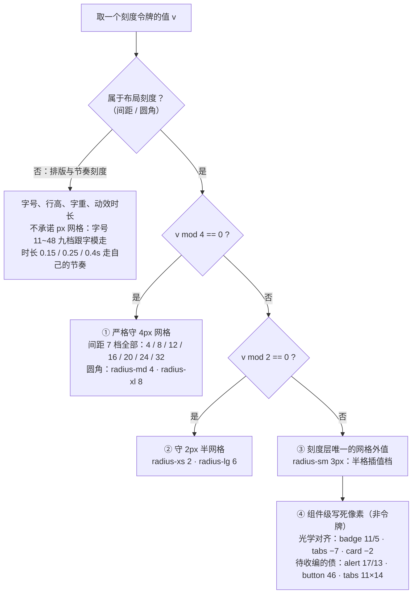
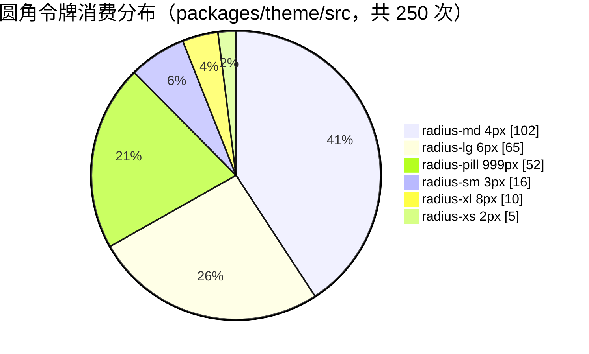
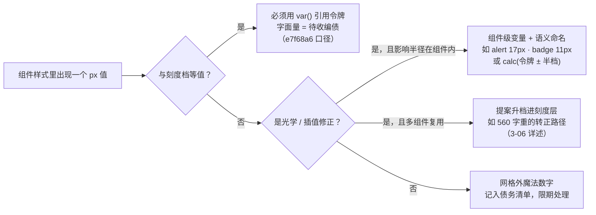

# 3-05 · 间距与圆角：4px 网格的边界

> 本篇回答一个听起来很"数学"的问题：**刻度层的 45 个令牌里，哪些严格落在 4px 网格上，哪些"越界"了，为什么越界反而可能是对的？** 我们不背设计规范，直接对 `tokens.css` 的刻度层逐行判定网格归属，用 `rg` 数出圆角与间距令牌在组件样式里的真实消费分布，再把组件里写死的非令牌像素（alert 的 17px、badge 的 11px、tabs 的 -7px、button 的 46px）一个一个揪出来考据——每个数字都给出 `路径:行号`，每个越界值都给出去留判断。

---

## 一、口径先行：45 个刻度令牌从哪数出来

3-01 篇我们数过，`packages/xiaoye-primitives/src/theme/tokens.css`（当前工作区 `wc -l` 口径 409 行）的亮色块 L186-254 是刻度层的完整地盘。先把这 69 行原文完整读一遍，本篇所有讨论都发生在这段代码里：

```css
  /* ==================================================================
   * 3. 刻度层
   * ================================================================== */

  /* 字体族 */
  --xy-font-family-base:
    -apple-system, BlinkMacSystemFont, "Segoe UI", "SF Pro Text",
    "Helvetica Neue", "PingFang SC", "Hiragino Sans GB", "Microsoft YaHei",
    "Source Han Sans SC", Arial, sans-serif;
  --xy-font-family-code:
    "SF Mono", "Source Code Pro", SFMono-Regular, Menlo, Consolas,
    "Liberation Mono", monospace;

  /* 字号：九档无坍缩（Stripe UI 刻度） */
  --xy-font-size-2xs: 11px;
  --xy-font-size-xs: 12px;
  --xy-font-size-sm: 13px;
  --xy-font-size-md: 14px;
  --xy-font-size-lg: 16px;
  --xy-font-size-xl: 20px;
  --xy-font-size-2xl: 26px;
  --xy-font-size-3xl: 32px;
  --xy-font-size-4xl: 48px;

  /* 字重：Stripe 双轨制 —— 展示 300 / 控件 400；数值档直读命名，与主题无关 */
  --xy-font-weight-light: 300;
  --xy-font-weight-regular: 400;
  --xy-font-weight-medium: 500;
  --xy-font-weight-semibold: 600;
  --xy-font-weight-bold: 700;
  --xy-font-weight-460: 460;
  --xy-font-weight-520: 520;
  --xy-font-weight-550: 550;
  --xy-font-weight-560: 560;
  --xy-font-weight-620: 620;
  --xy-font-weight-650: 650;
  --xy-font-weight-680: 680;

  /* 行高 */
  --xy-line-height-tight: 1.2;
  --xy-line-height: 1.5;

  /* 圆角：Stripe 刻度 2 / 3 / 4(标准主力) / 6(大交互) / 8(重点) */
  --xy-radius-xs: 2px;
  --xy-radius-sm: 3px;
  --xy-radius-md: 4px;
  --xy-radius-lg: 6px;
  --xy-radius-xl: 8px;
  --xy-radius-pill: 999px;

  /* 间距：8px 基准网格 */
  --xy-space-1: 4px;
  --xy-space-2: 8px;
  --xy-space-3: 12px;
  --xy-space-4: 16px;
  --xy-space-5: 20px;
  --xy-space-6: 24px;
  --xy-space-7: 32px;

  /* 动效 */
  --xy-transition-duration-fast: 0.15s;
  --xy-transition-duration-normal: 0.25s;
  --xy-transition-duration-slow: 0.4s;
  --xy-transition-timing: cubic-bezier(0.4, 0, 0.2, 1);
  --xy-transition-timing-in: cubic-bezier(0.4, 0, 1, 1);
  --xy-transition-timing-out: cubic-bezier(0, 0, 0.2, 1);

  /* color-mix 提亮基色（暗色下切到暗底实现"减淡"） */
  --xy-mix-light: #ffffff;
```

（以上为 `tokens.css` L186-254 的原文摘录，注释与值一字未改。）

数一下：字体族 2 + 字号 9 + 字重 12 + 行高 2 + 圆角 6 + 间距 7 + 动效 6（3 个时长加 3 条缓动曲线）+ mix-light 1，**合计 45 个**——这就是本篇标题里"45 个刻度令牌"的口径。有两个细节值得先钉住：

第一，刻度层不参与主题切换。暗色覆写块（L262-347）里没有任何一个刻度令牌，L346 的注释把这层协议写破了音："圆角、间距、字号、行高、字重、z-index —— 与主题无关，继承 :root"。间距与圆角是纯粹的几何量，亮暗两套皮肤共用同一副骨架。

第二，字重段的 12 档里有 7 个数值档（460/520/550/560/620/650/680），这部分是**当前工作区未提交的扩档改动**：已提交的 HEAD 版本（`git show HEAD:...` 可复核）只有 light/regular/medium/semibold 四个命名档，数值档是 2026-09-16 Stripe 重构（commit `7645d5c`）之后陆续从组件实测中沉淀出来的。560 一档尤其特殊——它在组件样式里有 11 处消费，其中 `button.css:18` 就是源头之一。这段"从 8 档打到 12 档"的战争是下一篇 3-06 的主角，本篇不展开，我们只聚焦几何量：**间距与圆角**。

## 二、网格判定：一条决策流，三种归宿

"4px 网格"是设计系统圈的通用语：所有布局尺寸取 4 的倍数，视觉节奏整齐，Subpixel 渲染不糊。但把 45 个令牌逐个拿 `mod 4` 去套，会发现"守网格"根本不是一个二值问题。判定流程如下图：



按这条流程把布局刻度的 13 个令牌（间距 7 + 圆角 6）逐一判定：

| 令牌 | 值 | 网格归属 | 备注 |
|---|---|---|---|
| `--xy-space-1` 到 `--xy-space-7` | 4/8/12/16/20/24/32px | ① 严格 4px | 七档全部命中，无一例外 |
| `--xy-radius-md` | 4px | ① 严格 4px | 全库消费最高的圆角档 |
| `--xy-radius-xl` | 8px | ① 严格 4px | dialog 等重点浮层专用 |
| `--xy-radius-xs` | 2px | ② 2px 半网格 | 4px 的一半 |
| `--xy-radius-lg` | 6px | ② 2px 半网格 | 卡片、大交互面 |
| `--xy-radius-pill` | 999px | 特殊档 | 胶囊语义，与网格无关 |
| `--xy-radius-sm` | **3px** | **③ 网格外** | 刻度层唯一不落 2px 网格的几何值 |

先解释②为什么合法。半档的存在不是妥协，是刻度密度问题：如果只有 4px 网格，2px 的 xs 圆角和 6px 的 lg 圆角都必须被砍掉，小开关、小标签这类高度只有 14~20px 的控件会失去圆润的过渡空间。4px 主格、2px 半格的双层刻度是业界成熟做法，Stripe 蓝本自己也这么干。

再解释③。`radius-sm: 3px` 是全场最值得盯着看的数字：它不落 4px 网格，连 2px 半网格都不落。为什么留着它？一类理由来自**几何边界**：CSS 圆角半径一旦超过所在边高度的一半，浏览器会按比例收缩各角导致形变——刻度里保留一个 2 与 4 之间的值，高度只有几像素的最小组件才有"既圆润又不触顶"的可选项。另一类理由来自**视觉层级**：3px 比按钮的标准档 4px 再收半档，正好给导航标签、菜单项这类"次级交互面"一个专用台阶——第六节的 `tabs.css:94` 会看到它的实际落点，第三节的消费分布也会证实这个画像。网格是给"排版的人"用的思维工具，不是给"渲染引擎"用的物理定律；当两者冲突时，这套刻度选择了视觉，然后在注释里诚实地记下理由（L228："Stripe 刻度 2 / 3 / 4(标准主力) / 6(大交互) / 8(重点)"——3 就写在蓝本里）。

而右侧第④类是本篇后五章的主线：组件样式里那些**不以令牌形式存在**的像素。它们分两种颜色——一种带着光学理由越界，越得有理；一种是历史写死值，该收编而未收编。我们把代表一个一个请出来。

## 三、圆角六档：250 次消费的分布实测

谈分布必须先钉死口径：本篇所有统计都在当前工作区执行，**只统计 `packages/theme/src`（组件真身样式）**，不含 docs 示例与 playground；`rg -o` 把每一处 `var(...)` 引用各计一次，同一行声明里出现两次就计两次。另有一条全文适用的标注约定：下文代码块内 `/* 汉字 */` 形式的行内注是本文评注，其余内容均为源码原文。命令与原样输出如下：

```bash
$ rg -o 'var\(--xy-radius-[^)]+\)' packages/theme/src --no-filename | sort | uniq -c | sort -rn
 102 var(--xy-radius-md)
  65 var(--xy-radius-lg)
  52 var(--xy-radius-pill)
  16 var(--xy-radius-sm)
  10 var(--xy-radius-xl)
   5 var(--xy-radius-xs)
```

六档合计 **250 次**消费。占比画成图：



这张分布图信息量不小，逐档解读：

**radius-md（4px）以 102 次、40.8% 的占比是绝对主力**。输入框、按钮、下拉框、select 触发器、alert 容器——凡是"中等尺寸交互面"都落在这档。它的消费端写法很标准，看 `button.css:7` 与 `alert.css:3`（后者做了二次封装，组件级变量默认指向全局档，这是 3-06 之后的定制纵深话题）：

```css
/* packages/theme/src/components/button.css L1-21（节选圆角与间距消费） */
.xy-button {
  display: inline-flex;
  align-items: center;
  justify-content: center;
  gap: var(--xy-space-2);            /* 8px：图标与文字的间距走令牌 */
  border: 1px solid transparent;
  border-radius: var(--xy-radius-md); /* 4px：标准主力档 */
  background: color-mix(in srgb, var(--xy-bg-floating) 98%, var(--xy-bg-subtle));
  color: var(--xy-text-primary);
  cursor: pointer;
  transition:
    background-color var(--xy-transition-duration-fast) var(--xy-transition-timing),
    border-color var(--xy-transition-duration-fast) var(--xy-transition-timing),
    transform var(--xy-transition-duration-fast) var(--xy-transition-timing),
    box-shadow var(--xy-transition-duration-fast) var(--xy-transition-timing);
  white-space: nowrap;
  position: relative;
  font-weight: var(--xy-font-weight-560);
  user-select: none;
  text-decoration: none;
}
```

**radius-lg（6px）65 次排第二**，典型消费方是卡片这类"大而静"的表面。`card.css:7`：

```css
/* packages/theme/src/components/card.css L1-29（圆角消费 + 三档内边距） */
.xy-card {
  --xy-card-padding: 20px;
  display: flex;
  flex-direction: column;
  overflow: hidden;
  border: 1px solid color-mix(in srgb, var(--xy-border-subtle) 92%, var(--xy-border));
  border-radius: var(--xy-radius-lg);  /* 6px：大交互面档 */
  background: color-mix(in srgb, var(--xy-bg-floating) 99%, var(--xy-bg-subtle));
  box-shadow:
    0 0 0 1px color-mix(in srgb, var(--xy-bg-floating) 8%, transparent),
    0 1px 4px color-mix(in srgb, var(--xy-text-heading) 4%, transparent);
  color: var(--xy-text-primary);
  transition:
    box-shadow var(--xy-transition-duration-fast) var(--xy-transition-timing),
    border-color var(--xy-transition-duration-fast) var(--xy-transition-timing),
    transform var(--xy-transition-duration-fast) var(--xy-transition-timing);
}

.xy-card--sm {
  --xy-card-padding: 16px;
}

.xy-card--md {
  --xy-card-padding: 20px;
}

.xy-card--lg {
  --xy-card-padding: 24px;
}
```

注意一个刺眼的事实：`--xy-card-padding` 的三个值 16/20/24 与 `--xy-space-4/5/6` 逐字相等，却是**字面量而非 `var()` 引用**。为什么？这个问题先按下，第七节揭晓。

**radius-xl（8px）只有 10 次**，但每一处都是"重点浮层"——dialog 面板是标准样本，`dialog.css:74`：

```css
/* packages/theme/src/components/dialog.css L35-95（节选：面板圆角与分区 padding） */
.xy-dialog__panel {
  --xy-dialog-header-padding-y: 10px;
  --xy-dialog-header-padding-x: 16px;
  --xy-dialog-body-padding-y: 10px;
  --xy-dialog-body-padding-x: 16px;
  --xy-dialog-footer-padding-y: 10px;
  --xy-dialog-footer-padding-x: 16px;
  --xy-dialog-panel-shadow:
    0 0 0 1px color-mix(in srgb, var(--xy-bg-floating) 6%, transparent),
    0 12px 32px color-mix(in srgb, var(--xy-text-heading) 7%, transparent);
  position: relative;
  z-index: 1;
  display: flex;
  flex-direction: column;
  pointer-events: auto;
  width: min(100%, 50%);
  min-width: min(320px, calc(100vw - 32px));
  max-width: calc(100vw - 32px);
  border: 1px solid var(--xy-dialog-panel-border);
  border-radius: var(--xy-radius-xl);   /* 8px：重点浮层档 */
  background: var(--xy-dialog-panel-bg);
  box-shadow: var(--xy-dialog-panel-shadow);
  overflow: hidden;
  outline: none;
}

.xy-dialog__panel.is-fullscreen {
  width: 100%;
  min-width: 100%;
  max-width: none;
  min-height: 100%;
  border-radius: 0;                     /* 全屏时圆角归零 */
}
```

同文件的 pill 消费在关闭按钮上（`dialog.css:188`）：32px 见方的圆形热区用 `border-radius: var(--xy-radius-pill)` 铸出，8px 的面板圆角与 999px 的按钮圆角在同一浮层里各司其职：

```css
/* packages/theme/src/components/dialog.css L180-195 */
.xy-dialog__close {
  display: inline-flex;
  align-items: center;
  justify-content: center;
  width: 32px;
  height: 32px;
  margin-left: auto;
  border: 0;
  border-radius: var(--xy-radius-pill);
  background: transparent;
  color: var(--xy-text-secondary);
  cursor: pointer;
  transition:
    background-color var(--xy-transition-duration-fast) var(--xy-transition-timing),
    color var(--xy-transition-duration-fast) var(--xy-transition-timing);
}
```

圆角的"海拔语义"在这里非常清楚：按钮 4px → 卡片 6px → 弹窗 8px，**圆角半径随层级抬升而放大**，这与阴影五级（`--xy-shadow-0` 到 `--xy-shadow-4`）的语义梯度是同构的。用户未必说得出规律，但眼睛能感受到"越浮的东西越圆润"。

**radius-pill（999px）52 次值得单独说**。胶囊圆角为什么写 999px 而不是 9999px 或 50%？写 `50%` 在宽高不等时会变成椭圆；写"高度的一半"（如 20px）则在高度变化时失圆。999px 是一个超过任何真实控件高度的数，浏览器会自动把它钳制到合法的最大半圆——这是 CSS 圆角的"溢出即钳制"特性送给设计系统的免费午餐。对照组是 Element Plus（以 2.x 为参照）：它的 `--el-border-radius-round: 20px` 绑定的是"默认组件高度 32px 的一半再凑整"，于是在自定义 `--el-component-size` 放大组件时，round 按钮会露出肉眼可见的直角段。xy 的 999px 是对这个问题的一次性根治。此外 `--xy-radius-xs`（2px）的 5 次消费落在 tag、pagination 页码项、input-tag、breadcrumb 这类小型内容件上；`--xy-radius-sm`（3px）的 16 次则铺在"次级交互面"——rate 评分星、menu 菜单项、link、skeleton 骨架块、tabs 标签、slider、pro-table 单元格容器，它是圆角海拔梯度里 4px 之下的那个台阶，而非只服务迷你控件。

radius-sm 的消费里还藏着一层更高级的用法：**圆角算术**。有 4 处消费不直接引档，而是用 `calc()` 把档位相加——loading.css:67、tabs.css:252、empty.css:39 的 `border-radius: calc(var(--xy-radius-lg) + var(--xy-radius-sm))`（6+3=9px，卡片型大变体），alert.css:281 的 `calc(var(--xy-alert-border-radius) + var(--xy-radius-sm))`（4+3=7px，banner 变体）。9px 和 7px 都不在刻度上，但系统没有为此增设新档，而是**以档位为基做加法合成**——这与 card 的 `calc(padding - 2px)` 是同一哲学的圆角版：档位保持稀疏，档间值通过显式合成获得，且合成关系随基础档联动。顺带一提 notification.css:4 还有第三种写法 `--xy-notification-radius: calc(var(--xy-radius-lg) + 2px)`，用 2px 字面增量把 lg 推到 8px——三种合成口径并存，恰好是这套系统"表达自由度"的边界样本。

## 四、间距七档：55 次消费，与零消费的 space-7

同口径统计间距：

```bash
$ rg -o 'var\(--xy-space-[0-9]+\)' packages/theme/src --no-filename | sort | uniq -c | sort -rn
  18 var(--xy-space-4)
  17 var(--xy-space-3)
  14 var(--xy-space-2)
   3 var(--xy-space-1)
   2 var(--xy-space-5)
   1 var(--xy-space-6)
```

七档合计 **55 次**。和圆角的 250 次一比，第一个反差就跳出来了：**间距令牌的 `var()` 直连消费远比圆角少**。原因不是组件不用间距，而是组件的间距大多走了另一条路——组件级变量（`--xy-alert-padding: 10px 16px`）或字面量。消费分布本身也有结构：

| 档位 | 值 | 次数 | 典型场景 |
|---|---|---|---|
| `--xy-space-4` | 16px | 18 | 控件内边距、图标与文字间距 |
| `--xy-space-3` | 12px | 17 | 紧凑布局的块间距 |
| `--xy-space-2` | 8px | 14 | 按钮内 gap、小间隙 |
| `--xy-space-1` | 4px | 3 | 微调级间隙 |
| `--xy-space-5` | 20px | 2 | 卡片类 padding |
| `--xy-space-6` | 24px | 1 | 大卡 padding |
| `--xy-space-7` | 32px | **0** | 组件层零消费 |

**space-7（32px）在组件样式里零消费**——这是分布表里最有意思的一格。要不要删掉它？仓库的选择是留着。理由是一条设计系统工程的经典权衡：刻度层的价值不只在于"被组件消费"，还在于**给二次开发者一个受控的取值空间**。业务方在 layout 里写 `padding: var(--xy-space-7)` 是合法且被鼓励的；如果因为组件层暂时不用就砍档，用户自己定义的 32px 间距就会退化成魔法数字。一个刻度档位的成本是 constants 表里的一行，收益是封死一整类"随手写 30px"的漂移——这笔账划算。零消费不等于零价值，这是"严格网格 vs 消费驱动"的第一处取舍。

同时也要诚实：55 次 `var()` 直连只是间距治理的冰山一角。用宽口径扫一遍 `rg -o ': [^;]*[0-9]+px' packages/theme/src | wc -l` 会得到 1648 这个数——当然这 1648 处是所有含 px 的声明值（width/height/定位/描边全算），不能都算"间距语义的漏网"，但它足以说明：**组件层的几何像素大部分不以 `var(--xy-space-*)` 形式流动**。这些写死值里哪些是合理的，哪些是债，正是接下来三节考据的对象。

## 五、越界考据（一）：alert 的 17px——字号层的"层级插值"

第一个出场的是组件样式里最出名的一个网格外值——`alert.css` 的 17px。先看现场，`packages/theme/src/components/alert.css` L213-226（lg 变体）：

```css
/* packages/theme/src/components/alert.css L213-226 */
.xy-alert--lg {
  --xy-alert-padding: 14px 20px;
  --xy-alert-gap: 14px;
  --xy-alert-content-gap: 6px;
  --xy-alert-actions-gap: 14px;
  --xy-alert-title-font-size: var(--xy-font-size-lg);
  --xy-alert-title-with-description-font-size: 17px;
  --xy-alert-description-font-size: var(--xy-font-size-md);
  --xy-alert-icon-size: 18px;
  --xy-alert-icon-large-size: 32px;
  --xy-alert-close-font-size: var(--xy-font-size-lg);
  --xy-alert-close-customed-font-size: var(--xy-font-size-md);
  --xy-alert-toggle-font-size: 13px;
}
```

17px 藏在 `--xy-alert-title-with-description-font-size` 里：**标题与描述同屏时**，lg 变体的标题从 16px 提到 17px。为什么不直接用 `--xy-font-size-lg`（16px）？把同一屏的两个字号排出来就明白了：lg 变体的描述是 14px（`--xy-font-size-md`），标题若也是 16px，两个字号的绝对差只有 2px，在 alert 这种单行高度敏感的组件里，层级差会被行距稀释得几乎不可辨；17px 把差值拉到 3px，恰好跨过"人眼稳定区分两级文字"的经验阈值。这是**字号层的半档插值**——和圆角的 3px 一个逻辑：网格服务于排版，当排版的可读性需要 17px，网格让路。

有理，但注意它**越界的方式**：17px 没有成为刻度档，而是以组件级变量的字面量存在。这是刻意的设计——17px 只在"alert 标题+描述"这一个场景成立，把它提升为全局档位（比如 `--xy-font-size-17`）会污染九档字号刻度的语义；留在组件变量里，越界的影响半径就被锁死在 alert 内部。越界不可怕，**没有边界的越界才可怕**。

同一块代码里还埋着一处更隐蔽的问题。对照 md 默认档的变量头（L1-14）：

```css
/* packages/theme/src/components/alert.css L1-14（默认档变量头） */
.xy-alert {
  --xy-alert-padding: 10px 16px;
  --xy-alert-border-radius: var(--xy-radius-md);
  --xy-alert-gap: 12px;
  --xy-alert-content-gap: 4px;
  --xy-alert-actions-gap: 12px;
  --xy-alert-title-font-size: var(--xy-font-size-md);
  --xy-alert-title-with-description-font-size: var(--xy-font-size-lg);
  --xy-alert-description-font-size: 13px;
  --xy-alert-icon-size: 16px;
  --xy-alert-icon-large-size: 28px;
  --xy-alert-close-font-size: var(--xy-font-size-md);
  --xy-alert-close-customed-font-size: 13px;
  --xy-alert-toggle-font-size: var(--xy-font-size-sm);
```

L9 的 `--xy-alert-description-font-size: 13px` 是字面量，而 sm 变体 L205 的同一个变量写的是 `var(--xy-font-size-sm)`——后者恰好也是 13px（L202：`--xy-font-size-sm: 13px`）。**同一个值，一处绑令牌、一处写字面量**。这不是设计，是时间差留下的疤：2026-09-14 的 px 收口提交（第八节详述）执行时，刻度层还没有 13px 这一档，13px 属于"非标值保留字面"；两天后 Stripe 重构把 13px 收进字号九档（`--xy-font-size-sm`），sm 变体随后绑定了新档，md 默认档的这两处（L9 与 L13 的 close-customed 13px）却没人回头改。值暂时一致所以零视觉风险，但语义上它们已经是**该升级为令牌的债**——下次有人调 `--xy-font-size-sm`，alert 的描述字号不会跟着动，两处 13px 会静默分叉。

## 六、越界考据（二）：badge 的 11px、tabs 的 -7px——光学对齐

第二类越界有更硬的理由：**光学对齐**。几何上正确的值，视网膜上未必正确，因为人眼对"视觉重心"的敏感度高于对"数学对称"的敏感度。

先看 badge。徽标本体先立住尺寸基准，悬浮偏移叠在其上，`badge.css` L8-51：

```css
/* packages/theme/src/components/badge.css L8-51 */
.xy-badge__content {
  --xy-badge-bg: var(--xy-danger-soft);
  --xy-badge-color: var(--xy-danger);
  --xy-badge-border: color-mix(in srgb, var(--xy-danger) 10%, var(--xy-border-subtle));
  display: inline-flex;
  align-items: center;
  justify-content: center;
  min-width: 20px;
  height: 20px;
  padding: 0 6px;
  border: 1px solid var(--xy-badge-border);
  border-radius: var(--xy-radius-pill);
  background: var(--xy-badge-bg);
  color: var(--xy-badge-color);
  font-size: var(--xy-font-size-xs);
  font-weight: var(--xy-font-weight-semibold);
  line-height: 1;
  white-space: nowrap;
  box-sizing: border-box;
  box-shadow: inset 0 0 0 1px color-mix(in srgb, var(--xy-badge-color) 1%, transparent);
}

.xy-badge__content.is-fixed {
  position: absolute;
  top: 0;
  right: 11px;
  transform: translateY(-50%) translateX(100%);
  z-index: var(--xy-z-normal, 1);
}

.xy-badge__content.is-dot {
  width: 8px;
  min-width: 8px;
  height: 8px;
  padding: 0;
  border-radius: 50%;
  border-color: color-mix(in srgb, var(--xy-bg-raised) 96%, transparent);
  background: var(--xy-badge-color);
  box-shadow: none;
}

.xy-badge__content.is-fixed.is-dot {
  right: 5px;
}
```

本体一行也有网格外的身影：`padding: 0 6px`（L17）的 6px 是 space-1（4px）与 space-2（8px）之间的半档——数字两位数以内的徽标，左右 6px 是"不挤也不空"的插值；`line-height: 1` 则干脆绕开行高刻度，用 20px 固定高兜住单行垂直居中。

普通徽标悬浮时 `right: 11px`，缩成小红点时 `right: 5px`。11 和 5，两个都不在 2px 半网格上（11 是奇数，5 也是）。但这两个数字不能网格化：徽标锚在父元素右上角，视觉诉求是"压住角、但不遮内容、且圆心大致对准父元素的圆角弧心"。父元素圆角可能是 4px 也可能是 6px，徽标自身还有 1px 描边和 `translateY(-50%)` 的半高上移，**最终落点是多个几何量复合后的视觉残差**——11px 和 5px 就是那个"看起来正"的残差解。把它们改成 12px/4px 或许在数学上更整，但角上的徽标会肉眼可见地"飘"。这类值的原则是：**网格管布局，眼睛管贴角**。

tabs 的指示条是同族案例，连同 tab 项本体一起看，`tabs.css` L84-101 与 L124-147：

```css
/* packages/theme/src/components/tabs.css L84-101 */
.xy-tabs__tab {
  border: 0;
  position: relative;
  z-index: 1;
  display: inline-flex;
  align-items: center;
  gap: 6px;
  background: transparent;
  color: var(--xy-text-secondary);
  padding: 11px 14px;
  border-radius: var(--xy-radius-sm);
  cursor: pointer;
  font-weight: var(--xy-font-weight-560);
  transition:
    color var(--xy-transition-duration-fast) var(--xy-transition-timing),
    background-color var(--xy-transition-duration-fast) var(--xy-transition-timing),
    box-shadow var(--xy-transition-duration-fast) var(--xy-transition-timing);
}

/* packages/theme/src/components/tabs.css L124-147 */
.xy-tabs__tab.is-closable {
  padding-right: 12px;
}

.xy-tabs__active-bar {
  position: absolute;
  z-index: 2;
  left: 0;
  bottom: -7px;
  width: 0;
  height: 3px;
  border-radius: var(--xy-radius-pill);
  background: var(--xy-brand);
  pointer-events: none;
  transition:
    width var(--xy-transition-duration-fast) var(--xy-transition-timing),
    height var(--xy-transition-duration-fast) var(--xy-transition-timing),
    transform var(--xy-transition-duration-fast) var(--xy-transition-timing);
}

.xy-tabs__nav.is-vertical .xy-tabs__active-bar {
  width: 2px;
  height: 0;
}
```

tab 本体先给了一个意外收获：L94 落的正是 `radius-sm`（3px）——第三节 pie 图里 radius-sm 16 次消费的代表性成员。tab 不是被高度逼进 3px 的（它的 padding 上下 11px，高度余量充足），而是语义使然：按钮 4px、卡片 6px、弹窗 8px，导航标签作为"次级交互面"取 3px，比按钮收半档、比开关轨道柔一档。

`bottom: -7px` 的 -7 是怎么来的：标签栏底部有 1px 分隔线，指示条（3px 高）要**骑在线上**——既盖住线、又探出一点，视觉上才是"这页被点亮"。若指在线上方（-3px）像悬浮贴片，全压线上（-4px，正好 3px 条 + 1px 线的重合起点）则显得被切割；-7px 让指示条跨过线并向下探 3px，形成"穿透"的锚定感。3px 本身也是半档值（介于 2 与 4 之间）：指示条太细没存在感，4px 在密集标签间显得笨。-7px、3px、加上竖排变体的 2px（L145），三个网格外值共同服务一个光学目标。

顺带一提，tab 项本体（L84-101）也是一个网格外的聚集地：`padding: 11px 14px`（L93）两个维度都在网格外——这是让标签行视觉重心落正的微调，不是高度约束下的将就；`gap: 6px` 同样是 4 与 8 之间的半档插值。整行声明里"格子化"的只有圆角令牌与 560 字重，几何量几乎全员微调。而竖排变体（L315-323）还有一处更精的写法：`font-size: calc(var(--xy-font-size-md) - 1px)`——竖排标签要从 14px 降到 13px，它没有写字面量，而是以令牌为基做 -1px 推导，刻度档调整时竖排字号自动跟随。这与 card 的 `calc(... - 2px)` 是同一哲学：**插值可以，但必须挂在令牌上**。密集排布的小型导航件本来就是光学修正的重灾区，这段文件是全库网格外值密度最高的现场。

第三个光学案例更优雅，因为它**以令牌系统的合法语法**完成了越界。`card.css:55`：

```css
/* packages/theme/src/components/card.css L53-58 */
.xy-card__header,
.xy-card__footer {
  padding: calc(var(--xy-card-padding) - 2px) var(--xy-card-padding);
  box-sizing: border-box;
  background: color-mix(in srgb, var(--xy-bg-subtle) 80%, var(--xy-bg-floating));
}
```

卡片头尾的垂直内边距比主体少 2px——因为头尾带着 1px 的 inset 分隔线和浅色底，视觉重量偏重，等量 padding 会显得"上下更胖"。`calc(var(--xy-card-padding) - 2px)` 的妙处在于：它没有绕开令牌另起炉灶，而是**以令牌为基、用半档修正量做偏移**。将来把 `--xy-card-padding` 从 20px 调到 24px，头尾自动跟到 22px，修正关系不散。同样性质的还有 `button.css:24` 的 hover 位移 `transform: translateY(-1px)`——1px 的上浮是按钮"虚触感"的光学补偿，谁也不会为它发明一个 `--xy-space-0-25`。**光学修正的量纲天然就是 1~2px 的微差，正确的姿势是让它们显式地以"对令牌的修正"存在（calc），或者以注释背书的局部常量存在，而不是伪装成独立档位。**

## 七、越界考据（三）：button 的 46px 与字面量 padding——历史债现场

第三类越界没有光学理由撑腰，是纯粹的存量债。回到 `button.css` 的尺寸三档，L43-59：

```css
/* packages/theme/src/components/button.css L43-59 */
.xy-button--sm {
  min-height: 32px;
  padding: 0 12px;
  font-size: var(--xy-font-size-sm);
}

.xy-button--md {
  min-height: 40px;
  padding: 0 16px;
  font-size: var(--xy-font-size-md);
}

.xy-button--lg {
  min-height: 46px;
  padding: 0 20px;
  font-size: var(--xy-font-size-lg);
}
```

三个疑点，逐个过堂：

**其一，`min-height: 46px` 是网格外值。** sm 32、md 40 都严格落 4px 网格，lg 按网格应是 44 或 48。46 的来历不难猜：lg 档配 16px 字号（`--xy-font-size-lg`），行高 1.5 时文字盒 24px，加上上下呼吸空间，44px 时按钮开始显得"紧"，48px 又与 dialog 的控制按钮高度梯度脱节——46px 是两头的折中。这属于**刻度档之间的插值残留**：它有视觉理由，但理由没有落在注释里，也没有沉淀为档位，下一个维护者只能重新猜。对比上一节的 card：同样是 -2px 修正，`calc(... - 2px)` 把"修正关系"写成了代码，而 46px 只把"修正结果"写成了数字。债与不债的区别不在值本身，在**关系有没有被表达**。

**其二，padding 0 12px / 0 16px / 0 20px 与 `--xy-space-3/4/5` 逐字相等，却不引用。** 为什么要按字面量写？技术上没有任何障碍——`padding: 0 var(--xy-space-3)` 完全合法。真实原因要回到第八节的时间线：px 收口是**机械的等值替换**，替换器的正则只敢处理"值里只有单一 px 数"的声明；`padding: 0 12px` 这种 shorthand 混合了无单位 0 与 px 值，脚本保守跳过。同样的保守也发生在 `dialog.css:53-58`——header/body/footer 的 `10px 16px` 里，16px 有档可依，10px 没有，整体留下字面。**机械替换的边界就是 shorthand 复合值**，这是自动化收编的天然软肋。

**其三，dialog 的 10px 是"半档间距缺位"的症状。** `--xy-dialog-header-padding-y: 10px`（dialog.css:53）这个值在语义上是 space-2（8px）与 space-3（12px）之间的插值。密度较高的浮层分区里，8px 偏松、12px 偏空，10px 是真实的视觉需求——但刻度层没有 `--xy-space-2-5` 这一档，于是它以组件级变量字面量的形态存在。这暴露了七档间距的一个结构性事实：**4px 步进在 8~12px 区间显得太粗**，紧凑型组件的"半档需求"客观存在。仓库目前的解法是允许组件级变量持有插值（alert 的 `--xy-alert-content-gap: 3px`、dialog 的 10px 都属此类），而不是扩刻度——档位系统保持稀疏，插值下沉到组件。这个选择是否正确，取决于你更怕"档位爆炸"还是更怕"组件各自为政"，本篇不给结论，第八节的收编史会提供判断材料。

## 八、收编还是放任：e7f68a6 的 59 处机械替换

写死值的治理不是纸面话题，这个仓库真刀真枪干过一轮。2026-09-14 的提交 `e7f68a6`（feat(visual): 视觉回归门禁与 px token 化收口）提交说明里有一段精确的账本：

> theme CSS px 硬编码机械替换为等值 token（26 文件 59 处）：圆角 2/4/6/999px、字号 12/14/16px、间距 4/8/12/16/20/24/32px；组件局部字号变量绑定到全局刻度。双主题像素对比 1064 张截图零差异，验证替换零视觉回归。审计报告标注：px 非标刻度值（11/13/15/18/24px 等）保留字面值，待刻度扩充设计决策。

这段话就是"收编 vs 放任"的完整方法论，拆成四条原则：

1. **等值替换**：只把"值与既有令牌完全相等"的字面量换成 `var()`，绝不顺手"修正"成临近档——11px 不会被换成 12px。零视觉回归是硬约束，1064 张双主题截图的像素 diff 是验证手段（工具链即 `pnpm audit:visual`，基线差异超 0.5% 即失败）。
2. **白名单收编**：收编范围是收口时点已有档位的值——圆角 2/4/6/999、字号 12/14/16、间距 4~32。不在档的值（11/13/15/18px）明确"保留字面，待刻度扩充设计决策"，把决策显式挂起而不是隐式遗忘。
3. **保守跳过**：shorthand 复合值不动（第七节的 `padding: 0 12px` 幸存至今就是这个原因）。
4. **留痕**：哪些收了、哪些没收、为什么，全写进提交说明。两天后的 Stripe 重构（`7645d5c`，2026-09-16）把 11/13 收进字号九档、补齐刻度层命名——"待设计决策"的挂起项被后续决策兑现，第五节 alert 里"一处绑档一处字面"的时间差疤痕也就此埋下。

这套方法论的高明处在于承认收编是有成本的：每一处替换都是一次潜在的视觉回归，**用机械替换 + 像素级验证把成本压到近零，而不是靠人眼 review 逐一确认**。而它的边界也同样诚实：非标值不硬收、复合值不硬碰。对照另一种极端——放任所有组件 px 写死——代价是主题定制无法穿透（用户改 `--xy-space-3` 却发现按钮 padding 纹丝不动），以及暗色双主题下微妙的尺寸漂移无从追溯。收编与放任之间这条线，e7f68a6 用"等值 + 白名单 + 截图门禁"三个词划清了。

## 九、总账：本篇的三笔设计权衡

把三节越界考据收拢成三笔账，这是本篇真正想留下的判断框架：

**第一笔：严格网格 vs 光学修正——网格是默认值，不是铁律。** 刻度层自己就有 3px 圆角这个网格外档（tokens.css:230），组件层的 badge 11/5px、tabs -7px、card -2px 各有光学理由。判定标准不是"是否在网格上"，而是"**偏离网格的理由能否被代码表达**"：card 用 `calc(var(--xy-card-padding) - 2px)` 表达了"随令牌联动的修正关系"，合格；alert 的 17px 用语义化的组件变量名（`--xy-alert-title-with-description-font-size`）表达了"仅此场景成立"，合格；button 的 46px 裸值无注释无关系表达，留为债。**光学越界要有名字，没有名字的越界才是真越界。**

**第二笔：写死值收编 vs 放任——用机器收编，给人留决策。** e7f68a6 证明了收编可以是机械的、可验证的、可回滚的；同时它对非标值与复合值的保守，证明收编不该是激进的。当下的存量债清单其实很短：alert.css L9/L13 的 13px（值已有档，等一次回补绑定）、button.css L45/51/57 的 shorthand padding（值已有档，等一次手工替换）、dialog.css L53-58 的 10px（值无档，等一次"是否增设半档间距"的设计决策）。**每一笔都标注了该等什么**——比"全部收编"或"全部不动"都更接近可执行。

**第三笔：半档的存在——稀疏档位 + 有界插值。** 圆角的 2px 半网格与 3px 插值档、间距的组件级 10px/3px 插值、甚至 radius-pill 的 999px 语义档，共同构成一个"主格稀疏、边缘有弹性"的刻度形态。弹性有三条合法通道：组件级变量持有插值（alert 的 17px、dialog 的 10px）、以令牌为基的 `calc()` 偏移（card 的 -2px、tabs 竖排的 -1px 字号）、档位相加的圆角算术（lg+sm=9px、banner 的 md+sm=7px）。它的反面教材是档位爆炸：如果给 7px、9px、10px、17px、46px 都设全局档，45 个令牌会膨胀到 60 个，每个档都要回答"与相邻档的区分度"——档位越密，选择成本越高，一致性反而越差。**刻度系统的边界感不在于把所有值都收进网格，而在于让每个网格外的值都付得起"被解释"的成本。**

最后用一张图收束全篇的判定路径，供日后审新代码时直接对照：



## 十、TS 镜像：scales.ts 为什么必须 45 个不多不少

刻度层在 CSS 之外还有一份 TS 镜像：`packages/tokens/src/scales.ts`，全文 50 行。摘录其骨架（按文件头注释，此文件由 `scripts/generate-tokens.mjs` 从 tokens.css 自动生成）：

```typescript
// 此文件由 scripts/generate-tokens.mjs 从 tokens.css 自动生成，不要手工编辑。

/** 刻度层令牌（与主题无关） */
export const scaleTokens = {
  "fontFamilyBase": "-apple-system, BlinkMacSystemFont, /* ... 九族字体串 */",
  "fontFamilyCode": "\"SF Mono\", \"Source Code Pro\", /* ... */",
  "fontSize2xs": "11px",
  "fontSizeXs": "12px",
  "fontSizeSm": "13px",
  "fontSizeMd": "14px",
  "fontSizeLg": "16px",
  "fontSizeXl": "20px",
  "fontSize2xl": "26px",
  "fontSize3xl": "32px",
  "fontSize4xl": "48px",
  "fontWeightLight": "300",
  "fontWeightRegular": "400",
  "fontWeightMedium": "500",
  "fontWeightSemibold": "600",
  "fontWeightBold": "700",
  "fontWeight460": "460",
  "fontWeight520": "520",
  "fontWeight550": "550",
  "fontWeight560": "560",
  "fontWeight620": "620",
  "fontWeight650": "650",
  "fontWeight680": "680",
  "lineHeightTight": "1.2",
  "lineHeight": "1.5",
  "radiusXs": "2px",
  "radiusSm": "3px",
  "radiusMd": "4px",
  "radiusLg": "6px",
  "radiusXl": "8px",
  "radiusPill": "999px",
  "space1": "4px",
  "space2": "8px",
  "space3": "12px",
  "space4": "16px",
  "space5": "20px",
  "space6": "24px",
  "space7": "32px",
  "transitionDurationFast": "0.15s",
  "transitionDurationNormal": "0.25s",
  "transitionDurationSlow": "0.4s",
  "transitionTiming": "cubic-bezier(0.4, 0, 0.2, 1)",
  "transitionTimingIn": "cubic-bezier(0.4, 0, 1, 1)",
  "transitionTimingOut": "cubic-bezier(0, 0, 0.2, 1)",
  "mixLight": "#ffffff",
} as const;
```

（L5-6 两行字体族串过长做了截断展示，键名与顺序为原样。）

对着数一遍：**scaleTokens 恰好 45 个键**，与 tokens.css 刻度层一一对应。这个等式不是巧合而是管线契约：CSS 是唯一事实源，TS 层是生成物（文件头第一行就写着"不要手工编辑"），生成脚本按刻度层的注释分节抓取变量。它的意义在于让 JS 侧（MCP Server、文档站的令牌文档、未来的运行时主题能力）能以类型安全的方式消费同一份刻度——`scaleTokens.radiusMd` 在 TS 里是字面量类型 `"4px"`，拼错档位名直接编译报错。刻度层"与主题无关"的协议在这里二次兑现：`scaleTokens` 里没有任何会被 `[data-theme="dark"]` 覆写的键。**45 = 45，就是"单一事实源 + 生成镜像"这条架构承诺的每次构建自检。**

## 十一、总账与预告

回到标题的问题：45 个刻度令牌里，谁守网格，谁越界？

- **间距 7 档全部严格落 4px 网格**，无一越界；消费上 space-4/3/2 承担了 89%（49/55）的直连引用，space-7 以零消费的"预防性档位"身份留驻。
- **圆角 6 档里 4 档守格**（2/4/6/8，其中 2 与 6 是合法的 2px 半档），**1 档刻意越界**（radius-sm 3px，几何边界与视觉层级双重理由的插值档），**1 档语义越界**（pill 999px，溢出钳制铸造的胶囊档）。
- **真正的越界发生在令牌之外**：组件层的 17px、11px、5px、-7px、46px、10px、13px……它们分三类——光学对齐（有名字的越界，合法）、刻度插值（待设计的半档需求）、历史写死（该收编的债，清单见第九节）。e7f68a6 已经示范了收编的正确姿势：等值、白名单、截图门禁。

间距与圆角的"战争"到此是平静的——几何量的分歧终归能用几像素的账算清。但刻度层里有一族令牌的扩档之战打得远比这激烈：字重。从 8 档到 12 档，每新增一个数值档都要回答"它与相邻档的灰度差能否被人眼分辨""在哪些字体回退链上会坍缩成同一渲染""560 这种实测值凭什么转正"——下一篇 **3-06《字重十二档：从 8 档到 12 档的扩档战争》**，我们把 `--xy-font-weight-560` 从 button.css 的一行实测样式到 tokens.css 正式档位的全过程拆开，看一个"组件私有的视觉直觉"如何走完升级为"系统档位"的完整流程。
