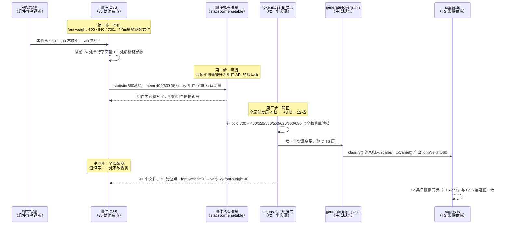
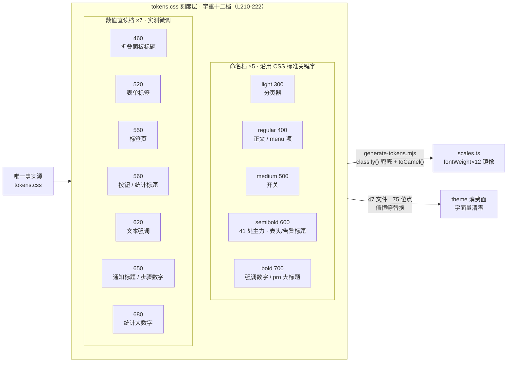

# 3-06 · 字重十二档：从 8 档到 12 档的扩档战争

> 本篇是「令牌体系」章节的收尾篇。核心问题只有一个：**一处组件实测出来的字重值，如何走完"写死 → 沉淀 → 转正 → 全库替换"四步，从某个 CSS 文件里的一行字面量，变成全库组件共享的设计资产？** 我们拿按钮上那个 `560` 当解剖标本，把 `tokens.css` 的字重段、TS 常量层的镜像、生成脚本的归类逻辑和 47 个组件样式文件的替换现场逐一翻出来看——所有数字都在写作时点重新核对过，行号可查（扩档改动已随提交 `f7f69d2` 于 2026-09-23 入库，下同）。

---

## 一、案发现场：按钮上的一个 560

打开 `packages/theme/src/components/button.css`，第 18 行躺着一个不太寻常的值：

```css
.xy-button {
  display: inline-flex;
  align-items: center;
  justify-content: center;
  gap: var(--xy-space-2);
  border: 1px solid transparent;
  border-radius: var(--xy-radius-md);
  background: color-mix(in srgb, var(--xy-bg-floating) 98%, var(--xy-bg-subtle));
  color: var(--xy-text-primary);
  cursor: pointer;
  transition:
    background-color var(--xy-transition-duration-fast) var(--xy-transition-timing),
    border-color var(--xy-transition-duration-fast) var(--xy-transition-timing),
    transform var(--xy-transition-duration-fast) var(--xy-transition-timing),
    box-shadow var(--xy-transition-duration-fast) var(--xy-transition-timing);
  white-space: nowrap;
  position: relative;
  font-weight: var(--xy-font-weight-560);
  user-select: none;
  text-decoration: none;
}

.xy-button:hover:not(:disabled):not(.is-disabled) {
  transform: translateY(-1px);
}

.xy-button:active:not(:disabled):not(.is-disabled) {
  transform: translateY(0);
}

.xy-button:focus-visible {
  outline: 2px solid color-mix(in srgb, var(--xy-brand) 58%, var(--xy-mix-light));
  outline-offset: 2px;
  box-shadow: 0 0 0 1px color-mix(in srgb, var(--xy-brand) 16%, transparent);
}

.xy-button:disabled,
.xy-button.is-disabled {
  cursor: not-allowed;
  opacity: 0.56;
}
```

顺带看一眼这个文件的消费纪律：整个 44 行的开场里，颜色走 `--xy-brand`/`--xy-bg-*`，尺寸走 `--xy-space-*`/`--xy-radius-*`，动效走 `--xy-transition-*`——L18 的字重是唯一不属于前三篇主角（颜色、圆角、动效）的刻度消费点。也就是说，按钮的"体重感"，完全由这一个变量决定；它指向哪一档，全库最常用的交互组件就多重。

`--xy-font-weight-560`。不是 `600`，不是 CSS 关键字 `bold`，也不是哪个听起来有意义的书面名——是一个光秃秃的数字。

这个 560 的身份有三重尴尬。第一，它不在 CSS 标准字重的百位档里：标准刻度是 100 到 900 的九档，560 卡在 500 和 600 中间的空档上，浏览器只能靠可变字体插值或者伪加粗去凑。第二，翻遍 git 历史，直到最近一次提交（`7645d5c feat: 设计令牌体系重构为 Stripe 设计语言`）为止，全局令牌层的字重段只有 4 档——300/400/500/600，没有 560 的位置。第三，它也没有任何书面名义：不叫 emphasis，不叫 strong，它在规范文档里查不到定义。

但按钮就是用它。而且不止按钮——统计数值标题、通知标题、步骤条、文本组件的强调态……全库有一批组件不约而同地落在了 500 和 600 之间的这些"半档"上。这不是某个人的怪癖，而是一个被反复验证的排版事实：**中文字重在 PingFang SC、微软雅黑这些字体族的渲染下，600 与 500 之间的视觉空档大得足以再塞进一整个层级**；界面里的"次级强调"（按钮文字、统计标题）需要比 regular 重，又不能压过真正的标题，500 不够、600 过了，于是组件作者们各自调出了 550、560、620、650 这些实测值。

问题在于：这些值是怎么活下来的？在扩档之前，它们的生存状态是"黑户"——写在组件样式里，没有名分，没有镜像，没有检索入口。而今天，它们是 `tokens.css` 刻度层里的正式令牌，有 TS 常量镜像，全库 75 处消费点统一走 `var()` 引用。这个从黑户到户口的转变，走了四步。先看全景时间线：



接下来按时间顺序，把四步逐一拆开。

## 二、第一步 · 写死：74 处字面量的来路

先把"战前"的状态钉死。所谓战前，指扩档入库（提交 `f7f69d2`，2026-09-23）之前的状态；字重段由 `7645d5c`（2026-09-16，Stripe 设计语言重构）建立，此后直到扩档前都只有 4 个命名档——用 `git show 8f6b5ea:packages/xiaoye-primitives/src/theme/tokens.css`（`f7f69d2` 的父提交）复核 L211-214：light 300 / regular 400 / medium 500 / semibold 600，全文件 401 行。如果再往前翻到 `3124113`（`tokens.css` 在 Stripe 重构前的上一次变更），文件只有 164 行，**一个字重档都没有**——字重这个维度在那个时代完全不存在于令牌层。

那个时代的组件样式长什么样？用两条命令可以还原全貌（对 HEAD 执行）：

```bash
# 战前全库字重写死值清点
git grep -n 'font-weight: [0-9]' HEAD -- packages/theme/src
# 再看哪些实测值已经"半官方"地沉淀进组件私有变量的默认值
git grep -n '\-font-weight: [0-9]' HEAD -- packages/theme/src
```

第二条命令的命中，就是沉淀阶段的存量；第一条命令的命中截选如下（保留真实路径与行号）：

```text
HEAD:packages/theme/src/components/button.css:18:  font-weight: 560;
HEAD:packages/theme/src/components/notification.css:65:  font-weight: 650;
HEAD:packages/theme/src/components/collapse.css:28:  font-weight: 460;
HEAD:packages/theme/src/components/form.css:38:  font-weight: 520;
HEAD:packages/theme/src/components/tabs.css:375:  font-weight: 550;
HEAD:packages/theme/src/components/text.css:76:  font-weight: 620;
HEAD:packages/theme/src/components/pagination.css:227:  font-weight: 300;
HEAD:packages/theme/src/components/switch.css:42:  font-weight: 500;
HEAD:packages/theme/src/components/steps.css:164:  font-weight: 650;
HEAD:packages/theme/src/components/statistic.css:5:  --xy-statistic-head-font-weight: 560;
HEAD:packages/theme/src/components/statistic.css:8:  --xy-statistic-number-font-weight: 680;
HEAD:packages/theme/src/components/statistic.css:13:  --xy-statistic-affix-font-weight: 560;
```

把结果按值归并，战前全库字重的真实分布是这样一张表（每个数字都用 git 历史复核过（分布取自 8f6b5ea 树，增量取自 f7f69d2 的 diff））：

| 字重值 | 出现位点数 | 战前存活形式 | 典型位置 |
|---|---|---|---|
| 600 | 42 | 41 处纯写死 + 1 处组件私有默认值（menu 组标题） | 各类标题、表头、卡片头 |
| 560 | 11 | 9 处纯写死 + 2 处组件私有默认值（statistic 头/词缀） | 按钮、统计标题 |
| 700 | 8 | 8 处纯写死 | 强调数字、页面大标题 |
| 400 | 4 | 2 处纯写死 + 2 处组件私有默认值（menu 项/附加项） | 正文默认 |
| 650 | 2 | 2 处纯写死 | 通知标题、步骤条 |
| 300 | 1 | 1 处纯写死 | 分页器 |
| 500 | 1 | 1 处纯写死 | 开关 |
| 460 / 520 / 550 / 620 | 各 1 | 各 1 处纯写死 | 折叠面板 / 表单标签 / 标签页 / 文本强调 |
| 680 | 1 | 1 处组件私有默认值（statistic 数值） | 统计大数字 |

合计 **75 个替换位点、12 个离散字重值**。这个分布暴露了写死阶段的三笔债：

1. **无名分**。`font-weight: 560` 在代码评审里说不清来历——它是谁定的？别的组件能直接抄吗？抄错了算谁的？同一个"次级强调"意图，button 写 560，tabs 写 550，form 写 520，三个组件三种答案，没有仲裁标准。
2. **无镜像**。TS 常量层里查不到任何字重。需要按字重做运行时判断的场景（比如图表库按粗细映射线条）只能再抄一遍数字，第二份事实源就此诞生。
3. **不可调权**。想做"全局把展示字重降半档"这种批量调整，只能人肉扫 47 个文件。值散落在值里，没有一个可以拧的阀门。

值得强调的是，写死阶段的 600 ×41 并不全是错误——600 是 CSS 标准档，写死它的问题不在值本身，而在于**它本该有一个名字**。真正把水搅浑的是那些非百位档的实测值：它们是排版精度的产物，却没有承载精度的容器。

## 三、第二步 · 沉淀：组件私有变量接住实测值

写死的债还没还清，一些组件先走出了半步：把高频实测值提升为**组件私有 CSS 变量的默认值**。这是"沉淀"。看现状里最典型的样本，`packages/theme/src/components/statistic.css` 的开头（L1-15）：

```css
.xy-statistic {
  --xy-statistic-gap: 8px;
  --xy-statistic-head-gap: 6px;
  --xy-statistic-head-font-size: 13px;
  --xy-statistic-head-font-weight: var(--xy-font-weight-560);
  --xy-statistic-head-color: var(--xy-text-muted);
  --xy-statistic-number-font-size: var(--xy-font-size-2xl);
  --xy-statistic-number-font-weight: var(--xy-font-weight-680);
  --xy-statistic-number-color: var(--xy-text-heading);
  --xy-statistic-number-line-height: 1.15;
  --xy-statistic-number-letter-spacing: -0.04em;
  --xy-statistic-affix-font-size: var(--xy-font-size-md);
  --xy-statistic-affix-font-weight: var(--xy-font-weight-560);
  --xy-statistic-affix-color: var(--xy-text-secondary);
  --xy-statistic-affix-gap: 10px;
}
```

这段配置的考古价值在于：早在 `3124113` 时代，同样位置的 L5/L8/L13 就写着 `--xy-statistic-head-font-weight: 560`、`--xy-statistic-number-font-weight: 680`、`--xy-statistic-affix-font-weight: 560`——**560 和 680 这两个实测值，在全局令牌层诞生之前就已经沉淀为 statistic 的组件 API 了**。当时它们是裸数字默认值；今天则改指全局档（这是第四步的动作，后面讲）。同样的沉淀还发生在 menu（`--xy-menu-item-font-weight` 等 3 个，现 L46/L56/L77）和 table（表头字重解析链，现 L35-37）。

沉淀这一步解决了写死的一部分债：值获得了**组件级命名**（`--xy-statistic-number-font-weight` 自带语义），并且因为落在选择器作用域里，**用户可以在组件实例上覆写**——这是组件库 API 化的正确姿势。table 走得更远，它把"默认值"做成了一条解析链：

```css
/* packages/theme/src/components/table.css L35-37：默认值链的最后一环 */
--xy-table-header-font-weight-resolved: var(
  --xy-table-header-font-weight,
  var(--xy-font-weight-semibold)
);

/* packages/theme/src/components/table.css L306：消费端只认 resolved 结果 */
.xy-table .xy-table__header-cell {
  background: var(--xy-table-header-background-resolved);
  color: var(--xy-table-header-color-resolved);
  font-size: var(--xy-table-header-font-size-resolved);
  font-weight: var(--xy-table-header-font-weight-resolved);
  text-transform: var(--xy-table-header-text-transform-resolved);
  letter-spacing: var(--xy-table-header-letter-spacing-resolved);
}
```

用户覆写 `--xy-table-header-font-weight`，链路取用户值；否则落到链尾默认。这个三级 `var()` 回退结构是本库组件级主题变量的标准写法，字重只是它管辖的参数之一。

但沉淀的天花板也很明显：**它是组件视角的解法，不是系统视角的解法**。同一个 560，statistic 沉淀了一份，button 里还躺着 9 处写死（战前），两者互不相认；menu 沉淀的 400 和 600 只是给全局标准值换了个组件前缀的名字，信息量为零；而 tabs 的 550、form 的 520 这些低频实测值连被沉淀的资格都没混上，继续裸奔。孤岛越多，"我们到底支持哪几档字重"这个问题的答案就越模糊。

系统的答案只能在系统层给。这就是第三步。

## 四、第三步 · 转正：一次 +8 的扩档

转正的动作发生在 `packages/xiaoye-primitives/src/theme/tokens.css`。先看这个文件的立约之处——文件头 L1-12 的协议注释：

```css
/**
 * Xy Design Tokens — 系统化设计令牌（Stripe 设计语言）
 *
 * 蓝本：design.hagicode.com 收录的 Stripe DESIGN.md（含官方亮/暗双目录）。
 * 三层架构，命名规则唯一：
 *   1. 基元层  --xy-{色板}-{阶}        灰 / 紫 / 绿 / 琥珀 / 红 / 蓝 六族色板，主题间共享
 *   2. 语义层  --xy-{角色}[-{状态}]    文字、背景、边框、品牌、状态、海拔、层级、遮罩
 *   3. 刻度层  --xy-{刻度}-{档}        字号、字重、行高、间距、圆角、动效时长
 *
 * 主题切换协议：[data-theme="dark"] 只覆写语义层的值；基元层与刻度层全局共享。
 * 文件末尾保留一层 @deprecated 旧命名兼容别名，供存量使用方平滑过渡，新代码禁止引用。
 */
```

字重属于第三条：刻度层 `--xy-{刻度}-{档}`。刻度层的分节导语在 L186-188，之后依次是字体族、字号，然后轮到本篇主角——字重段，全文在 L210-222：

```css
  /* 字重：Stripe 双轨制 —— 展示 300 / 控件 400；数值档直读命名，与主题无关 */
  --xy-font-weight-light: 300;
  --xy-font-weight-regular: 400;
  --xy-font-weight-medium: 500;
  --xy-font-weight-semibold: 600;
  --xy-font-weight-bold: 700;
  --xy-font-weight-460: 460;
  --xy-font-weight-520: 520;
  --xy-font-weight-550: 550;
  --xy-font-weight-560: 560;
  --xy-font-weight-620: 620;
  --xy-font-weight-650: 650;
  --xy-font-weight-680: 680;
```

12 档。对照扩档前的版本（`8f6b5ea`），能看清这次扩档的完整增量——这份 diff 已随提交 `f7f69d2` 入库（`git show f7f69d2 -- packages/xiaoye-primitives/src/theme/tokens.css` 可复核）：

```diff
@@ -207,11 +207,19 @@
   --xy-font-size-3xl: 32px;
   --xy-font-size-4xl: 48px;
 
-  /* 字重：Stripe 双轨制 —— 展示 300 / 控件 400 */
+  /* 字重：Stripe 双轨制 —— 展示 300 / 控件 400；数值档直读命名，与主题无关 */
   --xy-font-weight-light: 300;
   --xy-font-weight-regular: 400;
   --xy-font-weight-medium: 500;
   --xy-font-weight-semibold: 600;
+  --xy-font-weight-bold: 700;
+  --xy-font-weight-460: 460;
+  --xy-font-weight-520: 520;
+  --xy-font-weight-550: 550;
+  --xy-font-weight-560: 560;
+  --xy-font-weight-620: 620;
+  --xy-font-weight-650: 650;
+  --xy-font-weight-680: 680;
 
   /* 行高 */
   --xy-line-height-tight: 1.2;
```

一次新增 8 档：1 个补齐的标准命名档（bold 700）+ 7 个数值直读档。这也解释了标题里"从 8 档到 12 档"的算术。严格说，战前全局**账面**只有 4 档；但"账面"从来不是设计师和组件作者实际面对的世界——他们面对的是**事实上可用的档位空间**：4 个有名分的全局档，加上 700、560、650、680 这 4 个高频体制外档（它们或被 8 处以上写死引用，或已沉淀为组件 API，是有既成事实的"主力"），合计 8 档。扩档战争把账面从 4 补到 12，名义上"新转正 8 档"，从此账面与事实合一：**全库 12 个离散在用值，每一个都有且仅有一个全局名字**。

段注释里有一个必须逐字读的短语："数值档直读命名"。这是本次扩档最重要的命名决策，也是第一处值得展开的权衡。

**权衡一：数值直读 vs 造书面名。** 给 560 造名并不缺候选——`--xy-font-weight-emphasis`、`--xy-font-weight-strong-plus`、`--xy-font-weight-medium-2` 都能编。但本库的刻度层立过"命名规则唯一"的规矩（文件头 L5），每个刻度的档名段只有一个模板：字号是 `2xs→4xl`，圆角是 `xs→pill`，间距是纯数字。字重如果为中间档开"形容词后缀"的先例，刻度层就有两套档名语法，命名模板唯一的承诺即告破产。数值直读是这条约束下的最优解，它换来三样东西：**可排序**（`--xy-font-weight-*` 按名排序就是按值排序，字重天然是一维量，这是字号档做不到的）；**可比较**（`560` 和 `550` 谁重一目了然，`emphasis` 和 `strong` 谁重只能查文档）；**零翻译成本**（CSS 里写什么，设计稿上就是什么）。代价也有：档位段出现了纯数字，`--xy-font-weight-560` 这个名字读起来确实不如语义名悦目——但字重本来就是"数值即语义"的维度，伪语义化反而多一层映射。命名档（light/regular/medium/semibold/bold）则继续沿用 CSS 标准关键字名，负责"说人话"的那部分高频场景。

转正不只是 CSS 侧的事。tokens.css 是唯一事实源，刻度层的任何变更都要流经生成脚本，镜像到 TS 常量层。`packages/tokens/src/scales.ts` 全文 50 行，由 `scripts/generate-tokens.mjs` 生成，文件第一行就声明了生成物身份（"此文件由 scripts/generate-tokens.mjs 从 tokens.css 自动生成，不要手工编辑"）。它的 fontWeight 段（L16-27）与 CSS 层逐值镜像：

```ts
// 此文件由 scripts/generate-tokens.mjs 从 tokens.css 自动生成，不要手工编辑。

/** 刻度层令牌（与主题无关） */
export const scaleTokens = {
  "fontFamilyBase": "-apple-system, BlinkMacSystemFont, \"Segoe UI\", \"SF Pro Text\", \"Helvetica Neue\", \"PingFang SC\", \"Hiragino Sans GB\", \"Microsoft YaHei\", \"Source Han Sans SC\", Arial, sans-serif",
  "fontFamilyCode": "\"SF Mono\", \"Source Code Pro\", SFMono-Regular, Menlo, Consolas, \"Liberation Mono\", monospace",
  "fontSize2xs": "11px",
  "fontSizeXs": "12px",
  "fontSizeSm": "13px",
  "fontSizeMd": "14px",
  "fontSizeLg": "16px",
  "fontSizeXl": "20px",
  "fontSize2xl": "26px",
  "fontSize3xl": "32px",
  "fontSize4xl": "48px",
  "fontWeightLight": "300",
  "fontWeightRegular": "400",
  "fontWeightMedium": "500",
  "fontWeightSemibold": "600",
  "fontWeightBold": "700",
  "fontWeight460": "460",
  "fontWeight520": "520",
  "fontWeight550": "550",
  "fontWeight560": "560",
  "fontWeight620": "620",
  "fontWeight650": "650",
  "fontWeight680": "680",
  "lineHeightTight": "1.2",
  "lineHeight": "1.5",
  "radiusXs": "2px",
  "radiusSm": "3px",
  "radiusMd": "4px",
  "radiusLg": "6px",
  "radiusXl": "8px",
  "radiusPill": "999px",
  "space1": "4px",
  "space2": "8px",
  "space3": "12px",
  "space4": "16px",
  "space5": "20px",
  "space6": "24px",
  "space7": "32px",
  "transitionDurationFast": "0.15s",
  "transitionDurationNormal": "0.25s",
  "transitionDurationSlow": "0.4s",
  "transitionTiming": "cubic-bezier(0.4, 0, 0.2, 1)",
  "transitionTimingIn": "cubic-bezier(0.4, 0, 1, 1)",
  "transitionTimingOut": "cubic-bezier(0, 0, 0.2, 1)",
  "mixLight": "#ffffff",
} as const;
```

12 个字重条目一个不缺。镜像买来的是 JS 侧的一等公民地位——运行时需要按字重档做判断的场景，再也不用抄第二份数字：

```ts
import { scaleTokens } from "@xiaoye/tokens";

// as const 收紧：scaleTokens.fontWeight560 的类型就是字面量 "560"
const buttonWeight: "560" = scaleTokens.fontWeight560;

// CSS 侧同一档位的运行时读取：两份来源，一个事实
const cssWeight = getComputedStyle(document.documentElement)
  .getPropertyValue("--xy-font-weight-560")
  .trim(); // "560"
```

那么生成脚本是怎么把 `--xy-font-weight-460` 正确归进刻度层、又正确驼峰成 `fontWeight460` 的？看 `scripts/generate-tokens.mjs` 的归类与写入段：

```ts
// scripts/generate-tokens.mjs L25-L31：解析正则与三个分组桶
const propRegex = /(--xy-[a-z0-9-]+)\s*:\s*([^;]+);/g;

const groups = {
  primitives: [],
  semantic: [],
  scales: []
};

// scripts/generate-tokens.mjs L33-L43：classify()——三层归类的全部逻辑
function classify(name) {
  if (/^--xy-(gray|purple|green|amber|red|blue)-\d+$/.test(name)) return "primitives";
  if (
    /^--xy-(text-|bg-|border|fill-|brand|success|warning|danger|info|focus-|overlay-|shadow-\d|z-)/.test(
      name
    )
  ) {
    return "semantic";
  }
  return "scales";
}

// scripts/generate-tokens.mjs L45-L52：toCamel()——档名段转驼峰
const toCamel = (name) =>
  name
    .replace(/^--xy-/, "")
    .split("-")
    .map((seg, i) =>
      i === 0 ? seg : seg.charAt(0).toUpperCase() + seg.slice(1)
    )
    .join("");

// scripts/generate-tokens.mjs L71-L78：把一组令牌渲染成一个 TS 常量段
function render(section, entries, comment) {
  const lines = [`/** ${comment} */`, `export const ${section} = {`];
  for (const [key, value] of entries) {
    lines.push(`  ${JSON.stringify(key)}: ${JSON.stringify(value)},`);
  }
  lines.push("} as const;", "");
  return lines.join("\n");
}

// scripts/generate-tokens.mjs L97 与 L105：刻度层组装与写盘
const scaleBody = render("scaleTokens", groups.scales, "刻度层令牌（与主题无关）");
// ...
writeFileSync(resolve(outDir, "scales.ts"), header + scaleBody);
```

这里有两个和字重直接相关的精妙细节。其一，`classify()` 是"白名单 + 兜底"结构：基元层靠六族色板正则白名单，语义层靠角色前缀白名单，而**谁都不匹配的就落进兜底的 `"scales"`**。`--xy-font-weight-460` 不含色板名、不匹配任何语义前缀，天然落刻度层——这意味着扩档不需要改生成脚本的一行代码，新的数值档自动被正确归类。其二，`toCamel()` 对数字段的处理是免费的：`460` 这个段没有首字母可大写，`charAt(0).toUpperCase()` 原样返回，`weight` 与 `460` 相邻拼接自然产出 `fontWeight460`，而且它本身就是合法的 TS 标识符。随后 render 与写盘（L71-78 组装、L97 组 scaleBody、L105 写出 `scales.ts`）一气呵成，全程不需要人工参与。扩档的工程成本，在生成管线这一侧是零。

到这里，560 有了户口（`--xy-font-weight-560`）、有了镜像（`scaleTokens.fontWeight560`）、有了名分（刻度层正式成员）。但它还是一座空城——全库没有任何一处消费它。第四步是让它真正"活"起来。

## 五、第四步 · 全库替换：75 处值恒等替换

替换的战场是 `packages/theme/src` 的 47 个文件。先看审计命令——这套三连能随时重放，验证替换的完备性：

```bash
# 1) 替换后全库字重令牌消费分布（当前 HEAD 实态）
rg 'var\(--xy-font-weight-' packages/theme/src --no-filename | sort | uniq -c | sort -rn

# 2) 检查是否还有写死的数字字重残债（期望：零输出）
rg 'font-weight:\s*\d' packages/theme/src

# 3) 检查非 var() 形式的字重消费（应只剩组件私有变量的转发）
rg -n 'font-weight' packages/theme/src | rg -v 'var\(--xy-font-weight-'
```

第一条命令的输出（原样，未做任何修饰）：

```text
  41   font-weight: var(--xy-font-weight-semibold);
   9   font-weight: var(--xy-font-weight-560);
   8   font-weight: var(--xy-font-weight-bold);
   2   font-weight: var(--xy-font-weight-regular);
   2   font-weight: var(--xy-font-weight-650);
   1   font-weight: var(--xy-font-weight-medium);
   1   font-weight: var(--xy-font-weight-light);
   1   font-weight: var(--xy-font-weight-620);
   1   font-weight: var(--xy-font-weight-550);
   1   font-weight: var(--xy-font-weight-520);
   1   font-weight: var(--xy-font-weight-460);
   1   --xy-statistic-number-font-weight: var(--xy-font-weight-680);
   1   --xy-statistic-head-font-weight: var(--xy-font-weight-560);
   1   --xy-statistic-affix-font-weight: var(--xy-font-weight-560);
   1   --xy-menu-item-font-weight: var(--xy-font-weight-regular);
   1   --xy-menu-group-title-font-weight: var(--xy-font-weight-semibold);
   1   --xy-menu-extra-font-weight: var(--xy-font-weight-regular);
   1     var(--xy-font-weight-semibold)
```

最后一行没有分号、缩进多两格——那就是 table.css 解析链里的多行参数（L36 附近），和前面 74 个单行位点加起来，正好 75 处替换位点。第二条命令**零输出**：`packages/theme/src` 下的数字字面量字重已经清零。第三条命令只剩 9 行：statistic 与 menu 各 3 处私有变量的消费端，加上 table 解析链的 2 行定义与 1 处消费——这些行本身已是 `var()` 转发全局档，债只以"受控形态"存在。

替换落点在文件维度上的完整分布（`rg -c 'var\(--xy-font-weight-' packages/theme/src` 原样输出，47 个文件全部在列，无一缺席）：

```text
packages/theme/src/components/alert.css:1
packages/theme/src/components/anchor.css:1
packages/theme/src/components/avatar.css:1
packages/theme/src/components/badge.css:1
packages/theme/src/components/breadcrumb.css:2
packages/theme/src/components/button.css:1
packages/theme/src/components/card.css:1
packages/theme/src/components/check-card.css:1
packages/theme/src/components/collapse.css:1
packages/theme/src/components/date-picker.css:1
packages/theme/src/components/descriptions.css:1
packages/theme/src/components/dialog.css:1
packages/theme/src/components/divider.css:1
packages/theme/src/components/drawer.css:1
packages/theme/src/components/empty.css:1
packages/theme/src/components/form.css:1
packages/theme/src/components/image.css:2
packages/theme/src/components/link.css:1
packages/theme/src/components/menu.css:6
packages/theme/src/components/message.css:1
packages/theme/src/components/notification.css:1
packages/theme/src/components/pagination.css:4
packages/theme/src/components/popconfirm.css:1
packages/theme/src/components/popover.css:1
packages/theme/src/components/progress.css:2
packages/theme/src/components/radio.css:2
packages/theme/src/components/result.css:1
packages/theme/src/components/scheduler.css:2
packages/theme/src/components/select.css:2
packages/theme/src/components/statistic.css:3
packages/theme/src/components/steps.css:3
packages/theme/src/components/switch.css:1
packages/theme/src/components/table.css:3
packages/theme/src/components/tabs.css:2
packages/theme/src/components/text.css:2
packages/theme/src/components/time-picker.css:3
packages/theme/src/components/time-select.css:1
packages/theme/src/components/timeline.css:2
packages/theme/src/pro/audit-timeline.css:2
packages/theme/src/pro/column-setting-panel.css:1
packages/theme/src/pro/detail-page.css:3
packages/theme/src/pro/filter-panel.css:1
packages/theme/src/pro/list-page.css:1
packages/theme/src/pro/pro-form.css:1
packages/theme/src/pro/pro-table.css:1
packages/theme/src/pro/split-layout-page.css:1
packages/theme/src/pro/stat-card.css:1
```

两个观察：其一，基础层 38 个文件与 pro 层 9 个文件在同一批改动里收编，基础组件与增强组件共用同一套字重语言，没有出现"两层两套令牌"的裂痕；其二，消费密度榜首是 menu（6 处：3 对"私有变量默认值 + 消费端"），其次是 pagination（4 处）——分页器恰好是 light/regular/semibold 三档齐用的少数派，一个组件里就藏着字重谱系的三分之一。

把"47 个文件"与"75 个位点"两张账再交叉对齐一次，还能读出第三层结构——**值 × 层的矩阵**。用 `rg` 的 `-o` 加 `-r '$1'` 把位点按档位归并，基础层（`packages/theme/src/components/`）与 pro 层（`packages/theme/src/pro/`）各自的真实消费是：基础层 63 处——semibold 33、560 11、bold 6、regular 4、650 2，medium / light / 680 / 620 / 550 / 520 / 460 各 1；pro 层 12 处——semibold 10、bold 2。这张矩阵上有三个只有交叉之后才看得见的形状。

**其一，pro 层是"纯命名档消费者"。** 增强层 12 个位点全部落在 semibold 与 bold 两个标准命名档上，零数值直读档——增强组件完全复用基础层的排版语言，自己不发明新粒度。这是"两层一套令牌"观察在值维度的精确版：文件维度看不出的事（9 个 pro 文件里埋的是哪几档），值维度一翻便知。**其二，两档头部吃掉七成流量。** semibold 全库 43 处（33 + 10，含 menu 组标题私有默认值与 table 解析链两处非单行形态）加 560 的 11 处，合计 54/75 ≈ 72%——字重消费是重尾分布，主力档承担绝对多数，中间档（regular/medium/light/650）只有个位数支撑。**其三，12 档无一空城。** 五个命名档、七个数值档，每档都至少有一个消费点——扩档不是"先把档位表铺满再等人用"，而是每一档都有既存需求背书。反过来，这张表也是未来的退化警报：哪天某档消费点归零，它就该进"待裁撤"观察名单，而不是永远躺在刻度层里。

审计方法本身也值得沉淀成一套可复放的四连，比结论更耐用。第一条 `rg -c 'var\(--xy-font-weight-'` 按文件计数，对齐 47 文件 / 75 位点的总账；第二条 `rg -o -r '$1' | sort | uniq -c | sort -rn` 出值分布，对齐上文的 12 档账本；第三条 `rg 'font-weight:\s*\d'` 查字面量残债（期望零输出，即第五节命令三）；第四条 `rg -o 'var\(--xy-font-weight-[a-z0-9]+' | sort -u` 清点**在用档位集合**——当前实态恰好 12 项，与 `scales.ts` 的 fontWeight 十二键求差集应当双向为空：**令牌皆有消费（无空城）、消费皆有令牌（无黑户）**。要说边界也得诚实：这四连目前是手工审计命令，没有进 CI——`check:tokens` 只管 CSS 与 TS 生成物的同步，不管消费面形态。它够用的原因是替换是一次性运动、回归压力小；但若未来字重档位进入高频演化期，这四条命令就是现成的守卫坯子，缺的只是把它写进 check 脚本的一个决定。

整场替换遵循一条铁律：**值恒等**。600 → `var(--xy-font-weight-semibold)` 不是"把 600 改成别的值"，而是把 600 这个值**还给它本来该有的名字**（semibold 档的值就是 600）；560 → `var(--xy-font-weight-560)` 是零换算的直接转正。75 处位点没有任何一处的计算值发生变化，理论上渲染结果零 diff。抽两个现场看替换前后的对照：

```diff
--- a/packages/theme/src/components/button.css
+++ b/packages/theme/src/components/button.css
@@ -15,7 +15,7 @@
   white-space: nowrap;
   position: relative;
-  font-weight: 560;
+  font-weight: var(--xy-font-weight-560);
   user-select: none;
   text-decoration: none;
 }
--- a/packages/theme/src/components/notification.css
+++ b/packages/theme/src/components/notification.css
@@ -62,7 +62,7 @@
 .xy-notification__title {
   margin: 0;
   color: var(--xy-notification-title-color);
   font-size: var(--xy-font-size-md);
-  font-weight: 650;
+  font-weight: var(--xy-font-weight-650);
   line-height: 1.4;
 }
```

按钮回到了开篇那行代码——同一个 L18，战前是 `font-weight: 560;`，现在是 `var(--xy-font-weight-560)`，前后正好是四步战争的头尾标本。值得专门拎出来做对照的还有反馈三件套，它们对"标题有多重"这个问题给出了三个不同答案：

```css
/* packages/theme/src/components/alert.css L83-88 —— 标题走标准命名档 */
.xy-alert__title {
  color: var(--xy-alert-title-color);
  font-size: var(--xy-alert-title-font-size);
  font-weight: var(--xy-font-weight-semibold);
  line-height: 24px;
}

/* packages/theme/src/components/notification.css L61-67 —— 标题实测出 650，比 semibold 再重半档 */
.xy-notification__title {
  margin: 0;
  color: var(--xy-notification-title-color);
  font-size: var(--xy-font-size-md);
  font-weight: var(--xy-font-weight-650);
  line-height: 1.4;
}

/* packages/theme/src/components/message.css L83-102 —— message 没有标题结构，
   唯一字重消费在计数徽标上（L109 起的 __content 无字重声明，走继承） */
.xy-message__badge {
  top: -8px;
  right: -8px;
  display: inline-flex;
  align-items: center;
  justify-content: center;
  min-width: 20px;
  height: 20px;
  padding: 0 6px;
  border-radius: var(--xy-radius-pill);
  background: var(--xy-text-heading);
  color: var(--xy-bg-floating);
  font-size: 11px;
  font-weight: var(--xy-font-weight-semibold);
  line-height: 1;
  box-shadow: 0 8px 18px color-mix(in srgb, var(--xy-text-heading) 24%, transparent);
}
```

alert 的标题是 semibold（600），notification 的标题是 650——不是设计不一致，而是/notification 的字号只有 md 级（14px），实测发现 600 压不住同框的内容文字，650 才能在小字号上拉开层级。**在四档时代，这个 650 只能写死**；转正之后它成了全库可引用、可检索、可镜像的正式档位（同档还有 steps.css L164 的步骤圆点数字）。message 则提醒我们"标题字重"不是万能叙事——它根本没有标题结构，唯一用上字重的是右上角的计数徽标。三个组件三个形态，恰好说明字重档位必须是一个**连续谱**而不是几个孤立语义名：语义名只能覆盖"标准档"，谱系的两端和缝隙里全是真实需求。

替换还顺带完成了一次"长尾清剿"。战前那批只有一个据点的孤值，如今全部有了出处（以下均为当前 HEAD 行号）：

| 孤值 | 替换位点（当前实态） | 归入档位 |
|---|---|---|
| 300 | `packages/theme/src/components/pagination.css:227` | `--xy-font-weight-light` |
| 460 | `packages/theme/src/components/collapse.css:28` | `--xy-font-weight-460` |
| 500 | `packages/theme/src/components/switch.css:42` | `--xy-font-weight-medium` |
| 520 | `packages/theme/src/components/form.css:38` | `--xy-font-weight-520` |
| 550 | `packages/theme/src/components/tabs.css:375` | `--xy-font-weight-550` |
| 620 | `packages/theme/src/components/text.css:76` | `--xy-font-weight-620` |
| 650 | `packages/theme/src/components/notification.css:65`、`steps.css:164` | `--xy-font-weight-650` |
| 700 | 8 处（如 `pro/detail-page.css:27`） | `--xy-font-weight-bold` |

pro 层（`packages/theme/src/pro/`）也在同一批替换里收编：9 个文件、12 个位点（如 stat-card.css:56、detail-page.css:27/61/117），与基础层同批改名，见上表分布。

单点档是前面那张孤值对照表里最容易被质疑的成员——460、520、550、620 这些"一档一位点"的孤值，配得上一个全局刻度吗？审计给出的辩护有三条，各有可核验的依据。第一，**孤值不等于边缘需求**：520 的唯一位点在 form 的表单标签上（`form.css:38`），460 的唯一位点在 collapse 的面板标题上（`collapse.css:28`），620 在 text 的强调态上（`text.css:76`）——三者都是"几乎每页可见"的高频界面元素，只是同类元素还没有第二处恰好需要同一档位，位点数衡量的是谱系的分散度，不是需求的重要性。第二，**孤档的边际成本近乎为零**：在"数值直读"命名法下，新增一档只占 tokens.css 一行与 scales.ts 一键，没有语义命名的起名成本与文档解释成本；真正昂贵的是"有值无名"——战前的 560 在评审里说不清来历，才是要消灭的状态。第三，**孤档是演化的候补席**：字重档位表的下一批消费者，大概率出现在与现有孤值同语义的场景里——下一个带面板标题的组件应该抄 460 而不是自创 455。保留有名分的档位，等于给后续生成划定了合法取值域：AI 拿到 12 档清单，就不会再调出第 13 个值。

**权衡二：残债的处置边界。** 替换并不追求"全仓库零写死"。`apps/docs/examples/` 下的文档示例至今仍有 `font-weight: 700`、`font-weight: 600` 这类写法（如 `divider/scene.vue:108`、`backtop/modes.vue:202`），我们没有清它们——示例是"用户怎么写样式"的示范场，写死一个 700 展示纯 CSS 用法完全合法；库内消费面（`packages/theme/src`）清零即可，那是唯一被 `var()` 纪律管辖的地方。同理，`tokens.css` 末尾的 `@deprecated` 兼容层（L349-409，48 个旧命名别名）里**没有任何字重条目**——因为战前的字重值从未作为公开令牌承诺过，不存在需要平滑迁移的存量用户；组件私有变量名（`--xy-statistic-head-font-weight` 等）则原样保留，只把默认值改指全局档，组件 API 零破坏。清债的范围画在"公开契约"上，而不是画在"正则能匹配到的一切"上。

最后放一个跨库参照。Element Plus 的 theme-chalk 提供了大量 CSS 变量，但几乎全部集中在颜色、尺寸、圆角这些维度上——**没有一套可消费的字重刻度令牌**，组件样式的 font-weight 是编译期写死进产物的值。这意味着 EP 的用户想全局调字重，只能逐个组件覆盖选择器或者改 SCSS 源码重编译；而本库的用户改一行 `--xy-font-weight-semibold: 610;`（或运行时在 `:root` 上覆写），41 处 semibold 消费点同时生效。把字重抬进刻度层，买到的是三样东西：运行时可覆写、TS 层可镜像、全库一个语义。

## 六、收束：战争的资产负债表

回看整场战争，四步各自留下了什么：写死阶段留下 12 个离散值——它们是**资产**（排版精度的结晶）也是**负债**（无名分、无镜像）；沉淀阶段把高频值 API 化，验证了它们的稳定性；转正阶段以"数值直读"的命名策略一次收编 8 档，账面与事实合一；全库替换以值恒等的铁律把 75 个位点接上新名字，库内字面量清零。四步走完，扩档不再是一次性的运动，而是一条可复用的流水线：**任何新的实测值，只要复现得出，就能沿着"组件里试 → 高频则沉淀 → 稳定则转正 → 转正即替换"的路径进刻度层**——当然，进之前先问一句"能不能用现有 12 档凑出来"，档位表不是越长越好。

战后的完整地图如下——5 个标准命名档管"说人话"，7 个数值直读档管"精细活"，各自标注了主要消费者：



盘点全篇的设计权衡，至少有三处值得带走：**其一，数值直读 vs 造书面名**——在"命名规则唯一"的刻度层宪法下，可排序、可比较、零翻译的数字档名优于伪语义名，代价是命名美感上的一点让步；**其二，8 → 12 档的粒度取舍**——既没有收缩到 5 档标准刻度（会丢失中文字重实测出的真实层级），也没有放开上限（每个新值必须证明现有档位凑不出来），12 恰好是"离散在用值"的完备数；**其三，残债处置的边界**——库内消费面清零、文档示例保留原生写法、组件私有变量 API 不破坏、无历史承诺则无兼容层，清债范围跟着公开契约走。

而字重这条线的收尾，也是「令牌体系」整个章节的收尾：三层架构（3-01）、Stripe 蓝本、双主题机制（3-03）、直到本篇的刻度扩容，我们把这套令牌体系从"是什么"讲到了"怎么生长"。令牌是地基，地基打完，该盖楼了。

下一篇进入第四卷开篇——**4-01《组件通用架构总纲》**。前面各篇里零散出现过的东西：组件私有变量的解析链、`resolved` 回退、BEM 命名与 `is-*` 状态类、尺寸与变体的组织方式、`Xy` 前缀与 `xy-` 标签的注册约定——将在那一篇里被收拢成一张全库统一的组件架构图纸：每个组件目录长什么样、props/emit/slot 的分层约定是什么、样式变量如何暴露给用户、类型如何导出。从一个 `560` 的户口问题到 72 个组件的共同骨架，我们换个视角，把镜头从"一个值的一生"拉远到"一个组件的一生"。
