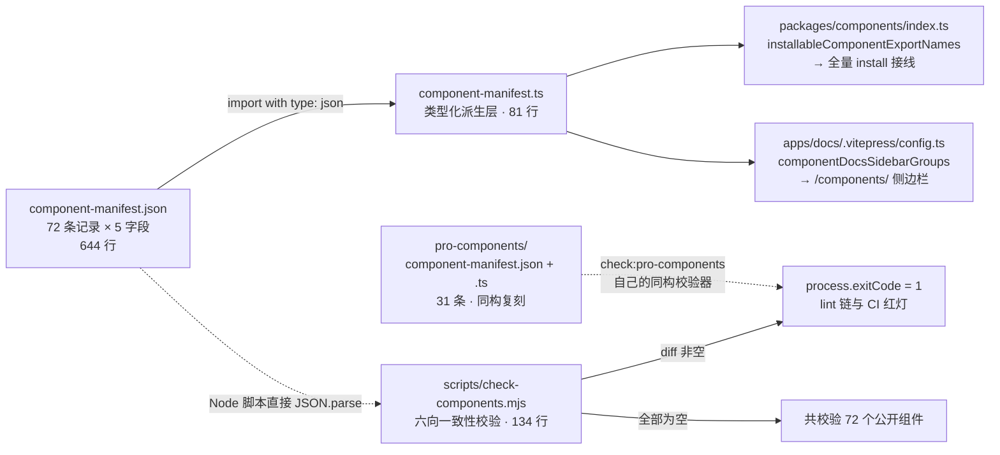
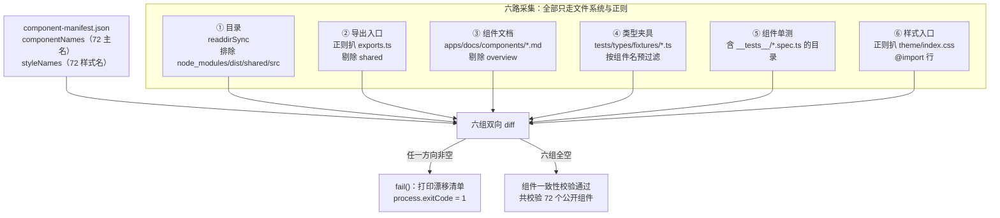

# 4-01 · component-manifest：一份 JSON 管六处一致性

令牌三卷（3-01 到 3-06）收官时说过：地基打完，该盖楼了。第四卷讲组件通用架构，开篇先回答一个所有组件库都会撞上的问题——**组件库规模化之后，"漏注册"怎么才能不再依赖人的记性，而是变成一条 lint 错误？**

这个仓库的现状是：基础层 72 个组件（basic 23 / form 19 / feedback 17 / data 13），增强层 31 个组件。每新增或改名一个组件，仓库里至少有六个地方必须跟着动：组件目录、导出入口、文档页、类型夹具、单测、样式聚合入口。六处乘以七十二，就是四百多个潜在的漂移点。靠 code review 的人眼盯，迟早漂。

这一篇拆四个文件：`packages/components/component-manifest.json`（644 行，数据主源）、`packages/components/component-manifest.ts`（81 行，类型化派生层）、`packages/components/index.ts`（54 行，安装接线）、`scripts/check-components.mjs`（134 行，一致性校验器）。看完你会得到一张完整的答案图：**一份 JSON 记录"组件该是什么样"，一个脚本核对"仓库实际是什么样"，两者 diff 不为零就是 lint 红灯。**

## 一、漏注册的解剖：一个组件的六处足迹

先别急着看 manifest，先把"漏注册"这件事本身解剖开。假设我要新增一个叫 `foo` 的组件，按这个仓库的约定（组件目录统一放 `packages/components/<name>`，kebab-case 主名），它必须在六个位置留下足迹：

1. **组件目录本体**：`packages/components/foo/`——`index.ts`、`src/`、`__tests__/` 三件套；
2. **导出入口**：`packages/components/exports.ts` 里加一行 `export * from "./foo";`——不加，用户从包根 import 不到任何东西；
3. **文档页**：`apps/docs/components/foo.md`——不加，文档站侧边栏点进去是 404；
4. **类型夹具**：`tests/types/fixtures/foo.ts`——不加，这个组件的类型面就游离在 `pnpm typecheck:types` 的回归网之外；
5. **单测**：`packages/components/foo/__tests__/foo.spec.ts`——不加，组件没有行为回归保障；
6. **样式聚合入口**：`packages/theme/index.css` 里加一行 `@import "./src/components/foo.css";`——不加，全量安装的用户拿到的组件没有样式，这是最阴险的一类漏：组件能用，就是裸的。

这六处之外还有两处消费方，但它们**不靠人手同步**：包根的安装行为（`packages/components/index.ts`）和文档站侧边栏（`apps/docs/.vitepress/config.ts`），都是从 manifest 派生的。区分"必须人写的六处"和"从数据派生的两处"，正是这套体系的第一性原理：**能派生的绝不让人记第二遍，不能派生的用脚本核对**。

一张图看全景——manifest 在这个仓库里的辐射网络：



注意图上那条虚线：校验器读的是 `.json` 本体，不经过派生层——这个刻意的选择留到第五节拆。

## 二、component-manifest.json：72 条记录的数据模型

主源文件 644 行，结构极简：一个数组，每条记录五个字段。先看最典型的 `button` 条目（`component-manifest.json:2-12`）：

```json
// component-manifest.json L2-12
{
  "name": "button",
  "docsGroup": "basic",
  "docsText": "Button 按钮",
  "installExports": ["XyButton", "XyButtonGroup"],
  "installChecks": [
    { "kind": "component", "name": "xy-button" },
    { "kind": "component", "name": "xy-button-group" }
  ],
  "styleImports": ["button"]
},
```

五个字段，三种语义：

- **`name`**：组件主名，kebab-case，是整个体系的主键——目录名、文档文件名、类型夹具名都跟它走；
- **`docsGroup` + `docsText`**：文档侧边栏的分组和展示文本，`docsGroup` 只允许 `basic / form / feedback / data` 四个值；
- **`installExports` + `installChecks`**：安装层的一对"出题与验题"——前者是包根命名空间里按名可取的导出（PascalCase），后者是装完之后应该注册成功的校验项；
- **`styleImports`**：该组件在样式聚合入口里对应的 CSS 文件名（不含路径和扩展名）。

72 条记录在四个分组里的分布是 basic 23 / form 19 / feedback 17 / data 13——但如果你回到 JSON 里去找"基础组件"四个字，找不到。JSON 里只有英文组名，中文展示名（"基础组件 / 表单与录入 / 反馈与浮层 / 数据展示"）和分组顺序（basic 打头、data 收尾）都住在派生层的 `docsGroupTextMap` 和 `docsGroupOrder` 里。数据与文案的分工在这里体现得很干净：数据管"有哪些、怎么分"，文案管"怎么叫、怎么排"——后者是随时可能被设计评审推翻的东西，不该埋在 644 行的数据文件里。

`installChecks` 的 `kind` 有三种取值：`component`（注册为全局组件）、`directive`（注册为指令）、`globalProperty`（挂到 `app.config.globalProperties`）。这三个值不是拍脑袋分的，它们精确对应 Vue 插件能往 app 上挂东西的三个口子。看几个非典型条目就明白了。`message` 是纯函数式组件，没有模板标签，只在全局属性上挂 `$message`（`component-manifest.json:375-382`）；`notification` 则是双形态——既有 `xy-notification` 组件标签，又有 `$notify` 服务函数（`component-manifest.json:383-393`）；`loading` 走的是指令加服务，注意它**没有** `component` kind——`XyLoading` 的 install 只注册 `v-loading` 指令和 `$loading` 全局属性，不注册组件标签（`component-manifest.json:421-431`）：

```json
// component-manifest.json L375-431（feedback 组连续节选，缩进规整到顶层）
{
  "name": "message",
  "docsGroup": "feedback",
  "docsText": "Message 消息提示",
  "installExports": ["XyMessage"],
  "installChecks": [{ "kind": "globalProperty", "name": "$message" }],
  "styleImports": ["message"]
},
{
  "name": "notification",
  "docsGroup": "feedback",
  "docsText": "Notification 通知",
  "installExports": ["XyNotification", "XyNotificationService"],
  "installChecks": [
    { "kind": "component", "name": "xy-notification" },
    { "kind": "globalProperty", "name": "$notify" }
  ],
  "styleImports": ["notification"]
},
{
  "name": "backtop",
  "docsGroup": "feedback",
  "docsText": "Backtop 回到顶部",
  "installExports": ["XyBacktop"],
  "installChecks": [{ "kind": "component", "name": "xy-backtop" }],
  "styleImports": ["backtop"]
},
{
  "name": "collapse",
  "docsGroup": "feedback",
  "docsText": "Collapse 折叠面板",
  "installExports": ["XyCollapse", "XyCollapseItem"],
  "installChecks": [
    { "kind": "component", "name": "xy-collapse" },
    { "kind": "component", "name": "xy-collapse-item" }
  ],
  "styleImports": ["collapse"]
},
{
  "name": "empty",
  "docsGroup": "feedback",
  "docsText": "Empty 空状态",
  "installExports": ["XyEmpty"],
  "installChecks": [{ "kind": "component", "name": "xy-empty" }],
  "styleImports": ["empty"]
},
{
  "name": "loading",
  "docsGroup": "feedback",
  "docsText": "Loading 加载",
  "installExports": ["XyLoading"],
  "installChecks": [
    { "kind": "directive", "name": "loading" },
    { "kind": "globalProperty", "name": "$loading" }
  ],
  "styleImports": ["loading"]
},
```

72 条记录里有 20 条的 `installChecks` 多于一项，但性质分两类：一类是**同 kind 多标签**——复合组件的子件也要注册，比如 `menu` 一条记录带四个 component 检查（`xy-menu / xy-menu-item / xy-menu-item-group / xy-sub-menu`，L124-136），`radio / checkbox / dropdown / timeline` 各带三个；另一类是**真·跨 kind**——全仓库只有两条：`notification`（component + globalProperty）和 `loading`（directive + globalProperty）。`installChecks` 在这里实际上是一份**行为契约**：它声明的不是"源码里有什么"，而是"全量安装完成后，app 上应该能验出什么"。这个设计让安装正确性第一次有了可机读的判据——它是第四节安装接线的输入，也是将来聚合安装断言的题库。

`styleImports` 也有值得驻足的细节。多数组件一条对应一个 CSS 文件，但 `avatar` 记了两个——`["avatar", "avatar-group"]`（L48-58），因为 `XyAvatarGroup` 的样式独立成文件。而 `config-provider` 和 `countdown` 的 `styleImports` 是空数组（L212-219、L527-534）：前者确实无样式，后者复用 `statistic` 的样式，在 `packages/theme/index.css` 的 72 行组件 `@import` 里，你找不到 `countdown.css`。空数组不是遗漏，是显式声明"这里没东西可核对"——把"没有"也变成数据，校验器才能区分"故意没有"和"忘了写"。

最后两条抽样，是数据组里最新的成员。`scheduler`（L566-573）与 `editor`（L619-627）都是单 component kind 的普通条目，这里一并贴出，顺便看看四组清单里 data 组和 form 组条目的真实长相：

```json
// component-manifest.json L566-573
{
  "name": "scheduler",
  "docsGroup": "data",
  "docsText": "Scheduler 排期日历",
  "installExports": ["XyScheduler"],
  "installChecks": [{ "kind": "component", "name": "xy-scheduler" }],
  "styleImports": ["scheduler"]
},

// component-manifest.json L619-627
{
  "name": "editor",
  "docsGroup": "form",
  "docsText": "Editor 编辑器",
  "installExports": ["XyEditor"],
  "installChecks": [{ "kind": "component", "name": "xy-editor" }],
  "styleImports": ["editor"]
},

// component-manifest.json L212-219（styleImports 空数组示例）
{
  "name": "config-provider",
  "docsGroup": "form",
  "docsText": "Config Provider 全局配置",
  "installExports": ["XyConfigProvider"],
  "installChecks": [{ "kind": "component", "name": "xy-config-provider" }],
  "styleImports": []
},

// component-manifest.json L527-534（复用他组件样式示例）
{
  "name": "countdown",
  "docsGroup": "data",
  "docsText": "Countdown 倒计时",
  "installExports": ["XyCountdown"],
  "installChecks": [{ "kind": "component", "name": "xy-countdown" }],
  "styleImports": []
},
```

还有一个容易忽略的观察：这个 JSON **没有文件头注释**。第一行就是 `[`。不是作者忘了，是 JSON 根本不支持注释——而这份文件必须保持"任何工具零依赖可解析"的属性，所以一个字段的解释都不写，语义全部让 `.ts` 派生层和本篇文章来承担。数据主源放弃表达能力，换取的是最广泛的机器可读性。

## 三、component-manifest.ts：81 行派生层全文精读

仓库的 AGENTS.md 里有一句总纲：**"组件清单、文档侧边栏、聚合安装断言和一致性校验以 `component-manifest.ts` 为主源。"** 这句话值得逐词咂摸——物理上的字面源明明是 `.json`，为什么主源说的是 `.ts`？因为 `.json` 只是被 parse 的一坨数据，没有任何类型约束和派生逻辑；所有消费方（安装接线、文档站）import 的都是 `.ts`，类型约束、字段语义、派生规则全部住在这一层。`.json` 是字面，`.ts` 是宪法。全文 81 行，先看前半：

```ts
// packages/components/component-manifest.ts L1-40
import manifestJson from "./component-manifest.json" with { type: "json" };

export type ComponentDocsGroup = "basic" | "form" | "feedback" | "data";

interface RawComponentInstallCheck {
  kind: "component" | "directive" | "globalProperty";
  name: string;
}

interface RawComponentManifestEntry {
  name: string;
  docsGroup: ComponentDocsGroup;
  docsText: string;
  installExports: string[];
  installChecks: RawComponentInstallCheck[];
  styleImports: string[];
}

export interface ComponentManifestEntry {
  name: string;
  docsGroup: ComponentDocsGroup;
  docsText: string;
  installExports: string[];
  installChecks: RawComponentInstallCheck[];
  install: {
    components: string[];
    directives: string[];
    globals: string[];
  };
  styleImports: string[];
}

const rawManifest = manifestJson as RawComponentManifestEntry[];

const docsGroupTextMap: Record<ComponentDocsGroup, string> = {
  basic: "基础组件",
  form: "表单与录入",
  feedback: "反馈与浮层",
  data: "数据展示"
};
```

第 1 行是整个文件的钉子：`import ... with { type: "json" }`——TC39 的 import attributes 标准语法（TypeScript 5.3 起支持，本仓锁在 5.9.3）。它让 TS 模块图里从此有一份**编译期就绑定**的 JSON——不是 `fs.readFileSync` 的运行时读取，不是 `resolveJsonModule` 的老式默认导入，而是带显式类型声明的标准语法。打包器、类型检查器、Node 原生运行时三方对同一行为的理解在此对齐。中间两组 interface 是"生数据"与"熟数据"的分界：`RawComponentManifestEntry` 忠实描述 JSON 的形状；`ComponentManifestEntry` 在其上追加了一个 `install` 三桶结构——把 `installChecks` 按三种 kind 预先分拣成 `components / directives / globals` 三个字符串数组。这份"熟形状"由第 44 行开始的派生兑现：

```ts
// packages/components/component-manifest.ts L42-81
const docsGroupOrder: ComponentDocsGroup[] = ["basic", "form", "feedback", "data"];

export const componentManifest = rawManifest.map((entry) => ({
  ...entry,
  install: {
    components: entry.installChecks
      .filter((check) => check.kind === "component")
      .map((check) => check.name),
    directives: entry.installChecks
      .filter((check) => check.kind === "directive")
      .map((check) => check.name),
    globals: entry.installChecks
      .filter((check) => check.kind === "globalProperty")
      .map((check) => check.name)
  }
})) satisfies ComponentManifestEntry[];

export const publicComponentNames = componentManifest.map((entry) => entry.name);

export const installableComponentExportNames = componentManifest.flatMap(
  (entry) => entry.installExports
);

export const installCheckEntries = componentManifest.flatMap((entry) => entry.installChecks);

export const themeStyleImportNames = Array.from(
  new Set(componentManifest.flatMap((entry) => entry.styleImports))
);

export const componentStyleImports = themeStyleImportNames;

export const componentDocsSidebarGroups = docsGroupOrder.map((group) => ({
  text: docsGroupTextMap[group],
  items: componentManifest
    .filter((entry) => entry.docsGroup === group)
    .map((entry) => ({
      text: entry.docsText,
      link: `/components/${entry.name}`
    }))
}));
```

一份数据，六个导出，各喂各的下游：

- **`componentManifest`**：补齐 `install` 三桶的完整记录集，第 57 行的 `satisfies ComponentManifestEntry[]` 把派生结果的形状钉死在编译期；
- **`installableComponentExportNames`**：所有安装导出名的扁平列表（`flatMap` 天然展平多标签组件），直接喂包根安装器——这是本篇第四节的正主；
- **`installCheckEntries`**：全量校验项的扁平题库；
- **`publicComponentNames`**：72 个主名；
- **`themeStyleImportNames` / `componentStyleImports`**：样式名的去重扁平集，后者是前者别名；
- **`componentDocsSidebarGroups`**：按 `docsGroupOrder` 排好的四组侧边栏结构，直接是 VitePress `sidebar` 的形状。

有一个诚实的观察必须写在这里：`publicComponentNames`、`installCheckEntries`、`themeStyleImportNames` 这三个导出，目前在整个仓库里**没有运行时消费方**——它们是为"聚合安装断言"这类尚未在基础层落地的测试预备的题库（第六节会回到这个留白）。派生层一次算清、多口消费的设计是好的，但"预先导出、等待消费"的导出也意味着：在消费方出现之前，它们只是类型检查器眼里的死代码。

还要点破一个类型层的细节，后面第七节会用到：第 33 行的 `manifestJson as RawComponentManifestEntry[]` 是**断言，不是校验**。TS 对 JSON import 的字符串值一律拓宽为 `string`，而 `as` 只要求两个类型"可比较"——`string` 与 `"component" | "directive" | "globalProperty"` 联合类型互相可赋值方向成立，断言放行。我用仓库自带的 tsc 做过最小实验：把 JSON 里某个 `kind` 拼成 `"componen"`，`tsc --noEmit` 静默通过。所以 `pnpm typecheck` 抓不住 JSON 内容层的拼写漂移，这份文件里真正的"校验"语义，全部压给了 check-components.mjs 和测试。派生层的 `satisfies` 校验的是**派生逻辑的形状**（你改坏了 map 结构它会叫），不是**数据的拼法**。

## 四、index.ts 与样式链：manifest 如何变成 install

数据有了，派生有了，现在看安装接线。包根入口 54 行，全文如下：

```ts
// packages/components/index.ts L1-54
import type { App, Plugin } from "vue";
import "./style.css";
import * as XiaoyeComponentExports from "./exports";
import { installableComponentExportNames } from "./component-manifest";

export type { ComponentSize, ComponentStatus, SelectOption } from "xiaoye-primitives";
export * from "./exports";

const INSTALL_KEY = Symbol.for("xiaoye-components:installed");

function isInstallableExport(value: unknown): value is Plugin {
  return (
    (typeof value === "function" || typeof value === "object") &&
    value !== null &&
    "install" in value &&
    typeof (value as { install?: unknown }).install === "function"
  );
}

const installableExports = Array.from(
  new Set(
    installableComponentExportNames
      .map((name) => XiaoyeComponentExports[name as keyof typeof XiaoyeComponentExports])
      .filter(isInstallableExport)
  )
) as Plugin[];

export function install(app: App) {
  const appWithInstallFlag = app as App & {
    [INSTALL_KEY]?: boolean;
  };

  if (appWithInstallFlag[INSTALL_KEY]) {
    return;
  }

  appWithInstallFlag[INSTALL_KEY] = true;

  installableExports.forEach((component) => {
    app.use(component);
  });
}

declare module "vue" {
  interface ComponentCustomProperties {
    $loading?: typeof import("./loading").XyLoadingService;
    $message?: typeof import("./message").XyMessage;
    $notify?: typeof import("./notification").XyNotificationService;
  }
}

export default {
  install
};
```

安装主循环只有一行逻辑——`installableExports.forEach((component) => app.use(component))`（L39-41）——但它的输入构造是三步流水线，每一步都在消化一种不确定性：

1. **按名取值**（L23）：`XiaoyeComponentExports[name]`——manifest 给的是字符串名，这里从 `export *` 的命名空间里按名取出真实导出。这一步把"数据世界"接到"模块世界"；
2. **鸭子类型过滤**（L11-18）：`isInstallableExport` 只认"有 `install` 函数属性"的值。manifest 说它是安装导出，但最终以"运行时对象长不长着 install 的样子"为准。拼错的导出名会取出 `undefined`，在这里被静默滤掉——这条过滤让包根入口对新增组件**零修改**（manifest 加一个名字，安装列表自动多一个组件），但代价是"manifest 与实际导出的偏差"在运行时是无声的，只能靠第五节的校验器在仓库层拦截；
3. **Set 去重**（L21）：同一对象以多个名字导出时只装一次。

`Symbol.for("xiaoye-components:installed")` 是幂等锁（L9、L33-37）：同一个 app 重复 install 直接返回。`Symbol.for` 而非 `Symbol` 的跨 Realm 意义、`withInstallFunction` 的 AppContext 捕获，是 4-02 的正题，这里按下不表。L44-50 的 `declare module "vue"` 则把三个 `globalProperty` kind 的校验项（`$loading / $message / $notify`）反向翻译成了类型层的事实——manifest 里那三条 `globalProperty` 记录，在模板里写下 `this.$message(...)` 时能有补全和类型检查，靠的就是这段声明与 manifest 的手工对齐。

再看样式链。L2 的 `import "./style.css"` 引入的 `packages/components/style.css` 只有 1 行：

```css
/* packages/components/style.css L1 */
@import "../theme/index.css";
```

顺着进去，`packages/theme/index.css` 前 9 行长这样：

```css
/* packages/theme/index.css L1-9（全文共 73 行，L10-73 为其余 64 行组件 @import） */
@import "@xiaoye/primitives/style.css";
@import "./src/components/button.css";
@import "./src/components/link.css";
@import "./src/components/breadcrumb.css";
@import "./src/components/text.css";
@import "./src/components/badge.css";
@import "./src/components/icon.css";
@import "./src/components/avatar.css";
@import "./src/components/avatar-group.css";
```

73 行 = 1 行 primitives 引入 + 72 行组件样式。注意两个细节：`avatar-group.css` 紧跟 `avatar.css`（L8-9）、`check-card-group.css` 紧跟 `check-card.css`（L13-14）——顺序是人定的，子件样式紧贴母件；而 manifest 的 `styleImports` 展平去重后恰好也是 72 个名字，与这 72 行一一对应。但这层对应关系**不是生成出来的，是核对出来的**：`theme/index.css` 是手写清单，manifest 里的 `themeStyleImportNames` 并没有被用来反向生成它。方向反过来想很合理——CSS `@import` 的顺序就是级联优先级，让脚本重排样式清单是在拿级联顺序冒险；所以这套体系的取舍是"人写、保序，脚本核对"，而不是"脚本生成、顺序失控"。样式是六处足迹里唯一一处"数据记录了它，但清单本身仍是手写"的地方，第六处校验就是为这个缝隙补的闸。

## 五、check-components.mjs：134 行把六处漂移变成红灯

现在到本篇的正题。`scripts/check-components.mjs`，134 行，零依赖，一个 Node 脚本把六处足迹全部核对一遍。先看工具段（全文前三段在此）：

```js
// scripts/check-components.mjs L1-55
import fs from "node:fs";
import path from "node:path";

const repoRoot = process.cwd();
const manifestPath = path.join(repoRoot, "packages/components/component-manifest.json");
const manifest = JSON.parse(fs.readFileSync(manifestPath, "utf8"));

const componentNames = manifest.map((entry) => entry.name);
const styleNames = manifest.flatMap((entry) => entry.styleImports);

function readFile(relativePath) {
  return fs.readFileSync(path.join(repoRoot, relativePath), "utf8");
}

function listBasenames(relativeDir, extension) {
  return fs
    .readdirSync(path.join(repoRoot, relativeDir))
    .filter((file) => file.endsWith(extension))
    .map((file) => file.slice(0, -extension.length))
    .sort();
}

function listComponentTestGroups() {
  const componentsDir = path.join(repoRoot, "packages/components");
  return fs
    .readdirSync(componentsDir, { withFileTypes: true })
    .filter((entry) => entry.isDirectory())
    .map((entry) => entry.name)
    .filter((name) =>
      fs.existsSync(path.join(componentsDir, name, "__tests__")) &&
      fs
        .readdirSync(path.join(componentsDir, name, "__tests__"))
        .some((file) => file.endsWith(".spec.ts"))
    )
    .sort();
}

function collectByRegex(source, regex, groupIndex = 1) {
  return [...source.matchAll(regex)].map((match) => match[groupIndex]).sort();
}

function diff(expected, actual) {
  const actualSet = new Set(actual);
  return expected.filter((item) => !actualSet.has(item));
}

function fail(message, values) {
  console.error(message);
  if (values.length > 0) {
    values.forEach((value) => {
      console.error(`- ${value}`);
    });
  }
  process.exitCode = 1;
}
```

L5-6 是又一个值得驻足的选择：校验器读的是 `component-manifest.json` **本体**，不是派生层。一个 Node 脚本要读 TS，就得引入 tsx 或先跑一次编译；读 JSON 只需要 `JSON.parse`。AGENTS.md 说主源是 `component-manifest.ts`，那是给"类型世界"的约定；物理执行时，`.json` 才是那个谁都能直接读的字面源。**数据放 JSON，语义放 TS，校验直接读字面**——三层各取所需，互不绑架。

`fail()`（L47-55）用 `process.exitCode = 1` 而不是 `process.exit(1)`：后者会立刻中断进程，前者只是标记退出码、让脚本跑完。这意味着六处校验**一次性全部执行**，一次红灯输出所有漂移清单，而不是修一处跑一次修六次。这是校验脚本设计里最朴素也最容易被忘记的善意。

接着是六路采集（L57-81）：

```js
// scripts/check-components.mjs L57-81
const componentDirs = fs
  .readdirSync(path.join(repoRoot, "packages/components"), { withFileTypes: true })
  .filter((entry) => entry.isDirectory() && entry.name !== "node_modules")
  .map((entry) => entry.name)
  .filter((name) => !["dist", "shared", "src"].includes(name))
  .sort();

const exportedComponentNames = collectByRegex(
  readFile("packages/components/exports.ts"),
  /export \* from "\.\/([^"]+)";/g
).filter((name) => name !== "shared");

const docComponentNames = listBasenames("apps/docs/components", ".md").filter(
  (name) => name !== "overview"
);

const typeFixtureNames = listBasenames("tests/types/fixtures", ".ts").filter((name) =>
  componentNames.includes(name)
);
const unitTestNames = listComponentTestGroups();

const themeImportNames = collectByRegex(
  readFile("packages/theme/index.css"),
  /@import "\.\/src\/components\/([^.]+)\.css";/g
);
```

六路采集，六种"现状侧"的读法，每一处细节都是对现实妥协的产物：

- **目录**（L57-62）：`readdirSync` 排除 `node_modules / dist / shared / src`——这四个名字住在组件包里但不是组件；
- **导出**（L64-67）：对 `exports.ts` 做正则采集，剔除 `shared`——`exports.ts:52` 的 `export * from "./shared";` 是共享工具，不是组件；
- **文档**（L69-71）：`apps/docs/components` 下按 `.md` 后缀取基名，剔除 `overview` 总览页；
- **夹具**（L73-75）：取 `tests/types/fixtures` 的基名后**先按 componentNames 过滤**——因为这个目录里还住着 31 个 pro 组件和页面级夹具（`crud-page.ts`、`login-form.ts` 之类），它们不该被基础层校验误伤。这个预过滤让夹具校验事实上变成了单向检查（下文细说）；
- **单测**（L76）：`listComponentTestGroups` 判定"有单测"的标准是目录下存在 `__tests__/` 且其中至少有一个 `.spec.ts`——空测试目录或只有辅助文件的目录视同没有；
- **样式**（L78-81）：对 `theme/index.css` 做正则采集，正则刻意写窄（`./src/components/` 前缀），L1 的 primitives 引入天然不参与比对。

然后是六项断言与执行（L83-134）：

```js
// scripts/check-components.mjs L83-134
const mismatches = [
  {
    message: "组件目录与 manifest 不一致：",
    values: [
      ...diff(componentNames, componentDirs),
      ...diff(componentDirs, componentNames).map((name) => `${name} (多余目录)`)
    ]
  },
  {
    message: "导出入口与 manifest 不一致：",
    values: [
      ...diff(componentNames, exportedComponentNames),
      ...diff(exportedComponentNames, componentNames).map((name) => `${name} (多余导出)`)
    ]
  },
  {
    message: "组件文档与 manifest 不一致：",
    values: [
      ...diff(componentNames, docComponentNames),
      ...diff(docComponentNames, componentNames).map((name) => `${name} (多余文档)`)
    ]
  },
  {
    message: "类型夹具与 manifest 不一致：",
    values: [
      ...diff(componentNames, typeFixtureNames),
      ...diff(typeFixtureNames, componentNames).map((name) => `${name} (多余夹具)`)
    ]
  },
  {
    message: "组件单测与 manifest 不一致：",
    values: [
      ...diff(componentNames, unitTestNames),
      ...diff(unitTestNames, componentNames).map((name) => `${name} (多余单测目录)`)
    ]
  },
  {
    message: "样式入口与 manifest 不一致：",
    values: [
      ...diff(styleNames, themeImportNames),
      ...diff(themeImportNames, styleNames).map((name) => `${name} (多余样式导入)`)
    ]
  }
];

mismatches
  .filter((entry) => entry.values.length > 0)
  .forEach((entry) => fail(entry.message, entry.values));

if (process.exitCode !== 1) {
  console.log(`组件一致性校验通过，共校验 ${componentNames.length} 个公开组件。`);
}
```

这套机器的红灯长什么样？假设有人手滑往 `packages/theme/index.css` 多加了一行 `foo.css` 的引入，又建了个 `foo` 组件目录、写了导出，却忘了补文档页——跑一遍校验器会得到（模拟输出）：

```text
组件文档与 manifest 不一致：
- foo
样式入口与 manifest 不一致：
- foo (多余样式导入)
```

两处漂移、两个方向，一次跑完全部报出，没有"发现第一个错误就中止"的短视。这也解释了 `fail()` 为什么坚持用 `process.exitCode` 而不是 `process.exit`——前者让脚本活着跑完六组比对，把完整的漂移清单一次性交到开发者手里。

`diff(expected, actual)` 的语义是"expected 里有而 actual 没有的"，每个断言项都是两个方向的 diff 拼接：组件在 manifest 里但没有文档页，报"缺"；目录里有组件但 manifest 里没有，报"多余目录"。**双向 diff 意味着 manifest 既是白名单也是完备性清单**——多写一条一样是红灯。

六处校验网络画成图，是这样一张辐射状结构：



六处里藏着一个值得点破的不对称：**夹具校验实际上是单向的**。L73-75 的预过滤把夹具名收窄到了"与某个组件同名"的子集，于是 L109 那个 `diff(typeFixtureNames, componentNames)`（"多余夹具"方向）永远是空集——一个叫 `login-form.ts` 的夹具无论是不是垃圾都不会被这台机器报出来。这是刻意让渡的覆盖面：夹具目录与 pro 层共享，基础层脚本没有立场审判别人家的文件；代价是"组件夹具多余"这种漂移只能靠人眼。与之对照，样式校验（L119-125）就是真双向——`styleNames` 与 `themeImportNames` 两侧都没有预过滤，漏一行 `@import` 或多写一行都会亮。

把六处的覆盖面对齐开头的"六处足迹"清单，你会发现一个留白：**manifest 里的 `installChecks`（安装行为契约）不在这六处校验的范围内**。目录、导出、文档、夹具、单测、样式，全是"文件系统存在性"校验；"装完之后 app 上真的能验出 `xy-button` 和 `$message`"是运行时行为，得靠测试。这就是下一节的主角。

## 六、接线：lint 链、CI 与那个留白

校验脚本写完了，不接线就只是个摆设。这个仓库把它接到了三层。

**第一层：本地 lint 链。** 根 `package.json:11` 注册脚本，`package.json:16` 把它嵌进 lint 主链：

```jsonc
// package.json L11
"check:components": "node scripts/check-components.mjs",

// package.json L16
"lint": "pnpm check:tokens && pnpm check:llms && pnpm check:components && pnpm check:pro-components && eslint .",
```

lint 链的顺序有讲究：`check:tokens` → `check:llms` → `check:components` → `check:pro-components` → `eslint`。四道生成物校验排在 eslint 前面，因为它们都是毫秒级的文件比对，而 eslint 是全仓扫描——便宜的闸门放前面，红灯出得越早，浪费的本地时间越少。回答本篇标题的问题就在这里：**"漏注册"是怎么变成 lint 错误的？`pnpm lint` 的第二条命令就会因为退出码 1 失败，lint 整体失败**。严格说它不是 eslint 规则，但它活在 lint 链里，享用 lint 的全部执行时机（本地、CI、编辑器集成），语义上就是一条"仓库级 lint 规则"。

顺带交代一个事实：这个仓库没有配 husky 之类的 git hook，lint 不会在 commit 时被强制触发。本地防线的执行时机是"贡献者主动跑 `pnpm lint`"，最终强制力完全落在 CI——这不是疏漏，而是权衡三要说的一个清醒认知：**本地闸门的价值在反馈速度，不在强制力；强制力必须由不可绕过的一层承担**。

我实跑过这台校验器：`node scripts/check-components.mjs`，输出"组件一致性校验通过，共校验 72 个公开组件。"，总耗时 **0.081 秒**。这个数字是整个设计的底气——因为它足够便宜，才配得上"每次 lint 都跑"。

**第二层：CI 独立闸门。** `.github/workflows/ci.yml` 在安装依赖之后、lint 之前，单独跑了一次：

```yaml
# .github/workflows/ci.yml L20-26（job 主 steps 节选）
      - run: pnpm install --frozen-lockfile
      - run: pnpm check:components
      - run: pnpm lint
      - run: pnpm typecheck
      # CI runner 内存有限，文件级并行曾致 OOM flaky（同一提交在 Release job 中全部通过）
      - run: pnpm test -- --no-file-parallelism
      - run: pnpm build
```

lint 链里明明包含了 `check:components`，CI 为什么还要单独跑一遍？因为单独跑的失败输出是**干净的**——红灯原因只有一致性漂移，不会被 eslint 的海量输出淹没；而 lint 里的那一次覆盖的是"绕过 CI 单独步骤直接看 lint 结果"的路径。同一脚本跑两次是冗余，但两次的**可读性**不同。发布链路 `.github/workflows/release.yml:35` 还有第三道：`pnpm check:components && pnpm check:pro-components`，在发版构建前最后兜一次底。

**第三层：测试层的安装断言——这里是留白所在。** AGENTS.md 说"聚合安装断言"以 manifest 为主源，目前真正落地的是增强层。`packages/pro-components/__tests__/install.spec.ts`，35 行全文：

```ts
// packages/pro-components/__tests__/install.spec.ts L1-35
import { createApp, defineComponent, h } from "vue";
import { describe, expect, it, vi } from "vitest";
import XiaoyeProComponents from "../index";
import { proInstallCheckEntries } from "../component-manifest";

describe("XiaoyeProComponents", () => {
  it("重复 install 到同一个 app 时保持幂等", () => {
    const app = createApp(
      defineComponent({
        render() {
          return h("div");
        }
      })
    );

    const warnSpy = vi.spyOn(console, "warn").mockImplementation(() => {});

    XiaoyeProComponents.install(app);
    XiaoyeProComponents.install(app);

    proInstallCheckEntries.forEach((entry) => {
      if (entry.kind === "component") {
        expect(app.component(entry.name)).toBeTruthy();
      }
    });

    expect(
      warnSpy.mock.calls.some((args) =>
        String(args[0]).includes("already been registered in target app")
      )
    ).toBe(false);

    warnSpy.mockRestore();
  });
});
```

看 L21-25：遍历 `proInstallCheckEntries`，对每个 `component` kind 的检查项断言 `app.component(entry.name)` 真值——**manifest 里的 installChecks 在这里变成了测试的题库**。加一个增强组件而忘了在 manifest 里登记，安装测试自动少验一项；反过来，manifest 声明了而实际没注册成功，这里立刻红。这层断言与 check-components.mjs 的分工是清晰的：脚本管"文件系统一致性"（免费，毫秒级，进 lint），测试管"运行时安装行为"（要起 Vue 环境，进 vitest）。

但基础层——那个有 72 个组件、installChecks 更庞大、还有 `installCheckEntries` 导出备战的基础层——**目前没有对应的聚合安装 spec**。`publicComponentNames / installCheckEntries / themeStyleImportNames` 三个导出在仓库里没有消费方，题库备好了，考场还没开。这不是缺陷，是明确的待办：照着 pro 层这 35 行的模子，补一个消费 `installCheckEntries` 的聚合 spec，基础层的安装正确性就从"类型夹具间接兜 + 用户反馈"升级为"测试红灯"；顺手还能把幂等锁的断言一并收进同一个考场。4-02 讲安装器体系时，正好要用这个考场开题。

## 七、设计权衡：三个选择与一次 Element Plus 对照

把全篇的设计决策摆上桌面，值得展开的有三处，外加一组行业对照。

**权衡一：JSON 主源 vs TS 直写。** 清单完全可以写成 TS 数组——EP 的兄弟项目里不乏 `components.ts` 直写的先例。这里选 JSON，买的是三样东西：Node 校验脚本零依赖直读（不用 tsx、不用编译）；VitePress 配置可以直接 import（docs 的 tsconfig 也在仓库内，`resolveJsonModule` 打通）；数据与逻辑的物理隔离——想给清单加个"计算字段"？门都没有，所有派生都必须显式写进 `.ts`，数据层永远不会藏逻辑。付出的代价同样清楚：没有注释（第一节末尾说过），没有类型（靠派生层 `as` 断言补，而我们已经实验证明 `as` 抓不住拼写漂移）。这笔交换的净值取决于一个判断：**清单变更频率高、消费方工具链杂时，数据格式的普适性比表达力值钱**。72 个组件、六类消费方，这个判断成立。

**权衡二：派生层为何不合并。** `.json` 与 `.ts` 两层文件、一处 `as` 断言、一组 map 派生——看起来冗余，为什么不把派生逻辑直接塞进消费方？因为六个导出对应三类下游，诉求不同：安装器要"按名取导出"的字符串列表，文档站要"VitePress sidebar 形状"的结构体，未来的聚合测试要"校验项题库"。让每个下游各自从 JSON 现场派生，意味着同一套 filter 逻辑写三遍、漂移三份；让 JSON 直接存三个下游的形状，意味着数据里混进展示逻辑（`/components/${name}` 这种链接拼法是文档站的事，不是数据的事）。派生层是**下游形状的适配器**，81 行买断了三个下游对原始数据的理解成本。它还额外扮演类型门面：`ComponentManifestEntry` 是对外的公开类型契约，`Raw` 开头的两个接口永远不导出——生数据的形状是实现细节。

**权衡三：校验放 lint 链 vs CI vs 单测。** 三层都放了，但角色刻意错开。lint 链是**主力**：0.081 秒的成本让"每次 lint 都核对六处一致性"成为默认事实，本地编辑器、提交前、CI 里处处生效；弱点是本地链路可绕过（直接 push 就没有 lint）。CI 独立步骤是**可读性闸门**：单独跑一次，红灯输出纯净，且绕不过。单测层是**行为兜底**：文件系统一致性证明不了"装上能用"，聚合安装断言把 manifest 的 `installChecks` 变成运行时验题。三个位置各答一个问题：lint 答"文件齐不齐"，CI 答"这次提交过不过"，测试答"装完对不对"。少任何一层，对应的漂移类型就裸奔。

**Element Plus 对照。** EP 是这个领域最成熟的参照系，它的安装器体系与本库神似而形异。神似：EP 的 `packages/element-plus/make-installer.ts` 同样是"遍历 `app.use` + 幂等锁"的骨架：

```ts
// element-plus dev 分支 packages/element-plus/make-installer.ts（22 行全文）
import { provideGlobalConfig } from '@element-plus/components/config-provider'
import { INSTALLED_KEY } from '@element-plus/constants'
import { version } from './version'

import type { App, Plugin } from 'vue'
import type { ConfigProviderContext } from '@element-plus/components/config-provider'

export const makeInstaller = (components: Plugin[] = []) => {
  const install = (app: App, options?: ConfigProviderContext) => {
    if (app[INSTALLED_KEY]) return

    app[INSTALLED_KEY] = true
    components.forEach((c) => app.use(c))

    if (options) provideGlobalConfig(options, app, true)
  }

  return {
    version,
    install,
  }
}
```

`INSTALLED_KEY` 早退对应本库 `index.ts:33-35`，`components.forEach((c) => app.use(c))` 对应本库 `index.ts:39-41`——英雄所见略同。形异在**喂给安装器的清单从哪来**。EP 的 `packages/element-plus/component.ts` 是一份 229 行的手写文件：开头是几十个 import（`import { ElButton, ElButtonGroup } from '@element-plus/components/button'`……），结尾是一个手写数组：

```ts
// element-plus dev 分支 packages/element-plus/component.ts 尾部（L222-229）
  ElTourStep,
  ElAnchor,
  ElAnchorLink,
  ElSegmented,
  ElMention,
  ElSplitter,
  ElSplitterPanel,
] as Plugin[]
```

这份清单与 `defaults.ts`（`makeInstaller([...Components, ...Plugins])`）一起构成 EP 的全量安装路径。它的每个组件在自己的包里做 `withInstall`，与本库的 `packages/components/<name>/index.ts` 同构；差别在顶层：**EP 的新增组件要手改这份 229 行文件，本库的新增组件只改 manifest.json 一个数据文件**。EP 的工程化程度毋庸置疑（typecheck、海量单测、构建期产物校验都很完善），但"安装清单与组件目录一致"这件事在 EP 是靠约定和 review 维持的，没有一台 0.08 秒的机器在 lint 里盯着。这不是能力差距，是年代差距——EP 的清单结构定型于 manifest-as-data 风潮之前，改造它的收益抵不过动它的风险；而这个从零起步的仓库，可以在第一天就把清单立法为数据。

## 八、收束

把这一篇的权衡放回一张桌子上：

| 权衡 | 选择 | 收益 | 代价 |
| --- | --- | --- | --- |
| 清单的数据格式 | JSON 主源 + TS 派生 | 任何工具零依赖可读，数据与逻辑物理隔离 | 无注释无类型，拼写漂移要靠脚本与测试兜 |
| 派生层形态 | 独立 81 行适配层 | 三类下游各取所需形状，类型契约收口 | 多一层文件与一次 as 断言的信任成本 |
| 一致性闸门位置 | lint 链 + CI 双跑 + 测试兜底 | 毫秒级本地反馈，红灯输出干净，运行时行为有题库 | 本地链路可绕过需 CI 兜，基础层聚合断言尚未落地 |

一以贯之的思路还是那一句：**能派生的绝不让人记第二遍，不能派生的用脚本核对**。目录、导出、文档、夹具、单测、样式，六处足迹里没有一处靠"记得要同步"；唯一的留白——安装行为的运行时断言——题库（`installCheckEntries`）已经躺在派生层里等着被消费。

下一篇 **4-02《安装器体系：withInstall、Context 捕获与幂等锁》**，顺着本篇埋下的三根线头往下钻：`index.ts:11-18` 那个鸭子类型过滤挡住了什么、又为什么必须存在（D5）；`packages/xiaoye-primitives/src/utils/vue/with-install.ts` 里 `withInstall` 为什么要同时注册 PascalCase 和 kebab-case 两个别名（D3）；以及 `withInstallFunction` 闭包捕获 `app._context` 之后，`$message` 在组件树外调用时为什么还能吃到 ConfigProvider 的全局配置（D4）——回答大纲里那个问题："**\$message 在组件树外为什么还能吃到全局配置？**"本篇的 manifest 告诉安装器"装谁"，下一篇的安装器体系回答"怎么装、装几次、装的时候记住什么"。
