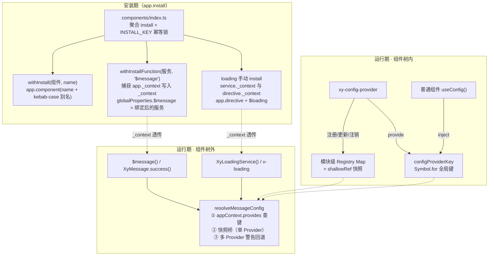
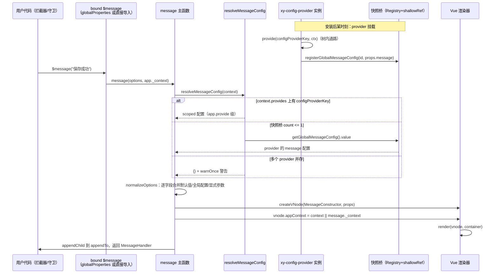
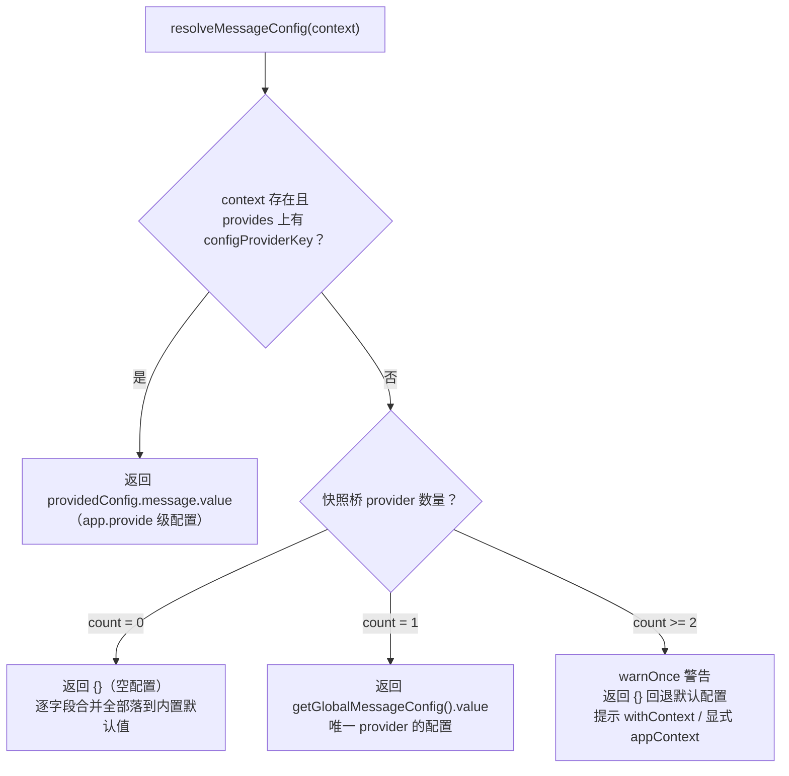

# 4-02 · 安装器体系：withInstall、Context 捕获与幂等锁

## 一个"违反直觉"的现象

先把这个系列核心问题里的主角请上台。在几乎每一个用本库的项目里，你都会见到这样的代码：

```ts
import { XyMessage } from "xiaoye-components";

// 没有任何组件树、没有 setup()、甚至可能发生在路由守卫或 axios 拦截器里
XyMessage({ message: "保存成功", duration: 2000 });
```

同时，应用根部又声明了全局配置：

```html
<xy-config-provider :message="{ duration: 3000, max: 5, showClose: true }">
  <router-view />
</xy-config-provider>
```

问题来了：`XyMessage` 是一个纯函数调用，它没有挂在 `<xy-config-provider>` 的插槽里，不经过任何 `setup()`，按 Vue 的规则根本不应该 `inject` 到这份配置——但它就是吃到了。`duration: 3000`、`max: 5`，一条不少。**provide/inject 的组件树边界，在这里被什么东西悄悄打通了？**

这一篇我们就把这个"什么东西"完整解剖开。它不是一个技巧，而是三条机制咬合成的体系：

1. **安装器两件套**（`withInstall` / `withInstallFunction`）——负责把组件与命令式服务接到 app 上，并在安装那一刻"捕获" app 的上下文；
2. **模块级配置快照桥**——`<xy-config-provider>` 在组件树里 `provide` 的同时，把配置同步写进一个模块级注册表，让树外的服务调用有处可查；
3. **幂等锁**——从单个组件的存在性守卫到聚合入口的 `Symbol.for` 标记，层层防止重复安装把上述一切搅乱。

先亮出全景图，后面逐层展开。



---

## 一、问题现场：provide/inject 的边界到底卡在哪

要看懂后面的设计，得先精确复述一遍 Vue 的规则——因为这套安装器体系要绕的，就是这几条规则，一寸不多、一寸不少。

**第一，`inject` 只认组件实例的 provide 链。**`<xy-config-provider>` 内部调用 `provide(key, value)`，值写进它自己的 `instance.provides`；后代组件实例创建时以 `Object.create(父级.provides)` 建立自己的 provides，于是形成原型链。这条链完全由"组件树父子关系"决定。

**第二，`app.provide(key, value)` 是另一条通道。**值挂在 `app._context.provides` 上，作为所有根组件 provide 链的原型头。它能被所有组件 inject 到，但它要求你在**创建 app 的那一刻**就有值，而且它是 app 级单例——想随组件 props 响应式变化的场景不适用。

**第三，命令式服务没有实例。**`XyMessage()` 的调用栈里没有 `getCurrentInstance()`，也就没有 provides 链可查。它唯一的线索是安装期捕获的 `AppContext`——也就是 `app._context`。

把三条规则合起来看，会出现一个很尴尬的结论：**即使命令式服务拿到了 `appContext`，`appContext.provides` 里也只含有 app 级 provide 的内容，读不到任何嵌套在模板里的 `<xy-config-provider>` 用 `provide()` 写下的配置。**组件级 provide 是"向下广播"的，永远不会向上汇聚到 app。

所以，"$message 在组件树外吃到全局配置"靠单靠上下文捕获是做不到的，必须再造一条**与组件树平行的数据通路**。这就是本文的答案预告：**上下文捕获解决了"我是谁"，快照桥解决了"配置在哪"。**下面从安装器说起。

## 二、安装器两件套精读：`with-install.ts`

安装器源码在 `packages/xiaoye-primitives/src/utils/vue/with-install.ts`，全文 81 行，经 `packages/xiaoye-primitives/src/utils/index.ts` 的 `export * from "./vue/with-install"` 和包入口 `index.ts` 对外暴露。先上全文：

```ts
// packages/xiaoye-primitives/src/utils/vue/with-install.ts（全文 81 行）
import type { App, AppContext } from "vue";

export type SFCWithInstall<T> = T & {
  install(app: App): void;
};

export type FunctionWithInstall<T> = T & {
  install(app: App): void;
  _context?: AppContext | null;
};

type AnyFunction = (...args: any[]) => any;

function toKebabCase(name: string) {
  return name
    .replace(/([a-z0-9])([A-Z])/g, "$1-$2")
    .replace(/([A-Z])([A-Z][a-z])/g, "$1-$2")
    .toLowerCase();
}

export function withInstall<T>(component: T, name: string) {
  const installable = component as SFCWithInstall<T>;

  installable.install = (app: App) => {
    console.debug(`[withInstall] called for: "${name}"`);
    if (!name) {
      console.error("[withInstall] missing name, component:", component);
      return;
    }
    const aliases = Array.from(new Set([name, toKebabCase(name)]));

    aliases.forEach((alias) => {
      if (!app.component(alias)) {
        app.component(alias, installable as never);
      }
    });
  };

  return installable;
}

export function withInstallFunction<T extends AnyFunction>(fn: T, property: string) {
  const installable = fn as FunctionWithInstall<T> & Record<string, unknown>;

  installable.install = (app: App) => {
    installable._context = app._context;
    const bound = ((...args: Parameters<T>) => installable(...args, app._context)) as T;
    const boundRecord = bound as unknown as Record<string, unknown> & {
        _context?: AppContext | null;
      };

    Object.entries(installable).forEach(([key, value]) => {
      if (key === "install" || key === "_context") {
        return;
      }

      if (
        typeof value === "function" &&
        ["primary", "success", "info", "warning", "error"].includes(key)
      ) {
        boundRecord[key] = (...args: unknown[]) => (value as AnyFunction)(...args, app._context);
        return;
      }

      if (typeof value === "function" && key === "withContext") {
        boundRecord[key] = (appContext?: AppContext | null) =>
          (value as AnyFunction)(appContext ?? app._context);
        return;
      }

      boundRecord[key] = value;
    });

    boundRecord._context = app._context;
    app.config.globalProperties[property] = bound as never;
  };

  installable._context = null;

  return installable as FunctionWithInstall<T>;
}
```

### 2.1 `withInstall`：名字去重，而非安装去重

`withInstall(component, name)` 做的事可以概括为一句话：**给任意组件挂一个 `install`，把组件同时注册为 PascalCase 原名和 kebab-case 别名两个全局组件。**

几个值得停一停的细节：

- **L14-19 的 `toKebabCase` 处理了连续大写**。两个正则各司其职：第一条 `([a-z0-9])([A-Z])` 在小写/数字与大写的缝隙插杠（`ButtonGroup` → `Button-Group`），第二条 `([A-Z])([A-Z][a-z])` 在"连续大写的末尾大写 + 后随小写"处插杠（`HTTPServer` → `HTTP-Server`）。配合 `Array.from(new Set([name, toKebabCase(name)]))` 去重，`xy-button` 这类已经是 kebab-case 的名字不会被处理出第二个别名。
- **L33 的 `if (!app.component(alias))` 是这一层唯一的"幂等守卫"**，而它的语义是"存在性守卫"而非"安装锁"：如果全局组件表里已经有这个名字（比如用户自己注册过同名组件、或另一份组件副本先装了），就跳过覆盖，**先到先得**。注意 `app.component(alias)` 的重载：传一个参数是查询，传两个是注册。这个守卫保护的是用户的自定义覆盖权——这是本库对"组件库不绑架命名空间"的一种表态。
- **L25 有一行 `console.debug`**。这是当前工作区实态里真实存在的调试输出，从代码形态看像是排查"组件重复注册/名字丢失"问题时留下的踪迹。它随 `debug` 级别在默认控制台设置下不可见，无害但确实说明安装路径曾经被密集诊断过——技术专栏里值得原样承认的一笔。

还有一个容易忽略的类型细节：`withInstall` 返回的是**原组件对象本身**（被打上 `install` 属性后原样返回），不是副本。这意味着 `import { XyButton } from "xiaoye-components"` 拿到的既是可渲染的组件定义，又是可 `app.use()` 的插件对象——`XyButton.install` 与组件定义同体，`app.use(XyButton)` 与 `<xy-button>` 用的是同一份定义，不存在"注册的副本和导出的组件不一致"这种经典事故。

### 2.2 `withInstallFunction`：把"我是谁"焊死在函数上

如果说 `withInstall` 是名字工程，`withInstallFunction` 就是**上下文捕获工程**，它是 `$message`、`$notify` 这类命令式服务能吃到配置的第一块基石。逐段拆解：

**第一段（L46），捕获时机。**

```ts
installable._context = app._context;
```

`app._context` 是 Vue 内部持有 `AppContext` 的字段（含 `provides`、`config`、`components`、`directives` 等全局注册表）。在 `install(app)` 被调用的瞬间把它记到服务函数的 `_context` 属性上——**此后无论服务在多深的调用栈里被触发（定时器、拦截器、原生事件），它都随身携带"我是从哪个 app 装进来的"这一身份**。这就是"Context 捕获"的字面含义。同时 L78 在工厂返回前先置 `installable._context = null`，保证未安装状态下服务不会误用上一个 app 的残留上下文——先置空、安装时再写入，语义干净。

**第二段（L47），默认参数绑定。**

```ts
const bound = ((...args: Parameters<T>) => installable(...args, app._context)) as T;
```

装到 `globalProperties.$message` 上的不是 `installable` 原函数，而是 `bound` 这个壳：模板里写 `$message('保存成功')` 时，第二个参数 `appContext` 被隐式补成安装期的 `app._context`。**模板使用者永远不需要关心上下文，这是"捕获"换来的第一份红利。**

**第三段（L52-72），属性搬运与三个特判。**`Object.entries(installable)` 遍历服务函数身上的全部自有属性，逐个搬到 `boundRecord`（即 `bound` 的运行时实体）上。其中有两个分支被特别对待：

- **类型化快捷方法**（`primary` / `success` / `info` / `warning` / `error`）：`XyMessage.success(...)` 也要隐式注入上下文，所以不能直接搬引用，得再包一层 `(...args) => value(...args, app._context)`。这与 `message/src/message.ts` 中 `MessageTypedFn` 的签名严格对齐（`message.ts:155-158`）：

```ts
export type MessageTypedFn = (
  options?: MessageParams,
  appContext?: AppContext | null
) => MessageHandler;
```

- **`withContext` 特判**（L65-69）：`(appContext) => value(appContext ?? app._context)`——允许调用方在运行期显式换一个上下文，不传则回落到安装期的那个。这是"context 动态换绑"在安装层的接口形态。
- 其余属性（`closeAll`、`getState` 等无上下文语义的挂件）原样引用搬运，**不复制、不重包**，保证 `bound.closeAll === message.closeAll` 这类引用同一性。

**第四段（L75），挂载点。**

```ts
app.config.globalProperties[property] = bound as never;
```

只有走 `install` 的服务才会出现在 `this.$message` / 模板 `$message` 上。如果你只 `import { XyMessage }` 直接调用而从未 `app.use()`，`XyMessage._context` 仍是 `null`——服务照常工作，但上下文默认参数为空，只能吃快照桥的配置（下文详述）。**"是否安装"决定的是上下文的默认值，而不是服务能不能用**，这个自由度是刻意的。

消费侧一行完成接线（`packages/components/message/index.ts:53`）：

```ts
export const XyMessage = withInstallFunction(message, "$message");
export const XyMessageService = XyMessage;
```

而 notification 走同一条路（`packages/components/notification/index.ts:61`）：`export const XyNotificationService = withInstallFunction(notification, "$notify")`。

## 三、两个接线样本：button 的标准答案与 loading 的双形态

### 3.1 标准组件：button

```ts
// packages/components/button/index.ts（全文 25 行）
import Button from "./src/button.vue";
import ButtonGroup from "./src/button-group.vue";
import type {
  ButtonClickHandler,
  ButtonInstance,
  ButtonProps,
  ButtonNativeType,
  ButtonType
} from "./src/button";
import type { ButtonGroupDirection, ButtonGroupProps } from "./src/button-group";
import { withInstall } from "xiaoye-primitives";

export type {
  ButtonClickHandler,
  ButtonGroupDirection,
  ButtonGroupProps,
  ButtonInstance,
  ButtonNativeType,
  ButtonProps,
  ButtonType
};

export const XyButton = withInstall(Button, "xy-button");
export const XyButtonGroup = withInstall(ButtonGroup, "xy-button-group");
export default XyButton;
```

这就是 72 个基础组件的标准模板：**值导出 `withInstall` 包装后的 PascalCase 常量，类型全部显式列举导出**（这个包对 `export *` 的克制在 pro 层还有白名单守卫强制，属于另一篇的话题）。`app.use(XyButton)` 时，全局组件表里同时出现 `xy-button` 与 `XyButton` 两个名字，模板两种写法皆可用——不过本库的文档、示例与测试统一约定使用 `xy-button`，kebab-case 是唯一的"官方拼写"。

### 3.2 双形态组件：loading 为什么不走 `withInstallFunction`

loading 是全库唯一一个**同时拥有指令和服务两种命令式形态**的组件，它的安装是手写的（`packages/components/loading/index.ts` 全文 44 行）：

```ts
// packages/components/loading/index.ts（全文 44 行）
import type { App, AppContext, Directive } from "vue";
import vLoading from "./src/directive";
import type { ElementLoading, LoadingBinding } from "./src/directive";
import type { LoadingInstance } from "./src/loading";
import { XyLoadingService } from "./src/service";
import type { LoadingService } from "./src/service";
import type {
  LoadingGlobalConfig,
  LoadingOptions,
  LoadingOptionsResolved,
  LoadingParentElement,
  LoadingText,
  LoadingUpdatableOptions
} from "./src/types";

export type {
  ElementLoading,
  LoadingBinding,
  LoadingGlobalConfig,
  LoadingInstance,
  LoadingOptions,
  LoadingOptionsResolved,
  LoadingParentElement,
  LoadingService,
  LoadingText,
  LoadingUpdatableOptions
};

export const XyLoading = {
  install(app: App) {
    XyLoadingService._context = app._context;
    (
      vLoading as Directive<ElementLoading, LoadingBinding> & { _context: AppContext | null }
    )._context = app._context;
    app.directive("loading", vLoading as Directive<ElementLoading, LoadingBinding>);
    app.config.globalProperties.$loading = XyLoadingService;
  },
  directive: vLoading,
  service: XyLoadingService
};

export { vLoading, vLoading as XyLoadingDirective, XyLoadingService };

export default XyLoading;
```

为什么不能复用 `withInstallFunction`？因为 loading 的安装要**同时接三条线**：`app.directive("loading", …)`、`globalProperties.$loading`、以及**两个不同的上下文载体**——服务函数和指令对象各持一份 `_context`。`withInstallFunction` 的输出只有 `globalProperties` 一条线，覆盖不了指令注册。与其为了复用把两件套的参数表越撑越宽（比如允许传入 `directive`），这里选择手写 8 行 `install`——**复用有边界，超过了就退回直白代码**，这是 monorepo 里很健康的克制。

指令端拿到 `_context` 之后怎么用？看 `packages/components/loading/src/directive.ts:29-34`：

```ts
// packages/components/loading/src/directive.ts L29-34
function getAppContext(binding: DirectiveBinding<LoadingBinding>) {
  return (
    (binding.instance as { $?: { appContext?: AppContext } } | null)?.$?.appContext ??
    vLoading._context
  );
}
```

优先级设计得非常讲究：**指令所在组件实例的 `appContext` 优先，安装期捕获的 `vLoading._context` 兜底**。指令天然运行在组件上下文里（`binding.instance` 就是指令宿主组件），所以正常场景下读到的是"宿主所在 app"的上下文——这比服务端那种"只有安装期一次捕获机会"的处境优越得多；`_context` 只在宿主实例拿不到时（理论上极少发生）才出场。指令端的类型与初始值在 `directive.ts:112-114` 与 `directive.ts:154`：

```ts
// packages/components/loading/src/directive.ts L112-114
type LoadingDirective = ObjectDirective<ElementLoading, LoadingBinding> & {
  _context: AppContext | null;
};
```

```ts
// packages/components/loading/src/directive.ts L154
vLoading._context = null;
```

服务端的消费点在 `packages/components/loading/src/service.ts:550`，`openLoading` 的入口：

```ts
// packages/components/loading/src/service.ts L540-556（节选）
function openLoading(
  options: LoadingOptions = {},
  context?: AppContext | null,
  trackAsService = true
) {
  if (!isClient()) {
    warnOnce("XyLoadingService", "XyLoadingService 仅支持在浏览器环境中使用。");
    return createNoopHandle();
  }

  const appContext = context ?? XyLoadingService._context;
```

与 `withInstallFunction` 的 `bound` 形成了漂亮的镜像：**显式参数 > 安装期捕获 > 无上下文**。同一个策略，在安装层（bound 壳）与执行层（openLoading）各实现一次，双重保险。

## 四、幂等锁：两层防线，语义不同

### 4.1 聚合入口的 `INSTALL_KEY`

组件库被重复安装的触发场景比想象中多：HMR 热更新后重新 `createApp`、测试环境里每个用例各建一个 app、微前端子应用共享一份模块缓存却各自 `app.use()`、或者用户手滑在两个入口各装一次。前两个场景无害（每个 app 有自己的注册表），真正危险的是**同一个 app 被装两次**：全局组件表、指令表、`globalProperties` 被反复写入，`XyMessage._context` 被反复覆盖——如果两次安装来自两份不同的构建产物，还会出现"两套模块级快照桥并存"的幽灵状态。

防线在聚合入口（`packages/components/index.ts` 全文 54 行，下为核心段）：

```ts
// packages/components/index.ts L1-42
import type { App, Plugin } from "vue";
import "./style.css";
import * as XiaoyeComponentExports from "./exports";
import { installableComponentExportNames } from "./component-manifest";

export type { ComponentSize, ComponentStatus, SelectOption } from "xiaoye-primitives";
export * from "./exports";

const INSTALL_KEY = Symbol.for("xiaoye-components:installed");

function isInstallableExport(value: unknown): value is Plugin {
  return (
    (typeof value === "function" || typeof value === "object") &&
    value !== null &&
    "install" in value &&
    typeof (value as { install?: unknown }).install === "function"
  );
}

const installableExports = Array.from(
  new Set(
    installableComponentExportNames
      .map((name) => XiaoyeComponentExports[name as keyof typeof XiaoyeComponentExports])
      .filter(isInstallableExport)
  )
) as Plugin[];

export function install(app: App) {
  const appWithInstallFlag = app as App & {
    [INSTALL_KEY]?: boolean;
  };

  if (appWithInstallFlag[INSTALL_KEY]) {
    return;
  }

  appWithInstallFlag[INSTALL_KEY] = true;

  installableExports.forEach((component) => {
    app.use(component);
  });
}
```

pro 层的聚合入口是同构的（`packages/pro-components/index.ts:146`、`packages/pro-components/index.ts:165-179`），只是 `Symbol.for` 的描述串换成 `"xiaoye-pro-components:installed"`，两把锁互不干扰、各自守门。

三个设计点值得放大：

**其一，锁为什么是 `Symbol.for` 而不是普通字符串属性？**`Symbol.for("xiaoye-components:installed")` 走全局符号注册表：同一运行时内，无论这行代码被几个不同的模块副本执行（monorepo 源码引用、npm 链接、甚至幽灵依赖导致的重复打包），拿到的都是**同一个 symbol 值**。字符串属性也能起到键的作用，但字符串键怕冲突、会被 `Object.keys` 枚举出来；而 symbol 键对 `for...in`、`JSON.stringify`、`Object.keys` 全部隐身，不污染 app 对象的可见结构。同一招在配置键上也用了——后文会看到 `Symbol.for("xiaoye-config-provider")`，这不是巧合，而是同一个哲学：**跨副本通信靠全局注册表，运行时结构保持不可见。**

**其二，锁挂在 app 上而不是模块里。**`appWithInstallFlag[INSTALL_KEY] = true` 是给这个 app 实例打的标记。如果锁在模块级（`let installed = false`），那么"同一运行时创建两个 app、各装一次"的完全合法场景会被误杀——第二个 app 会被跳过安装，两个 app 里的 `$message` 全部失效。挂 app 上的语义是"**每个 app 至多装一次**"，精确对齐问题域。这也回答了一个常见的面试题式疑问：为什么不用 Vue 内置的插件去重？答案是 Vue 只对"同一个插件对象"去重（`installedPlugins` 按 `===` 判断），而两份构建产物的 `install` 是两个不同的函数对象，内置去重抓不住。

**其三，安装清单来自 manifest 而非手写。**`installableComponentExportNames` 由 `component-manifest.ts` 生成，配合 `isInstallableExport` 的鸭子判断（有 `install` 函数才算插件），新增组件只需要进 manifest，聚合安装自动跟进——72 个组件的 `app.use` 循环不用人工维护。`new Set(...)` 的去重防的是 manifest 配置失误造成的重复导出名。

### 4.2 权衡：幂等锁 vs 直接覆盖

一个诚实的反问：装两次就装两次，让第二次覆盖第一次，不就没有"重复安装"的问题了吗？

覆盖策略的问题在于**覆盖不是原子的**。72 个组件逐个 `app.use`，如果第 30 个抛异常，app 就处于"半新半旧"的缝合状态；`XyMessage._context` 被第二个 app 的上下文覆盖后，第一个 app 里模板调用的 `$message` 会带着**别人家的 appContext** 去创建 vnode——样式命名空间、zIndex 基准全部错位，而且这种错位毫无报错，纯靠肉眼在 UI 上发现。幂等锁的"第二次直接 return"看似粗暴，实则把问题从"静默错位"降级为"显式的无操作"——后者是可以被 `console.debug` 那样的日志追踪的，前者不能。

代价也要说清楚：锁挡住的是**同一 symbol 描述串的库副本**，如果用户真的需要"两套不同配置的组件库并存"（极罕见），这把锁不会拦——因为两套库会各自用不同的 `Symbol.for` 描述串。真正的边界情况是同名同描述串但期望差异化安装，那属于需求层面的歧义，库作者选择不背这个锅。

## 五、配置通路一：组件树内的 provide/inject

现在进入配置体系。键与类型定义在 `packages/xiaoye-primitives/src/composables/shared-context.ts`，全文 29 行：

```ts
// packages/xiaoye-primitives/src/composables/shared-context.ts（全文 29 行）
import type { ComputedRef, InjectionKey } from "vue";

export const configProviderKey: InjectionKey<SharedConfigContext> =
  Symbol.for("xiaoye-config-provider") as InjectionKey<SharedConfigContext>;

export type ComponentSize = "" | "xs" | "sm" | "md" | "lg" | "xl";

export interface Locale {
  emptyTitle?: string;
  emptyDescription?: string;
  popconfirmConfirmButtonText?: string;
  popconfirmCancelButtonText?: string;
}

export interface SharedConfigContext {
  namespace: ComputedRef<string>;
  locale: ComputedRef<Locale>;
  zIndex: ComputedRef<number>;
  size: ComputedRef<ComponentSize>;
  dialog: ComputedRef<unknown>;
  loading: ComputedRef<unknown>;
  message: ComputedRef<unknown>;
  notification: ComputedRef<unknown>;
}

export const DEFAULT_NAMESPACE = "xy";
export const DEFAULT_Z_INDEX = 2000;
export const DEFAULT_SIZE: ComponentSize = "md";
```

三个观察：

- **`Symbol.for` 键**：与幂等锁同一套哲学。`InjectionKey` 是 Vue 带类型参数的 symbol 包装，`inject(configProviderKey)` 的返回值会自动获得 `SharedConfigContext` 类型；而 `Symbol.for` 保证即使仓库里存在两份 `xiaoye-primitives`（比如某个依赖间接又装了一份），双方 inject 的也是同一个键——类型对不上大不了运行时各读各的默认值，不会出现"provide 了但 inject 不到"的隐性问题。
- **接口里清一色 `ComputedRef`**：provide 出去的不是裸值而是计算属性，消费端读 `.value` 时天然响应式。这让"运行期改 config-provider 的 props，所有组件跟着变"成为可能，也让第 4 节的快照桥可以统一用 `{ value: … }` 的形态对外。
- **`dialog/loading/message/notification` 在共享层声明为 `ComputedRef<unknown>`**：泛型约束放得极宽。因为 primitives 层不应该 import components 层的具体配置类型（`MessageGlobalConfig` 等）——层级倒置是 monorepo 的大忌。具体类型在 components 侧的 `config-provider/src/context.ts:17-26` 里以 `ConfigProviderContext` 收紧。

树内消费的标准姿势是 `useConfig`（`packages/xiaoye-primitives/src/composables/use-config.ts:28-55`）：

```ts
// packages/xiaoye-primitives/src/composables/use-config.ts L28-55
export function useConfig<
  DialogConfig = unknown,
  LoadingConfig = unknown,
  MessageConfig = unknown,
  NotificationConfig = unknown
>(): ConfigContext<DialogConfig, LoadingConfig, MessageConfig, NotificationConfig> {
  const injectedConfig = inject(configProviderKey, null);

  if (injectedConfig) {
    return injectedConfig as ConfigContext<
      DialogConfig,
      LoadingConfig,
      MessageConfig,
      NotificationConfig
    >;
  }

  return {
    namespace: computed(() => DEFAULT_NAMESPACE),
    size: computed(() => DEFAULT_SIZE),
    zIndex: computed(() => DEFAULT_Z_INDEX),
    locale: computed(() => ({} as Locale)),
    dialog: computed(() => ({}) as DialogConfig),
    loading: computed(() => ({}) as LoadingConfig),
    message: computed(() => ({}) as MessageConfig),
    notification: computed(() => ({}) as NotificationConfig)
  };
}
```

注意兜底不是 `null` 而是一整套**默认值 ComputedRef**：任何组件无条件调用 `useConfig().size.value` 都能拿到 `"md"`，不需要每个组件自己写"inject 不到怎么办"的分支。类型参数只在"inject 到了"的分支里收紧——`inject` 的默认参数给 `null`，命中时断言为泛型形态。组件树内这条路（`provide` → `inject`）没有任何魔法，就是 Vue 的标准能力；魔法全在树外那条路。

## 六、配置通路二：模块级快照桥

### 6.1 提供端：provide 与登记同时进行

`<xy-config-provider>` 的 setup 逻辑在 `packages/components/config-provider/src/config-provider.vue`，先看注册与同步段：

```vue
<!-- packages/components/config-provider/src/config-provider.vue L21-49 -->
const props = withDefaults(defineProps<ConfigProviderProps>(), {
  namespace: "xy",
  locale: () => ({}),
  zIndex: 2000,
  size: "md",
  dialog: () => ({}),
  loading: () => ({}),
  message: () => ({}),
  notification: () => ({})
});

const globalConfigId = `xy-config-provider-${Math.random().toString(36).slice(2, 10)}`;

provide(configProviderKey, createConfigProviderContext(props));

registerGlobalDialogConfig(globalConfigId, props.dialog);
registerGlobalLoadingConfig(globalConfigId, props.loading);
registerGlobalMessageConfig(globalConfigId, props.message);
registerGlobalNotificationConfig(globalConfigId, props.notification);

watch(
  () => props.dialog,
  (value) => {
    updateGlobalDialogConfig(globalConfigId, value);
  },
  {
    deep: true
  }
);

watch(
  () => props.loading,
  (value) => {
    updateGlobalLoadingConfig(globalConfigId, value);
  },
  {
    deep: true
  }
);
```

第一行 `provide(configProviderKey, createConfigProviderContext(props))` 走的是第五节的标准通路，服务树内组件。紧随其后的四个 `registerGlobal*Config` 才是快照桥的入口：**每一次 `<xy-config-provider>` 挂载，配置对象（注意是原始 props 对象，不是 ComputedRef）都会被登记进一个模块级注册表**。`globalConfigId` 是随机串，是这份配置在注册表里的身份证——注销时凭它精确摘除，不会误伤别的 provider 的登记。

响应式同步由 `watch` 补齐——`packages/components/config-provider/src/config-provider.vue L61-79` 的 message 段与卸载段：

```vue
<!-- packages/components/config-provider/src/config-provider.vue L61-86 -->
watch(
  () => props.message,
  (value) => {
    updateGlobalMessageConfig(globalConfigId, value);
  },
  {
    deep: true
  }
);

watch(
  () => props.notification,
  (value) => {
    updateGlobalNotificationConfig(globalConfigId, value);
  },
  {
    deep: true
  }
);

onBeforeUnmount(() => {
  unregisterGlobalDialogConfig(globalConfigId);
  unregisterGlobalLoadingConfig(globalConfigId);
  unregisterGlobalMessageConfig(globalConfigId);
  unregisterGlobalNotificationConfig(globalConfigId);
});
```

`deep: true` 意味着用户在运行期改 `config.message.showClose = true` 这种深层突变也会被捕获并同步进快照桥——树外服务下一次调用就能读到。`onBeforeUnmount` 的注销保证 provider 摘除后快照桥不留幽灵配置，多 provider 场景下"卸载一个，另一个顶上"的语义才成立。

### 6.2 快照本体：Registry Map + shallowRef

注册表本体在 `packages/components/config-provider/src/context.ts`——与 config-provider.vue 同目录，而**不是** primitives 的 `shared-context.ts`。核心结构（`context.ts:56-83`）：

```ts
// packages/components/config-provider/src/context.ts L56-83
const globalDialogConfigRegistry = new Map<string, DialogGlobalConfig>();
const globalDialogConfigState = shallowRef<DialogGlobalConfig>({});
const globalLoadingConfigRegistry = new Map<string, LoadingGlobalConfig>();
const globalLoadingConfigState = shallowRef<LoadingGlobalConfig>({});
const globalMessageConfigRegistry = new Map<string, MessageGlobalConfig>();
const globalMessageConfigState = shallowRef<MessageGlobalConfig>({});
const globalNotificationConfigRegistry = new Map<string, NotificationGlobalConfig>();
const globalNotificationConfigState = shallowRef<NotificationGlobalConfig>({});

function syncGlobalDialogConfigState() {
  const firstEntry = globalDialogConfigRegistry.entries().next();
  globalDialogConfigState.value = firstEntry.done ? {} : firstEntry.value[1];
}

function syncGlobalMessageConfigState() {
  const firstEntry = globalMessageConfigRegistry.entries().next();
  globalMessageConfigState.value = firstEntry.done ? {} : firstEntry.value[1];
}

function syncGlobalLoadingConfigState() {
  const firstEntry = globalLoadingConfigRegistry.entries().next();
  globalLoadingConfigState.value = firstEntry.done ? {} : firstEntry.value[1];
}

function syncGlobalNotificationConfigState() {
  const firstEntry = globalNotificationConfigRegistry.entries().next();
  globalNotificationConfigState.value = firstEntry.done ? {} : firstEntry.value[1];
}
```

message 一组的读写接口（`context.ts:123-144`）：

```ts
// packages/components/config-provider/src/context.ts L123-144
export function registerGlobalMessageConfig(id: string, value: MessageGlobalConfig) {
  globalMessageConfigRegistry.set(id, value);
  syncGlobalMessageConfigState();
}

export function updateGlobalMessageConfig(id: string, value: MessageGlobalConfig) {
  globalMessageConfigRegistry.set(id, value);
  syncGlobalMessageConfigState();
}

export function unregisterGlobalMessageConfig(id: string) {
  globalMessageConfigRegistry.delete(id);
  syncGlobalMessageConfigState();
}

export function getGlobalMessageConfig() {
  return globalMessageConfigState;
}

export function getGlobalMessageConfigCount() {
  return globalMessageConfigRegistry.size;
}
```

结构是教科书式的**外部索引 + 单一响应式投影**：

- `Registry`（`Map<string, Config>`）存"全部事实"：每个 provider 的一份配置，按 id 索引。它不参与响应式，只负责簿记。
- `State`（`shallowRef`）是**投影**：每次簿记变动后 `sync*` 把投影整体替换为"注册表第一条"。`shallowRef` + 整体换值，是响应式开销最小的写法——服务只关心"当前生效的是哪份配置"，不关心深层 diff。
- `getGlobalMessageConfigCount()` 暴露注册表尺寸，是消费端做"多 provider 仲裁"的依据——这个伏笔马上就收。

还有一处直白的信号：`register` 与 `update` 的函数体**一模一样**（都是 `set` + `sync`）。从语义上它们不同（首次登记 vs 后续更新），实现上却是同一行代码。这是作者把"语义命名"留给调用方的选择：config-provider.vue 里 setup 阶段调 `register`、watch 里调 `update`，读代码的人看调用点就知道生命周期阶段，不必在实现里再表达一次。

另一个值得点破的细节：**快照桥在没有任何 provider 时是一个恒真的"空配置"**（`shallowRef({})`），服务端拿到的 `globalConfig` 是空对象，逐字段合并逻辑自然全部跳过，落到组件默认值。快照桥不需要"是否初始化"的标志位——空对象即未配置，类型系统与运行时行为在这里完全一致。

### 6.3 这座桥为什么非建不可

回到第二节的结论：组件级 provide 永远不会向上汇聚到 `appContext.provides`。所以树外命令式调用想吃到模板里 `<xy-config-provider>` 的配置，只有两条理论出路：

1. **让用户手动传**：`XyMessage(options, instance?.appContext)`——EP 走的路（后面细说），代价是每个调用点都要操心上下文；
2. **让配置自己"出树"**：provide 的同时抄送一份到模块级存储——本库的快照桥。

快照桥的本质是：**用"组件挂载"这个副作用作为配置的广播事件，把组件树内的声明式配置镜像成模块级的命令式可读状态。**它牺牲了一点全局可变状态的自净性（谁都能读，但只有 provider 的生命周期在写），换来了"零心智调用"——这是本库与 EP 在这个问题上最大的分野。



## 七、消费端合流：`resolveMessageConfig` 的三级仲裁

两条通路（appContext 查键、快照桥）最终在 message 服务里合流。仲裁函数在 `packages/components/message/src/method.ts:137-161`：

```ts
// packages/components/message/src/method.ts L137-161
function resolveMessageConfig(context?: AppContext | null) {
  if (context) {
    const providedConfig = context.provides?.[configProviderKey as symbol] as
      | ProviderLikeConfig
      | undefined;
    const scopedMessageConfig = providedConfig?.message?.value;

    if (scopedMessageConfig !== undefined) {
      return scopedMessageConfig;
    }
  }

  const globalMessageConfigCount = getGlobalMessageConfigCount();

  if (globalMessageConfigCount <= 1) {
    return getGlobalMessageConfig().value ?? {};
  }

  warnOnce(
    "XyMessage",
    "检测到多个 ConfigProvider.message 同时存在。请改用 $message、XyMessage.withContext(appContext) 或 XyMessage(options, appContext) 来显式指定上下文。当前调用已回退到默认配置。"
  );

  return {};
}
```

三级仲裁，优先级从强到弱：

**第一级，appContext 查键。**`context.provides?.[configProviderKey as symbol]` 是"手动 inject"：绕开 setup 限制，直接在 `AppContext.provides` 这个对象上按 symbol 查值。能查到的前提是有人在 **app 级**调用过 `app.provide(configProviderKey, …)`——组件级 provide 不在此列（第五节的规则三）。这里读取的形态是 `providedConfig?.message?.value`，即期望 provide 的对象里 `message` 是带 `.value` 的 ref 形态，与 `SharedConfigContext` 的 `ComputedRef` 约定吻合。命中即返回——显式上下文的优先级永远最高。

**第二级，单 provider 快照。**没有显式上下文、或上下文里查不到键时，看快照桥：**注册表里至多一个 provider，就大胆用它的配置**。这就是开篇那个"违反直觉"现象的谜底——模板里那颗 `<xy-config-provider :message="…">` 挂载时把自己抄送进了注册表，树外的 `XyMessage()` 调用从 `getGlobalMessageConfig().value` 里原样取回。`count <= 1` 的判断把"0 个 provider"也涵盖了：0 个时注册表为空、投影为 `{}`，同样走这条分支，空配置逐字段合并时自动失效。

**第三级，多 provider 警告回退。**注册表里有两个以上 provider 时，"全局快照取第一条"的策略会变成**挂载顺序决定一切**——先挂载的 provider 静默胜出，这是一个纯用户不可感知的随机行为。本库的选择是：**宁可不用，也不猜**。`warnOnce` 给出修复指引（显式传 appContext 或 `withContext`），配置回退为 `{}`，即回到组件内置默认值。把歧义显式化，是这类全局单例设计的标准姿势。

多 provider 的仲裁图示：



### 7.1 从配置到 props：逐字段合并

仲裁结果的用法在 `normalizeOptions`（`method.ts:163-256`）。它的合并哲学是**逐字段、有布尔感知的合并**，以 placement 与 max 两字段为例（`method.ts:181-195`）：

```ts
// packages/components/message/src/method.ts L181-195
const normalizedPlacement = normalizePlacement(
  hasOwn(options, "placement") ? options.placement : globalMessageConfig.placement
);

const placementMax = globalMessageConfig.maxByPlacement?.[normalizedPlacement];
const normalized = {
  ...messageDefaults,
  ...options,
  appendTo,
  placement: normalizedPlacement,
  targetKey: resolveTargetKey(appendTo),
  max: normalizeMax(
    hasOwn(options, "max") ? options.max : (placementMax ?? globalMessageConfig.max)
  )
};
```

`hasOwn`（`Object.prototype.hasOwnProperty.call`）是整个合并层的灵魂：**只区分"用户在这次调用里显式给过"与"没给"**，而不是 `options.placement === undefined` 这种 truthiness 判断——后者无法区分"显式传 undefined 要求用默认"和"压根没传"。布尔字段（`showClose`、`pauseOnHover` 等）尤其依赖这一点：`false` 是合法显式值，truthiness 判断会把它错当成"未传"。合并顺序是清晰的三层：`messageDefaults`（内置默认）→ 全局配置（仲裁产物）→ `options`（本次调用显式参数），就近覆盖。

`normalizeMax` 里的 `placementMax ?? globalMessageConfig.max` 还藏着一个小语法细节：`??` 只在 `undefined`/`null` 时右移——`maxByPlacement[placement]` 为 `0`（该位置允许 0 条，等于禁用）时不会被 `max` 的全局值覆盖。位置级上限的粒度优先于全局上限，`0` 是合法且有效的禁用值。

### 7.2 上下文的最后一跳：vnode.appContext

配置合流成 props 之后，上下文还有最后一个用武之地——`createMessage`（`method.ts:434-447`）：

```ts
// packages/components/message/src/method.ts L434-447
  const vnode = createVNode(
    MessageConstructor,
    props as MessageCreateProps & Record<string, unknown>
  );
  vnode.appContext = context || message._context;
  render(vnode, container);

  const element = container.firstElementChild;

  if (!element) {
    throw new Error("XyMessage 挂载失败：未生成可用的消息节点。");
  }

  options.appendTo.appendChild(element);
```

`vnode.appContext = context || message._context` 让手工创建的 vnode 获得一个"app 身份"：`render()` 挂载它时，组件实例的 provides 原型链会以这个 appContext 的 provides 为根。这条线是为**组件内部**准备的（message.vue 模板里若要 inject 全局状态、或渲染依赖 app 级 `globalProperties`/`components` 注册的子组件，比如 icon 组件，都需要这个身份），与 `resolveMessageConfig` 的"手动查键"分工明确：**后者解决"配置读到什么"，前者解决" vnode 算不算这个 app 的人"**。两件事共用同一个 `context` 变量，一次捕获两处受益——安装器在 L46 捕获的 `_context`，穿越了整个调用链，在这里完成了最后一跳。

### 7.3 动态换绑：`withContext`

安装层给 `withContext` 留的特判（第 2.2 节），消费端实现在 `method.ts:521-535`：

```ts
// packages/components/message/src/method.ts L521-535
function bindMessageContext(appContext: AppContext | null): Message {
  const bound = ((options?: MessageParams) => message(options, appContext)) as Message;

  messageTypes.forEach((type) => {
    bound[type] = (options?: MessageParams) => message[type](options, appContext);
  });

  bound.closeAll = message.closeAll;
  bound.closeAllByPlacement = message.closeAllByPlacement;
  bound.getState = message.getState;
  bound.withContext = message.withContext;
  bound._context = appContext;

  return bound;
}
```

以及接口定义（`packages/components/message/src/message.ts:167-175`）：

```ts
// packages/components/message/src/message.ts L167-175
export interface Message extends MessageFn {
  primary: MessageTypedFn;
  success: MessageTypedFn;
  info: MessageTypedFn;
  warning: MessageTypedFn;
  error: MessageTypedFn;
  withContext: (appContext?: AppContext | null) => Message;
  _context: AppContext | null;
}
```

`withContext(appContext)` 不修改原函数的 `_context`，而是**生成一个新绑定**：主函数与五个类型化快捷方法全部闭包进新上下文，无上下文语义的 `closeAll` / `getState` 共享原引用，最后新对象自己的 `_context` 也指向新上下文。典型用法：

```ts
// 多 Provider 场景下显式指定上下文（resolveMessageConfig 警告里给的出路）
const scopedMessage = XyMessage.withContext(detailPageInstance.appContext);
scopedMessage.success("已提交"); // 吃 detailPage 所在 app 的配置
```

这里能看清"context 动态换绑"的完整语义：**默认绑定在安装期焊死（`_context = app._context`），运行期换绑通过 `withContext` 产出新视图、原视图不受污染**。与其做成 `setContext()` 全局 mutable，不如让它返回不可变的新绑定——换绑的影响范围被函数式地限定在返回值里，谁也污染不了谁。主函数底部的 `method.ts:669-670` 是这条链的起点：

```ts
// packages/components/message/src/method.ts L669-670
message.withContext = (appContext: AppContext | null = null) => bindMessageContext(appContext);
message._context = null;
```

## 八、对照 Element Plus：两种哲学

同样的问题——"命令式 message 如何吃到 config-provider 的全局配置"——Element Plus 给出的答案在骨架上与本库同源（都用 `vnode.appContext` 桥接、都把配置键 `configProviderContextKey` 走 provide/inject），但在"配置如何出树"上分道扬镳。

EP 的 `provideGlobalConfig`（dev 分支 `packages/components/config-provider/src/hooks/use-global-config.ts`）的核心是：

```ts
// EP use-global-config.ts（行为摘要）
const provideFn = app?.provide ?? (inSetup ? provide : undefined);
if (!provideFn) {
  debugWarn("provideGlobalConfig", "provideGlobalConfig() can only be used inside setup().");
  return;
}
provideFn(configProviderContextKey, context);
```

三个对照维度：

| 维度 | Element Plus | 本库 |
| --- | --- | --- |
| 配置出树的方式 | `app?.provide` 优先，setup 内则 `provide`；既不在 setup 也无 app 时**告警放弃** | provide 之外，provider 挂载时**同步登记进模块级快照桥**，树外恒有处可查 |
| 树外裸调用的默认体验 | 无 appContext 时读不到嵌套 `<el-config-provider>` 的配置，需调用方显式传（官方文档要求传调用处的 appContext） | 单 provider 场景零心智吃到配置；多 provider 才要求显式化 |
| 多 provider 歧义 | 靠 provide 链就近遮蔽，天然无全局歧义；但命令式调用对"插槽内嵌套 provider"始终不可见 | 快照桥用 `getGlobalMessageConfigCount()` 仲裁：单例直读、多例 `warnOnce` + 回退默认值 |

差别根源在**对"全局单例"的容忍度**。EP 的立场是教科书式的 Vue 主义：一切配置皆依赖注入，命令式 API 是"逃逸舱"，逃逸就要付代价（传上下文）。它不建模块级配置仓库，`provideGlobalConfig` 拿不到 provide 通道就当场放弃——干净，但树外调用者的体验有断点。本库的立场更实用主义：既然命令式服务注定是"无根的"，就为它造一根平行的根（快照桥），让最常见场景（单 provider）下的调用者完全无感，把复杂性后置到真正存在歧义的场景（多 provider），再用计数仲裁 + `warnOnce` 把歧义显式化。

两种哲学各有代价：EP 免于维护模块级可变状态，但把成本转嫁给每个树外调用点；本库让 95% 的调用零成本，代价是快照桥的生命周期必须与 provider 精确对齐（`onBeforeUnmount` 注销那四行就是还债的地方），且多 provider 仲裁策略必须想清楚——而它确实想清楚了。

## 九、三个设计权衡的收拢

把散落在各节的权衡集中回答一遍。

**权衡一：模块级快照 vs inject 层层透传。**inject 的信息流是"向下广播"，命令式服务在树的"外面"，广播永远到不了它。透传（每层组件手动把配置传给服务）会把配置纠缠进每一层业务代码，不可接受。快照桥选择让配置"横向出树"：provider 挂载即登记、卸载即注销，服务随取随读。代价是引入了模块级可变状态与"多实例顺序"问题，本库用"单例直读、多例弃用"的仲裁把代价圈死在显式警告里。

**权衡二：幂等锁 vs 直接覆盖。**覆盖让"后装的赢"，但 72 个组件的安装不是原子的，半途失败会产生缝合状态；服务 `_context` 被错绑后，错位是静默的。幂等锁让"先装的赢、后装的无操作"，配合 `Symbol.for` 跨副本同键、标记挂在 app 上（多 app 各装互不影响），把重复安装从"静默错位"变成"显式无操作"。

**权衡三：`_context` 属性换绑 vs `withContext` 不可变换绑。**直接改 `message._context` 是全局突变，影响所有后续调用，还与安装期写入竞争同一属性。`withContext` 选择产出新绑定：主函数与类型化方法闭包进新上下文，无状态挂件共享原引用，原视图零污染。换绑的影响域被限定在返回值里，这是"不可变视图"思想在命令式服务上的落地——也顺便解释了 loading 为什么用另一条路：`XyLoadingService._context` 在 `loading/index.ts:31` 的 install 里直接赋值、`service.ts:714` 初始置 `null`，它没有 `withContext`，换绑需求（指令端）由 `binding.instance.$.appContext` 优先级天然覆盖了。

## 十、收尾：从安装器到组件解剖

回望全篇，开篇那个问题已经有完整答案：**$message 在组件树外吃到全局配置，靠的是安装器在 `install(app)` 那一刻捕获的 `AppContext`（解决"我是谁"），加上 config-provider 挂载时同步写进模块级注册表的配置快照（解决"配置在哪"）**。三级仲裁把两条通路合成一条确定性规则；幂等锁和 `Symbol.for` 键从外围保证这套机制不会在重复安装与多副本环境里散架。

这一篇解剖的是组件库的"门厅"——组件如何被装进 app、配置如何被带出组件树。下一篇我们走进"房间"本身：一个标准组件（以 button 为解剖标本）内部，类型层（Props / Instance / Handler 的类型设计）、视图层（模板与无障碍语义）、逻辑层（composable 抽取与复用边界）三件套各自承担什么、如何咬合。安装器决定了组件"从哪进来"，三件套决定它"以什么姿态活着"——4-03《标准组件解剖：类型层/视图层/逻辑层三件套》，我们不见不散。
