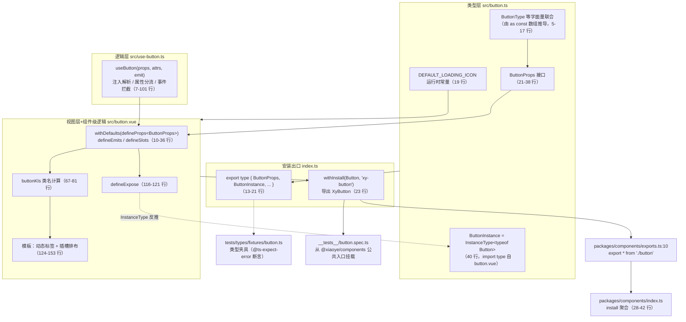
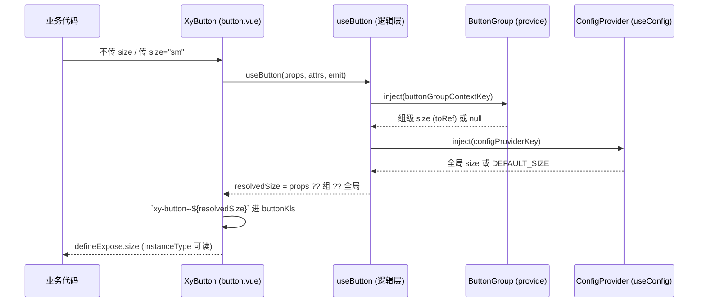

# 4-03 · 标准组件解剖：类型层/视图层/逻辑层三件套

> 本篇是"组件实现卷"的第一篇正餐。我们选最不起眼的样本——按钮——把它解剖到骨头：一个组件目录为什么长成 `index.ts + src/ + __tests__/` 的三段式？类型为什么单独住一个 `.ts` 文件？逻辑为什么要从 SFC 里搬出去？所有代码均摘自当前工作区实态，行号逐一核对过。

## 引子：一个按钮的目录，凭什么有八个文件

先看事实。`packages/components/button/` 在当前工作区的完整结构是：

```text
packages/components/button/
├── index.ts                      # 安装出口（25 行）
├── src/
│   ├── button.ts                 # 类型层：Props / Instance / 字面量常量（40 行）
│   ├── button.vue                # 视图层 + 组件级逻辑（153 行）
│   ├── use-button.ts             # 逻辑层：行为 composable（101 行）
│   ├── constants.ts              # 跨组件注入 key 与上下文类型（11 行）
│   ├── button-group.ts           # 按钮组的类型层（12 行）
│   └── button-group.vue          # 按钮组的视图层（23 行）
└── __tests__/
    └── button.spec.ts            # 运行时契约测试（346 行）
```

八个文件，合计约 720 行，其中 `button.vue` 只占 153 行。再加上样式侧的 `packages/theme/src/components/button.css`（恰好 433 行），一个"看起来最简单"的按钮，全部实现摊开有 1150 余行。第一次翻这个目录的人几乎都会问同一个问题：**至于吗？**

至于。因为这 720 行不是为"按钮"这一个组件写的，而是在为"接下来的 72 个组件"立规矩。本库 72 个正式组件全部遵循同一套目录语法：`index.ts` 安装出口、`src/` 实现体、`__tests__/` 就地测试。这套语法是 AI 协作研发的"仓位语言"——任何一个子代理领到"实现组件 X"的任务，都能按同样的槽位填内容；任何一个审查代理（或人）拿到陌生目录，都知道先读哪个文件、按什么顺序读。

本篇按依赖方向倒着解剖：先看**安装出口**（对外契约），再看**类型层**（契约的 TypeScript 表达），然后进入 **SFC**（视图层与逻辑层的合体），接着拆出**逻辑层**（composable），最后看**测试与类型夹具**如何反向锁住这一切。

## 一、三件套总览：数据怎么流

在进入逐文件精读之前，先建立全局图景。所谓"三件套"，是把传统单文件组件（SFC）一锅炖的内容拆成三个职责面：

- **类型层**（`src/button.ts`）：组件对外的 TypeScript 契约——Props 接口、Instance 类型、字面量联合的常量数组。它不渲染任何东西，是"组件的接口说明书"。
- **视图层 + 组件级逻辑**（`src/button.vue`）：模板结构、类名计算、插槽排布，以及消费类型层生成的 props/emits/slots 声明。
- **逻辑层**（`src/use-button.ts`）：与渲染结构无关的行为——上下文注入、属性分流、事件拦截、键盘语义。它是一个纯函数，接收 props 和 attrs，吐出一堆 computed 和 handler。

三者加上安装出口和数据流，画成一张图：



两条虚线值得多看一眼：`EXPOSE -.-> INST` 是 Instance 类型的来源（`defineExpose` 的内容决定 `InstanceType<typeof Button>` 的形状）；`EXP -.-> FIX` 是类型夹具对导出面的锁死——后者在第六节展开。这张图是全篇的地图，后面每一节都在填它的细节。

## 二、安装出口：25 行的对外契约

`packages/components/button/index.ts` 全文只有 25 行，它是 button 目录里唯一"面向包外"的文件：

```ts
// packages/components/button/index.ts（全文，共 25 行）
import Button from "./src/button.vue";
import ButtonGroup from "./src/button-group.vue";
import type {
  ButtonClickHandler,
  ButtonInstance,
  ButtonProps,
  ButtonNativeType,
  ButtonType
} from "./src/button";
import type { ButtonGroupDirection, ButtonGroupProps } from "./src/button-group";
import { withInstall } from "xiaoye-primitives";

export type {
  ButtonClickHandler,
  ButtonGroupDirection,
  ButtonGroupProps,
  ButtonInstance,
  ButtonNativeType,
  ButtonProps,
  ButtonType
};

export const XyButton = withInstall(Button, "xy-button");
export const XyButtonGroup = withInstall(ButtonGroup, "xy-button-group");
export default XyButton;
```

三个观察点。

**第一，类型从哪里 import，决定了消费方的视角。** 注意第 3-9 行：类型全部来自 `./src/button`，而不是 `./src/button.vue`。也就是说包外使用者拿到的 `ButtonProps`，其出处被安装出口统一收口到了类型层文件。这带来一个直接的好处：`ButtonInstance` 在 `button.ts:40` 里是 `InstanceType<typeof Button>`，类型层文件成为"组件契约"的单一出处——无论你要 Props、事件 handler 签名还是实例类型，都从一个模块拿。

**第二，`withInstall` 是安装协议的实现。** 它来自 `packages/xiaoye-primitives/src/utils/vue/with-install.ts`，核心 27 行：

```ts
// packages/xiaoye-primitives/src/utils/vue/with-install.ts（14-40 行）
function toKebabCase(name: string) {
  return name
    .replace(/([a-z0-9])([A-Z])/g, "$1-$2")
    .replace(/([A-Z])([A-Z][a-z])/g, "$1-$2")
    .toLowerCase();
}

export function withInstall<T>(component: T, name: string) {
  const installable = component as SFCWithInstall<T>;

  installable.install = (app: App) => {
    console.debug(`[withInstall] called for: "${name}"`);
    if (!name) {
      console.error("[withInstall] missing name, component:", component);
      return;
    }
    const aliases = Array.from(new Set([name, toKebabCase(name)]));

    aliases.forEach((alias) => {
      if (!app.component(alias)) {
        app.component(alias, installable as never);
      }
    });
  };

  return installable;
}
```

`withInstall` 做的事情是给组件对象挂一个 `install` 方法，并把这个方法注册成 Vue 插件协议的入口。它注册的标签名是 `name` 与 `toKebabCase(name)` 两个别名的并集——对本库而言这层是冗余保险（`"xy-button"` 本身已是 kebab-case，两个别名相同），但协议上它允许调用方传 PascalCase，`xy-button` 与 `XyButton` 两种标签就都能在模板里使用。这正对应 AGENTS.md 里的硬约定：**组件目录用 kebab-case 主名，TypeScript 标识符用 PascalCase**，`XyButton` 与 `xy-button` 之间只隔着一个 `withInstall`。

**第三，25 行之外还有一条 manifest 驱动链。** 安装出口写完后并不需要手工去 `packages/components/index.ts` 里登记，登记由清单完成。`packages/components/component-manifest.json` 里 button 的条目是：

```json
// packages/components/component-manifest.json（2-13 行，button 条目）
{
  "name": "button",
  "docsGroup": "basic",
  "docsText": "Button 按钮",
  "installExports": ["XyButton", "XyButtonGroup"],
  "installChecks": [
    { "kind": "component", "name": "xy-button" },
    { "kind": "component", "name": "xy-button-group" }
  ],
  "styleImports": ["button"]
}
```

`component-manifest.ts:61-63` 从这份 JSON 推出 `installableComponentExportNames`，`packages/components/index.ts:20-26` 用它从 `exports.ts` 的命名空间里筛出带 `install` 的导出，`install()`（28-42 行）再逐个 `app.use()`。所以新增组件的完整动线是：建目录 → 写安装出口 → `exports.ts` 加一行 `export * from "./button"`（`packages/components/exports.ts:10`）→ 更新 manifest JSON。入口文件 `index.ts` 的聚合逻辑（含 `INSTALL_KEY` 防重复安装，第 9 行）一个字都不用动。**导出的可枚举性被收敛到了清单一处**，这是"目录语法"能规模化到 72 个组件的前提。

聚合入口里还有两个容易被略过的细节。其一是防重复安装：`packages/components/index.ts:9` 用 `Symbol.for("xiaoye-components:installed")` 在 app 实例上打标记（28-42 行的 `install()` 先查后装），全量安装与按需引入混用时不会重复注册组件。其二是全局属性的类型收口：`index.ts:44-50` 用 `declare module "vue"` 给 `ComponentCustomProperties` 挂上 `$loading / $message / $notify` 三个可选成员——命令式服务（函数型组件）走 `globalProperties`，声明式组件走 `app.component`，两条安装路径在同一个入口文件里各归其位。安装出口这个"25 行的小文件"与"55 行的聚合入口"合起来，才是组件库对外安装协议的完整拼图。

## 三、类型层：40 行的 button.ts，全库模式的缩影

`packages/components/button/src/button.ts` 全文 40 行，是类型层的标准样本：

```ts
// packages/components/button/src/button.ts（全文，共 40 行）
import type Button from "./button.vue";
import type { Component } from "vue";
import type { ComponentSize } from "xiaoye-primitives";

export const buttonTypes = [
  "default",
  "primary",
  "success",
  "warning",
  "danger"
] as const;

export const buttonNativeTypes = ["button", "submit", "reset"] as const;

export type ButtonType = (typeof buttonTypes)[number];
export type ButtonNativeType = (typeof buttonNativeTypes)[number];
export type ButtonClickHandler = (event: MouseEvent) => void;

export const DEFAULT_LOADING_ICON = "mdi:loading";

export interface ButtonProps {
  size?: ComponentSize;
  disabled?: boolean;
  type?: ButtonType;
  icon?: string;
  nativeType?: ButtonNativeType;
  loading?: boolean;
  loadingIcon?: string;
  plain?: boolean;
  text?: boolean;
  link?: boolean;
  bg?: boolean;
  autofocus?: boolean;
  round?: boolean;
  circle?: boolean;
  block?: boolean;
  tag?: string | Component;
}

export type ButtonInstance = InstanceType<typeof Button>;
```

40 行里有三个值得驻足的模式。

**模式一：字面量数组 + 索引访问推导。** `buttonTypes` 是一个 `as const` 的运行时数组，`ButtonType` 用 `(typeof buttonTypes)[number]` 从它反推。这一行声明同时产出两样东西：一个真实存在的运行时对象，和一个编译期字面量联合类型（`"default" | "primary" | ...`）。值得如实说明的是：在本组件内部，这两个数组**目前只有类型推导这一个消费者**——归一化判断走的是 `use-button.ts` 里的 computed，没有用数组做 `includes` 校验。数组仍以 `as const` 形态而非纯 `type` 别名存在，换取的是"合法值只有一处事实源"这个结构性质：将来任何运行时校验、文档枚举表、MCP schema 生成，都不必再发明一份平行清单。类型测试夹具立刻兑现了编译期那一半的价值——`tests/types/fixtures/button.ts:17-20` 里 `type: "filled"` 会被 `@ts-expect-error` 断言拒绝，因为 `"filled"` 不在数组里。

**模式二：`import type Button from "./button.vue"` + `InstanceType`。** 第 1 行把 SFC 当作类型模块导入（type-only，编译后擦除，不产生运行时环），第 40 行用 `InstanceType<typeof Button>` 把组件实例类型取出来。`button.vue` 的 `defineExpose`（116-121 行）暴露了 `ref / size / type / disabled` 四个成员，于是 `ButtonInstance` 就是带这四个成员的类型。注意这里形成了一个刻意的**双向 type-only 依赖**：`button.vue` 第 7 行 `import type { ButtonProps } from "./button"`，`button.ts` 第 1 行 `import type Button from "./button.vue"`，外加 `button.ts:19` 的 `DEFAULT_LOADING_ICON` 作为唯一一条 button.ts → button.vue 的**值**依赖（第 6 行）。类型互指被 type-only 导入合法化，运行时依赖仍是单向的（视图层 → 类型层）。

**模式三：Props 是纯接口，默认值在 SFC 里用 `withDefaults` 补。** 这一点是本库与 Element Plus 最实质的分野，值得单独一段。

### 权衡一：类型独立文件 vs SFC 内联（含 EP 对比）

Element Plus 的习惯是"运行时 props 工厂先行"：在 `button.ts` 里先写 `buttonProps` 运行时对象（可以传给编译器、可以被 schema 类工具消费），再用 `ExtractPropTypes<typeof buttonProps>` 反推出 `ButtonProps` 类型——**从运行时推导类型**。本库反着走：`ButtonProps` 是一个纯 TS 接口，SFC 里 `withDefaults(defineProps<ButtonProps>(), {...})` 以泛型实参方式消费，默认值写在 SFC 侧——**从类型出发落到运行时**。

两条路线的取舍是真实的：

- EP 的运行时对象对"只用 JS 的消费者"、对做 props 校验和文档抽取的工具更友好，但运行时对象表达复杂类型（联合、模板字面量、泛型）时要靠构造器函数堆叠，可读性差；
- 本库的纯接口写法让 Props 定义与普通 TS 代码无异，AI 生成与人工审查的成本都最低，代价是默认值与类型分离两处（接口在 `button.ts`，`withDefaults` 在 `button.vue`），改 prop 时要记得看两个文件。

而"类型独立成 `.ts` 文件"这件事本身，动机有三层，一层比一层硬：

1. **Instance 类型导出需要它。** `ButtonInstance = InstanceType<typeof Button>` 这行必须 import 组件本体，写在 SFC 自己的 `<script>` 里会出现"导出类型却拿不到组件引用"的别扭（SFC 的默认导出就是组件本体，技术上可行但把契约混进实现）；独立文件让契约有一个稳定的宿主。
2. **类型测试夹具直接引用它。** `tests/types/fixtures/button.ts:1-4` 从 `"xiaoye-components"` 包根导入 `ButtonProps / ButtonGroupProps`——夹具锁的是"包根导出什么类型"，而这条链的起点就是 `button/index.ts:13-21` 的 `export type` 块，终点回溯到 `button.ts`。
3. **dts 生成稳定。** 本库构建走 ES-only + dts 后处理管线（见 2-03 篇），类型集中在一个纯 TS 模块里，声明文件生成与摇树行为最可预测；如果类型散落在多个 SFC 的泛型宏里，dts 产物对 `vue-tsc` 版本更敏感。

这个模式在本库的覆盖度是**64/73**：我扫了 `packages/components/` 下全部 73 个带 `index.ts` 的目录（72 个组件加一个 `shared` 共享目录），64 个存在 `src/<name>.ts` 类型层文件；9 个例外是 `collapse-transition`、`config-provider`、`empty`、`form`、`icon`、`popover`、`space`、`tag` 和 `shared`——它们的类型要么内联在 SFC，要么本就没有公开 Props 接口（如 `icon`）。也就是说"三件套"是一个**主导模式 + 少量变体**的生态，不是铁板一块，第七节的 tag 就是变体样本。

九个例外值得逐一点名，因为它们的成因恰好构成一个谱系，没有一个是"忘了拆"。**tag / icon / empty / space / popover 五个是"小到不值得拆"**：Props 接口直接 `export interface` 在 SFC 里（`space.vue:5`、`icon.vue:7`、`empty.vue:6`、`popover.vue:15`），安装出口从 `./src/<name>.vue` 导入类型——类型不足十行、逻辑无注入依赖，独立文件反而多一次跳转。**collapse-transition 是"零 props 的极端"**：这个 73 行的 SFC 里没有一个 prop、一个 emit，只有八个 transition 钩子操作 `maxHeight` 与 `overflow`——没有 Props 就没有 Props 接口，类型层自然无从谈起，它是"类型层是契约的表达，没有契约就没有类型层"的活证明。**config-provider 与 form 是"类型搬家而非缺席"**：前者的 `ConfigProviderProps` 住在 `src/context.ts:28`，后者的 `FormProps / FormContext / FormInstance / XyFormRule / FormRules` 集中在 `src/context.ts`（`FormProps` 在 25 行，全文件 64 行）——它们都是 provide/inject 的参与者，契约的本体是"上下文形状"而不是单组件 Props，类型跟着上下文住；form 的 `FormItemProps` 甚至仍留在 `form-item.vue` 里，由 `form/index.ts` 直接从 SFC 导入再导出。最后一个 **shared** 根本不是组件——它是 display 渲染的共享工具目录（`display-component-map.ts` 等），出现在名单里只是因为目录扫描的分母把它算了进去。按成因归组：五个"太小"、一个"没 props"、两个"类型在 context"、一个"非组件"——变体不是模式的破绽，而是模式边界的勘测桩。

### 权衡二：ButtonInstance 导出是必要品还是装饰品

有人会问：`InstanceType<typeof Button>` 这种类型，真有人用吗？答案在本库里至少有三处实锤：

- **模板 ref 场景的消费者**。业务代码写 `const btn = ref<ButtonInstance>()` 后能拿到 `btn.value.size`（解析后的尺寸）、`btn.value.disabled`（解析后的禁用态）——注意这些不是 props 原值，而是三级回退后的**解析值**（下节详述），只有通过 Instance 导出才拿得到。
- **文档与 llms 生成管线**。`scripts/generate-llm-files.mjs:72` 专门有一条正则处理 `ButtonInstance["xxx"]` 形态的类型文本——`apps/docs/components/button.md` 的 Expose 表格里就写着 `` `ButtonInstance["ref"]` `` 等四个暴露成员，生成 llms 文档时被剥壳成字段名。文档工具链直接消费这个导出的**文本形态**。
- **类型夹具的反向锁**。若哪天有人把 `ButtonInstance` 从 `index.ts:17` 的导出块里删掉，`typecheck:types` 不一定会报错（夹具没引用它），但 `index.ts` 的导出白名单审查、以及下游 `ref<ButtonInstance>` 的编译都会断——导出块本身就是契约清单。

所以 Instance 导出不是装饰：它把 `defineExpose` 从"运行时的一个对象字面量"升格为"有编译期形状的公开 API"。SFC 里那个不起眼的 `defineExpose`（`button.vue:116-121`）是这条类型链的地基。

## 四、视图层与组件级逻辑：button.vue 的上半场

进入 `src/button.vue`。先看 script 前半（第 1-84 行），这是类型层被"消费"的现场：

```vue
<!-- packages/components/button/src/button.vue（1-84 行） -->
<script setup lang="ts">
import { computed, useAttrs, watchEffect } from "vue"
import { useNamespace } from "xiaoye-primitives"
import { isDev, warnOnce } from "xiaoye-primitives"
import XyIcon from "../../icon"
import { DEFAULT_LOADING_ICON } from "./button"
import type { ButtonProps } from "./button"
import { useButton } from "./use-button"

const props = withDefaults(defineProps<ButtonProps>(), {
  nativeType: "button",
  loading: false,
  disabled: false,
  loadingIcon: DEFAULT_LOADING_ICON,
  plain: false,
  text: false,
  link: false,
  bg: false,
  autofocus: false,
  round: false,
  circle: false,
  block: false,
  tag: "button"
})

const emit = defineEmits<{
  click: [event: MouseEvent]
}>()

const slots = defineSlots<{
  default?: () => unknown
  icon?: () => unknown
  loading?: () => unknown
  prefix?: () => unknown
  suffix?: () => unknown
}>()
const attrs = useAttrs()
const ns = useNamespace("button")
const {
  buttonRef,
  buttonAttrs,
  handleClick,
  handleKeydown,
  hasBg,
  isLink,
  isPlain,
  isText,
  isDisabled,
  resolvedSize,
  resolvedType
} = useButton(props, attrs, (event, payload) => emit(event, payload))

const iconSizeMap = Object.freeze({
  sm: 14,
  md: 16,
  lg: 18
}) as Readonly<Record<string, number>>

const hasDefaultSlot = computed(() => Boolean(slots.default))
const hasSuffixSlot = computed(() => Boolean(slots.suffix))
const hasCustomLoadingSlot = computed(() => Boolean(slots.loading))
const iconSize = computed(() => iconSizeMap[resolvedSize.value] ?? 16)
const isIconOnly = computed(
  () => !hasDefaultSlot.value && !hasSuffixSlot.value && (!props.loading || !hasCustomLoadingSlot.value)
)
const isCircle = computed(() => props.circle && isIconOnly.value)
const buttonKls = computed(() => [
  ns.base.value,
  `${ns.base.value}--${resolvedType.value}`,
  `${ns.base.value}--${resolvedSize.value}`,
  ns.is("disabled", isDisabled.value),
  ns.is("loading", props.loading),
  ns.is("plain", isPlain.value),
  ns.is("text", isText.value),
  ns.is("link", isLink.value),
  ns.is("round", props.round),
  ns.is("circle", isCircle.value),
  ns.is("block", props.block),
  ns.is("has-bg", hasBg.value),
  ns.is("icon-only", isIconOnly.value)
])
const showLeadingIcon = computed<boolean>(
  () => !props.loading && (Boolean(props.icon) || Boolean(slots.icon) || Boolean(slots.prefix))
)
```

**Emits 和 Slots 为什么住在 SFC 里？** 这是任务层面最常被问到的"类型层完整性"问题：类型层文件里有 Props 和 Instance，却没有 Emits 和 Slots 的定义。原因不是遗漏，而是编译器宏的物理约束——`defineEmits` / `defineSlots` 是 `vue` 的**编译器宏**，只能在 SFC 的 `<script setup>` 里调用，其类型实参（如 `click: [event: MouseEvent]` 的元组签名）会被编译进组件的 emits 选项与实例类型。它们天然是视图层文件的一部分。类型层文件管"数据形状"（Props/Instance/常量），SFC 管"交互签名"（emits/slots），边界划在**能否脱离编译器**这条线上。

**BEM 类名链。** `buttonKls`（67-81 行）是视图层的核心输出。它由 `useNamespace` 生成的类名拼装，实现在 `packages/xiaoye-primitives/src/composables/use-namespace.ts`（全文 17 行）：

```ts
// packages/xiaoye-primitives/src/composables/use-namespace.ts（全文，共 17 行）
import { computed } from "vue";
import { useConfig } from "./use-config";

export function useNamespace(block: string) {
  const { namespace } = useConfig();
  const base = computed(() => `${namespace.value}-${block}`);

  const is = (state: string, active?: boolean) => (active ? `is-${state}` : "");
  const cssVarBlock = (name: string) => `--${namespace.value}-${block}-${name}`;

  return {
    namespace,
    base,
    is,
    cssVarBlock
  };
}
```

类名生成链是三级流水线：`useConfig()` 从 ConfigProvider 注入链拿命名空间（缺省回退到 `DEFAULT_NAMESPACE`，即 `xy`，见 `use-config.ts:45-54` 的默认分支）→ `ns.base` 拼出 `xy-button` → 模板字符串再拼 `--{type}`、`--{size}` 修饰符与 `is-{state}` 状态类。拿 `buttonKls` 对着 `packages/theme/src/components/button.css` 看，两边严丝合缝：`.xy-button`（css 第 1 行）、`.xy-button--sm/--md/--lg`（43-59 行）、`.xy-button.is-disabled`（37-41 行）、`.is-plain`、`.is-icon-only`（330 行）……**SFC 负责产出类名，CSS 负责消费类名，两者之间的协议就是 BEM 命名法**。这也是为什么类名必须走 `ns` 而不是手写字符串——命名空间一旦被 ConfigProvider 改掉（比如 `xy` → `app`），全部样式随 `ns.base` 一起切换，433 行 CSS 无需改动。

`isIconOnly`（63-65 行）这个 computed 最能体现视图层的"语义计算"味道：没有 default 插槽、没有 suffix 插槽、且（不在 loading 态或没有自定义 loading 插槽）三者同时成立才算"纯图标按钮"。它直接决定 `is-circle` 是否生效（66 行）——按钮的圆形态不是 `circle` prop 的复读，而是 `circle && isIconOnly` 的联合判断。测试文件里专门有两条用例（`button.spec.ts:227-254`）锁这个行为：只有 suffix 时不算 icon-only，loading 且带自定义 loading 插槽时也不算。

## 五、逻辑层：use-button.ts 与 433 行 CSS 的隐藏协议

script 的后半段（85-122 行）是开发态防御与暴露面，然后进入模板。先补齐这段：

```vue
<!-- packages/components/button/src/button.vue（86-153 行） -->
if (isDev()) {
  watchEffect(() => {
    const requestedVisualModes = [props.plain, props.text, props.link].filter(Boolean).length

    if (requestedVisualModes > 1) {
      warnOnce("XyButton", "`plain`、`text`、`link` 同时传入时会按 `link > text > plain` 归一化。")
    }

    if (props.bg && !isText.value) {
      warnOnce("XyButton", "`bg` 仅在 `text` 模式下生效。")
    }

    if (props.circle && !isIconOnly.value) {
      warnOnce(
        "XyButton",
        "只有纯图标按钮才会应用 `circle` 布局；带文本、suffix 或自定义 loading 内容时会退回普通布局。"
      )
    }

    const hasAccessibleName =
      hasDefaultSlot.value ||
      typeof attrs["aria-label"] === "string" ||
      typeof attrs["aria-labelledby"] === "string"

    if (isIconOnly.value && !hasAccessibleName) {
      warnOnce("XyButton", "纯图标按钮需要提供 `aria-label` 或 `aria-labelledby`。")
    }
  })
}

defineExpose({
  ref: buttonRef,
  size: resolvedSize,
  type: resolvedType,
  disabled: isDisabled
})
</script>

<template>
  <component
    :is="props.tag"
    ref="buttonRef"
    v-bind="buttonAttrs"
    :class="buttonKls"
    @click="handleClick"
    @keydown="handleKeydown"
  >
    <template v-if="props.loading">
      <slot v-if="$slots.loading" name="loading" />
      <span v-else class="xy-button__icon xy-button__icon--loading">
        <XyIcon :icon="props.loadingIcon" :size="iconSize" spin />
      </span>
    </template>
    <template v-else-if="showLeadingIcon">
      <span class="xy-button__icon">
        <XyIcon v-if="props.icon" :icon="props.icon" :size="iconSize" />
        <slot v-else-if="$slots.icon" name="icon" />
        <slot v-else name="prefix" />
      </span>
    </template>
    <span v-if="hasDefaultSlot" class="xy-button__label">
      <slot />
    </span>
    <span v-if="$slots.suffix" class="xy-button__icon xy-button__icon--suffix">
      <slot name="suffix" />
    </span>
  </component>
</template>
```

模板只有 30 行，但每一段都在做取舍：loading 插槽优先于默认 spinner（134-137 行）、前导图标三级优先 `icon` prop → `icon` 插槽 → `prefix` 插槽（139-145 行）、label 与 suffix 各自包一层 `span` 以便 CSS 控制截断与间距。`<component :is="props.tag">` 是本组件最大的视图层变量——标签可以是 `button`、`a`、`div` 乃至任意组件，**于是所有依赖标签语义的行为都必须由逻辑层显式补齐**。

这就是 `use-button.ts` 存在的理由。全文 101 行：

```ts
// packages/components/button/src/use-button.ts（全文，共 101 行）
import { computed, inject, ref } from "vue";
import { useConfig } from "xiaoye-primitives";
import { formKey } from "../../form/src/context";
import type { ButtonProps, ButtonType } from "./button";
import { buttonGroupContextKey } from "./constants";

export function useButton(
  props: ButtonProps,
  attrs: Record<string, unknown>,
  emit: (event: "click", payload: MouseEvent) => void
) {
  const { size: globalSize } = useConfig();
  const form = inject(formKey, null);
  const buttonGroup = inject(buttonGroupContextKey, null);
  const buttonRef = ref<HTMLElement | null>(null);

  const resolvedSize = computed(
    () => props.size ?? buttonGroup?.size.value ?? globalSize.value
  );
  const resolvedType = computed<ButtonType>(
    () => props.type ?? buttonGroup?.type.value ?? "default"
  );
  const isButtonTag = computed(() => props.tag === "button");
  const isLinkTag = computed(
    () => props.tag === "a" && typeof attrs.href === "string" && attrs.href.length > 0
  );
  const isLink = computed(() => props.link);
  const isText = computed(() => !isLink.value && props.text);
  const isPlain = computed(() => !isLink.value && !isText.value && props.plain);
  const isDisabled = computed(() => props.disabled || props.loading);
  const hasBg = computed(() => isText.value && props.bg);
  const needsButtonRole = computed(() => !isButtonTag.value && !isLinkTag.value);

  const buttonAttrs = computed(() => {
    if (isButtonTag.value) {
      return {
        type: props.nativeType,
        disabled: isDisabled.value,
        autofocus: props.autofocus,
        "aria-busy": props.loading ? "true" : undefined
      };
    }

    return {
      role: needsButtonRole.value ? "button" : undefined,
      "aria-disabled": isDisabled.value ? "true" : undefined,
      "aria-busy": props.loading ? "true" : undefined,
      tabindex: isDisabled.value ? -1 : (needsButtonRole.value ? 0 : attrs.tabindex)
    };
  });

  function handleClick(event: MouseEvent) {
    if (isDisabled.value) {
      event.preventDefault();
      event.stopPropagation();
      return;
    }

    if (isButtonTag.value && props.nativeType === "reset" && form) {
      event.preventDefault();
      form.resetFields();
    }

    emit("click", event);
  }

  function handleKeydown(event: KeyboardEvent) {
    if (!needsButtonRole.value) {
      return;
    }

    if (event.key !== "Enter" && event.key !== " ") {
      return;
    }

    event.preventDefault();

    if (isDisabled.value) {
      event.stopPropagation();
      return;
    }

    buttonRef.value?.click();
  }

  return {
    buttonRef,
    buttonAttrs,
    handleClick,
    handleKeydown,
    hasBg,
    isLink,
    isPlain,
    isText,
    isButtonTag,
    isDisabled,
    needsButtonRole,
    resolvedSize,
    resolvedType
  };
}
```

逐段拆解这份逻辑层的四个关键词。

**注入链**：`use-button.ts:12-14` 一口气接了三条上游——`useConfig()`（ConfigProvider 的全局尺寸）、`formKey`（表单上下文，跨目录从 `../../form/src/context` 导入）、`buttonGroupContextKey`（按钮组上下文，来自同目录 `constants.ts`）。`resolvedSize`（17-19 行）实现三级回退：**props 显式传入 → 按钮组继承 → 全局默认**。这个回退链是"组件库为什么需要逻辑层"的最佳注解——它不是渲染问题，而是上下文解析问题；`button-group.vue:13-16` 用 `provide(buttonGroupContextKey, { size: toRef(props, "size"), type: toRef(props, "type") })` 提供数据，消费完全在逻辑层。承载这条注入线的 `constants.ts` 全文只有 11 行：

```ts
// packages/components/button/src/constants.ts（全文，共 11 行）
import type { InjectionKey, Ref } from "vue";
import type { ComponentSize } from "xiaoye-primitives";
import type { ButtonType } from "./button";

export interface ButtonGroupContext {
  size: Ref<ComponentSize | undefined>;
  type: Ref<ButtonType | undefined>;
}

export const buttonGroupContextKey: InjectionKey<ButtonGroupContext> =
  Symbol("xiaoye-button-group");
```

`InjectionKey<T>` 是 Vue 提供的"带类型的 Symbol 容器"：provide 与 inject 双方都引用同一个 key 常量，泛型参数 `ButtonGroupContext` 就自动约束了两端的值形状。把它单独放一个文件而非塞进 `use-button.ts`，是因为 import 方向——`button-group.vue`（provide 方）和 `use-button.ts`（inject 方）都要引它，放任何一侧都会制造 Provider → Consumer 的反向依赖；`constants.ts` 是双方共同的下沉层。这与 avatar 目录里的 `src/context.ts` 是同一个手法，跨组件注入 key 独立成文件，是三件套之外约定俗成的"第四小件"。

**属性分流**：`buttonAttrs`（34-50 行）按标签分成两支。原生 `<button>` 走 `disabled` 属性 + `nativeType`；非按钮标签走无障碍三件套——`role="button"`、`aria-disabled`（HTML 的 `a`/`div` 不认 `disabled` 属性，必须用 ARIA 表达禁用）、`tabindex`（禁用时 -1 移出焦点序，可交互的 `div` 角色补 0）。`needsButtonRole`（32 行）做了精细区分：`tag="a"` 且带 `href` 时浏览器已有链接语义，不重复挂 `role`；`tag="div"` 时才补。

**事件拦截**：`handleClick`（52-65 行）三段式——禁用或 loading 时 `preventDefault + stopPropagation` 双杀（loading 即禁用，见 30 行 `isDisabled = props.disabled || props.loading`，这就是"loading 态禁点"的实现位）；表单内 `native-type="reset"` 时拦下原生提交行为、改为调 `form.resetFields()`；最后才 `emit("click")`。`handleKeydown`（67-84 行）给非语义标签补键盘行为：只认 Enter 和空格，`preventDefault` 后转发 `buttonRef.click()`，让 `div` 角色的按钮拥有与原生按钮一致的键盘协议。

**归一化**：`isLink / isText / isPlain`（27-29 行）是一条互斥链——`link` 最优先，`text` 其次，`plain` 末位。三个布尔 prop 传入时不是叠加而是归一成一种视觉模式，与 dev 警告的文案（"`plain`、`text`、`link` 同时传入时会按 `link > text > plain` 归一化"）互为表里。归一化逻辑放在 computed 而非 prop 传入口，意味着用户传入的 props 原值不被篡改、归一结果可被 Instance 与类名分别消费。

至于按钮组那 23 行的 `button-group.vue`——`provide` 注入 + BEM 容器类 + direction 修饰符——它是同一套语法的最小复刻，此处不再展开。而 `constants.ts` 把 `InjectionKey<ButtonGroupContext>` 用 `Symbol` 收口（`buttonGroupContextKey = Symbol("xiaoye-button-group")`），让 provide/inject 获得类型安全的 key——上下文类型 `ButtonGroupContext { size, type }` 也跟着住在类型侧。**逻辑层的"跨组件依赖"全部被压进了 11 行的 constants.ts 和 101 行的 composable 里**，SFC 保持纯视图。

## 六、测试与类型夹具：契约的两道反向锁

三件套的第三件是 `__tests__`。从 346 行的 `button.spec.ts` 里选两段最有代表性的。

第一段，loading 态事件拦截（102-116 行）：

```ts
// packages/components/button/__tests__/button.spec.ts（102-116 行）
it("在 loading 时阻止点击事件", async () => {
  const wrapper = mount(XyButton, {
    props: {
      loading: true
    },
    slots: {
      default: "保存"
    }
  });

  await wrapper.trigger("click");

  expect(wrapper.emitted("click")).toBeUndefined();
  expect(wrapper.classes()).toContain("is-loading");
});
```

第二段，非 button 标签的键盘语义（184-204 行）：

```ts
// packages/components/button/__tests__/button.spec.ts（184-204 行）
it("支持非 button 标签的键盘触发语义", async () => {
  const wrapper = mount(XyButton, {
    props: {
      tag: "div"
    },
    slots: {
      default: "自定义按钮"
    }
  });

  await wrapper.trigger("keydown", {
    key: "Enter"
  });
  await wrapper.trigger("keydown", {
    key: " "
  });

  expect(wrapper.attributes("role")).toBe("button");
  expect(wrapper.attributes("tabindex")).toBe("0");
  expect(wrapper.emitted("click")).toHaveLength(2);
});
```

两段用例的断言对象值得注意：类名（`is-loading`）、属性（`role`、`tabindex`）、事件（`emitted`）——**全是公共契约面，不碰任何内部实现**。而且文件第 4 行统一从 `@xiaoye/components` 包根导入组件，而不是从组件目录相对路径导入。这意味着测试锁的是"用户拿到手的组件"，哪怕有人重构了 `use-button.ts` 的全部内部结构，只要契约面不变，测试照绿。

第五节提到的 dev 态警告，也有一段专门的测试基建支撑。警告代码包在 `if (isDev())` 里，而测试环境的 `isDev` 取决于 `import.meta.env`，于是 `button.spec.ts:6-16` 直接把 `@xiaoye-primitives` mock 掉：

```ts
// packages/components/button/__tests__/button.spec.ts（6-16 行）
vi.mock("@xiaoye/primitives", async () => {
  const actual = await vi.importActual<typeof import("@xiaoye/primitives")>("@xiaoye/primitives");

  return {
    ...actual,
    isDev: () => true,
    warnOnce: (scope: string, message: string) => {
      console.warn(`[${scope}] ${message}`);
    }
  };
});
```

`vi.importActual` 保留基础设施包的真实实现，只覆写两个函数：`isDev` 强制为 `true` 让警告分支生效，`warnOnce` 改写为 `console.warn` 以便 `vi.spyOn(console, "warn")` 断言。这背后还有一层设计：`warnOnce` 本身带去重集合（`dev.ts:27-40`），若不 mock，多个用例触发同一警告时只有第一次会真正输出，逐用例断言就会互相污染。**开发态防御逻辑也是契约的一部分，而测试通过模块 mock 把"开发态"变成可复现的实验条件**。

### 权衡三：测试放组件目录 vs 顶层测试目录

本库选择测试跟着组件走（`packages/components/<name>/__tests__/`），而不是集中一个顶层 `tests/unit/`。三个理由：

1. **可发现性**。改 `button/src/button.vue` 的人视线范围内就是 `__tests__/button.spec.ts`，AI 子代理按目录语法找测试零成本；集中式目录则需要一层"组件 → 测试文件"的映射约定。
2. **vitest 的默认发现**。根 `vitest.config.ts:14-19` 的 `exclude` 只排除 `tests/e2e/**`、`node_modules` 与 `dist`，没有任何针对 `__tests__` 的特殊 `include`——按 glob 默认规则全仓扫描，组件目录里的 spec 天然被发现。目录约定吃的是工具默认值，而不是额外配置。
3. **与类型夹具分层**。运行时测试就地放，类型测试集中在 `tests/types/fixtures/`（105 个 `.ts` 夹具，`tsconfig.json:6` 的 `include` 是 `["../../env.d.ts", "./**/*.ts"]`，由 `pnpm typecheck:types` 用 `vue-tsc --noEmit` 整体校验）。前者贴近实现、后者贴近包边界，两个层次各有其位。

button 对应的类型夹具 `tests/types/fixtures/button.ts` 全文 58 行，是"从包根消费类型"的标准姿势：

```ts
// tests/types/fixtures/button.ts（全文，共 58 行）
import type {
  ButtonGroupProps,
  ButtonProps
} from "xiaoye-components";

const buttonProps: ButtonProps = {
  type: "primary",
  size: "md",
  plain: true,
  icon: "mdi:magnify",
  loadingIcon: "mdi:loading",
  tag: "a"
};

void buttonProps;

const invalidButton: ButtonProps = {
  // @ts-expect-error invalid type should be rejected
  type: "filled"
};

void invalidButton;

const invalidVariantButton: ButtonProps = {
  // @ts-expect-error legacy variant has been removed
  variant: "outline"
};

void invalidVariantButton;

const invalidStatusButton: ButtonProps = {
  // @ts-expect-error legacy status has been removed
  status: "primary"
};

void invalidStatusButton;

const invalidIconButton: ButtonProps = {
  // @ts-expect-error icon should be a string
  icon: 1
};

void invalidIconButton;

const groupProps: ButtonGroupProps = {
  type: "success",
  size: "lg",
  direction: "vertical"
};

void groupProps;

const invalidGroupProps: ButtonGroupProps = {
  // @ts-expect-error invalid direction should be rejected
  direction: "stacked"
};

void invalidGroupProps;
```

这份夹具一半是"合法用法能编译"的正向断言，一半是 `@ts-expect-error` 的**反向断言**——类型必须报错，否则 `@ts-expect-error` 自己变成未使用的错误标记，`vue-tsc` 照样炸。特别注意中间三条：`variant`、`status` 这两个**旧 API 字段被显式断言为"必须不存在"**。这是类型层的回归防线：任何试图把废弃 prop 悄悄加回接口的改动，都会在 `pnpm typecheck:types` 处被拦下。运行时测试锁行为，类型夹具锁边界，两道锁互不替代。

## 七、对照样本：tag 的变体与 avatar 的复刻

用两个对照样本验证"三件套"是不是 button 的特例。

**tag：更小，但是模式变体。** `packages/components/tag/index.ts` 全文 8 行：

```ts
// packages/components/tag/index.ts（全文，共 8 行）
import Tag from "./src/tag.vue";
import type { TagCloseHandler, TagProps } from "./src/tag.vue";
import { withInstall } from "xiaoye-primitives";

export type { TagCloseHandler, TagProps };

export const XyTag = withInstall(Tag, "xy-tag");
export default XyTag;
```

注意第 2 行：tag 的类型是从 `./src/tag.vue` 导入的——它没有独立的 `src/tag.ts`，`TagProps` 就定义在 SFC 内部（`tag/src/tag.vue:10-17`）。tag 的组件级逻辑也更薄：`resolvedStatus`（38-56 行）在 `status` 与 legacy `type` 之间做优先级归一（`status` 优先，`type` 按旧枚举映射到新状态色），关闭按钮（模板 91-99 行）是自带 `aria-label="close"` 的原生 button 并 `@click.stop` 阻止冒泡。整体 101 行，一个文件装下了类型、逻辑与视图——**当组件小到类型不足 10 行、逻辑无注入依赖时，三件套可以合并成一件**，但安装出口（`withInstall` + 类型再导出 + kebab 标签）一步都不少。模式的一致性体现在**出口协议**上，而不是内部文件数上。

**avatar：结构一致的复刻。** `packages/components/avatar/` 与 button 同构：`index.ts`（30 行）从 `./src/avatar.ts` 导入 `AvatarProps / AvatarShape / AvatarFit / AvatarErrorHandler` 再导出，`src/avatar.ts`（15 行）是纯类型层：

```ts
// packages/components/avatar/src/avatar.ts（全文，共 15 行）
import type { ComponentSize } from "xiaoye-primitives";

export type AvatarShape = "circle" | "square";
export type AvatarFit = "fill" | "contain" | "cover" | "none" | "scale-down";
export type AvatarErrorHandler = (event: Event) => void;

export interface AvatarProps {
  size?: number | ComponentSize;
  shape?: AvatarShape;
  icon?: string;
  src?: string;
  alt?: string;
  srcSet?: string;
  fit?: AvatarFit;
}
```

它的 `avatar.vue`（106 行）同样把类名计算留给 SFC、把上下文解析留给注入——`avatarClasses`（50-56 行）产 BEM 类名，`sizeStyle`（58-71 行）则展示了 BEM 之外的另一条输出通道：当 `size` 是数字时，组件不改类名，而是往根节点挂 `--xy-avatar-size` 等三个 CSS 变量，让 433 行之外的 `avatar.css`（75 行）按变量取值。类名管离散档位、CSS 变量管连续值，这条分工协议与 button 是同一套。

再往深看一层，avatar 还演示了类型层在"复合组件"下的分工：`src/avatar-group.ts`（42 行）承载数据驱动的 `AvatarGroupProps`，其中 `placement?: TooltipProps["placement"]`（38 行）直接从 tooltip 组件的类型层借字段——组件类型层之间的组合复用，和组件值之间的依赖一样是显式的。值得注意的是 `AvatarGroupItemSlotProps`（20-23 行，作用域插槽的入参形状）这类"插槽细节类型"，在基础层直接从 `avatar/index.ts:17-26` 的导出块对外导出；而在增强层（`xiaoye-pro-components`），同类插槽入参类型被根入口边界规则明确挡在外面。**同一套三件套语法，在基础层和增强层有着宽严不同的导出纪律**——这为后面讲增强层的篇章埋了个伏笔。

把三个样本放在一起，可以给"标准组件目录"下一个精确的定义：**安装出口协议是常量（`withInstall` + 类型再导出 + kebab 标签名），三件套结构是默认（64/73 有独立类型层），合并与变体是被规模许可的例外**。

## 八、收束：目录即接口

最后补一张图，收拢"逻辑层三级回退"这条贯穿全文的线——`size` 这个 prop 从用户传入到落成类名与 Instance 暴露值的完整旅程：



现在可以回答标题的问题了。**一个组件目录长成 `index.ts + src/ + __tests__/`，是因为这个库把"组件"理解成三层契约的合成物**：类型层是编译期契约（给 TypeScript、类型夹具、dts、文档生成器看），视图层与逻辑层是运行时契约（给浏览器和测试看），安装出口是包级契约（给全库消费者看）。三件套拆分让每一层都能被单独替换、单独测试、单独生成——AI 协作研发对此尤其敏感：子代理可以并行地"补类型夹具"、"改 composable"、"加用例"而互不踩脚，因为槽位是正交的。

这套语法不是本库发明——Element Plus 在 2.x 重构中同样把类型从 SFC 抽到了 `button.ts` 一类的独立文件——但本库把它贯彻成了 manifest 驱动、夹具反向锁定的工程闭环，让 72 个组件共享同一种"目录方言"。

下一篇我们看一个藏在几乎所有表单组件里的幽灵：**4-04《受控/非受控双模的现状与考古》**——`v-model` 到底怎么落地，`defineModel` 用了没有，哪些组件还在手写 `update:modelValue`，以及这套双模在仓库里留下的演化地层。

---

**附：本篇引用源码索引**（均在当前工作区实态核对）

| 文件 | 引用区间 |
| --- | --- |
| `packages/components/button/index.ts` | 全文 1-25 |
| `packages/components/button/src/button.ts` | 全文 1-40 |
| `packages/components/button/src/button.vue` | 1-84、86-153 |
| `packages/components/button/src/use-button.ts` | 全文 1-101 |
| `packages/components/button/src/constants.ts` | 全文 1-11 |
| `packages/components/button/src/button-group.vue` | 13-16 |
| `packages/components/button/__tests__/button.spec.ts` | 102-116、184-204（另提及 227-254） |
| `packages/components/tag/index.ts` | 全文 1-8 |
| `packages/components/tag/src/tag.vue` | 10-17、38-56、91-99 |
| `packages/components/avatar/src/avatar.ts` | 全文 1-15 |
| `packages/components/avatar/src/avatar.vue` | 50-71 |
| `packages/xiaoye-primitives/src/composables/use-namespace.ts` | 全文 1-17 |
| `packages/xiaoye-primitives/src/composables/use-config.ts` | 45-54 |
| `packages/xiaoye-primitives/src/utils/vue/with-install.ts` | 14-40 |
| `packages/components/component-manifest.json` | 2-13 |
| `packages/components/component-manifest.ts` | 61-63 |
| `packages/components/index.ts` | 9、20-26、28-42 |
| `packages/components/exports.ts` | 10 |
| `tests/types/fixtures/button.ts` | 全文 1-58 |
| `packages/theme/src/components/button.css` | 1-59、330（共 433 行） |
| `vitest.config.ts` | 14-19 |
