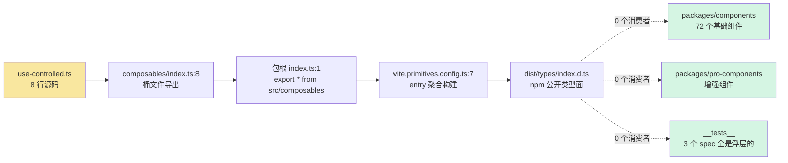
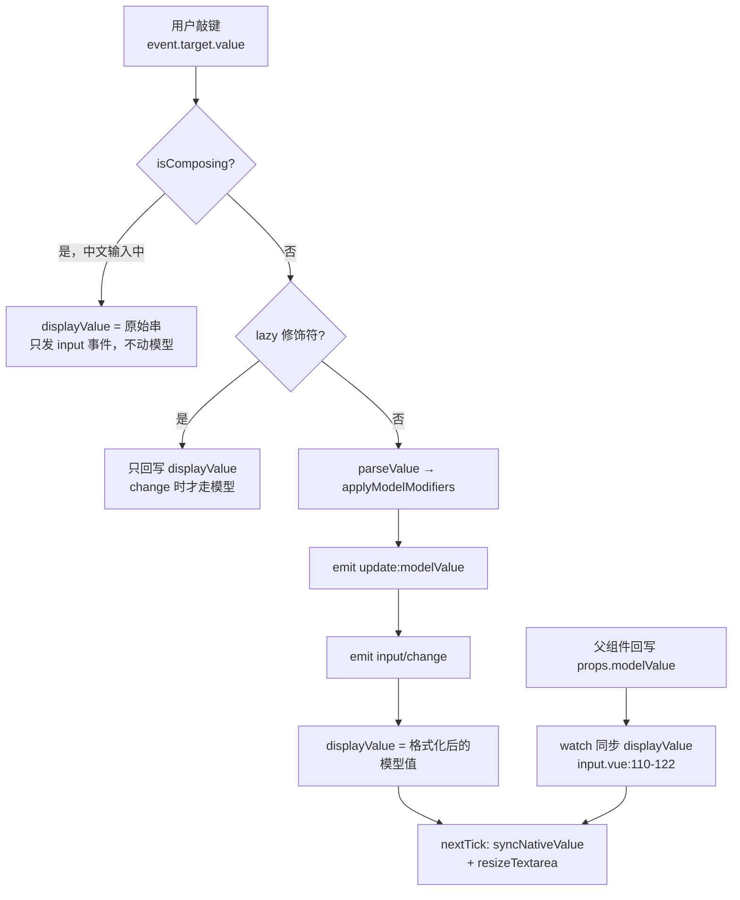
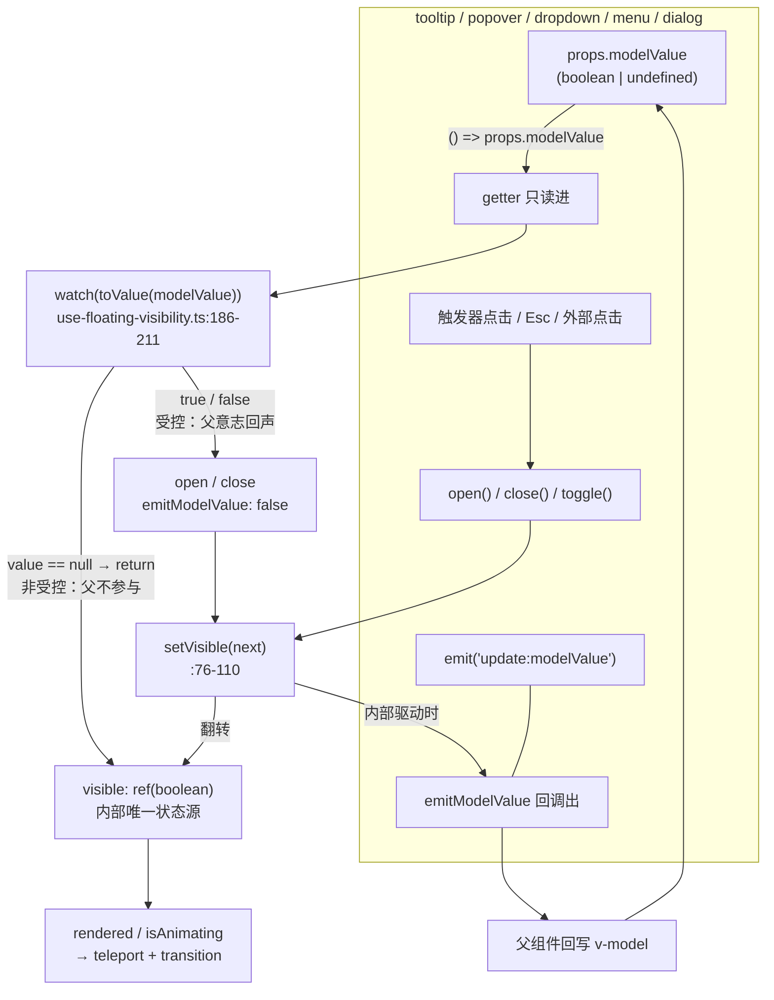

# 4-04 · 受控/非受控双模的现状与考古

> 本篇是「组件机制」章节的第四篇，也是全专栏少有的一篇"考古"：研究对象不是某个组件，而是一件**出土文物**——`packages/xiaoye-primitives/src/composables/use-controlled.ts`，全文 8 行，从初始化提交至今只被改过一次，导出链完整、类型声明齐全，却找不到任何一个消费者。核心问题只有一个：**这 8 行的 `useControlled` 为什么没人用？** 我们会把它放进地层里对着两具"活体"对照解剖——`input` 的纯受控 emit 链、`dialog`/`tooltip` 的浮层双模——看看组件层真实的受控/非受控实践长什么样，再拿 Element Plus 的 `useModelToggle` 做一次他山之石的比对。所有路径、行号均在当前工作区逐一核对。

---

## 一、案发现场：8 行代码与 0 个消费者

先把文物本体完整挖出来。`packages/xiaoye-primitives/src/composables/use-controlled.ts`，全文 8 行，一行不多一行不少：

```ts
import { computed } from "vue";

export function useControlled<T>(getter: () => T, setter: (value: T) => void) {
  return computed<T>({
    get: getter,
    set: setter
  });
}
```

它做的事情用一句话就能说完：把一个 getter 和一个 setter 缝成一个可写 `computed`。按 Vue 的惯用语境，这就是"受控代理"的最小形态——读的时候透传 props，写的时候回调给父组件，理论上正是 `v-model` 组件内部最需要的那块胶水。

它的导出链也是齐全的。`packages/xiaoye-primitives/src/composables/index.ts:8` 把它和 12 个邻居一起抬进 composables 桶文件：

```ts
export * from "./shared-context";
export * from "./use-namespace";
export * from "./use-config";
export * from "./use-z-index";
export * from "./use-overlay-stack";
export * from "./use-overlay-dialog";
export * from "./use-throttle-render";
export * from "./use-controlled";
export * from "./use-dismissible-layer";
export * from "./use-floating-panel";
export * from "./use-floating-visibility";
export * from "./use-focus-trap";
export * from "./use-list-navigation";
```

桶文件再经包根入口 `packages/xiaoye-primitives/index.ts:1-2` 聚合：

```ts
export * from "./src/composables";
export * from "./src/utils";
```

构建侧，`vite.primitives.config.ts:7` 把 `packages/xiaoye-primitives/index.ts` 指定为唯一 entry，`packages/xiaoye-primitives/package.json` 的 `types` 字段指向 `./dist/types/index.d.ts`——也就是说，`useControlled` 会随构建产物一并进入 npm 包的类型面，成为对外的公开 API。**声明它是公开的，实现它是完整的，链接它是闭合的。**

然后是考古的核心证据：消费清单。在仓库根目录跑：

```console
$ rg 'useControlled|use-controlled' packages apps --files-with-matches
packages/xiaoye-primitives/src/composables/index.ts
packages/xiaoye-primitives/src/composables/use-controlled.ts
```

命中两个文件，一个是它的导出者，一个是它自己。**零消费。** 组件层（`packages/components`、`packages/pro-components`）和文档应用（`apps/docs`、`apps/playground`）没有任何一处 import 它。

零消费之外还是零测试：`packages/xiaoye-primitives/__tests__/` 目录下只有三个 spec——`use-floating-visibility.spec.ts`、`use-overlay-dialog.spec.ts`、`use-overlay-stack.spec.ts`，全是浮层三兄弟的，没有 `use-controlled` 的位置。

更残酷的对照来自它的 13 个同层邻居。逐一在组件层检索消费文件，结果几乎是一边倒的：`useNamespace`、`useConfig` 服务几乎所有组件；`useFocusTrap` 被 `dialog`、`drawer`、`image-viewer` 消费；`useListNavigation` 被 `dropdown`、`select`、`time-select` 消费；`useDismissibleLayer` 被 `select`、`table` 的 filter-panel 消费；`useFloatingPanel` 被 `select`、`menu`、`sub-menu` 消费；`useThrottleRender` 被 `skeleton` 消费；`useZIndex` 被 `message`、`notification` 消费；`useOverlayStack`、`useOverlayDialog`、`useFloatingVisibility` 各自撑起浮层体系。13 个文件里 12 个是活代码，**唯一零消费的就是 `useControlled`**。它不是"还没轮到"的生僻工具——它是同层里孤立的孤儿。

git 地层也干净得反常：`git log --follow` 显示 `use-controlled.ts` 全部历史只有两次提交——`ff2024b`（初始化基础设施）和 `323e9a7`（Phase 1 + Phase 2 核心组件），之后再也没有人碰过它。它出生时就在那里，然后被完整地遗忘了。

用一张图把这条"完整却空转"的链路画出来：



实线是导出链，每一环都真实存在；虚线是消费链，每一环都不存在。一件"基建完整、无人问津"的文物，这就是案发现场的全部静态证据。

---

## 二、地层一：表单控件根本没有"非受控"半边

要回答"为什么没人用"，得先看组件层真实的受控实践长什么样。第一个标本是 `input`——表单控件里写路径最复杂的那个。

`packages/components/input/src/input.vue:35` 给了 `modelValue` 一个默认值 `""`，`:66-73` 声明了完整的事件面：

```ts
const emit = defineEmits<{
  "update:modelValue": [value: InputValue];
  input: [value: InputValue];
  change: [value: InputValue];
  clear: [];
  focus: [event: FocusEvent];
  blur: [event: FocusEvent];
}>();
```

读路径从 `input.vue:104` 开始：

```ts
const nativeValue = computed(() => (props.modelValue == null ? "" : String(props.modelValue)));
```

注意这里的形状：`nativeValue` 是一个**只读派生**——从 `props.modelValue` 单向算出原生输入框该显示的值，再经 `input.vue:110-122` 的 watcher 同步进本地显示状态：

```ts
watch(
  () => props.modelValue,
  () => {
    displayValue.value = formatDisplayValue(nativeValue.value);
    nextTick(() => {
      syncNativeValue();
      resizeTextarea();
    });
  },
  {
    immediate: true
  }
);
```

这里没有 `props.modelValue ?? innerRef`，没有内部兜底值，没有可写代理。显示值 `displayValue` 是一个独立 `ref`，与 `props.modelValue` 之间是**单向 watch 同步**而非双向绑定——因为显示值和模型值本来就不是同一个东西：`formatter` 会把模型值格式化成展示串，`modelModifiers` 的 `trim`/`number`/`lazy` 会改变写回语义，中文输入法的 composing 阶段（`input.vue:305-309`）还要临时脱离模型自行渲染。

再看写路径。`input.vue:286-299` 的 `emitModelValue` 和 `:301-328` 的 `handleInput`，是整个组件真正的"心脏"：

```ts
function emitModelValue(value: string, source: "input" | "change") {
  const parsed = parseValue(value);
  const modelValue = applyModelModifiers(parsed);

  emit("update:modelValue", modelValue);

  if (source === "input") {
    emit("input", modelValue);
  } else {
    emit("change", modelValue);
  }

  return modelValue;
}

function handleInput(event: Event) {
  const target = event.target as NativeInputElement;
  const rawValue = target.value;

  if (isComposing.value) {
    displayValue.value = rawValue;
    emit("input", rawValue);
    return;
  }

  if (props.modelModifiers.lazy) {
    displayValue.value = props.formatter ? formatDisplayValue(parseValue(rawValue)) : rawValue;
    syncNativeValue();
    resizeTextarea();
    emit("input", applyModelModifiers(parseValue(rawValue)));
    return;
  }

  const modelValue = emitModelValue(rawValue, "input");
  displayValue.value = props.formatter
    ? formatDisplayValue(String(modelValue))
    : String(modelValue);

  nextTick(() => {
    syncNativeValue();
    resizeTextarea();
  });
}
```

这条写路径的完整动作序列是：取原生值 → `parser` 反解析 → 应用 model modifiers → emit `update:modelValue` → 按 `source` 补发 `input` 或 `change` → 用**返回值**回写本地 `displayValue` → `nextTick` 后把值硬同步回原生 DOM（`input.vue:226-236` 的 `syncNativeValue`）并重算 textarea 高度。清空按钮的 `clear()`（`input.vue:345-354`）则是同一套动作的减配版，外加 `formItem?.clearValidate()`。

把这条链画出来：



这张图解释了第一个地层结论：**`input` 是纯受控组件，它压根没有实现"非受控半边"。** `modelValue` 有默认值 `""`（`input.vue:35`），视图状态永远从 props 派生，组件内部不保存任何"自己的值"——`displayValue` 只是显示缓存，不是状态源。所谓写路径，本质是"发事件 + 就地修正显示缓存"两件事的组合。

第二个标本 `switch` 把这个结论推到极致。`packages/components/switch/src/switch.vue:56`，读路径只有一行：

```ts
const switchChecked = computed(() => props.modelValue === props.activeValue);
```

注意是 `=== activeValue` 的**比较语义**，不是透传——`activeValue`/`inactiveValue` 允许业务把开关映射成任意值。写路径 `switch.vue:131-138`：

```ts
async function emitValue(value: SwitchValue) {
  emit("update:modelValue", value);
  emit("input", value);
  emit("change", value);
  await validateChange();
  await nextTick();
  syncInputChecked();
}
```

连发三个事件、触发表单校验、再把勾选态硬同步回内嵌的原生 `<input>`（`switch.vue:104-108`）。而写路径的入口还要先过一道闸——`beforeChange` 支持返回 Promise 的异步拦截，`switch.vue:149-177`：

```ts
async function canSwitch() {
  if (!props.beforeChange) {
    return true;
  }

  const result = props.beforeChange();

  if (typeof result === "boolean") {
    return result;
  }

  if (!isPromiseLike(result)) {
    console.warn("[XySwitch] beforeChange 必须返回 boolean 或 Promise<boolean>。");
    return false;
  }

  pending.value = true;

  try {
    return await result;
  } catch {
    return false;
  } finally {
    pending.value = false;
    nextTick(() => {
      syncInputChecked();
    });
  }
}
```

一个"拨一下开关"的用户动作，在到达 `emit("update:modelValue")` 之前要依次经过：禁用判定（含 `loading` 与 `pending`）、`beforeChange` 的同步/异步拦截、失败告警、`pending` 态标记，通过后才进入上面的三事件链。到这里，"写路径"三个字在本库的真实含义已经清楚：它不是一次赋值，是一段有审批流的编排。

于是第一层答案浮出来了：**本库表单控件的惯用法是"纯受控 + 副作用 emit 链"，根本没有"props.modelValue ?? innerRef"这种双模写法。** `useControlled` 提供的"读写代理"在这套惯用法里没有落点——读路径是派生或比较（`nativeValue`、`switchChecked`），写路径是一条带 `formatter`/`modifiers`/校验/多事件的副作用流水线，都不是一个 `(get, set)` 透传代理能承接的形状。

顺带一提，全仓库对 `defineModel` 的检索结果同样是零：`rg -l 'defineModel' packages apps` 无命中。也就是说，组件层连 Vue 3.4 的语言级受控代理都没有采用，所有组件统一手写 `defineProps` + `defineEmits` + 派生 `computed` + 显式 emit。这一点我们在第六章展开。

---

## 三、地层二：真正的双模活在浮层体系里

如果表单控件是"纯受控"，那本库有没有真正的"受控/非受控双模"？有，但不在 `useControlled` 里，而在浮层基础设施 `use-floating-visibility.ts` 里。

先看需求侧。`packages/components/dialog/src/dialog.ts:33` 的类型声明是：

```ts
export interface DialogProps {
  modelValue?: boolean;
  ...
}
```

`modelValue` 是**可选的**——`:76-80` 的运行时 props 里给了 `default: false`。业务上 `<xy-dialog />` 不绑 `v-model` 也能用 `ref` 调 `open()`/`close()`，或者干脆只用 service 形态弹出。也就是说，dialog 必须回答那个经典问题：**外部绑了 `modelValue` 时听父组件的；没绑时自己管自己。** 这才是"受控/非受控双模"的完整定义。

实现落在 `packages/xiaoye-primitives/src/composables/use-floating-visibility.ts`。它的选项接口（`:4-21`）里有两处关键签名：

```ts
export interface FloatingVisibilityOptions {
  modelValue?: MaybeRefOrGetter<boolean | undefined>;
  disabled?: MaybeRefOrGetter<boolean | undefined>;
  persistent?: MaybeRefOrGetter<boolean | undefined>;
  openDelay?: MaybeRefOrGetter<number | undefined>;
  closeDelay?: MaybeRefOrGetter<number | undefined>;
  beforeOpen?: (source: "internal" | "external") => void;
  beforeClose?: (source: "internal" | "external") => void;
  emitModelValue?: (value: boolean) => void;
  onOpen?: (source: "internal" | "external") => void;
  onClose?: (source: "internal" | "external") => void;
  immediateExternal?: MaybeRefOrGetter<boolean | undefined>;
  /**
   * 探测面板关闭动画是否仍在播放（仅在真实浏览器检测到 CSS transition/animation 时为 true）。
   */
  isLeaveAnimating?: () => boolean;
}
```

两个关键成员：`modelValue` 是**只读的** `MaybeRefOrGetter`，而内部状态变化通过 `emitModelValue` **回调**上报。注意它没有接收任何 setter——这不是 `useControlled` 那种 `(get, set)` 对缝，而是"只读进 + 回调出"。

内部实现（`:53-58`）里，`visible` 是一个纯粹的内部 `ref`：

```ts
export function useFloatingVisibility(options: FloatingVisibilityOptions = {}) {
  const visible = ref(false);
  const rendered = ref(Boolean(toValue(options.modelValue)) || Boolean(toValue(options.persistent)));
  const isAnimating = ref(false);
  let openTimer: number | null = null;
  let closeTimer: number | null = null;
```

写状态的唯一入口是 `setVisible`（`:76-110`），它按顺序完成：清定时器、置 `rendered`、触发 `beforeOpen`/`beforeClose` 钩子、翻转内部 `visible`，然后在 `:100-102` 把新值通过回调交出去：

```ts
    visible.value = nextVisible;

    if (emitModelValue) {
      options.emitModelValue?.(nextVisible);
    }
```

而外部到内部的通道是 `:186-211` 的 watcher，这里藏着整个双模的哨兵判定：

```ts
  watch(
    () => toValue(options.modelValue),
    (value) => {
      if (value == null) {
        return;
      }

      if (value) {
        open({
          emitModelValue: false,
          source: "external",
          immediate: Boolean(toValue(options.immediateExternal))
        });
        return;
      }

      close({
        emitModelValue: false,
        source: "external",
        immediate: Boolean(toValue(options.immediateExternal))
      });
    },
    {
      immediate: true
    }
  );
```

三段逻辑，正好是双模协议的全集：

1. **`value == null`（undefined）→ 放手**：外部根本没绑 `modelValue`，watcher 直接 return，`visible` 完全由组件内部的 `open()`/`close()`/`toggle()` 驱动——这就是非受控模式；
2. **`value === true` → 走 open 但 `emitModelValue: false`**：外部写入是"父组件意志的回声"，不能再回调 `emitModelValue`，否则死循环；
3. **`value === false` → 同理走 close**。

组件侧的接线以 `tooltip` 为例，`packages/components/tooltip/src/tooltip.vue:92-119`：

```ts
const { visible, rendered, open, close, toggle, clearTimers, handleAfterLeave } =
  useFloatingVisibility({
    modelValue: () => props.modelValue,
    disabled: () => props.disabled,
    persistent: () => props.persistent,
    openDelay: () => props.showAfter ?? props.openDelay,
    closeDelay: () => props.hideAfter ?? props.closeDelay,
    immediateExternal: true,
    isLeaveAnimating: () => readFloatingAnimationDuration(contentRef.value) > 0,
    beforeOpen: () => {
      emit("before-show");
    },
    beforeClose: () => {
      emit("before-hide");
    },
    emitModelValue: (value) => {
      emit("update:modelValue", value);
    },
    onOpen: () => {
      emit("open");
      openLayer();
    },
    onClose: () => {
      emit("close");
      closeLayer();
      stopAutoUpdate();
    }
  });
```

`popover.vue:83-95` 是同一套接线的翻版；`dialog` 则多绕一层——`use-dialog.ts:169-180` 把 `modelValue: () => props.modelValue` 等 getter 打包传给 `useOverlayDialog`（`use-overlay-dialog.ts:42-68` 内部同样调用 `useFloatingVisibility`），再由 `dialog.vue:78-81` 的 `emitUpdateModelValue` 回调落回 `emit("update:modelValue", value)`，最后 `dialog.vue:142` 还把 `visible` 通过 `defineExpose` 暴露给实例方法。

把浮层双模的完整数据流画出来，这是本篇的主图：



到这里，第二层答案也浮出来了：**本库真正的双模协议是"内部状态源 + 只读哨兵 + 回调上报"，它被场景化地实现在 `use-floating-visibility` 里，被 tooltip、popover、dropdown、menu 直接复用（`menu.vue:192`），dialog 再经 `use-overlay-dialog` 中转复用——而通用的 `useControlled` 在这套协议里没有任何位置。** 两种实现解决的根本不是同一个问题：`useControlled` 试图把"状态归属"表达为一个可写代理的读写对；浮层体系则把"状态归属"表达为哨兵判定（`== null` 放行）加单向通道（getter 进、回调出），因为浮层的可见性永远要有内部即时性——点击触发器必须立刻翻转 UI，不能等父组件回写；同时还有 delay、动画、渲染滞后、栈计数等纯时序语义，这些都不是一个 `computed` 的 get/set 能装下的。

---

## 四、尸体解剖：8 行抽象的三个缺口

两个地层看完，可以正式回答标题的问题了。`useControlled` 没人用，不是因为它藏得深，而是因为它有三个结构性缺口。

**缺口一：名字叫"受控"，能力只有"代理"。** 回头看那 8 行：`useControlled<T>(getter, setter)` 返回可写 `computed`，它假设"读 = props 透传、写 = emit 回调"两端都对齐。但假想中的用法长这样：

```ts
// 假想用法（仓库中不存在）——如果有人真的用它写 switch：
const model = useControlled(
  () => props.modelValue,
  (value) => emit("update:modelValue", value)
);
```

这一写立刻露馅：`switch` 的读是 `props.modelValue === props.activeValue` 的比较，`input` 的读是带 `formatter` 的格式化派生——getter 槽位装不下；`switch` 的写要先过 `beforeChange` 的 Promise 拦截、发三个事件、跑校验、同步原生 DOM，`input` 的写要 parse、套 modifiers、区分 input/change 双事件、回写显示缓存——setter 槽位也装不下。**把业务塞进这两个槽位之后，`useControlled` 就退化成 `computed({ get, set })` 字面量的加壳，省下的字符数约等于零。** 它承诺的是"受控管理"，实际交付的只是"读写转发"。

**缺口二：它只有受控半边，没有非受控半边。** 双模的真问题是"状态归属判定"：外部绑了就听外部的，没绑就自己管自己（对照第三章的 `== null` 哨兵）。`useControlled` 完全没有内部状态——set 之后如果父组件不回写（业务忘了更新 `v-model`），代理值纹丝不动，UI 与预期脱节，也没有任何兜底。要补齐这块得引入 `innerState`、`props ?? inner` 判定和双向 watch，那它就不再是 8 行。而且补齐之后还有一层隐性成本：内部兜底值与外部受控值之间的"迁越时机"（父组件第一次赋值时内部值是否作废、卸载时是否回写）是一整套边界协议，`use-floating-visibility` 用三个 ref 外加动画时序处理了两个版本的同类边界——这不是一行 `??` 能打发的事。**8 行不是"精炼"，是"缺半边"。**

**缺口三：时代与惯用法都越过了它。** Vue 3.4 的 `defineModel()` 在语言层面做了同一件事——宏展开后就是"props 声明 + emit 声明 + 可写 computed 代理"的组合，还自带 `defineModel({ default })`、modifiers 支持。本仓库虽然一个 `defineModel` 都没用（检索零命中），但组件层的惯用法已经围绕"显式 props + 显式 emit + 派生 computed"固化成文风，从 `input` 到 `switch` 的表单控件样本无一例外。一个既没有语言特性加持、又没有仓库惯例承接的中间层抽象，注定无人问津。

三个缺口合起来就是完整的因果链：**双模的难点从来不在"读写代理"，而在"状态归属判定 + 写路径副作用编排"。前者需要内部状态与哨兵，后者需要贴着业务上下文展开——两头都顶到了 `useControlled` 的能力边界之外。**

---

## 五、他山之石：EP 没有 useControlled，它有 useModelToggle

把镜头切到 Element Plus，对照会更有意思。翻遍 EP dev 分支的 `packages/hooks/` 目录，34 个 hook 里**不存在 `use-controlled`**——v2.2.0 的 tag 里同样没有。这不是 EP "还没写"，而是它从未选择"通用受控代理"这条路线；它的受控/非受控方案长在另一个地方：`use-model-toggle`。下面是 EP 仓库 `packages/hooks/use-model-toggle/index.ts` 的核心节选（dev 分支现行版，约 230 行，此处节选判断逻辑）：

```ts
export const createModelToggleComposable = <T extends string>(name: T) => {
  const updateEventKey = `update:${name}` as const
  const updateEventKeyRaw = `onUpdate:${name}` as const

  const useModelToggle = ({
    indicator,
    shouldProceed,
    onShow,
    onHide,
  }: ModelToggleParams) => {
    const instance = getCurrentInstance()!
    const { emit } = instance
    const props = instance.props as UseModelTogglePropsGeneric<T> & {
      disabled: boolean
    }
    const hasUpdateHandler = computed(() =>
      isFunction(props[updateEventKeyRaw])
    )
    // when it matches the default value we say this is absent
    // though this could be mistakenly passed from the user but we need to rule out that
    // condition
    const isModelBindingAbsent = computed(() => props[name] === null)

    const doShow = (event?: Event) => {
      if (indicator.value === true) {
        return
      }
      indicator.value = true
      if (isFunction(onShow)) {
        onShow(event)
      }
    }

    const show = (event?: Event) => {
      if (
        props.disabled === true ||
        (isFunction(shouldProceed) && !shouldProceed())
      )
        return

      const shouldEmit = hasUpdateHandler.value && isClient

      if (shouldEmit) {
        emit(updateEventKey, true)
      }

      if (isModelBindingAbsent.value || !shouldEmit) {
        doShow(event)
      }
    }
    // hide 与 show 对称，节选从略
  }

  return {
    useModelToggle,
    useModelToggleProps,
    useModelToggleEmits,
  }
}

const { useModelToggle, useModelToggleProps, useModelToggleEmits } =
  createModelToggleComposable('modelValue')
```

这段代码值得逐条对照着读。EP 的双模判定是**双条件**的：`isModelBindingAbsent`（`props.modelValue === null`，EP 用 `default: null` 的 prop 声明把"没绑"表达成 null 哨兵）加上 `hasUpdateHandler`（运行时探测 `onUpdate:modelValue` 监听器是否存在）。show/hide 的策略是：**有监听器就只 emit，没监听器或没绑定才翻内部 `indicator`**。这和本库 `use-floating-visibility` 的"undefined 哨兵 + emitModelValue 回调"是同一个问题的两种解，但取舍不同：

| 维度 | EP `useModelToggle` | 本库 `use-floating-visibility` |
| --- | --- | --- |
| 哨兵 | `props.modelValue === null` + 有无 `onUpdate` 监听器 | `toValue(modelValue) == null`（undefined） |
| 非受控判定 | 双条件，能识别"绑了值但没监听"的中间态 | 单条件，`undefined` 即内部自治 |
| 状态源 | 外部注入的 `indicator: Ref<boolean>` | 内部自建 `visible = ref(false)` |
| 组件耦合 | 绑死 `getCurrentInstance()` 与 `emit` | 全参数注入，composable 纯函数化 |
| 时序语义 | 无（delay/动画在别处处理） | 内建 openDelay/closeDelay/isAnimating |

两个库殊途同归的地方恰恰是最重要的设计共识：**双模协议的核心是"状态归属判定 + 单向数据通道"，没有任何一家试图用"可写 computed 代理"来表达它。** EP 为此付出的代价也肉眼可见——为了拿到 `props` 和 `emit`，hook 必须 `getCurrentInstance()`，可测试性和组件外复用性都打了折扣，而且 230 行的体量里大半是浮层特有的 show/hide 编排；本库把这部分做成纯参数注入的 `use-floating-visibility`（250 行，配三个 spec），代价则是它只服务浮层场景，无法泛化成"通用受控方案"。

这正好引出第一个值得写进结论的**设计权衡：集中收口 vs 就地展开**。EP 证明了"把双模收口成一个通用 hook"会收敛出 230 行、绑死实例上下文、且只覆盖 boolean 浮层的巨物；本库的 12 个活 composable 走的是"场景化展开"路线，每个场景件都有真实消费者。双模这种协议，收口收的从来不是读写代理那几行代码，而是"状态归属判定 + 回写协议"——它必须贴着场景长，离了场景就只剩 `useControlled` 这样正确而无用的空壳。顺带一提，两家在哨兵取值上的分歧也有讲究：EP 用 `null` 而本库用 `undefined`，前者依赖 `default: null` 的 prop 声明技巧，后者依赖 `MaybeRefOrGetter` 的可选性——但两者都必须把"未绑定"表达成一个**可与合法值区分的空值**，而不是靠运行时探测调用栈。这是双模协议在类型系统里能落地的前提，也是任何"通用受控方案"绕不开的第一道设计题。

---

## 六、这 8 行该删吗：三个权衡与一个悬案

回到文物本体。写到这里，处理方案其实只剩三条路：删除、保留并标注、改造收编。逐一过权衡。

**权衡一：8 行抽象的存在价值——协议占位还是死代码？** 支持保留的理由听起来体面：它声明了本库"受控 = writable computed 代理"的 API 立场，是某种协议占位。但对照考古事实，这个立场从未被执行过——两代组件（初始化 + Phase 1/2 共 72 个基础组件）没有任何一处采用，类型面还把它承诺成公开 API。死代码的成本是实打实的：读 `composables/index.ts` 的人会以为它是可用基础设施并试图接入（然后撞上第四章的三个缺口）；npm 的类型面多一个"看起来通用、实际不可用"的入口；dts 体积和 API 承诺都是负债。8 行的删除成本约等于零，认知税却按次收取。**就现状而言，"协议占位"的解释撑不住，它更接近一次未兑现的预谋。**

**权衡二：defineModel 时代，自写代理还有必要吗？** 本仓库零 `defineModel` 是一个值得记录的事实。对一个"纯值透传、无副作用"的简单控件，`defineModel` 就是那 8 行代理的语言级形态，理应采用；但本库最小的表单控件 `switch` 都挂着三事件 + 校验 + 原生 DOM 同步的副作用链，`input` 更是有 `input`/`change` 双事件按 `source` 分发、`lazy` 修饰符改变 emit 时机这类语义——这些写路径副作用在"显式 emit 函数"里展开是自然结构，塞进 `defineModel` 的隐式 setter 反而要绕。**所以本库的隐性共识可以概括为：写路径有副作用编排的控件，不用任何形式的代理抽象（自写的或语言级的）；这个共识一旦成立，`useControlled` 的生态位就被完全挤掉了。** 反过来说，未来若真出现无副作用的纯值控件，正确工具也是 `defineModel` 而非它。

**权衡三：改造收编的时机——收编什么？** 如果不想删，唯一的活路是把它改造成"真的双模"：内置 `innerState`、补上 `props ?? inner` 哨兵、把 setter 换成回调（对齐 `emitModelValue` 的形状），再配 spec。但第五章的结论已经预警：这个改造的终点就是另一个 `use-floating-visibility`——而那个东西已经存在，且有消费者、有测试、有 4-05/4-06 两篇专栏预定讲它。给已经收口的场景件旁边再立一个泛化件，大概率造出第二件出土文物。**收编的合理时机只有一种：当第三个需要"非浮层双模"的场景真实出现时，把 `use-floating-visibility` 的哨兵协议提炼上来，而不是从这 8 行往下改。**

最后是那个悬案。仓库的知识点矩阵（`column/01-知识点全集矩阵.md:64`）给 D9 的描述是："8 行 writable computed；零消费死代码考古与双模现状（watch 回同步方案）；**已加 @deprecated（2026-09-16）**"。但当前工作区实态是：`use-controlled.ts:3` 的函数上方没有任何 `@deprecated` 标注，git 历史里也找不到加标记的提交——**矩阵说已标记，源码里没有，这是一个真实的账实不符**。它让本篇的结论落点变得非常具体：矩阵的处置意向（保留 + `@deprecated`）是对的——删除会让"零消费考古"失去实物标本，而 8 行的维护成本低到可以忽略；真正要做的是把意向落地：给 `useControlled` 补上 `@deprecated` 注释与指向说明（指向 `use-floating-visibility` 的哨兵协议），让类型面从"公开 API"降级为"明确的弃用项"。一句话总结本篇的处方：**标记它，讲清它，然后在第三个双模场景出现之前，不要碰它。**

---

## 七、下一篇

双模这一篇反复出现的名字是 `use-floating-visibility`：它的 `visible`、`rendered`、`isAnimating` 三个内部状态为什么必须正交存在？`openDelay`/`closeDelay` 的定时器如何与动画收尾竞争？全局浮层栈（`use-overlay-stack`）又如何决定谁压住谁、Esc 该关哪一层？下一篇 **4-05《浮层体系（上）：三态状态机与全局浮层栈》**，我们把这套支撑了 tooltip、popover、dropdown、menu、dialog 五个组件的地基，从状态机讲到栈协议。
