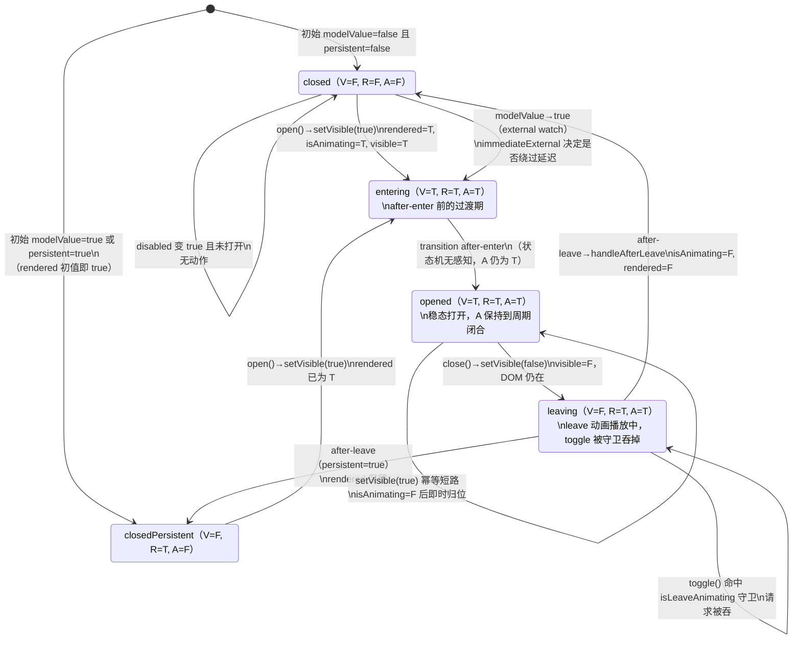
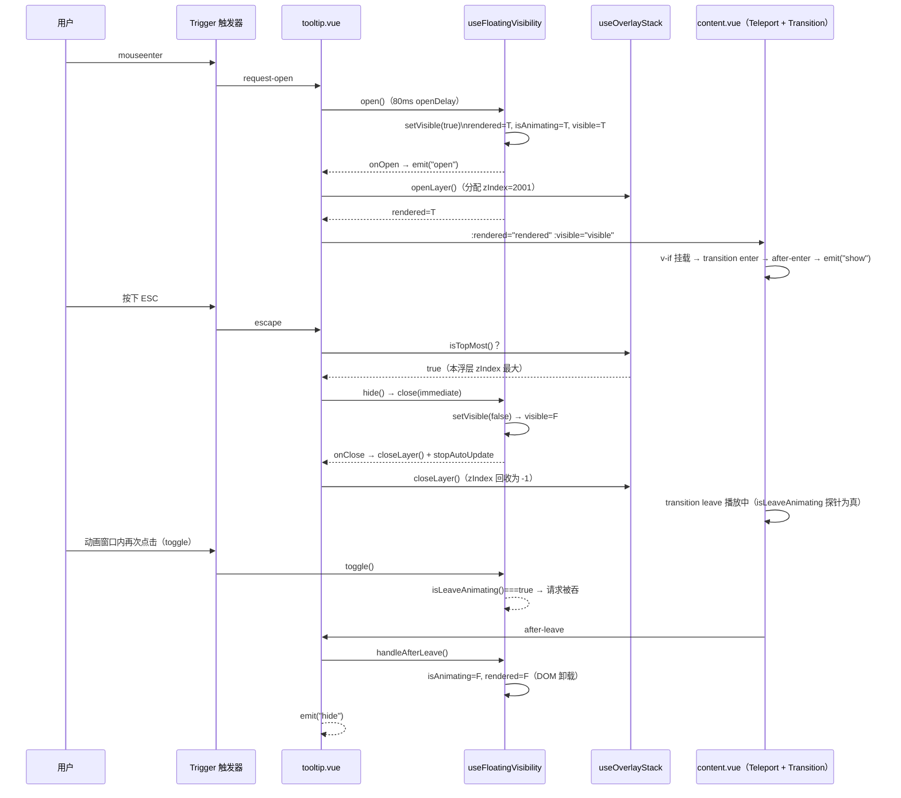

# 4-05 · 浮层体系（上）：三态状态机与全局浮层栈

> 本篇是浮层体系两连发的上篇。我们只回答一个问题：**visible / rendered / isAnimating 三个布尔量，为什么必须正交，而不是合成一个 `visible` 了事？** 回答完这个问题，再顺藤摸瓜拆开全局浮层栈——z-index 从哪里来、"最上层"由谁说了算、以及一次让我们损失了一个下午的 `shallowRef` vs `reactive` 响应式边界事故。下篇《浮层体系（下）：定位管道与关闭语义》再谈 floating-ui 定位管道与 esc / 遮罩点击 / 外部点击的关闭语义。

涉及源码（本篇引用的全部行号均以当前工作区实态核对，其中 `use-overlay-stack.ts` 是浅层响应式修复后的版本）：

- `packages/xiaoye-primitives/src/composables/use-floating-visibility.ts`（249 行，浮层三态状态机）
- `packages/xiaoye-primitives/src/composables/use-overlay-stack.ts`（99 行，全局浮层栈）
- `packages/xiaoye-primitives/src/composables/use-z-index.ts`（17 行，计数器式旧原语）
- `packages/xiaoye-primitives/src/composables/use-overlay-dialog.ts`（174 行，模态层接线）
- 消费实证：`packages/components/tooltip/src/tooltip.vue`、`packages/components/tooltip/src/content.vue`
- 动画实证：`packages/theme/src/components/dialog.css`、`packages/theme/src/components/tooltip.css`
- 测试：`packages/xiaoye-primitives/__tests__/use-floating-visibility.spec.ts`、`packages/xiaoye-primitives/__tests__/use-overlay-stack.spec.ts`

---

## 一、问题现场：一个浮层的三重身份

先设想最朴素的实现。写一个 tooltip，你手里只有一个布尔值：

```ts
const visible = ref(false);

function open() {
  visible.value = true;
}

function close() {
  visible.value = false;
}
```

模板上一把梭：`v-if="visible"`，完事。 demo 里它确实能跑。但只要往前多走三步，这个单一布尔值就开始漏气。

**第一步：懒渲染。** tooltip、popover、dropdown、select 下拉面板，绝大多数生命周期里处于关闭态。如果关闭时 DOM 也一直挂着，一个页面摆二十个组件就是二十份永不显示的面板开销。于是关闭后要 `v-if` 卸载 DOM——但"关掉"和"卸载"不能同时发生：卸载早了，离开动画没地方播。所以你需要一个比 `visible` 活得久一点的标记，表示"DOM 还要不要挂着"。

**第二步：持久驻留。** 反过来，有些场景要求面板常驻 DOM——SEO 抓取、面板里有表单状态不想丢、或者性能上不希望反复重建。于是又出现一个反方向的需求：`visible` 变 false 了，DOM 却不卸载。同一个"关"字，语义上分成两半：**逻辑关了**，**DOM 留着**。

**第三步：过渡窗口。** `xy-fade` 这类过渡动画大约 150 毫秒。用户手抖，在动画没走完时又点了一下触发器——"开→关→又开"，中间态互相踩踏；更隐蔽的是 hover 类触发器，鼠标快速划过时会连续收到 open/close 请求，两个 setTimeout 计时器互相打架。你需要知道"此刻是不是正处在动画过渡期"，以便对部分请求做互斥忽略。

三个步骤指向三个不同的问题，而一个布尔值只有一个比特的答案：

- **visible**：逻辑上，浮层该不该"开"？（驱动 aria 状态、事件流、对外 `update:modelValue`）
- **rendered**：DOM 上，浮层节点存不存在？（懒渲染、persistent 常驻、destroyOnClose 都归它管）
- **isAnimating**：时序上，开合动画的过渡周期闭合了没有？（过渡期互斥的依据）

这就是本库 `useFloatingVisibility` 的三态设计。三个布尔量彼此独立赋值、各管一段，任何一个都不能从另外两个推导出来——它们是正交的。接下来我们逐行读这 249 行的实现。

## 二、useFloatingVisibility：三态状态机全文精读

### 2.1 选项契约：所有输入都是 `MaybeRefOrGetter`

先看入参定义（`use-floating-visibility.ts:4-21`）：

```ts
export interface FloatingVisibilityOptions {
  modelValue?: MaybeRefOrGetter<boolean | undefined>;
  disabled?: MaybeRefOrGetter<boolean | undefined>;
  persistent?: MaybeRefOrGetter<boolean | undefined>;
  openDelay?: MaybeRefOrGetter<number | undefined>;
  closeDelay?: MaybeRefOrGetter<number | undefined>;
  beforeOpen?: (source: "internal" | "external") => void;
  beforeClose?: (source: "internal" | "external") => void;
  emitModelValue?: (value: boolean) => void;
  onOpen?: (source: "internal" | "external") => void;
  onClose?: (source: "internal" | "external") => void;
  immediateExternal?: MaybeRefOrGetter<boolean | undefined>;
  /**
   * 探测面板关闭动画是否仍在播放（仅在真实浏览器检测到 CSS transition/animation 时为 true）。
   * 用于在关闭动画未结束前忽略触发器的 toggle 请求，避免"开→关→又开"的时序错乱。
   */
  isLeaveAnimating?: () => boolean;
}
```

两个设计点值得停一下。其一，除了回调，全部入参是 `MaybeRefOrGetter`——状态机对"输入会不会变"零假设，组件侧传 getter（`() => props.disabled`）即可让状态机实时读最新值，不需要一层 `computed` 中转。其二，`source: "internal" | "external"` 贯穿全部生命周期回调：内部触发（hover、click）和外部触发（v-model 被父组件改写）走的是同一条状态跃迁通道，但下游能区分来源。

还有一位"编外成员" `isLeaveAnimating`，它不是状态，是一个**探针**——后面 2.4 节会看到它如何补上状态机在真实浏览器里的盲区。

### 2.2 状态声明与动画时长探测

状态声明只有三行（`use-floating-visibility.ts:53-58`）：

```ts
export function useFloatingVisibility(options: FloatingVisibilityOptions = {}) {
  const visible = ref(false);
  const rendered = ref(Boolean(toValue(options.modelValue)) || Boolean(toValue(options.persistent)));
  const isAnimating = ref(false);
  let openTimer: number | null = null;
  let closeTimer: number | null = null;
```

初始值已经埋了两处心思：`rendered` 的初值不是恒 false，而是"初始 modelValue 为 true，或 persistent 为 true"时立即为 true——`v-model` 初始打开的浮层不需要等第一次跃迁才挂 DOM；`persistent` 更是让 DOM 从挂载起就常驻。`openTimer` / `closeTimer` 是 open/close 延迟的手柄，注意它们是普通变量不是 ref：计时器本身没有响应式语义，暴露出去反而诱导滥用。

在进入状态跃迁函数之前，先看那个探测函数（`use-floating-visibility.ts:28-51`）：

```ts
/**
 * 读取元素当前计算样式的动画总时长（transition 与 animation 中的最大值，单位毫秒）。
 * 只有真实浏览器把 CSS 规则应用到元素上时才会返回大于 0 的值；
 * jsdom 等无法应用样式表的环境恒返回 0。
 */
export function readFloatingAnimationDuration(element: HTMLElement | null): number {
  if (!element || typeof window === "undefined" || typeof window.getComputedStyle !== "function") {
    return 0;
  }

  const styles = window.getComputedStyle(element);
  const readMaxDuration = (raw: string | null | undefined) =>
    String(raw ?? "")
      .split(",")
      .reduce((max, part) => {
        const seconds = Number.parseFloat(part.trim());
        return Number.isFinite(seconds) && seconds > 0 ? Math.max(max, seconds * 1000) : max;
      }, 0);

  return Math.max(
    readMaxDuration(styles.transitionDuration),
    readMaxDuration(styles.animationDuration)
  );
}
```

它读的是元素上**当前生效的** `transitionDuration` 与 `animationDuration`（两者都可能是逗号分隔的多段值，逐段取最大），返回毫秒。关键在注释里的那句"jsdom 等无法应用样式表的环境恒返回 0"——这个函数是后面互斥守卫的开关：真实浏览器里返回正数，守卫生效；测试环境里返回 0，守卫自动旁路，单测不用写任何动画模拟。我们稍后会专门评这个权衡。

### 2.3 setVisible：唯一的状态跃迁通道

状态机的心脏是 `setVisible`（`use-floating-visibility.ts:76-110`）：

```ts
  function setVisible(
    nextVisible: boolean,
    { emitModelValue = true, source = "internal" }: FloatingVisibilityChangeOptions = {}
  ) {
    clearTimers();

    if (nextVisible) {
      rendered.value = true;
      isAnimating.value = true;
    }

    if (visible.value === nextVisible) {
      isAnimating.value = false;
      return;
    }

    if (nextVisible) {
      options.beforeOpen?.(source);
    } else {
      options.beforeClose?.(source);
    }

    visible.value = nextVisible;

    if (emitModelValue) {
      options.emitModelValue?.(nextVisible);
    }

    if (nextVisible) {
      options.onOpen?.(source);
      return;
    }

    options.onClose?.(source);
  }
```

不到 35 行，把整个开合协议压成了五拍：

1. **清计时器**。无论从哪条路进来，先取消对面方向的挂起请求——`setVisible(true)` 会掐掉还没到点的 close 延迟，反之亦然。这是 hover 快速划过时不出鬼影的第一道闸。
2. **预置位**。目标为 true 时，先无条件 `rendered = true`、`isAnimating = true`。DOM 必须先于可见性存在，`<transition>` 才有节点可以播 enter 动画。
3. **幂等短路**。如果 `visible` 已经等于目标值，把 `isAnimating` 归零后直接返回，不发任何事件。这一行消化了所有重复请求（比如 v-model 已经是 true，watch 又推了一次 open）。
4. **before 钩子 → 跃迁 → emit**。`beforeOpen` / `beforeClose` 在 `visible` 真正翻转**之前**调用，组件层在这里发 `before-show` / `before-hide`——下游可以在动画开始前做最后一刻的准备（比如定位预计算）。然后 `visible.value` 翻转，向外 `emitModelValue` 同步 v-model。
5. **after 语义**。`onOpen` / `onClose` 紧随其后。注意：这是"请求已生效"的语义，不是"动画已完成"——动画完成是 `<transition>` 的 `after-enter` / `after-leave` 事件，走的是另一条路（见 2.5）。

一个容易读漏的细节：`setVisible(false)` 分支里**没有**把 `isAnimating` 置 true。`isAnimating` 只在 open 请求时置 true，在"幂等短路"或 `handleAfterLeave` 时置 false。所以它的真实语义不是"正在播放动画"，而是**"本开合周期尚未闭合"**——从 open 请求开始，一直横跨整个打开期，直到这次周期的 leave 动画收尾（或一次无效跃迁）才归零。它表达的是一个完整的过渡周期窗口，而不是动画进行中的瞬间状态。

### 2.4 open / close：延迟、禁用与 toggle 守卫

`setVisible` 之上是三个面向调用方的入口（`use-floating-visibility.ts:112-184`）：

```ts
  function open(
    optionsOverride: FloatingVisibilityChangeOptions & { immediate?: boolean } = {}
  ) {
    if (toValue(options.disabled)) {
      return;
    }

    clearTimers();

    if (visible.value) {
      return;
    }

    const delay = optionsOverride.immediate ? 0 : (toValue(options.openDelay) ?? 0);

    if (delay > 0) {
      openTimer = typeof window !== "undefined"
        ? window.setTimeout(() => {
            setVisible(true, optionsOverride);
          }, delay)
        : null;
      return;
    }

    setVisible(true, optionsOverride);
  }

  function close(
    optionsOverride: FloatingVisibilityChangeOptions & { immediate?: boolean } = {}
  ) {
    clearTimers();

    const delay = optionsOverride.immediate ? 0 : (toValue(options.closeDelay) ?? 0);

    if (delay > 0) {
      closeTimer = typeof window !== "undefined"
        ? window.setTimeout(() => {
            setVisible(false, optionsOverride);
          }, delay)
        : null;
      return;
    }

    setVisible(false, optionsOverride);
  }

  function toggle(optionsOverride: FloatingVisibilityChangeOptions = {}) {
    // 关闭动画仍在播放时（真实浏览器下 after-leave 尚未触发）忽略触发器的 toggle 请求，
    // 防止"开→关→又开/又关"的双重状态切换；无动画环境（如 jsdom）行为保持不变。
    if (!visible.value && options.isLeaveAnimating?.()) {
      return;
    }

    if (visible.value) {
      close({
        ...optionsOverride,
        immediate: true
      });
      return;
    }

    open({
      ...optionsOverride,
      immediate: true
    });
  }

  function handleAfterLeave() {
    isAnimating.value = false;
    if (!toValue(options.persistent) && !visible.value) {
      rendered.value = false;
    }
  }
```

`open` 与 `close` 结构完全对称，各有三道闸：`disabled` 守卫（仅 open 有——disabled 时 close 依然要放行，否则组件被禁用时无法收场）、幂等短路、延迟调度。`immediate: true` 是绕过延迟的逃生门——trigger 内部的点击/hover 事件直接调 `show()` / `hide()`（内部强制 `immediate`），而 openDelay/closeDelay 服务的是 hover 意图延迟。SSR 兼容也在这层处理：`typeof window !== "undefined"` 才挂计时器。

`toggle` 里的守卫是整个文件最"值钱"的三行：

```ts
    if (!visible.value && options.isLeaveAnimating?.()) {
      return;
    }
```

翻译成白话：**当前可见性是"关"，且探针说离开动画还没播完，那么这次 toggle 直接吞掉。** 场景还原：click 触发的 popover，用户双击——第一击 open，第二击 close，此时离开动画开始播放（约 150ms）；如果用户第三击落在动画窗口内，没有这个守卫，toggle 会判定"当前是关"于是又 open——面板闪一下又弹回来，和用户意图相反。这正是接口注释里写的"开→关→又开"时序错乱。

注意守卫的判据不是状态机自己的 `isAnimating`，而是外部探针 `isLeaveAnimating()`。为什么？因为"动画是否真的在播"这件事，只有 DOM 知道。`visible` 翻成 false 的那一刻，`<transition>` 才刚开始插 `*-leave-active` 类，`after-leave` 要等 150ms 后才到——这中间状态机自己是"盲"的：它知道周期没闭合（`isAnimating === true`），但不知道是"还在播"还是"根本没有动画"。探针读真实计算样式补上了这块盲区。tooltip 组件的接线只有一行（`tooltip.vue:100`）：

```ts
    isLeaveAnimating: () => readFloatingAnimationDuration(contentRef.value) > 0,
```

`handleAfterLeave` 则是状态的**回收站**：leave 动画播完，`<transition>` 的 `after-leave` 钩子调用它，两件事——`isAnimating` 归零（过渡周期闭合）；非 persistent 且确实处于关闭态时，`rendered` 归零（DOM 卸载）。三态在这里完成一次完整的生命周期闭环。

### 2.5 三个 watch：外部世界的三扇门

最后是同步外部输入的三个 watch（`use-floating-visibility.ts:186-249`）：

```ts
  watch(
    () => toValue(options.modelValue),
    (value) => {
      if (value == null) {
        return;
      }

      if (value) {
        open({
          emitModelValue: false,
          source: "external",
          immediate: Boolean(toValue(options.immediateExternal))
        });
        return;
      }

      close({
        emitModelValue: false,
        source: "external",
        immediate: Boolean(toValue(options.immediateExternal))
      });
    },
    {
      immediate: true
    }
  );

  watch(
    () => toValue(options.persistent),
    (value) => {
      if (value) {
        rendered.value = true;
        return;
      }

      if (!visible.value) {
        rendered.value = false;
      }
    }
  );

  watch(
    () => toValue(options.disabled),
    (value) => {
      if (value && visible.value) {
        close({
          immediate: true
        });
      }
    }
  );

  return {
    visible,
    rendered,
    isAnimating,
    clearTimers,
    setVisible,
    open,
    close,
    toggle,
    handleAfterLeave
  };
}
```

第一个 watch 是 v-model 回路的另一半，三处细节：`emitModelValue: false` 防止回声——外部改了 modelValue，状态机内部消化，不再往回 emit；`source: "external"` 让生命周期回调能区分来源；`immediateExternal` 决定外部变更是否绕过延迟（tooltip 传 true：父组件改 v-model 是明确意图，不该再等 80ms hover 延迟）。`immediate: true` 让初始化也走这条通道——`modelValue` 初始为 true 的浮层在 setup 阶段就完成跃迁。

第二个 watch 管 `rendered` 的另一条命：persistent 中途打开时立即挂 DOM；中途关闭时，只有当前不可见才卸载——**如果浮层正开着，DOM 不能动**，这就是"正交"二字的落地：`rendered` 的变更不能鲁莽地捆绑 `visible` 的现状。第三个 watch 是 disabled 的善后：变为 disabled 的瞬间若还开着，立即（绕过延迟）关闭。

返回值里三态全部暴露。这也是一个诚实的时刻：`isAnimating` 目前**没有**任何组件在外部消费——全库检索它只出现在这个文件内部。它被导出，是给需要的组件留的观察窗口（例如想在过渡期抑制某些重操作）；组件实际的过渡期互斥走的是 2.4 的探针方案。一个状态的"正交保留"与"暂无消费者"并存，我们认为是合理冗余而非死代码——它是状态机完整性的一部分，删掉它，`handleAfterLeave` 的第一行就失去了锚点。

### 2.6 三态状态机全景图

把上面所有跃迁路径画成状态图（组合状态标注三态的取值，`V/R/A` 分别代表 visible/rendered/isAnimating）：



这张图里最反直觉的是 `opened` 状态的 `A=T`：如 2.3 所说，`isAnimating` 在整个打开期保持 true，直到 leave 收尾才归零。它不是"正在动画"，而是"周期未闭合"。

## 三、为什么必须正交：三态各自回答一个问题

现在正面回答本篇的核心问题。把三个正交状态压缩回一个 `visible`，会发生什么？我们逐个场景推演。

**场景一：懒渲染与离开动画。** 只有一个 `visible`，模板只能 `v-if="visible"`。关闭时 `visible` 翻 false 的同一帧，Vue 卸载 DOM——`<transition>` 的 leave 动画失去宿主，动画直接跳变。要保动画就得 `v-show`，那关闭后的面板 DOM 永远挂着，二十个 select 就是二十份幽灵 DOM。**单状态无法同时表达"逻辑已关"和"DOM 暂留"**——这两个事实只在"动画播放中"短暂重合，其余时间彼此独立。

**场景二：persistent。** `persistent=true` 要求 DOM 常驻。单状态下你只能给 `v-if` 打补丁：`v-if="visible || persistent"`。补丁打得动模板，打不动逻辑——"关闭后是否回收 DOM"的决策散落在每个组件里，每个组件都要重新发明一遍 `visible || persistent` 与 `after-leave` 的组合。收拢到状态机里之后，组件层只消费 `rendered` 一个词，persistent 的全部语义被压进 `useFloatingVisibility` 的 20 行里。

**场景三：destroyOnClose 的变体。** `use-overlay-dialog.ts:87-93` 有一个更精细的消费面：

```ts
  const contentRendered = computed(() => {
    if (callbacks.destroyStrategy === "content" && toValue(options.destroyOnClose)) {
      return visible.value;
    }

    return rendered.value;
  });
```

dialog 允许选择销毁策略：`destroyStrategy: "content"` 时 `contentRendered` 直接回落到 `visible.value`——关闭请求一生效内容就随 `visible` 消失，不等动画；默认策略则由 `rendered` 驱动，DOM 存活到离开动画收尾，再由 `use-overlay-dialog.ts:95-102` 的 `handleAfterLeave` 在 `destroyOnClose` 时把 `rendered` 置 false 完成回收。同一个"关闭"，两种 DOM 存续策略，全部建立在"visible 与 rendered 可以独立取值"这个前提上。三态不正交，这个 computed 连写出来都不可能。

**场景四：过渡窗口的判定主体。** 如果没有独立的过渡期概念，互斥守卫只能"信任" `<transition>` 的钩子回调。但钩子有一个致命属性：**异步且不可证伪**——它来或者不来，状态机在等待期间没有任何本地状态可以查询（总不能每帧去问"after-leave 到了吗"）。`isAnimating` 给了等待期一个本地锚点，探针 `isLeaveAnimating` 补上"动画真实在播"的物理事实，两者合成完整的守卫判据。jsdom 里探针恒 0、守卫自动失效，单测完全不需要 mock 动画——这个"环境自适应降级"是探测方案相对钩子方案的决定性优势。

总结成一句话：**visible 管语义、rendered 管 DOM 存在、isAnimating 管过渡窗口，三者两两独立、不可互相推导。** 任何"用两个就够了吧"的合并方案，都会在懒渲染、持久驻留、销毁策略、动画互斥四个场景中的至少一个里重新长出第三个变量。

一次完整交互的时序，把三态、探针和浮层栈串起来看（sequenceDiagram，ESC 关闭分支里能看到浮层栈的"最上层"判定登场）：



## 四、useOverlayStack：全局浮层栈

三态状态机解决"一个浮层自己的事"。但页面上同时有 N 个浮层时，两件新事冒出来：z-index 谁大谁小；ESC 按下时该关谁、遮罩点下去该关谁。这是 `useOverlayStack` 的 99 行要回答的。

### 4.1 栈的数据结构：Set + 最大 z 扫描

先看数据结构与"栈顶"判定（`use-overlay-stack.ts:1-35`）：

```ts
import { computed, onBeforeUnmount, ref, shallowRef } from "vue";
import type { ComputedRef, Ref } from "vue";

interface OverlayEntry {
  id: symbol;
  zIndex: Ref<number>;
  isTopMost: () => boolean;
  openLayer: () => void;
  closeLayer: () => void;
}

function createStack() {
  // 栈容器必须用 shallowRef：深层 ref 会把每个 entry 代理化并自动解包其 zIndex，
  // 导致 getTopEntry 比较时读到 undefined。栈更新本就通过 notifyStackChange
  // 整体重赋值来触发响应，深层响应式从未被依赖。
  const stack = shallowRef<Set<OverlayEntry>>(new Set());
  const zIndexCounter = ref(2000);

  function notifyStackChange() {
    stack.value = new Set(stack.value);
  }

  function getTopEntry(): OverlayEntry | undefined {
    let top: OverlayEntry | undefined;
    let maxZ = -Infinity;

    for (const entry of stack.value) {
      if (entry.zIndex.value > maxZ) {
        maxZ = entry.zIndex.value;
        top = entry;
      }
    }

    return top;
  }
```

有意思的第一个点：它叫"栈"，容器却是 `Set`，而且"栈顶"不是数组的末位，而是**z-index 最大的那个 entry**。为什么不用真正的栈？因为浮层的进出不完全符合 LIFO：A 开、B 开、A 关、A 再开——A 回来了，而且必须回到最上层（它是最新打开的）。用 z 值做序，每次 open 递增分配，天然保证"最新打开者最大"；`Set` 的插入顺序只做去重，不参与排序。`getTopEntry` 线性扫描取最大，浮层个数是两位数量级，O(n) 扫描不构成问题。

第二个点：`zIndexCounter = ref(2000)`，基值 2000。这是和第三方样式、以及本库自身的分层约定（弹窗、下拉、消息提示各有基础层级）对齐的起点。非模态浮层（tooltip、popover、dropdown）和模态浮层（dialog、drawer）走**同一个**栈、同一个计数器——非模态浮层的入栈是"轻量"的：不挂遮罩、不锁滚动，但 z 序与栈顶判定一视同仁。

### 4.2 entry 的生命周期：分配、回收与守卫

entry 的创建与开合（`use-overlay-stack.ts:37-73`）：

```ts
  function createOverlayEntry(): OverlayEntry {
    const id = Symbol("overlay");
    let opened = false;
    const disposed = false;

    const entry: OverlayEntry = {
      id,
      zIndex: ref(-1),
      isTopMost: () => {
        if (disposed || !opened) return false;
        const top = getTopEntry();
        return top?.id === id;
      },
      openLayer: () => {
        if (disposed) return;
        entry.zIndex.value = ++zIndexCounter.value;
        if (!opened) {
          stack.value.add(entry);
          opened = true;
        }
        notifyStackChange();
      },
      closeLayer: () => {
        if (disposed || !opened) return;
        opened = false;
        entry.zIndex.value = -1;
        if (stack.value.delete(entry)) {
          notifyStackChange();
        }
      }
    };

    return entry;
  }

  return { createOverlayEntry };
}

const globalStack = createStack();
```

这段代码回答了本篇第三个设计权衡——**zIndex 什么时候分配**。答案是：`openLayer` 时分配（`++zIndexCounter.value`），`closeLayer` 时回收为 -1。三个备选方案都被否决过，理由如下：

- **挂载时分配**（本栈的前代实现就是这么做的，`onMounted(() => entry.openLayer())`）：页面初始化时 20 个组件挂载就消耗 20 个 z 值，但它们绝大部分从未打开；更重要的是，挂载序不等于打开序，z 序会与用户感知的层级错位。这个方案已在 2026-05-23 的重构中移除（见 4.4 的历史注）。
- **打开时分配、关闭后保留**：z 计数器只增不减，值域会随长时间运行无限爬升；虽然 int 溢出在现实中很遥远，但"关闭即 -1"让 `isTopMost` 可以直接用 `!opened` 短路，也让调试时 z 值有清晰语义：**-1 = 未入栈，正数 = 在栈中的层级**。
- **CSS 层面用 `z-index: auto` + DOM 顺序**：Teleport 到 body 后 DOM 顺序不可控，此路不通。

`openLayer` 里还有一个防重入细节：`if (!opened)` 才 `add`——重复 openLayer 不会把同一个 entry 塞两次进 Set（`Set` 本身也幂等，这里是双保险），但 `notifyStackChange()` 依然执行。`closeLayer` 则更谨慎：只有 `delete` 真的移除了东西才通知——通知本身不便宜（见 4.3），不该为无效操作买单。

`disposed` 目前是恒 false 的死标记（2026-09-14 的一次清理把 `let` 改成了 `const`，给未来的显式 dispose 语义留位），`isTopMost` 与 `closeLayer` 里的 `disposed` 分支因此今天都走不到——读代码时不要被它迷惑。

最后，模块级 `const globalStack = createStack()`：**全局单例**。所有组件实例共享同一个栈、同一个计数器——这正是"全局浮层栈"的本义。

### 4.3 对外 API：computed 解包的响应式边界

对外的 `useOverlayStack`（`use-overlay-stack.ts:77-99`）：

```ts
export interface OverlayStackEntry {
  zIndex: ComputedRef<number>;
  isTopMost: () => boolean;
  openLayer: () => void;
  closeLayer: () => void;
}

export function useOverlayStack(): OverlayStackEntry {
  const entry = globalStack.createOverlayEntry();

  onBeforeUnmount(() => {
    entry.closeLayer();
  });

  return {
    // entry.zIndex 是 ref，computed 必须显式读取 .value 建立依赖，
    // 否则依赖集为空、首次读取后永久缓存（重开浮层拿到旧 z 值、预读恒 -1）。
    zIndex: computed(() => entry.zIndex.value),
    isTopMost: entry.isTopMost,
    openLayer: entry.openLayer,
    closeLayer: entry.closeLayer
  };
}
```

`onBeforeUnmount` 里兜底 `closeLayer`——组件在打开状态下被直接卸载（比如路由切换），栈不会泄漏 entry。这是栈模型的自律：**入栈出栈的生命周期必须同时挂在"打开关闭"和"挂载卸载"两个维度上**。

注释里那两行是这次修复的第二现场。完整的事故还原：内部 `entry.zIndex` 是 `Ref<number>`，对外用 `computed(() => entry.zIndex.value)` 解包。如果这个 computed 写成 `computed(() => entry.zIndex)`——返回的是 Ref 本身而非数字——更早一版对外直接暴露裸 `entry.zIndex` 时，另一个坑在等着：computed 收集依赖时若没有触发 `.value` 的 getter（比如先把 Ref 存进局部变量再读），依赖集为空，首次求值后永久缓存。两个坑殊途同归：**重开浮层拿旧 z 值、`openLayer` 之前预读 zIndex 恒为 -1**。修复就是注释里那句：computed 回调内显式读 `.value`，让依赖收集真实发生。

而第一现场——`shallowRef` 的必要性——才是这次事故的主舞台，值得单独一节。

### 4.4 事故现场：reactive 深层代理会解包 Ref

修复前的实现是 `const stack = ref<Set<OverlayEntry>>(new Set())`，`entry.zIndex` 是裸 `number`。为了"关闭后置 -1"以外的可观测性需求（预读、动画期间保持 z 值等），`zIndex` 被改成 `Ref<number>`。这一改，深层 `ref` 容器立刻引爆一个 Vue 响应式的经典边界：

`ref()` 深层响应式会把容器内的对象递归转成 reactive 代理。`stack.value` 迭代出的每个 entry 都是**代理**，而 Vue 的代理在属性访问时会**自动解包嵌套的 ref**——这是模板和 reactive 对象里受人喜爱的便利特性。但在这里它是灾难：`entry.zIndex` 本该是 `Ref<number>`，从代理上读出来却直接是数字；接着代码里写 `entry.zIndex.value`——**数字没有 `.value`，结果是 `undefined`**。于是：

```ts
// getTopEntry 里的比较，修复前的实态推演：
if (entry.zIndex.value > maxZ) {   // undefined > -Infinity → false
```

每个 entry 都比不过 `-Infinity`，`getTopEntry` 恒返回 `undefined`，`isTopMost` 恒 false。连锁反应：ESC 关闭失灵（每个浮层都认为"我不是最上层"）、遮罩点击关闭失灵、所有依赖栈顶判定的关闭语义集体哑火。而 `isTopMost` 失效是静默的——没有报错、没有警告，只有功能"偶尔"不对。

修复三件套，环环相扣：

1. **栈容器 `ref` → `shallowRef`**：不再对 entry 做深层代理，`zIndex` 作为 Ref 保持原样，`.value` 访问真实有效。
2. **响应式触发改为显式整体重赋值**：`notifyStackChange()` 用 `stack.value = new Set(stack.value)` 换一个新 Set 引用。`shallowRef` 只追踪 `.value` 本身的赋值，浅层语义下这是唯一正确的触发方式——而回看代码会发现，栈的使用模式本就只有"增删 entry"两种整体变更，从未依赖过深层属性级响应，shallow 的代价是零。
3. **对外 `computed` 显式解包**：4.3 节讲过的第二现场。

修复后实态对比（已随提交 `f7f69d2` 入库，即当前 HEAD 实态；修复前版本可用 `git show dc9ca28:packages/xiaoye-primitives/src/composables/use-overlay-stack.ts` 复核）：

```ts
// 修复前（HEAD 版本，dc9ca28，2026-09-14）：
interface OverlayEntry {
  id: symbol;
  zIndex: number;              // 裸 number
  // ...
}
const stack = ref<Set<OverlayEntry>>(new Set());   // 深层 ref
// getTopEntry: if (entry.zIndex > maxZ)           // 直接比数字
// openLayer:   entry.zIndex = ++zIndexCounter.value
// 对外: zIndex: computed(() => entry.zIndex)       // 依赖收集即失效

// 修复后（当前工作区实态）：
interface OverlayEntry {
  id: symbol;
  zIndex: Ref<number>;         // Ref 化
  // ...
}
const stack = shallowRef<Set<OverlayEntry>>(new Set());  // 浅层
// getTopEntry: if (entry.zIndex.value > maxZ)     // 显式 .value
// openLayer:   entry.zIndex.value = ++zIndexCounter.value
// 对外: zIndex: computed(() => entry.zIndex.value) // 显式解包建立依赖
```

这是本篇想留下的最重要的一条工程经验：**Vue 的深层响应式是一份"默认签约"，签了就要接受 ref 自动解包、对象代理化两条款。容器里装的东西越"非 POJO"（带函数、带 Ref、带 Symbol id），越应该在边界上改签 shallowRef。** 判断依据不是性能，是语义：栈的变更粒度是"整体"，深层响应式提供的细粒度追踪从未被需要，反而制造了不该存在的解包行为。

### 4.5 消费实证：tooltip 的接线

看消费端如何把三态状态机与浮层栈缝在一起（`packages/components/tooltip/src/tooltip.vue:92-119`）：

```ts
const { visible, rendered, open, close, toggle, clearTimers, handleAfterLeave } =
  useFloatingVisibility({
    modelValue: () => props.modelValue,
    disabled: () => props.disabled,
    persistent: () => props.persistent,
    openDelay: () => props.showAfter ?? props.openDelay,
    closeDelay: () => props.hideAfter ?? props.closeDelay,
    immediateExternal: true,
    isLeaveAnimating: () => readFloatingAnimationDuration(contentRef.value) > 0,
    beforeOpen: () => {
      emit("before-show");
    },
    beforeClose: () => {
      emit("before-hide");
    },
    emitModelValue: (value) => {
      emit("update:modelValue", value);
    },
    onOpen: () => {
      emit("open");
      openLayer();
    },
    onClose: () => {
      emit("close");
      closeLayer();
      stopAutoUpdate();
    }
  });
```

注意栈操作的挂点：`openLayer` 挂在 `onOpen`——**语义开**的时刻入栈；`closeLayer` 挂在 `onClose`——**语义关**的时刻出栈。不是挂载时，不是动画后。这样 z 值的生命周期与"用户感知的打开"严格同步，`isTopMost` 的答案也就与用户直觉一致。而 `rendered` / `visible` 继续向下传给 content：

`tooltip.vue:325-329` 的模板绑定与 content 侧的落地（`packages/components/tooltip/src/content.vue:84-124`）：

```vue
  <teleport :to="props.appendTo" :disabled="!props.teleported">
    <transition
      :name="props.transition"
      @after-enter="emit('afterEnter')"
      @after-leave="emit('afterLeave')"
    >
      <div
        v-if="props.rendered"
        v-show="props.visible"
        :id="props.id"
        ref="contentElementRef"
        role="tooltip"
        :aria-hidden="!props.visible"
        :aria-label="props.ariaLabel"
        :data-placement="props.actualPlacement"
        :class="[
          `${ns.base.value}__content`,
          `${ns.base.value}__content--${props.effect}`,
          `${ns.base.value}__content--${placementSide}`,
          props.popperClass
        ]"
        :style="[props.floatingStyle, maxWidthStyle, props.popperStyle]"
        @mouseenter="emit('requestOpen', $event)"
        @mouseleave="emit('requestClose', $event)"
        @keydown="emit('keydown', $event)"
        @focusout="emit('focusout', $event)"
      >
        <span
          v-if="props.showArrow"
          ref="arrowElementRef"
          :class="['xy-popper__arrow', `${ns.base.value}__arrow`]"
          :style="props.arrowStyle"
        />
        <slot name="content">
          <!-- eslint-disable-next-line vue/no-v-html -->
          <span v-if="props.rawContent" v-html="props.content" />
          <template v-else>{{ props.content }}</template>
        </slot>
      </div>
    </transition>
  </teleport>
```

第 6-7 行就是全篇的落点：**`v-if="props.rendered"` 管 DOM 存不存在，`v-show="props.visible"` 管显不显示。** 两个正交状态在模板里各就各位：enter/leave 动画由 `v-show` 的显隐切换触发（`<transition>` 对 `v-show` 同样生效），DOM 回收由 `v-if` 在 `after-leave` 后完成。`aria-hidden` 绑的是 `visible` 不是 `rendered`——可访问性语义跟随逻辑态，也是同一正交原则的延伸。

栈顶判定与 ESC 的消费在 `tooltip.vue:198-205` 与 `267-276`：

```ts
  function handleEscape(event: KeyboardEvent) {
    if (!props.closeOnEsc || isManualTrigger.value || !visible.value || !isTopMost()) {
      return;
    }

    event.preventDefault();
    hide();
  }
```

```ts
useDismissibleLayer({
  enabled: () => visible.value && !isManualTrigger.value,
  refs: [triggerRef, contentRef],
  closeOnEscape: props.closeOnEsc,
  closeOnOutside: closeOnOutsideEnabled,
  isTopMost: () => isTopMost(),
  onDismiss: () => {
    hide();
  }
});
```

两层判定都先问 `isTopMost()`：ESC 只有最上层浮层响应（叠加的 dialog + tooltip 场景，ESC 一次只关一个，且关的一定是最上面的），外部点击的 dismiss 语义同理。`enabled: () => visible.value && ...`——关闭语义也挂在三态的 `visible` 上，看不见的浮层没有关闭语义可言。

动画的 CSS 侧出口看 dialog 的过渡类（`packages/theme/src/components/dialog.css:282-303`）：

```css
.xy-dialog-fade-enter-active,
.xy-dialog-fade-leave-active {
  transition: opacity var(--xy-transition-duration-fast) var(--xy-transition-timing);
}

.xy-dialog-fade-enter-active .xy-dialog__panel,
.xy-dialog-fade-leave-active .xy-dialog__panel {
  transition:
    transform var(--xy-transition-duration-fast) var(--xy-transition-timing),
    opacity var(--xy-transition-duration-fast) var(--xy-transition-timing);
}

.xy-dialog-fade-enter-from,
.xy-dialog-fade-leave-to {
  opacity: 0;
}

.xy-dialog-fade-enter-from .xy-dialog__panel,
.xy-dialog-fade-leave-to .xy-dialog__panel {
  transform: translateY(-10px) scale(0.985);
  opacity: 0;
}
```

遮罩淡入淡出、面板再叠加位移与缩放，时长统一走令牌 `--xy-transition-duration-fast`。`readFloatingAnimationDuration` 读到的正是这些规则生效后的计算值——CSS 是动画事实的唯一来源，探针只是去读它。tooltip 默认的 `xy-fade` 更简单（`packages/theme/src/components/tooltip.css:107-118`）：

```css
.xy-fade-enter-active,
.xy-fade-leave-active {
  transition:
    opacity var(--xy-transition-duration-fast) var(--xy-transition-timing),
    transform var(--xy-transition-duration-fast) var(--xy-transition-timing);
}

.xy-fade-enter-from,
.xy-fade-leave-to {
  opacity: 0;
  transform: translateY(4px);
}
```

### 4.6 模态世界的同一协议：useOverlayDialog

dialog/drawer 这类模态组件通过 `useOverlayDialog` 复用同一套协议，模态专属的部分（遮罩、锁滚动、销毁策略）做增量（`use-overlay-dialog.ts:104-125`）：

```ts
  const showModal = computed(() => {
    return Boolean(toValue(options.modal) && visible.value);
  });

  const zIndex = computed(() => {
    const base = toValue(options.zIndex);
    if (base != null) return base;
    return overlayStack.zIndex.value;
  });

  watch(
    visible,
    (value) => {
      if (value) {
        overlayStack.openLayer();
        return;
      }

      overlayStack.closeLayer();
    },
    { immediate: true }
  );
```

与 tooltip 的差异在于栈操作的挂点：dialog 把 `openLayer` / `closeLayer` 挂在 **watch visible** 上而非生命周期回调里。效果等价（`setVisible` 先翻转 `visible` 再调 `onClose`，watch 是异步去重的），但模态层选择以 `visible` 为单一事实源——因为它还有 `showModal`（遮罩显隐）、锁滚动等多个 computed 消费同一个 `visible`，统一挂点减少时序分叉。`zIndex` computed 支持显式 prop 覆盖，落回栈分配值——模态的 z 序也被全局栈统一治理，遮罩（同 z 值渲染在面板之前）自然压在所有更早打开的浮层之上。

## 五、三角色的另一面：use-z-index 与无栈世界

`packages/xiaoye-primitives/src/composables/use-z-index.ts`（17 行全文）：

```ts
import { computed, ref } from "vue";

const seed = ref(0);

export function useZIndex() {
  const zIndex = computed(() => 2000);

  const next = () => {
    seed.value += 1;
    return zIndex.value + seed.value;
  };

  return {
    current: computed(() => zIndex.value + seed.value),
    next
  };
}
```

这是一个更原始的分层原语：模块级 `seed` 计数器，`next()` 递增返回。它的消费方是 `message` 和 `notification`（如 `packages/components/message/src/message.vue:66` 的 `const { next } = useZIndex()`）——这两类"消息型"浮层**不入栈**。为什么？消息提示的生命模型和交互型浮层不同：它们没有"最上层"的关闭语义诉求（ESC 不关消息、没有遮罩可点），只需要"比现有的高一层"以保证后到的消息盖住先到的。计数器足矣，栈是奢侈品。

那么它是 EP 那套方案的同款吗？可以借它引出与 Element Plus 的系统对比。

## 六、对照：EP 的计数器世界与本库的栈模型

Element Plus 处理 z 分层的公共原语是 `useZIndex`：模块级 `initialZIndex`（默认 2000）+ 全局计数器，`nextZIndex()` 每次调用 `++counter` 并返回，组件（dialog、select 下拉等）在打开时取一次值。它的哲学是** fire-and-forget 的单向递增**：只管分配，不管回收，更没有"谁在最上"的全局答案。

本库的对照：

| 维度 | EP `useZIndex` | 本库 `useOverlayStack` |
| --- | --- | --- |
| 分配 | 打开时 `nextZIndex()`，只增不减 | `openLayer` 分配，`closeLayer` 回收 -1 |
| 数据结构 | 无（全局计数器） | 全局 `Set<OverlayEntry>`（shallowRef） |
| "最上层"判定 | 无全局答案，各组件自理 | `getTopEntry` 按 z 值扫描，`isTopMost()` |
| 关闭语义支撑 | 组件各自实现（focus trap、clickoutside） | ESC/遮罩统一先问栈顶 |
| 值域 | 单调上升 | 打开期间有效，关闭归 -1 |

EP 没有全局栈，代价是**关闭语义的判定权下放到每个组件**：两个 dialog 叠加时 ESC 关谁，EP 依赖 focus 所在的实例自己响应——通常也对，但"对"的原因是浏览器焦点模型恰好跟随了视觉层级，而不是存在一个权威的层级判定者。本库把判定权上收到栈：`isTopMost()` 是唯一的权威答案，`useDismissibleLayer` 只认它。代价是要维护栈本身——于是有了 4.4 的事故。两种路线没有绝对优劣，但对一个 esc/遮罩/外部点击语义要跨 72 个组件统一承诺的组件库来说，把"层级"升格为一等公民数据结构，收益大于维护成本。

另一处值得点名的差异：本库的 `use-z-index.ts` 与 EP 的 `useZIndex` 几乎同构（同样 2000 基值、同样模块级计数器），这更像是有意的保留——为 message/notification 这类**不需要栈语义**的浮层提供一个轻量原语，同时让"要不要入栈"成为一个显式的架构决策而不是默认行为。

## 七、测试即规格

两个 spec 文件不长，但每条用例都是一条行为规格。先看浮层栈的（`packages/xiaoye-primitives/__tests__/use-overlay-stack.spec.ts:35-82`）：

```ts
describe("useOverlayStack zIndex 响应式", () => {
  it("打开前预读 -1，openLayer 后 computed 立即更新", () => {
    const { entry } = mountWithOverlayStack();

    expect(entry.zIndex.value).toBe(-1);

    entry.openLayer();
    expect(entry.zIndex.value).toBeGreaterThan(0);

    entry.closeLayer();
    expect(entry.zIndex.value).toBe(-1);
  });

  it("close 后 reopen 拿到更大的新 zIndex（computed 不残留旧缓存）", () => {
    const { entry } = mountWithOverlayStack();

    entry.openLayer();
    const firstZIndex = entry.zIndex.value;

    entry.closeLayer();
    entry.openLayer();

    expect(entry.zIndex.value).toBeGreaterThan(firstZIndex);
  });

  it("isTopMost 语义保持：只有已打开且位于栈顶的 entry 为 true", () => {
    const first = mountWithOverlayStack();
    const second = mountWithOverlayStack();

    // 未打开的 entry 恒为 false
    expect(first.entry.isTopMost()).toBe(false);
    expect(second.entry.isTopMost()).toBe(false);

    first.entry.openLayer();
    expect(first.entry.isTopMost()).toBe(true);

    second.entry.openLayer();
    expect(first.entry.isTopMost()).toBe(false);
    expect(second.entry.isTopMost()).toBe(true);

    second.entry.closeLayer();
    expect(first.entry.isTopMost()).toBe(true);
    expect(second.entry.isTopMost()).toBe(false);

    first.entry.closeLayer();
    expect(first.entry.isTopMost()).toBe(false);
  });
});
```

第二条用例的名字里带着事故的疤痕："computed 不残留旧缓存"——它就是 4.3 那个依赖收集缺失 bug 的回归测试。第三条把 LIFO 混合序列（开、开、关、关）逐拍断言，钉死"栈顶 = z 最大"的语义。测试文件头部的 `mountWithOverlayStack` 辅助函数也值得看一眼（`use-overlay-stack.spec.ts:8-26`）：`useOverlayStack` 内部注册了 `onBeforeUnmount`，必须挂在真实组件实例上才有意义——测试基建本身在提醒你这个 composable 的生命周期约束。

再看状态机守卫的（`packages/xiaoye-primitives/__tests__/use-floating-visibility.spec.ts:4-37`）：

```ts
describe("useFloatingVisibility isLeaveAnimating 守卫", () => {
  it("关闭动画期间（isLeaveAnimating 为 true）toggle 不应重新打开面板", () => {
    const floating = useFloatingVisibility({
      isLeaveAnimating: () => true
    });

    floating.open();
    expect(floating.visible.value).toBe(true);

    // 模拟真实浏览器：关闭后离开动画尚未结束
    floating.close();
    expect(floating.visible.value).toBe(false);

    floating.toggle();
    expect(floating.visible.value).toBe(false);
  });

  it("无动画环境（isLeaveAnimating 未提供/返回 false）toggle 行为保持不变", () => {
    const floating = useFloatingVisibility({
      isLeaveAnimating: () => false
    });

    floating.open();
    expect(floating.visible.value).toBe(true);
    floating.close();
    expect(floating.visible.value).toBe(false);

    floating.toggle();
    expect(floating.visible.value).toBe(true);

    floating.toggle();
    expect(floating.visible.value).toBe(false);
  });
});
```

两条用例正好覆盖探针的两种环境：返回 true（真实浏览器，动画中）时 toggle 被吞；返回 false（jsdom / 无动画）时 toggle 完全照旧。守卫的正确性被压缩成两个纯函数式的断言组，不依赖任何 DOM 或定时器 mock——这正是 2.2 节说的"环境自适应降级"在测试侧的红利。

## 八、权衡清单与小结

把本篇的设计权衡收拢：

1. **三态正交 vs 单 visible**（第三节）：语义、DOM 存在、过渡窗口三个不可互相推导的事实，必须三个独立状态位。合并方案的账单会在懒渲染、persistent、destroyOnClose、动画互斥四个场景分别寄到。
2. **shallowRef vs reactive**（4.4）：深层响应式的 ref 自动解包与对象代理化，对"整体变更、非 POJO 成员"的容器是负资产。改签 `shallowRef` + 显式重赋值通知，零成本买回引用完整性。这是 Vue 响应式边界的经典坑：**响应式深度是签约条款，不是免费午餐。**
3. **zIndex 分配时机**（4.2）：挂载时分配（前代）→ 打开时分配 + 关闭回收（现行）。z 序与用户感知的打开序对齐，值域有明确语义，`isTopMost` 可用 `!opened` 短路。
4. **过渡期互斥的判据来源**（2.4）：信任 `<transition>` 钩子（异步、不可证伪、jsdom 不友好）vs 主动探测计算样式（同步、物理事实、jsdom 自然降级为 0）。本库选后者，把"动画是否在播"的事实权交给 CSS 本身。
5. **栈模型 vs 计数器**（第六节）：交互型浮层入栈换统一关闭语义，消息型浮层走计数器保持轻量。"要不要入栈"是显式决策。

最后修正一个可能的误读：本篇把 `isAnimating` 讲成三态之一，但读完全文你会发现它今天的实际戏份远小于另外两态——真正的互斥守卫由 `isLeaveAnimating` 探针承担，`isAnimating` 目前没有外部消费者。它的价值在于给"过渡周期"一个状态机内部的一等表示（`handleAfterLeave` 的锚点），并作为公开观察窗口等待未来的消费者。**正交设计的含义不是"每个状态都忙"，而是"每个独立事实都有一个独立的、可独立演进的家"。**

---

**下一篇预告**：4-06《浮层体系（下）：定位管道与关闭语义》。上篇解决了"开不开、在不在、动没动完"，下篇解决"开在哪、怎么关"：`useFloatingPanel` 如何把 floating-ui 的定位计算包装成响应式管道（flip/shift/arrow 的偏移链路）、Teleport 与定位策略（fixed/absolute）的配合、以及 esc、遮罩点击、外部点击三套关闭语义在 `useDismissibleLayer` 里的收敛——包括"为什么关闭判定必须先问栈顶"的完整论证。
