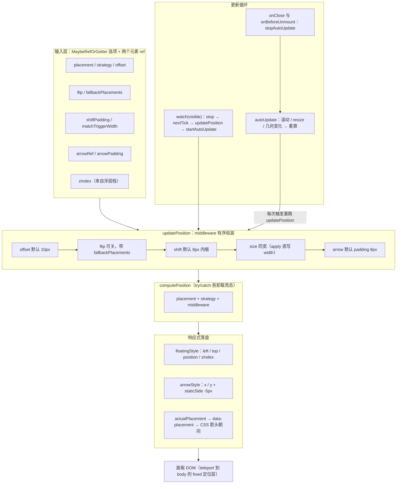
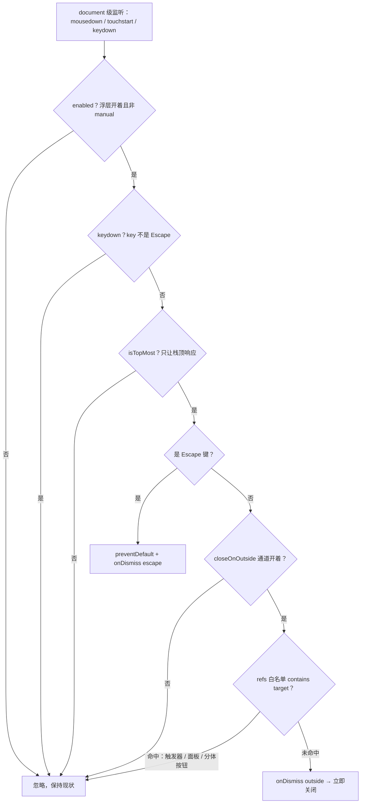
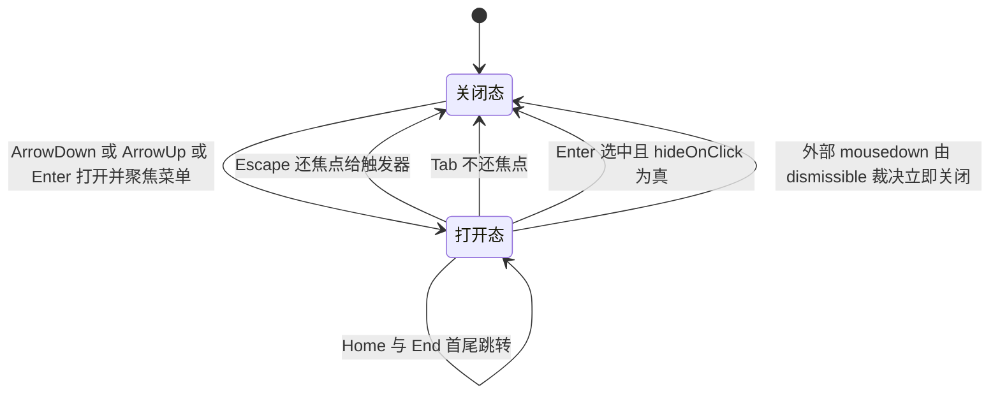

# 4-06 · 浮层体系（下）：定位管道与关闭语义

> 上篇回答了"开不开、在不在、动没动完"，本篇回答剩下两个问题："开在哪"和"何时关"。但全篇真正要回答的，是一个看起来不像问题的问题：**用户点了一下触发器，这一次点击算"外部点击"吗？** 它的答案藏在 82 行的关闭裁判里，藏在一连串看似随意的事件名选择（为什么是 `mousedown` 而不是 `click`？为什么不是 `pointerdown`？）里，也藏在三个消费组件各自不同的接线方式里。顺着这个问题往下挖，你会看到一条完整的定位管道、一套两通道的关闭语义、以及一个和"关闭"深度耦合的键盘导航状态机。

涉及源码（全部行号以当前工作区实态逐一核对）：

- `packages/xiaoye-primitives/src/composables/use-floating-panel.ts`（161 行，定位管道，本篇全文分段引用）
- `packages/xiaoye-primitives/src/composables/use-dismissible-layer.ts`（82 行，关闭裁判，本篇全文引用）
- `packages/xiaoye-primitives/src/composables/use-list-navigation.ts`（95 行，键盘导航，本篇全文分段引用）
- `packages/xiaoye-primitives/src/composables/use-floating-visibility.ts`（249 行，上篇主角，本篇引用其延迟开合与 toggle 守卫段）
- `packages/xiaoye-primitives/src/composables/use-overlay-stack.ts`（99 行，上篇主角，本篇引用其 `isTopMost` 段）
- 消费实证：`packages/components/tooltip/src/`（tooltip.vue 348 行、trigger.vue 244 行、content.vue 125 行）与 `packages/components/dropdown/src/dropdown.vue`（667 行）、`packages/components/popover/src/popover.vue`（268 行）
- 测试：`packages/xiaoye-primitives/__tests__/use-floating-visibility.spec.ts`、`packages/components/tooltip/__tests__/tooltip.spec.ts`、`packages/components/popover/__tests__/popover.spec.ts`、`packages/components/dropdown/__tests__/dropdown.spec.ts`
- 样式实证：`packages/theme/src/components/dropdown.css`、`packages/theme/src/components/tooltip.css`、`packages/theme/src/components/popover.css`

---

## 一、七件套分工：浮层体系的三根支柱

先交代全景。上篇说过，这套浮层体系的逻辑层由 `packages/xiaoye-primitives/src/composables/` 下的一组 composable 支撑，和浮层直接相关的可以概括成"七件套"：`useFloatingVisibility` 管三态状态机，`useOverlayStack` 管全局浮层栈与 z 序，`useOverlayDialog` 管模态层的遮罩与接线，`useFocusTrap` 管焦点陷阱，而本篇的三位主角各管一摊——

- **`useFloatingPanel` 管"在哪"**：把 `@floating-ui/dom` 的定位计算包装成响应式管道，输入触发器与面板两个 ref、一组选项，输出 `floatingStyle` / `arrowStyle` / `actualPlacement` 三个响应式产物；
- **`useDismissibleLayer` 管"何时关"**：在 `document` 层架一个裁判，裁决外部点击与 Escape 键该不该触发 `onDismiss`；
- **`useListNavigation` 管"键盘去哪"**：维护一个跳过禁用项的活动索引，供 dropdown、select 这类列表型浮层做方向键导航——键盘导航的每一步都可能以"关闭"收尾，所以它和关闭语义天然咬合。

一个浮层组件（以 dropdown 为例，`dropdown.vue:164-204`）的接线顺序是：`useOverlayStack` 领 z 序 → `useFloatingVisibility` 管开合 → `useFloatingPanel` 管定位 → `useListNavigation` 管键盘 → `useDismissibleLayer` 管关闭。上篇讲完前两件，本篇讲后三件以及它们的联动。`useFocusTrap` 留给下一篇 4-07《焦点治理》——它是"关闭之后焦点去哪"这个问题的正面回答。

## 二、useFloatingPanel：把 floating-ui 包成响应式定位管道

### 2.1 选项契约：所有输入都是延迟求值的

先看入参定义（`use-floating-panel.ts:14-25`）：

```ts
export interface FloatingPanelOptions {
  placement?: MaybeRefOrGetter<Placement>;
  strategy?: MaybeRefOrGetter<Strategy>;
  offset?: MaybeRefOrGetter<number>;
  matchTriggerWidth?: MaybeRefOrGetter<boolean>;
  arrowRef?: Ref<HTMLElement | null>;
  arrowPadding?: number;
  shiftPadding?: MaybeRefOrGetter<number>;
  flip?: MaybeRefOrGetter<boolean>;
  fallbackPlacements?: MaybeRefOrGetter<Placement[] | undefined>;
  zIndex?: MaybeRefOrGetter<number>;
}
```

这份契约有两个值得停留的设计点。

第一，除 `arrowRef` / `arrowPadding` 外，所有选项都是 `MaybeRefOrGetter<T>`：既可以传常量（`placement: "top"`），也可以传 getter（`placement: () => props.placement`）。这不是装饰性的类型体操——`updatePosition()` 不是响应式驱动的，它是一次显式调用的函数，每次执行时用 `toValue()` 现场取值（47 行的 `toValue(options.flip)`、58 行的 `toValue(options.shiftPadding)`）。也就是说，**定位管道的响应性入口不在选项上，而在"何时调用 updatePosition"上**。组件层用 `watch(visible, ...)` 决定时机（见 2.4），选项本身保持惰性：箭头挂载晚于面板、`popperOptions` 中途变化，都不需要这个 composable 感知，下次重算自然生效。

第二，`arrowRef` 是唯一的普通 `Ref` 而非 `MaybeRefOrGetter`，因为它本身就是引用型的：箭头 DOM 是否存在（`showArrow=false` 时不渲染）直接决定 arrow middleware 要不要进链。70 行的判定 `if (options.arrowRef?.value)` 是在**每次重算时**读一次 `.value`——箭头晚一拍挂载也没关系，下一次重算就会把它纳入。

### 2.2 middleware 链：offset → flip → shift → size → arrow

核心是 `updatePosition()` 的前半段（`use-floating-panel.ts:37-77`）：

```ts
async function updatePosition() {
  const reference = referenceRef.value ? toRaw(referenceRef.value) : null;
  const floating = floatingRef.value ? toRaw(floatingRef.value) : null;

  if (!reference || !floating) {
    return;
  }

  const middleware = [offset(toValue(options.offset) ?? 10)];

  if (toValue(options.flip) ?? true) {
    const fallbackPlacements = toValue(options.fallbackPlacements);
    middleware.push(
      fallbackPlacements && fallbackPlacements.length > 0
        ? flip({
            fallbackPlacements
          })
        : flip()
    );
  }

  middleware.push(shift({ padding: toValue(options.shiftPadding) ?? 8 }));

  if (toValue(options.matchTriggerWidth)) {
    middleware.push(
      floatingSize({
        apply({ rects, elements }) {
          elements.floating.style.width = `${rects.reference.width}px`;
        }
      })
    );
  }

  if (options.arrowRef?.value) {
    middleware.push(
      floatingArrow({
        element: options.arrowRef.value,
        padding: options.arrowPadding ?? 8
      })
    );
  }
```

五个 middleware，五种职责，顺序不可随意调换：

1. **`offset` 打头**：先确立"面板离触发器多远"这个基准位移（默认 10px）。后面所有 middleware 的坐标系都以它为起点。
2. **`flip` 随后**：视口放不下就翻面。`flip` 必须在 `shift` 之前——它决定的是"落在哪条边"这个离散决策，而 `shift` 是在最终落定的那条边上做连续内缩。顺序反了会出现"先贴边、再翻面、贴边白算"的震荡。`fallbackPlacements` 允许调用方给出显式备选序列（tooltip 的 `popperOptions.fallbackPlacements`，`tooltip.vue:87`），不传就走 floating-ui 默认的翻转策略。
3. **`shift` 第三**：翻完面如果还溢出，沿着视口往回挪，默认留 8px 安全边距。它只修正溢出方向的坐标轴，不改变朝向。
4. **`size` 条件入链**：只有 `matchTriggerWidth` 为真（下拉类组件的常见诉求：菜单和触发器同宽）才进链。注意它的 `apply` 回调（`use-floating-panel.ts:63-64`）直接改 `elements.floating.style.width`——**这条宽度不经过 `floatingStyle` 这个响应式对象，是 floating-ui 在计算管线里直写 DOM 的**。所以本库有两条例入面板样式的路径：坐标与 z 序走 `floatingStyle` 响应式更新，计算期派生量（同宽宽度）走 middleware 的 `apply` 直写。混着用没有冲突，因为两者写的属性不相交。
5. **`arrow` 收尾**：箭头坐标依赖最终朝向与最终位置，必须等前面全部落定才能算。这就是 middleware 链是一条**有序管线**而非无序集合的原因——floating-ui 按数组顺序依次执行，后一个能读到前一个写入的 `middlewareData`。

### 2.3 计算与落盘：一次 async 的边界处理

`updatePosition()` 的后半段（`use-floating-panel.ts:79-124`）：

```ts
  let x = 0;
  let y = 0;
  let placement = toValue(options.placement) ?? "bottom-start";
  let middlewareData: Record<string, unknown> = {};

  try {
    const result = await computePosition(reference, floating, {
      placement,
      strategy: toValue(options.strategy) ?? "absolute",
      middleware
    });

    x = result.x;
    y = result.y;
    placement = result.placement;
    middlewareData = result.middlewareData;
  } catch {
    return;
  }

  actualPlacement.value = placement;

  const { x: arrowX, y: arrowY } = (middlewareData.arrow as { x?: number; y?: number } | undefined) ?? {};
  const staticSideMap: Record<string, string> = {
    top: "bottom",
    right: "left",
    bottom: "top",
    left: "right"
  };
  const staticSide = staticSideMap[placement.split("-")[0] ?? "bottom"];

  arrowStyle.value = {
    left: arrowX != null ? `${arrowX}px` : "",
    top: arrowY != null ? `${arrowY}px` : "",
    right: "",
    bottom: "",
    [staticSide]: "-5px"
  };

  floatingStyle.value = {
    left: `${x}px`,
    top: `${y}px`,
    position: toValue(options.strategy) ?? "absolute",
    zIndex: `${toValue(options.zIndex) ?? 2000}`
  };
}
```

四段细节。

**其一，`toRaw` 在入口处（38-39 行）。** `referenceRef.value` 理论上是裸的 `HTMLElement`，但它可能在组件链路中被响应式系统包过一层代理。floating-ui 的测量代码会大量读取元素属性（`getBoundingClientRect`、`offsetParent`），把 Vue 的 Proxy 递给它，每一次属性读取都过一遍 get 陷阱——白白开销，还可能在依赖收集里留下幽灵依赖。`toRaw` 一次解包，把原始节点交给 floating-ui。这是"响应式系统边界"纪律的又一次落地：**DOM 测量走裸节点，响应式只留在状态层**。

**其二，`try/catch` 吞掉的是"元素没了"。** `computePosition` 内部要访问元素几何信息，若异步等待期间面板被 `v-if` 卸载，某些测量路径会抛错。此时唯一正确的动作就是 return——不要把一次已失效的计算写进响应式状态。catch 里不抛不告警，是这个函数的刻意选择：定位失败不是异常，是卸载竞态的常态。

**其三，`staticSide` 映射与 `-5px`。** 箭头是 10px 见方、`rotate: 45deg` 的菱形（`dropdown.css:52-58`、`popover.css:64-72`），旋转后对角线竖直。`staticSideMap` 把最终朝向映射到"面板的哪条边朝外"（placement 是 `top` → 箭头要贴在面板的 `bottom` 边），然后把那一条边定位成 `-5px`——恰好把菱形的一半探出面板边界、一半叠进面板底色，视觉上就是一个完美衔接的小尖角。同时 `right` / `bottom` 被显式置空字符串，防止上一次计算残留的对侧定位值把箭头拽歪。**清空对侧坐标，是位置样式幂等化的标准手法**——这和上篇 `floatingStyle` 每次整体替换是同一个思路：样式状态不留历史。

**其四，`zIndex` 默认 2000 是兜底值。** 生产路径上这个值永远被 `useOverlayStack` 分配的动态 z 序覆盖——tooltip 把 `zIndex.value` 传进来（`tooltip.vue:83`、`tooltip.vue:131`），dropdown 直接传 `zIndex` ref（`dropdown.vue:203`）。2000 只是"没接浮层栈时的裸用保底"，与 `use-overlay-stack.ts:17` 的计数器起点 2000 保持同域，保证裸用时至少能盖过普通内容。

### 2.4 更新策略：autoUpdate 的启停与清理

定位不是算一次就完。视口滚动、窗口缩放、触发器移动，面板都得跟。`use-floating-panel.ts:126-151`：

```ts
  function startAutoUpdate() {
    stopAutoUpdate();

    const reference = referenceRef.value ? toRaw(referenceRef.value) : null;
    const floating = floatingRef.value ? toRaw(floatingRef.value) : null;

    if (!reference || !floating) {
      return;
    }

    const referenceElement =
      reference instanceof Element
        ? reference
        : reference.contextElement ?? null;

    if (!referenceElement) {
      return;
    }

    cleanup = autoUpdate(referenceElement, floating, updatePosition);
  }

  function stopAutoUpdate() {
    cleanup?.();
    cleanup = null;
  }
```

`@floating-ui/dom` 的 `autoUpdate` 会订阅一组底层信号——滚动事件（沿祖先链）、窗口 resize、以及 reference / floating 两个元素的几何变化（ResizeObserver 一族）——几何一变就重新调用 `updatePosition`，并返回一个 cleanup 函数解绑所有监听。本库把它封装成显式的 `startAutoUpdate` / `stopAutoUpdate` 一对，三个细节：

**第一，`startAutoUpdate` 先 `stopAutoUpdate`。** 防御重复订阅。watch 可能因 visible 与 referenceRef 同时变化被触发两次，先停后启保证任何时刻最多一份监听。

**第二，虚拟元素的兜底（136-139 行）。** reference 可能不是真 Element——contextmenu 触发的 dropdown 会传一个只有 `getBoundingClientRect` 的虚拟对象（`dropdown.vue:376-389`），它没有 DOM 可挂监听。`reference.contextElement` 是 floating-ui 虚拟元素协议里的可选字段，指向关联的真实元素；拿不到就放弃订阅，只靠手动调用。**定位计算可以完全虚拟化，但事件订阅必须有实体**——这条边界划得很清楚。

**第三，启停时机由组件层编排。** 看两个消费方的同构写法，先 dropdown（`dropdown.vue:499-515`）：

```ts
watch(visible, async (value) => {
  stopAutoUpdate();

  if (!value) {
    return;
  }

  await nextTick();
  syncNavigationOnOpen();
  await updatePosition();
  startAutoUpdate();

  if (shouldFocusAfterOpen.value) {
    focusActiveItem();
    shouldFocusAfterOpen.value = false;
  }
});
```

再看 tooltip（`tooltip.vue:255-265`）：

```ts
watch([visible, referenceRef], async ([value]) => {
  stopAutoUpdate();

  if (!value) {
    return;
  }

  await nextTick();
  await updatePosition();
  startAutoUpdate();
});
```

编排是同一个五拍节奏：**先停旧订阅 → 关闭态直接收工 → 等 `nextTick` 让 DOM 挂上 → 手动 `updatePosition()` 算出首帧位置 → 再 `startAutoUpdate()` 把后续滚动/缩放交给订阅**。先手动算一次而不是只依赖 autoUpdate 的回调，是因为首帧位置必须在面板可见的第一刻就是对的——面板从 `v-show=false` 切到可见的同一帧里，`left/top` 若还是零值或旧值，用户会看到一次从屏幕角落飞过来的闪现。tooltip 比 dropdown 多监听一个 `referenceRef`：虚拟触发场景下触发元素可能中途更换（`tooltip.vue:89-91` 的 `referenceRef` 是 computed，`virtualRef` 一换整个定位基准就变了），必须整体重算。

清理侧同样是双保险：关闭回调里 `stopAutoUpdate()`（`tooltip.vue:117`、`dropdown.vue:181`），组件卸载时再兜一次（`tooltip.vue:280`、`dropdown.vue:554`）。**每一个订阅都有唯一的、成对的清理入口**，这是上篇 `closeLayer` 在 `onClose` 与 `onBeforeUnmount` 双写的同款纪律。

### 2.5 定位管道全景

把 2.1 到 2.4 串起来，就是这张数据流图：



## 三、面板壳：teleport、双闸门与 data-placement

`useFloatingPanel` 只产出样式，面板 DOM 挂在哪、什么时候挂，是模板层的事。看 dropdown 的面板壳（`dropdown.vue:613-624`，节选）：

```html
<teleport :to="teleportTarget" :disabled="!props.teleported">
  <transition name="xy-fade" @after-leave="handleAfterLeave">
    <div
      v-if="rendered"
      v-show="visible"
      ref="menuRef"
      :class="['xy-dropdown__panel', props.popperClass]"
      :data-placement="actualPlacement"
      :style="[floatingStyle, menuStyle, props.popperStyle]"
      @mouseenter="scheduleOpen"
      @mouseleave="scheduleClose"
    >
```

teleport 把面板挂到 `appendTo`（默认 `body`），`teleported=false` 时原地渲染（文档站里的内嵌示例就靠它跑进演示容器）。这一层和定位策略是配套的：本库浮层组件的 `strategy` 默认都是 `fixed`（`tooltip.vue:82`、`dropdown.vue:103`），面板挂在 `body` 下、以 fixed 定位计算坐标，滚动页面时触发器和面板一起动、坐标天然同步；composable 里的 `absolute`（`use-floating-panel.ts:87`、121 行）只是裸用兜底。样式层的 `.xy-dropdown__panel` 也写了 `position: absolute`（`dropdown.css:42`）作为无内联样式时的静态兜底，运行时永远被 `floatingStyle` 的内联 `position` 覆盖。

`v-if="rendered"` 与 `v-show="visible"` 的双闸门是上篇 4-05 的主题，此处只回扣一句：`rendered` 决定 DOM 存不存在（懒渲染），`visible` 决定显不显示（留出离场动画窗口），`handleAfterLeave` 负责把 `rendered` 收回 false。定位计算发生在 `watch(visible)` 的 `nextTick` 之后——**DOM 必须先存在，`updatePosition` 才有东西可量**，这也是为什么 `updatePosition` 开头要做双 null 检查并静默返回。

`data-placement` 是定位管道留给 CSS 的公开接口。`actualPlacement` 是 flip 之后的**实际**朝向而非期望朝向，CSS 据此决定箭头四条边框哪两条上色（`dropdown.css:66-78`）：

```css
[data-placement^="bottom"] > .xy-popper__arrow {
  border-top-width: 1px;
  border-left-width: 1px;
  border-top-color: var(--xy-dropdown-panel-border-resolved);
  border-left-color: var(--xy-dropdown-panel-border-resolved);
}
```

面板在下（placement 以 bottom 开头），箭头探出面板下缘，露出的是箭头的左上两条边——和面板的 border 视觉续接。tooltip 的内容壳同构（`content.vue:84-110` 节选）：

```html
<teleport :to="props.appendTo" :disabled="!props.teleported">
  <transition
    :name="props.transition"
    @after-enter="emit('afterEnter')"
    @after-leave="emit('afterLeave')"
  >
    <div
      v-if="props.rendered"
      v-show="props.visible"
      :id="props.id"
      ref="contentElementRef"
      role="tooltip"
      :aria-hidden="!props.visible"
      :aria-label="props.ariaLabel"
      :data-placement="props.actualPlacement"
      :class="[
        `${ns.base.value}__content`,
        `${ns.base.value}__content--${props.effect}`,
        `${ns.base.value}__content--${placementSide}`,
        props.popperClass
      ]"
```

最后是离场动画本身，`xy-fade` 定义在 tooltip.css 里、被所有浮层共享（`tooltip.css:107-118`）：

```css
.xy-fade-enter-active,
.xy-fade-leave-active {
  transition:
    opacity var(--xy-transition-duration-fast) var(--xy-transition-timing),
    transform var(--xy-transition-duration-fast) var(--xy-transition-timing);
}

.xy-fade-enter-from,
.xy-fade-leave-to {
  opacity: 0;
  transform: translateY(4px);
}
```

记住这个 `transitionDuration`——它在下文关闭语义里还会出场：dropdown 和 tooltip 都把 `readFloatingAnimationDuration(menuRef.value) > 0` 作为 `isLeaveAnimating` 探针（`dropdown.vue:171`、`tooltip.vue:100`），关闭动画未播完前吞掉 toggle 请求，防"开→关→又开"。

## 四、useDismissibleLayer：82 行的两通道关闭裁判

### 4.1 选项契约

全文 82 行，先看契约（`use-dismissible-layer.ts:4-11`）：

```ts
export interface DismissibleLayerOptions {
  enabled: MaybeRefOrGetter<boolean>;
  refs: Array<MaybeRefOrGetter<HTMLElement | null>>;
  onDismiss: (reason: "escape" | "outside") => void | Promise<void>;
  closeOnEscape?: MaybeRefOrGetter<boolean | undefined>;
  closeOnOutside?: MaybeRefOrGetter<boolean | undefined>;
  isTopMost?: () => boolean;
}
```

这里要修正一个流传中的说法——包括上篇结尾预告里的表述——**这个 composable 只有两条关闭通道，不是三条**：`outside`（外部点击）与 `escape`（Escape 键）。常见的"focusout 也算一条"并不成立：焦点离开关闭是 tooltip 在**组件层**自己实现的（`tooltip.vue:223-236` 的 `handleContentFocusout` 配合 `trigger.vue:118-124` 的 focusout 事件），没有进 dismissible 层；"遮罩点击"则属于 dialog/drawer 经由 `useOverlayDialog` 的模态场景，同样不归它管。82 行的裁判只裁两件事，边界极窄——这是它能在十几个组件间零分歧复用的前提。

`refs` 是一个数组，这是理解本篇核心问题的钥匙，先按下，4.2 看它的用法。`isTopMost` 是上篇浮层栈的 `isTopMost` 原样传入，4.4 讲它为什么是必需品。

### 4.2 外部点击通道：contains 判定与 refs 白名单

```ts
  const handlePointerDown = (event: Event) => {
    if (!toValue(options.enabled)) {
      return;
    }

    if (!toValue(options.closeOnOutside)) {
      return;
    }

    if (options.isTopMost && !options.isTopMost()) {
      return;
    }

    const target = event.target as Node | null;

    if (!target) {
      return;
    }

    const isInside = options.refs.some((targetRef) => toValue(targetRef)?.contains(target));

    if (!isInside) {
      void options.onDismiss("outside");
    }
  };
```

裁决逻辑只有一句话：**点击目标若不在 `refs` 数组任何一颗 ref 的 DOM 子树里，即判外部，触发 `onDismiss("outside")`**。三道前置闸门依次是 `enabled`（浮层关着时不裁判）、`closeOnOutside`（调用方可整体关掉这条通道）、`isTopMost`（不是栈顶不裁判）。

请特别注意 `refs.some(...contains(target))` 这一行的含义：**dismissible 层根本没有"触发器"这个概念**。它不知道什么叫触发器，它只有一个中性的"豁免域列表"。谁是触发器、面板在哪、要不要把分体按钮也算进去，全部由调用方往 `refs` 里放什么决定。本篇标题问题的第一半答案已经在这里了：**点触发器算不算外部点击，取决于调用方有没有把触发器的 ref 放进 `refs`**。5.1 节我们看三个组件的答案。

### 4.3 Escape 通道与监听器生命周期

```ts
  const handleKeydown = (event: KeyboardEvent) => {
    if (!toValue(options.closeOnEscape) || !toValue(options.enabled) || event.key !== "Escape") {
      return;
    }

    if (options.isTopMost && !options.isTopMost()) {
      return;
    }

    event.preventDefault();
    void options.onDismiss("escape");
  };

  function registerListeners() {
    if (registered || typeof document === "undefined") {
      return;
    }

    registered = true;
    document.addEventListener("mousedown", handlePointerDown);
    document.addEventListener("touchstart", handlePointerDown);
    document.addEventListener("keydown", handleKeydown);
  }

  registerListeners();

  onMounted(() => {
    registerListeners();
  });

  onBeforeUnmount(() => {
    if (!registered || typeof document === "undefined") {
      return;
    }

    registered = false;
    document.removeEventListener("mousedown", handlePointerDown);
    document.removeEventListener("touchstart", handlePointerDown);
    document.removeEventListener("keydown", handleKeydown);
  });
```

Escape 通道短小：开关 + enabled + 键名三连判，过闸后 `preventDefault` 并携带 `reason: "escape"` 触发 dismiss——调用方能分辨"为什么关"，比如 dropdown 只在 Escape 关闭时把焦点还给触发器（见第六节）。

事件名的选择值得单独一节，先看注册本身。监听器挂 `document`、冒泡阶段，`registered` 标志防重；**在 setup 同步路径就注册一次（66 行），`onMounted` 再补一次**——这处理的是"在别的组件 setup 过程中同步创建浮层组件"的边缘时序，两次调用被标志位折叠成一次。卸载时按注册时挂的同一组引用精确移除。`typeof document === "undefined"` 的守卫让 SSR 下静默跳过。

生命周期上有一个隐含的设计决策：**监听器从组件创建起就挂在 document 上，开合期间不挂摘**，浮层关着时靠 `handlePointerDown` 第一行的 `enabled` 闸门空转退出。每次开关都 add/remove 一遍监听器当然更"节省"，但会引入挂摘时序与闭包陈旧两类新 bug，换来的只是几个空转的函数调用——这笔账不划算。空转闸门是 document 级监听的标准形态。

### 4.4 为什么关闭判定必须先问栈顶

`isTopMost` 的实现在上篇读过（`use-overlay-stack.ts:45-49`）：栈顶 entry 的 id 是否等于自己。为什么 dismissible 裁决必须先问它？

设想页面上叠着两层浮层：一个打开的 select 下拉，其某个选项上又悬着一个 tooltip。此刻用户点击页面空白处——document 上现在挂着**两份** dismissible 监听（两个组件实例各一份），一次 mousedown 会同时命中两份。若不做栈顶仲裁，select 和 tooltip 会同时收到 `onDismiss`：tooltip 关了没毛病，但 select 的关闭回调可能顺带执行"焦点归还"之类的重逻辑，两层浮层的关闭动画叠在一起，z 序回收顺序也不确定。先问栈顶，就把"一次用户动作只让最上层的浮层响应"变成了硬约束：**顶层关，底层保持**。tooltip 自己的 Escape 处理（`tooltip.vue:199`）同样先判 `isTopMost()`，组件内通道与 document 通道执行同一套仲裁。

把两通道合起来，完整的裁决流是这张图：



## 五、核心问题：点触发器算"外部点击"吗？

### 5.1 实码答案：三个组件，三种白名单

现在正面回答标题问题。先看 dropdown 的接线（`dropdown.vue:517-528`）：

```ts
useDismissibleLayer({
  enabled: () => visible.value,
  refs: [triggerRef, mainButtonRef, caretButtonRef, menuRef],
  closeOnEscape: true,
  closeOnOutside: true,
  isTopMost: () => isTopMost(),
  onDismiss: () => {
    handleClose({
      immediate: true
    });
  }
});
```

`refs` 里放了四颗 ref：普通触发器 `triggerRef`、分体按钮的主按钮 `mainButtonRef` 与箭头按钮 `caretButtonRef`、面板本体 `menuRef`。**在 dropdown 这里，点触发器不算外部点击**——触发器在白名单里，`contains` 命中，外部通道保持沉默，随后的 click 事件正常走 `handleTriggerClick` 的 `toggle()`（`dropdown.vue:361-368`）完成开合切换。面板本体也在白名单里，所以在菜单里点选项、点滚动条，同样不会触发外部关闭——"菜单内点击不关"不需要任何专门代码，它是白名单的自然推论。

popover 的接线（`popover.vue:155-166`）：

```ts
useDismissibleLayer({
  enabled: () => visible.value,
  refs: [triggerRef, panelRef],
  closeOnEscape: props.closeOnEsc,
  closeOnOutside: props.closeOnOutside && props.trigger === "click",
  isTopMost: () => isTopMost(),
  onDismiss: () => {
    closeFloating({
      immediate: true
    });
  }
});
```

两颗 ref：触发器 + 面板。`closeOnOutside` 多了一道 `props.trigger === "click"`——popover 若配成 hover 触发，外部点击通道整体关闸，理由与 tooltip 相同（见 5.3）。

tooltip 的接线（`tooltip.vue:267-276`）：

```ts
useDismissibleLayer({
  enabled: () => visible.value && !isManualTrigger.value,
  refs: [triggerRef, contentRef],
  closeOnEscape: props.closeOnEsc,
  closeOnOutside: closeOnOutsideEnabled,
  isTopMost: () => isTopMost(),
  onDismiss: () => {
    hide();
  }
});
```

同样是触发器 + 内容两颗。三个组件的答案是统一的：**点触发器不算外部点击，因为触发器 ref 永远在白名单里**。没有任何一处在 dismissible 层里写"if (是触发器) 豁免"这样的逻辑——豁免不是裁判的内置规则，而是调用方对"内部"一词的定义权。

### 5.2 反事实推演：如果触发器不在白名单里会怎样

这个白名单不是防御性冗余，拿掉它切换语义当场崩溃。推演一遍"菜单开着，用户再点一次触发器想关掉它"的完整事件序：

- **现状（触发器在白名单）**：`mousedown` → enabled 为真、`contains` 命中 → 豁免，状态不动；紧接的 `click` 冒泡到触发器 → `handleTriggerClick` → `toggle()` → `visible` 翻转为 false → 关闭。用户点一下，关了。语义正确。
- **假想（触发器不在白名单）**：`mousedown` → contains 未命中 → `onDismiss("outside")` → `handleClose({ immediate: true })` → **关闭**；几毫秒后同一个手势的 `click` 抵达触发器 → `toggle()` → 此刻 `visible` 已是 false → **重新打开**。用户点一下想关，菜单闪了一下还开着——**关闭语义被反转成"保持打开"**，且 `update:modelValue` 会连发两次，受控用法直接乱套。

所以白名单的真正作用是**给"同一个手势的两个事件"划定管辖边界**：mousedown 阶段裁判只管"这次按压是否落在外部"，触发器与面板领地内的按压一律不裁，把切换权完整留给 click。这也解释了为什么 dropdown 模板里触发器的 `@click="handleTriggerClick"` 不需要任何条件判断去配合 dismissible 层——两个机制根本不在同一事件上碰面。

### 5.3 权衡一：mousedown / touchstart，而不是 click 或 pointerdown

回到 4.3 留下的问题：为什么监听的是 `mousedown` + `touchstart`？先排除两个候选。

**为什么不是 `click`？** 若裁判改挂 document 的 click：用户点外部想关菜单时，这个 click 会同时被"触发器/页面其他元素的处理逻辑"和"裁判"消费，执行顺序取决于监听器注册顺序与 DOM 层级——document 上的冒泡监听永远晚于元素自身的 handler 执行。于是出现这样的序列：点触发器开菜单的**同一次** click，先被触发器 handler 消费（打开），随后抵达 document（此刻 `visible` 已翻真、enabled 为真），裁判开始 contains 判定——虽然触发器在白名单里能豁免，但任何一处用了 `stopPropagation` 的自定义触发器（业务里太常见了）都会让 document 根本收不到 click，裁判彻底失明；反过来点外部时，外部元素的 click handler（比如另一个按钮的 onclick）先执行，浮层后关闭，交互上"动作先发生、菜单再消失"的次序也怪。**mousedown 先于 click 数毫秒发生、且不受 click 阶段任何 stopPropagation 影响**，裁判在 mousedown 阶段完成裁决，click 阶段的所有逻辑拿到的已是确定的浮层状态。一句话：把"裁决"放在"动作"之前，整条事件链就没有顺序耦合。

**为什么不是 `pointerdown`？** 这是更现代的选择（Pointer Events 统一鼠标/触摸/笔），但有两个现实折扣：其一，老版本 Safari（iOS 13 之前）不支持，而本库的目标之一是文档站可在移动端浏览；其二，pointerdown 在触屏上触发于手指落下的瞬间，此时浏览器尚未决定这是"点击"还是"滚动手势"——用户只是想滚动页面、手指恰好落在浮层外的场景里，pointerdown 会误判为外部点击。`mousedown` 在触屏上是合成事件，浏览器会先完成手势判定（tap 才合成，scroll 不合成）；`touchstart` 则补上合成 mousedown 可能缺失的场景。**桌面 mouse、触屏 touch、各取物理层最可靠的那一个**，这是兼容性权衡后的最小公约数，代价是两个 handler 共享同一份裁决函数（4.2 的 `handlePointerDown` 名字里留着 pointer 的痕迹，实际接的是两个事件）。

### 5.4 权衡二：tooltip 为什么干脆关掉外部通道

tooltip 的 `closeOnOutsideEnabled`（`tooltip.vue:74-80`）值得逐行读：

```ts
const closeOnOutsideEnabled = computed(() => {
  if (!props.closeOnOutside || isManualTrigger.value) {
    return false;
  }

  return !normalizedTriggers.value.some((trigger) => trigger === "hover" || trigger === "focus");
});
```

翻译：只有 `closeOnOutside` 显式为 true、非 manual、且触发方式**不含** hover 或 focus 时，外部点击通道才开。也就是说，**hover / focus 型 tooltip 根本不启用"外部点击关闭"**——它的关闭完全交给 hover 的 `mouseleave` 延迟与 focus 的 `focusout` 检查（组件层通道）。为什么？

hover 语义下"外部"是个错位概念：用户把鼠标从触发器移到别处，`mouseleave` 已经启动 closeDelay 倒计时（默认 60ms，`tooltip.vue:33`），此时再补一刀"外部点击立即关"，两个关闭源互相竞争，closeDelay 的"给用户移回面板的机会"就失去了意义。focus 语义同理：`focusout` 已经由焦点流向裁决关闭，外部点击若导致焦点转移，两个机制会重复触发。**通道收窄不是功能缺失，而是把关闭权归还给与触发方式同构的那条通道**。click / contextmenu 型 tooltip（主动打开型）没有天然的关闭通道，外部点击才补位上场。`enabled` 里的 `!isManualTrigger` 同理：manual 模式的开闭权完全在 `expose.show/hide`，裁判无权过问。

### 5.5 EP 对比：指令式 click-outside 与 composable 式 dismissible 层

Element Plus 处理同一个问题走的是指令路线：全局注册 `v-click-outside`，元素挂载时往 document 挂共享的 mousedown/mouseup 监听，回调里用 `el.contains(target)` 判定，浮层本体（popper 内容）不在宿主子树内，要靠额外的 exclude 机制把 popper DOM 一并豁免。两相对照，本库的选型差异和各自代价是清楚的：

| 维度 | EP：`v-click-outside` 指令 | 本库：`useDismissibleLayer` |
| --- | --- | --- |
| 豁免域 | 单元素 + exclude 机制补充 | `refs` 数组，一次声明触发器/面板/分体按钮全部豁免域 |
| 浮层状态感知 | 无，需组件自己配合 | `enabled` 一等公民，关闭态监听空转 |
| 关闭理由 | 无载荷 | `reason: "escape" \| "outside"`，调用方可分支（如 dropdown 只在 Escape 时还焦点） |
| 多层仲裁 | 各组件自行处理 | `isTopMost` 统一栈顶仲裁 |
| 事件 | mousedown/mouseup 双段确认 | mousedown + touchstart 单段即时裁决 |

指令式的好处是零接线成本（模板上一个属性），代价是"豁免域"这个语义被拆散在指令参数与 popper 机制两处；composable 式要求每个组件显式接线十余行，换来的是豁免域、开关、仲裁、理由四件事在同一次调用里全部显式。**本库十几个浮层组件全都选后者**，因为这个 monorepo 的复用单位是"逻辑层 composable"而不是"模板指令"——3-03 篇讲过的"协议先于实现"，在这里同样成立。另外值得一提：EP 的 mouseup 二次确认（按下与抬起都在外部才判外部）能容忍"在浮层内按下、拖到外面松开"的误判，本库的单段 mousedown 裁决则会在按下瞬间立即判出——对 dropdown 这类"按下即反馈"的交互反而更干脆，两种取舍各有拥趸，本库选择了简单。

## 六、useListNavigation：键盘去哪，以及它与"关"的咬合

### 6.1 全文精读

第三个主角只有 95 行，是一台纯粹的索引状态机（`use-list-navigation.ts:11-49`）：

```ts
export function useListNavigation<T extends ListNavigationItem>(
  items: () => T[],
  options: ListNavigationOptions = {}
) {
  const activeIndex = ref(-1);
  const activeItem = computed(() => items()[activeIndex.value] ?? null);

  function findEnabledIndex(startIndex: number, step: 1 | -1) {
    const currentItems = items();
    const total = currentItems.length;

    if (!total) {
      return -1;
    }

    let index = startIndex;

    for (let count = 0; count < total; count += 1) {
      if (options.loop) {
        if (index < 0) {
          index = total - 1;
        } else if (index >= total) {
          index = 0;
        }
      }

      if (index < 0 || index >= total) {
        return -1;
      }

      if (!currentItems[index]?.disabled) {
        return index;
      }

      index += step;
    }

    return -1;
  }
```

以及动作集（`use-list-navigation.ts:51-94`）：

```ts
  function setActiveIndex(index: number) {
    if (index < 0 || index >= items().length) {
      activeIndex.value = -1;
      return;
    }

    if (items()[index]?.disabled) {
      return;
    }

    activeIndex.value = index;
  }

  function clearActiveIndex() {
    activeIndex.value = -1;
  }

  function activateFirst() {
    activeIndex.value = findEnabledIndex(0, 1);
  }

  function activateLast() {
    activeIndex.value = findEnabledIndex(items().length - 1, -1);
  }

  function moveNext() {
    activeIndex.value = findEnabledIndex(activeIndex.value + 1, 1);
  }

  function movePrev() {
    activeIndex.value = findEnabledIndex(activeIndex.value - 1, -1);
  }

  return {
    activeIndex,
    activeItem,
    findEnabledIndex,
    setActiveIndex,
    clearActiveIndex,
    activateFirst,
    activateLast,
    moveNext,
    movePrev
  };
}
```

全部复杂度收敛在 `findEnabledIndex` 一个函数里，三个防御性的细节：

**其一，`activeIndex` 的哨兵值是 -1**，"没有活动项"不是 null 不是 undefined 而是一个越界下标——这样 `moveNext` 的起始点就是 `activeIndex.value + 1`，`-1 + 1 = 0` 天然落在首项，"无活动项时按下箭头从头开始"不需要任何特判。`activeItem` 的 `?? null` 把 -1 归一成 null 供消费方安全解引用。

**其二，循环上限是 `total` 而不是直觉上的"找到为止"**。连续 disabled 项（极端情况：全部 disabled）会让 index 一路步进，`for (let count = 0; count < total; count += 1)` 保证最多走一圈——每项恰好被访问一次，时间上限 O(n) 且**没有死循环的可能**。若写成 `while` 找到 enabled 为止，全 disabled 列表会原地转圈。

**其三，loop 的回绕写在步进之后、判定之前**：先回绕（`index < 0` 补到尾部、`index >= total` 归零），再判越界（loop 关闭时回绕不发生，越界直接返回 -1 表示"到头了"），最后验 disabled。三段各管一件事，`movePrev` 从第 0 项上移会绕到末项，`moveNext` 从末项下移会绕回首项——dropdown 默认 `loop: true`（`dropdown.vue:61`），菜单在首尾之间无限循环。

`setActiveIndex` 对 disabled 项的策略是**拒绝而非跳过**：直接 set 一个 disabled 下标会被静默忽略（57-59 行）。跳过是"移动类"动作（moveNext/movePrev）的职责，set 是"定点类"动作（鼠标 hover、focus 落到某项）的职责——定点命中 disabled 项时什么都不做，是比"自动跳到下一项"更可预期的行为：鼠标明明指着第三项，高亮却跳到第四项，那才是 bug 观感。

### 6.2 与关闭的咬合：dropdown 的键盘总闸

导航状态机自己不会关闭任何东西，"键盘去哪"与"何时关"的咬合发生在 dropdown 的 `handleMenuKeydown`（`dropdown.vue:396-477`）。全文太长，看与关闭相关的关键分支：

```ts
async function handleMenuKeydown(event: KeyboardEvent) {
  if (props.disabled) {
    return;
  }

  switch (event.key) {
    case "ArrowDown":
      event.preventDefault();
      if (!visible.value) {
        await openMenu({
          immediate: true,
          focusMenu: true,
          keyboard: true
        });
      } else {
        navigation.moveNext();
        focusActiveItem();
      }
      break;
    case "ArrowUp":
      event.preventDefault();
      if (!visible.value) {
        await openMenu({
          immediate: true,
          focusMenu: true,
          keyboard: true
        });
      } else {
        navigation.movePrev();
        focusActiveItem();
      }
      break;
    case "Home":
      event.preventDefault();
      navigation.activateFirst();
      focusActiveItem();
      break;
    case "End":
      event.preventDefault();
      navigation.activateLast();
      focusActiveItem();
      break;
    case "Enter":
    case "NumpadEnter":
    case " ":
      event.preventDefault();
      if (!visible.value) {
        await openMenu({
          immediate: true,
          focusMenu: true,
          keyboard: true
        });
        break;
      }

      if (isLegacyMode.value) {
        const item = props.items[navigation.activeIndex.value];
        if (item) {
          handleLegacySelect(item);
        }
        break;
      }

      activeRegisteredItem.value?.select(event);
      break;
    case "Escape":
      event.preventDefault();
      handleClose({
        restoreFocus: true,
        immediate: true
      });
      break;
    case "Tab":
      handleClose({
        restoreFocus: false,
        immediate: true
      });
      break;
    default:
      break;
  }
}
```

键盘与关闭的四条咬合线：

**其一，"未打开时按方向键 = 打开并把焦点交给菜单"。** ArrowDown / ArrowUp / Enter 在 `visible === false` 时不是导航而是 `openMenu({ immediate: true, focusMenu: true, keyboard: true })`——`immediate: true` 绕过 hover 延迟，`keyboard: true` 让菜单以键盘模式打开。**键盘是另一种打开浮层的方式，dismiss 裁判对它一视同仁**：此时按 Escape，document 级监听照常命中。

**其二，Escape 与 dismissible 层是双通道冗余。** `handleMenuKeydown` 的 Escape 分支处理的是"焦点在菜单/触发器上"的场景，document 级监听处理"焦点已经漂到页面其他角落"的场景——两条通道都通向 `handleClose`，`onDismiss` 幂等，重复触发无害。这正是 4.1 说的"组件内通道 + document 通道"双层结构：裁判管兜底，组件管精细语义。

**其三，Escape 与 Tab 的关闭理由不同。** Escape 关闭携带 `restoreFocus: true`——用户明确说"我不要了"，焦点应该回到触发器，键盘浏览的连续性不中断；Tab 关闭携带 `restoreFocus: false`——Tab 本身就是焦点前移的手势，菜单顺势退出焦点链，焦点落在 Tab 的自然去向，**菜单不该截胡**。这个区分在 `onClose` 回调里兑现（`dropdown.vue:179-190`）：

```ts
    onClose: () => {
      emit("visibleChange", false);
      stopAutoUpdate();
      closeLayer();
      navigation.clearActiveIndex();
      internalVirtualRef.value = null;

      if (restoreFocusAfterClose.value) {
        focusTrigger();
        restoreFocusAfterClose.value = false;
      }
    }
```

`navigation.clearActiveIndex()` 保证下次打开时活动项从头算起（配合 `syncNavigationOnOpen`，`dropdown.vue:215-228`：打开时若活动项缺失或 disabled 则 `activateFirst()`）。`restoreFocusAfterClose` 是一次性的旗标：关闭理由先写旗标、`onClose` 消费后立即复位，避免下一次无关的关闭误触发还焦。**"关闭后焦点去哪"这个话题的完整机制——焦点陷阱、焦点归还的时序保证——正是下一篇 4-07 的主题**，这里只掀开一角。

**其四，Enter 选中后的关闭走业务通道而非裁判。** 选中一个菜单项后要不要关菜单，由 `hideOnClick`（默认取 `closeOnSelect`，`dropdown.vue:99`）决定：要关，`handleLegacySelect` 显式调 `handleClose({ restoreFocus: true, immediate: true })`（`dropdown.vue:310-315`）；不关（多选连续操作场景），菜单保持。注意菜单内的点击根本不会进入 dismiss 裁判——`menuRef` 在白名单里——所以"点选项关不关"完全是显式业务决策，关闭裁判对此零参与。

把这一节画成状态图：



## 七、测试实证：行为被哪些用例钉住

primitives 层的三个 spec 里，与本篇直接相关的是 `use-floating-visibility.spec.ts`（37 行，`isLeaveAnimating` 守卫两用例，全文见 4-05 第七节）。**`useDismissibleLayer` 没有专属 spec**——它的行为被拆进组件层测试钉住。三处最直接的实证。

tooltip 的外部点击关闭（`tooltip.spec.ts:58-81`）：

```ts
  it("支持 click 触发和外部点击关闭", async () => {
    document.body.innerHTML = "";

    const wrapper = mount(XyTooltip, {
      attachTo: document.body,
      props: {
        trigger: "click",
        content: "点击提示"
      },
      slots: {
        default: "<button class='trigger'>点击</button>"
      }
    });

    await wrapper.find(".xy-tooltip").trigger("click");
    await nextTick();

    expect(getTooltip()).not.toBeNull();

    document.body.dispatchEvent(new MouseEvent("mousedown", { bubbles: true }));
    await nextTick();

    expectTooltipHidden();
  });
```

用例从 `document.body` 派发带 bubbles 的 mousedown——精确模拟裁判的真实输入（触发器在白名单内所以打开动作不被裁，body 点击在白名单外所以触发 dismiss）。注意断言方式：`display === "none"` 而非节点消失，因为 `v-show` 双闸门下 DOM 还在。

popover 的 Escape 关闭（`popover.spec.ts:9-29`）：

```ts
  it("支持点击打开并通过 Escape 关闭", async () => {
    document.body.innerHTML = "";

    const wrapper = mount(XyPopover, {
      attachTo: document.body,
      props: {
        title: "说明"
      },
      slots: {
        default: "<button class='inside'>内部按钮</button>"
      }
    });

    await wrapper.find(".xy-popover__trigger").trigger("click");
    expect(document.body.querySelector(".xy-popover__panel")).not.toBeNull();

    document.dispatchEvent(new KeyboardEvent("keydown", { key: "Escape" }));
    await Promise.resolve();

    expect(wrapper.emitted("update:modelValue")?.at(-1)).toEqual([false]);
  });
```

断言的是 `update:modelValue` 收到 false——关闭语义的对外出口是受控事件，而非内部状态。

dropdown 的"菜单内点击不关"（`dropdown.spec.ts:305-324`）：

```ts
  it("hideOnClick 优先于 closeOnSelect", async () => {
    const wrapper = mount(XyDropdown, {
      attachTo: document.body,
      props: {
        trigger: "click",
        hideOnClick: false,
        closeOnSelect: true,
        items: [{ key: "edit", label: "编辑" }]
      }
    });

    await wrapper.find(".xy-dropdown__trigger").trigger("click");
    await nextTick();

    const item = document.body.querySelector(".xy-dropdown__item") as HTMLButtonElement | null;
    item?.click();
    await nextTick();

    expect((document.body.querySelector(".xy-dropdown__menu") as HTMLElement | null)?.style.display).not.toBe("none");
  });
```

`closeOnSelect: true` 且 `hideOnClick: false` 时点选项，菜单保持打开——`hideOnClick` 优先，显式业务决策压过默认值。这个用例从反面钉住了 5.2 的结论：菜单内点击与关闭裁判无关，关不关只看业务旗标。

样式侧的收尾实证：面板的浮层质感与箭头定位（`dropdown.css:19-50` 节选）：

```css
.xy-dropdown__panel {
  --xy-dropdown-panel-bg-resolved: var(
    --xy-dropdown-panel-bg,
    var(
      --xy-popper-bg,
      var(--xy-dialog-bg, color-mix(in srgb, var(--xy-bg-floating) 98%, var(--xy-bg-subtle)))
    )
  );
  --xy-dropdown-panel-border-resolved: var(
    --xy-dropdown-panel-border,
    var(
      --xy-popper-border-color,
      color-mix(in srgb, var(--xy-border-subtle) 92%, var(--xy-border))
    )
  );
  --xy-dropdown-panel-shadow-resolved: var(
    --xy-dropdown-panel-shadow,
    var(
      --xy-popper-shadow,
      0 0 0 1px color-mix(in srgb, var(--xy-bg-floating) 8%, transparent),
      0 2px 8px color-mix(in srgb, var(--xy-text-heading) 7%, transparent)
    )
  );
  position: absolute;
  min-width: 180px;
  padding: 4px;
  border: 1px solid var(--xy-dropdown-panel-border-resolved);
  border-radius: var(--xy-radius-lg);
  background: var(--xy-dropdown-panel-bg-resolved);
  box-shadow: var(--xy-dropdown-panel-shadow-resolved);
  overflow: visible;
}
```

背景、边框、阴影三组变量都走"组件级 → popper 级 → dialog 级 → 计算兜底"的四级回退链——下拉、气泡、对话框共享同一套浮层质感协议，任何一级都可以单独覆写。`overflow: visible` 是箭头能探出面板的前提（与 2.3 的 `-5px` 配合）。

## 八、权衡清单与小结

本篇的四个设计决策收拢如下：

1. **mousedown/touchstart vs click/pointerdown**（5.3）：裁决必须发生在动作消费之前、且不受 click 阶段 stopPropagation 干扰，故取 mousedown；触屏取 touchstart 而非 pointerdown，避开手势判定误伤与老 Safari。兼容性地板换掉了 Pointer Events 的优雅统一。
2. **触发器豁免的选型**（5.1、5.2）：裁判不内置"触发器"概念，只提供中性的 `refs` 豁免域数组，"什么是内部"由调用方定义。豁免与切换语义的管辖边界由此清晰：mousedown 裁外部，click 管切换，互不越界。对比 EP 指令式 click-outside 的单元素 + exclude 模式，数组白名单把触发器/面板/分体按钮的豁免收进一次显式声明。
3. **middleware 链顺序**（2.2）：offset 定基准 → flip 定边 → shift 内缩 → size 定宽（apply 直写 DOM）→ arrow 收尾拿最终几何。链是有序管线而非配置集合，顺序即依赖关系。
4. **关闭通道的收窄**（4.1、5.4）：dismissible 层只裁 outside 与 Escape 两件事，focusout 留在组件层与触发方式同构；hover/focus 型 tooltip 直接关掉 outside 通道，把关闭权还给 mouseleave/focusout 的延迟机制。**裁判管不了的事就别让它管**，通道越窄，复用越广。

回答开头的问题：**点触发器算不算"外部点击"？算不算，不由裁判说了算，由白名单说了算；而白名单之所以必须包含触发器，是因为切换语义要求"mousedown 阶段的裁决"与"click 阶段的 toggle"互不越界**——豁免不是一个特例，而是两套机制的分界碑。同样地，"何时关"从来不是一个 if 语句，而是事件时机（mousedown 先于 click）、豁免域定义（refs 数组）、层级仲裁（isTopMost）、通道收窄（closeOnOutside 条件化）四层决策叠加出来的语义结构。

还有一个考据上的坦诚说明：上篇预告本篇会讲"esc、遮罩点击、外部点击三套关闭语义"——落到实码，dismissible 层只有 outside 与 Escape 两通道，focusout 关闭是 tooltip 组件层的私有通道，遮罩点击属于 dialog/drawer 模态场景（`useOverlayDialog`），都不在这 82 行里。行号不会说谎，预告有时会。

---

**下一篇预告**：4-07《焦点治理：焦点陷阱与滚动锁》。本篇两次按下不表的 `restoreFocus` 在那里正式展开：dialog 打开时焦点为什么必须先进面板、Tab 怎么被圈在焦点陷阱里、关闭后焦点如何精确归还触发器；以及浮层开着时背景滚动为什么必须锁、锁 body 的 `overflow` 会踩到什么样的布局跳动坑。关闭语义的最后一公里——"关了之后，用户的世界回到哪"——4-07 见。
