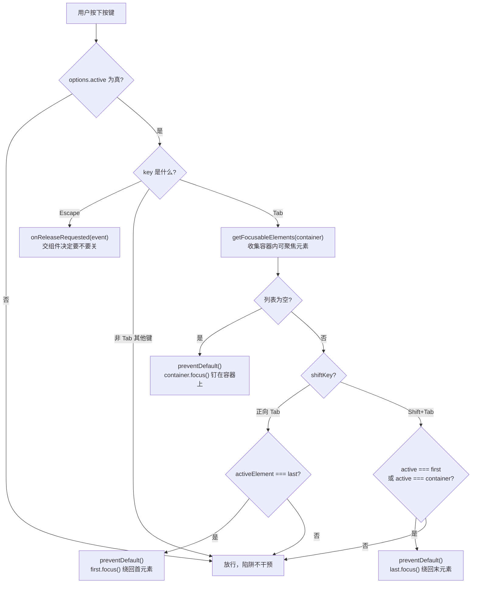
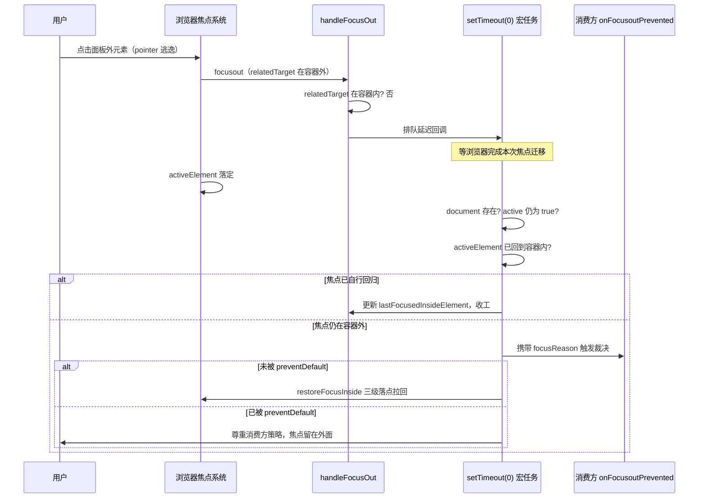
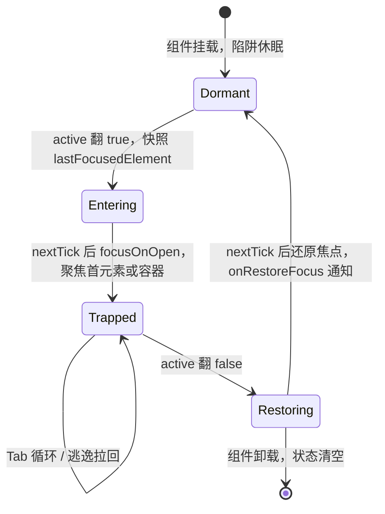
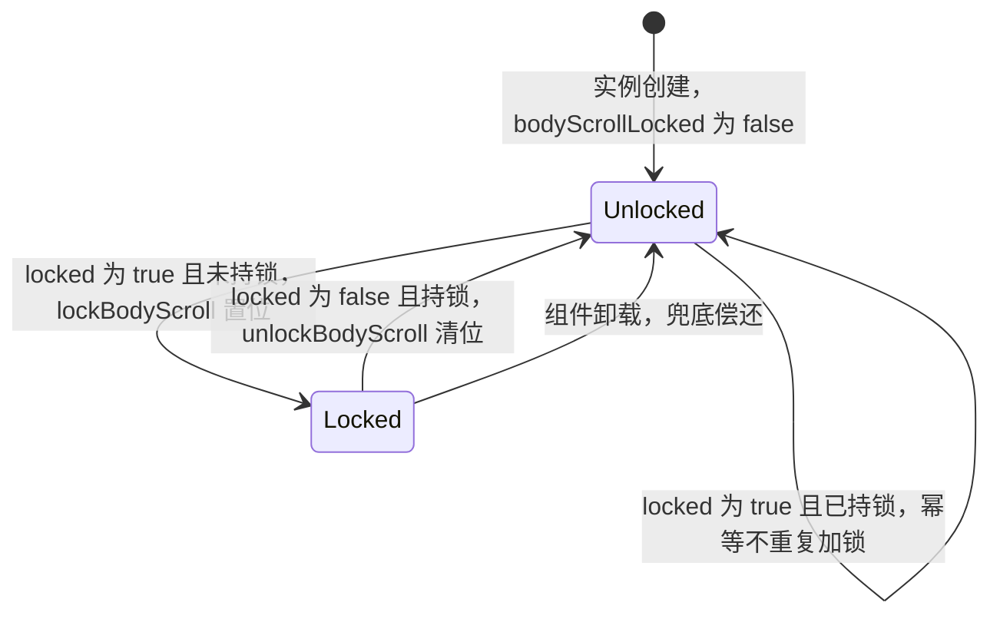

# 4-07 · 焦点治理：焦点陷阱与滚动锁

> 模态组件（dialog / drawer / image-viewer）打开的一瞬间，页面的焦点秩序面临三个要求：焦点要**进入**（自动聚焦到面板内第一个可交互元素）、焦点要**困住**（Tab 循环不得逃出容器）、焦点要**归还**（关闭时回到触发按钮）。这三件事单独做都不难，难在同时成立——困住与逃逸的判定发生在同一批 DOM 事件上，归还时机又卡在 Vue 渲染周期与浏览器焦点机制的缝隙里。本篇拆开本库焦点治理的两层实现：`useFocusTrap` 负责焦点本身，`lockBodyScroll` 加上 `useOverlayDialog` 的配对式消费负责滚动背景；顺带复盘两次真实修复——f0b37a2 的"延迟回调环境防护"，以及滚动锁"谁上的锁谁解"的配对标记改造。

涉及源码（本篇引用的全部行号均以当前工作区实态逐一核对，其中 `use-overlay-dialog.ts` 的滚动锁段是配对式修复后的工作区版本）：

- `packages/xiaoye-primitives/src/utils/dom/focus.ts`（55 行，可聚焦元素收集与 Tab 循环纯函数）
- `packages/xiaoye-primitives/src/composables/use-focus-trap.ts`（255 行，焦点陷阱编排）
- `packages/xiaoye-primitives/src/utils/dom/scroll-lock.ts`（28 行，body 滚动锁底层）
- `packages/xiaoye-primitives/src/composables/use-overlay-dialog.ts`（174 行，trap 与 lock 的编排中枢）
- 消费实证：`packages/components/dialog/src/use-dialog.ts`、`packages/components/drawer/src/drawer.vue`、`packages/components/image/src/image-viewer.vue`
- 测试：`packages/xiaoye-primitives/__tests__/use-overlay-dialog.spec.ts`、`packages/components/drawer/__tests__/drawer.spec.ts`

---

## 一、问题现场：同一批事件上的三条铁律

先把需求翻译成浏览器事件语言。用户在模态框里按 Tab，浏览器默认行为是"把焦点移到 DOM 顺序里的下一个可聚焦元素"——如果模态框后面还有按钮、链接，焦点就会穿墙而出，落到被遮罩盖住的背景页上。这就是**焦点逃逸**：键盘用户在视觉黑洞里操作，屏幕阅读器读的是不可见内容。WAI-ARIA 的 dialog 模式把这件事定为硬性要求：焦点必须限制在容器内循环。

三条铁律对应三类干预点：

1. **进入聚焦**：打开后把焦点送到容器内。问题是"打开"在 Vue 里有两个时刻——逻辑状态翻转（`visible = true`）和 DOM 真实挂载（`nextTick` 之后）。聚焦早了，元素还不存在，`focus()` 静默失败。
2. **Tab 循环**：拦截 Tab 的默认行为，手动把焦点从末元素绕回首元素（Shift+Tab 反向）。问题是怎么判定"该绕了"——不能等焦点已经逃出去再追，得在默认行为发生前 `preventDefault`。
3. **关闭还原**：关闭后把焦点还给打开前那个元素。问题是"打开前"这个时刻的快照什么时候取、还原发生在过渡动画之前还是之后、触发器本身会不会在关闭过程中被卸载。

三条铁律彼此牵制：Tab 循环的判定依赖"焦点当前在哪"，而焦点在哪又被进入聚焦决定；还原的时机若早于过渡动画结束，焦点会落在一个即将被 `v-if` 卸载的 DOM 树上，浏览器把它扔回 `body`，还原等于没做。本库的答案是把三件事拆到两个层次：纯函数 `trapFocus` 只管"Tab 该不该绕、绕到哪"，composable `useFocusTrap` 管生命周期编排，消费组件只做一件事——把 `handleKeydown` 绑到模板上。

## 二、焦点基底：55 行纯函数撑起整个陷阱

先读地基。`packages/xiaoye-primitives/src/utils/dom/focus.ts` 全文 55 行，三个函数：

```ts
const focusableSelector =
  'button:not([disabled]), [href], input:not([disabled]), select:not([disabled]), textarea:not([disabled]), [tabindex]:not([tabindex="-1"])';

export function getFocusableElements(container: HTMLElement | null) {
  if (!container) {
    return [];
  }

  return [...container.querySelectorAll<HTMLElement>(focusableSelector)].filter(
    (element) => !element.hasAttribute("disabled") && element.getAttribute("aria-hidden") !== "true"
  );
}

export function focusFirstDescendant(container: HTMLElement | null) {
  const [first] = getFocusableElements(container);

  if (first) {
    first.focus();
    return first;
  }

  return null;
}

export function trapFocus(container: HTMLElement | null, event: KeyboardEvent) {
  if (!container || event.key !== "Tab") {
    return false;
  }

  const focusableElements = getFocusableElements(container);

  if (!focusableElements.length) {
    event.preventDefault();
    container.focus();
    return true;
  }

  const first = focusableElements[0];
  const last = focusableElements[focusableElements.length - 1];
  const active = document.activeElement as HTMLElement | null;

  if (event.shiftKey && (active === first || active === container)) {
    event.preventDefault();
    last.focus();
    return true;
  }

  if (!event.shiftKey && active === last) {
    event.preventDefault();
    first.focus();
    return true;
  }

  return false;
}
```

（`focus.ts:1-55`）

值得停下来的是几个决策。

**可聚焦判定用 CSS 选择器而不是 TreeWalker。** `focusableSelector` 列举 `button / [href] / input / select / textarea / [tabindex]` 六类，排除 `disabled` 与 `tabindex="-1"`，再用 `filter` 补一道 `aria-hidden` 检查。对照 Element Plus 的 `obtainAllFocusableElements`——它用 `document.createTreeWalker` 遍历节点，逐个检查 `tabIndex >= 0`、可见性（`visibility` / 祖先 `display: none`）甚至排除 `input[type=hidden]`。EP 的判定更精确，代价是 30 余行遍历与可见性探测；本库的选择器方案短平快，但有两个已知盲区：`visibility: hidden` 或 `display: none` 的元素仍会被收集（焦点会"消失"在不可见元素上），以及 `contenteditable`、`audio controls` 等长尾可聚焦元素不在名单内。这是刻意的取舍：模态组件的内容由组件库自己的表单与按钮构成，六类选择器覆盖了 99% 的实际场景，而 TreeWalker 的成本在每个 Tab 键按下时都要重付一次——`trapFocus` 是热路径，按键每次都要重新收集列表。

**循环判定是"边界命中"而不是"越界检测"。** `trapFocus` 不去问"焦点会不会跑到容器外"，只问两个具体问题：焦点是否正停在 `last` 上且按了正向 Tab？是否停在 `first` 或容器本身上且按了 Shift+Tab？命中就 `preventDefault` 并手动绕行。这依赖一个前提：拦截必须发生在焦点**移走之前**，也就是 `keydown` 阶段（而不是 `keyup` 或 focus 事件），否则浏览器已经把焦点挪出去了，`preventDefault` 为时已晚。这也是后面消费组件全部用 `@keydown.capture` 绑定的原因——capture 阶段先于目标元素自身的 keydown 处理器，确保在事件树的最早点拿到控制权。

**空容器兜底把焦点钉在容器上。** `focusableElements.length === 0` 时，`preventDefault` 吞掉 Tab 并让 `container.focus()`——这要求容器自身可聚焦，消费组件都给了 `tabindex="-1"`（`drawer.vue:493`、`dialog-content.vue:102`）。`-1` 的语义是"可以编程聚焦、但不进 Tab 序"，正好：容器能接住焦点，又不会出现在 `getFocusableElements` 的结果里跟真实控件抢位。

把这段逻辑画成流程，就是焦点陷阱在每一次按键时的完整决策树：



注意图里所有"绕行"分支都以 `preventDefault()` 开头——顺序不能反，先 `focus()` 再阻止默认行为就晚了，浏览器已经把焦点移向 DOM 顺序的下一个元素。

## 三、useFocusTrap 全文精读：255 行编排艺术

纯函数解决"单次按键"，composable 解决"整个生命周期"。`use-focus-trap.ts` 全文 255 行，分五段读。

### 3.1 契约与闭包状态

```ts
import { nextTick, onBeforeUnmount, onMounted, toValue, watch } from "vue";
import type { MaybeRefOrGetter } from "vue";
import { focusFirstDescendant, trapFocus } from "../utils";

export type FocusTrapFocusReason = "pointer" | "keyboard" | null;

export interface FocusTrapFocusoutPreventedEvent {
  detail: {
    focusReason: FocusTrapFocusReason;
  };
  readonly defaultPrevented: boolean;
  preventDefault: () => void;
}

export interface FocusTrapOptions {
  active: MaybeRefOrGetter<boolean>;
  autoFocus?: "first" | "container" | false;
  restoreFocus?: boolean;
  onAutoFocus?: () => void;
  onRestoreFocus?: () => void;
  onReleaseRequested?: (event: KeyboardEvent) => void;
  onFocusoutPrevented?: (event: FocusTrapFocusoutPreventedEvent) => void;
}

export function useFocusTrap(
  containerRef: MaybeRefOrGetter<HTMLElement | null>,
  options: FocusTrapOptions
) {
  let lastFocusedElement: HTMLElement | null = null;
  let lastFocusedInsideElement: HTMLElement | null = null;
  let lastFocusReason: FocusTrapFocusReason = null;
  let currentContainer: HTMLElement | null = null;
```

（`use-focus-trap.ts:1-32`）

四个闭包变量是整个 composable 的记忆体，名字里的 `last` 各有所指：

- `lastFocusedElement`：**打开陷阱之前**的焦点（通常是触发按钮），还原还原的就是它。
- `lastFocusedInsideElement`：**容器内部最近一次**的焦点，焦点被外力拽走后拉回时的落点。
- `lastFocusReason`：最后一次焦点变化是鼠标还是键盘引起的，决定逃逸时"拦不拦"。
- `currentContainer`：当前挂了 focusin/focusout 监听的容器，用于容器实例变化时换绑。

`FocusTrapOptions` 里有三个签名值得对照 EP：`autoFocus` 接受 `"first" | "container" | false` 三态——dialog 要聚焦到第一个控件，image-viewer 这种纯看图面板只要容器整体聚焦（焦点进不了任何控件时，浏览器会试图聚焦 `body`，陷阱立刻判定"焦点在容器外"然后反复拉扯，`"container"` 就是给这个场景的活路）；`onFocusoutPrevented` 的回调参数不是 CustomEvent，是一个手搓的 `{ detail, defaultPrevented, preventDefault }` 对象（`use-focus-trap.ts:34-48` 的 `createFocusoutPreventedEvent`）——EP 派发名为 `focusout-prevented` 的真实 CustomEvent 让外层 `preventDefault`，本库把这个协议压缩成一个闭包对象的 getter，语义相同（消费方调用 `preventDefault()` 后，`defaultPrevented` 变 true，调用方读它决定行为），少了事件合成与 `dispatchEvent` 的开销。

### 3.2 焦点内记录与逃逸回收

```ts
  function restoreFocusInside(container: HTMLElement | null) {
    if (!container) {
      return;
    }

    if (lastFocusedInsideElement && container.contains(lastFocusedInsideElement)) {
      lastFocusedInsideElement.focus();
      return;
    }

    if (!focusFirstDescendant(container)) {
      container.focus();
    }
  }

  function handleDocumentPointerDown() {
    lastFocusReason = "pointer";
  }

  function handleDocumentKeydown() {
    lastFocusReason = "keyboard";
  }

  function handleFocusIn(event: FocusEvent) {
    if (!toValue(options.active)) {
      return;
    }

    const container = toValue(containerRef);
    const target = event.target;

    if (!container || !(target instanceof HTMLElement) || !container.contains(target)) {
      return;
    }

    lastFocusedInsideElement = target;
  }

  function handleFocusOut(event: FocusEvent) {
    if (!toValue(options.active)) {
      return;
    }

    const container = toValue(containerRef);
    const relatedTarget = event.relatedTarget;

    if (!container) {
      return;
    }

    if (relatedTarget instanceof HTMLElement && container.contains(relatedTarget)) {
      return;
    }

    window.setTimeout(() => {
      // 回调可能晚于宿主环境销毁触发（vitest 环境 teardown、SSR），无 document 时无焦点可恢复
      if (typeof document === "undefined" || !toValue(options.active)) {
        return;
      }

      const latestContainer = toValue(containerRef);
      const activeElement = document.activeElement;

      if (!latestContainer) {
        return;
      }

      if (activeElement instanceof HTMLElement && latestContainer.contains(activeElement)) {
        lastFocusedInsideElement = activeElement;
        return;
      }

      const focusoutPreventedEvent = createFocusoutPreventedEvent();
      options.onFocusoutPrevented?.(focusoutPreventedEvent);

      if (focusoutPreventedEvent.defaultPrevented) {
        return;
      }

      restoreFocusInside(latestContainer);
    }, 0);
  }
```

（`use-focus-trap.ts:50-131`）

这一段是焦点陷阱里最微妙的部分：**Tab 循环之外的逃逸路径**。

`trapFocus` 只拦 Tab 键，但焦点可以从很多渠道离开容器：`element.focus()` 的编程调用、点击容器外的元素（鼠标聚焦）、浏览器 DevTools、屏幕阅读器的虚拟光标导航。`handleFocusOut` 在 focusout 事件上部署第二道防线——relatedTarget 还在容器内就放行（容器内部移动不算逃逸），否则进入延迟裁决。

**为什么必须 `setTimeout(0)` 延迟裁决？** 因为 focusout 触发的瞬间，焦点移动还没有完成——`document.activeElement` 此刻可能是 `body`（过渡态），下一步浏览器可能马上把焦点交给 relatedTarget。此刻做"焦点在哪"的判断等于在门关上的瞬间数人数，数出来的一定是错的。推迟一个宏任务，等浏览器把这次焦点迁移完全落定，再读 `document.activeElement`：如果焦点自己回来了（比如某个 `focusin` 处理器已经把它拉回），更新内部记录收工；如果确实在外面，先问消费方（`onFocusoutPrevented`），不阻止才执行 `restoreFocusInside` 拉回。

**`restoreFocusInside` 的三级落点**是用户体验的细节：优先回到逃逸前容器内的最后位置（`lastFocusedInsideElement`），这个元素没了（比如被 `v-if` 卸载）就聚焦第一个可聚焦后代，容器里一个可聚焦元素都没有就聚焦容器本身。三级兜底保证"焦点一定在容器内"这个不变量在任何 DOM 状态下都成立。

**第 106 行的 `typeof document === "undefined"` 检查就是 f0b37a2 修复的实态。** 这个提交（2026-09-16，改动 2 行）的 commit message 写得很直白：`handleFocusOut` 的 setTimeout 回调在宿主环境销毁后触发（vitest jsdom teardown、SSR hydration 前）时访问 `document` 抛 unhandled ReferenceError，导致 CI 上 vitest 以非零退出——本地时序快难以复现，CI 时序慢必现。修复本身只有一行守卫，但它暴露的是异步回调与组件生命周期的错位：**watcher 可以停，排进宏队列的回调不会停**。同类守卫在 `watch(active)` 回调（第 204 行）与 `onMounted`（第 229 行）也各有一道，三处共同把 composable 做成了"无 DOM 环境静默降级"的形态。顺带修正一个常见误读：这里的延迟用的是 `window.setTimeout`，不是 `requestAnimationFrame`——RAF 在无头环境和后台标签页会被节流甚至不触发，宏任务定时器才是跨环境最稳的"等一等"。

`lastFocusReason` 的采集也在这段：`handleDocumentPointerDown` / `handleDocumentKeydown` 两个文档级 capture 监听（第 228-236 行挂载）在 mousedown / touchstart / keydown 到达任何目标之前就记下"这次交互的输入模态"。这个信息在逃逸裁决时作为 `detail.focusReason` 交给消费方——它是"指针逃逸要不要拦"这个策略问题的判断依据。

### 3.3 容器换绑、开合编排与按键分发

```ts
  function bindContainer(container: HTMLElement | null) {
    if (currentContainer === container) {
      return;
    }

    if (currentContainer) {
      currentContainer.removeEventListener("focusin", handleFocusIn);
      currentContainer.removeEventListener("focusout", handleFocusOut);
    }

    currentContainer = container;

    if (currentContainer) {
      currentContainer.addEventListener("focusin", handleFocusIn);
      currentContainer.addEventListener("focusout", handleFocusOut);
    }
  }

  async function focusOnOpen() {
    await nextTick();
    const container = toValue(containerRef);
    lastFocusedInsideElement = null;

    if (options.autoFocus === "container") {
      container?.focus();
      options.onAutoFocus?.();
      return;
    }

    if (options.autoFocus === false) {
      return;
    }

    if (!focusFirstDescendant(container)) {
      container?.focus();
    }
    options.onAutoFocus?.();
  }

  async function restoreOnClose() {
    if (!options.restoreFocus || !lastFocusedElement) {
      return;
    }

    await nextTick();
    lastFocusedElement.focus();
    options.onRestoreFocus?.();
    lastFocusedElement = null;
  }

  function handleKeydown(event: KeyboardEvent) {
    if (!toValue(options.active)) {
      return;
    }

    if (event.key === "Escape") {
      options.onReleaseRequested?.(event);
      return;
    }

    if (event.key !== "Tab") {
      return;
    }

    trapFocus(toValue(containerRef), event);
  }
```

（`use-focus-trap.ts:133-198`）

`focusOnOpen` 与 `restoreOnClose` 是一开一关的两个对称动作，各有一个 `await nextTick()`，位置都卡得极准：

- `focusOnOpen` 的 `nextTick` 在**取容器引用之前**。`active` 翻 true 时 DOM 大概率还没渲染（`v-if` 的新分支），`nextTick` 等一轮微任务让 DOM 挂载、`containerRef` 拿到真实节点，`focusFirstDescendant` 才有的放矢。如果不等，`container` 是 null，聚焦静默丢失——而且不会报错，只在真实浏览器里表现为"打开后焦点还在触发按钮上"，Tab 一下焦点直接跑进背景页。
- `restoreOnClose` 的 `nextTick` 在**聚焦之前**。关闭瞬间容器还在过渡动画里，`lastFocusedElement`（触发按钮）在背景页不受影响，但延迟一拍可以避开关闭过程中同一帧内的其他焦点操作（比如 `destroyOnClose` 卸载内容触发的焦点重置），避免"还回去又被别人抢走"。

`bindContainer` 处理一个容易漏的场景：`containerRef` 指向的元素可能整个换掉——`destroyOnClose` 模式下关闭后面板卸载、重开后是全新节点。`watch(containerRef)`（第 218-226 行，`immediate: true`）在引用变化时换绑 focusin/focusout，`bindContainer` 开头的同引用短路避免重复挂监听。

`handleKeydown` 是消费组件模板唯一要绑的入口，三个分支按开销排序：active 检查最先（关闭态零成本）、Escape 次之（转发 `onReleaseRequested` 让组件决定关不关）、Tab 最后才进入 `trapFocus`。这个入口是**拉模式**的——composable 不自己往 document 上挂 keydown 拦 Tab（那会影响全页面），而是把拦截权交给组件模板的 `@keydown.capture`，事件只在面板子树内才会到达陷阱。

### 3.4 两个 watch 与生命周期收尾

```ts
  watch(
    () => toValue(options.active),
    async (value) => {
      if (value) {
        if (typeof document === "undefined") return;
        lastFocusedElement =
          document.activeElement instanceof HTMLElement ? document.activeElement : null;
        await focusOnOpen();
        return;
      }

      await restoreOnClose();
    },
    {
      immediate: true
    }
  );

  watch(
    () => toValue(containerRef),
    (container) => {
      bindContainer(container);
    },
    {
      immediate: true
    }
  );

  onMounted(() => {
    if (typeof document === "undefined") {
      return;
    }

    document.addEventListener("mousedown", handleDocumentPointerDown, true);
    document.addEventListener("touchstart", handleDocumentPointerDown, true);
    document.addEventListener("keydown", handleDocumentKeydown, true);
  });

  onBeforeUnmount(() => {
    if (typeof document !== "undefined") {
      document.removeEventListener("mousedown", handleDocumentPointerDown, true);
      document.removeEventListener("touchstart", handleDocumentPointerDown, true);
      document.removeEventListener("keydown", handleDocumentKeydown, true);
    }

    bindContainer(null);
    lastFocusedElement = null;
    lastFocusedInsideElement = null;
    lastFocusReason = null;
  });

  return {
    handleKeydown,
    restoreOnClose
  };
}
```

（`use-focus-trap.ts:200-255`）

`watch(active)` 的 immediate 有个隐藏福利：组件以 `modelValue: true` 初始挂载时（首屏直接开对话框），watcher 立刻执行开启分支——先快照 `document.activeElement`（此时多半是 `body` 或上一个焦点），再 `focusOnOpen`。快照时机也在这一行定死：**打开前一刻**，而不是 setup 时。至于 `onBeforeUnmount` 里手动清空四个闭包变量，虽然组件销毁后闭包也会被回收，但显式置空防御的是"卸载后排队的 setTimeout 回调读到陈旧引用"——与 f0b37a2 的守卫是同一条防线的两道工事。

整个陷阱的工作流可以浓缩成一张时序图——尤其是焦点逃逸后那 0 毫秒里发生的事：



## 四、消费实证：dialog 与 drawer 的两种性格

composable 的策略参数全部由消费组件填，两件浮层家具填出了两种性格。

**dialog：全部默认策略。** `use-dialog.ts:259-269`：

```ts
  const focusTrap = useFocusTrap(dialogElement, {
    active: () => overlay.visible.value,
    autoFocus: "first",
    restoreFocus: true,
    onAutoFocus: () => {
      options.emitOpenAutoFocus();
    },
    onRestoreFocus: () => {
      options.emitCloseAutoFocus();
    }
  });
```

不传 `onFocusoutPrevented`——对话框是严格的模态，任何形式的焦点逃逸（无论鼠标键盘）都拉回容器内。不传 `onReleaseRequested`——它的 ESC 走 `useDismissibleLayer`（`use-dialog.ts:325-334`）的文档级监听。模板侧经过两层转发：`dialog.vue:206` 把 `focusTrap.handleKeydown` 作为 prop 传给 `DialogContent`，后者在面板元素上绑定（`dialog-content.vue:103`）：

```html
    tabindex="-1"
    @keydown.capture="props.handleFocusTrapKeydown"
```

**drawer：策略全开。** `drawer.vue:369-393`：

```ts
const focusTrap = useFocusTrap(panelRef, {
  active: () => visible.value,
  autoFocus: "first",
  restoreFocus: true,
  onAutoFocus: () => {
    emit("open-auto-focus")
  },
  onRestoreFocus: () => {
    emit("close-auto-focus")
  },
  onReleaseRequested: (event) => {
    if (!allowEscClose.value || !visible.value || !isTopMost()) {
      return
    }

    event.preventDefault()
    event.stopPropagation()
    handleClose("escape")
  },
  onFocusoutPrevented: (event) => {
    if (event.detail.focusReason === "pointer") {
      event.preventDefault()
    }
  }
})
```

两个回调定义了 drawer 与 dialog 的行为分野：

**`onFocusoutPrevented` 里只拦 pointer。** 鼠标点击抽屉外 → `preventDefault()` → 陷阱不拉回（用户点了哪里焦点就在哪里）；键盘 Tab 逃出去 → 不阻止 → `restoreFocusInside` 拉回。为什么抽屉比对话框宽松？抽屉常被用作侧边工具面板，页面上与背景交互（比如点一下背景输入框抄个值）是合理操作，焦点跟着鼠标走符合直觉；而键盘用户按 Tab 逃出多半是无意识循环到头了，拉回来才符合"陷阱"承诺。这个行为有测试钉死——`drawer.spec.ts:686-710`（穿透模式指针切换不抢回）、`drawer.spec.ts:642-664`（默认模式焦点意外离开会回到抽屉内部），一正一反两条用例把策略锁住。

**`onReleaseRequested` 是 ESC 的面板内通道。** 注意它做了三件事：查 `isTopMost()`（栈顶才响应）、`preventDefault`、`stopPropagation`。前一件防的是"对话框叠抽屉时 ESC 一按全关"；后两件防的是重复关闭——`useDismissibleLayer` 也在 document 上监听 ESC（`use-dismissible-layer.ts:42-53`），drawer 同时给两处都配了 ESC 能力，面板内捕获阶段的 `stopPropagation` 让事件到不了 document 的冒泡监听，关闭动作只执行一次。dialog 则干脆只留 dismissible layer 一条通道。同一份 ESC 语义，两套编排各自收敛，但收敛结果一致：**一次按键，一次关闭，且只有栈顶响应**。

image-viewer 是第三个消费方，填了 `autoFocus: "container"`（`image-viewer.vue:607-611`），并绕开 `useOverlayDialog` 手工编排 `openLayer` + `lockBodyScroll`（`image-viewer.vue:187-188`），在 `onBeforeUnmount` 里兜底偿还（`image-viewer.vue:613-617`）——这是滚动锁"打开态直接卸载"风险的又一处手工防线，也是配对式修复前最容易泄漏计数的地方。

焦点生命周期全程，可以概括为开合对称的六步：



## 五、滚动锁：28 行计数器与一次混合配置事故

焦点治理的另一半是**滚动锁**：模态浮层开着时，背景页不许滚。底层实现短得出奇，`packages/xiaoye-primitives/src/utils/dom/scroll-lock.ts` 全文：

```ts
let lockCount = 0;
let previousOverflow = "";

export function lockBodyScroll() {
  if (typeof document === "undefined") {
    return;
  }

  lockCount += 1;

  if (lockCount === 1) {
    previousOverflow = document.body.style.overflow;
    document.body.style.overflow = "hidden";
  }
}

export function unlockBodyScroll() {
  if (typeof document === "undefined" || lockCount === 0) {
    return;
  }

  lockCount -= 1;

  if (lockCount === 0) {
    document.body.style.overflow = previousOverflow;
  }
}
```

（`scroll-lock.ts:1-27`）

典型的引用计数：第一个 `lockBodyScroll` 记下 body 原始 `overflow` 并置 `hidden`，后续加锁只涨计数；解锁减到 0 才还原。计数为 0 时再解是幂等空操作。两个浮层叠开、各自加锁，关掉一个背景仍然锁着，全关才恢复——这正是"锁"该有的共享语义。

但引用计数有个经典软肋：**它对"谁加的锁"失忆**。`unlockBodyScroll` 是无条件递减，任何一个调用方都能减掉别人加的锁。软肋在一个真实场景里爆了：页面同时存在两个浮层实例，A 配置 `lockScroll: true` 且正开着（锁计数 1），B 配置 `lockScroll: false` 后挂载并打开。修复前的 `use-overlay-dialog` 用 `watch` 直接消费：

```ts
// 修复前（HEAD 版本已无此段，此处为事故形态还原）
watch(
  () => Boolean(toValue(options.lockScroll)) && visible.value,
  (locked) => {
    if (locked) {
      lockBodyScroll();
      return;
    }
    unlockBodyScroll();
  },
  { immediate: true }
);
```

问题出在 `immediate: true` 的**首次执行**：B 挂载时 `lockScroll` 为 false，回调收到 `locked = false`，走 else 分支调 `unlockBodyScroll()`——B 从没加过锁，却把 A 的锁减掉了。计数从 1 归 0，body 的 `overflow` 被还原，A 还开着，背景却能滚了。更隐蔽的是这条路径发生在挂载瞬间，用户看到的是"开着的对话框背后页面突然可以滚动"，没有任何报错可查。

2026-09-16 的修复（当前工作区实态）引入了一个每实例的配对标记，`use-overlay-dialog.ts:127-159` 全段：

```ts
  const shouldLockBodyScroll = computed(() => {
    return Boolean(toValue(options.lockScroll)) && visible.value;
  });

  // 配对标记：只有本实例真正加过锁才允许解锁。
  // unlockBodyScroll 是无条件递减，若 watch immediate 在初始 false 时也调 unlock，
  // 混合配置（A lockScroll=true 开着、B lockScroll=false 挂载）会把 A 的锁减掉。
  let bodyScrollLocked = false;

  watch(
    shouldLockBodyScroll,
    (locked) => {
      if (locked && !bodyScrollLocked) {
        lockBodyScroll();
        bodyScrollLocked = true;
        return;
      }
      if (!locked && bodyScrollLocked) {
        unlockBodyScroll();
        bodyScrollLocked = false;
      }
    },
    { immediate: true }
  );

  // 兜底：组件卸载时 watcher 停止但不再触发回调，
  // 打开状态下直接卸载会导致计数泄漏，这里只偿还本实例的锁。
  onBeforeUnmount(() => {
    if (bodyScrollLocked) {
      unlockBodyScroll();
      bodyScrollLocked = false;
    }
  });
```

（`use-overlay-dialog.ts:127-159`）

三处改动各挡一种泄漏路径。`shouldLockBodyScroll` 把"该不该锁"收敛成一个 computed（`lockScroll` 期望值与 `visible` 实际值的合取），动态改配置也能响应——测试 `use-overlay-dialog.spec.ts:121-141` 验证了开着时把 `lockScroll` 翻 false 立即解锁、翻回 true 恢复锁定。`bodyScrollLocked` 配对标记让"解锁"必须以"本实例加过锁"为前提，immediate 首帧 `locked = false && !bodyScrollLocked` 双假，两个分支都不进，B 的挂载对 A 的锁零干扰。`onBeforeUnmount` 兜底挡的是 Vue 的一个静默陷阱：**组件卸载时 watcher 被停止，但停止不会触发回调**——打开状态下直接卸载，锁定态的 watch 永远等不到收尾机会，计数就永久涨在那里。兜底只在本实例 `bodyScrollLocked` 为真时偿还，注释里"只偿还本实例的锁"七个字就是配对语义的延续。

配对标记的回归用例完整复刻了事故现场（`use-overlay-dialog.spec.ts:158-195`）：

```ts
  it("混合配置回归：lockScroll=false 的浮层不得释放 lockScroll=true 浮层的锁", async () => {
    const useOverlayDialog = await loadUseOverlayDialog();
    const lockedModelValue = ref(false);
    const unlockedModelValue = ref(false);
    const lockedScroll = ref<boolean | undefined>(true);
    const unlockedScroll = ref<boolean | undefined>(false);

    const unmountLocked = mountHost(useOverlayDialog, {
      modelValue: lockedModelValue,
      lockScroll: lockedScroll
    });

    lockedModelValue.value = true;
    await nextTick();
    expect(document.body.style.overflow).toBe("hidden");

    // B 挂载并打开：watch immediate 初始 locked=false，
    // 若无 bodyScrollLocked 配对标记会误调 unlockBodyScroll，把 A 的锁减掉
    const unmountUnlocked = mountHost(useOverlayDialog, {
      modelValue: unlockedModelValue,
      lockScroll: unlockedScroll
    });

    unlockedModelValue.value = true;
    await nextTick();
    expect(document.body.style.overflow).toBe("hidden");

    // B 卸载：B 从未持有锁，兜底逻辑也不得释放 A 的锁
    unmountUnlocked();
    expect(document.body.style.overflow).toBe("hidden");

    // A 关闭后才真正还原
    lockedModelValue.value = false;
    await nextTick();
    expect(document.body.style.overflow).toBe("");

    unmountLocked();
  });
```

（`use-overlay-dialog.spec.ts:158-195`）

用例断言全程只有四拍，却精确踩过三个泄漏点：B 挂载（immediate 误解锁点）、B 打开（不该加锁）、B 卸载（兜底误还别人锁点）。测试文件的 `loadUseOverlayDialog` 还有一处工程细节值得点出（`use-overlay-dialog.spec.ts:5-11`）：`lockCount` 是模块级变量，每个用例前 `vi.resetModules()` + 动态 `import` 重新加载模块，让计数归零——模块级单例状态在测试里的隔离，靠的是"换模块实例"而不是"试图重置变量"。

配对状态机一图流：



滚动锁与焦点陷阱之间还有一层很少被拆开讲的**时序耦合**。两把锁都挂在上面的两个 watch 其实监听同一个 `visible`，谁先执行？答案是创建顺序：`use-dialog.ts` 里 `useOverlayDialog`（169 行调用，滚动锁 watch 在其内部创建）先于 `useFocusTrap`（259 行调用），而 Vue 的 pre watcher 按创建顺序冲刷——于是打开方向上**滚动锁先落、焦点后进**。这不只是先后问题，是有实感的因果：`focusOnOpen` 还要再等一个 `nextTick` 才聚焦，而 `focus()` 自带隐式的 scrollIntoView 语义，若锁没先落，首元素聚焦可能把还没锁住的背景页滚出一段位移；先锁后聚焦，这个副作用被结构挡掉了。关闭方向上顺序同样讲究：解锁在滚动锁的 watch 回调里同步执行，焦点还原却要等 `restoreOnClose` 的 `nextTick`——**先解锁、后还原**，滚动条回归、布局重排先发生，触发按钮重新拿到焦点时页面已经稳定，不会出现"焦点落在旧坐标、随后内容跳一下"的撕裂感。一开一关两个方向，锁与焦点的次序互为镜像，这不是巧合而是同一份契约的两半。image-viewer 的手工编排也遵循同一套顺序——打开时 `openLayer()` 再 `lockBodyScroll()`（`image-viewer.vue:187-188`），关闭时镜像对称地 `closeLayer()` 再 `unlockBodyScroll()`（193-194 行）——三处消费、两种编排、一个时序契约：**资源次序上，锁永远先行于焦点进入、先行于焦点归还之后的退场。**

## 六、权衡清单与 EP 对照

把本篇的设计决策收拢，并逐项对照 Element Plus 的同名设施（EP `packages/components/focus-trap`）：

**权衡一：keydown 边界拦截 vs 哨兵节点。** 焦点陷阱的经典实现是首末哨兵（sentinel）：在容器首尾各插一个不可见元素并塞进 Tab 序，焦点流到哨兵时被 focusin 捕获、手动绕行——`focus-trap` npm 库与 Radix UI 走这条路。哨兵的好处是零按键拦截、天然支持任何焦点移动方式；代价是污染 DOM 结构、样式上要小心哨兵可见性、还要处理 SSR hydration 顺序。本库选 keydown 边界拦截（`trapFocus` 的"边界命中"判定），DOM 零污染，但只拦键盘，鼠标/编程式焦点移动得靠 focusout 防线补——所以本库是"keydown 拦截 + focusout 延迟裁决"双防线。EP 的 focus-trap.vue 与本库同派（onKeydown 里 `getEdges` 取边界 + `tryFocus` 绕行），并没有用哨兵，但它在边界分支里先派发 `focusout-prevented` 再决定是否绕行，把"循环"做成了可被外部否决的行为；本库把否决权放在逃逸路径上（`onFocusoutPrevented`），循环路径直接绕。一个管"出去"的否决，一个管"绕行"的否决，语义侧重不同。

**权衡二：引用计数 vs 配对标记——其实是两层协作。** 滚动锁的底层必须是引用计数（多实例共享一把锁），但计数器对所有权失忆；配对标记补的正是所有权维度。这不是"计数器 vs 标记"二选一，而是分层：计数器保证**共享正确**（两个浮层同开只锁一次），标记保证**释放正确**（谁上的锁谁解）。EP 对应设施是 `useLockscreen`（基于 `useGlobalConfig` 的锁实例与 CSS 类开关），同样是计数语义；本库的教训在于：**共享资源的释放语义不能只靠计数，还要让每次释放都能证明自己持有过**。`bodyScrollLocked` 这个布尔量的存在，就是把"我曾经 lock 过"从隐式状态（计数涨过）提升为显式状态。

**权衡三：焦点还原的时机——快照在打开前，落点在关闭后一拍。** `lastFocusedElement` 在 `active` 翻 true 的 watch 回调里立刻快照（`use-focus-trap.ts:205-206`），此刻还没 `nextTick`，快照到的一定是"陷阱外世界"的最后一个焦点；还原则推迟到 `restoreOnClose` 的 `nextTick` 之后（第 177 行），避开关闭动画与 DOM 卸载的争抢窗口。EP 的 `stopTrap` 更防御：还原前检查释放原因（键盘触发、或非用户点击引起、或焦点仍在容器内），条件不满足就还原到 `document.body`，并且尊重 `FOCUS_AFTER_RELEASED` 事件的 `preventDefault`。本库没有做这层原因审查——`restoreFocus: true` 是消费方显式声明的承诺，承诺了就还原。松紧各有道理：EP 的条件审查防"点击遮罩关闭后焦点跳回触发器打断用户点击流"，本库则把这个判断留给 `close-auto-focus` 事件的订阅方。

**权衡四：嵌套陷阱的协调——paused 栈 vs 各自为政。** EP 维护 `focusableStack` 焦点层栈，内层 trap 启动时 pause 外层（外层所有处理器以 `focusLayer.paused` 短路），内层释放时 resume——嵌套对话框的焦点控制权严格单点。本库没有 paused 机制，多层同时 active 时每个陷阱的 `trapFocus` 都会跑，靠两条软约束收敛：按键分发绑在各自面板上（`@keydown.capture`，事件只达焦点所在层的面板），ESC 释放由消费方查 `isTopMost()` 自证栈顶。这套约束在"焦点只会位于一个面板内"的前提下是自洽的——Tab 循环只有焦点所在层的 trap 真正命中边界条件，其他层 `trapFocus` 里 `active === last` 的判定不会成立。省掉一层全局协调结构，代价是正确性依赖约定而非机制，如果未来出现"焦点视觉在 A 层、逻辑 active 在 B 层"的组合，这里是要重新审视的位置。

**一处核对声明**：任务备料中提到"RAF 延迟防护"，实码并非如此——f0b37a2 修的是 `handleFocusOut` 里 `window.setTimeout(0)` 回调的 `typeof document` 环境守卫（`use-focus-trap.ts:106`），全文无 `requestAnimationFrame`。本篇按实码叙述。另外 `use-overlay-dialog.ts` 的滚动锁配对段是当前工作区实态（HEAD 提交 e38d5d1 上尚无此段），配套的 `use-overlay-dialog.spec.ts` 也是未跟踪的新文件——阅读本篇时若 checkout 到旧提交，行号与实现会对不上，以工作区为准。

## 七、小结

焦点治理的本质是三份不变量的联合维护：**打开后焦点在容器内**（focusOnOpen 的三级落点）、**容器内焦点出不去**（trapFocus 边界拦截 + handleFocusOut 延迟裁决）、**关闭后焦点回原处**（打开前快照、关闭后一拍还原）。滚动锁则是第四份：**锁的存量与浮层的开量一致**——计数器管共享，配对标记管释放。两次修复（f0b37a2 的环境守卫、配对标记的混合配置回归）指向同一条经验：composable 的正确性边界不在"回调写了什么"，而在"回调可能在什么环境下、什么生命周期阶段被调用"。写入时想清楚卸载后、SSR、首帧 immediate 这些极端时刻，比事后追查 CI 上偶发的非零退出便宜得多。

---

**下一篇预告**：4-08《表单联动与全局配置链》。焦点治理解决的是浮层与键盘的秩序，下一篇转入表单层：`xy-form-item` 如何把校验规则、错误信息、禁用态、尺寸沿 `provide/inject` 链从 `config-provider` 一路传到每一个控件，联动规则（disabled / required / 联动显隐）在三层配置（全局 → 表单 → 字段）间的合并优先级，以及"为什么全局配置的解析要用 computed 而不是 props 默认值"——`use-dialog.ts:107-137` 里那一排 `resolvedXxx` 就埋着这个问题的伏笔。
