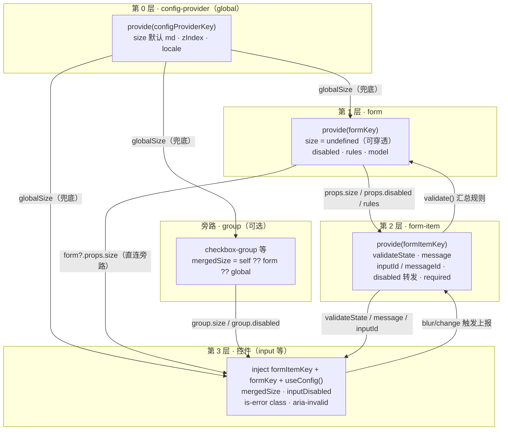
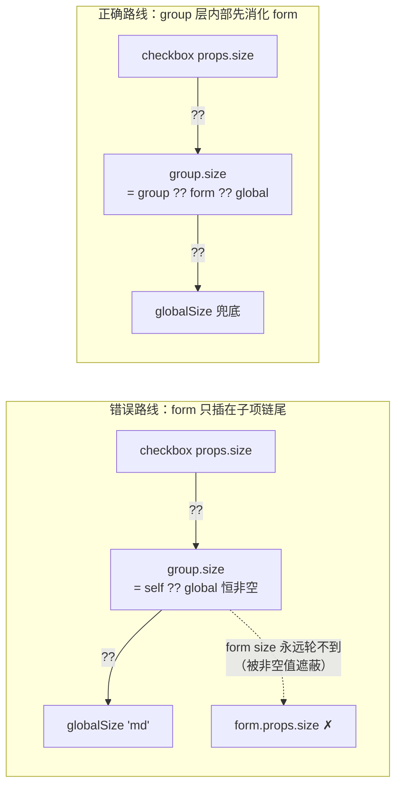
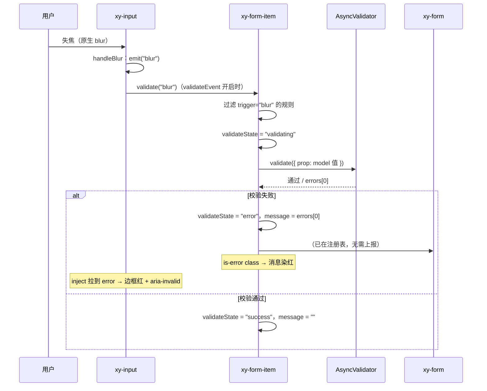

# 4-08 · 表单联动与全局配置链

> 本篇回答一个贯穿表单体系的问题：**form-item 的错误态是怎么"传"进 input 的？** 顺着这条线，我们会拆开一套四层配置链——config-provider 提供全局默认，form 提供 size/disabled/rules，form-item 提供 prop 绑定与校验消息，控件在链尾消费。你还会看到 2026-09-16 那次修复留下的两处实态痕迹：form.vue 的 size 默认值为什么必须从 `"md"` 改回 `undefined`，以及为什么 checkbox-group 里躺着一条"必须在 group 层插入 form 兜底"的注释。Form 校验编排的完整生命周期与 form-item 的消息/aria 细节分别留给 6-17 和 6-18 两篇深入表单协议的文章，本篇只讲通用机制——四层之间到底用什么管道、按什么顺序、传了哪些东西。

涉及源码（全部行号以当前工作区实态逐一核对，其中 form 级联相关代码是 2026-09-16 修复后的版本）：

- 协议层：`packages/components/form/src/context.ts`（65 行）、`packages/components/form/src/utils.ts`（62 行）
- provide 端：`packages/components/form/src/form.vue`（134 行）
- 消费端：`packages/components/form/src/form-item.vue`（215 行）
- 控件实证：`packages/components/input/src/input.vue`（599 行）
- 全局链最外层：`packages/xiaoye-primitives/src/composables/use-config.ts`（55 行）、`shared-context.ts`、`packages/components/config-provider/src/config-provider.vue`
- group 层实证：`packages/components/checkbox/src/checkbox-group.vue`、`checkbox.vue`
- 样式钩子：`packages/theme/src/components/form.css`、`packages/theme/src/components/input.css`
- 测试：`packages/components/form/__tests__/form.spec.ts`、`packages/components/input/__tests__/input.spec.ts`、`packages/components/checkbox/__tests__/checkbox.spec.ts`

---

## 一、错误态的三次旅行

先把"传"字拆开。当用户在 `xy-input` 里留空一个必填项然后失焦，屏幕上出现一条红字、输入框边框变红、读屏器播报"无效"——这个错误态从诞生到被看见，一共旅行了三次：

1. **第一次旅行（数据侧）**：input 捕获原生 `blur` 事件，调用 form-item 的 `validate("blur")`；form-item 汇总规则、交给 async-validator，把结果写进自己的 `validateState` ref。
2. **第二次旅行（渲染侧）**：`validateState` 变成 `"error"` 后，form-item 的根节点拼上 `is-error` class，同时这个 ref 通过 `provide(formItemKey)` 反向提供给下游控件——input 读到它，给自己的容器也拼上 `is-error`。
3. **第三次旅行（样式侧）**：`is-error` 这个 class 名在两处 CSS 里各自埋了钩子——form.css 让消息文字染上 danger 色，input.css 让输入框边框染上 danger 色。两侧靠**同一个字符串协议**对齐。

注意一个关键事实：错误态**不是** form-item "推"给 input 的，而是 input "拉"的。Vue 的 provide/inject 是一条单向水管——上游 provide 一个响应式引用，下游 inject 后自行订阅。form-item 不知道自己肚子里装的是 input 还是 select 还是 date-picker；它只管把 `validateState`、`message`、`inputId` 这些东西放进 context，谁需要谁来取。

而这条水管不是孤立的，它嵌在一套更大的四层配置链里。size、disabled、rules、错误消息，各自走这条链的不同路段：



三层配置链在这里已经完整：**config-provider（global）→ form（size/disabled/rules）→ form-item（prop 绑定路径 + message）→ 控件（消费）**，外加一条 group 旁路。这张图是本篇的地图，后面每一节都在给图上的某条边补实现细节。

## 二、协议先行：context.ts 全文精读

这个库的惯例是 provide/inject 必须先立协议。form 体系的协议全部住在 `context.ts` 里，65 行，全文如下：

```ts
import type { InjectionKey, Ref } from "vue";
import type { RuleItem } from "async-validator";
import type { ComponentSize } from "xiaoye-primitives";
import type { FormProp } from "./utils";

export type FormTrigger = "blur" | "change";
export type ValidateState = "idle" | "validating" | "success" | "error";

export interface XyFormRule extends RuleItem {
  required?: boolean;
  trigger?: FormTrigger | FormTrigger[];
}

export type FormRules = Record<string, XyFormRule[]>;

export interface FormFieldContext {
  prop?: string;
  propKey?: string;
  element?: HTMLElement | null;
  validate: (trigger?: FormTrigger) => Promise<boolean>;
  clearValidate: () => void;
  resetField: () => void;
}

export interface FormProps {
  model: Record<string, unknown>;
  rules?: FormRules;
  labelWidth?: string | number;
  labelPosition?: "left" | "top";
  size?: ComponentSize;
  inline?: boolean;
  disabled?: boolean;
  scrollToError?: boolean;
  validateOnRuleChange?: boolean;
}

export interface FormContext {
  props: FormProps;
  addField: (field: FormFieldContext) => void;
  removeField: (field: FormFieldContext) => void;
  resetFields: (props?: FormProp | FormProp[]) => void;
}

export interface FormInstance {
  validate: () => Promise<boolean>;
  validateField: (prop?: FormProp | FormProp[], trigger?: FormTrigger) => Promise<boolean>;
  resetFields: (prop?: FormProp | FormProp[]) => void;
  clearValidate: (prop?: FormProp | FormProp[]) => void;
}

export interface FormItemContext {
  prop?: FormProp;
  inputId: string;
  messageId: string;
  message: Ref<string>;
  validateState: Ref<ValidateState>;
  disabled: Ref<boolean>;
  required: Ref<boolean>;
  validate: (trigger?: FormTrigger) => Promise<boolean>;
  clearValidate: () => void;
}

export const formKey: InjectionKey<FormContext> = Symbol("xiaoye-form");
export const formItemKey: InjectionKey<FormItemContext> = Symbol("xiaoye-form-item");
```

（`packages/components/form/src/context.ts:1-65`）

五个值得停留的点：

**其一，`Symbol` + `InjectionKey<T>` 的类型化注入。** `InjectionKey` 是 Vue 提供的幻影类型：`inject(formKey)` 的返回值会被自动推成 `FormContext | undefined`，不需要调用方手工断言。两个 key 都带 `xiaoye-` 前缀命名，在 DevTools 里肉眼可辨。顺带一提，config-provider 那边用的是 `Symbol.for("xiaoye-config-provider")`（`shared-context.ts:3-4`）——注册表式全局 Symbol；而 form 用的是每次运行全新的 `Symbol("xiaoye-form")`。前者允许跨多份组件库实例共享配置（比如文档站同时打包了两份构建产物，配置仍能穿透），后者则严格限定"同一个 form 实例家族内部"，父子互不串台。两种取法的差异不是疏忽，是作用域语义本身：全局配置天然希望跨实例，表单校验绝对不能跨实例。

**其二，`ValidateState` 是四态，不是三态。** `"idle" | "validating" | "success" | "error"`（context.ts:7）。很多文章口误说"三态"，把初始态漏掉。初始态不是空串而是一个显式的 `"idle"` 成员——空串是 TypeScript 世界里的坏味道（真值判断时 `""` 和 `undefined` 行为纠缠），显式成员让 `switch` 穷尽性检查可用。

**其三，两条 context 的"读者"完全不同。** `FormContext` 的读者是 form-item（以及想直连 form 拿 size 的控件），`FormItemContext` 的读者是控件。`FormItemContext` 里最值钱的三个字段：`validateState`（错误态本体）、`message`（错误文案的响应式引用）、`inputId`/`messageId`（无障碍关联用的成对 id）。注意它们都是 `Ref` 而非快照值——协议在类型层面就承诺了"这是活的"。

**其四，`FormFieldContext` 与 `FormItemContext` 是两条方向相反的通道。** 前者是 form-item 上报给 form 的（校验凭证：`prop`、`propKey`、`validate`、`resetField`、`element`），后者是 form-item 下发给控件的。form-item 是双向中继：对上是字段，对下是环境。

**其五，`XyFormRule` 只是 async-validator `RuleItem` 的薄扩展。** 多出来的只有 `trigger` 一个字段，用来声明"这条规则归哪种事件管"。校验引擎不自研，协议层只做事件路由的标注——这是"站在成熟库肩膀上"的克制。

协议里还有一条看不见的管道要交代：`prop` 支持 `"a.b.c"` 形式的路径字符串（也支持 `string[]`），归 `utils.ts` 处理。`normalizeFormProp` 把数组 join 成点路径（`utils.ts:3-9`），`getPathValue`/`setPathValue` 按点路径深入 model 取值与回写（`utils.ts:26-62`）。这意味着 form 的 `model` 不必是扁平对象——`prop="user.profile.email"` 会一路取到嵌套字段，`resetField` 也能沿原路写回。

## 三、provide 端：form.vue 的三个动作

`form.vue` 的 script 只有一百多行，但做了三件结构性的事：注册字段、编排校验、下发环境。先看它给 size 留的那个"洞"——2026-09-16 修复后的实态：

```ts
const props = withDefaults(defineProps<FormProps>(), {
  rules: () => ({}),
  labelWidth: "112px",
  labelPosition: "left",
  // 不能给恒定默认值（如 "md"），否则会永久遮蔽 config-provider 的全局 size；
  // 保持 undefined 让未设置时回落到全局链路。
  size: undefined,
  inline: false,
  disabled: false,
  scrollToError: false,
  validateOnRuleChange: true
});
```

（`packages/components/form/src/form.vue:9-20`）

这五行注释值得裱起来。它记录的是一次真实事故：修复前 `size` 的默认值写死为 `"md"`，结果 config-provider 上设的 `size="lg"` 在所有表单里失效——因为 withDefaults 把"用户没设"这个信息抹掉了，下游 `form?.props.size` 永远拿到非空的 `"md"`，`??` 链在这一跳就断了。**props 默认值不是无害的语法糖：对需要穿透的配置项，默认值是一堵墙。**"没配置"必须用 `undefined` 显式表达，让下游的空值合并运算符有机会继续往链尾走。修复动作小到只有一行，但它是理解整条链的钥匙——下一节会看到链尾怎么消费它。

第二件事：字段注册表。form 不通过 slot props 或递归遍历 vnode 认识自己的字段，而是被动等待 form-item 上门登记：

```ts
const ns = useNamespace("form");
const fields: FormFieldContext[] = [];

function normalizeProps(prop?: FormProp | FormProp[]) {
  if (!prop) {
    return fields;
  }

  let normalized: string[];

  if (typeof prop === "string") {
    normalized = [normalizeFormProp(prop)];
  } else if (prop.every((item) => typeof item === "string")) {
    const pathSegments = prop as string[];
    const normalizedPath = normalizeFormProp(pathSegments);

    if (normalizedPath && fields.some((field) => field.propKey === normalizedPath)) {
      normalized = [normalizedPath];
    } else {
      normalized = pathSegments.map((item) => normalizeFormProp(item));
    }
  } else {
    normalized = (prop as FormProp[]).map((item) => normalizeFormProp(item));
  }

  const targets = normalized.filter(Boolean);
  return fields.filter((field) => field.propKey && targets.includes(field.propKey));
}

function addField(field: FormFieldContext) {
  if (!fields.includes(field)) {
    fields.push(field);
  }
}

function removeField(field: FormFieldContext) {
  const index = fields.indexOf(field);

  if (index >= 0) {
    fields.splice(index, 1);
  }
}
```

（`packages/components/form/src/form.vue:22-63`）

`normalizeProps` 是 `validateField(prop)` 的参数解释器，它同时接受三种写法：`"user.name"`（点路径整体匹配）、`["user", "name"]`（先尝试拼成路径，匹配不上再降级为逐段匹配）、混合数组。这段逻辑在 `form.vue:34-42` 处理了一个微妙歧义：`["user", "name"]` 到底指"路径 user.name 上的一个字段"还是"两个分别叫 user 和 name 的字段"？这里的裁决规则是——如果拼起来的路径命中了注册表就按路径算，否则按两个独立字段算。启发式，但有测试兜底，且对真实业务几乎不会误判。

`fields` 是一个裸数组而不是 `ref`。这里藏着一个深思熟虑的决定：form 不用渲染 `fields`，它只在 `validate()` 时遍历，所以不需要响应式开销；form-item 的挂载/卸载通过 `onMounted`/`onBeforeUnmount` 显式进出（form-item.vue:174-181），生命周期钩子本身就是可靠的时序边界。

第三件事：校验编排与环境下发。

```ts
async function validate() {
  const results = await Promise.all(fields.map((field) => field.validate()));
  const valid = results.every(Boolean);

  if (!valid && props.scrollToError) {
    fields.find((field, index) => !results[index])?.element?.scrollIntoView({
      behavior: "smooth",
      block: "center"
    });
  }

  return valid;
}

async function validateField(prop?: FormProp | FormProp[], trigger?: FormTrigger) {
  const targets = normalizeProps(prop);
  const results = await Promise.all(targets.map((field) => field.validate(trigger)));
  return results.every(Boolean);
}

function resetFields(prop?: FormProp | FormProp[]) {
  normalizeProps(prop).forEach((field) => field.resetField());
}

function clearValidate(prop?: FormProp | FormProp[]) {
  normalizeProps(prop).forEach((field) => field.clearValidate());
}

watch(
  () => props.rules,
  async () => {
    if (!props.validateOnRuleChange || fields.length === 0) {
      return;
    }

    await validateField();
  },
  {
    deep: true
  }
);

provide(formKey, {
  props,
  addField,
  removeField,
  resetFields
});

defineExpose({
  validate,
  validateField,
  resetFields,
  clearValidate
});
```

（`packages/components/form/src/form.vue:65-119`）

form 的 `validate()` 是一个**扇出-汇聚**结构：对每个字段发起 `field.validate()`，`Promise.all` 汇聚，`every` 收口；失败且开了 `scrollToError` 时按注册表顺序找到第一个失败字段，拿它的 DOM 元素平滑滚到视口中央。注意所有失败字段**都会**被校验并标记——`Promise.all` 等的是全部完成而不是第一个失败，错误提示是一次性全量铺开的，这是表单可用性的基本盘。

`provide(formKey, { props, ... })` 这里有一个容易被忽略的设计：**form 下发的是整个 `props` 对象，而不是解构后的散值。** `props` 是 Vue 的响应式对象，下游读 `form.props.size`、`form.props.disabled` 天然是响应式追踪——将来用户动态改 form 的 size，所有控件自动跟随，不需要 form 额外做任何转发代码。用最小表面积的 API 换最大及时性。

最后 `watch(props.rules, { deep: true })` 兜住"规则晚到"的场景：用户先渲染表单、后异步取回规则，或用 `reactive` 对象深层改规则，`validateOnRuleChange` 默认开着就会立即重校验一遍。`form.spec.ts` 的第二、三个用例（`form.spec.ts:52-118`）专门钉住这两种形态。

模板侧只有一层 `<form @submit.prevent>`（form.vue:122-133），拦掉原生提交——表单的提交权必须收在 `validate()` 手里，这是最后一道防线。

## 四、消费端①：form-item 的校验状态机

form-item 是全链的枢纽。它一手对上（把字段凭证报给 form），一手对下（把校验环境发给控件），中间跑着整个体系唯一的一台校验状态机。先看状态声明与初始值捕获：

```ts
const form = inject(formKey, null);
const ns = useNamespace("form-item");
const validateState = ref<ValidateState>("idle");
const validateMessage = ref("");
const rootRef = ref<HTMLElement | null>(null);
const inputId = `xy-field-${Math.random().toString(36).slice(2, 10)}`;
const messageId = `xy-message-${Math.random().toString(36).slice(2, 10)}`;
const propKey = computed(() => normalizeFormProp(props.prop));

function cloneValue<T>(value: T): T {
  if (value === undefined || value === null || typeof value !== "object") {
    return value;
  }

  const rawValue = toRaw(value);

  if (typeof globalThis.structuredClone === "function") {
    return globalThis.structuredClone(rawValue);
  }

  return JSON.parse(JSON.stringify(rawValue)) as T;
}

const initialValue = ref(
  props.prop && form ? cloneValue(getPathValue(form.props.model, props.prop) as never) : undefined
);
```

（`packages/components/form/src/form-item.vue:39-64`）

`inputId`/`messageId` 是两个随机生成的成对 id：label 的 `for` 指向前者，消息 `<p>` 的 `id` 用后者，控件再通过 `aria-describedby` 关联到它。这条无障碍链路是 6-18 的主题，本篇只指出它的存在与位置。`initialValue` 在 setup 时对 model 做一次深拷贝快照——`resetField` 的语义是"回到初次挂载时的值"，不是"清空"。`cloneValue` 先 `toRaw` 剥掉响应式代理再 `structuredClone`，避免 Proxy 结构化克隆时的怪异行为与循环引用陷阱。

接下来是规则合并——form 级 rules 和 form-item 级 rules 的两条来源在这里汇流：

```ts
const mergedRules = computed<XyFormRule[]>(() => {
  const rules = [
    ...(propKey.value && form?.props.rules?.[propKey.value] ? form.props.rules[propKey.value] : []),
    ...props.rules
  ];

  if (props.required && !rules.some((rule) => rule.required)) {
    rules.unshift({
      required: true,
      message: props.label ? `请填写${props.label}` : "请填写必填项"
    });
  }

  return rules;
});

const isRequired = computed(
  () => props.required || mergedRules.value.some((rule) => rule.required)
);
const displayMessage = computed(() => validateMessage.value || props.help || "");
```

（`packages/components/form/src/form-item.vue:66-85`）

合并顺序是 **form 级在前、自身在后**，后写的规则排在数组尾部。async-validator 对同字段多条规则是逐条跑、错误列表按序产出，本库取 `errors[0]` 展示——所以实际语义是"form 级规则的错误优先展示"。要覆盖默认提示，就在自身 rules 里写一条同字段规则放在能赢的位置。`required` 快捷属性的处理也在这里：用户只写了 `required` 没写 rules 时，自动补一条带中文默认消息的必填规则插到队首，保证星号与校验行为同步出现。

然后是状态机本体——本篇第一核心问题的答案就在这 43 行里：

```ts
async function validate(trigger?: FormTrigger) {
  if (!form || !props.prop || !propKey.value) {
    return true;
  }

  const filtered = mergedRules.value.filter((rule) => {
    if (!trigger || !rule.trigger) {
      return true;
    }

    return Array.isArray(rule.trigger) ? rule.trigger.includes(trigger) : rule.trigger === trigger;
  });

  const normalizedRules = filtered.map((rule) => {
    const { trigger: _trigger, ...validatorRule } = rule;
    return validatorRule;
  });

  if (!normalizedRules.length) {
    validateState.value = "idle";
    validateMessage.value = "";
    return true;
  }

  validateState.value = "validating";
  const validator = new AsyncValidator({
    [propKey.value]: normalizedRules
  });

  try {
    await validator.validate({
      [propKey.value]: getPathValue(form.props.model, props.prop)
    });
    validateState.value = "success";
    validateMessage.value = "";
    return true;
  } catch (error) {
    const first = (error as { errors?: Array<{ message?: string }> }).errors?.[0];
    validateState.value = "error";
    validateMessage.value = first?.message ?? "校验失败";
    return false;
  }
}
```

（`packages/components/form/src/form-item.vue:87-129`）

四个要点：

**触发过滤。** 带 `trigger` 入参调用时（控件上报的 blur/change），只跑声明了匹配 trigger 的规则；不带 trigger（form 的全量 `validate()`）则全跑。规则声明 `trigger: "blur"` 就不会在每次 change 时打扰用户——"输入过程中不打断，失焦才算账"是体验层的默认哲学。还有一个隐含约定：没写 `trigger` 字段的规则对**所有**事件生效（`!rule.trigger` 直接放行）。

**四态跃迁。** `idle → validating → success | error`。进入函数先置 `validating`，异步校验落地后二选一。因为有 `validating` 中间态，理论上 UI 可以转圈；本库模板只消费了 `error` 和 `success` 两态拼 class（form-item.vue:189-190），`validating` 留给未来不欠债。

**错误消息的归一。** async-validator 抛出的 error 对象带 `errors` 数组，本库只取第一条塞进 `validateMessage`——状态机对外只暴露一个字符串，控件和样式层不需要理解错误集合。

**返回值即裁决。** `Promise<boolean>` 让上层编排（form 的 `every` 收口）不需要二次查询状态。

最后看它给下游准备了什么：

```ts
const fieldContext: FormFieldContext = {
  prop: props.prop as string | undefined,
  propKey: propKey.value,
  element: rootRef.value,
  validate,
  clearValidate,
  resetField
};

provide(formItemKey, {
  prop: props.prop,
  inputId,
  messageId,
  message: displayMessage,
  validateState,
  disabled: computed(() => Boolean(form?.props.disabled)),
  required: computed(() => {
    if (props.required) {
      return true;
    }
    if (props.rules?.some((rule) => rule.required)) {
      return true;
    }
    return false;
  }),
  validate,
  clearValidate
});

onMounted(() => {
  fieldContext.element = rootRef.value;
  form?.addField(fieldContext);
});

onBeforeUnmount(() => {
  form?.removeField(fieldContext);
});
```

（`packages/components/form/src/form-item.vue:145-181`）

对上，`fieldContext` 在 mounted 时补齐 DOM 引用后进 form 注册表（模板 ref 在 setup 执行期还是 null，只能等 mounted）；对下，`provide(formItemKey)` 交付的清单里有三个身份字段（`inputId`/`messageId`/`prop`）、三个状态引用（`validateState`/`message`/`required`）和两个动作（`validate`/`clearValidate`）。

细看 `disabled` 这一项：`computed(() => Boolean(form?.props.disabled))`——**form-item 从 form context 读取 disabled 再转发给控件**，这就是"form-item 从 form context 读取再下发"在当前代码里的落点。但请注意它只转发了两样东西：`disabled` 和（部分语义的）`required`。**`size` 不在 formItemContext 里。**这不是遗漏，而是 2026-09-16 修复后刻意留下的形态——size 的级联有 group 层参与，让它绕开 form-item 直连 form 才能不被遮蔽，原因见第七节的 `??` 语义分析。

还有一处诚实的缺陷值得记录：这里 provide 的 `required` 只看自身 `props.required` 和 `props.rules`（form-item.vue:161-169），而模板星号用的 `isRequired`（第 82-84 行）还会算上 form 级 rules 里的 required。当 required 只声明在 form 级 rules 时，星号会亮，但控件读到的 `aria-required` 却是 false——同一个语义两套口径，这是一个已知的待修不一致（详见文末"叙述与源码不符"清单）。

模板侧，状态机的四态被压成两个 class 输出：

```html
<div
  ref="rootRef"
  :class="[
    ns.base.value,
    validateState === 'error' ? 'is-error' : '',
    validateState === 'success' ? 'is-success' : '',
    form?.props.inline ? 'is-inline' : '',
    form?.props.disabled ? 'is-disabled' : ''
  ]"
>
```

（`packages/components/form/src/form-item.vue:185-194`）

`is-error` 落在 form-item 根节点上，消息文字的颜色钩子（第八节）靠它；`is-disabled` 也直接铺在 form-item 上，让整行降透明度。

## 五、消费端②：input 的三路接入

现在把镜头转到链尾。`input.vue` 是错误态最终的"显示器"，它通过三条独立管道接入上游，每条管道各司其职：

```ts
const attrs = useAttrs();
const slots = useSlots();
const formItem = inject(formItemKey, null);
const form = inject(formKey, null);
const nsInput = useNamespace("input");
const nsTextarea = useNamespace("textarea");
const { size: globalSize } = useConfig();
```

（`packages/components/input/src/input.vue:75-81`）

注意 import 来源（input.vue:20）：`import { formItemKey, formKey } from "../../form/src/context"`——**控件直接引用 form 包的内部协议文件**。在 monorepo 里这是被默许的物理耦合：组件库单包发布，form 的 context 本来就在同一个产物里；跨包发布时才需要把协议上移到 primitives。这是一个"知道自己在什么仓库形态里"的务实决定。

三路接入的汇合处是这一小段 computed 群：

```ts
const mergedSize = computed(() => props.size ?? form?.props.size ?? globalSize.value);
const isTextarea = computed(() => props.type === "textarea");
const inputDisabled = computed(() => props.disabled || (formItem?.disabled.value ?? false));
const hasPrefix = computed(() => Boolean(slots.prefix) || Boolean(props.prefixIcon));
const hasSuffix = computed(() => Boolean(slots.suffix) || Boolean(props.suffixIcon));
const hasPrepend = computed(() => Boolean(slots.prepend));
const hasAppend = computed(() => Boolean(slots.append));
const hasValue = computed(() => displayValue.value.length > 0);
const inputId = computed(() => props.id ?? formItem?.inputId);
const messageId = computed(() => (formItem?.message.value ? formItem.messageId : undefined));
const validateState = computed(() => formItem?.validateState.value ?? "idle");
const nativeValue = computed(() => (props.modelValue == null ? "" : String(props.modelValue)));
```

（`packages/components/input/src/input.vue:93-103`）

**第一路：错误态（拉模式）。** `validateState` 从 formItem context 拉取，读到 `"error"` 时做两件事——容器 class 拼上 `is-error`（input.vue:164），原生 input 拼上 `:aria-invalid="validateState === 'error'"`（input.vue:473）。同时 `inputId` 兜底用 form-item 发的随机 id，`messageId` 只在有消息时才输出（避免空 `aria-describedby` 指向不存在的内容）。错误态从 form-item 的 ref 出发，经过 provide/inject 水管，在这里落地为 class 和 aria 属性——第二次旅行完成。

**第二路：触发上报（推模式）。** 校验的"因"是控件的用户事件，"果"算在 form-item 头上，中间是一次显式方法调用：

```ts
async function handleChange(event: Event) {
  const value = (event.target as NativeInputElement).value;
  const modelValue = props.modelModifiers.lazy
    ? emitModelValue(value, "change")
    : applyModelModifiers(parseValue(value));

  if (!props.modelModifiers.lazy) {
    emit("change", modelValue);
  }

  if (props.validateEvent) {
    await formItem?.validate("change");
  }
}
```

（`packages/components/input/src/input.vue:330-343`）

blur 侧同构（`handleBlur`，input.vue:364-371），清空按钮则调 `formItem?.clearValidate()`（input.vue:345-357）——用户主动清空时把上一次的错误一并擦掉，这个细节很多库都漏。`props.validateEvent` 是逃生门：用户想在表单 submit 时才统一校验，就给控件传 `:validate-event="false"` 关掉自动上报。**校验逻辑在 form-item，触发主权在控件**——这个分界让两边都保持简单。

**第三路：size 与 disabled 继承（配置链）。** 回看上面 93、95 两行，两条继承链形态不同：

- `mergedSize`：`props.size ?? form?.props.size ?? globalSize.value`——**self → form → global** 的空值合并链，input 在 form 和 global 之间没有中间层（input 没有 group 形态）。
- `inputDisabled`：`props.disabled || (formItem?.disabled.value ?? false)`——**self → form-item 转发**的逻辑或链，form 的 disabled 由 form-item 转交。

为什么 disabled 走 form-item 而	size 直连 form？第七节从 `??` 与 `||` 的语义差异给出完整解释。这里先记住实态：**size 的级联顺序 self→group→form→global 中的"group"层，在 input 上不存在，在 checkbox/radio 这些有 group 形态的组件上存在**——统一口径的完整链是四段，具体组件按自身形态截取。

size 的消费点在容器 class：`${nsInput.base.value}--${mergedSize.value}`（input.vue:163），生成 `xy-input--lg` 这类修饰类；disabled 的消费点在原生 input 的 `:disabled` 属性（input.vue:467）与 `is-disabled` class（input.vue:166）。级联测试把这两条链都钉死了（见第十节）。

## 六、最外层：use-config 与降级默认值

链条的最后一环是全局配置。`useConfig` 全文不过 55 行，却示范了"注入 + 降级"的标准姿势：

```ts
import { computed, inject } from "vue";
import type { ComputedRef } from "vue";
import {
  configProviderKey,
  DEFAULT_NAMESPACE,
  DEFAULT_SIZE,
  DEFAULT_Z_INDEX,
  type ComponentSize,
  type Locale
} from "./shared-context";

export interface ConfigContext<
  DialogConfig = unknown,
  LoadingConfig = unknown,
  MessageConfig = unknown,
  NotificationConfig = unknown
> {
  namespace: ComputedRef<string>;
  size: ComputedRef<ComponentSize>;
  zIndex: ComputedRef<number>;
  locale: ComputedRef<Locale>;
  dialog: ComputedRef<DialogConfig>;
  loading: ComputedRef<LoadingConfig>;
  message: ComputedRef<MessageConfig>;
  notification: ComputedRef<NotificationConfig>;
}

export function useConfig<
  DialogConfig = unknown,
  LoadingConfig = unknown,
  MessageConfig = unknown,
  NotificationConfig = unknown
>(): ConfigContext<DialogConfig, LoadingConfig, MessageConfig, NotificationConfig> {
  const injectedConfig = inject(configProviderKey, null);

  if (injectedConfig) {
    return injectedConfig as ConfigContext<
      DialogConfig,
      LoadingConfig,
      MessageConfig,
      NotificationConfig
    >;
  }

  return {
    namespace: computed(() => DEFAULT_NAMESPACE),
    size: computed(() => DEFAULT_SIZE),
    zIndex: computed(() => DEFAULT_Z_INDEX),
    locale: computed(() => ({} as Locale)),
    dialog: computed(() => ({}) as DialogConfig),
    loading: computed(() => ({}) as LoadingConfig),
    message: computed(() => ({}) as MessageConfig),
    notification: computed(() => ({}) as NotificationConfig)
  };
}
```

（`packages/xiaoye-primitives/src/composables/use-config.ts:1-55`）

两个设计点。**其一，inject 的降级值不是裸值而是"假的 context"。** 没有 config-provider 包裹时，`useConfig()` 返回一个全默认值的静态 context，每个字段仍是 `computed`——调用方完全不需要写 `if` 分支判断"有没有 provider"。这让 input.vue:81 的 `const { size: globalSize } = useConfig()` 在任何场景下形态一致，`globalSize.value` 永远可用（兜底 `"md"`，见 `shared-context.ts:28` 的 `DEFAULT_SIZE: ComponentSize = "md"`）。**降级发生在原语层，消费层零感知。**

**其二，返回类型全部是 `ComputedRef`。** config-provider 的 props 变了，注入的 context 跟着变，下游全部响应——因为 `config-provider.vue:34` 的 `provide(configProviderKey, createConfigProviderContext(props))` 传的是基于响应式 props 构造的 context。于是整条链从尾到头都是响应式的：config-provider 的 size → `globalSize` → 控件 class，一路 `computed` 短路求值，没有任何一层需要手动同步。

顺带看一眼 provider 本体的默认值（`config-provider.vue:21-30`）：`size: "md"`。**config-provider 的 size 默认值写 `"md"` 是安全的，form 的写 `"md"` 是事故**——区别在于链上的位置：config-provider 已经是链尾，它的默认值就是兜底值；form 在链中间，中间层的默认值会遮蔽链尾。同一个语法，链上位置不同，语义完全不同。这是"undefined 穿透"设计的第二半课。

## 七、group 层插入：四级级联与两种空值语义

现在补齐级联顺序里的"group"层。checkbox-group 的 size 合并代码边上有整个修复最直白的一段注释：

```ts
const { size: globalSize } = useConfig();
const formItem = inject(formItemKey, null);
const form = inject(formKey, null);
const fallbackName = `xy-checkbox-${Math.random().toString(36).slice(2, 10)}`;

// 必须在 group 层插入 form 兜底：group.size 恒回落 globalSize 非空，
// 若只在子项链路插 form，子项经 group.size 之后永远到不了 form 层（被非空值遮蔽）。
const mergedSize = computed(() => props.size ?? form?.props.size ?? globalSize.value);
```

（`packages/components/checkbox/src/checkbox-group.vue:33-40`）

而成员组件 checkbox 的完整四级链是：

```ts
const mergedSize = computed(() => props.size ?? checkboxGroup?.size.value ?? form?.props.size ?? globalSize.value);
```

（`packages/components/checkbox/src/checkbox.vue:55`）

这就是"self → group → form → global"四级的字面实现。注释里的问题是本篇最烧脑也最有价值的一课，值得用图把两条路线都画出来：



症结在 `??` 的语义：它只跳过 `null` 和 `undefined`。如果 group 自己的链尾直接接 `globalSize`，那么 group 对成员暴露的 `size` **永远非空**——成员链上的 `form?.props.size` 会被这个非空值永久短路。修复方案是把 form 兜底**插进 group 自己的合并式里**（group 层"消化"form），成员拿到的 group.size 才可能在"form 也没设、global 兜底前的空档"之外保持正确语义。一句话：**级联链上每一层必须在把值交给下一层之前，先把自己能看到的更深兜底消化掉，否则非空默认值会把更深层级锁死。**

disabled 那条链却是另一番天地，看 checkbox 的实现：

```ts
const mergedDisabled = computed(() => Boolean(props.disabled || checkboxGroup?.disabled.value || limitDisabled.value || formItem?.disabled.value));
```

（`packages/components/checkbox/src/checkbox.vue:81`）

这里用的是 `||` 而不是 `??`，链尾是 `formItem?.disabled.value`——也就是 form 经 form-item 转发的禁用态。为什么 disabled 不怕遮蔽？因为 `||` 短路的条件是**真值**，而 `false` 是假值：checkbox-group 的 `disabled` 默认 `false`（checkbox-group.vue:15），`false ||` 会继续向链尾求值，form 的 disabled 因此总能穿透。**两条链、两种运算符、两种空值语义，各取所需**：size 的档位是字符串，`""` 在 `ComponentSize` 类型里合法（`shared-context.ts:6`）但语义尴尬，必须用 `??` 严格区分"没设"，于是必须层次化消化兜底；disabled 是布尔，`false` 天然表示"不禁用、继续问下一层"，`||` 链可以放心把 form 放在末端。form-item 在 disabled 链上的角色也顺理成章：它转发的是布尔，不遮蔽任何东西，所以"form-item 从 form context 读取再下发"对 disabled 成立、对 size 不必要——这不是不对称的疏忽，是两种值域在两种语义下的最优解。

## 八、样式收口：is-error 的双钩子

第二次旅行的终点是一对同名 class。先看 form-item 侧的钩子：

```css
.xy-form-item__message {
  margin: 8px 0 0;
  font-size: var(--xy-font-size-sm);
  color: var(--xy-text-muted);
  line-height: 1.5;
}

.xy-form-item.is-error .xy-form-item__message {
  color: var(--xy-danger);
}

.xy-form-item.is-success .xy-form-item__message {
  color: var(--xy-success);
}

.xy-form-item.is-disabled {
  opacity: 0.72;
}
```

（`packages/theme/src/components/form.css:51-68`）

再看 input 侧的：

```css
.xy-input.is-error .xy-input__wrapper,
.xy-textarea.is-error .xy-textarea__wrapper {
  border-color: var(--xy-danger);
}

.xy-input.is-success .xy-input__wrapper,
.xy-textarea.is-success .xy-textarea__wrapper {
  border-color: var(--xy-success);
}
```

（`packages/theme/src/components/input.css:160-168`）

这套设计里最值得学的是**协议的收敛点选在了 class 字符串上**。form-item 与 input 是两个独立组件、两段独立 CSS，彼此不知道对方的存在；它们唯一共享的是 `is-error` / `is-success` 这两个语义标记，以及 `--xy-danger` / `--xy-success` 两个语义令牌。错误态的"传播"最终不是 JavaScript 层的函数调用，而是**BEM 修饰符 + 设计令牌**的双协议对齐。好处有三：控件无需注册即可获得错误视觉（任何往 form-item 里塞的自定义组件，只要自己拼 `is-error` 就能接入）；样式层完全解耦（form.css 不知道 input.css 存在）；双主题自动生效（颜色走语义令牌，暗色主题下 danger 值由主题层翻转）。第三次旅行的完整性，依赖的是第一、二次旅行把状态送对了地方——三条链路缺一不可。

## 九、时序与实证：测试怎么钉住这条链

把三次旅行合成一条时间线，一次 blur 触发的完整校验时序如下：



单测从两头钉住这条链。form 侧，`form.spec.ts:7-50` 验证"validateField 返回 false、错误文案出现、resetFields 回滚初始值"的最小闭环：

```ts
const formRef = wrapper.findComponent(XyForm).vm as unknown as {
  validateField: (prop?: string | string[]) => Promise<boolean>;
  resetFields: (prop?: string | string[]) => void;
};

const invalid = await formRef.validateField("name");

expect(invalid).toBe(false);
expect(wrapper.text()).toContain("请输入名称");

model.name = "Xiaoye";
await nextTick();
formRef.resetFields(["name"]);

expect(model.name).toBe("");
```

（`packages/components/form/__tests__/form.spec.ts:35-49`）

input 侧的 `input.spec.ts:168-205` 是控件侧触发的直接实证：blur 后断言"请输入名称"出现在 wrapper 文本里，再对 `:validate-event="false"` 的对照组断言同样操作不产生新行为。控件侧 size 级联则由 `input.spec.ts:208-230` 钉住：

```ts
describe("XyInput form size 级联", () => {
  it("xy-form size=lg 下发到未显式设置的 input，显式 size 不被覆盖", () => {
    const wrapper = mount(
      defineComponent({
        components: { XyForm, XyFormItem, XyInput },
        template: `
          <xy-form :model="{}" size="lg">
            <xy-form-item label="名称">
              <xy-input />
            </xy-form-item>
            <xy-form-item label="备注">
              <xy-input size="sm" />
            </xy-form-item>
          </xy-form>
        `
      })
    );

    const inputs = wrapper.findAll(".xy-input");
    expect(inputs[0].classes()).toContain("xy-input--lg");
    expect(inputs[1].classes()).toContain("xy-input--sm");
  });
});
```

（`packages/components/input/__tests__/input.spec.ts:208-229`）

四级的完整链在 checkbox 测试里覆盖：`checkbox.spec.ts:277-320` 验证 form 的 `size="lg"` 能穿透 checkbox-group 到达 checkbox 与 checkbox-button 成员（修复前的死链正是这条），以及"分组显式 size 优先于 form、成员显式 size 优先于分组"的两级覆盖；`checkbox.spec.ts:322-379` 验证 form 的 `disabled` 能直接禁用单个 checkbox、也能经 group 级联禁用全部成员并阻断事件（`setValue(true)` 后 `update:modelValue` 未触发）。这些用例共同构成 2026-09-16 修复的回归防线——代码注释记录动机，测试记录行为，二者缺一则修复不可信。

## 十、三个设计权衡与一次 EP 对照

最后把散落在各节的取舍收拢成三笔账，外加一次与 Element Plus 的对照。

**权衡一：provide/inject 下发环境，还是 props 层层透传？** 表单环境的特殊性在于"中间层不可枚举"：form-item 的 slot 里可以放 input、select、cascader、或者用户自己的任何组件。props 透传方案要求每个容器组件都声明并转发 `size`/`disabled`/`validateState`，等于把 form 的 API 面积摊派到所有组件上，而且漏掉一个就断链。provide/inject 把"环境"变成隐式上下文，中间层（form-item 的 content 区、用户的任意 div）完全无感。代价是隐式耦合：控件与 form 包物理耦合（input.vue:20 的相对路径 import）、数据流向不如 props 直白。本库的补偿手段是 context.ts 单文件协议 + InjectionKey 类型化 + 本篇这样的文档显式画链。**跨多层的"环境型"数据走 inject，跨一层的"数据型"props 走 v-model，这个分界在表单体系里执行得很干净。**

**权衡二：size 默认值写死，还是 undefined 穿透？** 这已在第三节展开，这里是设计层面的复述：配置链的每一层都面临"我该不该有默认值"的问题，答案是看链上位置——**链尾层（config-provider、控件 mergedSize 的最后兜底）可以有默认值，链中层（form）必须用 undefined 表达"未配置"**。默认值是便利性与穿透性的交换：写在链中，便利了"不包 provider 也有合理尺寸"，杀死的是"全局统一调尺寸"的能力。修复后的方案把便利下沉到链尾（`DEFAULT_SIZE = "md"`），链中保持透明，两头兼得。代价是 `withDefaults` 里躺着一行"看起来没写完"的 `size: undefined`，需要注释守着——本库选择用注释 + 回归测试守，而不是发明更复杂的机制。

**权衡三：校验逻辑放 form-item 集中管，还是控件自治？** 控件自治方案（每个控件内置 async-validator）的好处是控件内聚，坏处立现：规则从哪来？model 值在 form 手里，控件只有自己的局部值；二十个控件各自引一套校验器，规则语法、错误格式、状态命名必然漂移。集中到 form-item 后，规则来源统一（form 级 + item 级合并）、状态机唯一（validateState 只在 form-item.vue:41 一处声明）、编排免费获得（form 遍历注册表即可全量校验）。控件保留的是**触发主权**（何时调用 validate、`validateEvent` 逃生门、clear 时主动擦除），以及**展示自主**（错误视觉怎么画）。逻辑收口、触发与展示下放——三层权责互不越界。

**EP 对照：validateState 模式的同与不同。** 这套设计明显与 Element Plus 同源：EP 的 form-item 同样维护 `validateState`（`'success' | 'error' | 'validating'` 加初始空值）与 `validateMessage`，同样渲染 `is-error` / `is-validating` / `is-success` 修饰类，同样把校验触发时机交给控件的 blur/change。同源之下的差异有三点值得记取：其一，本库把初始态命名为显式的 `"idle"` 而非空串，四态枚举让类型穷尽检查可用；其二，EP 的控件触发校验在历史版本上走过组件事件总线广播的路子，而本库从第一版起就是 formItemContext 上的显式方法调用——`await formItem?.validate("blur")`，数据流一眼可断；其三，size 级联的层次问题两边都会遇到（EP 的 useSize 同样是 props → form-item → form → globalConfig 的短路链），但本库额外要在 group 层"消化"form 兜底来对抗非空 global 值的遮蔽（第七节），这段注释是 EP 源码里读不到的本地战争痕迹。

## 结语

回到标题的问题："form-item 的错误态是怎么传进 input 的？"现在可以给出完整答案：它**不传**。form-item 把 `validateState` 放进 provide 的 context，input 主动 inject 并订阅；错误视觉靠 `is-error` class 字符串协议对齐，无障碍靠 `aria-invalid` 与成对 id 关联。与之配套的是一条四层配置链——config-provider 提供降级兜底，form 用 `size: undefined` 保持穿透，group 层在 `??` 语义下先消化再下发，form-item 转发布尔型 disabled，控件在链尾用 `??` 与 `||` 两种运算符各取所需。2026-09-16 那次修复教给我们的，说到底只有一句话：**配置链上，中间层的默认值是墙，undefined 才是门。**

下一篇 **4-09《group 复合模式：属性下发与汇总收口》**，我们把镜头对准本篇的"旁路"——radio-group 如何只做协调不渲染子项、checkbox-group 的 min/max 限额如何与 disabled 级联互相纠缠、以及"属性下发"与"值汇总"这对方向相反的管道如何在同一个 context 里和平共处。本篇埋下的 group.size 遮蔽问题，也将在那里从"防御"走向"模式"。
