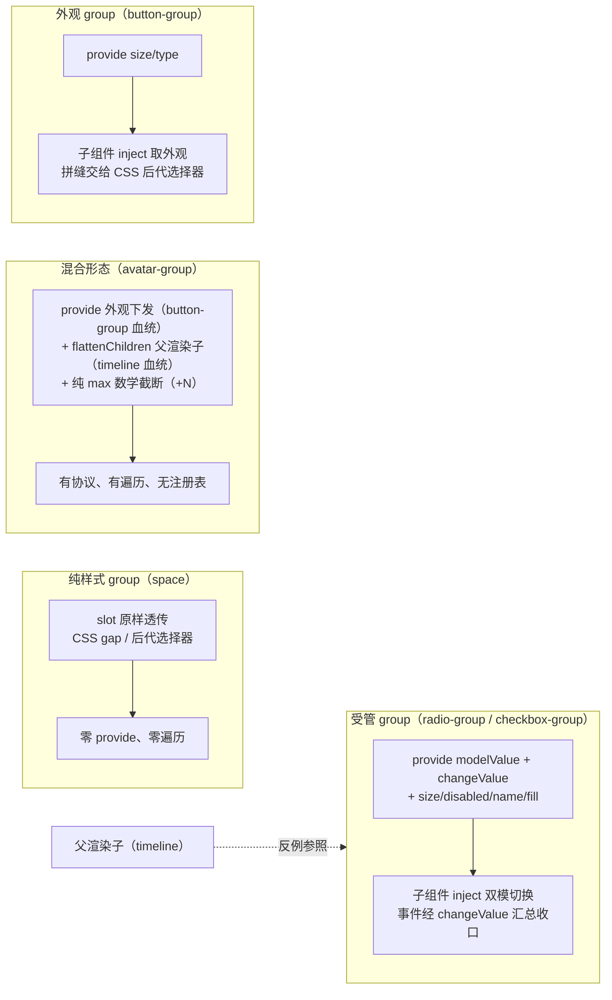
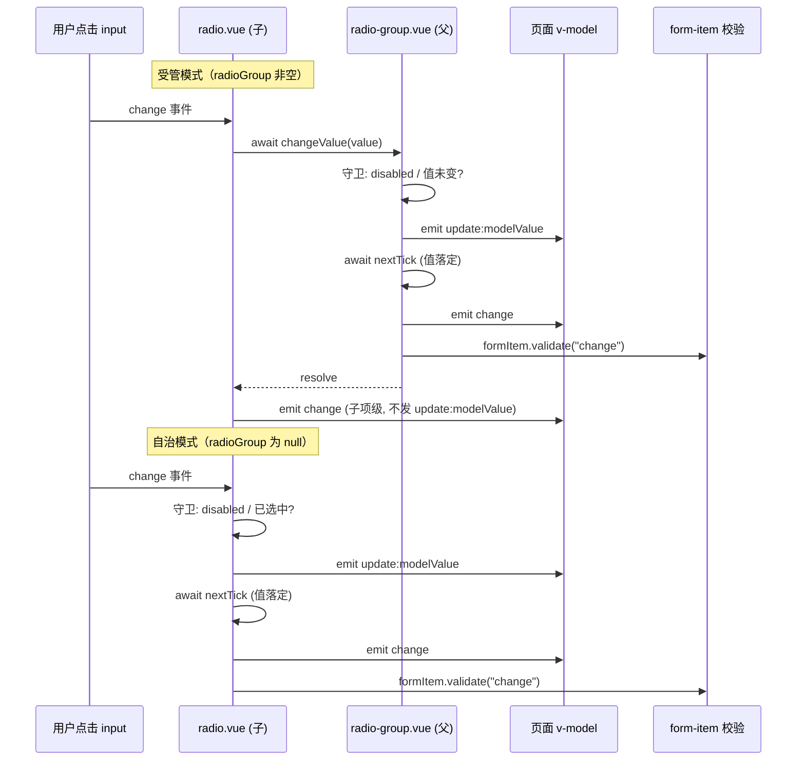

# 4-09 · group 复合模式：属性下发与汇总收口

> 本篇源码坐标（均为当前工作区实态）：
> - `packages/components/radio/src/radio-group.vue`（provide 端，171 行）
> - `packages/components/radio/src/radio.vue`（inject 消费端，108 行）
> - `packages/components/radio/src/context.ts`（协议定义，17 行）
> - 对照组：`packages/components/checkbox/src/checkbox-group.vue`（131 行）、`packages/components/button/src/button-group.vue`（23 行）
> - 样式与测试：`packages/theme/src/components/button.css`、`packages/components/radio/__tests__/radio.spec.ts`、`packages/components/checkbox/__tests__/checkbox.spec.ts`

上一篇 4-08 我们拆了 form 的级联链路，其中留了一个"中间层"没有展开：`self → group → form → global` 这条优先级链里的 **group 层**。这一篇就把它补上。

核心问题只有一句话：**radio-group 如何只做协调、不渲染子项？** 换句话说，一个容器组件怎么做到"不知道自己有几个孩子、孩子是谁、孩子长什么样"，却能把 `modelValue`、`disabled`、`size`、`name` 这些属性精准下发到每个孩子身上，又能把孩子触发的变更事件汇聚成一条干净的对外 `change` 流。

这个问题在单选/多选类组件里最具代表性，因为它们对 group 的需求最重：值共享、互斥（或数组聚合）、级联禁用、级联尺寸、原生 DOM 分组。我们以 `radio` 为主样本，拿 `checkbox`（多选版差异）和 `button`（无模型变体）做对照组，把这套"provide 协议 + 双模子项 + 事件收口"的复合模式拆到实现层。

## 一、先定位：这个仓库里的"group"其实是三种东西

在动手读 radio-group 之前，先把概念收窄。翻遍 `packages/components/component-manifest.json` 里带 group 字样的组件（avatar-group、check-card-group、button-group、radio-group、checkbox-group、timeline 的 timeline-group），你会发现"group"这个词在仓库里覆盖了三种完全不同的复合模式（外加一个混合形态）：

**第一种：纯样式 group，零遍历、零协议。** 代表是 `space`。它的全部实现就是 42 行里的一个 div：

```css
/* packages/theme/src/components/space.css 中消费 gap 的思路，
   实码见 space.vue:34-41 —— 间隔交给 CSS gap，子项原样透传 */
```

```vue
<!-- packages/components/space/src/space.vue:34-41 -->
<template>
  <div
    :class="[ns.base.value, `${ns.base.value}--${props.direction}`, ns.is('wrap', props.wrap)]"
    :style="{ gap, alignItems: props.align, flexWrap: props.wrap ? 'wrap' : 'nowrap' }"
  >
    <slot />
  </div>
</template>
```

8 行模板，`<slot />` 原样透传，子项间距全靠 CSS `gap`。没有 `provide`，没有 `inject`，没有对 children 的任何遍历——这就是上轮考据确认的"space 零遍历"。这类 group 不构成我们今天讨论的模式，它只是个布局容器。

**第二种：有模型、有协议的受管 group。** 代表是 `radio-group` 和 `checkbox-group`。这是本篇主角：父组件 `provide` 一个上下文对象（模型值 + 变更方法 + 级联属性），子组件 `inject` 后进入"受管模式"。

**第三种：介于两者之间的外观 group。** 代表是 `button-group`：有 `provide`，但下发的只是 `size`、`type` 两个外观属性；没有 `modelValue`，没有事件收口；视觉上的"一体感"（相邻按钮拼缝、首尾圆角）靠 CSS 后代选择器完成。后面第四节单独拆它。

**第四种：跨象限的混合形态。** 代表是 `avatar-group`——这是 5-07 篇实测纠正过的归类：它有 `provide`（`avatar-group.vue:115-118` 下发外观，`avatar.vue:25` 对应 inject，是 button-group 血统），又有 `flattenChildren`（`avatar-group.vue:20-50`）完整遍历 slot vnode 并父渲染子（timeline 血统），还有纯 max 数学截断的 +N 折叠（无任何 DOM 测量）。三种血统合体，哪个单一象限都装不下——group 这个词在仓库里远比三分法丰富。

还有个容易误判的 `timeline`：它的 timeline-group（`packages/components/timeline/src/timeline-group.vue:38-45`）用的是 `useSlots()` + `flattenTimelineChildren` 遍历 vnode 的"渲染函数"模式——不是注册模式，也不走 provide 协议给 item 下发模型，而是父组件直接**代渲染**子项 vnode。这就是考据里说的"timeline 非注册模式"。它恰好是本篇的反面参照：同样要父管子，timeline 选择了"父渲染子"，而 radio-group 选择了"父只立规矩，子自己渲染"。

四种形态一张图看全：



注意一个关键事实：**radio-group 和 checkbox-group 的模板里也有渲染子项的代码**（`radio-group.vue:138-169` 的 options fallback）。所以"不渲染子项"这个说法要精确化：group 不维护子项实例注册表、不感知子项数量与身份，它的**协调协议**与子项的**来源方式**完全解耦——你用默认插槽手写 `<xy-radio>` 也好，用 `options` 属性让它批量渲染也罢，协议都一模一样。group 的身份是"立规矩的人"，不是"点名的人"。这是本篇第一个要点，后面第 7 节还会回到这里。

## 二、协议层：一个 17 行的 context.ts 定一切

group 模式的第一块拼图不是 .vue 文件，而是协议定义。`packages/components/radio/src/context.ts` 全文如下：

```typescript
// packages/components/radio/src/context.ts:1-17
import type { ComputedRef, InjectionKey, Ref } from "vue";
import type { ComponentSize } from "xiaoye-primitives";
import type { RadioValue } from "./radio";

export interface RadioGroupContext {
  modelValue: Ref<RadioValue | undefined>;
  disabled: Ref<boolean>;
  size: ComputedRef<ComponentSize>;
  name: ComputedRef<string>;
  fill: Ref<string | undefined>;
  textColor: Ref<string | undefined>;
  changeValue: (value: RadioValue) => Promise<void>;
}

export const radioGroupContextKey: InjectionKey<RadioGroupContext> = Symbol(
  "xiaoye-radio-group"
);
```

这个协议有四个值得驻留几秒的设计点。

**第一，`InjectionKey` 泛型。** `InjectionKey<RadioGroupContext>` 是 Vue 官方提供的类型安全 inject 机制：`inject(radioGroupContextKey)` 的返回值自动推导为 `RadioGroupContext | undefined`，子组件端不需要类型断言。协议的定义方和消费方共享同一个 Symbol 字面量，杜绝了"字符串 key 拼错导致静默注入失败"这类事故。

**第二，协议里同时有"状态"和"行为"。** `modelValue`、`disabled` 是状态（Ref），`changeValue` 是行为（方法）。这是整个模式的枢纽：子组件不但能**读**到组当前的值，还能把"我要改变它"这个意图**委托**回 group，由 group 统一裁决（下文第五节细讲）。如果协议里只有状态没有行为，子组件就只能各自 `emit` 然后……发给谁？group 的事件总线就要退化成约定俗成的字符串事件，类型与守卫全部丢失。

**第三，`size` 是 `ComputedRef` 而其他多是 `Ref`。** 这不是随手写的。`disabled`、`fill`、`textColor` 都是 `toRef(props, "...")` 的直接透传，而 `size` 经过了与 form 层合并的 computed（`radio-group.vue:51`）。类型签名如实反映了这一点：注入的 `size` 已经是"裁决完毕"的最终值，子组件拿来就用，不需要再做第二层兜底。同理 `name` 也是 `ComputedRef<string>`——因为 group 端会兜一个随机名（见第四节）。

**第四，协议刻意窄。** group 的 `options`、`direction`、`validateEvent`、`type` 这些 props 都**不在**协议里——它们是 group 自己的布局与行为配置，子项不需要知道。协议只搬运"子项渲染自己所需的最小状态集"。协议越窄，子项对 group 的耦合面越小，`radio` 单独使用时（不注入）的行为就越干净。

对照看 checkbox 的协议（`packages/components/checkbox/src/context.ts:6-16`），结构完全同构，只多了两个字段：

```typescript
// packages/components/checkbox/src/context.ts:6-16
export interface CheckboxGroupContext {
  modelValue: Ref<CheckboxGroupValue>;
  disabled: Ref<boolean>;
  size: ComputedRef<ComponentSize>;
  name: ComputedRef<string>;
  fill: Ref<string | undefined>;
  textColor: Ref<string | undefined>;
  min: Ref<number | undefined>;
  max: Ref<number | undefined>;
  changeValue: (value: CheckboxValue) => Promise<void>;
}
```

多选场景特有的 `min`/`max`（"最少选几个、最多选几个"）作为协议成员下发，而不是让每个 checkbox 各自读 group 的 props——因为子组件通过 inject 拿到的是上下文对象，不应该反向依赖 group 的 props 类型。这就是协议层的全部：**17 行代码定义了父与子之间的一切合同**。

## 三、provide 端：radio-group 的三件事

`radio-group.vue` 共 171 行，其中 script 至第 128 行、template 为第 130-171 行。抛开会缀的类名拼接，它真正做的事可以归纳为三件：**合并级联属性、收口变更事件、下发协议**。逐段看。

### 3.1 属性定义与事件签名

```vue
<!-- packages/components/radio/src/radio-group.vue:12-28 -->
<script setup lang="ts">
const props = withDefaults(defineProps<RadioGroupProps>(), {
  options: () => [],
  type: "radio",
  disabled: false,
  size: undefined,
  name: undefined,
  direction: "horizontal",
  validateEvent: true,
  ariaLabel: undefined,
  fill: undefined,
  textColor: undefined
});

const emit = defineEmits<{
  "update:modelValue": [value: RadioValue];
  change: [value: RadioValue];
}>();
```

注意 group 的对外事件签名：`update:modelValue` 与 `change` 的载荷类型完全一致（都是 `RadioValue`）。这是"汇总收口"的对外承诺——无论组内有 3 个 radio 还是 30 个，父组件拿到的都是同一条单值事件流。`withDefaults` 里 `size`、`name`、`fill`、`textColor` 显式声明为 `undefined` 是刻意的：这些字段要参与级联合并，必须让"未传"这个状态可区分，不能给默认值污染链路（如果 `size` 默认 `"md"`，form 层的 size 就永远透不下来了——这个坑第五节会正面撞上）。

插槽类型（`radio-group.vue:30-42`）声明了两个：`default` 放手写子项，`option` 是 options 模式下每个选项的作用域插槽。作用域入参里有 `checked`、`disabled`、`type` 这些派生状态——group 替子项算好了上下文，插槽只管画皮。

### 3.2 级联合并与"必须在 group 层插 form 兜底"

```vue
<!-- packages/components/radio/src/radio-group.vue:43-53 -->
const ns = useNamespace("radio");
const { size: globalSize } = useConfig();
const formItem = inject(formItemKey, null);
const form = inject(formKey, null);
const fallbackName = `xy-radio-${Math.random().toString(36).slice(2, 10)}`;

// 必须在 group 层插入 form 兜底：group.size 恒回落 globalSize 非空，
// 若只在子项链路插 form，子项经 group.size 之后永远到不了 form 层（被非空值遮蔽）。
const mergedSize = computed(() => props.size ?? form?.props.size ?? globalSize.value);
const groupName = computed(() => props.name ?? fallbackName);
const optionComponent = computed(() => (props.type === "button" ? XyRadioButton : XyRadio));
```

这 11 行是 4-08 那条 `self → group → form → global` 级联链在 group 侧的落点，也是 2026-09-16 级联修复后的实态。源码注释把踩坑过程说得很直白，我们把它翻译成执行顺序：

`useConfig()` 的 `size` 永远非空——它兜底到 `DEFAULT_SIZE`（`packages/xiaoye-primitives/src/composables/shared-context.ts:28` 定义为 `"md"`，`use-config.ts:47` 的 fallback computed 返回它）。于是子项的合并链 `props.size ?? radioGroup.size ?? form.size ?? globalSize` 中，如果 group 注入的 `size` 已经回落到 `globalSize`（非空），那么排在它后面的 `form?.props.size` 就是死代码，form 上设置的 size 会被"非空值遮蔽"，永远到不了子项。

修复方式就是把 form 兜底**上提到 group 层**：group 注入的 `size` 不是 `props.size ?? globalSize`，而是 `props.size ?? form?.props.size ?? globalSize`。group 在 provide 之前就完成了 form 层的插队，子项拿到的一律是裁决完的最终值。这个修复把"级联链的每一层只看上一层的注入结果"变成了铁律——**链路里任何一层都不允许跳层消费 global 兜底**，否则遮蔽必然复现。

`fallbackName` 是另一个容易被忽略但极其关键的细节：group 的 `name` 未显式指定时，每次实例 setup 生成一个随机名（如 `xy-radio-1k3j8x2p`）。为什么重要？因为原生 HTML 里 `<input type="radio" name="...">` 的分组是**浏览器按 name 全局划分的，不认 Vue 组件树**。两个不相干的 group 如果都没有 name，它们内部的 radio 原生 name 全是空/相同，在某些浏览器下会出现跨组互斥的诡异行为。随机兜底名把 Vue 的组件边界对齐回了 DOM 的原生分组边界——这是"受管 group"底下必须铺的一层原生地基。

`optionComponent`（第 53 行）则是 options 模式的渲染分派：`type === "button"` 时批量渲染 `XyRadioButton`，否则 `XyRadio`。注意渲染的永远是真正的子组件，而不是 group 自己画一个"看起来像 radio 的东西"——这保证了 options 模式与插槽模式走完全相同的 inject 协议。

### 3.3 changeValue：一次且仅一次的收口

```vue
<!-- packages/components/radio/src/radio-group.vue:105-117 -->
async function changeValue(value: RadioValue) {
  if (props.disabled || props.modelValue === value) {
    return;
  }

  emit("update:modelValue", value);
  await nextTick();
  emit("change", value);

  if (props.validateEvent) {
    await formItem?.validate("change");
  }
}
```

7 行执行体，浓缩了"汇总收口"的全部纪律：

1. **group 级守卫**：`props.disabled` 整组禁用时直接吞掉变更；`props.modelValue === value` 时吞掉重复选中（radio 点同一个值不产生事件）。守卫放在 group 而不是子组件，意味着无论子项是手写的、options 生成的、还是 slot 里包了一层 `Fragment` 的，守卫逻辑都只有这一份。
2. **先 `update:modelValue` 后 `change`**，中间隔一个 `await nextTick()`。这个间隔不是仪式感：`update:modelValue` 触发 v-model 写回父组件的响应式更新，`nextTick` 等这次更新落定后才发 `change`——保证 `change` 的监听者（业务代码、表单校验器）读到的一定是**已经生效**的新值，而不是新旧值打架的中间态。4-04 讲受控/非受控双模时提过"值的生命周期"，这里的 nextTick 就是把"变更已提交"和"变更已通知"两个阶段显式分开。
3. **校验触发跟随 `validateEvent`**：change 发出后，若 group 未被关闭校验，向上调用 `formItem?.validate("change")`——注意这是 group 层直接持有的 `formItem` 注入（第 45 行），校验的发起方是 group，不是每个子项。radio 的 change 是"组的变更"而非"某个选项的变更"，所以校验也该由组统一触发一次。

### 3.4 provide：把裁决结果广播出去

```vue
<!-- packages/components/radio/src/radio-group.vue:119-127 -->
provide(radioGroupContextKey, {
  modelValue: toRef(props, "modelValue"),
  disabled: toRef(props, "disabled"),
  size: mergedSize,
  name: groupName,
  fill: toRef(props, "fill"),
  textColor: toRef(props, "textColor"),
  changeValue
});
```

7 个字段的 provide，就是 group 的"执政纲领"。`toRef(props, ...)` 保证注入的是**响应式引用**而非快照——父组件更新 `modelValue` 时，所有子项的 `checked` 派发自动跟随，无需任何事件通知。provide 发生在 setup 同步阶段，所以子项无论在插槽里怎么嵌套（哪怕套 ten 层组件、Fragment、`v-if`），inject 都能拿到；相比之下，"父遍历子 + 逐个传 props"的方案在处理 `v-if`、异步组件、动态 slot 时要维护一整套注册/注销时序。这是权衡一的核心论据，第八节展开。

### 3.5 模板：一个 role、一份 fallback

```vue
<!-- packages/components/radio/src/radio-group.vue:130-171 -->
<template>
  <div
    :class="groupClasses"
    :style="groupStyles"
    role="radiogroup"
    :aria-label="props.ariaLabel ?? 'radio-group'"
    :aria-orientation="props.direction"
  >
    <slot>
      <component
        :is="optionComponent"
        v-for="option in props.options"
        :key="String(option.value)"
        :value="option.value"
        :disabled="option.disabled"
      >
        <slot
          name="option"
          :option="option"
          :checked="props.modelValue === option.value"
          :disabled="Boolean(props.disabled || option.disabled)"
          :type="props.type"
        >
          <span
            :class="[
              `${ns.base.value}-group__option`,
              option.description ? 'has-description' : ''
            ]"
          >
            <span :class="`${ns.base.value}-group__option-label`">{{ option.label }}</span>
            <span
              v-if="option.description"
              :class="`${ns.base.value}-group__option-description`"
            >
              {{ option.description }}
            </span>
          </span>
        </slot>
      </component>
    </slot>
  </div>
</template>
```

模板三层结构：最外层 div 挂 `role="radiogroup"` 与 ARIA 属性（方向用 `aria-orientation` 表达）；`<slot>` 的默认内容是 options 的批量渲染——注意它渲染的是 `<component :is="optionComponent">`，即真正的 `XyRadio`/`XyRadioButton` 实例，这些实例渲染后各自 inject 协议，与手写子项完全同路；`option` 具名插槽让每个选项的展示内容可定制，且 `checked`/`disabled` 由 group 代算后作为作用域入参传入。

这就是第 1 节那个问题的精确答案：**group 不注册子项、不点名子项，它的渲染面只有一个 options fallback；子项的主要来源是使用者的插槽**。`changeValue` 与 provide 构成的协调面，对子项来源完全无感。`groupStyles`（第 100-103 行）把 `fill`/`textColor` 转成两个 CSS 变量（`--xy-radio-button-fill`/`--xy-radio-button-text-color`）挂在组根上——激活色的下发走的是 CSS 变量通道而不是协议通道，因为它是纯视觉属性，子项的 `radio-button.vue` 只在计算行内 `activeStyles`（`radio-button.vue:56-67`）时读 `radioGroup?.fill.value` 兜底。一个属性同时走两条通道，是"视觉下沉 CSS、逻辑收口 JS"的分工体现。

顺带看一眼 script 里唯一的"遍历"：`isButtonGroup`（第 67-94 行）对默认插槽的 vnode 做了一次 BFS——穿透 `Fragment` 找有没有 `XyRadioButton` 类型的 vnode，用来决定要不要追加 `--button` 修饰类（拼缝样式钩子）。注意它**只探测类型，不收集实例、不调用子 vnode 的任何东西**，和 timeline 的 `flattenTimelineChildren`（遍历后代、父代渲染）有本质区别。这是"遍历"在 group 模式里唯一被允许的形态：只读的 vnode 类型嗅探。

## 四、inject 消费端：radio 的自治/受管双模

协议的另一端是 `radio.vue`。这个 108 行的组件同时服务两种身份：**单独使用时自治**（自己管 modelValue、自己 emit、自己触发校验），**放进 group 时受管**（值看 group 的、变更委托 group 的）。双模切换的开关只有一处——第 28 行：

```vue
<!-- packages/components/radio/src/radio.vue:26-49 -->
const formItem = inject(formItemKey, null);
const form = inject(formKey, null);
const radioGroup = inject(radioGroupContextKey, null);

const focus = ref(false);

const mergedSize = computed(() => props.size ?? radioGroup?.size.value ?? form?.props.size ?? globalSize.value);
const mergedDisabled = computed(() => Boolean(props.disabled || radioGroup?.disabled.value || formItem?.disabled.value));
const currentValue = computed(() => radioGroup?.modelValue.value ?? props.modelValue);
const checked = computed(() => currentValue.value === props.value);
const currentName = computed(() => props.name ?? radioGroup?.name.value);
const inputId = computed(() => props.id ?? (!radioGroup ? formItem?.inputId : undefined));
const hasLabel = computed(() => Boolean(slots.default) || props.label !== undefined);
const tabIndex = computed(() => {
  if (mergedDisabled.value) {
    return -1;
  }

  if (radioGroup && !checked.value) {
    return -1;
  }

  return 0;
});
```

7 个 computed，每个都是一条决策链。逐个拆：

**`currentValue`（第 34 行）是双模的分水岭**：`radioGroup?.modelValue.value ?? props.modelValue`——受管时值一律以 group 的为准，自治时用自己的 prop。`checked`（第 35 行）在其上做等值判断。子组件的"选中态"永远是个派生计算而非本地状态，这是受控组件的铁律（4-04 的主题），group 模式只是把"值的来源"从父组件 v-model 扩展成"父组件 v-model 或 group 注入"。

**`mergedDisabled`（第 33 行）是三条禁用链的 OR**：自身 prop、group 注入、formItem 注入。注意它没有 `form` 层——form 级禁用最终经由 `formItem.disabled`（form-item 从 form 注入后转发）到达子项，而 group 级禁用经协议到达。两条链在最末端的子项汇合，谁先谁后无所谓，因为这是个无序布尔合并。size 链则不同：它是有序的 `??` 链，顺序错就是 bug（第 3.2 节的遮蔽问题）。**布尔合并无序、`??` 回落有序**——级联属性要区分这两类，不能一概套模板。

**`inputId`（第 37 行）有个耐人寻味的三元**：`props.id ?? (!radioGroup ? formItem?.inputId : undefined)`。自治模式下，radio 会继承 form-item 生成的 `inputId`（用于 label 的 `for` 关联与无障碍）；但受管模式下**主动放弃**这个继承——因为一个 form-item 里包的是整个 group，form-item 的 `inputId` 若下发给组内每个 radio，会产生 N 个重复 id，`<label for>` 就指向混乱了。组内的无障碍由 `role="radiogroup"` + 原生 name 分组接管。一行代码背后是"id 唯一性"这个 DOM 铁律与"组件复用"之间的边界划分。

**`tabIndex`（第 39-49 行）实现了 roving tabindex**：受管模式下，只有当前选中的 radio `tabindex=0`，其余全部 `-1`。配合原生 radio 的 name 分组，用户按 Tab 只会停在组的"入口"（选中项），用方向键在组内移动——这是 WAI-ARIA radio group 的标准键盘行为。这个 computed 同时也是双模的：自治模式的 radio 永远 `tabindex=0`（第 44-49 行的 fallback）。

### 4.1 handleChange：双模事件分叉

```vue
<!-- packages/components/radio/src/radio.vue:66-81 -->
async function handleChange() {
  if (mergedDisabled.value || checked.value) {
    return;
  }

  if (radioGroup) {
    await radioGroup.changeValue(props.value);
    emit("change", props.value);
    return;
  }

  emit("update:modelValue", props.value);
  await nextTick();
  emit("change", props.value);
  await formItem?.validate("change");
}
```

这是全篇最精巧的一段，值得逐行读：

**受管分支（第 71-75 行）做了一次刻意的事件阉割**：子项调用 `radioGroup.changeValue(props.value)` 后，只补发一个自己的 `change`（给直接监听 `<xy-radio @change>` 的使用者），**不发 `update:modelValue`**。为什么？因为值的写回已经由 group 的 `changeValue` 统一执行（group `emit("update:modelValue")`）。如果子项也 emit 一份，同一次数值变更就会有两处 `update:modelValue` 来源——v-model 的写回顺序、`change` 与写回的时序都会变得不可推理。"**值变更只有一个出口**"是收口模式的底线。

那子项自己的 `change` 呢？它发生在 `await radioGroup.changeValue(...)` **之后**——而 `changeValue` 内部已经 `await nextTick()`。所以事件顺序是严格确定的：`update:modelValue`（group 发）→ 值落定 → `change`（group 发）→ `change`（子项发）。任何监听者看到的顺序都不会抖动。

还有一个隐藏细节：受管分支没有调 `formItem.validate("change")`——因为 `changeValue` 已经调了（第 114-116 行）。如果子项再调一次，同一组变更会触发两次校验。**收口函数做了的事，子项不再重复做**，这是"收口"二字的完整含义：不只收事件的口，也收副作用的口。

**自治分支（第 77-80 行）是完整的单组件流程**：自己 emit `update:modelValue` → `nextTick` → 自己 emit `change` → 自己触发 form-item 校验。它与 group 的 `changeValue` 逻辑同构——没错，这是有意的"协议对齐"：自治分支就是 changeValue 的单机版，两段代码的步骤与顺序一一对应，读起来互为注释。

两条路径对比一张时序图：



模板侧没有任何 group 分支，全文如下：

```vue
<!-- packages/components/radio/src/radio.vue:84-108 -->
<template>
  <label :class="radioClasses">
    <span :class="inputClasses">
      <input
        :id="inputId"
        class="xy-radio__original"
        type="radio"
        :name="currentName"
        :checked="checked"
        :value="props.value"
        :disabled="mergedDisabled"
        :tabindex="tabIndex"
        @focus="focus = true"
        @blur="focus = false"
        @change="handleChange"
      />
      <span class="xy-radio__inner" />
    </span>
    <span v-if="hasLabel" class="xy-radio__label">
      <slot>
        {{ props.label }}
      </slot>
    </span>
  </label>
</template>
```

原生 `<input type="radio">` 的 `:checked`、`:disabled`、`:tabindex`、`:name` 全部绑定到上面那些 merged computed 上。**双模的所有复杂度都被消化在 script 的 computed 与 handleChange 里，模板对"自己在哪种模式"保持无知**。这是双模实现能保持干净的真正原因：模式切换是数据流的属性，不是模板的属性。

## 五、对照组一：checkbox-group，同一个协议的多选变奏

checkbox-group（`packages/components/checkbox/src/checkbox-group.vue`，131 行）与 radio-group 的骨架几乎逐行同构——连那句"必须在 group 层插 form 兜底"的注释都在相同位置（第 38-39 行）。真正的差异全部集中在 `changeValue`：

```vue
<!-- packages/components/checkbox/src/checkbox-group.vue:55-95 -->
async function changeValue(value: CheckboxValue) {
  if (props.disabled) {
    return;
  }

  const nextValue = props.modelValue.slice();
  const index = nextValue.findIndex((item) => item === value);
  const checked = index > -1;

  if (checked) {
    if (props.min !== undefined && nextValue.length <= props.min) {
      return;
    }
    nextValue.splice(index, 1);
  } else {
    if (props.max !== undefined && nextValue.length >= props.max) {
      return;
    }
    nextValue.push(value);
  }

  emit("update:modelValue", nextValue);
  await nextTick();
  emit("change", nextValue);

  if (props.validateEvent) {
    await formItem?.validate("change");
  }
}

provide(checkboxGroupContextKey, {
  modelValue: toRef(props, "modelValue"),
  disabled: toRef(props, "disabled"),
  size: mergedSize,
  name: groupName,
  fill: toRef(props, "fill"),
  textColor: toRef(props, "textColor"),
  min: toRef(props, "min"),
  max: toRef(props, "max"),
  changeValue
});
```

三处结构性差异，恰好对应单选到多选的模型跃迁：

**第一，值形态从标量变数组，收口函数从"守卫"变"归并"。** radio 的 `changeValue` 主体是两行守卫加一个 emit；checkbox 的 `changeValue` 主体是纯函数式的数组归并：`slice()` 复制旧数组 → `findIndex` 定位 → 按 `checked` 分支 `splice`/`push` → 得到 `nextValue` 再 emit。整个过程不改 props（props 不可变），不改注入的 modelValue 引用，而是**构造新数组整体写回**。这是 Vue 单向数据流在数组模型上的标准姿势——如果直接 `props.modelValue.push(value)`，会绕过 emit 直接变异父组件的数据，v-model 契约和 diff 语义同时失效。

**第二，min/max 的裁决放在归并的分支内部。** 取消勾选时检查 `min`（取消后不能少于 min），勾选时检查 `max`（勾上后不能多于 max），不满足就 `return`——变更被静默吞掉。裁决粒度是"**一次尝试性变更**"而不是"组的当前状态"：组已满时再点一个，只有那一次点击无效，已选中的值不受影响。而"组已满时其他未选项显示为禁用"这个**状态派生**，则放在子组件侧（`checkbox.vue:70-80` 的 `limitDisabled` computed 读协议里的 `min`/`max` 与当前 `modelValue` 计算）。裁决与派生分离：变更合法性在收口点判，视觉反馈在消费端算——同一条协议数据，两处消费，各取所需。

**第三，provide 多了 `min`/`max` 两个成员**，子组件需要它们做实时派生。看子组件侧的派生逻辑：

```vue
<!-- packages/components/checkbox/src/checkbox.vue:59-80 -->
const isChecked = computed(() => {
  if (checkboxGroup) {
    return checkboxGroup.modelValue.value.includes(actualValue.value);
  }

  if (props.modelValue !== undefined) {
    return props.modelValue === trueValue.value;
  }

  return props.checked;
});
const limitDisabled = computed(() => {
  if (!checkboxGroup) {
    return false;
  }

  if (isChecked.value) {
    return checkboxGroup.min.value !== undefined && checkboxGroup.modelValue.value.length <= checkboxGroup.min.value;
  }

  return checkboxGroup.max.value !== undefined && checkboxGroup.modelValue.value.length >= checkboxGroup.max.value;
});
```

`isChecked` 是双模的（组内看数组 `includes`，自治看 `trueValue` 比对或 `checked` prop）；`limitDisabled` 是纯受管的——自治模式下它恒为 `false`（第 71-73 行），min/max 本就是组的语义。它把"组已满则未选项禁用"翻译成每个 checkbox 的独立布尔，与收口函数里的门槛判断共享同一份协议数据。而 radio 的协议不需要这类成员，因为单选的"互斥"是原生 radio 语义自带的，根本不需要 JS 裁决。对比之下能看清协议的设计逻辑：**协议成员 = 子项渲染与派生所需的最小状态集 + 变更委托入口**，多选多出来的所有能力（min/max）都严格按这个公式决定是否入协议。

子组件端的双模分叉也值得对照一眼（`checkbox.vue:100-119` 的 `handleChange`）：受管分支同样只调 `changeValue` + 补发自己的 `change`、不发 `update:modelValue`；自治分支则要处理 `trueValue`/`falseValue` 的翻转换算（`checkbox.vue:111`）。测试里对这条链的锁定（`checkbox.spec.ts:165-200` 的 min/max 用例）验证的正是"满组时点击被吞、取消不受影响"的裁决语义。

## 六、对照组二：button-group，无模型的"半程 group"

`button-group.vue` 全文 23 行，是三个 group 里最短的一个，值得整篇贴出：

```vue
<!-- packages/components/button/src/button-group.vue:1-23 -->
<script setup lang="ts">
import { provide, toRef } from "vue";
import { useNamespace } from "xiaoye-primitives";
import type { ButtonGroupProps } from "./button-group";
import { buttonGroupContextKey } from "./constants";

const props = withDefaults(defineProps<ButtonGroupProps>(), {
  direction: "horizontal"
});

const ns = useNamespace("button");

provide(buttonGroupContextKey, {
  size: toRef(props, "size"),
  type: toRef(props, "type")
});
</script>

<template>
  <div :class="[`${ns.base.value}-group`, `${ns.base.value}-group--${props.direction}`]">
    <slot />
  </div>
</template>
```

button-group 保留的只是复合模式的**前半程**：provide 两个字段（`size`、`type`，见 `constants.ts:5-8` 的 `ButtonGroupContext`），子组件在 `use-button.ts:14` inject 后参与 `resolvedSize`/`resolvedType` 的 `??` 链（`use-button.ts:17-22`）：

```typescript
// packages/components/button/src/use-button.ts:12-22
const { size: globalSize } = useConfig();
const form = inject(formKey, null);
const buttonGroup = inject(buttonGroupContextKey, null);
const buttonRef = ref<HTMLElement | null>(null);

const resolvedSize = computed(
  () => props.size ?? buttonGroup?.size.value ?? globalSize.value
);
const resolvedType = computed<ButtonType>(
  () => props.type ?? buttonGroup?.type.value ?? "default"
);
```

这里能看到和 radio 同一条级联公式（`self → group → global`，button 不在 form-item 的 size 语义里，链更短），但**没有后半程**：没有 `modelValue`、没有 `changeValue`、没有事件汇总——按钮的点击本来就是各自独立的 `click` 事件，不存在"组的值"这个概念。

那视觉上的"一体感"从哪来？答案在 `packages/theme/src/components/button.css:339-384`：

```css
/* packages/theme/src/components/button.css:350-377 */
.xy-button-group > .xy-button {
  border-radius: 0;
  position: relative;
  flex: none;
}

.xy-button-group > .xy-button:first-child {
  border-top-left-radius: var(--xy-radius-md);
  border-bottom-left-radius: var(--xy-radius-md);
}

.xy-button-group > .xy-button:last-child {
  border-top-right-radius: var(--xy-radius-md);
  border-bottom-right-radius: var(--xy-radius-md);
}

.xy-button-group > .xy-button + .xy-button {
  margin-left: -1px;
}

.xy-button-group > .xy-button:hover:not(.is-disabled),
.xy-button-group > .xy-button:focus-visible,
.xy-button-group > .xy-button:active:not(.is-disabled) {
  z-index: 2;
}

.xy-button-group > .xy-button:focus-visible {
  outline-offset: -1px;
}
```

纯 CSS 后代选择器：中间按钮圆角归零、`:first-child`/`:last-child` 补回首尾圆角、相邻按钮 `-1px` 负边距拼掉边框缝、hover/focus 时 `z-index: 2` 抬层保证边框压住邻居。这些是"group 布局态"的表达，天然属于 CSS 的职责域——用 JS 算首尾按钮该不该圆角反而要维护子项注册表，恰恰是我们要避开的。

所以 button-group 的启示是双向的：它证明了 provide 协议**不必绑定模型**（外观属性可以独立成组），也反衬出 radio/checkbox-group 的"完整形态"多了什么——**模型收口与事件汇总**才是受管 group 的本体，属性下发只是它的顺手之举。

## 七、注册 vs 遍历：group 系的第三条路

把上一节的观察收拢成方法论。父组件要"管"子组件，社区里常见三种实现，本仓库全都有实例，正好做成对照表：

| 模式 | 机制 | 本仓库实例 | 代价 |
| --- | --- | --- | --- |
| 注册模式 | 子组件 `onMounted` 时把自己注册进父的数组 | 本仓库 group 系**不使用** | 要维护注册/注销时序；子项顺序依赖挂载顺序；`v-if`/异步组件要额外兜底 |
| 父渲染子 | 父遍历 slot vnode，clone/代渲染 | `timeline`（`timeline-group.vue:38-45` + `render.ts:12` 的 `flattenTimelineChildren`） | 父侵入子的渲染；子 vnode 结构变化（包层 wrapper）就要适配 |
| provide 协议 | 父 provide 上下文，子 inject | `radio-group` / `checkbox-group` / `button-group` | 需要子组件主动配合（写 inject 分支） |

group 系选了第三条路，而且回到第 1 节的精确化表述：**radio/checkbox-group 是"provide 协议、不注册实例"的模式**——

- 父不持有子项列表：`radio-group.vue` 全文没有一个"children 数组"或"addField"。
- 子不向父报到：`radio.vue` 全文没有 `onMounted` 注册，它只做一次 `inject`（第 28 行）。
- 父子之间流动的只有协议对象：状态（`modelValue`/`disabled`/`size`/`name`/`fill`/`textColor`）+ 行为（`changeValue`）。
- 子项数量与身份对父透明：插槽里放 2 个还是 20 个、手写还是 options、平铺还是包 Fragment（`isButtonGroup` 的 BFS 穿透 Fragment，`radio-group.vue:84-90`），协议行为完全一致。

对照注册模式的代表 EP form（`addField`/`removeField`，本库 form 也用了这套，见 `form/src/context.ts:37-42` 的 `FormContext`），能看清分界线：**需要"集合操作"的父子关系才值得注册**（form 要 resetFields、要按 prop 找字段，必须有字段清单）；只需要"广播 + 回调"的父子关系，provide 协议就够了，注册反而是负资产。radio-group 不需要遍历它的 radio——它只把"当前值"和"变更入口"广播下去，其余的一切由每个 radio 自己对号入座。这就是"只做协调"的实现论：**协调 = 广播状态 + 收口变更，两件事都不需要知道成员名单。**

## 八、三处设计权衡的得与失

### 权衡一：provide 协议 vs 父遍历子（v-model 逐个绑定）

面对"组管子"，最直觉的替代方案是让 group 渲染子项并逐个绑 `v-model`（EP 早期的某些封装、以及大量社区 options-only 封装的做法）。它的问题在本仓库的语境下是致命的：

1. **渲染侵入**：group 一旦渲染子项，插槽自由度即告失守——用户不能再自由组合 `<xy-radio>` 与说明文字、不能再嵌自己的业务组件。radio-group 的 options 模式存在（作为语法糖），但默认路径永远是 `<slot>`。
2. **变更路径分裂**：子项手写时变更走 inject 协议，子项 options 生成时若走另一条 props 回调，同一组件就有两套事件语义。本库的做法是 options fallback 渲染的仍是真子组件（第 3.5 节），**两条来源、一条协议**。
3. **级联属性要重复实现**：size/disabled 级联若靠遍历传 props，每个子项的合并链要靠 group 代算，子组件单独使用时又要另一套兜底——双模就不存在了。

provide 的代价是**子组件必须主动配合**（写 inject 与双模分支），这决定了该模式只适合"自家组件自成一族"的场景。本库 radio/radio-button、checkbox/checkbox-button 四个组件共享协议，正是这种场景。

### 权衡二：自治/受管双模 vs 拆成两个组件

另一种常见做法是拆开：`XyRadio`（自治）与 `XyRadioGroupItem`（仅供组内使用），各自单一职责。本库选择了双模合一，`radio.vue` 用 `inject(..., null)` 的空值判断一个开关切换两种身份。得处非常实际：

- 用户心智与 API 面积减半——`<xy-radio>` 任何场景都是同一个标签，文档一套（`apps/docs/examples/radio/`）。
- 协议演进单点：改 radio 的渲染结构，自治与受管同时生效，不会出现"组内样式修了、独立用法漏了"。
- 测试可以互为对照：`radio.spec.ts:7-26`（单组件 v-model）与 `radio.spec.ts:60-92`（组内事件）锁定的是同一个组件的两种身份。

失处也如实说：`handleChange`、`inputId`、`tabIndex` 里的分支让每个 computed 都多一个 `radioGroup?.` 操作数；新人读代码时"为什么这里要 `?? props.modelValue`"的疑问只能靠第 34 行那类上下文自答。本库用"两个分支结构严格同构"（3.3/4.1 节）来把可读性损失压到最低——自治分支就是 changeValue 的镜像，这是可维护性与简洁性之间一次自觉的交换。

### 权衡三：无模型 group 的存在合法性

既然受管 group 是"完整形态"，button-group 这种"半程 group"为什么不干脆砍掉、让用户自己写 `<div class="xy-button-group">`？因为三件事用户自己写会各自劣化：provide 的 size/type 级联没有协议就传不下去（每个按钮要手动写 `:size="groupSize"`）；拼缝 CSS 的选择器权重与 `is-disabled` 组合态（`button.css:380-384` 对 link/text 按钮豁免负边距）是打磨过的细节；`--horizontal/--vertical` 方向类是命名契约。**group 的三要素（属性下发、模型收口、样式接管）是三个正交能力，正交才允许 button-group 这种"只要一和三"的变体存在**——反过来，这也验证了 radio-group 的架构没有把三者焊死在一起。

### 权衡四（附）：group 层插 form 兜底

第 3.2 节的修复值得单独立一条权衡：把 form 兜底放 group 层（子项链变成 `self → group(已含 form) → global`）而不是让子项自己 `?? form?.props.size`。前者让"级联链的形状"在 group 一层定型，子项的链保持最短；后者要求每个子组件都记得写完整四层链——radio、radio-button、checkbox、checkbox-button 四处重复一份容易漏的模板。修复选择了"层级职责"，牺牲的是"子项直连 form 的可能性"——而那本来就不是需求：子项永远该听组的。

## 九、EP 对比：同一模式的两版答卷

以 Element Plus 主线的 radio 实现（`el-radio-group` + `useRadio` 组合式）为参照，两边模式同源（provide/inject、role="radiogroup"、slot 为子项主来源），实现取舍有四点可观察的差异：

1. **变更收口的位置。** EP 侧 radio 的 `modelValue` 在子组件内是一个代理到 group 值的 computed，写入经由 group 的 `changeEvent` 转发，子项自身的 `change` 由组内桥接；本库则把收口函数 `changeValue` 作为协议成员直接下发（`context.ts:12`），子项 `await` 它并保证自己不发 `update:modelValue`（`radio.vue:71-75`）。两版都守住了"值变更单出口"，但本库的出口是显式的方法契约，TypeScript 用户在协议类型里就能看到它；EP 的出口藏在运行时的桥接里。
2. **options 支持。** EP 的 `el-radio-group` 模板只有 `<slot/>`，没有 options 属性，批量渲染要配合 el-radio 或业务侧自行 map；本库 radio-group 内建 `options` + `type="button"` + `option` 作用域插槽（`radio-group.ts:22-34` 的 props、模板 138-169 行），声明式场景不用写循环。代价是 group 模板多了 30 余行 fallback 渲染与 `optionComponent` 分派逻辑。
3. **name 兜底。** EP 的 radio-group 不给原生 name 兜底（`name` 可选透传）；本库 group 端随机生成 `fallbackName`（`radio-group.vue:47`），把"多个无名 group 在 DOM 层互串"这类原生坑提前拆掉。这是对原生 radio 语义更强的防御姿态。
4. **form 兜底的位置。** EP 的 radio 经 `useFormItem` 直连 form 上下文，size 链是子项自己合并；本库把 form 兜底上提到 group（`radio-group.vue:49-51` 注释即修复记录），子项链里 form 层由 group 代插。两种都能跑通，但本库的方案把"链的形状"收敛到一处，四个子组件（radio、radio-button、checkbox、checkbox-button）共享同一条注释与同一条链，不易出现某处漏写 form 层的漂移。

一句话总结：EP 给了"标准模式的最小实现"，本库在同一骨架上把**类型契约显式化、原生防御前移、级联链形状定型**，多付的是协议维护成本。

## 十、测试如何锁定协议

收口类设计最怕回归——某天有人"顺手"在受管分支补了个 `emit("update:modelValue")`，双写问题就回来了。本库的 spec 用例群把协议的每条纪律都钉了钉子：

**事件汇总纪律**（`radio.spec.ts:60-92`）：组内第二个 radio 的 input `setValue` 后，断言 `value` 变为 `"develop"` 且 group 的 `change` 收到 `"develop"`——单值事件流 + 值落定语义一起锁定。

**options 与插槽同路**（`radio.spec.ts:94-114` 与 `237-286`）：options 渲染出的 `xy-radio` 同样能被禁用、能通过 `option` 插槽自定义内容——验证"fallback 渲染的是真子组件、走同一条协议"。

**级联链的形状**（`radio.spec.ts:289-332`）：form `size="lg"` 经 group 透传后成员拿到 `xy-radio--lg`；group 显式 `size="sm"` 压过 form，成员显式 `size="xs"` 再压过 group——三层优先级与 4-08 的链定义完全一致。这段用例值得整段贴出：

```typescript
// packages/components/radio/__tests__/radio.spec.ts:289-332
describe("XyRadio form size 级联", () => {
  it("xy-form size=lg 经 radio-group 透传给 radio 与 radio-button 成员", () => {
    const wrapper = mount(
      defineComponent({
        components: { XyForm, XyFormItem, XyRadioGroup, XyRadio, XyRadioButton },
        template: `
          <xy-form :model="{}" size="lg">
            <xy-form-item label="角色">
              <xy-radio-group>
                <xy-radio value="owner">Owner</xy-radio>
                <xy-radio-button value="viewer">Viewer</xy-radio-button>
              </xy-radio-group>
            </xy-form-item>
          </xy-form>
        `
      })
    );

    expect(wrapper.find(".xy-radio").classes()).toContain("xy-radio--lg");
    expect(wrapper.find(".xy-radio-button").classes()).toContain("xy-radio-button--lg");
  });

  it("分组显式 size 优先于 form size，成员显式 size 优先于分组", () => {
    const wrapper = mount(
      defineComponent({
        components: { XyForm, XyFormItem, XyRadioGroup, XyRadio },
        template: `
          <xy-form :model="{}" size="lg">
            <xy-form-item label="角色">
              <xy-radio-group size="sm">
                <xy-radio value="owner">Owner</xy-radio>
                <xy-radio value="viewer" size="xs">Viewer</xy-radio>
              </xy-radio-group>
            </xy-form-item>
          </xy-form>
        `
      })
    );

    const radios = wrapper.findAll(".xy-radio");
    expect(radios[0].classes()).toContain("xy-radio--sm");
    expect(radios[1].classes()).toContain("xy-radio--xs");
  });
});
```

第一个用例锁"透传"：form 的 `lg` 穿过 group 到达 radio 与 radio-button 两类成员；第二个用例锁"优先级"：`sm` 压过 `lg`、`xs` 压过 `sm`。两个用例连用，等于把 `mergedSize`（`radio-group.vue:51`）与 `mergedSize`（`radio.vue:32`）两级合并链的每一节都钉了钉子。checkbox 侧同款用例在 `checkbox.spec.ts:277-320`，保证两个族不漂移。

**禁用级联与收口守卫**（`radio.spec.ts:362-390`）：form disabled 级联进组后，成员全部 `is-disabled`，且点击后断言 group **没有** emit 任何 `update:modelValue`（第 389 行）——`changeValue` 的 group 级守卫（第 106 行）被测试反锁。checkbox 侧对应 `checkbox.spec.ts:350-378`。

**多选数组语义**（`checkbox.spec.ts:96-127` 与 `165-200`）：勾选第二个后 `values` 变 `["sdk"]`、`change` 载荷是**整个新数组**；min/max 用例验证"取消到 min 以下被吞、勾到 max 以上被吞、已选值不受牵连"——数组归并的三条裁决边界。

类型侧的守卫在 `tests/types/fixtures/radio.ts`，全文 52 行：

```typescript
// tests/types/fixtures/radio.ts:1-52
import type { RadioButtonProps, RadioGroupProps, RadioProps, RadioValue } from "xiaoye-components";

const modelValue: RadioValue = "prod";

const radioProps: RadioProps = {
  modelValue,
  value: "staging",
  label: "预发环境",
  disabled: false,
  size: "md",
  name: "scene",
  border: true
};

void radioProps;

const radioGroupProps: RadioGroupProps = {
  modelValue,
  options: [
    { label: "开发环境", value: "dev" },
    { label: "预发环境", value: "staging", description: "灰度验证" },
    { label: "生产环境", value: "prod" }
  ],
  type: "button",
  disabled: false,
  size: "sm",
  name: "scene",
  direction: "horizontal",
  validateEvent: true,
  ariaLabel: "发布环境",
  fill: "#1d4ed8",
  textColor: "#ffffff"
};

void radioGroupProps;

const radioButtonProps: RadioButtonProps = {
  modelValue,
  value: "prod",
  label: "生产环境",
  size: "md",
  name: "scene"
};

void radioButtonProps;

const invalidGroupProps: RadioGroupProps = {
  // @ts-expect-error invalid direction should be rejected
  direction: "grid"
};

void invalidGroupProps;
```

第 17-33 行构造了一份完整的 `RadioGroupProps`（含 options、type、fill 等全字段），第 47-52 行用 `@ts-expect-error` 断言 `direction: "grid"` 必须被拒绝——`RadioGroupDirection` 字面量联合（`radio-group.ts:4-6`）把非法方向挡在编译期。这份夹具随 `pnpm typecheck:types` 全量参与检查（AGENTS.md 的夹具规则），类型协议因此也是 CI 门禁的一部分。

## 十一、类型导出与包根的边界

最后看一眼类型如何走到用户手里。`packages/components/radio/index.ts:15-24` 导出八个类型：`RadioButtonProps`、`RadioGroupDirection`、`RadioGroupOptionSlotProps`、`RadioGroupProps`、`RadioOption`、`RadioProps`、`RadioValue`、`RadioValueChangeHandler`；`packages/components/exports.ts:45` 的 `export * from "./radio"` 把它们抬进 `xiaoye-components` 包根，供 `tests/types/fixtures/radio.ts:1` 一行导入。

一个如实的观察：radio 的 index.ts **没有**导出 `RadioGroupInstance` 之类的实例类型——`radio-group.vue` 没有 `defineExpose`，组实例上没有可供命令式调用的方法。这与 form（`FormInstance` 有 `validate`/`resetFields`，`form/src/context.ts:44-49`）形成对照：form 的用法天然需要命令式入口（提交时校验），而 radio-group 的全部协作都走声明式（v-model + 事件 + 协议注入），命令式入口是多余 API。**实例类型的有无，反映的是这个组件的协作面是"声明式优先"还是"必须有命令式通道"**——group 系选择了前者，也就不必为它维护 Instance 导出。值导出侧，`index.ts:26-35` 除三个独立导出外，还在 `XyRadio` 上挂了 `Group`/`Button` 复合引用（`XyRadio.Group`），照顾按需引入习惯；清单侧由 `component-manifest.json:245-255` 的 `installExports: ["XyRadio", "XyRadioButton", "XyRadioGroup"]` 驱动安装断言，避免手工三处同步。

## 十二、收束：收口模式的一页纸

把全篇压回最初的问题——radio-group 如何只做协调、不渲染子项：

1. **协调 = 广播 + 收口。** 广播靠 provide 一个协议对象（状态 6 件 + `changeValue` 1 件），收口靠 `changeValue` 内的守卫、写回、nextTick、change、校验五步纪律（`radio-group.vue:105-117`）。两件事都不需要子项名单。
2. **渲染归子项。** 子项来源两路（插槽手写 / options fallback），fallback 渲染的仍是真子组件，两路同协议。
3. **双模归子项。** 子项以 `inject(..., null)` 为开关，自治分支与受管分支结构互为镜像；值变更单出口，副作用的口也收在 group。
4. **级联在 group 定型。** `self → group(内含 form 兜底) → global` 的链形状由 group 层负责（`mergedSize`，第 51 行），布尔合并（disabled）无序汇于子项末端。
5. **正交允许变体。** button-group 证明样式接管与属性下发可以脱离模型独立存在；timeline 证明父渲染子是另一条（代价不同的）路。

group 模式的价值不止于单选多选。下一篇我们进入泛型组件的全链路——以 select 为样本，看一个组件如何把"选项类型"从 props 一路穿透到 emit 载荷、插槽作用域与工具类型，泛型参数 `<T>` 如何在 `defineProps`、`defineEmits` 与类型导出的每一层都保持不失真。那里的问题会比"值怎么下发"更锋利：**类型怎么下发**。

**下一篇预告：4-10《泛型组件全链路：以 select 为样本》。**
