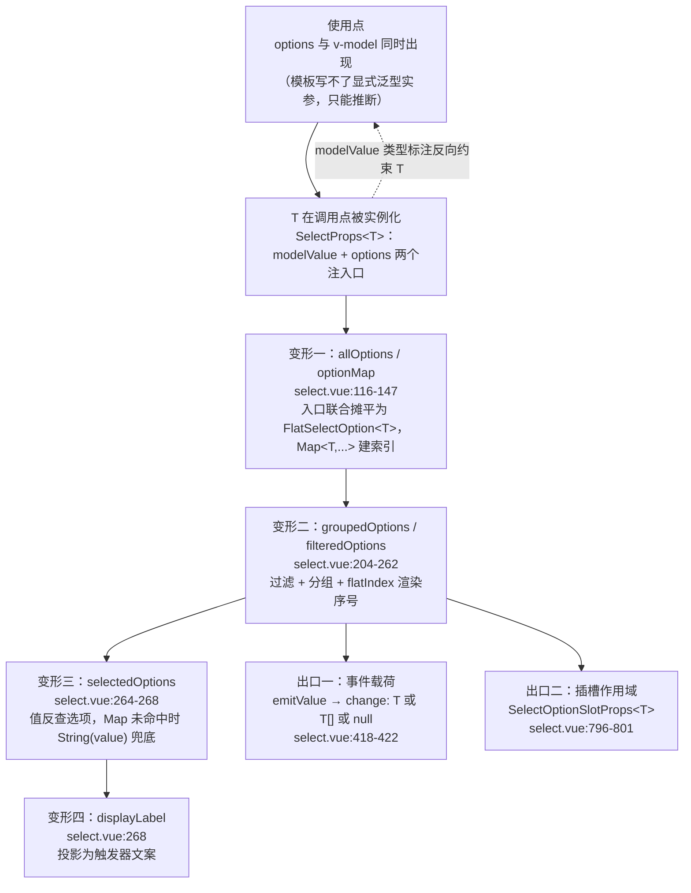
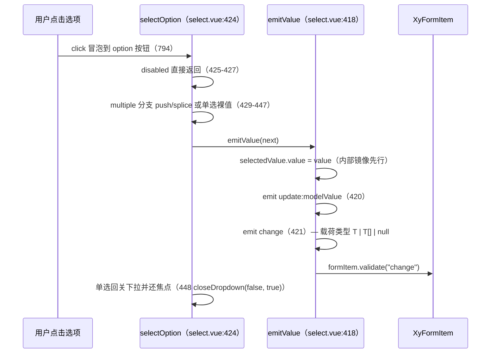
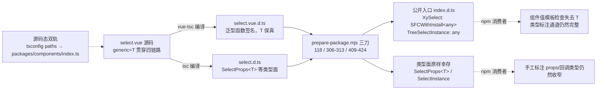

# 4-10 · 泛型组件全链路：以 select 为样本

> 本篇是「组件机制」章节的第十篇，研究一个贯穿性问题：**`generic="T"` 到底如何贯穿 props、事件、插槽与实例四条链路？** 我们选 `select` 做标本，不是因为它最常用，而是因为它是全仓库泛型化最完整的控件——`T` 同时出现在 props 声明、change 事件载荷、option 插槽作用域三处，却又在实例接口上刻意"不装泛型"。围绕这一个组件，能把 Vue 3.3 泛型组件从源码声明、运行时数据流、类型导出、dts 编译产物直到发布态改写的**全链路**一次讲透。对照样本也都在仓库内：同布局却没做泛型的 `tree-select`、泛型轴不同的 `auto-complete`、以及把泛型实例接口做满的 `table`。所有路径、行号均在当前工作区逐一核对；文中三张 mermaid 图，第一张就是 `T` 的完整流转链。

---

## 一、标本的价值：一个下拉框的类型账本

先算一笔账。一个选择器的公开类型面，至少要回答四个问题：

1. `options` 里每项的 `value` 是什么类型？
2. `v-model` 绑的值、`change` 事件抛出的载荷，是不是同一个类型？
3. `option` 插槽作用域里拿到的 `option` 对象，类型是否与 `options` 数组元素对得上？
4. `ref` 拿到实例后调 `focus()`/`open()`，类型从哪来？

这四个问题由**同一个类型参数**串起来才是理想态：业务声明"我的选项值是数字"，那么 options、modelValue、change 载荷、插槽作用域全部收窄为数字，写错一处就编译报错。泛型组件（generic component）就是为这件事存在的。

作为对照，先看 Element Plus 的现状（口径：我们对照的是 EP 2.x 的公开类型与官方文档，以官方仓库当前实现为准）：`el-select` 的 `modelValue` 在公开类型上是宽泛的（不随传入的 options 收窄），`el-option` 是独立子组件的注册模式，插槽作用域也不做基于值类型的推导；Vue 3.3 提供的 `generic` 属性它并没有用上。社区里想要"类型安全的选择器"，常见做法是自己再包一层泛型组件——awad.dev 2023 年底的《Better Vue.js inputs with Generics: The Select》讲的就是这个套路。**EP 的答案是"组件本体宽泛、类型收窄外包给用户"；本库的答案是直接把泛型内建进组件本体**。这也是本篇存在的意义：把"内建"这条路从源码走到发布产物，看它每一段的真实形态。

本仓库泛型组件家族的成员分布也值得先看一眼——用 `rg "generic=" packages/components` 扫描，命中六个文件：

- `select/src/select.vue:1`：`generic="T extends string | number"`
- `auto-complete/src/auto-complete.vue:1`：同款约束
- `table/src/table.vue:1`、`table/src/table-column.vue:1`、`table/src/table-header/header.vue:1`、`table/src/table-footer/footer.vue:1`：`generic="T extends Record<string, unknown>"`

也就是说，仓库里有**两条泛型轴**：选择器类控件以"值类型"为参数（`T` 是选项值的类型），表格类组件以"行类型"为参数（`T` 是一行数据的类型）。而布局上与 select 几乎是孪生兄弟的 `tree-select`，第一行却是 `<script setup lang="ts">`——**没有泛型**。这个"有、无、另一种有"的三角关系，正好把每个设计决策的代价都衬托出来。

## 二、声明段：`generic="T extends string | number"` 到底做了什么

看标本的第一行与声明段。`packages/components/select/src/select.vue:1-32`：

```vue
<script setup lang="ts" generic="T extends string | number">
import { computed, getCurrentInstance, inject, nextTick, ref, watch } from "vue";
import type { StyleValue } from "vue";
import {
  useConfig,
  useDismissibleLayer,
  useFloatingPanel,
  useListNavigation,
  useNamespace,
  useOverlayStack
} from "xiaoye-primitives";
import XyIcon from "../../icon";
import { formItemKey, formKey } from "../../form/src/context";
import { XyLoadingIndicator, resolveLoadingVisualConfig } from "../../loading/src/shared";
import type { LoadingGlobalConfig } from "../../loading/src/types";
import { DEFAULT_CLEAR_ICON, DEFAULT_SUFFIX_ICON } from "./select";
import type {
  FlatSelectOption,
  SelectOptionGroup,
  SelectOptionItem,
  SelectOptionSlotProps,
  SelectProps
} from "./select";

interface SelectRenderGroup<T> {
  label?: string;
  isGroup: boolean;
  options: FlatSelectOption<T>[];
}

const props = withDefaults(defineProps<SelectProps<T>>(), {
  modelValue: null,
```

信息量集中在四处。

**第一处，第 1 行的 `generic` 属性本身。** 这是 Vue 3.3 引入、由编译器处理的语法：`<script setup lang="ts" generic="...">` 里的字符串会被搬成组件类型的类型参数列表。本仓库锁定 `vue: ^3.5.13`、`vue-tsc: ^2.2.8`（根 `package.json:80,82`），远高于 3.3 基线，编译器与类型检查器两侧都完整支持。注意它是一个**字符串里的类型表达式**——你在这里写的不是装饰，而是组件公开类型的一部分：编译后组件的调用签名会真的带上 `<T extends string | number>`，第七节我们会看到它落在 dts 里的样子。

**第二处，约束为什么是 `string | number`。** 看运行时对 `T` 做了什么：`select.vue:142` 有 `new Map<T, ...>()`——`T` 要做 Map 的键；`select.vue:431` 有 `nextValues.findIndex((value) => value === option.value)`——`T` 要走严格相等比较；`select.vue:265` 有 `String(value)`——`T` 要能安全字符串化；模板里 `:key="`${option.value}-${option.flatIndex}`"`（`select.vue:781`）——`T` 要能拼进 DOM key。约束收在 `string | number` 不是风格偏好，而是这四件事的**最小公共能力集**。放宽到 `object` 不是不行，但对象做 Map 键走的是引用相等，"选中态"会静默失效——那类需求在本库里属于 `tree-select`（用 `nodeKey` 取标量键）或 `table`（`rowKey`）的领地。

**第三处，`T` 带默认值吗？** SFC 声明段的 `generic="T extends string | number"` **没有**写默认值。默认值被放到了类型层：`select/src/select.ts` 里所有导出类型都写成 `<T = string | number>`（如 `select.ts:5,11,12,23,29`）。这个分工是刻意的——组件调用签名（模板/JSX 使用点）靠推断实例化，而**手工标注类型**的场景（`const props: SelectProps = {...}` 漏写实参）由类型层的默认值兜底，不至于直接红屏。类型测试夹具 `tests/types/fixtures/select.ts:15` 的 `SelectProps<number>` 显式传入实参，正是对这条通道的检查。

**第四处，`defineProps<SelectProps<T>>()`——泛型类型参数"喂"进了 props。** 这一行是全链路的第一环：`T` 从此成为 props 类型的一部分，编译器会把它写进组件调用签名，让**使用点**反过来推断出 `T`。

这里要纠正一个常见误解：Vue 模板里**写不出显式泛型实参**——`<xy-select<number> ...>` 不是合法模板语法。所以"T 从 options 推导还是显式传入"这个问题，在模板使用场景下的真实答案是：**永远靠推断，而推断是双向的**。`options: SelectOptionItem<T>[]` 提供正向约束（options 的 value 是数字 → T 是数字），`modelValue: SelectValue<T>` 提供反向约束（v-model 绑的是 string 类型的 ref → T 是 string）。两边同时出现时 TS 取公共可满足的实例化，冲突时直接报错——这正是我们要的：**"options 说值是数字、modelValue 却绑字符串"这种 bug 在编译期暴露，而不是在用户点下拉的下午三点**。

**权衡一：`generic` 属性 vs 手写泛型包装。** 在 3.3 之前，泛型组件只能靠两条路：`defineComponent` 的函数式写法（手写调用签名，失去 SFC 模板的舒适），或者外面包一层 `defineComponent` 泛型壳（EP 社区的经典 workaround）。本库选了 `generic` 属性，收益是模板、emit、slots 三处共享同一个 `T`，类型与实现写在同一份 SFC 里；代价则藏在工具链上——`.vue` 的泛型组件对 dts 生成器是"新形状"，后文第七节会看到 `prepare-package.mjs` 为此打的三处补丁。选型的天平可以概括为一句话：**源码态的类型表达力优先，工具链的额外成本用脚本兜住，而不是让每个业务开发者都去包一层壳**。

## 三、类型层：`SelectProps<T>` 的骨架与五种命名形态

SFC 里 import 的那组类型，全部住在 `packages/components/select/src/select.ts`。先看值相关的五种命名（`select.ts:5-27`）：

```ts
export interface SelectOptionGroup<T = string | number> {
  label: string;
  options: SelectOption<T>[];
  disabled?: boolean;
}

export type SelectOptionItem<T = string | number> = SelectOption<T> | SelectOptionGroup<T>;
export type SelectValue<T = string | number> = T | T[] | null;
export type SelectValueChangeHandler<T = string | number> = (value: SelectValue<T>) => void;
export type SelectVisibleChangeHandler = (value: boolean) => void;
export type SelectSearchChangeHandler = (value: string) => void;

export interface FlatSelectOption<T = string | number> extends SelectOption<T> {
  flatIndex: number;
  groupLabel?: string;
  created?: boolean;
}

export interface SelectOptionSlotProps<T = string | number> {
  option: FlatSelectOption<T>;
  selected: boolean;
  active: boolean;
}
```

`SelectOption<T>` 本体来自基础设施包：`packages/xiaoye-primitives/src/utils/types/common.ts:3-8`，只有 `label`、`value: T`、`disabled`、`description` 四个字段——一个被 select、auto-complete、tree-select 等多个组件共享的最小协议。

这组命名值得停下来看，因为它们对应了 `T` 的**四种生存形态**：

- `SelectOption<T>`：用户喂进来的**原始形态**；
- `SelectOptionItem<T>`：原始形态与分组的**入口联合**；
- `FlatSelectOption<T>`：运行时摊平后带 `flatIndex`/`groupLabel`/`created` 的**渲染形态**——注意插槽用户拿到的就是这个形态，所以插槽里能直接用 `option.created` 这类运行时信息；
- `SelectValue<T>`：单选/多选/清空三种取值并成的**值形态**（`T | T[] | null`）；
- `SelectOptionSlotProps<T>`：插槽作用域的**出口形态**。

类型命名跟着数据形态走，而不是一个 `SelectOption` 用到黑——这是 4-03 讲"类型层/视图层/逻辑层三件套"时埋的伏笔，在泛型组件上兑现得最完整。

再看 props 与实例（`select.ts:29-68`）：

```ts
export interface SelectProps<T = string | number> {
  modelValue?: SelectValue<T>;
  options: SelectOptionItem<T>[];
  placeholder?: string;
  disabled?: boolean;
  clearable?: boolean;
  searchable?: boolean;
  multiple?: boolean;
  collapseTags?: boolean;
  maxTagCount?: number;
  remote?: boolean;
  allowCreate?: boolean;
  size?: ComponentSize;
  noDataText?: string;
  noMatchText?: string;
  loading?: boolean;
  loadingText?: string;
  searchPlaceholder?: string;
  createText?: string;
  prefixIcon?: string;
  suffixIcon?: string;
  clearIcon?: string;
  teleported?: boolean;
  appendTo?: string | HTMLElement;
  placement?: Placement;
  offset?: number;
  popperClass?: string;
  popperStyle?: StyleValue;
  fitTriggerWidth?: boolean;
  fitInputWidth?: boolean;
  dropdownMinWidth?: string | number;
  dropdownMaxWidth?: string | number;
}

export interface SelectInstance {
  focus: () => void;
  blur: () => Promise<void>;
  open: () => Promise<void>;
  close: (shouldValidate?: boolean, restoreFocus?: boolean) => Promise<void>;
}
```

`SelectProps<T>` 里泛型只出现在两行：`modelValue` 与 `options`。其余三十多个 props 全部与 `T` 无关——**泛型参数的作用域被压到最小**，没有为了"泛型感"把无关字段拖下水。这个克制在后面的 dts 环节会兑现成实实在在的稳定：类型面哪怕被工具链改写，`SelectProps<T>` 的泛型契约也不会因为复杂引用链而断裂。

而 `SelectInstance` 值得单独画重点：**它不是泛型接口，也不是 `InstanceType<typeof Select>`**。这是本篇第一个"反直觉"设计，留到第六节展开。

## 四、options 数据流：T 在运行时管道里的四次变形

类型层声明了形态，真正让 `T` "活"着的是运行时管道。`T` 在泛型擦除后并不存在于运行时——但**数据流的结构**是按 `T` 的形状铺的，四段计算属性就是四次变形。

第一段，守卫与摊平（`select.vue:116-147`）：

```ts
function isOptionGroup(option: SelectOptionItem<T>): option is SelectOptionGroup<T> {
  return Array.isArray((option as SelectOptionGroup<T>).options);
}

const allOptions = computed(() => {
  const flattened: Array<Omit<FlatSelectOption<T>, "flatIndex">> = [];

  props.options.forEach((item) => {
    if (isOptionGroup(item)) {
      item.options.forEach((option) => {
        flattened.push({
          ...option,
          disabled: Boolean(item.disabled) || Boolean(option.disabled),
          groupLabel: item.label
        });
      });
      return;
    }

    flattened.push(item);
  });

  return flattened;
});

const optionMap = computed(() => {
  const map = new Map<T, Omit<FlatSelectOption<T>, "flatIndex">>();
  allOptions.value.forEach((option) => {
    map.set(option.value, option);
  });
  return map;
});
```

`isOptionGroup` 是标准的**类型守卫**写法：运行时判断"有没有 `options` 数组"，编译时把 `SelectOptionItem<T>` 联合收窄成 `SelectOptionGroup<T>`。`T` 在这里第一次"变形"：从入口联合 `SelectOptionItem<T>` 统一摊平成渲染态 `FlatSelectOption<T>`，分组标签下沉到每个选项上，组级 `disabled` 与选项级 `disabled` 做或运算。`optionMap` 则把值到选项的查找做成 `Map<T, ...>`——这是 `string | number` 约束的直接消费者。

第二段，`allowCreate` 的可创建项（`select.vue:178-202`）：

```ts
const createdOption = computed<Omit<FlatSelectOption<T>, "flatIndex"> | null>(() => {
  if (!props.allowCreate) {
    return null;
  }

  const keyword = searchValue.value.trim();

  if (!keyword || props.loading) {
    return null;
  }

  const matched = allOptions.value.some(
    (option) => option.label === keyword || String(option.value) === keyword
  );

  if (matched) {
    return null;
  }

  return {
    label: keyword,
    value: keyword as T,
    created: true
  };
});
```

第 199 行的 `value: keyword as T` 是整个文件里**唯一一处类型断言逃逸**，值得诚实记账：搜索关键词永远是 `string`，但组件承诺的 `T` 可能是 `number`——用户开了 `allowCreate`、敲了个"42"，运行时就会有一个 `string` 顶着 `T` 的名分进入选中值。这不是疏忽，而是"可创建"语义与"值类型收窄"承诺的**内在张力**：要么把 `T` 拓宽成 `string | number`（类型面失去意义），要么接受这一个断言口（并在文档里讲明）。本库选择了后者。夹具与文档目前都没有记录这个语义边界，这是本篇认为值得补的一笔。

第三段，分组渲染与过滤（`select.vue:204-262`）：

```ts
const groupedOptions = computed<SelectRenderGroup<T>[]>(() => {
  const keyword = searchValue.value.trim().toLowerCase();
  const shouldFilter = !props.remote && showSearchInput.value && keyword.length > 0;
  let runningIndex = 0;
  const groups: SelectRenderGroup<T>[] = [];

  props.options.forEach((item) => {
    if (isOptionGroup(item)) {
      const options = item.options
        .filter((option) => (shouldFilter ? option.label.toLowerCase().includes(keyword) : true))
        .map((option) => ({
          ...option,
          disabled: Boolean(item.disabled) || Boolean(option.disabled),
          groupLabel: item.label,
          flatIndex: runningIndex++
        }));

      if (options.length) {
        groups.push({
          label: item.label,
          isGroup: true,
          options
        });
      }

      return;
    }

    if (shouldFilter && !item.label.toLowerCase().includes(keyword)) {
      return;
    }

    groups.push({
      isGroup: false,
      options: [
        {
          ...item,
          flatIndex: runningIndex++
        }
      ]
    });
  });

  if (createdOption.value) {
    groups.push({
      isGroup: false,
      options: [
        {
          ...createdOption.value,
          flatIndex: runningIndex++
        }
      ]
    });
  }

  return groups;
});

const filteredOptions = computed(() => groupedOptions.value.flatMap((group) => group.options));
```

`runningIndex` 单调递增地给每个选项发 `flatIndex`——这是给键盘导航（`useListNavigation`）和 ARIA 的 `aria-activedescendant`（`select.vue:648-651`）用的**渲染序号**，与值类型无关但挂在渲染态类型上。`T` 在这里完成了从"入口数据"到"可渲染、可导航的扁平列表"的第二次变形。

第四段，选中态投影（`select.vue:264-268`）：

```ts
const selectedOptions = computed(() =>
  selectedValues.value.map((value) => optionMap.value.get(value) ?? { label: String(value), value })
);
const selectedOption = computed(() => selectedOptions.value[0] ?? null);
const displayLabel = computed(() => selectedOption.value?.label ?? props.placeholder);
```

`optionMap.get(value)` 查得到就还原完整选项，查不到（值来自外部、options 异步未到）就用 `String(value)` 兜底展示——`T` 的第三次变形：从值反投影回选项；以及第四次：投影成触发器上的一行文案。

把四段串起来，就是本篇的第一张主图——`T` 的完整流转链：



两个出口（事件、插槽）是下一节的主角。先记结论：**运行时没有任何一个 `T` 存活，但每一段管道的"形状"都是按 `T` 铺的；泛型组件的运行时纪律，就是保证进入管道的数据真的符合 `T` 的承诺**——四段里三段是纯投影，唯一的例外就是那个 `keyword as T`。

## 五、事件与插槽：泛型载荷的两条出口

事件声明在 `select.vue:64-82`，与插槽声明紧挨着：

```ts
const emit = defineEmits<{
  "update:modelValue": [value: T | T[] | null];
  change: [value: T | T[] | null];
  clear: [];
  visibleChange: [value: boolean];
  focus: [];
  blur: [];
  searchChange: [value: string];
}>();

defineSlots<{
  prefix?: () => unknown;
  suffix?: () => unknown;
  header?: () => unknown;
  footer?: () => unknown;
  loading?: () => unknown;
  empty?: () => unknown;
  option?: (props: SelectOptionSlotProps<T>) => unknown;
}>();
```

两处关键设计。**其一，载荷类型用元组语法**（`"change": [value: T | T[] | null]`）而非函数语法——编译进 dts 后就是 `(evt: "change", value: T | T[] | null) => void` 的重载形态，第七节的产物里能看到原文。**其二，`T` 只出现在 `update:modelValue` 与 `change` 两个事件上**；`searchChange` 载荷是 `string`（搜索词天然是字符串），`clear`/`focus`/`blur` 无载荷。与 props 同一个纪律：泛型只覆盖真正参数化的通道。

插槽这边，七个插槽里六个返回 `unknown`（纯内容插槽，无作用域），唯一的例外是 `option`：作用域签名 `(props: SelectOptionSlotProps<T>) => unknown`。也就是说**插槽的泛型化不是给所有插槽套泛型，而是精确到有数据流出的那一个**。

载荷的生产车间在 `select.vue:418-450`：

```ts
async function emitValue(value: T | T[] | null) {
  selectedValue.value = value;
  emit("update:modelValue", value);
  emit("change", value);
}

async function selectOption(option: FlatSelectOption<T>) {
  if (option.disabled) {
    return;
  }

  if (props.multiple) {
    const nextValues = [...selectedValues.value];
    const index = nextValues.findIndex((value) => value === option.value);

    if (index >= 0) {
      nextValues.splice(index, 1);
    } else {
      nextValues.push(option.value);
    }

    await emitValue(nextValues);
    searchValue.value = "";
    await nextTick();
    await updatePosition();
    await formItem?.validate("change");
    return;
  }

  await emitValue(option.value);
  await closeDropdown(false, true);
  await formItem?.validate("change");
}
```

单选走 `emitValue(option.value)`——载荷是**裸的 `T`**；多选走 `emitValue(nextValues)`——载荷是 **`T[]`**；清空走 `emitValue(props.multiple ? [] : null)`（`select.vue:467`）——载荷是 `null` 或空数组。三条路径共同兑现了 `T | T[] | null` 这个联合。注意整个 emit 链是**先同步改内部受控镜像 `selectedValue`，再同步双发 `update:modelValue` + `change`，最后才 `await formItem.validate("change")`**——4-04 讲过的"纯受控 emit 链 + 表单校验副作用编排"在这里与泛型正交共存：泛型管载荷的**类型**，双模与校验编排管载荷的**时序**，两套机制互不染指。

消费端的一端在模板里——没有独立 option 子组件，选项就是下拉面板里的一组 `<button>`（`select.vue:778-807`）：

```vue
                <button
                  v-for="option in group.options"
                  :id="`${listboxId}-${option.flatIndex}`"
                  :key="`${option.value}-${option.flatIndex}`"
                  type="button"
                  class="xy-select__option"
                  :class="[
                    option.disabled ? 'is-disabled' : '',
                    optionSelected(option) ? 'is-selected' : '',
                    navigation.activeIndex.value === option.flatIndex ? 'is-active' : '',
                    option.created ? 'is-created' : ''
                  ]"
                  role="option"
                  :aria-selected="optionSelected(option)"
                  :disabled="option.disabled"
                  @mouseenter="navigation.setActiveIndex(option.flatIndex)"
                  @click="selectOption(option)"
                >
                  <slot
                    name="option"
                    :option="option"
                    :selected="optionSelected(option)"
                    :active="navigation.activeIndex.value === option.flatIndex"
                  >
                    <span>{{
                      option.created ? `${props.createText} "${option.label}"` : option.label
                    }}</span>
                    <small v-if="option.description">{{ option.description }}</small>
                  </slot>
                </button>
```

这里有本库与 EP 的第二处分歧：EP 的 `el-option` 是独立子组件，靠 provide/inject 从父级收集选中态；本库的选项是 `select` 内联渲染的 `<button role="option">`，插槽 `option` 只负责**替换单个选项的内容**，选中态、高亮态、键盘导航全部由父组件统一持有。内联方案省掉了子组件注册协议与上下文穿透，代价是选项级别的复用只能靠插槽——这与第五节"插槽是唯一出口"的类型设计互为因果。对泛型链路的影响是正面的：**选项渲染从头到尾在同一个组件作用域里，`T` 不需要跨组件边界再校订一次**。

一次点击的完整时序，用第二张图收拢：



最后看这对类型承诺的运行时验证。`packages/components/select/__tests__/select.spec.ts:72-92`：

```ts
  it("可以选择选项并发出 change 事件", async () => {
    const wrapper = mountSelect(XySelect, {
      attachTo: document.body,
      props: {
        options: [
          { label: "管理员", value: "admin" },
          { label: "成员", value: "member" }
        ]
      }
    });

    await wrapper.find(".xy-select__trigger").trigger("click");
    const options = document.body.querySelectorAll(".xy-select__option");
    const secondOption = options[1] as HTMLButtonElement | undefined;

    secondOption?.dispatchEvent(new MouseEvent("click", { bubbles: true }));
    await nextTick();

    expect(wrapper.emitted("update:modelValue")?.[0]).toEqual(["member"]);
    expect(wrapper.emitted("change")?.[0]).toEqual(["member"]);
  });
```

运行时测试验证的是"载荷值正确"；"载荷类型正确"要靠下一节的类型夹具。两者目前是分离的——这本身就是一个值得记录的保障结构。

## 六、实例导出：`SelectInstance` 为什么"不装了"

现在回答第三节埋下的问题：为什么 `SelectInstance`（`select.ts:63-68`）既不是泛型接口，也不是 `InstanceType<typeof Select>`？

第一个理由看 expose 的内容。`select.vue:620-625`：

```ts
defineExpose({
  focus,
  blur,
  open: openDropdown,
  close: closeDropdown
});
```

四个方法**没有一个携带 `T`**：`focus`/`blur` 操作触发器 DOM，`open`/`close` 操作浮层开关。实例上没有 `getSelectedOptions(): FlatSelectOption<T>[]` 这类值感知方法，泛型实例接口就没有存在的必要——`SelectInstance` 保持非泛型是最小且诚实的形态。

第二个理由是**硬性的类型系统事实**，我们在本仓库工具链下做了实验：泛型 SFC 经编译后的默认导出是**纯函数调用签名**（见第七节 `select.vue.d.ts:3` 的 `<T extends string | number>(__VLS_props...) => VNode`），函数签名没有 construct signature，对它写 `InstanceType` 会直接报 TS2344（"does not satisfy the constraint 'abstract new (...args: any) => any'"）。也就是说，对泛型组件而言，`InstanceType<typeof XySelect>` **这条路在类型层面就不通**——不是"推导出错误的 T"，而是"根本没有构造签名可推导"。

而姊妹组件 `tree-select` 恰好是反例。`packages/components/tree-select/src/tree-select.ts:8-34`：

```ts
export type TreeSelectValueChangeHandler = (value: TreeKey | null) => void;
export type TreeSelectVisibleChangeHandler = (value: boolean) => void;

export interface TreeSelectProps {
  modelValue?: TreeKey | null;
  data?: TreeData;
  nodeKey?: string;
  props?: TreeOptionProps;
  placeholder?: string;
  disabled?: boolean;
  clearable?: boolean;
  filterable?: boolean;
  filterNodeMethod?: FilterNodeMethodFunction;
  lazy?: boolean;
  load?: LoadFunction;
  size?: ComponentSize;
  emptyText?: string;
  searchPlaceholder?: string;
  teleported?: boolean;
  appendTo?: string | HTMLElement;
  placement?: Placement;
  offset?: number;
  popperClass?: string;
  popperStyle?: StyleValue;
}

export type TreeSelectInstance = InstanceType<typeof TreeSelect>;
```

`tree-select.vue:1` 没有 `generic` 属性，值域写死为 `TreeKey`（`string | number`）——**泛型穿透到树数据的这条路，本库没有走**：树节点值的类型复杂度被 `nodeKey` + `TreeKey` 协议吸收掉了，"选中值永远是标量"成为组件契约的一部分，于是实例类型可以直接写 `InstanceType<typeof TreeSelect>`。为什么它能这么写？因为非泛型 SFC 编译成的是 `DefineComponent<...>`（见本仓库产物 `dist/types/components/tree-select/src/tree-select.vue.d.ts:14`），`DefineComponent` 带构造签名，`InstanceType` 畅通。**同一个仓库里，`InstanceType` 的可用性完全取决于组件是否用了 `generic` 属性**——这是 vue-tsc 两代 dts 形态（`DefineComponent` 形 vs 泛型函数形）的断层，也是本库在 select 上放弃 `InstanceType` 的直接原因。

那如果实例**需要**携带泛型呢？仓库里也有现成答案——`table`。`packages/components/table/src/table.ts:403-421`：

```ts
export interface TableInstance<T = Record<string, unknown>> {
  columns: TableResolvedColumn<T>[];
  bodyRows: TableBodyRow<T>[];
  clearSelection: () => void;
  getSelectionRows: () => T[];
  toggleAllSelection: () => void;
  toggleRowSelection: (row: T, selected?: boolean, ignoreSelectable?: boolean) => void;
  toggleRowExpansion: (row: T, expanded?: boolean) => void;
  setCurrentRow: (row?: T | null) => void;
  clearSort: () => void;
  clearFilter: (columnKeys?: string | string[]) => void;
  sort: (prop: string, order: TableSortOrder) => void;
  doLayout: () => void;
  scrollTo: (options: ScrollToOptions, top?: number) => void;
  setScrollTop: (top: number) => void;
  setScrollLeft: (top: number) => void;
  setAllTreeRowsExpanded: (expanded?: boolean) => void;
  updateKeyChildren: (key: string | number, children: T[]) => void;
}
```

`getSelectionRows(): T[]`、`toggleRowSelection(row: T, ...)`——表格实例的每个方法都在搬运行数据，`T` 逃不掉，所以是**手写泛型实例接口**，且类型夹具里有真实消费：`tests/types/fixtures/table.ts:31` 的 `const tableRef = ref<TableInstance<Row> | null>(null);`。

三个组件、三种实例形态，选型规则可以收拢成一张决策表：

| 组件 | expose 是否携带 T | 实例类型形态 | 出处 |
| --- | --- | --- | --- |
| `tree-select` | 否（且组件无泛型） | `InstanceType<typeof TreeSelect>` | `tree-select.ts:34` |
| `select` / `auto-complete` | 否（组件有泛型） | 手写非泛型接口 `SelectInstance` | `select.ts:63-68` |
| `table` | 是（行数据贯穿方法） | 手写泛型接口 `TableInstance<T>` | `table.ts:403` |

**权衡二（实例导出选型）：`InstanceType` 免维护但要赌 dts 形态，手写接口多一段样板但完全自主。** 本库的隐性共识是：非泛型组件允许 `InstanceType`（tree-select），泛型组件一律手写接口——带值方法就写成 `TableInstance<T>`，不带就写成 `SelectInstance`。auto-complete 保持了同一纪律（`auto-complete.ts:44-49` 的 `AutoCompleteInstance`，同样非泛型）。这个共识没有写成 lint 规则，目前靠 review 维持——如果要挑一处可以工程化的空间，"泛型组件禁止 `InstanceType` 导出"是一个现成的候选。

顺带补一个对照细节：`auto-complete` 虽然与 select 同款 `generic="T extends string | number"`（`auto-complete.vue:1`），但它的 `AutoCompleteProps<T>` 里 `modelValue` 是 `string` 而非 `T`（`auto-complete.ts:22`）——输入框的值天然是字符串，`T` 只流经 `options` 与 `select` 事件载荷（`auto-complete.vue:56` 的 `select: [option: AutoCompleteOption<T>]`）。**同一个泛型参数在不同控件里的"管辖范围"是按数据流画的，不是按组件家族画的**——这是泛型组件设计里比"要不要泛型"更进一层的判断。

## 七、dts 产物：泛型在哪一段被抹平

前面六节都活在源码态。这一节往下钻一层：npm 消费者拿到的 `.d.ts` 里，泛型长什么样？先说结论：**组件值与类型面命运分途——`.vue` 产物里泛型保真，公开入口产物里组件值被改写成 `any`，类型面原样幸存。**

先看保真侧。本仓库最近一次本地构建的产物 `packages/components/dist/types/components/select/src/select.vue.d.ts:3-44`（dist 为 gitignore 的本地生成物，以下引用以当前产物为准，内容与当前源码一致）：

```ts
declare const _default: <T extends string | number>(__VLS_props: NonNullable<Awaited<typeof __VLS_setup>>["props"], __VLS_ctx?: __VLS_PrettifyLocal<Pick<NonNullable<Awaited<typeof __VLS_setup>>, "attrs" | "emit" | "slots">>, __VLS_expose?: NonNullable<Awaited<typeof __VLS_setup>>["expose"], __VLS_setup?: Promise<{
    props: __VLS_PrettifyLocal<Pick<Partial<{}> & Omit<{
        readonly onClear?: (() => any) | undefined;
        readonly onBlur?: (() => any) | undefined;
        readonly onChange?: ((value: T | T[] | null) => any) | undefined;
        readonly onFocus?: (() => any) | undefined;
        readonly "onUpdate:modelValue"?: ((value: T | T[] | null) => any) | undefined;
        readonly onVisibleChange?: ((value: boolean) => any) | undefined;
        readonly onSearchChange?: ((value: string) => any) | undefined;
    } & VNodeProps & AllowedComponentProps & ComponentCustomProps, never>, "onChange" | "onFocus" | "onBlur" | "onUpdate:modelValue" | "onClear" | "onVisibleChange" | "onSearchChange"> & SelectProps<T> & Partial<{}>> & PublicProps;
    expose(exposed: ShallowUnwrapRef<{
        focus: () => void;
        blur: () => Promise<void>;
        open: () => Promise<void>;
        close: (shouldValidate?: boolean, restoreFocus?: boolean) => Promise<void>;
    }>): void;
    attrs: any;
    slots: Readonly<{
        prefix?: () => unknown;
        suffix?: () => unknown;
        header?: () => unknown;
        footer?: () => unknown;
        loading?: () => unknown;
        empty?: () => unknown;
        option?: (props: SelectOptionSlotProps<T>) => unknown;
    }> & {
        prefix?: () => unknown;
        suffix?: () => unknown;
        header?: () => unknown;
        footer?: () => unknown;
        loading?: () => unknown;
        empty?: () => unknown;
        option?: (props: SelectOptionSlotProps<T>) => unknown;
    };
    emit: ((evt: "clear") => void) & ((evt: "blur") => void) & ((evt: "change", value: T | T[] | null) => void) & ((evt: "focus") => void) & ((evt: "update:modelValue", value: T | T[] | null) => void) & ((evt: "visibleChange", value: boolean) => void) & ((evt: "searchChange", value: string) => void);
}>) => VNode & {
    __ctx?: Awaited<typeof __VLS_setup>;
};
export default _default;
type __VLS_PrettifyLocal<T> = {
    [K in keyof T]: T[K];
} & {};
```

vue-tsc 把 SFC 编译成了一个**泛型函数**：`T` 同时出现在 props 交叉项（`& SelectProps<T>`）、事件重载（`(evt: "change", value: T | T[] | null)`）与插槽（`option?: (props: SelectOptionSlotProps<T>) => unknown`）三处——源码里 `generic` + `defineProps<T>` + `defineEmits` + `defineSlots` 的全部声明，在这里一一兑现。expose 段也如第六节所说，四个方法干干净净没有 `T`。

再看抹平侧。消费者的类型入口不是这个 `.vue.d.ts`，而是包入口链 `dist/types/index.d.ts → components/index.d.ts → select/index.d.ts`。公开入口的产物全文只有十行（`dist/types/components/select/index.d.ts:1-10`）：

```ts
export type { SelectInstance, SelectOptionGroup, SelectOptionItem, SelectOptionSlotProps, SelectProps, SelectSearchChangeHandler, SelectValue, SelectValueChangeHandler, SelectVisibleChangeHandler } from "./src/select.js";
export type { SelectOption } from "xiaoye-primitives";

import type { SFCWithInstall } from "xiaoye-primitives";

export declare const XySelect: SFCWithInstall<any>;

declare const _default: typeof XySelect;
export default _default;
```

第 6 行，`XySelect: SFCWithInstall<any>`——**泛型函数签名在公开入口被替换成了 `any`**。做这件事的是 `scripts/prepare-package.mjs`（2-03 专门拆过这条 809 行的后处理管线，本篇只看与泛型相关的三刀）。第一刀，公开入口的组件值声明统一降为 `SFCWithInstall<any>`（`prepare-package.mjs:409-424`）：

```js
function rewriteLocalTypeDeclaration(sourceText) {
  return sourceText.replace(/InstanceType<typeof\s+\w+>/g, "any");
}

function buildValueDeclaration(valueEntry, propertyAssignments, uses) {
  if (valueEntry.kind === "withInstall") {
    uses.sfc = true;
    const properties = propertyAssignments.get(valueEntry.name) ?? [];
    const extension =
      properties.length > 0
        ? ` & {\n${properties
            .map((property) => `  ${property.propertyName}: typeof ${property.targetName};`)
            .join("\n")}\n}`
        : "";

    return `export declare const ${valueEntry.name}: SFCWithInstall<any>${extension};`;
```

第二刀，全局扫掉 `InstanceType` 别名（`prepare-package.mjs:306-313`）：

```js
function simplifyVueInstanceAliases(source) {
  return source.replace(
    /export type (\w+Instance)\s*=\s*InstanceType<typeof\s+\w+>(\s*&\s*\{[^;]*\})?;/g,
    (_match, typeName, suffix = "") => {
      return `export type ${typeName} = any${suffix};`;
    }
  );
}
```

这一刀直接命中 `TreeSelectInstance`——发布态里它就是 `any`。第三刀，修 emit 元组的 dts 生成瑕疵（`prepare-package.mjs:118`）：

```js
  return withSpecifiers.replace(/\(\(event: "([^"]+)", event: /g, '((event: "$1", payload: ');
```

把重复的 `event:` 参数名改写成 `event`/`payload`——这是针对 dts 插件输出缺陷的定点修补，也侧面说明**泛型/元组 emit 在 dts 工具链里属于"需要看护的地带"**。

为什么敢把组件值打成 `any`？因为源码态与发布态在本仓库里是**双轨**的：仓库内所有消费（单测、文档、playground、类型夹具）走 `tsconfig/base.json` 的 paths 映射——`"xiaoye-components": ["packages/components/index.ts"]`（`tsconfig/base.json:31`），直接吃源码，泛型全量保真；只有 npm 下载包的消费者走 `package.json` 的 `"types": "./dist/types/index.d.ts"`（`packages/components/package.json:24`），吃到改写后的产物。而 `withInstall` 在源码态对泛型是**直通**的（`packages/xiaoye-primitives/src/utils/vue/with-install.ts:21-40`）：

```ts
export function withInstall<T>(component: T, name: string) {
  const installable = component as SFCWithInstall<T>;

  installable.install = (app: App) => {
    console.debug(`[withInstall] called for: "${name}"`);
    if (!name) {
      console.error("[withInstall] missing name, component:", component);
      return;
    }
    const aliases = Array.from(new Set([name, toKebabCase(name)]));

    aliases.forEach((alias) => {
      if (!app.component(alias)) {
        app.component(alias, installable as never);
      }
    });
  };

  return installable;
}
```

`withInstall<T>(component: T)` 返回 `SFCWithInstall<T>`——`T` 推断为 select 的泛型函数类型后原样打包 `& { install }`，所以源码态的 `XySelect` 带着完整泛型签名（4-02 讲安装器体系时提过它的运行时职责，这里补的是类型侧的直通性）。真正砍掉泛型的是发布管线的后处理，不是安装器。

把整条链画出来，就是第三张图：



**权衡三（发布态的泛型保真 vs 工具链稳定）：** 保留泛型函数签名其实有替代方案——让公开入口直接 `export type` 转发 `.vue.d.ts` 的默认导出。管线选择 `SFCWithInstall<any>` 的理由是稳定：vue-tsc 生成的 `__VLS_*` 内部结构横跨版本会变形（第三刀修补的 emit 元组瑕疵就是一例），与其让脆弱的深层结构暴露给消费者，不如在公开入口收敛为受控形状，把泛型契约保留在**类型面**（`SelectProps<T>` 等手写类型）上。代价也明确：npm 消费者在模板里写 `<xy-select :options="numberOptions" v-model="strRef" />` **不会再被编译器拦截**，除非他们用 `SelectProps<number>` 手工标注。这是本链路目前最真实的一处类型保障衰减，本库的态度是"记录它、知道边界"，而非假装它不存在。

## 八、类型保障现状：夹具实态与真实缺口

类型承诺靠什么守住？本库的答案在 `tests/types/fixtures/`——一类**不运行、只参与 `vue-tsc --noEmit`（`pnpm typecheck:types`）编译的文件**，靠正反用例表达断言：正向用例要求编译通过，反向用例靠 `@ts-expect-error` 要求编译必须报错。select 的夹具全文（`tests/types/fixtures/select.ts:1-59`）：

```ts
import type { SelectOption, SelectOptionGroup, SelectProps } from "xiaoye-components";

const options: SelectOption<number>[] = [
  { label: "管理员", value: 1 },
  { label: "成员", value: 2 }
];

const groupedOptions: SelectOptionGroup<number>[] = [
  {
    label: "系统角色",
    options
  }
];

const props: SelectProps<number> = {
  options: [...options, ...groupedOptions],
  modelValue: 1,
  multiple: false,
  remote: true,
  allowCreate: true,
  loading: true,
  loadingText: "加载中",
  searchPlaceholder: "搜索角色",
  prefixIcon: "mdi:magnify",
  suffixIcon: "mdi:chevron-down",
  clearIcon: "mdi:close-circle"
};

void props;

const invalidProps: SelectProps<number> = {
  options,
  // @ts-expect-error modelValue type should follow generic
  modelValue: "admin"
};

void invalidProps;

const invalidGroupProps: SelectProps<number> = {
  options: [
    {
      label: "错误分组",
      // @ts-expect-error group options should follow generic type
      options: [{ label: "管理员", value: "admin" }]
    }
  ]
};

void invalidGroupProps;

const multiProps: SelectProps<number> = {
  options,
  modelValue: [1, 2],
  multiple: true,
  collapseTags: true,
  maxTagCount: 1
};

void multiProps;
```

三个正例 + 两个反例，覆盖了 `SelectProps<number>` 的值通道（`modelValue` 错型被拦）与分组通道（组内选项错型被拦）——第三节说的"类型层默认值兜底"与"双向约束"在这里各有一条断言。auto-complete 夹具（`tests/types/fixtures/auto-complete.ts`，18 行）是同构的：正例锁 `AutoCompleteProps<number>`、反例锁 `modelValue` 必须是 `string`——顺带验证了第六节说的"modelValue 管辖权在 auto-complete 不属于 T"。

按本篇的四链路框架打分，保障现状是这样的：

- **props 链路：已覆盖。** 值、分组、多选三通道各有正反断言。
- **事件链路：有缺口。** 没有"change 载荷类型随 T 收窄"的断言——比如没有一个反例锁住 `onUpdate:modelValue` 回调收到 `string` 时对 `SelectProps<number>` 组件报错。
- **插槽链路：有缺口。** 没有 `SelectOptionSlotProps<T>` 的实例化断言：夹具没有渲染一个带 `#option="{ option }"` 作用域的 VNode 去验证 `option.value` 被推导为 `number`。
- **实例链路：有缺口。** select 夹具没有任何 `SelectInstance` 的消费断言；对照 table 夹具 `tests/types/fixtures/table.ts:31` 的 `ref<TableInstance<Row>>`，select 连 `ref<SelectInstance | null>(null)` 都没有。

另一个值得记录的实态：全仓库夹具目录里 `rg "expectTypeOf"` 零命中——本库完全不用 `expectTypeOf` 式断言，统一走 `@ts-expect-error` 正反对照。这个选择让夹具对工具链零依赖（不需要 vitest 的 typecheck 集成），但也意味着**正例的断言力较弱**（"能编译"不等于"推导出的类型精确相等"）。

运行时侧，行为保障是完整的：`select.spec.ts` 537 行、22 个用例，从 change 载荷、键盘导航、分组禁用透传到 form 级联都有（第五节引用的 72-92 行就是其中之一）。所以真实图景是：**行为测试密、类型测试疏，而疏的那一段恰好全落在泛型链路上**。

按仓库惯例补齐并不难，以下给出演示性的补法（注意：这段是本篇建议的示意代码，不是仓库现有源码，切勿直接引用为实态）：

```ts
// tests/types/fixtures/select.ts 末尾可追加的类型断言（示意）

import { ref } from "vue";
import { XySelect, type SelectInstance, type SelectOptionSlotProps } from "xiaoye-components";

// 实例链路：SelectInstance 可作为 ref 的类型参数，方法签名与 defineExpose 对齐
const selectRef = ref<SelectInstance | null>(null);
selectRef.value?.focus();
selectRef.value?.blur();
selectRef.value?.open();
selectRef.value?.close();

// 插槽链路：作用域入参的 option.value 被 T 收窄为 number
function renderOptionSlot(props: SelectOptionSlotProps<number>) {
  const value: number = props.option.value;
  const selected: boolean = props.selected;
  const active: boolean = props.active;
  return `${props.option.label}-${value}-${selected}-${active}`;
}
void renderOptionSlot;

// 事件链路：change 载荷与 T 对齐（反例应报错）
const handler = (value: number | number[] | null) => {
  void value;
};
void handler;
```

以及若未来实例需要携带值信息，第六节的决策表已经预置了路线——升级为泛型接口（示意，非仓库源码）：

```ts
// 若 expose 增加 getSelectedOptions()，SelectInstance 的泛型化形态（示意）
export interface SelectInstance<T = string | number> {
  focus: () => void;
  blur: () => Promise<void>;
  open: () => Promise<void>;
  close: (shouldValidate?: boolean, restoreFocus?: boolean) => Promise<void>;
  getSelectedOptions: () => FlatSelectOption<T>[];
}

// 消费端按调用点实例化：
// const selectRef = ref<SelectInstance<number> | null>(null);
// selectRef.value?.getSelectedOptions().map((option) => option.value) —— number[]
```

顺带记录文档侧的对账结果：`apps/docs/components/select.md:213` 已如实标注 option 插槽接收 `SelectOptionSlotProps<T>`，219-222 行的实例方法表也以 `SelectInstance["focus"]` 等形式引用——**对外叙事与源码一致，无需修正**。

## 九、复盘：全链路的账本

把全篇的判断收拢成三笔账。

**第一笔，"四链路"各自的贯通方式并不对称。** props 靠 `defineProps<SelectProps<T>>` 声明、靠使用点双向推断实例化；事件靠 `defineEmits` 元组里的 `T | T[] | null` 双发；插槽靠 `defineSlots` 里唯一带作用域的 `option` 出口；实例则刻意**不**携带 `T`。贯通的统一原则是"**泛型只覆盖真正参数化的通道**"——被 `T` 管辖的每一处都真实随值类型变化，其余通道（搜索词、尺寸、浮层位置）一律留在泛型之外。

**第二笔，三个层级的"逃逸口"都有意为之，但记录程度不同。** `keyword as T`（`select.vue:199`）是运行时对类型承诺的诚实让步（allowCreate 语义所迫）；`SFCWithInstall<any>`（`prepare-package.mjs:424`）是发布态对工具链稳定的工程让步；夹具缺事件/插槽/实例断言则是**尚未偿还的欠账**。前两笔有明确理由，第三笔是本篇给出的行动项。

**第三笔，与 EP 的对照可以一句话总结。** EP 把类型收窄外包给用户（组件宽泛 + 社区泛型包装壳），本库把泛型内建到组件本体，代价是自己扛下 dts 工具链的三处看护（`prepare-package.mjs:118,306-313,409-424`）与发布态组件值丢 `T` 的衰减。**没有免费的泛型——区别只在于复杂度由每个业务方重复支付，还是由组件库一次性支付并写进专栏。**

## 十、下一篇

select 的泛型链路里反复出现一个配角：`emitValue` 之后那句 `formItem?.validate("change")`——值一变就找表单项做校验，这是 select 作为"表单家族成员"的纪律。但另一些"组件"根本不出现在模板里：`XyMessage.success("已保存")` 一行调用、一抹提示、自动消失，它们没有 props、没有 v-model，有的只是一套被严格治理的生命周期与调度规则。命令式服务怎么做安装器捕获（4-02 里 `withInstallFunction` 的 `_context` 伏笔该收了）、多条消息如何排队与合并、全局配置怎么下传？下一篇 **4-11《命令式服务（上）：message 治理术》**，我们从 `packages/components/message/` 的服务本体讲起。
