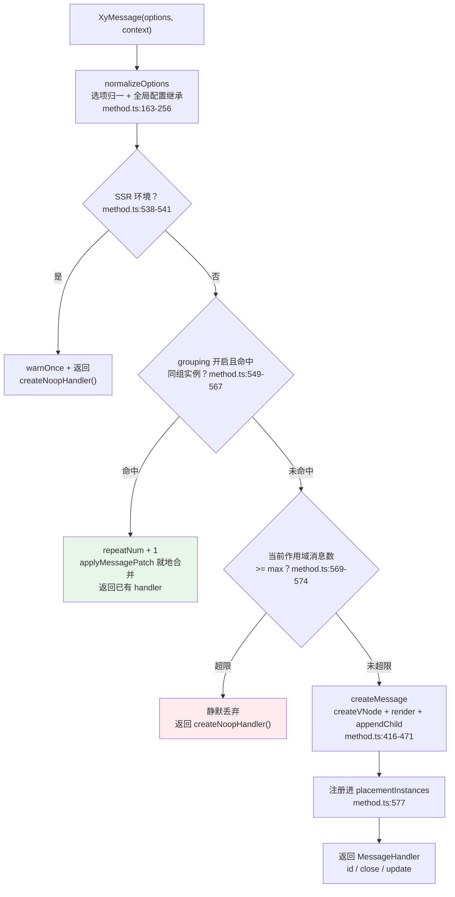
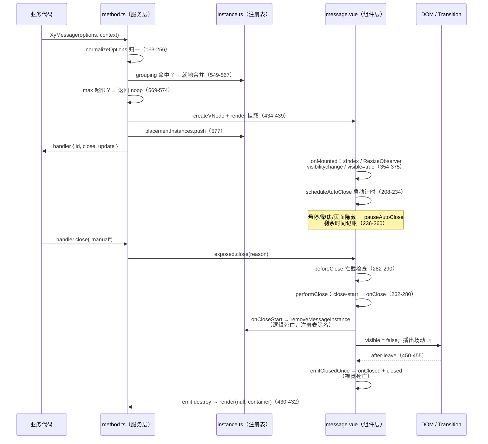

# 4-11 · 命令式服务（上）：message 治理术

## 三个真实的翻车现场

4-02 讲清楚了 `$message` 是怎么被装到 app 上的：`withInstallFunction` 在 install 那一刻捕获 `app._context`，把 `XyMessage` 挂到 `globalProperties.$message`，`vnode.appContext = context || message._context`（`packages/components/message/src/method.ts:438`）完成上下文桥接。安装与 context 桥的细节本篇不再展开，这一篇要回答的是安装之后的问题——**服务跑起来之后，怎么不把页面搞砸**。

三个场景，做过业务的人都不会陌生：

**场景一：列表页轮询，每 3 秒弹一条"保存成功"。** 用户操作半分钟，屏幕右上角摞出十层消息，像叠罗汉一样把按钮全部盖住。

**场景二：批量导入失败，循环里每条数据 `XyMessage.error(...)` 一次。** 200 条数据就是 200 条一模一样的"导入失败"，用户根本分不清是新错误还是旧错误的回声。

**场景三：用户切到别的浏览器标签页等接口返回。** 三条 `duration: 3000` 的消息在后台标签里悄然弹出又悄然关闭——等用户切回来，什么都没有。消息弹给了一个不在场的人。

这三件事分别对应 message 治理的三件套：**重复消息的去重与合并**、**消息轰炸的上限治理**、**页面隐藏时的计时暂停**。它们在源码里各有一块清晰的实现，这一篇逐块解剖。

先给全景。一条 `XyMessage()` 调用进站后，在真正创建 DOM 实例之前要过两道闸门，两道闸门都不通过才落到"新建实例"这条路上：



绿色和红色两条岔路就是本篇的主角：**合并**与**丢弃**。而"页面隐藏暂停"藏在第三条路——实例已经创建之后，组件内部的计时器如何感知页面 visibility。我们先按调用顺序，从归一讲起。

---

## 一、选项归一：15 个字段的收口艺术

`message` 服务接受的参数极其宽松——字符串、数字、VNode、渲染函数、完整对象都行。把这份"任性"翻译成可执行的归一化配置，是 `normalizeOptions`（`packages/components/message/src/method.ts:163-256`，共 94 行）的职责。它的骨架分三步。

**第一步：参数形态判定。** `isMessagePrimitive`（`method.ts:57-65`）认定 `undefined / string / number / VNode / function` 为"原始形态"，包装成 `{ message: params }`；对象形态则直接透传。这一步保证 `XyMessage("保存成功")` 和 `XyMessage({ message: "保存成功" })` 完全等价。

**第二步：配置来源仲裁。** 归一化要回答"这次调用听谁的"——调用参数、ConfigProvider 作用域配置、全局默认值，三者优先级递减。仲裁逻辑在 `resolveMessageConfig`（`method.ts:137-161`）：

```ts
function resolveMessageConfig(context?: AppContext | null) {
  if (context) {
    const providedConfig = context.provides?.[configProviderKey as symbol] as
      | ProviderLikeConfig
      | undefined;
    const scopedMessageConfig = providedConfig?.message?.value;

    if (scopedMessageConfig !== undefined) {
      return scopedMessageConfig;
    }
  }

  const globalMessageConfigCount = getGlobalMessageConfigCount();

  if (globalMessageConfigCount <= 1) {
    return getGlobalMessageConfig().value ?? {};
  }

  warnOnce(
    "XyMessage",
    "检测到多个 ConfigProvider.message 同时存在。请改用 $message、XyMessage.withContext(appContext) 或 XyMessage(options, appContext) 来显式指定上下文。当前调用已回退到默认配置。"
  );

  return {};
}
```

这里的取舍在 4-02 已经埋过伏笔：树内调用走 `context.provides` 精确命中；树外调用在**有且仅有一个** ConfigProvider 时走模块级快照桥；一旦页面上出现多个 Provider，库拒绝替你猜——直接告警并回退默认配置。宁可保守，不可错绑，这是全局服务的上下文铁律。

**第三步：逐字段补齐。** 这是 `normalizeOptions` 最"啰嗦"也最讲究的部分（`method.ts:181-255`）。归一结果以 `messageDefaults` 打底、调用参数覆盖，然后对全局配置的每个字段做"调用方没写才继承"的补齐：

```ts
  const placementMax = globalMessageConfig.maxByPlacement?.[normalizedPlacement];
  const normalized = {
    ...messageDefaults,
    ...options,
    appendTo,
    placement: normalizedPlacement,
    targetKey: resolveTargetKey(appendTo),
    max: normalizeMax(
      hasOwn(options, "max") ? options.max : (placementMax ?? globalMessageConfig.max)
    )
  };

  if (!hasOwn(options, "grouping") && typeof globalMessageConfig.grouping === "boolean") {
    normalized.grouping = globalMessageConfig.grouping;
  }

  if (!hasOwn(options, "duration") && typeof globalMessageConfig.duration === "number") {
    normalized.duration = globalMessageConfig.duration;
  }
  // ……后续 13 个字段同构：grouping / duration / offset / showClose / showIcon / plain /
  // closeOnClick / closeOnPressEscape / pauseOnHover / pauseOnFocus / pauseOnPageHidden /
  // transition / resetOnRepeat，全部以 hasOwn 为闸门，method.ts:197-253
```

为什么不干脆 `{ ...defaults, ...globalConfig, ...options }` 一把梭？因为 `messageDefaults` 里有一批语义敏感的字段：`duration: 3000`、`pauseOnHover: true`、`pauseOnPageHidden: false`（`packages/components/message/src/message.ts:187-217`）。一把梭会让"全局配置里没写 `duration`"变成"全局配置把 duration 重置回 3000"，调用方显式传的 `duration: 0`（永不自动关闭）反而可能被对象展开的顺序意外覆盖掉。`hasOwn` 逐字段判定把"没写"和"写了默认值"严格区分开——这段看似机械的重复代码，是防御配置链污染的堤坝。

还有一个容易忽略的细节：`normalizeMax`（`method.ts:129-135`）把 `undefined / null / NaN` 全部归一为 `null`，表示**不设上限**；而合法数值经过 `Math.max(0, Math.trunc(value))` 收敛。注意 `max: 0` 是合法值且语义极端——这个作用域"禁言"，任何消息都进不来（后文第三节会看到判定逻辑）。

`targetKey` 的生成也很克制（`method.ts:72-83`）：每个 `appendTo` 容器元素经 `WeakMap` 缓映射为一个自增字符串 `xy-message-target-N`。用 WeakMap 而不是直接拿 HTMLElement 做键比较，是因为后续过滤、快照、持久化序列化都需要**可比较、可打印**的字符串键，而 WeakMap 同时保证容器被移除后映射随之垃圾回收。

---

## 二、重复消息治理：grouping 与 groupKey 的两级匹配

回到场景二：200 条一模一样的"导入失败"。本库的答案不是"让业务自己别这么写"，而是给服务一个**合并**选项。主入口里的合并分支（`method.ts:549-567`）是全文最值得逐行读的一段：

```ts
  if (normalized.grouping) {
    const groupedInstance = getMatchingGroupInstance(normalized.placement, normalized.targetKey, {
      groupKey: normalized.groupKey,
      message: normalized.message
    });

    if (groupedInstance) {
      const nextPatch: MessageUpdateOptions = {
        ...normalized,
        max: normalized.max ?? undefined,
        repeatNum: (groupedInstance.props.repeatNum ?? 1) + 1
      };

      applyMessagePatch(groupedInstance, {
        ...nextPatch
      });
      return groupedInstance.handler;
    }
  }
```

短短十几行，信息密度很高。命中同组实例时，**没有任何新 DOM 被创建**：把归一后的完整配置当作一次 `update` 补丁打到旧实例上，`repeatNum` 在旧值上 +1，然后返回**旧实例的 handler**。对调用方来说，两次调用拿到的是同一个对象（测试 `__tests__/message.spec.ts:128` 的断言就是 `expect(second).toBe(first)`），计数控件 `xy-message__badge` 从无到有、再从 2 涨到 3。

"怎么算同组"由 `getMatchingGroupInstance`（`packages/components/message/src/instance.ts:136-152`）裁决，它是**两级匹配**：

```ts
export function getMatchingGroupInstance(
  placement: MessagePlacement,
  targetKey: string,
  normalized: Pick<MessageOptionsNormalized, "groupKey" | "message">
) {
  const instances = getScopedPlacementInstances(placement, targetKey);

  if (normalized.groupKey !== undefined && normalized.groupKey !== "") {
    return instances.find((instance) => instance.props.groupKey === normalized.groupKey) ?? null;
  }

  if (typeof normalized.message !== "string" && typeof normalized.message !== "number") {
    return null;
  }

  return instances.find((instance) => instance.props.message === normalized.message) ?? null;
}
```

第一级是**显式 groupKey**：业务自己声明"这几条消息是一件事"，精确字符串匹配。它解决的是场景二的变体——同一轮导入的不同阶段，文案从"同步进行中"变成"同步完成"，`render` 渲染体完全不同，但业务认定它们是同一个任务，就该合并。测试用例（`message.spec.ts:108-133`）专门验证了这一点：两条 `render` 内容不同的富消息，靠 `groupKey: "sync-task"` 合并，徽标显示 2，内容更新为后到的"同步完成"，连 `type` 从 info 换成 success 都会生效。

第二级是**隐式文案匹配**：没给 groupKey 时，对 `string / number` 消息做全等比较。200 条"导入失败"文案全等，自动塌缩成一条。但注意第二级的守卫——富内容（VNode、渲染函数）一律不参与文案匹配，因为两个渲染函数字面量永远不全等，VNode 更是每次调用都是新对象，强行匹配只会产生错误的合并或永不合并。

匹配范围被 `getScopedPlacementInstances`（`instance.ts:130-134`）限制在 **placement × targetKey** 的二维作用域内：左上角的"保存成功"和右上角的"保存成功"不会互相合并，挂在弹窗容器里的和挂在 body 的也不会。作用域隔离让"合并"这个全局副作用有了明确的边界。

**这里有一个值得停下来琢磨的设计权衡：去重合并，还是全部展示？**

全部展示（EP 的默认行为）的好处是"信息无损"——每条消息都有出处、都有时间戳，日志式呈现。但它把成本转嫁给了用户：屏幕空间有限，视觉噪音随重复次数线性增长。合并策略则相反：用户看到的是"这件事发生了 N 次"这个聚合事实，丢失的是每次发生的细微差异。本库的选择是**把决策权交给调用方**——`grouping` 默认 `false`（`message.ts:215`），想要聚合语义的调用点显式开启；同时通过 ConfigProvider 的 `message.grouping` 可以在应用层面统一开启（`method.ts:197-199`），让"整个应用的 message 都走聚合"成为一行配置。默认保守、按需激进，比"默认合并"安全得多——毕竟把五条不同错误合并成一条，比把五条相同错误展示五遍，更容易引发线上事故。

合并还有一个源码层面的微妙点，值得点名：合并分支构造的 `nextPatch` spread 了**整个 normalized 配置**，并且 `max: normalized.max ?? undefined`。这意味着合并发生时，旧实例的 `duration / type / showClose / max` 乃至 `onClose / onClick` 回调，都会被**最新一次调用**的归一结果覆盖（`applyMessagePatch` 的逐字段赋值见 `method.ts:285-414`）。旧实例的"身份"（id、DOM 位置、repeatNum 计数）保留，"配置"则全面向新意图看齐。这是一次有意的取舍——**以最新的调用意图为准**，让"最后说话的人赢"，而不是维护一套复杂的字段级合并规则。副作用是：如果第一次调用传了 `duration: 0`、第二次合并调用没传（归一为全局默认 3000），消息的存活策略就变了。理解这一点，才能解释"为什么我的常驻消息被一次 grouping 调用改掉了 duration"。

### 徽标：一次真实修复的现场

合并的计数靠徽标呈现。模板里它的渲染条件极简（`packages/components/message/src/message.vue:471-473`）：

```html
<span v-if="props.repeatNum > 1" class="xy-message__badge">
  {{ props.repeatNum }}
</span>
```

`repeatNum === 1`（首条消息）不渲染徽标——一条消息头顶挂个"1"是纯粹的视觉噪音，测试 `message.spec.ts:135-155` 用 `handle.update({ repeatNum: 3 })` 验证了徽标"从无到 3"的行为。

而徽标的样式，有一段 2026-09-16 的修复记录值得写进专栏。修复前徽标底色透传 `currentColor`，结果踩了 CSS 的经典陷阱——`currentColor` 解析的是**元素自身**的 `color`，徽标要继承外层文字色做底色，结果解析出来是自己的文字色，亮色主题下出现"白底白字"。修复后的实态（`packages/theme/src/components/message.css:82-102`）：

```css
.xy-message__badge {
  position: absolute;
  top: -8px;
  right: -8px;
  display: inline-flex;
  align-items: center;
  justify-content: center;
  min-width: 20px;
  height: 20px;
  padding: 0 6px;
  border-radius: var(--xy-radius-pill);
  /* 徽标底色取主文字色：currentColor 会解析为自身 color 导致"白底白字"，
     而 --xy-text-heading 亮色主题近黑、暗色主题近白，可自动反转 */
  background: var(--xy-text-heading);
  /* 文字用浮层背景色，双主题下与徽标底色的对比度均大于 13:1 */
  color: var(--xy-bg-floating);
  font-size: 11px;
  font-weight: var(--xy-font-weight-semibold);
  line-height: 1;
  box-shadow: 0 8px 18px color-mix(in srgb, var(--xy-text-heading) 24%, transparent);
}
```

修复思路是**用语义令牌做中性反转实底**：底色取 `--xy-text-heading`（亮色主题近黑、暗色主题近白），文字取 `--xy-bg-floating`，两者在双主题下天然互为反色，对比度均大于 13:1。它同时回答了"徽标该不该跟随消息类型变色"——不该。徽标是计数器不是状态灯，类型语义已经由消息本体的 accent 色承担了，徽标保持中性才不会在 error 消息的红底上再叠一个红徽标。这也是第 3-03 篇讲的"双主题反转技巧"在小组件上的一次落地。

---

## 三、上限治理：max、作用域与"体面地拒绝"

场景一的消息轰炸，靠 `max` 治理。判定发生在主入口（`method.ts:569-574`），就五行：

```ts
  if (
    normalized.max !== null &&
    countScopedMessages(normalized.placement, normalized.targetKey) >= normalized.max
  ) {
    return createNoopHandler(nextMessageId());
  }
```

计数函数 `countScopedMessages`（`method.ts:266-270`）依然限定在 placement × targetKey 作用域内——上限是**每个角落各自记账**，`maxByPlacement` 还能进一步按位置差异化（`method.ts:185` 会先查 `maxByPlacement[normalizedPlacement]`，没有才回落全局 `max`；测试 `message.spec.ts:292-319` 验证了 `maxByPlacement: { "top-right": 1 }` 下第二条消息进不来）。

被拒绝的调用返回什么？`createNoopHandler(nextMessageId())`（`method.ts:258-264`）——一个带真实 id 的空壳：`close()` 和 `update()` 都是空函数。这个设计的用心之处在于**调用方的代码不需要写降级分支**：`const h = XyMessage({...}); h.update({...})` 无论消息是否真的显示，都是合法调用、都不会抛错。超限的消息被"体面地"吞掉，而不是炸出一个 TypeError。

注意措辞：这是**上限**，不是**队列**。任务考据里提到的"队列/堆叠上限"在本库的实码里要修正一下——超限消息不会被缓冲排队、等前面的关闭后再展示，而是当场静默丢弃。没有队列意味着没有"积压再倾泻"的二次轰炸风险，代价是超限信息彻底不可见。作为对照，同族的 notification 选择了另一条路（第九节细说）：支持 `overflowStrategy: "drop-oldest"`，超限时把最老的通知关掉腾位置，新通知照常入场。

**第二个权衡在这里浮出水面：静默丢弃、丢弃但通知，还是挤掉旧消息？**

三种策略对应三种业务预期。静默丢弃（message 的选择）适合 message 的定位——轻量、高频、可丢失的瞬时反馈，丢一条"保存成功"无关痛痒；丢弃但通知与挤掉旧消息（notification 的两条路，`packages/components/notification/src/service.ts:878-889`）适合通知的定位——每条都有存在价值：

```ts
  if (normalized.max !== null && bucket.instances.length >= normalized.max) {
    if (normalized.overflowStrategy === "drop-oldest" && bucket.instances.length > 0) {
      requestCloseNotification(bucket.instances[0]!, "overflow");
    } else {
      normalized.onClosed?.("overflow");
      return createNoopHandler(nextNotificationId());
    }
  }

  if (normalized.max !== null && bucket.instances.length >= normalized.max) {
    normalized.onClosed?.("overflow");
    return createNoopHandler(nextNotificationId());
  }
```

丢弃但回调 `onClosed("overflow")` 让调用方有机会感知丢失（记日志、降级进站内信）；drop-oldest 则适合"最新事实最重要"的场景——轮询进度通知，旧的本来就是过时信息。本库没有把 message 做成三种策略可配，而是让 message 保持最简、把策略复杂度留给 notification，这个"按组件定位分配复杂度"的判断，比多写两个配置项更见功力。

还有一个前面埋过的伏笔要回收：`max: 0` 是合法配置。`normalizeMax(0)` 返回 `0`，`countScopedMessages(...) >= 0` 恒为真——这个作用域禁言。它和 `max: null`（不限）构成两个极端，中间的语义空间靠 `maxByPlacement` 细分。

**EP 对比时间。** Element Plus 的 message 用一个模块级 `instances: MessageHandler[]` 数组管理活实例：新消息 `instances.push`，关闭时 `splice` 掉。这个池子的职责几乎只有一个——给 `getLastOffset` 算堆叠偏移、给 `closeAll` 提供遍历对象。对照下来，本库的 `placementInstances`（`instance.ts:38`，`shallowReactive` 的 `Record<Placement, MessageContext[]>`）在这条路上多走了三步：其一，**按 placement 分桶**，每个角落独立数组，堆叠计算和 closeAll 的遍历范围天然收窄；其二，实例上挂着 `targetKey / max`，作用域计数、`update` 迁移时的 max 守卫（`method.ts:272-283` 的 `canMoveToScope`——迁移目标已满则拒绝本次 placement/appendTo 变更并告警，测试 `message.spec.ts:259-290`）都有据可查；其三，EP 的 message 没有原生 `max` 配置（它的 notification 才有），防轰炸要业务自己封装，而本库把它做成了一等公民并接进 ConfigProvider 全局配置。另外 EP 的分组徽标（`grouping + repeatNum`）只在文案全等时生效、没有 groupKey 通道，富内容消息（render/VNode）无法参与合并——本库的两级匹配正是对这个空隙的补齐。当然 EP 也有值得尊敬的极简：`instances` 一个数组走天下，心智负担为零；本库为作用域付出的 `targetKey / max / placementInstances` 三个概念，只有在你真的遇到多容器、多角落的场景时才回本。

---

## 四、页面隐藏暂停：pauseReasons 集合与剩余时间记账

场景三最隐蔽：消息的生命与用户在场与否无关。`message.vue` 的解法是一套"暂停原因集合 + 剩余时间记账"的机制，主角都在组件层（注意：**页面隐藏暂停的实现主体在 `message.vue` 而非 `method.ts`**，服务层只负责 `pauseOnPageHidden` 选项的归一与 patch 透传）。

先看状态声明（`packages/components/message/src/message.vue:72-78`）：

```ts
const pauseReasons = new Set<"hover" | "focus" | "page-hidden">();
let timer: number | null = null;
let destroyTimer: number | null = null;
let autoCloseStartAt = 0;
let autoCloseRemaining = 0;
let resizeObserver: ResizeObserver | null = null;
let closedTriggered = false;
```

核心思想一句话：**自动关闭不是一个"裸的 setTimeout"，而是一个可以被多种原因暂停、按剩余时间恢复的计时器**。三种暂停原因——悬停（`pauseOnHover`，默认开）、聚焦（`pauseOnFocus`，默认关）、页面隐藏（`pauseOnPageHidden`，默认关）——全部塞进同一个 `Set`，任何原因在集合里，计时就不走。

计时主循环 `scheduleAutoClose`（`message.vue:208-234`）：

```ts
function scheduleAutoClose(delay = props.duration) {
  clearTimer();

  if (
    !visible.value ||
    props.duration <= 0 ||
    typeof window === "undefined" ||
    pauseReasons.size > 0
  ) {
    return;
  }

  const nextDelay = Math.max(0, delay);

  if (nextDelay === 0) {
    close("auto");
    return;
  }

  autoCloseRemaining = nextDelay;
  autoCloseStartAt = Date.now();
  timer = window.setTimeout(() => {
    autoCloseRemaining = 0;
    autoCloseStartAt = 0;
    close("auto");
  }, nextDelay);
}
```

暂停与恢复是对称的一对（`message.vue:236-260`）：

```ts
function pauseAutoClose(reason: "hover" | "focus" | "page-hidden") {
  if (props.duration <= 0 || !visible.value || pauseReasons.has(reason)) {
    return;
  }

  pauseReasons.add(reason);

  if (timer !== null && autoCloseStartAt !== 0) {
    const elapsed = Date.now() - autoCloseStartAt;
    autoCloseRemaining = Math.max(autoCloseRemaining - elapsed, 0);
    clearTimer();
  }
}

function resumeAutoClose(reason: "hover" | "focus" | "page-hidden") {
  if (!pauseReasons.delete(reason)) {
    return;
  }

  if (pauseReasons.size > 0 || !visible.value || props.duration <= 0) {
    return;
  }

  scheduleAutoClose(autoCloseRemaining > 0 ? autoCloseRemaining : props.duration);
}
```

`pauseAutoClose` 的记账是精髓：暂停瞬间用 `Date.now() - autoCloseStartAt` 算出已流逝时间，从 `autoCloseRemaining` 里扣掉，然后才 `clearTimeout`。恢复时以剩余时间重启计时。鼠标悬停 1.8 秒再移开，消息还剩 1.2 秒寿命，而不是从头再来 3 秒——这个"秒表暂停"语义比"重置计时"语义诚实得多。

页面隐藏的接线上，`handleVisibilityChange`（`message.vue:309-320`）只做一件事——`document.hidden` 时 `pauseAutoClose("page-hidden")`，回来时 `resumeAutoClose("page-hidden")`。把三种暂停原因的事件接线放在一起看（`message.vue:309-352`），统一性一目了然：

```ts
function handleVisibilityChange() {
  if (!props.pauseOnPageHidden || typeof document === "undefined") {
    return;
  }

  if (document.hidden) {
    pauseAutoClose("page-hidden");
    return;
  }

  resumeAutoClose("page-hidden");
}

function handleMouseEnter() {
  if (props.pauseOnHover) {
    pauseAutoClose("hover");
  }
}

function handleMouseLeave() {
  if (props.pauseOnHover) {
    resumeAutoClose("hover");
  }
}

function handleFocusIn() {
  if (props.pauseOnFocus) {
    pauseAutoClose("focus");
  }
}

function handleFocusOut(event: FocusEvent) {
  if (!props.pauseOnFocus) {
    return;
  }

  const nextTarget = event.relatedTarget as Node | null;

  if (nextTarget && messageRef.value?.contains(nextTarget)) {
    return;
  }

  resumeAutoClose("focus");
}
```

监听器的挂载相当克制（`message.vue:365-371`）：只有 `props.pauseOnPageHidden` 为真的实例才挂 `visibilitychange`；且该 prop 本身支持运行时变更（`message.vue:422-437` 的 watch 动态挂/卸监听，关闭时顺手把 `page-hidden` 从暂停集合里清掉，防止残留的暂停原因把计时器永久卡死）。

**第三个权衡：为什么必须在页面隐藏时暂停？** 表面理由是体验——用户切走时弹出的消息，等他回来早消失了，等于弹给空气；三条 `duration: 3000` 的接口错误提示，在后台标签里悄无声息地生灭，用户回来面对一个"什么都没发生"的页面，反而怀疑操作没生效。深层理由是**浏览器后台节流让计时本身就不可信**：现代浏览器对隐藏标签页的定时器做了激进的节流（Chrome 对运行超过 5 分钟的隐藏页甚至压到每分钟 1 次），`setTimeout(fn, 3000)` 在后台可能被拖延到几十秒后才执行，"3 秒后自动关闭"的承诺在后台标签里既不准时、也不可见。暂停计时的本质是把"不可信的定时器"换算成"可信的剩余时间"，等页面重新可见时以真实剩余量重启。而默认值定为 `false` 同样是权衡：并非所有场景都该暂停——安全提示类消息或许正该"人不在也照常过期"，所以它进了 ConfigProvider 配置链（`method.ts:240-245`），由应用自己决定。

设计上还有一处统一性值得赞赏：`handleFocusOut`（`message.vue:340-352`）在恢复 `focus` 暂停前会检查 `event.relatedTarget` 是否仍在消息内部——焦点从标题移到关闭按钮不该触发恢复。三种暂停原因共享同一个集合、同一套记账，新增第四种原因（比如"打印中"）只是多一个字符串字面量的事。

**对照 EP**：Element Plus 的 message 有 hover 暂停（mouseenter 清计时器、mouseleave 以剩余时间重启，同样是记账思路），但暂停原因只有 hover 一种，既没有 focus 暂停，更没有 `pauseOnPageHidden`——后台标签的消息失联问题在 EP 里无解，只能业务自己在外层监听 visibilitychange 手动续命。本库把"计时器治理"收敛成一套原因集合协议，是这一节真正的增量。

---

## 五、生命周期归属：逻辑死亡、视觉死亡与三重兜底

现在把镜头拉远，看一条消息的完整一生。这涉及本篇第四个权衡：**关闭这件事，到底归谁管？**

本库的答案是"分四段、跨两层"。服务层（method.ts）管**注册表层面的生死**：`createMessage` 注入了一个 `onCloseStart` 钩子，关闭一开始就 `removeMessageInstance(instance)` 把实例从 `placementInstances` 里移除——后续消息的堆叠偏移立即回收，不给"幽灵占位"留机会。`createMessage` 全貌（`method.ts:416-471`）值得完整读一遍，它是服务层与组件层的缝合点：

```ts
function createMessage(
  options: MessageOptionsNormalized,
  context?: AppContext | null
): MessageContext {
  const id = `xy-message-${seed++}`;
  const container = document.createElement("div");
  const instance = {} as MessageContext;

  const props: MessageCreateProps = {
    ...options,
    id,
    onCloseStart: () => {
      removeMessageInstance(instance);
    },
    onDestroy: () => {
      render(null, container);
    }
  };
  const vnode = createVNode(
    MessageConstructor,
    props as MessageCreateProps & Record<string, unknown>
  );
  vnode.appContext = context || message._context;
  render(vnode, container);

  const element = container.firstElementChild;

  if (!element) {
    throw new Error("XyMessage 挂载失败：未生成可用的消息节点。");
  }

  options.appendTo.appendChild(element);

  const vm = vnode.component!;
  const handler: MessageHandler = {
    id,
    close(reason = "programmatic") {
      instance.vm.exposed?.close(reason);
    },
    update(patch) {
      applyMessagePatch(instance, patch);
    }
  };

  Object.assign(instance, {
    id,
    vnode,
    vm: vm as MessageContext["vm"],
    handler,
    props: vm.props as MessageContext["props"],
    targetKey: options.targetKey,
    max: options.max
  });

  return instance;
}
```

四个看点：`instance` 先声明为空对象再 `Object.assign` 回填，是为了让 `onCloseStart / onDestroy` 闭包在组件挂载前就能引用到最终的那个实例对象；`vnode.appContext = context || message._context` 是 4-02 讲过的 context 桥在这条路径上的落点；handler 的 `close` 走 `vm.exposed`——组件自己暴露的 `close` 会过 `beforeClose` 拦截，服务层不绕过组件的生命周期语义；`render(null, container)` 延迟到 `onDestroy` 才执行，把卸载时机交给组件的动画结算。

组件层（message.vue）管**视觉层面的生死**。`performClose` 与 `close`（`message.vue:262-290`）：

```ts
function performClose(reason: MessageCloseReason) {
  if (!visible.value) {
    return;
  }

  closeReason.value = reason;
  emit("close-start", reason);
  props.onClose?.(createActionContext(reason));
  clearTimer();
  visible.value = false;
  scheduleDestroyFallback();

  void nextTick().then(() => {
    if (!messageRef.value?.isConnected) {
      emitClosedOnce(reason);
      emitDestroyOnce();
    }
  });
}

function close(reason: MessageCloseReason = "programmatic") {
  if (!visible.value) {
    return;
  }

  invokeMessageBeforeClose(props.beforeClose, createActionContext(reason), () => {
    performClose(reason);
  });
}
```

执行顺序是：先发 `close-start`、调 `onClose` 回调，然后 `visible.value = false` 交给 `<Transition>` 播出场动画，动画 `after-leave` 之后才 emit `closed` 和 `destroy`（模板 `message.vue:448-456`），服务层收到 `destroy` 再 `render(null, container)` 卸载组件。

也就是说，一条消息有两次"死亡"：**逻辑死亡**（close-start，注册表除名，回调 `onClose` 触发）和**视觉死亡**（closed，动画播完，回调 `onClosed` 触发），中间隔着一个动画时长。业务想在关闭瞬间读状态用 `onClose`，想做"关闭后清理"用 `onClosed`，两个钩子职责分立，还各自带 `reason`——`messageCloseReasons` 枚举了六种死因：`manual / auto / programmatic / click / escape / close-all`（`message.ts:12-19`），测试 `message.spec.ts:58-65` 断言了手动关闭时 `onClose` 收到 `reason: "manual"`。

完整的时序如下：



时序图里还有一个不显眼但极重要的细节：**destroy 的三重兜底**。正常路径靠 `Transition` 的 `after-leave` 结算；但若消息的容器 `appendTo` 元素被人整个从文档里摘走，动画永远不会触发，实例就成了僵尸。于是 `performClose` 里有一步 `nextTick` 后检查 `messageRef.value?.isConnected`（`message.vue:274-279`）——DOM 已经不在文档里就直接结算、不等动画；再往外加一道 280ms 的 `scheduleDestroyFallback`（`message.vue:191-206`）兜底定时器，防 transition 实现异常时永久泄漏。`emitClosedOnce / emitDestroyOnce` 的 `closedTriggered` 标志（`message.vue:176-189`）保证三条路径并发触发时 `closed` 回调只执行一次。防御性编程的密度，在卸载路径上是最高的——因为这里是内存泄漏的唯一入口。

`beforeClose` 的拦截语义也值得一笔，它的完整实现（`message.ts:219-255`）：

```ts
export function invokeMessageBeforeClose(
  beforeClose: MessageBeforeCloseFn | undefined,
  context: MessageActionContext,
  onProceed: () => void
) {
  if (!beforeClose) {
    onProceed();
    return;
  }

  let finished = false;
  const done: MessageDoneFn = (cancel) => {
    if (finished) {
      return;
    }

    finished = true;

    if (cancel) {
      return;
    }

    onProceed();
  };

  try {
    const result = beforeClose(done, context);

    if (result && typeof (result as Promise<void>).catch === "function") {
      void (result as Promise<void>).catch(() => {
        finished = true;
      });
    }
  } catch {
    finished = true;
  }
}
```

`done(cancel)` 加了 `finished` 幂等锁——`done` 只认第一次调用，后续调用静默忽略；如果 `beforeClose` 返回 Promise，reject 会被吞掉并把 `finished` 置位，防止一个悬空的 Promise 把消息永久锁在"待关闭"状态；同步抛异常也按"拦截失效即放行关闭"处理。测试 `message.spec.ts:91-106` 验证了 `done(true)` 取消关闭后消息仍在。为什么要把生命周期钩子做得这么重？**权衡点在"归属"**：自动关闭（duration 到期）时，"何时死"是组件的预算，业务只该旁观；而手动/程序化关闭时，业务可能有"关闭前再确认"的诉求，`beforeClose` 就是给这条路径留的否决权。两套钩子、两种归属，互不越界。

---

## 六、closeAll 与 getState：批量治理的收口

单条消息的治理讲完了，最后一公里是批量操作。`closeAll`（`method.ts:605-616`）：

```ts
message.closeAll = (filter?: MessageType | MessageCloseFilter) => {
  const normalizedFilter = normalizeCloseFilter(filter);
  const targetKey = resolveTargetKeyFromFilter(normalizedFilter);

  Object.values(placementInstances).forEach((instances) => {
    [...instances].forEach((instance) => {
      if (matchesFilter(instance, normalizedFilter, targetKey)) {
        instance.handler.close("close-all");
      }
    });
  });
};
```

三处细节。其一，参数极度宽容：`closeAll("error")` 字符串直接当 `type` 过滤（`normalizeCloseFilter`，`method.ts:473-481`），对象则支持 `type / placement / target / targetKey / groupKey` 五维过滤（`MessageCloseFilter`，`message.ts:31-37`）。其二，`[...instances]` 的浅拷贝不是画蛇添足——前文说过 `onCloseStart` 会在关闭开始时 `splice` 原数组，如果直接遍历原数组，关闭前几条时数组塌缩会让遍历跳过元素；拷贝一份快照遍历，逐一关闭，谁也不会漏。这个 bug 模式在"遍历中修改集合"的场景里太经典了。其三，关闭原因统一为 `"close-all"`，业务回调里能区分"这条消息是批量清场时死的，不是自然到期"。

`closeAllByPlacement`（`method.ts:618-622`）只是 `closeAll({ placement })` 的薄封装。`getState`（`method.ts:624-667`）则把注册表投影成可测试、可监控的快照：按 placement 分组的条目列表加总数，过滤维度与 `closeAll` 完全一致。它存在的意义在测试里最明显——`message.spec.ts:211-216` 用 `XyMessage.getState({ placement: "bottom-right" })` 断言 `total === 2`，**测试不再需要查询 DOM**，治理逻辑的验证从"视觉等价类"升级为"状态等价类"。

顺带一提堆叠几何的实现也得益于注册表。`getOffsetOrSpace`（`instance.ts:188-210`）：

```ts
export function getOffsetOrSpace(
  id: string,
  offset: number,
  placement: MessagePlacement,
  targetKey: string
) {
  const instances = placementInstances[placement] ?? [];
  let matchedBeforeCurrent = 0;

  for (const instance of instances) {
    if (instance.targetKey !== targetKey) {
      continue;
    }

    if (instance.id === id) {
      break;
    }

    matchedBeforeCurrent += 1;
  }

  return matchedBeforeCurrent > 0 ? 16 : offset;
}
```

规则是同容器内首条消息用调用方 `offset`，后续消息统一 16px 间距（`MESSAGE_GROUP_SPACING`，`message.ts:23`）；偏移链由 `getLastOffset`（`instance.ts:178-186`）沿注册表取前一条实例暴露的 `bottom` 值逐级累加，组件内 `offset` 计算属性把它们加总（`message.vue:107-112`）。每条消息不知道自己的位置，位置是注册表算出来的，这个"无状态渲染体 + 有状态注册表"的分工，让 `update` 迁移 placement 时的重新排版成为可能。

---

## 七、测试实态：治理逻辑的可验证性

`packages/components/message/__tests__/message.spec.ts` 共 600 行、17 个用例，本篇涉及的三件套各有对应。去重合并的核心断言（`message.spec.ts:108-133`）：

```ts
  it("支持 groupKey + render 合并富内容消息", async () => {
    const first = XyMessage({
      render: () => h("strong", { class: "render-node" }, "同步进行中"),
      groupKey: "sync-task",
      grouping: true,
      duration: 0
    });

    await flushMessage();

    const second = XyMessage({
      render: () => h("strong", { class: "render-node" }, "同步完成"),
      groupKey: "sync-task",
      grouping: true,
      type: "success",
      duration: 0
    });

    await flushMessage();

    expect(second).toBe(first);
    expect(getMessages()).toHaveLength(1);
    expect(document.body.querySelector(".render-node")?.textContent).toBe("同步完成");
    expect(document.body.querySelector(".xy-message__badge")?.textContent).toBe("2");
    expect(document.body.querySelector(".xy-message--success")).not.toBeNull();
  });
```

`expect(second).toBe(first)` 一行锁死了"合并返回同一 handler"的契约。批量过滤的用例（`message.spec.ts:191-226`）则演示了 getState 与 closeAll 的组合拳：三条不同 placement 的消息，`getState({ placement: "bottom-right" })` 断言 total 为 2，`closeAll({ placement: "bottom-right", groupKey: "warn" })` 精确清掉组内那条、其余两条完好。暂停机制的用例（`message.spec.ts:157-189`）最见功力，用 fake timers 精确推演了暂停记账的数学：

```ts
  it("支持 pauseOnFocus 暂停自动关闭", async () => {
    vi.useFakeTimers();

    XyMessage({
      message: "聚焦暂停",
      duration: 120,
      showClose: true,
      pauseOnFocus: true
    });

    await flushMessage();
    vi.advanceTimersByTime(60);

    const closeButton = document.body.querySelector(".xy-message__close") as HTMLButtonElement;
    closeButton.dispatchEvent(new FocusEvent("focusin", { bubbles: true }));

    vi.advanceTimersByTime(100);
    await flushMessage();

    expect(getMessages()).toHaveLength(1);

    closeButton.dispatchEvent(
      new FocusEvent("focusout", {
        bubbles: true,
        relatedTarget: document.body
      })
    );

    vi.advanceTimersByTime(80);
    await flushMessageClose();

    expect(getMessages()).toHaveLength(0);
  });
```

`duration: 120`，先走 60ms，focusin 暂停后再推进 100ms——若暂停记账失效，120ms 早已到期，断言 `toHaveLength(1)` 就是在钉死"剩余时间 = 120 - 60 = 60ms"这条数学事实；focusout 后再推 80ms，60 < 80，消息必须关。此外还有多 app 上下文隔离（`message.spec.ts:361-420`）、多个 ConfigProvider 并存告警回退（`message.spec.ts:507-541`）等 4-02 主题的运行时验证，可见服务层的测试矩阵是围绕"配置从哪来、消息往哪去"两个轴组织的。

---

## 八、一眼看穿同族：notification 与 message 的机制差异

作为命令式服务家族的另一位成员，notification（`packages/components/notification/src/service.ts`，1008 行）与 message 共享同一套骨架：选项归一、targetKey 作用域、groupKey 合并、`withContext` 换绑、快照 getState。但对照着看，三处差异勾勒出两者的定位分野。

**其一，注册表结构不同。** message 是 `Record<Placement, MessageContext[]>` 按 placement 分桶，实例自己算偏移（注册表只提供邻居查询）；notification 是 `Map<bucketKey, NotificationBucket>`，bucketKey 为 `targetKey:position` 二元组，桶内由服务层统一 `updateBucketOffsets` 逐个实例下发偏移（`service.ts:401-416`）——通知体积大、层级复杂，偏移计算权上收到服务层，组件保持"给什么偏移就用什么"的傻子。

**其二，超限策略不同。** message 超限静默丢弃；notification 有 `overflowStrategy`：默认丢弃并回调 `onClosed("overflow")`，可配 `"drop-oldest"` 挤掉最老的腾位置（`service.ts:878-889`）。同一条"max 满了"的判定，两个组件给出了两种体面的答案，前文第三节已经分析过背后的定位差异。

**其三，也是本篇主题相关度最高的一点：notification 没有页面隐藏暂停。** 在 notification 的源码里搜不到任何 `visibilitychange / pauseOnPageHidden`，它的定时器重启用的是另一套协议——`timerKey` 自增触发 watch 重启计时（`notification.vue:226`），而非 message 的原因集合记账。通知是长寿命、强提醒的存在，用户离开几分钟回来看到未读通知反而是符合预期的；消息是短寿命、弱提醒，失联才是事故。**暂停机制不是"越多越好"的技术竞赛，而是跟着组件的存在语义走的**——这个判断，比实现本身更值得带走。

---

## 收束与预告

把本篇的治理三件套压缩成三句话：

- **重复消息**：`grouping` 开启后走两级匹配（groupKey 精确 → 文案全等），命中就地合并 `repeatNum + 1`，配置全面向最新调用看齐；徽标中性反转实底，双主题对比度 13:1 起步。
- **消息轰炸**：`max` 按 placement × targetKey 二维作用域记账，超限返回 noop handler 体面拒绝，`max: 0` 即禁言；策略复杂度（drop-oldest）留给了 notification。
- **页面隐藏**：`pauseOnPageHidden` 把 visibilitychange 纳入统一的 `pauseReasons` 原因集合，剩余时间记账保证恢复时以真实余量续命；实现主体在组件层，服务层只管配置。

再加上贯穿始终的两条暗线——**逻辑死亡与视觉死亡分离的四段式生命周期**（close-start / onClose / closed / destroy + 三重兜底），以及**注册表有状态、渲染体无状态**的分工——`$message` 的运行时行为就完整了。测试文件里那 17 个用例，本质上是在为这套治理协议做回归公证。

下一篇我们进入命令式服务的下半场：4-12《命令式服务（下）：dialog 队列与 loading 双形态》。message 的治理难题是"太多、太重复、时机不对"；而 dialog 服务要面对的是另一个维度的麻烦——多个对话框同时调用时谁压谁、`beforeClose` 异步拦截时队列怎么排队、以及 loading 服务为什么要有"全屏"和"局部"双形态、两者的实例管理为何不能共用一套代码。同样是 `withInstallFunction` 接出来的服务，治理的侧重点会从"频率治理"转向"并发治理"，我们在下一篇见。
