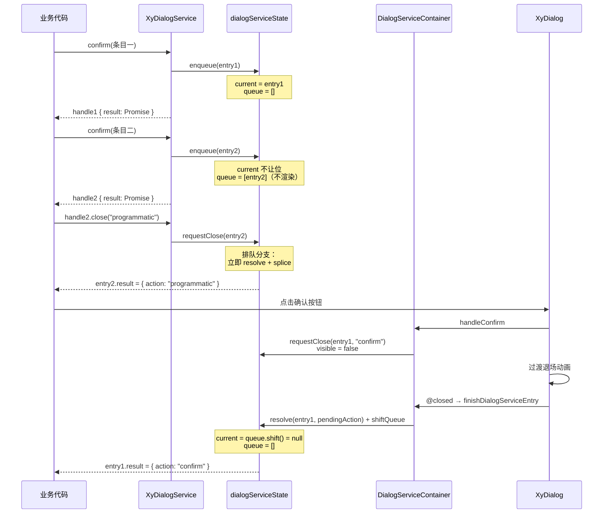
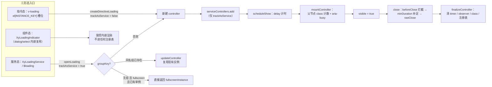

# 4-12 · 命令式服务（下）：dialog 队列与 loading 双形态

> 本篇是「组件机制」章节的收官篇，回答一个贯穿性问题：**alert/confirm/prompt 这类模态对话框服务，如何做到同屏只有一个、后续排队、还支持中途 update？** 答案藏在 `packages/components/dialog/src/service-state.ts` 里一个仅 321 行的模块中：`reactive({ current, queue })` 加一个挂在每个条目上的 Promise resolver。与它对读的是 loading——同一个"命令式服务"的名目下，loading 选择了完全相反的调度哲学：全屏单例、分组复用、指令与服务双注册（`component-manifest.json` 里唯一一个 `kind: directive + kind: globalProperty` 双检查的组件）。两种哲学放在一起，正好构成命令式服务调度的两个极点；再加上 4-11 讲过的 message 治理术和本篇将抽出的 notification 分桶并发模型，四种服务四种调度，收束整个章节。文中还收录 2026-09-16 遮罩三处理器迁绑 `__overlay` 的修复实态（当前工作区未提交改动，本篇按实码叙述）。所有路径与行号均在当前工作区逐一核对。

---

## 一、问题域：模态对话框为什么必须排队

先立起问题的边界。`XyDialogService.confirm()` 的调用方想要的契约是：一行调用，弹出确认框，拿到 `true`/`false`。用 TypeScript 的语言说，它返回 `Promise<boolean>`。但"模态"两个字意味着一堆约束同时成立：

- 同一时刻只应有一个模态框在屏上（焦点陷阱、滚动锁、遮罩都是排他资源——4-05、4-07 讲过它们的代价）；
- 后续到来的调用不能丢失，要排队等前一个退场；
- 排队中的调用最好还能被中途关闭或改写内容（比如业务方拿到的 handle，在排队期间就该可用）；
- 用户"点了取消"、"按了 Esc"、"点了遮罩"、"程序关闭"在语义上最好可区分。

这四条约束互相牵制：想并发堆叠就会抢焦点和滚动锁；想排队就不能每来一个就挂载一个；想中途可操作就不能让排队项"哑等"。`service.ts` 门面只有 99 行，四个入口全部经同一条入队通路。先看 `packages/components/dialog/src/service.ts:19-47`：

```ts
function ensureDialogServiceMounted() {
  if (typeof document === "undefined") {
    warnOnce("XyDialogService", "XyDialogService 仅支持在浏览器环境中使用。");
    return false;
  }

  if (serviceHost && serviceHost.isConnected) {
    return true;
  }

  serviceHost = document.createElement("div");
  serviceHost.className = "xy-dialog-service-host";
  document.body.appendChild(serviceHost);
  createApp(DialogServiceContainer).mount(serviceHost);
  return true;
}

function createNoopHandle(): DialogServiceHandle {
  const id = `xy-dialog-service-noop-${Date.now()}`;

  return {
    id,
    close() {},
    update() {},
    result: Promise.resolve({
      action: "programmatic"
    })
  };
}
```

两个细节值得先记下。其一，服务容器是**懒挂载**的：第一次调用任何入口时才 `createApp(DialogServiceContainer)` 并挂到 `document.body` 下的 `.xy-dialog-service-host` 宿主节点上，且用 `isConnected` 做幂等判断——测试里反复 `document.body.innerHTML = ""` 清场后，下一次调用能自动重建宿主。其二，SSR/非浏览器环境下不抛错，返回一个"什么也不做的 handle"，`result` 直接 resolve 成 `programmatic`——命令式 API 的降级路径也要保持类型不变。

再看四个入口的 Promise 形态（`packages/components/dialog/src/service.ts:49-99`）：

```ts
export const XyDialogService = {
  open(options: DialogServiceOpenOptions): DialogServiceHandle {
    if (!ensureDialogServiceMounted()) {
      return createNoopHandle();
    }

    const entry = enqueueDialogServiceEntry("open", options);
    return createDialogServiceHandle(entry.id, entry.result);
  },
  alert(options: DialogAlertOptions) {
    if (!ensureDialogServiceMounted()) {
      return Promise.resolve();
    }

    const entry = enqueueDialogServiceEntry("alert", {
      ...options,
      showCancelButton: false
    });

    return createDialogServiceHandle(entry.id, entry.result).result.then(() => undefined);
  },
  confirm(options: DialogConfirmOptions) {
    if (!ensureDialogServiceMounted()) {
      return Promise.resolve(false);
    }

    const entry = enqueueDialogServiceEntry("confirm", options);

    return createDialogServiceHandle(entry.id, entry.result).result.then(
      (result) => result.action === "confirm"
    );
  },
  prompt(options: DialogPromptOptions) {
    if (!ensureDialogServiceMounted()) {
      return Promise.resolve({
        confirmed: false,
        value: options.inputValue ?? ""
      });
    }

    const entry = enqueueDialogServiceEntry("prompt", options);

    return createDialogServiceHandle(entry.id, entry.result).result.then((result) => ({
      confirmed: result.action === "confirm",
      value: result.value ?? ""
    }));
  },
  closeAll() {
    closeAllDialogServiceEntries();
  }
};
```

四个入口是同一套原料的四种切法：内部统一产生 `Promise<DialogServiceResult>`（载荷是 `{ action, value? }`），对外再映射成各自的语义——`alert` 映射为 `Promise<void>`，`confirm` 映射为 `Promise<boolean>`，`prompt` 映射为 `Promise<{ confirmed, value }>`，`open` 则把原始 handle 交出去。`DialogServiceAction` 是六值联合（`dialog-service.ts:5-11`）：`"confirm" | "cancel" | "close" | "backdrop" | "escape" | "programmatic"`。这个设计做了一个明确的取舍：**Promise 永不 reject**。对比 Element Plus 的 MessageBox——`onAction` 里对 cancel/close 走 `currentMsg.reject('cancel')`/`reject('close')`（EP 官方仓库 `packages/components/message-box/src/messageBox.ts`，dev 分支实码），调用方一旦不 catch 就会得到 unhandled rejection；本库把六种退出原因全部折叠进 resolve 值，`confirm` 的 `false` 不区分"用户点了取消"还是"按了 Esc"，但拿到 handle 的高级用户可以通过 `result` 拿到精确的 action。语义分层：快捷入口给粗粒度布尔，原始入口给细粒度事实。

handle 的形状也值得一读（`dialog-service.ts:74-79`）：`{ id, close, update, result }` 四个字段。`id` 是日志与测试里定位条目的钥匙；`close(reason?)` 与 `update(patch)` 是仅有的两个写入口，内部都转发到 service-state 的按 id 寻址函数；`result` 是那条原始的六值 Promise。注意 handle 里**没有任何读取状态的方法**——想读当前标题？没有 `getTitle()`。这是故意的：命令式服务把"读"留在 Promise 与回调（`beforeConfirm` 的 action context、`footerRender` 的 footer context）里，handle 只负责"写"与"等"。读写分离后，服务内部状态机的自由度不受外部窥探的约束，后续演进（比如给条目加动画字段）不构成公开 API 变更。

**这里埋下本篇第一个设计权衡。** 串行队列还是并发堆叠？Element Plus 现行实现选择了后者：每一次 `ElMessageBox.confirm()` 都独立 `createVNode` 挂载、注册进 `messageInstance: Map<vm, { options, callback, resolve, reject }>`，多个弹窗可以同屏叠放（EP 早期沿袭 element-ui 的 `msgQueue + showNextMsg` 串行方案，后来重构为 Map 并发模型）。本库选择保留串行语义，理由不在风格而在资源账本：焦点陷阱的激活/恢复链、`useDismissibleLayer` 的"只响应最上层"、滚动锁的计数还原（4-07），都是按"同屏一个模态"假设设计的。串行让这一整组问题退化为平凡——`current` 永远是唯一可见者，Esc 只关它，焦点只困在它里面，退场动画只属于它。代价是引入了"队列"这个状态机，也就是下一节的内容。

## 二、reactive({current, queue})：321 行的状态机全拆

核心状态机在 `packages/components/dialog/src/service-state.ts`。全篇最重要的十行在这里（`service-state.ts:50-77`）：

```ts
export interface DialogServiceState {
  current: DialogServiceEntry | null;
  queue: DialogServiceEntry[];
}

export const dialogServiceState: DialogServiceState = reactive({
  current: null,
  queue: []
});

let dialogServiceSeed = 0;

function nextDialogServiceId() {
  dialogServiceSeed += 1;
  return `xy-dialog-service-${dialogServiceSeed}`;
}

function createResultPromise() {
  let resolveResult = (_result: DialogServiceResult) => {};
  const result = new Promise<DialogServiceResult>((resolve) => {
    resolveResult = resolve;
  });

  return {
    result,
    resolveResult
  };
}
```

`reactive({ current, queue })` 是整个服务的唯一事实源。它被 Vue 的响应式系统接管后，渲染层（`dialog-service-container.vue`）只需 `computed(() => dialogServiceState.current)` 就能自动跟随队列推进——**队列的推进不需要任何事件总线或回调通知，纯粹靠响应式依赖收集**。而 `createResultPromise` 是经典的"resolver 外提"手筋：`new Promise` 的 executor 同步执行，把 `resolve` 函数偷出来存进闭包，于是 Promise 的"完成时机"从此可以由外部任意代码在任意时刻触发。

关键的决策是：**这个 resolver 不挂在模块级，也不挂在 Map 里，而是作为字段挂进每个队列条目**。先看条目的完整形状（`service-state.ts:19-48`）：

```ts
export interface DialogServiceEntry {
  id: string;
  mode: DialogServiceMode;
  title: string;
  visible: boolean;
  dialogProps?: Partial<DialogProps>;
  message?: string;
  render?: () => VNodeChild;
  component?: DialogServiceOpenOptions["component"];
  componentProps?: Record<string, unknown>;
  footerRender?: DialogServiceOpenOptions["footerRender"];
  showCancelButton: boolean;
  confirmButtonText: string;
  cancelButtonText: string;
  confirmButtonProps?: DialogServiceOpenOptions["confirmButtonProps"];
  cancelButtonProps?: DialogServiceOpenOptions["cancelButtonProps"];
  beforeConfirm?: DialogServiceOpenOptions["beforeConfirm"];
  beforeCancel?: DialogServiceOpenOptions["beforeCancel"];
  pendingAction: DialogServiceAction;
  confirming: boolean;
  cancelling: boolean;
  promptValue: string;
  promptError: string;
  inputPlaceholder: string;
  inputType: "text" | "textarea" | "password";
  inputProps: Record<string, unknown>;
  inputValidator?: DialogPromptOptions["inputValidator"];
  result: Promise<DialogServiceResult>;
  resolveResult: (result: DialogServiceResult) => void;
}
```

一个条目 = 一份归一化后的 UI 状态 + 一对 `result/resolveResult`。`normalizeEntry`（`service-state.ts:79-116`）负责把调用方的 options 归一化成这个形状，其中 `showCancelButton: options.showCancelButton ?? mode !== "alert"` 让 alert 默认没有取消按钮（service.ts 入口处还再强制了一次），`pendingAction: "programmatic"` 作为兜底初值。归一化的意义在于：**入队之后，容器组件面对的所有条目都是同构的**，渲染层不需要再判断"这个字段用户传了没有"。

然后是队列的推进机制。`service-state.ts:118-166`：

```ts
function getEntryById(id: string) {
  if (dialogServiceState.current?.id === id) {
    return dialogServiceState.current;
  }

  return dialogServiceState.queue.find((entry) => entry.id === id) ?? null;
}

function shiftQueue() {
  dialogServiceState.current = dialogServiceState.queue.shift() ?? null;
}

function resolveEntry(entry: DialogServiceEntry, action: DialogServiceAction) {
  entry.resolveResult({
    action,
    value: entry.mode === "prompt" ? entry.promptValue : undefined
  });
}

export function createDialogServiceHandle(
  id: string,
  result: Promise<DialogServiceResult>
): DialogServiceHandle {
  return {
    id,
    close(reason = "programmatic") {
      requestCloseDialogServiceEntry(id, reason);
    },
    update(patch) {
      updateDialogServiceEntry(id, patch);
    },
    result
  };
}

export function enqueueDialogServiceEntry(
  mode: DialogServiceMode,
  options: DialogServiceOpenOptions | DialogAlertOptions | DialogConfirmOptions | DialogPromptOptions
) {
  const entry = normalizeEntry(mode, options);

  if (dialogServiceState.current) {
    dialogServiceState.queue.push(entry);
  } else {
    dialogServiceState.current = entry;
  }

  return entry;
}
```

入队逻辑只有一组 if：`current` 空位直接上屏，否则进 `queue` 排队。注意 `enqueueDialogServiceEntry` 返回的是 entry 本身（含还没 resolve 的 `result`），门面层用 `createDialogServiceHandle` 把它包成只暴露 `id/close/update/result` 的对外 handle——**entry 的可写字段（promptValue、confirming 等）不出服务边界**，调用方拿到的是窄接口。

真正的精妙在关闭路径。`service-state.ts:168-208`：

```ts
export function requestCloseDialogServiceEntry(id: string, action: DialogServiceAction) {
  const entry = getEntryById(id);

  if (!entry) {
    return;
  }

  entry.pendingAction = action;

  if (dialogServiceState.current?.id === id) {
    dialogServiceState.current.visible = false;
    return;
  }

  resolveEntry(entry, action);
  dialogServiceState.queue.splice(
    dialogServiceState.queue.findIndex((item) => item.id === id),
    1
  );
}

export function finishDialogServiceEntry(id: string) {
  const entry = getEntryById(id);

  if (!entry) {
    return;
  }

  resolveEntry(entry, entry.pendingAction);

  if (dialogServiceState.current?.id === id) {
    shiftQueue();
    return;
  }

  const index = dialogServiceState.queue.findIndex((item) => item.id === id);

  if (index !== -1) {
    dialogServiceState.queue.splice(index, 1);
  }
}
```

`requestCloseDialogServiceEntry` 里藏着一个容易忽略的分支：**如果被关的是排队中的条目（不在屏上），它直接 resolve 并从队列里 splice 掉**。这就是"排队项也可中途关闭"的实现——调用方在排队期间拿到 handle 就可以 `handle.close()`，这个 Promise 会立刻以指定 action 完成，绝不会出现"排到了才发现没人要了"的尴尬。而如果被关的是 `current`，则只置 `visible = false`，**不 resolve、不 shift**——把完成时机让给动画。等 Dialog 的过渡完全退场、容器收到 `@closed` 事件后才调 `finishDialogServiceEntry`：此刻才 resolve，才 `shiftQueue()` 把下一个条目顶上屏。

**这就是本篇第二个设计权衡：两段式关闭。** "先置 visible=false → 过渡动画播完 → @closed → resolve + shift" 的时序保证了两件事：resolver 的触发与视觉退场同步（用户感知不到 Promise 与画面脱节）；下一个对话框在前一个完全退场后才上屏（过渡动画不叠影，`xy-dialog-fade` 的 enter/leave 不会同时跑在两个实例上）。代价是状态机多了 `pendingAction` 这个"待签收字段"——action 先写入条目，动画播完后 `finishDialogServiceEntry` 用 `entry.pendingAction` 补签。若是程序化 `closeAll` 则走另一条快速路径，直接放弃退场动画。

`pendingAction` 的"先写后签"时序为什么安全？因为 JavaScript 的单线程模型保证了窗口期内的原子性：`requestCloseDialogServiceEntry` 在同一次同步执行里先写 `entry.pendingAction = action` 再置 `visible = false`，过渡动画是异步的，`finishDialogServiceEntry` 无论多晚触发，读到的都是那次关闭时写入的 action。唯一的竞态窗口是"动画播放期间又发生了一次新的关闭请求"——比如动画中用户连按 Esc，第二次 `requestClose` 会覆盖 `pendingAction`，但 `visible` 已经是 false，Dialog 的 `handleClose` 里 `closing.value` 的守卫（`use-dialog.ts:291-294`）会拦掉重复关闭，所以最终签收的 action 可能是"最后一次请求的 action"，这正是符合直觉的语义。

这段时序还经得起四个边界场景的推敲，每个场景都能在代码里找到确定的结局。**场景一：退场动画进行到一半时来了新调用。** 此时 `current` 仍被旧条目占着（`visible` 已 false 但尚未 finish），新条目只能进 `queue`，等 `@closed` 触发 `shiftQueue()` 才上屏——新调用为此多等一个过渡时长，换来的是旧对话框退场与新对话框进场两段动画绝不交叠，串行语义在动画窗口内依然成立。**场景二：`closeAll` 与 `@closed` 竞速。** `closeAllDialogServiceEntries` 同步 resolve 全部条目并清空状态；即便退场动画仍在收尾、`@closed` 稍后才触发，`handleClosed` 用 `lastRenderedEntryId` 兜底拿到的 id 去走 `finishDialogServiceEntry` 时，`getEntryById` 返回 null 直接 return——条目已被 closeAll 签收过，二次 finish 是幂等空操作；若 Dialog 因 `current` 置空被立即卸载、`@closed` 永不触发，结局同样安全，条目早已 resolve。**场景三：对同一 current 的重复关闭请求。** 动画期间第二次 `requestCloseDialogServiceEntry` 只是覆写 `pendingAction`、把 `visible` 再置一次 false（已是 no-op），不会引发第二次 resolve，`finishDialogServiceEntry` 只会被 `@closed` 调到一次。**场景四：对已出队条目的 handle.close()。** 排队条目被 close 后已从 `queue` 里 splice 掉，再次 `handle.close()` 时 `getEntryById` 同样查无此条目。四条路径殊途同归：状态机的每个出口都以"查无此条目"或"已持锁"为幂等护栏——**容错不靠额外的标志位，靠"先查后动"这一个模式在所有入口的一致贯彻**。

先看时序全景再继续拆：



`closeAll` 的快速路径与 `update` 的全量补丁都在同一文件的后半段。`closeAllDialogServiceEntries`（`service-state.ts:297-308`）把 `current` 与整个 `queue` 的条目全部就地 resolve 成 `programmatic`，然后 `current = null`、队列清空——注意 `current` 置空会让容器的 `v-if="currentEntry"` 立即卸载 Dialog，没有退场动画，这是"一键清场"接受的代价。测试对这条路径有明确断言（`dialog.spec.ts:1028-1053`）：closeAll 后两个 result 都以 `programmatic` resolve，且 `current` 为 null、queue 长度为 0。

## 三、中途 update：白名单补丁与互斥的内容三态

`updateDialogServiceEntry`（`service-state.ts:210-295`）是"中途 update"的实现主体，86 行里没有一处魔法，但有三条值得划线的纪律。

第一条：**按 id 寻址，不按引用寻址**。入口先 `getEntryById(id)`，先查 `current` 再查 `queue`——所以 update 对排队中的条目同样生效：你可以给一个还没上屏的对话框改标题，等它顶上来时已是新标题。测试 `dialog.spec.ts:851-898` 正是这么钉的：`open` 两个、`first.update({ title, message, dialogProps })` 后断言 `.xy-dialog__title` 与 `.xy-dialog__body` 的文本变化，以及 `dialogProps.width` 已合入。

第二条：**白名单字段，逐字段深合并**。`dialogProps` 是唯一做浅合并的字段（`{ ...entry.dialogProps, ...patch.dialogProps }`），其余字段一律"传了才改"——patch 里 `"title" in patch && patch.title !== undefined` 这种双重判断意味着显式传 `undefined` 不会误伤现有值。

第三条：**内容三态互斥**。条目的正文有三种来源：`message`（纯文本）、`render`（渲染函数）、`component`（组件 + props），update 时切换任意一个都要清掉另外两个（`service-state.ts:256-282`）：

```ts
  if ("footerRender" in patch) {
    entry.footerRender = patch.footerRender;
  }

  if ("message" in patch) {
    entry.message = patch.message;
    entry.render = undefined;
    entry.component = undefined;
    entry.componentProps = undefined;
  } else if ("render" in patch) {
    entry.render = patch.render;
    entry.message = undefined;
    entry.component = undefined;
    entry.componentProps = undefined;
  } else if ("component" in patch) {
    entry.component = patch.component;
    entry.componentProps = patch.componentProps ?? entry.componentProps;
    entry.message = undefined;
    entry.render = undefined;
  } else if ("componentProps" in patch && patch.componentProps !== undefined) {
    entry.componentProps = patch.componentProps;
  }

  if ("inputValue" in patch && patch.inputValue !== undefined) {
    entry.promptValue = patch.inputValue;
    entry.promptError = "";
  }
```

若不做互斥清理，容器模板里的优先级分支（`v-if`/`v-else-if`）虽然仍能选出唯一渲染路径，但旧内容会作为死数据留在条目里，后续 update 的判断都会被污染。互斥清理让"当前正文是什么"在任何时刻都有唯一答案。

谁在消费这些状态？看容器的动作处理（`packages/components/dialog/src/dialog-service-container.vue:98-150`）：

```ts
async function handleConfirm() {
  if (!currentEntry.value || currentEntry.value.confirming) {
    return;
  }

  currentEntry.value.confirming = true;
  currentEntry.value.promptError = "";

  try {
    if (currentEntry.value.mode === "prompt" && currentEntry.value.inputValidator) {
      const validation = await currentEntry.value.inputValidator(currentEntry.value.promptValue);

      if (typeof validation === "string" && validation) {
        currentEntry.value.promptError = validation;
        return;
      }
    }

    const context = buildActionContext("confirm");

    if (context && currentEntry.value.beforeConfirm) {
      await currentEntry.value.beforeConfirm(context);
    }

    closeCurrent("confirm");
  } finally {
    if (currentEntry.value) {
      currentEntry.value.confirming = false;
    }
  }
}

async function handleCancel() {
  if (!currentEntry.value || currentEntry.value.cancelling) {
    return;
  }

  currentEntry.value.cancelling = true;

  try {
    const context = buildActionContext("cancel");

    if (context && currentEntry.value.beforeCancel) {
      await currentEntry.value.beforeCancel(context);
    }

    closeCurrent("cancel");
  } finally {
    if (currentEntry.value) {
      currentEntry.value.cancelling = false;
    }
  }
}
```

confirm 链路是一条四段流水线：`confirming` 互斥锁（防双击）→ prompt 的 `inputValidator`（返回字符串即校验失败，写进 `promptError` 且**不关闭**）→ `beforeConfirm` 异步钩子（拿到含 `close` 的 action context，可以自己决定是否调 `close`）→ `closeCurrent("confirm")` 走两段式关闭。`finally` 里先判 `currentEntry.value` 是否还在再复位 `confirming`，是因为 await 期间条目可能已被 `closeAll` 摘走——异步代码里对响应式对象的每一次"回头引用"都要重新判空。footer 的确认按钮绑的就是 `confirming`（`currentEntry.confirming`），所以 `beforeConfirm` 请求期间按钮自动进入 loading 态——异步闸门的状态就放在条目上，UI 自然跟随。

容器模板把条目的同构性变现成一段固定的渲染树（`dialog-service-container.vue:245-273`）：

```vue
<template>
  <Dialog
    v-if="currentEntry"
    :model-value="currentEntry.visible"
    v-bind="dialogProps"
    :title="currentEntry.title"
    :before-close="handleBeforeClose"
    @closed="handleClosed"
  >
    <DialogServicePrompt
      v-if="currentEntry.mode === 'prompt'"
      :model-value="currentEntry.promptValue"
      :message="currentEntry.message"
      :placeholder="currentEntry.inputPlaceholder"
      :input-type="currentEntry.inputType"
      :input-props="currentEntry.inputProps"
      :error="currentEntry.promptError"
      @update:model-value="handlePromptValueUpdate"
    />
    <component
      :is="currentEntry.component"
      v-else-if="currentEntry.component"
      v-bind="currentEntry.componentProps ?? {}"
    />
    <RenderVNode
      v-else-if="hasBodyRenderer"
      :renderer="bodyRenderer"
    />
    <template v-else>{{ currentEntry.message }}</template>
```

整个服务**只挂载一个 `XyDialog` 实例**，条目更替是"同一个对话框换内容"，而不是"销毁旧对话框创建新对话框"。`@closed` 接 `handleClosed`（`dialog-service-container.vue:161-169`）里那个 `lastRenderedEntryId` 兜底很有味道：若 `@closed` 触发瞬间 `currentEntry` 已经是下一个条目（条目更替与动画结束竞速），就用 `watch` 记下的上一个 id 去 finish，保证 shift 语义不错位。此外容器在 `provide(configProviderKey, …)`（54-63 行）里重建了一份全局配置链——服务对话框挂在 `document.body` 下，天然脱离宿主组件树，`XyDialogService` 继承 `ConfigProvider.dialog` 默认值的能力（测试 `dialog.spec.ts:1055-1106` 验证了 alignCenter/draggable 等默认值生效且 `dialogProps` 可局部覆盖）就是靠这次手工 provide 接回去的。

还有一条容易被略过的支线：用户通过 `dialogProps.beforeClose` 挂进来的关闭拦截，如何与服务的 `pendingAction` 对齐。容器在 `handleBeforeClose`（`dialog-service-container.vue:197-222`）里包了一层：先把 Dialog 传来的 `reason`（close/backdrop/escape/programmatic 四值 `DialogCloseReason`，`dialog.ts:3`）经 `setDialogServiceEntryPendingAction`（`service-state.ts:310-320`）归一化写入条目——其中 `close/backdrop/escape` 会经 `mapCloseReasonToServiceAction`（`dialog-service.ts:81-95`）映射成六值 action；然后才透传给用户的 `beforeClose`，用户在钩子里调 `done(true)` 取消关闭时，容器把 `pendingAction` 重置回 `"programmatic"`，避免"已被拦截的关闭"留下一个等待签收的假 action。一次关闭请求在到达视觉层之前，它的语义就已经在状态机里登记完毕——这条支线让 Dialog 组件自身的 `before-close` 协议与服务的六值 action 体系无缝咬合。

## 四、遮罩三处理器迁绑 __overlay：2026-09-16 修复实态

本篇截稿时工作区里有一组未提交改动，正是考据中提到的遮罩修复。修复的动作很小：把遮罩的三个事件处理器从对话框**根节点**迁绑到遮罩节点本身。修复前（HEAD 版本），`click/mousedown/mouseup` 三个监听挂在根 wrapper `.xy-dialog` 上；修复后，它们移到了内层遮罩 div 上。当前实码（`packages/components/dialog/src/dialog.vue:149-171`）：

```vue
<template>
  <teleport :to="overlay.appendTo.value" :disabled="overlay.teleportDisabled.value">
    <transition v-bind="transitionConfig">
      <div
        v-if="overlay.rendered.value"
        v-show="overlay.visible.value"
        ref="overlayRef"
        :class="[
          ns.base.value,
          ns.is('closing', closing),
          ns.is('align-center', resolvedAlignCenter),
          ns.is('fullscreen', resolvedFullscreen),
          isPenetrable ? ns.is('penetrable', true) : ''
        ]"
        :style="rootStyle"
      >
        <div
          v-if="overlay.showModal.value"
          :class="[`${ns.base.value}__overlay`, props.modalClass]"
          @click="handleOverlayClick"
          @mousedown="handleOverlayMouseDown"
          @mouseup="handleOverlayMouseUp"
        />
        <DialogContent
          ref="dialogContentRef"
```

结构上要点是：遮罩 `.xy-dialog__overlay` 与面板 `DialogContent` 是**兄弟节点**，不是包裹关系。三个处理器的实现（`packages/components/dialog/src/use-dialog.ts:336-357`）：

```ts
  function handleOverlayMouseDown(event: MouseEvent) {
    downOnOverlay.value = overlay.showModal.value && event.target === event.currentTarget;
  }

  function handleOverlayMouseUp(event: MouseEvent) {
    downOnOverlay.value = downOnOverlay.value && event.target === event.currentTarget;
  }

  function handleOverlayClick(event: MouseEvent) {
    const canClose =
      overlay.showModal.value &&
      resolvedCloseOnClickModal.value &&
      overlay.isTopMost() &&
      downOnOverlay.value &&
      event.target === event.currentTarget;

    downOnOverlay.value = false;

    if (canClose) {
      handleClose("backdrop");
    }
  }
```

修复的意义可以用一句话概括：**把"点在遮罩还是对话框内"的判定，从运行时判据下沉为 DOM 结构保证。** 迁绑之前，处理器挂在根节点上，面板内任何元素的事件都会冒泡到根，运行时必须靠 `event.target === event.currentTarget` 加 `downOnOverlay` 标记去区分事件源；迁绑之后，遮罩与面板是兄弟节点，冒泡路径互不经过——从面板冒泡上来的 click 根本到不了遮罩节点，处理器天然只会收到真正落在遮罩上的事件，`target === currentTarget` 从"需要警惕的判据"退化为"恒真的断言"，同时也顺手把"按下在遮罩、抬起在面板"这类跨元素手势挡在了结构之外。EP 的 `useDialog` 里保留着完全同款的三函数 + `downOnOverlay` 双判据（EP 历史上遮罩与内容同层包裹，判定只能在运行时做），本库这次迁绑等于用结构调整换掉了这组历史包袱的一半。

配套测试同步钉住了两层语义（`packages/components/dialog/__tests__/dialog.spec.ts:203-232` 的"点击面板本身不会误触发关闭"，以及新增的防拖拽误关用例 `dialog.spec.ts:234-264`）：

```ts
  it("按下在遮罩、抬起在面板内容时不关闭（防拖拽误关）", async () => {
    document.body.innerHTML = "";

    const wrapper = mount(XyDialog, {
      attachTo: document.body,
      props: {
        modelValue: true,
        title: "拖拽误关测试"
      }
    });

    await flushDialog();

    const overlay = document.body.querySelector(".xy-dialog__overlay") as HTMLElement;
    const panel = document.body.querySelector(".xy-dialog__panel") as HTMLElement;

    // 模拟真实浏览器在遮罩按下后拖拽经过面板内容抬起：click 目标不是遮罩，不应关闭
    overlay.dispatchEvent(new MouseEvent("mousedown", { bubbles: true }));
    panel.dispatchEvent(new MouseEvent("mouseup", { bubbles: true }));
    panel.dispatchEvent(new MouseEvent("click", { bubbles: true }));
    await flushDialog();
    expect(wrapper.emitted("close")).toBeUndefined();

    // 按下与抬起均落在遮罩上的完整点击仍正常关闭
    overlay.dispatchEvent(new MouseEvent("mousedown", { bubbles: true }));
    overlay.dispatchEvent(new MouseEvent("mouseup", { bubbles: true }));
    overlay.dispatchEvent(new MouseEvent("click", { bubbles: true }));
    await flushDialog();

    expect(wrapper.emitted("close")).toHaveLength(1);
    expect(wrapper.emitted("update:modelValue")?.[0]).toEqual([false]);
  });
```

注意测试查询的选择器也从 `.xy-dialog`（根）改成了 `.xy-dialog__overlay`（遮罩）——选择器跟着处理器走，这本身就是"判据迁到了哪"的最直接证据。顺带一提，Esc 关闭走的是另一条通路：`useDismissibleLayer`（`use-dialog.ts:325-334`）的 `closeOnEscape` + `isTopMost` 判定，`onDismiss` 里 `handleClose("escape")`——与遮罩点击互不干扰，两条路最终都汇入 `DialogServiceAction` 的六值枚举。

## 五、loading：一个能力的三种形态、一种注册的双通道

如果说 dialog 服务的关键词是"排队"，loading 服务的关键词就是"复用与克制"。同一个加载指示器，本库给了三种消费形态：**组件态**（`XyLoadingIndicator` 被.dialog、select 等组件直接引入）、**指令态**（`v-loading` 挂任意元素）、**服务态**（`XyLoadingService()` 命令式全屏/局部）。而对外注册只有两条通道，manifest 里写得明明白白（`packages/components/component-manifest.json:422-431`）：

```json
    "name": "loading",
    "docsGroup": "feedback",
    "docsText": "Loading 加载",
    "installExports": ["XyLoading"],
    "installChecks": [
      { "kind": "directive", "name": "loading" },
      { "kind": "globalProperty", "name": "$loading" }
    ],
    "styleImports": ["loading"]
```

全库 72 个组件里唯一的 `directive + globalProperty` 双 kind 检查。两条通道在一次 install 里同时接通（`packages/components/loading/index.ts:29-44`）：

```ts
export const XyLoading = {
  install(app: App) {
    XyLoadingService._context = app._context;
    (
      vLoading as Directive<ElementLoading, LoadingBinding> & { _context: AppContext | null }
    )._context = app._context;
    app.directive("loading", vLoading as Directive<ElementLoading, LoadingBinding>);
    app.config.globalProperties.$loading = XyLoadingService;
  },
  directive: vLoading,
  service: XyLoadingService
};

export { vLoading, vLoading as XyLoadingDirective, XyLoadingService };

export default XyLoading;
```

这段就是 4-02 那个 `_context` 伏笔最完整的落地现场：install 时把 `app._context` **同时**捕获到 `XyLoadingService._context` 与 `vLoading._context` 两处。为什么两处都要？因为脱离组件树调用的命令式 API 有两个不同的入口，各自缺上下文：服务可能在任何模块里被 `import` 后直接调用（没有组件实例可查 appContext）；指令虽然总挂在元素上，但 `binding.instance.$?.appContext` 在某些异步创建的场景下拿不到（`directive.ts:29-34` 的 `getAppContext` 就是"实例优先、全局兜底"的双源取法）。测试 `loading.spec.ts:615-657` 验证了整条链：`app.provide(configProviderKey, { zIndex: 4096, loading: {...} })` + `app.use(XyLoading)` 之后，`$loading()` 创建的遮罩拿到 `zIndex >= 4097`、继承全局 `text`/`background`/`delay`——`service.ts:550` 的 `const appContext = context ?? XyLoadingService._context` 就是消费点，`resolveNamespace/resolveBaseZIndex/resolveGlobalLoadingConfig` 三个函数（`service.ts:144-154`）再从 appContext.provides 里挖出 ConfigProvider 配置。组件在树外，配置却没断。

### 指令态：el 上的 Symbol 槽位

`v-loading` 的实现骨架（`packages/components/loading/src/directive.ts:100-152`）：

```ts
function createInstance(el: ElementLoading, binding: DirectiveBinding<LoadingBinding>) {
  const appContext = getAppContext(binding);
  const options = resolveOptions(el, binding);
  const instance = createDirectiveLoading(options, appContext);

  el[INSTANCE_KEY] = {
    appContext,
    instance,
    options
  };
}

type LoadingDirective = ObjectDirective<ElementLoading, LoadingBinding> & {
  _context: AppContext | null;
};

const vLoading = {
  mounted(el: ElementLoading, binding: DirectiveBinding<LoadingBinding>) {
    if (binding.value) {
      createInstance(el, binding);
    }
  },
  updated(el: ElementLoading, binding: DirectiveBinding<LoadingBinding>) {
    const record = el[INSTANCE_KEY];

    if (!binding.value) {
      record?.instance.close();
      el[INSTANCE_KEY] = null;
      return;
    }

    if (!record) {
      createInstance(el, binding);
      return;
    }

    const nextOptions = resolveOptions(el, binding);
    const appContext = getAppContext(binding);

    if (record.appContext !== appContext || shouldRecreate(record.options, nextOptions)) {
      record.instance.close();
      createInstance(el, binding);
      return;
    }

    record.instance.update(toUpdatableOptions(nextOptions));
    record.options = nextOptions;
  },
  unmounted(el: ElementLoading) {
    el[INSTANCE_KEY]?.instance.close();
    el[INSTANCE_KEY] = null;
  }
} as unknown as LoadingDirective;

vLoading._context = null;
```

与 EP 的 v-loading 对照（EP `packages/components/loading/src/directive.ts`，dev 分支实码）：同样是 `Symbol` 键（EP 叫 `INSTANCE_KEY = Symbol('ElLoading')`，本库是 `Symbol("XyLoading")`）、同样 `el[INSTANCE_KEY]` 存实例、同样三钩子里 `mounted` 条件创建 / `updated` 切换或更新 / `unmounted` 清理——骨架是同一种流派。差异有三处值得记：其一，EP 的 `updated` 直接 `updateOptions` 覆盖，本库多了一道 `shouldRecreate` 判定（`directive.ts:75-82`）：`target/body/fullscreen/lock` 四个字段变了不能热更——它们决定"遮罩挂到哪个父节点、父节点加不加 relative/hidden class"，热更会留下脏 class，必须 close 后重建；只有文案、背景这类视觉字段才走 `instance.update()`。其二，本库的 `resolveOptions`（`directive.ts:49-73`）做了**三源合并**：binding 对象值 → `xy-loading-*` 属性 → 修饰符（`v-loading.fullscreen.lock`），模板上不写对象也能用纯属性声明：

```ts
function resolveOptions(
  el: HTMLElement,
  binding: DirectiveBinding<LoadingBinding>
): LoadingOptions {
  const fullscreen = getBindingValue(binding, "fullscreen") ?? binding.modifiers.fullscreen;

  return {
    text: getBindingValue(binding, "text") ?? getAttributeValue(el, "text"),
    spinner: getBindingValue(binding, "spinner") ?? getAttributeValue(el, "spinner"),
    svg: getBindingValue(binding, "svg") ?? getAttributeValue(el, "svg"),
    svgViewBox: getBindingValue(binding, "svgViewBox") ?? getAttributeValue(el, "svgViewBox"),
    background: getBindingValue(binding, "background") ?? getAttributeValue(el, "background"),
    customClass: getBindingValue(binding, "customClass") ?? getAttributeValue(el, "customClass"),
    target: getBindingValue(binding, "target") ?? (fullscreen ? undefined : el),
    body: getBindingValue(binding, "body") ?? binding.modifiers.body,
    fullscreen,
    lock: getBindingValue(binding, "lock") ?? binding.modifiers.lock,
    visible: getBindingValue(binding, "visible") ?? true,
    delay: getBindingValue(binding, "delay"),
    minDuration: getBindingValue(binding, "minDuration"),
    groupKey: getBindingValue(binding, "groupKey"),
    beforeClose: getBindingValue(binding, "beforeClose"),
    closed: getBindingValue(binding, "closed")
  };
}
```

其三，指令创建的实例走 `createDirectiveLoading`，它只是 `openLoading(options, context, false)`——`trackAsService = false`，**不进服务的注册表**。这个布尔是三形态共用的分水岭，下一小节展开。

### 服务态：单例、分组与 controller 生命周期

服务态的核心调度在 `openLoading` 的注册段（`packages/components/loading/src/service.ts:606-673`）：

```ts
  if (trackAsService && !resolved.groupKey && resolved.fullscreen && fullscreenInstance) {
    return fullscreenInstance;
  }

  const controller = {} as LoadingController;

  const instance = createLoadingComponent(
    {
      ...resolved,
      beforeClose: undefined,
      closed: () => finalizeController(controller)
    },
    appContext ?? null,
    nextZIndex(baseZIndex)
  );

  Object.assign(controller, {
    appContext: appContext ?? null,
    currentOptions: resolved,
    followerCleanup: null,
    isMounted: false,
    isService: trackAsService,
    isVisible: false,
    isClosing: false,
    namespace,
    pendingCloseTimer: null,
    pendingShowTimer: null,
    rawClose: instance.close.bind(instance),
    rawSetText: instance.setText.bind(instance),
    rawUpdate: instance.update.bind(instance),
    shownAt: null,
    instance
  });

  instance.setText = (text: LoadingText) => {
    controller.currentOptions.text = text;
    controller.rawSetText(text);
  };
  instance.update = (patch: LoadingUpdatableOptions) => {
    updateController(controller, patch);
  };
  instance.close = () => {
    if (controller.isClosing) {
      return;
    }

    if (controller.currentOptions.beforeClose?.() === false) {
      return;
    }

    scheduleClose(controller);
  };

  if (trackAsService) {
    serviceControllers.add(controller);

    if (resolved.groupKey) {
      serviceGroupControllers.set(resolved.groupKey, controller);
    }

    if (!resolved.groupKey && resolved.fullscreen) {
      fullscreenInstance = instance;
    }
  }

  scheduleShow(controller);
  return instance;
}
```

调度规则有三层，优先级从高到低：**groupKey 复用**（555-604 行：同名组的重复调用不做新实例，把本次 options 里"可更新字段"提取成 patch 喂给现有 controller——`loading.spec.ts:377-402` 验证两次调用返回同一实例、文案与背景已合并）；**全屏单例**（上面代码第一段：无 groupKey 且 fullscreen 时直接返回已有的 `fullscreenInstance`，`loading.spec.ts:223-241` 断言 `first === second` 且全文档只有一个 mask）；**新建 controller**。controller 把底层实例的 `close/setText/update` 三个方法先存成 `rawClose/rawSetText/rawUpdate` 再**覆写**（`Object.assign` 之后重新赋值 `instance.close` 等）——覆写层加进了三件底层不知道的事：`beforeClose` 返回 `false` 可拦截关闭、`minDuration` 防闪烁（`scheduleClose` 里按 `minDuration - elapsed` 补足延时才真关，`loading.spec.ts:356-375` 钉住"100ms 关不掉、120ms 后消失"）、`delay` 未挂载时关闭要取消计时器（325-354 行用例）。`finalizeController`（342-367 行）收尾时按序清理两个定时器、body-follow observer、父节点 class 与 `aria-busy` 计数，再从注册表摘除。

**这是本篇第三个设计权衡：loading 为什么要三形态。** 组件态服务于"声明式场景下的内嵌复用"（dialog 的 `loading` prop、select 的表格加载都是直接引 `XyLoadingIndicator` 渲染）；指令态服务于"模板里给任意元素套遮罩"——不引入新组件层级，遮罩 DOM 与宿主元素的关系由指令托管；服务态服务于"逻辑过程中的阻塞反馈"——不依赖任何组件实例，`await XyLoadingService.with(fetchUser(), { text: "加载中" })` 一行包住任意异步任务（`service.ts:700-712`，`finally` 里保证成功失败都关）。三者共享同一个运行时 `createLoadingComponent`，指令与服务只差 `trackAsService` 一个布尔——false 就不进 `serviceControllers` 注册表，于是 `XyLoadingService.closeAll()` 只关服务实例，不会误伤页面上所有 `v-loading` 局部遮罩。注册边界即作用域边界，一个布尔把"全局命令"的影响面圈死。而 service.ts 全文 714 行（与考据口径一致），其中近一半在处理位置（`applyBodyRect`/`startBodyFollow` 的 ResizeObserver + rAF 跟随）与父节点 class 计数（`data-xy-loading-count` 等 4 个 data 属性计数器，保证多个 loading 共享父节点时 class 不被提前移除，`loading.spec.ts:490-520`）——**命令式 API 的复杂度不在"创建"，全在"还原"**。

`updateController`（`service.ts:443-514`）的写法也有一处纪律与 dialog 的 update 同源：逐字段用 `hasOwn(patch, key)` 判断——**"键存在"与"值非空"是两件事**。`hasOwn(patch, "text")` 为真且值为 `undefined` 时会把文案清空，而键不存在时保持原样；这与 dialog update 的 `"title" in patch && patch.title !== undefined` 双重判断互为镜像，两个服务的更新协议在"显式清除"语义上保持了库级一致。末尾三个分支处理"更新引发的副作用"：未挂载且 `visible` 为真则补一次 `scheduleShow`；挂在 body 上的局部遮罩更新后重算一次 `applyBodyRect`；patch 显式传 `visible: false` 则直接 `instance.close()`。测试 `loading.spec.ts:295-323` 把这套更新语义串起来验过：`update({ beforeClose: () => true })` 后再 close，拦截解除、`closed` 回调触发、mask 从 DOM 消失。

底层运行时也有一个值得看的细节（`packages/components/loading/src/loading.ts:93-117`）：

```ts
  function handleAfterLeave() {
    if (!afterLeaveFlag.value) {
      return;
    }

    afterLeaveFlag.value = false;
    removeLoadingChild();
    loadingApp.unmount();
    runClosedCallback();
  }

  function close() {
    if (afterLeaveFlag.value) {
      return;
    }

    afterLeaveFlag.value = true;
    data.visible = false;

    if (afterLeaveTimer !== null) {
      globalThis.clearTimeout(afterLeaveTimer);
    }

    afterLeaveTimer = globalThis.setTimeout(handleAfterLeave, LOADING_CLOSE_DELAY);
  }
```

loading 实例是 `createApp` 挂出来的**独立小应用**（`loading.ts:156-159` 把宿主 appContext 合并进小应用，全局配置才得以继承），`close()` 先置 `visible = false` 走 CSS 退场，同时起一个 240ms（`LOADING_CLOSE_DELAY`）的兜底定时器——过渡钩子没触发（比如遮罩正被 `display:none` 的父级隐藏）也能保证最终 unmount。这与 dialog 服务的两段式关闭是同一个思想：**视觉退场与资源回收分离，后者永远有兜底**。

三形态的分流全景如下：



## 六、对照与收束：四种服务，四种调度

把 notification 拉进来凑齐最后一块拼图。notification 服务（`packages/components/notification/src/service.ts`，1008 行）选择了第三种调度——**分桶并发**。它按 `target + position` 把实例装进 `notificationBuckets` 的桶里，桶内 `instances.push/splice` 直接增删，每个实例独立 `createVNode` + `render` 挂载（704-744 行），偏移量按桶内前一个实例的高度累加（713-716 行 `previous.currentOffset + getHostHeight(previous) + NOTIFICATION_GAP`）。没有 `current`，没有排队——通知天然是**非模态**的，多个并存反而是产品语义的一部分（堆叠、上限 max、溢出策略 overflowStrategy 都是围绕并发设计的）。对比段直接看它的实例创建（`packages/components/notification/src/service.ts:704-744`）：

```ts
function createNotificationInstance(
  normalized: NotificationServiceOptionsNormalized,
  context?: AppContext | null
) {
  const id = nextNotificationId();
  const host = document.createElement("div");
  const instance = {} as NotificationContext;

  const bucket = getOrCreateBucket(normalized.position, normalized.targetKey, normalized.appendTo);
  const previous = bucket.instances.at(-1);
  const currentOffset = previous
    ? previous.currentOffset + getHostHeight(previous) + NOTIFICATION_GAP
    : normalized.offset + NOTIFICATION_GAP;

  const vnode = createVNode(NotificationComponent, {
    title: normalized.title,
    message: normalized.message,
    type: normalized.type,
    duration: normalized.duration,
    showClose: normalized.showClose,
    customClass: normalized.customClass,
    icon: normalized.icon,
    closeIcon: normalized.closeIcon,
    dangerouslyUseHTMLString: normalized.dangerouslyUseHTMLString,
    zIndex: normalized.zIndex ?? nextNotificationZIndex(),
    timerKey: normalized.timerKey,
    onClick: (event: MouseEvent) => {
      void event;
      instance.onClick?.();
    },
    onClose: (reason: NotificationCloseReason) => {
      if (instance.status === "active") {
        detachNotificationInstance(instance, reason);
      }
    },
    onClosed: (reason: NotificationCloseReason) => {
      finalizeNotificationInstance(instance, reason);
    }
  });
  vnode.appContext = context ?? notification._context;
  render(vnode, host);
```

于是四种服务的调度矩阵齐了，判据只有一条——**模态性**：

| 服务 | 调度模型 | 关键结构 | Promise 形态 |
| --- | --- | --- | --- |
| dialog（alert/confirm/prompt） | 串行队列，同屏一个 | `reactive({current, queue})` + 条目级 resolver | 全 resolve 不 reject，六值 action |
| loading（服务态） | 全屏单例 / groupKey 复用 / 并发局部 | `fullscreenInstance` + `serviceControllers` | 无 Promise，返回可 close/update 的实例 |
| message（4-11） | 合并与治理 | —— | 无 Promise |
| notification | 分桶并发堆叠 | `notificationBuckets` 桶内偏移 | 无 Promise |

EP 的 MessageBox 走了另一条路：现行 dev 分支用 `messageInstance Map` 让每次调用独立并发（resolver 收进 Map，以组件实例 vm 为键）；element-ui 时代则是 `msgQueue + showNextMsg` 串行但排队项不可触达。本库的 `reactive 队列 + 条目级 resolver` 实际上是第三条路——**保留 element-ui 的串行语义，但每个排队项从入队那一刻起就有 id、有 handle、可 close 可 update**。resolver 挂在条目上而不是 Map 里，让"排队中的承诺"与"渲染中的承诺"在数据结构上完全平等；两段式关闭把 resolve 时机交给过渡动画；`update` 的白名单补丁让"确认按钮等待中改提示文案"这类需求一行搞定。321 行状态机 + 99 行门面 + 302 行容器，dialog 服务的全部体量换来的就是这组语义。

loading 侧的收束则是另一句话：**同一个能力的三种形态不是三种实现，而是一个运行时加两份薄薄的调度皮**——指令皮管 DOM 槽位与重建判定，服务皮管单例、分组与全局注册表，`_context` 双捕获让它们在组件树外也能吃到 ConfigProvider 的全局配置。与 EP 的 v-loading 骨架同宗，差异全在工程细节上：三源合并的 options 解析、`shouldRecreate` 的重建边界、`minDuration` 防闪烁与 `data-xy-loading-*` 计数器。

组件机制卷至此收官。这一卷我们从 manifest 的一致性管网（4-01）出发，穿过安装器的 Context 捕获（4-02）、标准三件套（4-03）、双模考古（4-04）、浮层体系两篇（4-05/4-06）、焦点治理（4-07）、表单联动（4-08）、group 复合（4-09）、泛型全链路（4-10）、命令式服务两篇（4-11/4-12）——把这些机制连起来看，组件库真正的产品不是那 72 个组件，而是它们背后共享的那套"可被 AI 协作稳定复现的工程语法"。

## 下一篇

机制卷讲完，第五卷开始进入逐组件的深水区。第一个被解剖的是全库出现频率最高、又最容易被轻视的基座——`packages/components/icon`。图标库怎么注册（`addIcon` 的全局图标表）、`icon.vue` 的 15 行 mdi 常量背后是什么加载策略、图标如何同时服务组件内部与业务方、主题令牌如何影响 currentColor——**5-01《Icon：全库图标基座》**，第五卷开篇，从一枚图标看整库的底座设计。
